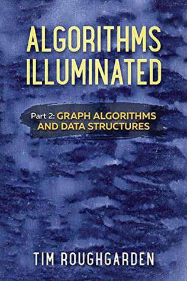

## Algorithms Illuminated

Part 2: Graph Algorithms and Data

Structures

Tim Roughgarden

c 2018 by Tim Roughgarden

All rights reserved. No portion of this book may be reproduced in any form without permission from the publisher, except as permitted by U. S. copyright law.

First Edition

Cover image: Untitled, by Nick Terry

ISBN: 978-0-9992829-2-2 (Paperback)

ISBN: 978-0-9992829-3-9 (ebook)

Library of Congress Control Number: 2017914282

Soundlikeyourself Publishing, LLC

San Francisco, CA

soundlikeyourselfpublishing@gmail.com

[www.algorithmsilluminated.org](http://www.algorithmsilluminated.org)

In memory of James Wesley Shean

(1921–2010)

## Contents

Preface vii

7 Graphs: The Basics 1

7.1 Some Vocabulary 1

7.2 A Few Applications 2

7.3 Measuring the Size of a Graph 3

7.4 Representing a Graph 7

Problems 13

8 Graph Search and Its Applications 15

8.1 Overview 15

8.2 Breadth-First Search and Shortest Paths 25

8.3 Computing Connected Components 34

8.4 Depth-First Search 40

8.5 Topological Sort 45

\*8.6 Computing Strongly Connected Components 54

8.7 The Structure of the Web 66

Problems 71

9 Dijkstra’s Shortest-Path Algorithm 76

9.1 The Single-Source Shortest Path Problem 76

9.2 Dijkstra’s Algorithm 80

\*9.3 Why Is Dijkstra’s Algorithm Correct? 83

9.4 Implementation and Running Time 89

Problems 91

10 The Heap Data Structure 95

10.1 Data Structures: An Overview 95

10.2 Supported Operations 98

10.3 Applications 101

v vi Contents

10.4 Speeding Up Dijkstra’s Algorithm 106

\*10.5 Implementation Details 112

Problems 123

11 Search Trees 126

11.1 Sorted Arrays 126

11.2 Search Trees: Supported Operations 129

\*11.3 Implementation Details 131

\*11.4 Balanced Search Trees 145

Problems 149

12 Hash Tables and Bloom Filters 151

12.1 Supported Operations 151

12.2 Applications 154

\*12.3 Implementation: High-Level Ideas 159

\*12.4 Further Implementation Details 173

12.5 Bloom Filters: The Basics 178

\*12.6 Bloom Filters: Heuristic Analysis 184

Problems 190

C Quick Review of Asymptotic Notation 193

C.1 The Gist 193

C.2 Big-O Notation 194

C.3 Examples 195

C.4 Big-Omega and Big-Theta Notation 197

Solutions to Selected Problems 200

Index 203