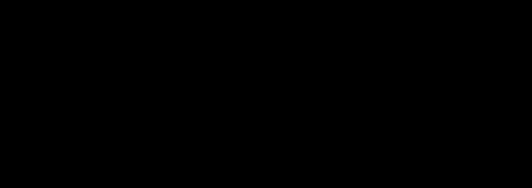

## Chapter 8

 

Graph Search and Its Applications

 

This chapter is all about fundamental primitives for graph search and their applications. One very cool aspect of this material is that all the algorithms that we’ll cover are blazingly fast (linear time with small constants), and it can be quite tricky to understand why they work! The culmination of this chapter—computing the strongly connected components of a directed graph with only two passes of depth-first

search (Section 8.6)—vividly illustrates how fast algorithms often require deep insight into the problem structure.

We begin with an overview section (Section 8.1), which covers some

reasons why you should care about graph search, a general strategy for searching a graph without doing any redundant work, and a high-level introduction to the two most important search strategies, breadth-

first search (BFS) and depth-first search (DFS). Sections 8.2 and 8.3 describe BFS in more detail, including applications to computing shortest paths and the connected components of an undirected graph.

Sections 8.4 and 8.5 drill down on DFS and how to use it to compute a topological ordering of a directed acyclic graph (equivalently, to

sequence tasks while respecting precedence constraints). Section 8.6 uses DFS to compute the strongly connected components of a directed

graph in linear time. Section 8.7 explains how this fast graph primitive can be used to explore the structure of the Web.

 

8.1 Overview

This section provides a bird’s-eye view of algorithms for graph search and their applications.

8.1.1 Some Applications

Why would we want to search a graph, or to figure out if a graph contains a path from point A to point B? Here are a few of the many,

15

16 Graph Search and Its Applications

 

many reasons.

Checking connectivity. In a physical network, such as a road network or a network of computers, an important sanity check is that you can get anywhere from anywhere else. That is, for every choice of a point A and a point B, there should be a path in the network from the former to the latter.

Connectivity can also be important in abstract (non-physical) graphs that represent pairwise relationships between objects. One network that’s fun to play with is the movie network, where vertices correspond to movie actors, and two actors are connected by an

undirected edge whenever they appeared in the same movie. 1 For example, how many “degrees of separation” are there between different actors? The most famous statistic of this type is the Bacon number, which is the minimum number of hops through the movie network

needed to reach the fairly ubiquitous actor Kevin Bacon. 2 So, Kevin Bacon himself has a Bacon number of 0, every actor who has appeared in a movie with Kevin Bacon has a Bacon number of 1, every actor who has appeared with an actor whose Bacon number is 1 but who is not Kevin Bacon himself has a Bacon number of 2, and so on. For example, Jon Hamm—perhaps best known as Don Draper from the cable television series Mad Men—has a Bacon number of 2. Hamm never appeared in a movie with Bacon, but he did have a bit part in the Colin Firth vehicle A Single Man, and Firth and Bacon co-starred

in Atom Egoyan’s 3 Where the Truth Lies (Figure 8.1).

 

Jon *A Single Man* *Where the* Colin Kevin

Hamm Firth Bacon *Truth Lies*

 

Figure 8.1: A snippet of the movie network, showing that Jon Hamm’s Bacon number is at most 2.

[1 https://oracleofbacon.org/](https://oracleofbacon.org/)

2 The Bacon number is a riff on the older concept of the Erdös number, named after the famous mathematician Paul Erdös, which measures the number of degrees of separation from Erdös in the co-authorship graph (where vertices are researchers, and there is an edge between each pair of researchers who have co-authored a

paper). 3 There are also lots of other two-hop paths between Bacon and Hamm. 8.1 Overview 17

 

Shortest paths. The Bacon number concerns the shortest path between two vertices of the movie network, meaning the path using

the fewest number of edges. We’ll see in Section 8.2 that a graph search strategy known as breadth-first search naturally computes shortest paths. Plenty of other problems boil down to a shortest-path computation, where the definition of “short” depends on the application (minimizing time for driving directions, or money for airline tickets, and so on). Dijkstra’s shortest-path algorithm, the

subject of Chapter 9, builds on breadth-first search to solve more general shortest-path problems.

Planning. A path in a graph need not represent a physical path through a physical network. More abstractly, a path is a sequence of decisions taking you from one state to another. Graph search algorithms can be applied to such abstract graphs to compute a plan for reaching a goal state from an initial state. For example, imagine you want to use an algorithm to solve a Sudoku puzzle. Think of the graph where vertices correspond to partially completed Sudoku puzzles (with some of the 81 squares blank, but no rules of Sudoku violated), and directed edges correspond to filling in one new entry of the puzzle (subject to the rules of Sudoku). The problem of computing a solution to the puzzle is exactly the problem of computing a directed path from the vertex corresponding to the initial state of the puzzle

to the vertex corresponding to the completed puzzle.4 For another example, using a robotic hand to grasp a coffee mug is essentially a planning problem. In the associated graph, vertices correspond to the possible configurations of the hand, and edges correspond to small and realizable changes in the configuration.

Connected components. We’ll also see algorithms that build on graph search to compute the connected components (the “pieces”) of a graph. Defining and computing the connected components of

an undirected graph is relatively easy (Section 8.3). For directed graphs, even defining what a “connected component” should mean

is a little subtle. Section 8.6 defines them and shows how to use

depth-first search (Section 8.4) to compute them efficiently. We’ll also

4 Because this graph is too big to write down explicitly, practical Sudoku

solvers incorporate some additional ideas.

18 Graph Search and Its Applications

 

see applications of depth-first search to sequencing tasks (Section 8.5)

and to understanding the structure of the Web graph (Section 8.7).

8.1.2 For-Free Graph Primitives

The examples in Section 8.1.1 demonstrate that graph search is a fundamental and widely applicable primitive. I’m happy to report that, in this chapter, all our algorithms will be blazingly fast, running in just O(m + n) time, where m and n denote the number of edges

and vertices of the graph. 5 That’s just a constant factor larger than

the amount of time required to read the input\!6 We conclude that these algorithms are “for-free primitives”—whenever you have graph data, you should feel free to apply any of these primitives to glean

information about what it looks like.7

For-Free Primitives

We can think of an algorithm with linear or near-linear

running time as a primitive that we can use essentially

“for free” because the amount of computation used is

barely more than the amount required just to read

the input. When you have a primitive relevant to

your problem that is so blazingly fast, why not use it?

For example, you can always compute the connected

components of your graph data in a preprocessing step,

even if you’re not quite sure how it will help later.

One of the goals of this book series is to stock your

algorithmic toolbox with as many for-free primitives

as possible, ready to be applied at will.

 

8.1.3 Generic Graph Search

The point of a graph search algorithm is to solve the following prob-lem.

5 Also, the constants hidden in the big-O notation are reasonably small.

6 In graph search and connectivity problems, there is no reason to expect that the input graph is connected. In the disconnected case, where m might be much smaller than n, the size of a graph is ⇥(m + n) but not necessarily ⇥(m).

7 Can we do better? No, up to the hidden constant factor: every correct algorithm must at least read the entire input in some cases.

8.1 Overview 19

 

Problem: Graph Search

Input: An undirected or directed graph G = (V, E), and a starting vertex s 2 V .

Goal: Identify the vertices of V reachable from s in G.

 

By a vertex v being “reachable,” we mean that there is a sequence of edges in G that travels from s to v. If G is a directed graph, all the path’s edges should be traversed in the forward (outgoing) direction.

For example, in Figure 8.2(a), the set of reachable vertices (from s)

is {s, u, v, w}. In the directed version of the graph in Figure 8.2(b), there is no directed path from s to w, and only the vertices s, u, and v

are reachable from s 8 via a directed path.

 

*u* *u*

*x* *y* *x* *y*

*s* *w* *s* *w*

*z* *z*

*v* *v*

(a) An undirected graph (b) A directed version

Figure 8.2: In (a), the set of vertices reachable from s is {s, u, v, w}. In (b), it is {s, u, v}.

 

The two graph search strategies that we’ll focus on—breadth-first

search and depth-first search—are different ways of instantiating a generic graph search algorithm. The generic algorithm systematically finds all the reachable vertices, taking care to avoid exploring anything twice. It maintains an extra variable with each vertex that keeps track of whether or not it has already been explored, planting a flag the first time that vertex is reached. The main loop’s responsibility is to reach a new unexplored vertex in each iteration.

 

8 In general, most of the algorithms and arguments in this chapter apply

equally well to undirected and directed graphs. The big exception is computing connected components, which is a trickier problem in directed graphs than in undirected graphs.

20 Graph Search and Its Applications

 

GenericSearch

Input: graph G = (V, E) and a vertex s 2 V . Postcondition: a vertex is reachable from s if and

only if it is marked as “explored.”

mark s as explored, all other vertices as unexplored while there is an edge (v, w) 2 E with v explored and

w unexplored do

choose some such edge (v, w) // underspecified mark w as explored

 

The algorithm is essentially the same for both directed and undirected graphs. In the directed case, the edge (v, w) chosen in an iteration of the while loop should be directed from an explored vertex v to an unexplored vertex w.

On Pseudocode

This book series explains algorithms using a mixture

of high-level pseudocode and English (as above). I’m

assuming that you have the skills to translate such

high-level descriptions into working code in your fa-

vorite programming language. Several other books

and resources on the Web offer concrete implementa-tions of various algorithms in specific programming

languages.

The first benefit of emphasizing high-level descrip-

tions over language-specific implementations is flexi-

bility. While I assume familiarity with some program-ming language, I don’t care which one. Second, this

approach promotes the understanding of algorithms

at a deep and conceptual level, unencumbered by low-

level details. Seasoned programmers and computer

scientists generally think and communicate about al-

gorithms at a similarly high level.

Still, there is no substitute for the detailed under-

standing of an algorithm that comes from providing 8.1 Overview 21

 

your own working implementation of it. I strongly

encourage you to implement as many of the algo-

rithms in this book as you have time for. (It’s also a

great excuse to pick up a new programming language!)

For guidance, see the end-of-chapter Programming

Problems and supporting test cases.

 

For example, in the graph in Figure 8.2(a), initially only our home

base s is marked as explored. In the first iteration of the while loop, two edges meet the loop condition: (s, u) and (s, v). The GenericSearch algorithm chooses one of these edges—(s, u), say—and marks u as explored. In the second iteration of the loop, there are again two choices: (s, v) and (u, w). The algorithm might choose (u, w), in which case w is marked as explored. With one more iteration (after choosing either (s, v) or (w, v)), v is marked as explored. At this point, the edge (x, y) has two unexplored endpoints and the other edges have two explored endpoints, and the algorithm halts. As one would hope, the vertices marked as explored—s, u, v, and w—are precisely the vertices reachable from s.

This generic graph search algorithm is underspecified, as multiple

edges (v, w) can be eligible for selection in an iteration of the while loop. Breadth-first search and depth-first search correspond to two specific decisions about which edge to explore next. No matter how this choice is made, the GenericSearch algorithm is guaranteed to be correct (in both undirected and directed graphs).

Proposition 8.1 (Correctness of Generic Graph Search) At the conclusion of the GenericSearch algorithm, a vertex v 2 V is marked as explored if and only if there is a path from s to v in G.

Section 8.1.5 provides a formal proof of Proposition 8.1; feel free to skip it if the proposition seems intuitively obvious.

On Lemmas, Theorems, and the Like

In mathematical writing, the most important tech-

nical statements are labeled theorems. A lemma is a technical statement that assists with the proof of

a theorem (much as a subroutine assists with the 22 Graph Search and Its Applications

 

implementation of a larger program). A corollary is a statement that follows immediately from an already-

proved result, such as a special case of a theorem.

We use the term proposition for stand-alone techni-cal statements that are not particularly important in

their own right.

 

What about the running time of the GenericSearch algorithm? The algorithm explores each edge at most once—after an edge (v, w) has been explored for the first time, both v and w are marked as explored and the edge will not be considered again. This suggests that it should be possible to implement the algorithm in linear time, as long as we can quickly identify an eligible edge (v, w) in each iteration of the while loop. We’ll see how this works in detail for breadth-first

search and depth-first search in Sections 8.2 and 8.4, respectively.

8.1.4 Breadth-First and Depth-First Search

Every iteration of the GenericSearch algorithm chooses an edge that is “on the frontier” of the explored part of the graph, with one endpoint

explored and the other unexplored (Figure 8.3). There can be many such edges, and to specify the algorithm fully we need a method for choosing one of them. We’ll focus on the two most important strategies: breadth-first search and depth-first search. Both are excellent ways to explore a graph, and each has its own set of applications.

Breadth-first search (BFS). The high-level idea of breadth-first search—or BFS to its friends—is to explore the vertices of a graph cautiously, in “layers.” Layer 0 consists only of the starting vertex s. Layer 1 contains the vertices that neighbor s, meaning the vertices v such that (s, v) is an edge of the graph (directed from s to v, in the case that G is directed). Layer 2 comprises the neighbors of layer-1 vertices that do not already belong to layer 0 or 1, and so on. In

Sections 8.2 and 8.3, we’ll see:

• how to implement BFS in linear time using a queue (first-in

first-out) data structure;

• how to use BFS to compute (in linear time) the length of a

shortest path between one vertex and all other vertices, with the 8.1 Overview 23

 

explored unexplored

 

*s*

 

the frontier

Figure 8.3: Every iteration of the GenericSearch algorithm chooses an edge “on the frontier,” with one endpoint explored and the other unexplored.

 

layer-i vertices being precisely the vertices at distance i from s;

• how to use BFS to compute (in linear time) the connected

components of an undirected graph.

 

Depth-first search (DFS). Depth-first search—DFS to its friends—is perhaps even more important. DFS employs a more aggressive strategy for exploring a graph, very much in the spirit of how you might explore a maze, going as deeply as you can and

backtracking only when absolutely necessary. In Sections 8.4–8.7, we’ll see:

• how to implement DFS in linear time using either recursion or

an explicit stack (last-in first-out) data structure;

• how to use DFS to compute (in linear time) a topological order-

ing of the vertices of a directed acyclic graph, a useful primitive for task sequencing problems;

• how to use DFS to compute (in linear time) the “strongly con-

nected components” of a directed graph, with applications to understanding the structure of the Web.

24 Graph Search and Its Applications

 

8.1.5 Correctness of the GenericSearch Algorithm

We now prove Proposition 8.1, which states that at the conclusion of the GenericSearch algorithm with input graph G = (V, E) and starting vertex s 2 V , a vertex v 2 V is marked as explored if and only if there is a path from s to v in G. As usual, if G is a directed graph, the s ; v path should also be directed, with all edges traversed in the forward direction.

The “only if” direction of the proposition should be intuitively clear: The only way that the GenericSearch algorithm discovers new

vertices is by following paths from s 9 .

The “if” direction asserts the less obvious fact that the GenericSearch algorithm doesn’t miss anything—it finds every vertex that it could conceivably discover. For this direction, we’ll use a proof by contradiction. Recall that in this type of proof, you assume the opposite of what you want to prove, and then build on this assumption with a sequence of logically correct steps that culminates in a patently false statement. Such a contradiction implies that the assumption can’t be true, which proves the desired statement.

So, assume that there is a path from s to v in the graph G, but the GenericSearch algorithm somehow misses it and concludes with the vertex v marked as unexplored. Let S ✓ V denote the vertices of G marked as explored by the algorithm. The vertex s belongs to S (by the first line of the algorithm), and the vertex v does not (by assumption). Because the s ; v path travels from a vertex inside S to one outside S, at least one edge e of the path has one endpoint u in S and the other w outside S (with e directed from u to w in the case

that G is directed); see Figure 8.4. But this, my friends, is impossible: The edge e would be eligible for selection in the while loop of the GenericSearch algorithm, and the algorithm would have explored at least one more vertex, rather than giving up! There’s no way that the GenericSearch algorithm could have halted at this point, so we’ve reached a contradiction. This contradiction concludes the proof of

Proposition 8.1. QE D 10

9 If we wanted to be pedantic about it, we’d prove this direction by induction

on the number of loop iterations. 10 “Q.e.d.” is an abbreviation for quod erat demonstrandum, and means “that which was to be demonstrated.” In mathematical writing, it is used at the end of a proof to mark its completion.

8.2 Breadth-First Search and Shortest Paths 25

eligible for exploration!

*w*

### *v* 

*e*

*s* *u*

 

S = explored vertices

Figure 8.4: Proof of Proposition 8.1. As long as the GenericSearch algorithm has not yet discovered all the reachable vertices, there is an eligible edge along which it can explore further.

 

8.2 Breadth-First Search and Shortest Paths

Let’s drill down on our first specific graph search strategy, breadth-first search.

8.2.1 High-Level Idea

Breadth-first search explores the vertices of a graph in layers, in order of increasing distance from the starting vertex. Layer 0 contains the starting vertex s and nothing else. Layer 1 is the set of vertices that are one hop away from s—that is, s’s neighbors. These are the vertices that are explored immediately after s in breadth-first search. For

example, in the graph in Figure 8.5, a and b are the neighbors of s and constitute layer 1. In general, the vertices in a layer i are those that neighbor a vertex in layer i 1 and that do not already belong to one of the layers 0, 1, 2, . . . , i 1. Breadth-first search explores all of layer-i vertices immediately after completing its exploration of layer-(i 1) vertices. (Vertices not reachable from s do not belong

to any layer.) For example, in Figure 8.5, the layer-2 vertices are c and d, as they neighbor layer-1 vertices but do not themselves belong to layer 0 or 1. (The vertex s is also a neighbor of a layer-1 vertex, but it already belongs to layer 0.) The last layer of the graph in

Figure 8.5 comprises only the vertex e.

26 Graph Search and Its Applications

 

*a* *e* layer 3

 

*s* *c*

 

*b* *d*

layer 0

layer 2

layer 1

Figure 8.5: Breadth-first search discovers vertices in layers. The layer-i vertices are the neighbors of the layer-(i 1) vertices that do not appear in any earlier layer.

 

Quiz 8.1

Consider an undirected graph with n 2 vertices. What are the minimum and maximum number of different layers that the graph could have, respectively?

a\) 1 and n 1

b\) 2 and n 1

c\) 1 and n

d\) 2 and n

(See Section 8.2.6 for the solution and discussion.)

 

8.2.2 Pseudocode for BFS

Implementing breadth-first search in linear time requires a simple “first-in first-out” data structure known as a queue. BFS uses a queue to keep track of which vertices to explore next. If you’re unfamiliar with queues, now is a good time to read up on them in your favorite introductory programming book (or on Wikipedia). The gist is that 8.2 Breadth-First Search and Shortest Paths 27

 

a queue is a data structure for maintaining a list of objects, and you can remove stuff from the front or add stuff to the back in constant

time.11

BFS

Input: graph G = (V, E) in adjacency-list

representation, and a vertex s 2 V .

Postcondition: a vertex is reachable from s if and

only if it is marked as “explored.”

1 mark s as explored, all other vertices as unexplored 2 Q := a queue data structure, initialized with s 3 while Q is not empty do 4 remove the vertex from the front of Q, call it v 5 for each edge (v, w) in v’s adjacency list do 6 if w is unexplored then 7 mark w as explored 8 add w to the end of Q

 

Each iteration of the while loop explores one new vertex. In

line 5, BFS iterates through all the edges incident to the vertex v (if G is undirected) or through all the outgoing edges from v (if G is

directed).12 v Unexplored neighbors of are added to the end of the queue and are marked as explored; they will eventually be processed in later iterations of the algorithm.

8.2.3 An Example

Let’s see how our pseudocode works for the graph in Figure 8.5, num-bering the vertices in order of insertion into the queue (equivalently, in order of exploration). The starting vertex s is always the first to

11 You may never need to implement a queue from scratch, as they are built in to most modern programming languages. If you do, you can use a doubly linked list. Or, if you have advance knowledge of the maximum number of objects that you might have to store (which is \|V \|, in the case of BFS), you can get away with a fixed-length array and a couple of indices (which keep track of the front and back of the queue).

12 This is the step where it’s so convenient to have the input graph represented via adjacency lists.

28 Graph Search and Its Applications

 

be explored. The first iteration of the while loop extracts s from the queue Q and the subsequent for loop examines the edges (s, a) and (s, b), in whatever order these edges appear in s’s adjacency list. Because neither a nor b is marked as explored, both get inserted into the queue. Let’s say that edge (s, a) came first and so a is inserted before b. The current state of the graph and the queue is now:

the frontier

\#2

*a* *e*

\#1

front of queue already removed

*s* *c*

 

*b* *b a s* *d*

\#3 state of the queue Q

 

The next iteration of the while loop extracts the vertex a from the front of the queue, and considers its incident edges (s, a) and (a, c). It skips over the former after double-checking that s is already marked as explored, and adds the (previously unexplored) vertex c to the end of the queue. The third iteration extracts the vertex b from the front of the queue and adds vertex d to the end (because s and c are already marked as explored, they are skipped over). The new picture is:

the frontier

\#2

*a* *e*

\#1 \#4

front of queue already removed

*s* *c*

*b* *d* *c* *b a s*

*d*

\#3 \#5 state of the queue Q

In the fourth iteration, the vertex c is removed from the front of the queue. Of its neighbors, the vertex e is the only one not encountered 8.2 Breadth-First Search and Shortest Paths 29

 

before, and it is added to the end of the queue. The final two iterations extract d and then e from the queue, and verify that all of their neighbors have already been explored. The queue is then empty, and the algorithm halts. The vertices are explored in order of the layers, with the layer-i vertices explored immediately after the

layer-(i 1) vertices (Figure 8.6).

 

\#2 *a* *e* \#6 layer 3

*a* *e*

\#1 *s* *c* \#4

*s* *c*

*b* *d*

layer 0

*b* *d* layer 2

\#3 layer 1 \#5

(a) Order of exploration (b) Layers

Figure 8.6: In breadth-first search, the layer-i vertices are explored imme-diately after the layer-(i 1) vertices.

 

8.2.4 Correctness and Running Time

Breadth-first search discovers all the vertices reachable from the starting vertex, and it runs in linear time. The more refined running

time bound in Theorem 8.2(c) below will come in handy for our linear-time algorithm for computing connected components (described

in Section 8.3).

Theorem 8.2 (Properties of BFS) For every undirected or di-rected graph G = (V, E) in adjacency-list representation and for every starting vertex s 2 V :

\(a\) At the conclusion of BFS, a vertex v 2 V is marked as explored

if and only if there is a path from s to v in G.

\(b\) The running time of BFS is O(m + n), where m = \|E\| and

n = \|V \| .

30 Graph Search and Its Applications

 

\(c\) The running time of lines 2–8 of BFS is

O(m s + ns),

where ms and ns denote the number of edges and vertices, re-spectively, reachable from s in G.

Proof: Part (a) follows from the guarantee in Proposition 8.1 for the generic graph search algorithm GenericSearch, of which BFS is a

special case.13 Part (b) follows from part (c), as the overall running time of BFS is just the running time of lines 2–8 plus the O(n) time needed for the initialization in line 1.

We can prove part (c) by inspecting the pseudocode. The ini-tialization in line 2 takes O(1) time. In the main while loop, the algorithm only ever encounters the ns vertices that are reachable from s. Because no vertex is explored twice, each such vertex is added to the end of the queue and removed from the front of the queue exactly once. Each of these operations takes O(1) time—this is the whole point of the first-in first-out queue data structure—and so the total amount of time spent in lines 3–4 and 7–8 is O(ns). Each of the ms edges (v, w) reachable from s is processed in line 5 at most

twice—once when v 14 is explored, and once when w is explored. Thus the total amount of time spent in lines 5–6 is O(ms), and the overall running time for lines 2–8 is O(ms + ns). QE D

 

8.2.5 Shortest Paths

The properties in Theorem 8.2 are not unique to breadth-first search— for example, they also hold for depth-first search. What is unique about BFS is that, with just a couple extra lines of code, it efficiently computes shortest-path distances.

13 Formally, BFS is equivalent to the version of GenericSearch where, in every

iteration of the latter’s while loop, the algorithm chooses the eligible edge (v, w) for which v was discovered the earliest, breaking ties among v’s eligible edges according to their order in v’s adjacency list. If that sounds too complicated, you

can alternatively check that the proof of Proposition 8.1 holds verbatim also for breadth-first search. Intuitively, breadth-first search discovers vertices only by exploring paths from s; as long as it hasn’t explored every vertex on a path, the “next vertex” on the path is still in the queue awaiting future exploration.

14 If G is a directed graph, each edge is processed at most once, when its tail

vertex is explored.

8.2 Breadth-First Search and Shortest Paths 31

 

Problem Definition

In a graph G, we use the notation dist(v, w) for the fewest number of edges in a path from v to w (or +1, if G contains no path from v

to 15 w ).

 

Problem: Shortest Paths (Unit Edge Lengths)

Input: An undirected or directed graph G = (V, E), and a starting vertex s 2 V .

Output: 16 dist ( s, v ) for every vertex v 2 V .

 

For example, if G is the movie network and s is the vertex corre-sponding to Kevin Bacon, the problem of computing shortest paths is precisely the problem of computing everyone’s Bacon number (Sec-

tion 8.1.1). The basic graph search problem (Section 8.1.3) cor-responds to the special case of identifying all the vertices v with dist(s, v) 6= +1.

 

Pseudocode

To compute shortest paths, we add two lines to the basic BFS algorithm (lines 2 and 9 below); these increase the algorithm’s running time by a small constant factor. The first one initializes preliminary estimates of vertices’ shortest-path distances—0 for s, and +1 for the other vertices, which might not even be reachable from s. The second one executes whenever a vertex w is discovered for the first time, and computes w’s final shortest-path distance as one more than that of the vertex v that triggered w’s discovery.

 

15 As usual, if G is directed, all the edges of the path should be traversed in the forward direction.

16 The phrase “unit edge lengths” in the problem statement refers to the as-

sumption that each edge of G contributes 1 to the length of a path. Chapter 9 generalizes BFS to compute shortest paths in graphs in which each edge has its own nonnegative length.

32 Graph Search and Its Applications

 

Augmented-BFS

Input: graph G = (V, E) in adjacency-list

representation, and a vertex s 2 V .

Postcondition: for every vertex v 2 V , the value l(v)

equals the true shortest-path distance dist(s, v).

1 mark s as explored, all other vertices as unexplored 2 l(s) := 0, l(v) := + 1 for every v 6= s 3 Q := a queue data structure, initialized with s 4 while Q is not empty do 5 remove the vertex from the front of Q, call it v 6 for each edge (v, w) in v’s adjacency list do 7 if w is unexplored then 8 mark w as explored 9 l(w) := l(v) + 1

10 add w to the end of Q

 

Example and Analysis

In our running example (Figure 8.6), the first iteration of the while loop discovers the vertices a and b. Because s triggered their discovery and l(s) = 0, the algorithm reassigns l(a) and l(b) from +1 to 1:

the frontier

*l*(*a*)=1 *l*(*e*)=+∞

*a* *e*

*l*(*s*)=0

front of queue already removed

*s* *c* *l*(*c*)=+∞

*b* *b a s*

*d*

*l* *l*(*d*)=+∞ ( *b* )=1 state of the queue Q

 

The second iteration of the while loop processes the vertex a, leading to c’s discovery. The algorithm reassigns l(c) from +1 to l(a) + 1, which is 2. Similarly, in the third iteration, l(d) is set to l(b) + 1, which is also 2:

8.2 Breadth-First Search and Shortest Paths 33

the frontier

*l*(*a*)=1 *l*(*e*)=+∞

*a* *e*

*l*(*s*)=0

front of queue already removed

*s* *c* *l*(*c*)=2

*b* *d* *c* *b a s*

*d*

*l* *l*(*d*)=2 ( *b* )=1 state of the queue Q

The fourth iteration discovers the final vertex e via the vertex c, and sets l(e) to l(c) + 1, which is 3. At this point, for every vertex v, l(v) equals the true shortest-path distance dist(s, v), which also equals

the number of the layer that contains v (Figure 8.6). These properties hold in general, and not just for this example.

Theorem 8.3 (Properties of Augmented-BFS) For every undi-rected or directed graph G = (V, E) in adjacency-list representation and for every starting vertex s 2 V :

\(a\) At the conclusion of Augmented-BFS, for every vertex v 2 V ,

the value of l(v) equals the length dist(s, v) of a shortest path from s to v in G (or +1, if no such path exists).

\(b\) The running time of Augmented-BFS is O(m+n), where m = \|E\|

and n = \|V \|.

Because the asymptotic running time of the Augmented-BFS al-

gorithm is the same as that of BFS, part (b) of Theorem 8.3 follows

from the latter’s running time guarantee (Theorem 8.2(b)). Part (a) follows from two observations. First, the vertices v with dist(s, v) = i are precisely the vertices in the ith layer of the graph—this is why we defined layers the way we did. Second, for every layer-i vertex w, Augmented-BFS eventually sets l(w) = i (since w is discovered via a layer-(i 1) vertex v with l(v) = i 1). For vertices not in any layer—

that is, not reachable from 17 s —both dist ( s, v ) and l ( v ) are + 1 .

 

17 If you’re hungry for a more rigorous proof, then proceed—in the privacy of your own home—by induction on the number of while loop iterations performed

by the Augmented-BFS algorithm. Alternatively, Theorem 8.3(a) is a special case

of the correctness of Dijkstra’s shortest-path algorithm, as proved in Section 9.3. 34 Graph Search and Its Applications

 

8.2.6 Solution to Quiz 8.1

Correct answer: (d). An undirected graph with n 2 vertices has at least two layers and at most n layers. When n 2, there cannot be fewer than two layers because s is the only vertex in layer 0. Complete

graphs have only two layers (Figure 8.7(a)). There cannot be more than n layers, as layers are disjoint and contain at least one vertex

each. Path graphs have n layers (Figure 8.7(b)).

 

*s*

*s*

 

layer 0 layer 1 layer 1 layer 3 layer 0 layer 2

(a) A complete graph (b) A path graph

Figure 8.7: An n-vertex graph can have anywhere from two to n different layers.

 

8.3 Computing Connected Components

In this section, G = (V, E) will always denote an undirected graph. We postpone the more difficult connectivity problems in directed graphs

until Section 8.6.

8.3.1 Connected Components

An undirected graph G = (V, E) naturally falls into “pieces,” which are

called connected components (Figure 8.8). More formally, a connected component is a maximal subset S ✓ V of vertices such that there is a

path from any vertex in 18 S to any other vertex in S . For example,

18 Still more formally, the connected components of a graph can be defined as

the equivalence classes of a suitable equivalence relation. Equivalence relations are usually covered in a first course on proofs or on discrete mathematics. A 8.3 Computing Connected Components 35

 

the connected components of the graph in Figure 8.8 are {1, 3, 5, 7, 9}, {2, 4} , and {6, 8, 10}.

1 3

6

5 2 4

8 10

7 9

 

Figure 8.8: A graph with vertex set {1, 2, 3, . . . , 10} and three connected components.

 

The goal of this section is to use breadth-first search to compute

the connected components of a graph in linear time.19

Problem: Undirected Connected Components

Input: An undirected graph G = (V, E).

Goal: Identify the connected components of G.

 

Next, let’s double-check your understanding of the definition of

connected components.

relation on a set X of objects specifies, for each pair x, y 2 X of objects, whether or not x and y are related. (If so, we write x ⇠ y.) For connected components, the relevant relation (on the set V ) is “ v ⇠G w if and only if there is a path between v and w in G.” An equivalence relation satisfies three properties. First, it is reflexive, meaning that x ⇠ x for every x 2 X . (Satisfied by ⇠G, as the empty path connects a vertex with itself.) Second, it is symmetric, with x ⇠ y if and only if y ⇠ x. (Satisfied by ⇠G, as G is undirected.) Finally, it is transitive, meaning that x ⇠ y and y ⇠ z implies that x ⇠ z. (Satisfied by ⇠G, as you can paste together a path between vertices u and v with a path between vertices v and w to get a path between u and w.) An equivalence relation partitions the set of objects into equivalence classes, with each object related to all the objects in its class, and only to these. The equivalence classes of the relation ⇠G are the connected components of G.

19 Other graph search algorithms, including depth-first search, can be used to compute connected components in exactly the same way.

36 Graph Search and Its Applications

 

Quiz 8.2

Consider an undirected graph with n vertices and m edges. What are the minimum and maximum number of connected components that the graph could have, respectively?

a\) 1 and n 1

b\) 1 and n

c\) 1 and max {m, n}

d\) 2 and max {m, n}

(See Section 8.3.6 for the solution and discussion.)

 

8.3.2 Applications

There are several reasons why you might be interested in the connected components of a graph.

Detecting network failures. One obvious application is checking whether or not a network, such as a road or communication network, has become disconnected.

Data visualization. Another application is in graph visualization—

if you’re trying to draw or otherwise visualize a graph, presumably you want to display the different components separately.

Clustering. Suppose you have a collection of objects that you care about, with each pair annotated as either “similar” or “dissimilar.” For example, the objects could be documents (like crawled Web pages or news stories), with similar objects corresponding to near-duplicate documents (perhaps differing only in a timestamp or a headline). Or the objects could be genomes, with two genomes deemed similar if a small number of mutations can transform one into the other.

Now form an undirected graph G = (V, E), with vertices corre-sponding to objects and edges corresponding to pairs of similar objects. Intuitively, each connected component of this graph represents a set of objects that share much in common. For example, if the objects are crawled news stories, one might expect the vertices of a connected component to be variations on the same story reported on different 8.3 Computing Connected Components 37

 

Web sites. If the objects are genomes, a connected component might correspond to different individuals belonging to the same species.

 

8.3.3 The UCC Algorithm

Computing the connected components of an undirected graph easily reduces to breadth-first search (or other graph search algorithms, such as depth-first search). The idea is to use an outer loop to make a single pass over the vertices, invoking BFS as a subroutine whenever the algorithm encounters a vertex that it has never seen before. This outer loop ensures that the algorithm looks at every vertex at least once. Vertices are initialized as unexplored before the outer loop, and not inside a call to BFS. The algorithm also maintains a field cc(v) for each vertex v, to remember which connected component contains it. By identifying each vertex of V with its position in the vertex array, we can assume that V = {1, 2, 3, . . . , n}.

UCC

Input: undirected graph G = (V, E) in adjacency-list

representation, with V = {1, 2, 3, . . . , n}.

Postcondition: for every u, v 2 V , cc(u) = cc(v) if

and only if u, v are in the same connected component.

mark all vertices as unexplored

numCC := 0

for i := 1 to n do // try all vertices

if i is unexplored then // avoid redundancy

numCC := numCC + 1 // new component // call BFS starting at i (lines 2–8) Q := a queue data structure, initialized with i while Q is not empty do

remove the vertex from the front of Q, call it v cc(v) := numCC for each (v, w) in v’s adjacency list do

if w is unexplored then

mark w as explored add w to the end of Q 38 Graph Search and Its Applications

 

8.3.4 An Example

Let’s trace the UCC algorithm’s execution on the graph in Figure 8.8. The algorithm marks all vertices as unexplored and starts the outer for loop with vertex 1. This vertex has not been seen before, so the algorithm invokes BFS from it. Because BFS finds everything reachable

from its starting vertex (Theorem 8.2(a)), it discovers all the vertices in {1, 3, 5, 7, 9}, and sets their cc-values to 1. One possible order of exploration is:

\#1 \#2

1 3

unexplored

\#3 6 unexplored unexplored 5 2 4

\#4 \#5 8 10 7 unexplored unexplored 9

connected component \#1

Once this call to BFS completes, the algorithm’s outer for loop marches on and considers vertex 2. This vertex was not discovered by the first call to BFS, so BFS is invoked again, this time with vertex 2 as the starting vertex. After discovering vertices 2 and 4 (and setting their cc-values to 2), this call to BFS completes and the UCC algorithm resumes its outer for loop. Has the algorithm seen vertex 3 before? Yup, in the first BFS call. What about vertex 4? Yes again, this time in the second BFS call. Vertex 5? Been there, done that in the first BFS call. But what about vertex 6? Neither of the previous BFS calls discovered this vertex, so BFS is called again with vertex 6 as the starting vertex. This third call to BFS discovers the vertices in {6, 8, 10}, and sets their cc-values to 3:

\#1 \#2

1 3

\#8

\#3 6 \#6 \#7 5 2 4

\#4 connected 8 \#5 10

7 component \#2 \#9 9 \#10

connected component \#1 connected component \#3 8.3 Computing Connected Components 39

 

Finally, the algorithm verifies that the remaining vertices (7, 8, 9, and 10) have already been explored and halts.

8.3.5 Correctness and Running Time

The UCC algorithm correctly computes the connected components of an undirected graph, and does so in linear time.

Theorem 8.4 (Properties of UCC) For every undirected graph G = (V, E) in adjacency-list representation:

\(a\) At the conclusion of UCC, for every pair u, v of vertices, cc(u) =

cc(v) if and only if u and v belong to the same connected com-ponent of G.

\(b\) The running time of UCC is O(m + n), where m = \|E\| and

n = \|V \| .

Proof: For correctness, the first property of breadth-first search (The-

orem 8.2(a)) implies that each call to BFS with a starting vertex i will discover the vertices in i’s connected component and nothing more. The UCC algorithm gives these vertices a common cc-value. Because no vertex is explored twice, each call to BFS identifies a new connected component, with each component having a different cc-value. The outer for loop ensures that every vertex is visited at least once, so the algorithm will discover every connected component.

The running time bound follows from our refined running time

analysis of BFS (Theorem 8.2(c)). Each call to BFS from a vertex i runs in O(mi + ni) time, where mi and ni denote the number of edges and vertices, respectively, in i’s connected component. As BFS is called only once for each connected component, and each vertex

or edge of G participates in exactly one component, the combined P P running time of all the BFS calls is O ( m + ) = O m n i i n + i i ( ) . The initialization and additional bookkeeping performed by the algorithm requires only O(n) time, so the final running time is O(m + n). QE D

 

8.3.6 Solution to Quiz 8.2

Correct answer: (b). A graph with one connected component is one in which you can get from anywhere to anywhere else. Path 40 Graph Search and Its Applications

 

graphs and complete graphs (Figure 8.7) are two examples. At the other extreme, in a graph with no edges, each vertex is in its own connected component, for a total of n. There cannot be more than n connected components, as they are disjoint and each contains at least one vertex.

 

8.4 Depth-First Search

Why do we need another graph search strategy? After all, breadth-first search seems pretty awesome—it finds all the vertices reachable from the starting vertex in linear time, and can even compute shortest-path distances along the way.

There’s another linear-time graph search strategy, depth-first search (DFS), which comes with its own impressive catalog of applica-tions (not already covered by BFS). For example, we’ll see how to use DFS to compute in linear time a topological ordering of the vertices of a directed acyclic graph, as well as the connected components (appropriately defined) of a directed graph.

 

8.4.1 An Example

If breadth-first search is the cautious and tentative exploration strat-egy, depth-first search is its more aggressive cousin, always exploring from the most recently discovered vertex and backtracking only when necessary (like exploring a maze). Before we describe the full pseu-docode for DFS, let’s illustrate how it works on the same running

example used in Section 8.2 (Figure 8.9).

*a* *e*

 

*s* *c*

 

*b* *d*

 

Figure 8.9: Running example for depth-first search. 8.4 Depth-First Search 41

 

Like BFS, DFS marks a vertex as explored the first time it discovers

it. Because it begins its exploration at the starting vertex s, for the

graph in Figure 8.9, the first iteration of DFS examines the edges (s, a) and (s, b), in whatever order these edges appear in s’s adjacency list. Let’s say (s, a) comes first, leading DFS to discover the vertex a and mark it as explored. The second iteration of DFS is where it diverges from BFS—rather than considering next s’s other layer-1 neighbor b, DFS immediately proceeds to exploring the neighbors of a. (It will eventually get back to exploring (s, b).) Perhaps from a it checks s first (which is already marked as explored) and then discovers the vertex c, which is where it travels next:

the frontier

\#2

*a* *e*

\#1 \#3 *s* *c*

 

*b* *d*

 

Then DFS examines in some order the neighbors of c, the most recently discovered vertex. To keep things interesting, let’s say that DFS discovers d next, followed by e:

\#2 \#5

*a* *e*

\#1 \#3

need to

*s* *c* backtrack

from here

*b* *d* \#4

the frontier

 

From e, DFS has nowhere to go—both of e’s neighbors are already marked as explored. DFS is forced to retreat to the previous vertex, namely d, and resume exploring the rest of its neighbors. From d, DFS will discover the final vertex b (perhaps after checking c and finding it marked as explored). Once at b, the dominoes fall quickly. DFS 42 Graph Search and Its Applications

 

discovers that all of b’s neighbors have already been explored, and must backtrack to the previously visited vertex, which is d. Similarly, because all of d’s remaining neighbors are already marked as explored, DFS must rewind further, to c. DFS then retreats further to a (after checking that all of c’s remaining neighbors are marked as explored), then to s. It finally stops once it checks s’s remaining neighbor (which is b) and finds it marked as explored.

 

8.4.2 Pseudocode for DFS

Iterative Implementation

One way to think about and implement DFS is to start from the code for BFS and make two changes: (i) swap in a stack data structure (which is last-in first-out) for the queue (which is first-in first-out); and (ii) postpone checking whether a vertex has already been explored

until after removing it from the data structure.20,21

DFS (Iterative Version)

Input: graph G = (V, E) in adjacency-list

representation, and a vertex s 2 V .

Postcondition: a vertex is reachable from s if and

only if it is marked as “explored.”

mark all vertices as unexplored

S := a stack data structure, initialized with s while S is not empty do

remove (“pop”) the vertex v from the front of S if v is unexplored then

mark v as explored for each edge (v, w) in v’s adjacency list do

add (“push”) w to the front of S

 

20 A stack is a “last-in first-out” data structure—like those stacks of upside-down

trays at a cafeteria—that is typically studied in a first programming course (along

with queues, see footnote 11). A stack maintains a list of objects, and you can add an object to the beginning of the list (a “push”) or remove one from the beginning

of the list (a “pop”) in constant time. 21 Would the algorithm behave the same if we made only the first change? 8.4 Depth-First Search 43

 

As usual, the edges processed in the for loop are the edges incident to v (if G is an undirected graph) or the edges outgoing from v (if G is a directed graph).

For example, in the graph in Figure 8.9, the first iteration of DFS’s

while loop pops the vertex s and pushes its two neighbors onto the stack in some order, say, with b first and a second. Because a was the last to be pushed, it is the first to be popped, in the second iteration of the while loop. This causes s and c to be pushed onto the stack, let’s say with c first. The vertex s is popped in the next iteration; since it has already been marked as explored, the algorithm skips it. Then c is popped, and all of its neighbors (a, b, d, and e) are pushed onto the stack, joining the first occurrence of b. If d is pushed last, and also b is pushed before e when d is popped in the next iteration,

then we recover the order of exploration from Section 8.4.1 (as you should check).

Recursive Implementation

Depth-first search also has an elegant recursive implementation.22

DFS (Recursive Version)

Input: graph G = (V, E) in adjacency-list

representation, and a vertex s 2 V .

Postcondition: a vertex is reachable from s if and

only if it is marked as “explored.”

// all vertices unexplored before outer call

mark s as explored

for each edge (s, v) in s’s adjacency list do

if v is unexplored then

DFS (G, v)

 

In this implementation, all recursive calls to DFS have access to the same set of global variables which track the vertices that have been marked as explored (with all vertices initially unexplored). The aggres-sive nature of DFS is perhaps more obvious in this implementation—the

22 I’m assuming you’ve heard of recursion as part of your programming back-ground. A recursive procedure is one that invokes itself as a subroutine.

44 Graph Search and Its Applications

 

algorithm immediately recurses on the first unexplored neighbor that

it finds, before considering the remaining neighbors. 23 In effect, the explicit stack data structure in the iterative implementation of DFS is being simulated by the program stack of recursive calls in the recursive

implementation.24

8.4.3 Correctness and Running Time

Depth-first search is just as correct and just as blazingly fast as

breadth-first search, for the same reasons (cf., Theorem 8.2).25

Theorem 8.5 (Properties of DFS) For every undirected or di-rected graph G = (V, E) in adjacency-list representation and for every starting vertex s 2 V :

\(a\) At the conclusion of DFS, a vertex v 2 V is marked as explored

if and only if there is a path from s to v in G.

\(b\) The running time of DFS is O(m + n), where m = \|E\| and

n = \|V \| .

Part (a) holds because depth-first search is a special case of the generic

graph search algorithm 26 GenericSearch (see Proposition 8.1).

Part (b) holds because DFS examines each edge at most twice (once from each endpoint) and, because the stack supports pushes and pops in O(1) time, performs a constant number of operations per edge

examination (for 27 O ( m ) total). The initialization requires O ( n ) time.

23 As stated, the two versions of DFS explore the edges in a vertex’s adjacency

list in opposite orders. (Do you see why?) If one of the versions is modified to iterate backward through a vertex’s adjacency list, then the iterative and recursive implementations explore the vertices in the same order.

24 Pro tip: If your computer runs out of memory while executing the recursive

version of DFS on a big graph, you should either switch to the iterative version or increase the program stack size in your programming environment.

25 The abbreviation “cf.” stands for confer and means “compare to.”

26 Formally, DFS is equivalent to the version of GenericSearch in which, in

every iteration of the latter’s while loop, the algorithm chooses the eligible edge (v, w) for which v was discovered most recently. Ties among v’s eligible edges are broken according to their order (for the recursive version) or their reverse order

(for the iterative version) in v’s adjacency list. 27 The refined bound in Theorem 8.2(c) also holds for DFS (for the same reasons), which means DFS can substitute for BFS in the linear-time UCC algorithm for

computing connected components in Section 8.3.

8.5 Topological Sort 45

 

8.5 Topological Sort

Depth-first search is perfectly suited for computing a topological ordering of a directed acyclic graph. “What’s that and who cares,” you say?

8.5.1 Topological Orderings

Imagine that you have a bunch of tasks to complete, and there are precedence constraints, meaning that you cannot start some of the tasks until you have completed others. Think, for example, about the courses in a university degree program, some of which are prerequisites for others. One application of topological orderings is to sequencing tasks so that all precedence constraints are respected.

Topological Orderings

Let G = (V, E) be a directed graph. A topological ordering of G is an assignment f(v) of every vertex v 2 V to a different number such that:

for every (v, w) 2 E, f (v) \< f (w).

 

The function f effectively orders the vertices, from the vertex with the smallest f-value to the one with the largest. The condition asserts that all of G’s (directed) edges should travel forward in the ordering, with the label of the tail of an edge smaller than that of its head.

Quiz 8.3

How many different topological orderings does the following graph have? Use only the labels {1, 2, 3, 4}.

### *v* 

 

*s* *t*

 

*w* 46 Graph Search and Its Applications

 

a\) 0

b\) 1

c\) 2

d\) 3

(See Section 8.5.7 for the solution and discussion.)

You can visualize a topological ordering by plotting the vertices in order of their f-values. In a topological ordering, all edges of the

graph are directed from left to right. Figure 8.10 plots the topological

orderings identified in the solution to Quiz 8.3.

 

*s* *v* *w* *t* *s* *w* *v* *t*

1 3 2 3 2 4 1 4

(a) One topological ordering. . . (b) . . . and another one

Figure 8.10: A topological ordering effectively plots the vertices of a graph on a line, with all edges going from left to right.

 

When the vertices of a graph represent tasks and the directed edges represent precedence constraints, topological orderings correspond exactly to the different ways to sequence the tasks while respecting the precedence constraints.

8.5.2 When Does a Topological Ordering Exist?

Does every graph have a topological ordering? No way. Think about

a graph consisting solely of a directed cycle (Figure 8.11(a)). No matter what vertex ordering you choose, traversing the edges of the cycle takes you back to the starting point, which is possible only if

some edges go backward in the ordering (Figure 8.11(b)).

More generally, it is impossible to topologically order the vertices of a graph that contains a directed cycle. Equivalently, it is impossible to sequence a set of tasks when their dependencies are circular.

Happily, directed cycles are the only obstruction to topological orderings. A directed graph without any directed cycles is called— 8.5 Topological Sort 47

 

*w*

*v* *x*

 

*u* *y*

*u* *v* *w* *x* *y* *z*

*z*

1 2 3 4 5 6

(a) A directed cycle (b) A non-topological ordering

Figure 8.11: Only a graph without directed cycles can have a topological ordering.

 

wait for it—a directed acyclic graph, or simply a DAG. For example,

the graph in Figure 8.10 is directed acyclic; the graph in Figure 8.11 is not.

Theorem 8.6 (Every DAG Has a Topological Ordering) Every directed acyclic graph has at least one topological ordering.

To prove this theorem, we’ll need the following lemma about

source vertices. A source vertex of a directed graph is a vertex with no incoming edges. (Analogously, a sink vertex is one with no outgoing edges.) For example, s is the unique source vertex in the graph in

Figure 8.10; the directed cycle in Figure 8.11 does not have any source vertices.

Lemma 8.7 (Every DAG Has a Source) Every directed acyclic graph has at least one source vertex.

Lemma 8.7 is true because if you keep following incoming edges

backward out of an arbitrary vertex of a directed acyclic graph, you’re bound to eventually reach a source vertex. (Otherwise, you would

produce a cycle, which is impossible.) See also Figure 8.12.28

28 More formally, pick a vertex v of a directed acyclic graph G; if it’s a source 0

vertex, we’re done. If not, it has at least one incoming edge (v1, v0 ). If v1 is a source vertex, we’re done. Otherwise, there is an incoming edge of the form (v2, v1) and we can iterate again. After iterating up to n times, where n is the number of vertices, we either find a source vertex or produce a sequence of n edges (vn, vn 1), (vn 1 , vn 2), . . . , (v1 , v0). Because there are only n vertices, there’s at 48 Graph Search and Its Applications

 

*v* *3* *v* *1*

*v* *4* *v* *2* *v* *0*

 

*v* *5* *v* *7*

*v**6*

Figure 8.12: Tracing incoming edges back from a vertex fails to find a source vertex only if the graph contains a directed cycle.

 

We can prove Theorem 8.6 by populating a topological ordering

from left to right with successively extracted source vertices.29

Proof of Theorem 8.6: Let G be a directed acyclic graph with n vertices. The plan is to assign f-values to vertices in increasing order, from 1 to n. Which vertex has earned the right to wear 1 as its f-value? It had better be a source vertex—if a vertex with an incoming edge was assigned the first position, the incoming edge would go backward in the ordering. So, let v1 be a source vertex of G—one

exists by Lemma 8.7—and assign f (v1) = 1. If there are multiple source vertices, pick one arbitrarily.

Next, obtain the graph 0 G from G by removing v1 and all its edges. Because 0 G is directed acyclic, so is G—deleting stuff can’t create new cycles. We can therefore recursively compute a topological ordering of 0 G, using the labels 0 { 2 , 3 , 4 , . . . , n } , with every edge in G traveling forward in the ordering. (Since each recursive call is on a smaller graph, the recursion eventually stops.) The only edges in G that are not also in 0 G are the (outgoing) edges of v1; as f (v1 ) = 1, these also

travel forward in the ordering. 30 QE D

least one repeat vertex in the sequence vn, vn 1, . . . , v0. But if vj = vi with j \> i, then the edges (vj, vj 1), . . . , (vi+1, vi) form a directed cycle, contradicting the

assumption that G is directed acyclic. (In Figure 8.12, i = 2 and j = 8.)

29 Alternatively, following outgoing edges rather than incoming edges in the

proof of Lemma 8.7 shows that every DAG has at least one sink vertex, and we can populate a topological ordering from right to left with successively extracted

sink vertices. 30 If you prefer a formal proof of correctness, proceed in the privacy of your 8.5 Topological Sort 49

 

8.5.3 Computing a Topological Ordering

Theorem 8.6 implies that it makes sense to ask for a topological ordering of a directed graph if and only if the graph is directed acyclic.

 

Problem: Topological Sort

Input: A directed acyclic graph G = (V, E).

Output: A topological ordering of the vertices of G.

 

The proofs of Lemma 8.7 and Theorem 8.6 naturally lead to an

algorithm. For an n-vertex directed acyclic graph in adjacency-list representation, the former proof gives an O(n)-time subroutine for finding a source vertex. The latter proof computes a topological ordering with n invocations of this subroutine, plucking off a new

source vertex in each iteration.31 The running time of this algorithm is 2 2 O ( n ) , which is linear time for the densest graphs (with m = ⇥ ( n) edges) but not for sparser graphs (where 2 n could be way bigger than m). Next up: a slicker solution via depth-first search, resulting

in a linear-time (O 32 ( m + n ) ) algorithm.

8.5.4 Topological Sort via DFS

The slick way to compute a topological ordering is to augment depth-first search in two small ways. For simplicity, we’ll start from the

recursive implementation of DFS in Section 8.4. The first addition is an outer loop that makes a single pass over the vertices, invoking DFS as a subroutine whenever a previously unexplored vertex is discovered. This ensures that every vertex is eventually discovered and assigned a label. The global variable curLabel keeps track of where we are in the topological ordering. Our algorithm will compute an ordering in reverse order (from right to left), so curLabel counts down from the number of vertices to 1.

own home by induction on the number of vertices.

31 For the graph in Figure 8.10, this algorithm might compute either of the two topological orderings, depending on which of v, w is chosen as the source vertex in the second iteration, after s has been removed.

32 With some cleverness, the algorithm implicit in the proofs of Lemma 8.7 and

Theorem 8.6 can also be implemented in linear time—do you see how to do it? 50 Graph Search and Its Applications

 

TopoSort

Input: directed acyclic graph G = (V, E) in

adjacency-list representation.

Postcondition: the f-values of vertices constitute a

topological ordering of G.

mark all vertices as unexplored

curLabel := \|V \| // keeps track of ordering for every v 2 V do

if v is unexplored then // in a prior DFS

DFS-Topo (G, v)

 

Second, we must add a line of code to DFS that assigns an f-value to a vertex. The right time to do this is immediately upon completion of the DFS call initiated at v.

DFS-Topo

Input: graph G = (V, E) in adjacency-list

representation, and a vertex s 2 V .

Postcondition: every vertex reachable from s is

marked as “explored” and has an assigned f-value.

mark s as explored

for each edge (s, v) in s’s outgoing adjacency list do

if v is unexplored then

DFS-Topo (G, v)

f (s) := curLabel // s’s position in ordering curLabel := curLabel 1 // work right-to-left

 

8.5.5 An Example

Suppose the input graph is the graph in Quiz 8.3. The TopoSort algorithm initializes the global variable curLabel to the number of vertices, which is 4. The outer loop in TopoSort iterates through the vertices in an arbitrary order; let’s assume this order is v, t, s, w. In the first iteration, because v is not marked as explored, the algorithm 8.5 Topological Sort 51

 

invokes the DFS-Topo subroutine with starting vertex v. The only outgoing edge from v is (v, t), and the next step is to recursively call DFS-Topo with starting vertex t. This call returns immediately (as t has no outgoing edges), at which point f (t) is set to 4 and curLabel is decremented from 4 to 3. Next, the DFS-Topo call at v completes (as v has no other outgoing edges), at which point f (v) is set to 3 and curLabel is decremented from 3 to 2. At this point, the TopoSort algorithm resumes its linear scan of the vertices in its outer loop. The next vertex is t; because t has already been marked as explored in the first call to DFS-Topo, the TopoSort algorithm skips it. Because the next vertex (which is s) has not yet been explored, the algorithm invokes DFS-Topo from s. From s, DFS-Topo skips v (which is already marked as explored) and recursively calls DFS-Topo at the newly discovered vertex w. The call at w completes immediately (the only outgoing edge is to the previously explored vertex t), at which point f(w) is set to 2 and curLabel is decremented from 2 to 1. Finally, the DFS-Topo call at vertex s completes, and f(s) is set to 1. The resulting topological ordering is the same as that in

Figure 8.10(b).

Quiz 8.4

What happens when the TopoSort algorithm is run on a graph with a directed cycle?

a\) The algorithm might or might not loop forever.

b\) The algorithm always loops forever.

c\) The algorithm always halts, and may or may not

successfully compute a topological ordering.

d\) The algorithm always halts, and never successfully

computes a topological ordering.

(See Section 8.5.7 for the solution and discussion.)

 

8.5.6 Correctness and Running Time

The TopoSort algorithm correctly computes a topological ordering of a directed acyclic graph, and does so in linear time.

52 Graph Search and Its Applications

 

Theorem 8.8 (Properties of TopoSort) For every directed acyclic graph G = (V, E) in adjacency-list representation:

\(a\) At the conclusion of TopoSort, every vertex v has been assigned

an f-value, and these f-values constitute a topological ordering of G.

\(b\) The running time of TopoSort is O(m + n), where m = \|E\| and

n = \|V \| .

Proof: The TopoSort algorithm runs in linear time for the usual reasons. It explores each edge only once (from its tail), and therefore performs only a constant number of operations for each vertex or edge. This implies an overall running time of O(m + n).

For correctness, first note that DFS-Topo will be called from each vertex v 2 V exactly once, when v is encountered for the first time, and that v is assigned a label when this call completes. Thus, every vertex receives a label, and by decrementing the curLabel variable with every label assignment, the algorithm ensures that each vertex v gets a distinct label f(v) from the set {1, 2, . . . , \|V \|}. To see why these labels constitute a topological ordering, consider an arbitrary edge (v, w); we must argue that f (v) \< f (w). There are two cases,

depending on which of v, w 33 the algorithm discovers first.

If v is discovered before w, then DFS-Topo is invoked with starting vertex v before w has been marked as explored. As w is reachable from v (via the edge (v, w)), this call to DFS-Topo eventually discov-ers w and recursively calls DFS-Topo at w. By the last-in first-out nature of recursive calls, the call to DFS-Topo at w completes be-fore that at v. Because labels are assigned in decreasing order, w is assigned a larger f-value than v, as required.

Second, suppose w is discovered by the TopoSort algorithm be-fore v. Because G is a directed acyclic graph, there is no path from w back to v; otherwise, combining such a path with the edge (v, w) would

produce a directed cycle (Figure 8.13). Thus, the call to DFS-Topo starting at w cannot discover v and completes with v still unexplored. Once again, the DFS-Topo call at w completes before that at v and hence f (v) \< f (w). QE D

 

33 Both cases are possible, as we saw in Section 8.5.5. \*8.6 Computing Strongly Connected Components 53

 

*G*

*v* *w*

 

Figure 8.13: A directed acyclic graph cannot contain both an edge (v, w) and a path from w back to v.

 

8.5.7 Solution to Quizzes 8.3–8.4

Solution to Quiz 8.3

Correct answer: (c). Figure 8.14 shows two different topological orderings of the graph—you should check that these are the only ones.

*f*(*v*) = 2 *f*(*v*) = 3

*v* *v*

*f*(*s*) = 1 *f*(*t*) = 4 *f*(*s*) = 1 *f*(*t*) = 4

*s* *t* *s* *t*

*w* *w*

*f*(*w*) = 3 *f*(*w*) = 2

(a) One topological ordering. . . (b) . . . and another one

Figure 8.14: Two topological orderings of the graph in Quiz 8.3.

 

Solution to Quiz 8.4

Correct answer: (d). The algorithm always halts: There are only \|V \| iterations of the outer loop, and each iteration either does nothing or invokes depth-first search (with minor additional bookkeep-ing). Depth-first search always halts, whether or not the input graph

is directed acyclic (Theorem 8.5), and so TopoSort does as well. Any chance it halts with a topological ordering? No way—it is impossible to topologically sort the vertices of any graph with a directed cycle

(recall Section 8.5.2).

54 Graph Search and Its Applications

 

\*8.6 Computing Strongly Connected Components

Next we’ll learn an even more interesting application of depth-first search: computing the strongly connected components of a directed

graph. 34 Our algorithm will be just as blazingly fast as in the undi-

rected case (Section 8.3), although less straightforward. Computing strongly connected components is a more challenging problem than topological sorting, and one pass of depth-first search won’t be enough.

So, we’ll use two! 35

 

8.6.1 Defining Strongly Connected Components

What do we even mean by a “connected component” of a directed graph? For example, how many connected components does the graph

in Figure 8.15 have?

2

 

1 4

 

3

 

Figure 8.15: How many connected components?

 

It’s tempting to say that this graph has one connected component— if it were a physical object, with the edges corresponding to strings tying the vertices together, we could pick it up and it would hang together in one piece. But remember how we defined connected

components in the undirected case (Section 8.3), as maximal regions within which you can get from anywhere to anywhere else. There is

no way to “move to the left” in the graph in Figure 8.15, so it’s not the case that you can get from anywhere to anywhere else.

34 Starred sections like this one are the more difficult sections; they can be

skipped on a first reading.

35 Actually, there is a somewhat tricky way to compute the strongly connected

components of a directed graph with only one pass of depth-first search; see the paper “Depth-First Search and Linear Graph Algorithms,” by Robert E. Tarjan (SIAM Journal on Computing, 1973).

\*8.6 Computing Strongly Connected Components 55

 

A strongly connected component or SCC of a directed graph is

a maximal subset S ✓ V of vertices such that there is a directed

path from any vertex in 36 S to any other vertex in S . For example,

the strongly connected components of the graph in Figure 8.16 are {1, 3, 5} , {11}, {2, 4, 7, 9}, and {6, 8, 10}. Within each component, it’s possible to get from anywhere to anywhere else (as you should check). Each component is maximal subject to this property, as there’s no way to “move to the left” from one SCC to another.

SCC#1 SCC#2 SCC#4

6

11

1 3

8 10

5

9

2

 

SCC#3 7

4

 

Figure 8.16: A graph with vertex set {1, 2, 3, . . . , 11} and four strongly connected components.

 

The relationships between the four SCCs of the graph in Fig-

ure 8.16 mirror those between the four vertices in the graph in Fig-

ure 8.15. More generally, if you squint, every directed graph can be viewed as a directed acyclic graph built up from its SCCs.

Proposition 8.9 (The SCC Meta-Graph Is Directed Acyclic) Let G = (V, E) be a directed graph. Define the corresponding meta-graph H = (X, F ) with one meta-vertex x 2 X per SCC of G and a

36 As with connected components in undirected graphs (footnote 18), the strongly connected components of a directed graph G are precisely the equivalence classes of an equivalence relation ⇠G, where v ⇠G w if and only if there are directed paths from v to w and from w to v in G. The proof that ⇠G is an

equivalence relation mirrors that in the undirected case (footnote 18).

56 Graph Search and Its Applications

 

meta-edge (x, y) in F whenever there is an edge in G from a vertex in the SCC corresponding to x to one in the SCC corresponding to y. Then H is a directed acyclic graph.

For example, the directed acyclic graph in Figure 8.15 is the

meta-graph corresponding to the directed graph in Figure 8.16.

Proof of Proposition 8.9: If the meta-graph H had a directed cycle with k 2 vertices, the corresponding cycle of allegedly distinct SCCs S1, S2, . . . , Sk in G would collapse to a single SCC: You can already travel freely within each of the Si’s, and the cycle then permits travel between any pair of the Si’s. QE D

Proposition 8.9 implies that every directed graph can be viewed at two levels of granularity. Zooming out, you focus only on the (acyclic) relationships among its SCCs; zooming in to a specific SCC reveals its fine-grained structure.

Quiz 8.5

Consider a directed acyclic graph with n vertices and m edges. What are the minimum and maximum number of strongly connected components that the graph could have, respectively?

a\) 1 and 1

b\) 1 and n

c\) 1 and m

d\) n and n

(See Section 8.6.7 for the solution and discussion.)

 

8.6.2 Why Depth-First Search?

To see why graph search might help in computing strongly connected

components, let’s return to the graph in Figure 8.16. Suppose we invoke depth-first search (or breadth-first search, for that matter) from the vertex 6. The algorithm will find everything reachable from 6 \*8.6 Computing Strongly Connected Components 57

 

and nothing more, discovering {6, 8, 10}, which is exactly one of the strongly connected components. The bad case is if we instead initiate a graph search from vertex 1, in which case all the vertices (not only {1, 3, 5}) are discovered and we learn nothing about the component structure.

The take-away is that graph search can uncover strongly connected

components, provided you start from the right place. Intuitively, we want to first discover a “sink SCC,” meaning an SCC with no outgoing

edges (like SCC#4 in Figure 8.16), and then work backward. In terms

of the meta-graph in Proposition 8.9, it seems we want to discover the SCCs in reverse topological order, plucking off sink SCCs one by

one. We’ve already seen in Section 8.5 that topological orderings are right in the wheelhouse of depth-first search, and this is the reason why our algorithm will use two passes of depth-first search. The first pass computes a magical ordering in which to process the vertices, and the second follows this ordering to discover the SCCs one by one.

This two-pass strategy is known as 37 Kosaraju’s algorithm .

For shock value, here’s an advance warning of what Kosaraju’s

algorithm looks like from 30,000 feet:

Kosaraju (High-Level)

1\. Let rev G denote the input graph G with the direction

of every edge reversed.

2\. Call rev DFS from every vertex of G, processed in ar-

bitrary order, to compute a position f (v) for each vertex v.

3\. Call DFS from every vertex of G, processed from high-

est to lowest position, to compute the identity of each

vertex’s strongly connected component.

 

You might have at least a little intuition for the second and third

steps of Kosaraju’s algorithm. The second step presumably does

37 The algorithm first appeared in an unpublished paper by S. Rao Kosaraju in 1978. Micha Sharir also discovered the algorithm and published it in the paper “A Strong-Connectivity Algorithm and Its Applications in Data Flow Analysis” (Computers & Mathematics with Applications, 1981). The algorithm is also sometimes called the Kosaraju-Sharir algorithm.

58 Graph Search and Its Applications

 

something similar to the TopoSort algorithm from Section 8.5, with the goal of processing the SCCs of the input graph in the third step in reverse topological order. (Caveat: We thought about the TopoSort algorithm only in DAGs, and here we have a general directed graph.) The third step is hopefully analogous to the UCC algorithm from

Section 8.3 for undirected graphs. (Caveat: In undirected graphs, the order in which you process the vertices doesn’t matter; in directed graphs, as we’ve seen, it does.) But what’s up with the first step? Why does the first pass work with the reversal of the input graph?

 

8.6.3 Why the Reversed Graph?

Let’s first explore the more natural idea of invoking the TopoSort

algorithm from Section 8.5 on the original input graph G = (V, E). Recall that this algorithm has an outer for loop that makes a pass over the vertices of G in an arbitrary order; initiates depth-first search whenever it encounters a not-yet-explored vertex; and assigns a position f(v) to a vertex v when the depth-first search initiated at v completes. The positions are assigned in decreasing order, from \|V \| down to 1.

The TopoSort algorithm was originally motivated by the case of a directed acyclic input graph, but it can be used to compute vertex

positions for an arbitrary directed graph (Quiz 8.4). We’re hoping these vertex positions are somehow helpful for quickly identifying a good starting vertex for our second depth-first search pass, ideally a vertex in a sink SCC of G, with no outgoing edges. There’s reason for optimism: With a directed acyclic graph G, the vertex positions

constitute a topological ordering (Theorem 8.8), and the vertex in the last position must be a sink vertex of G, with no outgoing edges. (Any such edges would travel backward in the ordering.) Perhaps with a general directed graph G, the vertex in the last position always belongs to a sink SCC?

 

An Example

Sadly, no. For example, suppose we run the TopoSort algorithm on

the graph in Figure 8.16. Suppose that we process the vertices in increasing order, with vertex 1 considered first. (In this case, all the vertices are discovered in the first iteration of the outer loop.) \*8.6 Computing Strongly Connected Components 59

 

Suppose further that depth-first search traverses edge (3, 5) before (3, 11), (5, 7) before (5, 9), (9, 4) before (9, 2), and (9, 2) before (9, 8). In this case, you should check that the vertex positions wind up being:

*f*(6)=10

 

*f* *f*(11)=3 6 (1)=1 *f* (3)=2 11 1 3

*f*(8)=9 8 10 *f*(10)=8

*f*(5)=4 5 *f*(9)=6

9

2 *f*(2)=7

7

*f*(7)=5 4 *f*(4)=11

 

Against our wishes, the vertex in the last position (vertex 4) does not belong to the sink SCC. The one piece of good news is that the vertex in the first position (vertex 1) belongs to a source SCC (meaning an SCC with no incoming edges).

What if we instead process the vertices in descending order? If

depth-first search traverses edge (11, 6) before (11, 8) and edge (9, 2) before (9, 4), then (as you should check) the vertex positions are:

*f*(6)=9

 

*f* *f*(11)=8 6 (1)=2 *f* (3)=3 11 1 3

*f*(8)=11 8 10 *f*(10)=10

*f*(5)=1 5 *f*(9)=4

9

2 *f*(2)=5

7

*f*(7)=7 4 *f*(4)=6

 

This time, the vertex in the last position is in the sink SCC, but we know this doesn’t happen in general. More intriguingly, the vertex in the first position belongs to the source SCC, albeit a different vertex from this SCC than last time. Could this be true in general?

60 Graph Search and Its Applications

 

The First Vertex Resides in a Source SCC

In fact, something stronger is true: If we label each SCC of G with the smallest position of one of its vertices, these labels constitute a topological ordering of the meta-graph of SCCs defined in Proposi-

tion 8.9.

Theorem 8.10 (Topological Ordering of the SCCs) Let G be a directed graph, with the vertices ordered arbitrarily, and for each ver-tex v 2 V let f (v) denote the position of v computed by the TopoSort algorithm. Let S1, S2 denote two SCCs of G, and suppose G has an edge (v, w) with v 2 S1 and w 2 S2. Then,

min f (x) \< min f(y). x2S1 y2S2

Proof: The proof is similar to the correctness of the TopoSort al-

gorithm (Theorem 8.8, which is worth re-reading now). Let S1, S2

denote two SCCs of G 38 , and consider two cases. First, suppose that the TopoSort algorithm discovers and initiates depth-first search from a vertex s of S1 before any vertex of S2. Because there is an edge from a vertex v in S1 to a vertex w in S2 and S1 and S2 are SCCs, every vertex of S2 is reachable from s—to reach some vertex y 2 S2, paste together a s ; v path within S1, the edge (v, w), and a w ; y path within S2 . By the last-in first-out nature of recursive calls, the depth-first search initiated at s will not complete until after all the vertices of S2 have been fully explored. Because vertex positions are assigned in decreasing order, v’s position will be smaller than that of every vertex of S2.

For the second case, suppose the TopoSort algorithm discovers a vertex s 2 S2 before any vertex of S1. Because G’s meta-graph is

directed acyclic (Proposition 8.9), there is no directed path from s to any vertex of S1. (Such a path would collapse S1 and S2 into a single SCC.) Thus, the depth-first search initiated at s completes after discovering all the vertices of S2 (and possibly other stuff ) and none of the vertices of S1. In this case, every vertex of S1 is assigned a position smaller than that of every vertex of S2. QE D

Theorem 8.10 implies that the vertex in the first position always resides in a source SCC, just as we hoped. For consider the vertex v

38 Both cases are possible, as we saw in the preceding example. \*8.6 Computing Strongly Connected Components 61

 

with f (v) = 1, inhabiting the SCC S. If S were not a source SCC,

with an incoming edge from a different SCC 0 S, then by Theorem 8.10 the smallest vertex position in 0 S would be less than 1, which is impossible.

Summarizing, after one pass of depth-first search, we can immedi-

ately identify a vertex in a source SCC. The only problem? We want to identify a vertex in a sink SCC. The fix? Reverse the graph first.

 

Reversing the Graph

Quiz 8.6

Let G be a directed graph and rev G a copy of G with the direction of every edge reversed. How are the SCCs of G and rev G related? (Choose all that apply.)

a\) In general, they are unrelated.

b\) Every SCC of G is also an SCC of rev G , and conversely.

c\) Every source SCC of G is also a source SCC of rev G.

d\) Every sink SCC of rev G becomes a source SCC of G.

(See Section 8.6.7 for the solution and discussion.)

 

The following corollary rewrites Theorem 8.10 for the reversed

graph, using the solution to Quiz 8.6.

Corollary 8.11 Let G be a directed graph, with the vertices ordered arbitrarily, and for each vertex v 2 V let f (v) denote the position of v computed by the TopoSort algorithm on the reversed graph rev G.

Let S1, S2 denote two SCCs of G, and suppose G has an edge (v, w) with v 2 S1 and w 2 S2. Then,

 

x min f (x) \> min f (y). (8.1) 2 S 1 y 2 S 2

In particular, the vertex in the first position resides in a sink SCC of G, and is the perfect starting point for a second depth-first search pass.

62 Graph Search and Its Applications

 

8.6.4 Pseudocode for Kosaraju

We now have all our ducks in a row: We run one pass of depth-first search (via TopoSort) on the reversed graph, which computes a magical ordering in which to visit the vertices, and a second pass (via the DFS-Topo subroutine) to discover the SCCs in reverse topological order, peeling them off one by one like the layers of an onion.

Kosaraju

Input: directed graph G = (V, E) in adjacency-list

representation, with V = {1, 2, 3, . . . , n}.

Postcondition: for every v, w 2 V , scc(v) = scc(w)

if and only if v, w are in the same SCC of G.

Grev := G with all edges reversed mark all vertices of rev G as unexplored

// first pass of depth-first search

// (computes f (v)’s, the magical ordering) TopoSort rev ( G)

// second pass of depth-first search

// (finds SCCs in reverse topological order)

mark all vertices of G as unexplored numSCC := 0 // global variable for each v 2 V , in increasing order of f (v) do

if v is unexplored then

numSCC := numSCC + 1 // assign scc-values (details below) DFS-SCC (G, v)

 

Three implementation details:39

1\. The most obvious way to implement the algorithm is to literally

make a second copy of the input graph, with all edges reversed, and feed it to the TopoSort subroutine. A smarter implementa-tion runs the TopoSort algorithm backward in the original input

39 To really appreciate these, it’s best to implement the algorithm yourself (see

Programming Problem 8.10).

\*8.6 Computing Strongly Connected Components 63

 

graph, by replacing the clause “each edge (s, v) in s’s outgoing

adjacency list” in the DFS-Topo subroutine of Section 8.5 with “each edge (v, s) in s’s incoming adjacency list.”

 

2\. For best results, the first pass of depth-first search should export

an array that contains the vertices (or pointers to them) in order of their positions, so that the second pass can process them with a simple array scan. This adds only constant overhead to the TopoSort subroutine (as you should check).

 

3\. The DFS-SCC subroutine is the same as DFS, with one additional

line of bookkeeping:

 

DFS-SCC

Input: directed graph G = (V, E) in adjacency-list

representation, and a vertex s 2 V .

Postcondition: every vertex reachable from s is

marked as “explored” and has an assigned scc-value.

mark s as explored

scc(s) := numSCC // global variable above for each edge (s, v) in s’s outgoing adjacency list do

if v is unexplored then

DFS-SCC (G, v)

 

8.6.5 An Example

Let’s verify on our running example that we get what we want—that the second pass of depth-first search discovers the SCCs in reverse

topological order. Suppose the graph in Figure 8.16 is the reversal rev G

of the input graph. We computed in Section 8.6.3 two ways in which the TopoSort algorithm might assign f-values to the vertices of this graph; let’s use the first one. Here’s the (unreversed) input graph with its vertices annotated with these vertex positions:

64 Graph Search and Its Applications

 

*f*(6)=10

 

*f* *f*(11)=3 6 (1)=1 *f* (3)=2 11 1 3

 

*f*(8)=9 8 10 *f*(10)=8

*f*(5)=4 5 *f*(9)=6

9

2 *f*(2)=7

7

*f*(7)=5 4 *f*(4)=11

 

The second pass iterates through the vertices in increasing order of vertex position. Thus, the first call to DFS-SCC is initiated at the vertex in the first position (which happens to be vertex 1); it discovers the vertices 1, 3, and 5 and marks them as the vertices of the first SCC. The algorithm proceeds to consider the vertex in the second position (vertex 3); it was already explored by the first call to DFS-SCC and is skipped. The vertex in the third position (vertex 11) has not yet been discovered and is the next starting point for DFS-SCC. The only outgoing edge of this vertex travels to an already-explored vertex (vertex 3), so 11 is the only member of the second SCC. The algorithm skips the vertex in the fourth position (vertex 5, already explored) and next initiates DFS-SCC from vertex 7, the vertex in the fifth position. This search discovers the vertices 2, 4, 7, and 9 (the other outgoing edges are to the already-explored vertex 5) and classifies them as the third SCC. The algorithm skips vertex 9 and then vertex 2, and finally invokes DFS-SCC from vertex 10 to discover the final SCC (comprising the vertices 6, 8, and 10).

 

8.6.6 Correctness and Running Time

The Kosaraju algorithm is correct and blazingly fast for every directed graph, not merely for our running example.

Theorem 8.12 (Properties of Kosaraju) For every directed graph G = (V, E) in adjacency-list representation: \*8.6 Computing Strongly Connected Components 65

 

\(a\) At the conclusion of Kosaraju, for every pair v, w of vertices,

scc(v) = scc(w) if and only if v and w belong to the same strongly connected component of G.

\(b\) The running time of Kosaraju is O(m + n), where m = \|E\| and

n = \|V \| .

We’ve already discussed all the ingredients needed for the proof.

The algorithm can be implemented in O(m + n) time, with a small hidden constant factor, for the usual reasons. Each of the two passes of depth-first search does a constant number of operations per vertex or edge, and the extra bookkeeping increases the running time by only a constant factor.

The algorithm also correctly computes all the SCCs: Each time

it initiates a new call to DFS-SCC, the algorithm discovers exactly one new SCC, which is a sink SCC relative to the graph of not-yet-explored vertices (that is, an SCC in which all outgoing edges lead to

already-explored vertices).40

8.6.7 Solutions to Quizzes 8.5–8.6

Solution to Quiz 8.5

Correct answer: (d). In a directed acyclic graph G = (V, E), every vertex is in its own strongly connected component (for a total of n = \|V \| SCCs). To see this, fix a topological ordering of G

(Section 8.5.1), with each vertex v 2 V assigned a distinct label f (v).

(One exists, by Theorem 8.6.) Edges of G travel only from smaller to larger f-values, so for every pair v, w 2 V of vertices, there is either no v ; w path (if f (v) \> f(w)) or no w ; v path (if f (w) \> f(v)) in G. This precludes two vertices from inhabiting the same SCC.

40 For a more formal proof, consider a call to the DFS-SCC subroutine with a

starting vertex v that belongs to an SCC S. Corollary 8.11 implies that directed paths out of v can reach only SCCs containing at least one vertex assigned a position earlier than v’s. Because the Kosaraju algorithm processes vertices in order of position, all the vertices in SCCs reachable from v have already been explored by the algorithm. (Remember that once the algorithm finds one vertex from an SCC, it finds them all.) Thus, the edges going out of S reach only already-explored vertices. This call to DFS-SCC discovers the vertices of S and nothing more, as there are no available avenues for it to trespass on other SCCs. As every call to DFS-SCC discovers a single SCC and every vertex is eventually considered, the Kosaraju algorithm correctly identifies all the SCCs. 66 Graph Search and Its Applications

 

Solution to Quiz 8.6

Correct answers: (b),(d). Two vertices v, w of a directed graph are in the same strongly connected component if and only if there is both a directed path P1 from v to w and a directed path P2 from w to v. This property holds for v and w in G if and only if it holds in rev G—in

the latter, using the reversed version of P1 to get from w to v and the reversed version of P2 to get from v to w. We can conclude that the SCCs of G and rev G are exactly the same. Source SCCs of G (with no incoming edges) become sink SCCs of rev G (with no outgoing edges), and sink SCCs become source SCCs. More generally, there is an edge from a vertex in SCC S1 to a vertex SCC S2 in G if and only if there is a corresponding edge from a vertex in rev S 2 to a vertex in S 1 in G

(Figure 8.17).41

SCC SCC SCC SCC SCC SCC

6 6

1 11 11 3 1 3

8 10 8 10

5 5

9 9

2 2

SCC 7 7 SCC 4 4

(a) Original graph (b) Reversed graph

Figure 8.17: A graph and its reversal have the same strongly connected components.

 

8.7 The Structure of the Web

You now know a collection of for-free graph primitives. If you have graph data, you can apply these blazingly fast algorithms even if you’re not sure how you’ll use the results. For example, with a directed graph, why not compute its strongly connected components to get a sense of what it looks like? Next, we explore this idea in a huge and hugely interesting directed graph, the Web graph.

41 rev In other words, the meta-graph of G (Proposition 8.9) is simply the

meta-graph of G with every edge reversed. 8.7 The Structure of the Web 67

 

8.7.1 The Web Graph

In the Web graph, vertices correspond to Web pages, and edges to hyperlinks. This graph is directed, with an edge pointing from the page that contains the link to the landing page for the link. For example, my home page corresponds to a vertex in this graph, with outgoing edges corresponding to links to pages that list my books, my courses, and so on. There are also incoming edges corresponding to links to my home page, perhaps from my co-authors or lists of

instructors of online courses (Figure 8.18).

 

Tim’s

a courses

co-author

Tim’s

Tim’s

home

books

page

online

course Aquarius

list Records

(R.I.P.)

 

Figure 8.18: A minuscule piece of the Web graph.

 

While the Web’s origins date back to roughly 1990, the Web really

started to explode about five years later. By 2000 (still the Stone Age in Internet years), the Web graph was already so big as to defy imagination, and researchers were keenly interested in understanding

its structure.42 This section describes a famous study from that

time that explored the structure of the Web graph by computing

its strongly connected components. 43 The graph had more than 200

42 Constructing this graph requires crawling (a big chunk of) the Web by repeatedly following hyperlinks, and this is a significant engineering feat in its own right.

43 This study is described in the very readable paper “Graph Structure in the Web,” by Andrei Broder, Ravi Kumar, Farzin Maghoul, Prabhakar Raghavan, Sridhar Rajagopalan, Raymie Stata, Andrew Tomkins, and Janet Wiener (Com-puter Networks, 2000). Google barely existed at this time, and the study used data from Web crawls by the search engine Alta Vista (which is now long since defunct).

68 Graph Search and Its Applications

 

million vertices and 1.5 billion edges, so linear-time algorithms were

absolutely essential\!44

tubes

 

IN OUT

giant

SCC

 

tendrils islands

Figure 8.19: Visualizing the Web graph as a “bow tie.” Roughly the same number of Web pages belong to the giant SCC, to IN, to OUT, and to the rest of the graph.

 

8.7.2 The Bow Tie

The Broder et al. study computed the strongly connected components of the Web graph, and explained its findings using the “bow tie”

depicted in Figure 8.19. The knot of the bow tie is the biggest strongly connected component of the graph, comprising roughly 28% of its vertices. The title “giant” is well earned by this SCC, as the

next-largest SCC was over two orders of magnitude smaller.45 The giant SCC can be interpreted as the core of the Web, with every page reachable from every other page by a sequence of hyperlinks.

The smaller SCCs can be placed into a few categories. From some, it’s possible to reach the giant SCC (but not vice versa); this is the left (“IN”) part of the bow tie. For example, a newly created Web page with a link to some page in the giant SCC would appear in this part. Symmetrically, the “OUT” part is all the SCCs reachable from the

44 The study pre-dates modern massive data processing frameworks like MapRe-

duce and Hadoop, and this was an intimidating input size at the time. 45 Remember that all it takes to collapse two SCCs into one is one edge in each direction. Intuitively, it would be pretty weird if there were two massive SCCs, with no edge going between them in at least one direction.

8.7 The Structure of the Web 69

 

giant SCC, but not vice versa. One example of an SCC in this part is a corporate Web site for which the company policy dictates that all hyperlinks from its pages stay within the site. There’s also some other weird stuff: “tubes,” which travel from IN to OUT, bypassing the giant SCC; “tendrils,” which are reachable from IN or which can reach OUT (but not belonging to the giant SCC); and “islands” of Web pages that cannot reach or be reached from almost any other part of the Web.

8.7.3 Main Findings

Perhaps the most surprising finding of the study is that the giant SCC, the IN part, the OUT part, and the weird stuff all have roughly the same size (with ⇡ 24–28% of the vertices each). Before this study, many people expected the giant SCC to be much bigger than just 28% of the Web. A second interesting finding is that the giant SCC is internally richly connected: it has roughly 56 million Web pages, but you typically need to follow fewer than 20 hyperlinks to get from one

to another.46 The rest of the Web graph is more poorly connected, with long paths often necessary to get from one vertex to another.

You’d be right to wonder whether any of these findings are an

artifact of the now prehistoric snapshot of the Web graph that the experiment used. While the exact numbers have changed over time as the Web graph has grown and evolved, more recent follow-up studies re-evaluating the structure of the Web graph suggest that Broder et

al.’s qualitative findings remain accurate. 47

The Upshot

P Breadth-first search (BFS) explores a graph

 

46 The presence of ubiquitous short paths is also known as the “small world property,” which is closely related to the popular phrase “six degrees of separation.”

47 There continues to be lots of cool research about the Web graph and other information networks; for example, about how the Web graph evolves over time, on the dynamics of how information spreads through such a graph, and on how to identify “communities” or other meaningful fine-grained structure. Blazingly fast graph primitives play a crucial role in much of this research. For an introduction to these topics, check out the textbook Networks, Crowds, and Markets: Reasoning About a Highly Connected World, by David Easley and Jon Kleinberg (Cambridge University Press, 2010).

70 Graph Search and Its Applications

 

cautiously, in layers.

P BFS can be implemented in linear time using a

queue data structure.

P BFS can be used to compute the lengths of

shortest paths between a starting vertex and all

other vertices in linear time.

P A connected component of an undirected graph

is a maximal subset of vertices such that there

is a path between each pair of its vertices.

P An efficient graph search algorithm like BFS can

be used to compute the connected components

of an undirected graph in linear time.

P Depth-first search (DFS) explores a graph ag-

gressively, backtracking only when necessary.

P DFS can be implemented in linear time using a

stack data structure (or recursion).

P A topological ordering of a directed graph as-

signs distinct numbers to the vertices, with ev-

ery edge traveling from a smaller number to a

bigger one.

P A directed graph has a topological ordering if

and only if it is a directed acyclic graph.

P DFS can be used to compute a topological or-

dering of a directed acyclic graph in linear time.

P A strongly connected component of a directed

graph is a maximal subset of vertices such that

there is a directed path from any vertex in the

set to any other vertex in the set.

P DFS can be used to compute the strongly con-

nected components of a directed graph in linear

time.

Problems 71

 

P In the Web graph, a giant strongly connected

component contains roughly 28% of the vertices

and is internally richly connected.

 

Test Your Understanding

Problem 8.1 (S) Which of the following statements hold? As usual, n and m denote the number of vertices and edges, respec-tively, of a graph. (Choose all that apply.)

a\) Breadth-first search can be used to compute the connected

components of an undirected graph in O(m + n) time.

b\) Breadth-first search can be used to compute the lengths of

shortest paths from a starting vertex to every other vertex in O(m+n) time, where “shortest” means having the fewest number of edges.

c\) Depth-first search can be used to compute the strongly connected

components of a directed graph in O(m + n) time.

d\) Depth-first search can be used to compute a topological ordering

of a directed acyclic graph in O(m + n) time.

Problem 8.2 (S) What is the running time of depth-first search, as a function of n and m (the number of vertices and edges), if the input graph is represented by an adjacency matrix (and NOT adjacency lists)? You may assume the graph does not have parallel edges.

a\) ⇥(m + n)

b\) ⇥(m + n log n)

c\) 2 ⇥ ( n )

d\) ⇥(m · n)

Problem 8.3 This problem explores the relationship between two definitions concerning graph distances. In this problem, we consider only graphs that are undirected and connected. The diameter of a graph is the maximum, over all choices of vertices v and w, of 72 Graph Search and Its Applications

 

the shortest-path distance between v 48 and w . Next, for a vertex v, let l(v) denote the maximum, over all vertices w, of the shortest-path distance between v and w. The radius of a graph is the minimum value of l(v), over all choices of the vertex v.

Which of the following inequalities relating the radius r to the diameter d hold in every undirected connected graph? (Choose all that apply.)

a\) d r  2

b\) r  d

c\) d r 2

d\) r d

Problem 8.4 When does a directed graph have a unique topological ordering?

a\) Whenever it is directed acyclic.

b\) Whenever it has a unique cycle.

c\) Whenever it contains a directed path that visits every vertex

exactly once.

d\) None of the other options are correct.

Problem 8.5 Consider running the TopoSort algorithm (Section 8.5) on a directed graph G that is not directed acyclic. The algorithm will not compute a topological ordering (as none exist). Does it compute an ordering that minimizes the number of edges that travel backward

(Figure 8.20)? (Choose all that apply.)

a\) The TopoSort algorithm always computes an ordering of the

vertices that minimizes the number of backward edges.

b\) The TopoSort algorithm never computes an ordering of the

vertices that minimizes the number of backward edges.

48 Recall that the shortest-path distance between v and w is the fewest number

of edges in a v-w path.

Problems 73

 

c\) There are examples in which the TopoSort algorithm computes

an ordering of the vertices that minimizes the number of back-ward edges, and also examples in which it doesn’t.

d\) The TopoSort algorithm computes an ordering of the vertices

that minimizes the number of backward edges if and only if the input graph is a directed cycle.

 

### *v* 

 

*s* *t*

 

*w*

 

Figure 8.20: A graph with no topological ordering. In the ordering s, v, w, t, the only backward edge is (t, s).

 

Problem 8.6 If you add one new edge to a directed graph G, then the number of strongly connected components. . . (Choose all that apply.)

a\) . . . might or might not remain the same (depending on G and

the new edge).

b\) . . . cannot decrease.

c\) . . . cannot increase.

d\) . . . cannot decrease by more than 1.

Problem 8.7 (S) Recall the Kosaraju algorithm from Section 8.6, which uses two passes of depth-first search to compute the strongly connected components of a directed graph. Which of the following statements are true? (Choose all that apply.)

a\) The algorithm would remain correct if it used breadth-first

search instead of depth-first search in both its passes.

74 Graph Search and Its Applications

 

b\) The algorithm would remain correct if we used breadth-first

search instead of depth-first search in its first pass.

c\) The algorithm would remain correct if we used breadth-first

search instead of depth-first search in its second pass.

d\) The algorithm is not correct unless it uses depth-first search in

both its passes.

Problem 8.8 (S) Recall that in the Kosaraju algorithm, the first pass of depth-first search operates on the reversed version of the input graph and the second on the original input graph. Which of the following statements are true? (Choose all that apply.)

a\) The algorithm would remain correct if in the first pass it assigned

vertex positions in increasing (rather than decreasing) order and in the second pass considered the vertices in decreasing (rather than increasing) order of vertex position.

b\) The algorithm would remain correct if it used the original input

graph in its first pass and the reversed graph in its second pass.

c\) The algorithm would remain correct if it used the original input

graph in both passes, provided in the first pass it assigned vertex positions in increasing (rather than decreasing) order.

d\) The algorithm would remain correct if it used the original input

graph in both passes, provided in the second pass it considered the vertices in decreasing (rather than increasing) order of vertex position.

 

Challenge Problems

Problem 8.9 In the 2SAT problem, you are given a set of clauses, each of which is the disjunction (logical “or”) of two literals. (A literal is a Boolean variable or the negation of a Boolean variable.) You would like to assign a value “true” or “false” to each of the variables so that all the clauses are satisfied, with at least one true literal in each clause. For example, if the input contains the three clauses x1 \_ x2, ¬x1 \_ x3 , and ¬x2 \_ ¬x3, then one way to satisfy all of them is to Problems 75

 

set x 49 1 and x 3 to “true” and x 2 to “false.” Of the seven other possible truth assignments, only one satisfies all three clauses.

Design an algorithm that determines whether or not a given 2SAT

instance has at least one satisfying assignment. (Your algorithm is responsible only for deciding whether or not a satisfying assignment exists; it need not exhibit such an assignment.) Your algorithm should run in O(m + n) time, where m and n are the number of clauses and variables, respectively.

\[Hint: Show how to solve the problem by computing the strongly connected components of a suitably defined directed graph.\]

Programming Problems

Problem 8.10 Implement in your favorite programming language

the Kosaraju algorithm from Section 8.6, and use it to compute the sizes of the five biggest strongly connected components of different directed graphs. You can implement the iterative version of depth-first

search, the recursive version (though see footnote 24), or both. (See

[www.algorithmsilluminated.org](http://www.algorithmsilluminated.org) for test cases and challenge data sets.)

 

49 The symbol “ \_” stands for the logical “or” operation, while “¬” denotes the negation of a Boolean variable.