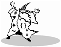
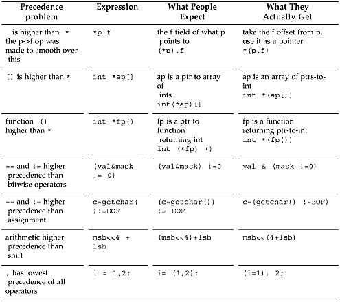
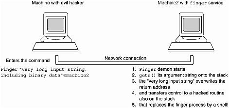
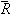

**Chapter 2. It's Not a Bug, It's a Language Feature**

*Bugs are by far the largest and most successful class of entity, with nearly a million known species. In* *this respect they outnumber all the other known creatures about four to one.*

—Professor Snopes' *Encyclopedia of Animal Life*

why language features matter…sins of commission: switches let you down with fall through…available hardware is a crayon?…too much default visibility…sins of mission: overloading the camel's back…"some of the operators have the wrong precedence"…the early bug gets() the Internet worm…sins of omission: mail won't go to users with an "f" in their user name…space–the final frontier…the compiler date is corrupted…lint should never have been separated out…some light relief—some features really are bugs

**Why Language Features Matter—The Way the Fortran Bug** **Really Happened!**

The details of a programming language really matter. They matter because the details make the difference between a reliable language and an error-prone one. This was dramatically revealed in Summer 1961 by a programmer at NASA, testing a Fortran subroutine used to calculate orbital trajectories. \[1\] The subroutine had already been used for several brief Mercury flights, but it was mysteriously not providing the precision that was expected and needed for the forthcoming orbital and lunar missions. The results were close, but not quite as accurate as expected.

\[1\] The story is very widely misreported, and inaccurate versions appear in many programming language texts. Indeed, it has become a classic urban legend among programmers. The definitive account, from Fred Webb who worked at NASA at the time and saw the actual source code, can be seen in "Fortran Story—The Real Scoop" in *Forum on Risks to the Public in Computers and Related Systems*, vol. 9, no. 54, ACM

Committee on Computers and Public Policy, December 12, 1989.

After checking the algorithm, the data, and the expected results at great length, the engineer finally noticed this statement in the code:

DO 10 I=1.10

Clearly, the programmer had intended to write a DO loop of the form: DO 10 I=1,10

In Fortran, blank characters are not significant and can even occur in the middle of an identifier. The designers of Fortran intended this to help cardpunch walloppers and to aid the readability of programs, so you could have identifiers like MAX Y. Unfortunately, the compiler quite correctly read the statement as DO10I = 1.10

Variables do not have to be declared in Fortran. The statement as written caused the value 1.1 to be assigned to the implicitly declared floating point variable DO10I. The statements in the body of the intended loop were executed once instead of ten times, and a first approximation of a calculation took place instead of an iterative convergence. After cor-recting the period to a comma, the results were correct to the expected accuracy.

The bug was detected in time and never caused a Mercury space flight to fail as many versions claim (a different bug, in the Mariner flights, described at the end of the chapter, did have this effect), but it does graphically illustrate the importance of language design. C has all-too-many similar ambiguities or near-ambiguities. This chapter describes a representative sample of the most common ones, and how they typically show up as bugs. There are other problems that can arise in C; for example, any time you encounter the string malloc(strlen(str)); it is almost always sure to be an error, where malloc(strlen(str)+1); was meant. This is because almost all the other string-handling routines include the room needed for the trailing nul terminator, so people get used to not making the special provision for it that strlen needs. The malloc example is an error in the programmer 's knowledge of a library routine, whereas this chapter concentrates on problematic areas in C itself, rather than the programmer 's use of it.

One way of analyzing the deficiencies in a programming language is to consider the flaws in three possible categories: things the language does that it shouldn't do; things it doesn't do that it should; and things that are completely off the wall. For convenience, we can call these "sins of commission,"

"sins of omission," and "sins of mission," respectively. The following sections describe C features in these categories.

This chapter isn't meant as fatal criticism of C. C is a wonderful programming language with many strengths. Its popularity as the implementation language of choice on many platforms is well-deserved.

But, as my grandmother used to say, you can't run a super-conducting supercollider without smashing a few atoms, and you can't analyze C without looking at the flaws as well as the high points.

Reviewing areas for improvement is one of the factors that gradually improves the science of software engineering and the art of programming language design. That's why C++ is so disappointing: it does nothing to address some of the most fundamental problems in C, and its most important addition (classes) builds on the deficient C type model. So with the spirit of enquiry dedicated to improving future languages, here are some observations and case histories.

**Handy Heuristic**

**The One 'l' nul and the Two 'l' null**

Memorize this little rhyme to recall the correct terminology for pointers and ASCII zero: The one "l" NUL ends an ASCII string,

The two "l" NULL points to no thing.

Apologies to Ogden Nash, but the three "l" nulll means check your spelling. The ASCII character with the bit pattern of zero is termed a "NUL". The special pointer value that means the pointer points nowhere is "NULL". The two terms are not interchangeable in meaning.

**Sins of Commission**

The "sins of commission" category covers things that the language does, that it shouldn't do. This includes error-prone features like the switch statement, automatic concatenation of adjacent string literals, and default global scope.

**Switches Let You Down with Fall Through**

The general form of a switch statement is:

switch ( *expression*){

case *constant-expression*: *zero-or-more-statements*

default: *zero-or-more-statements*

case *constant-expression*: *zero-or-more-statements*

}

Each case is introduced by triplets of the keyword case, followed by an integer-valued constant or constant expression, followed by a colon. Execution starts at the case that matches the expression. The default case (if present) can appear anywhere in the list of cases, and will be executed if none of the cases match. If there's no default case and none of the cases match, nothing is done by this statement.

Some people have suggested that it might be better to have a runtime error for the "no match" case, as does Pascal. Runtime error checking is almost unknown in C—checking for dereferencing an invalid pointer is about the only case, and even that limited case can't be fully done under MS-DOS.

**Handy Heuristic**

**Runtime Checking in MS-DOS**

Invalid pointers can be the bane of a programmer's life. It's just too easy to reference memory using an invalid pointer. All virtual memory architectures will fault a process that dereferences a pointer outside its address space as soon as this happens. But MS-DOS

doesn't support virtual memory, so it cannot catch the general case at the instant of failure.

However, MS-DOS can and does use a heuristic to check the specific case of dereferencing a null pointer, after your program has finished. Both Microsoft and Borland C, before entering your program, save the contents of location zero. As part of their exit code, they check whether it now contains a different value. If it does, it's a pretty fair bet that your program stored through a null pointer, and the runtime system prints the warning "null pointer assignment".

More about this in Chapter 7.

Runtime checking goes against the C philosophy that the programmer knows what he or she is doing and is always right.

The cases and the default can come in any order, though by convention the default case is usually the last one. A conformant C compiler must permit at least 257 case labels for a switch statement (ANSI C Standard, section 5.2.4.1). This is to allow a switch on an 8-bit character (256 possible values, plus EOF).

Switch has several problems, one of which is that it is too relaxed about what it accepts in the cases.

For example, you can declare some local storage by following the switch's opening curly brace with a declaration. This is an artifact of the original compiler—most of the same code that processed any

compound statement could be reused to process the braces-enclosed part of a switch. So a declaration is naturally accepted, though it's futile to add an initial value as part of a declaration in a switch statement, as it will not be exe-cuted—execution starts at the case that matches the expression.

**Handy Heuristic**

**Need Some Temporary Store? Be the First on Your Block!**

It is always the case in C that where you have some statements opening a block

{

*statements*

you can always add some declarations in between, like this:

{

*declarations*

*statements*

You might use this if allocating memory was expensive, and hence avoided if possible. A compiler is free to ignore it, though, and allocate the space for all local blocks on calling a function. Another use is to declare some variables whose use is really localized to this block.

if ( a\>b )

/\* swap a, b \*/

{

int tmp = a;

a = b; b = tmp;

}

C++ takes this a step further still, and allows arbitrary intermingling of statements and declarations, and even embedding declarations in the middle of "for" statements.

for (int i=0; i\<100; i++){...

If not used with restraint, that can quickly lead to confusion.

Another problem is that any statements inside a switch can be labelled and jumped to, allowing control to be passed around arbitrarily:

switch (i) {

case 5+3: do_again:

case 2: printf("I loop unremittingly \n"); goto do_again; default : i++;

case 3: ;

}

The fact that all the cases are optional, and any form of statement, including labelled statements, is permitted, means that some errors can't be detected even by lint. A colleague of mine once mistyped defau1t for the default label (i.e., mistyped a digit "1" for the letter "l"). It was very hard to track this bug down, and it effectively removed the default case from the switch statement. However, it still compiled without errors, and even a detailed review of the source showed nothing untoward. Most lints don't catch this one.

By the way, since the keyword const doesn't really mean constant in C, const int two=2;

switch (i) {

case 1: printf("case 1 \n");

case two: printf("case 2 \n");

\*\*error\*\* ^^^ integral constant expression expected

case 3: printf("case 3 \n");

default: ; }

the code above will produce a compilation error like the one shown. This isn't really the fault of the switch statement, but switch statements are one place the problem of constants not being constant shows up.

Perhaps the biggest defect in the switch statement is that cases don't break automatically after the actions for a case label. Once a case statement is executed, the flow of control continues down, executing all the following cases until a break statement is reached. The code switch (2) {

case 1: printf("case 1 \n");

case 2: printf("case 2 \n");

case 3: printf("case 3 \n");

case 4: printf("case 4 \n");

default: printf("default \n");

}

will print out

case 2

case 3

case 4

default

This is known as "fall through" and was intended to allow common end processing to be done, after some case-specific preparation had occurred. In practice it's a severe misfea-ture, as almost all case actions end with a break;. Most versions of lint even issue a warning if they see one case falling through into another.

**Software Dogma**

**Default Fall Through Is Wrong 97% of the Time**

We analyzed the Sun C compiler sources to see how often the default fall through was used.

The Sun ANSI C compiler front end has 244 switch statements, each of which has an average of seven cases. Fall through occurs in just 3% of all these cases.

In other words, the normal switch behavior is ***wrong*** 97% of the time. It's not just in a compiler—on the contrary, where fall through was used in this analysis it was often for situations that occur more frequently in a compiler than in other software, for instance, when compiling operators that can have either one or two operands: switch( operator-\>num_of_operands ) {

case 2: process_operand( operator-\>operand_2 );

/\* FALLTHRU \*/

case 1: process_operand( operator-\>operand_1 );

break;

}

Case fall through is so widely recognized as a defect that there's even a special comment convention, shown above, that tells lint "this really is one of the 3% of cases where fall through was desired." The inconvenience of default fall through is borne out in many other programs.

We conclude that default fall through on switches is a design defect in C. The overwhelm-ing majority of the time you don't want to do it and have to write extra code to defeat it. As the Red Queen said to Alice in *Through the Looking Glass*, you can't deny that even if you used both hands.

**Another Switch Problem—What Does break**

**Break?**

This is a replica of the code that caused a major disruption of AT&T phone service throughout the U.S. AT&T's network was in large part unusable for about nine hours starting on the afternoon of January 15, 1990. Telephone exchanges (or "switching systems"

in phone jargon) are all computer systems these days, and this code was running on a model 4ESS Central Office Switching System. It demonstrates that it is too easy in C to overlook exactly which control constructs are affected by a "break" statement.

network code()

{

switch (line) {

case THING1:

doit1();

break;

case THING2:

if (x == STUFF) {

do_first_stuff();

if (y == OTHER_STUFF)

break;

do_later_stuff();

} /\* coder meant to break to here... \*/

initialize_modes_pointer();

break;

default:

processing();

} /\* ...but actually broke to here! \*/

use_modes_pointer();/\* leaving the modes_pointer

uninitialized \*/

}

This is a simplified version of the code, but the bug was real enough. The programmer wanted to break out of the "if" statement, forgetting that "break" actually gets you out of the nearest enclosing iteration or switch statement. Here, it broke out of the switch, and executed the call to use_modes_pointer() —but the necessary initialization had not been done, causing a failure further on.

This code eventually caused the first major network problem in AT&T's 114-year history.

The saga is described in greater detail on page 11 of the January 22, 1990 issue of *Telephony* magazine. The supposedly fail-safe design of the network signaling system actually spread the fault in a chain reaction, bringing down the entire long distance network.

And it all rested on a C switch statement.

**Available Hardware Is a Crayon?**

One new feature introduced with ANSI C is the convention that adjacent string literals are concatenated into one string. This replaces the old way of constructing multiline messages using escaped newlines, and starting each continuation string in column one.

Old style:

printf( "A favorite children's book \\

is 'Muffy Gets It: the hilarious tale of a cat, \\

a boy, and his machine gun'" );

This can now be written as a series of adjacent string literals that will automatically be joined together as one at compile-time. The nul character that normally ends a string literal is dropped from all joined string literals except the last one.

New style:

printf( "A second favorite children's book "

"is 'Thomas the tank engine and the Naughty Enginedriver

who "

"tied down Thomas's boiler safety valve'" );

However, the automatic concatenation means that a missing comma in an initialization list of string literals no longer causes a diagnostic message. A missing comma now results in a silent marriage of adjacent strings. This has dire consequences in circumstances like the following: char \*available_resources\[\] = {

"color monitor",

"big disk",

"Cray" /\* whoa! no comma! \*/

"on-line drawing routines",

"mouse",

"keyboard",

"power cables", /\* and what's this extra comma? \*/

};

So available_resources\[2\] is "Crayon-line drawing routines". There's quite a difference between having a "Cray" with "on-line drawing routines" and just having some routines to draw lines with crayons...

The total number of resources is one less than expected, so writing to available_resources\[6\] will trash another variable. And by the way, that trailing comma after the final initializer is not a typo, but a blip in the syntax carried over from aboriginal C. Its presence or absence is allowed but has no significance. The justification claimed in the ANSI C

rationale is that it makes automated generation of C easier. The claim would be more credible if trailing commas were permitted in every comma-sepa-rated list, such as in enum declarations, or multiple variable declarators in a single declaration. They are not.

**Handy Heuristic**

**First Time Through**

This hint shows a simple way to get a different action the first time through a section of code.

The function below will do a different action on its first invocation than on all subsequent calls. There are other ways of achieving this; this way minimizes the switches and conditional testing.

generate_initializer(char \* string)

{

static char separator='';

printf( "%c %s \n", separator, string);

separator = ',';

}

The first time through, this will print a space followed by an initializer. All subsequent initializers (if any) will be preceded by a comma. Viewing the specification as "first time through, prefix with a space" rather than "last time through, omit the comma suffix" makes this simple to program.

The claim is hard to believe, as an automated program can output a comma or no comma by having a statically declared character initialized to space and then set to comma. This will exhibit the correct behavior and is trivial to code. There are other examples of comma-separated items in C, where a comma may not terminate the list. The unnecessary, but allowed, comma after the last initializer serves mostly to muddy the waters of an already murky syntax.

**Too Much Default Visibility**

Whenever you define a C function, its name is globally visible by default. You can prefix the function name with the redundant extern keyword or leave it off, and the effect is the same. The function is visible to anything that links with that object file. If you want to restrict access to the function, you are obliged to specify the static keyword.

function apple (){ /\* visible everywhere \*/ }

extern function pear () { /\* visible everywhere \*/ }

static function turnip(){ /\* not visible outside this file \*/ }

In practice, almost everyone tends to define functions without adding extra storage-class specifiers, so global scope prevails.

With the benefit of practical experience, default global visibility has been conclusively and repeatedly demonstrated to be a mistake. Software objects should have the most limited scope by default.

Programmers should explicitly take action when they intend to give something global scope.

The problem of too much scope interacts with another common C convention, that of interpositioning.

Interpositioning is the practice of supplanting a library function by a user-written function of the same name. Many C programmers are completely unaware of this feature, so it is described in the chapter on linking. For now, just make the mental note: *"interpositioning—I should learn more about that."*

The problem of too wide scope is often seen in libraries: one library needs to make an object visible to another library. The only possibility is to make it globally known; but then it is visible to anyone that links with the library. This is an "all-or-nothing" visibil-ity—symbols are either globally known or not known at all. There's no way to be more selective in revealing information in C.

The problem is made worse by the fact that you can't nest function definitions inside other functions, as you can in Pascal. So a collection of "internal" functions for one big function have to be outside it.

Nobody remembers to make them static, so they're globally visible by default. The Ada and Modula-2

languages both address this problem in a man-ageable way by having program units specify exactly what symbols they are exporting and what they are importing.

**Sins of Mission**

The "sins of mission" category covers things in C that just seem misdirected, or a bad fit to the language. This includes features like the brevity of C (caused in part by excessive reuse of symbols) and problems with operator precedence.

**Overloading the Camel's Back**

One problem is that C is so terse. Just adding, changing, or omitting a single character often gives you a program that is still valid but does something entirely different. Worse than that, many symbols are

"overloaded"—given different meanings when used in different contexts. Even some keywords are overloaded with several meanings, which is the main reason that C scope rules are not intuitively clear to programmers. Table 2-1 shows how similar C symbols have multiple different meanings.

***Table 2-1. Symbol Overloading in C***

**Symbol Meaning**

static

Inside a function, *retains its value between calls*

At the function level, *visible only in this file* \[1\]

extern

Applied to a function definition, *has global scope* (and is redundant) Applied to a variable, *defined elsewhere*

void

As the return type of a function, *doesn't return a value*

In a pointer declaration, the type of a generic pointer

In a parameter list, *takes no parameters*

\*

The multiplication operator

Applied to a pointer, indirection

In a declaration, a pointer

&

Bitwise AND operator

Address-of operator

=

Assignment operator

==

Comparison operator

\<=

Less-than-or-equal-to operator

\<\<=

Compound shift-left assignment operator

\<

Less-than operator

\<

Left delimiter in \#include directive

()

Enclose formal parameters in a function definition

Make a function call

Provide expression precedence

Convert (cast) a value to a different type

Define a macro with arguments

Make a macro call with arguments

Enclose the operand of the sizeof operator when it is a typename

\[1\] You're probably wondering what possible reason there could be for re-using the static keyword with these wildly different meanings. If you find out, please let us know, too.

There are other symbols that are also confusingly similar. One flustered programmer once puzzled over the statement if (x\>\>4) and asked, "What does it mean? Is it saying 'If x is *much* greater than 4?'"

The kind of place where overloading can be a problem is in statements like:

p = N \* sizeof \* q;

Quickly now, are there two multiplications or only one? Here's a hint: the next statement is: r = malloc( p );

The answer is that there's only one multiplication, because sizeof is an operator that here takes as its operand the thing pointed to by q (i.e., \*q). It returns the size in bytes of the type of thing to which q points, convenient for the malloc function to allocate more memory. When sizeof 's operand is a *type* it has to be enclosed in parentheses, which makes people wrongly believe it is a function call, but for a *variable* this is not required.

Here's a more complicated example:

apple = sizeof (int) \* p;

What does this mean? Is it the size of an int, multiplied by p? Or the size of whatever p points at, but cast to an int? Or something even weirder? The answer isn't given here, because part of being an expert programmer is learning to write little test programs to probe questions like this. Try it and see!

The more work you make one symbol do, the harder it is for the compiler to detect anomalies in your use of it. It's not just the kind of people who sing along with the Tiki birds at Disneyland who have trouble here. C does seem to be a little further out on the ragged edge of token ambiguity than most other languages.

**"Some of the Operators Have the Wrong Precedence"**

You know that you've definitely found a problem when the authors of the original report on C tell you that "some of the operators have the wrong precedence", as Kernighan and Ritchie mention on page 3

of *The C Programming Language*. Despite this admission, there were no changes in the precedence of operators for ANSI C. It's not surprising; any change in precedence would have imposed an intolerable burden on the existing source base.

But which C operators specifically have the wrong precedence? The answer is "any that appear misleading when you apply them in the regular way." Some operators whose precedence has often caused trouble for the unwary are shown in Figure 2-1.

***Figure 2-1. Precedence Problems of C Operators***

Most of these become more understandable if you sit down to consider them at length. The case involving the comma occasionally causes conniption fits in programmers, though. For example, when this line is executed:

i=1,2;

what value does i end up with? Well, we know that the value of a comma operator is the value of the rightmost operand. But here, assignment has higher precedence, so you actually get: (i=1), 2; /\* i gets the value 1 \*/

i gets the value 1; then the literal 2 is evaluated and thrown away. i ends up being one, not two.

In a posting on Usenet some years ago, Dennis Ritchie explained how some of these anomalies are historical accidents.

**Software Dogma**

**'And' and 'AND' or 'Or' or 'OR'**

From decvax!harpo!npoiv!alice!research!dmr

Date: Fri Oct 22 01:04:10 1982

Subject: Operator precedence

Newsgroups: net.lang.c

The priorities of && \|\| vs. == etc. came about in the following way. Early C had no separate operators for & and && or \| and \|\|. (Got that?) Instead it used the notion (inherited from B

and BCPL) of "truth-value context": where a Boolean value was expected, after "if" and

"while" and so forth, the & and \| operators were interpreted as && and \|\| are now; in ordinary expressions, the bitwise interpretations were used. It worked out pretty well, but was hard to explain. (There was the notion of "top-level operators" in a truth-value context.) The precedence of & and \| were as they are now. Primarily at the urging of Alan Snyder, the

&& and \|\| operators were added. This successfully separated the concepts of bitwise operations and short-circuit Boolean evaluation. However, I had cold feet about the precedence problems. For example, there were lots of programs with things like if (a==b & c==d) ...

In retrospect it would have been better to go ahead and change the precedence of & to higher than ==, but it seemed safer just to split & and && without moving & past an existing operator. (After all, we had several hundred kilobytes of source code, and maybe 3

installations....)

Dennis Ritchie

**Handy Heuristic**

**Order of Evaluation**

The moral of all this is that you should always put parentheses around an expression that mixes Booleans, arithmetic, or bit-twiddling with anything else.

And remember that while precedence and associativity tell you what is grouped with what,

the order in which these groupings will be evaluated is *always* undefined. In the expression: x = f() + g() \* h();

The values returned by g() and h() will be grouped together for multiplication, but g and h might be called in any order. Similarly, f might be called before or after the multiplication, or even between g and h. All we can know for sure is that the multiplication will occur before the addition (because the result of the multiplication is one of the operands in the addition). It would still be poor style to write a program that relied on that knowledge. Most programming languages don't specify the order of operand evaluation. It is left undefined so that compiler-writers can take advantage of any quirks in the architecture, or special knowledge of values that are already in registers.

Pascal avoids all problems in this area by requiring explicit parentheses around expressions that mix Boolean operators and arithmetic operators. Some authorities recommend that there are only two precedence levels to remember in C: multiplication and division come before addition and subtraction.

Everything else should be in parentheses. We think that's excellent advice.

**Handy Heuristic**

**What "Associativity" Means**

While the precedence of operators can be perplexing, many people are equally puzzled about the associativity of operators. Operator associativity never seems to be explained very clearly in the standard C literature. This handy heuristic explains what it is, and when you need to know about it. The five-cent explanation is that it is a "tie-breaker" for operators with equal precedence.

Every operator has a level of precedence and a "left" or "right" associativity assigned to it.

The precedence indicates how "tightly" the operands in an unbracketed expression bind. For example, in the expression a \* b + c,since multiplication has a higher precedence than addition, it will be done first, and the multiplicand will be b, not b + c.

But many operators have the same precedence levels, and this is where associativity comes in. It is a protocol for explaining the real precedence among all operators that have the same apparent precedence level. If we have an expression like

int a, b=1, c=2;

a = b = c;

we find that, since the expression only involves the assignment operator, precedence does not help us understand how the operands are grouped. So which happens first, the assignment of c to b, or the assignment of b to a? In the first case, a would be left with the value 2, and in the second case, a would end up as 1.

All assignment-operators have right associativity. The associativity protocol says that this means the rightmost operation in the expression is evaluated first, and evaluation proceeds from right to left. Thus, the value of c is assigned to b. Then the value of b is stored in a. a gets the value 2. Similarly, for operators with left associativity (such as the bitwise and's and or 's), the operands are grouped from left to right.

The only use of associativity is to disambiguate an expression of two or more equal-precedence operators. In fact, you'll note that all operators which share the same precedence level also share the same associativity. They have to, or else the expression evaluation would still be ambiguous. If you need to take associativity into account to figure out the value of an expression, it's usually better to rewrite the expression into two expressions, or to use parentheses.

The order in which things happen in C is defined for some things and not for others. The order of precedence and association are well-defined. However, the order of expression evaluation is mostly *unspecified* (the special term defined in the previous chapter) to allow compiler-writers the maximum leeway to generate the fastest code. We say "mostly" because the order is defined for && and \|\| and a couple of other operators. These two evaluate their operands in a strict left-to-right order, stopping when the result is known. However, the order of evaluation of the arguments in a function call is another unspecified order.

**The Early Bug gets() the Internet Worm**

The problems in C are not confined to just the language. Some routines in the standard library have unsafe semantics. This was dramatically demonstrated in November 1988 by the worm program that wriggled through thousands of machines on the Internet network. When the smoke had cleared and the investigations were complete, it was determined that one way the worm had propagated was through a weakness in the finger daemon, which accepts queries over the network about who is currently logged in. The finger daemon, in.fingerd, used the standard I/O routine gets().

The nominal task of gets() is to read in a string from a stream. The caller tells it where to put the incoming characters. But gets() does not check the buffer space; in fact, it *can't* check the buffer space. If the caller provides a pointer to the stack, and more input than buffer space, gets() will happily overwrite the stack. The finger daemon contained the code: main(argc, argv)

char \*argv\[\];

{

char line\[512\];

...

gets(line);

Here, line is a 512-byte array allocated automatically on the stack. When a user provides more input than that to the finger daemon, the gets() routine will keep putting it on the stack. Most architectures are vulnerable to overwriting an existing entry in the middle of the stack with something bigger, that also overwrites neighboring entries. The cost of checking each stack access for size and permission would be prohibitive in software. A knowledgeable malefactor can amend the return address in the procedure activation record on the stack by stashing the right binary patterns in the argument string. This will divert the flow of execution not back to where it came from, but to a special instruction sequence (also carefully deposited on the stack) that calls execv() to replace the running image with a shell. Voilà, you are now talking to a shell on a remote machine instead of the finger daemon, and you can issue commands to drag across a copy of the virus to another machine.

Repeat until sent to prison. Figure 2-2 shows the process.

***Figure 2-2. How the Internet Worm Gained Remote Execution Privileges***

Ironically, the gets() routine is an obsolete function that provided compatibility with the very first version of the portable I/O library, and was replaced by standard I/O more than a decade ago. The manpage even strongly recommends that fgets() always be used instead. The fgets() routine sets a limit on the number of characters read, so it won't exceed the size of the buffer. The finger daemon was made secure with a two-line fix that replaced:

gets(line);

by the lines:

if (fgets(line, sizeof(line), stdin) == NULL)

exit(1);

This swallows a limited amount of input, and thus can't be manipulated into overwriting important locations by someone running the program. However, the ANSI C Standard did not remove gets() from the language. Thus, while this particular program was made secure, the underlying defect in the C standard library was not removed.

**Sins of Omission**

The "sins of omission" category covers things that the language doesn't do that it should. This includes missing features like standard argument processing and the mistake of extracting lint checking from the compiler.

**Mail Won't Go to Users with an "f" in Their User names** The bug report was very puzzling. It just said "mail isn't getting delivered to users who have an 'f' as the second character of their username." It sounded so unlikely. What could possibly cause mail to fail because of a character in the username? After all, there's no connection between the characters in a username and the mail delivery processing. Nonetheless, the problem was reported at multiple sites.

After some urgent testing, we found that mail was indeed falling into the void when an addressee had an "f" as the second character of the username! Thus, mail would go to Fred and Muffy, but not to Effie. An examination of the source code quickly located the trouble.

Many people are surprised to learn that ANSI C mandates the argc, argv convention of passing arguments to a C program, but it does. The UNIX convention has been elevated to the level of a standard, and it was partly to blame for the mail bug here. The mail program had been amended in the previous release to:

if ( argv\[argc-1\]\[0\] == '-' \|\| (argv\[argc-2\]\[1\] == 'f' ) )

readmail(argc, argv);

else

sendmail(argc, argv);

The "mail" program can be executed either to send mail, or to read your incoming mail. We won't enquire too closely into the merits of making one program responsible for two such different tasks.

This code was supposed to look at the arguments and use the information to decide if we are reading mail or sending mail. The way to distinguish is somewhat heuristic: look for switches that are unique to either reading or sending. In this case, if the final argument is a switch (i.e., starts with a hyphen), we are definitely reading mail. We are also reading mail if the last argument is not an option but is a filename, that is, the next-to-last argument was "-f".

And this is where the programmer went wrong, aided by lack of support in the language. The programmer merely looked at the second character of the next-to-last option. If it was an "f", he assumed that mail was invoked with a line like:

mail -h -d -f /usr/linden/mymailbox

In most cases this was correct, and mail would be read from mymailbox. But it could also happen that the invocation was:

mail effie robert

In this case, the argument processing would make the mail program think it was being asked to read mail, not send it. Bingo! E-mail to users with an "f" as the second character of the name disappears!

The fix was a one-liner: if you're looking at the next-to-last argument for a possible "f", make sure it is also preceded by a switch hyphen:

if ( argv\[argc-1\]\[0\] == '-' \|\|

argv\[argc-2\]\[0\] == '-' && (argv\[argc-2\]\[1\] == 'f' ) )

readmail(argc, argv);

The problem was caused by bad parsing of arguments, but it was facilitated by inadequate classification of arguments between switches and filenames. Many operating systems (e.g., VAX/VMS) distinguish between runtime options and other arguments (e.g., filenames) to programs, but UNIX does not; nor does ANSI C.

**Software Dogma**

**Shell Fumbles on Argument Parsing**

The problem of inadequate argument parsing occurs in many places on UNIX. To find out which files in a directory are links, you might enter the command: ls -l \| grep -\>

This will yield the error message "Missing name for redirect", and most people will quickly figure out that the right chevron has been interpreted by the shell as a redirection, not as an argument to grep. They will then hide it from the shell by quotes, and try this: ls -l \| grep "-\>"

Still no good! The grep program looks at the starting minus sign, interprets the argument as an unrecognized option of greater-than, and quits. The answer is to step back from "ls" and instead use:

file -h \* \| grep link

Many people have been tormented by creating a file the name of which starts with a hyphen, and then being unable to get rm to remove it. One solution in this case is to give the entire pathname of the file, so that rm does not see a leading hyphen and try to interpret the name as an option.

Some C programmers have adopted the convention that an argument of " -- " means "from this point on, no arguments are switches, even if they start with a hyphen." A better solution would put the burden on the system, not the user, with an argument pro-cessor that divides arguments into options and non-options. The simple argv mechanism is now too well entrenched for any changes. Just don't send mail to Effie under pre-1990 versions of Berkeley UNIX.

**Space—The Final Frontier**

A lot of people will tell you that white space isn't significant in C; that you can have as much or as little of it as you like. Not so! Here are some examples where white space rad-ically changes the meaning or validity of a program.

• The backslash character can be used to "escape" several characters, including a newline. An escaped newline is treated as one logical line, and this can be used to continue long strings. A problem arises if you inadvertently slip a space or two in between the backslash and the carriage return, as *\\* *whitespace newline* is different than \\ *newline*. This error can be hard to find, as you are looking for something invisible (the presence of a space character where a newline was intended). A newline is typically escaped to continue a multiline macro definition. If your compiler doesn't have excellent error messages, you might as well give up now. Another reason to escape a newline is to continue a string literal, like this:

•

•

char a\[\]= "Hi! How are you? I am quite a \\

long string, folded onto 2 lines";

The problem of multiline string literals was addressed by ANSI C introducing the convention that adjacent string literals are glued together. As we point out elsewhere in this chapter, that approach solved one potential problem at the expense of introducing another.

• If you squeeze spaces out altogether, you can still run into trouble. For example, what do you think the following code means?

•

z = y+++x;

The programmer might have meant z = y + ++x, or equally could have had z = y++

\+ x in mind. The ANSI standard specifies a convention that has come to be known as the *maximal munch strategy*. Maximal munch says that if there's more than one possibility for the next token, the compiler will prefer to bite off the one involving the longest sequence of characters. So the above example will be parsed as z = y++ + x.

This can still lead to trouble, as the code

z = y+++++x;

will therefore be parsed as z = y++ ++ + x, and cause a compilation error along the lines of "++ operator is floating loose in space". This will happen even though the compiler could, in theory, have deduced that the only valid arrangement of spaces is z = y++ +

++x.

• Yet a third white space problem occurred when a programmer had two pointers-to-int, and wanted to divide one int by the other. The code said

•

ratio = \*x/\*y;

but the compiler issued an error message complaining of syntax error. The problem was the lack of space between the "/ " division operator and the "\* " indirection operator. When put next to each other they opened a comment, and hid all the code up to the next closing comment!

Related to opening a comment without intending to, is the case of accidentally not closing a comment when you did mean to. One release of an ANSI C compiler had an interesting bug. The symbol table was accessed by a hash function that computed a likely place from which to start a serial search. The computation was copiously commented, even describing the book the algorithm came from.

Unfortunately, the programmer omitted to close the comment! The entire hash initial value calculation thus fell inside the continuing comment, resulting in the code shown below. Make sure you can identify the problem and try to predict what happened.

int hashval=0;

/\* PJW hash function from "Compilers: Principles, Techniques, and Tools"

\* by Aho, Sethi, and Ullman, Second Edition.

while (cp \< bound)

{

unsigned long overflow;

hashval = ( hashval \<\<4)+\*cp++;

if ((overflow = hashval & (((unsigned long) 0xF) \<\< 28)) != 0) hashval ^= overflow \| (overflow \>\> 24);

}

hashval %= ST_HASHSIZE; /\* choose start bucket \*/

/\* Look through each table, in turn, for the name. If we fail,

\* save the string, enter the string's pointer, and return it.

\*/

for (hp = &st_ihash; ; hp = hp-\>st_hnext) {

int probeval = hashval; /\* next probe value \*/

The entire calculation of the initial hash value was omitted, so the table was always searched serially from the zeroth element! As a result, symbol table lookup (a very frequent operation in a compiler) was much slower than it should have been. This was never found during testing because it only affected the speed of a lookup, not the result. This is why some compilers complain if they notice an opening comment in a comment string. The error was eventually found in the course of looking for a different bug. Inserting the closing comment resulted in an immediate compilation speedup of 15%!

**A Digression into C++ Comments**

C++ doesn't address most of the flaws of C, but it could have avoided this inadvertent run-on comment. As in BCPL, C++ comments are introduced by // and go to the end of a line.

It was originally thought that the // comment convention would not alter the meaning of any syntactically correct C code. Sadly, this is not so

a //\*

//\*/ b

is a/b in C, but is a in C++. The C++ language allows the C notation for comments, too.

**The Compiler Date Is Corrupted**

The bug described in this section is a perfect example of how easy it is to write something in C that happily compiles, but produces garbage at runtime. This can be done in any language (e.g., simply divide by zero), but few languages offer quite so many fruitful and inadvertent opportunities as C.

Sun's Pascal compiler had been newly "internationalized," that is, adapted so that (among other things) it would print out dates on source listings in the local format. Thus, in France the date might appear as *Lundi 6 Avril 1992*. This was achieved by having the compiler first call stat() to obtain the sourcefile modification time in UNIX format, then call localtime() to convert it to a struct tm, and then finally call the strftime() string-from-time function to convert the struct tm time to an ASCII string in local format.

Unhappily, there was a bug that showed up as a corrupted date string. The date was actually coming out not as

Lundi 6 Avril 1992

but rather in a corrupted form, as

Lui\*7& %' Y sxxdj @ ^F

The function only has four statements, and the arguments to the function calls are correct in all cases.

See if you can identify the cause of the string corruption.

/\* Convert the source file timestamp into a localized date

string \*/

char \*

localized_time(char \* filename)

{

struct tm \*tm_ptr;

struct stat stat_block;

char buffer\[120\];

/\* get the sourcefile's timestamp in time_t format \*/

stat(filename, &stat_block);

/\* convert UNIX time_t into a struct tm holding local time

\*/

tm_ptr = localtime(&stat_block.st_mtime);

/\* convert the tm struct into a string in local format \*/

strftime(buffer, sizeof(buffer), "%a %b %e %T %Y", tm_ptr); return buffer;

}

See it? Time's up! The problem is in the final line of the function, where the buffer is returned. The buffer is an automatic array, local to this function. Automatic variables go away once the flow of control leaves the scope in which they are declared. That means that even if you return a pointer to such a variable, as here, there's no telling what it points to once the function is exited.

In C, automatic variables are allocated on the stack. This is explained at greater length in Chapter 6.

When their containing function or block is exited, that portion of the stack is available for reuse, and will certainly be overwritten by the next function to be called. Depending on where in the stack the previous auto variable was and what variables the active function declares and writes, it might be overwritten immediately, or later, leading to a hard-to-find corruption problem.

There are several possible solutions to this problem.

1\. Return a pointer to a string literal. Example:

2\.

char \*func() { return "Only works for simple strings"; }

This is the simplest solution, but it can't be used if you need to calculate the string contents, as in this case. You can also get into trouble if string literals are stored in read-only memory, and the caller later tries to overwrite it.

3\. Use a globally declared array. Example:

4\.

5\.

char \*func() {

6\.

...

7\.

my_global_array\[i\] =

8\.

...

9\.

return my_global_array;

}

This works for strings that you need to build up, and is still simple and easy to use. The disadvantages are that anyone can modify the global array at any time, and the next call to the function will overwrite it.

10\. Use a static array. Example:

11\.

12\. char \*func() {

13\. static char buffer\[20\] ;

14\. ...

15\. return buffer;

}

This solves the problem of anyone overwriting the string. Only routines to which you give a pointer will be able to modify this static array. However, callers have to use the value or copy it before another call overwrites it. As with global arrays, large buffers can be wasteful of memory if not in use.

16\. Explicitly allocate some memory to hold the return value. Example: 17.

18\. char \*func() {

19\. char \*s = malloc( 120 ) ;

20\. ...

21\. return s;

}

This method has the advantages of the static array, and each invocation creates a new buffer, so subsequent calls don't overwrite the value returned by the first. It works for multithreaded code (programs where there is more than one thread of control active at a given instant). The disadvantage is that the programmer has to accept responsibility for memory management.

This may be easy, or it may be very hard, depending on the complexity of the program. It can lead to incredible bugs if memory is freed while still in use, or "memory leaks" if memory no longer in use is still held. It's too easy to forget to free allocated memory.

22\. Probably the best solution is to require the caller to allocate the memory to hold the return value. For safety, provide a count of the size of the buffer (just as fgets() requires in the standard library).

23\.

24\. void func( char \* result, int size) {

25\. ...

26\. strncpy(result,"That'd be in the data segment, Bob", size);

27\. }

28\.

29\. buffer = malloc(size);

30\. func( buffer, size );

31\. ...

free(buffer);

Memory management works best if you can write the "free" at the same time as you write the

"malloc". This solution makes that possible.

To avoid the "data corruption" problem, note that lint will complain about the simplest case of: return local_array;

saying warning: function returns pointer to automatic. However, neither a compiler nor lint can detect all cases of a local array being returned (it may be hidden by a level of indirection).

**Lint Should Never Have Been Separated Out**

You'll notice a consistent theme running through many of the above problems: lint detects them and warns you. It takes discipline to ensure that code is kept lint clean, and it would save much trouble if the lint warnings were automatically generated by the compiler.

Back in the early days of C on UNIX, an explicit decision was made to extract full semantic checking from the compiler. This error checking was instead done by a stand-alone program known as "lint".

By omitting comprehensive error-checking, the compiler could be made smaller, faster, and simpler.

After all, programmers can always be trusted to say what they mean, and mean what they say, right?

Wrong!

**Handy Heuristic**

**Lint Early, Lint Often**

Lint is your software conscience. It tells you when you are doing bad things. Always use lint. Listen to your conscience.

Separating lint out from the compiler as an independent program was a big mistake that people are only now coming to terms with. It's true that it made the compiler smaller and more focused, but it was at the grievous cost of allowing bugs and dubious code idioms to lurk unnoticed. Many, perhaps most, programmers do not use lint by default after each and every compilation. It's a poor trade-off to have buggy code compiled fast. Much of lint's checking is now starting to appear in compilers again.

However, there is one thing that lint commonly does that most C compiler implementations currently do not; namely, check for consistency of function use across multiple files. Many people regard this as a deficiency of compiler implementation, rather than a justifi-cation for a freestanding lint program.

All Ada compilers do this multifile consistency checking; it is the trend in C++ translators, and perhaps eventually will be usual in C, too.

**The SunOS Lint Party**

The SunOS development team is justly proud of our lint-clean kernel. We'd paid a lot of attention to getting the 4.x kernel to pass through lint with no errors, and we kept it that way. When we changed our source base from BSD UNIX to SVR4 in 1991, we inherited a new kernel whose lint status was unknown. We decided to lint the SVR4 kernel.

This activity took place over several weeks and was known as the "lint party." It yielded about 12,000 unique lint warnings, each of which had to be investigated and corrected manually. By the end, changes had been made to about 750 source files, and the task had become known as "the lint merge from hell". Most of the lint messages just needed an

explicit cast, or lint comment, but there were several real bugs shaken out by the process:

• Argument types transposed between function and call

• A function that was passed one argument, but expected three, and took junk off the stack. Finding this cured an intermittent data corruption problem in the streams subsystem.

• Variables used before being set.

The value is not just in removing existing bugs, but in preventing new bugs from contaminating the source base. We now keep the kernel lint-clean by requiring all source changes or additions to be run through lint and cstyle. In this way we have not only removed existing bugs, but are reducing the number of future bugs as well.

Some programmers strenuously object to the idea of putting lint back into the compiler on the grounds that it slows the compiler down and produces too many spurious warnings. Unfortunately, experience has proven repeatedly that making lint a separate tool mostly results in lint not being used.

The economics of software is such that the earlier in the development cycle a bug is found, the cheaper it is to fix. So it is a good investment to have lint (or preferably the compiler itself) do the extra work to find problems rather than the debugger; but better a debugger find the problems than an internal test group. The worst option of all is to leave the problems to be found by customers.

**Some Light Relief—Some Features Really Are Bugs!**

This chapter wouldn't be complete without finishing the story of space missions and software. The Fortran DO loop story (which began this chapter and arose in the context of Mercury suborbital flights) is frequently, and wrongly, linked with the Mariner 1 mission.

By coincidence, Mariner 1 *was* involved with a dramatic software failure, but it happened in quite a different manner, and was entirely unrelated to choice of language. Mariner 1 was launched in July 1962 to carry a probe to Venus, but had to be destroyed a few minutes after launch when its Atlas rocket started to veer off course.

After weeks of analysis, it was determined that the problem *was* in the software, but it was a transcription error in the algorithm rather than a program bug. In other words, the program had done what the programmer had supposed, but he had been told the wrong thing in the specification! The tracking algorithm was intended to operate on smoothed (average) velocity. The mathematical symbol for this is a horizontal bar placed over the quantity to be smoothed. In the handwritten guidance equations supplied to the programmer, the bar was accidentally omitted.

The programmer followed the algorithm he had been given exactly, and used the raw velocity direct from radar instead of the smoothed velocity. As a result, the program saw minor fluctuations in rocket velocity and, in a classic negative feedback loop, caused genuine erratic behavior in its correction attempts. The faulty program had been present in previous missions, but this was the first time it had been executed. Previous flights had been controlled from the ground, but on this occasion an antenna failed, preventing the receipt of radio instructions and thus causing the on-board control software to be invoked.

Moral: Even if you could make your programming language 100% reliable, you would still be prey to catastrophic bugs in the algorithm.

We have long felt that programmers working on real-time control systems should have the privilege of taking the first ride on the operational prototype. In other words, if your code implements the life support systems on the space shuttle, then you get to be launched into space and debug any last minute glitches personally. This would surely bring a whole new focus to product quality. Table 2-2 shows some of the opportunities.

***Table 2-2. The Truth About Two Famous Space Software Failures***

**When Mission**

**Error**

**Result**

**Cause**

Summer

Mercury . used instead of ,

nothing; error found Flaw in Fortran language

1961

before flight

July 22,

Mariner " *R*" instead of " " written \$12M rocket and programmer followed error

1962

1

in specification

probe destroyed

in specification

Let us give the last word in this chapter to a more modern story of space software mishaps, almost certainly apocryphal. On every space shuttle mission, there is a cargo manifest, or list of all items to be loaded on board the craft before launch. The manifest lists each item with its weight, and is vital for calculating the fuel and balancing the craft. It seems that before the maiden flight, a dock master was checking off certain items as they were loaded onto the shuttle. He checked off the computer systems, and then came to the manifest entry for the software. It showed the software as having zero weight, which caused a minor panic—after all, surely everything weighs something!

There was some frantic communication between the loading dock and the computer center before the problem was resolved, and the zero-weight software (bit patterns in memory) was allowed to pass! Of course, everyone knows that information has mass in a relativistic sense, but let's not ruin a good story with pedantry, eh?

**References**

Ceruzzi, Paul, *Beyond the Limits—Flight Enters the Computer Age*, Cambridge, MA, MIT Press,1989

Hill, Gladwyn, *"For Want of Hyphen Venus Rocket is Lost,"* *New York Times*, July 28, 1962.

Nicks, Oran W., *Far Travelers—The Exploring Machines*, *NASA publication SP-480*, 1985.

*"Venus Shot Fails as Rocket Strays,"* Associated Press, *New York Times*, July 23, 1962.