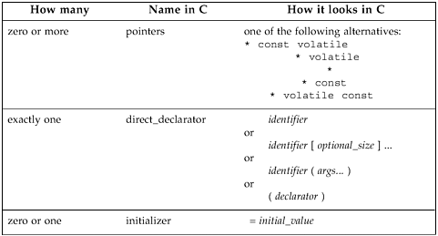
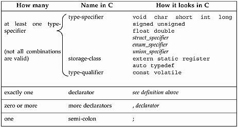
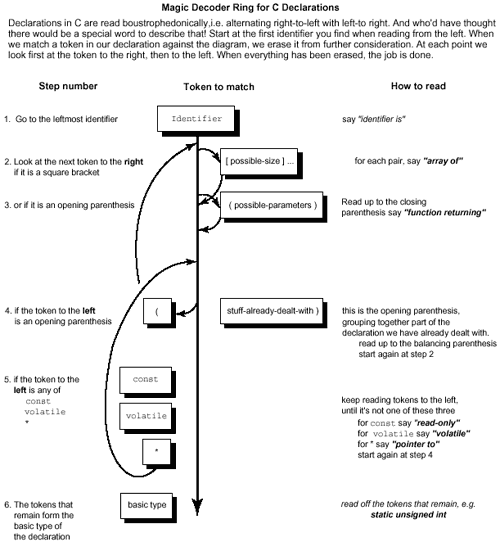

**Chapter 3. Unscrambling Declarations in C**

*"The name of the song is called 'Haddocks' Eyes.'"*

*"Oh, that's the name of the song, is it?" Alice said trying to feel interested.*

*"No, you don't understand," the Knight said, looking a little vexed.*

*"That's what the name is* ***called**. The name really* ***is*** *'The Aged Aged Man.'"*

*"Then I ought to have said 'That's what the* ***song*** *is called'?" Alice corrected herself.*

*"No, you oughtn't: that's quite another thing! The* ***song*** *is called 'Ways and Means': but that's only* *what it's* ***called**, you know!"*

*"Well, what* ***is*** *the song, then?" said Alice, who was by this time completely bewildered.*

*"I was coming to that," the Knight said. "The song really* ***is*** *'A-sitting On A Gate': and the tune's my* *own invention."*

—Lewis Carroll, *Through the Looking Glass*

syntax only a compiler could love…how a declaration is formed…a word about structs…a word about unions…a word about enums…the precedence rule…unscrambling C declarations by diagram…typedef can be your friend…difference between typedef and \#define…what "typedef struct foo { ... foo } foo;" means…the piece of code that understandeth all parsing…some light relief—

software to bite the wax tadpole

There's a story that Queen Victoria was so impressed by *Alice in Wonderland* that she requested copies of other books by Lewis Carroll. The queen did not realize that Lewis Carroll was the pen-name of Oxford mathematics professor Charles Dodgson. She was not amused when sniggering courtiers brought her several weighty volumes including *The Condensation (Factoring) of* *Determinants.* This story was much told in Victorian times, and Dodgson tried hard to debunk it:

"I take this opportunity of giving what publicity I can to my contradiction of a silly story, which has been going the round of the papers, about my having presented certain books to Her Majesty the Queen. It is so constantly repeated, and is such absolute fiction, that I think it worthwhile to state, once for all, that it is utterly false in every particular: nothing even resembling it has ever occurred."

—Charles Dodgson, *Symbolic Logic*, Second Edition

Therefore, on the "he doth protest too much" principle, we can be reasonably certain that the incident did indeed happen exactly as described. In any case, Dodgson would have got on well with C, and Queen Victoria would not. Putting the quote at the head of this chapter into a table, we get:

**is called**

**is**

name of the song

"Haddocks' Eyes"

"The Aged Aged Man"

the song

"Ways and Means"

"A-sitting On A Gate"

Yes, Dodgson would have been right at home with computer science. And he would have especially appreciated type models in programming languages. For example, given the C declarations: typedef char \* string;

string punchline = "I'm a frayed knot";

we can see how the Knight's paradigm can be applied to it:

**is called**

**is**

type of the variable

string

char \*

the variable

punchline

"I'm a frayed knot"

What could be more intuitive than that? Well, actually quite a lot of things, and they'll be clearer still after you've read this chapter.

**Syntax Only a Compiler Could Love**

As Kernighan and Ritchie acknowledge, "C is sometimes castigated for the syntax of its declarations"

(K&R, 2nd E.d, p. 122). C's declaration syntax is trivial for a compiler (or compiler-writer) to process, but hard for the average programmer. Language designers are only human, and mistakes will be made.

For example, the Ada language reference manual gives an ambiguous grammar for Ada in an appendix at the back. Ambiguity is a very undesirable property of a programming language grammar, as it significantly com-plicates the job of a compiler-writer. But the syntax of C declarations is a truly horrible mess that permeates the *use* of the entire language. It's no exaggeration to say that C is significantly and needlessly complicated because of the awkward manner of combining types.

There are several reasons for C's difficult declaration model. In the late 1960s, when this part of C was designed, "type models" were not a well understood area of programming language theory. The BCPL

language (the grandfather of C) was type-poor, having the binary word as its only data type, so C drew on a base that was deficient. And then, there is the C philosophy that the declaration of an object should look like its use. An array of pointers-to-integers is declared by int \* p\[3\]; and an integer is referenced or used in an expression by writing \*p\[i\], so the declaration resembles the use.

The advantage of this is that the precedence of the various operators in a "declaration" is the same as in a "use". The disadvantage is that operator precedence (with 15 or more levels in the hierarchy, depending on how you count) is another unduly complicated part of C. Programmers have to remember special rules to figure out whether int \*p\[3\] is an array of pointers-to-int, or a pointer to an array of ints.

The idea that a declaration should look like a use seems to be original with C, and it hasn't been adopted by any other languages. Then again, it may be that *declaration looks like use* was not quite the splendid idea that it seemed at the time. What's so great about two different things being made to look the same? The folks from Bell Labs acknowledge the criticism, but defend this decision to the death even today. A better idea would have been to declare a pointer as int &p;

which at least suggests that p is the address of an integer. This syntax has now been claimed by C++ to indicate a call by reference parameter.

The biggest problem is that you can no longer read a declaration from left to right, as people find most natural. The situation got worse with the introduction of the volatile and const keywords with ANSI C; since these keywords appear only in a declaration (not in a use), there are now fewer cases in which the use of a variable mimics its declaration. Anything that is styled like a declaration but doesn't have an identifier (such as a formal parameter declaration or a cast) looks funny. If you want to cast something to the type of pointer-to-array, you have to express the cast as: char (\*j)\[20\]; /\* j is a pointer to an array of 20 char \*/

j = (char (\*)\[20\]) malloc( 20 );

If you leave out the apparently redundant parentheses around the asterisk, it becomes invalid.

A declaration involving a pointer and a const has several possible orderings: const int \* grape;

int const \* grape;

int \* const grape_jelly;

The last of these cases makes the pointer read-only, whereas the other two make the object that it points at read-only; and of course, both the object and what it points at might be constant. Either of the following equivalent declarations will accomplish this:

const int \* const grape_jam;

int const \* const grape_jam;

The ANSI standard implicitly acknowledges other problems when it mentions that the typedef specifier is called a "storage-class specifier" for syntactic convenience only. It's an area that even experienced C programmers find troublesome. If declaration syntax looks bad for something as straightforward as an array of pointers, consider how it looks for something even slightly complicated.

What exactly, for example, does the following declaration (adapted from the telnet program) declare?

char\* const \*(\*next)();

We'll answer the question by using this declaration as an example later in the chapter. Over the years, programmers, students, and teachers have struggled to find simple mnemonics and algorithms to help them make some sense of the horrible C syntax. This chapter presents an algorithm that gives a step-by-step approach to solving the problem. Work through it with a couple of examples, and you'll never have to worry about C declarations again!

**How a Declaration Is Formed**

Let's first take a look at some C terminology, and the individual pieces that can make up a declaration.

An important building block is a declarator—the heart of any declaration; roughly, a declarator is the identifier and any pointers, function brackets, or array indica-tions that go along with it, as shown in Figure 3-1. We also group any initializer here for convenience.

***Figure 3-1. The Declarator in C***

A declaration is made up of the parts shown in Figure 3-2 Figure 3-2(not all combinations are valid, but this table gives us the vocabulary for further discussion). A declaration gives the basic underlying type of the variable and any initial value.

***Figure 3-2. The Declaration in C***

We begin to see how complicated a declaration can become once you start combining types together.

Also, remember there are restrictions on legal declarations. You *can't* have any of these:

• a function can't return a function, so you'll never see foo()()

• a function can't return an array, so you'll never see foo()\[\]

• an array can't hold a function, so you'll never see foo\[\]() You *can* have any of these:

• a function returning a *pointer to* a function is allowed: int (\* fun())();

• a function returning a *pointer to* an array is allowed: int (\* foo())\[\]

• an array holding *pointers to* functions is allowed: int (\*foo\[\])()

• an array can hold other arrays, so you'll frequently see int foo\[\]\[\]

Before dealing with combining types, we'll refresh our memories by reviewing how to combine variables in structs and unions, and also look at enums.

**A Word About structs**

Structs are just a bunch of data items grouped together. Other languages call this a "record". The syntax for structs is easy to remember: the usual way to group stuff together in C is to put it in braces:

*{ stuff... }* The keyword struct goes at the front so the compiler can distinguish it from a block: struct { *stuff*... }

The *stuff* in a struct can be any other data declarations: individual data items, arrays, other structs, pointers, and so on. We can follow a struct definition by some variable names, declaring variables of this struct type, for example:

struct { *stuff*... } plum, pomegranate, pear;

The only other point to watch is that we can write an optional "structure tag" after the keyword

"struct":

struct fruit_tag { *stuff*... } plum, pomegranate, pear;

The words struct fruit_tag can now be used as a shorthand for

struct { *stuff*... }

in future declarations.

A struct thus has the general form:

struct *optional_tag* {

type_1 identifier_1;

type_2 identifier_2;

...

type_N identifier_N;

} *optional_variable_definitions*;

So with the declarations

struct date_tag { short dd,mm,yy; } my_birthday, xmas;

struct date_tag easter, groundhog_day;

variables my_birthday, xmas, easter, and groundhog_day all have the identical type. Structs can also have bit fields, unnamed fields, and word-aligned fields.

These are obtained by following the field declaration with a colon and a number representing the field length in bits.

/\* process ID info \*/

struct pid_tag {

unsigned int inactive :1;

unsigned int :1; /\* 1 bit of padding \*/

unsigned int refcount :6;

unsigned int :0; /\* pad to next word boundary

\*/

short pid_id;

struct pid_tag \*link;

};

This is commonly used for "programming right down to the silicon," and you'll see it in systems programs. It can also be used for storing a Boolean flag in a bit rather than a char. A bit field must have a type of int, unsigned int, or signed int (or a qualified version of one of these). It's implementation-dependent whether bit fields that are int's can be negative.

Our preference is not to mix a struct declaration with definitions of variables. We prefer struct veg { int weight, price_per_lb; };

struct veg onion, radish, turnip;

to

struct veg { int weight, price_per_lb; } onion, radish, turnip; Sure, the second version saves you typing a few characters of code, but we should be much more concerned with how easy the code is to read, not to write. We write code once, but it is read many times during subsequent program maintenance. It's just a little simpler to read a line that only does one thing. For this reason, variable declarations should be separate from the type declaration.

Finally there are two parameter passing issues associated with structs. Some C books make statements like "parameters are passed to a called function by pushing them on the stack from right to left." This is oversimplification—if you own such a book, tear out that page and burn it. If you own such a compiler, tear out those bytes. Parameters are passed in registers (for speed) where possible. Be aware that an int "i" may well be passed in a completely different manner to a struct "s" whose only member is an int. Assuming an int parameter is typically passed in a register, you may find that structs are instead passed on the stack. The second point to note is that by putting an array inside a struct like this:

/\* array inside a struct \*/

struct s_tag { int a\[100\]; };

you can now treat the array as a first-class type. You can copy the entire array with an assignment statement, pass it to a function by value, and make it the return type of a function.

struct s_tag { int a\[100\]; };

struct s_tag orange, lime, lemon;

struct s_tag twofold (struct s_tag s) {

int j;

for (j=0;j\<100;j++) s.a\[j\] \*= 2;

return s;

}

main() {

int i;

for (i=0;i\<100;i++) lime.a\[i\] = 1;

lemon = twofold(lime);

orange = lemon; /\* assigns entire struct \*/

}

You typically don't want to assign an entire array very often, but you can do it by burying it in a struct.

Let's finish up by showing one way to make a struct contain a pointer to its own type, as needed for lists, trees, and many dynamic data structures.

/\* struct that points to the next struct \*/

struct node_tag { int datum;

struct node_tag \*next;

};

struct node_tag a,b;

a.next = &b; /\* example link-up \*/

a.next-\>next=NULL;

**A Word About unions**

Unions are known as the variant part of variant records in many other languages. They have a similar appearance to structs, but the memory layout has one crucial difference. Instead of each member being stored after the end of the previous one, all the members have an offset of zero. The storage for the individual members is thus overlaid: only one member at a time can be stored there.

There's some good news and some bad news associated with unions. The bad news is that the good news isn't all that good. The good news is that unions have exactly the same general appearance as structs, but with the keyword struct replaced by union. So if you're comfortable with all the varieties and possibilities for structs, you already know unions too. A union has the general form: union *optional_tag* {

type_1 identifier_1;

type_2 identifier_2;

...

type_N identifier_N;

} *optional_variable_definitions*;

Unions usually occur as part of a larger struct that also has implicit or explicit information about which type of data is actually present. There's an obvious type insecurity here of storing data as one type and retrieving it as another. Ada addresses this by insisting that the discriminant field be explicitly stored in the record. C says go fish, and relies on the programmer to remember what was put there.

Unions are typically used to save space, by not storing all possibilities for certain data items that cannot occur together. For example, if we are storing zoological information on certain species, our first attempt at a data record might be:

struct creature {

char has_backbone;

char has_fur;

short num_of_legs_in_excess_of_4;

};

However, we know that all creatures are either vertebrate or invertebrate. We further know that only vertebrate animals have fur, and that only invertebrate creatures have more than four legs. Nothing has more than four legs and fur, so we can save space by storing these two mutually exclusive fields as a union:

union secondary_characteristics {

char has_fur;

short num_of_legs_in_excess_of_4;

};

struct creature {

char has_backbone;

union secondary_characteristics form;

};

We would typically overlay space like this to conserve backing store. If we have a datafile of 20

million animals, we can save up to 20 Mb of disk space this way.

There is another use for unions, however. Unions can also be used, not for one interpretation of two different pieces of data, but to get two different interpretations of the same data. Interestingly enough, this does exactly the same job as the REDEFINES clause in COBOL. An example is: union bits32_tag {

int whole; /\* one 32-bit value

\*/

struct {char c0,c1,c2,c3;} byte; /\* four 8-bit bytes

\*/

} value;

This union allows a programmer to extract the full 32-bit value, or the individual byte fields value.byte.c0, and so on. There are other ways to accomplish this, but the union does it without the need for extra assignments or type casting. Just for fun, I looked through about 150,000

lines of machine-independent operating system source (and boy, are my arms tired). The results showed that structs are about one hundred times more common than unions. That's an indication of how much more frequently you'll encounter structs than unions in practice.

**A Word About enums**

Enums (enumerated types) are simply a way of associating a series of names with a series of integer values. In a weakly typed language like C, they provide very little that can't be done with a

\#define, so they were omitted from most early implementations of K&R C. But they're in most other languages, so C finally got them too. The general form of an enum should look familiar by now: enum *optional_tag* { *stuff*... } *optional_variable_definitions*; The *stuff*… in this case is a list of identifiers, possibly with integer values assigned to them. An enumerated type example is:

enum sizes { small=7, medium, large=10, humungous };

The integer values start at zero by default. If you assign a value in the list, the next value is one greater, and so on. There is one advantage to enums: unlike \#defined names which are typically discarded during compilation, enum names usually persist through to the debugger, and can be used while debugging your code.

**The Precedence Rule**

We have now reviewed the building blocks of declarations. This section describes one method for breaking them down into an English explanation. The precedence rule for understanding C

declarations is the one that the language lawyers like best. It's high on brevity, but very low on intuition.

**The Precedence Rule for Understanding C Declarations**

A Declarations are read by starting with the name and then reading in precedence order.

B The precedence, from high to low, is:

B.1

parentheses grouping together parts of a declaration

B.2 the

postfix

operators:

parentheses () indicating a function, and

square brackets \[\] indicating an array.

B.3

the prefix operator: the asterisk denoting "pointer to".

C If a const and/or volatile keyword is next to a type specifier (e.g. int, long, etc.) it applies to the type specifier. Otherwise the const and/or volatile keyword applies to the pointer asterisk on its immediate left.

An example of solving a declaration using the Precedence Rule:

char\* const \*(\*next)();

***Table 3-1. Solving a Declaration Using the Precedence Rule***

**Rule to**

**Explanation**

**apply**

A

First, go to the variable name, "next", and note that it is directly enclosed by parentheses.

B.1

So we group it with what else is in the parentheses, to get "next is a pointer to...".

B

Then we go outside the parentheses, and have a choice of a prefix asterisk, or a postfix pair of parentheses.

B.2

Rule B.2 tells us the highest precedence thing is the function parentheses at the right, so we have "next is a pointer to a function returning…"

B.3

Then process the prefix "\*" to get "pointer to".

C

Finally, take the "char \* const", as a constant pointer to a character.

Then put it all together to read:

"next is a pointer to a function returning a pointer to a const pointer-to-char"

and we're done. The precedence rule is what all the rules boil down to, but if you prefer something a little more intuitive, use Figure 3-3.

***Figure 3-3. How to Parse a C Declaration***

**Unscrambling C Declarations by Diagram**

In this section we present a diagram with numbered steps (see Figure 3-3). If you proceed in steps, starting at one and following the guide arrows, a C declaration of arbitrary complexity can quickly be translated into English (also of arbitrary complexity). We'll simplify declarations by ignoring typedefs in the diagram. To read a typedef, translate the declaration ignoring the word "typedef". If it translates to "p is a…", you can now use the name "p" whenever you want to declare something of the type to which it translates.

**Magic Decoder Ring for C Declarations**

Declarations in C are read boustrophedonically,i.e. alternating right-to-left with left-to right. And who'd have thought there would be a special word to describe that! Start at the first identifier you find when reading from the left. When we match a token in our declaration against the diagram, we erase it from further consideration. At each point we look first at the token to the right, then to the left. When everything has been erased, the job is done.

Let's try a couple of examples of unscrambling a declaration using the diagram. Say we want to figure out what our first example of code means:

char\* const \*(\*next)();

As we unscramble this declaration, we gradually "white out" the pieces of it that we have already dealt with, so that we can see exactly how much remains. Again, remember const means "read-only".

Just because it says constant, it doesn't necessarily mean constant.

The process is represented in Table 3-2. In each step, the portion of the declaration we are dealing with is printed in bold type. Starting at step one, we will proceed through these steps.

***Table 3-2. Steps in Unscrambling a C Declaration***

**Declaration Remaining**

**Next Step to**

**Result**

**Apply**

***(start at leftmost identifier)***

char \* const

step 1

say " **next is a…**"

\*(\***next** )();

char \* const \*(\***)** ();

step 2, 3

doesn't match, go to next step, say "next is

a…"

char \* const \*(**\*** )();

step 4

doesn't match, go to next step

char \* const \*(**\*** )();

step 5

asterisk matches, say " **pointer to …**", go to

step 4

char \* const \***()** ();

step 4

"(" matches up to ")", go to step 2

char \* const \* **()** ;

step 2

doesn't match, go to next step

char \* const \* **()** ;

step 3

say " **function returning…**"

char \* const **\*** ;

step 4

doesn't match, go to next step

char \* const **\*** ;

step 5

say " **pointer to…**"

char \* **const** ;

step 5

say " **read-only…**"

char **\*** ;

step 5

say " **pointer to…**"

**char** ;

step 6

say " **char**"

Then put it all together to read:

"next is a pointer to a function returning a pointer to a read-only pointer-to-char"

and we're done.

Now let's try a more complicated example.

char \*(\*c\[10\])(int \*\*p);

Try working through the steps in the same way as the last example. The steps are given at the end of this chapter, to give you a chance to try it for yourself and compare your answer.

**typedef Can Be Your Friend**

Typedefs are a funny kind of declaration: they introduce a new name for a type rather than reserving space for a variable. In some ways, a typedef is similar to macro text replacement—it doesn't introduce a new type, just a new name for a type, but there is a key difference explained later.

If you refer back to the section on how a declaration is formed, you'll see that the typedef keyword can be part of a regular declaration, occurring somewhere near the beginning. In fact, a typedef has exactly the same format as a variable declaration, only with this extra keyword to tip you off.

Since a typedef *looks* exactly like a variable declaration, it is *read* exactly like one. The techniques given in the previous sections apply. Instead of the declaration saying "this name refers to a variable of the stated type," the typedef keyword doesn't create a variable, but causes the declaration to say

"this name is a synonym for the stated type."

Typically, this is used for tricky cases involving pointers to stuff. The classic example is the declaration of the signal() prototype. Signal is a system call that tells the runtime system to call a particular routine whenever a specified "software interrupt" arrives. It should really be called

"Call_that_routine_when_this_interrupt_comes_in". You call signal() and pass it arguments to say which interrupt you are talking about, and which routine should be invoked to handle it. The ANSI Standard shows that signal is declared as:

void (\*signal(int sig, void (\*func)(int)) ) (int);

Practicing our new-found skills at reading declarations, we can tell that this means: void (\*signal( ) ) (int);

signal is a function (with some funky arguments) returning a pointer to a function (taking an int argument and returning void). One of the funky arguments is itself: void (\*func)(int) ;

a pointer to a function taking an int argument and returning void. Here's how it can be simplified by a typedef that "factors out" the common part.

typedef void (\*ptr_to_func) (int);

/\* this says that ptr_to_func is a pointer to a function

\* that takes an int argument, and returns void

\*/

ptr_to_func signal(int, ptr_to_func);

/\* this says that signal is a function that takes

\* two arguments, an int and a ptr_to_func, and

\* returns a ptr_to_func

\*/

Typedef is not without its drawbacks, however. It has the same confusing syntax of other declarations, and the same ability to cram several declarators into one declaration. It provides essentially nothing for structs, except the unhelpful ability to omit the struct keyword. And in any typedef, you don't even have to put the typedef at the start of the declaration!

**Handy Heuristic**

**Tips for Working with Declarators**

Don't put several declarators together in one typedef, like this: typedef int \*ptr, (\*fun)(), arr\[5\];

/\* ptr is the type "pointer to int"

\* fun is the type "pointer to a function returning int"

\* arr is the type "array of 5 ints"

\*/

And never, ever, bury the typedef in the middle of a declaration, like this: unsigned const long typedef int volatile \*kumquat;

Typedef creates aliases for data types rather than new data types. You can typedef any type.

typedef int (\*array_ptr)\[100\];

Just write a declaration for a variable with the type you desire. Have the name of the variable be the name you want for the alias. Write the keyword 'typedef ' at the start, as shown above. A typedef name cannot be the same as another identifier in the same block.

**Difference Between typedef int x\[10\] and \#define x int\[10\]**

As mentioned above, there is a key difference between a typedef and macro text replacement. The right way to think about this is to view a typedef as being a complete "encapsulated" type—you can't add to it after you have declared it. The difference between this and macros shows up in two ways.

You can extend a macro typename with other type specifiers, but not a typedef 'd typename. That is,

\#define peach int

unsigned peach i; /\* works fine \*/

typedef int banana;

unsigned banana i; /\* Bzzzt! illegal \*/

Second, a typedef 'd name provides the type for every declarator in a declaration.

\#define int_ptr int \*

int_ptr chalk, cheese;

After macro expansion, the second line effectively becomes:

int \* chalk, cheese;

This makes chalk and cheese as different as chutney and chives: chalk is a pointer-to-an-integer, while cheese is an integer. In contrast, a typedef like this:

typedef char \* char_ptr;

char_ptr Bentley, Rolls_Royce;

declares both Bentley and Rolls_Royce to be the same. The name on the front is different, but they are both a pointer to a char.

**What typedef struct foo { ... foo; } foo; Means**

There are multiple namespaces in C:

\* label names

\* tags (one namespace for all structs, enums and unions)

\* member names (each struct or union has its own namespace)

\* everyting else

Everything within a namespace must be unique, but an identical name can be applied to things in different namespaces. Since each struct or union has its own namespace, the same member names can be reused in many different structs. This was not true for very old compilers, and is one reason people prefixed field names with a unique initial in the BSD 4.2 kernel code, like this: struct vnode {

long v_flag;

long v_usecount;

struct vnode \*v_freef;

struct vnodeops \*v_op;

};

Because it is legal to use the same name in different namespaces, you sometimes see code like this.

struct foo {int foo;} foo;

This is absolutely guaranteed to confuse and dismay future programmers who have to maintain your code. And what would sizeof( foo ); refer to?

Things get even scarier. Declarations like these are quite legal: typedef struct baz {int baz;} baz;

struct baz variable_1;

baz variable_2;

That's too many "baz"s! Let's try that again, with more enlightening names, to see what's going on: typedef struct my_tag {int i;} my_type;

struct my_tag variable_1;

my_type variable_2;

The typedef introduces the name my_type as a shorthand for "struct my_tag {int i}", but it also introduces the structure tag my_tag that can equally be used with the keyword struct.

If you use the same identifier for the type and the tag in a typedef, it has the effect of making the keyword "struct" optional, which provides completely the wrong mental model for what is going on. Unhappily, the syntax for this kind of struct typedef exactly mirrors the syntax of a combined struct type and variable declaration. So although these two declarations have a similar form, typedef struct fruit {int weight, price_per_lb } fruit; /\*

statement 1 \*/

struct veg {int weight, price_per_lb } veg; /\*

statement 2 \*/

very different things are happening. Statement 1 declares a structure tag "fruit" and a structure typedef "fruit" which can be used like this:

struct fruit mandarin; /\* uses structure **tag** "fruit" \*/

fruit tangerine; /\* uses structure **type** "fruit" \*/

Statement 2 declares a structure tag "veg" and a variable veg. Only the structure tag can be used in further declarations, like this:

struct veg potato;

It would be an error to attempt a declaration of veg cabbage. That would be like writing: int i;

ij;

**Handy Heuristic**

**Tips for Working with Typedefs**

Don't bother with typedefs for structs.

All they do is save you writing the word "struct", which is a clue that you probably shouldn't be hiding anyway.

Use typedefs for:

• types that combine arrays, structs, pointers, or functions.

• portable types. When you need a type that's at least (say) 20-bits, make it a typedef.

Then when you port the code to different platforms, select the right type, short, int, long, making the change in just the typedef, rather than in every declaration.

• casts. A typedef can provide a simple name for a complicated type cast. E.g.

•

•

typedef int (\*ptr_to_int_fun)(void);

•

char \* p;

= (ptr_to_int_fun) p;

Always use a tag in a structure definition, even if it's not needed. It will be later.

A pretty good principle in computer science, when you have two different things, is to use two different names to refer to them. It reduces the opportunities for confusion (always a good policy in software). If you're stuck for a name for a structure tag, just give it a name that ends in "\_tag". This

makes it simpler to detect what a particular name is. Future generations will then bless your name instead of reviling your works.

**The Piece of Code that Understandeth All Parsing**

You can easily write a program that parses C declarations and translates them into English. In fact, why don't you? The basic form of a C declaration has already been described. All we need to do is write a piece of code which understands that form and unscrambles it the same way as Figure 3-4. To keep it simple, we'll pretty much ignore error handling, and we'll deal with structs, enums, and unions by compressing them down to just the single word "struct", "enum" or "union". Finally, this program expects functions to have empty parentheses (i.e., no argument lists).

**Programming Challenge**

**Write a Program to Translate C Declarations into English**

Here's the design. The main data structure is a stack, on which we store tokens that we have read, while we are reading forward to the identifier. Then we can look at the next token to the right by reading it, and the next token to the left by popping it off the stack. The data structure looks like:

struct token { char type;

char string\[MAXTOKENLEN\]; };

/\* holds tokens we read before reaching first

identifier \*/

struct token stack\[MAXTOKENS\];

/\* holds the token just read \*/

struct token this;

The pseudo-code is:

*utility routines----------*

classify_string

look at the current token and

return a value of "type" "qualifier" or "identifier"

in this.type

gettoken

read the next token into this.string

if it is alphanumeric, classify_string

else it must be a single character token

this.type = the token itself; terminate this.string

with a nul.

read_to_first_identifier

gettoken and push it onto the stack until the first

identifier is read.

Print "identifier is", this.string

gettoken

*parsing routines----------*

deal_with_function_args

read past closing ')' print out "function returning"

deal_with_arrays

while you've got "\[size\]" print it out and read past it

deal_with_any_pointers

while you've got "\*" on the stack print "pointer to"

and pop it

deal_with_declarator

if this.type is '\[' deal_with_arrays

if this.type is '(' deal_with_function_args

deal_with_any_pointers

while there's stuff on the stack

if it's a '('

pop it and gettoken; it should be the closing ')'

deal_with_declarator

else pop it and print it

*main routine----------*

main

read_to_first_identifier

deal_with_declarator

This is a small program that has been written numerous times over the years, often under the name

"cdecl". \[1\] An incomplete version of cdecl appears in *The C Programming Language*. The cdecl specified here is more complete; it supports the type qualifiers "const" and "volatile". It also knows about structs, enums, and unions though not in full generality; it is easy to extend this version to handle argument declarations in functions. This program can be implemented with about 150 lines of C. Adding error handling, and the full generality of declarations, would make it much larger. In any event, when you program this parser, you are implementing one of the major subsystems in a compiler—that's a substantial programming achievement, and one that will really help you to gain a deep understanding of this area.

\[1\] Don't confuse this with the cdecl modifier used in Turbo C on PC's to indicate that the generated code should not use the Turbo Pascal default convention for calling functions. The cdecl modifier allows Borland C code to be linked with other Turbo languages that were implemented with different calling conventions.

**Further Reading**

Now that you have mastered the way to build data structures in C, you may be interested in reading a good general-purpose book on data structures. One such book is *Data Structures with Abstract Data* *Types* by Daniel F. Stubbs and Neil W. Webre, 2nd Ed., Pacific Grove, CA, Brooks/Cole, 1989. They cover a wide variety of data structures, including strings, lists, stacks, queues, trees, heaps, sets, and graphs. Recommended.

**Some Light Relief—Software to Bite the Wax Tadpole…**

One of the great joys of computer programming is writing software that controls something physical (like a robot arm or a disk head). There's an enormous feeling of satisfaction when you run a program and something moves in the real world. The graduate students in MIT's Artificial Intelligence Laboratory were motivated by this when they wired up the departmental computer to the elevator call button on the ninth floor. This enabled you to call the elevator by typing a command from your LISP

machine! The program checked to make sure your terminal was actually located inside the laboratory before it called the elevator, to prevent rival hackers using the dark side of the force to tie up the elevators.

The other great joy of computer programming is chowing down on junk food while hack-ing. So what could be more natural than to combine the two thrills? Some computer science graduate students at Carnegie-Mellon University developed a junk-food/com-puter interface to solve a long-standing problem: the computer science department Coke® machine was on the third floor, far from the offices of the graduate students. Students were fed up with travelling the long distance only to find the Coke machine empty or, even worse, so recently filled that it was dispensing warm bottles. John Zsarney and Lawrence Butcher noticed that the Coke machine stored its product in six refrigerated col-umns, each with an "empty" light that flashed as it delivered a bottle, and stayed on when the column was sold out. It was a simple matter to wire up these lights to a serial interface and thus transmit the "bottle dispensed" data to the PDP10 department mainframe computer. From the PDP10, the Coke machine interface looked just like a telnet connection! Mike Kazar and Dave Nichols wrote the software that responded to enquiries and kept track of which column contained the most refrigerated bottles.

Naturally, Mike and Dave didn't stop there. They also designed a network protocol that enabled the mainframe to respond to Coke machine status enquiries from any machine on the local ethernet, and eventually from the Internet itself. Ivor Durham implemented the software to do this and to check the Coke machine status from other machines. With admirable economy of effort Ivor reused the standard

"finger" facility—normally used to check from one machine whether a specified user is logged onto another machine. He modified the "finger" server to run the Coke status program whenever someone fingered the nonexistent user "coke". Since finger requests are part of standard Internet protocols, people could check the Coke machine from any CMU computer. In fact, by running the command finger coke@g.gp.cs.cmu.edu

you could discover the Coke machine's status from any machine anywhere on the Internet, even thousands of miles away!

Others who worked on the project include Steve Berman, Eddie Caplan, Mark Wilkins, and Mark Zaremsky \[2\]. The Coke machine programs were used for over a decade, and were even rewritten for UNIX Vaxen when the PDP-10 was retired in the early 1980s. The end came a few years ago, when the local Coke bottler discontinued the returnable, Coke-bottle-shaped bottles. The old machine couldn't handle the new shape bottles, so it was replaced by a new vending machine that required a new interface. For a while nobody bothered, but the lure of caffeine eventually motivated Greg Nelson to reengineer the new machine. The CMU graduate students also wired up the candy machine, and similar projects have been completed in other schools, too.

\[2\] Craig Everhart, Eddie Caplan, and Robert Frederking, "Serious Coke Addiction," *25th Anniversary Sym-posium, Computer Science at CMU: A Commemorative Review, 1990*, p. 70. Reed and Witting Company.

The computer club at the University of Western Australia has a Coke machine connected to a 68000

CPU, with 80K of memory and an ethernet interface (more power than most PC's had a decade ago).

The Computer Science House at Rochester Institute of Technology, Rochester, NY, also has a Coke machine on the Internet, and has extended it to providing drinks on credit and computerized account billing. One student enjoyed remote logging in from home hundreds of miles away over the summer, and randomly dispensing a few free drinks for whoever next passed. It's getting to the point where

"Coke machine" will soon be the most common type of hardware on the Internet.

Why stop with cola? Last Christmas, programmers at Cygnus Support connected their office Christmas tree decorations to their ethernet. They could amuse themselves by tog-gling various lights from their workstations. And people worry that Japan is pulling ahead of America in technology!

Inside Sun Microsystems, there's an e-mail address gate-wayed to a fax modem. When you send e-mail there, it's parsed for phone number details and sent on as a fax transmission. Ace programmer Don Hopkins wrote *pizzatool* to put it to good use. Pizzatool let you custom-select toppings for a pizza using a GUI interface (most users specified extra GUI cheese), and sent the fax order to nearby Tony

& Alba's Pizza restaurant, which accepted fax orders and delivered.

I don't think I'll be divulging a trade secret if I mention that extensive use was made of this service during the late-night lab sessions developing Sun's SPARCserver 600MP series machines. Bon appetit!

**Programming Solution**

**The Piece of Code that Understandeth All Parsing**

1 \#include \<stdio.h\>

2 \#include \<string.h\>

3 \#include \<ctype.h\>

4 \#include \<stdlib.h\>

5 \#define MAXTOKENS 100

6 \#define MAXTOKENLEN 64

7

8 enum type_tag { IDENTIFIER, QUALIFIER, TYPE };

9

10 struct token {

11 char type;

12 char string\[MAXTOKENLEN\];

13 };

14

15 int top=-1;

16 struct token stack\[MAXTOKENS\];

17 struct token this;

18

19 \#define pop stack\[top--\]

20 \#define push(s) stack\[++top\]=s

21

22 enum type_tag classify_string(void)

23 /\* figure out the identifier type \*/

24 {

25 char \*s = this.string;

26 if (!strcmp(s,"const")) {

27 strcpy(s,"read-only");

28 return QUALIFIER;

29 }

30 if (!strcmp(s,"volatile")) return QUALIFIER;

31 if (!strcmp(s,"void")) return TYPE;

32 if (!strcmp(s,"char")) return TYPE;

33 if (!strcmp(s,"signed")) return TYPE;

34 if (!strcmp(s,"unsigned")) return TYPE;

35 if (!strcmp(s,"short")) return TYPE;

36 if (!strcmp(s,"int")) return TYPE;

37 if (!strcmp(s,"long")) return TYPE;

38 if (!strcmp(s,"float")) return TYPE;

39 if (!strcmp(s,"double")) return TYPE;

40 if (!strcmp(s,"struct")) return TYPE;

41 if (!strcmp(s,"union")) return TYPE;

42 if (!strcmp(s,"enum")) return TYPE;

43 return IDENTIFIER;

44 }

45

46 void gettoken(void) /\* read next token into "this" \*/

47 {

48 char \*p = this.string;

49

50 /\* read past any spaces \*/

51 while ((\*p = getchar()) == ' ' ) ;

52

53 if (isalnum(\*p)) {

54 /\* it starts with A-Z,0-9 read in identifier

\*/

55 while ( isalnum(\*++p=getchar()) );

56 ungetc(\*p,stdin);

57 \*p = '\0';

58 this.type=classify_string();

59 return;

60 }

61

62 if (\*p=='\*') {

63 strcpy(this.string,"pointer to");

64 this.type = '\*';

65 return;

66 }

67 this.string\[1\]= '\0';

68 this.type = \*p;

69 return;

70 }

71 /\* The piece of code that understandeth all parsing.

\*/

72 read_to_first_identifier() {

73 gettoken();

74 while (this.type!=IDENTIFIER) {

75 push(this);

76 gettoken();

77 }

78 printf("%s is ", this.string);

79 gettoken();

80 }

81

82 deal_with_arrays() {

83 while (this.type=='\[') {

84 printf("array ");

85 gettoken(); /\* a number or '\]' \*/

86 if (isdigit(this.string\[0\])) {

87 printf("0..%d ",atoi(this.string)-1); 88 gettoken(); /\* read the '\]' \*/

89 }

90 gettoken(); /\* read next past the '\]' \*/

91 printf("of ");

92 }

93 }

94

95 deal_with_function_args() {

96 while (this.type!=')') {

97 gettoken();

98 }

99 gettoken();

100 printf("function returning ");

101 }

102

103 deal_with_pointers() {

104 while ( stack\[top\].type== '\*' ) {

105 printf("%s ", pop.string );

106 }

107 }

108

109 deal_with_declarator() {

110 /\* deal with possible array/function following

the identifier \*/

111 switch (this.type) {

112 case '\[' : deal_with_arrays(); break;

113 case '(' : deal_with_function_args();

114 }

115

116 deal_with_pointers();

117

118 /\* process tokens that we stacked while reading

to identifier \*/

119 while (top\>=0) {

120 if (stack\[top\].type == '(' ) {

121 pop;

122 gettoken(); /\* read past ')' \*/

123 deal_with_declarator();

124 } else {

125 printf("%s ",pop.string);

126 }

127 }

128 }

129

130 main()

131 {

132 /\* put tokens on stack until we reach identifier

\*/

133 read_to_first_identifier();

134 deal_with_declarator();

135 printf("\n");

136 return 0;

137 }

**Handy Heuristic**

**Make String Comparison Look More Natural**

One of the problems with the strcmp () routine to compare two strings is that it returns

zero if the strings are identical. This leads to convoluted code when the comparison is part of a conditional statement:

if (!strcmp(s,"volatile")) return QUALIFIER;

a zero result indicates false, so we have to negate it to get what we want. Here's a better way. Set up the definition:

\#define STRCMP(a,R,b) (strcmp(a,b) R 0)

Now you can write a string in the natural style

if ( STRCMP(s, ==, "volatile"))

Using this definition, the code expresses what is happening in a more natural style. Try rewriting the cdecl program to use this style of string comparison, and see if you prefer it.

**Programming Solution**

**Unscrambling a C Declaration (One More Time)**

Here is the solution to "What is this declaration?" on page 78. In each step, the portion of the declaration we are dealing with is printed in bold type. Starting at step one, we will proceed through these steps:

**Declaration Remaining**

**Next Step to**

**Result**

**Apply**

start at the leftmost identifier

char \*(\***c**

step 1

say " **c is a…**"

\[10\])(int \*\*p);

char \*(\*

step 2

say " **array\[0..9\] of…**"

**\[10\]** )(int \*\*p);

char \*(**\*** )(int

step 5

say " **pointer to…**"

\*\*p);

go to step 4

char \***()** (int

step 4

delete the parens, go to step 2, fall

\*\*p);

through step 2 to step 3

char \* **(int \*\*p)** ; step 3

say " **function returning…**"