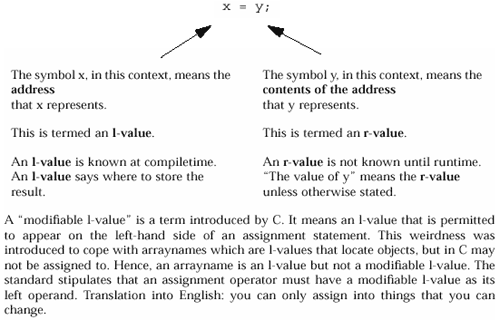
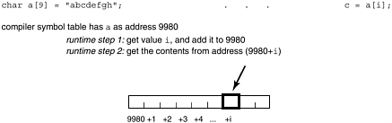
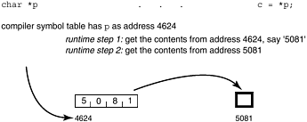
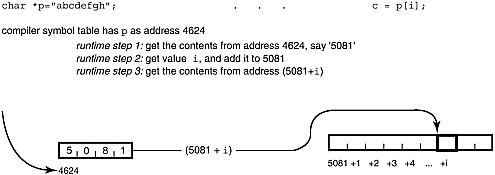
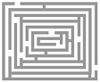

**Chapter 4. The Shocking Truth: C Arrays and Pointers**

**Are NOT the Same!**

*Should array indices start at 0 or 1? My compromise of 0.5 was rejected without, I thought, proper* *consideration.*

—Stan Kelly-Bootle

arrays are NOT pointers…why doesn't my code work?…what's a declaration? what's a definition?…match your declarations to the definition…array and pointer differences…some light relief—fun with palindromes!

**Arrays Are NOT Pointers!**

One of the first things that novice C programmers often hear is that "arrays are the same as pointers."

Unfortunately, this is a dangerous half-truth. The ANSI C Standard paragraph 6.5.4.2 recommends that you

*Note the distinction between the declarations*:

extern int \*x;

extern int y\[\];

*The first declares* x *to be a pointer to* int *; the second declares* y *to be an array of* int *of* *unspecified size (an incomplete type), the storage for which is defined elsewhere.*

The standard doesn't go into the matter in any greater detail than that. Too many C books gloss over when arrays are, and are not, equivalent to pointers, relegating the explanation to a footnote when it should be a chapter heading. This book tries to restore the balance by fully explaining when arrays are equivalent to pointers, when they are not, and why. Not only that, but we also make sure that the key point is emphasized with a chapter heading, not a footnote.

**Why Doesn't My Code Work?**

If I had a dime for every time someone brought me a program like the following, together with the complaint that "it doesn't work," then I'd have, uh, let's see, about two-fifty.

*file 1*:

int mango\[100\];

*file 2*:

extern int \*mango;

...

/\* some code that references mango\[i\] \*/

Here, file 1 defines mango as an array, but file 2 declares it as a pointer. But what is wrong with this?

After all, "everybody knows" arrays and pointers are pretty much the same in C. The problem is that

"everybody" is wrong! It is like confusing integers and floats: *file 1:*

int guava;

*file 2*:

extern float guava;

The int and float example above is an obvious and gross type mismatch; nobody would expect this to work. So why do people think it's always OK to use pointers and arrays completely interchangeably? The answer is that array references can always be rewritten as pointer references, and there *is* a context in which pointer and array definitions are equivalent. Unfortunately, this context involves a very common use of arrays, so people naturally generalize and assume equivalence in all cases, including the blatantly wrong "defined as array/external declaration as pointer" above.

**What's a Declaration? What's a Definition?**

Before getting to the bottom of this problem, we need to refresh our memories about some essential C

terminology. Recall that objects in C must have exactly one definition, and they may have multiple external declarations. By the way, no C++ mumbo-jumbo here—when we say "object" we mean a C

"thing" known to the linker, like a function or data item.

A *definition* is the special kind of declaration that creates an object; a *declaration* indicates a name that allows you to refer to an object created here or elsewhere. Let's review the terminology: definition occurs in only one specifies the type of an object; reserves storage for it; is used to create place

new objects

*example*: int my_array\[100\];

declaration can occur multiple describes the type of an object; is used to refer to objects defined times

elsewhere (e.g., in another file)

*example*: extern int my_array\[\];

**Handy Heuristic**

**Distinguishing a Definition from a Declaration**

You can tell these two apart by remembering:

**A declaration is like a customs declaration:**

it is not the thing itself, merely a description a de**fi**nition is the **special kind of** of some baggage that you say you have

**declaration** that **fi**xes the storage

around somewhere.

for an object

The declaration of an external object tells the compiler the type and name of the object, and that memory allocation is done somewhere else. Since you aren't allocating memory for the array at this point, you don't need to provide information on how big it is in total. You do have to provide the size of all array dimensions except the leftmost one—this gives the compiler enough information to generate indexing code.

**How Arrays and Pointers Are Accessed**

In this section we show the difference between a reference using an array and a reference using a pointer. The first distinction we must note is between *address y* and *contents of address y*. This is actually quite a subtle point, because in most programming languages we use the same symbol to represent both, and the compiler figures out which is meant from the context. Take a simple assignment, as shown in Figure 4-1.

***Figure 4-1. The Difference between an Address (l-value) and the Contents of the***

***Address (r-value)***

The symbol appearing on the left of an assignment is sometimes called an *l-value* (for "left-hand-side"

or "locator" value), while a symbol on the right of an assignment is sometimes called an *r-value* (for

"right-hand-side"). The compiler allocates an address (or l-value) to each variable. This address is known at compiletime, and is where the variable will be kept at runtime. In contrast, the value *stored* *in* a variable at runtime (its r-value) is not known until runtime. If the value stored in a variable is required, the compiler emits code to read the value from the given address and put it in a register.

The key point here is that the address of each symbol is known at compiletime. So if the compiler needs to do something with an address (add an offset to it, perhaps), it can do that directly and does not need to plant code to retrieve the address first. In contrast, the current value of a pointer must be retrieved at runtime before it can be dereferenced (made part of a further look-up). Diagram A shows an array reference.

***Figure A. A Subscripted Array Reference***

That's why you can equally write extern char a\[\]; as well as extern char a\[100\];.

Both declarations indicate that a is an array, namely a memory location where the characters in the array can be found. The compiler doesn't need to know how long the array is in total, as it merely generates address offsets from the start. To get a character from the array, you simply add the subscript to the address that the symbol table shows a has, and get what's at that location.

In contrast, if you declare extern char \*p, it tells the compiler that p is a pointer (a four-byte object on many contemporary machines), and the object pointed to is a character. To get the char, you have to get whatever is at address p, *then* use *that* as an address and get whatever is there. Pointer accesses are more flexible, but at the cost of an extra fetch instruction, as shown in Diagram B.

***Figure B. A Pointer Reference***

**What Happens When You "Define as Pointer/Reference as Array"**

We now can see the problem that arises when an external array is defined as a pointer and referenced as an array. The indirect type of memory reference that is done for a pointer (see Diagram B) occurs when we really want a direct memory reference (as shown in Diagram A). This occurs because we told the compiler that we had a pointer, and is shown in Diagram C.

***Figure C. A Subscripted Pointer Reference***

Contrast the access shown in Diagram C on page 101

char \* p = "abcdefgh"; ... p\[3\]

with Diagram A on page 99

char a\[\] = "abcdefgh"; ... a\[3\]

They both get you a character 'd' but they get there by very different look-ups.

When you write extern char \*p, then reference it as p\[3\], it's essentially a combination of Diagrams A and B. You do an indirect reference as in diagram 2, then you step forward to the offset represented by the subscript as in diagram 1. More formally, the compiler emits code to:

1. Get the address that p represents, and retrieve the pointer there.

2\. Add the offset that the subscript represents onto the pointer value.

3\. Access the byte at the resulting address.

The compiler has been told that p is a pointer to char. (In contrast, an array definition tells the compiler that p *is* a sequence of chars.) Making a reference to p\[i\] says "starting at where p points, step forward over 'i' things, each of which is a char (i.e., 1 byte long)." For pointers to different types (int or double, etc.) the scaling factor (the size of each thing stepped over) will be a different number of bytes.

Since we *declared* p as a pointer, the look-up happens this way regardless of whether p was originally *defined* as a pointer (in which case the right thing is happening) or an array (in which case the wrong thing is happening). Consider the case of an external declaration extern char \*p; but a definition of char p\[10\];. When we retrieve the contents of p\[i\] using the extern, we get characters, but we treat it as a pointer. Interpreting ASCII characters as an address is garbage, and if you're lucky the program will coredump at that point. If you're not lucky it will corrupt something in your address space, causing a mysterious failure at some later point in the program.

**Match Your Declarations to the Definition**

The problem of the external declaration of a pointer not matching the definition of an array is simple to fix—change the declaration so it does match the definition, like this: *file 1*:

int mango\[100\];

*file 2*:

extern int mango\[\];

...

/\* some code that references mango\[i\] \*/

The array definition of mango allocates space for 100 integers. In contrast, the pointer definition: int \*raisin;

requests a place that holds a pointer. The pointer is to be known by the name raisin, and can point to any int (or array of int) anywhere. The variable raisin itself will always be at the same address, but its contents can change to point to many different ints at different times. Each of those different ints can have different values. The array mango can't move around to different places. At different times it can be filled with different values, but it always refers to the same 100 consecutive memory locations.

**Other Differences Between Arrays and Pointers** Another way of looking at the differences between arrays and pointers is to compare some of their characteristics, as in Table 4-1.

***Table 4-1. Differences Between Arrays and Pointers***

**Pointer Array**

Holds the address of data

Holds data

Data is accessed indirectly, so you first retrieve the

Data is accessed directly, so for a\[i\] you

contents of the pointer, load that as an address (call it "L"), simply retrieve the contents of the then retrieve its contents.

location i units past a.

If the pointer has a subscript \[i\] you instead retrieve the

contents of the location 'i' units past "L"

Commonly used for dynamic data structures

Commonly used for holding a fixed

number of elements of the same type of

data

Commonly used with malloc(), free()

Implicitly allocated and deallocated

Typically points to anonymous data

Is a named variable in its own right

Both arrays and pointers can be initialized with a literal string in their definition. Although these cases look the same, different things are happening.

A pointer definition does not allocate space for what's pointed at, only for the pointer, *except* when assigned a literal string. For example, the definition below also creates the string literal: char \*p = "breadfruit";

Note that this *only* works for a string literal. You can't expect to allocate space for, for example, a float literal:

float \*pip = 3.141; /\* Bzzt! won't compile \*/

A string literal created by a pointer initialization is defined as read-only in ANSI C; the program will exhibit undefined behavior if it tries to change the literal by writing through p. Some implementations put string literals in the text segment, where they will be protected with read-only permission.

An array can also be initialized with a string literal:

char a\[\] = "gooseberry";

In contrast to a pointer, an array initialized by a literal string is writable. The individual characters *can* later be changed. The following statement:

strncpy(a, "black", 5);

gives the string in the array the new value "blackberry".

Chapter 9 discusses when pointers and arrays *are* equivalent. It then discusses why the equivalency was made, and how it works. Chapter 10 describes some advanced array hocus-pocus based on pointers. If you make it to the end of that chapter, you will have forgotten more about arrays than many C programmers will ever know.

Pointers are one of the hardest parts of C to understand and apply correctly, second only to the syntax of declarations. However, they are also one of the most important parts of C. Professional C

programmers *have* to be proficient with the use of malloc() and pointers to anonymous memory.

**Some Light Relief—Fun with Palindromes!**

A palindrome is a word or phrase that reads the same backwards as forwards, for example, "do geese see God?" (Answer: "O, no!") Palindromes are a kind of entertaining parlor trick, and the best ones have phrases that make some kind of loose sense, such as Napoleon's last rueful words "Able was I, ere I saw Elba". Another classic palindrome refers to the heroic individual effort involved in building the Panama canal. The palindrome runs "A man, a plan, a canal—Panama!".

But of course, it took a lot more than just a man and a plan to produce the Panama canal—a fact noted by Jim Saxe, a computer science graduate student at Carnegie-Mellon University. In October 1983, Jim was idly doodling with the Panama palindrome, and extended it to: A man, a plan, a cat, a canal—Panama?

Jim put this on the computer system where other graduate students would see it, and the race was on!

Steve Smith at Yale parodied the effort with:

A tool, a fool, a pool—loopaloofaloota!

Within a few weeks Guy Jacobson, had extended the panorama to: A man, a plan, a cat, a ham, a yak, a yam, a hat, a canal—Panama!

Now people got seriously interested in palindromes about Panama! In fact Dan Hoey, who had recently graduated, wrote a C program to look for and construct the following beauty: A man, a plan, a caret, a ban, a myriad, a sum, a lac, a liar, a hoop, a pint, a catalpa, a gas, an oil, a bird, a yell, a vat, a caw, a pax, a wag, a tax, a nay, a ram, a cap, a yam, a gay, a tsar, a wall, a car, a luger, a ward, a bin, a woman, a vassal, a wolf, a tuna, a nit, a pall, a fret, a watt, a bay, a daub, a tan, a cab, a datum, a gall, a hat, a fag, a zap, a

say, a jaw, a lay, a wet, a gallop, a tug, a trot, a trap, a tram, a torr, a caper, a top, a tonk, a toll, a ball, a fair, a sax, a minim, a tenor, a bass, a passer, a capital, a rut, an amen, a ted, a cabal, a tang, a sun, an ass, a maw, a sag, a jam, a dam, a sub, a salt, an axon, a sail, an ad, a wadi, a radian, a room, a rood, a rip, a tad, a pariah, a revel, a reel, a reed, a pool, a plug, a pin, a peek, a parabola, a dog, a pat, a cud, a nu, a fan, a pal, a rum, a nod, an eta, a lag, an eel, a batik, a mug, a mot, a nap, a maxim, a mood, a leek, a grub, a gob, a gel, a drab, a citadel, a total, a cedar, a tap, a gag, a rat, a manor, a bar, a gal, a cola, a pap, a yaw, a tab, a raj, a gab, a nag, a pagan, a bag, a jar, a bat, a way, a papa, a local, a gar, a baron, a mat, a rag, a gap, a tar, a decal, a tot, a led, a tic, a bard, a leg, a bog, a burg, a keel, a doom, a mix, a map, an atom, a gum, a kit, a baleen, a gala, a ten, a don, a mural, a pan, a faun, a ducat, a pagoda, a lob, a rap, a keep, a nip, a gulp, a loop, a deer, a leer, a lever, a hair, a pad, a tapir, a door, a moor, an aid, a raid, a wad, an alias, an ox, an atlas, a bus, a madam, a jag, a saw, a mass, an anus, a gnat, a lab, a cadet, an em, a natural, a tip, a caress, a pass, a baronet, a minimax, a sari, a fall, a ballot, a knot, a pot, a rep, a carrot, a mart, a part, a tort, a gut, a poll, a gateway, a law, a jay, a sap, a zag, a fat, a hall, a gamut, a dab, a can, a tabu, a day, a batt, a waterfall, a patina, a nut, a flow, a lass, a van, a mow, a nib, a draw, a regular, a call, a war, a stay, a gam, a yap, a cam, a ray, an ax, a tag, a wax, a paw, a cat, a valley, a drib, a lion, a saga, a plat, a catnip, a pooh, a rail, a calamus, a dairyman, a bater, a canal—Panama.

A "catalpa" (in case you're wondering) is a native American word for a type of tree. You can look up axon and calamus for yourself. Dan commented that a little work on the search algorithm could make it several times as long.

The search algorithm was ingenious—Dan programmed a finite state machine that evaluates a series of partial palindromes. In each case, the state consists of the unmatched part of the palindrome.

Starting with the original palindrome, Dan noted that the "a ca" of "a canal" is right at the middle of the phrase, so we can add anything we like after "a plan" as long as its reverse forms a word or part-word when put after that.

To insert additional words after "a plan," just start by doubling the "a ca" in the middle. This gives us

"…, a plan, a ca… a canal,…" We could stop right there if "ca" was a word, but it's not. So find something that completes the fragment on the left, and add the same thing spelled backwards on the right, for example, "ret … ter."

In each step, the end part of the word we add is spelled backwards, and becomes the beginning part of the next word we look for. Table 4-2 shows the process:

***Table 4-2. Building a Palindrome***

State "-aca":

"A man, a plan, ... a canal, Panama"

State "ret-":

"... a plan, a caret, ... a canal, Panama"

State "-aba":

"... a plan, a caret, ... a bater, a canal, ..."

State "n-":

"... a caret, a ban, ... a bater, a canal, ..."

State "-adairyma":

"... a caret, a ban, ... a dairyman, a bater, ..."

State "-a":

"... a ban, a myriad, ... a dairyman, a bater, ..."

The accepting states of the finite state machine are those where the unmatched part is itself palindromic. In other words, at any point where the words just chosen are a palindrome in themselves, you can stop. In this case, the palindrome "… a nag, a pagan, …" is at the center, and putting in "-apa-

" terminated the algorithm.

Dan used a small word list that only contained nouns. If you don't do this you get a lot of "a how, a running, a would, an expect, an and..." which is nonsensical. An alternative would be a real on-line dictionary (not just word list) that indicates which words are nouns. That way, a *really* big palindrome could be generated. But as Dan says, "if I got a 10,000 word palindrome, I wonder if anyone would want it. I like this one, because it's small enough to pass around. And I've already done the work." You can't argue with that!

**Programming Challenge**

**Write a Palindrome**

Claim your 15 minutes of fame: write a C program to generate that 10,000-word palindrome. Really make yourself famous by posting it to rec.arts.startrek.misc on Usenet.

They're fed up with discussing Captain Kirk's middle name, and they love to hear about new diversions.