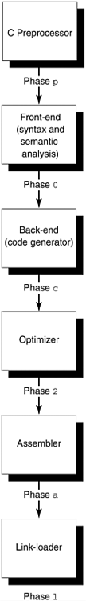
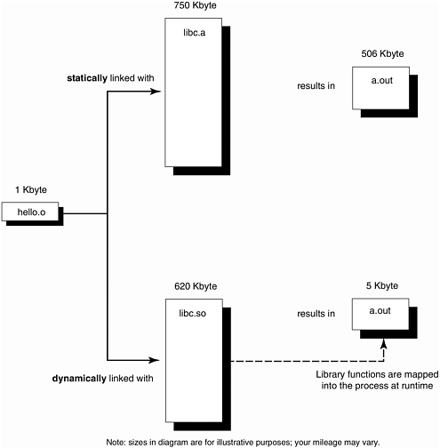
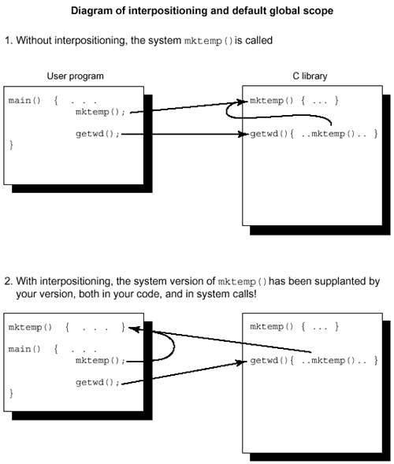

**Chapter 5. Thinking of Linking**

*As the* Pall Mall Gazette *described on March 11, 1889 "Mr Thomas Edison has been up on the two* *previous nights discovering 'a bug' in his phonograph."*

—Thomas Edison discovers bugs, 1878

*The pioneering Harvard Mark II computer system had a logbook which is now in the National* *Museum of American History at the Smithsonian. The logbook entry for September 9, 1947 has, taped* *onto the page, the remains of an insect that fluttered into a switch and got trapped. The label reads*

*"Relay \#70 Panel F (moth) in relay." Under this is written "First actual case of bug being found."*

—Grace Hopper discovers bugs, 1947

*As soon as we started programming, we found to our surprise that it wasn't as easy to get programs* *right as we had thought. Debugging had to be discovered. I can remember the exact instant when I* *realized that a large part of my life from then on was going to be spent in finding mistakes in my own* *programs.*

—Maurice Wilkes discovers bugs, 1949

*Program testing can be used to show the presence of bugs but never to show their absence.*

—Edsger W. Dijkstra discovers bugs, 1972

linking, libraries, and loading…where the linker is in the phases of compilation…the benefits of dynamic linking…five special secrets of linking with libraries… watch out for interpositioning…don't use these names for your identifiers…generating linker report files…some light relief—look who's talking: challenging the Turing test

**Libraries, Linking, and Loading**

Let's start with a review of linker basics: The compiler creates an output file containing relocatable objects. These objects are the data and machine instructions corresponding to the source programs.

This chapter uses the sophisticated form of linking found on all SVR4 systems as its example.

**Where the Linker Is in the Phases of Compilation**

Most compilers are not one giant program. They usually consist of up to half-a-dozen smaller programs, invoked by a control program called a "compiler driver." Some pieces that can be conveniently split out into individual programs are: the preprocessor, the syntactic and semantic checker, the code generator, the assembler, the optimizer, the linker, and, of course, a driver program

to invoke all these pieces and pass the right options to each (see Figure 5-1). An optimizer can be added after almost any of these phases. The current SPARCompilers do most optimizations on the intermediate representation between the front and back ends of the compiler.

***Figure 5-1. A Compiler is Often Split into Smaller Programs***

They are written in pieces because they are easier to design and maintain if each specialized part is a program in its own right. For instance, the rules controlling preprocessing are unique to that phase and

have little in common with the rest of C. The C preprocessor is often (but not always) a separate program. If the code generator (also known as the "back end") is written as a stand-alone program, it can probably be shared by other languages. The trade-off is that running several smaller programs will take longer than running one big program (because of the overhead of initiating a process and sending information between the phases). You can look at the individual phases of compilation by using the -#

option. The -V option will provide version information.

You can pass options to each phase, by giving the compiler-driver a special -W option that says "pass this option to that phase." The "W" will be followed by a character indicating the phase, a comma, and then the option. The characters that represent each phase are shown in Figure 5-1.

So to pass any option through the compiler driver to the linker, you have to prefix it by "-Wl," to tell the compiler driver that this option is intended for the link editor, not the preprocessor, compiler, assembler, or another compilation phase. The command

cc -Wl,-m main.c \> main.linker.map

will give ld the "-m" option, telling it to produce a linker map. You should try this once or twice to see the kind of information that is produced.

An object file isn't directly executable; it needs to be fed into a linker first. The linker identifies the main routine as the initial entry point (place to start executing), binds symbolic references to memory addresses, unites all the object files, and joins them with the libraries to produce an executable.

There's a big difference between the linking facilities available on PC's and those on bigger systems.

PC's typically provide only a small number of elementary I/O services, known as the BIOS routines.

These exist in a fixed location in memory, and are not part of each executable. If a PC program or suite of programs requires more sophisticated services, they can be provided in a library, but the implementor must link the library into each executable. There's no provision in MS-DOS for

"factoring out" a library common to several programs and installing it just once on the PC.

UNIX systems used to be the same. When you linked a program, a copy of each library routine that you used went into the executable. In recent years, a more modern and superior paradigm known as dynamic linking has been adopted. Dynamic linking allows a system to provide a big collection of libraries with many useful services, but the program will look for these at runtime rather than having the library binaries bound in as part of the executable. IBM's OS/2 operating system has dynamic linking, as does Microsoft's new flagship NT operating system. In recent years, Microsoft Windows®

has introduced this ability for the windowing part of PC applications.

If a copy of the libraries is physically part of the executable, then we say the executable has been *statically linked*; if the executable merely contains filenames that enable the loader to find the program's library references at runtime, then we say it has been *dynamically linked*. The canonical names for the three phases of collecting modules together and preparing them for execution are link-editing, loading, and runtime linking. Statically linked modules are link edited and then loaded to run them. Dynamically linked modules are link-edited and then loaded and runtime-linked to run them. At execution, before main() is called, the runtime loader brings the shared data objects into the process address space. It doesn't resolve external function calls until the call is actually made, so there's no penalty to linking against a library that you may not call. The two linking methods are compared in Figure 5-2.

***Figure 5-2. Static Linking versus Dynamic Linking***

Even with static linking, the whole of libc. a is not brought into the executable, just the routines needed.

**The Benefits of Dynamic Linking**

Dynamic linking is the more modern approach, and has the advantage of much smaller executable size.

Dynamic linking trades off more efficient use of the disk and a quicker link-edit phase for a small runtime penalty (since some of the linker's work is deferred until loadtime).

**Handy Heuristic**

**One Purpose of Dynamic Linking Is the ABI**

A major purpose of dynamic linking is to decouple programs from the particular library versions they use. Instead, we have the convention that the system provides an *interface* to programs, and that this interface is stable over time and successive OS releases.

Programs can call services promised by the interface, and not worry about how they are provided or how the underlying implementation may change. Because this is an interface between application programs and the services provided by library binary executables, we call it an *Application Binary Interface* or ABI.

A single ABI is the purpose of unifying the UNIX world around AT&T's SVr4. The ABI guarantees that the libraries exist on all compliant machines, and ensures the integrity of the interface. There are four specific libraries for which dynamic linking is mandatory: libc (C

runtimes), libsys (other system runtimes), libX (X windowing), and libnsl (networking services). Other libraries can be statically linked, but dynamic linking is strongly preferred.

In the past, application vendors had to relink their software with each new release of the OS

or a library. It caused a huge amount of extra work for all concerned. The ABI does away with this, and guarantees that well-behaved applications will not be affected by well-behaved upgrades in underlying system software.

Although an individual executable has a slightly greater start-up cost, dynamic linking helps overall performance in two ways:

1\. A dynamically linked executable is smaller than its statically linked counterpart. It saves disk and virtual memory, as libraries are only mapped in to the process when needed. Formerly, the only way to avoid binding a library copy into each executable was to put the service in the kernel instead of a library, contributing to the dreaded "kernel bloat."

2\. All executables dynamically linked to a particular library share a single copy of the library at runtime. The kernel ensures that libraries mapped into memory are shared by all processes using them. This provides better I/O and swap space utilization and is sparing of physical memory, improving overall system throughput. If the executables were statically linked, each would wastefully contain its own complete duplicate copy of the library.

For example, if you have eight XView™ applications running, only one copy of the XView library text segment has to be mapped into memory. The first process's mmap \[1\] call will result in the kernel mapping the shared object into memory. The next seven process mmaps will cause the kernel to share the existing mapping in each process. Each of the eight processes will share one copy of the XView library in memory. If the library were statically linked, there would be eight individual copies consuming more physical memory and causing more paging.

\[1\] The system call mmap() maps a file into a process address space. The contents of the file can then be obtained by reading successive memory locations. This is particularly appropriate when the file contains executable instructions. The file system is regarded as part of the virtual memory system in SVr4, and mmap is the mechanism for bringing a file into memory.

Dynamic linking permits easy versioning of libraries. New libraries can be shipped; once installed on the system, old programs automatically get the benefit of the new versions without needing to be relinked.

Finally (much less common, but still possible), dynamic linking allows users to select at runtime which library to execute against. It's possible to create library versions that are tuned for speed, or for memory efficiency, or that contain extra debugging information, and to allow the user to express a preference when execution takes place by substituting one library file for another.

Dynamic linking is "just-in-time" linking. It does mean that programs need to be able to find their libraries at runtime. The linker accomplishes this by putting library filenames or pathnames into the executable; and this in turn, means that libraries cannot be moved completely arbitrarily. If you linked your program against library /usr/lib/libthread.so, you cannot move the library to a different directory unless you specified it to the linker. Otherwise, the program will fail at runtime when it calls a function in the library, with an error message like: ld.so.1: main: fatal: libthread.so: can't open file: errno=2

This is also an issue when you are executing on a different machine than the one on which you compiled. The execution machine must have all the libraries that you linked with, and must have them in the directories where you told the linker they would be. For the standard system libraries, this isn't a problem.

The main reason for using shared libraries is to get the benefit of the ABI—freeing your software from the need to recompile with each new release of a library or OS. As a side benefit, there are also overall system performance advantages.

Anyone can create a static or dynamic library. You simply compile some code without a main routine, and process the resulting .o files with the correct utility—"ar" for static libraries, or "ld" for dynamic libraries.

**Software Dogma**

**Only Use Dynamic Linking!**

Dynamic linking is now the default on computers running System V release 4 UNIX, and it should always be used. Static linking is now functionally obsolete, and should be allowed to rest in peace.

The major risk you run with static linking is that future versions of the operating system will be incompatible with the system libraries bound in with your executable. If your application was statically linked on OS version N and you try to run it on version N+1, it may run, or it may fail with a core dump or a less obvious error.

There is no guarantee that an earlier version of the system libraries will execute correctly on a later version of the system. Indeed, it is usually safer to assume the opposite. However, if an application is dynamically linked on version N of the system, it will correctly pick up the version N+1 libraries when run on version N+1 of the system. In contrast, statically linked

applications have to be regenerated for every new release of the operating system to ensure that they keep running.

Furthermore, some libraries (such as libaio.so, libdl.so, libsys.so, libresolv.so, and librpcsvc.so) are only available in dynamic form. You are obliged to link dynamically if your application uses any of these libraries. The best policy is to avoid problems by making sure that all applications are dynamically linked.

Static libraries are known as *archives* and they are created and updated by the ar—for archive—

utility. The ar utility is misnamed; if truth in advertising applied to software, it would really be called something like glue_files_together or even static_library_updater.

Convention dictates that static libraries have a ".a" extension on their filename. There isn't an example of creating a static library here, because they are obsolete now, and we don't want to encourage anyone to communicate with the spirit world.

There was an interim kind of linking used in SVR3, midway between static linking and dynamic linking, known as "static shared libraries". Their addresses were fixed throughout their life, and thus could be bound to without the indirection required with dynamic linking. On the other hand, they were inflexible and required a lot of special support in the system. We won't consider them further.

A dynamically linked library is created by the link editor, ld. The conventional file extension for a dynamic library is ".so" meaning "shared object"—every program linked against this library shares the same one copy, in contrast to static linking, in which everyone is (wastefully) given their own copy of the contents of the library. In its simplest form, a dynamic library can be created by using the -G

option to cc, like this:

% cat tomato.c

my_lib_function() {printf("library routine called\n"); }

% cc -o libfruit.so -G tomato.c

You can then write routines that use this library, and link with it in this manner:

% cat test.c

main() { my_lib_function(); }

% cc test.c -L/home/linden -R/home/linden -lfruit

% a.out

library routine called

The -L/home/linden -R/home/linden options tell the linker in which directories to look for libraries at linktime and at runtime, respectively.

You will probably also want to use the -K pic compiler option to produce position-independent code for your libraries. Position-independent code means that the generated code makes sure that every global data access is done through an extra indirection. This makes it easy to relocate the data simply by changing one value in the table of global offsets. Similarly, every function call is generated as a call through an indirect address in a procedure linkage table. The text can thus easily be relocated

to anywhere, simply by fixing up the offset tables. So when the code is mapped in at runtime, the runtime linker can directly put it wherever there is room, and the code itself doesn't have to be changed.

By default, the compilers don't generate PICode as the additional pointer dereference is a fraction slower at runtime. However, if you don't use PICode, the generated code is tied to a fixed address—

fine for an executable, but slower for a shared library, since every global reference now has to be fixed up at runtime by page modification, in turn making the page unshareable.

The runtime linker will fix up the page references anyway, but the task is greatly simplified with position-independent code. It is a trade-off whether PICode is slower or faster than letting the runtime linker fix up the code. A rule of thumb is to always use PICode for libraries. Position-independent code is especially useful for shared libraries because each process that uses a shared library will generally map it at a different virtual address (though sharing one physical copy).

A related term is "pure code." A pure executable is one that contains only code (no static or initialized data). It is "pure" in the sense that it doesn't have to be modified to be executed by any specific process. It references its data off the stack or from another (impure) segment. A pure code segment can be shared. If you are generating PIcode (indicating sharing) you usually want it to be pure, too.

**Five Special Secrets of Linking with Libraries**

There are five essential, non-obvious conventions to master when using libraries. These aren't explained very clearly in most C books or manuals, probably because the language documenters consider linking part of the surrounding operating system, while the operating system people view linking as part of the language. As a result, no one makes much more than a passing reference to it unless someone from the linker team gets involved! Here are the essential UNIX linking facts of life: 1. **Dynamic libraries are called** **lib** ***something*** **.so** **, and static libraries are** **called** **lib** ***something*** **.a**

By convention, all dynamic libraries have a filename of the form lib *name* .so (version numbers may be appended to the name). Thus, the library of thread routines is called lib *thread* .so. A static archive has a filename of the form lib *name*.a.

Shared archives, with names of the form lib *name* .sa, were a transient phenomenon, helping in the transition from static to dynamic libraries. Shared archives are also obsolete now.

2\. **You tell the compiler to link with, for example,** **libthread.so** **by giving the** **option** **-lthread**

The command line argument to the C compiler doesn't mention the entire pathname to the library file. It doesn't even mention the full name of the file in the library directory! Instead, the compiler is told to link against a library with the command line option -l *name* where the library is called lib *name* .so—in other words, the

"lib" part and the file extension are dropped, and -l is jammed on the beginning instead.

3\. **The compiler expects to find the libraries in certain directories**

At this point, you may be wondering how the compiler knows in which directory to look for the libraries. Just as there are special rules for where to find header files, so the compiler looks in a few special places such as /usr/lib/ for libraries. For instance, the threads library is in /usr/lib/libthread.so.

The compiler option -L *pathname* is used to tell the linker a list of other directories in which to search for libraries that have been specified with the -l option. There are a couple of environment variables, LD_LIBRARY_PATH and LD_RUN_PATH, that can also be used to provide this information. Using these environment variables is now officially frowned on, for reasons of security, performance, and build/execute independence. Use the -L *pathname* -R *pathname* options at linktime instead.

4\. **Identify your libraries by looking at the header files you have used** Another key question that may have occurred to you is, "How do I know which libraries I have to link with?" The answer, as (roughly speaking) enunciated by Obi-Wan Kenobi in *Star Wars*, is, "Use the source, Luke!" If you look at the source of your program, you'll notice routines that you call, but which you didn't implement. For example, if your program does trigonometry, you've probably called routines with names like sin() or cos(), and these are found in the math library. The manpages show the exact argument types each routine expects, and should mention the library it's in.

A good hint is to study the \#includes that your program uses. Each header file that you include potentially represents a library against which you must link. This tip carries over into C++, too. A big problem of name inconsistency shows up here.

Header files usually do not have a name that looks anything like the name of the corresponding library. Sorry! This is one of the things you "just have to know" to be a C wizard. Table 5-1 shows examples of some common ones.

***Table 5-1. Library Conventions Under Solaris 2.x***

**\#include Filename**

**Library Pathname**

**Compiler Option to Use**

\<math.h\> /usr/lib/libm.so

-lm

\<math.h\> /usr/lib/libm.a

-dn -lm

\<stdio.h\>

/usr/lib/libc.so

linked in automatically

"/usr/openwin/include/X11.h" /usr/openwin/lib/libX11.so -

L/usr/openwin/lib

-lX11

\<thread.h\> /usr/lib/libthread.so

-lthread

\<curses.h\> /usr/ccs/lib/libcurses.a

-lcurses

\<sys/socket.h\> /usr/lib/libsocket.so

-lsocket

Another inconsistency is that a single library may contain routines that satisfy the prototypes declared in multiple header files. For example, the functions declared in the header files \<string.h\>, \<stdio.h\>, and \<time.h\> are all usually supplied in the single library libc.so. If you're in doubt, use the nm utility to list

the routines that a library contains. More about this in the next heuristic!

**Handy Heuristic**

**How to Match a Symbol with its Library**

If you're trying to link a program and get this kind of error: ld: Undefined symbol

\_xdr_reference

\*\*\* Error code 2

make: Fatal error: Command failed for target 'prog'

Here's how you can locate the libraries with which you need to link. The basic plan is to use nm to look through the symbols in every library in /usr/lib, grepping for the symbols you're missing. The linker looks in /usr/ccs/lib and /usr/lib by default, and so should you. If this doesn't get results, extend your search to all other library directories (such as /usr/openwin/lib), too.

% cd /usr/lib

% foreach i (lib?\*)

? echo \$i

? nm \$i \| grep xdr_reference \| grep -v UNDEF

? end

libc.so

libnsl.so

\[2491\] \| 217028\| 196\|FUNC \|GLOB \|0 \|8

\|xdr_reference

libposix4.so

...

This runs "nm" on each library in the directory, to list the symbols known in the library. Pipe it through grep to limit it to the symbol you are searching for, and filter out symbols marked as "UNDEF" (referenced, but not defined in this library). The result shows you that xdr_reference is in libnsl. You need to add -lnsl on the end of the compiler command line.

5\. **Symbols from static libraries are extracted in a more restricted way than symbols** **from dynamic libraries**

Finally, there's an additional and big difference in link semantics between dynamic linking and static linking that often confuses the unwary. Archives (static libraries) are acted upon differently than are shared objects (dynamic libraries). With dynamic libraries, *all* the library symbols go into the virtual address space of the output file, and *all* the symbols are available to all the other files in the link. In contrast, static linking only looks through the archive for the *undefined* symbols presently known to the loader at the time the archive is processed.

A simpler way of putting this is to say that the order of the statically linked libraries on the compiler command line is significant. The linker is fussy about where libraries are mentioned, and in what order, since symbols are resolved looking from left to right. This makes a difference if the same symbol is defined differently in two different libraries. If you're doing this deliberately, you probably know enough not to need to be reminded of the perils.

Another problem occurs if you mention the static libraries before your own code.

There won't be any undefined symbols yet, so nothing will be extracted. Then, when your object file is processed by the linker, all its library references will be unfulfilled!

Although the convention has been the same since UNIX started, many people find it unexpected; very few commands demand their arguments in a particular order, and those that do usually complain about it directly if you get it wrong. All novices have trouble with this aspect of linking until the concept is explained. Then they just have trouble with the concept itself.

The problem most frequently shows up when someone links with the math library.

The math library is heavily used in many benchmarks and applications, so we want to squeeze the last nanosecond of runtime performance out of it. As a result, libm has often been a statically linked archive. So if you have a program that uses some math routines such as the sin() function, and you link statically like this: cc -lm main.c

you will get an error message like this:

Undefined first referenced

symbol in file

sin main.o

ld: fatal: Symbol referencing errors. No output

written to a.out

In order for the symbols to get extracted from the math library, you need to put the file containing the unresolved references first, like so:

cc main.c -lm

This causes no end of angst for the unwary. Everyone is used to the general command form of

\<command\> \<options\> \<files\>, so to have the linker adopt the different convention of \<command\>

\<files\> \<options\> is very confusing. It's exacerbated by the fact that it will silently accept the first

version and do the wrong thing. At one point, Sun's compiler group amended the compiler drivers so that they coped with the situation. We changed the SunOS 4.x unbundled compiler drivers from SC0.0

through SC2.0.1 so they would "do the right thing" if a user omitted -lm. Although it was the right thing, it was different from what AT&T did, and broke our compliance with the System V Interface Definition; so the former behavior had to be reinstated. In any case, from SunOS 5.2 onwards a dynamically linked version of the math library /usr/lib/libm.so is provided.

**Handy Heuristic**

**Where to Put Library Options**

Always put the -l library options at the rightmost end of your compilation command line.

Similar problems have been seen on PC's, where Borland compiler drivers tried to guess whether the floating-point libraries needed to be linked in. Unfortunately, they sometimes guessed wrongly, leading to the error:

scanf : floating point formats not linked

Abnormal program termination

They seem to guess wrongly when the program uses floating-point formats in scanf() or printf() but doesn't call any other floating-point routines. The workaround is to give the linker more of a clue, by declaring a function like this in a module that will be included in the link: static void forcefloat(float \*p)

{ float f = \*p; forcefloat(&f); }

Don't actually call the function, merely ensure that it is linked in. This provides a solid enough clue to the Borland PC linker that the floating-point library really is needed.

NB: a similar message, saying "floating point not loaded" is printed by the Microsoft C runtime system when the software needs a numeric coprocessor but your computer doesn't have one installed.

You fix it by relinking the program, using the floating-point emulation library.

**Watch Out for Interpositioning**

Interpositioning (some people call it "interposing") is the practice of supplanting a library function by a user-written function of the same name. This is a technique only for people who enjoy a good walk on the wild side of the fast lane without a safety net. It enables a library function to be replaced in a

particular program, usually for debugging or performance reasons. But like a gun with no safety catch, while it lets experts get faster results, it also makes it very easy for novices to hurt themselves.

Interpositioning requires great care. It's all too easy to do this accidentally and replace a symbol in a library by a different definition in your own code. Not only are all the calls that *you* make to the library routine replaced by calls to your version, but all calls from *system routines* now reference your routine instead. A compiler will typically not issue an error message when it notices a redefinition of a library routine. In keeping with C's philosophy that the programmer is always right, it assumes the programmer meant to do it.

Over the years we have seen no convincing examples where interpositioning was essential but the effect could not be obtained in a different (perhaps less convenient) manner. We have seen many instances where a default global scope symbol combined with interpositioning to create a hard-to-find bug (see Figure 5-3). We have seen a dozen or so bug reports and emergency problem escalations from even the most knowledgeable software developers. Unhappily, it's not a bug; the implementation is supposed to work this way.

***Figure 5-3. Diagram of Interpositioning and Default Global Scope***

Most programmers have not memorized all the names in the C library, and common names like index or mktemp tend to be chosen surprisingly often. Sometimes bugs of this kind even get into production code.

**Software Dogma**

**An Interpositioning Bug in SunOS**

Under SunOS 4.0.3, the printing program /usr/ucb/lpr occasionally issued the error message

"out of memory" and refused to print. The fault appeared randomly, and it was very hard to track down. Finally, it was traced to an unintended interpositioning bug.

The programmer had implemented lpr with a routine, global by default, called mktemp(), which expected three arguments. Unknown to the programmer, that duplicated a name already present in the (pre-ANSI) C library, which did a similar job but only took one argument.

Unfortunately, lpr also invoked the library routine getwd(), which expects to use the library version of mktemp. Instead, it was bound to lpr 's special version! Thus, when getwd() called mktemp, it put one argument on the stack, but the lpr version of mktemp retrieved three. Depending on the random values it found, lpr failed with the "out of memory" error.

**Moral:** Don't make **any** symbols in your program global, unless they are meant to be part of your interface!

lpr was fixed by declaring its mktemp as static, making it invisible outside its own file (we could equally have given it a different name). Mktemp has now been replaced by the library routine tmpnam in ANSI C. However, the opportunity for the interpositioning problem still exists.

If an identifier is shown in Table 5-2, never declare it in your own program. Some of these are always reserved, and others are only reserved if you include a specific header file. Some of these are reserved only in global scope, and others are reserved for both global and file scope. Also note that all keywords are reserved, but are left out of the table below for simplicity. The easiest way to stay out of trouble is to regard all these identifiers as belonging to the system at all times. Don't use them for your identifiers.

Some entries look like is\[a-z\] *anything* .

This means any identifier that begins with the string "is" followed by any other lowercase letter (but not, for example, a digit) followed by any characters.

Other entries look like acos,-f,-l.

This indicates that the three identifiers acos, acosf, and acosl are reserved. All routines in the math header file have a basic version that takes a double-precision argument. There can also be two extra versions: the basename with a l suffix is a version of the routine with quad precision arguments (type "long double"), and the f suffix is a version with single precision ("float").

***Table 5-2. Names to Avoid Using as Identifiers (Reserved for the System in ANSI C)***

**Don't Use These Names for Your Identifiers**

*\_anything*

abort

abs

acos,-f,-l

asctime

asin,-f,-l

assert

atan,-f,-l

atan2,-f,-l

atexit

atof

atoi

atol

bsearch

BUFSIZ

calloc

ceil,-f,-l

CHAR_BIT

CHAR_MAX

CHAR_MIN

clearerr

clock

clock_t

CLOCKS_PER_SEC cos,-f,-l

cosh,-f,-l

ctime

currency_symbol DBL_DIG

DBL_EPSILON

DBL_MANT_DIG

DBL_MAX

DBL_MAX_10_EXP

DBL_MAX_EXP

DBL_MIN

DBL_MIN_10_EXP DBL_MIN_EXP

decimal_point

defined

difftime

div

div_t

E\[0-9\]

E\[A-Z\] *anything*

errno

exit

EXIT_FAILURE

EXIT_SUCCESS

exp,-f,-l

fabs,-f,-l

fclose

feof

ferror

fflush

fgetc

fgetpos

fgets

FILE

FILENAME_MAX

floor,-f,-l

FLT_DIG

FLT_EPSILON

FLT_MANT_DIG

FLT_MAX

FLT_MAX_10_EXP FLT_MAX_EXP

FLT_MIN

FLT_MIN_10_EXP

FLT_MIN_EXP

FLT_RADIX

FLT_ROUNDS

fmod,-f,-l

fopen

FOPEN_MAX

fpos_t

fprintf

fputc

fputs

frac_digits

fread

free

freopen

frexp,-f,-l

fscanf

fseek

fsetpos

ftell

fwrite

getc

getchar

getenv

gets

gmtime

grouping

HUGE_VAL

int_curr_symbol

int_frac_digits INT_MAX

INT_MIN

is\[a-z\] *anything*

jmp_buf

L_tmpnam

labs

LC\_\[A-Z\] *anything*

lconv

LDBL_DIG

LDBL_EPSILON

LDBL_MANT_DIG

LDBL_MAX

LDBL_MAX_10_EXP

LDBL_MAX_EXP

LDBL_MIN

LDBL_MIN_10_EXP LDBL_MIN_EXP

ldexp,-f,-l

ldiv

ldiv_t

localeconv

localtime

log,-f,-l

log10,-f,-l

LONG_MAX

LONG_MIN

longjmp

malloc

MB_CUR_MAX

MB_LEN_MAX

mblen

mbstowcs

mbtowc

mem\[a-z\] *anything*

mktime

modf,-f,-l

mon_decimal_point mon_grouping

mon_thousands_sep

n_cs_precedes

n_sep_by_space

n_sign_posn

NDEBUG

negative_sign

NULL

offsetof

p_cs_precedes

p_sep_by_space p_sign_posn

perror

positive_sign

pow,-f,-l

printf

ptrdiff_t

putc

putchar

puts

qsort

raise

rand

RAND_MAX

realloc

remove

rename

rewind

scanf

SCHAR_MAX

SCHAR_MIN

SEEK_CUR

SEEK_END

SEEK_SET

setbuf

setjmp

setlocale

setvbuf

SHRT_MAX

SHRT_MIN

SIG\_\[A-Z\] *anything* sig_atomic_t

SIG_DFL

SIG_ERR

SIG_IGN

SIG\[A-Z\] *anything*

SIGABRT

SIGFPE

SIGILL

SIGINT

signal

SIGSEGV

SIGTERM

sin,-f,-l

sinh,-f,-l

size_t

sprintf

sqrt,-f,-l

srand

sscanf

stderr

stdin

stdout

str\[a-z\] *anything*

system

tan,-f,-l

tanh,-f,-l

thousands_sep

time

time_t

tm

tm_hour

tm_isdst

tm_mday

tm_min

tm_mon

tm_sec

tm_wday

tm_yday

tm_year

TMP_MAX

tmpfile

tmpnam

to\[a-z\] *anything*

UCHAR_MAX

UINT_MAX

ULONG_MAX

ungetc

USHRT_MAX

va_arg

va_end

va_list

va_start

vfprintf

vprintf

vsprintf

wchar_t

wcs\[a-z\] *anything*

wcstombs

wctomb

Remember that under ANSI section 6.1.2 (Identifiers), an implementation can define letter case not significant for external identifiers. Also, external identifiers only need be significant in the first six characters (ANSI section 5.2.4.1, Translation Limits). Both of these expand the number of identifiers that you should avoid. The list above consists of the C library symbols that you may not redefine.

There will be additional symbols for each additional library you link against. Check the ABI document \[2\] for a list of these.

\[2\] *The System V Application Binary Interface*, AT&T, 1990.

The problem of name space pollution is only partially addressed in ANSI C. ANSI C out-laws a user redefining a system name (effectively outlawing interpositioning) in section 7.1.2.1: 7.1.2.1 Reserved Identifiers: All identifiers with external linkage in any of the following sections

\[what follows is a number of sections defining the standard library functions\]…are always reserved for use as identifiers with external linkage.

If an identifier is *reserved,* it means that the user is not allowed to redefine it. However, this is not a *constraint,* so it does not *require* an error message when it sees it happen. It just causes unportable, undefined behavior. In other words, if one of your function names is the same as a C library function name (deliberately or inadvertently), you have created a nonconforming program, but the translator is not obliged to warn you about it. We would much rather the standard required the compiler to issue a warning diagnostic, and let it make up its own mind about stuff like the maximum number of case labels it can handle in a switch statement.

**Generating Linker Report Files**

Use the "-m" option to ld for a linker report that includes a note of symbols which have been interposed. In general, the "-m" option to ld will produce a memory map or listing showing what has

been put where in the executable. It also shows multiple instances of the same symbol, and by looking at what files these occur in, the user can determine if any interpositioning took place.

The -D option to ld was introduced with SunOS 5.3 to provide better link-editor debugging. The option (fully documented in the Linker and Libraries Manual) allows the user to display the link-editing process and input file inclusion. It's especially useful for mon-itoring the extraction of objects from archives. It can also be used to display runtime bindings.

Ld is a complicated program with many more options and conventions than those explained here. Our description is more than enough for most purposes, and there are four further sources of help, in increasing order of sophistication:

• Use the ldd command to list the dynamic dependencies of an executable. This command will tell you the libraries that a dynamically linked program needs.

• The -Dhelp option to ld provides information on troubleshooting the linking process.

• Try the on-line manpages for ld.

• Read the *SunOS Linker and Libraries Manual* (part number 801-2869-10).

Some combination of these should provide information on any subtle linker special effects you need.

**Handy Heuristic**

**When "botch" Appears**

Under SunOS 4.x, an occurrence of the word "botch" in an error message means that the loader has discovered an internal inconsistency. This is usually due to faulty input files.

Under SunOS 5.x, the loader is much more rigorous about checking its input for correctness and consistency. It doesn't need to complain about internal errors, and the "botch" messages have been dropped.

**Some Light Relief—Look Who's Talking: Challenging the**

**Turing Test**

At the dawn of the electronic age, as the potential of computers first started to unfold, a debate arose over whether systems would one day have artificial intelligence. That quickly led to the question,

"How can we tell if a machine thinks?" In a 1950 paper in the journal *Mind*, British mathematician Alan Turing cut through the philosophical tangle by suggesting a practical test. Turing proposed that a human interrogator converse (via teletype, to avoid sight and sound clues) with another person and with a computer. If the human interrogator was unable to correctly identify which was which after a period of five minutes, then the computer would be said to have exhibited artificial intelligence. This scenario has come to be called *the Turing Test*.

Over the decades since Turing proposed this trial, the Turing test has taken place several times, sometimes with astonishing results. We describe some of those tests and reproduce the dialogue that took place so you can judge for yourself.

**Eliza**

One of the first computer programs to process natural language was "Eliza," named after the gabby heroine in Shaw's play *Pygmalion*. The Eliza software was written in 1965 by Joseph Weizenbaum, a professor at MIT, and it simulated the responses of a Rogerian psychiatrist talking to a patient. The program made a superficial analysis of the text typed to it, and spat back one of a large number of canned responses built into it. The illusion that the computer understood any of the conversation fooled quite a number of com-puter-naive people.

Weizenbaum got the first indication of this phenomenon when he invited his secretary to try the system. After a couple of minutes typing with Eliza, the secretary (who had watched Weizenbaum work on the software for many previous months, and could be expected to understand better than most that it was just a computer program) asked Weizenbaum to leave the room so that she could continue her dialogue in private!

The Turing test failed on its first outing, as the secretary plainly regarded this elementary software (with no pretensions to artificial intelligence) as human. Rather than the software showing intelligence, the humans showed gullibility. Eliza proved to be a popular program, and was adapted by Bolt Berenek and Newman, a Boston computer consul-tancy. This led to a more severe test when a BBN

vice president found himself connected to Eliza instead of the programmer he was expecting.

**Eliza Meets the VP**

Computer scientist Daniel Bobrow gave this account in the December 1968 issue of the *SIGART*

*Newsletter*.

One Saturday morning about 9am, a BBN vice-president in charge of selling our Telcomp commercial service arrived at our computer room hoping to be able to use the computer for a demonstration. He found a note on the teletype that read: *"type all messages into this teletype, and end them with a* *period."* The note was left there by one of the programming bums who had just succeeded in making run a Lisp version of the Doctor program (based on ELIZA as developed by Weizenbaum). However, the VP thought that this note indicated that this teletype was linked with the one in my home, since I often used the computer all night. Therefore, he started typing to "me", but in fact was typing to the Doctor program. The following conversation ensued:

vp:

Do you think that I can use the computer this morning?

teletype: Why do you ask?

vp:

I might be able to make some additional telcomp sales.

teletype: Why aren't you sure?

vp:

My prospective customers have never seen a demonstration of the system.

teletype: Does this mean very much to you?

vp:

Of course it does.

teletype: You seem very positive of that.

vp: This

is

ridiculous.

teletype: What do you mean this is ridiculous?

vp:

Is there any reason why I can't use the computer now?

teletype: Tell me more about your prospective customers.

vp: Please

call

me

Note that after that remark the VP did not obey instructions and left out the period. Therefore the computer didn't answer him. This so infuriated the VP, who thought I was playing games with him, that he called me up, woke me from a deep sleep, and said:

vp:

Why are you being so snotty with me?

Bobrow:

What do you mean why am I being snotty to you?

The VP angrily read the dialog that "we" had been having, and couldn't get any response but laughter from me. It took me a while to convince him it really was the computer.

Notice that the Eliza/Doctor software usually responds with an open-ended question designed to get the user to type in more sentences. It makes no attempt to answer questions, because it has no ability to do so. Nonetheless the program fooled the computer-literate vice president. The reason it fools people is not because it is intelligent, and thus passing the Turing test. Though novel at the time, Eliza is a quite elementary program by today's standards. It fools people because people are too easy to fool, and thus the test is inadequate. So the Turing test was a failure on its second outing.

**Doctor, Meet Doctor**

The Free Software Foundation, for reasons of whimsy, hack-value, and fun, built this psychiatrist dialogue software into their popular GNU editor product. The GNU-EMACS editor is given away free, and is available on most UNIX systems. Once you start up GNU-EMACS, issue the command

"escape-x doctor". I thought it would be entertaining to hook up two instances of the Doctor program back-to-back, so that each was talking at the other. Here's the result of the experiment: 1: I am the psychotherapist. Please describe your problems.

2: What brings you to see me?

1: Can you elaborate on that?

2: I would appreciate it if you would continue.

1: What makes you believe you would appreciate it if I would continue?

2: Why do you say that?

*\[doctor 1 now starts to make grammatical errors…\]*

1: When did you first know that do I say that?

*\[doctor 2 also starts to make grammatical errors…\]*

2: What happened when did me first know that do you say that?

1: What would happen if did you first know that do I say that?

2: Is the fact that do you say that the real reason?

1: Is the fact that do I say that the real reason the real reason?

2: does the fact that do you say that the real reason the real reason explain anything else?

1: does the fact that do I say that the real reason the real reason explain anything else explain anything else?

2: Are you sure do you say that the real reason the real reason explain anything else explain anything

else?

1: Are you sure the real reason the real reason explain anything else explain anything else?

2: Earlier you said do I do what brings me to see you?

1: Earlier you said do you do what brings you to see me that I came to you?

2: Is it because you came to me that you came to me?

1: Is it because I came to you that you came to me?

2: Are you annoyed that you came to me that I came to you?

*\[doctor 1 tries a new line, and recovers its grammar, only to get stuck in repetition\]*

1: Have you been annoyed often?

2: Have you been annoyed often?

1: What causes you to be annoyed?

2: Are you sure that you are annoyed?

1: What makes you believe that you are annoyed?

2: Have you been annoyed often?

1: Have you been annoyed often?

Actually, as you can see, it wasn't very entertaining at all. This dialogue exposes the "echoing" that is Doctor 's main conversational device. Its shallow text analysis is easily thrown off by a complicated sentence. When Doctor tries to parrot back part of a previous remark as a question, it often creates a sentence too complicated for itself to handle. Although Doctor has deceived people into thinking it is human, no one looking at *this* transcript would be fooled.

**The Prize in Boston**

Fast forward now to 1991. Computer systems are vastly faster and more powerful. People have worked on all aspects of artificial intelligence for more than a quarter century. We come to the most recent and most spectacular of the Turing tests.

In November 1991 the Boston Computer Museum, along with the National Science Foundation and the Alfred P. Sloan Foundation, sponsored a public demonstration of the Turing test. The museum chose the human interrogators by placing ads in Boston news-papers. The museum wanted the interrogators to represent the average person (rather than scientists with special philosophical or linguistics knowledge). A panel of ten interrogators had three hours to converse, through terminals, with more than a dozen programs and human conversationalists. One typical dialogue went: terminal: A whim is a sudden capricious and often peculiar behavior. A bit of sunlight in a grim grey world.

interrogator: Something like a hunch?

terminal: Everybody sets out to do something and everybody does something, but no one does what he sets out to do.

interrogator: Well, anyway I would imagine whimsical conversation is like a series of knight's moves in chess—sort of zigzag rather than following any particular line.

terminal: A whimsical person is subject to erratic behavior and unpredictable thoughts…how nice to be unpredictable!

It comes as no surprise that the terminal above is actually a computer program. It's operating just as Eliza was; it analyzes the syntax and keywords in the text from the interrogator, and selects something with a matching topic from its huge database of canned phrases. It avoids the "doctor's dilemma" by not parroting back part of the interrogator's remark, instead keeping the talk flowing by continually raising new (though related) topics.

It's also no surprise that the program represented above deluded five of the ten interrogators, who marked it down as human after this and more lengthy interchanges with it. Third time unlucky for the Turing test, and it's out for the count.

**Conclusions**

The above program's inability to directly answer a straightforward question ( *"\[do you mean\]*

*something like a hunch?"* ) is a dead giveaway to a computer scientist, and highlights the central weakness in the Turing test: simply exchanging semi-appropriate phrases doesn't indicate thought—

we have to look at the content of what is communicated.

The Turing test has repeatedly been shown to be inadequate. It relies on surface appear-ances, and people are too easily deceived by surface appearance. Quite apart from the significant philosophical question of whether mimicking the outward signs of an activity is evidence of the inner human processes which accompany that activity, human interro-gators have usually proven incapable of accurately making the necessary distinctions. Since the only entities in everyday experience that converse are people, it's natural to assume that any conversation (no matter how stilted) is with another person.

Despite the empirical failures, the artificial intelligence community is very unwilling to let the test go.

There are many defenses of it in the literature. Its theoretical simplicity has a compelling charm; but if something does not work in practice, it must be revised or scrapped.

The original Turing test was phrased in terms of the interrogator being able to distinguish a woman, from a man masquerading as a woman, over a teletype. Turing did not directly address in his paper that the test would probably be inadequate for this, too.

One might think that all that is necessary is to reemphasize this aspect of the conversation; that is, require the interrogator to debate the teletype on whether it is human or not. I doubt that is likely to be any more fruitful. For simplicity, the 1991 Computer Museum tests restricted the conversation to a single domain for each teletype. Different programs had different knowledge bases, covering topics as diverse as shopping, the weather, whimsy, and so on. All that would be needed is to give the program a set of likely remarks and clever responses on the human condition. Turing wrote that five minutes would be adequate time for the trial; that doesn't seem nearly adequate these days.

One way to fix the Turing test is to repair the weak link: the element of human gullibility. Just as we require doctors to pass several years of study before they can conduct medical examinations, so we must add the condition that the Turing interrogators should not be representatives of the average person in the street. The interrogators should instead be well versed in computer science, perhaps graduate students familiar with the capabilities and weaknesses of computer systems. Then they won't be thrown off by witty remarks extracted from a large database in lieu of real answers.

Another interesting idea is to explore the sense of humor displayed by the terminal. Ask it to distinguish whether a particular story qualifies as a joke or not, and explain why it is funny. I think such a test is too severe—too many people would fail it.

Although a brilliant theoretician, Turing was often hopeless when it came to practical matters. His impracticality showed itself in unusual ways: at his office, he chained his mug to the radiator to prevent his colleagues from using it. They naturally regarded this as a challenge, picked the lock, and drank from it wilfully. He routinely ran a dozen or more miles to distant appointments, arriving sticky and exhausted, rather than use public transport. When war broke out in Europe in 1939, Turing converted his savings into two silver ingots which he buried in the countryside for safety; by the end of the war he was unable to remember where he cached them. Turing eventually committed suicide in a characteristically impractical fashion: he ate an apple that he had injected with cyanide. And the test which bears his name is a triumph of theory over practical experience. The difference between theory and practice is a lot bigger in practice than in theory.

**Postscript**

Turing also wrote that he believed that "at the end of the century the use of words and general educated opinion would have altered so much that one will be able to speak of machines thinking without expecting to be contradicted." That actually happened much sooner than Turing reckoned.

Programmers habitually explain a computer 's quirks in terms of thought processes: "You haven't pressed carriage return so the machine thinks that there's more input coming, and it's waiting for it."

However, this is because the term "think" has become debased, rather than because machines have acquired consciousness, as Turing predicted.

Alan Turing was rightly recognized as one of the great theoretical pioneers in computing. The Association for Computing Machinery established its highest annual prize, the Turing Award, in his memory. In 1983, the Turing Award was given to Dennis Ritchie and Ken Thompson in recognition of their work on UNIX and C.

**Further Reading**

If you are interested in learning more about the advances and limitations of artificial intelligence, a good book to read is *What Computers Still Can't Do: A Critique of Artificial Reason* by Hubert L.

Dreyfus, published by the MIT Press, Boston, 1992.