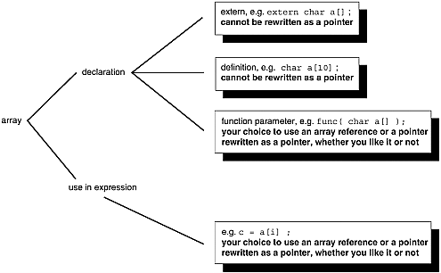
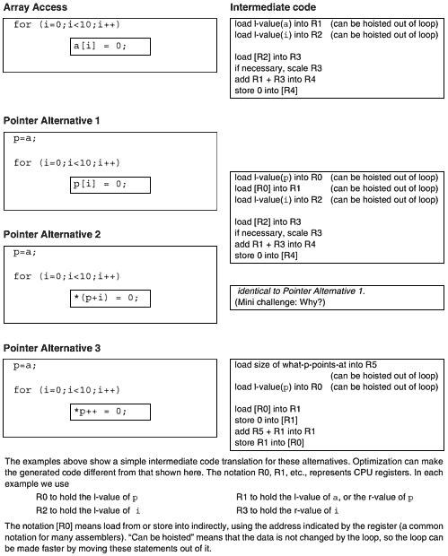
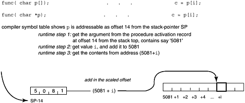
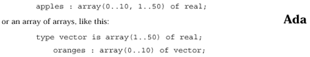
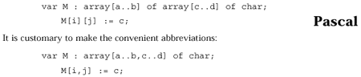
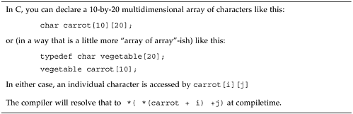
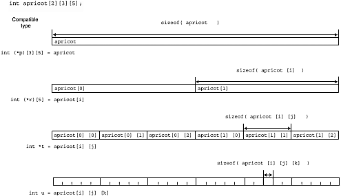
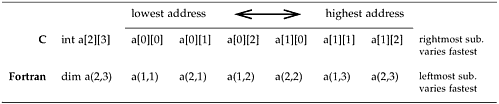
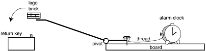
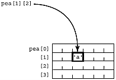

**Chapter 9. More about Arrays**

*Never eat at a place called "Mom's." Never play cards with a man called "Doc."*

*And never, ever, forget that C treats an l-value of type array-of-T in an expression as a pointer to the* *first element of the array.*

—C programmers' saying (Traditional)

when an array is a pointer…why the confusion?…an "array name in an expression" is a pointer…why C treats array subscripts as pointer offsets…an "array name as a function parameter" is a pointer…why C treats array parameters as pointers…how an array parameter is referenced…indexing a slice…arrays and pointers interchangeability summary…C has multi-dimensional arrays…but every other language calls them "arrays of arrays"…how arrays are laid out in memory…how to initialize arrays…some light relief—hardware/software trade-offs **When an Array *Is*** **a Pointer**

An earlier chapter emphasized the most common circumstance when an array may not be written as a pointer. This chapter starts by describing when it can. There are many more occasions in practice when arrays are interchangeable with pointers than when they aren't. Let us consider "declaration" and

"use" (with their conventional intuitive meanings) as individual cases.

Declarations themselves can be further split into three cases:

• declaration of an external array

• definition of an array (remember, a definition is just a special case of a declaration; it allocates space and may provide an initial value)

• declaration of a function parameter

All array names that are function parameters are always converted to pointers by the compiler. In all other cases (and the main interesting case is the "defined as an array in one file/declared as a pointer in another" described in the previous chapter) the declaration of an array gives you an array, the declaration of a pointer gives you a pointer, and never the twain shall meet. But the *use* (reference in a statement or expression) of an array can always be rewritten to use a pointer. A diagram summary is shown in Figure 9-1.

***Figure 9-1. When Arrays are Pointers***

However, arrays and pointers are processed differently by the compiler, represented differently at runtime, and may generate different code. To a compiler, an array is an address, and a pointer is the address of an address. Choose the right tool for the job.

**Why the Confusion?**

Why do people wrongly think that arrays and pointers are completely interchangeable? Because they read the standard reference literature!

*The C Programming Language*, 2nd Ed, Kernighan & Ritchie, foot of page 99: As formal parameters in a function definition

turn leaf to page 100:

char s\[\];

and

char \*s;

are equivalent; . . .

Arggggghhh! Argv! Argc! What a truly unfortunate place to break the page in K&R2! It is easy to miss that the statement of equivalence is made only for the ***one specific case of formal parameters in***

***a function definition***—especially since it is emphasized that subscripted array expressions can always be written as pointer-plus-offset expressions.

"The C Programming Language," Ritchie, Johnson, Lesk & Kernighan, *The Bell System Technical* *Journal,* vol. 57, no. 6, July-Aug 1978, pages 1991-2019: includes a general rule that, whenever the name of an array appears in an expression, it is converted to a pointer to the first member of the array.

The key term "expression" is not defined in the paper.

When people learn to program, they usually start by putting all their code in one function, then progress to several functions, and finally learn how to structure a program over several files. Thus, they get a lot of practice seeing arrays and pointers in function arguments where they *are* fully interchangeable, like this:

char my_array\[10\];

char \* my_ptr;

...

i = strlen( my_array );

j = strlen( my_ptr );

Programmers also see a lot of statements like

printf("%s %s", my_ptr, my_array);

which clearly demonstrate the interchangeability of pointers and arrays.

It's too easy to overlook that this only happens in the specific context of actual parameters in a function call. Worse, you can write

printf("array at location %x holds string %s",a ,a); in which the same statement uses an array name as an address

(pointer) and as an array of characters. This only works because printf is a function, so the array is passed as a pointer. We are also accustomed to seeing the parameter of main declared as char \*\*argv or char \*argv\[\] quite interchangeably. Again, this is only permitted because argv is a function parameter, but it does lull the programmer into wrongly concluding that "C is consistent and regular in its approach to address arithmetic." When you add to this the detailed and lengthy treatment of how subscripted array expressions can always be written in terms of pointers, it is easy to see how the confusion has arisen.

The box below is really important, and will be explained then referred to many times in this chapter and the next one. Pay attention, mark the page, and be prepared to refer to it again several times!

**Software Dogma**

**When Arrays** *Are* **Pointers**

The C standard has the following to say about the matter.

*Rule* An array name **in an expression** (in contrast with a declaration) is treated *1.*

by the compiler as a pointer to the first element of the array \[1\] (paraphrase, ANSI C Standard, paragraph 6.2.2.1).

*Rule* A subscript is always equivalent to an offset from a pointer (paraphrase, *2*.

ANSI C Standard, paragraph 6.3.2.1).

*Rule* An array name **in the declaration of a function parameter** is treated by *3.*

the compiler as a pointer to the first element of the array (paraphrase, ANSI C Standard, paragraph 6.7.1).

\[1\] OK nitpickers, there are a few minuscule exceptions that concern arrays treated as a whole.

A reference to an array is not replaced by a pointer to the first element when:

• sizeof()

• &

•

The executive summary of this is roughly that arrays and pointers are like limericks and haikus: they are related art forms, but each has its own different practical expression. The following sections describe what these rules actually mean in practice.

**Rule 1 An "Array Name in an Expression" Is a Pointer** Rules 1 and 2 (above) in combination mean that subscripted array references can always be written equally well as a pointer-to-base-of-array plus offset. For example, if we declare int a\[10\], \*p, i=2;

then a\[i\] can equally be accessed in any of these ways:

p=a; p=a; p=a+i;

p\[i\]; \*(p+i); \*p;

In fact, it's even stronger than this. An array reference a\[i\] is always rewritten to \*(a+i) by the compiler at compiletime. The C standard requires this conceptual behavior. Perhaps an easy way to follow this is to remember that square brackets \[\] represent a subscript operator, just as a plus sign represents the addition operator. The subscript operator takes an integer and pointer-to-type-T, and yields an object of type T. An array name in an expression becomes a pointer, and there you are: pointers and arrays are interchangeable in expressions because they all boil down to pointers in the end, and both can be subscripted. Just as with addition, the subscript operator is commutative (it doesn't care which way round the arguments come, 5+ 3 equals 3 + 5). This is why, given a declaration like int a\[10\];, both the following are correct:

a\[6\] = ....;

6\[a\] = ....;

The second version is never seen in production code, and has no known use apart from confusing those new to C.

The compiler automatically scales a subscript to the size of the object pointed at. If integers are 4

bytes long, then a\[i+1\] is actually 4 bytes (not 1) further on from a\[i\]. The compiler takes care of scaling before adding in the base address. This is the reason why pointers are always typed—

constrained to point to objects of only one type—so that the compiler knows how many bytes to retrieve on a pointer dereference, and it knows by how much to scale a subscript.

**Rule 2 C Treats Array Subscripts as Pointer Offsets**

Treating array subscripts as a pointer-plus-offset is a technique inherited from BCPL (the language that was C's ancestor). This is the convention that renders it impractical to add runtime support for subscript range-checking in C. A subscript operator hints, but does not ensure, that an array is being accessed. Alternatively, subscripting might be by-passed altogether in favor of pointer access to an array. Under these conditions, range-checking could only be done for a restricted subset of array accesses. In practice it has usually not been considered worthwhile.

Word has gotten out that it is "more efficient" to program array algorithms using pointers instead of arrays.

The popular belief is usually wrong. With modern production-quality optimizing compilers, there is not necessarily a difference in the code generated for one-dimensional arrays and that for references through a pointer. After all, array subscripts are defined in terms of pointers, so it is often possible for the optimizer to make the transformation to the most efficient representation, and output machine instructions for that. Let's take a look at those array/pointer alternatives again, and separate out the initialization from an access in a loop:

int a\[10\], \*p, i;

Variable a\[i\] can equally be accessed in any of the ways shown in Figure 9-2.

***Figure 9-2. Array/Pointer Code Trade-offs***

Even with a simple-minded translation into different generated code, stepping through a onedimensional array is often no faster with a pointer than with a subscript. Scaling needs to be done when striding through consecutive memory locations with a pointer or an array. Scaling is done by multiplying the offset by the size of an element; the result is the true byte offset from the start of the array. The scaling factor is often a power of 2 (e.g., 4 bytes to an integer, 8 bytes in a double, etc.).

Instead of doing a slow multiplication, the scaling can be done by shifting left. A "shift-left-by-three"

is equivalent to multiplying a binary number by eight. If you have array elements the size of which isn't a power of two (e.g., an array of structs), all bets are off.

However, striding down an int array is an idiom that's easily recognized. If a good optimizing compiler does code analysis, and tries to keep base variables in fast registers and to recognize loop paradigms, the end result may be identical generated code for pointers and array accesses in a loop.

Pointers are not necessarily any faster than subscripts when processing one-dimensional arrays. The fundamental reason that C treats array subscripts as pointer offsets is because that is the model used by the underlying hardware.

**Rule 3 An "Array Name as a Function Parameter" Is a Pointer** Rule 3 also needs explaining. First, let's review some terminology laid down in Kernighan and Ritchie.

**Term Definition**

**Example**

Parameter is a variable defined in a function definition

int power( int base, int n);

or a function prototype declaration. Some

base and n are parameters.

people call this a "formal parameter."

Argument is a value used in a particular call to a

i = power(10, j); 10 and j are

function. Some people call this an "actual

arguments. The argument can be different

parameter."

for the different calls of a function.

The standard stipulates that a declaration of a parameter as "array of *type*" shall be adjusted to "pointer to *type*". In the specific case of a definition of a formal function parameter, the compiler is *obliged* to rewrite an array into a pointer to its first element. Instead of passing a copy of the array, the compiler just passes its address. Parameters that are functions are similarly treated as pointers, but let's just stick with arrays for now. The implicit conversion means that

my_function( int \* turnip ) {...}

my_function( int turnip\[\] ) {...}

my_function( int turnip\[200\]){...}

are all completely equivalent. Therefore, my_function() can quite legally be called with an array, or really with a pointer, as its actual argument.

**Why C Treats Array Parameters as Pointers**

The reason arrays are passed to functions as pointers is efficiency, so often the justification for transgressions against good software engineering practice. The Fortran I/O model is tortuous because it was thought "efficient" to re-use the existing (though clumsy and already obsolete) IBM 704

assembler I/O libraries. Comprehensive semantic checking was excluded from the Portable C

Compiler on the questionable grounds that it is more "efficient" to implement lint as a separate

program. That decision has been implicitly revoked by the enhanced error checking done by most ANSI C compilers.

The array/pointer equivalence for parameters was done for efficiency. All non-array data arguments in C are passed "by value" (a copy of the argument is made and passed to the called function; the function cannot change the value of the actual variable used as an argument, just the value of the copy it has). However, it is potentially very expensive in memory and time to copy an array; and most of the time, you don't actually want a copy of the array, you just want to indicate to the function which particular array you are interested in at the moment. One way to do this might be to allow parameters to have a storage specifier that says whether it is passed by value or by reference, as occurs in Pascal.

It simplifies the compiler if the convention is adopted that all arrays are passed as a pointer to the start, and everything else is passed by making a copy of it. Similarly the return value of a function can never be an array or function, only a *pointer* to an array or function.

Some people like to think of this as meaning that all C arguments are call-by-value by default, except arrays and functions; these are passed as call-by-reference parameters. Data can be explicitly passed as call-by-reference by using the "address of" operator. This causes the address of the argument to be sent, rather than a copy of the argument. In fact, a major use of the address-of operator & is simulating call-by-reference. This "by reference" viewpoint isn't strictly accurate, because the implementation mechanism is explicit—in the called procedure you still only have a pointer to something, and not the thing itself. This makes a difference if you take its size or copy it.

**How an Array Parameter Is Referenced**

Figure 9-3 shows the steps involved in accessing a subscripted array parameter.

***Figure 9-3. How a Subscripted Array Parameter Is Referenced***

Note well that this is identical to Diagram C on page 101, showing how a subscripted pointer is looked up. The C language permits the programmer to declare and refer to this parameter as either an array (what the programmer intends to pass to the function) or as a pointer (what the function actually gets).

The compiler knows that whenever a formal parameter is declared as an array, inside the function it will in fact always be dealing with a pointer to the first element of an array of unknown size. Thus, it can generate the correct code, and does not need to distinguish between cases.

No matter which of these forms the programmer writes, the function doesn't automatically know how many elements there are in the pointed-to thing. There has to be some convention, such as a NUL end marker or an additional parameter giving the array extent. This is not true in, for example, Ada, where

every array carries around with it a bunch of information about its element size, dimensions, and indices.

Given these definitions:

func( int \* turnip){...}

or

func( int turnip\[\]){...}

or

func( int turnip\[200\]){...}

int my_int; /\* data definitions \*/

int \* my_int_ptr;

int my_int_array\[10\];

you can legally call any of the function prototypes above with any of the following arguments. They are often used for very different purposes:

***Table 9-1. Common Uses of Array/Pointer Actual Parameters***

**Actual Argument in Call**

**Type**

**Common Purpose**

func(&my_int );

Address of an integer

"Call-by-reference" of an int

func( my_int_ptr );

A pointer to an integer

To pass a pointer

func( my_int_array );

An array of integers

To pass an array

func(&my_int_array\[i\] ); Address of an element of int array To pass a slice of an array Conversely, if you are inside func(), you don't have any easy way of telling which of these alternative arguments, and hence with which purpose, the function was invoked. All arrays that are function arguments are rewritten by the compiler at compiletime into pointers. Therefore, any reference inside a function to an array parameter generates code for a pointer reference. Figure 9-3 on page 247 shows what this means in practice.

Interestingly, therefore, there is no way to pass an array itself into a function, as it is always automatically converted into a pointer to the array. Of course, using the pointer inside the function, you can pretty much do most things you could have done with the original array. You won't get the right answer if you take the size of it, though.

You thus have a choice when declaring such a function. You can define the parameter as either an array or a pointer. Whichever you choose, the compiler notices the special case that this object is a function argument, and it generates code to dereference the pointer.

**Programming Challenge**

**Play Around with Array/Pointer Arguments**

Write and execute a program to convince yourself that the preceding information is true.

1\. Define a function that takes a character array ca as an argument. Inside the function, print out the values of &ca and &(ca\[0\]) and &(ca\[1\]).

2\. Define another function that takes a character pointer pa as an argument.

Inside the function, print out the values of &pa and &(pa\[0\]) and

&(pa\[1\]) and ++pa.

3\. Set up a global character array ga and initialize it with the letters of the alphabet. Call the two functions using this global as the parameter. Compare the values that you print out.

4\. In the main routine, print out the values of &ga and &(ga\[0\]) and

&(ga\[1\]).

5\. Before running your program, write down which values you expect to match, and why. Account for any discrepancies between your expected answers and observed results.

It takes some discipline to keep all this straight! Our preference is always to define the parameter as a pointer, since that is what the compiler rewrites it to. It's questionable programming style to name something in a way that wrongly represents what it is. But on the other hand, some people feel that: int table\[\]

instead of

int \*table

explains your intentions a bit better. The notation table\[\] makes plain that there are several more int elements following the one that table points to, suggesting that the function will process them all.

Note that there is one thing that you can do with a pointer that you cannot do with an array name: change its value. Array names are not modifiable l-values; their value cannot be altered. See Figure 9-4

(the functions have been placed side by side for comparison; they are all part of the same file).

***Figure 9-4 Valid Operations on Arrays that are Arguments***

**pointer argument array argument pointer non-argument** int array\[100\],

array2\[100\];

fun1(int \*ptr) fun2(int arr\[\]) main()

{ { {

ptr\[1\]=3; arr\[1\]=3; array\[1\]=3;

\*ptr = 3; \*arr = 3; \*array = 3;

ptr = array2; arr = array2; array =

array2;/\*FAILS\*/

} } }

The statement array = array2; will cause a compiletime error along the lines of "cannot change the value of an array name". But it is valid to write arr = array2; because arr, though declared as an array, is actually a pointer.

**Indexing a Slice**

An entire array is passed to a function by giving it a pointer to the zeroth element, but you can give it a pointer to any element, and pass in just the last part of the array. Some people (primarily Fortran programmers) have extended this technique the other way. By passing in an address that is one before the start of the array (a\[-1\]), you can effectively give the array an index range of 1 to N, instead of 0

to N - 1.

If, like many Fortran programmers, you are used to programming algorithms where all the arrays have bounds 1 to N, this is very attractive to you. Unhappily, this trick goes completely outside the Standard (Section 6.3.6, "Additive Operators," is where it is prohibited), and indeed is specifically labelled as causing undefined behavior, so don't tell anyone you heard it from me.

It is very simple to achieve the effect that Fortran programmers want: just declare all your arrays one element larger than needed so that the index ranges from 0 to N. Then only use elements 1 to N. No muss, no fuss. It's that easy.

**Arrays and Pointers Interchangeability Summary**

Caution: don't read this unless you've read and understood the preceding chapter, or it may cause permanent brain-fade.

1\. An array access a\[i\] is always "rewritten" or interpreted by the compiler as a pointer access \*(a+i);

2\. Pointers are always just pointers; they are never rewritten to arrays. You can apply a subscript to a pointer; you typically do this when the pointer is a function argument, and you know that you will be passing an array in.

3\. An array declaration in the specific context (only) of a function parameter can equally be written as a pointer. An array that is a function argument (i.e., in a call to the function) is always changed, by the compiler, to a pointer to the start of the array.

4\. Therefore, you have the choice for defining a function parameter which is an array, either as an array or as a pointer. Whichever way you define it, you actually get a pointer inside the function.

5\. In all other cases, definitions should match declarations. If you defined it as an array, your extern declaration should be an array. And likewise for a pointer.

**C Has Multidimensional Arrays…**

Some people claim that C doesn't have multidimensional arrays. They're wrong. Section 6.5.4.2 of the ANSI standard and its footnote number 69 says:

When several "array of" specifications *(i.e., the square brackets that denote an index)* are adjacent, a multidimensional array is declared.

**…But Every Other Language Calls Them "Arrays of Arrays"**

What these people mean is that C doesn't have multidimensional arrays **as they appear in other** **languages**, like Pascal or Ada. In Ada you can declare a multidimensional array as shown in Figure 9-5.

***Figure 9-5. Ada Example***

But you can't mix apples and sauerkraut. In Ada, multidimensional arrays and arrays of arrays are two completely different beasts.

The opposite approach was taken by Pascal, which regards arrays of arrays and multidimensional arrays as completely interchangeable and equivalent at all times. In Pascal you can declare and access a multidimensional array as shown in Figure 9-6.

***Figure 9-6. Pascal Example***

*The Pascal User Manual and Report* \[1\] explicitly says that arrays of arrays are equivalent to and interchangeable with multidimensional arrays. The Ada language is more tightly buttoned, and strictly maintains the distinction between the arrays of arrays and multidimensional arrays. In memory they look the same, but it makes a big difference as to what types are compatible and can be assigned to individual rows of an array of arrays. It's rather like choosing between a float and an int for a variable: you choose the type that most closely reflects the underlying data. In Ada, you would typically use a multidimensional array when you have independently varying indices, such as the Cartesian coordinates specifying a point. You would typically use an array of arrays when the data is more hierarchical, for example, an array \[12\] months of \[5\] weeks of \[7\] days for keeping a daily record of something, but also being able to manipulate an entire week or month at a time.

\[1\] *The Pascal User Manual and Report,* Springer-Verlag, 1975, p. 39.

**Handy Heuristic**

**What "Multidimensional" Means in Different Languages** The Ada standard explicitly says arrays of arrays and multidimensional arrays are different.

The Pascal standard explicitly says arrays of arrays and multidimensional arrays are the same.

C only has what other languages call arrays of arrays, but it also calls these

"multidimensional."

C's approach is somewhat unique: The only way to define and reference multidimensional arrays is with arrays of arrays. Although C refers to arrays of arrays as multidimensional arrays, there is no way to "fold" several indices such as \[i\]\[j\]\[k\] into one Pascal-style subscript expression such as

\[i,j,k\]. If you know what you're doing, and you don't mind a nonconforming program, you can calculate what the equivalent offset to \[i\]\[j\]\[k\] is, and just reference with one subscript \[z\]. This is not recommended practice. Worse still, \[i,j,z\] is a legal (comma-separated) expression. It doesn't reference several subscripts, though. C thus supports what other languages generally call

"arrays of arrays," but C blurs the distinction and confuses the hell out of many people by also calling these "multidimensional arrays." (See Figure 9-7.)

***Figure 9-7. Arrays of Arrays***

Although its terminology refers to "multidimensional arrays," C really only supports "arrays of arrays." It greatly simplifies this rather taxing area if your mental model is that whenever you see

"array" in C, think "vector" (i.e., one-dimensional array of something, possibly another array).

**Handy Heuristic**

**Arrays in C Are One-Dimensional**

Whenever you see "array" in C, think "vector," that is, a **one-dimensional** array of *something*, possibly another array.

**How Multidimensional Arrays Break into Components**

Note carefully how multidimensional arrays can be broken into their individual component arrays. If we have the declaration

int apricot\[2\]\[3\]\[5\];

this tells us that the same storage can be looked at in any of the ways shown in Figure 9-8.

***Figure 9-8. Multidimensional Array Storage***

Normally, one assigns between two identical types, integer to integer, double to double, and so on. In Figure 9-8, we see that each individual array within the array-of-array-of-arrays is compatible with a pointer. This is because an array-name in an expression decays into a "pointer-to-element" (Rule 1 on page 242). In other words, you can't assign an array to something of the same type because an array cannot be assigned to as a whole. You can load a *pointer* with the value of the array-name because of the "array-name in an expression decays into a pointer" rule.

The dimensions of the array that the pointer points to make a big difference. Using the declarations in the example above,

r++;

t++;

will increment r and t to point to their next respective element, (in both cases, this element is itself an array). The increment will be scaled by quite different amounts, because r points to array elements that are three times larger than the array elements to which t points.

**Programming Challenge**

**Hooray for Arrays!**

Using the declarations:

int apricot\[2\]\[3\]\[5\];

int (\*r)\[5\] = apricot\[0\];

int \*t = apricot\[0\]\[0\];

write a program to print out the initial values of r and t in hex (use the %x printf conversion character to print a hex value), increment these two pointers, and print out their new values.

Before running the program, predict how many bytes the increment will actually cause to be added to each pointer. Use Figure 9-8 on page 255 to help you.

**How Arrays Are Laid Out in Memory**

With multidimensional arrays in C the rightmost subscript varies fastest, a convention known as "row major addressing". Since the "row/column major addressing" term really only makes sense for arrays with exactly two dimensions, a preferred term is "rightmost subscript varies fastest". Most algorithmic languages use "rightmost subscript varies fastest", the major exception being Fortran, which prefers leftmost, or column major addressing. The subscript that varies fastest makes a difference to the way in which arrays are laid out in memory. Indeed, if you pass a C matrix to a Fortran routine, the matrix will appear transposed—a huge kludge, advantage of which is occasionally taken.

***Figure 9-9. Row Major versus Column Major Order***

The most common use of multidimensional arrays in C is to store several strings of characters. Some people point out that rightmost-subscript-varies-fastest is advantageous for this (adjacent characters in each string are stored next to each other); this is not true for multidimensional arrays of characters in leftmost-subscript-varies-fastest order.

**How to Initialize Arrays**

In the simplest case, one-dimensional arrays can be given an initial value by enclosing the list of values in the usual curly braces. As a convenience, if you leave out the size of the array, it creates it with the exact size to hold that number of initial values.

float banana \[5\] = { 0.0, 1.0, 2.72, 3.14, 25.625 };

float honeydew\[\] = { 0.0, 1.0, 2.72, 3.14, 25.625 };

You can only assign to an entire array during its declaration. There's no good reason for this restriction.

Multidimensional arrays can be initialized with nested braces: short cantaloupe\[2\]\[5\] = {

{10, 12, 3, 4, -5},

{31, 22, 6, 0, -5},

};

int rhubarb\[\]\[3\] ={ {0,0,0}, {1,1,1}, };

Note that you can include or omit that comma after the last initializer. You can also omit the most significant dimension ( *only* the most significant dimension), and the compiler will figure it out from the number of initializers given.

If the array dimension is bigger than the number of initial values provided, the remaining elements are set to zero. If they are pointers they are set to NULL. If they are floating point elements, they are set to 0.0. In the popular IEEE 754 standard floating point implementation, as used on the IBM PC and Sun systems, the bit pattern for 0.0 is the same as integer zero in any case.

**Programming Challenge**

**Check Those Bit Patterns**

Write a one-liner to check whether or not the bit pattern for floating point 0.0 is the same as integer zero on your system.

Here's how you initialize a two-dimensional array of strings:

char vegetables\[\]\[9\] = { "beet",

"barley",

"basil",

"broccoli",

"beans" };

One useful facility is to set up an array of pointers. String literals can be used as array initializers, and the compiler will correctly store the addresses in the array. Thus, char \*vegetables\[\] = { "carrot",

"celery",

"corn",

"cilantro",

"crispy fried potatoes" }; /\* works

fine \*/

Notice how the initialization part is identical to the array of arrays of characters initialization. Only string literals have this privilege of initializing pointer arrays. Arrays of pointers can't be directly initialized with non-string types:

int \*weights\[\] = { /\* will NOT compile successfully

\*/

{1,2,3,4,5},

{6,7},

{8,9,10}

}; /\* will NOT compile successfully

\*/

The secret to doing this kind of initialization is to create the rows as individual arrays, and use those array names to initialize the original array.

int row_1\[\] = {1,2,3,4,5,-1}; /\* -1 is end-of-row marker \*/

int row_2\[\] = {6,7,-1};

int row_3\[\] = {8,9,10,-1};

int \*weights\[\] = {

row_1,

row_2,

row_3

};

More about this in the next chapter, on pointers. But first, a little light relief.

**Some Light Relief—Hardware/Software Trade-Offs**

To be a successful programmer, you have to have a good understanding of the software/hardware trade-offs. Here's an example that I heard from a friend of a friend. Many years ago there was a large mail order company which used an old IBM legacy mainframe to maintain their names and addresses database. This machine had no batch control mechanism at all.

The IBM system was obsolete, and was due to be replaced by a Burroughs system. That shows you how long ago it was—Burroughs (or "Rubs-rough" as we anagramatically adapted it) hasn't existed since the mid 1980's when it merged with Sperry to produce Unisys. Meanwhile, back at the data processing ranch, the IBM was running at full capacity, including a night shift. The sole task of the night operator was to wait until the day jobs finished, then start up four more jobs at intervals throughout the night.

The data processing manager realized that he could free up the night operator to work on the day shift if he could find a way to start batch jobs at certain times. IBM quoted a figure in the tens of thousands of dollars for the software upgrade to provide this. Nobody wanted to spend that much on a machine that was soon to be decommissioned. It so happened that the machine was divided into several partitions, each with an attached terminal. It was possible to arrange the night jobs so that each one was initiated from a different terminal. Each terminal could be set up so that the job would start as soon as the return key was pressed. The manager then designed and built four copies of a device he called the "phantom finger," illustrated in Figure 9-10.

***Figure 9-10. The Phantom Finger***

Each night a phantom finger was set up behind each terminal. At 2 a.m., the first alarm would go off.

The winder on the alarm wound up the thread, pulling out a pin, which caused the arm to drop onto the return key. The Lego brick snapped off, avoiding key bounce or repetition, and the job started.

Although everyone laughed at this contraption, it worked for six months until the new system was in place! Within hours of the new system being commissioned, systems engineers from both Burroughs and IBM were begging for a surviving example of these Rube Goldberg devices. And that is the essence of a successful software-hardware trade-off.

**Programming Solution**

**Playing Around with Array/Pointer Arguments**

char ga\[\] = "abcdefghijklm";

void my_array_func( char ca\[10\] )

{

printf(" addr of array param = %#x \n",&ca);

printf(" addr (ca\[0\]) = %#x \n",&(ca\[0\]));

printf(" addr (ca\[1\]) = %#x \n",&(ca\[1\]));

printf(" ++ca = %#x \n\n", ++ca);

}

void my_pointer_func( char \*pa )

{

printf(" addr of ptr param = %#x \n",&pa);

printf(" addr (pa\[0\]) = %#x \n",&(pa\[0\]));

printf(" addr (pa\[1\]) = %#x \n",&(pa\[1\]));

printf(" ++pa = %#x \n", ++pa);

}

main()

{

printf(" addr of global array = %#x \n",&ga);

printf(" addr (ga\[0\]) = %#x \n",&(ga\[0\]));

printf(" addr (ga\[1\]) = %#x \n\n",&(ga\[1\]));

my_array_func( ga );

my_pointer_func( ga );

}

**And the output is:**

% a.out

addr of global array = 0x20900

addr (ga\[0\]) = 0x20900

addr (ga\[1\]) = 0x20901

addr of array param = 0xeffffa14

addr (ca\[0\]) = 0x20900

addr (ca\[1\]) = 0x20901

++ca = 0x20901

addr of ptr param = 0xeffffa14

addr (pa\[0\]) = 0x20900

addr (pa\[1\]) = 0x20901

++pa = 0x20901

It looks a little weird at first sight, to see the address of an array parameter not equal to the address of the first element of the array parameter, but it's true enough.

You can win a lot of money-making bets with novice C programmers about what the sizeof operator will produce in this circumstance.