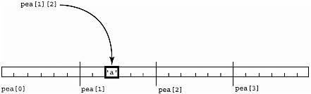
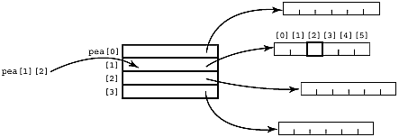
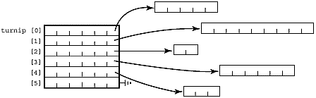
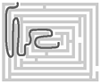

**Chapter 10. More About Pointers**

*Never forget that when you point the finger at someone, three of your own fingers are pointing back at* *you…*

—Suspicious spy's proverb

the layout of multidimensional arrays…an array of pointers is an "Iliffe vector"…using pointers for ragged arrays…passing a one-dimensional array to a function…using pointers to pass a multidimensional array to a function…using pointers to return an array from a function…using pointers to create and use dynamic arrays…some light relief—the limitations of program proofs **The Layout of Multidimensional Arrays**

Multidimensional arrays are uncommon in systems programming and, not surprisingly, C does not define the elaborate runtime routines that other languages require to support this feature. For some constructs, like dynamic arrays, programmers must allocate and manipulate memory explicitly with pointers rather than have the compiler do the work. For another construct (multidimensional arrays as parameters), there is no way of expressing the general case in C at all. This chapter covers these issues.

By now, everyone is familiar with the layout of a multidimensional array in memory. If we have the declaration

char pea\[4\]\[6\];

some people think of the two-dimensional array having its individual rows laid out in a table, as in Figure 10-1.

***Figure 10-1. Presumed Memory Layout of a Two-dimensional Array***

Never allow a programmer like this to park your car. The storage and a reference to an individual element are actually laid out in linear memory as shown in Figure 10-2.

***Figure 10-2. Actual Memory Layout of a Two-dimensional Array***

The rules for array subscripting (see Chapter 9, page 242) tell us that to evaluate the l-value pea\[i\]\[j\], we take whatever is at pea\[i\] and then get the character at offset \[j\] from there. Thus, pea\[i\]\[j\]

is resolved by the compiler as

\*(\*(pea+i)+j)

But (and here's the key point!) the meaning of "pea\[i\]" varies depending on how pea was defined.

We'll come back to this expression in a minute, but first let's take a look at a very common and important C data structure: the one-dimensional array of pointers to strings.

**An Array of Pointers Is an "Iliffe Vector"**

A similar effect to a two-dimensional array of char can be obtained by declaring a onedimensional array of *pointers*, each of which points to a character string. \[1\] The C declaration for this is

\[1\] We're simplifying things very slightly here—the pointer is actually declared as a pointer to a single character. By declaring a pointer-to-character we leave open the possibility that other characters can be stored adjacent to the first, implicitly forming a string. A declaration like char (\* rhubarb\[4\])\[7\]; is truly the way we declare an array of pointers to strings. This is never seen in practice, as it constrains the size of the pointed-to arrays unnecessarily (to be exactly seven characters long).

char \* pea\[4\];

**Software Dogma**

**Reminder on Declaration Syntax**

Note that char \*turnip\[23\] declares "turnip" to be a 23-element array, each element of which is a pointer to a character (or a character-string—there's no way to distinguish from

the declaration). Think of it as parenthesized—(char \*) turnip\[23\]. It is not what it appears to be if you read it from left to right: a pointer to a 23-element array of characters.

This is because index brackets have a higher precedence than the pointer asterisk. This is fully covered in Chapter 3 on declarations.

An array of pointers that implements support for a multidimensional array is variously termed an

"Iliffe vector," a "display," or a "dope vector." A display is also used in Britain to mean a vector of pointers to active stack frames of lexically enclosing procedures (as an alternative to a static link followed by a linked list). An array of pointers like this is a powerful programming technique that has wide applicability outside C. In diagram form, we have the structure shown in Figure 10-3.

***Figure 10-3. An Array of Pointers-to-String***

The array must be initialized with pointers to memory allocated for the strings, either at compile time with a literal initializer, or at runtime with code like this: for (j=0;j\<=4;j++) {

pea\[j\] = malloc( 6 );

Another approach is to malloc the entire x by y data array at once, malloc(row_size \* column_size \* sizeof(char) ) ;

then use a loop to assign pointers to locations within that region. The entire array is guaranteed to be stored in contiguous memory in the order that C allocates static arrays. It reduces the bookkeeping overhead of calls to malloc, but prevents you from freeing an

individual string when you're done with it.

**Software Dogma**

**When You See** **squash\[i\]\[j\]** **—You Don't Know How It Was Declared!**

One problem with being able to double-subscript a two-dimensional array and a one-

dimensional array of pointers is that looking at the reference squash\[i\]\[j\] does not tell you whether squash was declared as:

int squash\[23\]\[12\]; /\* array \[23\] of array\[12\] of int

\*/

or

int \* squash\[23\]; /\* an Iliffe vector of 23

pointers-to-int \*/

or

int \*\* squash; /\* pointer to a pointer to int \*/

or even

int (\* squash)\[12\]; /\* pointer to array-of-12-ints \*/

This is similar to the inability (inside a function) to tell whether an array or a pointer was passed as the actual argument, of course, for the same reason: array names as l-values

"decay" into pointers.

The identical reference squash\[i\]\[j\] works for accessing any of these definitions, though the kind of access is different in the different cases.

Just as with an array of arrays, an individual character in an Iliffe vector will be referenced with two indices, (e.g., pea\[i\]\[j\]). The rules for pointer subscripting (see Chapter 9, page 242) tell us that pea\[i\]\[j\] becomes:

\* ( \*(pea + i) + j )

Does this look familiar? It should. It's exactly the same expression to which a multidimensional array reference decomposes, and it is explained this way in many C books. There's one big problem, however. Although the two subscripts look identical in the source, and both decompose to the identical pointer expression, a different kind of reference is done in each case. Tables 10-1 and 10-2 show the distinction.

***Table 10-1. char a\[4\]\[6\]—An Array-of-Arrays***

**char a\[4\]\[6\]** **—An Array-of-Arrays**

compiler symbol table has a as address 9980

*runtime step 1:* get value i, scale it by the size of a row (6 bytes here), and add it to 9980

*runtime step 2:* get value j, scale it by the size of an element (1 byte here), add it to previous step's result

*runtime step 3:* get the contents from address (9980 + i\*scale-factor1 + j\*scale-factor2) a\[i\]\[j\]

The definition char a\[4\]\[6\] says a is an array \[4\], each element of which is an array \[6\], each element of which is a char. So the look-up goes to the *i*'th of the four arrays (steps over *i* six-byte arrays to get there), then gets the *j*'th character in that array.

***Table 10-2. char \*p\[4\]—An Array of Pointers-to-String***

**char \*p\[4\]** *—***An Array of Pointers-to-String**

compiler symbol table has p as address 4624

*runtime step 1:* get value i, scale it by the size of a pointer (4 bytes here), and add it to 4624

*runtime step 2:* get the contents from address (4624+ scaled value i), say '5081'

*runtime step 3:* get value j, scale it by the size of an element (1 byte here), add it to 5081

*runtime step 4:* get the contents from address (5081+j) p\[i\]\[j\]

The definition char \* p\[4\] says p is an array \[4\], each element of which is a pointer-to-char. So the look-up can't even be completed unless the pointers have been filled in to point to characters (or arrays of characters). Assuming everything has been given a value, the look-up goes to the *i*'th element of the array (each element is a pointer), retrieves the pointer value there, adds j to it, and retrieves whatever is at *that* address.

This works because of rule 2 in Chapter 8: *a subscript is always equivalent to an offset from a pointer.*

Thus, turnip\[i\] selects an individual element, which happens to be a pointer; then applying subscript \[j\] to this yields \*(pointer + j), which reaches a single character. This is merely an extension of a\[2\] and p\[2\] both evaluating to a character, as we saw in the previous chapter.

**Using Pointers for Ragged Arrays**

Iliffe vectors are an old compiler-writing technique, first used in Algol-60. They were originally used to speed up array references, and on limited-memory machines to simplify keeping only part of an array in main memory. Neither of these uses is as applicable on modern systems, but Iliffe vectors are valuable in two other ways: for storing tables where the rows are different lengths, and for passing arrays of strings in a function call. If you need to store 50 strings which can vary in length up to 255

characters, you could declare the following two-dimensional array:

char carrot\[50\]\[256\];

This reserves the 256 characters for each of the fifty strings, even if in practice some of them are only one or two bytes long. If you do this a lot, it can be wasteful of memory. One alternative is to use an array of pointers-to-strings, and note that the second level arrays don't all have to be the same size, as shown in Figure 10-4.

***Figure 10-4. A Ragged String Array***

If you declare an array of pointers to strings, and allocate memory for these strings as needed, you will be much more frugal with machine resources. Some people call these "ragged arrays" because of the uneven right-hand ends. You can create one by filling the Iliffe vector with pointers to strings which already exist, or by allocating memory for a fresh copy of the string. Both of these approaches are shown in Figure 10-5.

***Figure 10-5 Creating a Ragged String Array***

char \* turnip\[UMPTEEN\];

char my_string\[\] = "your message here";

/\* share the string \*/ /\* copy the string \*/

turnip\[i\] = &my_string\[0\]; turnip\[j\] =

malloc( strlen(my_string)

\+ 1 );

strcpy(turnip\[j\], my_string);

Wherever possible with strings, don't make a fresh copy of the entire string. If you need to reference it from two different data structures, it's much faster and uses less store to duplicate the pointer, not the string. Another performance aspect to consider is that Iliffe vectors may cause your strings to be allocated on different pages in memory. This could detract from locality of reference and cause more paging, depending on how, and how frequently, you reference the data.

**Handy Heuristic**

**How Array and Pointer Parameters Are Changed by the Compiler** The "array name is rewritten as a pointer argument" rule isn't recursive. An array of arrays is rewritten as a "pointer to arrays" *not* as a "pointer to pointer".

**Argument is:**

**Matches Formal Param:**

array of array

char c\[8\]\[10\]; char (\*c)\[10\]; pointer to array

array of pointer

char \*c\[15\];

char \*\*c;

pointer to pointer

pointer to array

char (\*c)\[64\]; char (\*c)\[64\]; *doesn't change*

pointer to pointer char \*\*c;

char \*\*c;

*doesn't change*

The reason you see char \*\* argv is that argv is an array of *pointers* (i.e., char

\*argv\[\]). This decays into a pointer to the element, namely a pointer to a pointer. If the argv parameter were actually declared as an array of *array* s (say, char argv\[10\]\[15\]) it would decay to char (\* argv)\[15\] (i.e., a pointer to an array of characters) *not* char \*\* argv.

**For Advanced Students Only**

Take a moment to refer back to Figure 9-8, "Multidimensional Array Storage," on page 255. See how the variables labelled "compatible type" down the left side of that diagram exactly match how you would declare the corresponding array as a function argument (shown in the table above).

This is not too surprising. Figure 9-8 shows how an array name in an expression decays into a pointer; the table above shows how an array name as a function argument decays into a pointer. Both cases are governed by a similar rule about an array name being rewritten as a pointer in that specific context.

Figure 10-6 shows all combinations of valid code. We see:

• all three functions take same type of argument, an array \[2\]\[3\]\[5\] or a pointer to an array\[3\]\[5\]

of int.

• all three variables, apricot, p, \*q match the parameter declaration of all three functions.

***Figure 10-6 All Combinations of Valid Code***

my_function_1( int fruit \[2\]\[3\]\[5\] ) { ; }

my_function_2( int fruit \[\]\[3\]\[5\] ) { ; }

my_function_3( int (\*fruit)\[3\]\[5\] ) { ; }

int apricot\[2\]\[3\]\[5\];

my_function_1( apricot );

my_function_2( apricot );

my_function_3( apricot );

int (\*p) \[3\]\[5\] = apricot;

my_function_1( p );

my_function_2( p );

my_function_3( p );

int (\*q)\[2\]\[3\]\[5\] = &apricot;

my_function_1( \*q );

my_function_2( \*q );

my_function_3( \*q );

**Programming Challenge**

**Check It Out**

Type in the C code in Figure 10-6 and try it for yourself.

**Passing a One-Dimensional Array to a Function**

One-dimensional arrays of any type can be used as function arguments in C. The parameter is rewritten as a pointer to its first element, so you may need a convention for indicating the total size of the array. There are two basic methods:

• Send an additional parameter that gives the number of elements (this is what argc does)

• Give the last element in the array a special value to indicate the end of data (this is what the nul character at the end of a string does). The special value must be one that can't otherwise occur in the data.

Two-dimensional arrays are a little bit trickier, as the array is rewritten as a pointer to the first row.

You now need two conventions, one to indicate the end of an individual row, and one to indicate the end of all the rows. The end of an individual row can be signified by either of the two methods that work for one-dimensional arrays. So can the end of all the rows. We are passed a pointer to the first element of the array. Each time we increment the pointer, we get the address of the next row in the array, but how do we know when we have reached the limit of the array? We can add an additional row filled with some out-of-bound value that won't otherwise occur—if there is one. When you increment the pointer, check to see if it has reached this row. Alternatively, define yet another parameter that gives the total number of rows.

**Using Pointers to Pass a Multidimensional Array to a Function** The problem of marking the extent of the array would be solvable with the ugly methods described above. But we also have the problem of declaring the two-dimensional array argument inside the function, and that's where the real trouble lies. C has no way to express the concept "the bounds of this array can vary from call to call." The C compiler insists on knowing the bounds in order to generate the correct code for indexing. It is technically feasible to handle this at runtime, and plenty of other languages do, but this is not the C philosophy.

About the best we can do is to give up on two-dimensional arrays and change array\[x\]\[y\] into a one-dimensional array\[x+1\] of pointers to array\[y\]. This reduces the problem to one we have already solved, and we can store a null pointer in the highest element array\[x+1\] to indicate the end of the pointers.

**Software Dogma**

**There Is No Way in C to Pass a General Multidimensional Array to a Function** This is because we need to know the size of each dimension, to do the correct scaling for address arithmetic. There is no way in C of communicating this data (which will change with each call) between the actual and formal parameters. You therefore have to give the size of all but the leftmost dimension in the formal parameter. That in turn restricts the actual parameter to arrays where all but the leftmost dimension must match in size.

invert_in_place( int a\[\]\[3\]\[5\] );

can be called by either of:

int b\[10\]\[3\]\[5\]; invert_in_place( b );

int c\[999\]\[3\]\[5\]; invert_in_place( c );

But arbitrary 3-dimensional arrays like:

int fails1\[10\]\[5\]\[5\]; invert_in_place( fails1 );/\* does

NOT compile \*/

int fails2\[999\]\[3\]\[6\]; invert_in_place( fails2 );/\* does

NOT compile \*/

fail to compile.

Arrays of two or more dimensions cannot be used as parameters in the general case in C. You cannot pass a general multidimensional array to a function. You can pass specific arrays of known prespecified size, but it cannot be done in the general case.

The most obvious way is to declare a function prototype like this: **Attempt 1**

my_function( int my_array \[10\]\[20\] );

Although this is the simplest way, it is also the least useful, as it forces the function to process only arrays of exactly size 10 by 20 integers. What we really want is a means of specifying a more general multidimensional array parameter, such that the function can operate on arrays of any size. Note that the size of the most significant dimension does not have to be specified. All the function has to know is the sizes of all the other dimensions, and the base address of the array. This provides enough information to "step over" a complete row and reach the next one.

**Attempt 2**

We can legally drop the first dimension, and declare our multidimensional array as: my_function( int my_array \[\]\[20\] );

This is still not good enough, as all the rows are still constrained to be exactly 20 integers long. The function could equally be declared as:

my_function( int (\* my_array)\[20\] );

The brackets around (\* my_array) in the parameter list are absolutely necessary to ensure that it is translated as a single pointer to a 20-element array of int's, and not an array of 20 pointers-to-int.

Again, though, we are tied to an array of size twenty in the rightmost dimension.

**Software Dogma**

**Conformant Arrays**

As originally designed, Pascal had the same functionality gap as C—there was no way to pass arrays of different sizes to the same function. In fact Pascal was worse, because it could not even support the case of one-dimensional arrays, which C can. Array bounds were part of the signature of a function, and a type mismatch would occur if argument sizes did not match in all respects. Pascal code like the following failed: var apple : array\[1..10\] of integer;

procedure invert( a: array\[1..15\] of integer);

invert(apple); { fails to compile! }

To repair this defect, the Pascal standardization language-meisters dreamed up a concept called *conformant arrays*—a better name would have been *confuse 'em array* s. It's a protocol for communicating array sizes between actual and formal parameters. It's not immediately apparent to normal programmers how it works, and it's not in any other mainstream languages. You have to write code like the following:

procedure a(fname: array\[lo..hi:integer\] of char);

The data names lo and hi (or whatever you called them) get filled in with the corresponding array bounds from the actual parameter in each call. Experience has shown that many programmers find this confusing. In solving for the general case, the language designers also made the simplest case of literal fixed array bounds illegal: 1 procedure a(fname: array\[1..70\] of char);

E --------------------------^--- Expected identifier

This aspect of the language definition clearly runs counter to the expectations of many programmers, and generates numerous support calls to this day. We regularly get an escalation about this "Pascal compiler bug" every couple of months on the Sun compiler team. There are other problems with Pascal-conformant arrays; for example, a conformant array of characters does not have string type (because its type isn't denoted by an array type), so even though it is an array of characters, it cannot be used where a string is expected! Conformant formal array parameters cause more grief for Pascal programmers than just about anything else, except maybe interactive I/O. Worse still, some people are now talking about adding conformant arrays to C.

**Attempt 3**

The third possibility is to give up on two-dimensional arrays and change the organization to an Iliffe vector; that is, create a one-dimensional array of pointers to something else. Think of the parameters of the main routine. We are used to seeing char \* argv\[\]; and even sometimes char \*\*

argv;, reminding ourselves of this makes the notation easy to unscramble. Simply pass a pointer to the zeroth element as the parameter, like this (for a two-dimensional array): my_function( char \*\*my_array );

**But you can only do this if you first change the two-dimensional array into an array of** **pointers to vectors!**

The beauty of the Iliffe vector data structure is that it allows arbitrary arrays of pointers to strings to be passed to functions, but *only* arrays of pointers, and *only* pointers to strings. This is because both strings and pointers have the convention of an explicit out-of-bound value (NUL and NULL, respectively) that can be used as an end marker. With other types, there is no general foolproof out-of-bound value and hence no built-in way of knowing when you reach the end of a dimension. Even with an array of pointers to strings, we usually use a count argc of the number of strings.

**Attempt 4**

The final possibility is again to give up on multidimensional arrays, and provide your own indexing.

This roundabout method was surely what Groucho Marx had in mind when he remarked, "If you stew cranberries like applesauce, they taste more like plums than rhubarb does."

char_array\[ row_size \*i+j\]=...

This is easy to get wrong, and should make you wonder why you are using a compiler at all if you have to do this kind of thing by hand.

In summary, therefore, if your multidimensional arrays are all fixed at the exactly same size, they can be passed to a function without trouble. The more useful general case of arrays of arbitrary size as function parameters breaks down like this:

• One dimension— works OK, but you need to include count or end-marker with "out-of-bound" value. The inability of the called function to detect the extent of an array parameter is the cause of the insecurity in gets() that led to the Internet worm.

• Two dimensions— can't be done directly, but you can rewrite the matrix to a one-dimensional Iliffe vector, and use the same subscripting notation. This is tolerable for character strings; for other types, you need to include a count or end-marker with "out-of-bound" value. Again, it relies on protocol agreement between caller and called routines .

• Three or more dimensions— doesn't work for any type. You must break it down into a series of lesser-dimension arrays.

The lack of support for multidimensional arrays as parameters is an inherent limitation of the C

language that makes it much harder to write particular kinds of programs (such as numerical analysis algorithms).

**Using Pointers to Return an Array from a Function**

The previous section analyzed passing an array to a function as a parameter. This section examines data transfer in the opposite direction: returning an array from a function.

Strictly speaking, an array cannot be directly returned by a function. You can, however, have a function returning a pointer to anything you like, including an array. Remember, declaration follows use. An example declaration is:

int (\*paf())\[20\];

Here, paf is a function, returning a pointer to an array of 20 integers. The definition might be: int (\*paf())\[20\] {

int (\*pear)\[20\]; /\* declare a pointer to 20-int

array \*/

pear = calloc( 20,sizeof(int));

if (!pear) longjmp(error, 1);

return pear;

}

You would call the function like this:

int (\*result)\[20\]; /\* declare a pointer to 20-int

array \*/

...

result = paf(); /\* call the function \*/

(\*result)\[3\] = 12; /\* access the resulting array \*/

Or wimp out, and use a struct:

struct a_tag {

int array\[20\];

} x,y;

struct a_tag my_function() { ... return y }

which would also allow:

x=y;

x=my_function();

at the expense of having to use an extra selector x in accessing the elements: x.array\[i\] = 38;

Make sure you don't return a pointer to an auto variable (see Chapter 2 for more details).

**Handy Heuristic**

**Why Does a Null Pointer Crash** **printf** **?**

One question that gets asked over and over again is, "Why does a null pointer argument to printf crash my program?" People seem to want to write code like this: char \*p = NULL;

/\* . . . \*/

printf("%s", p );

and not have it crash. Customers sometimes complain, "It doesn't crash when I do that on

my HP/IBM/PC." They want printf to print the empty string when given a null pointer.

The problem is that the C standard lays down that the argument for a %s specifier shall be a pointer to an array of characters. Since NULL is not such a pointer (it's a pointer, but not to an array of characters), the call falls into "undefined behavior."

Since the programmer has coded something wrongly, the question is, "At what point do you wish to bring this to his or her attention?" If you insist that printf should handle a null pointer as though it were valid, which other routines in libc should also do this? What should strcmp() do if one of its arguments is null? Do you want to let printf helpfully do what it thinks the programmer meant (likely allowing the program to run into bigger trouble later on), or do you want to check the program at the earliest available point?

The Sun libc chooses the second of these alternatives. Other libc vendors have chosen the first which, while arguably friendlier, is also less safe. There is also the question of consistency. Which other routines in libc are you going to extend by allowing null pointers?

**Using Pointers to Create and Use Dynamic Arrays**

Programmers use dynamic arrays when we don't know the size of the data in advance. Most languages that have arrays also provide the ability to set their size at runtime. They allow the programmer to calculate the number of things to be processed, then create an array just big enough to hold them all.

Historic languages like Algol-60, PL/I, and Algol-68 permitted this. Newer languages like Ada, Fortran 90, and GNU C (the language implemented by the GNU C compiler) also let you declare arrays the size of which is set at runtime.

However, arrays are static in ANSI C—the size of an array is fixed at compiletime. C is so poorly supported in this area that you can't even use a constant like this: const int limit=100;

char plum\[limit\];

^^^

error: integral constant expression expected

We won't ask embarrassing questions about why a const int isn't regarded as being an integral constant expression. The statement is legal in C++, for example.

It would have been easy to introduce dynamic arrays with ANSI C, since the necessary "prior art" was there. All that would be needed is to change the line in Section 5.5.4 from *direct-declarator* \[ *constant-expression* opt\]

to

*direct-declarator* \[ *expression* opt\]

It would actually have simplified the definition by removing an artificial restriction. The language would still have been compatible with K&R C, and it would have provided some useful functionality.

Because of the strong desire to adhere to the original simple design goals of C, this was not done.

Fortunately, it is possible to get the effect of dynamic arrays (at the expense of doing some pointer manipulation ourselves).

**Handy Heuristic**

**Learning from a Program's Messages**

It can be instructive to use the strings utility to look inside a binary to see the error messages a program can generate. You don't even have to look in the binary if the software has been internationalized and keeps its messages in a separate file. If you did this for yacc you would notice that its error messages changed in a significant way between two recent releases. Specifically, the error message

% strings yacc

:

too many states

became

% strings yacc

:

cannot expand table of states

The reason is that yacc was upgraded so that its internal tables are now dynamically allocated, and expanded as needed.

**Software Dogma**

**Meaningful Error Messages**

Interesting strings also occur in compilers. The following strings were all allegedly found in an Apollo C compiler:

00 cpp says it's hopeless but trying anyway

14 parse error: I just don't get it

77 you learned to program in Fortran, didn't you?

and our own favorite:

033 linker attempting to "duct tape" this "gerbil" of a program

maybe that's why the linker is also called the binder...

These (possibly apocryphal) messages can be appreciated here as an in joke by an audience of computer programmers. However, only use humor appropriately. One programmer (not at Sun) coded a message into a networking driver that said "Bad bcb: we're in big trouble now." It was the default case in a switch statement that, according to the protocol manual, would never occur.

Naturally, it did occur; but not until the system was in production use in the field. The customer site that got the message had a dozen or so mainframes attended round-the-clock by operators. All console messages were printed and operators were expected to sign the log confirming that the messages were read.

When this one came out, they called their supervisor, at 6 a.m., who promptly called the vendor 's programmer at 3 a.m. Pacific Time. The supervisor explained that, because their processing environment was crucial to staying in business, the operators had to take all such messages very seriously, so what did this one mean?

Note that the message wasn't profane, and it told the programmer what went wrong. The problem was that it needlessly alarmed the customer. An immediate new release was made with a single change. The message became:

"buffer control block 35 checksum failed."

"packet rejected - inform support - not urgent."

Two lines is quite acceptable for a rare message like this.

Keep messages informative, non-inflammatory, and try to avoid unprofessional language such as profanity, colloquialisms, humor, or even exaggerations. Especially when it will save you being called out at 3 a.m.

Here's how a dynamic array can be effected in C. Fasten your seat belt; this may be a bumpy ride. The basic idea is to use the malloc() (memory allocation) library call to obtain a pointer to a large chunk of memory. Then reference it like an array, using the fact that a subscripted array decays to a pointer plus offset.

\#include \<stdlib.h\>

\#include \<stdio.h\>

. . .

int size;

char \*dynamic;

char input\[10\];

printf("Please enter size of array: ");

size = atoi(fgets(input,7,stdin));

dynamic = (char \*) malloc(size);

. . .

dynamic\[0\] = 'a';

dynamic\[size-1\] = 'z';

Dynamic arrays are also useful for avoiding predefined limits. The classic example of this is in a compiler. We don't want to restrict the number of symbols by having tables of fixed sizes; but we don't want to start with a huge fixed-size table, as we may run out of room for other stuff. So far, so good.

**Handy Heuristic**

**Reporting Bugs Improves Products**

A few years ago we added some code to one of our Pascal compilers so that it would grow an internal table of include filenames on demand. This table started out with a dozen empty slots, and when a source file nested include statements more than 12 deep, the table was supposed to grow automatically to cope with it.

All significant software has bugs of one kind or another, and in this case, a programmer got the code wrong. The net result was that when the compiler tried to grow the table, it core dumped. This is very bad; a compiler should never abort, no matter what input you give it.

It caused particular problems for one large customer in Europe, who had a large suite of power generation control Pascal software that it was trying to port to Sun workstations.

Most of their programs had nested includes more than 12 deep, so they frequently found the compiler core dumping. At this point the customer made two mistakes: it did not report the problem, and it did not adequately investigate the problem.

Fixing reported problems is one of our highest priorities, but we can only fix problems that we know about. It is unusual in Pascal to nest include files deeply (the include mechanism is not even part of standard Pascal). None of our test suites or other customers reported the problem. As a result, the power generation company found the problem persisted into the next release of the compiler.

By now it had become a crisis for the customer, with many hundreds of thousands of dollars at stake. Untold numbers of golf games were disrupted as Company Vice Presidents (ours and theirs) were called in to pronounce on the matter. The outcome was that the customer dispatched a senior engineer on an international flight to the U.S. to visit me and plead for the bug to be fixed. This was the first anyone in the compiler department had seen of the bug! We fixed it immediately and sent him home with a patched compiler. But I was also

struck by the fact that they could easily have coded around the bug if they had invested a small amount of time in investigating exactly what caused it. The moral of this story is twofold:

1\. Report to customer support all the product defects that you find. We can only fix the bugs that we know about and can reproduce (another source of frustration for us is government agencies who report problems but "for security reasons" will not provide even sanitized versions of the code that reproduces them).

2\. Zen and the art of software maintenance suggests that you should spend a little time investigating any bugs you find; there may be an easy workaround.

What we really want is the ability to grow a table as needed, so the only limit is the overall amount of memory. And this is indeed possible if you don't declare your arrays directly, but instead allocate them at runtime on the heap. There is a library call, realloc(), that reallocates an existing block of memory to a different (usually larger) size, preserving its contents while doing this. Whenever you want to add an entry to your dynamic table, the operation becomes: 1. Check whether the table is already full.

2\. If it is, realloc the table to a larger size. Check that the reallocation succeeded.

3\. Add the entry.

In C code, this looks like:

int current_element=0;

int total_element=128;

char \*dynamic = malloc(total_element);

void add_element(char c) {

if (current_element==total_element-1) {

total_element\*=2;

dynamic = (char \*) realloc(dynamic, total_element);

if (dynamic==NULL) error("Couldn't expand the table");

}

current_element++;

dynamic\[current_element\] = c;

}

In practice, don't assign the return value from **realloc()** directly to the character pointer; if the reallocation fails, it will nullify the pointer, and you'll lose the reference to the existing table!

**Programming Challenge**

**Dynamically Growing Your Arrays**

Write a main() routine to go with the above function, check the original storage array, and fill it with enough elements that you cause a reallocation to take place.

Extra Credit:

Add a couple of statements to add_element() so that it is also responsible for the initial memory allocation of the dynamic area. What are the advantages and disadvantages of doing this? How could you use setjmp()/longjmp() to gracefully cope with an error in growing the table?

This technique of simulating dynamic arrays was extensively applied to SunOS in version 5.0. All the important fixed-size tables (the ones that imposed limits which people hit in practice) were changed to grow as needed. It has also been incorporated in much other system software, like compilers and debuggers. The technique is not suitable for blanket use everywhere, for the following reasons:

• The system may slow down at unpredictable points when a large table suddenly needs to grow. The growth multiple is a vital parameter.

• The reallocation operation may well move the entire memory area to a different location, so addresses of elements within the table will no longer be valid. Use indices instead of element addresses to avoid trouble.

• All "add" and "delete" operations must be made through routines that preserve the integrity of the table— changing the table now involves more than just subscripting into it.

• If the number of entries shrinks, maybe you should now shrink the table and free up the memory. The shrinkage multiple is a vital parameter. Everything that searches the table had better know how big it is at any given instant.

• You may have to protect table access with locks to prevent one thread reading it while another thread is reallocating it. Locking may well be required for multithreaded code anyway.

An alternative approach for a dynamically growing data structure is a linked list, at the cost of no random access. A linked list can only be accessed serially (unless you start caching addresses of frequently accessed elements), whereas arrays give you random access. This can make a huge difference to performance.

**Some Light Relief—The Limitations of Program Proofs**

*The problem with engineers is that they cheat in order to get results.*

*The problem with mathematicians is that they work on toy problems in order to get results.*

*The problem with program verifiers is that they cheat on toy problems in order to get results.*

—Anonymous

Readers of the Usenet network's C language forum were somewhat surprised to see the following strident posting one summer day. The poster (name omitted to protect the guilty) demanded the universal adoption of formal program proofs, because "anything else is just engineering hacks." His argument included a 45-line proof of the correctness of a three-line C program. In the interests of brevity I've condensed the posting somewhat.

***Table 10-3. Program Proofs Posting***

From: A proponent of program proofs

Date: Fri May 15 1991, 12:43:52 PDT

Subject: Re: Swapping 2 values without a temporary.

Someone asks if the following program fragment (to swap 2 values) works:

\*a ^= \*b; /\* Do 3 successive XORs \*/

\*b ^= \*a;

\*a ^= \*b;

Here's the answer.

Make the Standard Assumptions that (1) this sequence executes atomically, and (2) it executes without hardware failure, memory limitations or math failure.

Then after the sequence

\*a ^= \*b; \*b ^= \*a; \*a ^= \*b;

\*a, and \*b will have the values f3(a), and f3(b) where:

f3 = lambda x.(x == a? f2(a) ^ f2(b): f2(x))

f2 = lambda x.(x == b? f1(b) ^ f1(a): f1(x))

f1 = lambda x.(x == a? \*a ^ \*b: \*x)

or in more readable terms:

f3(a) = f2(a) ^ f2(b), f3(x) = f2(x) else

f2(b) = f1(b) ^ f1(a), f2(x) = f1(x) else

f1(a) = \*a ^ \*b, f1(x) = \*x else

(provided that \*a and \*b are defined, i.e. a != NULL, b != NULL).

This leads to only two solutions (derived by beta reduction), namely: if a and b are the same: f3(a) = f3(b) = 0

if a and b are different: f3(a) = b, f3(b) = a.

And about reliable verification and debugging:

mathematical verification and proof is the only reliable technique.

Everything else is engineering hacks. And contrary to the commonly received myth, all of C is easily tractable in this way by

mathematical analysis.

Alert readers were even more startled to see the same poster follow up a few minutes later…

***Table 10-4. Program Proofs Follow-Up Posting***

From: A proponent of program proofs

Date: Fri May 15 1991, 13:07:34 PDT

Subject: Re: Swapping 2 values without a temporary.

Where I previously wrote:

This leads to only two solutions (derived by beta reduction),

namely:

if a and b are the same: f3(a) = f3(b) = 0

if a and b are different: f3(a) = b, f3(b) = a.

I actually meant to write

f3(a) = \*b, and f3(b) = \*a...

Not only did the proof have two errors, but the C program that he "verified" was not in fact correct to start with! It is a quite well known result in C that it is impossible to swap two values (in the general case) without the use of a temporary. In this case, if a and b point to overlapping objects, the algorithm fails. Additionally, the algorithm can't even be applied if one of the values to be swapped is in a

register or is a bitfield, since you can't take the address of a bitfield or a register. The algorithm doesn't work if \*a or \*b are of different-sized types, or if either of them points to an array.

In case anyone is not convinced and still believes that program proofs are ready for prime time, reproduced below is a typical single verification clause from an actual program proof that is believed correct. The clause arises in the proof of a Fourier transform (a clever kind of signal waveform analysis), and was presented in a 1973 report, "On Programming," by Jacob Schwartz of New York University's Courant Institute.

If you find anyone who still believes that program proving is practical, offer them this challenge. We have made a simple change to this proof; please find it. It is possible to identify the amendment from the information that is there. The answer is given at the end of the chapter.

**A single verification condition from the proof of a Fast Fourier Transform** **program**

*Programmer Health Warning: Don't actually study this!*

*The purpose of this horrible looking program proof is to convince you of the impracticality* *of program proofs!*

How would you like to spend your day poring over pages and pages like that? There's a substantial probability that the mere act of reproducing the condition here has introduced errors. How could an entire proof based on reams of conditions like these ever be written out accurately, let alone proved for completeness, consistency, and correctness?

Some people suggest that the complicated notation can be managed by having automated program provers. But how can we be sure that such a program prover has no bugs in it? Perhaps feed the verifier into itself for verification? A moment's reflection reveals why that is not adequate. It's like asking a possible liar, "Do you tell lies?" You cannot trust a denial.

**Further Reading**

For more detail on the problems with program verification, there's a very readable paper in *Communications of the ACM*, vol. 22, no. 5, May 1979, called "Social Processes and Proofs of Theorems and Programs," written by Richard de Millo, Richard Lipton, and Alan Perlis. It provides the background on why program proofs are not practical now, and probably won't ever be. The primary point that program proofs prove is that the present process of program proving is not a practical proposition. Phew! Let's stick with the "engineering hacks" for now.

**Programming Solution**

**Answer to Change in Program Proof**

OK, I confess. I didn't change anything in the proof. But how can anyone reviewing that complicated text be sure one way or the other? Program proofs are not practical because most programmers find them too inaccessible.