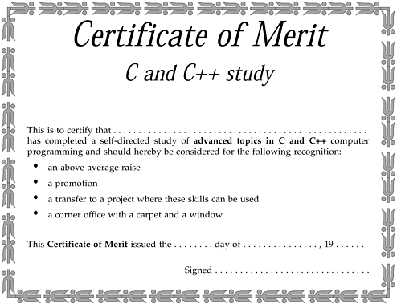

listen to their customers *always* go out of business. Companies that try to push the state of the art often succeed.

There were some minor technical themes, like making your product hard to program (e.g. the CDC7600 with two-level memory, or one's complement arithmetic, or the cruel and unusual punishment of 60-bit words) doesn't help. It's not too surprising that no major common technical theme emerged. Maybe there isn't one. One thing is certain, though: we all learn far more from our mistakes than from our successes.

**Some Final Light Relief—Your Certificate of Merit!**

\[Instructions: cut out from book, write your name in, and hand to boss\]

**Further Reading**

One C book I have found very helpful is *C, A Reference Manual*, written by Samuel P. Harbison and Guy L. Steele, ( Englewood Cliffs, Prentice Hall, 1991). Harbison and Steele wrote this book based on their experience developing a family of C compilers for a wide range of different architectures, and their practical insights shine off every page.

**Secrets of Programmer Job Interviews**

*A little hardware knowledge is a dangerous thing. One programmer dismantled one of those novelty* *Christmas cards that plays a carol, and retrieved the piezoelectric melody chip. He secretly installed* *it into his boss's keyboard, and connected it to one of the LEDs. It turns out that the voltage over a* *lighted LED is sufficient to drive one of these chips.*

*Then I, oops, I mean "he", amended the system editor, so it turned on the LED when it started and* *turned it off when it exited. Result: the boss's terminal played continuous Christmas carols whenever* *he used the editor! The people in neighboring offices formed a lynch mob after half-an-hour and made* *him stop all work until the cause was uncovered.*

— *The Second Official Handbook of Practical Jokes* \[1\]

\[1\] By Peter van der Linden, © 1991 by Peter van der Linden. Used by permission of Dutton Signet, a Division of Penguin Books USA Inc.

Silicon Valley programmer interviews…how can you detect a cycle in a linked list?… what are the different C increment statements for?… how is a library call different from a system call?…how is a file descriptor different from a file pointer?… write some code to determine if a variable is signed or not… what is the time complexity of printing the values in a binary tree?… give me a string at random from this file… some light relief—how to measure a building with a barometer

**Silicon Valley Programmer Interviews**

This provides some hints about the interview process for C programmers looking for a position with the top companies. One of the best things about the sharp end of the computer business is the unusual way we choose new employees to join the team. In a lot of industries, the supervisor or manager makes all the hiring decisions; indeed, is often the only one who even meets the job applicants. But on the leading edge of software development, and especially in high-tech start-ups, programmers are sometimes more qualified than managers to judge which of the candidates has the best technical skills as an "individual contributor." The talent needed to do some systems programming is so rare and specialized that sometimes technical ability is the single most important characteristic that you look for in an interview.

So a distinctive style of interview has evolved. The manager follows company policies to select the pool of candidates to interview. These prospects are then given a technical grill-ing by every person on a development team, not just the manager. A typical job interview will last all day, involving successive hour-long sessions with six or seven different engi-neers—and all of them need to be convinced of how well the applicant can program before a job offer is made.

Engineers often develop some favorite questions, and this chapter contains a collection of favorites.

There's no harm in revealing these "secrets"—the kind of person who reads this book probably already knows enough to be hired by a good software company. Many of these problems had their origins in real algorithms we were trying to program, and have since been replaced by other, newer problems. Of course, part of what you look for when you interview people is not just *what* they respond with, but *how* they respond. Do they think carefully about a question and come up with several possibilities, or do they just blurt out the first response that comes into their head? How persuasively do they argue the case for their ideas? Are they insistent on an obviously wrong strategy, or do they have the flexibility to adapt their answer? Some of the following interview questions have yielded the strangest answers.

Try them for yourself, and see how you fare!

**How Can You Detect a Cycle in a Linked List?**

This starts off as the simple question, "How can you detect a cycle in a linked list?" But the questioner keeps adding extra constraints, and it soon gets quite fiendish.

**Usual first answer:**

Mark each element as you visit it; keep traversing; if you reach an already marked element, the list has a cycle in it.

**Second constraint:**

The list is in read-only memory, and you cannot mark elements.

**Usual second answer:**

As you visit each element, store its address in an array; check each successive element to see if it is already in the array. Sometimes poor candidates get hung up at this point on the details of hash tables to optimize array lookup.

**Third constraint:**

Uh-oh! There is a limited amount of memory, and it is insufficient to hold an array of the necessary size. However, you can assume that if there is a cycle, it is within the first *N* elements.

**Usual third answer** (if the candidate gets this far):

Keep a pointer at the beginning of the list. Check this pointer for a match against the next *N* - 1

elements in the list. Then move the pointer on one, and check against the next *N* - 2 elements. Keep doing this until a match is found, or all *N* elements have been compared to each other.

**Fourth constraint:**

Oh no! The list is arbitrarily long, and the cycle might be anywhere in it. (Even good candidates can get stuck at this point).

**Final answer:**

First, eliminate the pathological case of a 3-element list with a cycle from element 2 to 1. Keep two pointers. One at element 1 and the next at element 3. See if they are equal; if not, move P1 by one and P2 by two. Check and continue. If P1 or P2 is null, there is no loop. If there is one, it will definitely be detected. One pointer will eventually catch up with the other (i.e., have the same value), though it might take several traversals of the cycle to do it.

There are other solutions, but the ones above are the most common.

**Programming Challenge**

**Knocked for a Loop**

Convince yourself that the algorithm in the final answer above will detect a loop, if there is one. Make a loop; dry run your code; make the loop longer; dry run again; repeat until the induction condition jumps out at you. Also, convince yourself that the algorithm will terminate if there is no loop.

Hint: write the program, and extrapolate from there.

**What Are the Different C Increment Statements For?**

Consider the four C statements below:

x = x+1; /\* regular \*/

++x; /\* pre-increment \*/

x++; /\* post-increment \*/

x += 1; /\* assignment operator \*/

Clearly, these four statements all do the same thing, namely, increase the value of x by one. As shown here, with no surrounding context, there is no difference between any of them. Candidates need to (implicitly or explicitly) supply the missing context in order to answer the question and distinguish between the statements. Note that the first statement is the conventional way of expressing "add one to x" in an algorithmic language. Hence, this is the reference statement, and we need to find unique characteristics of the other three.

Most C programmers can immediately point out that ++x is a pre-increment that adds one to x *before* using its value in some surrounding expression, whereas x++ is a post-increment that only bumps up x *after* using its original value in the surrounding expression. Some people say that the "++" and "--"

operators were only put in C because \*p++ is a single machine instruction on a PDP-11 (the machine for which the first C compiler was written). Not so. The feature dates from the B language on the PDP-7, but it turns out that the increment and decrement operators are incredibly useful on all hardware.

Some programmers give up at this point, overlooking that x+=1 is useful when x is not a simple variable, but an expression involving an array. If you have a complicated array reference, and you want to demonstrate that the same index is used for both references, then node\[i \>\> 3\] += ~(0x01 \<\< (i & 0x7));

is the way to go. We took this example statement directly out of some code in an operating system. Only the data names have been changed to protect the guilty. A good candidate will also point out that the l-value (compiler-talk for an expression that locates an object—usually an address, but it may also be a register, or either of these plus a bitfield) is only evaluated once. It makes a difference because the statement

mango\[i++\] += y;

is treated as

mango\[i\] = mango\[i\] + y; i++;

and *not*

mango\[i++\] = mango\[i++\] + y;

Once, when we were interviewing applicants for a position on Sun's Pascal compiler team, the best candidate (and he ultimately got the job—Hi, Arindam!) explained these differences in terms of compiler intermediate code, for example "++x" means *take the location of x, increment the contents* *there, put this value in a register; "* x++ *"* means *take the location* *of x, load the contents into a register,* *increment the value of x in memory,* and so on. By the way, how would the other two statements be described in compiler terms like these?

Though Kernighan and Ritchie say that incrementing is often more efficient than explicitly adding one (K&R2, p. 18), contemporary compilers are by now usually good enough to make all methods equally fast. Modern C compilers should compile these four statements into exactly the same code in the absence of any surrounding context to bring out the differences. These should be the fastest instructions for incrementing a variable. Try it with your favorite C compiler—it probably has an option to produce an assembler listing. Set the compiler option for debugging, too, as that often makes it easier to check the cor-respondence between assembler and C statements. Don't switch the optimizer on, as the statements may be optimized out of existence. On Sun workstations, chant the magic incantation "-S" so the command line will look like

cc -S -Xc banana.c

The -S causes the compilation to stop at the assembler phase, leaving the assembly language in file banana.s. The latest compilers, SPARCompilers 3.0, have been improved to cause the source to appear interspersed in the assembler output when this option is used. It makes it easier to troubleshoot problems and diagnose code generation.

The -Xc tells the compiler to reject any non-ANSI C constructs. It's a good idea to always use this option when writing new code, because it will help you attain maximum program portability.

So sometimes the difference is a question of what looks better in the source. Something short can be simpler to read than something long. However, extreme brevity is also difficult to read (ask anyone who has tried to amend someone else's APL code). When I was a graduate student teaching assistant for a systems programming class, a student brought me some code that had an unknown bug in it, but the code was so compressed that it could not be found. Amid jeers from some of the upperclassmen C

programmers, we methodically expanded one statement from something like: frotz\[--j + i++\] += --y;

into the equivalent, but longer,:

--y;

--j;

frotz\[j+i\] = frotz\[j+i\] + y;

i++;

To the chagrin of the kibitzers, this quickly revealed that one of the operations was being done in the wrong place!

**Moral: Don't try to do too many things in one statement.**

It won't make the generated code any more efficient, and it will ruin your chances of debugging the code. As Kernighan and Plauger pointed out, "Everyone knows that debugging is twice as hard as writing a program in the first place. So if you're as clever as you can be when you write it, how will you ever debug it?" \[2\]

\[2\] Brian W. Kernighan and P.J. Plauger, *The Elements of Programming Style*, Second Edition, p.10, New York, McGraw-Hill, 1978, p. 10.

**How Is a Library Call Different from a System Call?**

One question we sometimes use to see if a candidate knows his or her way around programming is simply, "What is the difference between a library call and a system call?" It's amazing how many people never figured it out. We haven't seen many books that describe the difference, so this is a good way to determine if a candidate has done much programming and has the intellectual curiosity to find out about issues like this.

The short answer is that library calls are part of the language or application, and system calls are part of the operating system. Make sure you say the keyword "trap". A system call gets into the kernel by issuing a "trap" or interrupt. A comprehensive answer will cover the points listed inTable A-1.

***Table A-1. Library Call versus System Call***

**Library Call**

**System Call**

The C library is the same on every ANSI C

The systems calls are different in each OS

implementation

Is a call to a routine in a library

Is a call to the kernel for a service

Linked with the user program

Is an entry point to the OS

Executes in the user address space

Executes in the kernel address space

Counts as part of the "user" time

Counts as part of the "system" time

Has the lower overhead of a procedure call

Has high overhead context switch to kernel and

back

There are about 300 routines in the C library libc There are about 90 system calls in UNIX, (fewer in MS-DOS)

Documented in Section 3 of the UNIX OS

Documented in Section 2 of the UNIX OS manual

manual

Typical C library calls: system, fprintf, malloc

Typical system calls: chdir, fork, write, brk

Library routines are usually slower than in-line code because of the subroutine call overhead, but system calls are much slower still because of the context switch to the kernel. On a SPARCstation 1, we timed the overhead of a library call (i.e., how fast a procedure call is made) at about half a microsecond. A system call took seventy times longer to establish (35 microseconds). For raw performance, minimize the number of system calls wherever possible, but remember, many routines in the C library do their work by making system calls. Finally, people who believe that crop circles are the work of aliens will have trouble with the concept that the system() call is actually a library call.

**Programming Challenge**

**Professor Perlis's Gut-Busting Homework Assignment**

*Caution: This Programming Challenge may be too intense for some viewers.*

Some graduate schools also use programming questions to test their new students. At Yale University, Professor Alan Perlis (one of the fathers of Algol-60) used to set the following assignment (due in one week) to his incoming class of graduate students.

Program each of the following problems:

1\. Read a string and output all combinations of its characters.

2\. The "8-queens" problem (print all the chess configurations where eight queens can be placed on a board without attacking each other).

3\. Given N, list all the prime numbers up to N.

4\. Write a subroutine to multiply two arbitrary-sized matrices together.

in each of the following languages:

1\. C

2\. APL

3\. Lisp

4\. Fortran

Any *one* of these programming problems would have been a pretty reasonable assignment for a class that was just one of several that a graduate student took. But here we were being asked to do *all* of them in just one week, in *all* of a variety of languages that some of us had never even seen before!

Of course, we didn't know that Perlis was just testing us, and that he wasn't actually going to nail anyone. Most of the new graduate students spent a frantic week of late nights hunched over a terminal, only to find that, back in class, Alan asked for volunteers to present a single lan-guage/problem combination on the board.

Some of the problems could be solved by idioms, like the APL one-liner \[1\] for problem 3: (2=+.0=T

.\|T)/T

*i* N

Thus, anyone who attempted any part of the assignment had the opportunity to show it.

Anyone who was so overwhelmed by the problem that they didn't even try the smallest part

of it learned that they were probably not cut out for graduate school. It was a week of furious activity, in which I learned more about APL and Lisp than I have done in the dozen years before or since.

\[1\] You can see why they don't have an "Obfuscated APL Competition" —there's no need, it already comes that way

**How Is a File Descriptor Different from a File Pointer?**

This question follows naturally from the previous one. All the UNIX routines that manipulate files use either a *file pointer* or a *file descriptor* to identify the file they are operating on; what are each of these, and when is each used? The answer is actually straightforward, and gives you an idea of how familiar a person is with UNIX I/O and the various trade-offs.

All the system calls that manipulate files take (or return) a "file descriptor" as an argument. "File descriptor" is somewhat of a misnomer; the file descriptor is a small integer (usually between 0 and 255) used in the Sun implementation to index into the per-process table-of-open-files. The system I/O

calls are creat(), open(), read(), write(), close(), ioctl(), and so on, but these are not a part of ANSI C, won't exist in non-UNIX environments, and will destroy program portability if you use them. Hence, a set of standard I/O library calls were specified, which ANSI C now requires all hosts to support.

To ensure program portability, use the stdio I/O calls fopen(), fclose(), putc(), fseek()—most of these routine names start with "f". These calls take a pointer to a FILE structure (sometimes called a stream pointer) as an argument. The FILE pointer points to a stream structure, defined in \<stdio.h\>. The contents of the structure vary from implementation to implementation, and on UNIX is typically an entry in the per-process table-of-open-files. Typically, it contains the stream buffer, all the necessary variables to indicate how many bytes in the buffer are actual file data, flags to indicate the state of the stream (like ERROR and EOF), and so on.

• So a file descriptor is the *offset* in the per-process table-of-open-files (e.g., "3"). It is used in a UNIX system call to identify the file.

• A FILE pointer holds the *address* of a file structure that is used to represent the open I/O

stream (e.g. hex 20938). It is used in an ANSI C stdio library call to identify the file.

The C library function fdopen() can be used to create a new FILE structure and associate it with the specified file descriptor (effectively converting between a file descriptor integer and the corresponding stream pointer, although it does generate an additional new entry in the table-of-open-files).

**Write Some Code to Determine if a Variable Is Signed or Not** One colleague, interviewing with Microsoft, was asked to "write some code to determine if a variable is signed or not." It is actually a pretty tough question because it leaves too much open to interpretation. Some people wrongly equate "signed" with "has a negative sign" and assume that what is wanted is a trivial function or macro to say if a value is less than zero.

That isn't it. The question has to do with whether or not a given *type* is signed or unsigned in a particular implementation. In ANSI C, "char" can be either signed or unsigned as an implementation desires. It is useful to know which when writing code that will be ported to many platforms, and ideally the result will be a compiletime constant.

You can't achieve this with a function. The type of a function's formal parameter is defined within the function, so it cannot be passed via the call. Therefore you have to write a macro that will operate on its argument according to the *declaration* of that argument.

The next point is to clarify whether the macro's argument is to be a type or a value of a type.

Assuming the argument is a value, the essential characteristic of an unsigned value is that it can never be negative, and the essential characteristic of a signed value is that complementing its most significant bit will change its sign (assuming 2's complement representation, which is pretty safe).

Since the other bits are irrelevant to this test, you can complement them all and get the same result.

Therefore, try the following:

\#define ISUNSIGNED(a) (a \>= 0 && ~a \>= 0)

Alternatively, assuming the argument is to be a type, one answer would use type casts:

\#define ISUNSIGNED(type) ((type)0 - 1 \> 0)

The correct interpretation is key here! Listen carefully, and ask for a better explanation of any terms that you don't understand or weren't well defined. The first code example only works with K&R C.

The new promotion rules mean it doesn't work under ANSI C. Exercise: explain why, and provide a solution in ANSI C.

Most Microsoft questions have some element of determining how well you can think under pressure, but they are not all overtly technical. A typical nontechnical question might be, "How many gas stations are there in the U.S.?" or "How many barber shops are there in the U.S.?" They want to see if you can invent and justify good estimates, or suggest a good way of finding more reliable answers.

One suggestion: call the state licensing authorities. This will give you exact answers with only 50

phone calls. Or call half-a-dozen representative states, and interpolate from there. You could even respond as one environmentally-conscious candidate did, when asked "How many gas stations?" "Too many!" was her annoyed response.

**What Is the Time Complexity of Printing the Values in a Binary Tree?**

This question was asked during an interview for a position on a compiler team with Intel. Now, the first thing you learn in complexity theory is that the notation O(N) means that as N (usually the number of things being processed) increases, the time taken increases at most linearly. Similarly, O(N2) means that as N increases, the processing time increases much, much faster, by up to N-squared in fact.

The second thing that you learn in complexity theory is that *everything* in a binary tree has O(log(n)), so most candidates naturally give this answer without even thinking about it. Wrong!

This turned out to be a question similar to Dan Rather's famous "What is the frequency, Kenneth?"

question—an enquiry designed to discomfit, confuse, and annoy the listener rather than solicit information. To *print* all the nodes in a binary tree you have to *visit* them all! Therefore, the complexity is O(n).

Colleagues have reported similar chicanery in an interview question for electronic engineers at Hewlett-Packard. The question is posed in the form of a charged and uncharged capacitor suddenly connected together, in an ideal circuit with no resistance. Mechanical engineers were asked the same question about two massless springs displaced from equi-librium and then released. The interviewer

then derives two inconsistent end-states using two different physical laws (i.e., conservation of charge and conservation of energy in the case of the capacitors), and queries the hapless prospect on the cause of the inconsistency.

The trick here is that at least one expression of the end-state uses a formula that involves integration over the event separating the start and end conditions. In the real world this is fine, but in the theoretical experiment posed it causes integration over a discontinuity (since the moderating effects have been idealized away); hence, the formula is useless. Engineers are most unlikely to have encountered this before. Yep, those massless springs and circuits without resistance will get you every time!

Yet another curve ball was pitched in an interview for a position as a software consultant with a large management consulting company. "What does the *execve* system call return, if successful?" was the question. Recall that execve() replaces the calling process image with the named executable, then starts executing it. There is no return from a successful *execve* hence there is no return value. Trick questions are fun to pose to your friends, but they don't really belong in an interview.

**Give Me a String at Random from This File**

Another favorite Microsoft question. The interviewer asks the applicant to write some code that selects one string at random from a file of strings. The classic way of doing this is to read the file, counting the strings and keeping a record of the offset at which each begins. Then pick a random number between 1 and the total number, go to the corresponding offset in the file, and that's your string.

What makes it very hard to solve is that the interviewer sets the condition that you can only make one sequential pass through the file, and you may not store any additional information like a table of offsets. This is another of those questions where the interviewer is mostly interested in seeing how you solve problems. He or she will feed you hints if you ask for them, so most people eventually get it.

How well you do depends on how quickly you get it.

The basic technique is to pick survivors, and recalculate as you go along. This is so com-putationally inefficient that it's easy to overlook. You open the file and save the first string. At this point you have one candidate string with a 100% probability of picking it. While remembering the first string, you read the next string. You now have two candidates, each with a 50% probability. Pick one of them, save it, and discard the other. Read the next string, and choose between that and the saved string, weighting your choice 33% toward the new string and 67% toward the survivor (which represents the winner of the previous two-way selection). Save the new survivor.

Keep on doing this throughout the entire file, at each step reading string N, and choosing between that (with probability 1/N) and the previous survivor, with probability (N - 1)/N. When you reach the end of the file, the current survivor is the string picked at random!

This is a tough problem, and you either have to figure out the answer with the minimum of hints, or have cleverly prepared yourself by reading this book.

**Some Light Relief—How to Measure a Building with a Barometer** We find these kinds of questions so much fun that we even pose them to ourselves in a non-computing context. Sun has a "junk mail" e-mail alias for employees to share thoughts of random interest; occasionally people will pose problems on this alias, and challenge other engineers to compete in submitting the best answer. Here is one such puzzle, recently set.

There is an old story about a physics student finding novel ways to measure the height of a building using a barometer. The story is retold by Alexander Calandra in *The Teaching of Elementary Science* *and Mathematics*. \[3\]

\[3\] St. Louis, Washington University, 1961.

A student failed an exam after he refused to parrot back what he had been taught in class. When the student protested, I was asked to act as arbiter. I went to the professor's office and read the examination question: "Show how it is possible to determine the height of a tall building with the aid of a barometer."

The student had answered: "Take the barometer to the top of the building, attach a long rope to it, lower the barometer to the street and then bring it up, measuring the length of the rope. The length of the rope is the height of the building."

A high grade is supposed to certify competence in physics, but the answer did not confirm this. I suggested that the student have another try at answering the question. I gave the student six minutes, with the warning that his answer should show some knowledge of physics. In the next minute he dashed off his answer, which read: "Take the barometer to the top of the building and lean over the edge of the roof. Drop the barometer, timing its fall with a stopwatch. Then, using the formula for the distance travelled by a falling object, *S = 1/2 a t2* calculate the height of the building." At this point, I gave the student full credit.

The student went on to propose three other methods of measuring a building's height with a barometer: Take the barometer out on a sunny day and measure the height of the barometer, the length of its shadow, and the shadow of the building. By the use of a simple proportion, determine the height of the building.

Take the barometer and begin to walk up the stairs. As you climb the stairs, mark off the length of the barometer along the wall. Then count the number of marks, and this will give you the height of the building in barometer units.

Last (and probably least) offer the barometer as a gift to the building superintendent if he will just tell you how high the building is.

When this old story was rehashed at Sun as a "science puzzler," 16 more ingenious new methods for barometric building measurement were suggested! The new responses were of the following types: *The Pressure Method*: Measure the air pressure at the bottom and top of the building, then compute the height of the building from the pressure difference. This is the only method that actually uses the barometer for its designed purpose of measuring air pressure. Although aircraft altimeters often work by this principle, it is one of the least accurate methods for measuring a building's height.

*The Pendulum Method*: Go onto the building's roof, and lower the barometer on a string until it almost reaches the ground. Swing the barometer and measure the pendulum's period of oscillation. From this the length of the pendulum, and hence the building, can be calculated.

*The Avarice Method*: Pawn the barometer to raise seed money for a chain letter campaign. Then stack the currency thus obtained against the building, measuring it in units of currency thickness. No comment on how to stay ahead of the police long enough to measure the building.

*The Mafia Method*: Extort the building's height from the superintendent, using the barometer as a weapon.

*The Ballistic Method*: Fire the barometer from ground level with a mortar, just high enough to reach the top of the building. You may need to take some ranging shots to get the explosive charge and firing elevation just right. A table of standard ballistic calculations will then yield the height reached by the projectile.

*The Paperweight Method*: Use the barometer as a paperweight while looking over the building plans.

*The Sonic Method*: Drop the barometer from the top of the building, and time the interval between seeing the barometer hit the ground and hearing it. For practical distances, the sight will be instantaneous, and the sound will travel at the speed of sound (1150 feet/second at standard temperature-pressure and mean sea level), giving the height.

*The Reflective Method*: Use the glass face of the barometer as a mirror and time the interval it takes light to traverse the round trip between the top of the building and the ground. Since the speed of light is a known quantity, the distance can be calculated.

*The Mercantile Method*: Sell the barometer, and buy some proper equipment.

*The Analog Method*: Attach the barometer to a string, wind the string around the shaft of a small generator, and measure the amount of electrical energy produced as the barometer falls from the top of the building to the ground. The generated energy is proportionate to the number of revolutions of the shaft, and hence the distance to the ground.

*The Trigonometric Method*: Pick a spot on the ground a known distance from the building, go to the top of the building with the barometer and a protractor level, and wait for the sun to reach the horizon.

Then, using the barometer as a mirror, aim a spot of sunlight at the place you previously picked and measure the angle of the mirror with the level. Use trigonometry to calculate the building's height.

*The Proportion Method*: Measure the height of the barometer. Bring a friend and a tape measure.

Stand at a known distance from the building and sight past the barometer to the building. Move the barometer toward or away from you until the top and bottom of the barometer line up with the top and bottom of the building. Then have your friend measure the distance from the barometer to your eye.

Compute the building height by proportion.

*The Photographic Method*: Set up a tripod with a camera at a known distance from the building. Hold the barometer a known distance from the camera and take a picture. From the relative heights of the barometer and the building in the picture, you can compute the height of the building.

*The Gravitational Method I*: Suspend the barometer from a yard of string. Measure the oscillation period of the pendulum thus formed at the top and bottom of the building. Compute the building's height from the difference in gravitational acceleration.

*The Gravitational Method II*: Weigh the barometer at the top and bottom of the building with a spring balance (a beam balance won't work for this!). Differences in the readings will be due to the different gravitational acceleration, due to the differing distances from Earth. (A reader tells me that the Lacoste Romberg gravimeter provides a practical way of getting the required accuracy.) Compute the building's height from the two measurements.

*The Calorific Method*: Drop the barometer from the roof into a container of water covered with a narrow slit to minimize splashing. The rise in temperature of the water is an analog of the energy that the barometer had on impact, and hence the height it fell from.

And you thought questions like this only came up in algebra problems!

**Further Reading**

If you have enjoyed this book you might also enjoy the text *Bartholomew and the Oobleck*, by Dr.

Seuss, ( New York, Random House, 1973). As Dr. Seuss explains, Oobleck "squiggles around in your fist like a slippery potato dumpling made of rubber." He doesn't tell you how to make it, so I will here.

**How to make Oobleck**

1\. Take one cup of cornstarch.

2\. Add some drops of green food coloring; Oobleck should always be green in color.

3\. Slowly knead in up to half a cup of water.

Oobleck has some extremely strange, non-Newtonian properties. It flows like water through your fingers, except when you work it like dough—then it immediately assumes a solid consistency. Except when you stop kneading it, it turns back to liquid. If you strike it quickly with something hard, you can shatter it!

Like all Dr. Seuss books, *Bartholomew and the Oobleck* can be read and enjoyed on several levels.

For example, *One Fish Two Fish, Red Fish Blue Fish* can be deconstructed as a searing indictment of the narrow-minded binary counting system. Software engineers can benefit from a sophisticated reading of *Bartholomew and the Oobleck*.

The world would be a better place if every programmer would just play with Oobleck occasionally.

The good programmers would be more rested and refreshed and the bad programmers would probably get their heads stuck to the table. But always remember, no matter how lowly or exalted a hacker you are, you are a child process of the universe, no less than the disk controller, or the stack frame mechanism (explained at such length in Chapter 6).

They say that when you stare deeply into an abyss, the abyss also stares into you. But if you stare deeply into this book, well, it's rude to stare, plus you might get a headache or something.

I can't think of a job I'd rather do than computer programming. All day, you create patterns and structure out of the formless void, and you solve dozens of smaller puzzles along the way. The wit and ingenuity of the human brain is pitted against the remorseless speed and accuracy of the electronic one.

Thus has it ever been. Humanity's higher purpose is to strive, to seek, to create. Each and every computer programmer should seek out and grasp opportunities to—whoa! That's your 75,000 words already—