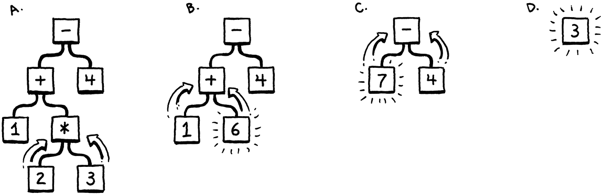
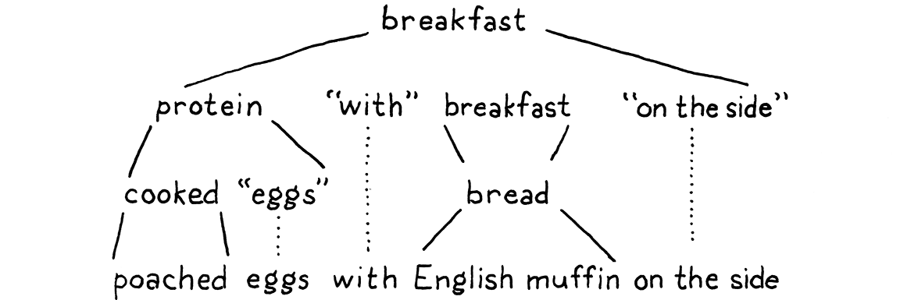
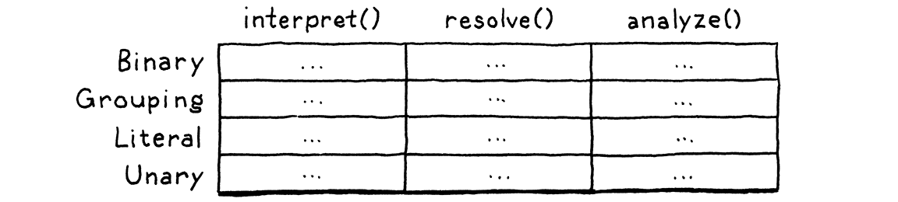
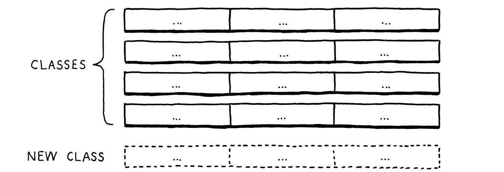
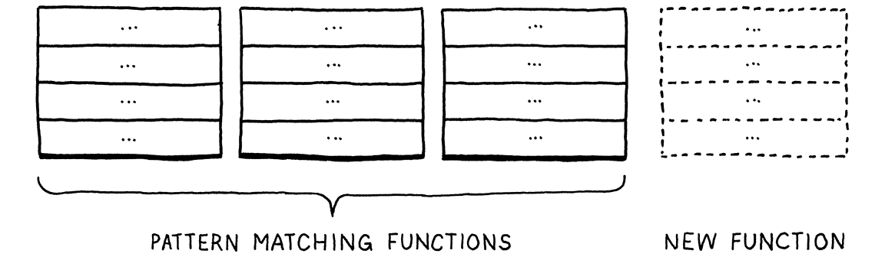
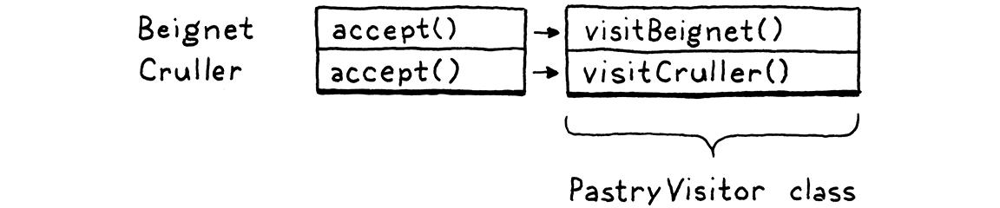

#### Chapter 5.

# Representing Code

> To dwellers in a wood, almost every species of tree has its voice as well as its feature. Thomas Hardy, *Under the Greenwood Tree*

In the last chapter, we took the raw source code as a string and transformed it into a slightly higher-level representation: a series of tokens. The parser we’ll write in the next chapter takes those tokens and transforms them yet again, into an even richer, more complex representation.

Before we can produce that representation, we need to define it. That’s the subject of this chapter. Along the way, we’ll cover some theory around formal grammars, feel the difference between functional and object-oriented programming, go over a couple of design patterns, and do some metaprogramming.

I was so worried about this being one of the most boring chapters in the book that I kept stuffing more fun ideas into it until I ran out of room.

Before we do all that, let’s focus on the main goal—a representation for code. It should be simple for the parser to produce and easy for the interpreter to consume. If you haven’t written a parser or interpreter yet, those requirements aren’t exactly illuminating. Maybe your intuition can help. What is your brain doing when you play the part of a *human* interpreter? How do you mentally evaluate an arithmetic expression like this:

```
1 + 2 * 3 - 4
```

Because you understand the order of operations—the old “[Please Excuse My Dear Aunt Sally](https://en.wikipedia.org/wiki/Order_of_operations#Mnemonics)” stuff—you know that the multiplication is evaluated before the addition or subtraction. One way to visualize that precedence is using a tree. Leaf nodes are numbers, and interior nodes are operators with branches for each of their operands.

In order to evaluate an arithmetic node, you need to know the numeric values of its subtrees, so you have to evaluate those first. That means working your way from the leaves up to the root—a *post-order* traversal:



A. Starting with the full tree, evaluate the bottom-most operation, `2 * 3`.

B. Now we can evaluate the `+`.

C. Next, the `-`.

D. The final answer.

If I gave you an arithmetic expression, you could draw one of these trees pretty easily. Given a tree, you can evaluate it without breaking a sweat. So it intuitively seems like a workable representation of our code is a tree that matches the grammatical structure—the operator nesting—of the language.

That’s not to say a tree is the *only* possible representation of our code. In Part III, we’ll generate bytecode, another representation that isn’t as human friendly but is closer to the machine.

We need to get more precise about what that grammar is then. Like lexical grammars in the last chapter, there is a long ton of theory around syntactic grammars. We’re going into that theory a little more than we did when scanning because it turns out to be a useful tool throughout much of the interpreter. We start by moving one level up the [Chomsky hierarchy](https://en.wikipedia.org/wiki/Chomsky_hierarchy) . . . 

## 5.1 Context-Free Grammars

In the last chapter, the formalism we used for defining the lexical grammar—the rules for how characters get grouped into tokens—was called a *regular language*. That was fine for our scanner, which emits a flat sequence of tokens. But regular languages aren’t powerful enough to handle expressions which can nest arbitrarily deeply.

We need a bigger hammer, and that hammer is a **context-free grammar** (**CFG**). It’s the next heaviest tool in the toolbox of **[formal grammars](https://en.wikipedia.org/wiki/Formal_grammar)**. A formal grammar takes a set of atomic pieces it calls its “alphabet”. Then it defines a (usually infinite) set of “strings” that are “in” the grammar. Each string is a sequence of “letters” in the alphabet.

I’m using all those quotes because the terms get a little confusing as you move from lexical to syntactic grammars. In our scanner’s grammar, the alphabet consists of individual characters and the strings are the valid lexemes—roughly “words”. In the syntactic grammar we’re talking about now, we’re at a different level of granularity. Now each “letter” in the alphabet is an entire token and a “string” is a sequence of *tokens*—an entire expression.

Oof. Maybe a table will help:

|                               |     |                 |                   |
|-------------------------------|-----|-----------------|-------------------|
| Terminology                   |     | Lexical grammar | Syntactic grammar |
| The “alphabet” is . . .       | →   | Characters      | Tokens            |
| A “string” is . . .           | →   | Lexeme or token | Expression        |
| It’s implemented by the . . . | →   | Scanner         | Parser            |

A formal grammar’s job is to specify which strings are valid and which aren’t. If we were defining a grammar for English sentences, “eggs are tasty for breakfast” would be in the grammar, but “tasty breakfast for are eggs” would probably not.

### 5.1.1 Rules for grammars

How do we write down a grammar that contains an infinite number of valid strings? We obviously can’t list them all out. Instead, we create a finite set of rules. You can think of them as a game that you can “play” in one of two directions.

If you start with the rules, you can use them to *generate* strings that are in the grammar. Strings created this way are called **derivations** because each is *derived* from the rules of the grammar. In each step of the game, you pick a rule and follow what it tells you to do. Most of the lingo around formal grammars comes from playing them in this direction. Rules are called **productions** because they *produce* strings in the grammar.

Each production in a context-free grammar has a **head**—its name—and a **body**, which describes what it generates. In its pure form, the body is simply a list of symbols. Symbols come in two delectable flavors:

Restricting heads to a single symbol is a defining feature of context-free grammars. More powerful formalisms like **[unrestricted grammars](https://en.wikipedia.org/wiki/Unrestricted_grammar)** allow a sequence of symbols in the head as well as in the body.

- A **terminal** is a letter from the grammar’s alphabet. You can think of it like a literal value. In the syntactic grammar we’re defining, the terminals are individual lexemes—tokens coming from the scanner like `if` or `1234`.

  These are called “terminals”, in the sense of an “end point” because they don’t lead to any further “moves” in the game. You simply produce that one symbol.

- A **nonterminal** is a named reference to another rule in the grammar. It means “play that rule and insert whatever it produces here”. In this way, the grammar composes.

There is one last refinement: you may have multiple rules with the same name. When you reach a nonterminal with that name, you are allowed to pick any of the rules for it, whichever floats your boat.

To make this concrete, we need a way to write down these production rules. People have been trying to crystallize grammar all the way back to Pāṇini’s *Ashtadhyayi*, which codified Sanskrit grammar a mere couple thousand years ago. Not much progress happened until John Backus and company needed a notation for specifying ALGOL 58 and came up with [**Backus-Naur form**](https://en.wikipedia.org/wiki/Backus%E2%80%93Naur_form) (**BNF**). Since then, nearly everyone uses some flavor of BNF, tweaked to their own tastes.

I tried to come up with something clean. Each rule is a name, followed by an arrow (`→`), followed by a sequence of symbols, and finally ending with a semicolon (`;`). Terminals are quoted strings, and nonterminals are lowercase words.

Yes, we need to define a syntax to use for the rules that define our syntax. Should we specify that *metasyntax* too? What notation do we use for *it?* It’s languages all the way down!

Using that, here’s a grammar for breakfast menus:

Yes, I really am going to be using breakfast examples throughout this entire book. Sorry.

```
breakfast  → protein "with" breakfast "on the side" ;
breakfast  → protein ;
breakfast  → bread ;

protein    → crispiness "crispy" "bacon" ;
protein    → "sausage" ;
protein    → cooked "eggs" ;

crispiness → "really" ;
crispiness → "really" crispiness ;

cooked     → "scrambled" ;
cooked     → "poached" ;
cooked     → "fried" ;

bread      → "toast" ;
bread      → "biscuits" ;
bread      → "English muffin" ;
```

We can use this grammar to generate random breakfasts. Let’s play a round and see how it works. By age-old convention, the game starts with the first rule in the grammar, here `breakfast`. There are three productions for that, and we randomly pick the first one. Our resulting string looks like:

    protein "with" breakfast "on the side"

We need to expand that first nonterminal, `protein`, so we pick a production for that. Let’s pick:

```
protein → cooked "eggs" ;
```

Next, we need a production for `cooked`, and so we pick `"poached"`. That’s a terminal, so we add that. Now our string looks like:

    "poached" "eggs" "with" breakfast "on the side"

The next non-terminal is `breakfast` again. The first `breakfast` production we chose recursively refers back to the `breakfast` rule. Recursion in the grammar is a good sign that the language being defined is context-free instead of regular. In particular, recursion where the recursive nonterminal has productions on both sides implies that the language is not regular.

Imagine that we’ve recursively expanded the `breakfast` rule here several times, like “bacon with bacon with bacon with . . . ” In order to complete the string correctly, we need to add an *equal* number of “on the side” bits to the end. Tracking the number of required trailing parts is beyond the capabilities of a regular grammar. Regular grammars can express *repetition*, but they can’t *keep count* of how many repetitions there are, which is necessary to ensure that the string has the same number of `with` and `on the side` parts.

We could keep picking the first production for `breakfast` over and over again yielding all manner of breakfasts like “bacon with sausage with scrambled eggs with bacon . . . ” We won’t though. This time we’ll pick `bread`. There are three rules for that, each of which contains only a terminal. We’ll pick “English muffin”.

With that, every nonterminal in the string has been expanded until it finally contains only terminals and we’re left with:



Throw in some ham and Hollandaise, and you’ve got eggs Benedict.

Any time we hit a rule that had multiple productions, we just picked one arbitrarily. It is this flexibility that allows a short number of grammar rules to encode a combinatorially larger set of strings. The fact that a rule can refer to itself—directly or indirectly—kicks it up even more, letting us pack an infinite number of strings into a finite grammar.

### 5.1.2 Enhancing our notation

Stuffing an infinite set of strings in a handful of rules is pretty fantastic, but let’s take it further. Our notation works, but it’s tedious. So, like any good language designer, we’ll sprinkle a little syntactic sugar on top—some extra convenience notation. In addition to terminals and nonterminals, we’ll allow a few other kinds of expressions in the body of a rule:

- Instead of repeating the rule name each time we want to add another production for it, we’ll allow a series of productions separated by a pipe (`|`).

  ```
  bread → "toast" | "biscuits" | "English muffin" ;
  ```

- Further, we’ll allow parentheses for grouping and then allow `|` within that to select one from a series of options within the middle of a production.

  ```
  protein → ( "scrambled" | "poached" | "fried" ) "eggs" ;
  ```

- Using recursion to support repeated sequences of symbols has a certain appealing purity, but it’s kind of a chore to make a separate named sub-rule each time we want to loop. So, we also use a postfix `*` to allow the previous symbol or group to be repeated zero or more times.

  ```
  crispiness → "really" "really"* ;
  ```

This is how the Scheme programming language works. It has no built-in looping functionality at all. Instead, *all* repetition is expressed in terms of recursion.

- A postfix `+` is similar, but requires the preceding production to appear at least once.

  ```
  crispiness → "really"+ ;
  ```

- A postfix `?` is for an optional production. The thing before it can appear zero or one time, but not more.

  ```
  breakfast → protein ( "with" breakfast "on the side" )? ;
  ```

With all of those syntactic niceties, our breakfast grammar condenses down to:

```
breakfast → protein ( "with" breakfast "on the side" )?
          | bread ;

protein   → "really"+ "crispy" "bacon"
          | "sausage"
          | ( "scrambled" | "poached" | "fried" ) "eggs" ;

bread     → "toast" | "biscuits" | "English muffin" ;
```

Not too bad, I hope. If you’re used to grep or using [regular expressions](https://en.wikipedia.org/wiki/Regular_expression#Standards) in your text editor, most of the punctuation should be familiar. The main difference is that symbols here represent entire tokens, not single characters.

We’ll use this notation throughout the rest of the book to precisely describe Lox’s grammar. As you work on programming languages, you’ll find that context-free grammars (using this or [EBNF](https://en.wikipedia.org/wiki/Extended_Backus%E2%80%93Naur_form) or some other notation) help you crystallize your informal syntax design ideas. They are also a handy medium for communicating with other language hackers about syntax.

The rules and productions we define for Lox are also our guide to the tree data structure we’re going to implement to represent code in memory. Before we can do that, we need an actual grammar for Lox, or at least enough of one for us to get started.

### 5.1.3 A Grammar for Lox expressions

In the previous chapter, we did Lox’s entire lexical grammar in one fell swoop. Every keyword and bit of punctuation is there. The syntactic grammar is larger, and it would be a real bore to grind through the entire thing before we actually get our interpreter up and running.

Instead, we’ll crank through a subset of the language in the next couple of chapters. Once we have that mini-language represented, parsed, and interpreted, then later chapters will progressively add new features to it, including the new syntax. For now, we are going to worry about only a handful of expressions:

- **Literals.** Numbers, strings, Booleans, and `nil`.

- **Unary expressions.** A prefix `!` to perform a logical not, and `-` to negate a number.

- **Binary expressions.** The infix arithmetic (`+`, `-`, `*`, `/`) and logic operators (`==`, `!=`, `<`, `<=`, `>`, `>=`) we know and love.

- **Parentheses.** A pair of `(` and `)` wrapped around an expression.

That gives us enough syntax for expressions like:

```
1 - (2 * 3) < 4 == false
```

Using our handy dandy new notation, here’s a grammar for those:

```
expression     → literal
               | unary
               | binary
               | grouping ;

literal        → NUMBER | STRING | "true" | "false" | "nil" ;
grouping       → "(" expression ")" ;
unary          → ( "-" | "!" ) expression ;
binary         → expression operator expression ;
operator       → "==" | "!=" | "<" | "<=" | ">" | ">="
               | "+"  | "-"  | "*" | "/" ;
```

There’s one bit of extra metasyntax here. In addition to quoted strings for terminals that match exact lexemes, we `CAPITALIZE` terminals that are a single lexeme whose text representation may vary. `NUMBER` is any number literal, and `STRING` is any string literal. Later, we’ll do the same for `IDENTIFIER`.

This grammar is actually ambiguous, which we’ll see when we get to parsing it. But it’s good enough for now.

If you’re so inclined, try using this grammar to generate a few expressions like we did with the breakfast grammar before. Do the resulting expressions look right to you? Can you make it generate anything wrong like `1 + / 3`?

## 5.2 Implementing Syntax Trees

Finally, we get to write some code. That little expression grammar is our skeleton. Since the grammar is recursive—note how `grouping`, `unary`, and `binary` all refer back to `expression`—our data structure will form a tree. Since this structure represents the syntax of our language, it’s called a **syntax tree**.

In particular, we’re defining an **abstract syntax tree** (**AST**). In a **parse tree**, every single grammar production becomes a node in the tree. An AST elides productions that aren’t needed by later phases.

Our scanner used a single Token class to represent all kinds of lexemes. To distinguish the different kinds—think the number `123` versus the string `"123"`—we included a simple TokenType enum. Syntax trees are not so homogeneous. Unary expressions have a single operand, binary expressions have two, and literals have none.

We *could* mush that all together into a single Expression class with an arbitrary list of children. Some compilers do. But I like getting the most out of Java’s type system. So we’ll define a base class for expressions. Then, for each kind of expression—each production under `expression`—we create a subclass that has fields for the nonterminals specific to that rule. This way, we get a compile error if we, say, try to access the second operand of a unary expression.

Tokens aren’t entirely homogeneous either. Tokens for literals store the value, but other kinds of lexemes don’t need that state. I have seen scanners that use different classes for literals and other kinds of lexemes, but I figured I’d keep things simpler.

Something like this:

```
package com.craftinginterpreters.lox;

abstract class Expr {
  static class Binary extends Expr {
    Binary(Expr left, Token operator, Expr right) {
      this.left = left;
      this.operator = operator;
      this.right = right;
    }

    final Expr left;
    final Token operator;
    final Expr right;
  }

  // Other expressions...
}
```

I avoid abbreviations in my code because they trip up a reader who doesn’t know what they stand for. But in compilers I’ve looked at, “Expr” and “Stmt” are so ubiquitous that I may as well start getting you used to them now.

Expr is the base class that all expression classes inherit from. As you can see from `Binary`, the subclasses are nested inside of it. There’s no technical need for this, but it lets us cram all of the classes into a single Java file.

### 5.2.1 Disoriented objects

You’ll note that, much like the Token class, there aren’t any methods here. It’s a dumb structure. Nicely typed, but merely a bag of data. This feels strange in an object-oriented language like Java. Shouldn’t the class *do stuff*?

The problem is that these tree classes aren’t owned by any single domain. Should they have methods for parsing since that’s where the trees are created? Or interpreting since that’s where they are consumed? Trees span the border between those territories, which means they are really owned by *neither*.

In fact, these types exist to enable the parser and interpreter to *communicate*. That lends itself to types that are simply data with no associated behavior. This style is very natural in functional languages like Lisp and ML where *all* data is separate from behavior, but it feels odd in Java.

Functional programming aficionados right now are jumping up to exclaim “See! Object-oriented languages are a bad fit for an interpreter!” I won’t go that far. You’ll recall that the scanner itself was admirably suited to object-orientation. It had all of the mutable state to keep track of where it was in the source code, a well-defined set of public methods, and a handful of private helpers.

My feeling is that each phase or part of the interpreter works fine in an object-oriented style. It is the data structures that flow between them that are stripped of behavior.

### 5.2.2 Metaprogramming the trees

Java can express behavior-less classes, but I wouldn’t say that it’s particularly great at it. Eleven lines of code to stuff three fields in an object is pretty tedious, and when we’re all done, we’re going to have 21 of these classes.

I don’t want to waste your time or my ink writing all that down. Really, what is the essence of each subclass? A name, and a list of typed fields. That’s it. We’re smart language hackers, right? Let’s automate.

Picture me doing an awkward robot dance when you read that. “AU-TO-MATE.”

Instead of tediously handwriting each class definition, field declaration, constructor, and initializer, we’ll hack together a script that does it for us. It has a description of each tree type—its name and fields—and it prints out the Java code needed to define a class with that name and state.

This script is a tiny Java command-line app that generates a file named “Expr.java”:

I got the idea of scripting the syntax tree classes from Jim Hugunin, creator of Jython and IronPython.

An actual scripting language would be a better fit for this than Java, but I’m trying not to throw too many languages at you.

```
package com.craftinginterpreters.tool;

import java.io.IOException;
import java.io.PrintWriter;
import java.util.Arrays;
import java.util.List;

public class GenerateAst {
  public static void main(String[] args) throws IOException {
    if (args.length != 1) {
      System.err.println("Usage: generate_ast <output directory>");
      System.exit(64);
    }
    String outputDir = args[0];
  }
}
```

*tool/GenerateAst.java*, create new file

Note that this file is in a different package, `.tool` instead of `.lox`. This script isn’t part of the interpreter itself. It’s a tool *we*, the people hacking on the interpreter, run ourselves to generate the syntax tree classes. When it’s done, we treat “Expr.java” like any other file in the implementation. We are merely automating how that file gets authored.

To generate the classes, it needs to have some description of each type and its fields.

```
    String outputDir = args[0];
```

```
    defineAst(outputDir, "Expr", Arrays.asList(
      "Binary   : Expr left, Token operator, Expr right",
      "Grouping : Expr expression",
      "Literal  : Object value",
      "Unary    : Token operator, Expr right"
    ));
```

```
  }
```

*tool/GenerateAst.java*, in *main*()

For brevity’s sake, I jammed the descriptions of the expression types into strings. Each is the name of the class followed by `:` and the list of fields, separated by commas. Each field has a type and a name.

The first thing `defineAst()` needs to do is output the base Expr class.

      private static void defineAst(
          String outputDir, String baseName, List<String> types)
          throws IOException {
        String path = outputDir + "/" + baseName + ".java";
        PrintWriter writer = new PrintWriter(path, "UTF-8");

        writer.println("package com.craftinginterpreters.lox;");
        writer.println();
        writer.println("import java.util.List;");
        writer.println();
        writer.println("abstract class " + baseName + " {");

        writer.println("}");
        writer.close();
      }

*tool/GenerateAst.java*, add after *main*()

When we call this, `baseName` is “Expr”, which is both the name of the class and the name of the file it outputs. We pass this as an argument instead of hardcoding the name because we’ll add a separate family of classes later for statements.

Inside the base class, we define each subclass.

```
    writer.println("abstract class " + baseName + " {");
```

```
    // The AST classes.
    for (String type : types) {
      String className = type.split(":")[0].trim();
      String fields = type.split(":")[1].trim();
      defineType(writer, baseName, className, fields);
    }
```

```
    writer.println("}");
```

*tool/GenerateAst.java*, in *defineAst*()

This isn’t the world’s most elegant string manipulation code, but that’s fine. It only runs on the exact set of class definitions we give it. Robustness ain’t a priority.

That code, in turn, calls:

      private static void defineType(
          PrintWriter writer, String baseName,
          String className, String fieldList) {
        writer.println("  static class " + className + " extends " +
            baseName + " {");

        // Constructor.
        writer.println("    " + className + "(" + fieldList + ") {");

        // Store parameters in fields.
        String[] fields = fieldList.split(", ");
        for (String field : fields) {
          String name = field.split(" ")[1];
          writer.println("      this." + name + " = " + name + ";");
        }

        writer.println("    }");

        // Fields.
        writer.println();
        for (String field : fields) {
          writer.println("    final " + field + ";");
        }

        writer.println("  }");
      }

*tool/GenerateAst.java*, add after *defineAst*()

There we go. All of that glorious Java boilerplate is done. It declares each field in the class body. It defines a constructor for the class with parameters for each field and initializes them in the body.

Compile and run this Java program now and it blasts out a new “.java” file containing a few dozen lines of code. That file’s about to get even longer.

Appendix II contains the code generated by this script once we’ve finished implementing jlox and defined all of its syntax tree nodes.

## 5.3 Working with Trees

Put on your imagination hat for a moment. Even though we aren’t there yet, consider what the interpreter will do with the syntax trees. Each kind of expression in Lox behaves differently at runtime. That means the interpreter needs to select a different chunk of code to handle each expression type. With tokens, we can simply switch on the TokenType. But we don’t have a “type” enum for the syntax trees, just a separate Java class for each one.

We could write a long chain of type tests:

```
if (expr instanceof Expr.Binary) {
  // ...
} else if (expr instanceof Expr.Grouping) {
  // ...
} else // ...
```

But all of those sequential type tests are slow. Expression types whose names are alphabetically later would take longer to execute because they’d fall through more `if` cases before finding the right type. That’s not my idea of an elegant solution.

We have a family of classes and we need to associate a chunk of behavior with each one. The natural solution in an object-oriented language like Java is to put those behaviors into methods on the classes themselves. We could add an abstract `interpret()` method on Expr which each subclass would then implement to interpret itself.

This exact thing is literally called the [“Interpreter pattern”](https://en.wikipedia.org/wiki/Interpreter_pattern) in *Design Patterns: Elements of Reusable Object-Oriented Software*, by Erich Gamma, et al.

This works alright for tiny projects, but it scales poorly. Like I noted before, these tree classes span a few domains. At the very least, both the parser and interpreter will mess with them. As you’ll see later, we need to do name resolution on them. If our language was statically typed, we’d have a type checking pass.

If we added instance methods to the expression classes for every one of those operations, that would smush a bunch of different domains together. That violates [separation of concerns](https://en.wikipedia.org/wiki/Separation_of_concerns) and leads to hard-to-maintain code.

### 5.3.1 The expression problem

This problem is more fundamental than it may seem at first. We have a handful of types, and a handful of high-level operations like “interpret”. For each pair of type and operation, we need a specific implementation. Picture a table:



Rows are types, and columns are operations. Each cell represents the unique piece of code to implement that operation on that type.

An object-oriented language like Java assumes that all of the code in one row naturally hangs together. It figures all the things you do with a type are likely related to each other, and the language makes it easy to define them together as methods inside the same class.



This makes it easy to extend the table by adding new rows. Simply define a new class. No existing code has to be touched. But imagine if you want to add a new *operation*—a new column. In Java, that means cracking open each of those existing classes and adding a method to it.

Functional paradigm languages in the ML family flip that around. There, you don’t have classes with methods. Types and functions are totally distinct. To implement an operation for a number of different types, you define a single function. In the body of that function, you use *pattern matching*—sort of a type-based switch on steroids—to implement the operation for each type all in one place.

ML, short for “metalanguage” was created by Robin Milner and friends and forms one of the main branches in the great programming language family tree. Its children include SML, Caml, OCaml, Haskell, and F#. Even Scala, Rust, and Swift bear a strong resemblance.

Much like Lisp, it is one of those languages that is so full of good ideas that language designers today are still rediscovering them over forty years later.

This makes it trivial to add new operations—simply define another function that pattern matches on all of the types.



But, conversely, adding a new type is hard. You have to go back and add a new case to all of the pattern matches in all of the existing functions.

Each style has a certain “grain” to it. That’s what the paradigm name literally says—an object-oriented language wants you to *orient* your code along the rows of types. A functional language instead encourages you to lump each column’s worth of code together into a *function*.

A bunch of smart language nerds noticed that neither style made it easy to add *both* rows and columns to the table. They called this difficulty the “expression problem” because—like we are now—they first ran into it when they were trying to figure out the best way to model expression syntax tree nodes in a compiler.

Languages with *multimethods*, like Common Lisp’s CLOS, Dylan, and Julia do support adding both new types and operations easily. What they typically sacrifice is either static type checking, or separate compilation.

People have thrown all sorts of language features, design patterns, and programming tricks to try to knock that problem down but no perfect language has finished it off yet. In the meantime, the best we can do is try to pick a language whose orientation matches the natural architectural seams in the program we’re writing.

Object-orientation works fine for many parts of our interpreter, but these tree classes rub against the grain of Java. Fortunately, there’s a design pattern we can bring to bear on it.

### 5.3.2 The Visitor pattern

The **Visitor pattern** is the most widely misunderstood pattern in all of *Design Patterns*, which is really saying something when you look at the software architecture excesses of the past couple of decades.

The trouble starts with terminology. The pattern isn’t about “visiting”, and the “accept” method in it doesn’t conjure up any helpful imagery either. Many think the pattern has to do with traversing trees, which isn’t the case at all. We *are* going to use it on a set of classes that are tree-like, but that’s a coincidence. As you’ll see, the pattern works as well on a single object.

The Visitor pattern is really about approximating the functional style within an OOP language. It lets us add new columns to that table easily. We can define all of the behavior for a new operation on a set of types in one place, without having to touch the types themselves. It does this the same way we solve almost every problem in computer science: by adding a layer of indirection.

Before we apply it to our auto-generated Expr classes, let’s walk through a simpler example. Say we have two kinds of pastries: beignets and crullers.

A beignet (pronounced “ben-yay”, with equal emphasis on both syllables) is a deep-fried pastry in the same family as doughnuts. When the French colonized North America in the 1700s, they brought beignets with them. Today, in the US, they are most strongly associated with the cuisine of New Orleans.

My preferred way to consume them is fresh out of the fryer at Café du Monde, piled high in powdered sugar, and washed down with a cup of café au lait while I watch tourists staggering around trying to shake off their hangover from the previous night’s revelry.

      abstract class Pastry {
      }

      class Beignet extends Pastry {
      }

      class Cruller extends Pastry {
      }

We want to be able to define new pastry operations—cooking them, eating them, decorating them, etc.—without having to add a new method to each class every time. Here’s how we do it. First, we define a separate interface.

      interface PastryVisitor {
        void visitBeignet(Beignet beignet);
        void visitCruller(Cruller cruller);
      }

In *Design Patterns*, both of these methods are confusingly named `visit()`, and they rely on overloading to distinguish them. This leads some readers to think that the correct visit method is chosen *at runtime* based on its parameter type. That isn’t the case. Unlike over*riding*, over*loading* is statically dispatched at compile time.

Using distinct names for each method makes the dispatch more obvious, and also shows you how to apply this pattern in languages that don’t support overloading.

Each operation that can be performed on pastries is a new class that implements that interface. It has a concrete method for each type of pastry. That keeps the code for the operation on both types all nestled snugly together in one class.

Given some pastry, how do we route it to the correct method on the visitor based on its type? Polymorphism to the rescue! We add this method to Pastry:

```
  abstract class Pastry {
```

```
    abstract void accept(PastryVisitor visitor);
```

```
  }
```

Each subclass implements it.

```
  class Beignet extends Pastry {
```

```
    @Override
    void accept(PastryVisitor visitor) {
      visitor.visitBeignet(this);
    }
```

```
  }
```

And:

```
  class Cruller extends Pastry {
```

```
    @Override
    void accept(PastryVisitor visitor) {
      visitor.visitCruller(this);
    }
```

```
  }
```

To perform an operation on a pastry, we call its `accept()` method and pass in the visitor for the operation we want to execute. The pastry—the specific subclass’s overriding implementation of `accept()`—turns around and calls the appropriate visit method on the visitor and passes *itself* to it.

That’s the heart of the trick right there. It lets us use polymorphic dispatch on the *pastry* classes to select the appropriate method on the *visitor* class. In the table, each pastry class is a row, but if you look at all of the methods for a single visitor, they form a *column*.



We added one `accept()` method to each class, and we can use it for as many visitors as we want without ever having to touch the pastry classes again. It’s a clever pattern.

### 5.3.3 Visitors for expressions

OK, let’s weave it into our expression classes. We’ll also refine the pattern a little. In the pastry example, the visit and `accept()` methods don’t return anything. In practice, visitors often want to define operations that produce values. But what return type should `accept()` have? We can’t assume every visitor class wants to produce the same type, so we’ll use generics to let each implementation fill in a return type.

Another common refinement is an additional “context” parameter that is passed to the visit methods and then sent back through as a parameter to `accept()`. That lets operations take an additional parameter. The visitors we’ll define in the book don’t need that, so I omitted it.

First, we define the visitor interface. Again, we nest it inside the base class so that we can keep everything in one file.

```
    writer.println("abstract class " + baseName + " {");
```

```
    defineVisitor(writer, baseName, types);
```

```
    // The AST classes.
```

*tool/GenerateAst.java*, in *defineAst*()

That function generates the visitor interface.

      private static void defineVisitor(
          PrintWriter writer, String baseName, List<String> types) {
        writer.println("  interface Visitor<R> {");

        for (String type : types) {
          String typeName = type.split(":")[0].trim();
          writer.println("    R visit" + typeName + baseName + "(" +
              typeName + " " + baseName.toLowerCase() + ");");
        }

        writer.println("  }");
      }

*tool/GenerateAst.java*, add after *defineAst*()

Here, we iterate through all of the subclasses and declare a visit method for each one. When we define new expression types later, this will automatically include them.

Inside the base class, we define the abstract `accept()` method.

```
      defineType(writer, baseName, className, fields);
    }
```

```
    // The base accept() method.
    writer.println();
    writer.println("  abstract <R> R accept(Visitor<R> visitor);");
```

```
    writer.println("}");
```

*tool/GenerateAst.java*, in *defineAst*()

Finally, each subclass implements that and calls the right visit method for its own type.

```
    writer.println("    }");
```

```
    // Visitor pattern.
    writer.println();
    writer.println("    @Override");
    writer.println("    <R> R accept(Visitor<R> visitor) {");
    writer.println("      return visitor.visit" +
        className + baseName + "(this);");
    writer.println("    }");
```

```
    // Fields.
```

*tool/GenerateAst.java*, in *defineType*()

There we go. Now we can define operations on expressions without having to muck with the classes or our generator script. Compile and run this generator script to output an updated “Expr.java” file. It contains a generated Visitor interface and a set of expression node classes that support the Visitor pattern using it.

Before we end this rambling chapter, let’s implement that Visitor interface and see the pattern in action.

## 5.4 A (Not Very) Pretty Printer

When we debug our parser and interpreter, it’s often useful to look at a parsed syntax tree and make sure it has the structure we expect. We could inspect it in the debugger, but that can be a chore.

Instead, we’d like some code that, given a syntax tree, produces an unambiguous string representation of it. Converting a tree to a string is sort of the opposite of a parser, and is often called “pretty printing” when the goal is to produce a string of text that is valid syntax in the source language.

That’s not our goal here. We want the string to very explicitly show the nesting structure of the tree. A printer that returned `1 + 2 * 3` isn’t super helpful if what we’re trying to debug is whether operator precedence is handled correctly. We want to know if the `+` or `*` is at the top of the tree.

To that end, the string representation we produce isn’t going to be Lox syntax. Instead, it will look a lot like, well, Lisp. Each expression is explicitly parenthesized, and all of its subexpressions and tokens are contained in that.

Given a syntax tree like:


It produces:

    (* (- 123) (group 45.67))

Not exactly “pretty”, but it does show the nesting and grouping explicitly. To implement this, we define a new class.

```
package com.craftinginterpreters.lox;

class AstPrinter implements Expr.Visitor<String> {
  String print(Expr expr) {
    return expr.accept(this);
  }
}
```

*lox/AstPrinter.java*, create new file

As you can see, it implements the visitor interface. That means we need visit methods for each of the expression types we have so far.

```
    return expr.accept(this);
  }
```

```
  @Override
  public String visitBinaryExpr(Expr.Binary expr) {
    return parenthesize(expr.operator.lexeme,
                        expr.left, expr.right);
  }

  @Override
  public String visitGroupingExpr(Expr.Grouping expr) {
    return parenthesize("group", expr.expression);
  }

  @Override
  public String visitLiteralExpr(Expr.Literal expr) {
    if (expr.value == null) return "nil";
    return expr.value.toString();
  }

  @Override
  public String visitUnaryExpr(Expr.Unary expr) {
    return parenthesize(expr.operator.lexeme, expr.right);
  }
```

```
}
```

*lox/AstPrinter.java*, add after *print*()

Literal expressions are easy—they convert the value to a string with a little check to handle Java’s `null` standing in for Lox’s `nil`. The other expressions have subexpressions, so they use this `parenthesize()` helper method:

      private String parenthesize(String name, Expr... exprs) {
        StringBuilder builder = new StringBuilder();

        builder.append("(").append(name);
        for (Expr expr : exprs) {
          builder.append(" ");
          builder.append(expr.accept(this));
        }
        builder.append(")");

        return builder.toString();
      }

*lox/AstPrinter.java*, add after *visitUnaryExpr*()

It takes a name and a list of subexpressions and wraps them all up in parentheses, yielding a string like:

    (+ 1 2)

Note that it calls `accept()` on each subexpression and passes in itself. This is the recursive step that lets us print an entire tree.

This recursion is also why people think the Visitor pattern itself has to do with trees.

We don’t have a parser yet, so it’s hard to see this in action. For now, we’ll hack together a little `main()` method that manually instantiates a tree and prints it.

      public static void main(String[] args) {
        Expr expression = new Expr.Binary(
            new Expr.Unary(
                new Token(TokenType.MINUS, "-", null, 1),
                new Expr.Literal(123)),
            new Token(TokenType.STAR, "*", null, 1),
            new Expr.Grouping(
                new Expr.Literal(45.67)));

        System.out.println(new AstPrinter().print(expression));
      }

*lox/AstPrinter.java*, add after *parenthesize*()

If we did everything right, it prints:

    (* (- 123) (group 45.67))

You can go ahead and delete this method. We won’t need it. Also, as we add new syntax tree types, I won’t bother showing the necessary visit methods for them in AstPrinter. If you want to (and you want the Java compiler to not yell at you), go ahead and add them yourself. It will come in handy in the next chapter when we start parsing Lox code into syntax trees. Or, if you don’t care to maintain AstPrinter, feel free to delete it. We won’t need it again.

## Challenges

1.  Earlier, I said that the `|`, `*`, and `+` forms we added to our grammar metasyntax were just syntactic sugar. Take this grammar:

    ```
    expr → expr ( "(" ( expr ( "," expr )* )? ")" | "." IDENTIFIER )+
         | IDENTIFIER
         | NUMBER
    ```

    Produce a grammar that matches the same language but does not use any of that notational sugar.

    *Bonus:* What kind of expression does this bit of grammar encode?

2.  The Visitor pattern lets you emulate the functional style in an object-oriented language. Devise a complementary pattern for a functional language. It should let you bundle all of the operations on one type together and let you define new types easily.

    (SML or Haskell would be ideal for this exercise, but Scheme or another Lisp works as well.)

3.  In [reverse Polish notation](https://en.wikipedia.org/wiki/Reverse_Polish_notation) (RPN), the operands to an arithmetic operator are both placed before the operator, so `1 + 2` becomes `1 2 +`. Evaluation proceeds from left to right. Numbers are pushed onto an implicit stack. An arithmetic operator pops the top two numbers, performs the operation, and pushes the result. Thus, this:

        (1 + 2) * (4 - 3)

    in RPN becomes:

    ```
    1 2 + 4 3 - *
    ```

    Define a visitor class for our syntax tree classes that takes an expression, converts it to RPN, and returns the resulting string.