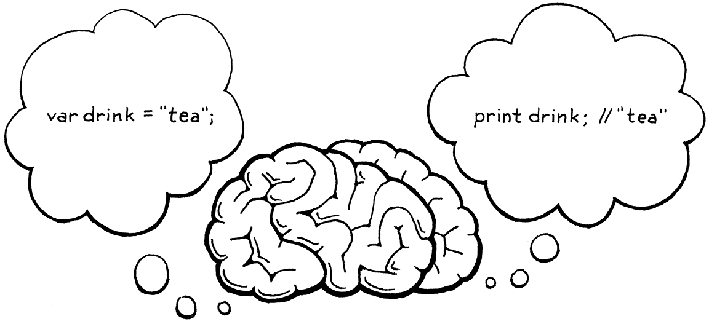
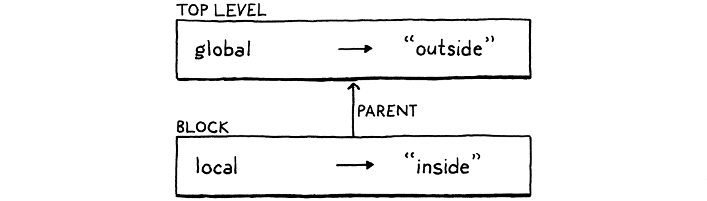
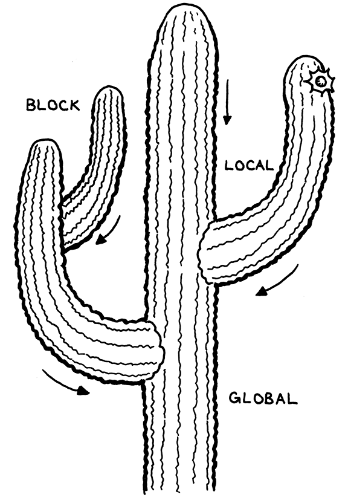

#### Chapter 8.

# Statements and State

> All my life, my heart has yearned for a thing I cannot name. André Breton, *Mad Love*

The interpreter we have so far feels less like programming a real language and more like punching buttons on a calculator. “Programming” to me means building up a system out of smaller pieces. We can’t do that yet because we have no way to bind a name to some data or function. We can’t compose software without a way to refer to the pieces.

To support bindings, our interpreter needs internal state. When you define a variable at the beginning of the program and use it at the end, the interpreter has to hold on to the value of that variable in the meantime. So in this chapter, we will give our interpreter a brain that can not just process, but *remember*.



State and statements go hand in hand. Since statements, by definition, don’t evaluate to a value, they need to do something else to be useful. That something is called a **side effect**. It could mean producing user-visible output or modifying some state in the interpreter that can be detected later. The latter makes them a great fit for defining variables or other named entities.

> You could make a language that treats variable declarations as expressions that both create a binding and produce a value. The only language I know that does that is Tcl. Scheme seems like a contender, but note that after a `let` expression is evaluated, the variable it bound is forgotten. The `define` syntax is not an expression.

In this chapter, we’ll do all of that. We’ll define statements that produce output (`print`) and create state (`var`). We’ll add expressions to access and assign to variables. Finally, we’ll add blocks and local scope. That’s a lot to stuff into one chapter, but we’ll chew through it all one bite at a time.

## 8.1 Statements

We start by extending Lox’s grammar with statements. They aren’t very different from expressions. We start with the two simplest kinds:

1.  An **expression statement** lets you place an expression where a statement is expected. They exist to evaluate expressions that have side effects. You may not notice them, but you use them all the time in C, Java, and other languages. Any time you see a function or method call followed by a `;`, you’re looking at an expression statement.

    > Pascal is an outlier. It distinguishes between *procedures* and *functions*. Functions return values, but procedures cannot. There is a statement form for calling a procedure, but functions can only be called where an expression is expected. There are no expression statements in Pascal.

2.  A **`print` statement** evaluates an expression and displays the result to the user. I admit it’s weird to bake printing right into the language instead of making it a library function. Doing so is a concession to the fact that we’re building this interpreter one chapter at a time and want to be able to play with it before it’s all done. To make print a library function, we’d have to wait until we had all of the machinery for defining and calling functions before we could witness any side effects.

    > I will note with only a modicum of defensiveness that BASIC and Python have dedicated `print` statements and they are real languages. Granted, Python did remove their `print` statement in 3.0 . . . 

New syntax means new grammar rules. In this chapter, we finally gain the ability to parse an entire Lox script. Since Lox is an imperative, dynamically typed language, the “top level” of a script is simply a list of statements. The new rules are:

```
program        → statement* EOF ;

statement      → exprStmt
               | printStmt ;

exprStmt       → expression ";" ;
printStmt      → "print" expression ";" ;
```

The first rule is now `program`, which is the starting point for the grammar and represents a complete Lox script or REPL entry. A program is a list of statements followed by the special “end of file” token. The mandatory end token ensures the parser consumes the entire input and doesn’t silently ignore erroneous unconsumed tokens at the end of a script.

Right now, `statement` only has two cases for the two kinds of statements we’ve described. We’ll fill in more later in this chapter and in the following ones. The next step is turning this grammar into something we can store in memory—syntax trees.

### 8.1.1 Statement syntax trees

There is no place in the grammar where both an expression and a statement are allowed. The operands of, say, `+` are always expressions, never statements. The body of a `while` loop is always a statement.

Since the two syntaxes are disjoint, we don’t need a single base class that they all inherit from. Splitting expressions and statements into separate class hierarchies enables the Java compiler to help us find dumb mistakes like passing a statement to a Java method that expects an expression.

That means a new base class for statements. As our elders did before us, we will use the cryptic name “Stmt”. With great foresight, I have designed our little AST metaprogramming script in anticipation of this. That’s why we passed in “Expr” as a parameter to `defineAst()`. Now we add another call to define Stmt and its subclasses.

> Not really foresight: I wrote all the code for the book before I sliced it into chapters.

```
      "Unary    : Token operator, Expr right"
    ));
```

```
    defineAst(outputDir, "Stmt", Arrays.asList(
      "Expression : Expr expression",
      "Print      : Expr expression"
    ));
```

```
  }
```

*tool/GenerateAst.java*, in *main*()

> The generated code for the new nodes is in Appendix II: Expression statement, Print statement.

Run the AST generator script and behold the resulting “Stmt.java” file with the syntax tree classes we need for expression and `print` statements. Don’t forget to add the file to your IDE project or makefile or whatever.

### 8.1.2 Parsing statements

The parser’s `parse()` method that parses and returns a single expression was a temporary hack to get the last chapter up and running. Now that our grammar has the correct starting rule, `program`, we can turn `parse()` into the real deal.

```
  List<Stmt> parse() {
    List<Stmt> statements = new ArrayList<>();
    while (!isAtEnd()) {
      statements.add(statement());
    }

    return statements;
  }
```

*lox/Parser.java*, method *parse*(), replace 7 lines

> What about the code we had in here for catching `ParseError` exceptions? We’ll put better parse error handling in place soon when we add support for additional statement types.

This parses a series of statements, as many as it can find until it hits the end of the input. This is a pretty direct translation of the `program` rule into recursive descent style. We must also chant a minor prayer to the Java verbosity gods since we are using ArrayList now.

```
package com.craftinginterpreters.lox;
```

```
import java.util.ArrayList;
```

```
import java.util.List;
```

*lox/Parser.java*

A program is a list of statements, and we parse one of those statements using this method:

```
  private Stmt statement() {
    if (match(PRINT)) return printStatement();

    return expressionStatement();
  }
```

*lox/Parser.java*, add after *expression*()

A little bare bones, but we’ll fill it in with more statement types later. We determine which specific statement rule is matched by looking at the current token. A `print` token means it’s obviously a `print` statement.

If the next token doesn’t look like any known kind of statement, we assume it must be an expression statement. That’s the typical final fallthrough case when parsing a statement, since it’s hard to proactively recognize an expression from its first token.

Each statement kind gets its own method. First `print`:

```
  private Stmt printStatement() {
    Expr value = expression();
    consume(SEMICOLON, "Expect ';' after value.");
    return new Stmt.Print(value);
  }
```

*lox/Parser.java*, add after *statement*()

Since we already matched and consumed the `print` token itself, we don’t need to do that here. We parse the subsequent expression, consume the terminating semicolon, and emit the syntax tree.

If we didn’t match a `print` statement, we must have one of these:

```
  private Stmt expressionStatement() {
    Expr expr = expression();
    consume(SEMICOLON, "Expect ';' after expression.");
    return new Stmt.Expression(expr);
  }
```

*lox/Parser.java*, add after *printStatement*()

Similar to the previous method, we parse an expression followed by a semicolon. We wrap that Expr in a Stmt of the right type and return it.

### 8.1.3 Executing statements

We’re running through the previous couple of chapters in microcosm, working our way through the front end. Our parser can now produce statement syntax trees, so the next and final step is to interpret them. As in expressions, we use the Visitor pattern, but we have a new visitor interface, Stmt.Visitor, to implement since statements have their own base class.

We add that to the list of interfaces Interpreter implements.

```
class Interpreter implements Expr.Visitor<Object>,
                             Stmt.Visitor<Void> {
```

```
  void interpret(Expr expression) {
```

*lox/Interpreter.java*, replace 1 line

> Java doesn’t let you use lowercase “void” as a generic type argument for obscure reasons having to do with type erasure and the stack. Instead, there is a separate “Void” type specifically for this use. Sort of a “boxed void”, like “Integer” is for “int”.

Unlike expressions, statements produce no values, so the return type of the visit methods is Void, not Object. We have two statement types, and we need a visit method for each. The easiest is expression statements.

```
  @Override
  public Void visitExpressionStmt(Stmt.Expression stmt) {
    evaluate(stmt.expression);
    return null;
  }
```

*lox/Interpreter.java*, add after *evaluate*()

We evaluate the inner expression using our existing `evaluate()` method and discard the value. Then we return `null`. Java requires that to satisfy the special capitalized Void return type. Weird, but what can you do?

> Appropriately enough, we discard the value returned by `evaluate()` by placing that call inside a *Java* expression statement.

The `print` statement’s visit method isn’t much different.

```
  @Override
  public Void visitPrintStmt(Stmt.Print stmt) {
    Object value = evaluate(stmt.expression);
    System.out.println(stringify(value));
    return null;
  }
```

*lox/Interpreter.java*, add after *visitExpressionStmt*()

Before discarding the expression’s value, we convert it to a string using the `stringify()` method we introduced in the last chapter and then dump it to stdout.

Our interpreter is able to visit statements now, but we have some work to do to feed them to it. First, modify the old `interpret()` method in the Interpreter class to accept a list of statements—in other words, a program.

```
  void interpret(List<Stmt> statements) {
    try {
      for (Stmt statement : statements) {
        execute(statement);
      }
    } catch (RuntimeError error) {
      Lox.runtimeError(error);
    }
  }
```

*lox/Interpreter.java*, method *interpret*(), replace 8 lines

This replaces the old code which took a single expression. The new code relies on this tiny helper method:

```
  private void execute(Stmt stmt) {
    stmt.accept(this);
  }
```

*lox/Interpreter.java*, add after *evaluate*()

That’s the statement analogue to the `evaluate()` method we have for expressions. Since we’re working with lists now, we need to let Java know.

```
package com.craftinginterpreters.lox;
```

```
import java.util.List;
```

```
class Interpreter implements Expr.Visitor<Object>,
```

*lox/Interpreter.java*

The main Lox class is still trying to parse a single expression and pass it to the interpreter. We fix the parsing line like so:

```
    Parser parser = new Parser(tokens);
```

```
    List<Stmt> statements = parser.parse();
```

```
    // Stop if there was a syntax error.
```

*lox/Lox.java*, in *run*(), replace 1 line

And then replace the call to the interpreter with this:

```
    if (hadError) return;
```

```
    interpreter.interpret(statements);
```

```
  }
```

*lox/Lox.java*, in *run*(), replace 1 line

Basically just plumbing the new syntax through. OK, fire up the interpreter and give it a try. At this point, it’s worth sketching out a little Lox program in a text file to run as a script. Something like:

```
print "one";
print true;
print 2 + 1;
```

It almost looks like a real program! Note that the REPL, too, now requires you to enter a full statement instead of a simple expression. Don’t forget your semicolons.

## 8.2 Global Variables

Now that we have statements, we can start working on state. Before we get into all of the complexity of lexical scoping, we’ll start off with the easiest kind of variables—globals. We need two new constructs.

1.  A **variable declaration** statement brings a new variable into the world.

    ```
    var beverage = "espresso";
    ```

    This creates a new binding that associates a name (here “beverage”) with a value (here, the string `"espresso"`).

2.  Once that’s done, a **variable expression** accesses that binding. When the identifier “beverage” is used as an expression, it looks up the value bound to that name and returns it.

    ```
    print beverage; // "espresso".
    ```

Later, we’ll add assignment and block scope, but that’s enough to get moving.

> Global state gets a bad rap. Sure, lots of global state—especially *mutable* state—makes it hard to maintain large programs. It’s good software engineering to minimize how much you use.
>
> But when you’re slapping together a simple programming language or, heck, even learning your first language, the flat simplicity of global variables helps. My first language was BASIC and, though I outgrew it eventually, it was nice that I didn’t have to wrap my head around scoping rules before I could make a computer do fun stuff.

### 8.2.1 Variable syntax

As before, we’ll work through the implementation from front to back, starting with the syntax. Variable declarations are statements, but they are different from other statements, and we’re going to split the statement grammar in two to handle them. That’s because the grammar restricts where some kinds of statements are allowed.

The clauses in control flow statements—think the then and else branches of an `if` statement or the body of a `while`—are each a single statement. But that statement is not allowed to be one that declares a name. This is OK:

```
if (monday) print "Ugh, already?";
```

But this is not:

```
if (monday) var beverage = "espresso";
```

We *could* allow the latter, but it’s confusing. What is the scope of that `beverage` variable? Does it persist after the `if` statement? If so, what is its value on days other than Monday? Does the variable exist at all on those days?

Code like this is weird, so C, Java, and friends all disallow it. It’s as if there are two levels of “precedence” for statements. Some places where a statement is allowed—like inside a block or at the top level—allow any kind of statement, including declarations. Others allow only the “higher” precedence statements that don’t declare names.

> In this analogy, block statements work sort of like parentheses do for expressions. A block is itself in the “higher” precedence level and can be used anywhere, like in the clauses of an `if` statement. But the statements it *contains* can be lower precedence. You’re allowed to declare variables and other names inside the block. The curlies let you escape back into the full statement grammar from a place where only some statements are allowed.

To accommodate the distinction, we add another rule for kinds of statements that declare names.

```
program        → declaration* EOF ;

declaration    → varDecl
               | statement ;

statement      → exprStmt
               | printStmt ;
```

Declaration statements go under the new `declaration` rule. Right now, it’s only variables, but later it will include functions and classes. Any place where a declaration is allowed also allows non-declaring statements, so the `declaration` rule falls through to `statement`. Obviously, you can declare stuff at the top level of a script, so `program` routes to the new rule.

The rule for declaring a variable looks like:

```
varDecl        → "var" IDENTIFIER ( "=" expression )? ";" ;
```

Like most statements, it starts with a leading keyword. In this case, `var`. Then an identifier token for the name of the variable being declared, followed by an optional initializer expression. Finally, we put a bow on it with the semicolon.

To access a variable, we define a new kind of primary expression.

```
primary        → "true" | "false" | "nil"
               | NUMBER | STRING
               | "(" expression ")"
               | IDENTIFIER ;
```

That `IDENTIFIER` clause matches a single identifier token, which is understood to be the name of the variable being accessed.

These new grammar rules get their corresponding syntax trees. Over in the AST generator, we add a new statement node for a variable declaration.

```
      "Expression : Expr expression",
```

```
      "Print      : Expr expression",
```

```
      "Var        : Token name, Expr initializer"
```

```
    ));
```

*tool/GenerateAst.java*, in *main*(), add *“,”* to previous line

> The generated code for the new node is in Appendix II.

It stores the name token so we know what it’s declaring, along with the initializer expression. (If there isn’t an initializer, that field is `null`.)

Then we add an expression node for accessing a variable.

```
      "Literal  : Object value",
```

```
      "Unary    : Token operator, Expr right",
```

```
      "Variable : Token name"
```

```
    ));
```

*tool/GenerateAst.java*, in *main*(), add *“,”* to previous line

It’s simply a wrapper around the token for the variable name. That’s it. As always, don’t forget to run the AST generator script so that you get updated “Expr.java” and “Stmt.java” files.

> The generated code for the new node is in Appendix II.

### 8.2.2 Parsing variables

Before we parse variable statements, we need to shift around some code to make room for the new `declaration` rule in the grammar. The top level of a program is now a list of declarations, so the entrypoint method to the parser changes.

```
  List<Stmt> parse() {
    List<Stmt> statements = new ArrayList<>();
    while (!isAtEnd()) {
```

```
      statements.add(declaration());
```

```
    }

    return statements;
  }
```

*lox/Parser.java*, in *parse*(), replace 1 line

That calls this new method:

```
  private Stmt declaration() {
    try {
      if (match(VAR)) return varDeclaration();

      return statement();
    } catch (ParseError error) {
      synchronize();
      return null;
    }
  }
```

*lox/Parser.java*, add after *expression*()

Hey, do you remember way back in that earlier chapter when we put the infrastructure in place to do error recovery? We are finally ready to hook that up.

This `declaration()` method is the method we call repeatedly when parsing a series of statements in a block or a script, so it’s the right place to synchronize when the parser goes into panic mode. The whole body of this method is wrapped in a try block to catch the exception thrown when the parser begins error recovery. This gets it back to trying to parse the beginning of the next statement or declaration.

The real parsing happens inside the try block. First, it looks to see if we’re at a variable declaration by looking for the leading `var` keyword. If not, it falls through to the existing `statement()` method that parses `print` and expression statements.

Remember how `statement()` tries to parse an expression statement if no other statement matches? And `expression()` reports a syntax error if it can’t parse an expression at the current token? That chain of calls ensures we report an error if a valid declaration or statement isn’t parsed.

When the parser matches a `var` token, it branches to:

```
  private Stmt varDeclaration() {
    Token name = consume(IDENTIFIER, "Expect variable name.");

    Expr initializer = null;
    if (match(EQUAL)) {
      initializer = expression();
    }

    consume(SEMICOLON, "Expect ';' after variable declaration.");
    return new Stmt.Var(name, initializer);
  }
```

*lox/Parser.java*, add after *printStatement*()

As always, the recursive descent code follows the grammar rule. The parser has already matched the `var` token, so next it requires and consumes an identifier token for the variable name.

Then, if it sees an `=` token, it knows there is an initializer expression and parses it. Otherwise, it leaves the initializer `null`. Finally, it consumes the required semicolon at the end of the statement. All this gets wrapped in a Stmt.Var syntax tree node and we’re groovy.

Parsing a variable expression is even easier. In `primary()`, we look for an identifier token.

```
      return new Expr.Literal(previous().literal);
    }
```

```
    if (match(IDENTIFIER)) {
      return new Expr.Variable(previous());
    }
```

```
    if (match(LEFT_PAREN)) {
```

*lox/Parser.java*, in *primary*()

That gives us a working front end for declaring and using variables. All that’s left is to feed it into the interpreter. Before we get to that, we need to talk about where variables live in memory.

## 8.3 Environments

The bindings that associate variables to values need to be stored somewhere. Ever since the Lisp folks invented parentheses, this data structure has been called an **environment**.


> I like to imagine the environment literally, as a sylvan wonderland where variables and values frolic.

You can think of it like a map where the keys are variable names and the values are the variable’s, uh, values. In fact, that’s how we’ll implement it in Java. We could stuff that map and the code to manage it right into Interpreter, but since it forms a nicely delineated concept, we’ll pull it out into its own class.

Start a new file and add:

> Java calls them **maps** or **hashmaps**. Other languages call them **hash tables**, **dictionaries** (Python and C#), **hashes** (Ruby and Perl), **tables** (Lua), or **associative arrays** (PHP). Way back when, they were known as **scatter tables**.

```
package com.craftinginterpreters.lox;

import java.util.HashMap;
import java.util.Map;

class Environment {
  private final Map<String, Object> values = new HashMap<>();
}
```

*lox/Environment.java*, create new file

There’s a Java Map in there to store the bindings. It uses bare strings for the keys, not tokens. A token represents a unit of code at a specific place in the source text, but when it comes to looking up variables, all identifier tokens with the same name should refer to the same variable (ignoring scope for now). Using the raw string ensures all of those tokens refer to the same map key.

There are two operations we need to support. First, a variable definition binds a new name to a value.

```
  void define(String name, Object value) {
    values.put(name, value);
  }
```

*lox/Environment.java*, in class *Environment*

Not exactly brain surgery, but we have made one interesting semantic choice. When we add the key to the map, we don’t check to see if it’s already present. That means that this program works:

```
var a = "before";
print a; // "before".
var a = "after";
print a; // "after".
```

A variable statement doesn’t just define a *new* variable, it can also be used to *re*define an existing variable. We could choose to make this an error instead. The user may not intend to redefine an existing variable. (If they did mean to, they probably would have used assignment, not `var`.) Making redefinition an error would help them find that bug.

However, doing so interacts poorly with the REPL. In the middle of a REPL session, it’s nice to not have to mentally track which variables you’ve already defined. We could allow redefinition in the REPL but not in scripts, but then users would have to learn two sets of rules, and code copied and pasted from one form to the other might not work.

> My rule about variables and scoping is, “When in doubt, do what Scheme does”. The Scheme folks have probably spent more time thinking about variable scope than we ever will—one of the main goals of Scheme was to introduce lexical scoping to the world—so it’s hard to go wrong if you follow in their footsteps.
>
> Scheme allows redefining variables at the top level.

So, to keep the two modes consistent, we’ll allow it—at least for global variables. Once a variable exists, we need a way to look it up.

```
class Environment {
  private final Map<String, Object> values = new HashMap<>();
```

```
  Object get(Token name) {
    if (values.containsKey(name.lexeme)) {
      return values.get(name.lexeme);
    }

    throw new RuntimeError(name,
        "Undefined variable '" + name.lexeme + "'.");
  }
```

```
  void define(String name, Object value) {
```

*lox/Environment.java*, in class *Environment*

This is a little more semantically interesting. If the variable is found, it simply returns the value bound to it. But what if it’s not? Again, we have a choice:

- Make it a syntax error.

- Make it a runtime error.

- Allow it and return some default value like `nil`.

Lox is pretty lax, but the last option is a little *too* permissive to me. Making it a syntax error—a compile-time error—seems like a smart choice. Using an undefined variable is a bug, and the sooner you detect the mistake, the better.

The problem is that *using* a variable isn’t the same as *referring* to it. You can refer to a variable in a chunk of code without immediately evaluating it if that chunk of code is wrapped inside a function. If we make it a static error to *mention* a variable before it’s been declared, it becomes much harder to define recursive functions.

We could accommodate single recursion—a function that calls itself—by declaring the function’s own name before we examine its body. But that doesn’t help with mutually recursive procedures that call each other. Consider:

```
fun isOdd(n) {
  if (n == 0) return false;
  return isEven(n - 1);
}

fun isEven(n) {
  if (n == 0) return true;
  return isOdd(n - 1);
}
```

> Granted, this is probably not the most efficient way to tell if a number is even or odd (not to mention the bad things that happen if you pass a non-integer or negative number to them). Bear with me.

The `isEven()` function isn’t defined by the time we are looking at the body of `isOdd()` where it’s called. If we swap the order of the two functions, then `isOdd()` isn’t defined when we’re looking at `isEven()`’s body.

> Some statically typed languages like Java and C# solve this by specifying that the top level of a program isn’t a sequence of imperative statements. Instead, a program is a set of declarations which all come into being simultaneously. The implementation declares *all* of the names before looking at the bodies of *any* of the functions.
>
> Older languages like C and Pascal don’t work like this. Instead, they force you to add explicit *forward declarations* to declare a name before it’s fully defined. That was a concession to the limited computing power at the time. They wanted to be able to compile a source file in one single pass through the text, so those compilers couldn’t gather up all of the declarations first before processing function bodies.

Since making it a *static* error makes recursive declarations too difficult, we’ll defer the error to runtime. It’s OK to refer to a variable before it’s defined as long as you don’t *evaluate* the reference. That lets the program for even and odd numbers work, but you’d get a runtime error in:

```
print a;
var a = "too late!";
```

As with type errors in the expression evaluation code, we report a runtime error by throwing an exception. The exception contains the variable’s token so we can tell the user where in their code they messed up.

### 8.3.1 Interpreting global variables

The Interpreter class gets an instance of the new Environment class.

```
class Interpreter implements Expr.Visitor<Object>,
                             Stmt.Visitor<Void> {
```

```
  private Environment environment = new Environment();
```

```
  void interpret(List<Stmt> statements) {
```

*lox/Interpreter.java*, in class *Interpreter*

We store it as a field directly in Interpreter so that the variables stay in memory as long as the interpreter is still running.

We have two new syntax trees, so that’s two new visit methods. The first is for declaration statements.

```
  @Override
  public Void visitVarStmt(Stmt.Var stmt) {
    Object value = null;
    if (stmt.initializer != null) {
      value = evaluate(stmt.initializer);
    }

    environment.define(stmt.name.lexeme, value);
    return null;
  }
```

*lox/Interpreter.java*, add after *visitPrintStmt*()

If the variable has an initializer, we evaluate it. If not, we have another choice to make. We could have made this a syntax error in the parser by *requiring* an initializer. Most languages don’t, though, so it feels a little harsh to do so in Lox.

We could make it a runtime error. We’d let you define an uninitialized variable, but if you accessed it before assigning to it, a runtime error would occur. It’s not a bad idea, but most dynamically typed languages don’t do that. Instead, we’ll keep it simple and say that Lox sets a variable to `nil` if it isn’t explicitly initialized.

```
var a;
print a; // "nil".
```

Thus, if there isn’t an initializer, we set the value to `null`, which is the Java representation of Lox’s `nil` value. Then we tell the environment to bind the variable to that value.

Next, we evaluate a variable expression.

```
  @Override
  public Object visitVariableExpr(Expr.Variable expr) {
    return environment.get(expr.name);
  }
```

*lox/Interpreter.java*, add after *visitUnaryExpr*()

This simply forwards to the environment which does the heavy lifting to make sure the variable is defined. With that, we’ve got rudimentary variables working. Try this out:

```
var a = 1;
var b = 2;
print a + b;
```

We can’t reuse *code* yet, but we can start to build up programs that reuse *data*.

## 8.4 Assignment

It’s possible to create a language that has variables but does not let you reassign—or **mutate**—them. Haskell is one example. SML supports only mutable references and arrays—variables cannot be reassigned. Rust steers you away from mutation by requiring a `mut` modifier to enable assignment.

Mutating a variable is a side effect and, as the name suggests, some language folks think side effects are dirty or inelegant. Code should be pure math that produces values—crystalline, unchanging ones—like an act of divine creation. Not some grubby automaton that beats blobs of data into shape, one imperative grunt at a time.

> I find it delightful that the same group of people who pride themselves on dispassionate logic are also the ones who can’t resist emotionally loaded terms for their work: “pure”, “side effect”, “lazy”, “persistent”, “first-class”, “higher-order”.

Lox is not so austere. Lox is an imperative language, and mutation comes with the territory. Adding support for assignment doesn’t require much work. Global variables already support redefinition, so most of the machinery is there now. Mainly, we’re missing an explicit assignment notation.

### 8.4.1 Assignment syntax

That little `=` syntax is more complex than it might seem. Like most C-derived languages, assignment is an expression and not a statement. As in C, it is the lowest precedence expression form. That means the rule slots between `expression` and `equality` (the next lowest precedence expression).

> In some other languages, like Pascal, Python, and Go, assignment is a statement.

```
expression     → assignment ;
assignment     → IDENTIFIER "=" assignment
               | equality ;
```

This says an `assignment` is either an identifier followed by an `=` and an expression for the value, or an `equality` (and thus any other) expression. Later, `assignment` will get more complex when we add property setters on objects, like:

```
instance.field = "value";
```

The easy part is adding the new syntax tree node.

```
    defineAst(outputDir, "Expr", Arrays.asList(
```

```
      "Assign   : Token name, Expr value",
```

```
      "Binary   : Expr left, Token operator, Expr right",
```

*tool/GenerateAst.java*, in *main*()

> The generated code for the new node is in Appendix II.

It has a token for the variable being assigned to, and an expression for the new value. After you run the AstGenerator to get the new Expr.Assign class, swap out the body of the parser’s existing `expression()` method to match the updated rule.

```
  private Expr expression() {
```

```
    return assignment();
```

```
  }
```

*lox/Parser.java*, in *expression*(), replace 1 line

Here is where it gets tricky. A single token lookahead recursive descent parser can’t see far enough to tell that it’s parsing an assignment until *after* it has gone through the left-hand side and stumbled onto the `=`. You might wonder why it even needs to. After all, we don’t know we’re parsing a `+` expression until after we’ve finished parsing the left operand.

The difference is that the left-hand side of an assignment isn’t an expression that evaluates to a value. It’s a sort of pseudo-expression that evaluates to a “thing” you can assign to. Consider:

```
var a = "before";
a = "value";
```

On the second line, we don’t *evaluate* `a` (which would return the string “before”). We figure out what variable `a` refers to so we know where to store the right-hand side expression’s value. The [classic terms](https://en.wikipedia.org/wiki/Value_(computer_science)#lrvalue) for these two constructs are **l-value** and **r-value**. All of the expressions that we’ve seen so far that produce values are r-values. An l-value “evaluates” to a storage location that you can assign into.

> In fact, the names come from assignment expressions: *l*-values appear on the *left* side of the `=` in an assignment, and *r*-values on the *right*.

We want the syntax tree to reflect that an l-value isn’t evaluated like a normal expression. That’s why the Expr.Assign node has a *Token* for the left-hand side, not an Expr. The problem is that the parser doesn’t know it’s parsing an l-value until it hits the `=`. In a complex l-value, that may occur many tokens later.

```
makeList().head.next = node;
```

> Since the receiver of a field assignment can be any expression, and expressions can be as long as you want to make them, it may take an *unbounded* number of tokens of lookahead to find the `=`.

We have only a single token of lookahead, so what do we do? We use a little trick, and it looks like this:

```
  private Expr assignment() {
    Expr expr = equality();

    if (match(EQUAL)) {
      Token equals = previous();
      Expr value = assignment();

      if (expr instanceof Expr.Variable) {
        Token name = ((Expr.Variable)expr).name;
        return new Expr.Assign(name, value);
      }

      error(equals, "Invalid assignment target.");
    }

    return expr;
  }
```

*lox/Parser.java*, add after *expressionStatement*()

Most of the code for parsing an assignment expression looks similar to that of the other binary operators like `+`. We parse the left-hand side, which can be any expression of higher precedence. If we find an `=`, we parse the right-hand side and then wrap it all up in an assignment expression tree node.

> We *report* an error if the left-hand side isn’t a valid assignment target, but we don’t *throw* it because the parser isn’t in a confused state where we need to go into panic mode and synchronize.

One slight difference from binary operators is that we don’t loop to build up a sequence of the same operator. Since assignment is right-associative, we instead recursively call `assignment()` to parse the right-hand side.

The trick is that right before we create the assignment expression node, we look at the left-hand side expression and figure out what kind of assignment target it is. We convert the r-value expression node into an l-value representation.

This conversion works because it turns out that every valid assignment target happens to also be valid syntax as a normal expression. Consider a complex field assignment like:

> You can still use this trick even if there are assignment targets that are not valid expressions. Define a **cover grammar**, a looser grammar that accepts all of the valid expression *and* assignment target syntaxes. When you hit an `=`, report an error if the left-hand side isn’t within the valid assignment target grammar. Conversely, if you *don’t* hit an `=`, report an error if the left-hand side isn’t a valid *expression*.

```
newPoint(x + 2, 0).y = 3;
```

The left-hand side of that assignment could also work as a valid expression.

```
newPoint(x + 2, 0).y;
```

The first example sets the field, the second gets it.

This means we can parse the left-hand side *as if it were* an expression and then after the fact produce a syntax tree that turns it into an assignment target. If the left-hand side expression isn’t a valid assignment target, we fail with a syntax error. That ensures we report an error on code like this:

```
a + b = c;
```

> Way back in the parsing chapter, I said we represent parenthesized expressions in the syntax tree because we’ll need them later. This is why. We need to be able to distinguish these cases:
>
> ```
> a = 3;   // OK.
> (a) = 3; // Error.
> ```

Right now, the only valid target is a simple variable expression, but we’ll add fields later. The end result of this trick is an assignment expression tree node that knows what it is assigning to and has an expression subtree for the value being assigned. All with only a single token of lookahead and no backtracking.

### 8.4.2 Assignment semantics

We have a new syntax tree node, so our interpreter gets a new visit method.

```
  @Override
  public Object visitAssignExpr(Expr.Assign expr) {
    Object value = evaluate(expr.value);
    environment.assign(expr.name, value);
    return value;
  }
```

*lox/Interpreter.java*, add after *visitVarStmt*()

For obvious reasons, it’s similar to variable declaration. It evaluates the right-hand side to get the value, then stores it in the named variable. Instead of using `define()` on Environment, it calls this new method:

```
  void assign(Token name, Object value) {
    if (values.containsKey(name.lexeme)) {
      values.put(name.lexeme, value);
      return;
    }

    throw new RuntimeError(name,
        "Undefined variable '" + name.lexeme + "'.");
  }
```

*lox/Environment.java*, add after *get*()

The key difference between assignment and definition is that assignment is not allowed to create a *new* variable. In terms of our implementation, that means it’s a runtime error if the key doesn’t already exist in the environment’s variable map.

> Unlike Python and Ruby, Lox doesn’t do implicit variable declaration.

The last thing the `visit()` method does is return the assigned value. That’s because assignment is an expression that can be nested inside other expressions, like so:

```
var a = 1;
print a = 2; // "2".
```

Our interpreter can now create, read, and modify variables. It’s about as sophisticated as early BASICs. Global variables are simple, but writing a large program when any two chunks of code can accidentally step on each other’s state is no fun. We want *local* variables, which means it’s time for *scope*.

> Maybe a little better than that. Unlike some old BASICs, Lox can handle variable names longer than two characters.

## 8.5 Scope

A **scope** defines a region where a name maps to a certain entity. Multiple scopes enable the same name to refer to different things in different contexts. In my house, “Bob” usually refers to me. But maybe in your town you know a different Bob. Same name, but different dudes based on where you say it.

**Lexical scope** (or the less commonly heard **static scope**) is a specific style of scoping where the text of the program itself shows where a scope begins and ends. In Lox, as in most modern languages, variables are lexically scoped. When you see an expression that uses some variable, you can figure out which variable declaration it refers to just by statically reading the code.

> “Lexical” comes from the Greek “lexikos” which means “related to words”. When we use it in programming languages, it usually means a thing you can figure out from source code itself without having to execute anything.
>
> Lexical scope came onto the scene with ALGOL. Earlier languages were often dynamically scoped. Computer scientists back then believed dynamic scope was faster to execute. Today, thanks to early Scheme hackers, we know that isn’t true. If anything, it’s the opposite.
>
> Dynamic scope for variables lives on in some corners. Emacs Lisp defaults to dynamic scope for variables. The [`binding`](http://clojuredocs.org/clojure.core/binding) macro in Clojure provides it. The widely disliked [`with` statement](https://developer.mozilla.org/en-US/docs/Web/JavaScript/Reference/Statements/with) in JavaScript turns properties on an object into dynamically scoped variables.

For example:

```
{
  var a = "first";
  print a; // "first".
}

{
  var a = "second";
  print a; // "second".
}
```

Here, we have two blocks with a variable `a` declared in each of them. You and I can tell just from looking at the code that the use of `a` in the first `print` statement refers to the first `a`, and the second one refers to the second.


This is in contrast to **dynamic scope** where you don’t know what a name refers to until you execute the code. Lox doesn’t have dynamically scoped *variables*, but methods and fields on objects are dynamically scoped.

```
class Saxophone {
  play() {
    print "Careless Whisper";
  }
}

class GolfClub {
  play() {
    print "Fore!";
  }
}

fun playIt(thing) {
  thing.play();
}
```

When `playIt()` calls `thing.play()`, we don’t know if we’re about to hear “Careless Whisper” or “Fore!” It depends on whether you pass a Saxophone or a GolfClub to the function, and we don’t know that until runtime.

Scope and environments are close cousins. The former is the theoretical concept, and the latter is the machinery that implements it. As our interpreter works its way through code, syntax tree nodes that affect scope will change the environment. In a C-ish syntax like Lox’s, scope is controlled by curly-braced blocks. (That’s why we call it **block scope**.)

```
{
  var a = "in block";
}
print a; // Error! No more "a".
```

The beginning of a block introduces a new local scope, and that scope ends when execution passes the closing `}`. Any variables declared inside the block disappear.

### 8.5.1 Nesting and shadowing

A first cut at implementing block scope might work like this:

1.  As we visit each statement inside the block, keep track of any variables declared.

2.  After the last statement is executed, tell the environment to delete all of those variables.

That would work for the previous example. But remember, one motivation for local scope is encapsulation—a block of code in one corner of the program shouldn’t interfere with some other block. Check this out:

```
// How loud?
var volume = 11;

// Silence.
volume = 0;

// Calculate size of 3x4x5 cuboid.
{
  var volume = 3 * 4 * 5;
  print volume;
}
```

Look at the block where we calculate the volume of the cuboid using a local declaration of `volume`. After the block exits, the interpreter will delete the *global* `volume` variable. That ain’t right. When we exit the block, we should remove any variables declared inside the block, but if there is a variable with the same name declared outside of the block, *that’s a different variable*. It shouldn’t get touched.

When a local variable has the same name as a variable in an enclosing scope, it **shadows** the outer one. Code inside the block can’t see it any more—it is hidden in the “shadow” cast by the inner one—but it’s still there.

When we enter a new block scope, we need to preserve variables defined in outer scopes so they are still around when we exit the inner block. We do that by defining a fresh environment for each block containing only the variables defined in that scope. When we exit the block, we discard its environment and restore the previous one.

We also need to handle enclosing variables that are *not* shadowed.

```
var global = "outside";
{
  var local = "inside";
  print global + local;
}
```

Here, `global` lives in the outer global environment and `local` is defined inside the block’s environment. In that `print` statement, both of those variables are in scope. In order to find them, the interpreter must search not only the current innermost environment, but also any enclosing ones.

We implement this by chaining the environments together. Each environment has a reference to the environment of the immediately enclosing scope. When we look up a variable, we walk that chain from innermost out until we find the variable. Starting at the inner scope is how we make local variables shadow outer ones.



> While the interpreter is running, the environments form a linear list of objects, but consider the full set of environments created during the entire execution. An outer scope may have multiple blocks nested within it, and each will point to the outer one, giving a tree-like structure, though only one path through the tree exists at a time.
>
> The boring name for this is a [**parent-pointer tree**](https://en.wikipedia.org/wiki/Parent_pointer_tree), but I much prefer the evocative **cactus stack**.
>
> 

Before we add block syntax to the grammar, we’ll beef up our Environment class with support for this nesting. First, we give each environment a reference to its enclosing one.

```
class Environment {
```

```
  final Environment enclosing;
```

```
  private final Map<String, Object> values = new HashMap<>();
```

*lox/Environment.java*, in class *Environment*

This field needs to be initialized, so we add a couple of constructors.

```
  Environment() {
    enclosing = null;
  }

  Environment(Environment enclosing) {
    this.enclosing = enclosing;
  }
```

*lox/Environment.java*, in class *Environment*

The no-argument constructor is for the global scope’s environment, which ends the chain. The other constructor creates a new local scope nested inside the given outer one.

We don’t have to touch the `define()` method—a new variable is always declared in the current innermost scope. But variable lookup and assignment work with existing variables and they need to walk the chain to find them. First, lookup:

```
      return values.get(name.lexeme);
    }
```

```
    if (enclosing != null) return enclosing.get(name);
```

```
    throw new RuntimeError(name,
        "Undefined variable '" + name.lexeme + "'.");
```

*lox/Environment.java*, in *get*()

If the variable isn’t found in this environment, we simply try the enclosing one. That in turn does the same thing recursively, so this will ultimately walk the entire chain. If we reach an environment with no enclosing one and still don’t find the variable, then we give up and report an error as before.

Assignment works the same way.

> It’s likely faster to iteratively walk the chain, but I think the recursive solution is prettier. We’ll do something *much* faster in clox.

```
      values.put(name.lexeme, value);
      return;
    }
```

```
    if (enclosing != null) {
      enclosing.assign(name, value);
      return;
    }
```

```
    throw new RuntimeError(name,
```

*lox/Environment.java*, in *assign*()

Again, if the variable isn’t in this environment, it checks the outer one, recursively.

### 8.5.2 Block syntax and semantics

Now that Environments nest, we’re ready to add blocks to the language. Behold the grammar:

```
statement      → exprStmt
               | printStmt
               | block ;

block          → "{" declaration* "}" ;
```

A block is a (possibly empty) series of statements or declarations surrounded by curly braces. A block is itself a statement and can appear anywhere a statement is allowed. The syntax tree node looks like this:

```
    defineAst(outputDir, "Stmt", Arrays.asList(
```

```
      "Block      : List<Stmt> statements",
```

```
      "Expression : Expr expression",
```

*tool/GenerateAst.java*, in *main*()

> The generated code for the new node is in Appendix II.

It contains the list of statements that are inside the block. Parsing is straightforward. Like other statements, we detect the beginning of a block by its leading token—in this case the `{`. In the `statement()` method, we add:

> As always, don’t forget to run “GenerateAst.java”.

```
    if (match(PRINT)) return printStatement();
```

```
    if (match(LEFT_BRACE)) return new Stmt.Block(block());
```

```
    return expressionStatement();
```

*lox/Parser.java*, in *statement*()

All the real work happens here:

```
  private List<Stmt> block() {
    List<Stmt> statements = new ArrayList<>();

    while (!check(RIGHT_BRACE) && !isAtEnd()) {
      statements.add(declaration());
    }

    consume(RIGHT_BRACE, "Expect '}' after block.");
    return statements;
  }
```

*lox/Parser.java*, add after *expressionStatement*()

We create an empty list and then parse statements and add them to the list until we reach the end of the block, marked by the closing `}`. Note that the loop also has an explicit check for `isAtEnd()`. We have to be careful to avoid infinite loops, even when parsing invalid code. If the user forgets a closing `}`, the parser needs to not get stuck.

> Having `block()` return the raw list of statements and leaving it to `statement()` to wrap the list in a Stmt.Block looks a little odd. I did it that way because we’ll reuse `block()` later for parsing function bodies and we don’t want that body wrapped in a Stmt.Block.

That’s it for syntax. For semantics, we add another visit method to Interpreter.

```
  @Override
  public Void visitBlockStmt(Stmt.Block stmt) {
    executeBlock(stmt.statements, new Environment(environment));
    return null;
  }
```

*lox/Interpreter.java*, add after *execute*()

To execute a block, we create a new environment for the block’s scope and pass it off to this other method:

```
  void executeBlock(List<Stmt> statements,
                    Environment environment) {
    Environment previous = this.environment;
    try {
      this.environment = environment;

      for (Stmt statement : statements) {
        execute(statement);
      }
    } finally {
      this.environment = previous;
    }
  }
```

*lox/Interpreter.java*, add after *execute*()

This new method executes a list of statements in the context of a given environment. Up until now, the `environment` field in Interpreter always pointed to the same environment—the global one. Now, that field represents the *current* environment. That’s the environment that corresponds to the innermost scope containing the code to be executed.

To execute code within a given scope, this method updates the interpreter’s `environment` field, visits all of the statements, and then restores the previous value. As is always good practice in Java, it restores the previous environment using a finally clause. That way it gets restored even if an exception is thrown.

> Manually changing and restoring a mutable `environment` field feels inelegant. Another classic approach is to explicitly pass the environment as a parameter to each visit method. To “change” the environment, you pass a different one as you recurse down the tree. You don’t have to restore the old one, since the new one lives on the Java stack and is implicitly discarded when the interpreter returns from the block’s visit method.
>
> I considered that for jlox, but it’s kind of tedious and verbose adding an environment parameter to every single visit method. To keep the book a little simpler, I went with the mutable field.

Surprisingly, that’s all we need to do in order to fully support local variables, nesting, and shadowing. Go ahead and try this out:

```
var a = "global a";
var b = "global b";
var c = "global c";
{
  var a = "outer a";
  var b = "outer b";
  {
    var a = "inner a";
    print a;
    print b;
    print c;
  }
  print a;
  print b;
  print c;
}
print a;
print b;
print c;
```

Our little interpreter can remember things now. We are inching closer to something resembling a full-featured programming language.

## Challenges

1.  The REPL no longer supports entering a single expression and automatically printing its result value. That’s a drag. Add support to the REPL to let users type in both statements and expressions. If they enter a statement, execute it. If they enter an expression, evaluate it and display the result value.

2.  Maybe you want Lox to be a little more explicit about variable initialization. Instead of implicitly initializing variables to `nil`, make it a runtime error to access a variable that has not been initialized or assigned to, as in:

    ```
    // No initializers.
    var a;
    var b;

    a = "assigned";
    print a; // OK, was assigned first.

    print b; // Error!
    ```

3.  What does the following program do?

    ```
    var a = 1;
    {
      var a = a + 2;
      print a;
    }
    ```

    What did you *expect* it to do? Is it what you think it should do? What does analogous code in other languages you are familiar with do? What do you think users will expect this to do?

## Design Note: Implicit Variable Declaration

Lox has distinct syntax for declaring a new variable and assigning to an existing one. Some languages collapse those to only assignment syntax. Assigning to a non-existent variable automatically brings it into being. This is called **implicit variable declaration** and exists in Python, Ruby, and CoffeeScript, among others. JavaScript has an explicit syntax to declare variables, but can also create new variables on assignment. Visual Basic has [an option to enable or disable implicit variables](https://msdn.microsoft.com/en-us/library/xe53dz5w(v=vs.100).aspx).

When the same syntax can assign or create a variable, each language must decide what happens when it isn’t clear about which behavior the user intends. In particular, each language must choose how implicit declaration interacts with shadowing, and which scope an implicitly declared variable goes into.

- In Python, assignment always creates a variable in the current function’s scope, even if there is a variable with the same name declared outside of the function.

- Ruby avoids some ambiguity by having different naming rules for local and global variables. However, blocks in Ruby (which are more like closures than like “blocks” in C) have their own scope, so it still has the problem. Assignment in Ruby assigns to an existing variable outside of the current block if there is one with the same name. Otherwise, it creates a new variable in the current block’s scope.

- CoffeeScript, which takes after Ruby in many ways, is similar. It explicitly disallows shadowing by saying that assignment always assigns to a variable in an outer scope if there is one, all the way up to the outermost global scope. Otherwise, it creates the variable in the current function scope.

- In JavaScript, assignment modifies an existing variable in any enclosing scope, if found. If not, it implicitly creates a new variable in the *global* scope.

The main advantage to implicit declaration is simplicity. There’s less syntax and no “declaration” concept to learn. Users can just start assigning stuff and the language figures it out.

Older, statically typed languages like C benefit from explicit declaration because they give the user a place to tell the compiler what type each variable has and how much storage to allocate for it. In a dynamically typed, garbage-collected language, that isn’t really necessary, so you can get away with making declarations implicit. It feels a little more “scripty”, more “you know what I mean”.

But is that a good idea? Implicit declaration has some problems.

- A user may intend to assign to an existing variable, but may have misspelled it. The interpreter doesn’t know that, so it goes ahead and silently creates some new variable and the variable the user wanted to assign to still has its old value. This is particularly heinous in JavaScript where a typo will create a *global* variable, which may in turn interfere with other code.

- JS, Ruby, and CoffeeScript use the presence of an existing variable with the same name—even in an outer scope—to determine whether or not an assignment creates a new variable or assigns to an existing one. That means adding a new variable in a surrounding scope can change the meaning of existing code. What was once a local variable may silently turn into an assignment to that new outer variable.

- In Python, you may *want* to assign to some variable outside of the current function instead of creating a new variable in the current one, but you can’t.

Over time, the languages I know with implicit variable declaration ended up adding more features and complexity to deal with these problems.

- Implicit declaration of global variables in JavaScript is universally considered a mistake today. “Strict mode” disables it and makes it a compile error.

- Python added a `global` statement to let you explicitly assign to a global variable from within a function. Later, as functional programming and nested functions became more popular, they added a similar `nonlocal` statement to assign to variables in enclosing functions.

- Ruby extended its block syntax to allow declaring certain variables to be explicitly local to the block even if the same name exists in an outer scope.

Given those, I think the simplicity argument is mostly lost. There is an argument that implicit declaration is the right *default* but I personally find that less compelling.

My opinion is that implicit declaration made sense in years past when most scripting languages were heavily imperative and code was pretty flat. As programmers have gotten more comfortable with deep nesting, functional programming, and closures, it’s become much more common to want access to variables in outer scopes. That makes it more likely that users will run into the tricky cases where it’s not clear whether they intend their assignment to create a new variable or reuse a surrounding one.

So I prefer explicitly declaring variables, which is why Lox requires it.