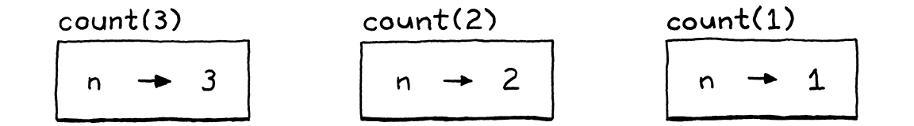
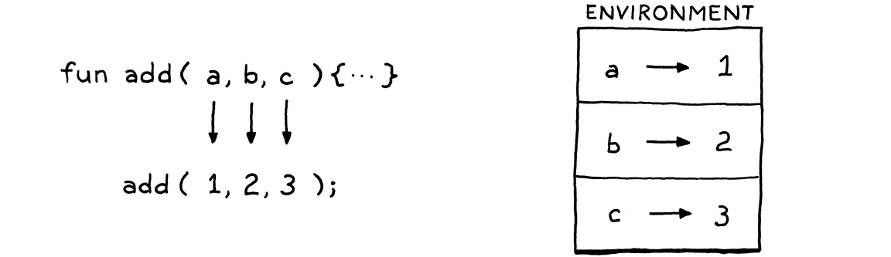
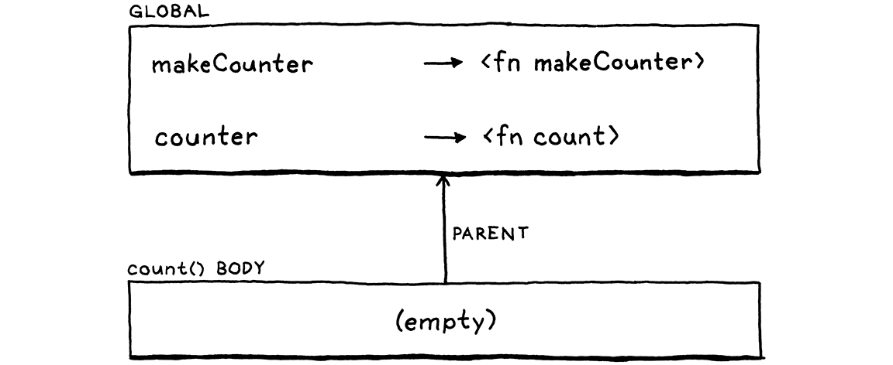
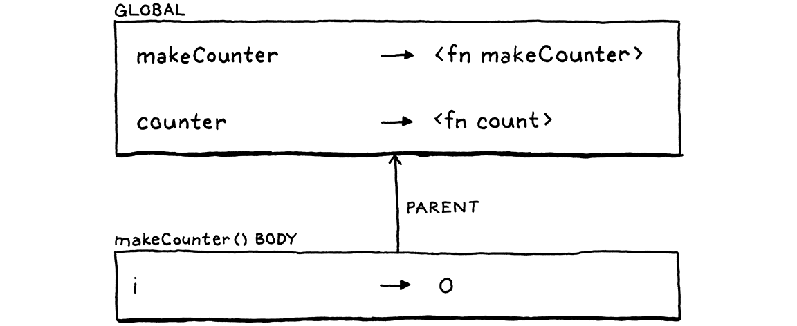
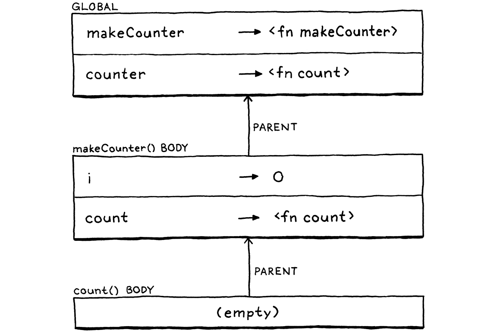

#### Chapter 10.

# Functions

> And that is also the way the human mind works—by the compounding of old ideas into new structures that become new ideas that can themselves be used in compounds, and round and round endlessly, growing ever more remote from the basic earthbound imagery that is each language’s soil.
>
> Douglas R. Hofstadter, *I Am a Strange Loop*

This chapter marks the culmination of a lot of hard work. The previous chapters add useful functionality in their own right, but each also supplies a piece of a puzzle. We’ll take those pieces—expressions, statements, variables, control flow, and lexical scope—add a couple more, and assemble them all into support for real user-defined functions and function calls.

> 

## 10.1 Function Calls

You’re certainly familiar with C-style function call syntax, but the grammar is more subtle than you may realize. Calls are typically to named functions like:

```
average(1, 2);
```

But the name of the function being called isn’t actually part of the call syntax. The thing being called—the **callee**—can be any expression that evaluates to a function. (Well, it does have to be a pretty *high precedence* expression, but parentheses take care of that.) For example:

> The name *is* part of the call syntax in Pascal. You can call only named functions or functions stored directly in variables.

```
getCallback()();
```

There are two call expressions here. The first pair of parentheses has `getCallback` as its callee. But the second call has the entire `getCallback()` expression as its callee. It is the parentheses following an expression that indicate a function call. You can think of a call as sort of like a postfix operator that starts with `(`.

This “operator” has higher precedence than any other operator, even the unary ones. So we slot it into the grammar by having the `unary` rule bubble up to a new `call` rule.

```
unary          → ( "!" | "-" ) unary | call ;
call           → primary ( "(" arguments? ")" )* ;
```

This rule matches a primary expression followed by zero or more function calls. If there are no parentheses, this parses a bare primary expression. Otherwise, each call is recognized by a pair of parentheses with an optional list of arguments inside. The argument list grammar is:

> The rule uses `*` to allow matching a series of calls like `fn(1)(2)(3)`. Code like that isn’t common in C-style languages, but it is in the family of languages derived from ML. There, the normal way of defining a function that takes multiple arguments is as a series of nested functions. Each function takes one argument and returns a new function. That function consumes the next argument, returns yet another function, and so on. Eventually, once all of the arguments are consumed, the last function completes the operation.
>
> This style, called **currying**, after Haskell Curry (the same guy whose first name graces that *other* well-known functional language), is baked directly into the language syntax so it’s not as weird looking as it would be here.

```
arguments      → expression ( "," expression )* ;
```

This rule requires at least one argument expression, followed by zero or more other expressions, each preceded by a comma. To handle zero-argument calls, the `call` rule itself considers the entire `arguments` production to be optional.

I admit, this seems more grammatically awkward than you’d expect for the incredibly common “zero or more comma-separated things” pattern. There are some sophisticated metasyntaxes that handle this better, but in our BNF and in many language specs I’ve seen, it is this cumbersome.

Over in our syntax tree generator, we add a new node.

```
      "Binary   : Expr left, Token operator, Expr right",
```

```
      "Call     : Expr callee, Token paren, List<Expr> arguments",
```

```
      "Grouping : Expr expression",
```

*tool/GenerateAst.java*, in *main*()

> The generated code for the new node is in Appendix II.

It stores the callee expression and a list of expressions for the arguments. It also stores the token for the closing parenthesis. We’ll use that token’s location when we report a runtime error caused by a function call.

Crack open the parser. Where `unary()` used to jump straight to `primary()`, change it to call, well, `call()`.

```
      return new Expr.Unary(operator, right);
    }
```

```
    return call();
```

```
  }
```

*lox/Parser.java*, in *unary*(), replace 1 line

Its definition is:

```
  private Expr call() {
    Expr expr = primary();

    while (true) {
      if (match(LEFT_PAREN)) {
        expr = finishCall(expr);
      } else {
        break;
      }
    }

    return expr;
  }
```

*lox/Parser.java*, add after *unary*()

The code here doesn’t quite line up with the grammar rules. I moved a few things around to make the code cleaner—one of the luxuries we have with a handwritten parser. But it’s roughly similar to how we parse infix operators. First, we parse a primary expression, the “left operand” to the call. Then, each time we see a `(`, we call `finishCall()` to parse the call expression using the previously parsed expression as the callee. The returned expression becomes the new `expr` and we loop to see if the result is itself called.

> This code would be simpler as `while (match(LEFT_PAREN))` instead of the silly `while (true)` and `break`. Don’t worry, it will make sense when we expand the parser later to handle properties on objects.

The code to parse the argument list is in this helper:

```
  private Expr finishCall(Expr callee) {
    List<Expr> arguments = new ArrayList<>();
    if (!check(RIGHT_PAREN)) {
      do {
        arguments.add(expression());
      } while (match(COMMA));
    }

    Token paren = consume(RIGHT_PAREN,
                          "Expect ')' after arguments.");

    return new Expr.Call(callee, paren, arguments);
  }
```

*lox/Parser.java*, add after *unary*()

This is more or less the `arguments` grammar rule translated to code, except that we also handle the zero-argument case. We check for that case first by seeing if the next token is `)`. If it is, we don’t try to parse any arguments.

Otherwise, we parse an expression, then look for a comma indicating that there is another argument after that. We keep doing that as long as we find commas after each expression. When we don’t find a comma, then the argument list must be done and we consume the expected closing parenthesis. Finally, we wrap the callee and those arguments up into a call AST node.

### 10.1.1 Maximum argument counts

Right now, the loop where we parse arguments has no bound. If you want to call a function and pass a million arguments to it, the parser would have no problem with it. Do we want to limit that?

Other languages have various approaches. The C standard says a conforming implementation has to support *at least* 127 arguments to a function, but doesn’t say there’s any upper limit. The Java specification says a method can accept *no more than* 255 arguments.

> The limit is 25*4* arguments if the method is an instance method. That’s because `this`—the receiver of the method—works like an argument that is implicitly passed to the method, so it claims one of the slots.

Our Java interpreter for Lox doesn’t really need a limit, but having a maximum number of arguments will simplify our bytecode interpreter in Part III. We want our two interpreters to be compatible with each other, even in weird corner cases like this, so we’ll add the same limit to jlox.

```
      do {
```

```
        if (arguments.size() >= 255) {
          error(peek(), "Can't have more than 255 arguments.");
        }
```

```
        arguments.add(expression());
```

*lox/Parser.java*, in *finishCall*()

Note that the code here *reports* an error if it encounters too many arguments, but it doesn’t *throw* the error. Throwing is how we kick into panic mode which is what we want if the parser is in a confused state and doesn’t know where it is in the grammar anymore. But here, the parser is still in a perfectly valid state—it just found too many arguments. So it reports the error and keeps on keepin’ on.

### 10.1.2 Interpreting function calls

We don’t have any functions we can call, so it seems weird to start implementing calls first, but we’ll worry about that when we get there. First, our interpreter needs a new import.

```
import java.util.ArrayList;
```

```
import java.util.List;
```

*lox/Interpreter.java*

As always, interpretation starts with a new visit method for our new call expression node.

```
  @Override
  public Object visitCallExpr(Expr.Call expr) {
    Object callee = evaluate(expr.callee);

    List<Object> arguments = new ArrayList<>();
    for (Expr argument : expr.arguments) {
      arguments.add(evaluate(argument));
    }

    LoxCallable function = (LoxCallable)callee;
    return function.call(this, arguments);
  }
```

*lox/Interpreter.java*, add after *visitBinaryExpr*()

First, we evaluate the expression for the callee. Typically, this expression is just an identifier that looks up the function by its name, but it could be anything. Then we evaluate each of the argument expressions in order and store the resulting values in a list.

> This is another one of those subtle semantic choices. Since argument expressions may have side effects, the order they are evaluated could be user visible. Even so, some languages like Scheme and C don’t specify an order. This gives compilers freedom to reorder them for efficiency, but means users may be unpleasantly surprised if arguments aren’t evaluated in the order they expect.

Once we’ve got the callee and the arguments ready, all that remains is to perform the call. We do that by casting the callee to a LoxCallable and then invoking a `call()` method on it. The Java representation of any Lox object that can be called like a function will implement this interface. That includes user-defined functions, naturally, but also class objects since classes are “called” to construct new instances. We’ll also use it for one more purpose shortly.

> I stuck “Lox” before the name to distinguish it from the Java standard library’s own Callable interface. Alas, all the good simple names are already taken.

There isn’t too much to this new interface.

```
package com.craftinginterpreters.lox;

import java.util.List;

interface LoxCallable {
  Object call(Interpreter interpreter, List<Object> arguments);
}
```

*lox/LoxCallable.java*, create new file

We pass in the interpreter in case the class implementing `call()` needs it. We also give it the list of evaluated argument values. The implementer’s job is then to return the value that the call expression produces.

### 10.1.3 Call type errors

Before we get to implementing LoxCallable, we need to make the visit method a little more robust. It currently ignores a couple of failure modes that we can’t pretend won’t occur. First, what happens if the callee isn’t actually something you can call? What if you try to do this:

```
"totally not a function"();
```

Strings aren’t callable in Lox. The runtime representation of a Lox string is a Java string, so when we cast that to LoxCallable, the JVM will throw a ClassCastException. We don’t want our interpreter to vomit out some nasty Java stack trace and die. Instead, we need to check the type ourselves first.

```
    }
```

```
    if (!(callee instanceof LoxCallable)) {
      throw new RuntimeError(expr.paren,
          "Can only call functions and classes.");
    }
```

```
    LoxCallable function = (LoxCallable)callee;
```

*lox/Interpreter.java*, in *visitCallExpr*()

We still throw an exception, but now we’re throwing our own exception type, one that the interpreter knows to catch and report gracefully.

### 10.1.4 Checking arity

The other problem relates to the function’s **arity**. Arity is the fancy term for the number of arguments a function or operation expects. Unary operators have arity one, binary operators two, etc. With functions, the arity is determined by the number of parameters it declares.

```
fun add(a, b, c) {
  print a + b + c;
}
```

This function defines three parameters, `a`, `b`, and `c`, so its arity is three and it expects three arguments. So what if you try to call it like this:

```
add(1, 2, 3, 4); // Too many.
add(1, 2);       // Too few.
```

Different languages take different approaches to this problem. Of course, most statically typed languages check this at compile time and refuse to compile the code if the argument count doesn’t match the function’s arity. JavaScript discards any extra arguments you pass. If you don’t pass enough, it fills in the missing parameters with the magic sort-of-like-null-but-not-really value `undefined`. Python is stricter. It raises a runtime error if the argument list is too short or too long.

I think the latter is a better approach. Passing the wrong number of arguments is almost always a bug, and it’s a mistake I do make in practice. Given that, the sooner the implementation draws my attention to it, the better. So for Lox, we’ll take Python’s approach. Before invoking the callable, we check to see if the argument list’s length matches the callable’s arity.

```
    LoxCallable function = (LoxCallable)callee;
```

```
    if (arguments.size() != function.arity()) {
      throw new RuntimeError(expr.paren, "Expected " +
          function.arity() + " arguments but got " +
          arguments.size() + ".");
    }
```

```
    return function.call(this, arguments);
```

*lox/Interpreter.java*, in *visitCallExpr*()

That requires a new method on the LoxCallable interface to ask it its arity.

```
interface LoxCallable {
```

```
  int arity();
```

```
  Object call(Interpreter interpreter, List<Object> arguments);
```

*lox/LoxCallable.java*, in interface *LoxCallable*

We *could* push the arity checking into the concrete implementation of `call()`. But, since we’ll have multiple classes implementing LoxCallable, that would end up with redundant validation spread across a few classes. Hoisting it up into the visit method lets us do it in one place.

## 10.2 Native Functions

We can theoretically call functions, but we have no functions to call yet. Before we get to user-defined functions, now is a good time to introduce a vital but often overlooked facet of language implementations—**native functions**. These are functions that the interpreter exposes to user code but that are implemented in the host language (in our case Java), not the language being implemented (Lox).

Sometimes these are called **primitives**, **external functions**, or **foreign functions**. Since these functions can be called while the user’s program is running, they form part of the implementation’s runtime. A lot of programming language books gloss over these because they aren’t conceptually interesting. They’re mostly grunt work.

> Curiously, two names for these functions—“native” and “foreign”—are antonyms. Maybe it depends on the perspective of the person choosing the term. If you think of yourself as “living” within the runtime’s implementation (in our case, Java) then functions written in that are “native”. But if you have the mindset of a *user* of your language, then the runtime is implemented in some other “foreign” language.
>
> Or it may be that “native” refers to the machine code language of the underlying hardware. In Java, “native” methods are ones implemented in C or C++ and compiled to native machine code.
>
> 

But when it comes to making your language actually good at doing useful stuff, the native functions your implementation provides are key. They provide access to the fundamental services that all programs are defined in terms of. If you don’t provide native functions to access the file system, a user’s going to have a hell of a time writing a program that reads and displays a file.

> A classic native function almost every language provides is one to print text to stdout. In Lox, I made `print` a built-in statement so that we could get stuff on screen in the chapters before this one.
>
> Once we have functions, we could simplify the language by tearing out the old print syntax and replacing it with a native function. But that would mean that examples early in the book wouldn’t run on the interpreter from later chapters and vice versa. So, for the book, I’ll leave it alone.
>
> If you’re building an interpreter for your *own* language, though, you may want to consider it.

Many languages also allow users to provide their own native functions. The mechanism for doing so is called a **foreign function interface** (**FFI**), **native extension**, **native interface**, or something along those lines. These are nice because they free the language implementer from providing access to every single capability the underlying platform supports. We won’t define an FFI for jlox, but we will add one native function to give you an idea of what it looks like.

### 10.2.1 Telling time

When we get to Part III and start working on a much more efficient implementation of Lox, we’re going to care deeply about performance. Performance work requires measurement, and that in turn means **benchmarks**. These are programs that measure the time it takes to exercise some corner of the interpreter.

We could measure the time it takes to start up the interpreter, run the benchmark, and exit, but that adds a lot of overhead—JVM startup time, OS shenanigans, etc. That stuff does matter, of course, but if you’re just trying to validate an optimization to some piece of the interpreter, you don’t want that overhead obscuring your results.

A nicer solution is to have the benchmark script itself measure the time elapsed between two points in the code. To do that, a Lox program needs to be able to tell time. There’s no way to do that now—you can’t implement a useful clock “from scratch” without access to the underlying clock on the computer.

So we’ll add `clock()`, a native function that returns the number of seconds that have passed since some fixed point in time. The difference between two successive invocations tells you how much time elapsed between the two calls. This function is defined in the global scope, so let’s ensure the interpreter has access to that.

```
class Interpreter implements Expr.Visitor<Object>,
                             Stmt.Visitor<Void> {
```

```
  final Environment globals = new Environment();
  private Environment environment = globals;
```

```
  void interpret(List<Stmt> statements) {
```

*lox/Interpreter.java*, in class *Interpreter*, replace 1 line

The `environment` field in the interpreter changes as we enter and exit local scopes. It tracks the *current* environment. This new `globals` field holds a fixed reference to the outermost global environment.

When we instantiate an Interpreter, we stuff the native function in that global scope.

```
  private Environment environment = globals;
```

```
  Interpreter() {
    globals.define("clock", new LoxCallable() {
      @Override
      public int arity() { return 0; }

      @Override
      public Object call(Interpreter interpreter,
                         List<Object> arguments) {
        return (double)System.currentTimeMillis() / 1000.0;
      }

      @Override
      public String toString() { return "<native fn>"; }
    });
  }
```

```
  void interpret(List<Stmt> statements) {
```

*lox/Interpreter.java*, in class *Interpreter*

This defines a variable named “clock”. Its value is a Java anonymous class that implements LoxCallable. The `clock()` function takes no arguments, so its arity is zero. The implementation of `call()` calls the corresponding Java function and converts the result to a double value in seconds.

> In Lox, functions and variables occupy the same namespace. In Common Lisp, the two live in their own worlds. A function and variable with the same name don’t collide. If you call the name, it looks up the function. If you refer to it, it looks up the variable. This does require jumping through some hoops when you do want to refer to a function as a first-class value.
>
> Richard P. Gabriel and Kent Pitman coined the terms “Lisp-1” to refer to languages like Scheme that put functions and variables in the same namespace, and “Lisp-2” for languages like Common Lisp that partition them. Despite being totally opaque, those names have since stuck. Lox is a Lisp-1.

If we wanted to add other native functions—reading input from the user, working with files, etc.—we could add them each as their own anonymous class that implements LoxCallable. But for the book, this one is really all we need.

Let’s get ourselves out of the function-defining business and let our users take over . . . 

## 10.3 Function Declarations

We finally get to add a new production to the `declaration` rule we introduced back when we added variables. Function declarations, like variables, bind a new name. That means they are allowed only in places where a declaration is permitted.

> A named function declaration isn’t really a single primitive operation. It’s syntactic sugar for two distinct steps: (1) creating a new function object, and (2) binding a new variable to it. If Lox had syntax for anonymous functions, we wouldn’t need function declaration statements. You could just do:
>
> ```
> var add = fun (a, b) {
>   print a + b;
> };
> ```
>
> However, since named functions are the common case, I went ahead and gave Lox nice syntax for them.

```
declaration    → funDecl
               | varDecl
               | statement ;
```

The updated `declaration` rule references this new rule:

```
funDecl        → "fun" function ;
function       → IDENTIFIER "(" parameters? ")" block ;
```

The main `funDecl` rule uses a separate helper rule `function`. A function *declaration statement* is the `fun` keyword followed by the actual function-y stuff. When we get to classes, we’ll reuse that `function` rule for declaring methods. Those look similar to function declarations, but aren’t preceded by `fun`.

> Methods are too classy to have fun.

The function itself is a name followed by the parenthesized parameter list and the body. The body is always a braced block, using the same grammar rule that block statements use. The parameter list uses this rule:

```
parameters     → IDENTIFIER ( "," IDENTIFIER )* ;
```

It’s like the earlier `arguments` rule, except that each parameter is an identifier, not an expression. That’s a lot of new syntax for the parser to chew through, but the resulting AST node isn’t too bad.

```
      "Expression : Expr expression",
```

```
      "Function   : Token name, List<Token> params," +
                  " List<Stmt> body",
```

```
      "If         : Expr condition, Stmt thenBranch," +
```

*tool/GenerateAst.java*, in *main*()

> The generated code for the new node is in Appendix II.

A function node has a name, a list of parameters (their names), and then the body. We store the body as the list of statements contained inside the curly braces.

Over in the parser, we weave in the new declaration.

```
    try {
```

```
      if (match(FUN)) return function("function");
```

```
      if (match(VAR)) return varDeclaration();
```

*lox/Parser.java*, in *declaration*()

Like other statements, a function is recognized by the leading keyword. When we encounter `fun`, we call `function`. That corresponds to the `function` grammar rule since we already matched and consumed the `fun` keyword. We’ll build the method up a piece at a time, starting with this:

```
  private Stmt.Function function(String kind) {
    Token name = consume(IDENTIFIER, "Expect " + kind + " name.");
  }
```

*lox/Parser.java*, add after *expressionStatement*()

Right now, it only consumes the identifier token for the function’s name. You might be wondering about that funny little `kind` parameter. Just like we reuse the grammar rule, we’ll reuse the `function()` method later to parse methods inside classes. When we do that, we’ll pass in “method” for `kind` so that the error messages are specific to the kind of declaration being parsed.

Next, we parse the parameter list and the pair of parentheses wrapped around it.

```
    Token name = consume(IDENTIFIER, "Expect " + kind + " name.");
```

```
    consume(LEFT_PAREN, "Expect '(' after " + kind + " name.");
    List<Token> parameters = new ArrayList<>();
    if (!check(RIGHT_PAREN)) {
      do {
        if (parameters.size() >= 255) {
          error(peek(), "Can't have more than 255 parameters.");
        }

        parameters.add(
            consume(IDENTIFIER, "Expect parameter name."));
      } while (match(COMMA));
    }
    consume(RIGHT_PAREN, "Expect ')' after parameters.");
```

```
  }
```

*lox/Parser.java*, in *function*()

This is like the code for handling arguments in a call, except not split out into a helper method. The outer `if` statement handles the zero parameter case, and the inner `while` loop parses parameters as long as we find commas to separate them. The result is the list of tokens for each parameter’s name.

Just like we do with arguments to function calls, we validate at parse time that you don’t exceed the maximum number of parameters a function is allowed to have.

Finally, we parse the body and wrap it all up in a function node.

```
    consume(RIGHT_PAREN, "Expect ')' after parameters.");
```

```
    consume(LEFT_BRACE, "Expect '{' before " + kind + " body.");
    List<Stmt> body = block();
    return new Stmt.Function(name, parameters, body);
```

```
  }
```

*lox/Parser.java*, in *function*()

Note that we consume the `{` at the beginning of the body here before calling `block()`. That’s because `block()` assumes the brace token has already been matched. Consuming it here lets us report a more precise error message if the `{` isn’t found since we know it’s in the context of a function declaration.

## 10.4 Function Objects

We’ve got some syntax parsed so usually we’re ready to interpret, but first we need to think about how to represent a Lox function in Java. We need to keep track of the parameters so that we can bind them to argument values when the function is called. And, of course, we need to keep the code for the body of the function so that we can execute it.

That’s basically what the Stmt.Function class is. Could we just use that? Almost, but not quite. We also need a class that implements LoxCallable so that we can call it. We don’t want the runtime phase of the interpreter to bleed into the front end’s syntax classes so we don’t want Stmt.Function itself to implement that. Instead, we wrap it in a new class.

```
package com.craftinginterpreters.lox;

import java.util.List;

class LoxFunction implements LoxCallable {
  private final Stmt.Function declaration;
  LoxFunction(Stmt.Function declaration) {
    this.declaration = declaration;
  }
}
```

*lox/LoxFunction.java*, create new file

We implement the `call()` of LoxCallable like so:

```
  @Override
  public Object call(Interpreter interpreter,
                     List<Object> arguments) {
    Environment environment = new Environment(interpreter.globals);
    for (int i = 0; i < declaration.params.size(); i++) {
      environment.define(declaration.params.get(i).lexeme,
          arguments.get(i));
    }

    interpreter.executeBlock(declaration.body, environment);
    return null;
  }
```

*lox/LoxFunction.java*, add after *LoxFunction*()

This handful of lines of code is one of the most fundamental, powerful pieces of our interpreter. As we saw in the chapter on statements and state, managing name environments is a core part of a language implementation. Functions are deeply tied to that.

> We’ll dig even deeper into environments in the next chapter.

Parameters are core to functions, especially the fact that a function *encapsulates* its parameters—no other code outside of the function can see them. This means each function gets its own environment where it stores those variables.

Further, this environment must be created dynamically. Each function *call* gets its own environment. Otherwise, recursion would break. If there are multiple calls to the same function in play at the same time, each needs its *own* environment, even though they are all calls to the same function.

For example, here’s a convoluted way to count to three:

```
fun count(n) {
  if (n > 1) count(n - 1);
  print n;
}

count(3);
```

Imagine we pause the interpreter right at the point where it’s about to print 1 in the innermost nested call. The outer calls to print 2 and 3 haven’t printed their values yet, so there must be environments somewhere in memory that still store the fact that `n` is bound to 3 in one context, 2 in another, and 1 in the innermost, like:



That’s why we create a new environment at each *call*, not at the function *declaration*. The `call()` method we saw earlier does that. At the beginning of the call, it creates a new environment. Then it walks the parameter and argument lists in lockstep. For each pair, it creates a new variable with the parameter’s name and binds it to the argument’s value.

So, for a program like this:

```
fun add(a, b, c) {
  print a + b + c;
}

add(1, 2, 3);
```

At the point of the call to `add()`, the interpreter creates something like this:



Then `call()` tells the interpreter to execute the body of the function in this new function-local environment. Up until now, the current environment was the environment where the function was being called. Now, we teleport from there inside the new parameter space we’ve created for the function.

This is all that’s required to pass data into the function. By using different environments when we execute the body, calls to the same function with the same code can produce different results.

Once the body of the function has finished executing, `executeBlock()` discards that function-local environment and restores the previous one that was active back at the callsite. Finally, `call()` returns `null`, which returns `nil` to the caller. (We’ll add return values later.)

Mechanically, the code is pretty simple. Walk a couple of lists. Bind some new variables. Call a method. But this is where the crystalline *code* of the function declaration becomes a living, breathing *invocation*. This is one of my favorite snippets in this entire book. Feel free to take a moment to meditate on it if you’re so inclined.

Done? OK. Note when we bind the parameters, we assume the parameter and argument lists have the same length. This is safe because `visitCallExpr()` checks the arity before calling `call()`. It relies on the function reporting its arity to do that.

```
  @Override
  public int arity() {
    return declaration.params.size();
  }
```

*lox/LoxFunction.java*, add after *LoxFunction*()

That’s most of our object representation. While we’re in here, we may as well implement `toString()`.

```
  @Override
  public String toString() {
    return "<fn " + declaration.name.lexeme + ">";
  }
```

*lox/LoxFunction.java*, add after *LoxFunction*()

This gives nicer output if a user decides to print a function value.

```
fun add(a, b) {
  print a + b;
}

print add; // "<fn add>".
```

### 10.4.1 Interpreting function declarations

We’ll come back and refine LoxFunction soon, but that’s enough to get started. Now we can visit a function declaration.

```
  @Override
  public Void visitFunctionStmt(Stmt.Function stmt) {
    LoxFunction function = new LoxFunction(stmt);
    environment.define(stmt.name.lexeme, function);
    return null;
  }
```

*lox/Interpreter.java*, add after *visitExpressionStmt*()

This is similar to how we interpret other literal expressions. We take a function *syntax node*—a compile-time representation of the function—and convert it to its runtime representation. Here, that’s a LoxFunction that wraps the syntax node.

Function declarations are different from other literal nodes in that the declaration *also* binds the resulting object to a new variable. So, after creating the LoxFunction, we create a new binding in the current environment and store a reference to it there.

With that, we can define and call our own functions all within Lox. Give it a try:

```
fun sayHi(first, last) {
  print "Hi, " + first + " " + last + "!";
}

sayHi("Dear", "Reader");
```

I don’t know about you, but that looks like an honest-to-God programming language to me.

## 10.5 Return Statements

We can get data into functions by passing parameters, but we’ve got no way to get results back *out*. If Lox were an expression-oriented language like Ruby or Scheme, the body would be an expression whose value is implicitly the function’s result. But in Lox, the body of a function is a list of statements which don’t produce values, so we need dedicated syntax for emitting a result. In other words, `return` statements. I’m sure you can guess the grammar already.

> The Hotel California of data.

```
statement      → exprStmt
               | forStmt
               | ifStmt
               | printStmt
               | returnStmt
               | whileStmt
               | block ;

returnStmt     → "return" expression? ";" ;
```

We’ve got one more—the final, in fact—production under the venerable `statement` rule. A `return` statement is the `return` keyword followed by an optional expression and terminated with a semicolon.

The return value is optional to support exiting early from a function that doesn’t return a useful value. In statically typed languages, “void” functions don’t return a value and non-void ones do. Since Lox is dynamically typed, there are no true void functions. The compiler has no way of preventing you from taking the result value of a call to a function that doesn’t contain a `return` statement.

```
fun procedure() {
  print "don't return anything";
}

var result = procedure();
print result; // ?
```

This means every Lox function must return *something*, even if it contains no `return` statements at all. We use `nil` for this, which is why LoxFunction’s implementation of `call()` returns `null` at the end. In that same vein, if you omit the value in a `return` statement, we simply treat it as equivalent to:

```
return nil;
```

Over in our AST generator, we add a new node.

```
      "Print      : Expr expression",
```

```
      "Return     : Token keyword, Expr value",
```

```
      "Var        : Token name, Expr initializer",
```

*tool/GenerateAst.java*, in *main*()

> The generated code for the new node is in Appendix II.

It keeps the `return` keyword token so we can use its location for error reporting, and the value being returned, if any. We parse it like other statements, first by recognizing the initial keyword.

```
    if (match(PRINT)) return printStatement();
```

```
    if (match(RETURN)) return returnStatement();
```

```
    if (match(WHILE)) return whileStatement();
```

*lox/Parser.java*, in *statement*()

That branches out to:

```
  private Stmt returnStatement() {
    Token keyword = previous();
    Expr value = null;
    if (!check(SEMICOLON)) {
      value = expression();
    }

    consume(SEMICOLON, "Expect ';' after return value.");
    return new Stmt.Return(keyword, value);
  }
```

*lox/Parser.java*, add after *printStatement*()

After snagging the previously consumed `return` keyword, we look for a value expression. Since many different tokens can potentially start an expression, it’s hard to tell if a return value is *present*. Instead, we check if it’s *absent*. Since a semicolon can’t begin an expression, if the next token is that, we know there must not be a value.

### 10.5.1 Returning from calls

Interpreting a `return` statement is tricky. You can return from anywhere within the body of a function, even deeply nested inside other statements. When the return is executed, the interpreter needs to jump all the way out of whatever context it’s currently in and cause the function call to complete, like some kind of jacked up control flow construct.

For example, say we’re running this program and we’re about to execute the `return` statement:

```
fun count(n) {
  while (n < 100) {
    if (n == 3) return n; // <--
    print n;
    n = n + 1;
  }
}

count(1);
```

The Java call stack currently looks roughly like this:

    Interpreter.visitReturnStmt()
    Interpreter.visitIfStmt()
    Interpreter.executeBlock()
    Interpreter.visitBlockStmt()
    Interpreter.visitWhileStmt()
    Interpreter.executeBlock()
    LoxFunction.call()
    Interpreter.visitCallExpr()

We need to get from the top of the stack all the way back to `call()`. I don’t know about you, but to me that sounds like exceptions. When we execute a `return` statement, we’ll use an exception to unwind the interpreter past the visit methods of all of the containing statements back to the code that began executing the body.

The visit method for our new AST node looks like this:

```
  @Override
  public Void visitReturnStmt(Stmt.Return stmt) {
    Object value = null;
    if (stmt.value != null) value = evaluate(stmt.value);

    throw new Return(value);
  }
```

*lox/Interpreter.java*, add after *visitPrintStmt*()

If we have a return value, we evaluate it, otherwise, we use `nil`. Then we take that value and wrap it in a custom exception class and throw it.

```
package com.craftinginterpreters.lox;

class Return extends RuntimeException {
  final Object value;

  Return(Object value) {
    super(null, null, false, false);
    this.value = value;
  }
}
```

*lox/Return.java*, create new file

This class wraps the return value with the accoutrements Java requires for a runtime exception class. The weird super constructor call with those `null` and `false` arguments disables some JVM machinery that we don’t need. Since we’re using our exception class for control flow and not actual error handling, we don’t need overhead like stack traces.

> For the record, I’m not generally a fan of using exceptions for control flow. But inside a heavily recursive tree-walk interpreter, it’s the way to go. Since our own syntax tree evaluation is so heavily tied to the Java call stack, we’re pressed to do some heavyweight call stack manipulation occasionally, and exceptions are a handy tool for that.

We want this to unwind all the way to where the function call began, the `call()` method in LoxFunction.

```
          arguments.get(i));
    }
```

```
    try {
      interpreter.executeBlock(declaration.body, environment);
    } catch (Return returnValue) {
      return returnValue.value;
    }
```

```
    return null;
```

*lox/LoxFunction.java*, in *call*(), replace 1 line

We wrap the call to `executeBlock()` in a try-catch block. When it catches a return exception, it pulls out the value and makes that the return value from `call()`. If it never catches one of these exceptions, it means the function reached the end of its body without hitting a `return` statement. In that case, it implicitly returns `nil`.

Let’s try it out. We finally have enough power to support this classic example—a recursive function to calculate Fibonacci numbers:

```
fun fib(n) {
  if (n <= 1) return n;
  return fib(n - 2) + fib(n - 1);
}

for (var i = 0; i < 20; i = i + 1) {
  print fib(i);
}
```

This tiny program exercises almost every language feature we have spent the past several chapters implementing—expressions, arithmetic, branching, looping, variables, functions, function calls, parameter binding, and returns.

> You might notice this is pretty slow. Obviously, recursion isn’t the most efficient way to calculate Fibonacci numbers, but as a microbenchmark, it does a good job of stress testing how fast our interpreter implements function calls.
>
> As you can see, the answer is “not very fast”. That’s OK. Our C interpreter will be faster.

## 10.6 Local Functions and Closures

Our functions are pretty full featured, but there is one hole to patch. In fact, it’s a big enough gap that we’ll spend most of the next chapter sealing it up, but we can get started here.

LoxFunction’s implementation of `call()` creates a new environment where it binds the function’s parameters. When I showed you that code, I glossed over one important point: What is the *parent* of that environment?

Right now, it is always `globals`, the top-level global environment. That way, if an identifier isn’t defined inside the function body itself, the interpreter can look outside the function in the global scope to find it. In the Fibonacci example, that’s how the interpreter is able to look up the recursive call to `fib` inside the function’s own body—`fib` is a global variable.

But recall that in Lox, function declarations are allowed *anywhere* a name can be bound. That includes the top level of a Lox script, but also the inside of blocks or other functions. Lox supports **local functions** that are defined inside another function, or nested inside a block.

Consider this classic example:

```
fun makeCounter() {
  var i = 0;
  fun count() {
    i = i + 1;
    print i;
  }

  return count;
}

var counter = makeCounter();
counter(); // "1".
counter(); // "2".
```

Here, `count()` uses `i`, which is declared outside of itself in the containing function `makeCounter()`. `makeCounter()` returns a reference to the `count()` function and then its own body finishes executing completely.

Meanwhile, the top-level code invokes the returned `count()` function. That executes the body of `count()`, which assigns to and reads `i`, even though the function where `i` was defined has already exited.

If you’ve never encountered a language with nested functions before, this might seem crazy, but users do expect it to work. Alas, if you run it now, you get an undefined variable error in the call to `counter()` when the body of `count()` tries to look up `i`. That’s because the environment chain in effect looks like this:



When we call `count()` (through the reference to it stored in `counter`), we create a new empty environment for the function body. The parent of that is the global environment. We lost the environment for `makeCounter()` where `i` is bound.

Let’s go back in time a bit. Here’s what the environment chain looked like right when we declared `count()` inside the body of `makeCounter()`:



So at the point where the function is declared, we can see `i`. But when we return from `makeCounter()` and exit its body, the interpreter discards that environment. Since the interpreter doesn’t keep the environment surrounding `count()` around, it’s up to the function object itself to hang on to it.

This data structure is called a **closure** because it “closes over” and holds on to the surrounding variables where the function is declared. Closures have been around since the early Lisp days, and language hackers have come up with all manner of ways to implement them. For jlox, we’ll do the simplest thing that works. In LoxFunction, we add a field to store an environment.

> “Closure” is yet another term coined by Peter J. Landin. I assume before he came along that computer scientists communicated with each other using only primitive grunts and pawing hand gestures.

```
  private final Stmt.Function declaration;
```

```
  private final Environment closure;
```

```
  LoxFunction(Stmt.Function declaration) {
```

*lox/LoxFunction.java*, in class *LoxFunction*

We initialize that in the constructor.

```
  LoxFunction(Stmt.Function declaration, Environment closure) {
    this.closure = closure;
```

```
    this.declaration = declaration;
```

*lox/LoxFunction.java*, constructor *LoxFunction*(), replace 1 line

When we create a LoxFunction, we capture the current environment.

```
  public Void visitFunctionStmt(Stmt.Function stmt) {
```

```
    LoxFunction function = new LoxFunction(stmt, environment);
```

```
    environment.define(stmt.name.lexeme, function);
```

*lox/Interpreter.java*, in *visitFunctionStmt*(), replace 1 line

This is the environment that is active when the function is *declared* not when it’s *called*, which is what we want. It represents the lexical scope surrounding the function declaration. Finally, when we call the function, we use that environment as the call’s parent instead of going straight to `globals`.

```
                     List<Object> arguments) {
```

```
    Environment environment = new Environment(closure);
```

```
    for (int i = 0; i < declaration.params.size(); i++) {
```

*lox/LoxFunction.java*, in *call*(), replace 1 line

This creates an environment chain that goes from the function’s body out through the environments where the function is declared, all the way out to the global scope. The runtime environment chain matches the textual nesting of the source code like we want. The end result when we call that function looks like this:



Now, as you can see, the interpreter can still find `i` when it needs to because it’s in the middle of the environment chain. Try running that `makeCounter()` example now. It works!

Functions let us abstract over, reuse, and compose code. Lox is much more powerful than the rudimentary arithmetic calculator it used to be. Alas, in our rush to cram closures in, we have let a tiny bit of dynamic scoping leak into the interpreter. In the next chapter, we will explore deeper into lexical scope and close that hole.

## Challenges

1.  Our interpreter carefully checks that the number of arguments passed to a function matches the number of parameters it expects. Since this check is done at runtime on every call, it has a performance cost. Smalltalk implementations don’t have that problem. Why not?

2.  Lox’s function declaration syntax performs two independent operations. It creates a function and also binds it to a name. This improves usability for the common case where you do want to associate a name with the function. But in functional-styled code, you often want to create a function to immediately pass it to some other function or return it. In that case, it doesn’t need a name.

    Languages that encourage a functional style usually support **anonymous functions** or **lambdas**—an expression syntax that creates a function without binding it to a name. Add anonymous function syntax to Lox so that this works:

    ```
    fun thrice(fn) {
      for (var i = 1; i <= 3; i = i + 1) {
        fn(i);
      }
    }

    thrice(fun (a) {
      print a;
    });
    // "1".
    // "2".
    // "3".
    ```

    How do you handle the tricky case of an anonymous function expression occurring in an expression statement:

    ```
    fun () {};
    ```

3.  Is this program valid?

    ```
    fun scope(a) {
      var a = "local";
    }
    ```

    In other words, are a function’s parameters in the *same* scope as its local variables, or in an outer scope? What does Lox do? What about other languages you are familiar with? What do you think a language *should* do?