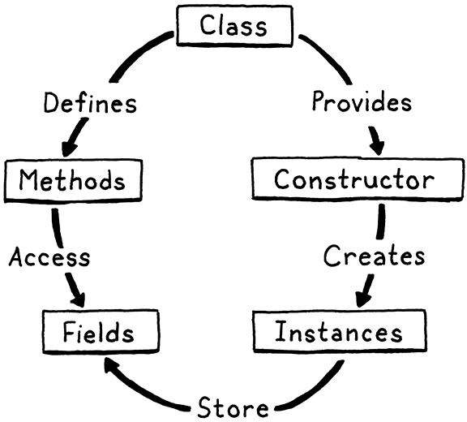
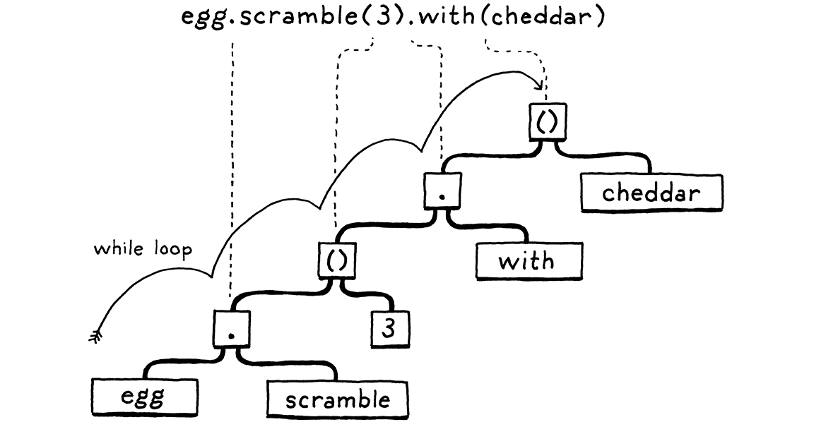
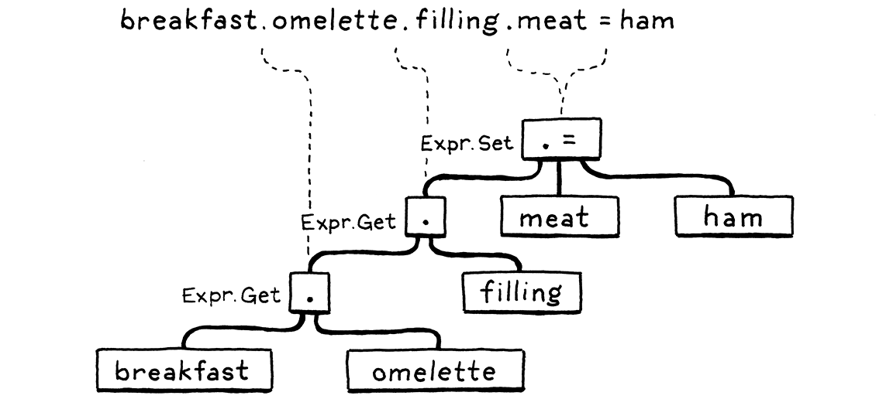
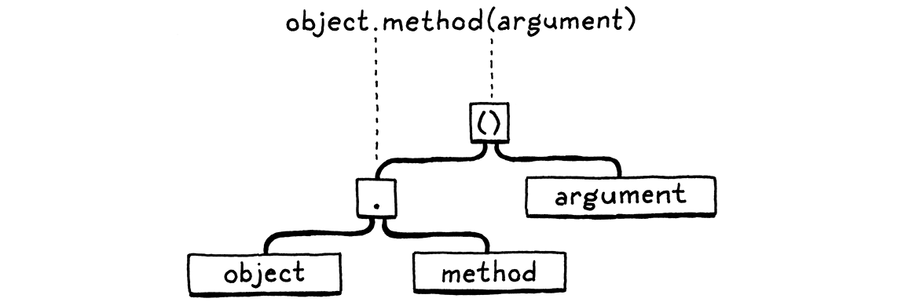
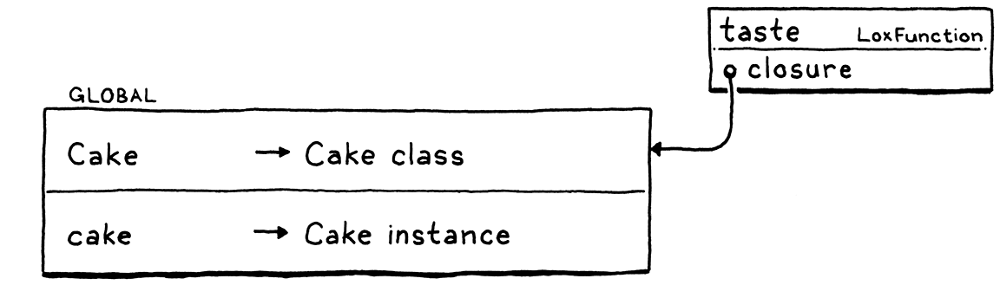
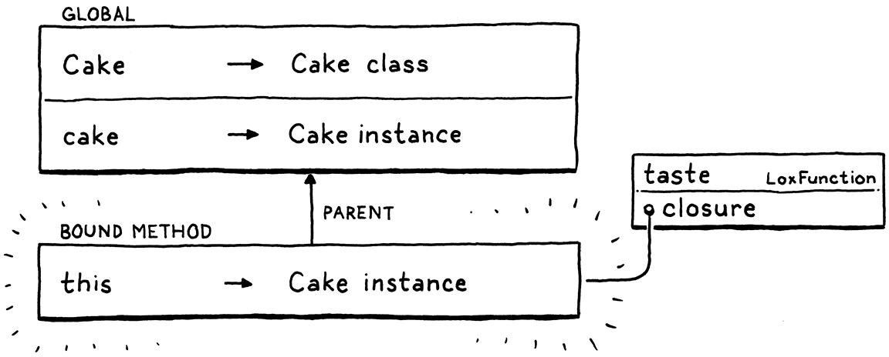
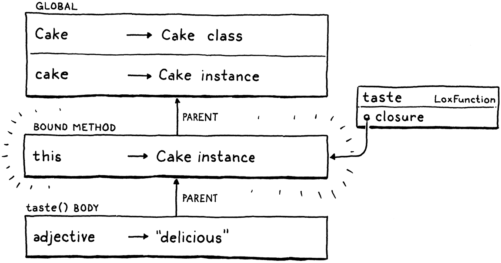

#### Chapter 12.

# Classes

> One has no right to love or hate anything if one has not acquired a thorough knowledge of its nature. Great love springs from great knowledge of the beloved object, and if you know it but little you will be able to love it only a little or not at all.
>
> Leonardo da Vinci

We’re eleven chapters in, and the interpreter sitting on your machine is nearly a complete scripting language. It could use a couple of built-in data structures like lists and maps, and it certainly needs a core library for file I/O, user input, etc. But the language itself is sufficient. We’ve got a little procedural language in the same vein as BASIC, Tcl, Scheme (minus macros), and early versions of Python and Lua.

If this were the ’80s, we’d stop here. But today, many popular languages support “object-oriented programming”. Adding that to Lox will give users a familiar set of tools for writing larger programs. Even if you personally don’t like OOP, this chapter and the next will help you understand how others design and build object systems.

> If you *really* hate classes, though, you can skip these two chapters. They are fairly isolated from the rest of the book. Personally, I find it’s good to learn more about the things I dislike. Things look simple at a distance, but as I get closer, details emerge and I gain a more nuanced perspective.

## 12.1 OOP and Classes

There are three broad paths to object-oriented programming: classes, [prototypes](http://gameprogrammingpatterns.com/prototype.html), and [multimethods](https://en.wikipedia.org/wiki/Multiple_dispatch). Classes came first and are the most popular style. With the rise of JavaScript (and to a lesser extent [Lua](https://www.lua.org/pil/13.4.1.html)), prototypes are more widely known than they used to be. I’ll talk more about those later. For Lox, we’re taking the, ahem, classic approach.

> Multimethods are the approach you’re least likely to be familiar with. I’d love to talk more about them—I designed [a hobby language](http://magpie-lang.org/) around them once and they are *super rad*—but there are only so many pages I can fit in. If you’d like to learn more, take a look at [CLOS](https://en.wikipedia.org/wiki/Common_Lisp_Object_System) (the object system in Common Lisp), [Dylan](https://opendylan.org/), [Julia](https://julialang.org/), or [Raku](https://docs.raku.org/language/functions#Multi-dispatch).

Since you’ve written about a thousand lines of Java code with me already, I’m assuming you don’t need a detailed introduction to object orientation. The main goal is to bundle data with the code that acts on it. Users do that by declaring a *class* that:

1.  Exposes a *constructor* to create and initialize new *instances* of the class

2.  Provides a way to store and access *fields* on instances

3.  Defines a set of *methods* shared by all instances of the class that operate on each instances’ state.

That’s about as minimal as it gets. Most object-oriented languages, all the way back to Simula, also do inheritance to reuse behavior across classes. We’ll add that in the next chapter. Even kicking that out, we still have a lot to get through. This is a big chapter and everything doesn’t quite come together until we have all of the above pieces, so gather your stamina.

> 
>
> It’s like the circle of life, *sans* Sir Elton John.

## 12.2 Class Declarations

Like we do, we’re gonna start with syntax. A `class` statement introduces a new name, so it lives in the `declaration` grammar rule.

```
declaration    → classDecl
               | funDecl
               | varDecl
               | statement ;

classDecl      → "class" IDENTIFIER "{" function* "}" ;
```

The new `classDecl` rule relies on the `function` rule we defined earlier. To refresh your memory:

```
function       → IDENTIFIER "(" parameters? ")" block ;
parameters     → IDENTIFIER ( "," IDENTIFIER )* ;
```

In plain English, a class declaration is the `class` keyword, followed by the class’s name, then a curly-braced body. Inside that body is a list of method declarations. Unlike function declarations, methods don’t have a leading `fun` keyword. Each method is a name, parameter list, and body. Here’s an example:

> Not that I’m trying to say methods aren’t fun or anything.

```
class Breakfast {
  cook() {
    print "Eggs a-fryin'!";
  }

  serve(who) {
    print "Enjoy your breakfast, " + who + ".";
  }
}
```

Like most dynamically typed languages, fields are not explicitly listed in the class declaration. Instances are loose bags of data and you can freely add fields to them as you see fit using normal imperative code.

Over in our AST generator, the `classDecl` grammar rule gets its own statement node.

```
      "Block      : List<Stmt> statements",
```

```
      "Class      : Token name, List<Stmt.Function> methods",
```

```
      "Expression : Expr expression",
```

*tool/GenerateAst.java*, in *main*()

> The generated code for the new node is in Appendix II.

It stores the class’s name and the methods inside its body. Methods are represented by the existing Stmt.Function class that we use for function declaration AST nodes. That gives us all the bits of state that we need for a method: name, parameter list, and body.

A class can appear anywhere a named declaration is allowed, triggered by the leading `class` keyword.

```
    try {
```

```
      if (match(CLASS)) return classDeclaration();
```

```
      if (match(FUN)) return function("function");
```

*lox/Parser.java*, in *declaration*()

That calls out to:

```
  private Stmt classDeclaration() {
    Token name = consume(IDENTIFIER, "Expect class name.");
    consume(LEFT_BRACE, "Expect '{' before class body.");

    List<Stmt.Function> methods = new ArrayList<>();
    while (!check(RIGHT_BRACE) && !isAtEnd()) {
      methods.add(function("method"));
    }

    consume(RIGHT_BRACE, "Expect '}' after class body.");

    return new Stmt.Class(name, methods);
  }
```

*lox/Parser.java*, add after *declaration*()

There’s more meat to this than most of the other parsing methods, but it roughly follows the grammar. We’ve already consumed the `class` keyword, so we look for the expected class name next, followed by the opening curly brace. Once inside the body, we keep parsing method declarations until we hit the closing brace. Each method declaration is parsed by a call to `function()`, which we defined back in the chapter where functions were introduced.

Like we do in any open-ended loop in the parser, we also check for hitting the end of the file. That won’t happen in correct code since a class should have a closing brace at the end, but it ensures the parser doesn’t get stuck in an infinite loop if the user has a syntax error and forgets to correctly end the class body.

We wrap the name and list of methods into a Stmt.Class node and we’re done. Previously, we would jump straight into the interpreter, but now we need to plumb the node through the resolver first.

```
  @Override
  public Void visitClassStmt(Stmt.Class stmt) {
    declare(stmt.name);
    define(stmt.name);
    return null;
  }
```

*lox/Resolver.java*, add after *visitBlockStmt*()

We aren’t going to worry about resolving the methods themselves yet, so for now all we need to do is declare the class using its name. It’s not common to declare a class as a local variable, but Lox permits it, so we need to handle it correctly.

Now we interpret the class declaration.

```
  @Override
  public Void visitClassStmt(Stmt.Class stmt) {
    environment.define(stmt.name.lexeme, null);
    LoxClass klass = new LoxClass(stmt.name.lexeme);
    environment.assign(stmt.name, klass);
    return null;
  }
```

*lox/Interpreter.java*, add after *visitBlockStmt*()

This looks similar to how we execute function declarations. We declare the class’s name in the current environment. Then we turn the class *syntax node* into a LoxClass, the *runtime* representation of a class. We circle back and store the class object in the variable we previously declared. That two-stage variable binding process allows references to the class inside its own methods.

We will refine it throughout the chapter, but the first draft of LoxClass looks like this:

```
package com.craftinginterpreters.lox;

import java.util.List;
import java.util.Map;

class LoxClass {
  final String name;

  LoxClass(String name) {
    this.name = name;
  }

  @Override
  public String toString() {
    return name;
  }
}
```

*lox/LoxClass.java*, create new file

Literally a wrapper around a name. We don’t even store the methods yet. Not super useful, but it does have a `toString()` method so we can write a trivial script and test that class objects are actually being parsed and executed.

```
class DevonshireCream {
  serveOn() {
    return "Scones";
  }
}

print DevonshireCream; // Prints "DevonshireCream".
```

## 12.3 Creating Instances

We have classes, but they don’t do anything yet. Lox doesn’t have “static” methods that you can call right on the class itself, so without actual instances, classes are useless. Thus instances are the next step.

While some syntax and semantics are fairly standard across OOP languages, the way you create new instances isn’t. Ruby, following Smalltalk, creates instances by calling a method on the class object itself, a recursively graceful approach. Some, like C++ and Java, have a `new` keyword dedicated to birthing a new object. Python has you “call” the class itself like a function. (JavaScript, ever weird, sort of does both.)

> In Smalltalk, even *classes* are created by calling methods on an existing object, usually the desired superclass. It’s sort of a turtles-all-the-way-down thing. It ultimately bottoms out on a few magical classes like Object and Metaclass that the runtime conjures into being *ex nihilo*.

I took a minimal approach with Lox. We already have class objects, and we already have function calls, so we’ll use call expressions on class objects to create new instances. It’s as if a class is a factory function that generates instances of itself. This feels elegant to me, and also spares us the need to introduce syntax like `new`. Therefore, we can skip past the front end straight into the runtime.

Right now, if you try this:

```
class Bagel {}
Bagel();
```

You get a runtime error. `visitCallExpr()` checks to see if the called object implements `LoxCallable` and reports an error since LoxClass doesn’t. Not *yet*, that is.

```
import java.util.Map;
```

```
class LoxClass implements LoxCallable {
```

```
  final String name;
```

*lox/LoxClass.java*, replace 1 line

Implementing that interface requires two methods.

```
  @Override
  public Object call(Interpreter interpreter,
                     List<Object> arguments) {
    LoxInstance instance = new LoxInstance(this);
    return instance;
  }

  @Override
  public int arity() {
    return 0;
  }
```

*lox/LoxClass.java*, add after *toString*()

The interesting one is `call()`. When you “call” a class, it instantiates a new LoxInstance for the called class and returns it. The `arity()` method is how the interpreter validates that you passed the right number of arguments to a callable. For now, we’ll say you can’t pass any. When we get to user-defined constructors, we’ll revisit this.

That leads us to LoxInstance, the runtime representation of an instance of a Lox class. Again, our first implementation starts small.

```
package com.craftinginterpreters.lox;

import java.util.HashMap;
import java.util.Map;

class LoxInstance {
  private LoxClass klass;

  LoxInstance(LoxClass klass) {
    this.klass = klass;
  }

  @Override
  public String toString() {
    return klass.name + " instance";
  }
}
```

*lox/LoxInstance.java*, create new file

Like LoxClass, it’s pretty bare bones, but we’re only getting started. If you want to give it a try, here’s a script to run:

```
class Bagel {}
var bagel = Bagel();
print bagel; // Prints "Bagel instance".
```

This program doesn’t do much, but it’s starting to do *something*.

## 12.4 Properties on Instances

We have instances, so we should make them useful. We’re at a fork in the road. We could add behavior first—methods—or we could start with state—properties. We’re going to take the latter because, as we’ll see, the two get entangled in an interesting way and it will be easier to make sense of them if we get properties working first.

Lox follows JavaScript and Python in how it handles state. Every instance is an open collection of named values. Methods on the instance’s class can access and modify properties, but so can outside code. Properties are accessed using a `.` syntax.

> Allowing code outside of the class to directly modify an object’s fields goes against the object-oriented credo that a class *encapsulates* state. Some languages take a more principled stance. In Smalltalk, fields are accessed using simple identifiers—essentially, variables that are only in scope inside a class’s methods. Ruby uses `@` followed by a name to access a field in an object. That syntax is only meaningful inside a method and always accesses state on the current object.
>
> Lox, for better or worse, isn’t quite so pious about its OOP faith.

```
someObject.someProperty
```

An expression followed by `.` and an identifier reads the property with that name from the object the expression evaluates to. That dot has the same precedence as the parentheses in a function call expression, so we slot it into the grammar by replacing the existing `call` rule with:

```
call           → primary ( "(" arguments? ")" | "." IDENTIFIER )* ;
```

After a primary expression, we allow a series of any mixture of parenthesized calls and dotted property accesses. “Property access” is a mouthful, so from here on out, we’ll call these “get expressions”.

### 12.4.1 Get expressions

The syntax tree node is:

```
      "Call     : Expr callee, Token paren, List<Expr> arguments",
```

```
      "Get      : Expr object, Token name",
```

```
      "Grouping : Expr expression",
```

*tool/GenerateAst.java*, in *main*()

> The generated code for the new node is in Appendix II.

Following the grammar, the new parsing code goes in our existing `call()` method.

```
    while (true) {
      if (match(LEFT_PAREN)) {
        expr = finishCall(expr);
```

```
      } else if (match(DOT)) {
        Token name = consume(IDENTIFIER,
            "Expect property name after '.'.");
        expr = new Expr.Get(expr, name);
```

```
      } else {
        break;
      }
    }
```

*lox/Parser.java*, in *call*()

The outer `while` loop there corresponds to the `*` in the grammar rule. We zip along the tokens building up a chain of calls and gets as we find parentheses and dots, like so:



Instances of the new Expr.Get node feed into the resolver.

```
  @Override
  public Void visitGetExpr(Expr.Get expr) {
    resolve(expr.object);
    return null;
  }
```

*lox/Resolver.java*, add after *visitCallExpr*()

OK, not much to that. Since properties are looked up dynamically, they don’t get resolved. During resolution, we recurse only into the expression to the left of the dot. The actual property access happens in the interpreter.

> You can literally see that property dispatch in Lox is dynamic since we don’t process the property name during the static resolution pass.

```
  @Override
  public Object visitGetExpr(Expr.Get expr) {
    Object object = evaluate(expr.object);
    if (object instanceof LoxInstance) {
      return ((LoxInstance) object).get(expr.name);
    }

    throw new RuntimeError(expr.name,
        "Only instances have properties.");
  }
```

*lox/Interpreter.java*, add after *visitCallExpr*()

First, we evaluate the expression whose property is being accessed. In Lox, only instances of classes have properties. If the object is some other type like a number, invoking a getter on it is a runtime error.

If the object is a LoxInstance, then we ask it to look up the property. It must be time to give LoxInstance some actual state. A map will do fine.

```
  private LoxClass klass;
```

```
  private final Map<String, Object> fields = new HashMap<>();
```

```
  LoxInstance(LoxClass klass) {
```

*lox/LoxInstance.java*, in class *LoxInstance*

Each key in the map is a property name and the corresponding value is the property’s value. To look up a property on an instance:

```
  Object get(Token name) {
    if (fields.containsKey(name.lexeme)) {
      return fields.get(name.lexeme);
    }

    throw new RuntimeError(name,
        "Undefined property '" + name.lexeme + "'.");
  }
```

*lox/LoxInstance.java*, add after *LoxInstance*()

> Doing a hash table lookup for every field access is fast enough for many language implementations, but not ideal. High performance VMs for languages like JavaScript use sophisticated optimizations like “[hidden classes](http://richardartoul.github.io/jekyll/update/2015/04/26/hidden-classes.html)” to avoid that overhead.
>
> Paradoxically, many of the optimizations invented to make dynamic languages fast rest on the observation that—even in those languages—most code is fairly static in terms of the types of objects it works with and their fields.

An interesting edge case we need to handle is what happens if the instance doesn’t *have* a property with the given name. We could silently return some dummy value like `nil`, but my experience with languages like JavaScript is that this behavior masks bugs more often than it does anything useful. Instead, we’ll make it a runtime error.

So the first thing we do is see if the instance actually has a field with the given name. Only then do we return it. Otherwise, we raise an error.

Note how I switched from talking about “properties” to “fields”. There is a subtle difference between the two. Fields are named bits of state stored directly in an instance. Properties are the named, uh, *things*, that a get expression may return. Every field is a property, but as we’ll see later, not every property is a field.

> Ooh, foreshadowing. Spooky!

In theory, we can now read properties on objects. But since there’s no way to actually stuff any state into an instance, there are no fields to access. Before we can test out reading, we must support writing.

### 12.4.2 Set expressions

Setters use the same syntax as getters, except they appear on the left side of an assignment.

```
someObject.someProperty = value;
```

In grammar land, we extend the rule for assignment to allow dotted identifiers on the left-hand side.

```
assignment     → ( call "." )? IDENTIFIER "=" assignment
               | logic_or ;
```

Unlike getters, setters don’t chain. However, the reference to `call` allows any high-precedence expression before the last dot, including any number of *getters*, as in:



Note here that only the *last* part, the `.meat` is the *setter*. The `.omelette` and `.filling` parts are both *get* expressions.

Just as we have two separate AST nodes for variable access and variable assignment, we need a second setter node to complement our getter node.

```
      "Logical  : Expr left, Token operator, Expr right",
```

```
      "Set      : Expr object, Token name, Expr value",
```

```
      "Unary    : Token operator, Expr right",
```

*tool/GenerateAst.java*, in *main*()

> The generated code for the new node is in Appendix II.

In case you don’t remember, the way we handle assignment in the parser is a little funny. We can’t easily tell that a series of tokens is the left-hand side of an assignment until we reach the `=`. Now that our assignment grammar rule has `call` on the left side, which can expand to arbitrarily large expressions, that final `=` may be many tokens away from the point where we need to know we’re parsing an assignment.

Instead, the trick we do is parse the left-hand side as a normal expression. Then, when we stumble onto the equal sign after it, we take the expression we already parsed and transform it into the correct syntax tree node for the assignment.

We add another clause to that transformation to handle turning an Expr.Get expression on the left into the corresponding Expr.Set.

```
        return new Expr.Assign(name, value);
```

```
      } else if (expr instanceof Expr.Get) {
        Expr.Get get = (Expr.Get)expr;
        return new Expr.Set(get.object, get.name, value);
```

```
      }
```

*lox/Parser.java*, in *assignment*()

That’s parsing our syntax. We push that node through into the resolver.

```
  @Override
  public Void visitSetExpr(Expr.Set expr) {
    resolve(expr.value);
    resolve(expr.object);
    return null;
  }
```

*lox/Resolver.java*, add after *visitLogicalExpr*()

Again, like Expr.Get, the property itself is dynamically evaluated, so there’s nothing to resolve there. All we need to do is recurse into the two subexpressions of Expr.Set, the object whose property is being set, and the value it’s being set to.

That leads us to the interpreter.

```
  @Override
  public Object visitSetExpr(Expr.Set expr) {
    Object object = evaluate(expr.object);

    if (!(object instanceof LoxInstance)) {
      throw new RuntimeError(expr.name,
                             "Only instances have fields.");
    }

    Object value = evaluate(expr.value);
    ((LoxInstance)object).set(expr.name, value);
    return value;
  }
```

*lox/Interpreter.java*, add after *visitLogicalExpr*()

We evaluate the object whose property is being set and check to see if it’s a LoxInstance. If not, that’s a runtime error. Otherwise, we evaluate the value being set and store it on the instance. That relies on a new method in LoxInstance.

> This is another semantic edge case. There are three distinct operations:
>
> 1.  Evaluate the object.
>
> 2.  Raise a runtime error if it’s not an instance of a class.
>
> 3.  Evaluate the value.
>
> The order that those are performed in could be user visible, which means we need to carefully specify it and ensure our implementations do these in the same order.

```
  void set(Token name, Object value) {
    fields.put(name.lexeme, value);
  }
```

*lox/LoxInstance.java*, add after *get*()

No real magic here. We stuff the values straight into the Java map where fields live. Since Lox allows freely creating new fields on instances, there’s no need to see if the key is already present.

## 12.5 Methods on Classes

You can create instances of classes and stuff data into them, but the class itself doesn’t really *do* anything. Instances are just maps and all instances are more or less the same. To make them feel like instances *of classes*, we need behavior—methods.

Our helpful parser already parses method declarations, so we’re good there. We also don’t need to add any new parser support for method *calls*. We already have `.` (getters) and `()` (function calls). A “method call” simply chains those together.



That raises an interesting question. What happens when those two expressions are pulled apart? Assuming that `method` in this example is a method on the class of `object` and not a field on the instance, what should the following piece of code do?

```
var m = object.method;
m(argument);
```

This program “looks up” the method and stores the result—whatever that is—in a variable and then calls that object later. Is this allowed? Can you treat a method like it’s a function on the instance?

What about the other direction?

```
class Box {}

fun notMethod(argument) {
  print "called function with " + argument;
}

var box = Box();
box.function = notMethod;
box.function("argument");
```

This program creates an instance and then stores a function in a field on it. Then it calls that function using the same syntax as a method call. Does that work?

Different languages have different answers to these questions. One could write a treatise on it. For Lox, we’ll say the answer to both of these is yes, it does work. We have a couple of reasons to justify that. For the second example—calling a function stored in a field—we want to support that because first-class functions are useful and storing them in fields is a perfectly normal thing to do.

The first example is more obscure. One motivation is that users generally expect to be able to hoist a subexpression out into a local variable without changing the meaning of the program. You can take this:

```
breakfast(omelette.filledWith(cheese), sausage);
```

And turn it into this:

```
var eggs = omelette.filledWith(cheese);
breakfast(eggs, sausage);
```

And it does the same thing. Likewise, since the `.` and the `()` in a method call *are* two separate expressions, it seems you should be able to hoist the *lookup* part into a variable and then call it later. We need to think carefully about what the *thing* you get when you look up a method is, and how it behaves, even in weird cases like:

> A motivating use for this is callbacks. Often, you want to pass a callback whose body simply invokes a method on some object. Being able to look up the method and pass it directly saves you the chore of manually declaring a function to wrap it. Compare this:
>
> ```
> fun callback(a, b, c) {
>   object.method(a, b, c);
> }
>
> takeCallback(callback);
> ```
>
> With this:
>
> ```
> takeCallback(object.method);
> ```

```
class Person {
  sayName() {
    print this.name;
  }
}

var jane = Person();
jane.name = "Jane";

var method = jane.sayName;
method(); // ?
```

If you grab a handle to a method on some instance and call it later, does it “remember” the instance it was pulled off from? Does `this` inside the method still refer to that original object?

Here’s a more pathological example to bend your brain:

```
class Person {
  sayName() {
    print this.name;
  }
}

var jane = Person();
jane.name = "Jane";

var bill = Person();
bill.name = "Bill";

bill.sayName = jane.sayName;
bill.sayName(); // ?
```

Does that last line print “Bill” because that’s the instance that we *called* the method through, or “Jane” because it’s the instance where we first grabbed the method?

Equivalent code in Lua and JavaScript would print “Bill”. Those languages don’t really have a notion of “methods”. Everything is sort of functions-in-fields, so it’s not clear that `jane` “owns” `sayName` any more than `bill` does.

Lox, though, has real class syntax so we do know which callable things are methods and which are functions. Thus, like Python, C#, and others, we will have methods “bind” `this` to the original instance when the method is first grabbed. Python calls these **bound methods**.

> I know, imaginative name, right?

In practice, that’s usually what you want. If you take a reference to a method on some object so you can use it as a callback later, you want to remember the instance it belonged to, even if that callback happens to be stored in a field on some other object.

OK, that’s a lot of semantics to load into your head. Forget about the edge cases for a bit. We’ll get back to those. For now, let’s get basic method calls working. We’re already parsing the method declarations inside the class body, so the next step is to resolve them.

```
    define(stmt.name);
```

```
    for (Stmt.Function method : stmt.methods) {
      FunctionType declaration = FunctionType.METHOD;
      resolveFunction(method, declaration);
    }
```

```
    return null;
```

*lox/Resolver.java*, in *visitClassStmt*()

> Storing the function type in a local variable is pointless right now, but we’ll expand this code before too long and it will make more sense.

We iterate through the methods in the class body and call the `resolveFunction()` method we wrote for handling function declarations already. The only difference is that we pass in a new FunctionType enum value.

```
    NONE,
```

```
    FUNCTION,
```

```
    METHOD
```

```
  }
```

*lox/Resolver.java*, in enum *FunctionType*, add *“,”* to previous line

That’s going to be important when we resolve `this` expressions. For now, don’t worry about it. The interesting stuff is in the interpreter.

```
    environment.define(stmt.name.lexeme, null);
```

```
    Map<String, LoxFunction> methods = new HashMap<>();
    for (Stmt.Function method : stmt.methods) {
      LoxFunction function = new LoxFunction(method, environment);
      methods.put(method.name.lexeme, function);
    }

    LoxClass klass = new LoxClass(stmt.name.lexeme, methods);
```

```
    environment.assign(stmt.name, klass);
```

*lox/Interpreter.java*, in *visitClassStmt*(), replace 1 line

When we interpret a class declaration statement, we turn the syntactic representation of the class—its AST node—into its runtime representation. Now, we need to do that for the methods contained in the class as well. Each method declaration blossoms into a LoxFunction object.

We take all of those and wrap them up into a map, keyed by the method names. That gets stored in LoxClass.

```
  final String name;
```

```
  private final Map<String, LoxFunction> methods;

  LoxClass(String name, Map<String, LoxFunction> methods) {
    this.name = name;
    this.methods = methods;
  }
```

```
  @Override
  public String toString() {
```

*lox/LoxClass.java*, in class *LoxClass*, replace 4 lines

Where an instance stores state, the class stores behavior. LoxInstance has its map of fields, and LoxClass gets a map of methods. Even though methods are owned by the class, they are still accessed through instances of that class.

```
  Object get(Token name) {
    if (fields.containsKey(name.lexeme)) {
      return fields.get(name.lexeme);
    }
```

```
    LoxFunction method = klass.findMethod(name.lexeme);
    if (method != null) return method;
```

```
    throw new RuntimeError(name,
        "Undefined property '" + name.lexeme + "'.");
```

*lox/LoxInstance.java*, in *get*()

When looking up a property on an instance, if we don’t find a matching field, we look for a method with that name on the instance’s class. If found, we return that. This is where the distinction between “field” and “property” becomes meaningful. When accessing a property, you might get a field—a bit of state stored on the instance—or you could hit a method defined on the instance’s class.

The method is looked up using this:

> Looking for a field first implies that fields shadow methods, a subtle but important semantic point.

```
  LoxFunction findMethod(String name) {
    if (methods.containsKey(name)) {
      return methods.get(name);
    }

    return null;
  }
```

*lox/LoxClass.java*, add after *LoxClass*()

You can probably guess this method is going to get more interesting later. For now, a simple map lookup on the class’s method table is enough to get us started. Give it a try:

```
class Bacon {
  eat() {
    print "Crunch crunch crunch!";
  }
}

Bacon().eat(); // Prints "Crunch crunch crunch!".
```

> Apologies if you prefer chewy bacon over crunchy. Feel free to adjust the script to your taste.

## 12.6 This

We can define both behavior and state on objects, but they aren’t tied together yet. Inside a method, we have no way to access the fields of the “current” object—the instance that the method was called on—nor can we call other methods on that same object.

To get at that instance, it needs a name. Smalltalk, Ruby, and Swift use “self”. Simula, C++, Java, and others use “this”. Python uses “self” by convention, but you can technically call it whatever you like.

> “I” would have been a great choice, but using “i” for loop variables predates OOP and goes all the way back to Fortran. We are victims of the incidental choices of our forebears.

For Lox, since we generally hew to Java-ish style, we’ll go with “this”. Inside a method body, a `this` expression evaluates to the instance that the method was called on. Or, more specifically, since methods are accessed and then invoked as two steps, it will refer to the object that the method was *accessed* from.

That makes our job harder. Peep at:

```
class Egotist {
  speak() {
    print this;
  }
}

var method = Egotist().speak;
method();
```

On the second-to-last line, we grab a reference to the `speak()` method off an instance of the class. That returns a function, and that function needs to remember the instance it was pulled off of so that *later*, on the last line, it can still find it when the function is called.

We need to take `this` at the point that the method is accessed and attach it to the function somehow so that it stays around as long as we need it to. Hmm . . . a way to store some extra data that hangs around a function, eh? That sounds an awful lot like a *closure*, doesn’t it?

If we defined `this` as a sort of hidden variable in an environment that surrounds the function returned when looking up a method, then uses of `this` in the body would be able to find it later. LoxFunction already has the ability to hold on to a surrounding environment, so we have the machinery we need.

Let’s walk through an example to see how it works:

```
class Cake {
  taste() {
    var adjective = "delicious";
    print "The " + this.flavor + " cake is " + adjective + "!";
  }
}

var cake = Cake();
cake.flavor = "German chocolate";
cake.taste(); // Prints "The German chocolate cake is delicious!".
```

When we first evaluate the class definition, we create a LoxFunction for `taste()`. Its closure is the environment surrounding the class, in this case the global one. So the LoxFunction we store in the class’s method map looks like so:



When we evaluate the `cake.taste` get expression, we create a new environment that binds `this` to the object the method is accessed from (here, `cake`). Then we make a *new* LoxFunction with the same code as the original one but using that new environment as its closure.



This is the LoxFunction that gets returned when evaluating the get expression for the method name. When that function is later called by a `()` expression, we create an environment for the method body as usual.



The parent of the body environment is the environment we created earlier to bind `this` to the current object. Thus any use of `this` inside the body successfully resolves to that instance.

Reusing our environment code for implementing `this` also takes care of interesting cases where methods and functions interact, like:

```
class Thing {
  getCallback() {
    fun localFunction() {
      print this;
    }

    return localFunction;
  }
}

var callback = Thing().getCallback();
callback();
```

In, say, JavaScript, it’s common to return a callback from inside a method. That callback may want to hang on to and retain access to the original object—the `this` value—that the method was associated with. Our existing support for closures and environment chains should do all this correctly.

Let’s code it up. The first step is adding new syntax for `this`.

```
      "Set      : Expr object, Token name, Expr value",
```

```
      "This     : Token keyword",
```

```
      "Unary    : Token operator, Expr right",
```

*tool/GenerateAst.java*, in *main*()

> The generated code for the new node is in Appendix II.

Parsing is simple since it’s a single token which our lexer already recognizes as a reserved word.

```
      return new Expr.Literal(previous().literal);
    }
```

```
    if (match(THIS)) return new Expr.This(previous());
```

```
    if (match(IDENTIFIER)) {
```

*lox/Parser.java*, in *primary*()

You can start to see how `this` works like a variable when we get to the resolver.

```
  @Override
  public Void visitThisExpr(Expr.This expr) {
    resolveLocal(expr, expr.keyword);
    return null;
  }
```

*lox/Resolver.java*, add after *visitSetExpr*()

We resolve it exactly like any other local variable using “this” as the name for the “variable”. Of course, that’s not going to work right now, because “this” *isn’t* declared in any scope. Let’s fix that over in `visitClassStmt()`.

```
    define(stmt.name);
```

```
    beginScope();
    scopes.peek().put("this", true);
```

```
    for (Stmt.Function method : stmt.methods) {
```

*lox/Resolver.java*, in *visitClassStmt*()

Before we step in and start resolving the method bodies, we push a new scope and define “this” in it as if it were a variable. Then, when we’re done, we discard that surrounding scope.

```
    }
```

```
    endScope();
```

```
    return null;
```

*lox/Resolver.java*, in *visitClassStmt*()

Now, whenever a `this` expression is encountered (at least inside a method) it will resolve to a “local variable” defined in an implicit scope just outside of the block for the method body.

The resolver has a new *scope* for `this`, so the interpreter needs to create a corresponding *environment* for it. Remember, we always have to keep the resolver’s scope chains and the interpreter’s linked environments in sync with each other. At runtime, we create the environment after we find the method on the instance. We replace the previous line of code that simply returned the method’s LoxFunction with this:

```
    LoxFunction method = klass.findMethod(name.lexeme);
```

```
    if (method != null) return method.bind(this);
```

```
    throw new RuntimeError(name,
        "Undefined property '" + name.lexeme + "'.");
```

*lox/LoxInstance.java*, in *get*(), replace 1 line

Note the new call to `bind()`. That looks like so:

```
  LoxFunction bind(LoxInstance instance) {
    Environment environment = new Environment(closure);
    environment.define("this", instance);
    return new LoxFunction(declaration, environment);
  }
```

*lox/LoxFunction.java*, add after *LoxFunction*()

There isn’t much to it. We create a new environment nestled inside the method’s original closure. Sort of a closure-within-a-closure. When the method is called, that will become the parent of the method body’s environment.

We declare “this” as a variable in that environment and bind it to the given instance, the instance that the method is being accessed from. *Et voilà*, the returned LoxFunction now carries around its own little persistent world where “this” is bound to the object.

The remaining task is interpreting those `this` expressions. Similar to the resolver, it is the same as interpreting a variable expression.

```
  @Override
  public Object visitThisExpr(Expr.This expr) {
    return lookUpVariable(expr.keyword, expr);
  }
```

*lox/Interpreter.java*, add after *visitSetExpr*()

Go ahead and give it a try using that cake example from earlier. With less than twenty lines of code, our interpreter handles `this` inside methods even in all of the weird ways it can interact with nested classes, functions inside methods, handles to methods, etc.

### 12.6.1 Invalid uses of this

Wait a minute. What happens if you try to use `this` *outside* of a method? What about:

```
print this;
```

Or:

```
fun notAMethod() {
  print this;
}
```

There is no instance for `this` to point to if you’re not in a method. We could give it some default value like `nil` or make it a runtime error, but the user has clearly made a mistake. The sooner they find and fix that mistake, the happier they’ll be.

Our resolution pass is a fine place to detect this error statically. It already detects `return` statements outside of functions. We’ll do something similar for `this`. In the vein of our existing FunctionType enum, we define a new ClassType one.

```
  }
```

```
  private enum ClassType {
    NONE,
    CLASS
  }

  private ClassType currentClass = ClassType.NONE;
```

```
  void resolve(List<Stmt> statements) {
```

*lox/Resolver.java*, add after enum *FunctionType*

Yes, it could be a Boolean. When we get to inheritance, it will get a third value, hence the enum right now. We also add a corresponding field, `currentClass`. Its value tells us if we are currently inside a class declaration while traversing the syntax tree. It starts out `NONE` which means we aren’t in one.

When we begin to resolve a class declaration, we change that.

```
  public Void visitClassStmt(Stmt.Class stmt) {
```

```
    ClassType enclosingClass = currentClass;
    currentClass = ClassType.CLASS;
```

```
    declare(stmt.name);
```

*lox/Resolver.java*, in *visitClassStmt*()

As with `currentFunction`, we store the previous value of the field in a local variable. This lets us piggyback onto the JVM to keep a stack of `currentClass` values. That way we don’t lose track of the previous value if one class nests inside another.

Once the methods have been resolved, we “pop” that stack by restoring the old value.

```
    endScope();
```

```
    currentClass = enclosingClass;
```

```
    return null;
```

*lox/Resolver.java*, in *visitClassStmt*()

When we resolve a `this` expression, the `currentClass` field gives us the bit of data we need to report an error if the expression doesn’t occur nestled inside a method body.

```
  public Void visitThisExpr(Expr.This expr) {
```

```
    if (currentClass == ClassType.NONE) {
      Lox.error(expr.keyword,
          "Can't use 'this' outside of a class.");
      return null;
    }
```

```
    resolveLocal(expr, expr.keyword);
```

*lox/Resolver.java*, in *visitThisExpr*()

That should help users use `this` correctly, and it saves us from having to handle misuse at runtime in the interpreter.

## 12.7 Constructors and Initializers

We can do almost everything with classes now, and as we near the end of the chapter we find ourselves strangely focused on a beginning. Methods and fields let us encapsulate state and behavior together so that an object always *stays* in a valid configuration. But how do we ensure a brand new object *starts* in a good state?

For that, we need constructors. I find them one of the trickiest parts of a language to design, and if you peer closely at most other languages, you’ll see cracks around object construction where the seams of the design don’t quite fit together perfectly. Maybe there’s something intrinsically messy about the moment of birth.

> A few examples: In Java, even though final fields must be initialized, it is still possible to read one *before* it has been. Exceptions—a huge, complex feature—were added to C++ mainly as a way to emit errors from constructors.

“Constructing” an object is actually a pair of operations:

1.  The runtime *allocates* the memory required for a fresh instance. In most languages, this operation is at a fundamental level beneath what user code is able to access.

    > C++’s “[placement new](https://en.wikipedia.org/wiki/Placement_syntax)” is a rare example where the bowels of allocation are laid bare for the programmer to prod.

2.  Then, a user-provided chunk of code is called which *initializes* the unformed object.

The latter is what we tend to think of when we hear “constructor”, but the language itself has usually done some groundwork for us before we get to that point. In fact, our Lox interpreter already has that covered when it creates a new LoxInstance object.

We’ll do the remaining part—user-defined initialization—now. Languages have a variety of notations for the chunk of code that sets up a new object for a class. C++, Java, and C# use a method whose name matches the class name. Ruby and Python call it `init()`. The latter is nice and short, so we’ll do that.

In LoxClass’s implementation of LoxCallable, we add a few more lines.

```
                     List<Object> arguments) {
    LoxInstance instance = new LoxInstance(this);
```

```
    LoxFunction initializer = findMethod("init");
    if (initializer != null) {
      initializer.bind(instance).call(interpreter, arguments);
    }
```

```
    return instance;
```

*lox/LoxClass.java*, in *call*()

When a class is called, after the LoxInstance is created, we look for an “init” method. If we find one, we immediately bind and invoke it just like a normal method call. The argument list is forwarded along.

That argument list means we also need to tweak how a class declares its arity.

```
  public int arity() {
```

```
    LoxFunction initializer = findMethod("init");
    if (initializer == null) return 0;
    return initializer.arity();
```

```
  }
```

*lox/LoxClass.java*, in *arity*(), replace 1 line

If there is an initializer, that method’s arity determines how many arguments you must pass when you call the class itself. We don’t *require* a class to define an initializer, though, as a convenience. If you don’t have an initializer, the arity is still zero.

That’s basically it. Since we bind the `init()` method before we call it, it has access to `this` inside its body. That, along with the arguments passed to the class, are all you need to be able to set up the new instance however you desire.

### 12.7.1 Invoking init() directly

As usual, exploring this new semantic territory rustles up a few weird creatures. Consider:

```
class Foo {
  init() {
    print this;
  }
}

var foo = Foo();
print foo.init();
```

Can you “re-initialize” an object by directly calling its `init()` method? If you do, what does it return? A reasonable answer would be `nil` since that’s what it appears the body returns.

However—and I generally dislike compromising to satisfy the implementation—it will make clox’s implementation of constructors much easier if we say that `init()` methods always return `this`, even when directly called. In order to keep jlox compatible with that, we add a little special case code in LoxFunction.

> Maybe “dislike” is too strong a claim. It’s reasonable to have the constraints and resources of your implementation affect the design of the language. There are only so many hours in the day, and if a cut corner here or there lets you get more features to users in less time, it may very well be a net win for their happiness and productivity. The trick is figuring out *which* corners to cut that won’t cause your users and future self to curse your shortsightedness.

```
      return returnValue.value;
    }
```

```
    if (isInitializer) return closure.getAt(0, "this");
```

```
    return null;
```

*lox/LoxFunction.java*, in *call*()

If the function is an initializer, we override the actual return value and forcibly return `this`. That relies on a new `isInitializer` field.

```
  private final Environment closure;
```

```
  private final boolean isInitializer;

  LoxFunction(Stmt.Function declaration, Environment closure,
              boolean isInitializer) {
    this.isInitializer = isInitializer;
```

```
    this.closure = closure;
    this.declaration = declaration;
```

*lox/LoxFunction.java*, in class *LoxFunction*, replace 1 line

We can’t simply see if the name of the LoxFunction is “init” because the user could have defined a *function* with that name. In that case, there *is* no `this` to return. To avoid *that* weird edge case, we’ll directly store whether the LoxFunction represents an initializer method. That means we need to go back and fix the few places where we create LoxFunctions.

```
  public Void visitFunctionStmt(Stmt.Function stmt) {
```

```
    LoxFunction function = new LoxFunction(stmt, environment,
                                           false);
```

```
    environment.define(stmt.name.lexeme, function);
```

*lox/Interpreter.java*, in *visitFunctionStmt*(), replace 1 line

For actual function declarations, `isInitializer` is always false. For methods, we check the name.

```
    for (Stmt.Function method : stmt.methods) {
```

```
      LoxFunction function = new LoxFunction(method, environment,
          method.name.lexeme.equals("init"));
```

```
      methods.put(method.name.lexeme, function);
```

*lox/Interpreter.java*, in *visitClassStmt*(), replace 1 line

And then in `bind()` where we create the closure that binds `this` to a method, we pass along the original method’s value.

```
    environment.define("this", instance);
```

```
    return new LoxFunction(declaration, environment,
                           isInitializer);
```

```
  }
```

*lox/LoxFunction.java*, in *bind*(), replace 1 line

### 12.7.2 Returning from init()

We aren’t out of the woods yet. We’ve been assuming that a user-written initializer doesn’t explicitly return a value because most constructors don’t. What should happen if a user tries:

```
class Foo {
  init() {
    return "something else";
  }
}
```

It’s definitely not going to do what they want, so we may as well make it a static error. Back in the resolver, we add another case to FunctionType.

```
    FUNCTION,
```

```
    INITIALIZER,
```

```
    METHOD
```

*lox/Resolver.java*, in enum *FunctionType*

We use the visited method’s name to determine if we’re resolving an initializer or not.

```
      FunctionType declaration = FunctionType.METHOD;
```

```
      if (method.name.lexeme.equals("init")) {
        declaration = FunctionType.INITIALIZER;
      }
```

```
      resolveFunction(method, declaration);
```

*lox/Resolver.java*, in *visitClassStmt*()

When we later traverse into a `return` statement, we check that field and make it an error to return a value from inside an `init()` method.

```
    if (stmt.value != null) {
```

```
      if (currentFunction == FunctionType.INITIALIZER) {
        Lox.error(stmt.keyword,
            "Can't return a value from an initializer.");
      }
```

```
      resolve(stmt.value);
```

*lox/Resolver.java*, in *visitReturnStmt*()

We’re *still* not done. We statically disallow returning a *value* from an initializer, but you can still use an empty early `return`.

```
class Foo {
  init() {
    return;
  }
}
```

That is actually kind of useful sometimes, so we don’t want to disallow it entirely. Instead, it should return `this` instead of `nil`. That’s an easy fix over in LoxFunction.

```
    } catch (Return returnValue) {
```

```
      if (isInitializer) return closure.getAt(0, "this");
```

```
      return returnValue.value;
```

*lox/LoxFunction.java*, in *call*()

If we’re in an initializer and execute a `return` statement, instead of returning the value (which will always be `nil`), we again return `this`.

Phew! That was a whole list of tasks but our reward is that our little interpreter has grown an entire programming paradigm. Classes, methods, fields, `this`, and constructors. Our baby language is looking awfully grown-up.

## Challenges

1.  We have methods on instances, but there is no way to define “static” methods that can be called directly on the class object itself. Add support for them. Use a `class` keyword preceding the method to indicate a static method that hangs off the class object.

    ```
    class Math {
      class square(n) {
        return n * n;
      }
    }

    print Math.square(3); // Prints "9".
    ```

    You can solve this however you like, but the “[metaclasses](https://en.wikipedia.org/wiki/Metaclass)” used by Smalltalk and Ruby are a particularly elegant approach. *Hint: Make LoxClass extend LoxInstance and go from there.*

2.  Most modern languages support “getters” and “setters”—members on a class that look like field reads and writes but that actually execute user-defined code. Extend Lox to support getter methods. These are declared without a parameter list. The body of the getter is executed when a property with that name is accessed.

    ```
    class Circle {
      init(radius) {
        this.radius = radius;
      }

      area {
        return 3.141592653 * this.radius * this.radius;
      }
    }

    var circle = Circle(4);
    print circle.area; // Prints roughly "50.2655".
    ```

3.  Python and JavaScript allow you to freely access an object’s fields from outside of its own methods. Ruby and Smalltalk encapsulate instance state. Only methods on the class can access the raw fields, and it is up to the class to decide which state is exposed. Most statically typed languages offer modifiers like `private` and `public` to control which parts of a class are externally accessible on a per-member basis.

    What are the trade-offs between these approaches and why might a language prefer one or the other?

## Design Note: Prototypes and Power

In this chapter, we introduced two new runtime entities, LoxClass and LoxInstance. The former is where behavior for objects lives, and the latter is for state. What if you could define methods right on a single object, inside LoxInstance? In that case, we wouldn’t need LoxClass at all. LoxInstance would be a complete package for defining the behavior and state of an object.

We’d still want some way, without classes, to reuse behavior across multiple instances. We could let a LoxInstance [*delegate*](https://en.wikipedia.org/wiki/Prototype-based_programming#Delegation) directly to another LoxInstance to reuse its fields and methods, sort of like inheritance.

Users would model their program as a constellation of objects, some of which delegate to each other to reflect commonality. Objects used as delegates represent “canonical” or “prototypical” objects that others refine. The result is a simpler runtime with only a single internal construct, LoxInstance.

That’s where the name **[prototypes](https://en.wikipedia.org/wiki/Prototype-based_programming)** comes from for this paradigm. It was invented by David Ungar and Randall Smith in a language called [Self](http://www.selflanguage.org/). They came up with it by starting with Smalltalk and following the above mental exercise to see how much they could pare it down.

Prototypes were an academic curiosity for a long time, a fascinating one that generated interesting research but didn’t make a dent in the larger world of programming. That is, until Brendan Eich crammed prototypes into JavaScript, which then promptly took over the world. Many (many) words have been written about prototypes in JavaScript. Whether that shows that prototypes are brilliant or confusing—or both\!—is an open question.

> Including [more than a handful](http://gameprogrammingpatterns.com/prototype.html) by yours truly.

I won’t get into whether or not I think prototypes are a good idea for a language. I’ve made languages that are [prototypal](http://finch.stuffwithstuff.com/) and [class-based](http://wren.io/), and my opinions of both are complex. What I want to discuss is the role of *simplicity* in a language.

Prototypes are simpler than classes—less code for the language implementer to write, and fewer concepts for the user to learn and understand. Does that make them better? We language nerds have a tendency to fetishize minimalism. Personally, I think simplicity is only part of the equation. What we really want to give the user is *power*, which I define as:

    power = breadth × ease ÷ complexity

None of these are precise numeric measures. I’m using math as analogy here, not actual quantification.

- **Breadth** is the range of different things the language lets you express. C has a lot of breadth—it’s been used for everything from operating systems to user applications to games. Domain-specific languages like AppleScript and Matlab have less breadth.

- **Ease** is how little effort it takes to make the language do what you want. “Usability” might be another term, though it carries more baggage than I want to bring in. “Higher-level” languages tend to have more ease than “lower-level” ones. Most languages have a “grain” to them where some things feel easier to express than others.

- **Complexity** is how big the language (including its runtime, core libraries, tools, ecosystem, etc.) is. People talk about how many pages are in a language’s spec, or how many keywords it has. It’s how much the user has to load into their wetware before they can be productive in the system. It is the antonym of simplicity.

Reducing complexity *does* increase power. The smaller the denominator, the larger the resulting value, so our intuition that simplicity is good is valid. However, when reducing complexity, we must take care not to sacrifice breadth or ease in the process, or the total power may go down. Java would be a strictly *simpler* language if it removed strings, but it probably wouldn’t handle text manipulation tasks well, nor would it be as easy to get things done.

The art, then, is finding *accidental* complexity that can be omitted—language features and interactions that don’t carry their weight by increasing the breadth or ease of using the language.

If users want to express their program in terms of categories of objects, then baking classes into the language increases the ease of doing that, hopefully by a large enough margin to pay for the added complexity. But if that isn’t how users are using your language, then by all means leave classes out.