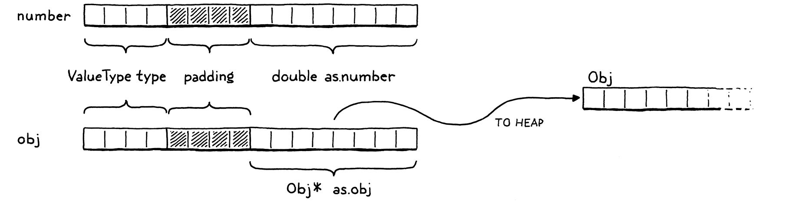
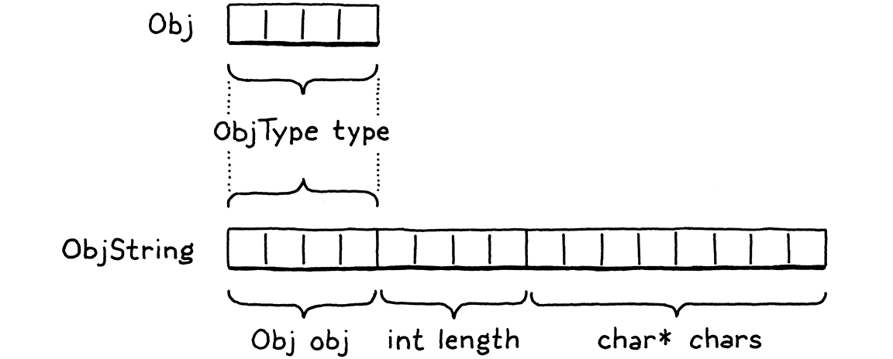
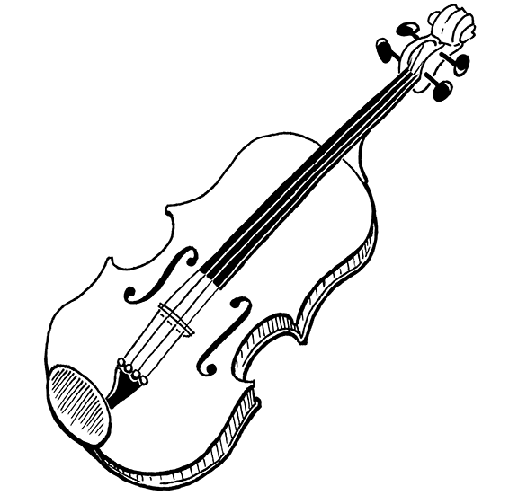
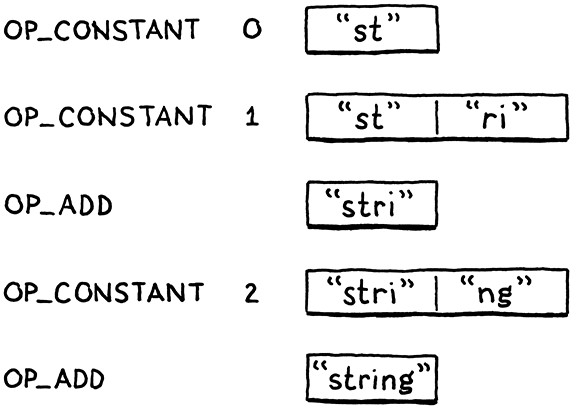

#### Chapter 19.

# Strings

> “Ah? A small aversion to menial labor?” The doctor cocked an eyebrow. “Understandable, but misplaced. One should treasure those hum-drum tasks that keep the body occupied but leave the mind and heart unfettered.”
>
> Tad Williams, *The Dragonbone Chair*

Our little VM can represent three types of values right now: numbers, Booleans, and `nil`. Those types have two important things in common: they’re immutable and they’re small. Numbers are the largest, and they still fit into two 64-bit words. That’s a small enough price that we can afford to pay it for all values, even Booleans and nils which don’t need that much space.

Strings, unfortunately, are not so petite. There’s no maximum length for a string. Even if we were to artificially cap it at some contrived limit like 255 characters, that’s still too much memory to spend on every single value.

> UCSD Pascal, one of the first implementations of Pascal, had this exact limit. Instead of using a terminating null byte to indicate the end of the string like C, Pascal strings started with a length value. Since UCSD used only a single byte to store the length, strings couldn’t be any longer than 255 characters.
>
> 

We need a way to support values whose sizes vary, sometimes greatly. This is exactly what dynamic allocation on the heap is designed for. We can allocate as many bytes as we need. We get back a pointer that we’ll use to keep track of the value as it flows through the VM.

## 19.1 Values and Objects

Using the heap for larger, variable-sized values and the stack for smaller, atomic ones leads to a two-level representation. Every Lox value that you can store in a variable or return from an expression will be a Value. For small, fixed-size types like numbers, the payload is stored directly inside the Value struct itself.

If the object is larger, its data lives on the heap. Then the Value’s payload is a *pointer* to that blob of memory. We’ll eventually have a handful of heap-allocated types in clox: strings, instances, functions, you get the idea. Each type has its own unique data, but there is also state they all share that our future garbage collector will use to manage their memory.



We’ll call this common representation “Obj”. Each Lox value whose state lives on the heap is an Obj. We can thus use a single new ValueType case to refer to all heap-allocated types.

> “Obj” is short for “object”, natch.

```
  VAL_NUMBER,
```

```
  VAL_OBJ
```

```
} ValueType;
```

*value.h*, in enum *ValueType*

When a Value’s type is `VAL_OBJ`, the payload is a pointer to the heap memory, so we add another case to the union for that.

```
    double number;
```

```
    Obj* obj;
```

```
  } as;
```

*value.h*, in struct *Value*

As we did with the other value types, we crank out a couple of helpful macros for working with Obj values.

```
#define IS_NUMBER(value)  ((value).type == VAL_NUMBER)
```

```
#define IS_OBJ(value)     ((value).type == VAL_OBJ)
```

```
#define AS_BOOL(value)    ((value).as.boolean)
```

*value.h*, add after struct *Value*

This evaluates to `true` if the given Value is an Obj. If so, we can use this:

```
#define IS_OBJ(value)     ((value).type == VAL_OBJ)
```

```
#define AS_OBJ(value)     ((value).as.obj)
```

```
#define AS_BOOL(value)    ((value).as.boolean)
```

*value.h*

It extracts the Obj pointer from the value. We can also go the other way.

```
#define NUMBER_VAL(value) ((Value){VAL_NUMBER, {.number = value}})
```

```
#define OBJ_VAL(object)   ((Value){VAL_OBJ, {.obj = (Obj*)object}})
```

```
typedef struct {
```

*value.h*

This takes a bare Obj pointer and wraps it in a full Value.

## 19.2 Struct Inheritance

Every heap-allocated value is an Obj, but Objs are not all the same. For strings, we need the array of characters. When we get to instances, they will need their data fields. A function object will need its chunk of bytecode. How do we handle different payloads and sizes? We can’t use another union like we did for Value since the sizes are all over the place.

> No, I don’t know how to pronounce “objs” either. Feels like there should be a vowel in there somewhere.

Instead, we’ll use another technique. It’s been around for ages, to the point that the C specification carves out specific support for it, but I don’t know that it has a canonical name. It’s an example of [*type punning*](https://en.wikipedia.org/wiki/Type_punning), but that term is too broad. In the absence of any better ideas, I’ll call it **struct inheritance**, because it relies on structs and roughly follows how single-inheritance of state works in object-oriented languages.

Like a tagged union, each Obj starts with a tag field that identifies what kind of object it is—string, instance, etc. Following that are the payload fields. Instead of a union with cases for each type, each type is its own separate struct. The tricky part is how to treat these structs uniformly since C has no concept of inheritance or polymorphism. I’ll explain that soon, but first lets get the preliminary stuff out of the way.

The name “Obj” itself refers to a struct that contains the state shared across all object types. It’s sort of like the “base class” for objects. Because of some cyclic dependencies between values and objects, we forward-declare it in the “value” module.

```
#include "common.h"
```

```
typedef struct Obj Obj;
```

```
typedef enum {
```

*value.h*

And the actual definition is in a new module.

```
#ifndef clox_object_h
#define clox_object_h

#include "common.h"
#include "value.h"

struct Obj {
  ObjType type;
};

#endif
```

*object.h*, create new file

Right now, it contains only the type tag. Shortly, we’ll add some other bookkeeping information for memory management. The type enum is this:

```
#include "value.h"
```

```
typedef enum {
  OBJ_STRING,
} ObjType;
```

```
struct Obj {
```

*object.h*

Obviously, that will be more useful in later chapters after we add more heap-allocated types. Since we’ll be accessing these tag types frequently, it’s worth making a little macro that extracts the object type tag from a given Value.

```
#include "value.h"
```

```
#define OBJ_TYPE(value)        (AS_OBJ(value)->type)
```

```
typedef enum {
```

*object.h*

That’s our foundation.

Now, let’s build strings on top of it. The payload for strings is defined in a separate struct. Again, we need to forward-declare it.

```
typedef struct Obj Obj;
```

```
typedef struct ObjString ObjString;
```

```
typedef enum {
```

*value.h*

The definition lives alongside Obj.

```
};
```

```
struct ObjString {
  Obj obj;
  int length;
  char* chars;
};
```

```
#endif
```

*object.h*, add after struct *Obj*

A string object contains an array of characters. Those are stored in a separate, heap-allocated array so that we set aside only as much room as needed for each string. We also store the number of bytes in the array. This isn’t strictly necessary but lets us tell how much memory is allocated for the string without walking the character array to find the null terminator.

Because ObjString is an Obj, it also needs the state all Objs share. It accomplishes that by having its first field be an Obj. C specifies that struct fields are arranged in memory in the order that they are declared. Also, when you nest structs, the inner struct’s fields are expanded right in place. So the memory for Obj and for ObjString looks like this:



Note how the first bytes of ObjString exactly line up with Obj. This is not a coincidence—C mandates it. This is designed to enable a clever pattern: You can take a pointer to a struct and safely convert it to a pointer to its first field and back.

> The key part of the spec is:
>
> > § 6.7.2.1 13
> >
> > Within a structure object, the non-bit-field members and the units in which bit-fields reside have addresses that increase in the order in which they are declared. A pointer to a structure object, suitably converted, points to its initial member (or if that member is a bit-field, then to the unit in which it resides), and vice versa. There may be unnamed padding within a structure object, but not at its beginning.

Given an `ObjString*`, you can safely cast it to `Obj*` and then access the `type` field from it. Every ObjString “is” an Obj in the OOP sense of “is”. When we later add other object types, each struct will have an Obj as its first field. Any code that wants to work with all objects can treat them as base `Obj*` and ignore any other fields that may happen to follow.

You can go in the other direction too. Given an `Obj*`, you can “downcast” it to an `ObjString*`. Of course, you need to ensure that the `Obj*` pointer you have does point to the `obj` field of an actual ObjString. Otherwise, you are unsafely reinterpreting random bits of memory. To detect that such a cast is safe, we add another macro.

```
#define OBJ_TYPE(value)        (AS_OBJ(value)->type)
```

```
#define IS_STRING(value)       isObjType(value, OBJ_STRING)
```

```
typedef enum {
```

*object.h*

It takes a Value, not a raw `Obj*` because most code in the VM works with Values. It relies on this inline function:

```
};
```

```
static inline bool isObjType(Value value, ObjType type) {
  return IS_OBJ(value) && AS_OBJ(value)->type == type;
}
```

```
#endif
```

*object.h*, add after struct *ObjString*

Pop quiz: Why not just put the body of this function right in the macro? What’s different about this one compared to the others? Right, it’s because the body uses `value` twice. A macro is expanded by inserting the argument *expression* every place the parameter name appears in the body. If a macro uses a parameter more than once, that expression gets evaluated multiple times.

That’s bad if the expression has side effects. If we put the body of `isObjType()` into the macro definition and then you did, say,

```
IS_STRING(POP())
```

then it would pop two values off the stack! Using a function fixes that.

As long as we ensure that we set the type tag correctly whenever we create an Obj of some type, this macro will tell us when it’s safe to cast a value to a specific object type. We can do that using these:

```
#define IS_STRING(value)       isObjType(value, OBJ_STRING)
```

```
#define AS_STRING(value)       ((ObjString*)AS_OBJ(value))
#define AS_CSTRING(value)      (((ObjString*)AS_OBJ(value))->chars)
```

```
typedef enum {
```

*object.h*

These two macros take a Value that is expected to contain a pointer to a valid ObjString on the heap. The first one returns the `ObjString*` pointer. The second one steps through that to return the character array itself, since that’s often what we’ll end up needing.

## 19.3 Strings

OK, our VM can now represent string values. It’s time to add strings to the language itself. As usual, we begin in the front end. The lexer already tokenizes string literals, so it’s the parser’s turn.

```
  [TOKEN_IDENTIFIER]    = {NULL,     NULL,   PREC_NONE},
```

```
  [TOKEN_STRING]        = {string,   NULL,   PREC_NONE},
```

```
  [TOKEN_NUMBER]        = {number,   NULL,   PREC_NONE},
```

*compiler.c*, replace 1 line

When the parser hits a string token, it calls this parse function:

```
static void string() {
  emitConstant(OBJ_VAL(copyString(parser.previous.start + 1,
                                  parser.previous.length - 2)));
}
```

*compiler.c*, add after *number*()

This takes the string’s characters directly from the lexeme. The `+ 1` and `- 2` parts trim the leading and trailing quotation marks. It then creates a string object, wraps it in a Value, and stuffs it into the constant table.

> If Lox supported string escape sequences like `\n`, we’d translate those here. Since it doesn’t, we can take the characters as they are.

To create the string, we use `copyString()`, which is declared in `object.h`.

```
};
```

```
ObjString* copyString(const char* chars, int length);
```

```
static inline bool isObjType(Value value, ObjType type) {
```

*object.h*, add after struct *ObjString*

The compiler module needs to include that.

```
#define clox_compiler_h
```

```
#include "object.h"
```

```
#include "vm.h"
```

*compiler.h*

Our “object” module gets an implementation file where we define the new function.

```
#include <stdio.h>
#include <string.h>

#include "memory.h"
#include "object.h"
#include "value.h"
#include "vm.h"

ObjString* copyString(const char* chars, int length) {
  char* heapChars = ALLOCATE(char, length + 1);
  memcpy(heapChars, chars, length);
  heapChars[length] = '\0';
  return allocateString(heapChars, length);
}
```

*object.c*, create new file

First, we allocate a new array on the heap, just big enough for the string’s characters and the trailing terminator, using this low-level macro that allocates an array with a given element type and count:

```
#include "common.h"
```

```
#define ALLOCATE(type, count) \
    (type*)reallocate(NULL, 0, sizeof(type) * (count))
```

```
#define GROW_CAPACITY(capacity) \
```

*memory.h*

Once we have the array, we copy over the characters from the lexeme and terminate it.

> We need to terminate the string ourselves because the lexeme points at a range of characters inside the monolithic source string and isn’t terminated.
>
> Since ObjString stores the length explicitly, we *could* leave the character array unterminated, but slapping a terminator on the end costs us only a byte and lets us pass the character array to C standard library functions that expect a terminated string.

You might wonder why the ObjString can’t just point back to the original characters in the source string. Some ObjStrings will be created dynamically at runtime as a result of string operations like concatenation. Those strings obviously need to dynamically allocate memory for the characters, which means the string needs to *free* that memory when it’s no longer needed.

If we had an ObjString for a string literal, and tried to free its character array that pointed into the original source code string, bad things would happen. So, for literals, we preemptively copy the characters over to the heap. This way, every ObjString reliably owns its character array and can free it.

The real work of creating a string object happens in this function:

```
#include "vm.h"
```

```
static ObjString* allocateString(char* chars, int length) {
  ObjString* string = ALLOCATE_OBJ(ObjString, OBJ_STRING);
  string->length = length;
  string->chars = chars;
  return string;
}
```

*object.c*

It creates a new ObjString on the heap and then initializes its fields. It’s sort of like a constructor in an OOP language. As such, it first calls the “base class” constructor to initialize the Obj state, using a new macro.

```
#include "vm.h"
```

```
#define ALLOCATE_OBJ(type, objectType) \
    (type*)allocateObject(sizeof(type), objectType)
```

```
static ObjString* allocateString(char* chars, int length) {
```

*object.c*

Like the previous macro, this exists mainly to avoid the need to redundantly cast a `void*` back to the desired type. The actual functionality is here:

> I admit this chapter has a sea of helper functions and macros to wade through. I try to keep the code nicely factored, but that leads to a scattering of tiny functions. They will pay off when we reuse them later.

```
#define ALLOCATE_OBJ(type, objectType) \
    (type*)allocateObject(sizeof(type), objectType)
```

```
static Obj* allocateObject(size_t size, ObjType type) {
  Obj* object = (Obj*)reallocate(NULL, 0, size);
  object->type = type;
  return object;
}
```

```
static ObjString* allocateString(char* chars, int length) {
```

*object.c*

It allocates an object of the given size on the heap. Note that the size is *not* just the size of Obj itself. The caller passes in the number of bytes so that there is room for the extra payload fields needed by the specific object type being created.

Then it initializes the Obj state—right now, that’s just the type tag. This function returns to `allocateString()`, which finishes initializing the ObjString fields. *Voilà*, we can compile and execute string literals.

> 
>
> Don’t get “voilà” confused with “viola”. One means “there it is” and the other is a string instrument, the middle child between a violin and a cello. Yes, I did spend two hours drawing a viola just to mention that.

## 19.4 Operations on Strings

Our fancy strings are there, but they don’t do much of anything yet. A good first step is to make the existing print code not barf on the new value type.

```
    case VAL_NUMBER: printf("%g", AS_NUMBER(value)); break;
```

```
    case VAL_OBJ: printObject(value); break;
```

```
  }
```

*value.c*, in *printValue*()

If the value is a heap-allocated object, it defers to a helper function over in the “object” module.

```
ObjString* copyString(const char* chars, int length);
```

```
void printObject(Value value);
```

```
static inline bool isObjType(Value value, ObjType type) {
```

*object.h*, add after *copyString*()

The implementation looks like this:

```
void printObject(Value value) {
  switch (OBJ_TYPE(value)) {
    case OBJ_STRING:
      printf("%s", AS_CSTRING(value));
      break;
  }
}
```

*object.c*, add after *copyString*()

We have only a single object type now, but this function will sprout additional switch cases in later chapters. For string objects, it simply prints the character array as a C string.

> I told you terminating the string would come in handy.

The equality operators also need to gracefully handle strings. Consider:

```
"string" == "string"
```

These are two separate string literals. The compiler will make two separate calls to `copyString()`, create two distinct ObjString objects and store them as two constants in the chunk. They are different objects in the heap. But our users (and thus we) expect strings to have value equality. The above expression should evaluate to `true`. That requires a little special support.

```
    case VAL_NUMBER: return AS_NUMBER(a) == AS_NUMBER(b);
```

```
    case VAL_OBJ: {
      ObjString* aString = AS_STRING(a);
      ObjString* bString = AS_STRING(b);
      return aString->length == bString->length &&
          memcmp(aString->chars, bString->chars,
                 aString->length) == 0;
    }
```

```
    default:         return false; // Unreachable.
```

*value.c*, in *valuesEqual*()

If the two values are both strings, then they are equal if their character arrays contain the same characters, regardless of whether they are two separate objects or the exact same one. This does mean that string equality is slower than equality on other types since it has to walk the whole string. We’ll revise that later, but this gives us the right semantics for now.

Finally, in order to use `memcmp()` and the new stuff in the “object” module, we need a couple of includes. Here:

```
#include <stdio.h>
```

```
#include <string.h>
```

```
#include "memory.h"
```

*value.c*

And here:

```
#include <string.h>
```

```
#include "object.h"
```

```
#include "memory.h"
```

*value.c*

### 19.4.1 Concatenation

Full-grown languages provide lots of operations for working with strings—access to individual characters, the string’s length, changing case, splitting, joining, searching, etc. When you implement your language, you’ll likely want all that. But for this book, we keep things *very* minimal.

The only interesting operation we support on strings is `+`. If you use that operator on two string objects, it produces a new string that’s a concatenation of the two operands. Since Lox is dynamically typed, we can’t tell which behavior is needed at compile time because we don’t know the types of the operands until runtime. Thus, the `OP_ADD` instruction dynamically inspects the operands and chooses the right operation.

```
      case OP_LESS:     BINARY_OP(BOOL_VAL, <); break;
```

```
      case OP_ADD: {
        if (IS_STRING(peek(0)) && IS_STRING(peek(1))) {
          concatenate();
        } else if (IS_NUMBER(peek(0)) && IS_NUMBER(peek(1))) {
          double b = AS_NUMBER(pop());
          double a = AS_NUMBER(pop());
          push(NUMBER_VAL(a + b));
        } else {
          runtimeError(
              "Operands must be two numbers or two strings.");
          return INTERPRET_RUNTIME_ERROR;
        }
        break;
      }
```

```
      case OP_SUBTRACT: BINARY_OP(NUMBER_VAL, -); break;
```

*vm.c*, in *run*(), replace 1 line

If both operands are strings, it concatenates. If they’re both numbers, it adds them. Any other combination of operand types is a runtime error.

> This is more conservative than most languages. In other languages, if one operand is a string, the other can be any type and it will be implicitly converted to a string before concatenating the two.
>
> I think that’s a fine feature, but would require writing tedious “convert to string” code for each type, so I left it out of Lox.

To concatenate strings, we define a new function.

```
static void concatenate() {
  ObjString* b = AS_STRING(pop());
  ObjString* a = AS_STRING(pop());

  int length = a->length + b->length;
  char* chars = ALLOCATE(char, length + 1);
  memcpy(chars, a->chars, a->length);
  memcpy(chars + a->length, b->chars, b->length);
  chars[length] = '\0';

  ObjString* result = takeString(chars, length);
  push(OBJ_VAL(result));
}
```

*vm.c*, add after *isFalsey*()

It’s pretty verbose, as C code that works with strings tends to be. First, we calculate the length of the result string based on the lengths of the operands. We allocate a character array for the result and then copy the two halves in. As always, we carefully ensure the string is terminated.

In order to call `memcpy()`, the VM needs an include.

```
#include <stdio.h>
```

```
#include <string.h>
```

```
#include "common.h"
```

*vm.c*

Finally, we produce an ObjString to contain those characters. This time we use a new function, `takeString()`.

```
};
```

```
ObjString* takeString(char* chars, int length);
```

```
ObjString* copyString(const char* chars, int length);
```

*object.h*, add after struct *ObjString*

The implementation looks like this:

```
ObjString* takeString(char* chars, int length) {
  return allocateString(chars, length);
}
```

*object.c*, add after *allocateString*()

The previous `copyString()` function assumes it *cannot* take ownership of the characters you pass in. Instead, it conservatively creates a copy of the characters on the heap that the ObjString can own. That’s the right thing for string literals where the passed-in characters are in the middle of the source string.

But, for concatenation, we’ve already dynamically allocated a character array on the heap. Making another copy of that would be redundant (and would mean `concatenate()` has to remember to free its copy). Instead, this function claims ownership of the string you give it.

As usual, stitching this functionality together requires a couple of includes.

```
#include "debug.h"
```

```
#include "object.h"
#include "memory.h"
```

```
#include "vm.h"
```

*vm.c*

## 19.5 Freeing Objects

Behold this innocuous-seeming expression:

```
"st" + "ri" + "ng"
```

When the compiler chews through this, it allocates an ObjString for each of those three string literals and stores them in the chunk’s constant table and generates this bytecode:

> Here’s what the stack looks like after each instruction:
>
> 

    0000    OP_CONSTANT         0 "st"
    0002    OP_CONSTANT         1 "ri"
    0004    OP_ADD
    0005    OP_CONSTANT         2 "ng"
    0007    OP_ADD
    0008    OP_RETURN

The first two instructions push `"st"` and `"ri"` onto the stack. Then the `OP_ADD` pops those and concatenates them. That dynamically allocates a new `"stri"` string on the heap. The VM pushes that and then pushes the `"ng"` constant. The last `OP_ADD` pops `"stri"` and `"ng"`, concatenates them, and pushes the result: `"string"`. Great, that’s what we expect.

But, wait. What happened to that `"stri"` string? We dynamically allocated it, then the VM discarded it after concatenating it with `"ng"`. We popped it from the stack and no longer have a reference to it, but we never freed its memory. We’ve got ourselves a classic memory leak.

Of course, it’s perfectly fine for the *Lox program* to forget about intermediate strings and not worry about freeing them. Lox automatically manages memory on the user’s behalf. The responsibility to manage memory doesn’t *disappear*. Instead, it falls on our shoulders as VM implementers.

The full solution is a garbage collector that reclaims unused memory while the program is running. We’ve got some other stuff to get in place before we’re ready to tackle that project. Until then, we are living on borrowed time. The longer we wait to add the collector, the harder it is to do.

> I’ve seen a number of people implement large swathes of their language before trying to start on the GC. For the kind of toy programs you typically run while a language is being developed, you actually don’t run out of memory before reaching the end of the program, so this gets you surprisingly far.
>
> But that underestimates how *hard* it is to add a garbage collector later. The collector *must* ensure it can find every bit of memory that *is* still being used so that it doesn’t collect live data. There are hundreds of places a language implementation can squirrel away a reference to some object. If you don’t find all of them, you get nightmarish bugs.
>
> I’ve seen language implementations die because it was too hard to get the GC in later. If your language needs GC, get it working as soon as you can. It’s a crosscutting concern that touches the entire codebase.

Today, we should at least do the bare minimum: avoid *leaking* memory by making sure the VM can still find every allocated object even if the Lox program itself no longer references them. There are many sophisticated techniques that advanced memory managers use to allocate and track memory for objects. We’re going to take the simplest practical approach.

We’ll create a linked list that stores every Obj. The VM can traverse that list to find every single object that has been allocated on the heap, whether or not the user’s program or the VM’s stack still has a reference to it.

We could define a separate linked list node struct but then we’d have to allocate those too. Instead, we’ll use an **intrusive list**—the Obj struct itself will be the linked list node. Each Obj gets a pointer to the next Obj in the chain.

```
struct Obj {
  ObjType type;
```

```
  struct Obj* next;
```

```
};
```

*object.h*, in struct *Obj*

The VM stores a pointer to the head of the list.

```
  Value* stackTop;
```

```
  Obj* objects;
```

```
} VM;
```

*vm.h*, in struct *VM*

When we first initialize the VM, there are no allocated objects.

```
  resetStack();
```

```
  vm.objects = NULL;
```

```
}
```

*vm.c*, in *initVM*()

Every time we allocate an Obj, we insert it in the list.

```
  object->type = type;
```

```
  object->next = vm.objects;
  vm.objects = object;
```

```
  return object;
```

*object.c*, in *allocateObject*()

Since this is a singly linked list, the easiest place to insert it is as the head. That way, we don’t need to also store a pointer to the tail and keep it updated.

The “object” module is directly using the global `vm` variable from the “vm” module, so we need to expose that externally.

```
} InterpretResult;
```

```
extern VM vm;
```

```
void initVM();
```

*vm.h*, add after enum *InterpretResult*

Eventually, the garbage collector will free memory while the VM is still running. But, even then, there will usually be unused objects still lingering in memory when the user’s program completes. The VM should free those too.

There’s no sophisticated logic for that. Once the program is done, we can free *every* object. We can and should implement that now.

```
void freeVM() {
```

```
  freeObjects();
```

```
}
```

*vm.c*, in *freeVM*()

That empty function we defined way back when finally does something! It calls this:

```
void* reallocate(void* pointer, size_t oldSize, size_t newSize);
```

```
void freeObjects();
```

```
#endif
```

*memory.h*, add after *reallocate*()

Here’s how we free the objects:

```
void freeObjects() {
  Obj* object = vm.objects;
  while (object != NULL) {
    Obj* next = object->next;
    freeObject(object);
    object = next;
  }
}
```

*memory.c*, add after *reallocate*()

This is a CS 101 textbook implementation of walking a linked list and freeing its nodes. For each node, we call:

```
static void freeObject(Obj* object) {
  switch (object->type) {
    case OBJ_STRING: {
      ObjString* string = (ObjString*)object;
      FREE_ARRAY(char, string->chars, string->length + 1);
      FREE(ObjString, object);
      break;
    }
  }
}
```

*memory.c*, add after *reallocate*()

We aren’t only freeing the Obj itself. Since some object types also allocate other memory that they own, we also need a little type-specific code to handle each object type’s special needs. Here, that means we free the character array and then free the ObjString. Those both use one last memory management macro.

```
    (type*)reallocate(NULL, 0, sizeof(type) * (count))
```

```
#define FREE(type, pointer) reallocate(pointer, sizeof(type), 0)
```

```
#define GROW_CAPACITY(capacity) \
```

*memory.h*

It’s a tiny wrapper around `reallocate()` that “resizes” an allocation down to zero bytes.

> Using `reallocate()` to free memory might seem pointless. Why not just call `free()`? Later, this will help the VM track how much memory is still being used. If all allocation and freeing goes through `reallocate()`, it’s easy to keep a running count of the number of bytes of allocated memory.

As usual, we need an include to wire everything together.

```
#include "common.h"
```

```
#include "object.h"
```

```
#define ALLOCATE(type, count) \
```

*memory.h*

Then in the implementation file:

```
#include "memory.h"
```

```
#include "vm.h"
```

```
void* reallocate(void* pointer, size_t oldSize, size_t newSize) {
```

*memory.c*

With this, our VM no longer leaks memory. Like a good C program, it cleans up its mess before exiting. But it doesn’t free any objects while the VM is running. Later, when it’s possible to write longer-running Lox programs, the VM will eat more and more memory as it goes, not relinquishing a single byte until the entire program is done.

We won’t address that until we’ve added a real garbage collector, but this is a big step. We now have the infrastructure to support a variety of different kinds of dynamically allocated objects. And we’ve used that to add strings to clox, one of the most used types in most programming languages. Strings in turn enable us to build another fundamental data type, especially in dynamic languages: the venerable hash table. But that’s for the next chapter . . . 

## Challenges

1.  Each string requires two separate dynamic allocations—one for the ObjString and a second for the character array. Accessing the characters from a value requires two pointer indirections, which can be bad for performance. A more efficient solution relies on a technique called **[flexible array members](https://en.wikipedia.org/wiki/Flexible_array_member)**. Use that to store the ObjString and its character array in a single contiguous allocation.

2.  When we create the ObjString for each string literal, we copy the characters onto the heap. That way, when the string is later freed, we know it is safe to free the characters too.

    This is a simpler approach but wastes some memory, which might be a problem on very constrained devices. Instead, we could keep track of which ObjStrings own their character array and which are “constant strings” that just point back to the original source string or some other non-freeable location. Add support for this.

3.  If Lox was your language, what would you have it do when a user tries to use `+` with one string operand and the other some other type? Justify your choice. What do other languages do?

## Design Note: String Encoding

In this book, I try not to shy away from the gnarly problems you’ll run into in a real language implementation. We might not always use the most *sophisticated* solution—it’s an intro book after all—but I don’t think it’s honest to pretend the problem doesn’t exist at all. However, I did skirt around one really nasty conundrum: deciding how to represent strings.

There are two facets to a string encoding:

- **What is a single “character” in a string?** How many different values are there and what do they represent? The first widely adopted standard answer to this was [ASCII](https://en.wikipedia.org/wiki/ASCII). It gave you 127 different character values and specified what they were. It was great . . . if you only ever cared about English. While it has weird, mostly forgotten characters like “record separator” and “synchronous idle”, it doesn’t have a single umlaut, acute, or grave. It can’t represent “jalapeño”, “naïve”, “Gruyère”, or “Mötley Crüe”.

  > It goes without saying that a language that does not let one discuss Gruyère or Mötley Crüe is a language not worth using.

  Next came [Unicode](https://en.wikipedia.org/wiki/Unicode). Initially, it supported 16,384 different characters (**code points**), which fit nicely in 16 bits with a couple of bits to spare. Later that grew and grew, and now there are well over 100,000 different code points including such vital instruments of human communication as 💩 (Unicode Character ‘PILE OF POO’, `U+1F4A9`).

  Even that long list of code points is not enough to represent each possible visible glyph a language might support. To handle that, Unicode also has **combining characters** that modify a preceding code point. For example, “a” followed by the combining character “¨” gives you “ä”. (To make things more confusing Unicode *also* has a single code point that looks like “ä”.)

  If a user accesses the fourth “character” in “naïve”, do they expect to get back “v” or “¨”? The former means they are thinking of each code point and its combining character as a single unit—what Unicode calls an **extended grapheme cluster**—the latter means they are thinking in individual code points. Which do your users expect?

- **How is a single unit represented in memory?** Most systems using ASCII gave a single byte to each character and left the high bit unused. Unicode has a handful of common encodings. UTF-16 packs most code points into 16 bits. That was great when every code point fit in that size. When that overflowed, they added *surrogate pairs* that use multiple 16-bit code units to represent a single code point. UTF-32 is the next evolution of UTF-16—it gives a full 32 bits to each and every code point.

  UTF-8 is more complex than either of those. It uses a variable number of bytes to encode a code point. Lower-valued code points fit in fewer bytes. Since each character may occupy a different number of bytes, you can’t directly index into the string to find a specific code point. If you want, say, the 10th code point, you don’t know how many bytes into the string that is without walking and decoding all of the preceding ones.

Choosing a character representation and encoding involves fundamental trade-offs. Like many things in engineering, there’s no perfect solution:

> An example of how difficult this problem is comes from Python. The achingly long transition from Python 2 to 3 is painful mostly because of its changes around string encoding.

- ASCII is memory efficient and fast, but it kicks non-Latin languages to the side.

- UTF-32 is fast and supports the whole Unicode range, but wastes a lot of memory given that most code points do tend to be in the lower range of values, where a full 32 bits aren’t needed.

- UTF-8 is memory efficient and supports the whole Unicode range, but its variable-length encoding makes it slow to access arbitrary code points.

- UTF-16 is worse than all of them—an ugly consequence of Unicode outgrowing its earlier 16-bit range. It’s less memory efficient than UTF-8 but is still a variable-length encoding thanks to surrogate pairs. Avoid it if you can. Alas, if your language needs to run on or interoperate with the browser, the JVM, or the CLR, you might be stuck with it, since those all use UTF-16 for their strings and you don’t want to have to convert every time you pass a string to the underlying system.

One option is to take the maximal approach and do the “rightest” thing. Support all the Unicode code points. Internally, select an encoding for each string based on its contents—use ASCII if every code point fits in a byte, UTF-16 if there are no surrogate pairs, etc. Provide APIs to let users iterate over both code points and extended grapheme clusters.

This covers all your bases but is really complex. It’s a lot to implement, debug, and optimize. When serializing strings or interoperating with other systems, you have to deal with all of the encodings. Users need to understand the two indexing APIs and know which to use when. This is the approach that newer, big languages tend to take—like Raku and Swift.

A simpler compromise is to always encode using UTF-8 and only expose an API that works with code points. For users that want to work with grapheme clusters, let them use a third-party library for that. This is less Latin-centric than ASCII but not much more complex. You lose fast direct indexing by code point, but you can usually live without that or afford to make it *O(n)* instead of *O(1)*.

If I were designing a big workhorse language for people writing large applications, I’d probably go with the maximal approach. For my little embedded scripting language [Wren](http://wren.io), I went with UTF-8 and code points.