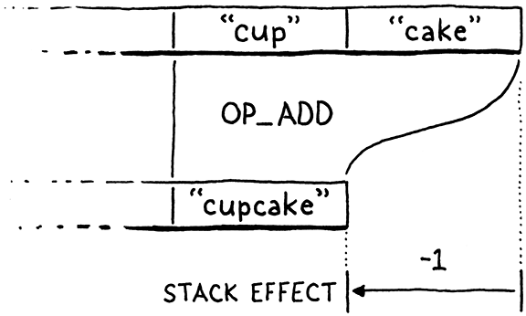

#### Chapter 21.

# Global Variables

> If only there could be an invention that bottled up a memory, like scent. And it never faded, and it never got stale. And then, when one wanted it, the bottle could be uncorked, and it would be like living the moment all over again.
>
> Daphne du Maurier, *Rebecca*

The previous chapter was a long exploration of one big, deep, fundamental computer science data structure. Heavy on theory and concept. There may have been some discussion of big-O notation and algorithms. This chapter has fewer intellectual pretensions. There are no large ideas to learn. Instead, it’s a handful of straightforward engineering tasks. Once we’ve completed them, our virtual machine will support variables.

Actually, it will support only *global* variables. Locals are coming in the next chapter. In jlox, we managed to cram them both into a single chapter because we used the same implementation technique for all variables. We built a chain of environments, one for each scope, all the way up to the top. That was a simple, clean way to learn how to manage state.

But it’s also *slow*. Allocating a new hash table each time you enter a block or call a function is not the road to a fast VM. Given how much code is concerned with using variables, if variables go slow, everything goes slow. For clox, we’ll improve that by using a much more efficient strategy for local variables, but globals aren’t as easily optimized.

> This is a common meta-strategy in sophisticated language implementations. Often, the same language feature will have multiple implementation techniques, each tuned for different use patterns. For example, JavaScript VMs often have a faster representation for objects that are used more like instances of classes compared to other objects whose set of properties is more freely modified. C and C++ compilers usually have a variety of ways to compile `switch` statements based on the number of cases and how densely packed the case values are.

A quick refresher on Lox semantics: Global variables in Lox are “late bound”, or resolved dynamically. This means you can compile a chunk of code that refers to a global variable before it’s defined. As long as the code doesn’t *execute* before the definition happens, everything is fine. In practice, that means you can refer to later variables inside the body of functions.

```
fun showVariable() {
  print global;
}

var global = "after";
showVariable();
```

Code like this might seem odd, but it’s handy for defining mutually recursive functions. It also plays nicer with the REPL. You can write a little function in one line, then define the variable it uses in the next.

Local variables work differently. Since a local variable’s declaration *always* occurs before it is used, the VM can resolve them at compile time, even in a simple single-pass compiler. That will let us use a smarter representation for locals. But that’s for the next chapter. Right now, let’s just worry about globals.

## 21.1 Statements

Variables come into being using variable declarations, which means now is also the time to add support for statements to our compiler. If you recall, Lox splits statements into two categories. “Declarations” are those statements that bind a new name to a value. The other kinds of statements—control flow, print, etc.—are just called “statements”. We disallow declarations directly inside control flow statements, like this:

```
if (monday) var croissant = "yes"; // Error.
```

Allowing it would raise confusing questions around the scope of the variable. So, like other languages, we prohibit it syntactically by having a separate grammar rule for the subset of statements that *are* allowed inside a control flow body.

```
statement      → exprStmt
               | forStmt
               | ifStmt
               | printStmt
               | returnStmt
               | whileStmt
               | block ;
```

Then we use a separate rule for the top level of a script and inside a block.

```
declaration    → classDecl
               | funDecl
               | varDecl
               | statement ;
```

The `declaration` rule contains the statements that declare names, and also includes `statement` so that all statement types are allowed. Since `block` itself is in `statement`, you can put declarations inside a control flow construct by nesting them inside a block.

> Blocks work sort of like parentheses do for expressions. A block lets you put the “lower-precedence” declaration statements in places where only a “higher-precedence” non-declaring statement is allowed.

In this chapter, we’ll cover only a couple of statements and one declaration.

```
statement      → exprStmt
               | printStmt ;

declaration    → varDecl
               | statement ;
```

Up to now, our VM considered a “program” to be a single expression since that’s all we could parse and compile. In a full Lox implementation, a program is a sequence of declarations. We’re ready to support that now.

```
  advance();
```

```
  while (!match(TOKEN_EOF)) {
    declaration();
  }
```

```
  endCompiler();
```

*compiler.c*, in *compile*(), replace 2 lines

We keep compiling declarations until we hit the end of the source file. We compile a single declaration using this:

```
static void declaration() {
  statement();
}
```

*compiler.c*, add after *expression*()

We’ll get to variable declarations later in the chapter, so for now, we simply forward to `statement()`.

```
static void statement() {
  if (match(TOKEN_PRINT)) {
    printStatement();
  }
}
```

*compiler.c*, add after *declaration*()

Blocks can contain declarations, and control flow statements can contain other statements. That means these two functions will eventually be recursive. We may as well write out the forward declarations now.

```
static void expression();
```

```
static void statement();
static void declaration();
```

```
static ParseRule* getRule(TokenType type);
```

*compiler.c*, add after *expression*()

### 21.1.1 Print statements

We have two statement types to support in this chapter. Let’s start with `print` statements, which begin, naturally enough, with a `print` token. We detect that using this helper function:

```
static bool match(TokenType type) {
  if (!check(type)) return false;
  advance();
  return true;
}
```

*compiler.c*, add after *consume*()

You may recognize it from jlox. If the current token has the given type, we consume the token and return `true`. Otherwise we leave the token alone and return `false`. This helper function is implemented in terms of this other helper:

> It’s helpers all the way down!

```
static bool check(TokenType type) {
  return parser.current.type == type;
}
```

*compiler.c*, add after *consume*()

The `check()` function returns `true` if the current token has the given type. It seems a little silly to wrap this in a function, but we’ll use it more later, and I think short verb-named functions like this make the parser easier to read.

> This sounds trivial, but handwritten parsers for non-toy languages get pretty big. When you have thousands of lines of code, a utility function that turns two lines into one and makes the result a little more readable easily earns its keep.

If we did match the `print` token, then we compile the rest of the statement here:

```
static void printStatement() {
  expression();
  consume(TOKEN_SEMICOLON, "Expect ';' after value.");
  emitByte(OP_PRINT);
}
```

*compiler.c*, add after *expression*()

A `print` statement evaluates an expression and prints the result, so we first parse and compile that expression. The grammar expects a semicolon after that, so we consume it. Finally, we emit a new instruction to print the result.

```
  OP_NEGATE,
```

```
  OP_PRINT,
```

```
  OP_RETURN,
```

*chunk.h*, in enum *OpCode*

At runtime, we execute this instruction like so:

```
        break;
```

```
      case OP_PRINT: {
        printValue(pop());
        printf("\n");
        break;
      }
```

```
      case OP_RETURN: {
```

*vm.c*, in *run*()

When the interpreter reaches this instruction, it has already executed the code for the expression, leaving the result value on top of the stack. Now we simply pop and print it.

Note that we don’t push anything else after that. This is a key difference between expressions and statements in the VM. Every bytecode instruction has a **stack effect** that describes how the instruction modifies the stack. For example, `OP_ADD` pops two values and pushes one, leaving the stack one element smaller than before.

> The stack is one element shorter after an `OP_ADD`, so its effect is -1:
>
> 

You can sum the stack effects of a series of instructions to get their total effect. When you add the stack effects of the series of instructions compiled from any complete expression, it will total one. Each expression leaves one result value on the stack.

The bytecode for an entire statement has a total stack effect of zero. Since a statement produces no values, it ultimately leaves the stack unchanged, though it of course uses the stack while it’s doing its thing. This is important because when we get to control flow and looping, a program might execute a long series of statements. If each statement grew or shrank the stack, it might eventually overflow or underflow.

While we’re in the interpreter loop, we should delete a bit of code.

```
      case OP_RETURN: {
```

```
        // Exit interpreter.
```

```
        return INTERPRET_OK;
```

*vm.c*, in *run*(), replace 2 lines

When the VM only compiled and evaluated a single expression, we had some temporary code in `OP_RETURN` to output the value. Now that we have statements and `print`, we don’t need that anymore. We’re one step closer to the complete implementation of clox.

> We’re only one step closer, though. We will revisit `OP_RETURN` again when we add functions. Right now, it exits the entire interpreter loop.

As usual, a new instruction needs support in the disassembler.

```
      return simpleInstruction("OP_NEGATE", offset);
```

```
    case OP_PRINT:
      return simpleInstruction("OP_PRINT", offset);
```

```
    case OP_RETURN:
```

*debug.c*, in *disassembleInstruction*()

That’s our `print` statement. If you want, give it a whirl:

```
print 1 + 2;
print 3 * 4;
```

Exciting! OK, maybe not thrilling, but we can build scripts that contain as many statements as we want now, which feels like progress.

### 21.1.2 Expression statements

Wait until you see the next statement. If we *don’t* see a `print` keyword, then we must be looking at an expression statement.

```
    printStatement();
```

```
  } else {
    expressionStatement();
```

```
  }
```

*compiler.c*, in *statement*()

It’s parsed like so:

```
static void expressionStatement() {
  expression();
  consume(TOKEN_SEMICOLON, "Expect ';' after expression.");
  emitByte(OP_POP);
}
```

*compiler.c*, add after *expression*()

An “expression statement” is simply an expression followed by a semicolon. They’re how you write an expression in a context where a statement is expected. Usually, it’s so that you can call a function or evaluate an assignment for its side effect, like this:

```
brunch = "quiche";
eat(brunch);
```

Semantically, an expression statement evaluates the expression and discards the result. The compiler directly encodes that behavior. It compiles the expression, and then emits an `OP_POP` instruction.

```
  OP_FALSE,
```

```
  OP_POP,
```

```
  OP_EQUAL,
```

*chunk.h*, in enum *OpCode*

As the name implies, that instruction pops the top value off the stack and forgets it.

```
      case OP_FALSE: push(BOOL_VAL(false)); break;
```

```
      case OP_POP: pop(); break;
```

```
      case OP_EQUAL: {
```

*vm.c*, in *run*()

We can disassemble it too.

```
      return simpleInstruction("OP_FALSE", offset);
```

```
    case OP_POP:
      return simpleInstruction("OP_POP", offset);
```

```
    case OP_EQUAL:
```

*debug.c*, in *disassembleInstruction*()

Expression statements aren’t very useful yet since we can’t create any expressions that have side effects, but they’ll be essential when we add functions later. The majority of statements in real-world code in languages like C are expression statements.

> By my count, 80 of the 149 statements, in the version of “compiler.c” that we have at the end of this chapter are expression statements.

### 21.1.3 Error synchronization

While we’re getting this initial work done in the compiler, we can tie off a loose end we left several chapters back. Like jlox, clox uses panic mode error recovery to minimize the number of cascaded compile errors that it reports. The compiler exits panic mode when it reaches a synchronization point. For Lox, we chose statement boundaries as that point. Now that we have statements, we can implement synchronization.

```
  statement();
```

```
  if (parser.panicMode) synchronize();
```

```
}
```

*compiler.c*, in *declaration*()

If we hit a compile error while parsing the previous statement, we enter panic mode. When that happens, after the statement we start synchronizing.

```
static void synchronize() {
  parser.panicMode = false;

  while (parser.current.type != TOKEN_EOF) {
    if (parser.previous.type == TOKEN_SEMICOLON) return;
    switch (parser.current.type) {
      case TOKEN_CLASS:
      case TOKEN_FUN:
      case TOKEN_VAR:
      case TOKEN_FOR:
      case TOKEN_IF:
      case TOKEN_WHILE:
      case TOKEN_PRINT:
      case TOKEN_RETURN:
        return;

      default:
        ; // Do nothing.
    }

    advance();
  }
}
```

*compiler.c*, add after *printStatement*()

We skip tokens indiscriminately until we reach something that looks like a statement boundary. We recognize the boundary by looking for a preceding token that can end a statement, like a semicolon. Or we’ll look for a subsequent token that begins a statement, usually one of the control flow or declaration keywords.

## 21.2 Variable Declarations

Merely being able to *print* doesn’t win your language any prizes at the programming language fair, so let’s move on to something a little more ambitious and get variables going. There are three operations we need to support:

> I can’t help but imagine a “language fair” like some country 4H thing. Rows of straw-lined stalls full of baby languages *moo*ing and *baa*ing at each other.

- Declaring a new variable using a `var` statement.
- Accessing the value of a variable using an identifier expression.
- Storing a new value in an existing variable using an assignment expression.

We can’t do either of the last two until we have some variables, so we start with declarations.

```
static void declaration() {
```

```
  if (match(TOKEN_VAR)) {
    varDeclaration();
  } else {
    statement();
  }
```

```
  if (parser.panicMode) synchronize();
```

*compiler.c*, in *declaration*(), replace 1 line

The placeholder parsing function we sketched out for the declaration grammar rule has an actual production now. If we match a `var` token, we jump here:

```
static void varDeclaration() {
  uint8_t global = parseVariable("Expect variable name.");

  if (match(TOKEN_EQUAL)) {
    expression();
  } else {
    emitByte(OP_NIL);
  }
  consume(TOKEN_SEMICOLON,
          "Expect ';' after variable declaration.");

  defineVariable(global);
}
```

*compiler.c*, add after *expression*()

The keyword is followed by the variable name. That’s compiled by `parseVariable()`, which we’ll get to in a second. Then we look for an `=` followed by an initializer expression. If the user doesn’t initialize the variable, the compiler implicitly initializes it to `nil` by emitting an `OP_NIL` instruction. Either way, we expect the statement to be terminated with a semicolon.

> Essentially, the compiler desugars a variable declaration like:
>
> ```
> var a;
> ```
>
> into:
>
> ```
> var a = nil;
> ```
>
> The code it generates for the former is identical to what it produces for the latter.

There are two new functions here for working with variables and identifiers. Here is the first:

```
static void parsePrecedence(Precedence precedence);
```

```
static uint8_t parseVariable(const char* errorMessage) {
  consume(TOKEN_IDENTIFIER, errorMessage);
  return identifierConstant(&parser.previous);
}
```

*compiler.c*, add after *parsePrecedence*()

It requires the next token to be an identifier, which it consumes and sends here:

```
static void parsePrecedence(Precedence precedence);
```

```
static uint8_t identifierConstant(Token* name) {
  return makeConstant(OBJ_VAL(copyString(name->start,
                                         name->length)));
}
```

*compiler.c*, add after *parsePrecedence*()

This function takes the given token and adds its lexeme to the chunk’s constant table as a string. It then returns the index of that constant in the constant table.

Global variables are looked up *by name* at runtime. That means the VM—the bytecode interpreter loop—needs access to the name. A whole string is too big to stuff into the bytecode stream as an operand. Instead, we store the string in the constant table and the instruction then refers to the name by its index in the table.

This function returns that index all the way to `varDeclaration()` which later hands it over to here:

```
static void defineVariable(uint8_t global) {
  emitBytes(OP_DEFINE_GLOBAL, global);
}
```

*compiler.c*, add after *parseVariable*()

This outputs the bytecode instruction that defines the new variable and stores its initial value. The index of the variable’s name in the constant table is the instruction’s operand. As usual in a stack-based VM, we emit this instruction last. At runtime, we execute the code for the variable’s initializer first. That leaves the value on the stack. Then this instruction takes that value and stores it away for later.

> I know some of these functions seem pretty pointless right now. But we’ll get more mileage out of them as we add more language features for working with names. Function and class declarations both declare new variables, and variable and assignment expressions access them.

Over in the runtime, we begin with this new instruction:

```
  OP_POP,
```

```
  OP_DEFINE_GLOBAL,
```

```
  OP_EQUAL,
```

*chunk.h*, in enum *OpCode*

Thanks to our handy-dandy hash table, the implementation isn’t too hard.

```
      case OP_POP: pop(); break;
```

```
      case OP_DEFINE_GLOBAL: {
        ObjString* name = READ_STRING();
        tableSet(&vm.globals, name, peek(0));
        pop();
        break;
      }
```

```
      case OP_EQUAL: {
```

*vm.c*, in *run*()

We get the name of the variable from the constant table. Then we take the value from the top of the stack and store it in a hash table with that name as the key.

> Note that we don’t *pop* the value until *after* we add it to the hash table. That ensures the VM can still find the value if a garbage collection is triggered right in the middle of adding it to the hash table. That’s a distinct possibility since the hash table requires dynamic allocation when it resizes.

This code doesn’t check to see if the key is already in the table. Lox is pretty lax with global variables and lets you redefine them without error. That’s useful in a REPL session, so the VM supports that by simply overwriting the value if the key happens to already be in the hash table.

There’s another little helper macro:

```
#define READ_CONSTANT() (vm.chunk->constants.values[READ_BYTE()])
```

```
#define READ_STRING() AS_STRING(READ_CONSTANT())
```

```
#define BINARY_OP(valueType, op) \
```

*vm.c*, in *run*()

It reads a one-byte operand from the bytecode chunk. It treats that as an index into the chunk’s constant table and returns the string at that index. It doesn’t check that the value *is* a string—it just indiscriminately casts it. That’s safe because the compiler never emits an instruction that refers to a non-string constant.

Because we care about lexical hygiene, we also undefine this macro at the end of the interpret function.

```
#undef READ_CONSTANT
```

```
#undef READ_STRING
```

```
#undef BINARY_OP
```

*vm.c*, in *run*()

I keep saying “the hash table”, but we don’t actually have one yet. We need a place to store these globals. Since we want them to persist as long as clox is running, we store them right in the VM.

```
  Value* stackTop;
```

```
  Table globals;
```

```
  Table strings;
```

*vm.h*, in struct *VM*

As we did with the string table, we need to initialize the hash table to a valid state when the VM boots up.

```
  vm.objects = NULL;
```

```
  initTable(&vm.globals);
```

```
  initTable(&vm.strings);
```

*vm.c*, in *initVM*()

And we tear it down when we exit.

> The process will free everything on exit, but it feels undignified to require the operating system to clean up our mess.

```
void freeVM() {
```

```
  freeTable(&vm.globals);
```

```
  freeTable(&vm.strings);
```

*vm.c*, in *freeVM*()

As usual, we want to be able to disassemble the new instruction too.

```
      return simpleInstruction("OP_POP", offset);
```

```
    case OP_DEFINE_GLOBAL:
      return constantInstruction("OP_DEFINE_GLOBAL", chunk,
                                 offset);
```

```
    case OP_EQUAL:
```

*debug.c*, in *disassembleInstruction*()

And with that, we can define global variables. Not that users can *tell* that they’ve done so, because they can’t actually *use* them. So let’s fix that next.

## 21.3 Reading Variables

As in every programming language ever, we access a variable’s value using its name. We hook up identifier tokens to the expression parser here:

```
  [TOKEN_LESS_EQUAL]    = {NULL,     binary, PREC_COMPARISON},
```

```
  [TOKEN_IDENTIFIER]    = {variable, NULL,   PREC_NONE},
```

```
  [TOKEN_STRING]        = {string,   NULL,   PREC_NONE},
```

*compiler.c*, replace 1 line

That calls this new parser function:

```
static void variable() {
  namedVariable(parser.previous);
}
```

*compiler.c*, add after *string*()

Like with declarations, there are a couple of tiny helper functions that seem pointless now but will become more useful in later chapters. I promise.

```
static void namedVariable(Token name) {
  uint8_t arg = identifierConstant(&name);
  emitBytes(OP_GET_GLOBAL, arg);
}
```

*compiler.c*, add after *string*()

This calls the same `identifierConstant()` function from before to take the given identifier token and add its lexeme to the chunk’s constant table as a string. All that remains is to emit an instruction that loads the global variable with that name. Here’s the instruction:

```
  OP_POP,
```

```
  OP_GET_GLOBAL,
```

```
  OP_DEFINE_GLOBAL,
```

*chunk.h*, in enum *OpCode*

Over in the interpreter, the implementation mirrors `OP_DEFINE_GLOBAL`.

```
      case OP_POP: pop(); break;
```

```
      case OP_GET_GLOBAL: {
        ObjString* name = READ_STRING();
        Value value;
        if (!tableGet(&vm.globals, name, &value)) {
          runtimeError("Undefined variable '%s'.", name->chars);
          return INTERPRET_RUNTIME_ERROR;
        }
        push(value);
        break;
      }
```

```
      case OP_DEFINE_GLOBAL: {
```

*vm.c*, in *run*()

We pull the constant table index from the instruction’s operand and get the variable name. Then we use that as a key to look up the variable’s value in the globals hash table.

If the key isn’t present in the hash table, it means that global variable has never been defined. That’s a runtime error in Lox, so we report it and exit the interpreter loop if that happens. Otherwise, we take the value and push it onto the stack.

```
      return simpleInstruction("OP_POP", offset);
```

```
    case OP_GET_GLOBAL:
      return constantInstruction("OP_GET_GLOBAL", chunk, offset);
```

```
    case OP_DEFINE_GLOBAL:
```

*debug.c*, in *disassembleInstruction*()

A little bit of disassembling, and we’re done. Our interpreter is now able to run code like this:

```
var beverage = "cafe au lait";
var breakfast = "beignets with " + beverage;
print breakfast;
```

There’s only one operation left.

## 21.4 Assignment

Throughout this book, I’ve tried to keep you on a fairly safe and easy path. I don’t avoid hard *problems*, but I try to not make the *solutions* more complex than they need to be. Alas, other design choices in our bytecode compiler make assignment annoying to implement.

> If you recall, assignment was pretty easy in jlox.

Our bytecode VM uses a single-pass compiler. It parses and generates bytecode on the fly without any intermediate AST. As soon as it recognizes a piece of syntax, it emits code for it. Assignment doesn’t naturally fit that. Consider:

```
menu.brunch(sunday).beverage = "mimosa";
```

In this code, the parser doesn’t realize `menu.brunch(sunday).beverage` is the target of an assignment and not a normal expression until it reaches `=`, many tokens after the first `menu`. By then, the compiler has already emitted bytecode for the whole thing.

The problem is not as dire as it might seem, though. Look at how the parser sees that example:


Even though the `.beverage` part must not be compiled as a get expression, everything to the left of the `.` is an expression, with the normal expression semantics. The `menu.brunch(sunday)` part can be compiled and executed as usual.

Fortunately for us, the only semantic differences on the left side of an assignment appear at the very right-most end of the tokens, immediately preceding the `=`. Even though the receiver of a setter may be an arbitrarily long expression, the part whose behavior differs from a get expression is only the trailing identifier, which is right before the `=`. We don’t need much lookahead to realize `beverage` should be compiled as a set expression and not a getter.

Variables are even easier since they are just a single bare identifier before an `=`. The idea then is that right *before* compiling an expression that can also be used as an assignment target, we look for a subsequent `=` token. If we see one, we compile it as an assignment or setter instead of a variable access or getter.

We don’t have setters to worry about yet, so all we need to handle are variables.

```
  uint8_t arg = identifierConstant(&name);
```

```
  if (match(TOKEN_EQUAL)) {
    expression();
    emitBytes(OP_SET_GLOBAL, arg);
  } else {
    emitBytes(OP_GET_GLOBAL, arg);
  }
```

```
}
```

*compiler.c*, in *namedVariable*(), replace 1 line

In the parse function for identifier expressions, we look for an equals sign after the identifier. If we find one, instead of emitting code for a variable access, we compile the assigned value and then emit an assignment instruction.

That’s the last instruction we need to add in this chapter.

```
  OP_DEFINE_GLOBAL,
```

```
  OP_SET_GLOBAL,
```

```
  OP_EQUAL,
```

*chunk.h*, in enum *OpCode*

As you’d expect, its runtime behavior is similar to defining a new variable.

```
      }
```

```
      case OP_SET_GLOBAL: {
        ObjString* name = READ_STRING();
        if (tableSet(&vm.globals, name, peek(0))) {
          tableDelete(&vm.globals, name);
          runtimeError("Undefined variable '%s'.", name->chars);
          return INTERPRET_RUNTIME_ERROR;
        }
        break;
      }
```

```
      case OP_EQUAL: {
```

*vm.c*, in *run*()

The main difference is what happens when the key doesn’t already exist in the globals hash table. If the variable hasn’t been defined yet, it’s a runtime error to try to assign to it. Lox doesn’t do implicit variable declaration.

> The call to `tableSet()` stores the value in the global variable table even if the variable wasn’t previously defined. That fact is visible in a REPL session, since it keeps running even after the runtime error is reported. So we also take care to delete that zombie value from the table.

The other difference is that setting a variable doesn’t pop the value off the stack. Remember, assignment is an expression, so it needs to leave that value there in case the assignment is nested inside some larger expression.

Add a dash of disassembly:

```
      return constantInstruction("OP_DEFINE_GLOBAL", chunk,
                                 offset);
```

```
    case OP_SET_GLOBAL:
      return constantInstruction("OP_SET_GLOBAL", chunk, offset);
```

```
    case OP_EQUAL:
```

*debug.c*, in *disassembleInstruction*()

So we’re done, right? Well . . . not quite. We’ve made a mistake! Take a gander at:

```
a * b = c + d;
```

According to Lox’s grammar, `=` has the lowest precedence, so this should be parsed roughly like:


Obviously, `a * b` isn’t a valid assignment target, so this should be a syntax error. But here’s what our parser does:

> Wouldn’t it be wild if `a * b` *was* a valid assignment target, though? You could imagine some algebra-like language that tried to divide the assigned value up in some reasonable way and distribute it to `a` and `b` . . . that’s probably a terrible idea.

1.  First, `parsePrecedence()` parses `a` using the `variable()` prefix parser.
2.  After that, it enters the infix parsing loop.
3.  It reaches the `*` and calls `binary()`.
4.  That recursively calls `parsePrecedence()` to parse the right-hand operand.
5.  That calls `variable()` again for parsing `b`.
6.  Inside that call to `variable()`, it looks for a trailing `=`. It sees one and thus parses the rest of the line as an assignment.

In other words, the parser sees the above code like:


We’ve messed up the precedence handling because `variable()` doesn’t take into account the precedence of the surrounding expression that contains the variable. If the variable happens to be the right-hand side of an infix operator, or the operand of a unary operator, then that containing expression is too high precedence to permit the `=`.

To fix this, `variable()` should look for and consume the `=` only if it’s in the context of a low-precedence expression. The code that knows the current precedence is, logically enough, `parsePrecedence()`. The `variable()` function doesn’t need to know the actual level. It just cares that the precedence is low enough to allow assignment, so we pass that fact in as a Boolean.

```
    error("Expect expression.");
    return;
  }
```

```
  bool canAssign = precedence <= PREC_ASSIGNMENT;
  prefixRule(canAssign);
```

```
  while (precedence <= getRule(parser.current.type)->precedence) {
```

*compiler.c*, in *parsePrecedence*(), replace 1 line

Since assignment is the lowest-precedence expression, the only time we allow an assignment is when parsing an assignment expression or top-level expression like in an expression statement. That flag makes its way to the parser function here:

```
static void variable(bool canAssign) {
  namedVariable(parser.previous, canAssign);
}
```

*compiler.c*, function *variable*(), replace 3 lines

Which passes it through a new parameter:

```
static void namedVariable(Token name, bool canAssign) {
```

```
  uint8_t arg = identifierConstant(&name);
```

*compiler.c*, function *namedVariable*(), replace 1 line

And then finally uses it here:

```
  uint8_t arg = identifierConstant(&name);
```

```
  if (canAssign && match(TOKEN_EQUAL)) {
```

```
    expression();
```

*compiler.c*, in *namedVariable*(), replace 1 line

That’s a lot of plumbing to get literally one bit of data to the right place in the compiler, but arrived it has. If the variable is nested inside some expression with higher precedence, `canAssign` will be `false` and this will ignore the `=` even if there is one there. Then `namedVariable()` returns, and execution eventually makes its way back to `parsePrecedence()`.

Then what? What does the compiler do with our broken example from before? Right now, `variable()` won’t consume the `=`, so that will be the current token. The compiler returns back to `parsePrecedence()` from the `variable()` prefix parser and then tries to enter the infix parsing loop. There is no parsing function associated with `=`, so it skips that loop.

Then `parsePrecedence()` silently returns back to the caller. That also isn’t right. If the `=` doesn’t get consumed as part of the expression, nothing else is going to consume it. It’s an error and we should report it.

```
    infixRule();
  }
```

```
  if (canAssign && match(TOKEN_EQUAL)) {
    error("Invalid assignment target.");
  }
```

```
}
```

*compiler.c*, in *parsePrecedence*()

With that, the previous bad program correctly gets an error at compile time. OK, *now* are we done? Still not quite. See, we’re passing an argument to one of the parse functions. But those functions are stored in a table of function pointers, so all of the parse functions need to have the same type. Even though most parse functions don’t support being used as an assignment target—setters are the only other one—our friendly C compiler requires them *all* to accept the parameter.

> If Lox had arrays and subscript operators like `array[index]` then an infix `[` would also allow assignment to support `array[index] = value`.

So we’re going to finish off this chapter with some grunt work. First, let’s go ahead and pass the flag to the infix parse functions.

```
    ParseFn infixRule = getRule(parser.previous.type)->infix;
```

```
    infixRule(canAssign);
```

```
  }
```

*compiler.c*, in *parsePrecedence*(), replace 1 line

We’ll need that for setters eventually. Then we’ll fix the typedef for the function type.

```
} Precedence;
```

```
typedef void (*ParseFn)(bool canAssign);
```

```
typedef struct {
```

*compiler.c*, add after enum *Precedence*, replace 1 line

And some completely tedious code to accept this parameter in all of our existing parse functions. Here:

```
static void binary(bool canAssign) {
```

```
  TokenType operatorType = parser.previous.type;
```

*compiler.c*, function *binary*(), replace 1 line

And here:

```
static void literal(bool canAssign) {
```

```
  switch (parser.previous.type) {
```

*compiler.c*, function *literal*(), replace 1 line

And here:

```
static void grouping(bool canAssign) {
```

```
  expression();
```

*compiler.c*, function *grouping*(), replace 1 line

And here:

```
static void number(bool canAssign) {
```

```
  double value = strtod(parser.previous.start, NULL);
```

*compiler.c*, function *number*(), replace 1 line

And here too:

```
static void string(bool canAssign) {
```

```
  emitConstant(OBJ_VAL(copyString(parser.previous.start + 1,
```

*compiler.c*, function *string*(), replace 1 line

And, finally:

```
static void unary(bool canAssign) {
```

```
  TokenType operatorType = parser.previous.type;
```

*compiler.c*, function *unary*(), replace 1 line

Phew! We’re back to a C program we can compile. Fire it up and now you can run this:

```
var breakfast = "beignets";
var beverage = "cafe au lait";
breakfast = "beignets with " + beverage;

print breakfast;
```

It’s starting to look like real code for an actual language!

## Challenges

1.  The compiler adds a global variable’s name to the constant table as a string every time an identifier is encountered. It creates a new constant each time, even if that variable name is already in a previous slot in the constant table. That’s wasteful in cases where the same variable is referenced multiple times by the same function. That, in turn, increases the odds of filling up the constant table and running out of slots since we allow only 256 constants in a single chunk.

    Optimize this. How does your optimization affect the performance of the compiler compared to the runtime? Is this the right trade-off?

2.  Looking up a global variable by name in a hash table each time it is used is pretty slow, even with a good hash table. Can you come up with a more efficient way to store and access global variables without changing the semantics?

3.  When running in the REPL, a user might write a function that references an unknown global variable. Then, in the next line, they declare the variable. Lox should handle this gracefully by not reporting an “unknown variable” compile error when the function is first defined.

    But when a user runs a Lox *script*, the compiler has access to the full text of the entire program before any code is run. Consider this program:

    ```
    fun useVar() {
      print oops;
    }

    var ooops = "too many o's!";
    ```

    Here, we can tell statically that `oops` will not be defined because there is *no* declaration of that global anywhere in the program. Note that `useVar()` is never called either, so even though the variable isn’t defined, no runtime error will occur because it’s never used either.

    We could report mistakes like this as compile errors, at least when running from a script. Do you think we should? Justify your answer. What do other scripting languages you know do?