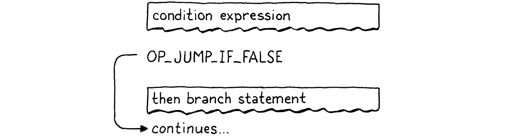
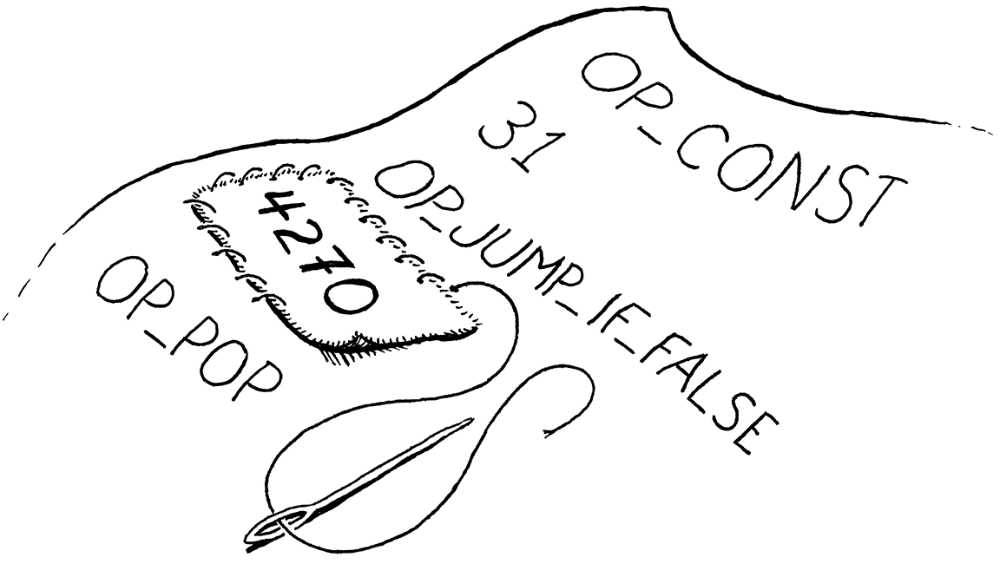
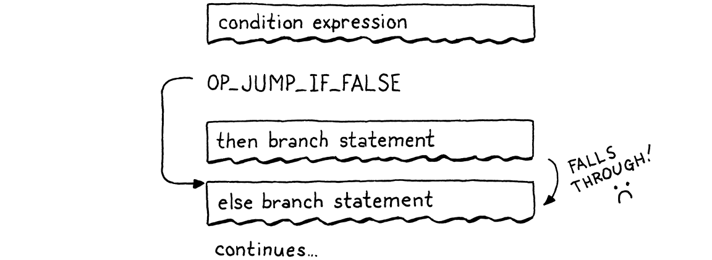
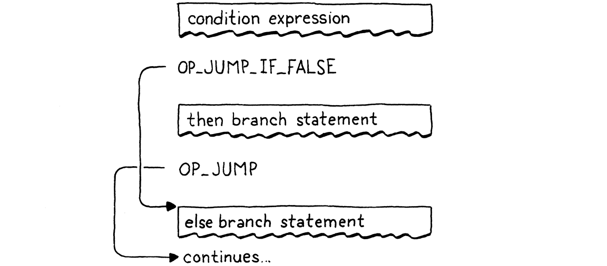
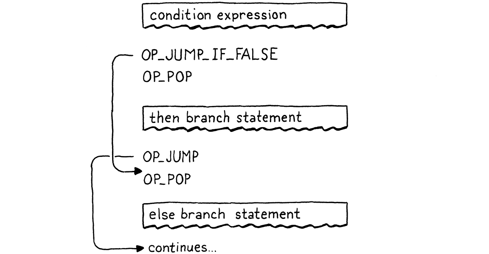
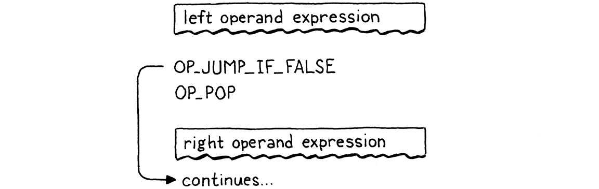
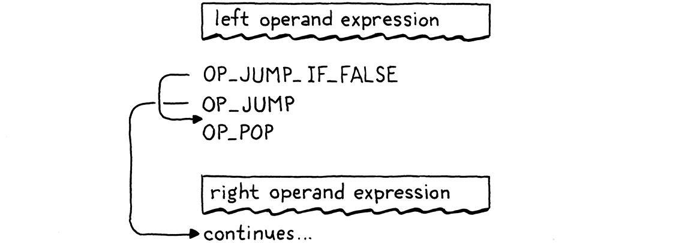
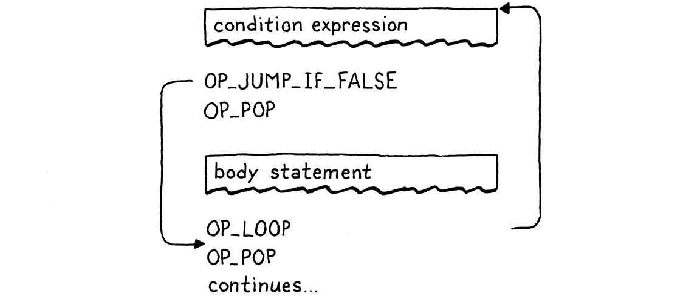
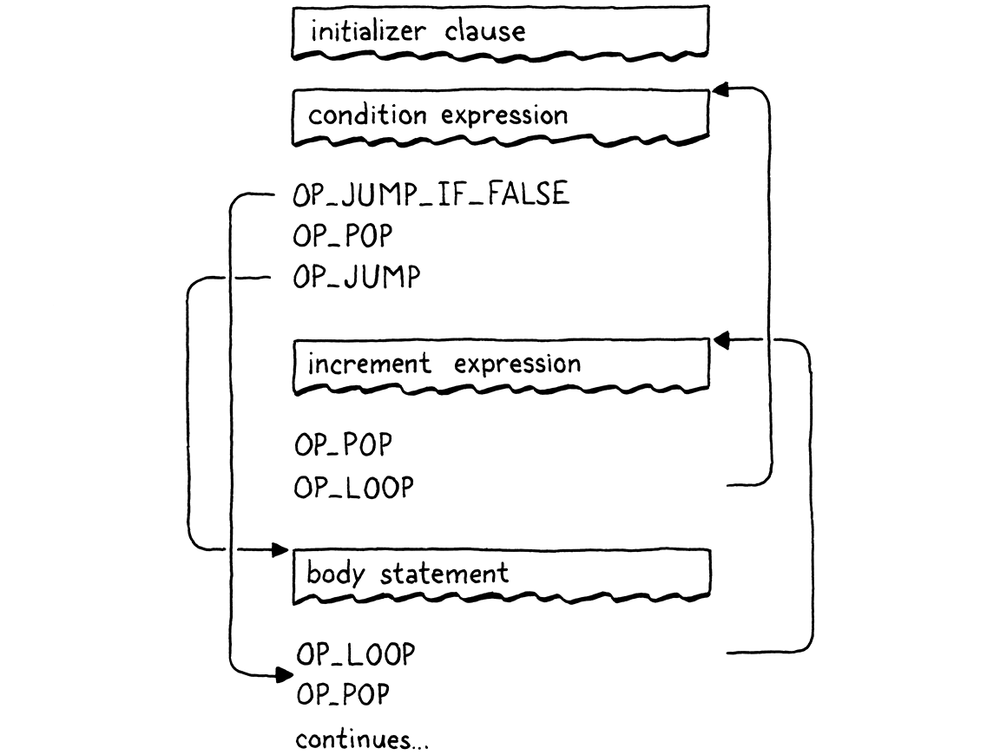

#### Chapter 23.

# Jumping Back and Forth

> The order that our mind imagines is like a net, or like a ladder, built to attain something. But afterward you must throw the ladder away, because you discover that, even if it was useful, it was meaningless.
>
> Umberto Eco, *The Name of the Rose*

It’s taken a while to get here, but we’re finally ready to add control flow to our virtual machine. In the tree-walk interpreter we built for jlox, we implemented Lox’s control flow in terms of Java’s. To execute a Lox `if` statement, we used a Java `if` statement to run the chosen branch. That works, but isn’t entirely satisfying. By what magic does the *JVM itself* or a native CPU implement `if` statements? Now that we have our own bytecode VM to hack on, we can answer that.

When we talk about “control flow”, what are we referring to? By “flow” we mean the way execution moves through the text of the program. Almost like there is a little robot inside the computer wandering through our code, executing bits and pieces here and there. Flow is the path that robot takes, and by *controlling* the robot, we drive which pieces of code it executes.

In jlox, the robot’s locus of attention—the *current* bit of code—was implicit based on which AST nodes were stored in various Java variables and what Java code we were in the middle of running. In clox, it is much more explicit. The VM’s `ip` field stores the address of the current bytecode instruction. The value of that field is exactly “where we are” in the program.

Execution proceeds normally by incrementing the `ip`. But we can mutate that variable however we want to. In order to implement control flow, all that’s necessary is to change the `ip` in more interesting ways. The simplest control flow construct is an `if` statement with no `else` clause:

```
if (condition) print("condition was truthy");
```

The VM evaluates the bytecode for the condition expression. If the result is truthy, then it continues along and executes the `print` statement in the body. The interesting case is when the condition is falsey. When that happens, execution skips over the then branch and proceeds to the next statement.

To skip over a chunk of code, we simply set the `ip` field to the address of the bytecode instruction following that code. To *conditionally* skip over some code, we need an instruction that looks at the value on top of the stack. If it’s falsey, it adds a given offset to the `ip` to jump over a range of instructions. Otherwise, it does nothing and lets execution proceed to the next instruction as usual.

When we compile to bytecode, the explicit nested block structure of the code evaporates, leaving only a flat series of instructions behind. Lox is a [structured programming](https://en.wikipedia.org/wiki/Structured_programming) language, but clox bytecode isn’t. The right—or wrong, depending on how you look at it—set of bytecode instructions could jump into the middle of a block, or from one scope into another.

The VM will happily execute that, even if the result leaves the stack in an unknown, inconsistent state. So even though the bytecode is unstructured, we’ll take care to ensure that our compiler only generates clean code that maintains the same structure and nesting that Lox itself does.

This is exactly how real CPUs behave. Even though we might program them using higher-level languages that mandate structured control flow, the compiler lowers that down to raw jumps. At the bottom, it turns out goto is the only real control flow.

Anyway, I didn’t mean to get all philosophical. The important bit is that if we have that one conditional jump instruction, that’s enough to implement Lox’s `if` statement, as long as it doesn’t have an `else` clause. So let’s go ahead and get started with that.

## 23.1 If Statements

This many chapters in, you know the drill. Any new feature starts in the front end and works its way through the pipeline. An `if` statement is, well, a statement, so that’s where we hook it into the parser.

```
  if (match(TOKEN_PRINT)) {
    printStatement();
```

```
  } else if (match(TOKEN_IF)) {
    ifStatement();
```

```
  } else if (match(TOKEN_LEFT_BRACE)) {
```

*compiler.c*, in *statement*()

When we see an `if` keyword, we hand off compilation to this function:

```
static void ifStatement() {
  consume(TOKEN_LEFT_PAREN, "Expect '(' after 'if'.");
  expression();
  consume(TOKEN_RIGHT_PAREN, "Expect ')' after condition.");

  int thenJump = emitJump(OP_JUMP_IF_FALSE);
  statement();

  patchJump(thenJump);
}
```

*compiler.c*, add after *expressionStatement*()

> Have you ever noticed that the `(` after the `if` keyword doesn’t actually do anything useful? The language would be just as unambiguous and easy to parse without it, like:
>
> ```
> if condition) print("looks weird");
> ```
>
> The closing `)` is useful because it separates the condition expression from the body. Some languages use a `then` keyword instead. But the opening `(` doesn’t do anything. It’s just there because unmatched parentheses look bad to us humans.

First we compile the condition expression, bracketed by parentheses. At runtime, that will leave the condition value on top of the stack. We’ll use that to determine whether to execute the then branch or skip it.

Then we emit a new `OP_JUMP_IF_FALSE` instruction. It has an operand for how much to offset the `ip`—how many bytes of code to skip. If the condition is falsey, it adjusts the `ip` by that amount. Something like this:

> The boxes with the torn edges here represent the blob of bytecode generated by compiling some sub-clause of a control flow construct. So the “condition expression” box is all of the instructions emitted when we compiled that expression.



But we have a problem. When we’re writing the `OP_JUMP_IF_FALSE` instruction’s operand, how do we know how far to jump? We haven’t compiled the then branch yet, so we don’t know how much bytecode it contains.

To fix that, we use a classic trick called **backpatching**. We emit the jump instruction first with a placeholder offset operand. We keep track of where that half-finished instruction is. Next, we compile the then body. Once that’s done, we know how far to jump. So we go back and replace that placeholder offset with the real one now that we can calculate it. Sort of like sewing a patch onto the existing fabric of the compiled code.



We encode this trick into two helper functions.

```
static int emitJump(uint8_t instruction) {
  emitByte(instruction);
  emitByte(0xff);
  emitByte(0xff);
  return currentChunk()->count - 2;
}
```

*compiler.c*, add after *emitBytes*()

The first emits a bytecode instruction and writes a placeholder operand for the jump offset. We pass in the opcode as an argument because later we’ll have two different instructions that use this helper. We use two bytes for the jump offset operand. A 16-bit offset lets us jump over up to 65,535 bytes of code, which should be plenty for our needs.

> Some instruction sets have separate “long” jump instructions that take larger operands for when you need to jump a greater distance.

The function returns the offset of the emitted instruction in the chunk. After compiling the then branch, we take that offset and pass it to this:

```
static void patchJump(int offset) {
  // -2 to adjust for the bytecode for the jump offset itself.
  int jump = currentChunk()->count - offset - 2;

  if (jump > UINT16_MAX) {
    error("Too much code to jump over.");
  }

  currentChunk()->code[offset] = (jump >> 8) & 0xff;
  currentChunk()->code[offset + 1] = jump & 0xff;
}
```

*compiler.c*, add after *emitConstant*()

This goes back into the bytecode and replaces the operand at the given location with the calculated jump offset. We call `patchJump()` right before we emit the next instruction that we want the jump to land on, so it uses the current bytecode count to determine how far to jump. In the case of an `if` statement, that means right after we compile the then branch and before we compile the next statement.

That’s all we need at compile time. Let’s define the new instruction.

```
  OP_PRINT,
```

```
  OP_JUMP_IF_FALSE,
```

```
  OP_RETURN,
```

*chunk.h*, in enum *OpCode*

Over in the VM, we get it working like so:

```
        break;
      }
```

```
      case OP_JUMP_IF_FALSE: {
        uint16_t offset = READ_SHORT();
        if (isFalsey(peek(0))) vm.ip += offset;
        break;
      }
```

```
      case OP_RETURN: {
```

*vm.c*, in *run*()

This is the first instruction we’ve added that takes a 16-bit operand. To read that from the chunk, we use a new macro.

```
#define READ_CONSTANT() (vm.chunk->constants.values[READ_BYTE()])
```

```
#define READ_SHORT() \
    (vm.ip += 2, (uint16_t)((vm.ip[-2] << 8) | vm.ip[-1]))
```

```
#define READ_STRING() AS_STRING(READ_CONSTANT())
```

*vm.c*, in *run*()

It yanks the next two bytes from the chunk and builds a 16-bit unsigned integer out of them. As usual, we clean up our macro when we’re done with it.

```
#undef READ_BYTE
```

```
#undef READ_SHORT
```

```
#undef READ_CONSTANT
```

*vm.c*, in *run*()

After reading the offset, we check the condition value on top of the stack. If it’s falsey, we apply this jump offset to the `ip`. Otherwise, we leave the `ip` alone and execution will automatically proceed to the next instruction following the jump instruction.

In the case where the condition is falsey, we don’t need to do any other work. We’ve offset the `ip`, so when the outer instruction dispatch loop turns again, it will pick up execution at that new instruction, past all of the code in the then branch.

> I said we wouldn’t use C’s `if` statement to implement Lox’s control flow, but we do use one here to determine whether or not to offset the instruction pointer. But we aren’t really using C for *control flow*. If we wanted to, we could do the same thing purely arithmetically. Let’s assume we have a function `falsey()` that takes a Lox Value and returns 1 if it’s falsey or 0 otherwise. Then we could implement the jump instruction like:
>
> ```
> case OP_JUMP_IF_FALSE: {
>   uint16_t offset = READ_SHORT();
>   vm.ip += falsey() * offset;
>   break;
> }
> ```
>
> The `falsey()` function would probably use some control flow to handle the different value types, but that’s an implementation detail of that function and doesn’t affect how our VM does its own control flow.

Note that the jump instruction doesn’t pop the condition value off the stack. So we aren’t totally done here, since this leaves an extra value floating around on the stack. We’ll clean that up soon. Ignoring that for the moment, we do have a working `if` statement in Lox now, with only one little instruction required to support it at runtime in the VM.

### 23.1.1 Else clauses

An `if` statement without support for `else` clauses is like Morticia Addams without Gomez. So, after we compile the then branch, we look for an `else` keyword. If we find one, we compile the else branch.

```
  patchJump(thenJump);
```

```
  if (match(TOKEN_ELSE)) statement();
```

```
}
```

*compiler.c*, in *ifStatement*()

When the condition is falsey, we’ll jump over the then branch. If there’s an else branch, the `ip` will land right at the beginning of its code. But that’s not enough, though. Here’s the flow that leads to:



If the condition is truthy, we execute the then branch like we want. But after that, execution rolls right on through into the else branch. Oops! When the condition is true, after we run the then branch, we need to jump over the else branch. That way, in either case, we only execute a single branch, like this:



To implement that, we need another jump from the end of the then branch.

```
  statement();
```

```
  int elseJump = emitJump(OP_JUMP);
```

```
  patchJump(thenJump);
```

*compiler.c*, in *ifStatement*()

We patch that offset after the end of the else body.

```
  if (match(TOKEN_ELSE)) statement();
```

```
  patchJump(elseJump);
```

```
}
```

*compiler.c*, in *ifStatement*()

After executing the then branch, this jumps to the next statement after the else branch. Unlike the other jump, this jump is unconditional. We always take it, so we need another instruction that expresses that.

```
  OP_PRINT,
```

```
  OP_JUMP,
```

```
  OP_JUMP_IF_FALSE,
```

*chunk.h*, in enum *OpCode*

We interpret it like so:

```
        break;
      }
```

```
      case OP_JUMP: {
        uint16_t offset = READ_SHORT();
        vm.ip += offset;
        break;
      }
```

```
      case OP_JUMP_IF_FALSE: {
```

*vm.c*, in *run*()

Nothing too surprising here—the only difference is that it doesn’t check a condition and always applies the offset.

We have then and else branches working now, so we’re close. The last bit is to clean up that condition value we left on the stack. Remember, each statement is required to have zero stack effect—after the statement is finished executing, the stack should be as tall as it was before.

We could have the `OP_JUMP_IF_FALSE` instruction pop the condition itself, but soon we’ll use that same instruction for the logical operators where we don’t want the condition popped. Instead, we’ll have the compiler emit a couple of explicit `OP_POP` instructions when compiling an `if` statement. We need to take care that every execution path through the generated code pops the condition.

When the condition is truthy, we pop it right before the code inside the then branch.

```
  int thenJump = emitJump(OP_JUMP_IF_FALSE);
```

```
  emitByte(OP_POP);
```

```
  statement();
```

*compiler.c*, in *ifStatement*()

Otherwise, we pop it at the beginning of the else branch.

```
  patchJump(thenJump);
```

```
  emitByte(OP_POP);
```

```
  if (match(TOKEN_ELSE)) statement();
```

*compiler.c*, in *ifStatement*()

This little instruction here also means that every `if` statement has an implicit else branch even if the user didn’t write an `else` clause. In the case where they left it off, all the branch does is discard the condition value.

The full correct flow looks like this:



If you trace through, you can see that it always executes a single branch and ensures the condition is popped first. All that remains is a little disassembler support.

```
      return simpleInstruction("OP_PRINT", offset);
```

```
    case OP_JUMP:
      return jumpInstruction("OP_JUMP", 1, chunk, offset);
    case OP_JUMP_IF_FALSE:
      return jumpInstruction("OP_JUMP_IF_FALSE", 1, chunk, offset);
```

```
    case OP_RETURN:
```

*debug.c*, in *disassembleInstruction*()

These two instructions have a new format with a 16-bit operand, so we add a new utility function to disassemble them.

```
static int jumpInstruction(const char* name, int sign,
                           Chunk* chunk, int offset) {
  uint16_t jump = (uint16_t)(chunk->code[offset + 1] << 8);
  jump |= chunk->code[offset + 2];
  printf("%-16s %4d -> %d\n", name, offset,
         offset + 3 + sign * jump);
  return offset + 3;
}
```

*debug.c*, add after *byteInstruction*()

There we go, that’s one complete control flow construct. If this were an ’80s movie, the montage music would kick in and the rest of the control flow syntax would take care of itself. Alas, the ’80s are long over, so we’ll have to grind it out ourselves.

> My enduring love of Depeche Mode notwithstanding.

## 23.2 Logical Operators

You probably remember this from jlox, but the logical operators `and` and `or` aren’t just another pair of binary operators like `+` and `-`. Because they short-circuit and may not evaluate their right operand depending on the value of the left one, they work more like control flow expressions.

They’re basically a little variation on an `if` statement with an `else` clause. The easiest way to explain them is to just show you the compiler code and the control flow it produces in the resulting bytecode. Starting with `and`, we hook it into the expression parsing table here:

```
  [TOKEN_NUMBER]        = {number,   NULL,   PREC_NONE},
```

```
  [TOKEN_AND]           = {NULL,     and_,   PREC_AND},
```

```
  [TOKEN_CLASS]         = {NULL,     NULL,   PREC_NONE},
```

*compiler.c*, replace 1 line

That hands off to a new parser function.

```
static void and_(bool canAssign) {
  int endJump = emitJump(OP_JUMP_IF_FALSE);

  emitByte(OP_POP);
  parsePrecedence(PREC_AND);

  patchJump(endJump);
}
```

*compiler.c*, add after *defineVariable*()

At the point this is called, the left-hand side expression has already been compiled. That means at runtime, its value will be on top of the stack. If that value is falsey, then we know the entire `and` must be false, so we skip the right operand and leave the left-hand side value as the result of the entire expression. Otherwise, we discard the left-hand value and evaluate the right operand which becomes the result of the whole `and` expression.

Those four lines of code right there produce exactly that. The flow looks like this:



Now you can see why `OP_JUMP_IF_FALSE` leaves the value on top of the stack. When the left-hand side of the `and` is falsey, that value sticks around to become the result of the entire expression.

> We’ve got plenty of space left in our opcode range, so we could have separate instructions for conditional jumps that implicitly pop and those that don’t, I suppose. But I’m trying to keep things minimal for the book. In your bytecode VM, it’s worth exploring adding more specialized instructions and seeing how they affect performance.

### 23.2.1 Logical or operator

The `or` operator is a little more complex. First we add it to the parse table.

```
  [TOKEN_NIL]           = {literal,  NULL,   PREC_NONE},
```

```
  [TOKEN_OR]            = {NULL,     or_,    PREC_OR},
```

```
  [TOKEN_PRINT]         = {NULL,     NULL,   PREC_NONE},
```

*compiler.c*, replace 1 line

When that parser consumes an infix `or` token, it calls this:

```
static void or_(bool canAssign) {
  int elseJump = emitJump(OP_JUMP_IF_FALSE);
  int endJump = emitJump(OP_JUMP);

  patchJump(elseJump);
  emitByte(OP_POP);

  parsePrecedence(PREC_OR);
  patchJump(endJump);
}
```

*compiler.c*, add after *number*()

In an `or` expression, if the left-hand side is *truthy*, then we skip over the right operand. Thus we need to jump when a value is truthy. We could add a separate instruction, but just to show how our compiler is free to map the language’s semantics to whatever instruction sequence it wants, I implemented it in terms of the jump instructions we already have.

When the left-hand side is falsey, it does a tiny jump over the next statement. That statement is an unconditional jump over the code for the right operand. This little dance effectively does a jump when the value is truthy. The flow looks like this:



If I’m honest with you, this isn’t the best way to do this. There are more instructions to dispatch and more overhead. There’s no good reason why `or` should be slower than `and`. But it is kind of fun to see that it’s possible to implement both operators without adding any new instructions. Forgive me my indulgences.

OK, those are the three *branching* constructs in Lox. By that, I mean, these are the control flow features that only jump *forward* over code. Other languages often have some kind of multi-way branching statement like `switch` and maybe a conditional expression like `?:`, but Lox keeps it simple.

## 23.3 While Statements

That takes us to the *looping* statements, which jump *backward* so that code can be executed more than once. Lox only has two loop constructs, `while` and `for`. A `while` loop is (much) simpler, so we start the party there.

```
    ifStatement();
```

```
  } else if (match(TOKEN_WHILE)) {
    whileStatement();
```

```
  } else if (match(TOKEN_LEFT_BRACE)) {
```

*compiler.c*, in *statement*()

When we reach a `while` token, we call:

```
static void whileStatement() {
  consume(TOKEN_LEFT_PAREN, "Expect '(' after 'while'.");
  expression();
  consume(TOKEN_RIGHT_PAREN, "Expect ')' after condition.");

  int exitJump = emitJump(OP_JUMP_IF_FALSE);
  emitByte(OP_POP);
  statement();

  patchJump(exitJump);
  emitByte(OP_POP);
}
```

*compiler.c*, add after *printStatement*()

Most of this mirrors `if` statements—we compile the condition expression, surrounded by mandatory parentheses. That’s followed by a jump instruction that skips over the subsequent body statement if the condition is falsey.

We patch the jump after compiling the body and take care to pop the condition value from the stack on either path. The only difference from an `if` statement is the loop. That looks like this:

> Really starting to second-guess my decision to use the same jump instructions for the logical operators.

```
  statement();
```

```
  emitLoop(loopStart);
```

```
  patchJump(exitJump);
```

*compiler.c*, in *whileStatement*()

After the body, we call this function to emit a “loop” instruction. That instruction needs to know how far back to jump. When jumping forward, we had to emit the instruction in two stages since we didn’t know how far we were going to jump until after we emitted the jump instruction. We don’t have that problem now. We’ve already compiled the point in code that we want to jump back to—it’s right before the condition expression.

All we need to do is capture that location as we compile it.

```
static void whileStatement() {
```

```
  int loopStart = currentChunk()->count;
```

```
  consume(TOKEN_LEFT_PAREN, "Expect '(' after 'while'.");
```

*compiler.c*, in *whileStatement*()

After executing the body of a `while` loop, we jump all the way back to before the condition. That way, we re-evaluate the condition expression on each iteration. We store the chunk’s current instruction count in `loopStart` to record the offset in the bytecode right before the condition expression we’re about to compile. Then we pass that into this helper function:

```
static void emitLoop(int loopStart) {
  emitByte(OP_LOOP);

  int offset = currentChunk()->count - loopStart + 2;
  if (offset > UINT16_MAX) error("Loop body too large.");

  emitByte((offset >> 8) & 0xff);
  emitByte(offset & 0xff);
}
```

*compiler.c*, add after *emitBytes*()

It’s a bit like `emitJump()` and `patchJump()` combined. It emits a new loop instruction, which unconditionally jumps *backwards* by a given offset. Like the jump instructions, after that we have a 16-bit operand. We calculate the offset from the instruction we’re currently at to the `loopStart` point that we want to jump back to. The `+ 2` is to take into account the size of the `OP_LOOP` instruction’s own operands which we also need to jump over.

From the VM’s perspective, there really is no semantic difference between `OP_LOOP` and `OP_JUMP`. Both just add an offset to the `ip`. We could have used a single instruction for both and given it a signed offset operand. But I figured it was a little easier to sidestep the annoying bit twiddling required to manually pack a signed 16-bit integer into two bytes, and we’ve got the opcode space available, so why not use it?

The new instruction is here:

```
  OP_JUMP_IF_FALSE,
```

```
  OP_LOOP,
```

```
  OP_RETURN,
```

*chunk.h*, in enum *OpCode*

And in the VM, we implement it thusly:

```
      }
```

```
      case OP_LOOP: {
        uint16_t offset = READ_SHORT();
        vm.ip -= offset;
        break;
      }
```

```
      case OP_RETURN: {
```

*vm.c*, in *run*()

The only difference from `OP_JUMP` is a subtraction instead of an addition. Disassembly is similar too.

```
      return jumpInstruction("OP_JUMP_IF_FALSE", 1, chunk, offset);
```

```
    case OP_LOOP:
      return jumpInstruction("OP_LOOP", -1, chunk, offset);
```

```
    case OP_RETURN:
```

*debug.c*, in *disassembleInstruction*()

That’s our `while` statement. It contains two jumps—a conditional forward one to escape the loop when the condition is not met, and an unconditional loop backward after we have executed the body. The flow looks like this:



## 23.4 For Statements

The other looping statement in Lox is the venerable `for` loop, inherited from C. It’s got a lot more going on with it compared to a `while` loop. It has three clauses, all of which are optional:

- The initializer can be a variable declaration or an expression. It runs once at the beginning of the statement.

- The condition clause is an expression. Like in a `while` loop, we exit the loop when it evaluates to something falsey.

- The increment expression runs once at the end of each loop iteration.

> If you want a refresher, the corresponding chapter in part II goes through the semantics in more detail.

In jlox, the parser desugared a `for` loop to a synthesized AST for a `while` loop with some extra stuff before it and at the end of the body. We’ll do something similar, though we won’t go through anything like an AST. Instead, our bytecode compiler will use the jump and loop instructions we already have.

We’ll work our way through the implementation a piece at a time, starting with the `for` keyword.

```
    printStatement();
```

```
  } else if (match(TOKEN_FOR)) {
    forStatement();
```

```
  } else if (match(TOKEN_IF)) {
```

*compiler.c*, in *statement*()

It calls a helper function. If we only supported `for` loops with empty clauses like `for (;;)`, then we could implement it like this:

```
static void forStatement() {
  consume(TOKEN_LEFT_PAREN, "Expect '(' after 'for'.");
  consume(TOKEN_SEMICOLON, "Expect ';'.");

  int loopStart = currentChunk()->count;
  consume(TOKEN_SEMICOLON, "Expect ';'.");
  consume(TOKEN_RIGHT_PAREN, "Expect ')' after for clauses.");

  statement();
  emitLoop(loopStart);
}
```

*compiler.c*, add after *expressionStatement*()

There’s a bunch of mandatory punctuation at the top. Then we compile the body. Like we did for `while` loops, we record the bytecode offset at the top of the body and emit a loop to jump back to that point after it. We’ve got a working implementation of infinite loops now.

> Alas, without `return` statements, there isn’t any way to terminate it short of a runtime error.

### 23.4.1 Initializer clause

Now we’ll add the first clause, the initializer. It executes only once, before the body, so compiling is straightforward.

```
  consume(TOKEN_LEFT_PAREN, "Expect '(' after 'for'.");
```

```
  if (match(TOKEN_SEMICOLON)) {
    // No initializer.
  } else if (match(TOKEN_VAR)) {
    varDeclaration();
  } else {
    expressionStatement();
  }
```

```
  int loopStart = currentChunk()->count;
```

*compiler.c*, in *forStatement*(), replace 1 line

The syntax is a little complex since we allow either a variable declaration or an expression. We use the presence of the `var` keyword to tell which we have. For the expression case, we call `expressionStatement()` instead of `expression()`. That looks for a semicolon, which we need here too, and also emits an `OP_POP` instruction to discard the value. We don’t want the initializer to leave anything on the stack.

If a `for` statement declares a variable, that variable should be scoped to the loop body. We ensure that by wrapping the whole statement in a scope.

```
static void forStatement() {
```

```
  beginScope();
```

```
  consume(TOKEN_LEFT_PAREN, "Expect '(' after 'for'.");
```

*compiler.c*, in *forStatement*()

Then we close it at the end.

```
  emitLoop(loopStart);
```

```
  endScope();
```

```
}
```

*compiler.c*, in *forStatement*()

### 23.4.2 Condition clause

Next, is the condition expression that can be used to exit the loop.

```
  int loopStart = currentChunk()->count;
```

```
  int exitJump = -1;
  if (!match(TOKEN_SEMICOLON)) {
    expression();
    consume(TOKEN_SEMICOLON, "Expect ';' after loop condition.");

    // Jump out of the loop if the condition is false.
    exitJump = emitJump(OP_JUMP_IF_FALSE);
    emitByte(OP_POP); // Condition.
  }
```

```
  consume(TOKEN_RIGHT_PAREN, "Expect ')' after for clauses.");
```

*compiler.c*, in *forStatement*(), replace 1 line

Since the clause is optional, we need to see if it’s actually present. If the clause is omitted, the next token must be a semicolon, so we look for that to tell. If there isn’t a semicolon, there must be a condition expression.

In that case, we compile it. Then, just like with while, we emit a conditional jump that exits the loop if the condition is falsey. Since the jump leaves the value on the stack, we pop it before executing the body. That ensures we discard the value when the condition is true.

After the loop body, we need to patch that jump.

```
  emitLoop(loopStart);
```

```
  if (exitJump != -1) {
    patchJump(exitJump);
    emitByte(OP_POP); // Condition.
  }
```

```
  endScope();
}
```

*compiler.c*, in *forStatement*()

We do this only when there is a condition clause. If there isn’t, there’s no jump to patch and no condition value on the stack to pop.

### 23.4.3 Increment clause

I’ve saved the best for last, the increment clause. It’s pretty convoluted. It appears textually before the body, but executes *after* it. If we parsed to an AST and generated code in a separate pass, we could simply traverse into and compile the `for` statement AST’s body field before its increment clause.

Unfortunately, we can’t compile the increment clause later, since our compiler only makes a single pass over the code. Instead, we’ll *jump over* the increment, run the body, jump *back* up to the increment, run it, and then go to the next iteration.

I know, a little weird, but hey, it beats manually managing ASTs in memory in C, right? Here’s the code:

```
  }
```

```
  if (!match(TOKEN_RIGHT_PAREN)) {
    int bodyJump = emitJump(OP_JUMP);
    int incrementStart = currentChunk()->count;
    expression();
    emitByte(OP_POP);
    consume(TOKEN_RIGHT_PAREN, "Expect ')' after for clauses.");

    emitLoop(loopStart);
    loopStart = incrementStart;
    patchJump(bodyJump);
  }
```

```
  statement();
```

*compiler.c*, in *forStatement*(), replace 1 line

Again, it’s optional. Since this is the last clause, when omitted, the next token will be the closing parenthesis. When an increment is present, we need to compile it now, but it shouldn’t execute yet. So, first, we emit an unconditional jump that hops over the increment clause’s code to the body of the loop.

Next, we compile the increment expression itself. This is usually an assignment. Whatever it is, we only execute it for its side effect, so we also emit a pop to discard its value.

The last part is a little tricky. First, we emit a loop instruction. This is the main loop that takes us back to the top of the `for` loop—right before the condition expression if there is one. That loop happens right after the increment, since the increment executes at the end of each loop iteration.

Then we change `loopStart` to point to the offset where the increment expression begins. Later, when we emit the loop instruction after the body statement, this will cause it to jump up to the *increment* expression instead of the top of the loop like it does when there is no increment. This is how we weave the increment in to run after the body.

It’s convoluted, but it all works out. A complete loop with all the clauses compiles to a flow like this:



As with implementing `for` loops in jlox, we didn’t need to touch the runtime. It all gets compiled down to primitive control flow operations the VM already supports. In this chapter, we’ve taken a big leap forward—clox is now Turing complete. We’ve also covered quite a bit of new syntax: three statements and two expression forms. Even so, it only took three new simple instructions. That’s a pretty good effort-to-reward ratio for the architecture of our VM.

> I couldn’t resist the pun. I regret nothing.

## Challenges

1.  In addition to `if` statements, most C-family languages have a multi-way `switch` statement. Add one to clox. The grammar is:

    ```
    switchStmt     → "switch" "(" expression ")"
                     "{" switchCase* defaultCase? "}" ;
    switchCase     → "case" expression ":" statement* ;
    defaultCase    → "default" ":" statement* ;
    ```

    To execute a `switch` statement, first evaluate the parenthesized switch value expression. Then walk the cases. For each case, evaluate its value expression. If the case value is equal to the switch value, execute the statements under the case and then exit the `switch` statement. Otherwise, try the next case. If no case matches and there is a `default` clause, execute its statements.

    To keep things simpler, we’re omitting fallthrough and `break` statements. Each case automatically jumps to the end of the switch statement after its statements are done.

2.  In jlox, we had a challenge to add support for `break` statements. This time, let’s do `continue`:

    ```
    continueStmt   → "continue" ";" ;
    ```

    A `continue` statement jumps directly to the top of the nearest enclosing loop, skipping the rest of the loop body. Inside a `for` loop, a `continue` jumps to the increment clause, if there is one. It’s a compile-time error to have a `continue` statement not enclosed in a loop.

    Make sure to think about scope. What should happen to local variables declared inside the body of the loop or in blocks nested inside the loop when a `continue` is executed?

3.  Control flow constructs have been mostly unchanged since Algol 68. Language evolution since then has focused on making code more declarative and high level, so imperative control flow hasn’t gotten much attention.

    For fun, try to invent a useful novel control flow feature for Lox. It can be a refinement of an existing form or something entirely new. In practice, it’s hard to come up with something useful enough at this low expressiveness level to outweigh the cost of forcing a user to learn an unfamiliar notation and behavior, but it’s a good chance to practice your design skills.

## Design Note: Considering Goto Harmful

Discovering that all of our beautiful structured control flow in Lox is actually compiled to raw unstructured jumps is like the moment in Scooby Doo when the monster rips the mask off their face. It was goto all along! Except in this case, the monster is *under* the mask. We all know goto is evil. But . . . why?

It is true that you can write outrageously unmaintainable code using goto. But I don’t think most programmers around today have seen that first hand. It’s been a long time since that style was common. These days, it’s a boogie man we invoke in scary stories around the campfire.

The reason we rarely confront that monster in person is because Edsger Dijkstra slayed it with his famous letter “Go To Statement Considered Harmful”, published in *Communications of the ACM* (March, 1968). Debate around structured programming had been fierce for some time with adherents on both sides, but I think Dijkstra deserves the most credit for effectively ending it. Most new languages today have no unstructured jump statements.

A one-and-a-half page letter that almost single-handedly destroyed a language feature must be pretty impressive stuff. If you haven’t read it, I encourage you to do so. It’s a seminal piece of computer science lore, one of our tribe’s ancestral songs. Also, it’s a nice, short bit of practice for reading academic CS writing, which is a useful skill to develop.

> That is, if you can get past Dijkstra’s insufferable faux-modest self-aggrandizing writing style:
>
> > More recently I discovered why the use of the go to statement has such disastrous effects.  . . . At that time I did not attach too much importance to this discovery; I now submit my considerations for publication because in very recent discussions in which the subject turned up, I have been urged to do so.
>
> Ah, yet another one of my many discoveries. I couldn’t even be bothered to write it up until the clamoring masses begged me to.

I’ve read it through a number of times, along with a few critiques, responses, and commentaries. I ended up with mixed feelings, at best. At a very high level, I’m with him. His general argument is something like this:

1.  As programmers, we write programs—static text—but what we care about is the actual running program—its dynamic behavior.

2.  We’re better at reasoning about static things than dynamic things. (He doesn’t provide any evidence to support this claim, but I accept it.)

3.  Thus, the more we can make the dynamic execution of the program reflect its textual structure, the better.

This is a good start. Drawing our attention to the separation between the code we write and the code as it runs inside the machine is an interesting insight. Then he tries to define a “correspondence” between program text and execution. For someone who spent literally his entire career advocating greater rigor in programming, his definition is pretty hand-wavey. He says:

> Let us now consider how we can characterize the progress of a process. (You may think about this question in a very concrete manner: suppose that a process, considered as a time succession of actions, is stopped after an arbitrary action, what data do we have to fix in order that we can redo the process until the very same point?)

Imagine it like this. You have two computers with the same program running on the exact same inputs—so totally deterministic. You pause one of them at an arbitrary point in its execution. What data would you need to send to the other computer to be able to stop it exactly as far along as the first one was?

If your program allows only simple statements like assignment, it’s easy. You just need to know the point after the last statement you executed. Basically a breakpoint, the `ip` in our VM, or the line number in an error message. Adding branching control flow like `if` and `switch` doesn’t add any more to this. Even if the marker points inside a branch, we can still tell where we are.

Once you add function calls, you need something more. You could have paused the first computer in the middle of a function, but that function may be called from multiple places. To pause the second machine at exactly the same point in *the entire program’s* execution, you need to pause it on the *right* call to that function.

So you need to know not just the current statement, but, for function calls that haven’t returned yet, you need to know the locations of the callsites. In other words, a call stack, though I don’t think that term existed when Dijkstra wrote this. Groovy.

He notes that loops make things harder. If you pause in the middle of a loop body, you don’t know how many iterations have run. So he says you also need to keep an iteration count. And, since loops can nest, you need a stack of those (presumably interleaved with the call stack pointers since you can be in loops in outer calls too).

This is where it gets weird. So we’re really building to something now, and you expect him to explain how goto breaks all of this. Instead, he just says:

> The unbridled use of the go to statement has an immediate consequence that it becomes terribly hard to find a meaningful set of coordinates in which to describe the process progress.

He doesn’t prove that this is hard, or say why. He just says it. He does say that one approach is unsatisfactory:

> With the go to statement one can, of course, still describe the progress uniquely by a counter counting the number of actions performed since program start (viz. a kind of normalized clock). The difficulty is that such a coordinate, although unique, is utterly unhelpful.

But . . . that’s effectively what loop counters do, and he was fine with those. It’s not like every loop is a simple “for every integer from 0 to 10” incrementing count. Many are `while` loops with complex conditionals.

Taking an example close to home, consider the core bytecode execution loop at the heart of clox. Dijkstra argues that that loop is tractable because we can simply count how many times the loop has run to reason about its progress. But that loop runs once for each executed instruction in some user’s compiled Lox program. Does knowing that it executed 6,201 bytecode instructions really tell us VM maintainers *anything* edifying about the state of the interpreter?

In fact, this particular example points to a deeper truth. Böhm and Jacopini [proved](https://en.wikipedia.org/wiki/Structured_program_theorem) that *any* control flow using goto can be transformed into one using just sequencing, loops, and branches. Our bytecode interpreter loop is a living example of that proof: it implements the unstructured control flow of the clox bytecode instruction set without using any gotos itself.

That seems to offer a counter-argument to Dijkstra’s claim: you *can* define a correspondence for a program using gotos by transforming it to one that doesn’t and then use the correspondence from that program, which—according to him—is acceptable because it uses only branches and loops.

But, honestly, my argument here is also weak. I think both of us are basically doing pretend math and using fake logic to make what should be an empirical, human-centered argument. Dijkstra is right that some code using goto is really bad. Much of that could and should be turned into clearer code by using structured control flow.

By eliminating goto completely from languages, you’re definitely prevented from writing bad code using gotos. It may be that forcing users to use structured control flow and making it an uphill battle to write goto-like code using those constructs is a net win for all of our productivity.

But I do wonder sometimes if we threw out the baby with the bathwater. In the absence of goto, we often resort to more complex structured patterns. The “switch inside a loop” is a classic one. Another is using a guard variable to exit out of a series of nested loops:

```
// See if the matrix contains a zero.
bool found = false;
for (int x = 0; x < xSize; x++) {
  for (int y = 0; y < ySize; y++) {
    for (int z = 0; z < zSize; z++) {
      if (matrix[x][y][z] == 0) {
        printf("found");
        found = true;
        break;
      }
    }
    if (found) break;
  }
  if (found) break;
}
```

Is that really better than:

```
for (int x = 0; x < xSize; x++) {
  for (int y = 0; y < ySize; y++) {
    for (int z = 0; z < zSize; z++) {
      if (matrix[x][y][z] == 0) {
        printf("found");
        goto done;
      }
    }
  }
}
done:
```

> You could do this without `break` statements—themselves a limited goto-ish construct—by inserting `!found &&` at the beginning of the condition clause of each loop.

I guess what I really don’t like is that we’re making language design and engineering decisions today based on fear. Few people today have any subtle understanding of the problems and benefits of goto. Instead, we just think it’s “considered harmful”. Personally, I’ve never found dogma a good starting place for quality creative work.