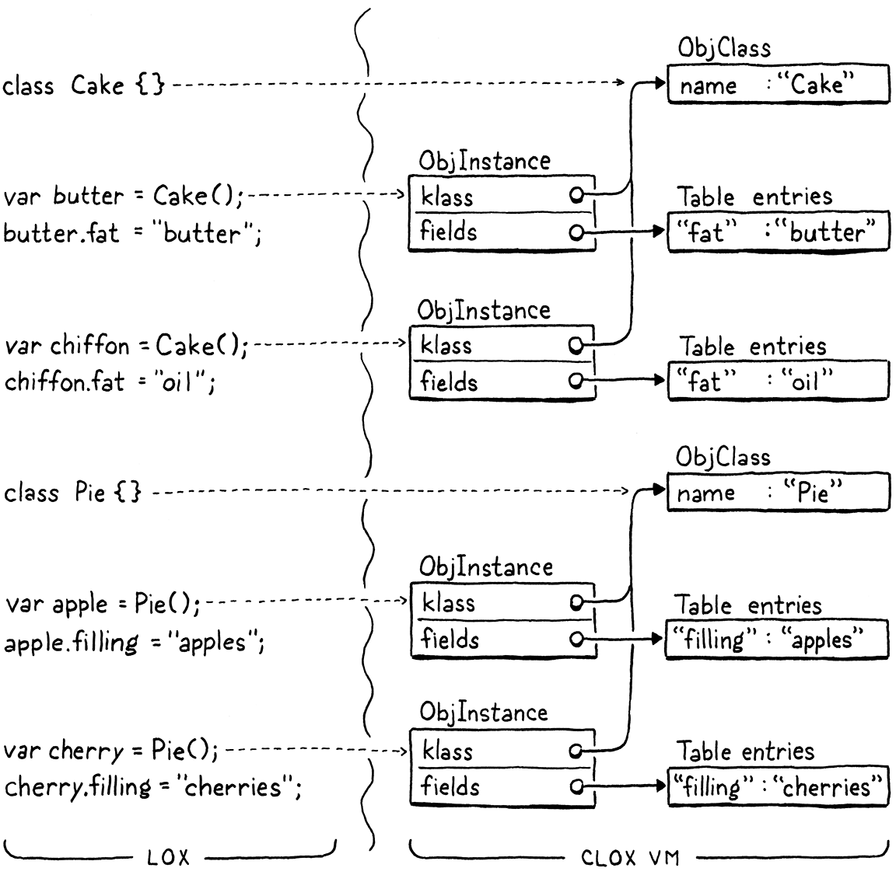
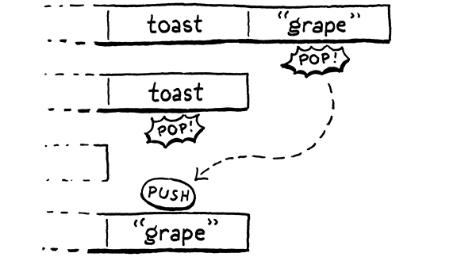

#### Chapter 27.

# Classes and Instances

> Caring too much for objects can destroy you. Only—if you care for a thing enough, it takes on a life of its own, doesn’t it? And isn’t the whole point of things—beautiful things—that they connect you to some larger beauty?
>
> Donna Tartt, *The Goldfinch*

The last area left to implement in clox is object-oriented programming. OOP is a bundle of intertwined features: classes, instances, fields, methods, initializers, and inheritance. Using relatively high-level Java, we packed all that into two chapters. Now that we’re coding in C, which feels like building a model of the Eiffel tower out of toothpicks, we’ll devote three chapters to covering the same territory. This makes for a leisurely stroll through the implementation. After strenuous chapters like closures and the garbage collector, you have earned a rest. In fact, the book should be easy from here on out.

People who have strong opinions about object-oriented programming—read “everyone”—tend to assume OOP means some very specific list of language features, but really there’s a whole space to explore, and each language has its own ingredients and recipes.

Self has objects but no classes. CLOS has methods but doesn’t attach them to specific classes. C++ initially had no runtime polymorphism—no virtual methods. Python has multiple inheritance, but Java does not. Ruby attaches methods to classes, but you can also define methods on a single object.

In this chapter, we cover the first three features: classes, instances, and fields. This is the stateful side of object orientation. Then in the next two chapters, we will hang behavior and code reuse off of those objects.

## 27.1 Class Objects

In a class-based object-oriented language, everything begins with classes. They define what sorts of objects exist in the program and are the factories used to produce new instances. Going bottom-up, we’ll start with their runtime representation and then hook that into the language.

By this point, we’re well-acquainted with the process of adding a new object type to the VM. We start with a struct.

```
} ObjClosure;
```

```
typedef struct {
  Obj obj;
  ObjString* name;
} ObjClass;
```

```
ObjClosure* newClosure(ObjFunction* function);
```

*object.h*, add after struct *ObjClosure*

After the Obj header, we store the class’s name. This isn’t strictly needed for the user’s program, but it lets us show the name at runtime for things like stack traces.

The new type needs a corresponding case in the ObjType enum.

```
typedef enum {
```

```
  OBJ_CLASS,
```

```
  OBJ_CLOSURE,
```

*object.h*, in enum *ObjType*

And that type gets a corresponding pair of macros. First, for testing an object’s type:

```
#define OBJ_TYPE(value)        (AS_OBJ(value)->type)
```

```
#define IS_CLASS(value)        isObjType(value, OBJ_CLASS)
```

```
#define IS_CLOSURE(value)      isObjType(value, OBJ_CLOSURE)
```

*object.h*

And then for casting a Value to an ObjClass pointer:

```
#define IS_STRING(value)       isObjType(value, OBJ_STRING)
```

```
#define AS_CLASS(value)        ((ObjClass*)AS_OBJ(value))
```

```
#define AS_CLOSURE(value)      ((ObjClosure*)AS_OBJ(value))
```

*object.h*

The VM creates new class objects using this function:

```
} ObjClass;
```

```
ObjClass* newClass(ObjString* name);
```

```
ObjClosure* newClosure(ObjFunction* function);
```

*object.h*, add after struct *ObjClass*

The implementation lives over here:

```
ObjClass* newClass(ObjString* name) {
  ObjClass* klass = ALLOCATE_OBJ(ObjClass, OBJ_CLASS);
  klass->name = name;
  return klass;
}
```

*object.c*, add after *allocateObject*()

Pretty much all boilerplate. It takes in the class’s name as a string and stores it. Every time the user declares a new class, the VM will create a new one of these ObjClass structs to represent it.


I named the variable “klass” not just to give the VM a zany preschool “Kidz Korner” feel. It makes it easier to get clox compiling as C++ where “class” is a reserved word.

When the VM no longer needs a class, it frees it like so:

```
  switch (object->type) {
```

```
    case OBJ_CLASS: {
      FREE(ObjClass, object);
      break;
    }
```

```
    case OBJ_CLOSURE: {
```

*memory.c*, in *freeObject*()

The braces here are pointless now, but will be useful in the next chapter when we add some more code to the switch case.

We have a memory manager now, so we also need to support tracing through class objects.

```
  switch (object->type) {
```

```
    case OBJ_CLASS: {
      ObjClass* klass = (ObjClass*)object;
      markObject((Obj*)klass->name);
      break;
    }
```

```
    case OBJ_CLOSURE: {
```

*memory.c*, in *blackenObject*()

When the GC reaches a class object, it marks the class’s name to keep that string alive too.

The last operation the VM can perform on a class is printing it.

```
  switch (OBJ_TYPE(value)) {
```

```
    case OBJ_CLASS:
      printf("%s", AS_CLASS(value)->name->chars);
      break;
```

```
    case OBJ_CLOSURE:
```

*object.c*, in *printObject*()

A class simply says its own name.

## 27.2 Class Declarations

Runtime representation in hand, we are ready to add support for classes to the language. Next, we move into the parser.

```
static void declaration() {
```

```
  if (match(TOKEN_CLASS)) {
    classDeclaration();
  } else if (match(TOKEN_FUN)) {
```

```
    funDeclaration();
```

*compiler.c*, in *declaration*(), replace 1 line

Class declarations are statements, and the parser recognizes one by the leading `class` keyword. The rest of the compilation happens over here:

```
static void classDeclaration() {
  consume(TOKEN_IDENTIFIER, "Expect class name.");
  uint8_t nameConstant = identifierConstant(&parser.previous);
  declareVariable();

  emitBytes(OP_CLASS, nameConstant);
  defineVariable(nameConstant);

  consume(TOKEN_LEFT_BRACE, "Expect '{' before class body.");
  consume(TOKEN_RIGHT_BRACE, "Expect '}' after class body.");
}
```

*compiler.c*, add after *function*()

Immediately after the `class` keyword is the class’s name. We take that identifier and add it to the surrounding function’s constant table as a string. As you just saw, printing a class shows its name, so the compiler needs to stuff the name string somewhere that the runtime can find. The constant table is the way to do that.

The class’s name is also used to bind the class object to a variable of the same name. So we declare a variable with that identifier right after consuming its token.

We could have made class declarations be *expressions* instead of statements—they are essentially a literal that produces a value after all. Then users would have to explicitly bind the class to a variable themselves like:

```
var Pie = class {}
```

Sort of like lambda functions but for classes. But since we generally want classes to be named anyway, it makes sense to treat them as declarations.

Next, we emit a new instruction to actually create the class object at runtime. That instruction takes the constant table index of the class’s name as an operand.

After that, but before compiling the body of the class, we define the variable for the class’s name. *Declaring* the variable adds it to the scope, but recall from a previous chapter that we can’t *use* the variable until it’s *defined*. For classes, we define the variable before the body. That way, users can refer to the containing class inside the bodies of its own methods. That’s useful for things like factory methods that produce new instances of the class.

Finally, we compile the body. We don’t have methods yet, so right now it’s simply an empty pair of braces. Lox doesn’t require fields to be declared in the class, so we’re done with the body—and the parser—for now.

The compiler is emitting a new instruction, so let’s define that.

```
  OP_RETURN,
```

```
  OP_CLASS,
```

```
} OpCode;
```

*chunk.h*, in enum *OpCode*

And add it to the disassembler:

```
    case OP_RETURN:
      return simpleInstruction("OP_RETURN", offset);
```

```
    case OP_CLASS:
      return constantInstruction("OP_CLASS", chunk, offset);
```

```
    default:
```

*debug.c*, in *disassembleInstruction*()

For such a large-seeming feature, the interpreter support is minimal.

```
        break;
      }
```

```
      case OP_CLASS:
        push(OBJ_VAL(newClass(READ_STRING())));
        break;
```

```
    }
```

*vm.c*, in *run*()

We load the string for the class’s name from the constant table and pass that to `newClass()`. That creates a new class object with the given name. We push that onto the stack and we’re good. If the class is bound to a global variable, then the compiler’s call to `defineVariable()` will emit code to store that object from the stack into the global variable table. Otherwise, it’s right where it needs to be on the stack for a new local variable.

“Local” classes—classes declared inside the body of a function or block, are an unusual concept. Many languages don’t allow them at all. But since Lox is a dynamically typed scripting language, it treats the top level of a program and the bodies of functions and blocks uniformly. Classes are just another kind of declaration, and since you can declare variables and functions inside blocks, you can declare classes in there too.

There you have it, our VM supports classes now. You can run this:

```
class Brioche {}
print Brioche;
```

Unfortunately, printing is about *all* you can do with classes, so next is making them more useful.

## 27.3 Instances of Classes

Classes serve two main purposes in a language:

- **They are how you create new instances.** Sometimes this involves a `new` keyword, other times it’s a method call on the class object, but you usually mention the class by name *somehow* to get a new instance.

- **They contain methods.** These define how all instances of the class behave.

We won’t get to methods until the next chapter, so for now we will only worry about the first part. Before classes can create instances, we need a representation for them.

```
} ObjClass;
```

```
typedef struct {
  Obj obj;
  ObjClass* klass;
  Table fields;
} ObjInstance;
```

```
ObjClass* newClass(ObjString* name);
```

*object.h*, add after struct *ObjClass*

Instances know their class—each instance has a pointer to the class that it is an instance of. We won’t use this much in this chapter, but it will become critical when we add methods.

More important to this chapter is how instances store their state. Lox lets users freely add fields to an instance at runtime. This means we need a storage mechanism that can grow. We could use a dynamic array, but we also want to look up fields by name as quickly as possible. There’s a data structure that’s just perfect for quickly accessing a set of values by name and—even more conveniently—we’ve already implemented it. Each instance stores its fields using a hash table.

Being able to freely add fields to an object at runtime is a big practical difference between most dynamic and static languages. Statically typed languages usually require fields to be explicitly declared. This way, the compiler knows exactly what fields each instance has. It can use that to determine the precise amount of memory needed for each instance and the offsets in that memory where each field can be found.

In Lox and other dynamic languages, accessing a field is usually a hash table lookup. Constant time, but still pretty heavyweight. In a language like C++, accessing a field is as fast as offsetting a pointer by an integer constant.

We only need to add an include, and we’ve got it.

```
#include "chunk.h"
```

```
#include "table.h"
```

```
#include "value.h"
```

*object.h*

This new struct gets a new object type.

```
  OBJ_FUNCTION,
```

```
  OBJ_INSTANCE,
```

```
  OBJ_NATIVE,
```

*object.h*, in enum *ObjType*

I want to slow down a bit here because the Lox *language’s* notion of “type” and the VM *implementation’s* notion of “type” brush against each other in ways that can be confusing. Inside the C code that makes clox, there are a number of different types of Obj—ObjString, ObjClosure, etc. Each has its own internal representation and semantics.

In the Lox *language*, users can define their own classes—say Cake and Pie—and then create instances of those classes. From the user’s perspective, an instance of Cake is a different type of object than an instance of Pie. But, from the VM’s perspective, every class the user defines is simply another value of type ObjClass. Likewise, each instance in the user’s program, no matter what class it is an instance of, is an ObjInstance. That one VM object type covers instances of all classes. The two worlds map to each other something like this:



Got it? OK, back to the implementation. We also get our usual macros.

```
#define IS_FUNCTION(value)     isObjType(value, OBJ_FUNCTION)
```

```
#define IS_INSTANCE(value)     isObjType(value, OBJ_INSTANCE)
```

```
#define IS_NATIVE(value)       isObjType(value, OBJ_NATIVE)
```

*object.h*

And:

```
#define AS_FUNCTION(value)     ((ObjFunction*)AS_OBJ(value))
```

```
#define AS_INSTANCE(value)     ((ObjInstance*)AS_OBJ(value))
```

```
#define AS_NATIVE(value) \
```

*object.h*

Since fields are added after the instance is created, the “constructor” function only needs to know the class.

```
ObjFunction* newFunction();
```

```
ObjInstance* newInstance(ObjClass* klass);
```

```
ObjNative* newNative(NativeFn function);
```

*object.h*, add after *newFunction*()

We implement that function here:

```
ObjInstance* newInstance(ObjClass* klass) {
  ObjInstance* instance = ALLOCATE_OBJ(ObjInstance, OBJ_INSTANCE);
  instance->klass = klass;
  initTable(&instance->fields);
  return instance;
}
```

*object.c*, add after *newFunction*()

We store a reference to the instance’s class. Then we initialize the field table to an empty hash table. A new baby object is born!

At the sadder end of the instance’s lifespan, it gets freed.

```
      FREE(ObjFunction, object);
      break;
    }
```

```
    case OBJ_INSTANCE: {
      ObjInstance* instance = (ObjInstance*)object;
      freeTable(&instance->fields);
      FREE(ObjInstance, object);
      break;
    }
```

```
    case OBJ_NATIVE:
```

*memory.c*, in *freeObject*()

The instance owns its field table so when freeing the instance, we also free the table. We don’t explicitly free the entries *in* the table, because there may be other references to those objects. The garbage collector will take care of those for us. Here we free only the entry array of the table itself.

Speaking of the garbage collector, it needs support for tracing through instances.

```
      markArray(&function->chunk.constants);
      break;
    }
```

```
    case OBJ_INSTANCE: {
      ObjInstance* instance = (ObjInstance*)object;
      markObject((Obj*)instance->klass);
      markTable(&instance->fields);
      break;
    }
```

```
    case OBJ_UPVALUE:
```

*memory.c*, in *blackenObject*()

If the instance is alive, we need to keep its class around. Also, we need to keep every object referenced by the instance’s fields. Most live objects that are not roots are reachable because some instance refers to the object in a field. Fortunately, we already have a nice `markTable()` function to make tracing them easy.

Less critical but still important is printing.

```
      break;
```

```
    case OBJ_INSTANCE:
      printf("%s instance",
             AS_INSTANCE(value)->klass->name->chars);
      break;
```

```
    case OBJ_NATIVE:
```

*object.c*, in *printObject*()

An instance prints its name followed by “instance”. (The “instance” part is mainly so that classes and instances don’t print the same.)

Most object-oriented languages let a class define some sort of `toString()` method that lets the class specify how its instances are converted to a string and printed. If Lox was less of a toy language, I would want to support that too.

The real fun happens over in the interpreter. Lox has no special `new` keyword. The way to create an instance of a class is to invoke the class itself as if it were a function. The runtime already supports function calls, and it checks the type of object being called to make sure the user doesn’t try to invoke a number or other invalid type.

We extend that runtime checking with a new case.

```
    switch (OBJ_TYPE(callee)) {
```

```
      case OBJ_CLASS: {
        ObjClass* klass = AS_CLASS(callee);
        vm.stackTop[-argCount - 1] = OBJ_VAL(newInstance(klass));
        return true;
      }
```

```
      case OBJ_CLOSURE:
```

*vm.c*, in *callValue*()

If the value being called—the object that results when evaluating the expression to the left of the opening parenthesis—is a class, then we treat it as a constructor call. We create a new instance of the called class and store the result on the stack.

We ignore any arguments passed to the call for now. We’ll revisit this code in the next chapter when we add support for initializers.

We’re one step farther. Now we can define classes and create instances of them.

```
class Brioche {}
print Brioche();
```

Note the parentheses after `Brioche` on the second line now. This prints “Brioche instance”.

## 27.4 Get and Set Expressions

Our object representation for instances can already store state, so all that remains is exposing that functionality to the user. Fields are accessed and modified using get and set expressions. Not one to break with tradition, Lox uses the classic “dot” syntax:

```
eclair.filling = "pastry creme";
print eclair.filling;
```

The period—full stop for my English friends—works sort of like an infix operator. There is an expression to the left that is evaluated first and produces an instance. After that is the `.` followed by a field name. Since there is a preceding operand, we hook this into the parse table as an infix expression.

I say “sort of” because the right-hand side after the `.` is not an expression, but a single identifier whose semantics are handled by the get or set expression itself. It’s really closer to a postfix expression.

```
  [TOKEN_COMMA]         = {NULL,     NULL,   PREC_NONE},
```

```
  [TOKEN_DOT]           = {NULL,     dot,    PREC_CALL},
```

```
  [TOKEN_MINUS]         = {unary,    binary, PREC_TERM},
```

*compiler.c*, replace 1 line

As in other languages, the `.` operator binds tightly, with precedence as high as the parentheses in a function call. After the parser consumes the dot token, it dispatches to a new parse function.

```
static void dot(bool canAssign) {
  consume(TOKEN_IDENTIFIER, "Expect property name after '.'.");
  uint8_t name = identifierConstant(&parser.previous);

  if (canAssign && match(TOKEN_EQUAL)) {
    expression();
    emitBytes(OP_SET_PROPERTY, name);
  } else {
    emitBytes(OP_GET_PROPERTY, name);
  }
}
```

*compiler.c*, add after *call*()

The parser expects to find a property name immediately after the dot. We load that token’s lexeme into the constant table as a string so that the name is available at runtime.

The compiler uses “property” instead of “field” here because, remember, Lox also lets you use dot syntax to access a method without calling it. “Property” is the general term we use to refer to any named entity you can access on an instance. Fields are the subset of properties that are backed by the instance’s state.

We have two new expression forms—getters and setters—that this one function handles. If we see an equals sign after the field name, it must be a set expression that is assigning to a field. But we don’t *always* allow an equals sign after the field to be compiled. Consider:

```
a + b.c = 3
```

This is syntactically invalid according to Lox’s grammar, which means our Lox implementation is obligated to detect and report the error. If `dot()` silently parsed the `= 3` part, we would incorrectly interpret the code as if the user had written:

```
a + (b.c = 3)
```

The problem is that the `=` side of a set expression has much lower precedence than the `.` part. The parser may call `dot()` in a context that is too high precedence to permit a setter to appear. To avoid incorrectly allowing that, we parse and compile the equals part only when `canAssign` is true. If an equals token appears when `canAssign` is false, `dot()` leaves it alone and returns. In that case, the compiler will eventually unwind up to `parsePrecedence()`, which stops at the unexpected `=` still sitting as the next token and reports an error.

If we find an `=` in a context where it *is* allowed, then we compile the expression that follows. After that, we emit a new `OP_SET_PROPERTY` instruction. That takes a single operand for the index of the property name in the constant table. If we didn’t compile a set expression, we assume it’s a getter and emit an `OP_GET_PROPERTY` instruction, which also takes an operand for the property name.

You can’t *set* a non-field property, so I suppose that instruction could have been `OP_SET_FIELD`, but I thought it looked nicer to be consistent with the get instruction.

Now is a good time to define these two new instructions.

```
  OP_SET_UPVALUE,
```

```
  OP_GET_PROPERTY,
  OP_SET_PROPERTY,
```

```
  OP_EQUAL,
```

*chunk.h*, in enum *OpCode*

And add support for disassembling them:

```
      return byteInstruction("OP_SET_UPVALUE", chunk, offset);
```

```
    case OP_GET_PROPERTY:
      return constantInstruction("OP_GET_PROPERTY", chunk, offset);
    case OP_SET_PROPERTY:
      return constantInstruction("OP_SET_PROPERTY", chunk, offset);
```

```
    case OP_EQUAL:
```

*debug.c*, in *disassembleInstruction*()

### 27.4.1 Interpreting getter and setter expressions

Sliding over to the runtime, we’ll start with get expressions since those are a little simpler.

```
      }
```

```
      case OP_GET_PROPERTY: {
        ObjInstance* instance = AS_INSTANCE(peek(0));
        ObjString* name = READ_STRING();

        Value value;
        if (tableGet(&instance->fields, name, &value)) {
          pop(); // Instance.
          push(value);
          break;
        }
      }
```

```
      case OP_EQUAL: {
```

*vm.c*, in *run*()

When the interpreter reaches this instruction, the expression to the left of the dot has already been executed and the resulting instance is on top of the stack. We read the field name from the constant pool and look it up in the instance’s field table. If the hash table contains an entry with that name, we pop the instance and push the entry’s value as the result.

Of course, the field might not exist. In Lox, we’ve defined that to be a runtime error. So we add a check for that and abort if it happens.

```
          push(value);
          break;
        }
```

```
        runtimeError("Undefined property '%s'.", name->chars);
        return INTERPRET_RUNTIME_ERROR;
```

```
      }
      case OP_EQUAL: {
```

*vm.c*, in *run*()

There is another failure mode to handle which you’ve probably noticed. The above code assumes the expression to the left of the dot did evaluate to an ObjInstance. But there’s nothing preventing a user from writing this:

```
var obj = "not an instance";
print obj.field;
```

The user’s program is wrong, but the VM still has to handle it with some grace. Right now, it will misinterpret the bits of the ObjString as an ObjInstance and, I don’t know, catch on fire or something definitely not graceful.

In Lox, only instances are allowed to have fields. You can’t stuff a field onto a string or number. So we need to check that the value is an instance before accessing any fields on it.

Lox *could* support adding fields to values of other types. It’s our language and we can do what we want. But it’s likely a bad idea. It significantly complicates the implementation in ways that hurt performance—for example, string interning gets a lot harder.

Also, it raises gnarly semantic questions around the equality and identity of values. If I attach a field to the number `3`, does the result of `1 + 2` have that field as well? If so, how does the implementation track that? If not, are those two resulting “threes” still considered equal?

```
      case OP_GET_PROPERTY: {
```

```
        if (!IS_INSTANCE(peek(0))) {
          runtimeError("Only instances have properties.");
          return INTERPRET_RUNTIME_ERROR;
        }
```

```
        ObjInstance* instance = AS_INSTANCE(peek(0));
```

*vm.c*, in *run*()

If the value on the stack isn’t an instance, we report a runtime error and safely exit.

Of course, get expressions are not very useful when no instances have any fields. For that we need setters.

```
        return INTERPRET_RUNTIME_ERROR;
      }
```

```
      case OP_SET_PROPERTY: {
        ObjInstance* instance = AS_INSTANCE(peek(1));
        tableSet(&instance->fields, READ_STRING(), peek(0));
        Value value = pop();
        pop();
        push(value);
        break;
      }
```

```
      case OP_EQUAL: {
```

*vm.c*, in *run*()

This is a little more complex than `OP_GET_PROPERTY`. When this executes, the top of the stack has the instance whose field is being set and above that, the value to be stored. Like before, we read the instruction’s operand and find the field name string. Using that, we store the value on top of the stack into the instance’s field table.

After that is a little stack juggling. We pop the stored value off, then pop the instance, and finally push the value back on. In other words, we remove the *second* element from the stack while leaving the top alone. A setter is itself an expression whose result is the assigned value, so we need to leave that value on the stack. Here’s what I mean:

The stack operations go like this:



```
class Toast {}
var toast = Toast();
print toast.jam = "grape"; // Prints "grape".
```

Unlike when reading a field, we don’t need to worry about the hash table not containing the field. A setter implicitly creates the field if needed. We do need to handle the user incorrectly trying to store a field on a value that isn’t an instance.

```
      case OP_SET_PROPERTY: {
```

```
        if (!IS_INSTANCE(peek(1))) {
          runtimeError("Only instances have fields.");
          return INTERPRET_RUNTIME_ERROR;
        }
```

```
        ObjInstance* instance = AS_INSTANCE(peek(1));
```

*vm.c*, in *run*()

Exactly like with get expressions, we check the value’s type and report a runtime error if it’s invalid. And, with that, the stateful side of Lox’s support for object-oriented programming is in place. Give it a try:

```
class Pair {}

var pair = Pair();
pair.first = 1;
pair.second = 2;
print pair.first + pair.second; // 3.
```

This doesn’t really feel very *object*-oriented. It’s more like a strange, dynamically typed variant of C where objects are loose struct-like bags of data. Sort of a dynamic procedural language. But this is a big step in expressiveness. Our Lox implementation now lets users freely aggregate data into bigger units. In the next chapter, we will breathe life into those inert blobs.

## Challenges

1.  Trying to access a non-existent field on an object immediately aborts the entire VM. The user has no way to recover from this runtime error, nor is there any way to see if a field exists *before* trying to access it. It’s up to the user to ensure on their own that only valid fields are read.

    How do other dynamically typed languages handle missing fields? What do you think Lox should do? Implement your solution.

2.  Fields are accessed at runtime by their *string* name. But that name must always appear directly in the source code as an *identifier token*. A user program cannot imperatively build a string value and then use that as the name of a field. Do you think they should be able to? Devise a language feature that enables that and implement it.

3.  Conversely, Lox offers no way to *remove* a field from an instance. You can set a field’s value to `nil`, but the entry in the hash table is still there. How do other languages handle this? Choose and implement a strategy for Lox.

4.  Because fields are accessed by name at runtime, working with instance state is slow. It’s technically a constant-time operation—thanks, hash tables—but the constant factors are relatively large. This is a major component of why dynamic languages are slower than statically typed ones.

    How do sophisticated implementations of dynamically typed languages cope with and optimize this?