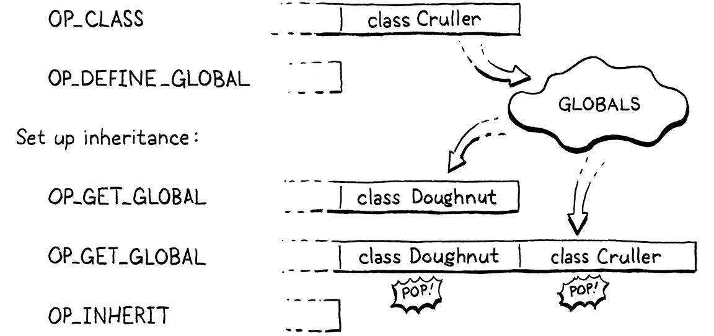
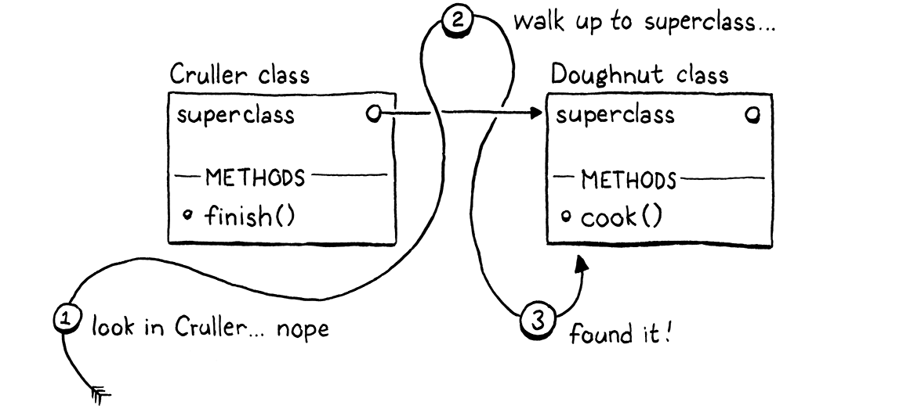
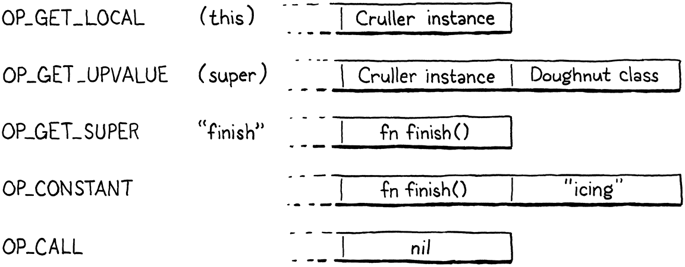
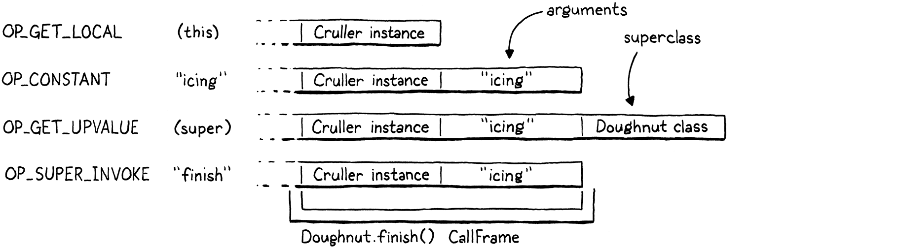

#### Chapter 29.

# Superclasses

> You can choose your friends but you sho’ can’t choose your family, an’ they’re still kin to you no matter whether you acknowledge ’em or not, and it makes you look right silly when you don’t.
>
> Harper Lee, *To Kill a Mockingbird*

This is the very last chapter where we add new functionality to our VM. We’ve packed almost the entire Lox language in there already. All that remains is inheriting methods and calling superclass methods. We have another chapter after this one, but it introduces no new behavior. It only makes existing stuff faster. Make it to the end of this one, and you’ll have a complete Lox implementation.

> That “only” should not imply that making stuff faster isn’t important! After all, the whole purpose of our entire second virtual machine is better performance over jlox. You could argue that *all* of the past fifteen chapters are “optimization”.

Some of the material in this chapter will remind you of jlox. The way we resolve super calls is pretty much the same, though viewed through clox’s more complex mechanism for storing state on the stack. But we have an entirely different, much faster, way of handling inherited method calls this time around.

## 29.1 Inheriting Methods

We’ll kick things off with method inheritance since it’s the simpler piece. To refresh your memory, Lox inheritance syntax looks like this:

```
class Doughnut {
  cook() {
    print "Dunk in the fryer.";
  }
}

class Cruller < Doughnut {
  finish() {
    print "Glaze with icing.";
  }
}
```

Here, the Cruller class inherits from Doughnut and thus, instances of Cruller inherit the `cook()` method. I don’t know why I’m belaboring this. You know how inheritance works. Let’s start compiling the new syntax.

```
  currentClass = &classCompiler;
```

```
  if (match(TOKEN_LESS)) {
    consume(TOKEN_IDENTIFIER, "Expect superclass name.");
    variable(false);
    namedVariable(className, false);
    emitByte(OP_INHERIT);
  }
```

```
  namedVariable(className, false);
```

*compiler.c*, in *classDeclaration*()

After we compile the class name, if the next token is a `<`, then we found a superclass clause. We consume the superclass’s identifier token, then call `variable()`. That function takes the previously consumed token, treats it as a variable reference, and emits code to load the variable’s value. In other words, it looks up the superclass by name and pushes it onto the stack.

After that, we call `namedVariable()` to load the subclass doing the inheriting onto the stack, followed by an `OP_INHERIT` instruction. That instruction wires up the superclass to the new subclass. In the last chapter, we defined an `OP_METHOD` instruction to mutate an existing class object by adding a method to its method table. This is similar—the `OP_INHERIT` instruction takes an existing class and applies the effect of inheritance to it.

In the previous example, when the compiler works through this bit of syntax:

```
class Cruller < Doughnut {
```

The result is this bytecode:



Before we implement the new `OP_INHERIT` instruction, we have an edge case to detect.

```
    variable(false);
```

```
    if (identifiersEqual(&className, &parser.previous)) {
      error("A class can't inherit from itself.");
    }
```

```
    namedVariable(className, false);
```

*compiler.c*, in *classDeclaration*()

A class cannot be its own superclass. Unless you have access to a deranged nuclear physicist and a very heavily modified DeLorean, you cannot inherit from yourself.

> Interestingly, with the way we implement method inheritance, I don’t think allowing cycles would actually cause any problems in clox. It wouldn’t do anything *useful*, but I don’t think it would cause a crash or infinite loop.

### 29.1.1 Executing inheritance

Now onto the new instruction.

```
  OP_CLASS,
```

```
  OP_INHERIT,
```

```
  OP_METHOD
```

*chunk.h*, in enum *OpCode*

There are no operands to worry about. The two values we need—superclass and subclass—are both found on the stack. That means disassembling is easy.

```
      return constantInstruction("OP_CLASS", chunk, offset);
```

```
    case OP_INHERIT:
      return simpleInstruction("OP_INHERIT", offset);
```

```
    case OP_METHOD:
```

*debug.c*, in *disassembleInstruction*()

The interpreter is where the action happens.

```
        break;
```

```
      case OP_INHERIT: {
        Value superclass = peek(1);
        ObjClass* subclass = AS_CLASS(peek(0));
        tableAddAll(&AS_CLASS(superclass)->methods,
                    &subclass->methods);
        pop(); // Subclass.
        break;
      }
```

```
      case OP_METHOD:
```

*vm.c*, in *run*()

From the top of the stack down, we have the subclass then the superclass. We grab both of those and then do the inherit-y bit. This is where clox takes a different path than jlox. In our first interpreter, each subclass stored a reference to its superclass. On method access, if we didn’t find the method in the subclass’s method table, we recursed through the inheritance chain looking at each ancestor’s method table until we found it.

For example, calling `cook()` on an instance of Cruller sends jlox on this journey:



That’s a lot of work to perform during method *invocation* time. It’s slow, and worse, the farther an inherited method is up the ancestor chain, the slower it gets. Not a great performance story.

The new approach is much faster. When the subclass is declared, we copy all of the inherited class’s methods down into the subclass’s own method table. Later, when *calling* a method, any method inherited from a superclass will be found right in the subclass’s own method table. There is no extra runtime work needed for inheritance at all. By the time the class is declared, the work is done. This means inherited method calls are exactly as fast as normal method calls—a single hash table lookup.


> Well, two hash table lookups, I guess. Because first we have to make sure a field on the instance doesn’t shadow the method.

I’ve sometimes heard this technique called “copy-down inheritance”. It’s simple and fast, but, like most optimizations, you get to use it only under certain constraints. It works in Lox because Lox classes are *closed*. Once a class declaration is finished executing, the set of methods for that class can never change.

In languages like Ruby, Python, and JavaScript, it’s possible to crack open an existing class and jam some new methods into it or even remove them. That would break our optimization because if those modifications happened to a superclass *after* the subclass declaration executed, the subclass would not pick up those changes. That breaks a user’s expectation that inheritance always reflects the current state of the superclass.

> As you can imagine, changing the set of methods a class defines imperatively at runtime can make it hard to reason about a program. It is a very powerful tool, but also a dangerous tool.
>
> Those who find this tool maybe a little *too* dangerous gave it the unbecoming name “monkey patching”, or the even less decorous “duck punching”.
>
> 

Fortunately for us (but not for users who like the feature, I guess), Lox doesn’t let you patch monkeys or punch ducks, so we can safely apply this optimization.

What about method overrides? Won’t copying the superclass’s methods into the subclass’s method table clash with the subclass’s own methods? Fortunately, no. We emit the `OP_INHERIT` after the `OP_CLASS` instruction that creates the subclass but before any method declarations and `OP_METHOD` instructions have been compiled. At the point that we copy the superclass’s methods down, the subclass’s method table is empty. Any methods the subclass overrides will overwrite those inherited entries in the table.

### 29.1.2 Invalid superclasses

Our implementation is simple and fast, which is just the way I like my VM code. But it’s not robust. Nothing prevents a user from inheriting from an object that isn’t a class at all:

```
var NotClass = "So not a class";
class OhNo < NotClass {}
```

Obviously, no self-respecting programmer would write that, but we have to guard against potential Lox users who have no self respect. A simple runtime check fixes that.

```
        Value superclass = peek(1);
```

```
        if (!IS_CLASS(superclass)) {
          runtimeError("Superclass must be a class.");
          return INTERPRET_RUNTIME_ERROR;
        }
```

```
        ObjClass* subclass = AS_CLASS(peek(0));
```

*vm.c*, in *run*()

If the value we loaded from the identifier in the superclass clause isn’t an ObjClass, we report a runtime error to let the user know what we think of them and their code.

## 29.2 Storing Superclasses

Did you notice that when we added method inheritance, we didn’t actually add any reference from a subclass to its superclass? After we copy the inherited methods over, we forget the superclass entirely. We don’t need to keep a handle on the superclass, so we don’t.

That won’t be sufficient to support super calls. Since a subclass may override the superclass method, we need to be able to get our hands on superclass method tables. Before we get to that mechanism, I want to refresh your memory on how super calls are statically resolved.

> “May” might not be a strong enough word. Presumably the method *has* been overridden. Otherwise, why are you bothering to use `super` instead of just calling it directly?

Back in the halcyon days of jlox, I showed you this tricky example to explain the way super calls are dispatched:

```
class A {
  method() {
    print "A method";
  }
}

class B < A {
  method() {
    print "B method";
  }

  test() {
    super.method();
  }
}

class C < B {}

C().test();
```

Inside the body of the `test()` method, `this` is an instance of C. If super calls were resolved relative to the superclass of the *receiver*, then we would look in C’s superclass, B. But super calls are resolved relative to the superclass of the *surrounding class where the super call occurs*. In this case, we are in B’s `test()` method, so the superclass is A, and the program should print “A method”.

This means that super calls are not resolved dynamically based on the runtime instance. The superclass used to look up the method is a static—practically lexical—property of where the call occurs. When we added inheritance to jlox, we took advantage of that static aspect by storing the superclass in the same Environment structure we used for all lexical scopes. Almost as if the interpreter saw the above program like this:

```
class A {
  method() {
    print "A method";
  }
}

var Bs_super = A;
class B < A {
  method() {
    print "B method";
  }

  test() {
    runtimeSuperCall(Bs_super, "method");
  }
}

var Cs_super = B;
class C < B {}

C().test();
```

Each subclass has a hidden variable storing a reference to its superclass. Whenever we need to perform a super call, we access the superclass from that variable and tell the runtime to start looking for methods there.

We’ll take the same path with clox. The difference is that instead of jlox’s heap-allocated Environment class, we have the bytecode VM’s value stack and upvalue system. The machinery is a little different, but the overall effect is the same.

### 29.2.1 A superclass local variable

Our compiler already emits code to load the superclass onto the stack. Instead of leaving that slot as a temporary, we create a new scope and make it a local variable.

```
    }
```

```
    beginScope();
    addLocal(syntheticToken("super"));
    defineVariable(0);
```

```
    namedVariable(className, false);
    emitByte(OP_INHERIT);
```

*compiler.c*, in *classDeclaration*()

Creating a new lexical scope ensures that if we declare two classes in the same scope, each has a different local slot to store its superclass. Since we always name this variable “super”, if we didn’t make a scope for each subclass, the variables would collide.

We name the variable “super” for the same reason we use “this” as the name of the hidden local variable that `this` expressions resolve to: “super” is a reserved word, which guarantees the compiler’s hidden variable won’t collide with a user-defined one.

The difference is that when compiling `this` expressions, we conveniently have a token sitting around whose lexeme is “this”. We aren’t so lucky here. Instead, we add a little helper function to create a synthetic token for the given constant string.

```
static Token syntheticToken(const char* text) {
  Token token;
  token.start = text;
  token.length = (int)strlen(text);
  return token;
}
```

*compiler.c*, add after *variable*()

> I say “constant string” because tokens don’t do any memory management of their lexeme. If we tried to use a heap-allocated string for this, we’d end up leaking memory because it never gets freed. But the memory for C string literals lives in the executable’s constant data section and never needs to be freed, so we’re fine.

Since we opened a local scope for the superclass variable, we need to close it.

```
  emitByte(OP_POP);
```

```
  if (classCompiler.hasSuperclass) {
    endScope();
  }
```

```
  currentClass = currentClass->enclosing;
```

*compiler.c*, in *classDeclaration*()

We pop the scope and discard the “super” variable after compiling the class body and its methods. That way, the variable is accessible in all of the methods of the subclass. It’s a somewhat pointless optimization, but we create the scope only if there *is* a superclass clause. Thus we need to close the scope only if there is one.

To track that, we could declare a little local variable in `classDeclaration()`. But soon, other functions in the compiler will need to know whether the surrounding class is a subclass or not. So we may as well give our future selves a hand and store this fact as a field in the ClassCompiler now.

```
typedef struct ClassCompiler {
  struct ClassCompiler* enclosing;
```

```
  bool hasSuperclass;
```

```
} ClassCompiler;
```

*compiler.c*, in struct *ClassCompiler*

When we first initialize a ClassCompiler, we assume it is not a subclass.

```
  ClassCompiler classCompiler;
```

```
  classCompiler.hasSuperclass = false;
```

```
  classCompiler.enclosing = currentClass;
```

*compiler.c*, in *classDeclaration*()

Then, if we see a superclass clause, we know we are compiling a subclass.

```
    emitByte(OP_INHERIT);
```

```
    classCompiler.hasSuperclass = true;
```

```
  }
```

*compiler.c*, in *classDeclaration*()

This machinery gives us a mechanism at runtime to access the superclass object of the surrounding subclass from within any of the subclass’s methods—simply emit code to load the variable named “super”. That variable is a local outside of the method body, but our existing upvalue support enables the VM to capture that local inside the body of the method or even in functions nested inside that method.

## 29.3 Super Calls

With that runtime support in place, we are ready to implement super calls. As usual, we go front to back, starting with the new syntax. A super call begins, naturally enough, with the `super` keyword.

> This is it, friend. The very last entry you’ll add to the parsing table.

```
  [TOKEN_RETURN]        = {NULL,     NULL,   PREC_NONE},
```

```
  [TOKEN_SUPER]         = {super_,   NULL,   PREC_NONE},
```

```
  [TOKEN_THIS]          = {this_,    NULL,   PREC_NONE},
```

*compiler.c*, replace 1 line

When the expression parser lands on a `super` token, control jumps to a new parsing function which starts off like so:

```
static void super_(bool canAssign) {
  consume(TOKEN_DOT, "Expect '.' after 'super'.");
  consume(TOKEN_IDENTIFIER, "Expect superclass method name.");
  uint8_t name = identifierConstant(&parser.previous);
}
```

*compiler.c*, add after *syntheticToken*()

This is pretty different from how we compiled `this` expressions. Unlike `this`, a `super` token is not a standalone expression. Instead, the dot and method name following it are inseparable parts of the syntax. However, the parenthesized argument list is separate. As with normal method access, Lox supports getting a reference to a superclass method as a closure without invoking it:

> Hypothetical question: If a bare `super` token *was* an expression, what kind of object would it evaluate to?

```
class A {
  method() {
    print "A";
  }
}

class B < A {
  method() {
    var closure = super.method;
    closure(); // Prints "A".
  }
}
```

In other words, Lox doesn’t really have super *call* expressions, it has super *access* expressions, which you can choose to immediately invoke if you want. So when the compiler hits a `super` token, we consume the subsequent `.` token and then look for a method name. Methods are looked up dynamically, so we use `identifierConstant()` to take the lexeme of the method name token and store it in the constant table just like we do for property access expressions.

Here is what the compiler does after consuming those tokens:

```
  uint8_t name = identifierConstant(&parser.previous);
```

```
  namedVariable(syntheticToken("this"), false);
  namedVariable(syntheticToken("super"), false);
  emitBytes(OP_GET_SUPER, name);
```

```
}
```

*compiler.c*, in *super\_*()

In order to access a *superclass method* on *the current instance*, the runtime needs both the receiver *and* the superclass of the surrounding method’s class. The first `namedVariable()` call generates code to look up the current receiver stored in the hidden variable “this” and push it onto the stack. The second `namedVariable()` call emits code to look up the superclass from its “super” variable and push that on top.

Finally, we emit a new `OP_GET_SUPER` instruction with an operand for the constant table index of the method name. That’s a lot to hold in your head. To make it tangible, consider this example program:

```
class Doughnut {
  cook() {
    print "Dunk in the fryer.";
    this.finish("sprinkles");
  }

  finish(ingredient) {
    print "Finish with " + ingredient;
  }
}

class Cruller < Doughnut {
  finish(ingredient) {
    // No sprinkles, always icing.
    super.finish("icing");
  }
}
```

The bytecode emitted for the `super.finish("icing")` expression looks and works like this:



The first three instructions give the runtime access to the three pieces of information it needs to perform the super access:

1.  The first instruction loads **the instance** onto the stack.

2.  The second instruction loads **the superclass where the method is resolved**.

3.  Then the new `OP_GET_SUPER` instuction encodes **the name of the method to access** as an operand.

The remaining instructions are the normal bytecode for evaluating an argument list and calling a function.

We’re almost ready to implement the new `OP_GET_SUPER` instruction in the interpreter. But before we do, the compiler has some errors it is responsible for reporting.

```
static void super_(bool canAssign) {
```

```
  if (currentClass == NULL) {
    error("Can't use 'super' outside of a class.");
  } else if (!currentClass->hasSuperclass) {
    error("Can't use 'super' in a class with no superclass.");
  }
```

```
  consume(TOKEN_DOT, "Expect '.' after 'super'.");
```

*compiler.c*, in *super\_*()

A super call is meaningful only inside the body of a method (or in a function nested inside a method), and only inside the method of a class that has a superclass. We detect both of these cases using the value of `currentClass`. If that’s `NULL` or points to a class with no superclass, we report those errors.

### 29.3.1 Executing super accesses

Assuming the user didn’t put a `super` expression where it’s not allowed, their code passes from the compiler over to the runtime. We’ve got ourselves a new instruction.

```
  OP_SET_PROPERTY,
```

```
  OP_GET_SUPER,
```

```
  OP_EQUAL,
```

*chunk.h*, in enum *OpCode*

We disassemble it like other opcodes that take a constant table index operand.

```
      return constantInstruction("OP_SET_PROPERTY", chunk, offset);
```

```
    case OP_GET_SUPER:
      return constantInstruction("OP_GET_SUPER", chunk, offset);
```

```
    case OP_EQUAL:
```

*debug.c*, in *disassembleInstruction*()

You might anticipate something harder, but interpreting the new instruction is similar to executing a normal property access.

```
      }
```

```
      case OP_GET_SUPER: {
        ObjString* name = READ_STRING();
        ObjClass* superclass = AS_CLASS(pop());

        if (!bindMethod(superclass, name)) {
          return INTERPRET_RUNTIME_ERROR;
        }
        break;
      }
```

```
      case OP_EQUAL: {
```

*vm.c*, in *run*()

As with properties, we read the method name from the constant table. Then we pass that to `bindMethod()` which looks up the method in the given class’s method table and creates an ObjBoundMethod to bundle the resulting closure to the current instance.

The key difference is *which* class we pass to `bindMethod()`. With a normal property access, we use the ObjInstances’s own class, which gives us the dynamic dispatch we want. For a super call, we don’t use the instance’s class. Instead, we use the statically resolved superclass of the containing class, which the compiler has conveniently ensured is sitting on top of the stack waiting for us.

We pop that superclass and pass it to `bindMethod()`, which correctly skips over any overriding methods in any of the subclasses between that superclass and the instance’s own class. It also correctly includes any methods inherited by the superclass from any of *its* superclasses.

The rest of the behavior is the same. Popping the superclass leaves the instance at the top of the stack. When `bindMethod()` succeeds, it pops the instance and pushes the new bound method. Otherwise, it reports a runtime error and returns `false`. In that case, we abort the interpreter.

> Another difference compared to `OP_GET_PROPERTY` is that we don’t try to look for a shadowing field first. Fields are not inherited, so `super` expressions always resolve to methods.
>
> If Lox were a prototype-based language that used *delegation* instead of *inheritance*, then instead of one *class* inheriting from another *class*, instances would inherit from (“delegate to”) other instances. In that case, fields *could* be inherited, and we would need to check for them here.

### 29.3.2 Faster super calls

We have superclass method accesses working now. And since the returned object is an ObjBoundMethod that you can then invoke, we’ve got super *calls* working too. Just like last chapter, we’ve reached a point where our VM has the complete, correct semantics.

But, also like last chapter, it’s pretty slow. Again, we’re heap allocating an ObjBoundMethod for each super call even though most of the time the very next instruction is an `OP_CALL` that immediately unpacks that bound method, invokes it, and then discards it. In fact, this is even more likely to be true for super calls than for regular method calls. At least with method calls there is a chance that the user is actually invoking a function stored in a field. With super calls, you’re *always* looking up a method. The only question is whether you invoke it immediately or not.

The compiler can certainly answer that question for itself if it sees a left parenthesis after the superclass method name, so we’ll go ahead and perform the same optimization we did for method calls. Take out the two lines of code that load the superclass and emit `OP_GET_SUPER`, and replace them with this:

```
  namedVariable(syntheticToken("this"), false);
```

```
  if (match(TOKEN_LEFT_PAREN)) {
    uint8_t argCount = argumentList();
    namedVariable(syntheticToken("super"), false);
    emitBytes(OP_SUPER_INVOKE, name);
    emitByte(argCount);
  } else {
    namedVariable(syntheticToken("super"), false);
    emitBytes(OP_GET_SUPER, name);
  }
```

```
}
```

*compiler.c*, in *super\_*(), replace 2 lines

Now before we emit anything, we look for a parenthesized argument list. If we find one, we compile that. Then we load the superclass. After that, we emit a new `OP_SUPER_INVOKE` instruction. This superinstruction combines the behavior of `OP_GET_SUPER` and `OP_CALL`, so it takes two operands: the constant table index of the method name to look up and the number of arguments to pass to it.

> This is a particularly *super* superinstruction, if you get what I’m saying. I . . . I’m sorry for this terrible joke.

Otherwise, if we don’t find a `(`, we continue to compile the expression as a super access like we did before and emit an `OP_GET_SUPER`.

Drifting down the compilation pipeline, our first stop is a new instruction.

```
  OP_INVOKE,
```

```
  OP_SUPER_INVOKE,
```

```
  OP_CLOSURE,
```

*chunk.h*, in enum *OpCode*

And just past that, its disassembler support.

```
      return invokeInstruction("OP_INVOKE", chunk, offset);
```

```
    case OP_SUPER_INVOKE:
      return invokeInstruction("OP_SUPER_INVOKE", chunk, offset);
```

```
    case OP_CLOSURE: {
```

*debug.c*, in *disassembleInstruction*()

A super invocation instruction has the same set of operands as `OP_INVOKE`, so we reuse the same helper to disassemble it. Finally, the pipeline dumps us into the interpreter.

```
        break;
      }
```

```
      case OP_SUPER_INVOKE: {
        ObjString* method = READ_STRING();
        int argCount = READ_BYTE();
        ObjClass* superclass = AS_CLASS(pop());
        if (!invokeFromClass(superclass, method, argCount)) {
          return INTERPRET_RUNTIME_ERROR;
        }
        frame = &vm.frames[vm.frameCount - 1];
        break;
      }
```

```
      case OP_CLOSURE: {
```

*vm.c*, in *run*()

This handful of code is basically our implementation of `OP_INVOKE` mixed together with a dash of `OP_GET_SUPER`. There are some differences in how the stack is organized, though. With an unoptimized super call, the superclass is popped and replaced by the ObjBoundMethod for the resolved function *before* the arguments to the call are executed. This ensures that by the time the `OP_CALL` is executed, the bound method is *under* the argument list, where the runtime expects it to be for a closure call.

With our optimized instructions, things are shuffled a bit:



Now resolving the superclass method is part of the *invocation*, so the arguments need to already be on the stack at the point that we look up the method. This means the superclass object is on top of the arguments.

Aside from that, the behavior is roughly the same as an `OP_GET_SUPER` followed by an `OP_CALL`. First, we pull out the method name and argument count operands. Then we pop the superclass off the top of the stack so that we can look up the method in its method table. This conveniently leaves the stack set up just right for a method call.

We pass the superclass, method name, and argument count to our existing `invokeFromClass()` function. That function looks up the given method on the given class and attempts to create a call to it with the given arity. If a method could not be found, it returns `false`, and we bail out of the interpreter. Otherwise, `invokeFromClass()` pushes a new CallFrame onto the call stack for the method’s closure. That invalidates the interpreter’s cached CallFrame pointer, so we refresh `frame`.

## 29.4 A Complete Virtual Machine

Take a look back at what we’ve created. By my count, we wrote around 2,500 lines of fairly clean, straightforward C. That little program contains a complete implementation of the—quite high-level\!—Lox language, with a whole precedence table full of expression types and a suite of control flow statements. We implemented variables, functions, closures, classes, fields, methods, and inheritance.

Even more impressive, our implementation is portable to any platform with a C compiler, and is fast enough for real-world production use. We have a single-pass bytecode compiler, a tight virtual machine interpreter for our internal instruction set, compact object representations, a stack for storing variables without heap allocation, and a precise garbage collector.

If you go out and start poking around in the implementations of Lua, Python, or Ruby, you will be surprised by how much of it now looks familiar to you. You have seriously leveled up your knowledge of how programming languages work, which in turn gives you a deeper understanding of programming itself. It’s like you used to be a race car driver, and now you can pop the hood and repair the engine too.

You can stop here if you like. The two implementations of Lox you have are complete and full featured. You built the car and can drive it wherever you want now. But if you are looking to have more fun tuning and tweaking for even greater performance out on the track, there is one more chapter. We don’t add any new capabilities, but we roll in a couple of classic optimizations to squeeze even more perf out. If that sounds fun, keep reading . . . 

## Challenges

1.  A tenet of object-oriented programming is that a class should ensure new objects are in a valid state. In Lox, that means defining an initializer that populates the instance’s fields. Inheritance complicates invariants because the instance must be in a valid state according to all of the classes in the object’s inheritance chain.

    The easy part is remembering to call `super.init()` in each subclass’s `init()` method. The harder part is fields. There is nothing preventing two classes in the inheritance chain from accidentally claiming the same field name. When this happens, they will step on each other’s fields and possibly leave you with an instance in a broken state.

    If Lox was your language, how would you address this, if at all? If you would change the language, implement your change.

2.  Our copy-down inheritance optimization is valid only because Lox does not permit you to modify a class’s methods after its declaration. This means we don’t have to worry about the copied methods in the subclass getting out of sync with later changes to the superclass.

    Other languages, like Ruby, *do* allow classes to be modified after the fact. How do implementations of languages like that support class modification while keeping method resolution efficient?

3.  In the jlox chapter on inheritance, we had a challenge to implement the BETA language’s approach to method overriding. Solve the challenge again, but this time in clox. Here’s the description of the previous challenge:

    In Lox, as in most other object-oriented languages, when looking up a method, we start at the bottom of the class hierarchy and work our way up—a subclass’s method is preferred over a superclass’s. In order to get to the superclass method from within an overriding method, you use `super`.

    The language [BETA](https://beta.cs.au.dk/) takes the [opposite approach](http://journal.stuffwithstuff.com/2012/12/19/the-impoliteness-of-overriding-methods/). When you call a method, it starts at the *top* of the class hierarchy and works *down*. A superclass method wins over a subclass method. In order to get to the subclass method, the superclass method can call `inner`, which is sort of like the inverse of `super`. It chains to the next method down the hierarchy.

    The superclass method controls when and where the subclass is allowed to refine its behavior. If the superclass method doesn’t call `inner` at all, then the subclass has no way of overriding or modifying the superclass’s behavior.

    Take out Lox’s current overriding and `super` behavior, and replace it with BETA’s semantics. In short:

    - When calling a method on a class, the method *highest* on the class’s inheritance chain takes precedence.

    - Inside the body of a method, a call to `inner` looks for a method with the same name in the nearest subclass along the inheritance chain between the class containing the `inner` and the class of `this`. If there is no matching method, the `inner` call does nothing.

    For example:

    ```
    class Doughnut {
      cook() {
        print "Fry until golden brown.";
        inner();
        print "Place in a nice box.";
      }
    }

    class BostonCream < Doughnut {
      cook() {
        print "Pipe full of custard and coat with chocolate.";
      }
    }

    BostonCream().cook();
    ```

    This should print:

        Fry until golden brown.
        Pipe full of custard and coat with chocolate.
        Place in a nice box.

    Since clox is about not just implementing Lox, but doing so with good performance, this time around try to solve the challenge with an eye towards efficiency.