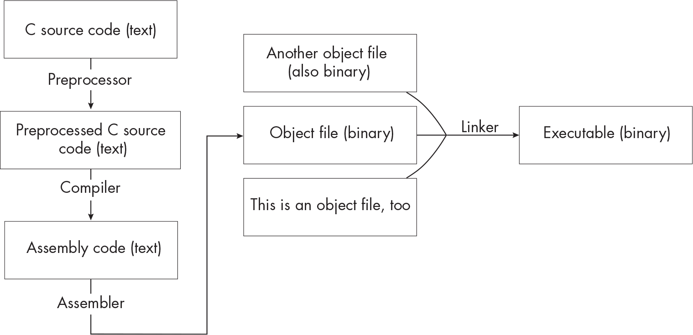

# `INTRODUCTION`

When we talk about how programming languages work, we tend to borrow metaphors from fantasy novels: compilers are magic, and the people who work on them are wizards. Dragons may be involved somehow. But in the day-to-day lives of most programmers, compilers behave less like magical artifacts and more like those universal translator earpieces from science fiction. They aren’t flashy or dramatic; they don’t demand a lot of attention. They just hum along in the background, translating a language you speak (or type) fluently into the alien language of machines.

For some reason, sci-fi characters rarely seem to wonder how their translators work. But once you’ve been coding for a while, it’s hard not to feel curious about what your compiler is doing. A few years ago, this curiosity got the better of me, so I decided to learn more about compilers by writing one of my own. It was important to me to write a compiler for a real programming language, one that I’d used myself. And I wanted my compiler to generate assembly code that I could run without an emulator or virtual machine. But when I looked around, I found that most guides to compiler construction used toy languages that ran on idealized processors. Some of these guides were excellent, but they weren’t quite what I was looking for.

I finally got unstuck when a friend pointed me toward a short paper titled “An Incremental Approach to Compiler Construction” by Abdulaziz Ghuloum (*<http://scheme2006.cs.uchicago.edu/11-ghuloum.pdf>*). It explained how to compile Scheme to x86 assembly, starting with the simplest possible programs and adding one new language construct at a time. I didn’t particularly want to write a compiler for Scheme, so I adapted the paper to a language I was more interested in: C. As I kept working on the project, I switched from x86 to its modern counterpart, x64 assembly. I also built out support for a larger subset of C and added a few optimization passes. By this point, I had gone way beyond Ghuloum’s original scheme (pun intended, sorry), but his basic strategy held up remarkably well: focusing on one small piece of the language at a time made it easy to stay on track and see that I was making progress. In this book, you’ll tackle the same project. Along the way, you’ll gain a deeper understanding of the code you write and the system it runs on.

## `Who This Book Is For`

I wrote this book for programmers who are curious about how compilers work. Many books about compiler construction are written as textbooks for college or graduate-level classes, but this one is meant to be accessible to someone exploring the topic on their own. You won’t need any prior knowledge of compilers, interpreters, or assembly code to complete this project. A basic understanding of computer architecture is helpful, but not essential; I’ll discuss important concepts as they come up and occasionally point you to outside resources with more background information. That said, this is not a book for novice programmers. You should be comfortable writing substantive programs on your own, and you should be familiar with binary numbers, regular expressions, and basic data structures like graphs and trees. You’ll need to know C well enough to read and understand small C programs, but you don’t need to be an expert C programmer. We’ll explore the ins and outs of the language as we go.

Although this book is geared toward newcomers to the subject, it will also be worthwhile for people who have some experience with compilers already. Maybe you implemented a toy language for a college class or personal project, and now you’d like to work on something more realistic. Or maybe you’ve worked on interpreters in the past, and you want to try your hand at compiling programs down to machine code. If you’re in this category, this book will cover some material you already know, but it will provide plenty of new challenges too. At the very least, I promise you’ll learn a few things about C.

## `Why Write a C Compiler?`

I assume you’re already sold on the idea of writing a compiler—you did pick up this book, after all. I want to talk a little bit about why we’re writing a compiler for C in particular. The short answer is that C is a (relatively) simple language, but not a toy language. At its core, C is simple enough to implement even if you’ve never written a compiler before. But it’s also a particularly clear example of how programming languages are shaped by the systems they run on and the people who use them. Some aspects of C vary based on what hardware you’re targeting; others vary between operating systems; still others are left unspecified to give compiler writers more flexibility. Some bits of the language are historical artifacts that have stuck around to support legacy code, while others are more recent attempts to make C safer and more reliable.

These messy parts of C are worth tackling for a couple of reasons. First, you’ll develop a solid mental model of how your compiler fits in with all the other pieces of your system. Second, you’ll get a sense of the different perspectives that different groups of people bring to the language, from the specification authors trying to stamp out ambiguity and inconsistency, to compiler implementers looking for performance improvements, to ordinary programmers who just want their code to work.

I hope this project will make you think about *all* programming languages differently: not as fixed sets of rules enshrined in language standards, but as ongoing negotiations between the people who design, implement, and use them. Once you start looking at programming languages this way, they become richer, more interesting, and less frustrating to work with.

## `Compilation from 10,000 Feet`

Before we go any further, let’s take a high-level look at how source code turns into an executable and where the compiler fits into the process. We’ll clear up some terminology and review a tiny bit of computer architecture while we’re at it. A *compiler* is a program that translates code from one programming language to another. It’s just one part (though often the most complex part) of the whole system that’s responsible for getting your code up and running. We’re going to build a compiler that translates C programs into *assembly code*, a textual representation of the instructions we want the processor to run.

Different processors understand different instructions; we’ll focus on the x64 instruction set, also called x86-64 or AMD64. This is what most people’s computers run. (The other instruction set you’re likely to encounter is ARM. Most smartphones and tablets have ARM processors, and they’re starting to show up in laptops too.)

The processor doesn’t understand text, so it can’t run our assembly code as is. We need to convert it into *object code*, or binary instructions that the processor can decode and execute. For example, the assembly instruction `ret` corresponds to the byte `0xc3`. The *assembler* handles this conversion, taking in assembly programs and spitting out object files. Finally, the *linker* combines all the object files we need to include in our final program, resolves any references to variables or functions from other files, and adds some information about how to actually start up the program. The end result is an executable that we can run. This is a wildly oversimplified view of what happens, but it’s good enough to get us started.

Aside from the compiler, assembler, and linker, compiling a C program requires yet another tool: the *preprocessor*, which runs right before the compiler. The preprocessor strips out comments, executes preprocessor directives like `#include`, and expands macros to produce preprocessed code that’s ready to be compiled. The whole process looks something like Figure 1.

`Figure 1: Transforming a source file into an executable ``Description`

When you compile a program with a command like `gcc` or `clang`, you’re actually invoking the *compiler driver*, a small wrapper that’s responsible for calling the preprocessor, compiler, assembler, and linker in turn. You’ll write your own compiler and compiler driver, but you won’t write your own preprocessor, assembler, or linker. Instead, you’ll use the versions of these tools already installed on your system.

## `What You’ll Build`

Over the course of this book, you’ll build a compiler for a large subset of C. You can write your compiler in any programming language you like; I’ll present key parts of the implementation in pseudocode. The book is organized into three parts. In Part I, The Basics, you’ll implement the core features of C: expressions, variables, control-flow statements, and function calls.

**Chapter 1: A Minimal Compiler** In this chapter, you’ll build a working compiler that can handle the simplest possible C programs, which just return integer constants. You’ll learn about the different stages of compilation, how to represent a C program internally as an abstract syntax tree, and how to read simple assembly programs.

**Chapter 2: Unary Operators** Next, you’ll start to expand your compiler by implementing two unary operators: negation and bitwise complement. This chapter introduces TACKY, a new intermediate representation that bridges the gap between the abstract syntax tree and assembly code. It also explains how to perform negation and bitwise complement in assembly, and how assembly programs store values in a region of memory called the stack.

**Chapter 3: Binary Operators** In this chapter, you’ll implement the binary operators that perform basic arithmetic, like addition and subtraction. You’ll use a technique called precedence climbing to parse arithmetic expressions with the correct associativity and precedence, and you’ll learn how to do arithmetic in assembly.

**Chapter 4: Logical and Relational Operators** Here, you’ll add support for the logical AND, OR, and NOT operators and relational operators like `>`, `==`, and `!=`. This chapter introduces several new kinds of assembly instructions, including conditional instructions and jumps.

**Chapter 5: Local Variables** Next, you’ll extend your compiler to support local variable declarations, uses, and assignments. You’ll add a new compiler stage to perform semantic analysis in this chapter. This stage detects programming errors like using an undeclared variable.

**Chapter 6: if Statements and Conditional Expressions** In this chapter, you’ll add support for `if` statements, your compiler’s first control-flow structure, as well as conditional expressions of the form `a ? b : c`. Using TACKY as an intermediate representation will pay off here; you can implement both language constructs with existing TACKY instructions, so you won’t need to touch later compiler stages.

**Chapter 7: Compound Statements** Here, you’ll add support for compound statements, which group together statements and declarations and control the scope of identifiers. You’ll take a close look at C’s scoping rules and learn how to apply those rules during semantic analysis.

**Chapter 8: Loops** This chapter covers `while`, `do`, and `for` loops, as well as `break` and `continue` statements. You’ll write a new semantic analysis pass to associate `break` and `continue` statements with their enclosing loops.

**Chapter 9: Functions** In this chapter, you’ll implement function calls and declarations of functions other than `main`. You’ll have two major tasks here: writing a type checker to detect semantic errors like calling functions with the wrong number of arguments, and generating assembly code. You’ll learn all the ins and outs of the calling conventions for Unix-like systems, which dictate how function calls work in assembly. By meticulously following these conventions, you’ll be able to compile code that calls external libraries.

**Chapter 10: File Scope Variable Declarations and Storage-Class Specifiers** Next, you’ll add support for file scope variable declarations and the `extern` and `static` specifiers. This chapter discusses several properties of C identifiers, including linkage and storage duration. It walks through how to determine an identifier’s linkage and storage duration in the semantic analysis stage and covers how those properties impact the assembly you ultimately generate. It also introduces a new region of memory, the data section, and describes how to define and operate on values stored there.

In Part II, Types Beyond int, you’ll implement additional types. This is where we’ll take the most in-depth look at the messy, confusing, and surprising bits of C.

**Chapter 11: Long Integers** In this chapter, you’ll implement the `long` type and lay the groundwork to add more types in later chapters. You’ll learn how to infer the type of every expression during type checking and how to operate on values of different sizes in assembly.

**Chapter 12: Unsigned Integers** Here, you’ll implement the unsigned integer types. This chapter dives into the C standard’s rules on integer type conversions and covers a few new assembly instructions that perform unsigned integer operations.

**Chapter 13: Floating-Point Numbers** Next, you’ll add the floating-point `double` type. This chapter describes the binary representation of floating-point numbers and the perils of floating-point rounding error. It introduces a new set of assembly instructions for performing floating-point operations and explains the calling conventions for passing floating-point arguments and return values.

**Chapter 14: Pointers** In this chapter, you’ll implement pointer types and the address and pointer dereference operators. You’ll validate pointer operations in the type checker and add explicit memory access instructions to the TACKY intermediate representation.

**Chapter 15: Arrays and Pointer Arithmetic** This chapter picks up where Chapter 14 left off by adding support for array types and several related language features: the subscript operator, pointer arithmetic, and compound initializers. It digs into the relationship between arrays and pointers and lays out how the type checker should analyze these types.

**Chapter 16: Characters and Strings** This chapter covers the character types, character constants, and string literals. You’ll learn about the different ways C programs use string literals, and you’ll add new TACKY and assembly constructs to represent string constants. At the end of the chapter, you’ll compile a couple of example programs that perform input/output (I/O) operations.

**Chapter 17: Supporting Dynamic Memory Allocation** In this chapter, you’ll implement the `void` type and `sizeof` operator, which will allow you to compile programs that call `malloc` and the other memory management functions. The biggest challenge here is handling `void` in the type checker. Because `void` is a type with no values, the type checker will treat it very differently from the other types you’ve implemented so far.

**Chapter 18: Structures** Structures, along with the `.` and `->` member access operators, are the last language features you’ll add in this book. To implement them, you’ll need all the skills you learned in earlier chapters. In the semantic analysis stage, you’ll resolve structure tags according to C’s scoping rules and analyze structure type declarations to determine how they’re laid out in memory. When you generate TACKY, you’ll translate member access operators into sequences of simple memory access instructions. And when you generate assembly, you’ll follow the calling conventions for passing structures as arguments and return values.

In Part III, Optimizations, you won’t add any new language features. Instead, you’ll implement several classic compiler optimizations to generate more efficient assembly code. Part III is quite different from Parts I and II because these optimizations aren’t specific to C; they work just as well for programs written in any language.

**Chapter 19: Optimizing TACKY Programs** In this chapter, you’ll add an optimization stage targeting TACKY programs. This stage will include four different optimizations: constant folding, unreachable code elimination, dead store elimination, and copy propagation. These four optimizations work together, making each one more effective than it would be by itself. This chapter introduces several tools for understanding a program’s behavior, including control-flow graphs and data-flow analysis. You’ll use these tools to discover ways to optimize programs without changing their behavior.

**Chapter 20: Register Allocation** To cap off this project, you’ll write a register allocator, which figures out how to store values in the assembly program in registers instead of memory. You’ll use graph coloring to find a valid mapping from values to registers. Once the initial version of your register allocator is working, you’ll use another technique, register coalescing, to make it even more effective and remove some unnecessary assembly instructions.

**Next Steps** We’ll wrap up with a few suggestions about how to keep learning and building out your compiler on your own.

Parts II and III both build on Part I, but they’re independent of each other. You can complete either of them, both, or neither. The appendixes include some helpful information you can refer to along the way.

**Appendix A: Debugging Assembly Code with GDB or LLDB** This appendix walks you through how to use GDB, the GNU debugger, and LLDB, the LLVM debugger, to debug assembly programs. When your compiler produces buggy assembly, these tools will help you figure out what’s going on.

**Appendix B: Assembly Generation and Code Emission Tables** The tables in this appendix summarize how to convert each TACKY construct to assembly, and how to print each assembly construct during code emission. All of the chapters where we update these passes include similar tables showing what changed in that chapter; this appendix brings it all together.

Finally, a disclaimer: this book covers a lot of ground, but it doesn’t cover everything. There are some really important parts of C that we won’t implement: function pointers, variable-length argument lists, `typedef`, and type qualifiers like `const`, to name just a few. Instead of cramming in as many features as possible, we’ll dive deep on the features we *do* implement so that you really understand how and why they work. That way, you’ll learn all the skills and concepts you need to keep building on your own.

## `How to Use This Book`

Each chapter is a detailed guide to implementing a particular feature. At the beginning of a chapter, I’ll discuss the feature you’re about to build and any important concepts you’ll need to understand to get started. Then, we’ll walk through how to update each stage of the compiler to support this new feature. I’ll include pseudocode for any steps that are particularly tricky or important. Don’t feel like you need to follow the pseudocode exactly; it’s there to clarify what you want to accomplish, not to prescribe all the details of how you go about it.

Each chapter builds on the one before it, so you’ll need to complete them in order, except that you can skip to Part III without completing Part II first.

### `The Test Suite`

Every chapter includes a few checkpoints where you can stop and test your compiler with this book’s test suite, which is available at *<https://github.com/nlsandler/writing-a-c-compiler-tests>*. For each chapter, the test suite includes a set of invalid test programs that your compiler should reject with an error message and a set of valid test programs that it should compile successfully. Use the provided *test_compiler* script to run the tests.

### `Extra Credit Features`

Some chapters mention additional language features that you can implement on your own; I call these “extra credit” features. An extra credit feature is related to the main feature covered in the chapter. You can implement it using techniques you’ve already learned, but you’ll have to figure out the details for yourself. You might need to look at the assembly output for a few test programs to figure out how to handle them. You’ll also need to consult outside references, like the C standard and the documentation for the x64 instruction set (you’ll find links to these and other resources in “Additional Resources” on page xxxvi). The extra credit features are totally optional; try out the ones that seem interesting and skip the ones that don’t.

Tests for these features are included in the test suite but aren’t run by default. You can run them by passing the appropriate command line options to *test_compiler*.

## `Some Advice on Choosing an Implementation Language`

While it’s possible to write a compiler in any programming language, some languages are better suited to the task than others. We’ll be creating a compiler *for* C, but I don’t recommend writing it *in* C. Although C has its strengths as a programming language, this project doesn’t play to any of them. You’re better off choosing a language with easier memory management and a more extensive standard library.

You should also consider using a language with *pattern matching*. You can think of this as a kind of souped-up `switch` statement that lets you define different cases for values that have different structures and include different data. (Note that this is distinct from regular expression matching, which also gets called “pattern matching” occasionally.) Our very first snippet of pseudocode shows pattern matching in action:

    greet(someone):
        match someone with
        | ImportantPerson(title, last_name) ->
            say("Good day to you, {title} {last_name}!")
        | Friend(first_name) -> say("Hello, {first_name}!")
        | Stranger -> say("Howdy, stranger!")
        | Animal(name, species) ->
            say("Hi, {name}! Who's a good {species}? It's you!")

This turns out to be extremely useful for analyzing and transforming programs, which generally contain several types of expressions, statements, and so on, like this:

    do_something(expr):
        match expr with
        | Constant(int) -> do_something_for_int(int)
        | BinaryExpr(op, left, right) ->
            do_something(left)
            do_something(right)
        // handle more kinds of expressions

The pseudocode in this book uses pattern matching all over the place, so you’ll have an easier time following along if you use a language that supports it.

For a long time, pattern matching was the province of functional languages like ML and Haskell. (It’s no coincidence that these languages are very popular in programming language academia.) More recently, just about everyone else has noticed that pattern matching is great, and it’s making its way into more mainstream languages. Rust and Swift both support pattern matching, Python added it in version 3.10, and Java has been gradually building out support for it since version 16. Before you start writing a compiler in your favorite language, do a little research to find out what sort of support it has for pattern matching. Depending on what you find, you might decide to use the latest and greatest version of the language, use a pattern matching library (C++, for example, has several), or use your second-favorite language instead. Or you might decide to ignore my advice; pattern matching is helpful, but you can get by without it.

## `System Requirements`

To complete this project, you’ll need a macOS or Linux system with an x64 processor (or a Mac with an Apple Silicon processor, which can emulate x64 without too much fuss). If you’re on a Windows machine, you’ll need to set up a Linux environment using Windows Subsystem for Linux (WSL). You can find setup instructions for WSL at *<https://docs.microsoft.com/en-us/windows/wsl/install>*.

This project has two dependencies. To run *test_compiler*, you’ll need Python 3.8 or later. You may have a recent version of Python installed already; if not, you can download it from *<https://www.python.org/downloads>* or install it with your system’s package manager. (See this book’s web page at *<https://norasandler.com/book/#setup>* for more detailed installation instructions.) To check that you have a suitable version of Python installed, run:

    $ python3 --version

You’ll also need a real C compiler (or, strictly speaking, a real C compiler driver) to invoke the preprocessor, assembler, and linker. The test script depends on the compiler driver as well. If you’re on Linux, use GCC as the compiler driver. If you’re on macOS, use the version of Clang included in Xcode. (The test script uses the `gcc` command to invoke the compiler driver; Xcode’s Clang gets installed under both the name `clang` and the alias `gcc`.) It’s a good idea to install a debugger that can step through assembly code too, to help you debug the code that your compiler produces. I recommend debugging with GDB on Linux and LLDB on macOS.

### `Installing GCC and GDB on Linux`

If you’re running Linux, you should use GCC as the compiler driver and GDB as the debugger. To check whether they’re already installed, run:

    $ gcc -v
    $ gdb -v

If either of these commands is missing, you can install them with your system’s package manager. For example, to install both tools on Ubuntu, run:

    $ sudo apt-get install gcc gdb

### `Installing the Command Line Developer Tools on macOS`

The simplest option on macOS is to install the Xcode command line developer tools, which include the Clang compiler and LLDB debugger. To check whether they’re already installed, run:

    $ clang -v

If the tools aren’t installed already, you’ll be prompted to install them when you try to run this command.

The examples in this book were compiled with GCC, so if you compile them with Clang, the resulting assembly will sometimes look a little different. These differences won’t impact your ability to complete the project.

### `Running on Apple Silicon`

If your computer has an Apple Silicon processor (Apple’s ARM chip), you’ll need to use Rosetta 2 to run the programs you compile. The easiest solution is to run everything—including your compiler and the test script—as x64 binaries under Rosetta 2. To open an x64 shell, run:

    $ arch -x86_64 zsh

You can run your compiler, Clang, the compiled programs, and *test_compiler* in this shell, and everything should work fine. Just make sure to build your compiler itself to run on x64 and not ARM.

If the `arch` command doesn’t work, Rosetta 2 may not be installed yet. To install it, run:

    $ softwareupdate --install-rosetta --agree-to-license

### `Validating Your Setup`

The test script includes a `--check-setup` option that you can use to make sure your system is set up correctly. Run these commands to download the test suite and validate your setup:

    $ git clone https://github.com/nlsandler/writing-a-c-compiler-tests.git
    $ cd writing-a-c-compiler-tests
    $ ./test_compiler --check-setup
    All system requirements met!

If the test script doesn’t report any issues, you’re ready to get started!

## `Additional Resources`

You can find errata, updates, links, and other resources on this book’s web page at *<https://norasandler.com/book/>*. If you run into any problems with the project or the test script, check this page first. New versions of GCC, the Xcode command line tools, and the other tools this project depends on are released periodically; the book’s web page includes any updates to the project that are needed to work with the latest versions of these tools.

If you get stuck and want to see a complete, working implementation of the project, refer to this book’s reference implementation: NQCC2, the not-quite-C compiler, available at *<https://github.com/nlsandler/nqcc2>*. It’s written in OCaml, but it has lots of comments to help you understand it if you’re not an OCaml programmer.

Finally, here are a few external resources that you might find helpful. These will be especially useful if you decide to implement any of the extra credit features or otherwise build out your compiler beyond what’s covered in this book:

- The **C standard** specifies how C programs are supposed to behave. We’ll use C17 (ISO/IEC 9899:2018), which was the latest version of the standard at the time this book was being written. You can buy a copy from the International Standards Institute (ISO) at *<https://www.iso.org/standard/74528.html>*. Alternatively, if the idea of paying \$200 for a PDF doesn’t appeal to you, you can use a similar draft version of the standard, which is freely available at *<https://www.open-std.org/JTC1/SC22/WG14/www/docs/n2310.pdf>*. This is an early draft of C23—the next version of the standard after C17—with diff marks indicating what’s changed. It’s not the official ISO standard, so I wouldn’t recommend using it to build a production C compiler, but it’s close enough for this project.
- The **System V Application Binary Interface (ABI)** defines a set of conventions that executables follow on Unix-like operating systems. This will be important starting in Chapter 9, when we implement function calls. You can find the latest version of the System V ABI for x64 systems at *<https://gitlab.com/x86-psABIs/x86-64-ABI>*.
- The **Intel 64 Software Developer’s Manual** (*<https://www.intel.com/content/www/us/en/developer/articles/technical/intel-sdm.html>*) is Intel’s official documentation for the x64 instruction set. We care about Volume 2, the instruction set reference. There’s also an unofficial version at *<https://www.felixcloutier.com/x86/>*, which is easier to browse.
- **Compiler Explorer** (*<https://godbolt.org>*) is an extremely nifty website where you can see how a variety of widely used compilers translate your code to assembly. It makes it easy to compare the output of different compilers and see the impact of various optimization levels and compiler flags.

> `NOTE`

*C23 is set to be published in 2024, superseding C17. For our purposes, the differences between C17 and C23 aren’t significant. We won’t implement the new language features introduced in C23, but we aren’t implementing all of C17, either. The subset of C we* do *implement looks pretty much the same in both versions of the standard. If you’re curious about what’s different in C23, you can find a free, nearly final draft at* <https://open-std.org/JTC1/SC22/WG14/www/docs/n3096.pdf> *and an informal list of changes at* <https://en.cppreference.com/w/c/23>*.*

## `Let’s Go!`

We’ve covered all the preliminaries and we’re ready to get started. In Chapter 1, we’ll compile our first C program.