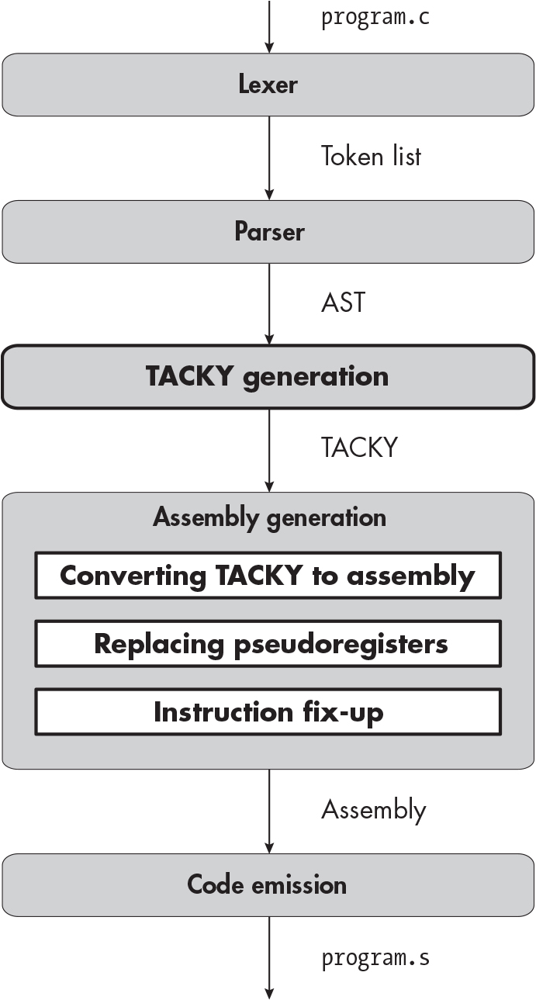
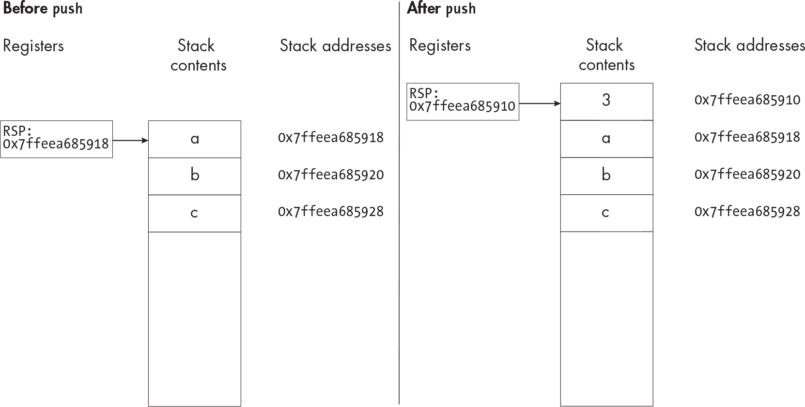
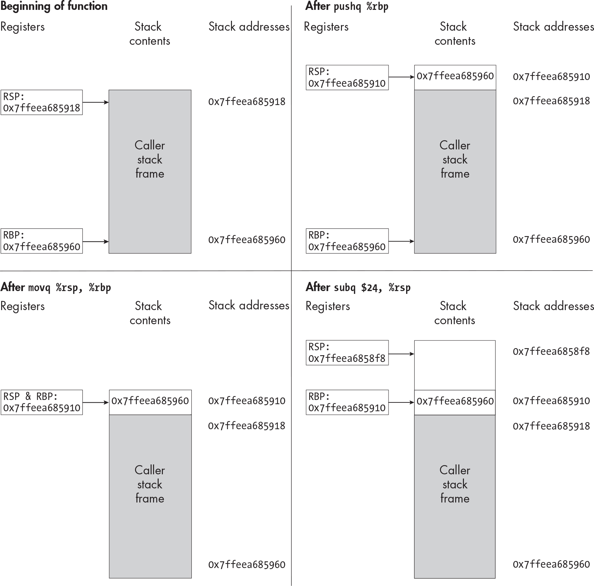
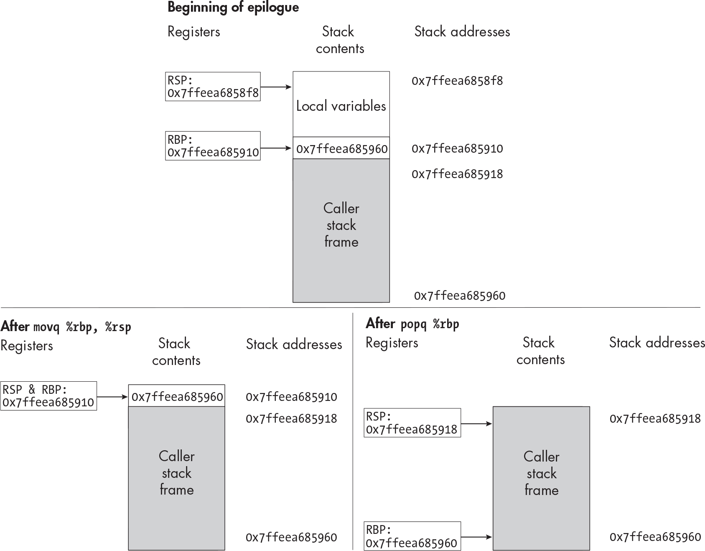

` ``Description`

## `2` `UNARY OPERATORS`


C has several *unary operators*, which operate on a single value. In this chapter, you’ll extend your compiler to handle two unary operators: negation and bitwise complement. You’ll transform complex, nested unary expressions into simple operations that can be expressed in assembly. Instead of performing this transformation in a single compiler pass, you’ll introduce a new intermediate representation between the AST produced by the parser and the assembly AST produced by the assembly generation pass. You’ll also break up assembly generation into several smaller passes. The new passes are bolded in the diagram at the start of this chapter.

To get started, let’s look at a C program using the new unary operators and the corresponding assembly we’ll generate.

### `Negation and Bitwise Complement in Assembly`

In this chapter, you’ll learn to compile programs like Listing 2-1.

    int main(void) {
        return ~(-2);
    }

`Listing 2-1: A C program with negation and bitwise complement`

This program contains a nested expression using both new unary operators. The first operator, *negation* (`-`), negates an integer—no surprise there. The *bitwise complement* (`~`) operator flips every bit in an integer, which has the effect of negating the integer and then subtracting one. (It has this effect because computers use a system called *two’s complement* to represent signed integers. If you’re not familiar with two’s complement, see “Additional Resources” on page 45 for links to a few explanations of how it works.)

Your compiler will convert Listing 2-1 to the assembly code in Listing 2-2.

        .globl main
    main:
        pushq   %rbp
        movq     %rsp, %rbp
        subq     $8, %rsp
      ❶ movl     $2, ❷ -4(%rbp)
      ❸ negl     -4(%rbp)
      ❹ movl     -4(%rbp), %r10d
      ❺ movl     %r10d, -8(%rbp)
      ❻ notl     -8(%rbp)
      ❼ movl     -8(%rbp), %eax
        movq     %rbp, %rsp
        popq     %rbp
        ret

`Listing 2-2: The assembly code for ``Listing 2-1`

The first three instructions after `main` form the *function prologue*, which sets up the current stack frame; I’ll cover them in the next section, when I talk about the stack in detail. After the function prologue, we calculate the intermediate result, –2, and then the final result, 1, storing each of them at a unique memory address. This isn’t very efficient, since we waste a lot of instructions copying values from one address to another. The optimizations we’ll implement in Part III will clean up most of these unnecessary copies.

The first `mov` instruction ❶ stores `2` at an address in memory. The operand `-4(%rbp)` ❷ means “the value stored in the RBP register, minus four.” The value in RBP is a memory address on the stack (more on this shortly), so `-4(%rbp``)` refers to another memory address 4 bytes lower. Next, we negate the value at this address with the `neg` instruction ❸, so `-4(%rbp)` contains the value `-2`. (Just like `mov`, `neg` has an `l` suffix to indicate that it’s operating on a 32-bit value.)

We then handle the outer bitwise complement expression. We start by copying the source value, stored in `-4(%rbp)`, to the destination address at `-8(%rbp)`. We can’t do this in a single instruction, because `mov` can’t have memory addresses as both its source and destination operands. At least one operand to `mov` needs to be a register or an immediate value. We get around this by copying `-2` from memory into a scratch register, R10D ❹, and from there to the destination memory address ❺. Then, we take the bitwise complement of `-2` with the `not` instruction ❻, so memory address `-8(%rbp)` now contains the value we want to return: `~(-2)`, which evaluates to 1. To return this value, we move it into EAX ❼. The final three instructions are the *function epilogue*, which tears down the stack frame and returns from the function.

> `NOTE`

*If you compile Listing 2-1 to assembly using GCC, Clang, or any other production C compiler, it won’t look anything like Listing 2-2. That’s because those compilers evaluate constant expressions at compile time, even when you’ve disabled optimizations! I’m guessing they behave this way because some constant expressions, like static variable initializers,* must *be evaluated at compile time, and evaluating all constant expressions at compile time is simpler than evaluating only some.*

### `The Stack`

There are still two unanswered questions about Listing 2-2: what the function prologue and epilogue do, and why we refer to stack addresses relative to a value in the RBP register. To answer these questions, we need to talk about the segment of program memory called the *stack*. The RSP register, also called the *stack pointer*, always holds the address of the top of the stack. (RSP points to the last used stack slot, rather than the first free one.) As with any stack data structure, you can push values onto the stack and pop values off it; the `push` and `pop` assembly instructions do exactly that.

The stack grows toward lower memory addresses. When you push something onto the stack, you decrement RSP. That means the “top of the stack”—the address stored in RSP—is the *lowest* address on the stack. The stack diagrams in this book are oriented with lower memory addresses at the top, so the top of the stack is at the top of the diagram. Think of the memory addresses in these diagrams like line numbers in a code listing. The top of a code listing is line 1, and line numbers increase as you go down; similarly, the addresses in these diagrams increase as you go down the page or screen. Note that most stack diagrams in other books and articles use the opposite orientation: they put the top of the stack at the bottom of the diagram, so lower memory addresses appear lower on the page. I find that layout really confusing, but if you prefer it, just turn your book upside down.

An instruction like `push $3` does two things:

1.  Writes the value being pushed (in this example, `3`) to the next empty spot on the stack. The `push` and `pop` instructions adjust the stack pointer in 8-byte increments, and the top value on the stack is currently at the address stored in RSP, so the next empty spot is RSP – 8.
2.  Decrements RSP by 8 bytes. The new address in RSP is now the top of the stack, and the value at that address is `3`.

Figure 2-1 illustrates the effect of a `push` instruction on the stack and RSP register.



`Figure 2-1: The effect of push $3 on memory and RSP ``Description`

The `pop` instruction performs the opposite operation. For example, `pop %rax` copies the value at the top of the stack into the RAX register, then adds 8 bytes to RSP.

Since the `push` instruction decrements the stack pointer by 8 bytes, it has to push an 8-byte value. Likewise, the `pop` instruction always pops an 8-byte value off the stack. Values of type `int`—like the return value in Listing 2-1—are only 4 bytes. You can’t push only 4 bytes onto the stack, but you can use `movl` to copy a 4-byte value into stack space you’ve already allocated. A couple of instructions do this in Listing 2-2, including `movl $2, -4(%rbp)`. (On 32-bit systems, the reverse is true; you can push and pop 4-byte values but not 8-byte values. On both kinds of systems, it’s also possible, though very unusual, to push and pop 2-byte values using the `pushw` and `popw` instructions; the `w` suffix, for *word*, indicates that the instruction takes a 2-byte operand. We won’t use `pushw`, `popw`, or any other 2-byte instructions in this book.) Memory addresses on x64 systems are 8 bytes, so you can use `push` and `pop` to put them on and take them off the stack. This will come in handy in a moment.

The stack isn’t just an undifferentiated chunk of memory; it’s divided into sections called *stack frames*. Whenever a function is called, it allocates some memory at the top of the stack by decreasing the stack pointer. This memory is the function’s stack frame, where it stores local variables and temporary values. Just before the function returns, it deallocates its stack frame, restoring the stack pointer to its previous value. By convention, the RBP register points to the base of the current stack frame; for this reason, it’s sometimes called the *base pointer*. We refer to data in the current stack frame relative to the address stored in RBP. This means we don’t need absolute addresses, which we can’t know in advance. Since the stack grows toward lower memory addresses, every address in the current stack frame is lower than the address stored in RBP; this is why the addresses of local variables, like `-4(%rbp)`, all have negative offsets from RBP. In later chapters, we’ll also refer to data in the caller’s stack frame, like function parameters, relative to RBP. (It’s possible to refer to local variables and parameters relative to RSP instead, and not bother with RBP at all; most production compilers do this as an optimization.)

Now that you understand how the stack works, let’s look at the function prologue and epilogue in more detail. The function prologue sets up the stack frame in three instructions:

1.  `pushq %rbp` saves the current value of RBP, the address of the base of the caller’s stack frame, onto the stack. We’ll need this value when we restore the caller’s stack frame later. This value will be at the bottom of the new stack frame established by the next instruction.
2.  `movq %rsp, %rbp` makes the top of the stack the base of the new stack frame. At this point, the top and bottom of the current stack frame are the same. The current stack frame holds exactly one value, which both RSP and RBP point to: the base of the caller’s stack frame, which we saved in the previous instruction.
3.  `subq $``n``, %rsp` decrements the stack pointer by *n* bytes. The stack frame now has *n* bytes available to store local and temporary variables.

Figure 2-2 shows how each instruction in the function prologue affects the stack. In this figure, the `subq` instruction allocates 24 bytes, enough space for six 4-byte integers.



`Figure 2-2: The state of the stack at each point in the function prologue ``Description`

The function epilogue restores the caller’s stack frame by setting RSP and RBP back to the same values they had before the function prologue. This requires two instructions:

1.  `movq %rbp, %rsp` puts us back where we were after the second instruction of the function prologue: both RSP and RBP point to the bottom of the current stack frame, which holds the caller’s value for RBP.
2.  `popq %rbp` reverses the first instruction of the function prologue and restores the caller’s values for the RSP and RBP registers. It restores RBP because the value at the top of the stack was the base address of the caller’s stack frame that we saved at the start of the prologue. It restores RSP by removing the last value in this stack frame from the stack, leaving RSP pointing to the top of the caller’s stack frame.

Figure 2-3 shows the effect of each instruction in the function epilogue.



`Figure 2-3: The state of the stack at each point in the function epilogue ``Description`

Now that we know what output our compiler should produce, let’s keep coding. We’ll start by extending the lexer and parser.

### `The Lexer`

In this chapter, you’ll extend the lexer to recognize three new tokens:

| `~`  | A tilde, the bitwise complement operator |
|------|------------------------------------------|
| `-`  | A hyphen, the negation operator          |
| `--` | Two hyphens, the decrement operator      |

While you won’t implement the decrement operator in this chapter, you still need to add a token for it. Otherwise, your compiler will accept programs it should reject, like the one in Listing 2-3.

    int main(void) {
        return --2;
    }

`Listing 2-3: An invalid C program using the decrement operator`

This shouldn’t compile, because you can’t decrement a constant. But if your compiler doesn’t know that `--` is a distinct token, it will think Listing 2-3 is equivalent to Listing 2-4, which is a perfectly valid program.

    int main(void) {
        return -(-2);
    }

`Listing 2-4: A valid C program with two negation operators in a row`

Your compiler should reject language features you haven’t implemented; it shouldn’t compile them incorrectly. That’s why your lexer needs to know that `--` is a single token, not just two negation operators in a row. (On the other hand, the lexer should lex `~~` as two bitwise complement operators in a row. Expressions like `~~2` are valid.)

You can process the new tokens the same way you handled punctuation like `;` and `(`in Chapter 1. First, you need to define a regular expression for each new token. The regular expressions here are the strings `~`, `-`, and `--`. Next, have your lexer check the input against these new regexes, as well as the regexes from the previous chapter, every time it tries to produce a token. When the start of the input stream matches more than one possible token, choose the longest one. For example, if your input stream starts with `--`, parse it as a decrement operator rather than two negation operators.

`TEST THE LEXER`

`To test your lexer, run:`

    $ ./test_compiler /path/to/your_compiler --chapter 2 --stage lex

`This command will validate that your compiler can successfully lex all the test cases for this chapter, including the valid test programs in` `tests/chapter_2/valid` `and the invalid test programs in` `tests/chapter_2/invalid_parse``. It will also run the lexing test cases from ``Chapter 1``, to make sure your lexer can still handle them.`

### `The Parser`

To parse the new operators in this chapter, we first need to extend the AST and formal grammar we defined in Chapter 1. Let’s look at the AST first. Since unary operations are expressions, we represent them with a new constructor for the `exp` AST node. Listing 2-5 shows the updated AST definition, with new parts bolded.

    program = Program(function_definition)
    function_definition = Function(identifier name, statement body)
    statement = Return(exp)
    exp = Constant(int) | Unary(unary_operator, exp)
    unary_operator = Complement | Negate

`Listing 2-5: The abstract syntax tree with unary operations`

The updated rule for `exp` indicates that an expression can be either a constant integer or a unary operation. A unary operation consists of one of the two unary operators, `Complement` or `Negate`, applied to an inner expression. Notice that the definition of `exp` is recursive: the `Unary` constructor for an `exp` node contains another `exp` node. This lets us construct arbitrarily deeply nested expressions, like `-(~(-~-(-4)))`.

We also need to make the corresponding changes to the grammar, shown in Listing 2-6.

    <program> ::= <function>
    <function> ::= "int" <identifier> "(" "void" ")" "{" <statement> "}"
    <statement> ::= "return" <exp> ";"
    <exp> ::= <int> | <unop> <exp> | "(" <exp> ")"
    <unop> ::= "-" | "~"
    <identifier> ::= ? An identifier token ?
    <int> ::= ? A constant token ?

`Listing 2-6: The formal grammar with unary operations`

Listing 2-6 includes a new production rule for unary expressions and a `<unop>` symbol to represent the two unary operators. These changes correspond to the additions to the AST in Listing 2-5. We’ve also added a third production rule for the `exp` symbol, which describes a parenthesized expression. It doesn’t have a corresponding constructor in the AST because the rest of the compiler doesn’t need to distinguish between an expression wrapped in parentheses and the same expression without parentheses. The expressions `1`, `(1)`, and `((((1))))` are all represented by the same AST node: `Constant(1)`.

The decrement operator (`--`) doesn’t show up anywhere in this grammar, so your parser should fail if it encounters a `--` token.

To update the parsing stage, modify your compiler’s AST data structure to match Listing 2-5. Then, update your recursive descent parsing code to reflect the changes in Listing 2-6. Parsing an expression gets a bit more complicated in this chapter because you need to figure out which of the three different production rules for the `<exp>` symbol to apply. The pseudocode in Listing 2-7 demonstrates how to parse an expression.

    parse_exp(tokens):
        next_token = peek(tokens)
      ❶ if next_token is an int:
            --snip--
      ❷ else if next_token is "~" or "-":
            operator = parse_unop(tokens)
            inner_exp = parse_exp(tokens)
          ❸ return Unary(operator, inner_exp)
      ❹ else if next_token == "(":
            take_token(tokens)
            inner_exp = parse_exp(tokens)
            expect(")", tokens)
          ❺ return inner_exp
      ❻ else:
            fail("Malformed expression")

`Listing 2-7: Parsing an expression`

First, we look at the next token in the input to figure out which production rule to apply. We call `peek` to look at this token without removing it from the input stream. Once we know which production rule to use, we’ll want to process the whole input, including that first token, using that rule. So, we don’t want to consume this token from the input just yet.

If the expression we’re about to parse is valid, `next_token` should be an integer, a unary operator, or an open parenthesis. If it’s an integer ❶, we parse it the same way as in the previous chapter. If it’s a unary operator ❷, we apply the second production rule for `<exp>` from Listing 2-6 to construct a unary expression. This rule is `<unop> <exp>`, so we parse the unary operator and then the inner expression. The `<unop>` symbol is a single token, `next_token`, which we’ve already inspected. In Listing 2-7, we handle `<unop>` in a separate function (`parse_unop`, whose definition I’ve omitted). In practice, you probably don’t need a separate function to parse one token. Either way, we end up with an AST node representing the appropriate unary operator. The next symbol in the production rule is `<exp>`, which we parse with a recursive call to `parse_exp`. (This is the recursive part of “recursive descent.”) This call should return an `exp` AST node representing the operand of the unary expression. Now we have AST nodes for both the operator and the operand, so we return the AST node for the whole unary expression ❸.

If `next_token` is an open parenthesis ❹, we apply the third production rule for `<exp>`, which is `"(" <exp> ")"` . We remove the open parenthesis from the input stream, then call `parse_exp` recursively to handle the expression that follows. Next, we call `expect` to remove the closing parenthesis or throw a syntax error if it’s missing. Since the AST doesn’t need to indicate that there were parentheses, we return the inner expression as is ❺.

Finally, if `next_token` isn’t an integer, a unary operator, or an open parenthesis ❻, the expression is malformed, so we throw a syntax error.

`TEST THE PARSER`

`To test your parser against the test cases from this chapter and the last chapter, run:`

    $ ./test_compiler /path/to/your_compiler --chapter 2 --stage parse

`Your parser should be able to handle every valid test case in` `tests/chapter_2/valid``, and it should raise an error on every invalid test case in` `tests/chapter_2/invalid_parse``. It should also continue to handle valid and invalid test cases from the last chapter correctly.`

### `TACKY: A New Intermediate Representation`

Converting the AST to assembly isn’t as straightforward as it was in the last chapter. C expressions can have nested subexpressions, and assembly instructions can’t. A single expression like `-(~2)` needs to be broken up into two assembly instructions: one to apply the inner bitwise complement operation and another to apply the outer negation operation.

We’ll bridge the gap between C and assembly using a new intermediate representation (IR), *three-address code (TAC)*. In TAC, the operands of each instruction are constants or variables, not nested expressions. It’s called three-address code because most instructions use at most three values: two source operands and a destination. (The instructions in this chapter use only one or two values; we’ll introduce instructions that use three values when we implement binary operators in Chapter 3.) To rewrite nested expressions in TAC, we often need to introduce new temporary variables. For example, Listing 2-8 shows the three-address code for `return 1` `+` `2 * 3;`.

    tmp0 = 2 * 3
    tmp1 = 1 + tmp0
    return tmp1

`Listing 2-8: The three-address code for` `return 1 + 2 * 3;`

There are two main reasons to use three-address code instead of converting an AST directly to assembly. First, it lets us handle major structural transformations—like removing nested expressions—separately from the details of assembly language, like figuring out which operands are valid for which instructions. This means we can write several smaller, simpler compiler passes, instead of having one huge, complicated assembly generation pass. Second, three-address code is well suited to several optimizations we’ll implement in Part III. It has a simple, uniform structure, which makes it easy to answer questions like “Is the result of this expression ever used?” or “Will this variable always have the same value?” The answers to those questions determine what optimizations are safe to perform.

`MULTIPLE LANGUAGES, MULTIPLE TARGETS`

`Intermediate representations like three-address code are useful for another reason, although it isn’t relevant to this project. An IR can provide a common target for multiple source languages and a common starting point for assembly generation for multiple target architectures. The LLVM compiler framework (`[`https://llvm.org`](https://llvm.org)`) is a great example of this: it supports several frontends and backends using a single intermediate representation. If you want to compile a new programming language, you can just compile it to the LLVM IR, and LLVM will take care of optimizing that IR and producing machine code for different CPU architectures. Or, if you want to run software on some exotic new CPU architecture, you can just write a backend that converts the LLVM IR into machine code for that architecture. Then, you’ll be able to take any language with an LLVM frontend and compile it for that architecture.`

Most compilers use some form of three-address code internally, but the details vary. I’ve decided to name the intermediate representation in this book *TACKY*. (Naming your intermediate representations is, in my opinion, one of the best parts of compiler design.) I made up TACKY for this book, but it’s similar to three-address code in other compilers.

#### `Defining TACKY`

We’ll define TACKY in ASDL, like our other intermediate representations. The definition of TACKY in Listing 2-9 looks similar to the AST definition from Listing 2-5, but there are a few important differences.

    program = Program(function_definition)
    function_definition = Function(identifier, ❶ instruction* body)
    instruction = Return(val) | Unary(unary_operator, val src, val dst)
    val = Constant(int) | Var(identifier)
    unary_operator = Complement | Negate

`Listing 2-9: The TACKY intermediate representation`

In TACKY, a function body consists of a list of instructions ❶ rather than a single statement. In this respect, it’s similar to the assembly AST we defined in the previous chapter. For now, TACKY has two instructions: `Return` and `Unary`. `Return` returns a value; `Unary` performs some unary operation on `src`, the source value for the expression, and stores the result in `dst`, the destination. Both instructions operate on `val`s, which can be either constant integers (`Constant`) or temporary variables (`Var`). The TACKY we generate must meet one requirement that isn’t explicit in Listing 2-9: the `dst` of a unary operation must be a temporary `Var`, not a `Constant`. Trying to assign a value to a constant wouldn’t make sense.

Now that you’ve seen the ASDL definition of TACKY, you’ll need to implement this definition in your own compiler, much like the definitions of the AST and assembly AST. Once you have your TACKY data structure, you’re ready to write the IR generation stage, which converts the AST to TACKY.

#### `Generating TACKY`

Your TACKY generation pass should traverse an AST in the form defined in Listing 2-5 and return a TACKY AST in the form defined in Listing 2-9. The tricky part is turning an `exp` node into a list of instructions; once you have that figured out, handling the other AST nodes is easy. Table 2-1 lists a few examples of ASTs and the resulting TACKY.

`Table 2-1:` `TACKY Representations of Unary Expressions`

AST TACKY

Return(Constant(3)) Return(Constant(3))

Return(Unary(Complement, Constant(2))) Unary(Complement, Constant(2), Var("tmp.0")) Return(Var("tmp.0"))

Unary(Negate, Constant(8), Var("tmp.0")) Unary(Complement, Var("tmp.0"), Var("tmp.1")) Unary(Negate, Var("tmp.1"), Var("tmp.2")) Return(Var("tmp.2"))

```
Return(Unary(Negate,
	     Unary(Complement,
		  Unary(Negate, Constant(8)))))
```

In these examples, we convert each unary operation into a `Unary` TACKY instruction, starting with the innermost expression and working our way out. We store the result of each `Unary` instruction in a temporary variable, which we then use in the outer expression or `return` statement. Listing 2-10 describes how to convert an `exp` AST node to TACKY.

    emit_tacky(e, instructions):
        match e with
      ❶ | Constant(c) ->
            return ❷ Constant(c)
        | Unary(op, inner) ->
            src = emit_tacky(inner, instructions)
            dst_name = make_temporary()
            dst = Var(dst_name)
            tacky_op = convert_unop(op)
            instructions.append(Unary(tacky_op, src, dst))
            return dst

`Listing 2-10: Converting an expression into a list of TACKY instructions`

This pseudocode emits the instructions needed to calculate an expression by appending them to the `instructions` argument. It also returns a TACKY `val` that represents the result of the expression, which we’ll use when translating the outer expression or statement.

The `match` statement in Listing 2-10 checks which type of expression we’re translating, then runs the clause to handle that expression. If the expression is a constant, we return the equivalent TACKY `Constant` without generating any new instructions. Note that this code includes two different `Constant` constructs; the one we match on is a node in the original AST ❶, while the one we return is a node in the TACKY AST ❷. The same is true for the two `Unary` constructs that appear in the following clause.

If `e` is a unary expression, we construct TACKY values for the source and destination. First, we call `emit_tacky` recursively on the source expression to get the corresponding TACKY value. This also generates the TACKY instructions to calculate that value. Then, we create a new temporary variable for the destination. The `make_temporary` helper function generates a unique name for this variable. We use another helper function, `convert_unop`, to convert the unary operator to its TACKY equivalent. Once we have our source, destination, and unary operator, we construct the `Unary` TACKY instruction and append it to the `instructions` list. Finally, we return `dst` as the result of the whole expression.

Keep in mind that `emit_tacky` processes an expression, not a `return` statement. You need a separate function (which I won’t provide pseudocode for) to convert a `return` statement to TACKY. This function should call `emit_tacky` to process the statement’s return value, then emit a TACKY `Return` instruction.

#### `Generating Names for Temporary Variables`

It’s clear that every temporary variable needs a distinct name. In later chapters, we’ll also need to guarantee that these autogenerated names won’t conflict with user-defined names for functions and global variables, or with autogenerated names from different functions. These identifiers must all be unique because we’ll store all of them—autogenerated names and user-defined function and variable names—in the same table.

One simple solution is to maintain a global integer counter; to generate a unique name, increment the counter and use its new value as the name of the temporary variable. This name won’t conflict with other temporary names because the counter produces a new value each time we increment it. It won’t conflict with user-defined identifiers because integers aren’t valid identifiers in C. In Table 2-1, I used a variation on this approach, concatenating a descriptive string, a period, and the value of the global counter to produce unique identifiers like `tmp.0`. These won’t conflict with user-defined identifiers because C identifiers can’t contain periods. With this naming scheme, you can encode useful information in autogenerated names, like the name of the function where they’re used. (It’s less useful if you name every variable `tmp`, like I’ve done here.)

#### `Updating the Compiler Driver`

To test out the TACKY generator, you need to add a new `--tacky` command line option to run your compiler through the TACKY generation stage, stopping before assembly generation. Like the existing `--lex`, `--parse`, and `--codegen` options, this new option shouldn’t produce any output.

`TEST THE TACKY GENERATION STAGE`

`The TACKY generation stage should handle every valid test case from this chapter and the previous one without throwing an error. To test this stage, the test script will run the whole compiler through TACKY generation and check whether it succeeds or fails. You can run those tests with:`

    $ ./test_compiler /path/to/your_compiler --chapter 2 --stage tacky

`This stage shouldn’t encounter any invalid test cases, because the lexer and parser should catch them first.`

### `Assembly Generation`

TACKY is closer to assembly, but it still doesn’t specify exactly which assembly instructions we need. The next step is converting the program from TACKY into the assembly AST we defined in the last chapter. We’ll do this in three small compiler passes. First, we’ll produce an assembly AST, but still refer to temporary variables directly. Next, we’ll replace those variables with concrete addresses on the stack. That step will result in some invalid instructions because many x64 assembly instructions can’t use memory addresses for both operands. So, in the last compiler pass, we’ll rewrite the assembly AST to fix any invalid instructions.

#### `Converting TACKY to Assembly`

We’ll start by extending the assembly AST we defined in the last chapter. We need some new constructs to represent the `neg` and `not` instructions from Listing 2-2. We also need to decide how to represent the function prologue and epilogue in the assembly AST.

There are a few different ways to handle the prologue and epilogue. We could add the `push`, `pop`, and `sub` instructions to the assembly AST. We could add high-level instructions that correspond to the entire prologue and epilogue, instead of maintaining a one-to-one correspondence between assembly AST constructs and assembly instructions. Or we could leave out the function prologue and epilogue entirely and add them during code emission. I’ll use a combination of the first and last options. This chapter’s assembly AST, shown in Listing 2-11, includes a construct corresponding to the `sub` instruction (the third instruction in the function prologue). This construct specifies how many bytes we need to subtract from the stack pointer. The assembly AST doesn’t include the other instructions from the prologue and epilogue; these instructions are always the same, so we can add them during code emission. That said, the other approaches to representing the function prologue and epilogue will also work, so choose whichever you like best.

We’ll also introduce *pseudoregisters* to represent temporary variables. We use pseudoregisters as operands in assembly instructions, like real registers; the only difference is that we have an unlimited supply of them. Because they aren’t real registers, they can’t appear in the final assembly program; they’ll need to be replaced by real registers or memory addresses in a later compiler pass. For now, we’ll assign every pseudoregister to a distinct address in memory. In Part III, we’ll write a *register allocator*, which assigns as many pseudoregisters as possible to hardware registers instead of memory addresses.

Listing 2-11 shows the updated assembly AST, with the new parts bolded.

    program = Program(function_definition)
    function_definition = Function(identifier name, instruction* instructions)
    instruction = Mov(operand src, operand dst)
                | Unary(unary_operator, operand)
                | AllocateStack(int)
                | Ret
    unary_operator = Neg | Not
    operand = Imm(int) | Reg(reg) | Pseudo(identifier) | Stack(int)
    reg = AX | R10

`Listing 2-11: The assembly AST with unary operators`

The `instruction` node has a couple of new constructors to represent our new assembly instructions. The `Unary` constructor represents a single `not` or `neg` instruction. It takes one operand that’s used as both source and destination. The `AllocateStack` constructor represents the third instruction in the function prologue, `subq $``n``, %rsp`. Its one child, an integer, indicates the number of bytes we subtract from RSP.

We also have several new instruction operands. The `Reg` constructor represents a hardware register. It can specify either hardware register we’ve seen so far: EAX or R10D. The `Pseudo` operand lets us use an arbitrary identifier as a pseudoregister. We use this to refer to the temporary variables we produced while generating TACKY. Ultimately, we need to replace every pseudoregister with a location on the stack; we represent those with the `Stack` operand, which indicates the stack address at the given offset from RBP. For example, we’d represent the operand `-4(%rbp)` with the assembly AST node `Stack(-4)`.

> `NOTE`

*Every hardware register has several aliases, depending on how many bytes of the register you need. EAX refers to the lower 32 bits of the 64-bit RAX register, and R10D refers to the lower 32 bits of the 64-bit R10 register. The names AL and R10B refer to the lower 8 bits of RAX and R10, respectively. Register names in the assembly AST are size agnostic, so AX in Listing 2-11 can refer to the register alias RAX, EAX, or AL, depending on context. (The name AX normally refers to the lower 16 bytes of RAX, but we won’t use 16-byte register aliases in this book.)*

Now we can write a straightforward conversion from TACKY to assembly, shown in Tables 2-2 through 2-5. As Table 2-2 illustrates, we convert TACKY `Program` and `Function` nodes to the corresponding assembly constructs.

`Table 2-2:` `Converting Top-Level TACKY Constructs to Assembly`

| `TACKY top-level construct`    | `Assembly top-level construct` |
|--------------------------------|--------------------------------|
| `Program(function_definition)` | `Program(function_definition)` |
| `Function(name, instructions)` | `Function(name, instructions)` |

We’ll convert each TACKY instruction to a sequence of assembly instructions, as shown in Table 2-3. Since our new assembly instructions use the same operand for the source and destination, we copy the source value into the destination before issuing a unary `neg` or `not` instruction.

`Table 2-3:` `Converting TACKY Instructions to Assembly`

| `TACKY instruction`               | `Assembly instructions`                    |
|-----------------------------------|--------------------------------------------|
| `Return(val)`                     | `Mov(val, Reg(AX)) Ret`                    |
| `Unary(unary_operator, src, dst)` | `Mov(src, dst) Unary(unary_operator, dst)` |

Table 2-4 shows the corresponding assembly `unary_operator` for each TACKY `unary_operator`, and Table 2-5 shows the conversion from TACKY operands to assembly operands.

`Table 2-4:` `Converting TACKY Arithmetic Operators to Assembly`

| `TACKY operator` | `Assembly operator` |
|------------------|---------------------|
| `Complement`     | `Not`               |
| `Negate`         | `Neg`               |

`Table 2-5:` `Converting TACKY Operands to Assembly`

| `TACKY operand`   | `Assembly operand`   |
|-------------------|----------------------|
| `Constant(int)`   | `Imm(int)`           |
| `Var(identifier)` | `Pseudo(identifier)` |

Note that we’re not using the `AllocateStack` instruction yet; we’ll add it in the very last pass before code emission, once we know how many bytes we need to allocate. We’re also not using any `Stack` operands; we’ll replace every `Pseudo` operand with a `Stack` operand in the next compiler pass. And we’re not using the R10D register; we’ll introduce it when we rewrite invalid instructions.

#### `Replacing Pseudoregisters`

Next, we write a compiler pass to replace each `Pseudo` operand with a `Stack` operand, leaving the rest of the assembly AST unchanged. In Listing 2-2, we used two stack locations: `-4(%rbp)` and `-8(%rbp)`. This pass follows the same pattern: we replace the first temporary variable we see with `Stack(-4)`, the next with `Stack(-8)`, and so on. We subtract four for each new variable, since every temporary variable is a 4-byte integer. You’ll need to maintain a map from identifiers to offsets as you go so you can replace each pseudoregister with the same address on the stack every time it appears. For example, if you process the instructions

    Mov(Imm(2), Pseudo("a"))
    Unary(Neg, Pseudo("a"))

you should replace `Pseudo("a")` with the same `Stack` operand in both instructions.

This compiler pass should also return the stack offset of the final temporary variable, because that tells us how many bytes to allocate on the stack in the next pass.

#### `Fixing Up Instructions`

Now we need to traverse the assembly AST one more time and make two small fixes. First, we’ll insert the `AllocateStack` instruction at the very beginning of the instruction list in the `function_definition`. The integer argument to `AllocateStack` should be the stack offset of the last temporary variable we allocated in the previous compiler pass. That way, we’ll allocate enough space on the stack to accommodate every address we use. For example, if we replace three temporary variables, replacing the last one with `-12(%rbp)`, we’ll insert `AllocateStack(12)` at the front of the instruction list.

The second fix is rewriting invalid `Mov` instructions. When we replaced pseudoregisters with stack addresses, we may have ended up with `Mov` instructions where both the source and destination are `Stack` operands. This happens when the unary expression in your program has at least one level of nesting. But `mov`, like many other instructions, can’t have memory addresses as both the source and the destination. If you try to assemble a program with an instruction like `movl -4(%rbp), -8(%rbp)`, the assembler will reject it. When you encounter an invalid `mov` instruction, rewrite it to first copy from the source address into R10D and then copy from R10D to the destination. For example, the instruction

    movl    -4(%rbp), -8(%rbp)

becomes:

    movl    -4(%rbp), %r10d
    movl    %r10d, -8(%rbp)

I’ve chosen R10D as a scratch register because it doesn’t serve any other special purpose. Some registers are required by particular instructions; for example, the `idiv` instruction, which performs division, requires the dividend to be stored in EAX. Other registers are used to pass arguments during function calls. Using any of these registers for scratch at this stage could cause conflicts. For example, you might copy a function argument into the correct register, but then accidentally overwrite it while using that register to transfer a different value between memory addresses. Because R10D doesn’t have any special purpose, we don’t have to worry about these conflicts.

`TEST THE ASSEMBLY GENERATION STAGE`

`Once you’ve implemented all the passes in the assembly generation stage, use the` `--codegen` `option to test them out:`

    $ ./test_compiler /path/to/your_compiler --chapter 2 --stage codegen

`You may also want to write your own unit tests for the individual assembly generation passes.`

### `Code Emission`

Finally, we’ll extend the code emission stage to handle our new constructs and print out the function prologue and epilogue. Tables 2-6 through 2-9 show how to print out each assembly construct. New constructs and changes to the way we emit existing constructs are bolded.

Table 2-6 shows how to include the prologue when you emit an assembly `Function`.

`Table 2-6:` `Formatting Top-Level Assembly Constructs`

Assembly top-level construct Output

Program(function_definition)

```
Print out the function definition. On Linux, add at end of file: 
    .section .note.GNU-stack,"",@progbits
```

Function(name, instructions)

```
    .globl <name>
<name>: 
    pushq    %rbp
    movq     %rsp, %rbp 
    <instructions>
```

Table 2-7 shows how to include the function epilogue just before the `Ret` instruction and how to emit the new `Unary` and `AllocateStack` instructions.

`Table 2-7:` `Formatting Assembly Instructions`

Assembly instruction Output

Mov(src, dst)

```
movl      <src>, <dst>
```

Ret

```
movq    %rbp, %rsp
popq    %rbp  
ret
```

Unary(unary_operator, operand)

```
<unary_operator>    <operand>
```

AllocateStack(int)

```
subq    $<int>, %rsp
```

As this table illustrates, you should emit `AllocateStack` as a `subq` instruction. Emit `Unary` as a `negl` or `notl` instruction, according to its `unary_operator` argument. Table 2-8 shows which `unary_operator` corresponds to each of these instructions.

`Table 2-8:` `Instruction Names for Assembly Operators`

| `Assembly operator` | `Instruction name` |
|---------------------|--------------------|
| `Neg`               | `negl`             |
| `Not`               | `notl`             |

Finally, Table 2-9 shows how to print out the new `Reg` and `Stack` operands.

`Table 2-9:` `Formatting Assembly Operands`

| `Assembly operand` | `Output`       |
|--------------------|----------------|
| `Reg(AX)`          | `%eax`         |
| `Reg(R10)`         | `%r10d`        |
| `Stack(int)`       | \<int\> (%rbp) |
| `Imm(int)`         | \$ \<int\>     |

Because RBP and RSP contain memory addresses, which are 8 bytes, we always operate on them using quadword instructions, which have a `q` suffix. The `movl` instruction in Table 2-7 and the `movq` instruction in the prologue and epilogue are identical apart from the size of their operands.

`TEST THE WHOLE COMPILER`

`Once you’ve updated the code emission stage, your compiler should produce correct assembly for all the test cases in this chapter and the previous one. To test it out, run:`

    $ ./test_compiler /path/to/your_compiler --chapter 2

`This compiles the valid examples, runs them, and verifies the return code. It also runs the invalid examples, but you’ve already confirmed that the parser rejects them.`

### `Summary`

In this chapter, you extended your compiler to implement negation and bitwise complement. You also implemented a new intermediate representation, wrote two new compiler passes that transform assembly code, and learned how stack frames are structured. Next, you’ll implement binary operations like addition and subtraction. The changes to the backend in the next chapter are pretty simple; the tricky part is getting the parser to respect operator precedence and associativity.

### `Additional Resources`

This chapter touched on *two’s complement*, which is how all modern computers represent signed integers. Two’s complement will show up throughout this book, so it’s worth taking the time to understand it. Here are a couple of overviews of how it works:

- “Two’s Complement” by Thomas Finley covers how and why two’s complement representations work (*<https://www.cs.cornell.edu/~tomf/notes/cps104/twoscomp.html>*).
- Chapter 2 of *The Elements of Computing Systems* by Noam Nisan and Shimon Schocken (MIT Press, 2005) covers similar material from a more hardware-focused perspective. This is the companion book for the Nand to Tetris project. This chapter is freely available at *<https://www.nand2tetris.org/course>*; click the book icon under “Project 2: Boolean Arithmetic.”