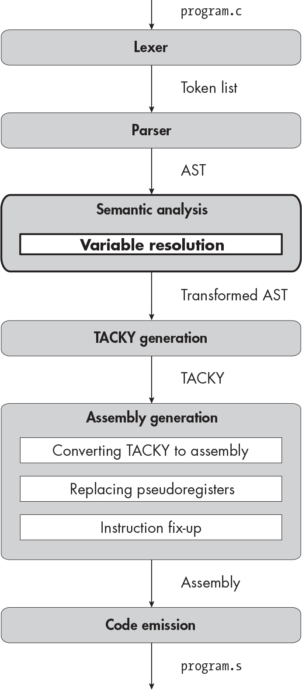

` ``Description`

## `5` `LOCAL VARIABLES`

Up to this point, you’ve been able to compile only programs that return constant expressions. In this chapter, you’ll implement local variables, which will let you compile far more interesting programs. Your compiler will need to support a more expressive grammar so it can parse C programs that declare, assign values to, and refer to variables. It will also need to contend with the ways that variables can be declared and used incorrectly. To catch these potential errors, you’ll add a *semantic analysis* stage, which is bolded in the diagram at the beginning of this chapter. This stage validates that variables are not declared multiple times in the same scope or used before they’re declared. It also assigns each variable a unique identifier that allows you to safely refer to it in TACKY.

Luckily, the TACKY and assembly IRs in your compiler already support variables, since they use temporary variables to store intermediate results. That means you won’t have to change anything in your compiler after TACKY generation. Before jumping into the compiler passes, let’s define the language features we need to support.

### `Variables, Declarations, and Assignment`

For variables to be even remotely useful, we’ll need to implement a few new language features. First of all, we need to support variable *declarations*. Every local variable in C must be declared before it can be used. A variable declaration consists of the variable’s type, its name, and an optional expression, called an *initializer*, that specifies its initial value. Here’s a declaration with an initializer:

    int a = 2 * 3;

Here’s a declaration without one:

    int b;

Second, we must support using a variable’s value in an expression, like `b` `+` `1`. Just like an integer constant, a variable is a complete expression on its own but can also appear in more complex logical and arithmetic expressions.

Finally, we need to support variable *assignment*. In C, you update a variable using the assignment operator (`=`). Variable assignment in C is an expression, like addition, subtraction, and so forth. This means it evaluates to some result, which you can use in a `return` statement or as part of a larger expression. The result of an assignment expression is the updated value of the destination variable. For example, the expression `2 * (a` `=` `5)` evaluates to 10. First, you assign the value `5` to the variable `a`, then you multiply the new value of `a` by `2`. Because assignment is an expression, you can perform multiple assignments at once in an expression like `a` `=` `b` `=` `c`. Unlike other binary operations we’ve seen so far, assignment is right-associative, so `a` `=` `b` `=` `c` is equivalent to `a` `=` `(b` `=` `c)`. To evaluate this expression, you first perform the assignment `b` `=` `c`. Then, you assign the result of that expression, which is the new value of `b`, to `a`.

Variable assignment is the first expression we’ve encountered that has a *side effect*. That means it doesn’t just reduce to a value; it also has some impact on the execution environment. In `2 * (a` `=` `5)`, the subexpression `a` `=` `5` has a value (`5`), and it also has a side effect (updating `a`). Most of the time, we care only about the side effect of a variable assignment, not the resulting value.

An action counts as a side effect only if it’s visible outside of the language construct in question. For example, updating a local variable is a side effect of an assignment expression because the variable’s new value is visible outside of that expression. But it’s *not* a side effect of the function that contains the assignment expression, because the effect isn’t visible outside of that function. Updating a global variable, on the other hand, would be a side effect of the expression *and* the function.

Since we’re implementing expressions with side effects, it also makes sense to add support for *expression statements*, which evaluate an expression but don’t use the result. Statements that assign to variables, like

    foo = 3 * 3;

are expression statements. This expression has the side effect of assigning the value `9` to `foo`. The result of the whole expression is also the value `9`, but this result isn’t used anywhere; only the side effect of updating `foo` affects the program.

You can also have expression statements with no side effect at all:

    1 + a * 2;

You don’t typically see expression statements without side effects, because they’re completely useless, but they’re perfectly valid.

Any expression can appear on the right side of the `=` operator, but only some expressions can appear on the left side. It makes sense to assign values to variables, array elements, and struct members:

    x = 3;
    array[2] = 100;
    my_struct.member = x * 2;

But it doesn’t make sense to assign values to constants or the results of logical or arithmetic expressions:

    4 = 5;
    foo && bar = 6;
    a - 5 = b;

Expressions that can appear on the left side of an assignment are called *lvalues*. In this chapter, the only lvalues we’ll handle are variables. You’ll learn about more complex lvalues in Part II.

`UNDEFINED BEHAVIOR ALERT!`

`Local variables introduce new opportunities for undefined behavior, which you learned about in` `Chapter 4``. For example, with a few exceptions, using the value of an uninitialized variable leads to undefined behavior. Consider the following function:`

    int foo(void) {
        int a;
        return a;
    }

`It’s possible that this function will allocate stack space for` `a` `without initializing it, then return whatever value happens to already be in that uninitialized memory. In this case, although the return value of` `foo` `will be unpredictable, the rest of the program will behave reasonably. But because` `foo``’s behavior is undefined, it’s also possible that it will do something completely different; calling` `foo` `could crash the program or even make other functions misbehave later on.`

`Let’s look at a subtler example with two unsequenced variable assignments:`

    int main(void) {
        int a;
        (a = 4) + (a = 5);
        return a;
    }

`Remember that the operands of a binary operator like` `+` `are unsequenced; they can be evaluated in any order. It might look like this program has two possible behaviors: it could return either` `4` `or` `5``. But performing multiple unsequenced assignments to the same variable is undefined behavior, so there are no restrictions on how this program might behave. In practice, it probably` `will` `return` `4` `or` `5``, but that isn’t guaranteed.`

`Similarly, the behavior is undefined if you use a variable’s value and assign to it in unsequenced expressions, like so:`

    int main(void) {
        int a = 0;
        return (a = 1) + a;
    }

`These examples aren’t an exhaustive overview of every possible undefined behavior involving local variables, but they illustrate how problems that appear to affect one small part of a program can make the entire program’s behavior undefined.`

Now that you understand the language features you’re going to add in this chapter, let’s extend the compiler.

### `The Lexer`

You’ll add one new token in this chapter:

`=` An equal sign, the assignment operator

You don’t need a new token to represent variable names. The lexer already recognizes identifiers, like the function name `main`, and variable names are just identifiers. We won’t distinguish between function names and variable names until the parsing stage.

`TEST THE LEXER`

`To test the lexer, run:`

    $ ./test_compiler /path/to/your_compiler --chapter 5 --stage lex

`Your lexer should succeed on all of this chapter’s test cases.`

### `The Parser`

As usual, we’ll update the AST and grammar to support this chapter’s new language constructs. We’ll also update our precedence climbing code to correctly parse assignment expressions.

#### `The Updated AST and Grammar`

Let’s start by extending our AST definition to support using, declaring, and assigning to variables. To support using variables in expressions, we’ll add a `Var` constructor for the `exp` AST node. Since variable assignment is also an expression, we’ll add an `Assignment` constructor for `exp` too. Listing 5-1 shows the updated definition of `exp`.

    exp = Constant(int)
        | Var(identifier)
        | Unary(unary_operator, exp)
        | Binary(binary_operator, exp, exp)
        | Assignment(exp, exp)

`Listing 5-1: The definition for the` `exp` `AST node, including` `Var` `and` `Assignment`

A `Var` node holds the variable name. An `Assignment` consists of two parts: the lvalue being updated and the expression we’re assigning to that lvalue. When we parse the program, we’ll allow any expression on the left-hand side of an assignment. In the semantic analysis stage, we’ll make sure that expression is a valid lvalue. We validate lvalues during semantic analysis, rather than during parsing, because we’ll need to support more complex lvalues in later chapters.

Next, we’ll extend the `statement` AST node to support expression statements. We’ll add a new `Expression` constructor, which takes a single `exp` node as an argument. We’ll also add a `Null` constructor to represent *null statements*, which are expression statements without the expression:

    statement = Return(exp) | Expression(exp) | Null

A null statement has no content; it’s just a semicolon. It’s a placeholder for when the grammar requires a statement, but you don’t want that statement to do anything. Listing 5-2, which is taken from section 6.8.3, paragraph 5, of the C standard, illustrates why you might need a null statement.

    char *s;
    /* ... */
    while ( ❶ *s++ != '\0')
      ❷ ;

`Listing 5-2: An example of a null statement from the C standard`

In this example, the `while` loop finds the end of a null-terminated string by iterating over each character until it reaches the null byte. The loop body doesn’t need to do anything, because all the work happens in the controlling expression ❶, but omitting the loop body completely would be syntactically invalid. Instead, you can use a null statement ❷. Null statements don’t really have anything to do with local variables, but we’ll implement them here because they’re technically a kind of expression statement. (They’re also easy to implement.)

We’ll need an AST node to represent variable declarations too:

    declaration = Declaration(identifier name, exp? init)

A declaration consists of a name and an optional initializer. (The question mark in `exp?` means that field is optional.) We’ll include type information for declarations in Part II, but we don’t need it yet because `int` is the only possible type.

Declarations are a separate AST node, not another kind of `statement`, because declarations aren’t statements! Conceptually, the difference is that statements are executed when the program runs, whereas declarations simply tell the compiler that some identifier exists and can be used later. This distinction will become obvious during TACKY generation: we’ll handle declarations with initializers like normal variable assignments, but declarations without initializers will just disappear.

The more concrete difference, from the parser’s perspective, is that there are parts of a program where a statement can appear but a declaration can’t. For example, the body of an `if` statement is always another statement:

    if (a == 2)
        return 4;

It can’t be a declaration, because declarations aren’t statements. So, this is invalid:

    if (a == 2)
        int x = 0;

It might be surprising to hear that an `if` body is a single statement, since an `if` body often appears to be a list of statements and declarations, like this:

    if (a == 2) {
        int x = 0;
        return x;
    }

But a list of statements and declarations wrapped in braces is actually a single statement, called a *compound statement*. We’ll implement compound statements in Chapter 7; for now, the key point is that we need to distinguish between statements and declarations in the AST.

Finally, we need to change how we define a function body so that we can parse functions that contain multiple declarations and statements, like Listing 5-3.

    int main(void) {
        int a;
        a = 2;
        return a * 2;
    }

`Listing 5-3: A program with a declaration and multiple statements`

Up until this point, we’ve defined a function body as a single statement:

    function_definition = Function(identifier name, statement body)

Now, though, we need to define it as a list of statements and declarations, which are collectively called *block items*. We’ll add a new AST node to represent block items:

    block_item = S(statement) | D(declaration)

Then we can represent a function body as a list of block items:

    function_definition = Function(identifier name, block_item* body)

The asterisk here indicates that `body` is a list. Putting it all together, Listing 5-4 shows the new AST definition, with this chapter’s additions bolded.

    program = Program(function_definition)
    function_definition = Function(identifier name, block_item* body)
    block_item = S(statement) | D(declaration)
    declaration = Declaration(identifier name, exp? init)
    statement = Return(exp) | Expression(exp) | Null
    exp = Constant(int)
        | Var(identifier)
        | Unary(unary_operator, exp)
        | Binary(binary_operator, exp, exp)
        | Assignment(exp, exp)
    unary_operator = Complement | Negate | Not
    binary_operator = Add | Subtract | Multiply | Divide | Remainder | And | Or
                    | Equal | NotEqual | LessThan | LessOrEqual
                    | GreaterThan | GreaterOrEqual

`Listing 5-4: The abstract syntax tree with variables, assignment expressions, and expression statements`

Listing 5-5 shows the updated grammar.

    <program> ::= <function>
    <function> ::= "int" <identifier> "(" "void" ")" "{" {<block-item>} "}"
    <block-item> ::= <statement> | <declaration>
    <declaration> ::= "int" <identifier> ["=" <exp>] ";"
    <statement> ::= "return" <exp> ";" | <exp> ";" | ";"
    <exp> ::= <factor> | <exp> <binop> <exp>
    <factor> ::= <int> | <identifier> | <unop> <factor> | "(" <exp> ")"
    <unop> ::= "-" | "~" | "!"
    <binop> ::= "-" | "+" | "*" | "/" | "%" | "&&" | "||"
              | "==" | "!=" | "<" | "<=" | ">" | ">=" | "="
    <identifier> ::= ? An identifier token ?
    <int> ::= ? A constant token ?

`Listing 5-5: The grammar with variables, assignment expressions, and expression statements`

Listing 5-5 introduces a couple of new bits of EBNF notation. Wrapping a sequence of symbols in braces indicates that it can be repeated zero or more times, so `{<block-item>}` indicates a list of `<block-item>` symbols. Note the difference between unquoted braces, which indicate repetition, and quoted braces, which indicate literal `{`and} tokens. In the rule for `<function>`, the expression `"{" {<block-item>} "}"` indicates a `{`token, then a list of `<block-item>` symbols, then a} token. The pseudocode in Listing 5-6 shows how to parse the list of block items in a function definition.

    parse_function_definition(tokens):
        // parse everything up through the open brace as before...
        --snip--
        function_body = []
        while peek(tokens) != "}":
            next_block_item = parse_block_item(tokens)
            function_body.append(next_block_item)
        take_token(tokens)
        return Function(name, function_body)

`Listing 5-6: Parsing a list of block items`

You keep parsing block items until you see a close brace, which indicates the end of the function body. You can then remove that brace from the input stream and finish processing the function definition.

Just as braces indicate repetition in EBNF notation, wrapping a sequence of symbols in square brackets indicates that it’s optional. We represent the optional initializer in declarations with the expression `["=" <exp>]`. To handle this optional construct, your declaration parsing code should check whether the identifier in the grammar rule is followed by an `=` token, which means the initializer is present, or a `;` token, which means the initializer is absent.

While parsing `<block-item>`, you need a way to tell whether the current block item is a statement or a declaration. To do this, peek at the first token; if it’s the `int` keyword, it’s a declaration, and otherwise it’s a statement.

Listing 5-5 also includes a new production rule for the `<factor>` symbol, corresponding to the new `Var` constructor, and a new binary operator, `=`, to represent variable assignment. Even though we won’t represent variable assignment with the `Binary` AST node, it looks just like any other binary operator in the grammar. This lets us parse variable assignments with the precedence climbing algorithm we’ve already implemented, although it will require a few tweaks.

#### `An Improved Precedence Climbing Algorithm`

There’s just one problem with using our current precedence climbing code to parse assignment expressions: the `=` operator is right-associative, but our code can handle only left-associative operators. To remind ourselves why, let’s look at the precedence climbing pseudocode again. We saw the full version of this algorithm in Listing 3-7; it’s reproduced here as Listing 5-7.

    parse_exp(tokens, min_prec):
        left = parse_factor(tokens)
        next_token = peek(tokens)
        while next_token is a binary operator and precedence(next_token) >= min_prec:
            operator = parse_binop(tokens)
            right = parse_exp(tokens, ❶ precedence(next_token) + 1)
            left = Binary(operator, left, right)
            next_token = peek(tokens)
        return left

`Listing 5-7: Parsing left-associative operators with precedence climbing`

When we make recursive calls to `parse_exp`, we set the minimum precedence higher than the precedence of the current operator ❶. So, if `next_token` is `+` and `tokens` is `b` `+` `4`, a recursive call to `parse_exp` will return only `b`, because `+` won’t meet the minimum precedence. That’s how we get left-associative expressions like `(left` `+` `b)` `+` `4`.

If `next_token` is right-associative, however, we shouldn’t stop if we hit that same token in the recursive call to `parse_exp`; we should include it in the right-hand expression. To do that, we need to set the minimum precedence on the right-hand side *equal* to the precedence of the current token. In other words, when handling a right-associative token like `=`, the recursive call should be:

    right = parse_exp(tokens, precedence(next_token))

Suppose you’re parsing `a` `=` `b` `=` `c`. You’ll parse the left-hand side into the factor `a`, then call `parse_exp` recursively to handle `b` `=` `c`. If the minimum precedence in this recursive call were `precedence("=")` `+` `1`, it would parse only the next factor, `b`. But if the minimum precedence is `precedence("=")`, it will parse the entire assignment, returning `b` `=` `c` as the right-hand side of the expression. The final result will be `a` `=` `(b` `=` `c)`, which is exactly what we want.

The only other difference between parsing variable assignment and other binary expressions is that we need to construct an `Assignment` AST node instead of a `Binary` node. Listing 5-8 gives the updated pseudocode for precedence climbing with these adjustments.

    parse_exp(tokens, min_prec):
        left = parse_factor(tokens)
        next_token = peek(tokens)
        while next_token is a binary operator and precedence(next_token) >= min_prec:
            if next_token is "=":
                take_token(tokens) // remove "=" from list of tokens
                right = parse_exp(tokens, precedence(next_token))
                left = Assignment(left, right)
            else:
                operator = parse_binop(tokens)
                right = parse_exp(tokens, precedence(next_token) + 1)
                left = Binary(operator, left, right)
            next_token = peek(tokens)
        return left

`Listing 5-8: The extended precedence climbing algorithm`

Finally, we need to add `=` to our precedence table. Table 5-1 lists the precedence values I’m using for all the binary operators, with the new operator bolded. It has lower precedence than any other operator we’ve implemented so far.

`Table 5-1:` `Precedence Values of Binary Operators`

| `Operator` | `Precedence` |
|------------|--------------|
| `*`        | `50`         |
| `/`        | `50`         |
| `%`        | `50`         |
| `+`        | `45`         |
| `-`        | `45`         |
| `<`        | `35`         |
| `<=`       | `35`         |
| `>`        | `35`         |
| `>=`       | `35`         |
| `==`       | `30`         |
| `!=`       | `30`         |
| `&&`       | `10`         |
| `\|\|`       | `5`          |
| `=`        | `1`          |

At this point, you know how to build a valid AST for every program you’ll encounter in this chapter; you’re ready to update the parser and test it out.

`TEST THE PARSER`

`To test this chapter’s changes to the parser, run:`

    $ ./test_compiler /path/to/your_compiler --chapter 5 --stage parse

`The parser should successfully parse every test case in` `tests/chapter_5/valid` `and` `tests/chapter_5/invalid_semantics``. It should raise an error for every test case in` `tests/chapter_5/invalid_parse``.`

### `Semantic Analysis`

Up to this point, the only errors we’ve had to worry about were syntax errors. If we could parse a program, we knew the remaining compiler passes would succeed. Now, a program can be syntactically correct but *semantically* invalid; in other words, it might just not make sense. For example, a program could assign a value to an expression that isn’t assignable:

    2 = a * 3; // ERROR: can't assign a value to a constant

Or it could declare the same variable twice in the same scope:

    int a = 3;
    int a; // ERROR: a has already been declared!

Or it could try to use a variable before it’s been declared:

    int main(void) {
        a = 4; // ERROR: a has not been declared yet!
        return a;
    }

All of these examples use valid syntax, but you should get an error if you try to compile them. The semantic analysis stage detects this kind of error. This stage will eventually include several different passes that validate different aspects of the program. In this chapter, we’ll add our first semantic analysis pass, *variable resolution*.

The variable resolution pass will track which variables are in scope throughout the program and *resolve* each reference to a variable by finding the corresponding declaration. It will report an error if a program declares the same variable more than once or uses a variable that hasn’t been declared. It will also rename each local variable with a globally unique identifier. For example, it might convert the program

    int main(void) {
        int a = 4;
        int b = a + 1;
        a = b - 5;
        return a + b;
    }

into something like this:

    int main(void) {
        int a0 = 4;
        int b1 = a0 + 1;
        a0 = b1 - 5;
        return a0 + b1;
    }

(Of course, this pass actually transforms ASTs rather than source files, but I’m presenting these examples as C source code to make them more readable.)

This transformation may not seem too helpful—the variable names `a` and `b` were already unique—but it will be essential once we introduce multiple variable scopes, because different variables in different scopes can have the same name. For example, we might transform the program

    int main(void) {
        int a = 2;
        if (a < 5) {
            int a = 7;
            return a;
        }
        return a;
    }

into:

    int main(void) {
        int a0 = 2;
        if (a0 < 5) {
            int a1 = 7;
            return a1;
        }
        return a0;
    }

This makes it clear that `a0` and `a1` are two different variables, which will simplify later compiler stages.

#### `Variable Resolution`

Now we’ll write the variable resolution pass. During this pass, we’ll construct a map from the user-defined variable names to the unique names we’ll use in later stages. We’ll process block items in order, checking for errors and replacing variable names as we go. When we encounter a variable declaration, we’ll add a new entry mapping that variable name to a unique name that we generate. Then, when we see an expression that uses a variable, we’ll replace the variable name with the corresponding unique name from the map. The pseudocode in Listing 5-9 demonstrates how to resolve a variable declaration.

    resolve_declaration(Declaration(name, init), variable_map):
      ❶ if name is in variable_map:
            fail("Duplicate variable declaration!")
        unique_name = make_temporary()
      ❷ variable_map.add(name, unique_name)
      ❸ if init is not null:
            init = resolve_exp(init, variable_map)
      ❹ return Declaration(unique_name, init)

`Listing 5-9: Resolving a variable declaration`

First, we check whether the variable being declared is already present in the variable map ❶. If it is, that means it was declared earlier in the function, so this is a duplicate declaration. In that case, we throw an error. Next, we associate the user-defined variable name with a unique autogenerated name in the variable map ❷.

After we update the variable map, we process the declaration initializer, if there is one ❸. The call to `resolve_exp` returns a new copy of the initializer with any variables renamed, throwing an error if the initializer uses an undeclared variable. Finally, we return a copy of the `Declaration` node ❹ that uses the new autogenerated name instead of the old user-defined one, along with the new initializer we got from `resolve_exp`.

The identifiers you generate in `resolve_declaration` must not conflict with the names of temporary TACKY variables. If you’re using a global counter to generate unique identifiers, use the same counter across both the semantic analysis and TACKY generation stages.

These identifiers must not conflict with the names of functions or global variables, either. (In Chapter 10, you’ll see that global variables keep their original names, like functions, instead of being renamed, like local variables.) You can rely on the usual trick of generating identifiers that wouldn’t be syntactically valid in C. I recommend including a variable’s original name in its autogenerated name to help with debugging; for example, you might rename `a` to `a.0` and `b` to `b.1`.

> `NOTE`

*You might have noticed that the examples in the previous section used autogenerated identifiers that* are *syntactically valid in C, like a0 and b1, because those examples were presented as C source code. The naming scheme in those examples wouldn’t work in practice, because the renamed variables could conflict with function names and with each other. For example, two local variables named a and a1 could both be renamed a12.*

`USING VARIABLES IN THEIR OWN INITIALIZERS`

`Because ``Listing 5-9`` updates the variable map before processing the initializer, it will happily process an initializer that uses the same variable it initializes. Take this example:`

    int foo = foo + 1;

`When we process the initializer,` `foo` `+` `1``, the variable` `foo` `is already in the map, so the variable resolution pass won’t complain. This is consistent with the C standard; a variable really is in scope in its own initializer. Still, this declaration isn’t exactly legal. It will result in undefined behavior, because` `foo` `is uninitialized when it’s used in` `foo` `+` `1``. (Remember that compilers don’t need to detect undefined behavior, so it’s okay not to report an error here.)`

`In other cases, using a variable in its own initializer makes sense. For example, in`

    unsigned int foo = sizeof foo;

`we’re still using` `foo` `before initializing it, but we consider only` `foo``’s size, not its value. Annex J of the C standard says we get undefined behavior when “an lvalue … is used in a context` `that requires the value of the designated object``, but the object is uninitialized” (emphasis added). Since` `sizeof` `doesn’t require` `foo``’s value, there’s no undefined behavior in this declaration.`

To resolve a `return` statement or expression statement, we just process the inner expression, as Listing 5-10 illustrates.

    resolve_statement(statement, variable_map):
        match statement with
        | Return(e) -> return Return(resolve_exp(e, variable_map))
        | Expression(e) -> return Expression(resolve_exp(e, variable_map))
        | Null -> return Null

`Listing 5-10: Resolving a statement`

When we resolve an expression, we check that all the variable uses and assignments in that expression are valid. Listing 5-11 shows how to do that.

    resolve_exp(e, variable_map):
        match e with
        | Assignment(left, right) ->
            if left is not a Var node:
                fail("Invalid lvalue!")
            return Assignment( ❶ resolve_exp(left, variable_map), ❷ resolve_exp(right, variable_map))
        | Var(v) ->
            if v is in variable_map:
                return Var( ❸ variable_map.get(v))
            else:
                fail("Undeclared variable!")
        | --snip--

`Listing 5-11: Resolving an expression`

When we encounter an `Assignment` expression, we check that the left side is a valid lvalue; for now, that means it must be a `Var`. We then recursively resolve the left ❶ and right ❷ subexpressions. When we encounter a `Var`, we replace the variable name with the unique identifier from the variable map ❸. If it’s not in the variable map, that means it hasn’t been declared yet, so we throw an error. Since we process both sides of an assignment recursively with `resolve_exp`, the `Var` case in `resolve_exp` handles variables on the left side of assignment expressions too.

To handle other kinds of expressions, we process any subexpressions recursively with `resolve_exp`. Ultimately, the variable resolution pass should return a complete AST that uses autogenerated instead of user-defined variable names.

`THE TROUBLE WITH TYPEDEF`

`The way we’ve structured our compiler has one major limitation: we first parse the entire program, and then resolve variables. This approach works well for the subset of C we’ll implement in this book, but to implement the whole language, you need to resolve identifiers` `while` `you parse the program. In particular, our approach can’t handle` `typedef``, which lets you declare names for arbitrary types:`

    typedef int foo;

`The problem is that some statements can be parsed one way if an identifier like` `foo` `refers to a type and another way if it refers to a function or variable. Here’s a simple illustration:`

    return (foo) * x;

`If` `foo` `is the name of a type, this statement dereferences` `x``, casts the result to type` `foo``, and then returns it. But if` `foo` `is a variable, this statement instead multiplies` `foo` `by` `x` `and returns the result. To make matters worse, type names follow the same scoping rules as variable names. So, just as the same identifier might refer to two different variables at different points in a program, it might refer to a variable at one point and a type at a different point. To figure out whether a given identifier refers to a type or a variable, you need to resolve identifiers as you parse the program. Since the correct way to parse a C construct might depend on other parts of the program you’ve already parsed, we say that C has a` `context-sensitive grammar``. (By contrast, a language has a` `context-free grammar` `if you can apply every production rule in isolation, without worrying about anything that came before it.)`

`Production C compilers generally deal with` `typedef` `by maintaining a symbol table (similar to our variable map) while they parse the program. Some of them feed the information from the symbol table back into the lexer, which then interprets type names as a different kind of token from other identifiers; this approach is called the` `lexer hack``. Others use the same token type for all identifiers and do all the work of distinguishing between type names and other identifiers in the parser. If you want to implement` `typedef` `on your own, I recommend the latter approach.`

`Here’s a quick sketch of how you could adapt our implementation to support` `typedef``. First, you’ll need to move all the variable resolution logic into the parser. You should pass around a variable map as you parse the program. Your parser should add declarations to the map and rename variables as it goes. It should also validate that variables are declared before they’re used,` `that there are no conflicting declarations, and so on. Once you’re ready to add` `typedef``, you can track type names in this map too, recording whether each entry in the map refers to a type or some other entity. You might want to convert type names to unique IDs during parsing, and then replace these names with the corresponding types in a separate pass. Alternatively, you could replace type names with the corresponding types right away as you parse the program. Either way, your parser will have enough information to distinguish types from other identifiers. The other semantic analysis passes that we’ll add in later chapters should remain separate from the parser.`

`If you decide to implement` `typedef` `yourself, I recommend reading Eli Bendersky’s blog post “The Context Sensitivity of C’s Grammar, Revisited,” which walks through some particularly ugly edge cases that you’ll need to handle (`[`https://eli.thegreenplace.net/2011/05/02/the-context-sensitivity-of-cs-grammar-revisited`](https://eli.thegreenplace.net/2011/05/02/the-context-sensitivity-of-cs-grammar-revisited)`).`

#### `The --validate Option`

To test out the new compiler pass, you’ll need to add a `--validate` command line option to your compiler driver. This option should run your compiler through the semantic analysis stage, stopping before TACKY generation. In later chapters, after you’ve updated the semantic analysis stage to include multiple passes, this option should direct your compiler to run all of them.

Like the existing options to run the compiler up to a specific stage, this new option shouldn’t produce any output files. As usual, it should return an exit code of 0 if compilation succeeds and a nonzero exit code if it fails.

`TEST THE VARIABLE RESOLUTION PASS`

`To test out this pass, run:`

    $ ./test_compiler /path/to/your_compiler --chapter 5 --stage validate

`This pass should reject every test case in` `tests/chapter_5/invalid_semantics` `and accept every test case in` `tests/chapter_5/valid``. You may also want to write your own unit tests for this pass to verify that it updates variable names correctly.`

### `TACKY Generation`

We don’t need to modify the TACKY IR at all in this chapter. We can already refer to variables with the TACKY `Var` constructor and assign values to them with the `Copy` instruction. The TACKY IR doesn’t include variable declarations, because it doesn’t need them. We got all the information we needed out of variable declarations during semantic analysis, and now we can discard them.

Although TACKY itself doesn’t need to change, the TACKY generation pass does: we need to extend this pass to handle the latest additions to the AST. First, we’ll deal with the two new kinds of expressions we added in this chapter. Next, we’ll handle the other additions to the AST, including expression statements and declarations.

#### `Variable and Assignment Expressions`

We’ll convert each `Var` in the AST to a `Var` in TACKY, keeping the same identifier. Because we autogenerated the identifier, we can guarantee that it won’t conflict with any other identifiers in the TACKY program. To handle an `Assignment` AST node, we’ll emit the instructions to evaluate the right-hand side, then emit a `Copy` instruction to copy the result to the left-hand side. Listing 5-12 shows how to handle both expressions.

    emit_tacky(e, instructions):
        match e with
        | --snip--
        | Var(v) -> return Var(v)
        | Assignment(Var(v), rhs) ->
            result = emit_tacky(rhs, instructions)
            instructions.append(Copy(result, Var(v)))
            return Var(v)

`Listing 5-12: Converting variable and assignment expressions to TACKY`

This is an inefficient way to handle variable assignments; we’ll often end up evaluating the right-hand side, storing the result in a temporary variable, and then copying it into variable `v`, instead of storing the result directly in `v` and avoiding the temporary variable entirely. The optimizations we implement in Part III will remove some of these superfluous copies.

#### `Declarations, Statements, and Function Bodies`

Now we’ll handle declarations. As I mentioned earlier, we can discard variable declarations at this stage; in TACKY, you don’t need to declare variables before using them. But we do need to emit TACKY to *initialize* variables. If a declaration includes an initializer, we’ll handle it like a normal variable assignment. If a declaration doesn’t have an initializer, we won’t emit any TACKY at all.

We also need to handle expression statements and null statements. To convert an expression statement to TACKY, we’ll just process the inner expression. This will return a new temporary variable that holds the result of the expression, but we won’t use that variable again during TACKY generation. We won’t emit any TACKY instructions for a null statement.

Finally, we’ll deal with the fact that a function contains multiple block items instead of a single statement. We’ll process the block items in the function body in order, emitting TACKY for each one. Suppose we’re compiling the C function in Listing 5-13.

    int main(void) {
        int b;
        int a = 10 + 1;
        b = a * 2;
        return b;
    }

`Listing 5-13: A C function with variable declarations and an assignment expression`

Let’s assume that we renamed `a` and `b` to `a.1` and `b.0` during variable resolution, and that we use the naming scheme `tmp.``n` for all temporary variables, where `n` is the value of a global counter. Then, we’ll generate the TACKY instructions shown in Listing 5-14 for the function body. (This listing, like Listing 4-6 in the previous chapter, uses the notation `dst` `=` `src` for `Copy` instructions, instead of `Copy(src, dst)`. Similarly, it uses notation like `dst` `=` `src1` `+` `src2` for `Binary` instructions, instead of `Binary(Add, src1, src2, dst)`.)

    tmp.2 = 10 + 1
    a.1 = tmp.2
    tmp.3 = a.1 * 2
    b.0 = tmp.3
    Return(b.0)

`Listing 5-14: Implementing ``Listing 5-13`` in TACKY`

We won’t generate any TACKY for the declaration of `b` in Listing 5-13, because it doesn’t include an initializer. We’ll convert the declaration of `a` into the first two instructions of Listing 5-14, which calculate `10` `+` `1` and copy the result to `a`. We’ll convert the expression statement `b` `=` `a * 2;` to the next two instructions, and we’ll convert the `return` statement to the final `Return` instruction.

At this point, you know how to convert the whole AST to TACKY. But we’re not quite done; we have one last edge case to consider.

#### `Functions with No return Statement`

Since our AST now supports more than one kind of statement, we might encounter functions without `return` statements, like Listing 5-15.

    int main(void) {
        int a = 4;
        a = 0;
    }

`Listing 5-15: A` `main` `function with no` `return` `statement`

What happens if you call this function? The C standard gives one answer for `main` and a different answer for any other function. (I’m ignoring functions with return type `void`, which don’t return a value, because we haven’t implemented them yet.) Section 5.1.2.2.3 says that “reaching the} that terminates the `main` function returns a value of 0,” so the code in Listing 5-15 is equivalent to Listing 5-16.

    int main(void) {
        int a = 4;
        a = 0;
        return 0;
    }

`Listing 5-16: A` `main` `function that returns` `0`

The situation is more complicated for other functions. According to section 6.9.1, paragraph 12, “Unless otherwise specified, if the} that terminates a function is reached, and the value of the function call is used by the caller, the behavior is undefined.” This implicitly covers two possible cases. In the first case, shown in Listing 5-17, the caller tries to use the function’s return value.

    #include <stdio.h>

    int foo(void) {
        printf("I'm living on the edge, baby!");
        // no return statement
    }

    int main(void) {
        return foo(); // try to use return value from foo
    }

`Listing 5-17: Trying to use a function’s return value when it didn’t return anything`

This results in undefined behavior, which means all bets are off; the standard makes no guarantees about what will happen. In the second case, shown in Listing 5-18, we call the function but don’t use its return value.

    #include <stdio.h>

    int foo(void) {
        printf("I'm living on the edge, baby!");
        // no return statement
    }

    int main(void) {
        foo();
        return 0;
    }

`Listing 5-18: Calling a function without using its return value`

There’s no undefined behavior in this program; it’s guaranteed to print `I'm living on the edge, baby!` and then exit with a status code of 0. When we compile a function like `foo`, we don’t know whether any of its callers use its return value, so we have to assume it’s part of a program like Listing 5-18. In particular, we need to restore the caller’s stack frame and return control to the caller at the end of `foo`. Because we aren’t returning any particular value, we can set EAX to whatever we like, or not set it at all.

The easiest way to handle both cases is to add one extra TACKY instruction, `Return(Constant(0))`, to the end of every function body. This gives us the correct behavior for `main` and for programs like Listing 5-18. If a function already ends with a `return` statement, this extra instruction will never run, so it won’t change the program’s behavior. In Part III, you’ll learn how to eliminate this extra `Return` instruction when it’s not needed.

Once you’ve extended the TACKY generation stage, you’re ready to test the whole compiler! Because we didn’t change the TACKY IR, we don’t need to change the assembly generation or code emission stages, either.

`TEST THE WHOLE COMPILER`

`To test out your compiler, run:`

    $ ./test_compiler /path/to/your_compiler --chapter 5

`Once these tests pass, you can either implement a couple of related extra credit features or go straight to the next chapter.`

### `Extra Credit: Compound Assignment, Increment, and Decrement`

Now that your compiler supports the simple assignment operator, `=`, you have the option of implementing several *compound assignment* operators: `+=`, `-=`, `*=`, `/=`, and `%=`. If you added the bitwise binary operators in Chapter 3, you should add the corresponding compound assignment operators here as well: `&=`, `|=`, `^=`, `<<=`, and `>>=`.

You can also add the increment and decrement operators, `++` and `--`. Each of these operators can be used in two distinct ways: as a prefix operator in an expression like `++a`, or as a postfix operator in an expression like `a++`. When you use `++` or `--` as a prefix operator, it increments or decrements its operand and evaluates to its new value. A postfix `++` or `--` operator also increments or decrements its operand, but it evaluates to the operand’s original value. As with the other language constructs in this chapter, you can implement the compound assignment, increment, and decrement operators without changing any part of your compiler after TACKY generation.

To include test cases for the increment and decrement operators, use the `--increment` flag when you run the test suite. To include the test cases for compound assignment, use the `--compound` flag. The test script will run the test cases for bitwise compound assignment operators, like `|=`, only if you use both the `--compound` and `--bitwise` flags.

You can test all the extra credit features at once using the `--extra-credit` flag. The command

    $ ./test_compiler /path/to/your_compiler --chapter 5 --extra-credit

is equivalent to:

    $ ./test_compiler /path/to/your_compiler --chapter 5 --bitwise --compound --increment

When we introduce more extra credit features in later chapters, the `--extra-credit` flag will cover those too.

### `Summary`

This chapter was a milestone in a few ways: you added a new kind of statement, and you implemented your first language construct that has a side effect. You also implemented a semantic analysis stage to catch new kinds of errors in the programs you compile. In later chapters, you’ll keep expanding the semantic analysis stage to detect more errors and gather additional information that you’ll need later in compilation. Next, you’ll implement your first control-flow constructs: `if` statements and conditional expressions.