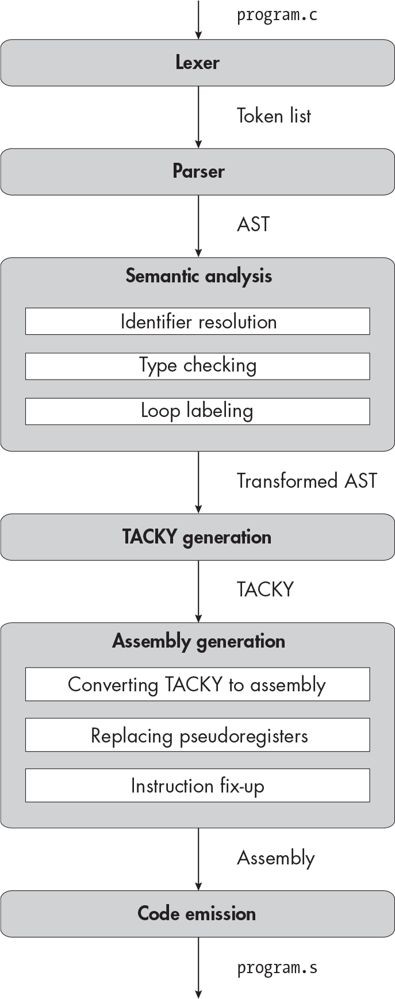

` ``Description`

## `11` `LONG INTEGERS`


In this chapter, you’ll add a new type: `long`. This is a signed integer type, just like `int`; the only difference between the two types is the range of values they hold. You’ll also add an explicit cast operation, which converts a value to a different type.

Because `long` is so similar to the `int` type we already support, we won’t need to add many new assembly or TACKY instructions or implement complicated type casting logic. Instead, we’ll focus on laying the groundwork we’ll need for the rest of Part II. We’ll track the types of constants and variables, attach type information to the AST, identify implicit casts and make them explicit, and determine the operand sizes for assembly instructions. We’ll need to make at least a small change to every stage of the compiler except for loop labeling. Before we get started, let’s see what operations on `long`s look like in assembly.

### `Long Integers in Assembly`

The C standard doesn’t specify the sizes of integer types, but the System V x64 ABI says that an `int` is 4 bytes and a `long` is 8. To wildly oversimplify things, C expressions with `long` operands are ultimately translated into assembly instructions on quadwords (8-byte operands). For example, the following assembly instructions operate on quadwords to calculate `2` `+` `2` and produce a quadword result:

    movq    $2, %rax
    addq    $2, %rax

This looks almost identical to the equivalent code using longwords, which are 4 bytes:

    movl    $2, %eax
    addl    $2, %eax

The only differences are the suffix on the `mov` and `add` instructions and whether we use the whole RAX register or just EAX, its lower 4 bytes.

> `NOTE`

*The terms* word*,* longword*, and* quadword *date back to the era of 16-bit processors, when an int was 2 bytes and a long was 4 bytes. To make matters worse, 4-byte values are often called* doublewords *instead of longwords. I use the term* longword *to mirror AT&T assembly syntax, but Intel’s documentation uses* doubleword*.*

Most quadword instructions accept only 8-byte operands and produce 8-byte results, just as most longword instructions accept only 4-byte operands and produce 4-byte results. Expressions in C, on the other hand, often use several operand types at once or assign a value of one type to an object of a different type. During compilation, we’ll decompose these expressions into simple instructions that either take operands of a single type and produce results of the same type or explicitly perform type conversions. Luckily, the C standard tells us exactly where these type conversions occur.

#### `Type Conversions`

Section 6.3.1.3, paragraph 1, of the C standard defines how to convert between integer types: “If the value can be represented by the new type, it is unchanged.” In other words, if some expression evaluates to, say, 3, and then you cast it to a different integer type, the result of that cast expression should still be 3.

Because `long` is larger than `int`, we can safely cast any `int` to a `long` without changing its value. We’re using a two’s complement representation of signed integers, so we’ll cast from `int` to `long` using sign extension, which you learned about in Chapter 3. Specifically, we’ll use the `movsx` (or “move with sign extension”) assembly instruction. This instruction moves a 4-byte source into an 8-byte destination, sign extending the value into the destination’s upper 4 bytes.

Converting a `long` to an `int` is trickier because it may be too large or too small to represent as an `int`. Paragraph 3 of section 6.3.1.3 goes on to tell us that when “the new type is signed and the value cannot be represented in it\[,\] either the result is implementation-defined or an implementation-defined signal is raised.” In other words, it’s up to us to decide what to do. Our implementation will handle this conversion in the same way as GCC, as specified in its documentation: “For conversion to a type of width *N*, the value is reduced modulo 2*^N* to be within range of the type; no signal is raised” (*<https://gcc.gnu.org/onlinedocs/gcc/Integers-implementation.html>*).

Reducing a value modulo 2³² means adding or subtracting a multiple of 2³² to bring it into the range of `int`. Here’s a quick example. The largest value you can represent as an `int` is 2³¹ – 1, or 2,147,483,647. Suppose you need to convert the next largest integer value (2³¹, or 2,147,483,648) from a `long` to an `int`. Subtracting 2³² from this value gives you –2³¹, or –2,147,483,648, which is the smallest value that `int` can represent.

In practice, we’ll convert a `long` to an `int` by dropping its upper 4 bytes. If a `long` can be represented as an `int`, dropping those bytes won’t change its value. For example, here’s the 8-byte binary representation of –3:

    11111111 11111111 11111111 11111111 11111111 11111111 11111111 11111101

And here’s the 4-byte representation of the same value:

                                        11111111 11111111 11111111 11111101

If a `long` can’t be represented as an `int`, dropping its upper 4 bytes has the effect of reducing its value modulo 2³². To return to our earlier example, the `long` 2,147,483,648 has the following binary representation:

    00000000 00000000 00000000 00000000 10000000 00000000 00000000 00000000

After we convert it to an `int`, the result, with the value –2,147,483,648, has the following binary representation:

                                        10000000 00000000 00000000 00000000

To drop a `long`’s upper bytes, we just copy its lower bytes with a `movl` instruction. For example, the following instruction truncates a value stored in RCX:

    movl    %ecx, %eax

When we store a value in a register’s lower 4 bytes, the register’s upper 4 bytes will be zeroed out.

`IMPLEMENTATION-DEFINED BEHAVIOR ALERT!`

`We’ve run into undefined behavior several times already, but overflow when we convert from` `long` `to` `int` `is the first` `implementation-defined behavior` `we’ve encountered. Language implementations are supposed to handle implementation-defined behavior in a reliable, documented way. Often, when a behavior is implementation-defined, the standard presents several options for the implementation to choose from. In this case, signed integer overflow can produce an integer result, like it does in our implementation, or it can raise a signal, but it can’t crash your program, print obscenities to your terminal, or do something else that’s obviously incorrect.`

#### `Static Long Variables`

Variables with static storage duration are defined in assembly in basically the same way regardless of their type, but there are a few small differences between static quadwords and longwords. Consider the following file scope variable declaration:

    static long var = 100;

We’ll convert this declaration to the assembly in Listing 11-1.

        .data
        .align 8
    var:
        .quad 100

`Listing 11-1: Initializing an 8-byte value in the data section`

This differs from the assembly we generate for a static `int` in two ways: the alignment is `8` instead of `4`, and we use the `.quad` directive to initialize an 8-byte value instead of using `.long` to initialize 4 bytes.

The System V x64 ABI specifies that `long` and `int` are 8-byte and 4-byte aligned, respectively. The C standard leaves their alignment, like their size, unspecified.

Now that we have some idea of what assembly we want to generate, let’s get to work on the compiler!

### `The Lexer`

You’ll add the following two tokens in this chapter:

`long` A keyword.

`Long integer constants` These differ from our current integer constants because they have an `l` or `L` suffix. A long constant token matches the regex `[0-9]+[lL]\b`.

`TEST THE LEXER`

`To test out your lexer, run:`

    $ ./test_compiler /path/to/your_compiler --chapter 11 --stage lex

`The lexer should fail on the test cases in` `tests/chapter_11/invalid_lex``, which include constant tokens with invalid suffixes. It should successfully process all the other test cases in` `tests/chapter_11``.`

### `The Parser`

We’ll add long constants, cast expressions, and type information to the AST in this chapter. Listing 11-2 shows the updated AST definition.

    program = Program(declaration*)
    declaration = FunDecl(function_declaration) | VarDecl(variable_declaration)
    variable_declaration = (identifier name, exp? init,
                          ❶ type var_type, storage_class?)
    function_declaration = (identifier name, identifier* params, block? body,
                          ❷ type fun_type, storage_class?)

    ❸ type = Int | Long | FunType(type* params, type ret)
    storage_class = Static | Extern
    block_item = S(statement) | D(declaration)
    block = Block(block_item*)
    for_init = InitDecl(variable_declaration) | InitExp(exp?)
    statement = Return(exp)
              | Expression(exp)
              | If(exp condition, statement then, statement? else)
              | Compound(block)
              | Break
              | Continue
              | While(exp condition, statement body)
              | DoWhile(statement body, exp condition)
              | For(for_init init, exp? condition, exp? post, statement body)
              | Null
    exp = Constant(const)
        | Var(identifier)
      ❹ | Cast(type target_type, exp)
        | Unary(unary_operator, exp)
        | Binary(binary_operator, exp, exp)
        | Assignment(exp, exp)
        | Conditional(exp condition, exp, exp)
        | FunctionCall(identifier, exp* args)
    unary_operator = Complement | Negate | Not
    binary_operator = Add | Subtract | Multiply | Divide | Remainder | And | Or
                    | Equal | NotEqual | LessThan | LessOrEqual
                    | GreaterThan | GreaterOrEqual
    ❺ const = ConstInt(int) | ConstLong(int)

`Listing 11-2: The abstract syntax tree with long constants, type information, and cast expressions`

The `type` AST node can represent `int`, `long`, and function types ❸. Rather than defining a brand-new data structure here, we can extend the `type` structure we started using in symbol table entries in Chapter 9. From now on, we’ll use that data structure in both the symbol table and the AST.

In Chapter 9, we defined `type` like this:

    type = Int | FunType(int param_count)

In Listing 11-2, we modify this definition by adding `Long` and tracking additional information about function types, including the return type and the list of parameter types. We didn’t need that information before, because the type of every parameter and the return type had to be `int`. Note that our new, recursive definition of `type` can represent some invalid types, like functions that return functions, but the parser will never produce those invalid types.

Once we’ve updated how we represent `type`, we attach type information to variable ❶ and function declarations ❷. We don’t add type information to `params` in function declarations because the function’s type already includes the types of its parameters. We also extend the `exp` AST node to represent cast expressions ❹ and define a new `const` AST node with distinct constructors for `long` and `int` constants ❺. We’ll need to distinguish between different types of constants during type checking.

If your implementation language has signed 64-bit and 32-bit integer types and supports conversions between those types with the same semantics as conversions between `long` and `int` in our implementation of C, I recommend using those types to represent `ConstLong` and `ConstInt` in the AST. (Most languages provide fixed-width integer types with these semantics, either by default or through a library.) This will make it easier to cast static initializers to the correct type at compile time; it will also simplify constant folding, an optimization we’ll implement in Part III. If your implementation language doesn’t have integer types with the right semantics, you should at least make sure the `ConstLong` node uses an integer type that can represent all `long` values.

After updating the AST, we’ll make the corresponding changes to the grammar, shown in Listing 11-3.

    <program> ::= {<declaration>}
    <declaration> ::= <variable-declaration> | <function-declaration>
    <variable-declaration> ::= {<specifier>}+ <identifier> ["=" <exp>] ";"
    <function-declaration> ::= {<specifier>}+ <identifier> "(" <param-list> ")" (<block> | ";")
    <param-list> ::= "void"
                   | {<type-specifier>}+ <identifier> {"," {<type-specifier>}+ <identifier>}
    <type-specifier> ::= "int" | "long"
    <specifier> ::= <type-specifier> | "static" | "extern"
    <block> ::= "{" {<block-item>} "}"
    <block-item> ::= <statement> | <declaration>
    <for-init> ::= <variable-declaration> | [<exp>] ";"
    <statement> ::= "return" <exp> ";"
                  | <exp> ";"
                  | "if" "(" <exp> ")" <statement> ["else" <statement>]
                  | <block>
                  | "break" ";"
                  | "continue" ";"
                  | "while" "(" <exp> ")" <statement>
                  | "do" <statement> "while" "(" <exp> ")" ";"
                  | "for" "(" <for-init> [<exp>] ";" [<exp>] ")" <statement>
                  | ";"
    <exp> ::= <factor> | <exp> <binop> <exp> | <exp> "?" <exp> ":" <exp>
    <factor> ::= <const> | <identifier>
               | "(" {<type-specifier>}+ ")" <factor>
               | <unop> <factor> | "(" <exp> ")"
               | <identifier> "(" [<argument-list>] ")"
    <argument-list> ::= <exp> {"," <exp>}
    <unop> ::= "-" | "~" | "!"
    <binop> ::= "-" | "+" | "*" | "/" | "%" | "&&" | "||"
              | "==" | "!=" | "<" | "<=" | ">" | ">=" | "="
    <const> ::= <int> | <long>
    <identifier> ::= ? An identifier token ?
    <int> ::= ? An int token ?
    <long> ::= ? An int or long token ?

`Listing 11-3: The grammar with long constants, the` `long` `type specifier, and cast expressions`

We need to handle two slightly tricky details here. First, whenever we parse a list of type specifiers, we need to convert them into a single `type` AST node. A long integer can be declared with the `long` specifier or with both `long` and `int`, in either order. Listing 11-4 illustrates how to turn a list of type specifiers into a type.

    parse_type(specifier_list):
        if specifier_list == ["int"]:
            return Int
        if (specifier_list == ["int", "long"]
            or specifier_list == ["long", "int"]
            or specifier_list == ["long"]):
            return Long
        fail("Invalid type specifier")

`Listing 11-4: Determining a type from a list of type specifiers`

This works for types with no storage class, which we’ll find in parameter lists or cast expressions. For function and variable declarations, we’ll build on the specifier parsing code from Listing 10-21. Listing 11-5 reproduces that code, with changes bolded.

    parse_type_and_storage_class(specifier_list):
        types = []
        storage_classes = []
        for specifier in specifier_list:
            if specifier is "int" or "long":
                types.append(specifier)
            else:
                storage_classes.append(specifier)

        type = parse_type(types)

        if length(storage_classes) > 1:
            fail("Invalid storage class")
        if length(storage_classes) == 1:
            storage_class = parse_storage_class(storage_classes[0])
        else:
            storage_class = null

        return (type, storage_class)

`Listing 11-5: Determining type and storage class from a list of specifiers`

We still separate type specifiers from storage class specifiers and determine storage class just like we did in Listing 10-21, but we’ve made a few small changes here. First, we recognize `long` as a type specifier. Second, we no longer expect the list of type specifiers to have exactly one element (this change isn’t bolded because we just deleted some existing code). Third, rather than always setting `type` to `Int`, we use the new `parse_type` function to determine the type.

The second tricky detail is parsing constant tokens. Listing 11-6 shows how to convert these into `const` AST nodes.

    parse_constant(token):
        v = integer value of token
        if v > 2^63 - 1:
            fail("Constant is too large to represent as an int or long")

        if token is an int token and v <= 2^31 - 1:
            return ConstInt(v)

        return ConstLong(v)

`Listing 11-6: Converting a constant token to an AST node`

We parse an integer constant token (without an `l` or `L` suffix) into a `ConstInt` node unless its value is outside the range of the `int` type. Similarly, we parse a long constant token (with an `l` or `L` suffix) into a `ConstLong` node unless its value is outside the range of `long`. If an integer constant token is outside the range of `int` but in the range of `long`, we parse it to a `ConstLong` node. If an integer or long constant token is too large for `long` to represent, we throw an error.

An `int` is 32 bits, so it can hold any value between –2³¹ and 2³¹ – 1, inclusive. By the same logic, a `long` can hold any value between –2⁶³ and 2⁶³ – 1. Your parser should check each constant token against the maximum value of the corresponding type. It doesn’t need to check against the minimum value, because these tokens can’t represent negative numbers; the negative sign is a separate token.

`TEST THE PARSER`

`To test your parser, run:`

    $ ./test_compiler /path/to/your_compiler --chapter 11 --stage parse

`It should fail on all the test cases in the` `tests/chapter_11/invalid_parse` `directory, which contains test programs with missing and invalid type specifiers. None of the test cases include constants that are too large to fit into a` `long``, since they may still be valid in a C implementation that supports larger integer types. Your parser should be able to handle every test case in` `tests/chapter_11/invalid_types` `and` `tests/chapter_11/valid``.`

### `Semantic Analysis`

Next, we’ll extend the compiler passes that perform semantic analysis. We’ll make one tiny mechanical change to identifier resolution: we’ll extend `resolve_exp` to traverse cast expressions the same way it traverses other kinds of expressions. I won’t always explicitly mention this sort of modification in later chapters; from now on, whenever we add a new expression that contains subexpressions, go ahead and extend the identifier resolution pass to traverse it. Once we’ve made this change, we can turn to the more interesting problem of extending the type checker.

Just as every object in a C program has a type, the result of every expression has a type too. For example, performing any binary arithmetic operation on two `int` operands results in an `int`, performing the same operation on two `long` operands results in a `long`, and calling a function with a particular return type produces a result of that type.

During the type checking pass, we’ll annotate every expression in the AST with the type of its result. We’ll use this type information to determine the types of the temporary variables we generate in TACKY to hold intermediate results. That, in turn, will tell us the appropriate operand sizes for assembly instructions and the amount of stack space we need to allocate for each temporary variable.

While we’re annotating expressions with type information, we’ll also identify any implicit type conversions in the program and make them explicit by inserting `Cast` expressions in the AST. Then, we can easily generate the correct type casting instructions during TACKY generation.

#### `Adding Type Information to the AST`

Before we update the type checker, we need a way to attach type information to `exp` AST nodes. The obvious solution, shown in Listing 11-7, is to mechanically add a `type` field to every `exp` constructor.

    exp = Constant(const, type)
        | Var(identifier, type)
        | Cast(type target_type, exp, type)
        | Unary(unary_operator, exp, type)
        | Binary(binary_operator, exp, exp, type)
        | Assignment(exp, exp, type)
        | Conditional(exp condition, exp, exp, type)
        | FunctionCall(identifier, exp* args, type)

`Listing 11-7: Adding type information to` `exp` `nodes`

This is easy enough if you’re using an object-oriented implementation language and you have a common base class for every `exp`. You can just add a `type` field to the base class, as shown in Listing 11-8.

    class BaseExp {
        --snip--
        type expType;
    }

`Listing 11-8: Adding a type to the base class for` `exp` `nodes`

If, on the other hand, you’ve implemented your AST using algebraic data types, this approach is deeply annoying. Not only will you have to update every single `exp` constructor, but you’ll also have to pattern match on every constructor whenever you want to get an expression’s type. A slightly less tedious approach, shown in Listing 11-9, is to define mutually recursive `exp` and `typed_exp` AST nodes.

    typed_exp = TypedExp(type, exp)
    exp = Constant(const)
        | Var(identifier)
        | Cast(type target_type, typed_exp)
        | Unary(unary_operator, typed_exp)
        | Binary(binary_operator, typed_exp, typed_exp)
        | Assignment(typed_exp, typed_exp)
        | Conditional(typed_exp condition, typed_exp, typed_exp)
        | FunctionCall(identifier, typed_exp* args)

`Listing 11-9: Another way to add type information to` `exp` `nodes`

Whichever option you choose, you’ll need to either define two separate AST data structures—one with type information and one without—or initialize every `exp` with a null or dummy type when you build the AST in the parser. There’s no one right answer here; it depends on your implementation language and personal taste. Rather than imposing a specific approach, the pseudocode in the rest of the book will use two functions to handle type information in the AST: `set_type(e, t)` returns a copy of `e` annotated with type `t`, and `get_type(e)` returns the type annotation from `e`.

`THE AST TYPING PROBLEM`

`The challenge of defining an AST that you can easily annotate with type information, without resorting to hacks or producing a lot of boilerplate, is sometimes called the` `AST typing problem``. It’s a problem because nobody has a great solution to it (the options I’ve presented here, for example, have obvious drawbacks). The AST typing problem generally comes up when you’re writing a compiler in functional languages like ML or Haskell. Compiler authors have proposed a wide range of solutions in these languages, some of them quite elaborate. If you’d like to learn about a few different approaches, “The AST Typing Problem” by Edward Yang is a good overview (`[`http://blog.ezyang.com/2013/05/the-ast-typing-problem/`](http://blog.ezyang.com/2013/05/the-ast-typing-problem/)`).`

#### `Type Checking Expressions`

Once we’ve extended our AST definition, we’ll rewrite `typecheck_exp`, which we defined in Chapter 9, to return a new annotated copy of each `exp` AST node it processes.

Listing 11-10 shows how to type check a variable.

    typecheck_exp(e, symbols):
        match e with
        | Var(v) ->
            v_type = symbols.get(v).type
            if v_type is a function type:
                fail("Function name used as variable")
            return set_type(e, v_type)

`Listing 11-10: Type checking a variable`

First, we look up the variable’s type in the symbol table. Then, we validate that we’re not using a function name as a variable, just like we did in earlier chapters. Finally, we annotate the expression with the variable’s type and return it.

Listing 11-11 shows how to type check a constant. This is easy, since different types of constants have different constructors in the AST.

        | Constant(c) ->
            match c with
            | ConstInt(i) -> return set_type(e, Int)
            | ConstLong(l) -> return set_type(e, Long)

`Listing 11-11: Type checking a constant`

For the remaining expressions, we’ll need to traverse any subexpressions and annotate them too. The result of a cast expression has whatever type we cast it to. We type check these in Listing 11-12.

        | Cast(t, inner) ->
            typed_inner = typecheck_exp(inner, symbols)
            cast_exp = Cast(t, typed_inner)
            return set_type(cast_exp, t)

`Listing 11-12: Type checking a cast expression`

The results of expressions that evaluate to 1 or 0 to indicate true or false, including comparisons and logical operations like `!`, have type `int`. The results of arithmetic and bitwise expressions have the same type as their operands. This is straightforward for unary expressions, which we type check in Listing 11-13.

        | Unary(op, inner) ->
            typed_inner = typecheck_exp(inner, symbols)
            unary_exp = Unary(op, typed_inner)
            match op with
            | Not -> return set_type(unary_exp, Int)
            | _   -> return set_type(unary_exp, get_type(typed_inner))

`Listing 11-13: Type checking a unary expression`

Binary expressions are more complicated because the two operands may have different types. This doesn’t matter for logical `&&` and `||` operations, which can evaluate the truth value of each operand in turn. It does matter for comparisons and arithmetic operations, which need to use both operands at once. The C standard defines a set of rules, called the *usual arithmetic conversions*, for implicitly converting both operands of an arithmetic expression to the same type, called its *common type* or *common real type*.

Given the types of two operands, Listing 11-14 shows how to find their common real type. For now this is simple, since there are only two possible types.

    get_common_type(type1, type2):
        if type1 == type2:
            return type1
        else:
            return Long

`Listing 11-14: Finding the common real type`

If the two types are already the same, no conversion is necessary. If they’re different, we convert the smaller type (which must be `Int`) to the larger type (which must be `Long`), so the common type is `Long`. Once we add more types, finding the common type won’t be quite this straightforward.

Once we know the common type that both operands will be converted to, we can use the `convert_to` helper function, shown in Listing 11-15, to make those type conversions explicit.

    convert_to(e, t):
        if get_type(e) == t:
            return e
        cast_exp = Cast(t, e)
        return set_type(cast_exp, t)

`Listing 11-15: Making an implicit type conversion explicit`

If an expression already has the correct result type, `convert_to` returns it unchanged. Otherwise, it wraps the expression in a `Cast` AST node, then annotates the result with the correct type.

With both of these helper functions in place, we can type check binary expressions. Listing 11-16 shows the relevant clause of `typecheck_exp`.

        | Binary(op, e1, e2) ->
          ❶ typed_e1 = typecheck_exp(e1, symbols)
            typed_e2 = typecheck_exp(e2, symbols)
            if op is And or Or:
                binary_exp = Binary(op, typed_e1, typed_e2)
                return set_type(binary_exp, Int)
          ❷ t1 = get_type(typed_e1)
            t2 = get_type(typed_e2)
            common_type = get_common_type(t1, t2)
            converted_e1 = convert_to(typed_e1, common_type)
            converted_e2 = convert_to(typed_e2, common_type)
            binary_exp = Binary(op, converted_e1, converted_e2)
          ❸ if op is Add, Subtract, Multiply, Divide, or Remainder:
                return set_type(binary_exp, common_type)
            else:
                return set_type(binary_exp, Int)

`Listing 11-16: Type checking a binary expression`

We start by type checking both operands ❶. If the operator is `And` or `Or`, we don’t perform any type conversions. Otherwise, we perform the usual arithmetic conversions ❷. We first get the common type, then convert both operands to that type. (In practice, at least one operand will have the correct type already, so `convert_to` will return it unchanged.) Next, we construct our new `Binary` AST node using these converted operands. Finally, we annotate the new AST node with the correct result type ❸. If this is an arithmetic operation, the result will have the same type as its operands, which is the common type we found earlier. Otherwise, it’s a comparison that results in an integer representation of true or false, so the result type is `Int`.

In assignment expressions, we convert the value being assigned to the type of the object it’s assigned to. Listing 11-17 gives the pseudocode for this case.

        | Assignment(left, right) ->
            typed_left = typecheck_exp(left, symbols)
            typed_right = typecheck_exp(right, symbols)
            left_type = get_type(typed_left)
            converted_right = convert_to(typed_right, left_type)
            assign_exp = Assignment(typed_left, converted_right)
            return set_type(assign_exp, left_type)

`Listing 11-17: Type checking an assignment expression`

Remember that the result of an assignment expression is the value of the left-hand side after assignment; unsurprisingly, the result has the type of the left-hand side as well.

Conditional expressions work a lot like binary arithmetic expressions: we find the common type of both branches, convert both branches to that common type, and annotate the result with that type. We’ll type check the controlling condition, but we don’t need to convert it to anything. I won’t give you the pseudocode for this case.

Last but not least, Listing 11-18 shows how to type check function calls.

        | FunctionCall(f, args) ->
            f_type = symbols.get(f).type
            match f_type with
            | FunType(param_types, ret_type) ->
                if length(param_types) != length(args):
                    fail("Function called with the wrong number of arguments")
                converted_args = []
              ❶ for (arg, param_type) in zip(args, param_types):
                    typed_arg = typecheck_exp(arg, symbols)
                    converted_args.append(convert_to(typed_arg, param_type))
                call_exp = FunctionCall(f, converted_args)
              ❷ return set_type(call_exp, ret_type)
            | _ -> fail("Variable used as function name")

`Listing 11-18: Type checking a function call`

We start by looking up the function type in the symbol table. Just like in previous chapters, we need to make sure that the identifier we’re trying to call is actually a function and that we’re passing it the right number of arguments. Then, we iterate over the function’s arguments and parameters together ❶. We type check each argument, then convert it to the corresponding parameter type. Finally, we annotate the whole expression with the function’s return type ❷.

#### `Type Checking return Statements`

When a function returns a value, it’s implicitly converted to the function’s return type. The type checker needs to make this implicit conversion explicit. To type check a `return` statement, we look up the enclosing function’s return type and convert the return value to that type. This requires us to keep track of the name, or at least the return type, of whatever function we’re currently type checking. I’ll omit the pseudocode to type check `return` statements, since it’s straightforward.

#### `Type Checking Declarations and Updating the Symbol Table`

Next, we’ll update how we type check function and variable declarations and what information we store in the symbol table. First, we’ll need to record the correct type for each entry in the symbol table; we can’t just assume that every variable, parameter, and return value is an `int`. Second, whenever we check for conflicting declarations, we’ll need to validate that the current and previous declarations have the same type. It’s not enough to check whether a variable was previously declared as a function or a function was previously declared with a different number of parameters; the types must be identical. For example, if a variable is declared as an `int` and then redeclared as a `long`, the type checker should throw an error. Third, when we type check an automatic variable, we’ll need to convert its initializer to the type of the variable, much like we convert the right-hand side of an assignment expression to the type of the left-hand side.

Finally, we’ll change how we represent static initializers in the symbol table. A static initializer, like a constant expression, can now be either an `int` or a `long`. Listing 11-19 gives the updated definition for static initializers.

    initial_value = Tentative | Initial(static_init) | NoInitializer
    static_init = IntInit(int) | LongInit(int)

`Listing 11-19: Static initializers in the symbol table`

This definition of `static_init` may seem redundant, since it’s basically identical to the `const` AST node defined in Listing 11-2, but they’ll diverge in later chapters. As with the `ConstInt` and `ConstLong` AST nodes, you should carefully choose what integer types in your implementation language you use to represent both initializers. It’s particularly important to make sure that `LongInit` can accommodate any signed 64-bit integer.

You may need to perform type conversions when converting expressions to static initializers. For example, suppose a program contains the following declaration:

    static int i = 100L;

The constant `100L` will be parsed as a `ConstLong` in our AST. Since it’s being assigned to a static `int`, we’ll need to cast it from a `long` to an `int` at compile time and store it as an `IntInit(100)` in the symbol table. This sort of conversion is especially tricky when a variable with type `int` is initialized with a long constant that’s too large to be represented in 32 bits, as in this declaration:

    static int i = 2147483650L;

According to the implementation-defined behavior we specified earlier, we need to subtract 2³² from this value until it’s small enough to fit in an `int`. That results in –2,147,483,646, so the initial value we record in the symbol table should be `IntInit(-2147483646)`. Ideally, you can use signed integer types that already have the right semantics for type conversions so you won’t have to mess with the binary representations of these constants yourself.

Here are a couple of tips to help you handle static initializers:

**Make your constant type conversion code reusable.**

The type checker isn’t the only place where you’ll convert constants to a different type. In Part III, you’ll implement constant folding in TACKY. The constant folding pass will evaluate constant expressions, including type conversions. You may want to structure your type conversion code as a separate module that you can reuse for constant folding later.

**Don’t call typecheck_exp on static initializers.**

Convert each static initializer directly to a `static_init`, without calling `typecheck_exp` first. This will simplify things in later chapters, when `typecheck_exp` will transform expressions in more complex ways.

`TEST THE TYPE CHECKER`

`To test the type checking pass, run:`

    $ ./test_compiler /path/to/your_compiler --chapter 11 --stage validate

`Your compiler should fail on the test cases in` `tests/chapter_11/invalid _types``. It should succeed on every test case in` `tests/chapter_11/valid.`

### `TACKY Generation`

We’ll make a few changes to the TACKY AST in this chapter. First, we’ll add a type to each top-level `StaticVariable` and represent each static variable’s initial value with our newly defined `static_init` construct:

    StaticVariable(identifier, bool global, type t, static_init init)

We’ll also reuse the `const` construct from the AST in Listing 11-2 to represent constants:

    val = Constant(const) | Var(identifier)

Finally, we’ll introduce a couple of new instructions to convert values between types:

    SignExtend(val src, val dst)
    Truncate(val src, val dst)

The `SignExtend` and `Truncate` instructions convert from `int` to `long` and `long` to `int`, respectively. Listing 11-20 gives the complete updated TACKY IR. This listing uses `type`, `static_init`, and `const` without defining them, since we’ve defined these three constructs already.

    program = Program(top_level*)
    top_level = Function(identifier, bool global, identifier* params, instruction* body)
              | StaticVariable(identifier, bool global, type t, static_init init)
    instruction = Return(val)
                | SignExtend(val src, val dst)
                | Truncate(val src, val dst)
                | Unary(unary_operator, val src, val dst)
                | Binary(binary_operator, val src1, val src2, val dst)
                | Copy(val src, val dst)
                | Jump(identifier target)
                | JumpIfZero(val condition, identifier target)
                | JumpIfNotZero(val condition, identifier target)
                | Label(identifier)
                | FunCall(identifier fun_name, val* args, val dst)
    val = Constant(const) | Var(identifier)
    unary_operator = Complement | Negate | Not
    binary_operator = Add | Subtract | Multiply | Divide | Remainder | Equal | NotEqual
                    | LessThan | LessOrEqual | GreaterThan | GreaterOrEqual

`Listing 11-20: Adding support for long integers to TACKY`

We’ll handle the changes to `StaticVariable` by looking up type and initializer information in the symbol table during TACKY generation. If a static variable has a tentative definition in the symbol table, we’ll initialize it to `IntInit(0)` or `LongInit(0)`, depending on its type.

Handling constants is even easier; the logic is essentially unchanged from earlier chapters. We’ll convert a `Constant` AST node directly to a TACKY `Constant`, since they both use the same definition of `const`.

Recall that when we convert a logical `&&` or `||` expression to TACKY, we explicitly assign 1 or 0 to the variable that holds the result of the expression. Since these logical expressions both have type `int`, we represent their results as `ConstInt(1)` and `ConstInt(0)`.

Listing 11-21 shows how to convert cast expressions to TACKY. We’ll use the type information we added in the previous pass to determine what type we’re casting from.

    emit_tacky(e, instructions, symbols):
        match e with
        | --snip--
        | Cast(t, inner) ->
            result = emit_tacky(inner, instructions, symbols)
            if t == get_type(inner):
              ❶ return result
            dst_name = make_temporary()
            symbols.add(dst_name, t, attrs=LocalAttr)
            dst = Var(dst_name)
            if t == Long:
              ❷ instructions.append(SignExtend(result, dst))
            else:
              ❸ instructions.append(Truncate(result, dst))
            return dst

`Listing 11-21: Converting a cast expression to TACKY`

If the inner expression already has the type we want to cast it to, the cast has no effect; we emit TACKY to evaluate the inner expression but don’t do anything else ❶. Otherwise, we emit either a `SignExtend` instruction to cast an `int` to a `long` ❷ or a `Truncate` instruction to cast a `long` to an `int` ❸.

#### `Tracking the Types of Temporary Variables`

When we create the temporary variable `dst` in Listing 11-21, we add it to the symbol table with the appropriate type. We need to do this for every temporary variable we create so that we can look up their types during assembly generation. The assembly generation stage will use this type information in two ways: to determine the operand size of each assembly instruction and to figure out how much stack space to allocate for each variable.

Every temporary variable we add holds the result of an expression, so we can determine its type by checking the expression’s type annotation. Let’s take another look at Listing 3-9, which demonstrated how to convert a binary arithmetic expression to TACKY. Listing 11-22 demonstrates the same conversion, with changes from Listing 3-9 bolded.

    emit_tacky(e, instructions, symbols):
        match e with
        | --snip--
        | Binary(op, e1, e2) ->
            v1 = emit_tacky(e1, instructions, symbols)
            v2 = emit_tacky(e2, instructions, symbols)
            dst_name = make_temporary()
            symbols.add(dst_name, get_type(e), attrs=LocalAttr)
            dst = Var(dst_name)
            tacky_op = convert_binop(op)
            instructions.append(Binary(tacky_op, v1, v2, dst))
            return dst
        | --snip--

`Listing 11-22: Tracking temporary variable types when converting a binary expression to TACKY`

The main change here is adding `dst` to the symbol table. Since `dst` holds the result of expression `e`, we look up `e`’s type annotation to figure out `dst`’s type. Like every temporary variable, `dst` is a local, automatic variable, so we’ll give it the `LocalAttr` attribute in the symbol table.

Let’s refactor this into a helper function, shown in Listing 11-23.

    make_tacky_variable(var_type, symbols):
        var_name = make_temporary()
        symbols.add(var_name, var_type, attrs=LocalAttr)
        return Var(var_name)

`Listing 11-23: A helper function for generating TACKY variables`

From now on, we’ll use `make_tacky_variable` whenever we generate a new temporary variable in TACKY.

#### `Generating Extra Return Instructions`

In Chapter 5, I mentioned that we add an extra `Return` instruction to the end of each TACKY function, in case not every execution path in the original C function reaches a `return` statement. This extra instruction can always return `ConstInt(0)`, even when the function’s return type isn’t `int`. When we return from `main`, this is the correct return type. When we return from any other function that’s missing an explicit `return` statement, the return value is undefined. We still need to return control to the caller, but we aren’t obligated to return any particular value, so it doesn’t matter if we get the type wrong.

`TEST THE TACKY GENERATION STAGE`

`To test TACKY generation, run:`

    $ ./test_compiler /path/to/your_compiler --chapter 11 --stage tacky

### `Assembly Generation`

We’ll make several changes to the assembly AST in this chapter. Listing 11-24 gives the complete definition, with changes bolded.

    program = Program(top_level*)
    assembly_type = Longword | Quadword
    top_level = Function(identifier name, bool global, instruction* instructions)
              | StaticVariable(identifier name, bool global, int alignment, static_init init)
    instruction = Mov(assembly_type, operand src, operand dst)
                | Movsx(operand src, operand dst)
                | Unary(unary_operator, assembly_type, operand)
                | Binary(binary_operator, assembly_type, operand, operand)
                | Cmp(assembly_type, operand, operand)
                | Idiv(assembly_type, operand)
                | Cdq(assembly_type)
                | Jmp(identifier)
                | JmpCC(cond_code, identifier)
                | SetCC(cond_code, operand)
                | Label(identifier)
                | Push(operand)
                | Call(identifier)
                | Ret

    unary_operator = Neg | Not
    binary_operator = Add | Sub | Mult
    operand = Imm(int) | Reg(reg) | Pseudo(identifier) | Stack(int) | Data(identifier)
    cond_code = E | NE | G | GE | L | LE
    reg = AX | CX | DX | DI | SI | R8 | R9 | R10 | R11 | SP

`Listing 11-24: The assembly AST with support for quadword operands and 8-byte static variables`

The biggest change is tagging most instructions with the type of their operands. That allows us to choose the correct suffix for each instruction during assembly emission. We’ll also add a type to `Cdq`, since the 32-bit version of `Cdq` extends EAX into EDX and the 64-bit version extends RAX into RDX. There are just three instructions that take an operand but don’t need a type: `SetCC`, which takes only byte-size operands; `Push`, which always pushes quadwords; and the new `Movsx` instruction, which we’ll cover in a moment.

Instead of reusing the source-level type we defined earlier, we’ll define a new `assembly_type` construct. This will simplify working with assembly types as we introduce more C types in later chapters. For example, we’ll add unsigned integers in Chapter 12, but assembly doesn’t distinguish between signed and unsigned integers.

During assembly generation, we’ll figure out each instruction’s type based on the type of its operands. For example, we’ll convert the TACKY instruction

    Binary(Add, Constant(ConstInt(3)), Var("src"), Var("dst"))

to these assembly instructions:

    Mov(Longword, Imm(3), Pseudo("dst"))
    Binary(Add, Longword, Pseudo("src"), Pseudo("dst"))

Since the first operand is a `ConstInt`, we know that the resulting `mov` and `add` instructions should use longword operands. We can assume that the second operand and the destination have the same type as the first operand, since we inserted the appropriate type conversion instructions during TACKY generation. If an operand is a variable instead of a constant, we’ll look up its type in the symbol table.

We’ll also figure out how to pass stack arguments based on their type. Listing 11-25 reproduces the relevant part of `convert_function_call`, which we defined back in Listing 9-31, with this change bolded.

    convert_function_call(FunCall(fun_name, args, dst)):
        --snip--
        // pass args on stack
        for tacky_arg in reverse(stack_args):
            assembly_arg = convert_val(tacky_arg)
            if assembly_arg is a Reg or Imm operand or has type Quadword:
                emit(Push(assembly_arg))
            else:
                emit(Mov(Longword, assembly_arg, Reg(AX)))
                emit(Push(Reg(AX)))
        --snip--

`Listing 11-25: Passing quadwords on the stack in` `convert_function_call`

In Chapter 9, we learned that we could run into trouble if we used an 8-byte `pushq` instruction to push a 4-byte operand from memory onto the stack. To work around this issue, we emit two instructions to push a 4-byte `Pseudo` onto the stack: we copy it into EAX, then push RAX. An 8-byte `Pseudo` doesn’t require this workaround; we pass it on the stack with a single `Push` instruction, the same way we pass an immediate value.

To handle conversions from `int` to `long`, we’ll use the sign extension instruction, `movsx`. At the moment, this instruction doesn’t need type information, since its source must be an `int` and its destination must be a `long`. We’ll convert

    SignExtend(src, dst)

to:

    Movsx(src, dst)

To truncate a value, we just move its lowest 4 bytes into the destination using a 4-byte `movl` instruction. We’ll convert

    Truncate(src, dst)

to:

    Mov(Longword, src, dst)

We’ve also tweaked the `StaticVariable` construct:

    StaticVariable(identifier name, bool global, int alignment, static_init init)

We hold onto the `static_init` construct from TACKY, so we know whether to initialize 4 or 8 bytes for each static variable. We add an `alignment` field too, since we’ll need to specify each static variable’s alignment in assembly.

Finally, we’ve removed the `DeallocateStack` and `AllocateStack` instructions from the assembly AST. These instructions were just placeholders for quadword addition and subtraction, which we can now represent with ordinary `addq` and `subq` instructions. Since `DeallocateStack` and `AllocateStack` represented adding to and subtracting from RSP, we’ve also added the RSP register to the assembly AST so we can use it in normal instructions. In earlier chapters, we maintained the stack alignment before function calls with the instruction:

    AllocateStack(bytes)

Now we’ll use this instruction instead:

    Binary(Sub, Quadword, Imm(bytes), Reg(SP))

Similarly, instead of

    DeallocateStack(bytes)

we’ll use

    Binary(Add, Quadword, Imm(bytes), Reg(SP))

to restore the stack pointer after function calls.

Tables 11-1 through 11-4 summarize this chapter’s updates to the conversion from TACKY to assembly. New constructs and changes to the conversions for existing constructs are bolded.

`Table 11-1:` `Converting Top-Level TACKY Constructs to Assembly`

TACKY top-level construct Assembly top-level construct

Function(name, global, params, instructions)

```
Function(name, global,
          [Mov(<param1 type>, Reg(DI), param1),
           Mov(<param2 type>, Reg(SI), param2), 
           <copy next four parameters from registers>, 
           Mov(<param7 type>, Stack(16), param7),
           Mov(<param8 type>, Stack(24), param8), 
           <copy remaining parameters from stack>] +
        instructions)
```

StaticVariable(name, global, t, init) StaticVariable(name, global, \<alignment of t\> , init)

`Table 11-2:` `Converting TACKY Instructions to Assembly`

| `TACKY instruction`                            | `Assembly instructions`                                                                                                        |
|------------------------------------------------|--------------------------------------------------------------------------------------------------------------------------------|
| `Return(val)`                                  | Mov( \<val type\> , val, Reg(AX)) Ret                                                                                          |
| `Unary(Not, src, dst)`                         | Cmp( \<src type\> , Imm(0), src) Mov( \<dst type\> , Imm(0), dst) SetCC(E, dst)                                                |
| `Unary(unary_operator, src, dst)`              | Mov( \<src type\> , src, dst) Unary(unary_operator, \<src type\> , dst)                                                        |
| `Binary(Divide, src1, src2, dst)`              | Mov( \<src1 type\> , src1, Reg(AX)) Cdq( \<src1 type\> ) Idiv( \<src1 type\> , src2) Mov( \<src1 type\> , Reg(AX), dst)        |
| `Binary(Remainder, src1, src2, dst)`           | Mov( \<src1 type\> , src1, Reg(AX)) Cdq( \<src1 type\> ) Idiv( \<src1 type\> , src2) Mov( \<src1 type\> , Reg(DX), dst)        |
| `Binary(arithmetic_operator, src1, src2, dst)` | Mov( \<src1 type\> , src1, dst) Binary(arithmetic_operator, \<src1 type\>, src2, dst)                                          |
| `Binary(relational_operator, src1, src2, dst)` | Cmp( \<src1 type\> , src2, src1) Mov( \<dst type\> , Imm(0), dst) SetCC(relational_operator, dst)                              |
| `JumpIfZero(condition, target)`                | Cmp( \<condition type\> , Imm(0), condition) JmpCC(E, target)                                                                  |
| `JumpIfNotZero(condition, target)`             | Cmp( \<condition type\> , Imm(0), condition) JmpCC(NE, target)                                                                 |
| `Copy(src, dst)`                               | Mov( \<src type\> , src, dst)                                                                                                  |
| `FunCall(fun_name, args, dst)`                 | \<fix stack alignment\> \<set up arguments\> Call(fun_name) \<deallocate arguments/padding\> Mov( \<dst type\> , Reg(AX), dst) |
| `SignExtend(src, dst)`                         | `Movsx(src, dst)`                                                                                                              |
| `Truncate(src, dst)`                           | `Mov(Longword, src, dst)`                                                                                                      |

`Table 11-3:` `Converting TACKY Operands to Assembly`

| `TACKY operand`            | `Assembly operand` |
|----------------------------|--------------------|
| Constant( ConstInt(int) )  | `Imm(int)`         |
| `Constant(ConstLong(int))` | `Imm(int)`         |

`Table 11-4:` `Converting Types to Assembly`

| `Source type` | `Assembly type` | `Alignment` |
|---------------|-----------------|-------------|
| `Int`         | `Longword`      | `4`         |
| `Long`        | `Quadword`      | `8`         |

In Table 11-3, we convert both types of TACKY constants to `Imm` operands. In assembly, there’s no distinction between 4-byte and 8-byte immediate values. The assembler infers how large an immediate value should be based on the operand size of the instruction where it appears.

Table 11-4 gives the conversion from source-level to assembly types, as well as each type’s alignment. Note that this conversion fits into the whole compiler pass a bit differently than the conversions in Tables 11-1 through 11-3, because when we traverse a TACKY program, we won’t encounter `type` AST nodes that we can convert directly to `assembly_type` nodes in the assembly program. As we’ve seen, we typically need to infer a TACKY instruction’s operand type before we can convert it to an assembly type. The one TACKY construct with an explicit type is `StaticVariable`, but we don’t need to convert this type to an assembly type; we only need to calculate its alignment. We’ll use the conversion shown in Table 11-4 again in the next step of this compiler pass, where we’ll construct a new symbol table to track assembly types.

#### `Tracking Assembly Types in the Backend Symbol Table`

After converting the TACKY program to assembly, we’ll convert the symbol table to a form that’s better suited to the remaining compiler passes. This new symbol table will store variables’ assembly types, rather than their source types. It will also store a handful of other properties that we’ll need to look up in the pseudoregister replacement, instruction fix-up, and code emission passes. I’ll call this new symbol table the *backend symbol table*. I’ll call the existing one either the *frontend symbol table* or just the *symbol table*.

The backend symbol table maps each identifier to an `asm_symtab_entry` construct, defined in Listing 11-26.

    asm_symtab_entry = ObjEntry(assembly_type, bool is_static)
                     | FunEntry(bool defined)

`Listing 11-26: The definition of an entry in the backend symbol table`

We’ll use `ObjEntry` to represent variables (and, in later chapters, constants). We’ll track each object’s assembly type and whether it has static storage duration. `FunEntry` represents functions. We don’t need to track the types of functions—which is just as well, since `assembly_type` can’t represent function types—but we do track whether they’re defined in the current translation unit. If you’re tracking each function’s stack frame size in the symbol table, add an extra `stack_frame_size` field to the `FunEntry` constructor. I recommend making the backend symbol table a global variable or singleton, just like the existing frontend symbol table.

At the very end of the TACKY-to-assembly conversion pass, you should iterate over the frontend symbol table and convert each entry to an entry in the backend symbol table. This process is simple enough that I won’t provide the pseudocode for it. You’ll also need to update any spots in the pseudoregister replacement, instruction fix-up, and code emission passes that refer to the frontend symbol table and have them use the backend symbol table instead.

#### `Replacing Longword and Quadword Pseudoregisters`

The pseudoregister replacement pass requires a couple of changes. First, we’ll extend it to replace pseudoregisters in the new `movsx` instruction. Second, whenever we assign a stack address to a pseudoregister, we’ll look up the pseudoregister’s type in the backend symbol table to determine how much space to allocate. If it’s a `Quadword`, we’ll allocate 8 bytes; if it’s a `Longword`, we’ll allocate 4 bytes, as before. Finally, we’ll make sure that the address of each `Quadword` pseudoregister is 8-byte aligned on the stack. Consider the following fragment of assembly:

    Mov(Longword, Imm(0), Pseudo("foo"))
    Mov(Quadword, Imm(1), Pseudo("bar"))

Suppose we look up the type of `foo` in the backend symbol table and see that it’s 4 bytes. We’ll assign it to `-4(%rbp)`, as usual. Next, we’ll look up `bar` and see that it’s 8 bytes. We could assign it to `-12(%rbp)`, which is 8 bytes below `foo`. But then `bar` would be misaligned, since its address wouldn’t be a multiple of 8 bytes. (Remember that the address in RBP is always 16-byte aligned.) To maintain the correct alignment, we’ll round down to the next multiple of 8 and store `bar` at `-16(%rbp)` instead. Alignment requirements are part of the System V ABI; if you ignore them, your code may not interact correctly with code in other translation units.

#### `Fixing Up Instructions`

We’ll make several updates to the instruction fix-up pass in this chapter. First, we need to specify operand sizes for all the instructions in our existing rewrite rules. These should always have the same operand size as the original instruction being rewritten.

Next, we’ll rewrite the `movsx` instruction. It can’t use a memory address as a destination or an immediate value as a source. If both operands to `movsx` are invalid, we’ll need to use both R10 and R11 to fix them. For example, we’ll rewrite

    Movsx(Imm(10), Stack(-16))

to:

    Mov(Longword, Imm(10), Reg(R10))
    Movsx(Reg(R10), Reg(R11))
    Mov(Quadword, Reg(R11), Stack(-16))

It’s important to use the right operand size for each `mov` instruction in this rewrite rule. Since the source operand of `movsx` is 4 bytes, we specify a longword operand size when moving that operand into a register. Since the result of `movsx` is 8 bytes, we specify a quadword operand size when we move the result to its final memory location.

The quadword versions of our three binary arithmetic instructions (`addq`, `imulq`, and `subq`) can’t handle immediate values that don’t fit into an `int`, and neither can `cmpq` or `pushq`. If the source of any of these instructions is a constant outside the range of `int`, we’ll need to copy it into R10 before we can use it.

The `movq` instruction can move these very large immediate values into registers, but not directly into memory, so

    Mov(Quadword, Imm(4294967295), Stack(-16))

should be rewritten as:

    Mov(Quadword, Imm(4294967295), Reg(R10))
    Mov(Quadword, Reg(R10), Stack(-16))

> `NOTE`

*The assembler permits an immediate value in addq, imulq, subq, cmpq, or pushq only if it can be represented as a* signed *32-bit integer. That’s because these instructions all sign extend their immediate operands from 32 to 64 bits. If an immediate value can be represented in 32 bits only as an* unsigned *integer—which implies that its upper bit is set—sign extending it will change its value. For more details, see this Stack Overflow question:* <https://stackoverflow.com/questions/64289590/integer-overflow-in-gas>*.*

We’ll also fix how we allocate stack space at the start of each function. Instead of adding `AllocateStack(bytes)` to each function to allocate space on the stack, we’ll add the following instruction, which does the same thing:

    Binary(Sub, Quadword, Imm(bytes), Reg(SP))

We’ll add one last rewrite rule to placate the assembler, although it isn’t strictly necessary. Remember that we convert the `Truncate` TACKY instruction to a 4-byte `movl`, which means we can generate `movl` instructions that move 8-byte immediate values to 4-byte destinations:

    Mov(Longword, Imm(4294967299), Reg(R10))

Since `movl` can’t use 8-byte immediate values, the assembler automatically truncates these values to 32 bits. When it processes the instruction `movl $4294967299, %r10d`, for example, it will convert the immediate value `4294967299` to `3`. The GNU assembler issues a warning when it performs this conversion, although the LLVM assembler doesn’t. To avoid these warnings, we’ll truncate 8-byte immediate values in `movl` instructions ourselves. That means we’ll rewrite the previous instruction as:

    Mov(Longword, Imm(3), Reg(R10))

Assembler warnings aside, your assembly programs will still work even if you don’t include this rewrite rule.

`TEST THE ASSEMBLY GENERATION STAGE`

`To test that your compiler can generate assembly programs without throwing an error, run:`

    $ ./test_compiler /path/to/your_compiler --chapter 11 --stage codegen

### `Code Emission`

Our final task is to extend the code emission stage. We’ll add the appropriate suffix to every instruction, emit the correct alignment and initial value for static variables, and handle the new `Movsx` instruction. Whenever an instruction uses a register, we’ll emit the appropriate register name for that instruction’s operand size.

Instructions with 4-byte operands have an `l` suffix, for longword, and instructions with 8-byte operands have a `q` suffix, for quadword, with one exception: the 8-byte version of `cdq` has a completely different mnemonic, `cqo`. The `Movsx` instruction takes suffixes for both its source and destination operand sizes. For example, `movslq` sign extends a longword to a quadword. For now, we’ll always emit this instruction with an `lq` suffix; we’ll need more suffixes as we add more assembly types in later chapters. (You may also see this instruction written as `movsx` when it’s possible for the assembler to infer the size of both operands. For example, the assembler will accept the instruction `movsx %r10d, %r11`, since it can infer the source and destination sizes from the register names.)

Tables 11-5 through 11-10 summarize this chapter’s updates to the code emission pass. New constructs and changes to existing constructs are bolded.

`Table 11-5:` `Formatting Top-Level Assembly Constructs`

Assembly top-level construct Output

StaticVariable(name, global, alignment , init) Initialized to zero

```
    <global-directive> 
    .bss 
    <alignment-directive>
<name>: 
    <init>
```

Initialized to nonzero value

```
    <global-directive> 
    .data 
    <alignment-directive>
<name>: 
    <init>
```

Alignment directive Linux only .align \<alignment\>

macOS or Linux .balign \<alignment\>

`Table 11-6:` `Formatting Static Initializers`

| `Static initializer` | `Output`    |
|----------------------|-------------|
| `IntInit(0)`         | `.zero 4`   |
| `IntInit(i)`         | .long \<i\> |
| `LongInit(0)`        | .zero 8     |
| `LongInit(i)`        | .quad \<i\> |

`Table 11-7:` `Formatting Assembly Instructions`

Assembly instruction Output

Mov( t , src, dst)

```
mov<t>    <src>, <dst>
```

Movsx(src, dst)

```
movslq    <src>, <dst>
```

Unary(unary_operator, t , operand)

```
<unary_operator><t>     <operand>
```

Binary(binary_operator, t , src, dst)

```
<binary_operator><t>    <src>, <dst>
```

Idiv( t , operand)

```
idiv<t>   <operand>
```

Cdq( Longword )

```
cdq
```

Cdq( Quadword )

```
cqo
```

Cmp( t , operand, operand)

```
cmp<t>    <operand>, <operand>
```

`Table 11-8:` `Instruction Names for Assembly Operators`

| `Assembly operator` | `Instruction name` |
|---------------------|--------------------|
| `Neg`               | `neg`              |
| `Not`               | `not`              |
| `Add`               | `add`              |
| `Sub`               | `sub`              |
| `Mult`              | `imul`             |

`Table 11-9:` `Instruction Suffixes for Assembly Types`

| `Assembly type` | `Instruction suffix` |
|-----------------|----------------------|
| `Longword`      | `l`                  |
| `Quadword`      | `q`                  |

`Table 11-10:` `Formatting Assembly Operands`

| `Assembly operand` | `Output` |
|--------------------|----------|
| `Reg(SP)`          | `%rsp`   |

Table 11-6 shows how to print out the `static_init` constructs representing static variable initializers. Table 11-8 shows the mapping from unary and binary operators to instruction names without suffixes; the suffix now depends on the instruction’s type (as shown in Table 11-9). Aside from the suffix, these instruction names are the same as in earlier chapters.

Once you’ve updated the code emission stage, you’re ready to test out your compiler.

`TEST THE WHOLE COMPILER`

`To test the whole compiler, run:`

    $ ./test_compiler /path/to/your_compiler --chapter 11

`The test programs in` `tests/chapter_11/valid/long_expressions` `validate that the expressions we implemented in earlier chapters, like addition, subtraction, and comparisons, work correctly with` `long` `operands. The programs in` `tests/chapter_11/valid/explicit_casts` `test explicit casts between` `int` `and` `long``, and the programs in` `tests/chapter_11/valid/implicit_casts` `test that we perform the correct implicit type conversions to evaluate expressions involving both types. Finally, the test cases in` `tests/chapter_11/valid/libraries` `validate that compiled code dealing with long integers conforms to the System V ABI.`

### `Summary`

Your compiler has a type system now! In this chapter, you annotated the AST with type information, used the symbol table to track type information through multiple compiler stages, and added support for multiple operand sizes during assembly generation. Long integers aren’t the flashiest language feature, so it might feel like you’ve done a lot of work and don’t have much to show for it. But the infrastructure you created in this chapter is the basis for everything you’ll do in the rest of Part II. In the next chapter, you’ll build on that work by implementing unsigned integers.