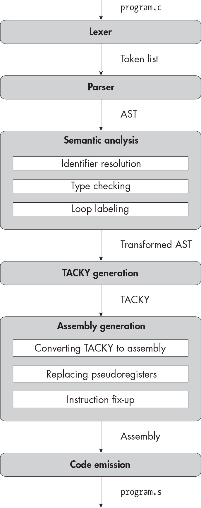

` ``Description`

## `12` `UNSIGNED INTEGERS`


In this chapter, you’ll implement the unsigned counterparts to our two signed integer types: `unsigned int` and `unsigned long`. You’ll extend the usual arithmetic conversions to handle unsigned integers and implement casts between signed and unsigned types. On the backend, you’ll use a few new assembly instructions to do unsigned integer arithmetic.

In Chapter 11, we focused on inferring and tracking type information in general; now we’ll be able to build on that work to add new types with relatively little effort. Before we modify the compiler, let’s start with a quick overview of conversions between signed and unsigned types.

### `Type Conversions, Again`

Every integer type conversion has two aspects we need to consider: how the integer’s value changes and how its binary representation changes. We saw this in the conversions between `int` and `long` in the previous chapter. Sign extension changes a signed integer’s representation from 32 to 64 bits without changing its value. Truncating a `long` to an `int` also changes its representation, and it changes its value too if the original value can’t fit in the new type.

With that distinction in mind, I’ll break our type conversions down into four cases. In each case, I’ll describe how the integer’s representation will change. Then, I’ll explain how that corresponds with the rules in the C standard about how its value should change.

#### `Converting Between Signed and Unsigned Types of the Same Size`

The first case is when we convert between signed and unsigned types of the same size: that is, between `int` and `unsigned int` or between `long` and `unsigned long`. These conversions don’t change the binary representation of the integer. The only thing that changes is whether we use two’s complement to interpret its value. Let’s consider the effect of that change in interpretation.

If a signed integer is positive, its upper bit will be 0, so interpreting it as an unsigned integer won’t change its value. The reverse is also true: if an unsigned integer is smaller than the maximum value the signed type can represent, its upper bit must be 0. Therefore, if we reinterpret it using two’s complement, its value won’t change. As you learned in the previous chapter, when we convert an integer to a new type, the standard requires us to preserve its value if we can. We’re satisfying that requirement here.

That leaves integers whose upper bit is 1. When we reinterpret a signed negative integer as unsigned, we change the upper bit’s value from negative to positive. If the upper bit is 1, this has the effect of adding 2*^(N)* to the value, where *N* is the number of bits in the type. This is exactly the behavior the standard requires; section 6.3.1.3, paragraph 2, states that if the value can’t be represented by the new type and the new type is unsigned, “the value is converted by repeatedly adding or subtracting one more than the maximum value that can be represented in the new type until the value is in the range of the new type.”

Conversely, converting an unsigned type with a leading 1 to the corresponding signed type will subtract 2*^(N)* from its value. This matches the implementation-defined behavior we chose in the last chapter for conversions to signed integers, following GCC: “The value is reduced modulo 2*^N* to be within range of the type.”

#### `Converting unsigned int to a Larger Type`

The second case is when we convert `unsigned int` to a larger type, either `long` or `unsigned long`. To handle this case, we’ll *zero extend* the integer by filling the upper bits of the new representation with zeros. This conversion always preserves the original value, since we’re just adding leading zeros to a positive number.

#### `Converting signed int to a Larger Type`

The third case is when we convert a signed `int` to a `long` or `unsigned long`. We already convert `int` to `long` using sign extension. We’ll convert `int` to `unsigned long` the same way. If an `int` is positive, sign extension will just add leading zeros, which preserves its value whether you interpret the result as signed or unsigned. If the value is negative, sign extending and then interpreting the result as an `unsigned long` will add 2⁶⁴ to its value, as the standard requires.

#### `Converting from Larger to Smaller Types`

In the final case, we convert a larger type (`long` or `unsigned long`) to a smaller one (`int` or `unsigned int`). We always handle this case by truncating the value. This has the effect of adding or subtracting 2³² until the value is in the range of the new type—or, equivalently, reducing the value modulo 2³²—which is the behavior we want. I won’t walk you through why truncating the integer produces the correct value in every case; you can work through some examples on your own, or just take my word for it.

Now that you know what to expect from type conversions, let’s get to work on the compiler.

### `The Lexer`

You’ll add four new tokens in this chapter:

`signed`  A keyword used to specify a signed integer type.

`unsigned` A keyword used to specify an unsigned integer type.

**Unsigned integer constants**  Integer constants with a `u` or `U` suffix. An unsigned constant token matches the regex `[0-9]+[uU]\b`.

**Unsigned long integer constants** Integer constants with a case- insensitive `ul` or `lu` suffix. An unsigned long constant token matches the regex `[0-9]+([lL][uU]|[uU][lL])\b`.

Update your lexer to support these tokens, then test it out.

`TEST THE LEXER`

`To test your lexer, run:`

    $ ./test_compiler /path/to/your_compiler --chapter 12 --stage lex

`The lexer should fail on the test cases in` `tests/chapter_12/invalid_lex``, which include invalid constant tokens. It should successfully process the test cases in all the other subdirectories of` `tests/chapter_12``.`

### `The Parser`

Next, we’ll update the AST to support the two new unsigned types and their corresponding constants. These updates are bolded in Listing 12-1.

    program = Program(declaration*)
    declaration = FunDecl(function_declaration) | VarDecl(variable_declaration)
    variable_declaration = (identifier name, exp? init,
                            type var_type, storage_class?)
    function_declaration = (identifier name, identifier* params, block? body,
                            type fun_type, storage_class?)
    type = Int | Long | UInt | ULong | FunType(type* params, type ret)
    storage_class = Static | Extern
    block_item = S(statement) | D(declaration)
    block = Block(block_item*)
    for_init = InitDecl(variable_declaration) | InitExp(exp?)
    statement = Return(exp)
              | Expression(exp)
              | If(exp condition, statement then, statement? else)
              | Compound(block)
              | Break
              | Continue
              | While(exp condition, statement body)
              | DoWhile(statement body, exp condition)
              | For(for_init init, exp? condition, exp? post, statement body)
              | Null
    exp = Constant(const)
        | Var(identifier)
        | Cast(type target_type, exp)
        | Unary(unary_operator, exp)
        | Binary(binary_operator, exp, exp)
        | Assignment(exp, exp)
        | Conditional(exp condition, exp, exp)
        | FunctionCall(identifier, exp* args)
    unary_operator = Complement | Negate | Not
    binary_operator = Add | Subtract | Multiply | Divide | Remainder | And | Or
                    | Equal | NotEqual | LessThan | LessOrEqual
                    | GreaterThan | GreaterOrEqual
    const = ConstInt(int) | ConstLong(int) | ConstUInt(int) | ConstULong(int)

`Listing 12-1: The abstract syntax tree with unsigned types and unsigned constants`

Just like when you added `ConstLong` in the previous chapter, you need to make sure `ConstUInt` can represent the full range of `unsigned int` and `ConstULong` can represent the full range of `unsigned long`. If your implementation language has unsigned 32-bit and 64-bit integer types, use them here.

Listing 12-2 shows the updated grammar, with the changes bolded.

    <program> ::= {<declaration>}
    <declaration> ::= <variable-declaration> | <function-declaration>
    <variable-declaration> ::= {<specifier>}+ <identifier> ["=" <exp>] ";"
    <function-declaration> ::= {<specifier>}+ <identifier> "(" <param-list> ")" (<block> | ";")
    <param-list> ::= "void"
                   | {<type-specifier>}+ <identifier> {"," {<type-specifier>}+ <identifier>}
    <type-specifier> ::= "int" | "long" | "unsigned" | "signed"
    <specifier> ::= <type-specifier> | "static" | "extern"
    <block> ::= "{" {<block-item>} "}"
    <block-item> ::= <statement> | <declaration>
    <for-init> ::= <variable-declaration> | [<exp>] ";"
    <statement> ::= "return" <exp> ";"
                  | <exp> ";"
                  | "if" "(" <exp> ")" <statement> ["else" <statement>]
                  | <block>
                  | "break" ";"
                  | "continue" ";"
                  | "while" "(" <exp> ")" <statement>
                  | "do" <statement> "while" "(" <exp> ")" ";"
                  | "for" "(" <for-init> [<exp>] ";" [<exp>] ")" <statement>
                  | ";"
    <exp> ::= <factor> | <exp> <binop> <exp> | <exp> "?" <exp> ":" <exp>
    <factor> ::= <const> | <identifier>
               | "(" {<type-specifier>}+ ")" <factor>
               | <unop> <factor> | "(" <exp> ")"
               | <identifier> "(" [<argument-list>] ")"
    <argument-list> ::= <exp> {"," <exp>}
    <unop> ::= "-" | "~" | "!"
    <binop> ::= "-" | "+" | "*" | "/" | "%" | "&&" | "||"
              | "==" | "!=" | "<" | "<=" | ">" | ">=" | "="
    <const> ::= <int> | <long> | <uint> | <ulong>
    <identifier> ::= ? An identifier token ?
    <int> ::= ? An int token ?
    <long> ::= ? An int or long token ?
    <uint> ::= ? An unsigned int token ?
    <ulong> ::= ? An unsigned int or unsigned long token ?

`Listing 12-2: The grammar with the` `signed` `and` `unsigned` `type specifiers and unsigned constants`

Parsing type specifiers is more complicated than in the previous chapter because there are so many different ways to refer to the same type. For example, these are all valid ways to specify the `long` type:

`long`

`long int`

`signed long`

`signed long int`

The order of type specifiers doesn’t matter, so `long signed`, `long int signed`, and so on all specify the same type. The pseudocode in Listing 12-3 provides one way to impose order on this chaos.

    parse_type(specifier_list):
        if (specifier_list is empty
            or specifier_list contains the same specifier twice
            or specifier_list contains both "signed" and "unsigned"):
            fail("Invalid type specifier")
        if specifier_list contains "unsigned" and "long":
            return ULong
        if specifier_list contains "unsigned":
            return UInt
        if specifier_list contains "long":
            return Long
        return Int

`Listing 12-3: Determining a type from a list of type specifiers`

We start by checking for error cases. You need at least one specifier to indicate a type, and you can’t include the same specifier twice. You can’t specify a type as `int long int`, for example. (The `long long` type specifier would complicate this validation check, but we’re not implementing it.) You also can’t include the `signed` and `unsigned` specifiers in the same type specification, since they contradict each other.

Once we know our input specifies a valid type, we check for the `unsigned` and `long` specifiers. If both are present, the type is `unsigned long`. Otherwise, if `unsigned` is present, the type is `unsigned int`; if `long` is present, the type is `long`; if neither is present, the type is `int`. Basically, `int` is the default type, and the `unsigned` and `long` specifiers can indicate a type other than the default. Section 6.7.2, paragraph 2, of the C standard enumerates all the ways you can specify each type.

We also need to deal with constant tokens. In the previous chapter, Listing 11-6 demonstrated how to parse signed constant tokens. I won’t include the corresponding pseudocode for unsigned constant tokens here, but the logic is the same. We parse an unsigned integer constant token as `ConstUInt` if it’s within the range of values an `unsigned int` can hold; that is, between 0 and 2³² – 1, inclusive. Otherwise, we parse it as a `ConstULong`.

An unsigned long constant token will always be parsed to a `ConstULong`. If either kind of unsigned constant token isn’t in the range for `unsigned long` (between 0 and 2⁶⁴ – 1), we’ll throw an error. If you’re curious, section 6.4.4.1 of the C standard has the full rules for determining the types of integer constants.

`TEST THE PARSER`

`To test your parser, run:`

    $ ./test_compiler /path/to/your_compiler --chapter 12 --stage parse

`It should fail on all the test cases in` `tests/chapter_12/invalid_parse` `and succeed on all the test cases in` `tests/chapter_12/invalid_types` `and` `tests/chapter_12/valid``.`

### `The Type Checker`

We don’t need to change the loop labeling or identifier resolution passes in this chapter. We just need to handle unsigned integers in the type checker.

First, we’ll update our implementation of the usual arithmetic conversions, which implicitly convert the operands in a binary expression to a common type. Let’s walk through the usual arithmetic conversion rules for integer types, which are defined in section 6.3.1.8, paragraph 1, of the C standard. The first rule is pretty self-explanatory:

> If both operands have the same type, then no further conversion is needed.

The second one is a little harder to follow:

> Otherwise, if both operands have signed integer types or both have unsigned integer types, the operand with the type of the lesser integer conversion rank is converted to the type of the operand with greater rank.

This just means “if both integers have the same signedness, convert the smaller type to the bigger one.” We already do this when we implicitly convert values from `int` to `long`. Section 6.3.1.1, paragraph 1, specifies the *integer conversion rank* of every integer type, which provides a relative order on their sizes without nailing down those sizes exactly. Of the types we have so far, `long` and `unsigned long` have the highest rank, then `int` and `unsigned int`. The signed and unsigned versions of the same type always have the same rank. Because of their relative conversion ranks, `long` is guaranteed to be at least as large as `int` but not necessarily larger. (In fact, the two types are the same size on most 32-bit systems.) Regardless of their exact sizes, the common type of `long` and `int` is `long`, and the common type of `unsigned long` and `unsigned int` is `unsigned long`. No big surprises here.

The third rule talks about cases with one signed operand and one unsigned operand:

> Otherwise, if the operand that has unsigned integer type has rank greater or equal to the rank of the type of the other operand, then the operand with signed integer type is converted to the type of the operand with unsigned integer type.

So, if the two types are the same size, or if the unsigned type is bigger, we go with the unsigned type. For example, the common type of `int` and `unsigned int` is `unsigned int`, and the common type of `int` and `unsigned long` is `unsigned long`. That leaves the case where the signed type is bigger, which is covered by the fourth rule:

> Otherwise, if the type of the operand with signed integer type can represent all of the values of the type of the operand with unsigned integer type, then the operand with unsigned integer type is converted to the type of the operand with signed integer type.

Under the System V x64 ABI, a `long` can represent every value of type `unsigned int`, so the common type of `unsigned int` and `long` is `long`. This isn’t true in implementations where `long` and `int` are the same size. In these implementations, `long` has a higher rank than `int` but can’t represent every value of type `unsigned int`. The fifth and final rule covers these implementations. Even though this rule doesn’t apply to us, I’ll include it for the sake of completeness:

> Otherwise, both operands are converted to the unsigned integer type corresponding to the type of the operand with signed integer type.

So, on systems where `long` and `int` are the same size, the common type of `long` and `unsigned int` is `unsigned long`.

This all boils down to three rules for finding the common type, which Listing 12-4 describes in pseudocode.

    get_common_type(type1, type2):
      ❶ if type1 == type2:
            return type1
      ❷ if size(type1) == size(type2):
            if type1 is signed:
                return type2
            else:
                return type1
      ❸ if size(type1) > size(type2):
            return type1
        else:
            return type2

`Listing 12-4: Finding the common type of two integers`

First, if the types are the same, pick either one ❶. Otherwise, if they’re the same size, choose the unsigned one ❷. If they’re not the same size, choose the bigger one ❸. Apart from the usual arithmetic conversions, we’ll make one tiny update to the logic for type checking expressions: we’ll annotate unsigned constants with the correct type, in the same way that we already annotate signed constants.

Next, let’s look at how we record the initial values of static variables in the symbol table. We’ll add two new kinds of static initializers, just like we added two new kinds of constants:

    static_init = IntInit(int) | LongInit(int) | UIntInit(int) | ULongInit(int)

We need to convert each initializer to the type of the variable it’s initializing, according to the type conversion rules presented at the beginning of this chapter. Consider the following declaration:

    static unsigned int u = 4294967299L;

The value 4,294,967,299 is outside the range of `unsigned int`. When adding `u` to the symbol table, we’ll convert this value to an `unsigned int` by subtracting 2³² from it. (In practice, you can probably just use the equivalent integer type conversion in your implementation language.) The resulting initializer will be `UIntInit(3)`.

Along the same lines, this declaration initializes an `int` with a value outside of its range:

    static int i = 4294967246u;

Once we reduce this value modulo 2³², the resulting initializer will be `IntInit(-50)`.

It isn’t strictly necessary to have different static initializers for signed and unsigned variables. Instead, you could use `IntInit` to represent both `int` and `unsigned int` initializers and use `LongInit` to represent both `long` and `unsigned long` initializers. Ultimately, the assembler will write out the same bytes for an initializer whether you represent it as a signed or unsigned value: the directives `.long -50` and `.long 4294967246` mean exactly the same thing. Having separate `UIntInit` and `ULongInit` initializers just makes our type conversions easier to keep track of.

`TEST THE TYPE CHECKER`

`To test the type checking pass, run:`

    $ ./test_compiler /path/to/your_compiler --chapter 12 --stage validate

`Your type checker should fail on the test cases in` `tests/chapter_12/invalid _types``. These tests include declarations with conflicting types. The type checker should succeed on every test case in` `tests/chapter_12/valid.`

### `TACKY Generation`

We’ll make one addition to TACKY in this chapter: a `ZeroExtend` instruction. Listing 12-5 defines the whole TACKY IR.

    program = Program(top_level*)
    top_level = Function(identifier, bool global, identifier* params, instruction* body)
              | StaticVariable(identifier, bool global, type t, static_init init)
    instruction = Return(val)
                | SignExtend(val src, val dst)
                | Truncate(val src, val dst)
                | ZeroExtend(val src, val dst)
                | Unary(unary_operator, val src, val dst)
                | Binary(binary_operator, val src1, val src2, val dst)
                | Copy(val src, val dst)
                | Jump(identifier target)
                | JumpIfZero(val condition, identifier target)
                | JumpIfNotZero(val condition, identifier target)
                | Label(identifier)
                | FunCall(identifier fun_name, val* args, val dst)
    val = Constant(const) | Var(identifier)
    unary_operator = Complement | Negate | Not
    binary_operator = Add | Subtract | Multiply | Divide | Remainder | Equal | NotEqual
                    | LessThan | LessOrEqual | GreaterThan | GreaterOrEqual

`Listing 12-5: Adding the` `ZeroExtend` `instruction to TACKY`

Now we have to generate the right TACKY for cast expressions that convert to and from unsigned types. At the beginning of this chapter, we discussed how converting an integer to a new type affected its binary representation in four different cases. Listing 12-6 demonstrates what TACKY instructions to emit in each of those cases.

    emit_tacky(e, instructions, symbols):
        match e with
        | --snip--
        | Cast(t, inner) ->
            result = emit_tacky(inner, instructions, symbols)
            inner_type = get_type(inner)
            if t == inner_type:
                return result
            dst = make_tacky_variable(t, symbols)
          ❶ if size(t) == size(inner_type):
                instructions.append(Copy(result, dst))
          ❷ else if size(t) < size(inner_type):
                instructions.append(Truncate(result, dst))
          ❸ else if inner_type is signed:
                instructions.append(SignExtend(result, dst))
          ❹ else:
                instructions.append(ZeroExtend(result, dst))
            return dst

`Listing 12-6: Converting a cast expression to TACKY`

As in the previous chapter, the cast expression does nothing if the inner expression already has the correct type. Otherwise, we check if the original type and the target type are the same size ❶. If they are, we don’t need to extend, truncate, or otherwise change the inner value, because its representation in assembly won’t change. We just copy it into a temporary variable with the correct type. The `Copy` instruction here may seem redundant, but we need it to help us track type information during assembly generation. We’ll generate different assembly for certain TACKY instructions depending on whether their operands are signed or unsigned. If we don’t store the result of each expression in a variable of the correct type, we’ll generate incorrect assembly.

Next, we check whether the target type is smaller than the original type ❷. In that case, we’ll issue a `Truncate` instruction. If that check also fails, this cast expression converts a smaller type to a larger one. We issue a `SignExtend` instruction if the original type is signed ❸ and a `ZeroExtend` instruction if it’s unsigned ❹.

Once your compiler generates the correct TACKY for unsigned constants and cast expressions, you can test it out.

`TEST THE TACKY GENERATION STAGE`

`To test TACKY generation, run:`

    $ ./test_compiler /path/to/your_compiler --chapter 12 --stage tacky

### `Unsigned Integer Operations in Assembly`

In most cases, we can use exactly the same assembly instructions to operate on signed and unsigned values. However, there are two cases where we handle unsigned values differently: comparisons and division. We’ll need to translate the new `ZeroExtend` instruction to assembly too. Before we update the assembly generation stage, let’s look at how unsigned comparisons, unsigned division, and zero extension work in assembly.

#### `Unsigned Comparisons`

In Chapter 4, you learned how to compare two integers: issue a `cmp` instruction to set the RFLAGS register, then issue a conditional instruction whose behavior depends on the state of that register. We’ll use the same approach to compare unsigned integers, but we need different condition codes that rely on different flags.

Several instructions that perform arithmetic, including `add`, `sub`, and `cmp`, don’t distinguish between signed and unsigned values. Listing 12-7 demonstrates how a single operation can implement both signed and unsigned addition.

      1000
    + 0010
    ------
      1010

`Listing 12-7: Adding binary integers`

If we interpret the operands and the result as unsigned 4-bit integers, Listing 12-7 calculates 8 + 2 = 10. If we interpret them as signed 4-bit integers, it calculates −8 + 2 = −6. As long as we interpret both operands and the result consistently, we get the right answer either way. You can think of the results of `add`, `sub`, and most other arithmetic assembly instructions as sequences of bits with two possible values, one signed and one unsigned.

After the processor executes one of these instructions, some flags in RFLAGS tell us about the signed value of the result, others tell us about its unsigned value, and still others apply to both values. (Some flags have nothing to do with the results of these instructions, but we don’t care about them.) We discussed three flags in Chapter 4: ZF, the zero flag; SF, the sign flag; and OF, the overflow flag. ZF applies whether we interpret the result as signed or unsigned, since zero is represented the same way in either case. The SF and OF flags, however, give us meaningful information only about the result’s signed value.

SF, for example, indicates that the result is negative. In Chapter 4, we used this flag to conclude that `a - b` was negative. In that case, assuming there was no overflow, we knew that `a` was less than `b`. That won’t work for unsigned values, which are positive by definition. Consider Listing 12-8, which uses unsigned 4-bit integers to calculate 15 – 3.

      1111
    - 0011
    ------
      1100

`Listing 12-8: Subtracting binary integers`

Since 15 is greater than 3, the result of this operation is a positive number, 12. The fact that the result has a leading 1 doesn’t tell us anything about which operand is larger. Similarly, OF tells us that the signed value of some instruction’s result wrapped around from positive to negative, or vice versa, which doesn’t tell us anything useful about its unsigned value.

To compare unsigned integers, we’ll use CF, the *carry flag*. This flag indicates that the unsigned value of a result wrapped around because the correct value was less than zero or greater than the maximum value the type could hold. For example, suppose we want to compute 15 + 1 with unsigned 4-bit integers. The 4-bit unsigned representation of 15 is `1111`; when we increment it, it wraps around to `0000`. This computation will set the carry flag to 1. The carry flag will also be set if we try to calculate 0 – 1 and the result wraps around in the other direction to `1111`, or 15. If `a < b`, the result of `a - b` will always wrap around and set the carry flag. If `a > b`, the result will always be representable as an unsigned integer, so it won’t have to wrap around. Let’s walk through how `cmp b, a` will impact CF and ZF when we interpret `a` and `b` as unsigned integers:

- If `a` `==` `b`, then `a - b` will be 0, so ZF will be 1 and CF will be 0.
- If `a > b`, then `a - b` will be a positive number. It will be greater than 0 but less than or equal to `a`, so it won’t wrap around. ZF and CF will both be 0.
- If `a < b`, then `a - b` will be negative, so it will have to wrap around. ZF will be 0 and CF will be 1.

Note that ZF and CF are mutually exclusive; one operation will never set both of them. All the condition codes we need in this chapter depend on one or both of these flags. Table 12-1 lists these condition codes.

`Table 12-1:` `Condition Codes for Unsigned Comparisons`

| `Condition code` | `Meaning` | `Flags`                     |
|------------------|-----------|-----------------------------|
| `E`              | `a == b`  | `ZF set`                    |
| `NE`             | `a != b`  | `ZF not set`                |
| `A`              | `a > b`   | `CF not set and ZF not set` |
| `AE`             | `a >= b`  | `CF not set`                |
| `B`              | `a < b`   | `CF set`                    |
| `BE`             | `a <= b`  | `CF set or ZF set`          |

We use the existing `E` and `NE` condition codes to test for equality and inequality, but we’ll use new codes to determine which of two operands is larger. The `A` and `B` in the new codes are mnemonics for “above” and “below.” The new condition codes can appear in conditional jump and set instructions, just like the old ones. Listing 12-9 demonstrates how to set EAX to 1 if the unsigned value in EDX is greater than 10.

    cmpl    $10, %edx
    movl    $0, %eax
    seta    %al

`Listing 12-9: Performing an unsigned comparison in assembly`

This follows exactly the same pattern as signed comparisons: we issue the `cmp` instruction, then zero out the destination, and finally issue a `set` instruction with a suffix for the appropriate condition code.

`UNSIGNED WRAPAROUND VS. SIGNED OVERFLOW`

`You learned in ``Chapter 4`` that when the result of an operation on signed integers overflows, the behavior is undefined. This isn’t true for unsigned integers. Section 6.2.5, paragraph 9, of the C standard specifies how to deal with an unsigned integer operation when the result doesn’t fit in the result type: “A computation involving unsigned operands can never overflow, because a result that cannot be represented by the resulting unsigned integer type is reduced modulo the number that is one greater than the largest value that can be represented by the resulting type.”`

`It’s no coincidence that this is exactly the same behavior that the standard requires when we convert a value to an unsigned type. It’s also the same` `implementation-defined behavior we chose for conversions to signed types. In all three cases, we get this behavior by truncating the result to the appropriate width.`

`The assembly instructions we’re using to perform arithmetic already handle unsigned wraparound correctly, so we don’t need to do anything special to account for it here. We will need to account for it, however, when we implement constant folding in Part III.`

#### `Unsigned Division`

For most arithmetic operations, the same instruction can operate correctly on both signed and unsigned integers. But for division, this doesn’t work. Suppose we want to calculate `1000 / 0010`. If we interpret these values as signed 4-bit integers, this is −8 / 2 and the result is −4, represented as `1100`. If they’re unsigned 4-bit integers, this is 8 / 2 and the result is 4, or `0100`. There’s no way a single instruction can produce the correct result in both cases.

So, we’ll need a new instruction, `div`, to perform unsigned division. This instruction works just like `idiv`. It takes one operand, which is its divisor. Its dividend is the value stored in EDX and EAX, or RDX and RAX if we’re working with quadwords. It stores the quotient in EAX or RAX, and it stores the remainder in EDX or RDX.

Since the dividend is unsigned, we zero extend it from EAX into EDX (or from RAX into RDX) instead of sign extending it. We accomplish this by zeroing out RDX instead of emitting a `cdq` instruction.

#### `Zero Extension`

The last operation we need to implement is zero extension. We can zero extend a longword to a quadword by moving it into a register; this zeroes out the register’s upper 4 bytes. Then, if we need to store the value in memory, we can move the whole 8-byte value to its final destination. The following code zero extends the value at `-4(%rbp)` and then saves the result to `-16(%rbp)`:

    movl    -4(%rbp), %eax
    movq    %rax, -16(%rbp)

We use the 4-byte `movl` instruction to copy the value into the register and the 8-byte `movq` instruction to copy it back out. If the final destination of the zero extension operation is a register instead of a location in memory, we need only the first 4-byte `movl` instruction.

There’s also a separate `movz` instruction, which zero extends source values that are smaller than 4 bytes. We don’t need this instruction yet, but we’ll use it when we implement character types in Chapter 16.

### `Assembly Generation`

Now that you know how to work with unsigned integers in assembly, you’re ready to extend the assembly generation stage. Listing 12-10 defines the latest assembly AST, with this chapter’s additions bolded.

    program = Program(top_level*)
    assembly_type = Longword | Quadword
    top_level = Function(identifier name, bool global, instruction* instructions)
              | StaticVariable(identifier name, bool global, int alignment, static_init init)
    instruction = Mov(assembly_type, operand src, operand dst)
                | Movsx(operand src, operand dst)
                | MovZeroExtend(operand src, operand dst)
                | Unary(unary_operator, assembly_type, operand)
                | Binary(binary_operator, assembly_type, operand, operand)
                | Cmp(assembly_type, operand, operand)
                | Idiv(assembly_type, operand)
                | Div(assembly_type, operand)
                | Cdq(assembly_type)
                | Jmp(identifier)
                | JmpCC(cond_code, identifier)
                | SetCC(cond_code, operand)
                | Label(identifier)
                | Push(operand)
                | Call(identifier)
                | Ret

    unary_operator = Neg | Not
    binary_operator = Add | Sub | Mult
    operand = Imm(int) | Reg(reg) | Pseudo(identifier) | Stack(int) | Data(identifier)
    cond_code = E | NE | G | GE | L | LE | A | AE | B | BE
    reg = AX | CX | DX | DI | SI | R8 | R9 | R10 | R11 | SP

`Listing 12-10: The assembly AST with unsigned operations`

We’ve added the new condition codes and unsigned `div` instruction we discussed in the previous section. We’ve also added a `MovZeroExtend` instruction to handle zero extension. For now, this instruction is only a placeholder. During the instruction fix-up pass, we’ll replace it with either one or two `mov` instructions, depending on whether its destination is in memory or a register. (At the moment, the destination will always be in memory, so we’ll always need two `mov` instructions; this will change once we implement register allocation in Part III.) When we add character types, `MovZeroExtend` will also represent the real `movz` instruction to zero extend 1-byte values.

Let’s recap the changes we’ll need to make to the assembly generation pass. First, when we convert source-level types to assembly types, we lose the distinction between signed and unsigned integers. Both `long` and `unsigned long` values in TACKY become quadwords in assembly, and `int` and `unsigned int` values become longwords.

When we convert a comparison instruction from TACKY to assembly, we start by looking up the type of either operand (both operands are guaranteed to have the same type). We then choose the appropriate condition code, depending on whether that type is signed. For example, to handle

    Binary(LessThan, Var("src1"), Var("src2"), Var("dst"))

we start by looking up the type of either `src1` or `src2` in the symbol table. Let’s say the type is `UInt`. In this case, we’ll generate the following assembly instructions:

    Cmp(Longword, Pseudo("src2"), Pseudo("src1"))
    Mov(Longword, Imm(0), Pseudo("dst"))
    SetCC(B, Pseudo("dst"))

These are exactly the same instructions we’d generate for a signed comparison, except that we use the `B` condition code instead of `L`.

To handle a TACKY `Divide` or `Remainder` operation, we copy the first operand into EAX, as before. Then, if the operands are signed, we sign extend EAX into EDX and issue an `idiv` instruction. If they’re unsigned, we zero out EDX and issue a `div` instruction. (Naturally, we’ll use RAX and RDX instead of EAX and EDX if the operands are quadwords.) For example, we’ll translate

    Binary(Remainder, ConstULong(100), Var("x"), Var("dst"))

into:

    Mov(Quadword, Imm(100), Reg(AX))
    Mov(Quadword, Imm(0), Reg(DX))
    Div(Quadword, Pseudo("x"))
    Mov(Quadword, Reg(DX), Pseudo("dst"))

Finally, we’ll convert each `ZeroExtend` TACKY instruction into a `MovZeroExtend` assembly instruction.

Tables 12-2 through 12-5 summarize the latest updates to the conversion from TACKY to assembly. New constructs and changes to the way we convert existing constructs are bolded.

`Table 12-2:` `Converting TACKY Instructions to Assembly`

TACKY instruction Assembly instructions

Binary(Divide, src1, src2, dst) Signed

```
Mov(<src1 type>, src1, Reg(AX))
Cdq(<src1 type>)
Idiv(<src1 type>, src2)
Mov(<src1 type>, Reg(AX), dst)
```

Unsigned

```
Mov(<src1 type>, src1, Reg(AX))
Mov(<src1 type>, Imm(0), Reg(DX))
Div(<src1 type>, src2)
Mov(<src1 type>, Reg(AX), dst)
```

Binary(Remainder, src1, src2, dst) Signed

```
Mov(<src1 type>, src1, Reg(AX))
Cdq(<src1 type>)
Idiv(<src1 type>, src2)
Mov(<src1 type>, Reg(DX), dst)
```

Unsigned

```
Mov(<src1 type>, src1, Reg(AX))
Mov(<src1 type>, Imm(0), Reg(DX))
Div(<src1 type>, src2)
Mov(<src1 type>, Reg(DX), dst)
```

ZeroExtend(src, dst) MovZeroExtend(src, dst)

`Table 12-3:` `Converting TACKY Comparisons to Assembly`

| `TACKY comparison` |            | `Assembly condition code` |
|--------------------|------------|---------------------------|
| `LessThan`         | `Signed`   | `L`                       |
| `LessThan`         | `Unsigned` | `B`                       |
| `LessOrEqual`      | `Signed`   | `LE`                      |
| `LessOrEqual`      | `Unsigned` | `BE`                      |
| `GreaterThan`      | `Signed`   | `G`                       |
| `GreaterThan`      | `Unsigned` | `A`                       |
| `GreaterOrEqual`   | `Signed`   | `GE`                      |
| `GreaterOrEqual`   | `Unsigned` | `AE`                      |

`Table 12-4:` `Converting TACKY Operands to Assembly`

| `TACKY operand`             | `Assembly operand` |
|-----------------------------|--------------------|
| `Constant(ConstUInt(int))`  | `Imm(int)`         |
| `Constant(ConstULong(int))` | `Imm(int)`         |

`Table 12-5:` `Converting Types to Assembly`

| `Source type` | `Assembly type` | `Alignment` |
|---------------|-----------------|-------------|
| `UInt`        | `Longword`      | `4`         |
| `ULong`       | `Quadword`      | `8`         |

Next, we’ll update the pseudoregister replacement and instruction fix-up passes.

#### `Replacing Pseudoregisters`

We’ll extend this pass to handle the new `Div` and `MovZeroExtend` instructions. Otherwise, there’s nothing to change here. This pass looks at each operand’s assembly type rather than its source-level type, so it doesn’t distinguish between signed and unsigned operands.

#### `Fixing Up the Div and MovZeroExtend Instructions`

Next, we’ll rewrite both `Div` and `MovZeroExtend`. Like `Idiv`, the new `Div` instruction can’t use a constant operand. We’ll rewrite it the same way as `Idiv`, copying its operand into R10 if we need to.

We’ll replace `MovZeroExtend` with one or two `mov` instructions. If its destination is a register, we’ll issue a single `movl` instruction. For example, we’ll rewrite

    MovZeroExtend(Stack(-16), Reg(AX))

as:

    Mov(Longword, Stack(-16), Reg(AX))

If its destination is in memory, we’ll use a `movl` instruction to zero extend into R11, then move it from there to the destination. So, we’ll rewrite

    MovZeroExtend(Imm(100), Stack(-16))

as:

    Mov(Longword, Imm(100), Reg(R11))
    Mov(Quadword, Reg(R11), Stack(-16))

We won’t make any other changes to this pass.

`TEST THE ASSEMBLY GENERATION STAGE`

`To test the assembly generation stage, run:`

    $ ./test_compiler /path/to/your_compiler --chapter 12 --stage codegen

### `Code Emission`

We’ll make a few changes to the code emission stage in this chapter. First, we’ll add the `div` instruction and the new condition codes. We’ll also add our two new static initializers, `UIntInit` and `ULongInit`, which we’ll emit exactly like their signed counterparts, `IntInit` and `LongInit`. Tables 12-6 through 12-8 demonstrate how to emit these new constructs.

`Table 12-6:` `Formatting Static Initializers`

| `Static initializer` | `Output`    |
|----------------------|-------------|
| `UIntInit(0)`        | `.zero 4`   |
| `UIntInit(i)`        | .long \<i\> |
| `ULongInit(0)`       | `.zero 8`   |
| `ULongInit(i)`       | .quad \<i\> |

`Table 12-7:` `Formatting Assembly Instructions`

Assembly instruction Output

Div(t, operand)

```
div<t>    <operand>
```

`Table 12-8:` `Instruction Suffixes for Condition Codes`

| `Condition code` | `Instruction suffix` |
|------------------|----------------------|
| `A`              | `a`                  |
| `AE`             | `ae`                 |
| `B`              | `b`                  |
| `BE`             | `be`                 |

I haven’t bolded the new constructs and changes in these tables like I normally do, because all of these assembly constructs are new.

`TEST THE WHOLE COMPILER`

`To test out the whole compiler, run:`

    $ ./test_compiler /path/to/your_compiler --chapter 12

`The programs in` `tests/chapter_12/valid/type_specifiers` `test that your compiler correctly determines a function or variable’s type based on a list of type specifiers. The programs in` `tests/chapter_12/valid/unsigned_expressions` `test that you’ve correctly implemented arithmetic operations on unsigned values, including unsigned comparisons and division. The programs in` `tests/chapter_12``/valid/explicit_casts` `test that you’ve implemented explicit conversions to and from unsigned types correctly, and the programs in` `tests/chapter_12/valid/implicit_casts` `test that you add implicit type conversions in the right places. The programs in` `tests/chapter_12/valid/libraries` `test that compiled code dealing with unsigned integers conforms to the System V ABI.`

### `Summary`

In this chapter, you built on the foundations you laid in Chapter 11 to implement two unsigned integer types. You waded through the C standard’s rules for type conversions and explored how those conversions impact both an integer’s representation and its value. In the type checker, you learned how signed and unsigned integers are converted to a common type. During assembly generation, you implemented zero extension and unsigned division and comparisons.

In Chapter 13, you’ll add a floating-point type, `double`. Floating-point numbers are processed very differently from integers in hardware; they even get their own set of registers! As you’ll see, those hardware differences impact everything from type conversions to function calling conventions.