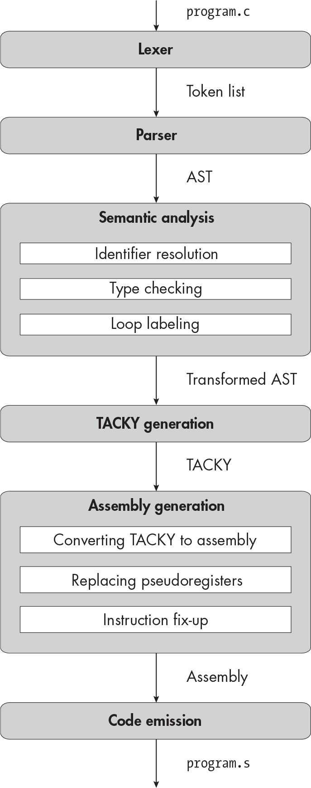
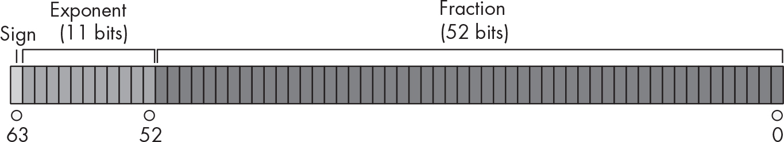
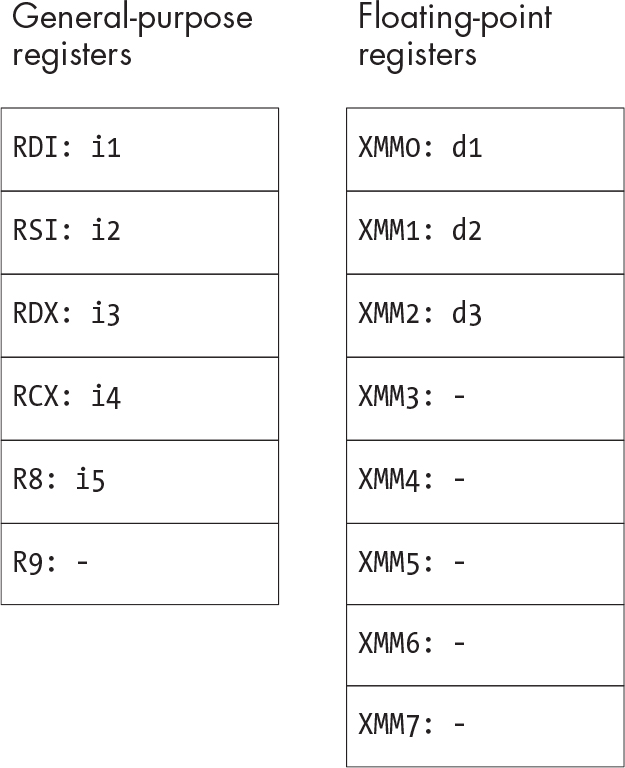
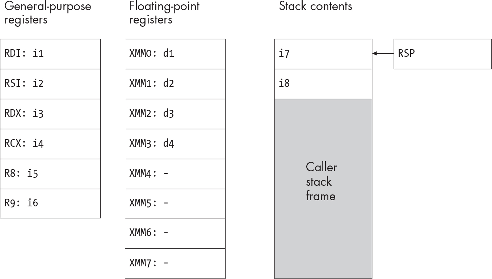
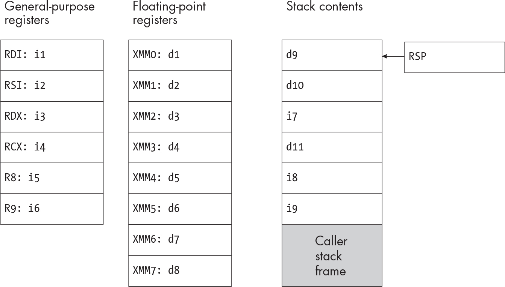
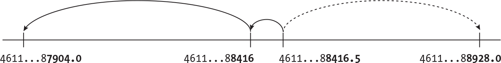
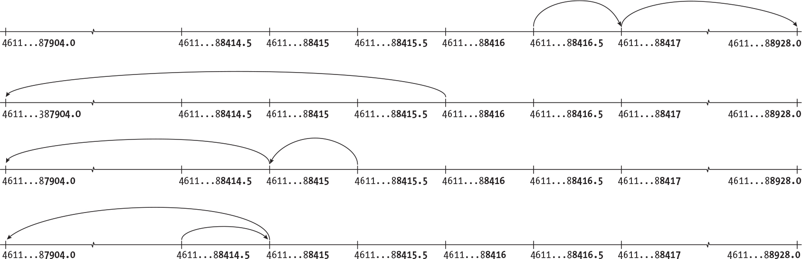

` ``Description`

## `13` `FLOATING-POINT NUMBERS`


Your compiler now supports four different integer types, but it still doesn’t support non-integral values. It also doesn’t support values outside the range of `long` and `unsigned long`. In this chapter, you’ll address these shortcomings by implementing the `double` type. This type uses a *floating-point* binary representation, which is totally different from the signed and unsigned integer representations we’ve seen so far. The C standard also defines two other floating-point types, `float` and `long double`, but we won’t implement those in this book.

We’ll have two major tasks in this chapter. The first task is figuring out exactly what behavior we’re trying to implement. We can’t just check the C standard, because many aspects of floating-point behavior are implementation-defined. Instead, we’ll consult yet another standard, *IEEE 754*, to fill in most of the details that the C standard doesn’t specify. Our second major task is generating assembly code; we’ll need a whole new set of specialized assembly instructions and registers to operate on floating-point numbers.

We’ll start with a quick look at the IEEE 754 standard, which defines the binary format of `double` and some other aspects of floating-point behavior. Then, we’ll consider all the ways that rounding error can creep into floating-point operations and decide how our implementation will handle them. We won’t cover every aspect of floating-point arithmetic, but you can find links to the standard itself and more comprehensive explanations of IEEE 754, rounding error, and other aspects of floating-point behavior in “Additional Resources” on page 343.

### `IEEE 754, What Is It Good For?`

The IEEE 754 standard specifies several floating-point formats and how to work with them. It defines a set of floating-point operations, including basic arithmetic operations, conversions, and comparisons. It also defines several rounding modes, which control how the results of these operations are rounded, and various floating-point exceptions, like overflow and division by zero. The standard can be used as a specification for any system that implements floating-point arithmetic, whether that system is a processor or a high-level programming language. In processors, the required operations are typically implemented as machine instructions. In most programming languages, including C, some IEEE 754 operations are implemented as primitive operators like `+` and `-`, while others are implemented as standard library functions.

Virtually all modern programming languages represent floating-point numbers in IEEE 754 format (because they run on hardware using that format), but they have varying degrees of support for other aspects of the standard. For example, not all programming languages let you detect floating-point exceptions or use nondefault rounding modes.

In theory, you could implement C without using IEEE 754 at all; the C standard doesn’t dictate how to represent `double` and other floating-point types. However, the standard is designed to be compatible with IEEE 754. Annex F, an optional section of the C standard, specifies how to fully support IEEE 754 and explicitly binds C types, operations, and macros to their IEEE 754 equivalents. (Note that the standard refers to “IEC 60559,” which is just another name for IEEE 754.)

While the C standard doesn’t specify how to represent floating-point types, the System V x64 ABI does. Implementations that follow this ABI, including ours, must represent these types in IEEE 754 format. However, the ABI doesn’t deal with the other aspects of IEEE 754.

Most C implementations provide command line options to control exactly how strictly they conform to IEEE 754. Our compiler won’t provide these options; instead, it will roughly match the default behavior of Clang and GCC. This means we’ll implement mathematical floating-point operations according to IEEE 754, and we’ll correctly handle most special values, but we’ll ignore floating-point exceptions and nondefault rounding modes.

In the next couple of sections, I’ll discuss the parts of IEEE 754 that you’ll need to know about as you work on your compiler. I won’t discuss operations that are implemented in the underlying hardware (like addition and subtraction) or in the C standard library (like square root and remainder). You don’t need to know the details of how those are specified, since they’re handled for you. But you *do* need to know a bit about the binary format of IEEE 754 numbers, so we’ll start with that.

### `The IEEE 754 Double-Precision Format`

The System V x64 ABI tells us to represent `double` using the IEEE 754 *double-precision* format, which is 64 bits wide. Figure 13-1 illustrates this format. (This figure is reproduced with slight modifications from *<https://en.wikipedia.org/wiki/Double-precision_floating-point_format>*.)



`Figure 13-1: The IEEE 754 double-precision floating-point format ``Description`

The double-precision floating-point format has three fields: the sign bit, the exponent field, and the fraction field. These fields encode three values: the sign *s*, the exponent *e*, and the significand *f*, respectively. (Sometimes *f* is called the *mantissa* instead of the significand.) A number in this format has the value (–1)*^(s)* × *f* × 2*^(e)*, except for a few special cases that we’ll discuss shortly.

The significand *f* is a *binary fraction*, which is analogous to a decimal number. In decimal numbers, the digits to the left of the decimal point (the *integer part*) represent nonnegative powers of 10, and the digits to the right (the *fractional part*) represent negative powers of 10: 1/10, 1/100, and so on. Similarly, each bit in the integer part of a binary fraction represents a nonnegative power of 2, like 1, 2, 4, or 8, and each bit in the fractional part represents a negative power of 2, like 1/2, 1/4, or 1/8.

The integer part of *f* is always 1; the 52 bits of the fraction field encode only the fractional part. This means that the value of *f* is always greater than or equal to 1 and less than 2. For example, the fraction field

    1000000000000000000000000000000000000000000000000000

indicates that the fractional part of *f* is 0.1, so the overall value of *f* is the binary fraction 1.1, which is 1.5 in decimal notation. The implied leading 1 lets the 52-bit fraction field represent binary fractions up to 53 bits long.

The value of *e* is between –1,022 and 1,023. The exponent field uses a *biased* encoding: we interpret the 11 bits in this field as an unsigned integer and then subtract 1,023 to get the value of *e*. For example, suppose this field has the following bits:

    00000000010

Interpreted as an ordinary unsigned integer, these bits represent the number 2. The value of the exponent *e* is therefore 2 – 1,023, or –1,021. Setting the exponent field to all 1s or all 0s indicates one of the special values we’ll discuss in a moment.

Since *f* is always positive, the whole floating-point number will be negative if the sign bit is 1 and positive if it’s 0. Essentially, floating point lets us express numbers in scientific notation, but with powers of 2 instead of powers of 10.

The IEEE 754 standard also defines a few special values that are interpreted differently than ordinary floating-point numbers:

**Zero and negative zero**

If a floating-point number is all zeros, its value is `0.0`. If it’s all zeros except for its sign bit, its value is `-0.0`. This value compares equal to `0.0` but follows the usual rules for determining the sign of arithmetic results. For example, `-1.0 * 0.0` and `1.0 * -0.0` both evaluate to `-0.0`.

**Subnormal numbers**

As we just saw, most floating-point numbers have a significand between 1 and 2. We say that these numbers are *normalized*. The smallest magnitude a normalized `double` can represent is 1 × 2^(–1,022), since the minimum exponent is –1,022. In a *subnormal* number, the significand is smaller than 1, which lets us represent values that are even closer to zero. An all-zero exponent field indicates that a number is subnormal, so its exponent is –1,022 and the integer part of its significand is 0 instead of 1. Subnormal numbers are much slower to work with in hardware than normalized numbers, so some C implementations let users disable them and round any subnormal results to zero.

**Infinity**

At the opposite end of the spectrum, the largest magnitude a normalized `double` can represent is the largest possible value of the significand (just shy of 2) multiplied by 2^(1,023). Anything larger gets rounded to infinity. The result of dividing a nonzero number by zero is also infinity. The IEEE standard defines both positive and negative infinity; for example, the expression `-1.0 / 0.0` evaluates to negative infinity. A number whose exponent is all 1s and whose fraction field is all 0s represents infinity. The sign bit indicates whether it’s negative or positive infinity.

**NaN**

NaN is short for *not-a-number*. A few operations, including `0.0 / 0.0`, produce NaN. The IEEE 754 standard defines both *signaling NaNs*, which raise an exception if you try to use them, and *quiet NaNs*, which don’t. A number whose exponent is all 1s and whose fraction field is nonzero represents NaN.

We’ll support all of these values except for NaN. Quiet NaNs are an extra credit feature because handling them correctly in comparisons requires a bit of extra work. We can support negative zero, subnormal numbers, and infinity with no extra work on our part; the processor will deal with them for us.

Aside from the double-precision format, IEEE 754 defines a few other floating-point formats that we won’t use, including *single precision*, which corresponds to `float`, and *double extended precision*, which usually corresponds to `long double`. These formats include the same three fields as double precision, use the same formula to determine a floating-point number’s value, and have the same special values; they just have different widths.

### `Rounding Behavior`

You can’t represent every real number exactly as a `double`. There are infinitely many real numbers, and a `double` has only 64 bits. We’re not particularly interested in *all* the real numbers; we care only about the numbers that show up in C programs. Unfortunately, a `double` can’t represent most of those exactly either, so we’ll need to round them. Let’s start by examining how IEEE 754 tells us to round real numbers to `double`. Then, we’ll look at the three cases where we can encounter rounding error: when converting constants from decimal to binary floating point, performing type conversions, and performing arithmetic operations.

#### `Rounding Modes`

IEEE 754 defines several different rounding modes, including rounding to nearest, rounding toward zero, rounding toward positive infinity, and rounding toward negative infinity. Modern processors support all four of these rounding modes and provide instructions to let programs change the current rounding mode. We’ll support only the default IEEE rounding mode, *round-to-nearest, ties-to-even* rounding. As the name suggests, in this mode the real value of a result is always rounded to the nearest representable `double`. “Ties-to-even” means that if a result is exactly between two representable values, it’s rounded to the one whose least significant bit is 0. We’ll use this rounding mode when converting constants to floating point, when converting from integer types to `double`, and in arithmetic operations.

#### `Rounding Constants`

C programmers generally write `double` constants in decimal. At compile time, we’ll convert constants from this decimal representation to a double-precision floating-point representation. This conversion is inexact, since most decimal constants can’t be represented exactly in binary floating point. For example, you can’t represent the decimal number 0.1 in binary floating point, because each bit in a binary fraction represents a power of 2, but you can’t add up powers of 2 and get 0.1. If the source code of a C program includes the constant `0.1`, the compiler will round this constant to the value in Listing 13-1, which is the nearest value we can represent as a `double`.

    0.1000000000000000055511151231257827021181583404541015625

`Listing 13-1: The closest` `double` `to 0.1, in decimal notation`

Unlike 0.1, this value can be represented exactly as a 53-bit binary fraction multiplied by a power of 2, as shown in Listing 13-2.

    1.100110011001100110011001100110011001100110011001101 * 2^-4

`Listing 13-2: The closest` `double` `to 0.1, represented as a binary fraction`

Representing 0.1 as a `double` is analogous to trying to write 1/3 in decimal notation; since you can’t break it down into powers of 10, you can’t write it out exactly using any number of decimal places. Instead, you have to round 1/3 to the nearest value you can represent in the space available. For example, a calculator that can display up to four digits would display 1/3 as `.3333`.

> `NOTE`

*IEEE 754 defines several* decimal floating-point *formats, which can represent decimal constants without this sort of rounding error. These formats encode numbers as decimal significands multiplied by powers of 10. C23 includes new decimal floating-point types that correspond to these formats.*

#### `Rounding Type Conversions`

We may also need to round when we convert an integer to a `double`. This issue arises because of the spacing between values that `double` can represent. The gap between representable values grows larger as the magnitude of the values themselves increases. At a certain point, the gap becomes larger than 1, which means you can’t represent all integers in that range. To illustrate this problem, let’s imagine a decimal format with three digits of precision. This format can represent any integer smaller than 1,000; for example, we can write 992 and 993 as 9.92 × 10² and 9.93 × 10². But it can’t represent every integer larger than 1,000. We can represent 1,000 exactly as 1.00 × 10³, but the next representable value is 1.01 × 10³, or 1,010; there’s a gap of 10. The gap increases to 100 once we hit 10,000, and continues to grow at larger magnitudes. We’ll encounter precisely the same issue when converting from `long` or `unsigned long` to `double`. A `double` has 53 bits of precision, since the significand is a 53-bit binary fraction. A `long` or `unsigned long`, however, has 64 bits of precision. Suppose we need to convert `9223372036854775803` from a `long` to a `double`. The binary representation of this `long` is:

    111111111111111111111111111111111111111111111111111111111111011

That’s 63 bits, so it won’t fit in the significand of a `double`! We’ll need to round it to the nearest `double`, which is `9223372036854775808.0`, or 1 × 2⁶³.

#### `Rounding Arithmetic Operations`

Finally, we may need to round the results of basic floating-point operations like addition, subtraction, and multiplication. Once again, this is due to the gaps between representable values. For example, let’s try computing 993 + 45 in the three-digit decimal format from the previous section. The correct result, 1,038, can’t be represented in only three digits; we’ll need to round it to 1.04 × 10³. Division can also produce values that aren’t representable at any precision, just like the result of 1 / 3 isn’t representable in any number of decimal digits. Thankfully, we can basically ignore this category of rounding error; the assembly instructions for floating-point arithmetic will round correctly without any extra effort on our part.

Now that you understand the basics of the IEEE 754 format and the rounding behavior you need to implement, you’re ready to get to work on the compiler. We’ll start with a change to the compiler driver.

### `Linking Shared Libraries`

This chapter’s test suite uses functions from `<math.h>`, the standard math library. We’ll add a new command line option to the compiler driver that lets us link in shared libraries like `<math.h>`. This option takes the form `-l``<lib>`, where `<lib>` is the name of a library. You should pass this option through to the `gcc` command to assemble and link the program, placing it after the names of any input assembly files in that command. For example, if your compiler is invoked with the command

    ./YOUR_COMPILER /path/to/program.c -lm

it should assemble and link the program with the command:

    gcc /path/to/program.s -o /path/to/program -lm

If you’re on macOS, you don’t need to add this new option, because the standard math library is linked in by default. You may want to add it anyway, though, since being able to link in shared libraries is generally useful.

### `The Lexer`

You’ll introduce two new tokens in this chapter:

`double` A keyword

**Floating-point constants** Constants that use scientific notation or contain a decimal point

You’ll also change how the lexer recognizes the end of a constant token; this will affect both the new floating-point constants and the integer constants you already support.

Let’s start by walking through the format of floating-point constants. Then, we’ll see how to recognize the end of a constant. Finally, we’ll define the new regular expressions for each constant token.

#### `Recognizing Floating-Point Constant Tokens`

Numerals with decimal points, like `1.5` and `.72`, are valid tokens that represent floating-point numbers. We’ll call a sequence of digits that includes a decimal point a *fractional constant*. A fractional constant may include a decimal point with no digits after it. For example, `1.` is a valid fractional constant with the same value as `1.0`.

A floating-point constant can also be written in scientific notation. A token that uses scientific notation consists of:

- A significand, which may be an integer or fractional constant
- An uppercase or lowercase `E`
- An exponent, which is an integer with an optional leading `+` or `-` sign

`100E10`, `.05e-2`, and `5.E+3` are all valid floating-point constants. These constants are all in decimal, and their exponents are powers of 10. For example, `5.E+3` is 5 × 10³, or 5,000. The C standard also defines hexadecimal floating-point constants, but we won’t implement them. There’s no constant for infinity. The `<math.h>` header defines an `INFINITY` macro, which is supposed to translate to the constant for positive infinity, but our compiler can’t include this header, since it uses `float`, `struct`, and other language features we don’t support. Therefore, we won’t support this macro (or any other macros defined in `<math.h>`, for that matter).

It’s a bit tricky to write a regex that will match every floating-point constant, so let’s break it down into steps. The regex in Listing 13-3 matches a fractional constant.

    [0-9]*\.[0-9]+|[0-9]+\.

`Listing 13-3: The regex for a fractional constant`

The first part of this regex, `[0-9]*\.[0-9]+`, matches any constant with digits after the decimal point, like `.03` or `3.14`. The part after the `|` matches constants like `3.` with nothing after the decimal point. Listing 13-4 defines a similar regex to match the significand of a constant in scientific notation.

    [0-9]*\.[0-9]+|[0-9]+\.?

`Listing 13-4: The regex for the significand of a constant in scientific notation`

The only difference from Listing 13-3 is that the trailing decimal point in the second clause is optional, so it matches both integers and fractional constants with trailing decimal points.

We’ll use the regex in Listing 13-5 to match the exponent part of a floating-point constant.

    [Ee][+-]?[0-9]+

`Listing 13-5: The regex for the exponent of a constant in scientific notation`

This regex includes the case-insensitive `E` that marks the start of the exponent, an optional sign, and the integer value of the exponent. To match any floating-point constant, we’ll assemble one giant regex of the form `<``Listing 13-4``> <``Listing 13-5``>` `|` `<``Listing 13-3``>`, which gives us Listing 13-6.

    ([0-9]*\.[0-9]+|[0-9]+\.?)[Ee][+-]?[0-9]+|[0-9]*\.[0-9]+|[0-9]+\.

`Listing 13-6: The regex to match every part of a floating-point constant`

In other words, a floating-point constant is either a significand followed by an exponent, or a fractional constant. Listing 13-6 isn’t quite complete, though: we need one more component to match the boundary between the end of this token and the start of the next one.

#### `Matching the End of a Constant`

Until now, we’ve required constants to end at word boundaries. Given the string `123foo`, for example, we wouldn’t accept the substring `123` as a constant. Now we’ll add another requirement: a constant token can’t be immediately followed by a period. This means, for example, that the lexer will recognize the start of the string `123L;` as a long integer constant token, `123L`, but it will reject the string `123L.bar;` as malformed. Along the same lines, the lexer will accept the string `1.0+x` but reject `1.0.+x`, and it will accept `1.}` but reject `1..}`. Note that the last character in a floating-point constant like `1.` can be a period, but the first character *after* the constant cannot.

> `NOTE`

*If you’re curious about where in the C standard this requirement comes from, see the definition of preprocessing numbers in section 6.4.8, the list of translation phases in section 5.1.1.2, and the discussion of tokens and preprocessing tokens in section 6.4, paragraph 3. These sections describe a multiphase process for dividing a source file into preprocessing tokens and then converting them into tokens. We don’t follow this process, but we define each token in a way that produces the same results for the subset of C that we support.*

To enforce this new requirement, we’ll end the regular expression for each constant token with the `[^\w.]` character class instead of the special word boundary character `\b`. The `[^\w.]` character class matches any single character except for a word character (a letter, digit, or underscore) or a period. This single non-word, non-period character marks the end of the constant but isn’t part of the constant itself, so we’ll define a capture group within each regex to match the actual constant.

For example, our old regular expression for a signed integer constant was `[0-9]+\b`. Our new regular expression is `([0-9]+)[\w.]`. This regex matches the entire string `100;`, including the `;` at the end. The capture group `([0-9]+)` matches just the constant `100`, not the final `;` character. Whenever your lexer recognizes a constant, it should consume only the constant itself from the input, not the character that immediately follows it.

In Listing 13-7, we finally define the whole regular expression to recognize a floating-point constant.

    (([0-9]*\.[0-9]+|[0-9]+\.?)[Ee][+-]?[0-9]+|[0-9]*\.[0-9]+|[0-9]+\.)[^\w.]

`Listing 13-7: The complete regex to recognize a floating-point constant`

This is just the regular expression we defined in Listing 13-6, wrapped in parentheses to form a capture group and followed by the `[^\w.]` character class.

Table 13-1 defines the new regular expressions for all of our constant tokens.

`Table 13-1:` `Regular Expressions for Constant Tokens`

| `Token`                          | `Regular expression`                                                        |
|----------------------------------|-----------------------------------------------------------------------------|
| `Signed integer constant`        | `([0-9]+)[^\w.]`                                                            |
| `Unsigned integer constant`      | `([0-9]+[uU])[^\w.]`                                                        |
| `Signed long integer constant`   | `([0-9]+[lL])[^\w.]`                                                        |
| `Unsigned long integer constant` | `([0-9]+([lL][uU]|[uU][lL]))[^\w.]`                                         |
| `Floating-point constant`        | `(([0-9]*\.[0-9]+|[0-9]+\.?)[Ee][+-]?[0-9]+|[0-9]*\.[0-9]+|[0-9]+\.)[^\w.]` |

Go ahead and add the new floating-point constant token and update how you recognize the constant tokens from earlier chapters. Don’t forget to add the `double` keyword too!

`TEST THE LEXER`

`To test out your lexer, run:`

    $ ./test_compiler /path/to/your_compiler --chapter 13 --stage lex

`Your lexer should fail on the test programs in` `tests/chapter_13/invalid_lex``, which include malformed floating-point and integer constants. It should successfully process all the other test programs for this chapter.`

### `The Parser`

The changes to the parser are pretty limited. Listing 13-8 gives the updated AST, which includes the `double` type and floating-point constants.

    program = Program(declaration*)
    declaration = FunDecl(function_declaration) | VarDecl(variable_declaration)
    variable_declaration = (identifier name, exp? init,
                            type var_type, storage_class?)
    function_declaration = (identifier name, identifier* params, block? body,
                            type fun_type, storage_class?)
    type = Int | Long | UInt | ULong | Double | FunType(type* params, type ret)
    storage_class = Static | Extern
    block_item = S(statement) | D(declaration)
    block = Block(block_item*)
    for_init = InitDecl(variable_declaration) | InitExp(exp?)
    statement = Return(exp)
              | Expression(exp)
              | If(exp condition, statement then, statement? else)
              | Compound(block)
              | Break
              | Continue
              | While(exp condition, statement body)
              | DoWhile(statement body, exp condition)
              | For(for_init init, exp? condition, exp? post, statement body)
              | Null
    exp = Constant(const)
        | Var(identifier)
        | Cast(type target_type, exp)
        | Unary(unary_operator, exp)
        | Binary(binary_operator, exp, exp)
        | Assignment(exp, exp)
        | Conditional(exp condition, exp, exp)
        | FunctionCall(identifier, exp* args)
    unary_operator = Complement | Negate | Not
    binary_operator = Add | Subtract | Multiply | Divide | Remainder | And | Or
                    | Equal | NotEqual | LessThan | LessOrEqual
                    | GreaterThan | GreaterOrEqual
    const = ConstInt(int) | ConstLong(int)
          | ConstUInt(int) | ConstULong(int)
          | ConstDouble(double)

`Listing 13-8: The abstract syntax tree with the` `double` `type and floating-point constants`

Your AST should represent `double` constants using the double-precision floating-point format, since that’s how they’ll be represented at runtime. You’ll need to look up which type in your implementation language uses this format. If you use a representation with less precision than `double`, you might not be able to represent the closest `double` to every constant in the source code, so you’ll end up with incorrectly rounded constants in the compiled program.

Surprisingly, storing constants with *more* precision than `double` can also cause problems. Storing a floating-point number in a higher-precision format and then rounding to a lower-precision format can produce a different result than rounding exactly once. This phenomenon is called *double rounding error*. (The word *double* here refers to rounding twice, not to the `double` type.) We’ll explore double rounding error in more depth during assembly generation.

After updating the AST, we’ll make the corresponding changes to the grammar. Listing 13-9 shows the complete grammar with these changes bolded.

    <program> ::= {<declaration>}
    <declaration> ::= <variable-declaration> | <function-declaration>
    <variable-declaration> ::= {<specifier>}+ <identifier> ["=" <exp>] ";"
    <function-declaration> ::= {<specifier>}+ <identifier> "(" <param-list> ")" (<block> | ";")
    <param-list> ::= "void"
                   | {<type-specifier>}+ <identifier> {"," {<type-specifier>}+ <identifier>}
    <type-specifier> ::= "int" | "long" | "unsigned" | "signed" | "double"
    <specifier> ::= <type-specifier> | "static" | "extern"
    <block> ::= "{" {<block-item>} "}"
    <block-item> ::= <statement> | <declaration>
    <for-init> ::= <variable-declaration> | [<exp>] ";"
    <statement> ::= "return" <exp> ";"
                  | <exp> ";"
                  | "if" "(" <exp> ")" <statement> ["else" <statement>]
                  | <block>
                  | "break" ";"
                  | "continue" ";"
                  | "while" "(" <exp> ")" <statement>
                  | "do" <statement> "while" "(" <exp> ")" ";"
                  | "for" "(" <for-init> [<exp>] ";" [<exp>] ")" <statement>
                  | ";"
    <exp> ::= <factor> | <exp> <binop> <exp> | <exp> "?" <exp> ":" <exp>
    <factor> ::= <const> | <identifier>
               | "(" {<type-specifier>}+ ")" <factor>
               | <unop> <factor> | "(" <exp> ")"
               | <identifier> "(" [<argument-list>] ")"
    <argument-list> ::= <exp> {"," <exp>}
    <unop> ::= "-" | "~" | "!"
    <binop> ::= "-" | "+" | "*" | "/" | "%" | "&&" | "||"
              | "==" | "!=" | "<" | "<=" | ">" | ">=" | "="
    <const> ::= <int> | <long> | <uint> | <ulong> | <double>
    <identifier> ::= ? An identifier token ?
    <int> ::= ? An int token ?
    <long> ::= ? An int or long token ?
    <uint> ::= ? An unsigned int token ?
    <ulong> ::= ? An unsigned int or unsigned long token ?
    <double> ::= ? A floating-point constant token ?

`Listing 13-9: The grammar with the` `double` `type specifier and floating-point constants`

In the last two chapters, we had to deal with the many different ways to specify integer types. Luckily, there’s only one way to specify the `double` type: with the `double` keyword. Listing 13-10 demonstrates how to handle `double` when we process a list of type specifiers.

    parse_type(specifier_list):
        if specifier_list == ["double"]:
            return Double
        if specifier_list contains "double":
            fail("Can't combine 'double' with other type specifiers")
        --snip--

`Listing 13-10: Determining a type from a list of type specifiers`

Either `double` should be the only specifier in the list, or it shouldn’t appear at all; it can’t be combined with `long`, `unsigned`, or any other type specifier we’ve introduced so far. (It can, however, appear alongside storage-class specifiers like `static` and `extern`.)

Next, we’ll convert floating-point constant tokens to constants in the AST. We saw earlier that most decimal constants can’t be represented exactly in binary floating point, so we’ll need to round them. According to the C standard, the rounding direction here is implementation-defined and doesn’t necessarily need to match the runtime rounding mode. We’ll use round-to-nearest mode here, like we do everywhere else. Your implementation language’s built-in string-to-floating point conversion utilities should handle this correctly.

When we parse integer constants, we need to ensure that they’re within the range the type can hold. Floating-point constants, however, can’t go out of range. Since `double` supports positive and negative infinity, its range includes all real numbers. So, our parser shouldn’t run into any errors when parsing `double` constants.

`TEST THE PARSER`

`To test your parser, run:`

    $ ./test_compiler /path/to/your_compiler --chapter 13 --stage parse

### `The Type Checker`

We’ll make a handful of changes to account for `double` in the type checker. First, we’ll make sure to annotate `double` constants with the correct type. Then, we’ll update how we find the common real type of two values. The rule here is simple: if either value is a `double`, the common real type is `double`. Listing 13-11 shows how to update the `get_common_type` helper function to handle `double`.

    get_common_type(type1, type2):
        if type1 == type2:
            return type1
        if type1 == Double or type2 == Double:
            return Double
        --snip--

`Listing 13-11: Finding the common real type of two values`

We also need to detect a couple of new type errors. The bitwise complement operator, `~`, and the remainder operator, `%`, accept only integer operands. We’ll validate that both of these operators are used correctly in `typecheck_exp`. Listing 13-12 demonstrates how to type check the `~` operator.

    typecheck_exp(e, symbols):
        match e with
        | --snip--
        | Unary(Complement, inner) ->
            typed_inner = typecheck_exp(inner, symbols)
          ❶ if get_type(typed_inner) == Double:
                fail("Can't take the bitwise complement of a double")
            unary_exp = Unary(Complement, typed_inner)
            return set_type(unary_exp, get_type(typed_inner))

`Listing 13-12: Type checking a bitwise complement expression`

First, we type check the operand. Then, we validate that the operand is an integer ❶. Finally, we annotate the expression with the type of its result. Only the validation step differs from earlier chapters. We can handle the `%` operator in a similar way.

To wrap up the changes to the type checker, we’ll deal with static variables of type `double`. We’ll add a new kind of initializer for these variables:

    static_init = IntInit(int) | LongInit(int) | UIntInit(int) | ULongInit(int)
                | DoubleInit(double)

As usual, we’ll convert each initializer to the type of the variable it initializes, using the same rules that we’d apply at runtime. The C standard requires us to truncate toward zero when we convert from `double` to an integer type. For example, we would convert `2.8` to `2`. If the truncated value is out of range of the resulting integer type, the result is undefined, so you can handle it however you like. The cleanest option here is to just throw an error.

When we convert an integer to a `double`, we’ll preserve its value if it can be represented exactly. Otherwise, we’ll round to the nearest representable value. You should be able to use your implementation language’s built-in type conversion utilities to cast from `double` to integer types and vice versa.

`TEST THE TYPE CHECKER`

`To test your type checker, run:`

    $ ./test_compiler /path/to/your_compiler --chapter 13 --stage validate

`The type checker should succeed on every valid test case and fail on the tests in` `tests/chapter_13/invalid_types``, which exercise the new type errors in this chapter.`

### `TACKY Generation`

In TACKY, we’ll add a few new instructions to handle conversions between `double` and integer types. Listing 13-13 gives the updated TACKY IR.

    program = Program(top_level*)
    top_level = Function(identifier, bool global, identifier* params, instruction* body)
              | StaticVariable(identifier, bool global, type t, static_init init)
    instruction = Return(val)
                | SignExtend(val src, val dst)
                | Truncate(val src, val dst)
                | ZeroExtend(val src, val dst)
                | DoubleToInt(val src, val dst)
                | DoubleToUInt(val src, val dst)
                | IntToDouble(val src, val dst)
                | UIntToDouble(val src, val dst)
                | Unary(unary_operator, val src, val dst)
                | Binary(binary_operator, val src1, val src2, val dst)
                | Copy(val src, val dst)
                | Jump(identifier target)
                | JumpIfZero(val condition, identifier target)
                | JumpIfNotZero(val condition, identifier target)
                | Label(identifier)
                | FunCall(identifier fun_name, val* args, val dst)
    val = Constant(const) | Var(identifier)
    unary_operator = Complement | Negate | Not
    binary_operator = Add | Subtract | Multiply | Divide | Remainder | Equal | NotEqual
                    | LessThan | LessOrEqual | GreaterThan | GreaterOrEqual

`Listing 13-13: Adding conversions between` `double` `and the integer types to TACKY`

Listing 13-13 introduces four new instructions to convert between `double` and the signed and unsigned integer types: `DoubleToInt`, `DoubleToUInt`, `IntToDouble`, and `UIntToDouble`. We don’t have different instructions for integer operands of different sizes; for example, `DoubleToInt` can cast to either `int` or `long`.

To update the TACKY generation pass, just emit the appropriate cast instruction when you encounter a cast to or from `double`.

`TEST THE TACKY GENERATION STAGE`

`To test TACKY generation, run:`

    $ ./test_compiler /path/to/your_compiler --chapter 13 --stage tacky

### `Floating-Point Operations in Assembly`

Before we get to work on the assembly generation pass, we need to understand how to work with floating-point numbers in assembly. Because floating-point numbers use a completely different binary representation from signed and unsigned integers, we can’t operate on them with our existing arithmetic instructions. Instead, we’ll use a set of specialized instructions called the *Streaming SIMD Extension (SSE)* instructions. This instruction set includes operations on both floating-point values and integers. It gets its name because it includes *single-instruction, multiple data (SIMD)* instructions, which perform the same operation on a vector of several values simultaneously (or two vectors of values, in the case of binary operations). For example, a SIMD addition instruction whose operands were the two-element vectors `[1.0, 2.0]` and `[4.0, 6.0]` would add their corresponding elements together to produce the vector `[5.0, 8.0]`.

The term *SSE* is a bit misleading because only some SSE instructions perform SIMD operations on vectors. Others operate on single values. When we talk about SSE instructions, we refer to vectors as *packed* operands and single values as *scalar* operands. SSE instructions that use these different types of operands are called packed and scalar instructions, respectively. Our implementation will primarily use scalar instructions, although we will need one packed instruction.

The SSE instructions were first introduced as an extension to the x86 instruction set; they weren’t available on every x86 processor. Over time, new groups of SSE instructions were added, creatively named SSE2, SSE3, and SSE4. The SSE and SSE2 instructions were eventually incorporated into the core x64 instruction set, so they’re available on every x64 processor. The first generation of floating-point SSE instructions support only single-precision operands, which correspond to the `float` type in C. SSE2 added support for double-precision operands. Since we’re working with double-precision operands, we’ll use only SSE2 instructions in this chapter.

> `NOTE`

*The x64 and x86 instruction sets include an older set of floating-point instructions that were first introduced with the Intel 8087* floating-point unit (FPU)*, a separate processor that handled floating-point math. These are called* x87 *or* FPU instructions *(sometimes simply referred to as* floating-point instructions*). Be aware that some resources on floating-point assembly—particularly older ones—discuss only x87 instructions and don’t mention SSE.*

Just like the general-purpose instructions we’re already familiar with, SSE instructions take suffixes that describe their operands. Instructions that operate on scalar double-precision values use the `sd` suffix. Instructions that take packed double-precision values use the `pd` suffix. Scalar and packed single-precision instructions use the `ss` and `ps` suffixes, respectively. The next few sections introduce the SSE instructions we’ll need in this chapter.

#### `Working with SSE Instructions`

There are two major differences between SSE instructions and the assembly instructions you learned about in earlier chapters. The first difference is that SSE instructions use a separate set of registers, called the *XMM registers*. There are 16 XMM registers: XMM0, XMM1, and so on, up to XMM15. Each XMM register is 128 bits wide, but we’ll use only their lower 64 bits. From now on, I’ll refer to all the non-XMM registers we know and love—like RAX, RSP, and so on—as *general-purpose registers*. SSE instructions can’t use general-purpose registers, and non-SSE instructions can’t use XMM registers. Both SSE and non-SSE instructions can refer to values in memory.

The second difference is that SSE instructions can’t use immediate operands. If we need to use a constant in an SSE instruction, we’ll define that constant in read-only memory. Then, the constant can be accessed with RIP-relative addressing, just like a static variable. Listing 13-14, which computes `1.0` `+` `1.0` in assembly, illustrates how to use XMM registers and floating-point constants.

        .section .rodata
        .align 8
    .L_one:
        .double 1.0
        .text
    one_plus_one:
        movsd   .L_one(%rip), %xmm0
        addsd   .L_one(%rip), %xmm0
        --snip--

`Listing 13-14: Computing` `1.0 + 1.0` `in assembly`

At the start of the listing, we define the constant `1.0`. We can define and initialize this constant in almost exactly the same way as a static variable. The key difference is that we don’t store this value in the data or BSS section; instead, we use the `.section .rodata` directive to put it in the *read-only data section*. As the name suggests, the program can read data from this section at runtime, but it can’t write to it.

The `.section` directive can be used to write to any section. We use it here because we don’t have a dedicated directive to write to the read-only data section the way we have dedicated `.text`, `.bss`, and `.data` directives. In the object file format used on macOS, there are several read-only data sections; we’ll use the `.literal8` directive to write to the section that holds 8-byte constants.

We use a new directive, `.double`, to initialize the memory address labeled `.L_one` to the floating-point value `1.0`. The `.L` prefix on `.L_one` makes it a local label. As you learned back in Chapter 4, local labels are omitted from the symbol table in the object file. Compilers typically use local labels for floating-point constants.

Now that we’ve defined the data we need, let’s look at the start of the assembly function `one_plus_one`. The first instruction, `movsd .L_one(%rip), %xmm0`, copies the constant `1.0` from memory into the XMM0 register. The `movsd` instruction, like `mov`, copies data from one location to another. We’ll use `movsd` to copy values between XMM registers or between an XMM register and memory.

Finally, we use the `addsd` instruction to perform floating-point addition. This instruction adds the constant at `.L_one` to the value in XMM0 and stores the result in XMM0. The source of `addsd` can be an XMM register or a memory address, and the destination must be an XMM register.

Now that you have a high-level understanding of how to use SSE instructions, let’s dig into some specifics. First, we’ll explore how the System V calling convention handles floating-point function arguments and return values. Then, we’ll cover how individual floating-point operations, like arithmetic, comparisons, and type conversions, are implemented in assembly. At that point, you’ll finally be ready to add floating-point support to the backend of your compiler.

#### `Using Floating-Point Values in the System V Calling Convention`

In Chapter 9, you learned that a function’s first six arguments are passed in general-purpose registers and its return value is passed in the EAX register (or RAX, depending on its size). The System V calling convention handles floating-point values a bit differently: they’re passed and returned in XMM registers instead of general-purpose registers.

A function’s first eight floating-point arguments are passed in registers XMM0 through XMM7. Any remaining floating-point arguments are pushed onto the stack in reverse order, just like integer arguments are. Floating-point return values are passed in XMM0 instead of RAX. Consider the function in Listing 13-15, which takes two `double` arguments, adds them together, and returns the result.

    double add_double(double a, double b) {
        return a + b;
    }

`Listing 13-15: Adding two` `double` `arguments`

We could compile this function to the assembly in Listing 13-16.

        .text
        .globl add_double
    add_double:
        addsd   %xmm1, %xmm0
        ret

`Listing 13-16:` `add_double` `in assembly`

According to the System V calling convention, arguments `a` and `b` will be passed in registers XMM0 and XMM1, respectively. The instruction `addsd %xmm1, %xmm0` will therefore add `b` to `a`, storing the result in XMM0. Since `double` values are returned in XMM0, the function’s return value is already in the right place after that `addsd` instruction. At that point, the function can return immediately. This code is more optimized than what your compiler will produce—it doesn’t include the function prologue and epilogue, for example—but it illustrates how to pass and return floating-point values in assembly.

When a function contains a mix of `double` and integer arguments, it can be tricky to push the right arguments onto the stack in the right order. First, we need to assign parameters to registers, working from the start of the parameter list. Then, we push any remaining unassigned parameters of any type onto the stack, starting from the back of the parameter list. Let’s work through a few examples, starting with Listing 13-17.

    long pass_parameters_1(int i1, double d1, int i2, unsigned long i3,
                           double d2, double d3, long i4, int i5);

`Listing 13-17: A function declaration with integer and` `double` `parameters`

This example is simple because we can pass every parameter in a register. Figure 13-2 illustrates the state of each register just before invoking `pass_parameters_1` with a `call` instruction.



`Figure 13-2: Passing parameters from ``Listing 13-17`` ``Description`

Listing 13-18 shows a slightly more complicated example, where some integer parameters are passed on the stack.

    double pass_parameters_2(double d1, long i1, long i2, double d2, int i3,
                             long i4, long i5, double d3, long i6, long i7,
                             int i8, double d4);

`Listing 13-18: A function declaration with even more parameters`

We’ll pass every `double` argument to this function in a register, but the last two integer arguments, `i7` and `i8`, will be passed on the stack. Figure 13-3 illustrates where each parameter will wind up.



`Figure 13-3: Passing parameters from ``Listing 13-18`` ``Description`

After we’ve assigned parameters to all the available registers, only `i7` and `i8` are left. Because we push stack arguments in reverse order, we push `i8` first, then `i7`, which puts `i7` at the top of the stack.

Finally, let’s consider the function declared in Listing 13-19. When we call this function, we’ll need to pass both `double` and integer parameters on the stack.

    int pass_parameters_3(double d1, double d2, int i1, double d3, double d4,
                          double d5, double d6, unsigned int i2, long i3,
                          double d7, double d8, unsigned long i4, double d9,
                          int i5, double d10, int i6, int i7, double d11,
                          int i8, int i9);

`Listing 13-19: A function declaration with way too many parameters`

We’ll pass the first six integer parameters, `i1` through `i6`, and the first eight `double` parameters, `d1` through `d8`, in registers. Listing 13-20 reproduces Listing 13-19, with parameters that will be passed on the stack bolded.

    int pass_parameters_3(double d1, double d2, int i1, double d3, double d4,
                          double d5, double d6, unsigned int i2, long i3,
                          double d7, double d8, unsigned long i4, double d9,
                          int i5, double d10, int i6, int i7, double d11,
                          int i8, int i9);

`Listing 13-20: The declaration of` `pass_parameters_3``, with parameters passed on the stack bolded`

Going in reverse order, we’ll push `i9`, then `i8`, `d11`, `i7`, `d10`, and `d9`. Figure 13-4 illustrates where we’ll put each parameter.



`Figure 13-4: Passing parameters from ``Listing 13-19`` ``Description`

Now that we understand how our calling convention handles floating-point values, let’s look at basic arithmetic and comparisons.

#### `Doing Arithmetic with SSE Instructions`

We need to support five arithmetic operations on floating-point numbers: addition, subtraction, multiplication, division, and negation. We’ve already seen an example of addition with the `addsd` instruction. There are equivalent SSE instructions for the other binary operations: `subsd` for subtraction, `mulsd` for multiplication, and `divsd` for division. All four of these SSE instructions follow the same pattern as the integer `add`, `sub`, and `imul` instructions: take a source and destination operand, use them in a binary operation, and store the result in the destination. These four floating-point instructions all require an XMM register or memory address as a source and an XMM register as a destination. Floating-point division follows the same pattern as the other arithmetic instructions; it doesn’t require special handling like integer division does.

There’s no floating-point negation instruction. To negate a floating-point value, we’ll XOR it with `-0.0`, which has its sign bit set but is otherwise all zeros. This has the effect of flipping the value’s sign bit, which negates it. This operation correctly negates normal numbers, subnormal numbers, positive and negative zero, and positive and negative infinity.

The only complication is that there’s no `xorsd` instruction to XOR two `double`s. Instead, we’ll use the `xorpd` instruction, which XORs two packed vectors of two `double`s each. Each operand to `xorpd` is 16 bytes wide; the lower 8 bytes hold the first element of the vector and the upper 8 bytes hold the second. We’ll use the lower 8 bytes of each operand and ignore the upper bytes. Like `addsd` and the other arithmetic floating-point instructions, `xorpd` takes an XMM register or memory address as a source operand and an XMM register as a destination. Unlike those other instructions, `xorpd` only accepts memory addresses that are 16-byte aligned; using a misaligned source operand causes a runtime exception.

Suppose we want to negate the `double` at `-8(%rbp)`, then store the result in `-16(%rbp)`. First, we define the constant `-0.0`:

        .section .rodata
        .align 16
    .L_negative.zero:
        .double -0.0

We use the `.align 16` directive to ensure that this constant is 16-byte aligned. Next, we XOR it with our source value:

        movsd   -8(%rbp), %xmm0
        xorpd   .L_negative.zero(%rip), %xmm0
        movsd   %xmm0, -16(%rbp)

The first `movsd` instruction moves the source value into the lower 8 bytes of XMM0, zeroing out the upper 8 bytes. The `xorpd` instruction XORs the lower 8 bytes of XMM0 with the 8-byte value at `.L_negative.zero`, which is `-0.0`. It simultaneously XORs the upper 8 bytes of XMM0 with 8 bytes of whatever happens to immediately follow `-0.0` in memory. After this instruction, the lower bytes of XMM0 hold our negated value, and the upper 8 bytes hold junk. The final `movsd` instruction copies the lower bytes of XMM0 to their final destination at `-16(%rbp)`.

We’ll also use `xorpd` to zero out registers. Because the result of XORing any number with itself is 0, an instruction like `xorpd %xmm0, %xmm0` is the easiest way to zero out a floating-point register.

> `NOTE`

*The XOR trick works for general-purpose registers too; for example, xorq %rax, %rax will zero out RAX. In fact, most compilers zero out both floating-point and general-purpose registers this way because it’s slightly faster than using a mov instruction. Since we’re prioritizing clarity and simplicity over performance, we use mov instead of xor to zero out general-purpose registers. But for XMM registers, zeroing with xor is the simpler option.*

#### `Comparing Floating-Point Numbers`

We’ll compare floating-point values using the `comisd` instruction, which works similarly to `cmp`. Executing `comisd b, a` sets ZF to 1 if the values are equal and 0 otherwise. It sets CF to 1 if `a` is less than `b` and 0 otherwise. These are the same flags that characterize the result of an unsigned comparison. Unlike `cmp`, the `comisd` instruction always sets SF and OF to 0. We’ll therefore use the same condition codes for floating-point comparisons that we use for unsigned comparisons: `A`, `AE`, `B`, and `BE`.

The `comisd` instruction handles subnormal numbers, infinity, and negative zero correctly without any special effort on our part. It treats `0.0` and `-0.0` as equal, like the IEEE 754 standard requires. Handling NaN, which is an extra credit feature in this chapter, *does* require special effort. When either operand is NaN, `comisd` reports an *unordered* result, which we can’t detect with the condition codes we’ve learned about so far. For more details, see “Extra Credit: NaN” on page 342.

#### `Converting Between Floating-Point and Integer Types`

In Listing 13-13, we defined TACKY instructions for four different type conversions: `IntToDouble`, `DoubleToInt`, `UIntToDouble`, and `DoubleToUInt`. The SSE instruction set includes conversions to and from signed integer types, so implementing `IntToDouble` and `DoubleToInt` is easy. It doesn’t include conversions to and from unsigned integer types, so implementing `UIntToDouble` and `DoubleToUInt` takes a little ingenuity. There’s more than one way to implement these trickier conversions; we’ll implement them roughly the same way that GCC does.

Let’s walk through these four conversions one at a time.

##### `Converting a double to a Signed Integer`

The `cvttsd2si` instruction converts a `double` to a signed integer. It truncates its source operand toward zero, which is what the C standard requires for conversions from `double` to integer types. This instruction takes a suffix that indicates the size of the result: `cvttsd2sil` converts the source value to a 32-bit integer, and `cvttsd2siq` converts it to a 64-bit integer.

Since `double` can represent a much wider range of values than either `int` or `long`, the source of `cvttsd2si` might be outside the range of the destination type. In that case, the instruction results in the special *indefinite integer* value, which is the minimum integer the destination type supports. It also sets a status flag indicating that the operation was invalid. Converting a `double` to an integer type is undefined behavior when it’s outside the range of that type, so we’re free to handle this case however we want. We’ll just use the indefinite integer as the result of the conversion and ignore the status flag.

A more user-friendly compiler might check the status flag and raise a runtime error when a conversion is out of range, instead of silently returning a bogus result. It might do the same for the conversions from `double` to the unsigned integer types, which we’ll consider next. Our approach makes it easy for C programmers to shoot themselves in the foot, but at least we’re in good company: by default, GCC and Clang handle out-of-range conversions the same way we do.

##### `Converting a double to an Unsigned Integer`

It’s not always possible to convert a `double` to an unsigned integer with the `cvttsd2si` instruction. We’ll run into trouble when the `double` is in the range of an unsigned integer type but outside the range of the corresponding signed type. Consider the following C cast expression:

    (unsigned int) 4294967290.0

This should evaluate to `4294967290`, which is a perfectly valid `unsigned int`. But if we try to convert `4294967290.0` with the `cvttsd2sil` instruction, it will produce the indefinite integer instead of the right answer, because that value is outside the range of `signed int`. There’s no SSE instruction to convert a `double` to an unsigned integer, either. We’ll need to be a bit clever to work around these limitations.

> `NOTE`

*A newer instruction set extension called* AVX *does include conversions from double to unsigned integer types, but not all x64 processors support this extension.*

To convert a `double` to an `unsigned int`, we’ll first convert it to a `signed long` and then truncate the result. For example, to convert a `double` in XMM0 to an `unsigned int` and then store it on the stack, we can use the assembly in Listing 13-21.

    cvttsd2siq  %xmm0, %rax
    movl  %eax, -4(%rbp)

`Listing 13-21: Converting a` `double` `to an` `unsigned int` `in assembly`

Any value in the range of `unsigned int` is also in the range of `signed long`, so `cvttsd2siq` will handle it correctly. If the value is outside the range of `unsigned int`, the behavior is undefined, so we don’t care what the result will be.

Converting from `double` to `unsigned long` is trickier. First, we’ll check whether the `double` we want to convert is in the range of `signed long`. If it is, we can convert it with the `cvttsd2siq` instruction. If it’s not, we’ll subtract the value of `LONG_MAX` `+` `1` from our `double` to get a result in the range of `signed long`. We’ll convert that result to an integer with the `cvttsd2siq` instruction, then add `LONG_MAX` `+` `1` again after the conversion. Listing 13-22 demonstrates how we might convert a `double` stored in XMM0 to an `unsigned long` in RAX.

        .section .rodata
        .align 8
    .L_upper_bound:
      ❶ .double 9223372036854775808.0
        .text
        --snip--
      ❷ comisd  .L_upper_bound(%rip), %xmm0
        jae     .L_out_of_range
      ❸ cvttsd2siq    %xmm0, %rax
        jmp     .L_end
    .L_out_of_range:
        movsd   %xmm0, %xmm1
      ❹ subsd   .L_upper_bound(%rip), %xmm1
        cvttsd2siq    %xmm1, %rax
        movq    $9223372036854775808, %rdx
        addq    %rdx, %rax
    .L_end:

`Listing 13-22: Converting a` `double` `to an` `unsigned long` `in assembly`

We define a constant `double` with a value of `LONG_MAX` `+` `1`, or 2⁶³ ❶. To perform the conversion, we first check whether the value in XMM0 is below this constant ❷. If it is, we can convert it to an integer with a `cvttsd2siq` instruction ❸, then jump over the instructions for the other case.

If XMM0 is greater than the `.L_upper_bound` constant, it’s too large for `cvttsd2siq` to convert. To handle this case, we jump to the `.L_out_of_range` label. We first copy the source value into XMM1 to avoid overwriting the original value, then subtract `.L_upper_bound` from it ❹. If the original value was within the range of `unsigned long`, the new value will be within the range of `long`. Therefore, we can convert XMM1 to a `signed long` with the `cvttsd2siq` instruction. (If the original value wasn’t within the range of `unsigned long`, the behavior is undefined according to the C standard and `cvttsd2siq` will result in the indefinite integer.) At this point, the value in RAX is exactly 2⁶³ (or 9,223,372,036,854,775,808) less than the correct answer, so we add `9223372036854775808` to get the final result.

Listing 13-22 includes a decimal value, `.L_upper_bound`, which the assembler will convert to a double-precision floating-point number. It also includes floating-point subtraction. We know that both of these operations can potentially introduce rounding error. Could this rounding error lead to an incorrect result?

Luckily for us, it won’t. We can prove that Listing 13-22 won’t require any rounding at all. First of all, `9223372036854775808.0` can be represented exactly as a `double`, where the significand is `1` and the exponent is `63`. (That’s why we use this constant instead of `LONG_MAX`, which `double` cannot represent exactly.) A `double` can also represent the exact result of `subsd .L_upper_bound(%rip), %xmm0` in every case we care about. Specifically, we care about the cases where the source value is greater than or equal to `9223372036854775808.0`, which is 2⁶³, but not greater than `ULONG_MAX`, which is 2⁶⁴ – 1. That means we can write this value as 1.*x* × 2⁶³, for some sequence of bits *x*. Because a `double` has 53 bits of precision, *x* can’t be more than 52 bits long. When we subtract 1 × 2⁶³ from the source value, the result will be exactly *x* × 2⁶², which requires at most 52 bits of precision to represent exactly. (This is a special case of the *Sterbenz lemma*, in case you want to look it up.)

Therefore, this subtraction will give us an exact result, and adding `9223372036854775808` to that result after converting it to an integer will give us an exact final answer.

##### `Converting a Signed Integer to a double`

The `cvtsi2sd` instruction converts a signed integer to a `double`. You write it with an `l` or `q` suffix, depending on whether the source operand is a 32-bit or 64-bit integer. If the result can’t be represented exactly as a `double`, it will be rounded according to the CPU’s current rounding mode, which we can assume is round-to-nearest.

##### `Converting an Unsigned Integer to a double`

The `cvtsi2sd` instruction interprets its source operand as a two’s complement value, meaning any value with its upper bit set gets converted to a negative `double`. Unfortunately, there’s no unsigned equivalent to `cvtsi2sd` that we can use instead. We’re back in a similar situation to the previous section on unsigned integers, so we’ll rely on similar techniques.

To convert an `unsigned int` to a `double`, we can zero extend it to a `long` and then convert it to a `double` with `cvtsi2sdq`. Listing 13-23 illustrates how we can use this approach to convert the unsigned integer `4294967290` to a `double`.

    movl  $4294967290, %eax
    cvtsi2sdq  %rax, %xmm0

`Listing 13-23: Converting an` `unsigned int` `to a` `double` `in assembly`

Recall that a `movl` instruction moves a value into a register’s lower 32 bits and zeroes out its upper 32 bits. The first instruction in this listing effectively moves and zero extends `4294967290` into the RAX register. This zero-extended number has the same value whether we interpret it as signed or unsigned, so the `cvtsi2sdq` instruction will convert it correctly, storing the floating-point value `4294967290.0` in XMM0.

That leaves the conversion from `unsigned long` to `double`. To handle this case, we’ll first check whether the value is in the range that `signed long` can represent. If it is, we can use `cvtsi2sdq` directly. Otherwise, we’ll halve the source value to bring it into the range of `signed long`, convert it with `cvtsi2sdq`, and then double the result of the conversion. A naive attempt to perform this conversion in assembly might look like Listing 13-24.

      ❶ cmpq    $0, -8(%rbp)
        jl      .L_out_of_range
      ❷ cvtsi2sdq    -8(%rbp), %xmm0
        jmp     .L_end
    .L_out_of_range:
        movq    -8(%rbp), %rax
      ❸ shrq    %rax
        cvtsi2sdq    %rax, %xmm0
        addsd   %xmm0, %xmm0
    .L_end:

`Listing 13-24: Incorrectly converting an` `unsigned long` `to a` `double` `in assembly`

We first check whether the source value, at `-8(%rbp)`, is out of bounds by performing a signed comparison to zero ❶. If the signed value is greater than or equal to zero, we can use `cvtsi2sdq` directly ❷ and then jump over the instructions for the out-of-range case.

Otherwise, we jump to the `.L_out_of_range` label. We copy the source value into RAX, then halve it by shifting it 1 bit to the right with the unary `shrq` instruction ❸. (The mnemonic `shr` is short for *shift right*.) Next, we use `cvtsi2sdq` to convert the halved value to the nearest representable `double`. Finally, we add the result to itself, producing the `double` representation of the original value (or at least the closest value that `double` can represent exactly).

But there’s a problem with this code: the result won’t always be correctly rounded. When we halve an integer with `shrq`, we round down; halving `9`, for example, gives us `4` as the result. If this rounded-down integer happens to be at the exact midpoint between two consecutive values that `double` can represent, `cvtsi2sdq` might round down again, even though the original integer was closer to the `double` above it than the one below it. We’ve hit a double rounding error!

Let’s work through a concrete example. (To make this example more readable, I’ll bold the digits that differ between large numbers that are near each other.) We’ll convert `922337203685477``6833` to a `double` according to Listing 13-24. The closest `double` values to our source operand are `922337203685477``5808.0`, which is 1,025 less than the source value, and `922337203685477``7856.0`, which is 1,023 more than it. We should convert the source value to the higher `double`, since it’s closer.

Halving the source value with `shrq` gives us `461168601842738``8416`. This integer is exactly at the midpoint between two adjacent `double` values: `461168601842738``7904.0` and `461168601842738``8928.0`.

Written out as a binary fraction, the lower value is

    1.0000000000000000000000000000000000000000000000000000 * 2^62

and the higher one is:

    1.0000000000000000000000000000000000000000000000000001 * 2^62

This notation shows us the significands of both values, written out with the full available precision. Since we round ties to even, we pick the value with a 0 in the least significant bit of the significand. In this particular example, that means rounding down, so `cvtsi2sd` produces the lower `double`, `461168601842738``7904.0`. We then add that to itself, which gives us a final answer of `922337203685477``5808.0`. Instead of getting the `double` just above our initial value, which was the correctly rounded result, we got the `double` just below it. Figure 13-5 illustrates how double rounding here leads to an incorrect result. (To reduce the size of the figure, we only show the first and last few digits of each number.)



`Figure 13-5: A double rounding error when converting from an unsigned long to a double ``Description`

The dotted arrow shows the correct rounding of `922337203685477``6833` `/ 2` to the nearest `double`. The two solid lines demonstrate the actual result of double rounding.

To avoid this error, we need to make sure that when we halve the initial value, we don’t round the result to a midpoint between two values that `double` can represent. We’ll do this with a technique called *rounding to odd*. When we halve the source value, we won’t truncate it toward zero. Instead, we’ll round to the nearest odd number. Using this rounding rule, we’ll round `9 / 2` up to `5` instead of down to `4`. Similarly, we’ll round `7 / 2` down to `3`, and we’ll round `922337203685477``6833` `/ 2` up to `461168601842738``8417`. If the result of dividing by 2 is already an integer, we don’t need to round; for example, `16 / 2` will still be `8`. (Only the result of `shrq` needs to be rounded to odd; `cvtsi2sdq` will still round to nearest.)

Rounding to odd works in this situation because the midpoints we want to avoid are always even integers. The gaps between binary floating-point numbers are always powers of 2, and they get bigger at larger magnitudes. Remember that we halve an integer for this conversion only if it’s too big to fit in a `long`. The halved value will therefore be between `(LONG_MAX` `+` `1) / 2` and `ULONG_MAX / 2`. In that range, the gap between representable `double` values is 1,024, so every midpoint is a multiple of 512, which is even.

Figure 13-6 illustrates a few different cases of rounding to odd in action.



`Figure 13-6: Using rounding to odd to avoid a double rounding error ``Description`

In the first case, rounding to odd prevents us from rounding to a midpoint and then down to an incorrect result. In the remaining cases, it doesn’t change the final result; whether we round these cases to odd or toward zero on the first rounding, we’ll get the same answer as if we’d rounded only once using round-to-nearest, ties-to-even mode. Sometimes rounding to odd is necessary to get the right answer, and sometimes it has no impact, but it never gives us the wrong answer.

Now that we understand why rounding to odd works, let’s figure out how to implement it in assembly. Listing 13-25 demonstrates how to halve the value stored in RAX and round the result to odd.

    movq    %rax, %rdx
    shrq    %rdx
    andq    $1, %rax
    orq     %rax, %rdx

`Listing 13-25: Rounding to odd after halving an integer with` `shrq`

This listing includes two new instructions: `and` and `or`. If you did the extra credit section in Chapter 3, you’re already familiar with them. These instructions perform bitwise AND and OR operations, respectively; they’re used exactly like our other instructions that perform binary operations on integers, including `add` and `sub`.

Let’s figure out why this code works. First, we copy the value we want to halve into RDX and halve it with `shrq`. Next, we take the bitwise AND of `1` and the original value in RAX; this produces `1` if the original value was odd and `0` if it was even.

Now we need to decide what to do about the halved value in RDX. At this point, one of three things is true:

1.  The original value was even, so RDX contains the exact result of halving that value. Therefore, we don’t need to round it.
2.  The original value was odd, and the result of `shrq` is also odd. For example, if the original value was `3`, halving it with `shrq` will produce `1`. In this case, the result is already rounded to odd and doesn’t need to change.
3.  The original value was odd, and the result of `shrq` is even. For example, if the original value was `5`, halving it with `shrq` will produce `2`. In this case, the result is not rounded to odd, and we need to increment it.

In each of these three cases, the final instruction, `orq %rax, %rdx`, has the desired effect. In the first case, it does nothing because RAX is 0, thanks to the prior `and` instruction. In the second case, it does nothing because the least significant bit of RDX is already 1. In the third case, it flips the least significant bit of RDX from 0 to 1 and makes the value odd.

Putting it all together, Listing 13-26 shows the complete assembly to convert an `unsigned long` to a correctly rounded `double`.

        cmpq    $0, -8(%rbp)
        jl      .L_out_of_range
        cvtsi2sdq    -8(%rbp), %xmm0
        jmp     .L_end
    .L_out_of_range:
        movq    -8(%rbp), %rax
        movq    %rax, %rdx
        shrq    %rdx
        andq    $1, %rax
        orq     %rax, %rdx
        cvtsi2sdq    %rdx, %xmm0
        addsd   %xmm0, %xmm0
    .L_end:

`Listing 13-26: Correctly converting an` `unsigned long` `to a` `double` `in assembly`

This code is identical to the original conversion in Listing 13-24, except for the bolded changes: we round the result of `shrq` to odd and use the rounded value in RDX as the source of the `cvtsi2sdq` instruction.

We’ve now discussed how to implement every floating-point operation we need; we’re ready to update the assembly generation pass!

### `Assembly Generation`

As usual, our first task is to update the assembly AST. We’ll add a new `Double` assembly type:

    assembly_type = Longword | Quadword | Double

We’ll also add a new top-level construct to represent floating-point constants:

    StaticConstant(identifier name, int alignment, static_init init)

This construct is almost identical to `StaticVariable`. The one difference is that we can omit the `global` attribute, since we’ll never define global constants. For now, we’ll define only floating-point constants; in later chapters, we’ll use this construct to define constants of other types as well.

Next, we’ll add two new instructions, `Cvtsi2sd` and `Cvttsd2si`:

    instruction = --snip--
                | Cvttsd2si(assembly_type dst_type, operand src, operand dst)
                | Cvtsi2sd(assembly_type src_type, operand src, operand dst)

Each of these takes an `assembly_type` parameter to specify whether it operates on `Longword` or `Quadword` integers.

We’ll reuse the existing `Cmp` and `Binary` instructions to represent floating-point comparisons with `comisd` and arithmetic with `addsd`, `subsd`, and so on. We’ll add a new `DivDouble` binary operator to represent floating-point division. (Recall that the assembly AST doesn’t include a binary operator for integer division because `div` and `idiv` don’t follow the same pattern as the other arithmetic instructions.) We’ll also add the `Xor` binary operator we need to negate floating-point values, as well as the bitwise `And` and `Or` operators we need to convert an `unsigned long` to a `double`:

    binary_operator = --snip-- | DivDouble | And | Or | Xor

We need the unary `Shr` operator for that type conversion too:

    unary_operator = --snip-- | Shr

Finally, we’ll add the XMM registers. We’ll need XMM0 through XMM7 for parameter passing, plus a couple more scratch registers for instruction rewrites. You can use any registers apart from XMM0 through XMM7 for scratch; I’ll use XMM14 and XMM15. You can either add all 16 registers to the AST or just add the ones we need right now:

    reg = --snip-- | XMM0 | XMM1 | XMM2 | XMM3 | XMM4 | XMM5 | XMM6 | XMM7 | XMM14 | XMM15

Listing 13-27 gives the entire assembly AST, with changes bolded.

    program = Program(top_level*)
    assembly_type = Longword | Quadword | Double
    top_level = Function(identifier name, bool global, instruction* instructions)
              | StaticVariable(identifier name, bool global, int alignment, static_init init)
              | StaticConstant(identifier name, int alignment, static_init init)
    instruction = Mov(assembly_type, operand src, operand dst)
                | Movsx(operand src, operand dst)
                | MovZeroExtend(operand src, operand dst)
                | Cvttsd2si(assembly_type dst_type, operand src, operand dst)
                | Cvtsi2sd(assembly_type src_type, operand src, operand dst)
                | Unary(unary_operator, assembly_type, operand)
                | Binary(binary_operator, assembly_type, operand, operand)
                | Cmp(assembly_type, operand, operand)
                | Idiv(assembly_type, operand)
                | Div(assembly_type, operand)
                | Cdq(assembly_type)
                | Jmp(identifier)
                | JmpCC(cond_code, identifier)
                | SetCC(cond_code, operand)
                | Label(identifier)
                | Push(operand)
                | Call(identifier)
                | Ret

    unary_operator = Neg | Not | Shr
    binary_operator = Add | Sub | Mult | DivDouble | And | Or | Xor
    operand = Imm(int) | Reg(reg) | Pseudo(identifier) | Stack(int) | Data(identifier)
    cond_code = E | NE | G | GE | L | LE | A | AE | B | BE
    reg = AX | CX | DX | DI | SI | R8 | R9 | R10 | R11 | SP
        | XMM0 | XMM1 | XMM2 | XMM3 | XMM4 | XMM5 | XMM6 | XMM7 | XMM14 | XMM15

`Listing 13-27: The assembly AST with floating-point constants, instructions, and registers`

We already understand how to perform floating-point operations in assembly, but there are a few implementation details we still need to discuss. We’ll deal with constants first.

#### `Floating-Point Constants`

In previous chapters, we converted integer constants in TACKY to `Imm` operands in assembly. This approach won’t work for floating-point constants. Instead, when we encounter a `double` constant in TACKY, we’ll generate a new top-level `StaticConstant` construct with a unique identifier. To use that constant in an instruction, we refer to it with a `Data` operand, just like a static variable. For example, suppose we need to convert the following TACKY instruction to assembly:

    Copy(Constant(ConstDouble(1.0)), Var("x"))

First, we’ll generate a unique label, `const_label`, that won’t conflict with any of the names in the symbol table or any of the internal labels we use as jump targets. Then, we’ll define a new top-level constant like this:

    StaticConstant(const_label, 8, DoubleInit(1.0))

This top-level constant must be 8-byte aligned to conform to the System V ABI. After defining this constant, we’ll emit the following assembly instruction:

    Mov(Double, Data(const_label), Pseudo("x"))

Keep track of every `StaticConstant` you define throughout the entire assembly generation pass. Then, at the end of this pass, add these constants to your list of top-level constructs.

Aside from constant handling, this example demonstrates a few things about assembly generation that won’t change. First, we’ll still convert the TACKY `Copy` instruction to a `Mov` instruction in assembly, whether we’re copying an integer or a `double`. Second, TACKY variables are still converted to `Pseudo` operands, regardless of their type.

There are a couple of optional tweaks you can make here to bring your top-level constants more in line with what a production compiler would generate:

**Avoiding duplicate constants**

Don’t generate multiple equivalent `StaticConstant` constructs. Instead, whenever you see a `double` constant in TACKY, check whether you’ve already generated a `StaticConstant` with the same value and alignment. If you have, refer to that constant in your assembly code instead of generating a new one. Just keep in mind that `0.0` and `-0.0` are distinct constants that require separate `StaticConstant` constructs, even though they compare equal in most languages.

**Using local labels for top-level constants**

Compilers typically use local labels starting with `L` (on macOS) or `.L` (on Linux) for floating-point constants, so they don’t show up as symbols in the final executable. (Recall that we already use local labels for jump targets.) If you want to follow this naming convention, don’t add the local label prefix just yet; wait until the code emission pass. For now, add top-level constants to the backend symbol table and use a new attribute to distinguish them from variables. Listing 13-28 shows how to update the original backend symbol table entry from Listing 11-26 to include this attribute.

    asm_symtab_entry = ObjEntry(assembly_type, bool is_static, bool is_constant)
     | FunEntry(bool defined)

`Listing 13-28: Definition of an entry in the backend symbol table, including the` `is_constant` `attribute`

During code emission, we’ll use this new attribute to figure out which operands should get a local label prefix. The `is_static` attribute should also be true for constants, since we store them in the read-only data section and access them with RIP-relative addressing. We’re waiting until code emission to add local labels instead of generating them right off the bat because it will be easier to extend this approach when we add more kinds of top-level constants in Chapter 16.

Feel free to make both of these tweaks, skip both of them, or make one but not the other.

#### `Unary Instructions, Binary Instructions, and Conditional Jumps`

We’ll convert floating-point addition, subtraction, and multiplication instructions from TACKY to assembly just like their integer equivalents. Floating-point division will follow the same pattern as these other instructions, even though integer division doesn’t. Consider the following TACKY instruction:

    Binary(Divide, Var("src1"), Var("src2"), Var("dst"))

If the type of its operands is `double`, we’ll generate the following assembly:

    Mov(Double, Pseudo("src1"), Pseudo("dst"))
    Binary(DivDouble, Double, Pseudo("src2"), Pseudo("dst"))

We’ll also translate floating-point negation differently from its integer counterpart. To negate a `double`, we’ll XOR it with `-0.0`. For example, to translate the TACKY instruction

    Unary(Negate, Var("src"), Var("dst"))

we’ll start by defining a new 16-byte-aligned constant:

    StaticConstant(const, 16, DoubleInit(-0.0))

Then we’ll generate the following assembly instructions:

    Mov(Double, Pseudo("src"), Pseudo("dst"))
    Binary(Xor, Double, Data(const), Pseudo("dst"))

We need to align `-0.0` to 16 bytes so that we can use it in the `xorpd` instruction. This is the only time we align a `double` to 16 bytes instead of 8. We don’t need to worry about the alignment of `dst`; `xorpd`’s destination must be a register, and we’ll take care of that requirement during instruction fix-up.

Next, let’s talk about how to handle our relational binary operators: `Equal`, `LessThan`, and so on. Because `comisd` sets the CF and ZF flags, we’ll handle floating-point comparisons just like unsigned integer comparisons. Here’s an example:

    Binary(LessThan, Var("x"), Var("y"), Var("dst"))

If `x` and `y` are floating-point values, we’ll produce the following assembly:

    Cmp(Double, Pseudo("y"), Pseudo("x"))
    Mov(Longword, Imm(0), Pseudo("dst"))
    SetCC(B, Pseudo("dst"))

We’ll take a similar approach to the three TACKY instructions that compare a value to zero: `JumpIfZero`, `JumpIfNotZero`, and the unary `Not` operation. We’ll convert

    JumpIfZero(Var("x"), "label")

to the following assembly:

    Binary(Xor, Double, Reg(XMM0), Reg(XMM0))
    Cmp(Double, Pseudo("x"), Reg(XMM0))
    JmpCC(E, "label")

Note that we need to zero out an XMM register with `xorpd` in order to perform the comparison. You don’t need to use XMM0 here, but you shouldn’t use the scratch registers you’ve chosen for the rewrite pass. It’s easier to avoid conflicting uses of registers if you strictly separate which registers you introduce in each backend pass.

#### `Type Conversions`

Since we’ve already covered the assembly for each of our type conversions, I won’t present it again here, but I will flag a couple of details we haven’t discussed yet. First, you’ll need to choose which hard registers to use in these conversions. All four conversions between `double` and the unsigned integer types use XMM registers, general-purpose registers, or both. For example, Listing 13-26 uses RAX and RDX to halve an integer and then round to odd. You don’t need to stick with the same registers we used when we walked through these conversions earlier; just avoid the callee-saved registers (RBX, R12, R13, R14, and R15) and the registers you use in the rewrite pass (R10 and R11, plus your two scratch XMM registers; mine are XMM14 and XMM15).

Second, when you process a conversion from `unsigned int` to `double`, be sure to generate a `MovZeroExtend` instruction to explicitly zero extend the source value, rather than a `Mov` instruction. This will become important when we implement register allocation in Part III. We’ll use a technique called *register coalescing* to delete redundant `mov` instructions as we allocate registers; using `MovZeroExtend` instead of `Mov` here signals that you’re using this instruction to zero out bytes and not just to move values around, so it shouldn’t be deleted.

Concretely, if `x` is an `unsigned int`, you’ll translate the TACKY instruction

    UIntToDouble(Var("x"), Var("y"))

into this assembly:

    MovZeroExtend(Pseudo("x"), Reg(AX))
    Cvtsi2sd(Quadword, Reg(AX), Pseudo("y"))

You can use a register other than RAX here, as long as it meets the requirements we just discussed.

#### `Function Calls`

The tricky part of handling floating-point values in function calls is figuring out where each argument is passed. We’ll use this information in two places. First, we’ll need it to pass arguments correctly when we translate the TACKY `FunCall` instruction. Second, we’ll use it to set up parameters at the beginning of each function body. We’ll write a helper function, `classify_parameters`, to handle the bookkeeping we need in both of these places. Given a list of TACKY values, this helper function will convert each one to an assembly operand and determine its assembly type. It will also partition the list in three: one list of operands passed in general-purpose registers, one list of operands passed in XMM registers, and one list of operands passed on the stack. Listing 13-29 gives the pseudocode for `classify_parameters`.

    classify_parameters(values):
        int_reg_args = []
        double_reg_args = []
        stack_args = []

        for v in values:
            operand = convert_val(v)
            t = assembly_type_of(v)
          ❶ typed_operand = (t, operand)
            if t == Double:
              ❷ if length(double_reg_args) < 8:
                  ❸ double_reg_args.append(operand)
                else:
                    stack_args.append(typed_operand)
            else:
                if length(int_reg_args) < 6:
                  ❹ int_reg_args.append(typed_operand)
                else:
                    stack_args.append(typed_operand)

        return (int_reg_args, double_reg_args, stack_args)

`Listing 13-29: Classifying function arguments or parameters`

To process each parameter, we first convert it from a TACKY value to an assembly operand and convert its type to the corresponding assembly type. (I won’t give you the pseudocode for `assembly_type_of`, which just finds the type of a TACKY value and converts it to assembly.) We package these up into a pair, `typed_operand` ❶. The elements of `int_reg_args` and `stack_args` will all be pairs in this form. The elements of `double_reg_args` will be plain assembly operands; since they’re all `double`s, it would be redundant to specify each one’s type explicitly.

Next, we figure out which list to add the operand to. We’ll see if we can pass it in an available register for its type. For example, if its type is `Double`, we check whether `double_reg_args` already contains eight values ❷. If it does, registers XMM0 through XMM7 are already taken. If it doesn’t, there’s at least one XMM register still available.

If we can pass the operand in an XMM register, we’ll add `operand` to `double_arg_regs` ❸. If we can pass it in a general-purpose register, we’ll add `typed_operand` to `int_arg_regs` ❹. If there are no registers of the correct type available, we’ll add `typed_operand` to `stack_args`. Once we’ve processed every value, we return all three lists.

As we build up these three lists, we preserve the order in which the values appear. In particular, we add values to `stack_args` in the same order they appear in the original list of values, not in reverse. That means the first value in `stack_args` will be pushed last and will appear at the top of the stack. From the callee’s perspective, the first value will be stored at `16(%rbp)`, the second value at `24(%rbp)`, and so on.

Recall that at the start of a function body, we copy any parameters from their initial locations into pseudoregisters. Listing 13-30 demonstrates how to use `classify_parameters` to perform this setup.

    set_up_parameters(parameters):

        // classify them
        int_reg_params, double_reg_params, stack_params = classify_parameters(parameters)

        // copy parameters from general-purpose registers
        int_regs = [DI, SI, DX, CX, R8, R9]
        reg_index = 0
        for (param_type, param) in int_reg_params:
            r = int_regs[reg_index]
            emit(Mov(param_type, Reg(r), param))
            reg_index += 1

        // copy parameters from XMM registers
        double_regs = [XMM0, XMM1, XMM2, XMM3, XMM4, XMM5, XMM6, XMM7]
        reg_index = 0
        for param in double_reg_params:
            r = double_regs[reg_index]
            emit(Mov(Double, Reg(r), param))
            reg_index += 1

        // copy parameters from the stack
        offset = 16
        for (param_type, param) in stack_params:
            emit(Mov(param_type, Stack(offset), param))
            offset += 8

`Listing 13-30: Setting up parameters in function bodies`

In this listing, `set_up_parameters` takes a list of a TACKY `Var`s representing a function’s parameter list. We process this list with `classify_parameters`, then handle the three resulting lists of assembly operands. To process parameters passed in general-purpose registers, we copy the value in EDI (or RDI, depending on the type) to the pseudoregister for the first parameter, copy the value in ESI to the second parameter, and so on. We handle parameters passed in XMM registers the same way. Finally, we handle parameters passed on the stack: we copy the value at `Stack(16)` to the first pseudoregister in `stack_params`, then increase the stack offset by 8 for each subsequent parameter until we’ve processed the whole list.

We’ll also use `classify_parameters` to implement the TACKY `FunCall` instruction. Let’s revisit the pseudocode to convert `FunCall` to assembly, which we first introduced in Listing 9-31 and updated in Listing 11-25. Listing 13-31 presents this pseudocode again, with the new logic to process floating-point arguments and return values bolded. (I haven’t bolded minor changes like renaming `arg_registers` to `int_registers`.)

    convert_function_call(FunCall(fun_name, args, dst)):
        int_registers = [DI, SI, DX, CX, R8, R9]
        double_registers = [XMM0, XMM1, XMM2, XMM3, XMM4, XMM5, XMM6, XMM7]

        // classify arguments
        int_args, double_args, stack_args = classify_parameters(args)

        // adjust stack alignment
        if length(stack_args) is odd:
            stack_padding = 8
        else:
            stack_padding = 0

        if stack_padding != 0:
            emit(Binary(Sub, Quadword, Imm(stack_padding), Reg(SP)))

        // pass args in registers
        reg_index = 0
        for (assembly_type, assembly_arg) in int_args:
            r = int_registers[reg_index]
            emit(Mov(assembly_type, assembly_arg, Reg(r)))
            reg_index += 1

        reg_index = 0
        for assembly_arg in double_args:
            r = double_registers[reg_index]
            emit(Mov(Double, assembly_arg, Reg(r)))
            reg_index += 1

        // pass args on stack
        for (assembly_type, assembly_arg) in reverse(stack_args):
            if (assembly_arg is a Reg or Imm operand
                or assembly_type == Quadword
                or assembly_type == Double):
                emit(Push(assembly_arg))
            else:
                emit(Mov(assembly_type, assembly_arg, Reg(AX)))
                emit(Push(Reg(AX)))

        // emit call instruction
        emit(Call(fun_name))

        // adjust stack pointer
        bytes_to_remove = 8 * length(stack_args) + stack_padding
        if bytes_to_remove != 0:
            emit(Binary(Add, Quadword, Imm(bytes_to_remove), Reg(SP)))

        // retrieve return value
        assembly_dst = convert_val(dst)
        return_type = assembly_type_of(dst)
        if return_type == Double:
            emit(Mov(Double, Reg(XMM0), assembly_dst))
        else:
            emit(Mov(return_type, Reg(AX), assembly_dst))

`Listing 13-31: Supporting` `double` `in function calls`

Let’s walk through the changes in this listing. To start, we need to categorize our arguments with `classify_parameters`. The arguments in `int_args` are passed in general-purpose registers the same way as before (possibly with a few tweaks, not bolded here, to account for the fact that we’re iterating over typed assembly operands rather than TACKY values). We add a new step to copy each argument in `double_args` into the corresponding XMM register.

Next, we update how we pass arguments on the stack. We make two tiny changes from Listing 11-25, where we last looked at this step. First, `Pseudo` operands of `Double` type, like operands of `Quadword` type, are pushed directly onto the stack without copying them into a register first, since they’re the correct operand size for the `Push` instruction. Second, in cases where we move an operand into the `AX` register before we push it onto the stack, we no longer hardcode `Longword` as the type of the `Mov` instruction; instead, we use the operand type we determined in `classify_parameters`. This future-proofs our code against later chapters, where we’ll add more assembly types.

Finally, we update how we retrieve the function’s return value. If the return value is a `double`, we’ll copy it from XMM0 to the destination. Otherwise, we’ll copy it from EAX (or RAX), as usual. We don’t need to change how we adjust the stack alignment before a function call, issue the `call` instruction itself, or clean up arguments afterward.

#### `Return Instructions`

Last but not least, we’ll change how we translate the TACKY `Return` instruction. For example, given the TACKY instruction

    Return(Var("x"))

we’ll look up the type of `x` in the backend symbol table. If it’s an integer, we can handle it as before. If it’s a `double`, we’ll copy it into XMM0 and then return:

    Mov(Double, Pseudo("x"), Reg(XMM0))
    Ret

And with that, we’ve covered every update to the assembly genera- tion pass.

#### `The Complete Conversion from TACKY to Assembly`

Tables 13-2 through 13-7 summarize this chapter’s changes to the conversion from TACKY to assembly. As usual, new constructs and changes to the conversions for existing constructs are bolded. The `<R>` and `<X>` placeholders in Table 13-3 indicate arbitrary general-purpose and XMM registers, respectively.

`Table 13-2:` `Converting Top-Level TACKY Constructs to Assembly`

TACKY top-level construct Assembly top-level construct

Program(top_level_defs)

```
Program(top_level_defs + <all StaticConstant constructs for
         floating-point constants>)
```

```
Function(name, global, params,
          instructions)
```

```
Function(name, global, 
         [Mov(<first int param type>, Reg(DI), <first int param>),
          Mov(<second int param type>, Reg(SI),
               <second int param>),
          <copy next four integer parameters from registers>,
          Mov(Double, Reg(XMM0), <first double param>),
          Mov(Double, Reg(XMM1), <second double param>), 
          <copy next six double parameters from registers>,
          Mov(<first stack param type>, Stack(16),
               <first stack param>),
          Mov(<second stack param type>, Stack(24),
               <second stack param>),
          <copy remaining parameters from stack>] +
        instructions)
```

`Table 13-3:` `Converting TACKY Instructions to Assembly`

TACKY instruction Assembly instructions

Return(val) Integer

```
Mov(<val type>, val, Reg(AX))
Ret
```

double

```
Mov(Double, val, Reg(XMM0))
Ret
```

Unary(Not, src, dst) Integer

```
Cmp(<src type>, Imm(0), src)
Mov(<dst type>, Imm(0), dst)
SetCC(E, dst)
```

double

```
Binary(Xor, Double, Reg(<X>), Reg(<X>))
Cmp(Double, src, Reg(<X>))
Mov(<dst type>, Imm(0), dst)
SetCC(E, dst)
```

Unary(Negate, src, dst) (double negation)

```
Mov(Double, src, dst)
Binary(Xor, Double, Data(<negative-zero>), dst)
```

```
And add a top-level constant:
StaticConstant(<negative-zero>, 16,
                DoubleInit(-0.0))
```

Binary(Divide, src1, src2, dst) (integer division) Signed

```
Mov(<src1 type>, src1, Reg(AX))
Cdq(<src1 type>)
Idiv(<src1 type>, src2)
Mov(<src1 type>, Reg(AX), dst)
```

Unsigned

```
Mov(<src1 type>, src1, Reg(AX))
Mov(<src1 type>, Imm(0), Reg(DX))
Div(<src1 type>, src2)
Mov(<src1 type>, Reg(AX), dst)
```

JumpIfZero(condition, target) Integer

```
Cmp(<condition type>, Imm(0), condition)
JmpCC(E, target)
```

double

```
Binary(Xor, Double, Reg(<X>), Reg(<X>))
Cmp(Double, condition, Reg(<X>))
JmpCC(E, target)
```

JumpIfNotZero(condition, target) Integer

```
Cmp(<condition type>, Imm(0), condition)
JmpCC(NE, target)
```

double

```
Binary(Xor, Double, Reg(<X>), Reg(<X>))
Cmp(Double, condition, Reg(<X>))
JmpCC(NE, target)
```

FunCall(fun_name, args, dst)

```
<fix stack alignment> 
<move arguments to general-purpose registers>
<move arguments to XMM registers>
<push arguments onto the stack> 
Call(fun_name) 
<deallocate arguments/padding> 
Mov(<dst type>, <dst register>, dst)
```

IntToDouble(src, dst)

```
Cvtsi2sd(<src type>, src, dst)
```

DoubleToInt(src, dst)

```
Cvttsd2si(<dst type>, src, dst)
```

UIntToDouble(src, dst) unsigned int

```
MovZeroExtend(src, Reg(<R>))
Cvtsi2sd(Quadword, Reg(<R>), dst)
```

unsigned long

```
Cmp(Quadword, Imm(0), src)
JmpCC(L, <label1>)
Cvtsi2sd(Quadword, src, dst) Jmp(<label2>)
Label(<label1>)
Mov(Quadword, src, Reg(<R1>))
Mov(Quadword, Reg(<R1>), Reg(<R2>))
Unary(Shr, Quadword, Reg(<R2>))
Binary(And, Quadword, Imm(1), Reg(<R1>))
Binary(Or, Quadword, Reg(<R1>), Reg(<R2>))
Cvtsi2sd(Quadword, Reg(<R2>), dst)
Binary(Add, Double, dst, dst)
Label(<label2>)
```

DoubleToUInt(src, dst) unsigned int

```
Cvttsd2si(Quadword, src, Reg(<R>))
Mov(Longword, Reg(<R>), dst)
```

unsigned long

```
Cmp(Double, Data(<upper-bound>), src)
JmpCC(AE, <label1>)
Cvttsd2si(Quadword, src, dst)
Jmp(<label2>)
Label(<label1>)
Mov(Double, src, Reg(<X>))
Binary(Sub, Double, Data(<upper-bound>), 
       Reg(<X>))
Cvttsd2si(Quadword, Reg(<X>), dst)
Mov(Quadword, Imm(9223372036854775808), Reg(<R>))
Binary(Add, Quadword, Reg(<R>), dst)
Label(<label2>)
```

```
And add a top-level constant:
StaticConstant(<upper-bound>, 8,
                DoubleInit(9223372036854775808.0))
```

`Table 13-4:` `Converting TACKY Arithmetic Operators to Assembly`

| `TACKY operator`  | `Assembly operator` |
|-------------------|---------------------|
| `Divide`          | `DivDouble`         |
| (double division) |                     |

`Table 13-5:` `Converting TACKY Comparisons to Assembly`

| `TACKY comparison` | `Assembly condition code` |      |
|--------------------|---------------------------|------|
| `LessThan`         | `Signed`                  | `L`  |
|                    | Unsigned or double        | `B`  |
| `LessOrEqual`      | `Signed`                  | `LE` |
|                    | Unsigned or double        | `BE` |
| `GreaterThan`      | `Signed`                  | `G`  |
|                    | Unsigned or double        | `A`  |
| `GreaterOrEqual`   | `Signed`                  | `GE` |
|                    | Unsigned or double        | `AE` |

`Table 13-6:` `Converting TACKY Operands to Assembly`

TACKY operand Assembly operand

Constant(ConstDouble(double))

```
Data(<ident>) 
And add top-level constant: 
StaticConstant(<ident>, 8, DoubleInit(double))
```

`Table 13-7:` `Converting Types to Assembly`

| `Source type` | `Assembly type` | `Alignment` |
|---------------|-----------------|-------------|
| `Double`      | `Double`        | `8`         |

As the row for the top-level `Program` construct in Table 13-2 indicates, you’ll need to add every `StaticConstant` you define in this pass to the list of top-level definitions. From this point on, updating the rest of the backend is relatively smooth sailing.

#### `Pseudoregister Replacement`

You should allocate 8 bytes on the stack for each `double` pseudoregister and make sure it’s 8-byte aligned. If the backend symbol table indicates that a `double` has static storage duration, you should replace any references to it with `Data` operands, like you do for other static variables. In short, this pass can treat `Double` and `Quadword` pseudoregisters identically, since they have the same size and alignment.

As usual, you should also extend this pass to handle the new assembly instructions in this chapter.

#### `Instruction Fix-Up`

Next, we’ll rewrite invalid SSE instructions. We’ll also need to rewrite the new bitwise instructions that operate on integers. Let’s handle the SSE instructions first. You should dedicate one XMM register to fixing instructions’ source operands and one to fixing destinations. I’ll use XMM14 for the former and XMM15 for the latter.

The destination of `cvttsd2si` must be a register. For example, we’ll rewrite

    Cvttsd2si(Quadword, Stack(-8), Stack(-16))

as:

    Cvttsd2si(Quadword, Stack(-8), Reg(R11))
    Mov(Quadword, Reg(R11), Stack(-16))

The `cvtsi2sd` instruction has two constraints: the source can’t be a constant, and the destination must be a register. We’ll therefore rewrite

    Cvtsi2sd(Longword, Imm(10), Stack(-8))

as:

    Mov(Longword, Imm(10), Reg(R10))
    Cvtsi2sd(Longword, Reg(R10), Reg(XMM15))
    Mov(Double, Reg(XMM15), Stack(-8))

The `comisd` instruction has different constraints from `cmp`. Its second operand, in the “destination” position, must be a register. So, we’ll rewrite

    Cmp(Double, Stack(-8), Stack(-16))

as:

    Mov(Double, Stack(-16), Reg(XMM15))
    Cmp(Double, Stack(-8), Reg(XMM15))

The destination of an `addsd`, `subsd`, `mulsd`, `divsd`, or `xorpd` instruction must be a register as well, so we’ll rewrite all of these instructions accordingly. The `xorpd` instruction also requires either a register or a 16-byte-aligned memory address as its source operand, but we don’t need a rewrite rule for this since all the `xorpd` instructions we generate already satisfy this requirement.

We’ll use the same rewrite rule for `movsd` that we introduced for the general-purpose `mov` instruction in Chapter 2, because it’s subject to the same constraint: its operands can’t both be in memory. (The one difference, of course, is that we’ll use an XMM register instead of R10 as the scratch register.)

That leaves the new bitwise instructions. We won’t need to rewrite `shr`. The `and` and `or` instructions are subject to the same constraints as integer `add` and `sub`: the operands can’t both be memory addresses, and they can’t take immediate source operands outside the range of `int`.

There’s one other constraint that we’ll ignore for now: the `push` instruction can’t push an XMM register. We’ll wait until the next chapter to add the rewrite rule for invalid `push` instructions because it will use a new kind of assembly operand that we haven’t added yet. We won’t actually need this rewrite rule until we implement register allocation in Part III; until then, we’ll push only immediate values and memory operands (and the RBP register in the function prologue).

`TEST THE ASSEMBLY GENERATION STAGE`

`Your compiler should now generate complete, valid assembly programs for each of this chapter’s test cases. To test it out, run:`

    $ ./test_compiler /path/to/your_compiler --chapter 13 --stage codegen

### `Code Emission`

As always, the last step is printing out the newest additions to the assembly AST. The most fiddly bit of this pass is emitting floating-point constants and static variables. Let’s walk through how to format floating-point numbers in assembly, how to label floating-point constants, and how to store floating-point constants and variables in the correct section.

#### `Formatting Floating-Point Numbers`

There are a few different ways to format floating-point numbers in assembly. One option is to print these numbers as *hexadecimal floating-point* constants, where the significand is a hexadecimal number and the exponent is a power of 2. This notation can represent a `double` exactly, without any rounding. The significand of a hexadecimal floating-point constant has an `0x` prefix, and the exponent has a `p` or `P` prefix. For example, `20.0` in hexadecimal floating point is `0x2.8p+3`. The hexadecimal number `0x2.8` is `2.5` in decimal, and 2.5 × 2³ = 20. We can use this notation in a `.double` directive, like so:

    .L_twenty:
        .double 0x2.8p+3

When you emit a `double` in this notation, you’ll need up to 14 hexadecimal digits to represent it exactly. Unfortunately, not every assembler understands this format. The LLVM assembler, which is the default assembler on macOS, does; GAS, the GNU assembler, doesn’t.

If your assembler doesn’t support hexadecimal floating-point constants, you can emit a quadword with the same binary representation as the required `double`. Printing out `20.0` with this approach results in:

    .L_twenty:
        .quad 4626322717216342016

This isn’t the most readable assembly, but it works perfectly well as long as your implementation language provides a way for you to get at the binary representation of a floating-point number. Your last option is to use decimal floating-point constants, which we used in earlier assembly examples:

    .L_twenty:
        .double 20.0

Decimal can be less compact than hexadecimal floating point. For example, consider `0x1.999999999999ap-4`, the closest `double` to the decimal number 0.1. The exact decimal representation of this value is:

    1.000000000000000055511151231257827021181583404541015625e-1

You don’t need to emit this entire value; 17 digits is always enough to guarantee a *round-trip conversion* back to the original `double`. In other words, you can print out a 17-digit decimal approximation of `0x1.999999999999ap-4`, like this:

    1.0000000000000001e-1

This isn’t exactly the right value, but it’s close enough that when the assembler converts it back to a `double` you’ll get the original value of `0x1.999999999999ap-4`.

#### `Labeling Floating-Point Constants`

If you’re using local labels for top-level constants, you should include the local label prefix (`L` on macOS, `.L` on Linux) any time you emit these constants’ identifiers. You’ll need to check the backend symbol table to distinguish between `Data` operands that represent static variables and those that represent constants. If an object’s `is_constant` attribute is true, it takes a local label prefix; otherwise, it’s a variable, so it doesn’t.

If you’re not using local labels, you’ll need to emit all `Data` operands uniformly. On macOS, that means prefixing the labels for both constants and static variables with an underscore.

#### `Storing Constants in the Read-Only Data Section`

The name of the section that holds constants is platform-specific. On Linux, you should specify this section with the `.section .rodata` directive. On macOS, 8-byte-aligned and 16-byte-aligned constants are stored in different sections. If a constant is 8-byte aligned, use the `.literal8` directive to store it in the correct section. For our one 16-byte-aligned constant (`-0.0`, which we use to implement negation), use the `.literal16` directive.

The macOS linker expects 16-byte-aligned constants to be 16 bytes long, but `-0.0` is only 8 bytes. Emit a `.quad 0` directive right after the directive for `-0.0` to bring the total size of the section holding this constant up to 16 bytes and satisfy the linker’s requirements.

#### `Initializing Static Variables to 0.0 or –0.0`

We won’t store static variables of type `double` in the BSS section or initialize them with the `.zero` directive, even if they’re initialized to zero. This sidesteps any potential confusion about whether a `double` is really initialized to `0.0` or `-0.0`. (These two values usually compare equal, but we can’t store `-0.0` in the BSS section or initialize it with the `.zero` directive because its binary representation isn’t all zeros.)

#### `Putting It All Together`

Aside from floating-point constants and static variables, the code emission stage needs to handle the new XMM registers, the new instructions, and the `sd` suffix on the floating-point versions of existing instructions. These changes are extensive, but they don’t require much discussion. Tables 13-8 through 13-13 summarize this chapter’s updates to the code emission pass. New constructs and changes to the way we emit existing constructs are bolded.

`Table 13-8:` `Formatting Top-Level Assembly Constructs`

Assembly top-level construct Output

Integer initialized to zero

```
StaticVariable(name, global,
                alignment, init)
```

```
    <global-directive>
    .bss
    <alignment-directive>
<name>:
    <init>
```

Integer with nonzero initializer, or any double

```
    <global-directive> 
   .data 
    <alignment-directive>
<name>: 
    <init>
```

Linux

```
StaticConstant(name, alignment,
                init)
```

```
    .section .rodata 
    <alignment-directive> 
<name>: 
    <init>
```

```
macOS (8-byte-aligned constants)
```

```
    .literal8
    .balign 8 
<name>: 
    <init>
```

```
macOS (16-byte-aligned constants)
```

```
    .literal16
    .balign 16 
<name>: 
    <init> 
    .quad 0
```

`Table 13-9:` `Formatting Static Initializers`

| `Static initializer` | `Output`                                         |
|----------------------|--------------------------------------------------|
| `DoubleInit(d)`      | .double \<d\> or .quad \<d-interpreted-as-long\> |

`Table 13-10:` `Formatting Assembly Instructions`

Assembly instruction Output

Cvtsi2sd(t, src, dst)

```
cvtsi2sd<t>    <src>, <dst>
```

Cvttsd2si(t, src, dst)

```
cvttsd2si<t>   <src>, <dst>
```

Binary(Xor, Double, src, dst)

```
xorpd    <src>, <dst>
```

Binary(Mult, Double, src, dst)

```
mulsd    <src>, <dst>
```

Cmp(Double, operand, operand)

```
comisd   <operand>, <operand>
```

`Table 13-11:` `Instruction Names for Assembly Operators`

| `Assembly operator` | `Instruction name` |
|---------------------|--------------------|
| `Shr`               | `shr`              |
| `DivDouble`         | `div`              |
| `And`               | `and`              |
| `Or`                | `or`               |

`Table 13-12:` `Instruction Suffixes for Assembly Types`

| `Assembly type` | `Instruction suffix` |
|-----------------|----------------------|
| `Double`        | `sd`                 |

`Table 13-13:` `Formatting Assembly Operands`

| `Assembly operand` | `Output` |
|--------------------|----------|
| `Reg(XMM0)`        | `%xmm0`  |
| `Reg(XMM1)`        | `%xmm1`  |
| `Reg(XMM2)`        | `%xmm2`  |
| `Reg(XMM3)`        | `%xmm3`  |
| `Reg(XMM4)`        | `%xmm4`  |
| `Reg(XMM5)`        | `%xmm5`  |
| `Reg(XMM6)`        | `%xmm6`  |
| `Reg(XMM7)`        | `%xmm7`  |
| `Reg(XMM14)`       | `%xmm14` |
| `Reg(XMM15)`       | `%xmm15` |

Note that Table 13-8 doesn’t include local label prefixes on constants, although you have the option to include them, as we’ve discussed. Also note that the `xorpd`, `comisd`, and `mulsd` instructions in Table 13-10 require special handling. As a packed instruction, `xorpd` doesn’t use the standard `sd` suffix, and the `comisd` and `mulsd` instructions have different names than their integer counterparts.

Once you’ve worked through all these changes, you’re ready to test the whole compiler.

`TEST THE WHOLE COMPILER`

`To test out your whole compiler, run:`

    $ ./test_compiler /path/to/your_compiler --chapter 13

`This chapter’s test suite includes several test cases with separate library and client source files, to exercise our support for the System V calling convention. Other tests in this chapter use subnormal numbers, infinity, and negative zero. Several tests call mathematical functions that are declared in the standard library’s` `<math.h>` `header. These test programs explicitly declare any library functions they need rather than including the whole` `<math.h>` `header.`

`Many of this chapter’s test programs do something you don’t often see in real-life C programs: they compare floating-point values for equality. This is usually a bad idea because rounding error can make equivalent calculations produce slightly different results, but this chapter’s tests take rounding error into account; they either use constants that can be exactly represented in floating point or check whether the result of some computation equals the expected correctly rounded result.`

### `Extra Credit: NaN`

You can add support for quiet NaNs as an extra credit feature. Arithmetic operations should just work, without any extra effort on your part, because the SSE instructions will propagate NaNs appropriately. You don’t need to handle type conversions, either, since conversions from NaN to integers are undefined. The only operations you need to worry about are comparisons.

When you compare any value to NaN, the result is unordered. If `x` is NaN, then `x > y`, `x < y`, and `x` `==` `y` are all false. NaN even compares unequal to itself. The `comisd` instruction indicates an unordered result by setting three flags to 1: ZF, CF, and PF, the *parity flag*. Just as there are condition codes that rely on ZF, CF, and the other status flags we’ve already encountered, the `P` condition code relies on the parity flag. For example, the `jp` instruction will jump only if PF is 1. You’ll need to use this condition code to properly account for NaN in floating-point comparisons.

Use the `--nan` flag to include test cases with NaN when you run the test suite:

    $ ./test_compiler /path/to/your_compiler --chapter 13 --nan

Or use the `--extra-credit` flag to enable all extra credit tests, as usual.

### `Summary`

Your compiler now supports floating-point numbers! In this chapter, you learned how to define floating-point constants in assembly, how to use SSE instructions, and how to pass floating-point arguments according to the System V calling convention. You also dealt with rounding error throughout the compiler, from the parser all the way through code emission. Above all, you’ve seen how difficult floating-point arithmetic is to get right. Many programmers know, in a general way, that floating-point arithmetic can be imprecise; writing a compiler forces you to understand exactly how it can go awry. In the next chapter, you’ll add a very different type: pointers. You’ll deal with tricky parsing issues, expand the type checker, and add a few extremely useful constructs to the TACKY and assembly ASTs.

### `Additional Resources`

These are the resources I relied on while writing this chapter, roughly organized by the section where they’re most relevant. I’ve also included a couple of online floating-point visualization tools that I found particularly helpful.

**IEEE 754**

- The IEEE 754 standard is available for purchase on the IEEE website for \$100 (*<https://ieeexplore.ieee.org/document/8766229>*). But you can probably get any answers you need from the following resources, which are free:
  - The “Double-Precision Floating-Point Format” article on Wikipedia gives a thorough description of the binary encoding of IEEE 754 double-precision values (*<https://en.wikipedia.org/wiki/Double-precision_floating-point_format>*).
  - “What Every Computer Scientist Should Know About Floating-Point Arithmetic” by David Goldberg is one of the best-known introductions to floating-point math, if not the most readable (*<https://docs.oracle.com/cd/E19957-01/806-3568/ncg_goldberg.html>*). I found the discussion of the IEEE 754 format in the section “The IEEE Standard” especially useful. The article also covers some important topics that I’ve glossed over completely, like exceptions and error handling.
  - The Floating-Point Guide, a website created by Michael Borgwardt, covers the basics of working with IEEE 754 floating-point numbers in an approachable way (*<https://floating-point-gui.de>*). Start here if the other two articles are too dense.
- To learn more about support for the IEEE 754 standard in GCC and Clang, see the following resources:
  - “Semantics of Floating Point Math in GCC” on the GCC wiki summarizes the state of floating-point support in GCC, describes the default floating-point behavior, and discusses some of the challenges of fully conforming to IEEE 754 (*<https://gcc.gnu.org/wiki/FloatingPointMath>*).
  - The section “Controlling Floating-Point Behavior” in the Clang Compiler User’s Manual discusses IEEE 754 compliance in Clang (*<https://clang.llvm.org/docs/UsersManual.html#controlling-floating-point-behavior>*).

**Reference for “Rounding Behavior” on page 299**

- “The Spacing of Binary Floating-Point Numbers,” a blog post by Rick Regan, discusses the gaps between consecutive floating-point numbers (*<https://www.exploringbinary.com/the-spacing-of-binary-floating-point-numbers/>*). I found that focusing on the gaps in the number line was the key to understanding floating-point rounding error. After I read this blog post, other discussions of this topic suddenly made a lot more sense.

**References for “Floating-Point Operations in Assembly” on page 310**

- For details about the System V calling convention, see the System V x64 ABI (*<https://gitlab.com/x86-psABIs/x86-64-ABI>*).
- For details about individual SSE instructions, including how they deal with overflow and rounding, see the Intel 64 Software Developer’s Manual (*<https://www.intel.com/content/www/us/en/developer/articles/technical/intel-sdm.html>*).
- “Sometimes Floating Point Math Is Perfect,” a blog post by Bruce Dawson, gives an overview of cases where floating-point calculations *don’t* produce rounding error (*<https://randomascii.wordpress.com/2017/06/19/sometimes-floating-point-math-is-perfect/>*). It helped me think through why our assembly to convert from `double` to `unsigned long` won’t have rounding error.
- Pascal Cuoq has written an excellent answer to a Stack Overflow question about the assembly-level conversion from `unsigned long` to `double` (*<https://stackoverflow.com/a/26799227>*). This is the best explanation of this conversion I’ve been able to find.
- “GCC Avoids Double Rounding Errors with Round-to-Odd,” another post by Rick Regan, provides more background information on double rounding error (*<https://www.exploringbinary.com/gcc-avoids-double-rounding-errors-with-round-to-odd/>*).

**References for “Code Emission” on page 338**

I drew on two of Rick Regan’s blog posts on Exploring Binary to handle floating-point constants during code emission:

- “Hexadecimal Floating-Point Constants” talks about representing floating-point numbers in hexadecimal to avoid rounding error (*<https://www.exploringbinary.com/hexadecimal-floating-point-constants/>*).
- “Number of Digits Required for Round-Trip Conversions” explains why 17 decimal digits is enough to represent a floating-point constant (*<https://www.exploringbinary.com/number-of-digits-required-for-round-trip-conversions/>*).

**Floating-point visualization tools**

These tools let you experiment with the IEEE 754 representations of decimal numbers:

- The Decimal to Floating-Point Converter, created by Rick Regan, lets you convert a decimal number to the nearest representable `double` and display it in a wide range of formats, including raw binary, hexadecimal floating point, and binary scientific notation (*<https://www.exploringbinary.com/floating-point-converter/>*).
- Float Exposed, created by Bartosz Ciechanowski, lets you view and edit the sign, exponent, and significand fields within a `double` as well as its raw binary representation (*<https://float.exposed>*).