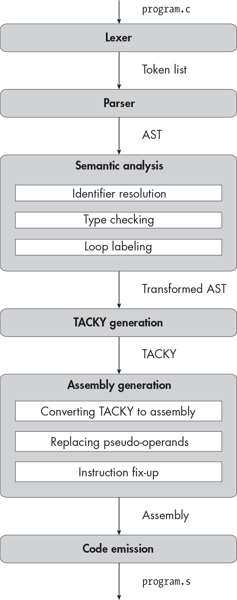

` ``Description`

## `16` `CHARACTERS AND STRINGS`


In this chapter, you’ll implement three new integer types: `char`, `signed char`, and `unsigned char`. These are the *character types*, which have a size of 1 byte. Because your compiler already supports signed and unsigned integers in multiple sizes, you can add these new types with minimal effort. You’ll also add support for string literals and character constants. String literals play a weird role in C: sometimes they behave like compound initializers, and at other times they represent constant `char` arrays. To support the latter case, you’ll store constant strings alongside variables in the symbol table, and you’ll introduce static constants as a top-level construct in TACKY.

At the end of the chapter, we’ll compile “Hello, World!” In Chapter 9, we compiled a version of this program that printed one character at a time. This time, we’ll compile a more reasonable version that prints out an entire string. Before we get started, I’ll give you a bit of background information: I’ll first touch on a few notable differences between the character types and the other integers, then describe how strings work in C and assembly.

### `Character Traits`

The most surprising thing about the character types is that there are three of them. There’s no distinction between `int` and `signed int` or between `long` and `signed long`, but the specifiers `char` and `signed char` refer to two distinct types. Whether “plain” `char` is signed or unsigned is implementation-defined. We’ll follow the System V ABI, which specifies that `char` is signed.

Even though `char` and `signed char` will behave identically in our implementation, the fact that they’re different types has real consequences. For instance, Listing 16-1 is illegal because it declares the same global variable as both a `char` and a `signed char`.

    char c;
    signed char c;

`Listing 16-1: Conflicting file scope variable declarations with different character types`

Declaring a global variable as both an `int` and a `signed int`, on the other hand, is perfectly legal, since both declarations specify the same type.

The character types also follow slightly different type conversion rules than the other integer types. When a character is used in a unary `+`, `-`, or `~` operation; a bitwise binary operation; or the usual arithmetic conversions, it’s first converted to an `int`. These conversions are called the *integer promotions*. (If `int` can’t fit every value of a particular character type, the character is converted to `unsigned int` instead. In our implementation, `int` can hold every value of every character type, so this is a moot point. Of course, we can also ignore the typing rules for operations we haven’t implemented, like unary `+` and the bitwise binary operations; I’m mentioning them here only for the sake of completeness.)

There’s one more noteworthy difference between characters and other integers: in C17, there are no scalar constants of character type. Tokens like `'a'` all have type `int`, despite being called “character constants.” There are constants with *wide character types* like `char16_t`, `char32_t`, and `wchar_t`, which are intended to represent multibyte characters, but we won’t implement them.

> `NOTE`

*C23 introduces u8 character constants with type unsigned char. These represent 1-byte UTF-8 characters.*

### `String Literals`

Throughout this chapter, I’ll distinguish between string literals and strings. A *string literal* is an expression that appears in the source code, like `"abc"`. A *string* is an object that lives in memory—specifically, a null-terminated `char` array. Some strings can’t be modified at runtime; I’ll call these *constant strings*, although this isn’t a standard term.

You can use a string literal in two distinct ways. First, it can initialize an array of any character type:

    signed char array[4] = "abc";

We’ll include a terminating null byte if there’s space and omit it if there isn’t. This coincides with our usual rules for array initialization: if the initializer is shorter than the target object, we pad out the remainder with zeros. Therefore, the previous declaration is equivalent to:

    signed char array[4] = {'a', 'b', 'c', 0};

In Listing 16-2, on the other hand, we leave out the null byte in `array1` because the array isn’t large enough to include it. Therefore, `array1` and `array2` have identical contents.

    char array1[3] = "abc";
    char array2[3] = {'a', 'b', 'c'};

`Listing 16-2: Using a string literal as an array initializer without the null byte`

When a string literal appears anywhere other than as an array initializer, it designates a constant string. In this context, string literals act a lot like other expressions of array type. They decay to pointers like other array expressions, so you can subscript them or assign them to `char *` objects. The following declaration initializes the variable `str_ptr` with the address of the first character in the constant string `"abc"`:

    char *str_ptr = "abc";

String literals are also lvalues, so they support the `&` operator. Here, we use this operator to take the address of the constant string `"abc"`, then assign it to `array_ptr`:

    char (*array_ptr)[4] = &"abc";

The only difference from the previous example is that the string literal doesn’t undergo array decay. We end up with a pointer to the whole string, with type `char (*)[4]`, instead of a pointer to its first element, with type `char *`. In both examples, we treat `"abc"` like any other expression of array type.

Unlike other arrays, constant strings are, well, constant. Attempting to modify them, as in Listing 16-3, produces undefined behavior.

    char *ptr = "abc";
    ptr[0] = 'x';

`Listing 16-3: Illegally modifying a constant string`

Although this code compiles, it will probably throw a runtime error, because most C implementations—including ours—store constant strings in read-only memory. (The `const` qualifier, which we won’t implement, informs the compiler that an object cannot be modified. If Listing 16-3 were part of a real C program, it would be a good idea to add a `const` qualifier to `ptr`.)

Let’s look at one more example, shown in Listing 16-4, to clarify the difference between string literals that designate constant strings and string literals that initialize arrays.

    char arr[3] = "abc";
    arr[0] = 'x';

`Listing 16-4: Legally modifying an array initialized from a string literal`

Unlike Listing 16-3, this code is perfectly legal. In Listing 16-3, `ptr` points to the start of the constant string `"abc"`. In Listing 16-4, on the other hand, we use each character of the string literal `"abc"` to initialize one element of `arr`, which is an ordinary, non-constant `char` array.

Both cases are easier to understand once we see how they translate to assembly.

### `Working with Strings in Assembly`

We’ll use two different assembly directives to initialize strings in assembly. The `.ascii` and `.asciz` directives both tell the assembler to write an ASCII string to the object file, much like `.quad` tells it to write a quadword. The difference is that `.asciz` will include a terminating null byte and `.ascii` won’t. The three declarations

    static char null_terminated[4] = "abc";
    static char not_null_terminated[3] = "abc";
    static char extra_padding[5] = "abc";

correspond to the assembly in Listing 16-5.

        .data
    null_terminated:
        .asciz "abc"
    not_null_terminated:
        .ascii "abc"
    extra_padding:
        .asciz "abc"
        .zero 1

`Listing 16-5: Initializing three static` `char` `arrays from string literals in assembly`

Because `null_terminated` is long enough to accommodate a null byte, we initialize it with the `.asciz` directive. We use `.ascii` to initialize `not_null _terminated` so we don’t go past the bounds of the array. Since `extra_padding` needs two zero bytes to reach the correct length, we write a null-terminated string, then write an extra zero byte with the `.zero` directive. Note that none of these variables needs an `.align` directive. The character types are all 1-byte aligned, so arrays of characters are too. (Array variables containing 16 or more characters are the exception; they’re 16-byte aligned, like all array variables that are 16 bytes or larger.)

The `.ascii` and `.asciz` directives initialize objects with static storage duration. Next, let’s consider Listing 16-6, which initializes a non-static array.

    int main(void) {
        char letters[6] = "abcde";
        return 0;
    }

`Listing 16-6: Using a string literal to initialize a non-static array`

Listing 16-7 illustrates one way to initialize `letters` in assembly, by copying `"abcde"` onto the stack one byte at a time.

    movb    $97,  -8(%rbp)
    movb    $98,  -7(%rbp)
    movb    $99,  -6(%rbp)
    movb    $100, -5(%rbp)
    movb    $101, -4(%rbp)
    movb    $0,   -3(%rbp)

`Listing 16-7: Initializing a non-static` `char` `array in assembly`

The characters `'a'`, `'b'`, `'c'`, `'d'`, and `'e'` have ASCII values `97`, `98`, `99`, `100`, and `101`, respectively. Assuming `letters` starts at stack address `-8(%rbp)`, the instructions in Listing 16-7 copy each character to the appropriate location in the array. The `b` suffix in each `movb` instruction indicates that it operates on a single byte.

Listing 16-8 demonstrates a more efficient approach. We initialize the first 4 bytes of this string with a single `movl` instruction, then use `movb` instructions to initialize the remaining 2 bytes.

    movl    $1684234849, -8(%rbp)
    movb    $101, -4(%rbp)
    movb    $0,   -3(%rbp)

`Listing 16-8: A more efficient way to initialize a non-static` `char` `array in assembly`

We get `1684234849` when we interpret the first 4 bytes of our string as an integer. (I’ll discuss how we get this integer in more detail later in the chapter.) This listing has the same effect as Listing 16-7, but it saves us a few instructions.

Next, let’s look at constant strings. We write these to read-only sections of the object file, just like floating-point constants. On Linux, we store constant strings in `.rodata`; on macOS, we store them in the `.cstring` section. Consider the code fragment in Listing 16-9, which returns a pointer to the start of a constant string.

    return "A profound statement.";

`Listing 16-9: Returning a pointer to the start of a string`

We’ll generate a unique label for this string, then define it in the appropriate section. Listing 16-10 gives the resulting assembly.

        .section .rodata
    .Lstring.0:
        .asciz "A profound statement."

`Listing 16-10: Defining a constant string in assembly`

Constant strings are always null-terminated, since they don’t need to fit into any particular array dimensions. Once we’ve defined a constant string, we can access it with RIP-relative addressing, like any other static object. In this particular example, we want to return the string’s address, so we’ll load it into RAX with this instruction:

    leaq    .Lstring.0(%rip), %rax

Finally, let’s see how to initialize a static pointer with a string literal, like in Listing 16-11.

    static char *ptr = "A profound statement.";

`Listing 16-11: Initializing a static` `char *` `from a string literal`

We’ll define the string the same way as in Listing 16-10. However, we can’t load it into `ptr` with an `lea` instruction. Because `ptr` is static, it must be initialized before the program starts. Luckily, the `.quad` directive accepts labels as well as constants. Listing 16-12 illustrates how to initialize `ptr` with this directive.

        .data
        .align 8
    ptr:
        .quad .Lstring.0

`Listing 16-12: Initializing a static variable with the address of a static constant`

The directive `.quad .Lstring.0` tells the assembler and linker to write the address of `.Lstring.0`.

As a side note, it’s possible to initialize any static pointer this way, not just pointers to strings. While our implementation doesn’t accept expressions like `&x` as static initializers, a more complete compiler might translate

    static int x = 10;
    static int *ptr = &x;

into:

        .data
        .align 4
    x:
        .long 10
        .align 8
    ptr:
        .quad x

At this point, you know enough about how to use strings in C and assembly to get started. The first step is to extend the lexer to recognize string literals and character constants.

### `The Lexer`

You’ll add three new tokens in this chapter:

`char` A keyword, used to specify character types

**Character constants** Individual characters, like `'a'` and `'\n'`

**String literals** Sequences of characters, like `"Hello, World!"`

A character constant consists of one character (like `a`) or escape sequence (like `\n`) wrapped in single quotes. Section 6.4.4.4 of the C standard defines a set of escape sequences to represent special characters. Table 16-1 lists these escape sequences and their ASCII codes.

`Table 16-1:` `Escape Sequences for Special Characters`

| `Escape sequence` | `Description`     | `ASCII code` |
|-------------------|-------------------|--------------|
| `\'`              | `Single quote`    | `39`         |
| `\"`              | `Double quote`    | `34`         |
| `\?`              | `Question mark`   | `63`         |
| `\\`              | `Backslash`       | `92`         |
| `\a`              | `Audible alert`   | `7`          |
| `\b`              | `Backspace`       | `8`          |
| `\f`              | `Form feed`       | `12`         |
| `\n`              | `New line`        | `10`         |
| `\r`              | `Carriage return` | `13`         |
| `\t`              | `Horizontal tab`  | `9`          |
| `\v`              | `Vertical tab`    | `11`         |

The new line, single quote (`'`), and backslash (`\`) characters can’t appear on their own as character constants and must be escaped. Any other character can be used directly as a character constant as long as it’s in the *source character set*, the complete set of characters that can appear in a source file.

The source character set is implementation-defined, but it has to include at least the *basic source character set*, which is specified in section 5.2.1 of the C standard. In our implementation, the source character set includes all the printable ASCII characters, plus the required control characters: the new line, horizontal tab, vertical tab, and form feed. You don’t need to explicitly reject characters outside of this set; you can simply assume that they never show up in source files.

Some of the characters in Table 16-1, like the audible alert (`\a`) and backspace (`\b`), aren’t in our source character set, so they can be represented only by escape characters. Other characters, including the double quote (`"`), question mark (`?`), form feed, and horizontal and vertical tabs, are in the source character set; they can be escaped in character constants, but they don’t have to be. For example, the character constants `'?'` and `'\?'` are equivalent; they both represent the question mark character. The new line, single quote, and backslash are all in the source character set but still need to be escaped.

We can recognize character constants with the truly egregious regular expression in Listing 16-13.

    '([^'\\\n]|\\['"?\\abfnrtv])'

`Listing 16-13: The regular expression to recognize a character constant`

Let’s break this down. The first alternative in the parenthesized expression, the character class `[^'\\\n]`, matches any single character except for a single quote, backslash, or new line. We have to escape the backslash, because it’s a control character in PCRE regexes as well as in C string literals. Similarly, we use the escape sequence `\n` in this regex to match a literal new line character. The second alternative, `\\['"?\\abfnrtv]`, matches an escape sequence. The first `\\` matches a single backslash, and the character class that follows includes every character that can follow the backslash in an escape sequence. The whole thing must start and end with single quotes.

A string literal consists of a possibly empty sequence of characters and escape sequences, wrapped in double quotes. A single quote can appear on its own in a string literal, but a double quote must be escaped. Listing 16-14 shows the regular expression to recognize a string literal.

    "([^"\\\n]|\\['"\\?abfnrtv])*"

`Listing 16-14: The regular expression to recognize a string literal`

Here, `[^"\\\n]` matches any single character except a double quote, backslash, or new line. Like in Listing 16-13, the second alternative matches every escape sequence. We apply the `*` quantifier to the whole parenthesized expression because it can repeat zero or more times, and we delimit it all with double quotes.

After lexing a string literal or character token, you need to unescape it. In other words, you need to convert every escape sequence in that token to the corresponding ASCII character. You can do that either now or in the parser.

The standard defines a few other types of string literals and character constants that we won’t implement. In particular, we won’t support hexadecimal escape sequences like `\xff`, octal escape sequences like `\012`, or multicharacter constants like `'ab'`. We also won’t support any of the types or constants used for non-ASCII encodings, like wide character types, wide string literals, or UTF-8 string literals.

`TEST THE LEXER`

`To test out the lexer, run:`

    $ ./test_compiler /path/to/your_compiler --chapter 16 --stage lex

`Your lexer should reject every test case in` `tests/chapter_16/invalid_lex``. These tests include invalid escape sequences, unescaped special characters, and unterminated character constants and string literals. The lexer should successfully process all the other test cases for this chapter.`

### `The Parser`

We’ll extend the AST definition in three ways. First, we’ll add `char`, `signed char`, and `unsigned char` types. Second, we’ll add a new kind of expression to represent string literals. Third, we’ll extend the `const` AST node to represent constants with character types:

    const = ConstInt(int) | ConstLong(int) | ConstUInt(int) | ConstULong(int)
          | ConstDouble(double) | ConstChar(int) | ConstUChar(int)

These new constant constructors are a little unusual because they don’t correspond to constant literals that actually appear in C programs. Character constants like `'a'` have type `int`, so the parser will convert them to `ConstInt` nodes; it won’t use the new `ConstChar` and `ConstUChar` constructors at all. But we’ll need these constructors later, when we pad out partially initialized character arrays during type checking and when we initialize character arrays in TACKY.

Listing 16-15 gives the complete AST definition, with this chapter’s changes bolded.

    program = Program(declaration*)
    declaration = FunDecl(function_declaration) | VarDecl(variable_declaration)
    variable_declaration = (identifier name, initializer? init,
                            type var_type, storage_class?)
    function_declaration = (identifier name, identifier* params, block? body,
                            type fun_type, storage_class?)
    initializer = SingleInit(exp) | CompoundInit(initializer*)
    type = Char | SChar | UChar | Int | Long | UInt | ULong | Double
         | FunType(type* params, type ret)
         | Pointer(type referenced)
         | Array(type element, int size)
    storage_class = Static | Extern
    block_item = S(statement) | D(declaration)
    block = Block(block_item*)
    for_init = InitDecl(variable_declaration) | InitExp(exp?)
    statement = Return(exp)
              | Expression(exp)
              | If(exp condition, statement then, statement? else)
              | Compound(block)
              | Break
              | Continue
              | While(exp condition, statement body)
              | DoWhile(statement body, exp condition)
              | For(for_init init, exp? condition, exp? post, statement body)
              | Null
    exp = Constant(const)
        | String(string)
        | Var(identifier)
        | Cast(type target_type, exp)
        | Unary(unary_operator, exp)
        | Binary(binary_operator, exp, exp)
        | Assignment(exp, exp)
        | Conditional(exp condition, exp, exp)
        | FunctionCall(identifier, exp* args)
        | Dereference(exp)
        | AddrOf(exp)
        | Subscript(exp, exp)
    unary_operator = Complement | Negate | Not
    binary_operator = Add | Subtract | Multiply | Divide | Remainder | And | Or
                    | Equal | NotEqual | LessThan | LessOrEqual
                    | GreaterThan | GreaterOrEqual
    const = ConstInt(int) | ConstLong(int) | ConstUInt(int) | ConstULong(int)
          | ConstDouble(double) | ConstChar(int) | ConstUChar(int)

`Listing 16-15: The abstract syntax tree with character types, character constants, and string literals`

It’s tempting to extend `const`, rather than `exp`, to include string literals, but string literals are distinct enough from other kinds of constants that it’s easiest to define them separately. For example, the type checker will need to handle them differently than other constants when it processes initializers.

#### `Parsing Type Specifiers`

We’ll need to extend `parse_type`, which converts a list of type specifiers into a `type` AST node, to handle character types. I won’t provide the pseudocode for this, because the logic is pretty simple. If `char` appears in a declaration by itself, it specifies the plain `char` type. If it appears with the `unsigned` keyword, it specifies the `unsigned char` type. If it appears with the `signed` keyword, it specifies the `signed char` type. As usual, the order of type specifiers doesn’t matter. It’s illegal for `char` to appear in a declaration with any other type specifier.

#### `Parsing Character Constants`

The parser should convert each character constant token to a `ConstInt` with the appropriate ASCII value. It should convert the token `'a'` to `ConstInt(97)`, `'\n'` to `ConstInt(10)`, and so on.

#### `Parsing String Literals`

The parser should unescape string literals if the lexer hasn’t done that already. Each character in the string literal, including characters represented by escape sequences in the original source code, must be represented as a single byte internally. Otherwise, we’ll calculate inaccurate string lengths in the type checker and initialize arrays with incorrect values at runtime.

Adjacent string literal tokens should be concatenated into a single `String` AST node. For example, the parser should convert the statement

    return "foo" "bar";

to the AST node `Return(String("foobar"))`.

#### `Putting It All Together`

Listing 16-16 defines the complete grammar, with this chapter’s changes bolded.

    <program> ::= {<declaration>}
    <declaration> ::= <variable-declaration> | <function-declaration>
    <variable-declaration> ::= {<specifier>}+ <declarator> ["=" <initializer>] ";"
    <function-declaration> ::= {<specifier>}+ <declarator> (<block> | ";")
    <declarator> ::= "*" <declarator> | <direct-declarator>
    <direct-declarator> ::= <simple-declarator> [<declarator-suffix>]
    <declarator-suffix> ::= <param-list> | {"[" <const> "]"}+
    <param-list> ::= "(" "void" ")" | "(" <param> {"," <param>} ")"
    <param> ::= {<type-specifier>}+ <declarator>
    <simple-declarator> ::= <identifier> | "(" <declarator> ")"
    <type-specifier> ::= "int" | "long" | "unsigned" | "signed" | "double" | ❶ "char"
    <specifier> ::= <type-specifier> | "static" | "extern"
    <block> ::= "{" {<block-item>} "}"
    <block-item> ::= <statement> | <declaration>
    <initializer> ::= <exp> | "{" <initializer> {"," <initializer>} [","] "}"
    <for-init> ::= <variable-declaration> | [<exp>] ";"
    <statement> ::= "return" <exp> ";"
                  | <exp> ";"
                  | "if" "(" <exp> ")" <statement> ["else" <statement>]
                  | <block>
                  | "break" ";"
                  | "continue" ";"
                  | "while" "(" <exp> ")" <statement>
                  | "do" <statement> "while" "(" <exp> ")" ";"
                  | "for" "(" <for-init> [<exp>] ";" [<exp>] ")" <statement>
                  | ";"
    <exp> ::= <unary-exp> | <exp> <binop> <exp> | <exp> "?" <exp> ":" <exp>
    <unary-exp> ::= <unop> <unary-exp>
                  | "(" {<type-specifier>}+ [<abstract-declarator>] ")" <unary-exp>
                  | <postfix-exp>
    <postfix-exp> ::= <primary-exp> {"[" <exp> "]"}
    <primary-exp> ::= <const> | <identifier> | "(" <exp> ")" | ❷ {<string>}+
                    | <identifier> "(" [<argument-list>] ")"
    <argument-list> ::= <exp> {"," <exp>}
    <abstract-declarator> ::= "*" [<abstract-declarator>]
                            | <direct-abstract-declarator>
    <direct-abstract-declarator> ::= "(" <abstract-declarator> ")" {"[" <const> "]"}
                                   | {"[" <const> "]"}+
    <unop> ::= "-" | "~" | "!" | "*" | "&"
    <binop> ::= "-" | "+" | "*" | "/" | "%" | "&&" | "||"
              | "==" | "!=" | "<" | "<=" | ">" | ">=" | "="
    <const> ::= <int> | <long> | <uint> | <ulong> | <double> | ❸ <char>
    <identifier> ::= ? An identifier token ?
    <string> ::= ? A string token ? ❹
    <int> ::= ? An int token ?
    <char> ::= ? A char token ? ❺
    <long> ::= ? An int or long token ?
    <uint> ::= ? An unsigned int token ?
    <ulong> ::= ? An unsigned int or unsigned long token ?
    <double> ::= ? A floating-point constant token ?

`Listing 16-16: The grammar with character types, character constants, and string literals`

The bolded additions to the grammar correspond to the three changes to the parser we just discussed. The grammar now includes a `"char"` type specifier ❶ and `<string>` ❹ and `<char>` tokens ❺. We recognize a sequence of one or more string literals as a primary expression ❷ and a character token as a constant ❸.

`TEST THE PARSER`

`To test your parser, run:`

    $ ./test_compiler /path/to/your_compiler --chapter 16 --stage parse

### `The Type Checker`

For the most part, the type checker can treat characters like the other integer types. They follow the same typing rules and support the same operations. The integer promotions are the one exception to this pattern, so we’ll implement them in this section. We’ll also introduce static initializers for the character types.

String literals are more challenging to type check, particularly when they appear in initializers. We’ll need to track whether each string should be used directly or converted to a pointer and which strings should be terminated with null bytes. We’ll add a few new constructs to the symbol table to represent each of these cases.

#### `Characters`

We’ll promote character types to `int` as part of the usual arithmetic conversions. Listing 16-17 shows how to perform this promotion in `get_common_type`.

    get_common_type(type1, type2):
        if type1 is a character type:
            type1 = Int
        if type2 is a character type:
            type2 = Int
        --snip--

`Listing 16-17: Applying the integer promotions during the usual arithmetic conversions`

After promoting the types of both operands, we’ll find their common type as usual. We’ll also promote the operands of the unary `-` and `~` operations. Listing 16-18 demonstrates how to promote a negated operand.

    typecheck_exp(e, symbols):
        match e with
        | --snip--
        | Unary(Negate, inner) ->
            typed_inner = typecheck_and_convert(inner, symbols)
            inner_t = get_type(typed_inner)
            if inner_t is a pointer type:
                fail("Can't negate a pointer")
          ❶ if inner_t is a character type:
                typed_inner = convert_to(typed_inner, Int)
            unary_exp = Unary(Negate, typed_inner)
          ❷ return set_type(unary_exp, get_type(typed_inner))

`Listing 16-18: Applying the integer promotions to a negation expression`

First, we make sure the operand isn’t a pointer (we introduced this validation in Chapter 14). Then, we apply the integer promotions. We check whether the operand is one of the character types ❶; if it is, we convert it to `Int` and then negate the promoted value. The result of the expression has the same type as its promoted operand ❷. We’ll handle `~` the same way, so I won’t provide the pseudocode for that here.

We’ll always recognize characters as integer types during type checking. For example, we’ll accept characters as operands in `~` and `%` expressions and as indices in pointer arithmetic. Because all integer types are also arithmetic types, we’ll permit implicit conversions between the character types and any other arithmetic type in `convert_by_assignment`.

We’ll add two static initializers for the character types. Listing 16-19 gives the updated definition of `static_init`.

    static_init = IntInit(int) | LongInit(int) | UIntInit(int) | ULongInit(int)
                | CharInit(int) | UCharInit(int)
                | DoubleInit(double) | ZeroInit(int bytes)

`Listing 16-19: Adding the static initializers for character types`

Since `signed char` and plain `char` are both signed types, we’ll use `CharInit` to initialize both of them. We’ll convert each initializer to the type it initializes according to the type conversion rules we covered in Chapters 11 and 12. For example, if an `unsigned char` is initialized with a value greater than 255, we’ll reduce its value modulo 256.

Finally, we’ll make one small, straightforward update to the way we type check compound initializers for non-static arrays. (We’ll handle string literals that initialize arrays as a separate case in the next section.) In the previous chapter, we dealt with partly initialized arrays by padding out the remaining elements with zeros. I suggested writing a `zero_initializer` helper function to generate these zeroed-out initializers. Now we can extend that function to emit `ConstChar` and `ConstUChar` to zero out elements of character type.

#### `String Literals in Expressions`

When we encounter a string literal in an expression, rather than in an array initializer, we’ll annotate it as a `char` array of the appropriate size. Listing 16-20 shows how to handle string literals in `typecheck_exp`.

    typecheck_exp(e, symbols):
        match e with
        | --snip--
        | String(s) -> return set_type(e, Array(Char, length(s) + 1))

`Listing 16-20: Type checking a string literal`

Note that the array size accounts for a terminating null byte. The type checker already handles implicit conversions from arrays to pointers in `typecheck_and_convert`. Now `typecheck_and_convert` will convert string literals to pointers too, since they also have array type.

Next, we’ll update the type checker to recognize `String` expressions as lvalues, along with variables, subscript operators, and dereference expressions. This allows programs to take their address with the `&` operator.

That takes care of string literals in ordinary expressions; now we’ll type check string literals in initializers.

#### `String Literals Initializing Non-static Variables`

Usually, we type check `SingleInit` constructs with `typecheck_and_convert`, which converts values of array type to pointers. This approach correctly handles string literals that initialize pointers. But when a string literal is used to initialize an array, we’ll type check it differently. Listing 16-21 shows how to handle this case.

    typecheck_init(target_type, init, symbols):
        match target_type, init with
        | Array(elem_t, size), SingleInit(String(s)) ->
          ❶ if elem_t is not a character type:
                fail("Can't initialize a non-character type with a string literal")
          ❷ if length(s) > size:
                fail("Too many characters in string literal")
          ❸ return set_type(init, target_type)
        | --snip--

`Listing 16-21: Type checking a string literal that initializes an array`

First, we make sure the target type is an array of characters, since string literals can’t initialize arrays of any other type ❶. Then, we validate that the string isn’t too long to initialize the array ❷. Finally, we annotate the initializer with the target type ❸. We’ll use this annotation later to figure out how many null bytes to append to the string.

#### `String Literals Initializing Static Variables`

Our final task is to process string literals that initialize static variables. We’ll need to represent two new kinds of initial values in the symbol table: ASCII strings (which correspond to the `.ascii` and `.asciz` directives) and the addresses of static objects (which correspond to directives like `.quad .Lstring.0`). We’ll update `static_init` once again to include both kinds of initializers. Listing 16-22 gives the new definition with these two additions bolded.

    static_init = IntInit(int) | LongInit(int)
                | UIntInit(int) | ULongInit(int)
                | CharInit(int) | UCharInit(int)
                | DoubleInit(double) | ZeroInit(int bytes)
                | StringInit(string, bool null_terminated)
                | PointerInit(string name)

`Listing 16-22: Adding the static initializers for strings and pointers`

`StringInit` defines an ASCII string initializer. We’ll use it to initialize both constant strings and character arrays. The `null_terminated` argument specifies whether to include a null byte at the end; we’ll use this argument to choose between the `.ascii` and `.asciz` directives during code emission. `PointerInit` initializes a pointer with the address of another static object.

We’ll also start tracking constant strings in the symbol table. Listing 16-23 gives the updated definition of `identifier_attrs`, which includes constants.

    identifier_attrs = FunAttr(bool defined, bool global)
                     | StaticAttr(initial_value init, bool global)
                     | ConstantAttr(static_init init)
                     | LocalAttr

`Listing 16-23: Tracking constants in the symbol table`

Unlike a variable, which may be uninitialized, tentatively initialized, or initialized with a list of values, a constant is initialized with a single value. It also doesn’t need a `global` flag, since we’ll never define a global constant.

Now that we’ve extended `static_init` and `identifier_attrs`, let’s discuss how to process string initializers for both character arrays and `char` pointers.

##### `Initializing a Static Array with a String Literal`

If a string literal initializes a static array, we first validate the array’s type: we make sure that the array elements have character type and that the array is long enough to contain the string. (This is the same validation we performed for non-static arrays back in Listing 16-21.) We then convert the string literal to a `StringInit` initializer, setting the `null_terminated` flag if the array has enough space for the terminating null byte. We add `ZeroInit` to the initializer list if we need to pad it out with additional null bytes. For example, we’ll convert the declaration

    static char letters[10] = "abc";

to the symbol table entry in Listing 16-24.

    name="letters"
    type=Array(Char, 10)
    attrs=StaticAttr(init=Initial([StringInit("abc", True), ZeroInit(6)]),
                     global=False)

`Listing 16-24: The symbol table entry for an array initialized from a string literal`

This entry initializes `letters` with the null-terminated string `"abc"`, followed by 6 bytes of zeros.

##### `Initializing a Static Pointer with a String Literal`

If a string literal initializes a static variable of type `char *`, we create two entries in the symbol table. The first defines the string itself, and the second defines the variable that points to that string. Let’s look at an example:

    static char *message = "Hello!";

First, we generate an identifier for the constant string `"Hello!"`; let’s say this identifier is `"string.0"`. Then, we add the entry shown in Listing 16-25 to the symbol table.

    name="string.0"
    type=Array(Char, 7)
    attrs=ConstantAttr(StringInit("Hello!", True))

`Listing 16-25: Defining a constant string in the symbol table`

This identifier must be globally unique and must be a syntactically valid label in assembly. In other words, it should follow the same constraints as the identifiers we generate for floating-point constants. Because Listing 16-25 defines a constant string, we use the new `ConstantAttr` construct, and we’ll initialize it with the null-terminated string `"Hello!"`.

Then, when we add `message` itself to the symbol table, we initialize it with a pointer to the symbol we just added. Listing 16-26 shows the symbol table entry for `message`.

    name="message"
    type=Pointer(Char)
    attrs=StaticAttr(init=Initial([PointerInit("string.0")]), global=False)

`Listing 16-26: Defining a static pointer to a string in the symbol table`

If a string literal initializes a pointer to a type other than `char`, we throw an error. (Note that `typecheck_init` already catches this error in the non-static case.) Even using a string literal to initialize a `signed char *` or `unsigned char *` is illegal. This is in keeping with the ordinary rules for type conversions: string literals have type `char *`, and we can’t implicitly convert from one pointer type to another. By contrast, a string literal can initialize an *array* of any character type because it’s legal to implicitly convert each individual character from one character type to another.

At this point, we have symbol table entries for all the strings that appear in static initializers. During TACKY generation, we’ll add all the other constant strings in the program to the symbol table too.

`TEST THE TYPE CHECKER`

`To test the type checker, run:`

    $ ./test_compiler /path/to/your_compiler --chapter 16 --stage validate

`Type checking should fail for all the test cases in` `tests/chapter_16/invalid _types``. These tests include string literals that initialize arrays of non-character type, assignments to string literals, and implicit conversions between pointers to different character types. Your type checker should successfully process all the test cases in` `tests/chapter_16/valid``.`

### `TACKY Generation`

When we convert a program to TACKY, we can treat characters exactly like all the other integers. In particular, we’ll implement casts to and from character types with the existing type conversion instructions. For example, we’ll implement casts from `double` to `unsigned char` with the `DoubleToUInt` instruction, and we’ll implement casts from `char` to `int` with `SignExtend`. Processing string literals, however, requires a bit more work.

#### `String Literals as Array Initializers`

In the type checker, we dealt with string literals that initialized static arrays. Now we’ll do the same for arrays with automatic storage duration.

As we saw earlier in the chapter, there are two options here. The simpler option is to initialize these arrays one character at a time. The more efficient option is to initialize entire 4- or 8-byte chunks at once. Either way, we’ll copy the string into the array with a sequence of `CopyToOffset` instructions.

Let’s walk through both options. We’ll use the initializer from Listing 16-6, reproduced here, as a running example:

    int main(void) {
        char letters[6] = "abcde";
        return 0;
    }

When we first looked at this example, we learned that the ASCII values of `'a'`, `'b'`, `'c'`, `'d'`, and `'e'` are `97`, `98`, `99`, `100`, and `101`. Using the simple one-byte-at-a-time approach, we’ll initialize `letters` with the TACKY instructions in Listing 16-27.

    CopyToOffset(Constant(ConstChar(97)),  "letters", 0)
    CopyToOffset(Constant(ConstChar(98)),  "letters", 1)
    CopyToOffset(Constant(ConstChar(99)),  "letters", 2)
    CopyToOffset(Constant(ConstChar(100)), "letters", 3)
    CopyToOffset(Constant(ConstChar(101)), "letters", 4)
    CopyToOffset(Constant(ConstChar(0)),   "letters", 5)

`Listing 16-27: Initializing a non-static array in TACKY, one byte at a time`

Using the more efficient approach, we’ll initialize `letters` with a single 4-byte integer, followed by 2 individual bytes:

    CopyToOffset(Constant(ConstInt(1684234849)), "letters", 0)
    CopyToOffset(Constant(ConstChar(101)),       "letters", 4)
    CopyToOffset(Constant(ConstChar(0)),         "letters", 5)

To come up with the integer `1684234849`, we take the 4 bytes `97`, `98`, `99`, and `100` and interpret them as a single little-endian integer. In hexadecimal, these bytes are `0x61`, `0x62`, `0x63`, and `0x64`. The first byte in little-endian integers is least significant, so interpreting this byte sequence as an integer gives us `0x64636261`, or `1684234849` in decimal. Whatever language you’re implementing your compiler in, it likely has utility functions to manipulate byte buffers and interpret them as integers, so you won’t need to implement this fiddly logic yourself.

To initialize eight characters at once, we’ll use a `ConstLong` instead of a `ConstInt`. We need to be careful not to overrun the bounds of the array we’re initializing; in this example, it would be incorrect to initialize `letters` with two 4-byte integers, because it would clobber neighboring values.

It’s up to you which of these approaches to use; they’re both equally correct. In either case, make sure to initialize the correct number of null bytes at the end of the string. In the type checker, you annotated every initializer, including string literals, with type information. Now you’ll use that type information to figure out how many null bytes to include. If a string literal is longer than the array it initializes, copy in only as many characters as the array can hold. In other words, leave off the null byte. If the string literal is too short, copy zeros into the rest of the array.

#### `String Literals in Expressions`

When we encounter a string literal outside of an array initializer, we’ll add it to the symbol table as a constant string. Then, we’ll use its identifier as a TACKY `Var`. Let’s revisit Listing 16-9, which returns a pointer to the first character in a string:

    return "A profound statement.";

The parser and type checker transform this into the following AST node:

    Return(AddrOf(String("A profound statement.")))

To convert this AST node to TACKY, we first define `"A profound statement."` in the symbol table:

    name="string.1"
    type=Array(Char, 22)
    attrs=ConstantAttr(StringInit("A profound statement.", True))

This entry is no different from the constant strings we defined in the type checker. It has a globally unique, automatically generated label. It’s a `char` array that’s just large enough to contain the whole string, including the terminating null byte. It’s initialized with the new `ConstantAttr` construct because we’ll ultimately store it in read-only memory.

Now we can refer to the identifier we just defined—`string.1`, in this example—to load the string’s address:

    GetAddress(Var("string.1"), Var("tmp2"))
    Return(Var("tmp2"))

In short, we use `string.1` like any other symbol of array type.

#### `Top-Level Constants in TACKY`

We need to account for all these new constant strings when we convert entries in the symbol table to top-level TACKY definitions. The assembly AST already has a top-level constant construct. Now we’ll add the corresponding construct to TACKY:

    top_level = --snip-- | StaticConstant(identifier, type t, static_init init)

When we’re generating top-level TACKY definitions from the symbol table, we’ll generate a `StaticConstant` for every constant in the symbol table, just like we generate a `StaticVariable` for each static variable. Make sure to convert function definitions to TACKY before traversing the symbol table; otherwise, you’ll miss the constant strings that get added to the symbol table during this pass.

Listing 16-28 summarizes the TACKY IR, with this chapter’s addition bolded.

    program = Program(top_level*)
    top_level = Function(identifier, bool global, identifier* params, instruction* body)
              | StaticVariable(identifier, bool global, type t, static_init* init_list)
              | StaticConstant(identifier, type t, static_init init)
    instruction = Return(val)
                | SignExtend(val src, val dst)
                | Truncate(val src, val dst)
                | ZeroExtend(val src, val dst)
                | DoubleToInt(val src, val dst)
                | DoubleToUInt(val src, val dst)
                | IntToDouble(val src, val dst)
                | UIntToDouble(val src, val dst)
                | Unary(unary_operator, val src, val dst)
                | Binary(binary_operator, val src1, val src2, val dst)
                | Copy(val src, val dst)
                | GetAddress(val src, val dst)
                | Load(val src_ptr, val dst)
                | Store(val src, val dst_ptr)
                | AddPtr(val ptr, val index, int scale, val dst)
                | CopyToOffset(val src, identifier dst, int offset)
                | Jump(identifier target)
                | JumpIfZero(val condition, identifier target)
                | JumpIfNotZero(val condition, identifier target)
                | Label(identifier)
                | FunCall(identifier fun_name, val* args, val dst)
    val = Constant(const) | Var(identifier)
    unary_operator = Complement | Negate | Not
    binary_operator = Add | Subtract | Multiply | Divide | Remainder | Equal | NotEqual
                    | LessThan | LessOrEqual | GreaterThan | GreaterOrEqual

`Listing 16-28: Adding static constants to the TACKY IR`

At this point, your TACKY generation pass should be good to go: it can handle individual characters, string literals that are implicitly converted to pointers, and string literals that initialize arrays.

`TEST THE TACKY GENERATION STAGE`

`To test out TACKY generation, run:`

    $ ./test_compiler /path/to/your_compiler --chapter 16 --stage tacky

### `Assembly Generation`

We won’t do anything too fancy in this stage. First, we’ll convert operations on individual characters to assembly. This will require a few changes to the assembly AST. Then, we’ll handle TACKY `StaticConstant` constructs and add constant strings to the backend symbol table.

#### `Operations on Characters`

Most instructions support 1-byte operands as well as longwords and quadwords. A `b` suffix, like in the instructions `movb` and `andb`, indicates that an instruction operates on a single byte. We’ll introduce a new `Byte` assembly type to represent this new operand size:

    assembly_type = Byte | --snip--

We’ll convert the `char`, `signed char`, and `unsigned char` types to `Byte`. The general-purpose registers have 1-byte aliases too; for example, `%al` is the 1-byte alias for RAX. Luckily, our code emission pass already supports these aliases.

Aside from adding the `Byte` type, we’ll need to convert to and from character types correctly. You can zero extend a 1-byte value to a wider type with the `movz` instruction. This instruction takes a two-letter suffix, indicating the types of the source and destination. The `movzbl` instruction extends a byte to a longword, and `movzbq` extends a byte to a quadword. (You can also use `movzwl` or `movzwq` to extend a 2-byte word to a larger type, but we don’t use 2-byte operands.) We’ll represent `movz` with the existing `MovZeroExtend` instruction in the assembly AST, but we’ll add the types of both operands:

    MovZeroExtend(assembly_type src_type, assembly_type dst_type, operand src, operand dst)

If `src_type` is `Byte`, we’ll ultimately emit a `movz` instruction with the correct suffix. If `src_type` is `Longword`, we’ll rewrite this to an ordinary `mov` instruction during the fix-up pass, just like in earlier chapters.

To sign extend a byte to a larger type, we’ll use the existing `Movsx` instruction. This instruction also takes a suffix to specify the types of both the source and the destination: `movsbl` extends a byte to a longword, `movsbq` extends a byte to a quadword, and `movslq` extends a longword into a quadword. We’ll add type information to this instruction in the assembly AST too:

    Movsx(assembly_type src_type, assembly_type dst_type, operand src, operand dst)

You can truncate a larger integer to a single byte with a `movb` instruction, just like you can truncate a quadword to a longword with `movl`. Note that when you copy a value to a register with the `movb` instruction, the register’s upper bytes aren’t zeroed out. This isn’t a problem; whether we’re operating on a single byte or a longword, we use only the part of the register that holds the value itself, and we ignore the register’s upper bytes.

`CLANG GOES ROGUE`

`There is one case where the contents of a register’s upper bytes might matter: when you’re calling a function that was compiled with Clang. If a function argument is narrower than 4 bytes, Clang always has the caller sign extend or zero extend it to 4 bytes. Then, in the callee, it assumes the argument has been extended to 4 bytes already.`

`This assumption violates the System V ABI, which doesn’t require callers to extend narrow function arguments. Take the following C code:`

    int accept_int(int i);

    int accept_char(char c) {
        return accept_int(c);
    }

`When a function calls` `accept_char``, it passes the parameter` `c` `in the least significant byte of EDI, which has the alias` `%dil``. Then, when` `accept_char` `calls` `accept_int``, it passes the 4-byte representation of` `c``’s value in EDI. If we’re strictly following the ABI, we assume that the 3 highest bytes of EDI are garbage at the start of` `accept_char``, so we explicitly sign extend` `c` `before passing it to` `accept_int``:`

    movsbl  %dil, %edi
    call    accept_int

`But Clang doesn’t strictly follow the ABI: when optimizations are enabled, it leaves out the` `movsbl` `instruction. This means that if` `accept_char``’s caller didn’t` `already sign extend` `c``, we might get the wrong result! This isn’t just a hypothetical concern: ICC, Intel’s legacy C compiler, doesn’t extend narrow arguments, so it’s not ABI-compatible with Clang. (Intel’s newer C compiler, which is built on Clang and LLVM, doesn’t have this problem.)`

`GCC takes the most conservative approach: it has callers extend narrow arguments but doesn’t assume they’ve been extended in the callee. It therefore interoperates correctly with both ICC and Clang.`

`In Clang’s defense, the ABI isn’t very explicit on this point. Ideally, the maintainers of the System V ABI would either specifically permit what Clang is doing or specifically forbid it.`

`So where does that leave us? We’ll follow ICC and not bother to extend narrow arguments. But if you want to make your compiler more robust, you can take GCC’s approach: when you generate assembly code to call a function, zero extend any` `unsigned char` `arguments and sign extend any` `char` `or` `signed char` `arguments.`

`I learned about this ugly corner case from Peter Cordes’s excellent answer on Stack Overflow (`[`https://stackoverflow.com/a/36760539`](https://stackoverflow.com/a/36760539)`). His answer was written in 2016; as of spring 2024, neither the ABI nor Clang’s behavior has changed.`

Finally, let’s consider how to convert between `double` and the character types. There’s no assembly instruction to convert `double` directly to a 1-byte integer or vice versa. Instead, we’ll convert to or from `int` as an intermediate step. To convert a `double` to any character type, we’ll first convert it to an `int` and then truncate it, as Listing 16-29 demonstrates.

    Cvttsd2si(Longword, src, Reg(AX))
    Mov(Byte, Reg(AX), dst)

`Listing 16-29: Converting a` `double` `to a character type`

Listing 16-30 gives the assembly to convert an `unsigned char` to a `double`. We’ll zero extend it to an `int`, then convert the result to a `double`.

    MovZeroExtend(Byte, Longword, src, Reg(AX))
    Cvtsi2sd(Longword, Reg(AX), dst)

`Listing 16-30: Converting an` `unsigned char` `to a` `double`

And to convert either signed character type to a `double`, we’ll sign extend it to an `int` first, as Listing 16-31 demonstrates.

    Movsx(Byte, Longword, src, Reg(AX))
    Cvtsi2sd(Longword, Reg(AX), dst)

`Listing 16-31: Converting a` `char` `or` `signed char` `to a` `double`

Next, we’ll deal with our second task: converting top-level constants from TACKY to assembly.

#### `Top-Level Constants`

Processing a TACKY `StaticConstant` is extremely simple: we just convert it to an assembly `StaticConstant`. You’ll also need to convert each constant string in the symbol table to an equivalent entry in the backend symbol table, like you do for variables. When you add a constant string to the backend symbol table, set its `is_static` attribute to `True`. If your backend symbol table includes an `is_constant` attribute, set this to `True` as well. (Remember that `is_constant` was an optional addition in Chapter 13; it tells us when to use local labels during code emission.)

#### `The Complete Conversion from TACKY to Assembly`

Listing 16-32 shows this chapter’s additions to the assembly AST.

    program = Program(top_level*)
    assembly_type = Byte | Longword | Quadword | Double | ByteArray(int size, int alignment)
    top_level = Function(identifier name, bool global, instruction* instructions)
              | StaticVariable(identifier name, bool global, int alignment, static_init* init_list)
              | StaticConstant(identifier name, int alignment, static_init init)
    instruction = Mov(assembly_type, operand src, operand dst)
                | Movsx(assembly_type src_type, assembly_type dst_type, operand src, operand dst)
                | MovZeroExtend(assembly_type src_type, assembly_type dst_type, operand src, 
                                operand dst)
                | Lea(operand src, operand dst)
                | Cvttsd2si(assembly_type dst_type, operand src, operand dst)
                | Cvtsi2sd(assembly_type src_type, operand src, operand dst)
                | Unary(unary_operator, assembly_type, operand)
                | Binary(binary_operator, assembly_type, operand, operand)
                | Cmp(assembly_type, operand, operand)
                | Idiv(assembly_type, operand)
                | Div(assembly_type, operand)
                | Cdq(assembly_type)
                | Jmp(identifier)
                | JmpCC(cond_code, identifier)
                | SetCC(cond_code, operand)
                | Label(identifier)
                | Push(operand)
                | Call(identifier)
                | Ret
    unary_operator = Neg | Not | Shr
    binary_operator = Add | Sub | Mult | DivDouble | And | Or | Xor
    operand = Imm(int) | Reg(reg) | Pseudo(identifier) | Memory(reg, int) | Data(identifier)
            | PseudoMem(identifier, int) | Indexed(reg base, reg index, int scale)
    cond_code = E | NE | G | GE | L | LE | A | AE | B | BE
    reg = AX | CX | DX | DI | SI | R8 | R9 | R10 | R11 | SP | BP
        | XMM0 | XMM1 | XMM2 | XMM3 | XMM4 | XMM5 | XMM6 | XMM7 | XMM14 | XMM15

`Listing 16-32: The assembly AST with byte operands`

Tables 16-2 through 16-5 summarize the latest updates to the conversion from TACKY to assembly, with new constructs and changes to the conversions for existing constructs bolded.

`Table 16-2:` `Converting Top-Level TACKY Constructs to Assembly`

| `TACKY top-level construct`     | `Assembly top-level construct`                  |
|---------------------------------|-------------------------------------------------|
| `StaticConstant(name, t, init)` | StaticConstant(name, \<alignment of t\> , init) |

`Table 16-3:` `Converting TACKY Instructions to Assembly`

|                          |                                                                                                                                                                                                                                                                                                                                                                                                                                |                                                                                                                                                                                                                                                                                                                                                                                                                                                                                                |
|--------------------------|--------------------------------------------------------------------------------------------------------------------------------------------------------------------------------------------------------------------------------------------------------------------------------------------------------------------------------------------------------------------------------------------------------------------------------|------------------------------------------------------------------------------------------------------------------------------------------------------------------------------------------------------------------------------------------------------------------------------------------------------------------------------------------------------------------------------------------------------------------------------------------------------------------------------------------------|
| `TACKY instruction`      |                                                                                                                                                                                                                                                                                                                                                                                                                                | `Assembly instructions`                                                                                                                                                                                                                                                                                                                                                                                                                                                                        |
| `ZeroExtend(src, dst)`   |                                                                                                                                                                                                                                                                                                                                                                                                                                | MovZeroExtend( \<src type\> , \<dst type\> , src, dst)                                                                                                                                                                                                                                                                                                                                                                                                                                         |
| `SignExtend(src, dst)`   |                                                                                                                                                                                                                                                                                                                                                                                                                                | Movsx( \<src type\> , \<dst type\> , src, dst)                                                                                                                                                                                                                                                                                                                                                                                                                                                 |
| `Truncate(src, dst)`     |                                                                                                                                                                                                                                                                                                                                                                                                                                | Mov( \<dst type\> , src, dst)                                                                                                                                                                                                                                                                                                                                                                                                                                                                  |
| `IntToDouble(src, dst)`  | char or signed char                                                                                                                                                                                                                                                                                                                                                                                                            | Movsx(Byte, Longword, src, Reg( \<R\> )) Cvtsi2sd(Longword, Reg( \<R\> ), dst)                                                                                                                                                                                                                                                                                                                                                                                                                 |
| int or long              | Cvtsi2sd( \<src type\> , src, dst)                                                                                                                                                                                                                                                                                                                                                                                             |                                                                                                                                                                                                                                                                                                                                                                                                                                                                                                |
| `DoubleToInt(src, dst)`  | char or signed char                                                                                                                                                                                                                                                                                                                                                                                                            | Cvttsd2si(Longword, src, Reg( \<R\> )) Mov(Byte, Reg( \<R\> ), dst)                                                                                                                                                                                                                                                                                                                                                                                                                            |
| int or long              | Cvttsd2si( \<dst type\> , src, dst)                                                                                                                                                                                                                                                                                                                                                                                            |                                                                                                                                                                                                                                                                                                                                                                                                                                                                                                |
| `UIntToDouble(src, dst)` | `unsigned char`                                                                                                                                                                                                                                                                                                                                                                                                                | MovZeroExtend(Byte, Longword, src, Reg( \<R\> )) Cvtsi2sd(Longword, Reg( \<R\> ), dst)                                                                                                                                                                                                                                                                                                                                                                                                         |
| `unsigned int`           | MovZeroExtend( Longword, Quadword, src, Reg( \<R\> )) Cvtsi2sd(Quadword, Reg( \<R\> ), dst)                                                                                                                                                                                                                                                                                                                                    |                                                                                                                                                                                                                                                                                                                                                                                                                                                                                                |
| `unsigned long`          | Cmp(Quadword, Imm(0), src) JmpCC(L, \<label1\> ) Cvtsi2sd(Quadword, src, dst) Jmp( \<label2\> ) Label( \<label1\> ) Mov(Quadword, src, Reg( \<R1\> )) Mov(Quadword, Reg( \<R1\> ), Reg( \<R2\> )) Unary(Shr, Quadword, Reg( \<R2\> )) Binary(And, Quadword, Imm(1), Reg( \<R1\> )) Binary(Or, Quadword, Reg( \<R1\> ), Reg( \<R2\> )) Cvtsi2sd(Quadword, Reg( \<R2\> ), dst) Binary(Add, Double, dst, dst) Label( \<label2\> ) |                                                                                                                                                                                                                                                                                                                                                                                                                                                                                                |
| `DoubleToUInt(src, dst)` | `unsigned char`                                                                                                                                                                                                                                                                                                                                                                                                                | Cvttsd2si(Longword, src, Reg( \<R\> )) Mov(Byte, Reg( \<R\> ), dst)                                                                                                                                                                                                                                                                                                                                                                                                                            |
| `unsigned int`           | Cvttsd2si(Quadword, src, Reg( \<R\> )) Mov(Longword, Reg(\< R \>), dst)                                                                                                                                                                                                                                                                                                                                                        |                                                                                                                                                                                                                                                                                                                                                                                                                                                                                                |
|                          | `unsigned long`                                                                                                                                                                                                                                                                                                                                                                                                                | Cmp(Double, Data( \<upper-bound\> ), src) JmpCC(AE, \<label1\> ) Cvttsd2si(Quadword, src, dst) Jmp( \<label2\> ) Label( \<label1\> ) Mov(Double, src, Reg( \<X\> )) Binary(Sub, Double, Data( \<upper-bound\> ), Reg( \<X\> )) Cvttsd2si(Quadword, Reg( \<X\> ), dst) Mov(Quadword, Imm(9223372036854775808), Reg( \<R\> )) Binary(Add, Quadword, Reg( \<R\> ), dst) Label( \<label2\> ) And add a top-level constant: StaticConstant( \<upper-bound\> , 8, DoubleInit(9223372036854775808.0)) |

`Table 16-4:` `Converting TACKY Operands to Assembly`

| `TACKY operand`             | `Assembly operand` |
|-----------------------------|--------------------|
| `Constant(ConstChar(int))`  | `Imm(int)`         |
| `Constant(ConstUChar(int))` | `Imm(int)`         |

`Table 16-5:` `Converting Types to Assembly`

| `Source type` | `Assembly type` | `Alignment` |
|---------------|-----------------|-------------|
| `Char`        | `Byte`          | `1`         |
| `SChar`       | `Byte`          | `1`         |
| `UChar`       | `Byte`          | `1`         |

Next, let’s move on to pseudo-operand replacement and instruction fix-up. The updates to both of these passes are pretty straightforward.

#### `Pseudo-Operand Replacement`

We’ll allocate 1 byte on the stack for each `Byte` object. We don’t need to worry about rounding these down to the right alignment, because they’re all 1-byte aligned.

This pass shouldn’t require any dedicated logic to deal with constant strings. We’ve already recorded that they have static storage duration in the backend symbol table. Now we’ll access them with `Data` operands like any other static object.

#### `Instruction Fix-Up`

The destination of a `movz` instruction must be a register, and its source must not be an immediate value. If the size of the source operand of a `MovZeroExtend` instruction is 1 byte and its source or destination is invalid, we rewrite it according to the usual pattern. For instance, we rewrite

    movzbl  $10, -4(%rbp)

as:

    movb    $10, %r10b
    movzbl  %r10b, %r11d
    movl    %r11d, -4(%rbp)

If its source operand is a longword, we replace it with one or more `mov` instructions, like in earlier chapters.

If the source of a `movb` instruction is an immediate value that can’t fit in a single byte, we’ll reduce it modulo 256. For example, we’ll rewrite

    movb    $258, %al

as:

    movb    $2, %al

This is the same pattern we introduced in Chapter 11 to handle `movl` instructions whose source operands are 8-byte immediate values.

`TEST THE ASSEMBLY GENERATION STAGE`

`To test that your compiler can generate assembly programs without throwing an error, run:`

    $ ./test_compiler /path/to/your_compiler --chapter 16 --stage codegen

### `Code Emission`

The code emission stage needs to support string constants, pointer initializers, and a handful of other changes. We’ll emit each `StringInit` as either an `.ascii` or an `.asciz` directive, depending on whether it should include a null byte. Double quotes, backslashes, and new lines in ASCII strings must be escaped. To escape these characters, you can use either the `\"`, `\\`, and `\n` escape sequences or three-digit octal escape sequences that specify their ASCII values. For example, the ASCII code for the backslash character is `92`, or `134` in octal, so you could represent it with the escape sequence `\134`. You can escape other special characters too, but you don’t need to. Some escape sequences, like `\a`, are valid in C but not assembly, so octal escape sequences are the safest way to escape arbitrary characters.

We’ll emit each `PointerInit` as a `.quad` directive, followed by the label we want to point to. We’ll convert `CharInit` and `UCharInit` to the `.byte` directive, which works exactly like `.long` and `.quad`. When you emit a 1-byte-aligned object, you can either include the `.align` directive or omit it. Every object is at least 1-byte aligned by definition, so specifying a 1-byte alignment has no effect.

On Linux, string constants will live in the `.rodata` section along with floating-point constants. On macOS, they’ll live in the `.cstring` section. If you use local labels (which begin with a `.L` or `L` prefix) for floating-point constants, you should use them for string constants too. The logic to add this prefix to `Data` operands won’t change; we’ll still look up each `Data` operand in the backend symbol table and add this prefix if its `is_constant` attribute is true.

The `movz` and `movsx` instructions should include suffixes to indicate both the source and destination types. Other instructions should include a `b` suffix when they operate on bytes. Tables 16-6 through 16-9 summarize the latest updates to the code emission pass; new constructs and changes to the way we emit existing constructs are bolded.

`Table 16-6:` `Formatting Top-Level Assembly Constructs`

Assembly top-level construct Output

StaticConstant(name, alignment, init) Linux

```
    .section .rodata
    <alignment-directive> 
<name>:
     <init>
```

macOS (8-byte-aligned numeric constants)

```
    .literal8
    .balign 8
 <name>:
     <init>
```

macOS (16-byte-aligned numeric constants)

```
    .literal16
    .balign 16
 <name>:
     <init>
     .quad 0
```

macOS (string constants)

```
    .cstring
 <name>:
     <init>
```

`Table 16-7:` `Formatting Static Initializers`

| `Static initializer`   | `Output`         |
|------------------------|------------------|
| `CharInit(0)`          | `.zero 1`        |
| `CharInit(i)`          | .byte \<i\>      |
| `UCharInit(0)`         | `.zero 1`        |
| `UCharInit(i)`         | .byte \<i\>      |
| `StringInit(s, True)`  | .asciz " \<s\> " |
| `StringInit(s, False)` | .ascii " \<s\> " |
| `PointerInit(label)`   | .quad \<label\>  |

`Table 16-8:` `Formatting Assembly Instructions`

Assembly instruction Output

Movsx( src_t , dst_t , src, dst)

```
movs<src_t><dst_t>    <src>, <dst>
```

MovZeroExtend(src_t, dst_t, src, dst)

```
movz<src_t><dst_t>   <src>, <dst>
```

`Table 16-9:` `Instruction Suffixes for Assembly Types`

| `Assembly type` | `Instruction suffix` |
|-----------------|----------------------|
| `Byte`          | `b`                  |

Your compiler now supports strings and characters! You still need to run this chapter’s tests to make sure you’ve implemented these features correctly, but first, we’ll try out a couple of examples.

### `Hello Again, World!`

Back in Chapter 9, we printed “Hello, World!” one character at a time. Now we can write a more traditional “Hello, World!” program using the `puts` standard library function, which has the following signature:

    int puts(const char *s);

Since we don’t support `const`, we’ll declare `puts` without it. Listing 16-33 shows our new “Hello, World!” program.

    int puts(char *c);
    int main(void) {
        puts("Hello, World!");
        return 0;
    }

`Listing 16-33: Printing out a string with` `puts`

This code is not entirely legal, since the declaration of `puts` isn’t compatible with the definition in the standard library. However, the program should work correctly in spite of this minor bit of rule breaking. Compile it, then run it to print a message to stdout:

    $ ./hello_world
    Hello, World!

If you want to get really wild, you can even compile Listing 16-34, which reads from stdin.

    int getchar(void);
    int puts(char *c);
    char *strncat(char *s1, char *s2, unsigned long n);
    char *strcat(char *s1, char *s2);
    unsigned long strlen(char *s);

    ❶ static char name[30];
    ❷ static char message[40] = "Hello, ";

    int main(void) {
        puts("Please enter your name: ");

        int idx = 0;
        while (idx < 29) {
            int c = getchar();

            // treat EOF, null byte, or line break as end of input
            if (c <= 0 || c == '\n') {
                break;
            }

            name[idx] = c;
            idx = idx + 1;
        }

      ❸ name[idx] = 0; // add terminating null byte to name

        // append name to message, leaving space for null byte
        // and exclamation point
        strncat(message, name, 40 - strlen(message) - 2);

        // append exclamation point
        strcat(message, "!");
        puts(message);
        return 0;
    }

`Listing 16-34: Reading from stdin`

Much like Listing 16-33 declares `puts` without the `const` qualifier, this program declares several library functions without their usual qualifiers, including `const` and `restrict`. We use `getchar` to read from stdin one character at a time, since our compiler can’t easily handle most other ways to read from stdin using C standard library functions.

Listing 16-34 declares two static arrays: `name` and `message`. Because `name` is static but has no explicit initializer, it will be initialized with all zeros ❶. The beginning of `message` is initialized with the string `"Hello, "`, and the remainder is filled with null bytes ❷. This program calls `puts` to emit a prompt, then calls `getchar` in a loop to read the user’s response into the `name` array, one character at a time. We exit the loop when `getchar` returns a negative number (which indicates end-of-file or an error), a null byte, or a new line character, or after we’ve read in 29 characters, whichever comes first. (We check whether the result is negative, instead of comparing it to the `EOF` macro like a normal C program would, because we can’t include `<stdio.h>`, where `EOF` is defined.) Reading in at most 29 characters leaves room for a terminating null byte, which we add to `name` after exiting the loop ❸.

The call to `strncat` appends the user’s name to `message`, and the subsequent call to `strcat` appends an exclamation point. Finally, the second call to `puts` writes the whole message to stdout. Your compiler should be able to handle this listing; go ahead and give it a try! I’ll use the program to say hello to my dog, Arlo. (I promised him I’d mention him in this book at least once.)

    $ ./hello_name
    Please enter your name:
    Arlo
    Hello, Arlo!

If this program works correctly, you’re ready to run the full test suite.

`TEST THE WHOLE COMPILER`

`To test out the whole compiler, run:`

    $ ./test_compiler /path/to/your_compiler --chapter 16

`The test programs in` `tests/chapter_16/valid/char_constants` `exercise your compiler’s support for character constant tokens. The programs in` `tests/chapter_16/valid/chars` `test its support for values of scalar character type, and the programs in` `tests/chapter_16/valid/strings_as_initializers` `and` `tests/chapter_16/valid/strings_as_lvalues` `test its support for string literals. As usual, the tests in` `tests/chapter_16/valid/libraries` `validate that your compiler handles strings and characters according to the System V ABI.`

### `Summary`

Your compiler can now process programs that work with text. In this chapter, you learned how to lex string literals and character constants, and you extended the type checker to distinguish between constant strings and string literals that initialize arrays. You also introduced new ways to define constants in the symbol table and the TACKY IR. In the next chapter, you’ll introduce two features that make it easier to dynamically allocate memory: the `sizeof` operator and the `void` type.