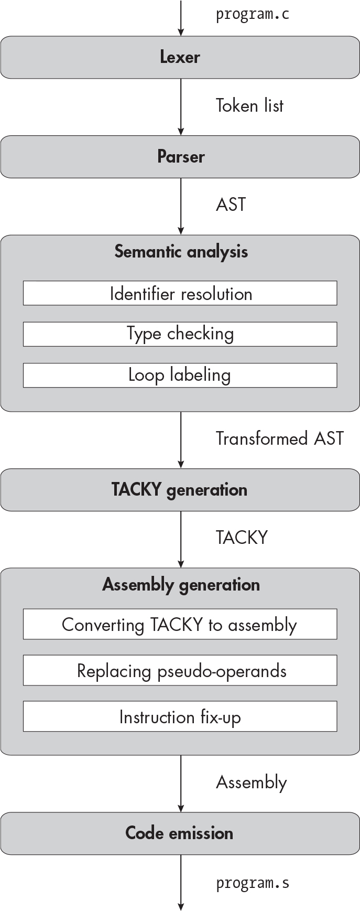

` ``Description`

## `17` `SUPPORTING DYNAMIC MEMORY ALLOCATION`


Over the course of Part II, you’ve compiled programs that call an increasingly wide range of standard library functions. At the end of Part I, your compiler supported only functions with parameters and return values of type `int`, like `putchar`. Now you can compile programs that call floating-point math functions like `fmax` and string processing functions like `puts`. In this chapter, you’ll implement the remaining features you need to call a particularly important part of the standard library: the memory management functions. These include `malloc`, `calloc`, and `aligned``_alloc`, which allocate memory dynamically; `free`, which deallocates dynamically allocated memory; and `realloc`, which deallocates one block of memory and reallocates another with the same contents.

To compile programs that declare and call these functions, you’ll need to implement the `void` type. Up until now, we’ve used the `void` keyword only to specify an empty parameter list; now we’ll treat it as a proper type specifier. In C, `void *` represents the address of a chunk of memory with no particular type; the standard library functions that allocate memory all return this type. The `void` type on its own is also useful. For instance, you can use it to declare functions that don’t return a value, like `free`. In addition to `void`, we’ll implement the `sizeof` operator, which gets the size of a type or object. C programs often use `sizeof` to figure out how many bytes of memory to allocate.

This chapter’s not-so-secret agenda is to get you ready to implement structure types in Chapter 18. Real-life C programs frequently store structures in dynamically allocated memory, and so do many of that chapter’s tests. The changes we make to the type checker will also come in handy in Chapter 18 because some of the typing rules that apply to `void` will apply to structure types too.

### `The void Type`

The C standard (section 6.2.5, paragraph 19) gives the following rather mysterious definition of `void`: “The `void` type comprises an empty set of values; it is an incomplete object type that cannot be completed.” We’ll talk more about what “incomplete object type” means in a moment. For now, the main idea is that `void` is a type with no values. You can’t do a whole lot with this type, but it does have a few uses.

You can give a function a `void` return type if it doesn’t return anything. To leave a function with a `void` return type, you can use a `return` statement with no expression, like in Listing 17-1.

    void return_nothing(void) {
        return;
    }

`Listing 17-1: A function with a` `void` `return type`

As Listing 17-2 demonstrates, you can also leave out the `return` statement entirely. In that case, the function will return once you reach the end of the function body.

    void perform_side_effect(void) {
        extern int some_variable;
        some_variable = 100;
    }

`Listing 17-2: A` `void` `function with no` `return` `statement`

A *void expression* is an expression whose type is `void`; it has no value, but you can evaluate it for its side effects. There are three ways to produce a void expression. First, you can call a `void` function. Second, you can evaluate a conditional expression whose branches are both `void`:

    flag ? perform_side_effect() : return_nothing();

Third, you can cast a value to `void`:

    (void) (1 + 1);

Here, the cast to `void` has no effect on program execution; its only purpose is to tell the compiler, and human readers, that the value of the expression should be discarded. This is a common way to silence compiler warnings about unused values.

If you’re particularly zealous about following C’s typing rules, you might also cast to `void` in code like that in Listing 17-3 to get the types of two conditional branches to agree.

    int i = 0;
    flag ? perform_side_effect() : (void) (i = 3);

`Listing 17-3: A conditional expression with type` `void`

If we left out the cast to `void` in this conditional expression, one branch would have type `void` and the other would have type `int`. This would be illegal, although most compilers won’t complain about it unless you use the `-pedantic` flag to enable extra warnings. Our compiler will reject conditional expressions with one `void` branch, because it’s pedantic all the time.

There are four places where you can use a void expression. First, it can appear as a clause in a conditional expression, as in Listing 17-3. Second, you can use it as a stand-alone expression:

    perform_side_effect();

Third, it can appear as the first or third clause of a `for` loop header, like in Listing 17-4.

    for (perform_side_effect(); i < 10; perform_side_effect())
        --snip--

`Listing 17-4: Using void expressions in a` `for` `loop header`

And fourth, you can cast a void expression to `void`:

    (void) perform_side_effect();

That last one isn’t particularly useful, but it is legal.

As you already know, you can also use the `void` keyword to specify an empty parameter list in a function declaration. This is a special case, since it doesn’t actually specify an expression, object, or return value with type `void`. Even once we extend the compiler to fully support the `void` type, we’ll handle this particular case exactly the same way as before.

### `Memory Management with void *`

Now let’s look at how the memory management functions use `void *` to represent allocated memory. The `malloc` function has the following signature:

    void *malloc(size_t size);

The `size` argument specifies the number of bytes to allocate. Its type, `size_t`, is an implementation-defined unsigned integer type. Under the System V x64 ABI, `size_t` is an alias for `unsigned long`. Because we don’t support type aliases, our test programs and examples use this declaration instead:

    void *malloc(unsigned long size);

The `malloc` function allocates a chunk of memory and returns its address. Since `malloc` doesn’t know what type of object will be stored in this chunk of memory, it would be misleading to return a pointer to `int`, `char`, or any of the other types we’ve seen so far. Instead, it returns `void *`. You can’t read or write memory through a `void *` pointer, though. So, before you can access the memory that you allocated with `malloc`, you need to specify what type of object it should contain by converting its address from `void *` to a different pointer type.

You can convert other pointer types to and from `void *` without an explicit cast. For example, you might use `malloc` to allocate an array of 100 `int` elements:

    int *many_ints = malloc(100 * sizeof (int));

When you assign the result of `malloc` to `many_ints`, it’s implicitly converted from `void *` to `int *`. Then, you can subscript `many_ints` like any other pointer into an `int` array:

    many_ints[10] = 10;

The `free` function accepts a `void *` argument that designates the chunk of memory to deallocate:

    void free(void *ptr);

This pointer must be the same value that was returned earlier by `malloc` or one of the other memory allocation functions. Here’s how you’d use `free` to deallocate the memory that `many_ints` points to:

    free(many_ints);

This function call implicitly converts the value of `many_ints` from `int *` back to `void *`, resulting in the same pointer that `malloc` returned in the first place.

The `calloc` and `aligned_alloc` functions provide slightly different ways to allocate memory; like `malloc`, they return pointers to the allocated space with type `void *`. The `realloc` function accepts a size and a `void *` pointer to previously allocated storage that should now be freed, and it returns a `void *` pointer to a newly allocated block of storage with the new size and the original contents. For our purposes, the details of these functions aren’t important; the key idea is that they all use `void *` pointers to identify the blocks of memory they allocate and deallocate.

These blocks of memory are objects that we can read and write, much like variables, but their lifetimes are managed differently. As we know, variables have either automatic storage duration (their lifetime lasts through the execution of a single block) or static storage duration (their lifetime lasts for the whole program). A block of allocated memory has *allocated storage duration*: its lifetime starts when it’s allocated and ends when it’s deallocated.

The compiler has to keep track of all the variables with static or automatic storage duration, record details about their size and lifetime in the symbol table, and reserve space for them in the data section or on the stack. But the compiler doesn’t need to know anything about objects with allocated storage duration, because the programmer and the memory management library are responsible for keeping track of them.

### `Complete and Incomplete Types`

An object type is *complete* if we know its size and *incomplete* if we don’t. The `void` type is the first incomplete type we’ve seen. We don’t know its size because it doesn’t *have* a size. In the next chapter, we’ll encounter incomplete structure types, whose size and members aren’t visible to the compiler. Incomplete structure types can be completed later in the program if the compiler learns more about them. The `void` type, on the other hand, can’t be completed.

The C standard states that “an incomplete type can only be used when the size of an object of that type is not needed” (section 6.7.2.3, footnote 132). For example, you can’t define a variable with an incomplete type, because you don’t know how much space to allocate for it. And you can’t assign to an object with an incomplete type or use its value, since you would need to know how many bytes to read or write. With a few exceptions, other incomplete types are subject to the same restrictions as `void`, and the type checker will handle them the same way.

All pointers are complete types, even if the types they point to are incomplete; we know that the size of a pointer is always 8 bytes. That’s why you can declare variables and parameters of type `void *`, return `void *` values from functions, convert them to other pointer types, and so on. As you’ll see in the next chapter, you can use pointers to incomplete structure types in the same way.

### `The sizeof Operator`

The `sizeof` operator accepts either an expression or the name of a type. When it takes a type name, it returns the size of that type in bytes. When it takes an expression, it returns the size of the expression’s type. Listing 17-5 illustrates both cases.

    sizeof (long);
    sizeof 10.0;

`Listing 17-5: The two uses of` `sizeof`

Both of these `sizeof` expressions evaluate to 8 because the `long` and `double` types are both 8 bytes. Note that type names in `sizeof` expressions must be parenthesized, but expressions don’t need to be.

When you use an array in a `sizeof` expression, it doesn’t decay to a pointer. Consider the `sizeof` expression in Listing 17-6.

    int array[3];
    return sizeof array;

`Listing 17-6: Getting the size of an array`

This code returns `12`, which is the size of a three-`int` array, rather than `8`, the size of a pointer.

You can always determine an expression’s type—and therefore its size—without evaluating it. In fact, the C standard requires that we *don’t* evaluate the operand of a `sizeof` expression. Instead, we infer the operand’s type and evaluate `sizeof` at compile time. This implies that a `sizeof` expression won’t produce side effects. For example, the statement

    return sizeof puts("Shouting into the void");

won’t call `puts`. It will just return `4` because the `puts` function’s return type is `int`.

You can also apply `sizeof` to expressions that would typically produce runtime errors, as Listing 17-7 demonstrates.

    double *null_ptr = 0;
    return sizeof *null_ptr;

`Listing 17-7: Getting the size of an expression without evaluating it`

Normally, dereferencing `null_ptr` would lead to undefined behavior. But this example is well defined, because it will never evaluate `*null_ptr`. Instead, it will return `8`, because the compiler can determine that the type of `*null_ptr` is `double`.

Variable-length arrays are the one exception to this rule. The size of a variable-length array isn’t known at compile time, so it has to be evaluated at runtime. Because we don’t support variable-length arrays, we can ignore this case.

Now that we know how C programs use `void`, `void *`, and `sizeof`, let’s work on the compiler. As usual, we’ll start by updating the lexer.

### `The Lexer`

You’ll add one new keyword in this chapter:

`sizeof`

You don’t need to add the `void` keyword; the lexer already recognizes it.

`TEST THE LEXER`

`To test the lexer, run:`

    $ ./test_compiler /path/to/your_compiler --chapter 17 --stage lex

`It should process all of this chapter’s tests without error.`

### `The Parser`

Listing 17-8 shows this chapter’s changes to the AST.

    program = Program(declaration*)
    declaration = FunDecl(function_declaration) | VarDecl(variable_declaration)
    variable_declaration = (identifier name, initializer? init,
                            type var_type, storage_class?)
    function_declaration = (identifier name, identifier* params, block? body,
                            type fun_type, storage_class?)
    initializer = SingleInit(exp) | CompoundInit(initializer*)
    type = Char | SChar | UChar | Int | Long | UInt | ULong | Double | Void
         | FunType(type* params, type ret)
         | Pointer(type referenced)
         | Array(type element, int size)
    storage_class = Static | Extern
    block_item = S(statement) | D(declaration)
    block = Block(block_item*)
    for_init = InitDecl(variable_declaration) | InitExp(exp?)
    statement = Return(exp?)
              | Expression(exp)
              | If(exp condition, statement then, statement? else)
              | Compound(block)
              | Break
              | Continue
              | While(exp condition, statement body)
              | DoWhile(statement body, exp condition)
              | For(for_init init, exp? condition, exp? post, statement body)
              | Null
    exp = Constant(const)
        | String(string)
        | Var(identifier)
        | Cast(type target_type, exp)
        | Unary(unary_operator, exp)
        | Binary(binary_operator, exp, exp)
        | Assignment(exp, exp)
        | Conditional(exp condition, exp, exp)
        | FunctionCall(identifier, exp* args)
        | Dereference(exp)
        | AddrOf(exp)
        | Subscript(exp, exp)
        | SizeOf(exp)
        | SizeOfT(type)
    unary_operator = Complement | Negate | Not
    binary_operator = Add | Subtract | Multiply | Divide | Remainder | And | Or
                    | Equal | NotEqual | LessThan | LessOrEqual
                    | GreaterThan | GreaterOrEqual
    const = ConstInt(int) | ConstLong(int) | ConstUInt(int) | ConstULong(int)
          | ConstDouble(double) | ConstChar(int) | ConstUChar(int)

`Listing 17-8: The abstract syntax tree with` `void``,` `sizeof``, and` `return` `statements with no return value`

We’ve made four small changes here. First, we added a `void` type. Second, the expression in the `Return` statement is now optional so that it can represent `return` statements with and without return values. Finally, there are two new expressions to represent the two ways you can use the `sizeof` operator.

Next, we’ll make the corresponding changes to the grammar. The one wrinkle here is that we can’t apply `sizeof` to a cast expression unless that expression is parenthesized. For example, this is a syntax error:

    sizeof (int) a;

Wrapping the cast expression in parentheses fixes the error:

    sizeof ((int) a);

This restriction makes it easier for the parser to distinguish between `sizeof` operations on type names and on expressions. To capture this restriction in the grammar, we need to break out cast expressions into a separate symbol from other unary expressions.

Let’s start by refactoring type names into a symbol that we can use in both cast and `sizeof` expressions:

    <type-name> ::= {<type-specifier>}+ [<abstract-declarator>]

Next, we’ll define the new `<cast-exp>` symbol, which includes one rule for cast expressions and another for all the other unary expressions:

    <cast-exp> ::= "(" <type-name> ")" <cast-exp>
                 | <unary-exp>

We’ll then update `<unary-exp>` to include every unary expression except for casts:

    <unary-exp> ::= <unop> ❶ <cast-exp>
                  | "sizeof" ❷ <unary-exp>
                  | "sizeof" "(" <type-name> ")"
                  | <postfix-exp>

The rule for unary operations like `-`, `~`, `!`, and `&` allows cast expressions as operands ❶, while the rule for `sizeof` doesn’t ❷.

Finally, we’ll use the new `<cast-exp>` symbol, instead of the more restrictive `<unary-exp>`, to represent a single term in a binary or ternary expression:

    <exp> ::= <cast-exp> | <exp> <binop> <exp> | <exp> "?" <exp> ":" <exp>

Listing 17-9 gives the complete grammar for this chapter.

    <program> ::= {<declaration>}
    <declaration> ::= <variable-declaration> | <function-declaration>
    <variable-declaration> ::= {<specifier>}+ <declarator> ["=" <initializer>] ";"
    <function-declaration> ::= {<specifier>}+ <declarator> (<block> | ";")
    <declarator> ::= "*" <declarator> | <direct-declarator>
    <direct-declarator> ::= <simple-declarator> [<declarator-suffix>]
    <declarator-suffix> ::= <param-list> | {"[" <const> "]"}+
    <param-list> ::= "(" "void" ")" | "(" <param> {"," <param>} ")"
    <param> ::= {<type-specifier>}+ <declarator>
    <simple-declarator> ::= <identifier> | "(" <declarator> ")"
    <type-specifier> ::= "int" | "long" | "unsigned" | "signed" | "double" | "char" | "void"
    <specifier> ::= <type-specifier> | "static" | "extern"
    <block> ::= "{" {<block-item>} "}"
    <block-item> ::= <statement> | <declaration>
    <initializer> ::= <exp> | "{" <initializer> {"," <initializer>} [","] "}"
    <for-init> ::= <variable-declaration> | [<exp>] ";"
    <statement> ::= "return" [<exp>] ";"
                  | <exp> ";"
                  | "if" "(" <exp> ")" <statement> ["else" <statement>]
                  | <block>
                  | "break" ";"
                  | "continue" ";"
                  | "while" "(" <exp> ")" <statement>
                  | "do" <statement> "while" "(" <exp> ")" ";"
                  | "for" "(" <for-init> [<exp>] ";" [<exp>] ")" <statement>
                  | ";"
    <exp> ::= <cast-exp> | <exp> <binop> <exp> | <exp> "?" <exp> ":" <exp>
    <cast-exp> ::= "(" <type-name> ")" <cast-exp>
                 | <unary-exp>
    <unary-exp> ::= <unop> <cast-exp>
                  | "sizeof" <unary-exp>
                  | "sizeof" "(" <type-name> ")"
                  | <postfix-exp>
    <type-name> ::= {<type-specifier>}+ [<abstract-declarator>]
    <postfix-exp> ::= <primary-exp> {"[" <exp> "]"}
    <primary-exp> ::= <const> | <identifier> | "(" <exp> ")" | {<string>}+
                    | <identifier> "(" [<argument-list>] ")"
    <argument-list> ::= <exp> {"," <exp>}
    <abstract-declarator> ::= "*" [<abstract-declarator>]
                            | <direct-abstract-declarator>
    <direct-abstract-declarator> ::= "(" <abstract-declarator> ")" {"[" <const> "]"}
                                   | {"[" <const> "]"}+
    <unop> ::= "-" | "~" | "!" | "*" | "&"
    <binop> ::= "-" | "+" | "*" | "/" | "%" | "&&" | "||"
              | "==" | "!=" | "<" | "<=" | ">" | ">=" | "="
    <const> ::= <int> | <long> | <uint> | <ulong> | <double> | <char>
    <identifier> ::= ? An identifier token ?
    <string> ::= ? A string token ?
    <int> ::= ? An int token ?
    <char> ::= ? A char token ?
    <long> ::= ? An int or long token ?
    <uint> ::= ? An unsigned int token ?
    <ulong> ::= ? An unsigned int or unsigned long token ?
    <double> ::= ? A floating-point constant token ?

`Listing 17-9: The grammar with` `void``,` `sizeof``, and optional return values`

The `parse_type` helper function, which converts a list of type specifiers into a `type` AST node, should reject any declarations where the `void` specifier appears alongside other type specifiers, like `long` or `unsigned`. Otherwise, the parser should treat `void` like any other type. The `void` type can be modified by pointer, array, and function declarators; pointers to `void` and functions returning `void` are both perfectly legal, while other ways of using `void` are syntactically valid but semantically illegal. For example, it’s a semantic error to declare an array of `void` elements, define a `void` variable, or declare a function with `void` parameters. The parser won’t catch these semantic errors, but the type checker will.

You may need to change your parsing logic for `<param-list>`, even though the grammar rule itself hasn’t changed. If the opening `(`is followed by a `void` keyword, you’ll need to look ahead one more token. If the next token is), the parameter list is empty. Otherwise, the list is not empty, and the `void` keyword is the start of a parameter declaration.

Note that when a `void` keyword indicates an empty parameter list, we do *not* translate it to a `Void` type in the AST. For example, given the function declaration

    int main(void);

the resulting AST node will have this type:

    FunType(params=[], ret=Int)

The `params` list is empty, just like in prior chapters; it doesn’t contain `Void`.

`TEST THE PARSER`

`To test the parser, run:`

    $ ./test_compiler /path/to/your_compiler --chapter 17 --stage parse

`Your compiler should successfully parse the programs in` `tests/chapter_17/invalid_types` `and` `tests/chapter_17/valid``. It should reject the programs in` `tests/chapter_17/invalid_parse``, which include invalid type specifiers and malformed` `sizeof` `expressions.`

### `The Type Checker`

Now let’s figure out how to type check `void`, `void *`, and `sizeof`. We’ll begin with implicit conversions between `void *` and the other pointer types. These are permitted in a few cases, even though most implicit conversions between pointer types are not. Next, we’ll detect all of the new and exciting type errors that `void` can trigger. We’ll handle the `sizeof` operator last.

#### `Conversions to and from void *`

Implicit conversions between `void *` and the other pointer types are legal in three cases. First, you can compare a value of type `void *` with another pointer type using `==` or `!=`:

    int *a;
    void *b;
    --snip--
    return a == b;

Second, in a conditional expression of the form `<cond>` `?` `<clause1>` `:` `<clause2>`, one clause can have type `void *` and the other clause can have another pointer type:

    int *a;
    void *b;
    --snip--
    return flag ? a : b;

In both of these cases, the non-`void` pointer is converted to `void *`.

Third, you can implicitly convert to and from `void *` during assignment. You can assign a value with any pointer type to an object of type `void *`:

    int *a = 0;
    void *b = a;

And along the same lines, you can assign a value with type `void *` to an object with another pointer type.

This last case doesn’t just include simple assignment; it covers all the conversions “as if by assignment” that we talked about in Chapter 14. For example, it’s legal to pass `void *` arguments to a function that expects parameters of some other pointer type:

    int use_int_pointer(int *a);
    void *ptr = 0;
    use_int_pointer(ptr);

Not coincidentally, these are the same three cases where you can implicitly convert a null pointer constant to some other pointer type. To support implicit conversions to and from `void *`, we’ll extend two helper functions we defined back in Chapter 14: `get_common_pointer_type` and `convert_by_assignment`.

Let’s revisit Listing 14-14, which defined `get_common_pointer_type`. It’s reproduced here as Listing 17-10, with this chapter’s changes bolded.

    get_common_pointer_type(e1, e2):
        e1_t = get_type(e1)
        e2_t = get_type(e2)
        if e1_t == e2_t:
            return e1_t
        else if is_null_pointer_constant(e1):
            return e2_t
        else if is_null_pointer_constant(e2):
            return e1_t
        else if e1_t == Pointer(Void) and e2_t is a pointer type:
            return Pointer(Void)
        else if e2_t == Pointer(Void) and e1_t is a pointer type:
            return Pointer(Void)
        else:
            fail("Expressions have incompatible types")

`Listing 17-10: Getting the common type of two expressions, where at least one has pointer type`

The bolded code permits implicit conversions between `void *` and other pointer types but not between `void *` and arithmetic types, array types, or `void`. Next, we’ll take another look at Listing 14-16, reproduced here as Listing 17-11, with changes bolded.

    convert_by_assignment(e, target_type):
        if get_type(e) == target_type:
            return e
        if get_type(e) is arithmetic and target_type is arithmetic:
            return convert_to(e, target_type)
        if is_null_pointer_constant(e) and target_type is a pointer type:
            return convert_to(e, target_type)
        if target_type == Pointer(Void) and get_type(e) is a pointer type:
            return convert_to(e, target_type)
        if target_type is a pointer type and get_type(e) == Pointer(Void):
            return convert_to(e, target_type)
        else:
            fail("Cannot convert type for assignment")

`Listing 17-11: Converting an expression to a target type as if by assignment`

The bolded additions permit us to convert `void *` to other pointer types, and vice versa, during assignment. Note that nothing in this listing would prevent us from assigning a void expression to a `void` target type. However, we’ll introduce other restrictions on `void` elsewhere in the type checker that will ensure that we never call `convert_by_assignment` with a target type of `void`. For instance, we’ll never try to convert a function argument to `void`, because we’ll reject function declarations with `void` parameters.

#### `Functions with void Return Types`

Next, we’ll type check `return` statements with and without expressions. Which `return` statement you should use depends on the function’s return type. A function with a `void` return type must not return an expression. A function with any other return type must include an expression when it returns. Therefore, these two function definitions are legal:

    int return_int(void) {
        return 1;
    }

    void return_void(void) {
        return;
    }

And these are both illegal:

    int return_int(void) {
        return;
    }

    void return_void(void) {
        return 1;
    }

You can’t even return a void expression from a function with a `void` return type, which makes the following example illegal too:

    void return_void(void) {
        return (void) 1;
    }

Both GCC and Clang accept this program, but they’ll warn if you include the `-pedantic` flag. You can handle this edge case however you like; the test suite doesn’t cover it.

I’ll skip the pseudocode for this section, since it’s a pretty straightforward extension to our existing logic to type check `return` statements.

#### `Scalar and Non-scalar Types`

Several C constructs require scalar expressions, including the operands of the `&&`, `||`, and `!` expressions; the first operand of a conditional expression; and the controlling conditions in loops and `if` statements. The common thread is that all of these language constructs compare the value of the expression to zero. Comparing a pointer or arithmetic value to zero makes sense; comparing a non-scalar value to zero does not.

In earlier chapters, there was no way to write a program that violated these type constraints. Arrays were our only non-scalar type, and they decay to pointers wherever scalar expressions are required. But once we throw `void` into the mix, we need to enforce these constraints explicitly. (Although `void` isn’t an aggregate type, it isn’t scalar, either. A scalar expression has a single value, but a void expression has *no* value.) Listing 17-12 defines a tiny helper function to tell us whether a type is scalar.

    is_scalar(t):
        match t with
        | Void -> return False
        | Array(elem_t, size) -> return False
        | FunType(param_ts, ret_t) -> return False
        | _ -> return True

`Listing 17-12: Checking whether a type is scalar`

We can use this helper function to validate controlling conditions and logical operands. For example, Listing 17-13 illustrates how to validate the operand of a logical `!` expression.

    typecheck_exp(e, symbols):
        match e with
        | --snip--
        | Unary(Not, inner) ->
            typed_inner = typecheck_and_convert(inner, symbols)
            if not is_scalar(get_type(typed_inner)):
                fail("Logical operators only apply to scalar expressions")
            --snip--

`Listing 17-13: Validating that a logical operand is scalar`

Cast expressions are a bit different. Except for casts between `double` and pointers, which we already prohibit, you can cast a scalar expression to any scalar type. You can also cast any type to `void`. Listing 17-14 shows how to type check cast expressions.

        | Cast(t, inner) ->
            typed_inner = typecheck_and_convert(inner, symbols)
            --snip--
          ❶ if t == Void:
                return set_type(Cast(t, typed_inner), Void)
          ❷ if not is_scalar(t):
                fail("Can only cast to scalar type or void")
          ❸ if not is_scalar(get_type(typed_inner)):
                fail("Cannot cast non-scalar expression to scalar type")
            else:
                return set_type(Cast(t, typed_inner), t)

`Listing 17-14: Type checking cast expressions`

First, we explicitly reject casts between `double` and pointers. That check is snipped out of Listing 17-14, since it’s the same as in previous chapters. Then, we check whether the target type is `void` ❶. If it is, we record that the type of the whole expression is `void`. Otherwise, we validate that both the target type ❷ and the inner expression ❸ are scalar. This rejects casts from `void` to any non-`void` type. It also forbids casts to array and function types, which we already know are illegal.

The type checking logic in Listings 17-13 and 17-14 will also apply to structures, which we’ll implement in the next chapter. Structures are aggregate types, but they don’t decay to pointers like arrays do. We’ll therefore need to validate that programs don’t use structures where scalar types are required.

#### `Restrictions on Incomplete Types`

A program will run into type errors if it uses an incomplete type where a complete type is required. For now, we’ll require complete types in three cases. First, you can’t add, subtract, or subscript pointers to incomplete types, since you can’t determine the sizes of the array elements they point to. Second, you can’t apply `sizeof` to an incomplete type, since its size is unknown. Third, whenever you specify an array type, its element type must be complete.

> `NOTE`

*As a language extension, Clang and GCC permit pointer arithmetic with void pointers and sizeof operations on void. These expressions are implemented as if the size of void were 1.*

Listing 17-15 defines a couple of helper functions to support this validation.

    is_complete(t):
        return t != Void
    is_pointer_to_complete(t):
        match t with
        | Pointer(t) -> return is_complete(t)
        | _ -> return False

`Listing 17-15: Checking for incomplete types and pointers to incomplete types`

We’ll use `is_complete` whenever we need to check for a complete type. We’ll use `is_pointer_to_complete` when we need to check for a pointer to a complete type—specifically, when we type check pointer addition, subtraction, and subscripting. For example, Listing 17-16 demonstrates how to type check pointer addition. It reproduces Listing 15-21, with this chapter’s changes bolded and some unchanged code omitted.

        | Binary(Add, e1, e2) ->
            typed_e1 = typecheck_and_convert(e1, symbols)
            typed_e2 = typecheck_and_convert(e2, symbols)
            t1 = get_type(typed_e1)
            t2 = get_type(typed_e2)
            if t1 and t2 are arithmetic:
                --snip--
            else if is_pointer_to_complete(t1) and t2 is an integer type:
                --snip--
            else if is_pointer_to_complete(t2) and t1 is an integer type:
                --snip--
            else:
                fail("Invalid operands for addition")

`Listing 17-16: Type checking pointer addition, with extra validation that the pointer’s referenced type is complete`

In the next chapter, we’ll extend `is_complete` to distinguish between complete and incomplete structure types too.

We won’t worry about `sizeof` just yet; we’ll type check it a little later, in “`sizeof` Expressions” on page 477. That means we just have to handle our third case, by making sure that every array element type is complete. This applies to arrays nested in larger types too. The following declaration, for example, is invalid:

    void (*ptr_to_void_array)[3];

Even though every pointer is a complete type, it’s illegal to declare a pointer to an array of `void` elements. In Listing 17-17, we define one more helper function to catch these invalid type specifiers.

    validate_type_specifier(t):
        match t with
        | Array(elem_t, size) ->
          ❶ if not is_complete(elem_t):
                fail("Illegal array of incomplete type")
            validate_type_specifier(elem_t)
        | Pointer(referenced_t) -> ❷ validate_type_specifier(referenced_t)
        | FunType(param_ts, ret_t) ->
            for param_t in param_ts:
                validate_type_specifier(param_t)
            validate_type_specifier(ret_t)
      ❸ | _ -> return

`Listing 17-17: Validating type specifiers`

When we see an array type, we’ll make sure that its element type is complete ❶ and then validate that element type recursively. This ensures that we’ll reject nested arrays of `void` elements, arrays of pointers to arrays of `void` elements, and so on. To handle another derived type, we’ll recursively validate any types it refers to ❷. Non-derived types, including `void` itself, are all valid ❸. We’ll call `validate_type_specifier` to validate type specifiers everywhere they appear: in variable declarations, function declarations, `sizeof` expressions, and cast expressions.

We’ll introduce more restrictions on incomplete types in the next chapter. For example, it’s illegal to use incomplete types besides `void` in the branches of conditional expressions. It’s also illegal to assign to an lvalue with an incomplete type, but we can ignore this rule for now because there are no `void` lvalues, thanks to the rules we’ll implement next.

#### `Extra Restrictions on void`

On top of the restrictions on all incomplete types that we just implemented, we’ll enforce two extra restrictions on `void` in particular: you can’t declare `void` variables or parameters, and you can’t dereference pointers to `void`. (Both of these uses of `void` are legal gray areas; see the box “When void Is Valid: An Excessively Detailed Discussion” for the gory details.)

These restrictions on `void` don’t apply to other incomplete types. In the next chapter, you’ll see that you can declare—but not define—a variable with an incomplete structure type. You can then define the variable at a different point in the program, once the type is completed. Similarly, you can declare a function that uses an incomplete structure type as a parameter or return type, as long as you complete the type before you call or define that function. Finally, it’s legal to dereference a pointer to an incomplete structure type, although this isn’t terribly useful; the only thing you’re allowed to do with the result of the dereference is take its address, which just gives back the pointer you started with.

`WHEN VOID IS VALID: AN EXCESSIVELY DETAILED DISCUSSION`

`Very few C programmers need to declare` `void` `variables or dereference` `void *` `expressions. Nonetheless, it’s worth digging into exactly what the C standard` `has to say about these niche cases and how a few widely used compilers handle them. This corner of the language turns out to be particularly confusing and ill defined, which makes it a fun illustration of just how difficult language standards are to write and implement.`

`For starters, the C standard allows you to declare an` `extern void` `variable, but it doesn’t allow you to use that variable. Assigning to it or using its value is, unsurprisingly, undefined behavior. This is true for variables with other incomplete types as well. The one thing you` `can` `do with most variables with incomplete types is take their address:`

    extern struct s my_incomplete_var;
    struct s *ptr = &my_incomplete_var;

`As Stephen Kell, this book’s technical reviewer, pointed out to me, you might want to take the address of` `void` `variables too. For example, if you’re writing a program that examines the layout of memory, such as a debugger, you might need to refer to arbitrary memory locations without a specific type. Most Unix-like systems define special symbols for exactly this purpose:` `etext``,` `edata``, and` `end``, whose addresses mark the ends of the text, data, and BSS segments, respectively. Programs that need to access these symbols normally declare them as` `char` `or some other arbitrary type, like this:`

    extern char etext;
    void *text_segment = &etext;

`It would arguably make more sense to declare them as` `void` `variables, since they don’t really designate objects with values. But if you did that, it would be illegal to take their address, because` `void` `variables aren’t lvalues. Section 6.3.2.1, paragraph 1, of the C standard states that “an` `lvalue` `is an expression (with an object type other than` `void``) that potentially designates an object.” And section 6.5.3.2, paragraph 1, lays out the constraints on the` `&` `operator: “The operand of the unary` `&` `operator shall be either a function designator, the result of a` `[]` `or unary` `*` `operator, or an lvalue that designates an object [that satisfies a couple of other constraints].”`

`Because a` `void` `variable isn’t any of these things, we can’t take its address, which means we can’t do anything with it. In practice, both Clang and GCC let you declare and take the address of` `void` `variables, although they’ll warn you that your code doesn’t strictly conform to the standard. The Microsoft Visual Studio compiler (MSVC) is much less permissive; it won’t let you declare` `void` `variables at all.`

`You can declare function parameters with incomplete types, and there’s no indication in the standard that` `void` `parameters would be an exception, so this appears to be legal:`

    void my_sketchy_function(void a, void b);

`But GCC warns about functions with` `void` `parameters, while Clang and MSVC reject them outright. There are at least two good reasons to reject these` `parameters: there’s no conceivable use for them, and they potentially conflict with the special case of a single` `void` `parameter that specifies an empty parameter list. The fact that the standard doesn’t just prohibit` `void` `parameters aside from that special case seems like an oversight.`

`Finally, let’s try to figure out what happens when you dereference a` `void *` `value and discard the result:`

    void *void_ptr = malloc(4);
    (void) *void_ptr;

`GCC warns about this, and as of version 16.0.0, Clang does as well. MSVC, still the most cantankerous of the bunch, considers it an error. The standard itself is no help at all. Section 6.5.3.2 says that the operand of the pointer dereference operator must be a pointer, but it doesn’t place any restrictions on what type it can point to. It goes on to say: “If the operand … points to an object, the result is an lvalue designating the object. If the operand has type ‘pointer to` `type``’, the result has type ‘``type``’. If an invalid value has been assigned to the pointer, the behavior of the unary` `*` `operator is undefined.”`

`You can’t really argue that a pointer to` `void` `is an “invalid value.” As we’ve seen, well-formed programs use pointers to` `void` `all the time. The next question is whether a pointer to` `void` `can point to an object; if so, it sounds like dereferencing it should give us an lvalue. Other parts of the standard suggest that it can indeed point to an object. For example, the first paragraph of section 7.22.3, which introduces` `malloc` `and the other memory management functions, states that “the lifetime of an allocated object extends from the allocation until the deallocation. Each such allocation shall yield a pointer to an object disjoint from any other object.”`

`This all suggests that` `void_ptr` `is a valid pointer to an object, so` `*void_ptr` `should return an lvalue with type` `void``—except that void expressions can’t be lvalues. It’s a paradox! According to Aaron Ballman (who’s on the C standards committee), this means that dereferencing a pointer to` `void` `and discarding the result is undefined behavior by omission (`[`https://github.com/llvm/llvm-project/issues/53631#issuecomment-1253653888`](https://github.com/llvm/llvm-project/issues/53631#issuecomment-1253653888)`). It would be nice for the C standard to actually spell this out, but I guess the standards committee has higher priorities.`

We’re fudging one corner case here. Strictly speaking, it’s legal to take the address of *any* dereferenced pointer, whether it’s a pointer to a complete type, an incomplete structure type, or `void`. As we saw back in Chapter 14, taking the address of a dereferenced pointer is a special case; the two operations cancel each other out and the result is well defined, even if the dereference expression by itself would be undefined. That means this code fragment is legal:

    void *void_ptr = malloc(4);
    void *another_ptr = &*void_ptr;

Our compiler will reject all dereference operations on `void *` operands, even in this edge case. But we’re not alone here: GCC issues a warning about this code fragment and MSVC rejects it entirely. (Of course, you can handle this edge case correctly if you want; our test suite doesn’t cover it.)

#### `Conditional Expressions with void Operands`

We’ll explicitly allow `void` operands in conditional expressions, as Listing 17-18 illustrates.

    typecheck_exp(e, symbols):
        match e with
        | --snip--
        | Conditional(condition, e1, e2) ->
            typed_cond = typecheck_and_convert(condition, symbols)
            typed_e1 = typecheck_and_convert(e1, symbols)
            typed_e2 = typecheck_and_convert(e2, symbols)
          ❶ if not is_scalar(get_type(typed_cond)):
                fail("Condition in conditional operator must be scalar")
            t1 = get_type(typed_e1)
            t2 = get_type(typed_e2)
            if t1 == Void and t2 == Void:
              ❷ result_type = Void
            else if t1 and t2 are arithmetic types:
                result_type = get_common_type(t1, t2)
            else if t1 or t2 is a pointer type:
                result_type = get_common_pointer_type(typed_e1, typed_e2)
            else:
                fail("Cannot convert branches of conditional to a common type")
            --snip--

`Listing 17-18: Type checking a conditional expression`

To type check a conditional expression, we first validate that its controlling condition is scalar ❶. Then, we consider the types of both clauses. If they’re both `void`, the result is `void` too ❷. Otherwise, we find the result type as before: by applying the usual arithmetic conversions if both operands are arithmetic or finding their common pointer type if either is a pointer. If none of these cases applies—for example, because one operand is `void` and the other is a pointer or arithmetic value—we throw an error.

#### `Existing Validation for Arithmetic Expressions and Comparisons`

Next, we’ll make sure that our existing logic to type check arithmetic operations and comparisons works even with `void` in the mix. Earlier, we could assume that every expression had either arithmetic or pointer type. Now we can’t rely on that assumption. For example, let’s revisit Listing 14-15, which demonstrated how to type check `Equal` expressions. Listing 17-19 reproduces that code with the extra validation logic that we need to add.

    typecheck_exp(e, symbols):
        match e with
        | --snip--
        | Binary(Equal, e1, e2) ->
            typed_e1 = typecheck_and_convert(e1, symbols)
            typed_e2 = typecheck_and_convert(e2, symbols)
            t1 = get_type(typed_e1)
            t2 = get_type(typed_e2)
            if t1 or t2 is a pointer type:
                common_type = get_common_pointer_type(typed_e1, typed_e2)
            else if t1 and t2 are arithmetic types:
                common_type = get_common_type(t1, t2)
            else:
                fail("Invalid operands to equality expression")
            --snip--

`Listing 17-19: Type checking an` `Equal` `expression, with extra validation`

> `NOTE`

*If you compare this code to Listing 14-15, you’ll notice that we’ve replaced the recursive calls to typecheck_exp with typecheck_and_convert. We made that change back in Chapter 15, so it’s not bolded here.*

In Chapter 14, if neither `t1` nor `t2` was a pointer type, we knew they were both arithmetic types, so we could go ahead and perform the usual arithmetic conversions. Now we’ll explicitly check that they’re either pointer or arithmetic types; if they’re anything else, we’ll fail.

More broadly, we should type check each expression’s operands by accepting valid types instead of rejecting invalid ones. For example, we should validate that the operands to `Multiply` and `Divide` *are* arithmetic values, instead of making sure they *aren’t* pointers. Take a moment to look over your type checking logic for all the relational and arithmetic operations, tightening up any validation that’s too permissive.

#### `sizeof Expressions`

A `sizeof` expression has type `size_t`; in our implementation, that’s just `unsigned long`. To type check `sizeof`, we first validate its operand and then record `unsigned long` as the result type, as Listing 17-20 demonstrates.

    typecheck_exp(e, symbols):
        match e with
        | --snip--
        | SizeOfT(t) ->
          ❶ validate_type_specifier(t)
          ❷ if not is_complete(t):
                fail("Can't get the size of an incomplete type")
            return set_type(e, ULong)
        | SizeOf(inner) ->
          ❸ typed_inner = typecheck_exp(inner, symbols)
          ❹ if not is_complete(get_type(typed_inner)):
                fail("Can't get the size of an incomplete type")
            return set_type(SizeOf(typed_inner), ULong)

`Listing 17-20: Type checking` `sizeof`

If `sizeof` operates on a type, we enforce two rules about incomplete types that we discussed in “Restrictions on Incomplete Types” on page 471: you can never specify an array with an incomplete element type ❶, and you can’t apply `sizeof` to an incomplete type ❷. (You can’t apply `sizeof` to a function type either, but we already catch that error in the parser.)

If the operand is an expression, we first infer that expression’s type ❸. To avoid converting arrays to pointers, we use `typecheck_exp` instead of `typecheck_and_convert`. Once we’ve determined the expression’s type, we make sure that type is complete ❹.

`TEST THE TYPE CHECKER`

`To test out the type checker, run:`

    $ ./test_compiler /path/to/your_compiler --chapter 17 --stage validate

`The invalid test cases for this stage are broken up into several subdirectories. The tests in` `tests/chapter_17/invalid_types/pointer_conversions` `cover invalid conversions to and from` `void *``. The tests in` `tests/chapter_17/invalid_types/scalar_expressions` `use non-scalar expressions where scalar expressions are required, and the tests in` `tests/chapter_17/invalid_types/incomplete_types` `use incomplete types where complete types are required. The tests in` `tests/chapter_17/invalid_types/void` `cover other invalid uses of` `void` `(like returning a value from a function with a` `void` `return type or comparing two void expressions). Finally,` `tests/chapter_17/valid` `contains valid programs, which your type checker should process successfully.`

### `TACKY Generation`

Next, we’ll convert `sizeof` and void expressions to TACKY. We’ll need to update the `Return` and `FunCall` instructions to account for functions with a `void` return type. We’ll also process casts and conditional expressions of type `void` slightly differently from their non-`void` counterparts; in particular, we won’t create any `void` temporary variables. We’ll evaluate `sizeof` expressions during this pass as well, replacing them with integer constants. We won’t need to change anything to support pointers to `void`.

#### `Functions with void Return Types`

We’ll make two changes to the TACKY IR so that we can call and return from functions with a `void` return type. First, we’ll make the destination of the `FunCall` instruction optional:

    FunCall(identifier fun_name, val* args, val? dst)

For calls to `void` functions, we’ll leave `dst` empty. For calls to any other function, `dst` will be the temporary variable that holds the return value, like it is now. We’ll make a similar change to the `Return` instruction:

    Return(val?)

Then, we’ll translate each `return` statement with no expression to a TACKY `Return` instruction without a value.

A `void` function might not use an explicit `return` statement; in this case, it returns once control reaches the end of the function. We already handle this case correctly by adding a `Return` instruction to the end of every TACKY function.

#### `Casts to void`

Listing 17-21 shows how to handle a cast to `void`: just process the inner expression without emitting any other instructions.

    emit_tacky(e, instructions, symbols):
        match e with
        | --snip--
        | Cast(Void, inner) ->
            emit_tacky_and_convert(inner, instructions, symbols)
            return PlainOperand(Var("DUMMY"))

`Listing 17-21: Converting a cast to` `void` `to TACKY`

You can return whatever operand you want here; the caller won’t use it.

#### `Conditional Expressions with void Operands`

Listing 17-22 demonstrates how we currently convert conditional expressions to TACKY.

        | Conditional(condition, e1, e2) ->
            --snip--
            cond = emit_tacky_and_convert(condition, instructions, symbols)
            instructions.append(JumpIfZero(cond, e2_label))
            dst = make_tacky_variable(get_type(e), symbols)
            v1 = emit_tacky_and_convert(e1, instructions, symbols)
            instructions.append_all(
              ❶ [Copy(v1, dst),
                  Jump(end),
                  Label(e2_label)])
            v2 = emit_tacky_and_convert(e2, instructions, symbols)
            instructions.append_all(
              ❷ [Copy(v2, dst),
                  Label(end)])
            return PlainOperand(dst)

`Listing 17-22: Converting a non-void conditional expression to TACKY`

If `e1` and `e2` are void expressions, the `Copy` instructions ❶❷ are problematic. We shouldn’t create a `dst` temporary variable with type `void`, and we definitely shouldn’t copy anything into it. To handle void expressions in conditionals, we’ll stick with the basic approach from Listing 17-22, but without generating `dst` or emitting either `Copy` instruction. Listing 17-23 shows the updated pseudocode to handle void conditional expressions.

        | Conditional(condition, e1, e2) ->
            --snip--
            cond = emit_tacky_and_convert(condition, instructions, symbols)
            instructions.append(JumpIfZero(cond, e2_label))
            if get_type(e) == Void:
                emit_tacky_and_convert(e1, instructions, symbols)
                instructions.append_all(
                [Jump(end),
                  Label(e2_label)])
                emit_tacky_and_convert(e2, instructions, symbols)
                instructions.append(Label(end))
              ❶ return PlainOperand(Var("DUMMY"))
            else:
                --snip--

`Listing 17-23: Converting a conditional expression with a` `void` `result to TACKY`

Since we don’t create the temporary variable `dst`, we need to return some other operand to the caller. We can return a dummy value ❶ because we know the caller won’t use it. To handle non-void expressions, we’ll generate the same instructions as before, so I’ve omitted the pseudocode for that case.

#### `sizeof Expressions`

We’ll evaluate `sizeof` expressions during TACKY generation and represent the results as `unsigned long` constants, as Listing 17-24 illustrates.

        | SizeOf(inner) ->
            t = get_type(inner)
            result = size(t)
            return PlainOperand(Constant(ConstULong(result)))
        | SizeOfT(t) ->
            result = size(t)
            return PlainOperand(Constant(ConstULong(result)))

`Listing 17-24: Evaluating` `sizeof` `during TACKY generation`

Since we don’t convert the operand of `sizeof` to TACKY, it won’t be evaluated at runtime.

#### `The Latest and Greatest TACKY IR`

Listing 17-25 defines the current TACKY IR, with this chapter’s two changes bolded.

    program = Program(top_level*)
    top_level = Function(identifier, bool global, identifier* params, instruction* body)
              | StaticVariable(identifier, bool global, type t, static_init* init_list)
              | StaticConstant(identifier, type t, static_init init)
    instruction = Return(val?)
                | SignExtend(val src, val dst)
                | Truncate(val src, val dst)
                | ZeroExtend(val src, val dst)
                | DoubleToInt(val src, val dst)
                | DoubleToUInt(val src, val dst)
                | IntToDouble(val src, val dst)
                | UIntToDouble(val src, val dst)
                | Unary(unary_operator, val src, val dst)
                | Binary(binary_operator, val src1, val src2, val dst)
                | Copy(val src, val dst)
                | GetAddress(val src, val dst)
                | Load(val src_ptr, val dst)
                | Store(val src, val dst_ptr)
                | AddPtr(val ptr, val index, int scale, val dst)
                | CopyToOffset(val src, identifier dst, int offset)
                | Jump(identifier target)
                | JumpIfZero(val condition, identifier target)
                | JumpIfNotZero(val condition, identifier target)
                | Label(identifier)
                | FunCall(identifier fun_name, val* args, val? dst)
    val = Constant(const) | Var(identifier)
    unary_operator = Complement | Negate | Not
    binary_operator = Add | Subtract | Multiply | Divide | Remainder | Equal | NotEqual
                    | LessThan | LessOrEqual | GreaterThan | GreaterOrEqual

`Listing 17-25: Adding support for functions with` `void` `return types to the TACKY IR`

Most of the changes in this section—to support void casts, void conditional expressions, and `sizeof`—didn’t impact the TACKY IR. We’ll process the two instructions that did change in the next section.

`TEST THE TACKY GENERATION STAGE`

`To test out TACKY generation, run:`

    $ ./test_compiler /path/to/your_compiler --chapter 17 --stage tacky

### `Assembly Generation`

To finish off the chapter, we’ll generate assembly for `Return` instructions with no value and `FunCall` instructions with no destination. We can handle both instructions with minor changes to the assembly generation pass.

Normally, an instruction of the form `Return(val)` is converted to the following assembly:

    Mov(<val type>, val, <dst register>)
    Ret

If the return value is absent, we’ll skip the `Mov` instruction and just generate the `Ret` instruction. Along the same lines, Listing 17-26 summarizes how we usually convert a `FunCall` instruction to assembly.

    <fix stack alignment>
    <move arguments to general-purpose registers>
    <move arguments to XMM registers>
    <push arguments onto the stack>
    Call(fun_name)
    <deallocate arguments/padding>
    ❶ Mov(<dst type>, <dst register>, dst)

`Listing 17-26: Converting` `FunCall` `to assembly when the function returns a value`

If `dst` is absent, we won’t generate the final `Mov` instruction ❶, but everything else will remain the same. Table 17-1 summarizes the latest updates to the conversion from TACKY to assembly, with these two small changes bolded.

`Table 17-1:` `Converting TACKY Instructions to Assembly`

TACKY instruction Assembly instructions

Return(val) Integer Mov( \<val type\> , val, Reg(AX)) Ret

double Mov(Double, val, Reg(XMM0)) Ret

void Ret

dst is present

```
FunCall(fun_name, args,
        dst)
```

```
<fix stack alignment>
<move arguments to general-purpose registers>
<move arguments to XMM registers>
<push arguments onto the stack>
Call(fun_name)
<deallocate arguments/padding>
Mov(<dst type>, <dst register>, dst)
```

dst is absent

```
<fix stack alignment>
<move arguments to general-purpose registers>
<move arguments to XMM registers>
<push arguments onto the stack>
Call(fun_name)
<deallocate arguments/padding>
```

Because the assembly AST didn’t change, we won’t touch the rest of the backend.

`TEST THE WHOLE COMPILER`

`To test out the whole compiler, run:`

    $ ./test_compiler /path/to/your_compiler --chapter 17

`The test programs in` `tests/chapter_17/valid/void_pointer` `perform various operations on` `void *` `values, including assignments, comparisons, type conversions, and calls to all the memory management functions we discussed at the beginning of the chapter. The tests in` `tests/chapter_17/valid/void` `exercise your compiler’s support for void expressions, including function calls, casts, and conditional expressions. The tests in` `tests/chapter_17/valid/sizeof` `validate that your compiler can handle both forms of` `sizeof``, that the operand to` `sizeof` `isn’t evaluated at runtime, and that your compiler correctly calculates the size of a wide range of types. Finally, the tests in` `tests/chapter_17/valid/libraries` `validate that when you compile code that uses` `void` `and pointers to` `void``, it will interoperate correctly with code compiled by your system’s C compiler.`

### `Summary`

In this chapter, you implemented the `void` type and the `sizeof` operator. You learned about the difference between complete and incomplete types and the ways that C programs can use void expressions. Then, you extended the type checker to detect invalid uses of incomplete and non-scalar types, modified the TACKY generation stage to evaluate `sizeof` operators without evaluating their operands, and tweaked the backend to support functions that don’t return a value. Next, we’ll finish up Part II by adding structure types. Structures are the very last language feature you’ll implement in the book, and perhaps the most challenging. Luckily, you’re well prepared to take on this challenge, thanks to the skills you learned and the groundwork you laid in previous chapters.