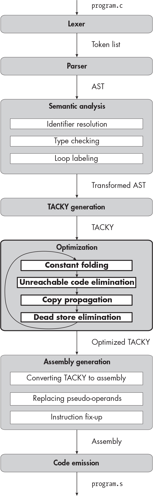

` ``Description`

## `19` `OPTIMIZING TACKY PROGRAMS`

In the first two parts of this book, you wrote a compiler that supported much of the C language. You made sure that the executable programs you produced were correct— in other words, that their behavior conformed to the C standard—but you didn’t worry about their performance. You didn’t try to make them run faster, take up less storage space, or consume less memory. In Part III, you’ll focus on *optimizing* these programs—that is, making them smaller and faster without changing their behavior.

Some compiler optimizations are *machine-independent*. This means they aren’t affected by the details of the target architecture, like the number of available registers or constraints on specific assembly instructions. A compiler typically performs these optimizations on an intermediate representation like TACKY before converting it to assembly. *Machine-dependent* optimizations, on the other hand, need to take the target architecture into account, so these are usually performed later, after the program has been converted to assembly. This chapter covers four widely used machine-independent optimizations: constant folding, unreachable code elimination, copy propagation, and dead store elimination. You’ll add a new optimization stage, bolded in the diagram at the start of the chapter, to apply these four optimizations to TACKY programs. The next chapter covers register allocation, a machine-dependent optimization.

You don’t need to complete Part II before you start on Part III. For each optimization, we’ll start with an implementation that doesn’t account for the language features from Part II. Then, if necessary, we’ll extend it to support those features; you’ll skip this step if you didn’t do Part II. We’ll need this extra step for every optimization except unreachable code elimination, which isn’t affected by the features from Part II.

These two chapters include just a few of the optimizations you’d find in a production compiler, but the basic concepts we’ll cover apply to lots of other optimizations too. Before we get started, let’s consider a question that’s fundamental to every compiler optimization: How do we know our optimized code is correct?

### `Safety and Observable Behavior`

First and foremost, compiler optimizations must be *safe*, meaning they cannot change the program’s semantics. (It doesn’t matter how speedy your program is if it doesn’t behave correctly!) In particular, an optimization must not change the program’s *observable behavior*, which is the behavior visible to its execution environment. Returning an exit status, printing a message to stdout, and writing to a file are all examples of observable behavior. Most of the actions that a program takes—like calculating values, updating local variables, and transferring control from one statement to another—are not visible to the execution environment, so they affect the program’s observable behavior only indirectly. This gives us lots of flexibility to transform the program. We can reorder, replace, and even delete code as long as the observable behavior doesn’t change.

Let’s look at how GCC optimizes a simple C program. Listing 19-1 initializes three variables with the values `1`, `2`, and `3`, then adds them up and returns the result.

    int main(void) {
        int x = 1;
        int y = 2;
        int z = 3;
        return x + y + z;
    }

`Listing 19-1: A C program that adds three variables`

This program will have the same observable behavior every time it runs: it will terminate with an exit status of `6`. You can run the following command to compile the program without optimizations:

    $ gcc -S -fno-asynchronous-unwind-tables -fcf-protection=none listing_19_1.c

This will produce the assembly in Listing 19-2, or something similar.

        .text
        .globl main
    main:
        pushq   %rbp
        movq    %rsp, %rbp
        movl    $1, -4(%rbp)
        movl    $2, -8(%rbp)
        movl    $3, -12(%rbp)
        movl    -4(%rbp), %edx
        movl    -8(%rbp), %eax
        addl    %eax, %edx
        movl    -12(%rbp), %eax
        addl    %edx, %eax
        popq    %rbp
        ret

`Listing 19-2: The unoptimized assembly for ``Listing 19-1`

This assembly program faithfully implements Listing 19-1’s source code: it initializes three locations on the stack with the values `1`, `2`, and `3`; adds them up; and then returns the result in EAX. Now let’s compile the same source code with the `-O` switch to enable optimizations:

    $ gcc -S -O -fno-asynchronous-unwind-tables -fcf-protection=none listing_19_1.c

This will generate the assembly in Listing 19-3.

        .text
        .globl main
    main:
        movl    $6, %eax
        ret

`Listing 19-3: The optimized assembly for ``Listing 19-1`

Instead of initializing three variables and then adding them up, this assembly program just returns the constant `6`. Listings 19-2 and 19-3 look quite different, but they both produce the right observable behavior.

`OBSERVABLE BEHAVIOR FOR PEDANTS`

`You can find a more formal definition of observable behavior in section 5.1.2.3, paragraph 6, of the C standard. This section lists three kinds of observable behaviors: operations on files, operations on interactive devices, and access to volatile objects. C programs can operate on files and interactive devices using the I/O functions in the standard library. An` `interactive device` `is typically a terminal or something similar, although the exact meaning is implementation-defined. The basic idea is that output to files can be buffered, but output to interactive devices needs to be delivered right away. The optimizations we implement in this chapter will preserve all function calls, including calls to standard library functions that operate on files and interactive devices.`

`A` `volatile object` `is an object that interacts with the execution environment in ways that the compiler can’t understand. For example, it might be read by a signal handler or used to communicate with a hardware device through memory-mapped I/O. You declare a volatile object with the` `volatile` `type qualifier. We didn’t implement this qualifier, so we don’t need to worry about volatile accesses.`

`The C standard’s definition of observable behavior isn’t meant to be exhaustive; individual implementations can, and generally do, provide stronger guarantees about program behavior. So it’s understandable that this definition leaves out a lot of behaviors that you might expect to be observable, like launching a new process and other non-I/O system calls. More surprisingly, it leaves out some behaviors that are implied to be observable by other parts of the standard itself. For example, a program’s exit status isn’t an observable behavior under this definition, but section 5.1.2.2.3 states that the exit status should be “returned to the host environment.” Maybe there’s a good reason for this omission, but it seems like a problem with the standard to me.`

`In practice, no C compiler performs optimizations that might change a program’s exit status. Our compiler is no exception; its optimizations will preserve the return value of every function call, including the exit status returned by` `main``.`

### `Four TACKY Optimizations`

This section introduces the optimizations we’ll implement in this chapter: constant folding, unreachable code elimination, copy propagation, and dead store elimination. These optimizations aim to speed up our code and reduce the amount of space it takes up. Individually, some of them further one or both of these goals, while others aren’t particularly helpful on their own. The real payoff comes from the way they work together, because running any one of them creates new opportunities to apply the other three. We’ll look at these four optimizations in turn, then discuss how each one makes the others more effective.

Before we jump in, be aware that I’ll use minimal notation in most of this chapter’s TACKY listings. I’ll write copies as `x = y` instead of `Copy(Var("x"), Var("y"))`, as I’ve occasionally done in earlier chapters, and I’ll take similar shortcuts with other instructions. For example, I’ll write binary operations as `x = a + b` instead of `Binary(Add, Var("a"), Var("b"), Var("x"))` and labels as `Target:` instead of `Label(Target)`. This notation lets us focus on the high-level logic of our TACKY programs, not the details of each TACKY instruction.

#### `Constant Folding`

The *constant folding* pass evaluates constant expressions at compile time. For example, constant folding will replace the `Binary` TACKY instruction

    a = 6 / 2

with a `Copy` instruction:

    a = 3

Constant folding can also turn conditional jumps into unconditional jumps or eliminate them entirely. It will transform

    JumpIfZero(0, Target)

into

    Jump(Target)

because the program will always make this jump. It will also delete the instruction

    JumpIfZero(1, Target)

because the program will never make this jump. (Deleting useless jumps is often considered a type of dead code elimination rather than constant folding, but we’re transforming conditional jumps in this pass anyway, so we might as well delete the useless ones too.)

Constant folding helps with both speed and code size. A single arithmetic operation or comparison might require several assembly instructions. Some of those instructions, like `idiv`, are quite slow. Constant folding ultimately replaces that assembly code with a single `mov` instruction.

#### `Unreachable Code Elimination`

*Unreachable code elimination* removes instructions that we know will never run. Consider the fragment of TACKY in Listing 19-4.

    x = 5
    Jump(Target)
    x = my_function()
    Target:
    Return(x)

`Listing 19-4: A fragment of TACKY with an unreachable instruction`

Since we’ll always jump over the call to `my_function`, we can get rid of it:

    x = 5
    Jump(Target)
    Target:
    Return(x)

Now the `Jump` instruction is useless, since it jumps to the instruction that we’d execute next anyway. We’ll remove this instruction too:

    x = 5
    Target:
    Return(x)

Finally, we can also eliminate the `Target` label, assuming no other instruction jumps to it:

    x = 5
    Return(x)

Strictly speaking, the `Jump` and `Label` instructions we just removed aren’t unreachable code; a running program will reach both of them, though they won’t have any effect. But removing unreachable code often makes jumps and labels useless, so this pass is a logical place to remove them.

Eliminating unreachable code clearly reduces code size. It’s also pretty clear that removing useless jumps saves time; even a useless instruction takes some amount of time to execute. It turns out that removing truly unreachable instructions, like the `FunCall` in Listing 19-4, can speed up the program too, by reducing memory pressure and freeing up space in the processor’s instruction cache.

Removing unused labels, on the other hand, won’t impact speed or code size, since labels don’t become machine instructions in the final executable. We’ll remove these labels anyway because it makes our TACKY programs a bit easier to read and debug and requires very little extra work.

This pass is especially handy for cleaning up the extra `Return` instruction we add to the end of every TACKY function. Recall that we add this instruction as a backstop in case the source code is missing a `return` statement. When we convert a program to TACKY, we can’t tell whether this extra `Return` is necessary, so we end up adding it to functions that don’t need it. The unreachable code elimination pass removes all the `Return` instructions that we added unnecessarily, while retaining any that we actually need. This is one example of a broader principle: generating inefficient code and optimizing it later is often easier than generating efficient code to begin with.

#### `Copy Propagation`

When a program includes the `Copy` instruction `dst = src`, the *copy propagation* pass tries to replace `dst` with `src` in later instructions. Take the following snippet of TACKY:

    x = 3
    Return(x)

We can replace `x` with its current value, `3`, in the `Return` instruction:

    x = 3
    Return(3)

Replacing a variable with a constant is a special case of copy propagation called *constant propagation*. In other cases, we’ll replace one variable with another. For instance, we can rewrite

    x = y
    Return(x)

as:

    x = y
    Return(y)

Sometimes, figuring out whether it’s safe to perform copy propagation can be tricky. Take the following example:

    x = 4
    JumpIfZero(flag, Target)
    x = 3
    Target:
    Return(x)

Depending on which path we take, `x`’s value will be either `3` or `4` when we reach the `Return` instruction. Since we don’t know which path we’ll take to that instruction, we can’t safely replace `x` with either value. To handle cases like this one, we’ll need to analyze every possible path to the instruction we’d like to rewrite. We’ll use a technique called *data-flow analysis* to look at all the paths through a function and find the places where we can perform copy propagation safely. Data-flow analysis isn’t just useful for copy propagation; it’s used in lots of different compiler optimizations, including dead store elimination, which we’ll discuss next.

Some of the copies we analyze will involve variables with static storage duration, which can be accessed by multiple functions (or just multiple invocations of the same function, in the case of local static variables). We won’t always be able to tell exactly when these variables are updated, so our data-flow analysis will need to treat them a bit differently than variables with automatic storage duration. If you completed Part II, you’ll need to account for similar uncertainty around variables whose address is taken with the `&` operator, since they can be updated through pointers.

Copy propagation isn’t useful by itself, but it makes our other optimizations more effective. When we propagate constants, we create new opportunities for constant folding. And we’ll sometimes replace every use of a `Copy` instruction’s destination with its source, which makes the `Copy` itself useless. We’ll remove these useless instructions in our last optimization pass: dead store elimination.

#### `Dead Store Elimination`

When an instruction updates a variable’s value but we never use that new value, the instruction is called a *dead store*. (The term *store* here refers to any instruction that stores a value in a variable, not the TACKY `Store` instruction we introduced in Part II.) Because dead stores don’t impact a program’s observable behavior, it’s safe to remove them. Let’s look at a simple example:

    x = 10
    Return(y)

Assuming `x` has automatic storage duration, the instruction `x = 10` is a dead store. We don’t use `x` between this instruction and the end of the function, which is also the end of `x`’s lifetime.

Here’s another kind of dead store:

    x = a + b
    x = 2
    Return(x)

In this example, we’ll never use the result of `a + b`, because we’ll overwrite it first; this means `x = a + b` is a dead store. The dead store elimination pass will identify such useless instructions and remove them. The challenge is proving that an instruction really is a dead store; to do this, we’ll need to analyze every path through the function and make sure that the value it assigns to its destination is never used. Once again, we’ll use data-flow analysis to figure out when we can apply this optimization safely.

Like copy propagation, dead store elimination gets more complicated when you factor in objects that can be accessed by multiple functions or through pointers. For instance, if `x` is a global variable, the instruction `x = 10` in our first example is *not* a dead store; `x` might be used after the function returns. Our data-flow analysis will have to take this possibility into account.

`WHEN OPTIMIZATIONS ATTACK!`

`Dead store elimination is safe in the sense that it won’t change a program’s observable behavior. But in another, more intuitive sense, it’s unsafe: it can` `make a program less secure. A conscientious, security-minded programmer will overwrite sensitive data as soon as they’re done processing it. The longer a secret lives in memory, the greater the risk that an attacker will be able to read it, perhaps by exploiting another vulnerability in the program or even dumping the entire system’s memory. Unfortunately, operations that clear sensitive data are often dead stores. Dead store elimination tends to, well, eliminate them. Consider this code fragment that tries to zero out an encryption key:`

    char *encryption_key = malloc(encryption_key_size);
    // initialize encryption_key and use it to encrypt some things
    --snip--
    memset(encryption_key, 0, encryption_key_size);
    free(encryption_key);
    return 0;

`Normally, calling` `memset` `would zero out the buffer that` `encryption_key` `points to, preventing the data in that buffer from being leaked later on. But the compiler might optimize away the call to` `memset` `because it’s technically a dead store; it just updates a buffer that we’ll never use again. Our implementation of dead store elimination wouldn’t remove` `memset` `from this example, because it never optimizes away function calls, but GCC and Clang actually do eliminate` `memset` `in code like this. You can compile a toy example to see for yourself.`

`C programs can avoid this problem by clearing memory with a dedicated library function that the compiler knows not to optimize away. There are several platform-specific functions that serve this purpose, like` `SecureZeroMemory` `on Windows and` `explicit_bzero` `on many Linux distributions. The` `memset_s` `function to write to memory securely was added to the C standard library back in the C11 revision of the standard, but it’s part of an optional annex that was never widely implemented. C23 introduces a similar function that isn’t optional,` `memset_explicit``, so C programmers` `finally` `have a standard, portable way to clear sensitive data from memory.`

`Functions like` `memset_explicit` `solve the immediate problem with dead stores. But they don’t address the more fundamental issue: the concept of observable behavior doesn’t cover every kind of behavior that programmers care about. The C standard guarantees that your code will behave the way you intended it to when everything goes right—when your code has no undefined behavior, the libraries it relies on have no undefined behavior, and nobody tampers with the underlying system—but it provides no guarantees about what happens when things go wrong. Without those guarantees, it’s difficult, and sometimes impossible, to write secure code. (If you’d like to learn more about the security impact of compiler optimizations, see “Additional Resources” on ``page 610`` for links to a couple of relevant papers.)`

`We won’t worry about the security impact of the optimizations we implement here. If you’re using the compiler you wrote for this book to compile security-critical software, dead store elimination is the least of your problems.`

#### `With Our Powers Combined …`

Now let’s look at how the four optimizations we’ll implement in this chapter work together. We’ll use the TACKY program in Listing 19-5 as a running example.

    my_function(flag):
        x = 4
        y = 4 - x
        JumpIfZero(y, Target)
        x = 3
        Target:
        JumpIfNotZero(flag, End)
        z = 10
        End:
        z = x + 5
        Return(z)

`Listing 19-5: An unoptimized TACKY program`

Using all four optimizations, we can reduce this function to a single `Return` instruction. I’ll display the results of each round of optimization, highlighting any changed instructions. Because each optimization can create more opportunities to apply the other three, we’ll need to run most of them several times to fully optimize this function. For now, we’ll decide which optimization to run at each step in an ad hoc way, by looking at the code and seeing which one will be most useful. We’ll use a more systematic approach when we actually implement our optimization pipeline.

Let’s start with a copy propagation pass, substituting `4` for `x` in `y = 4 - x`:

    my_function(flag):
        x = 4
        y = 4 - 4
        JumpIfZero(y, Target)
        x = 3
        Target:
        JumpIfNotZero(flag, End)
        z = 10
        End:
        z = x + 5
        Return(z)

We can’t replace the second use of `x`, in `z = x + 5`, because `x` has more than one possible value at that point: it might be `3` or `4`, depending on whether we take the conditional jump. Next, we’ll apply constant folding to evaluate `y = 4 - 4`:

    my_function(flag):
        x = 4
        y = 0
        JumpIfZero(y, Target)
        x = 3
        Target:
        JumpIfNotZero(flag, End)
        z = 10
        End:
        z = x + 5
        Return(z)

By replacing a binary operation with a `Copy` instruction, we’ve created another opportunity for copy propagation. We can replace `y` with its value, `0`, in the `JumpIfZero` instruction:

    my_function(flag):
        x = 4
        y = 0
        JumpIfZero(0, Target)
        x = 3
        Target:
        JumpIfNotZero(flag, End)
        z = 10
        End:
        z = x + 5
        Return(z)

Now that `JumpIfZero` depends on a constant condition, we can run constant folding again to turn it into an unconditional `Jump`:

    my_function(flag):
        x = 4
        y = 0
        Jump(Target)
        x = 3
        Target:
        JumpIfNotZero(flag, End)
        z = 10
        End:
        z = x + 5
        Return(z)

This change makes `x = 3` unreachable, so we’ll run unreachable code elimination to delete it. This pass will also remove the `Jump` instruction and `Target` label, which have no effect once we’ve removed `x = 3`:

    my_function(flag):
        x = 4
        y = 0
        JumpIfNotZero(flag, End)
        z = 10
        End:
        z = x + 5
        Return(z)

We couldn’t rewrite `z = x + 5` earlier, because `x` had two different values on the different paths to that instruction. We just solved that problem by eliminating the path through `x = 3`. Now we can run copy propagation again:

    my_function(flag):
        x = 4
        y = 0
        JumpIfNotZero(flag, End)
        z = 10
        End:
        z = 4 + 5
        Return(z)

Then we’ll run another round of constant folding:

    my_function(flag):
        x = 4
        y = 0
        JumpIfNotZero(flag, End)
        z = 10
        End:
        z = 9
        Return(z)

And we’ll run copy propagation one last time:

    my_function(flag):
        x = 4
        y = 0
        JumpIfNotZero(flag, End)
        z = 10
        End:
        z = 9
        Return(9)

We’ve managed to calculate this function’s return value at compile time, eliminating every use of `x`, `y`, and `z` in the process. Now we’ll run dead store elimination to clean up the instructions that assign to these three variables:

    my_function(flag):
        JumpIfNotZero(flag, End)
        End:
        Return(9)

Finally, we’ll run unreachable code elimination to remove the `JumpIfNot Zero` instruction and the `End` label. These are both redundant, since we just eliminated the one instruction that `JumpIfNotZero` jumps over. This last round of optimization will reduce our function to a single instruction:

    my_function(flag):
        Return(9)

This example highlighted some of the ways our optimizations work together. Copy propagation may replace variables with constants, creating new opportunities for constant folding; constant folding rewrites arithmetic operations as `Copy` instructions, creating new opportunities for copy propagation. Constant folding can replace conditional jumps with unconditional ones, making some instructions unreachable; eliminating unreachable code simplifies the program’s control flow, which promotes copy propagation. Copy propagation may make `Copy` instructions redundant, which lets us remove them during dead store elimination. And dead store elimination can potentially remove every instruction between a jump and the label it jumps to, which makes the jump, and possibly the label, candidates for unreachable code elimination.

Now we know what each optimization does and how they all work together. Next, we’ll add a few new command line options that will allow us to test them out.

### `Testing the Optimization Passes`

This chapter’s tests work differently than the tests in earlier chapters. We need to verify that our optimizations don’t change the program’s observable behavior but do simplify constant expressions and remove useless code. Our current strategy—compiling C programs, running them, and making sure they behave correctly—satisfies the first requirement but not the second. Just running a program can’t tell you whether the optimization phase *did* anything. To address the second point, the test script will inspect your compiler’s assembly output for each test program. To address the first point, it will also run each test program and verify its behavior, like in earlier chapters.

To support this chapter’s tests, you’ll need to add a few command line options to your compiler:

`-S` Directs your compiler to emit an assembly file, but not assemble or link it. Running `./``YOUR_COMPILER` `-S /path/to/program.c` should write an assembly file to */path/to/program.s*. (I suggested adding this option to help with debugging back in Chapter 1; you’ll need to add it now if you haven’t already.)

`--fold-constants` Enables constant folding.

`--propagate-copies` Enables copy propagation.

`--eliminate-unreachable-code` Enables unreachable code elimination.

`--eliminate-dead-stores` Enables dead store elimination.

`--optimize` Enables all four optimizations.

The options to enable optimizations should be passed to the optimization stage, which we’ll implement next. It should be possible to enable more than one individual optimization; for example, `./``YOUR_COMPILER` `--fold-constants --propagate-copies` should enable both constant folding and copy propagation, but not the other two optimizations.

If your compiler doesn’t generate assembly exactly the way I’ve laid out in this book, the test script should still be able to validate your assembly output for this chapter’s tests, but there are a couple of caveats to keep in mind. First, the test script understands only AT&T assembly syntax, which is the syntax we’ve been using throughout the book. Second, the script doesn’t recognize every single assembly instruction; it only knows about the instructions we’ve used in this book and a handful of others that are particularly common in real-world assembly code. If you emit instructions that the test script doesn’t understand, some tests may fail.

Next, we’ll wire up the new optimization stage, which will control when we call each individual optimization.

### `Wiring Up the Optimization Stage`

The optimization stage will run right after we convert the program to TACKY. This stage will optimize each TACKY function independently, without any knowledge of the other functions defined in the program. For example, it won’t try to evaluate function calls during the constant folding pass or remove them during dead store elimination. (We can’t remove function calls during dead store elimination because we don’t know whether they have side effects. We *can* remove them during unreachable code elimination, though—if a function call will never execute, it doesn’t matter what side effects the function has.) Optimizations like these, which transform one function at a time, are called *intraprocedural optimizations*. Most production compilers also perform *interprocedural optimizations*, which transform whole translation units instead of individual functions.

Each individual optimization will take the body of a TACKY function as input and return a semantically equivalent function body as output. In the constant folding pass, we’ll represent the function body as a list of TACKY instructions, like we normally do. But in the other three optimization passes, we’ll represent each function as a *control-flow graph*. This is an intermediate representation that explicitly models the different execution paths through a piece of code. We’ll talk more about how to construct control-flow graphs and why they’re useful later in the chapter.

The optimization stage will process each function by running through all of the enabled optimizations over and over. It will stop once it reaches a *fixed point*, where running them again doesn’t change the function further. Listing 19-6 illustrates this optimization pipeline.

    optimize(function_body, enabled_optimizations):
        if function_body is empty:
            return function_body

        while True:
            if enabled_optimizations contains "CONSTANT_FOLDING":
              ❶ post_constant_folding = constant_folding(function_body)
            else:
                post_constant_folding = function_body

          ❷ cfg = make_control_flow_graph(post_constant_folding)

            if enabled_optimizations contains "UNREACHABLE_CODE_ELIM":
                cfg = unreachable_code_elimination(cfg)

            if enabled_optimizations contains "COPY_PROP":
                cfg = copy_propagation(cfg)

            if enabled_optimizations contains "DEAD_STORE_ELIM":
                cfg = dead_store_elimination(cfg)

          ❸ optimized_function_body = cfg_to_instructions(cfg)

          ❹ if (optimized_function_body == function_body
                or optimized_function_body is empty):
                return optimized_function_body

            function_body = optimized_function_body

`Listing 19-6: The TACKY optimization pipeline`

In this listing, `function_body` is the list of instructions in the body of a TACKY function and `enabled_optimizations` is a list of strings representing the optimizations that we enabled on the command line. (This would be a pretty kludgy way to store command line options in a real program; feel free to represent these options differently in your own code.) If `function_body` is empty, we’ll just return it, since there’s nothing to optimize. Otherwise, we’ll perform constant folding if it’s enabled ❶.

Next, we’ll convert the function body from a list of instructions into a control-flow graph ❷. We’ll apply all the other enabled optimizations to this representation. Then, we’ll convert the optimized control-flow graph back to a list of instructions ❸, which we’ll compare to the original list ❹. If it’s different, and if we haven’t optimized away the entire function, we’ll go through the loop again to take advantage of any new optimization opportunities. If it’s the same, we can’t optimize it any further, so we’re done.

`HOW DO WE KNOW LISTING 19-6 WILL TERMINATE?`

`At first glance, it looks like the` `optimize` `function in ``Listing 19-6`` might get caught in an infinite loop. The TACKY function we’re optimizing could keep changing on every iteration, without ever converging on a final result. But if we think about these optimizations more carefully, we can convince ourselves that the optimization pipeline must terminate.`

`First, both dead store elimination and unreachable code elimination remove instructions, and none of our optimizations ever add new instructions. These two optimizations can’t keep changing a function forever, because we’ll eventually run out of instructions. To be more precise, if our TACKY function initially has` `n` `instructions, we’ll see at most` `n` `loop iterations where either of these optimizations changes anything.`

`Similarly, constant folding replaces several kinds of TACKY instructions (including` `Unary``,` `Binary``, type conversions, and conditional jumps) with other kinds of TACKY instructions (specifically` `Copy` `and the unconditional` `Jump` `instruction). None of our other optimizations will introduce the kinds of instructions that constant folding replaces. The constant folding pass can change a function only so many times before we’ve eliminated every instruction it could potentially rewrite.`

`That leaves copy propagation. We’ve already put an upper bound on how many times each of the other optimizations can change a function, so` `optimize` `will terminate unless copy propagation by itself can get stuck in an infinite loop, changing the function every time we apply it. To see why this is impossible, let’s think about how many times copy propagation could rewrite a single instruction,` `i``. We’ll assume this instruction has one operand, but it’s easy to extend this logic to instructions with multiple operands. If there are no` `Copy` `instructions on the shortest path to` `i``, we know that` `i` `will never be rewritten. (Keep in mind that we can propagate a` `Copy` `instruction only if it appears on` `every` `path to` `i``.) Now imagine there’s exactly one` `Copy` `on the path to` `i``. In that case, we’ll be able to rewrite` `i` `at most once. We might propagate the value from that` `Copy` `instruction to` `i``, but we won’t be able to rewrite it again after that. Now let’s generalize this: if there are` `n` `Copy` `instructions on the shortest path to` `i``, we’ll rewrite` `i` `at most` `n` `times. Whenever we rewrite` `i``, we replace its operand with another operand that was defined earlier on the shortest path to` `i` `(or with a constant). If we rewrite` `i` `multiple times, each rewrite must propagate a` `Copy` `instruction from earlier in the program than the one before, until there are no copies left to propagate.`

`It’s helpful to look at an example:`

    w = foo()
    x = w
    y = x
    Return(y)

`Initially, this code snippet returns` `y``, which is defined by` `y = x``. After one round of copy propagation, we’ll rewrite the final instruction as` `Return(x)``. Of course,` `x` `is defined before` `y``, in the instruction` `x = w``. The next round of copy propagation will replace` `x` `with` `w``, which is defined even earlier, in the instruction` `w = foo()``. The key point here is that we’ll never replace one operand with another that’s defined later on the path to the instruction that we’re rewriting, so we can replace each operand only a finite number of times. Therefore, the` `optimize` `function has to terminate.`

Using the optimization pipeline in Listing 19-6, we’ll never miss an optimization opportunity. Whenever one optimization changes the program, we’ll rerun the other three to take advantage of those changes. This is feasible because we’re implementing only four optimizations, and all of our test programs are small enough to optimize pretty quickly. Production compilers, which implement dozens of optimizations and compile much larger programs, don’t take this approach; if they did, compilation would take way too long. Instead, they apply a fixed sequence of optimizations just once, running each individual optimization in the place where it’s likely to have the biggest impact. As a result, they can end up missing optimization opportunities. (Finding the best order to run optimizations for any given program is an open research question called the *phase ordering problem*.)

Go ahead and add the optimization pipeline to your compiler. For now, define each individual optimization as a stub that takes a list of instructions and returns them unchanged. You can stub out the conversions to and from control-flow graphs the same way. Write this plumbing code now so that you can test the individual optimization passes as you implement them.

Once everything is wired up, you can start on your first optimization: constant folding!

### `Constant Folding`

Constant folding is the simplest optimization in this chapter. This pass iterates through all the instructions in a TACKY function and evaluates any instructions with constant source operands. First, we’ll talk briefly about how to add constant folding to the version of the compiler you implemented in Part I. Then, we’ll discuss how to handle the types and TACKY instructions you added in Part II. If you haven’t worked through Part II yet, feel free to skip the latter discussion.

#### `Constant Folding for Part I TACKY Programs`

The constant folding pass should evaluate four of the TACKY instructions from Part I: `Unary`, `Binary`, `JumpIfZero`, and `JumpIfNotZero`. When you find a `Unary` instruction with a constant source operand, or a `Binary` instruction with two constant source operands, replace it with a `Copy`. For example, you should replace

    Binary(binary_operator=Add, src1=Constant(1), src2=Constant(2), dst=Var("b"))

with:

    Copy(src=Constant(3), dst=Var("b"))

Your constant folding pass could run into two kinds of invalid expressions: division by zero and operations that result in integer overflow. These are both undefined behaviors, so it doesn’t matter how you evaluate them. However, your compiler can’t just fail if it encounters one of these invalid expressions, because the program’s behavior is undefined only if it actually reaches the invalid expression at runtime. For example, if a program includes division by zero in a branch that’s never taken, you should still be able to compile it.

You should also evaluate `JumpIfZero` and `JumpIfNotZero` instructions with constant conditions. If the condition is met, replace the instruction with an unconditional `Jump`. If the condition isn’t met, remove the instruction from the program. That’s all there is to it! If you completed only Part I, you can skip to the test suite once you’ve implemented constant folding for these four instructions. If you completed Part II, there are a few more instructions you’ll need to handle.

#### `Supporting Part II TACKY Programs`

When we added the new arithmetic types in Part II, we also added type conversion instructions: `Truncate`, `SignExtend`, `ZeroExtend`, `DoubleToInt`, `DoubleToUInt`, `IntToDouble`, and `UIntToDouble`. The constant folding pass should evaluate all of these instructions when their source operands are constants.

The `Copy` instruction can perform type conversions too; we use it to convert between signed and unsigned integers of the same size. When a `Copy` instruction copies an unsigned constant to a signed variable, or vice versa, this pass should convert the constant to the correct type. For example, if `a` is a `signed char`, you should replace

    Copy(src=Constant(ConstUChar(255)), dst=Var("a"))

with:

    Copy(src=Constant(ConstChar(-1)), dst=Var("a"))

Be careful to perform every type conversion with exactly the same semantics that the program would use at runtime. For example, when you convert a `double` to an integer type, truncate its value toward zero; when you convert an integer to a `double`, round to the nearest representable value. The good news is that you already know how to perform all of these type conversions at compile time, since you had to convert static initializers to the correct type throughout Part II. Ideally, you’ll be able to reuse the code you’ve already written to perform these type conversions.

You’ll also need to adhere to C semantics when you evaluate unsigned arithmetic operations. In particular, you should ensure that unsigned arithmetic wraps around, like it would at runtime. How you accomplish this will depend entirely on what language you’re writing your compiler in. Some languages support wraparound unsigned arithmetic as part of their standard library. In Rust, for example, methods like `wrapping_add` and `wrapping_sub` provide the same semantics as unsigned arithmetic in C. In other languages, you might use a third-party library for unsigned arithmetic. For example, Python doesn’t provide unsigned integer types, but the NumPy library does. If you don’t want to use an external library, or you can’t find a suitable one, it isn’t terribly difficult to implement wraparound unsigned arithmetic yourself.

Finally, when you evaluate floating-point operations, you’ll need to use round-to-nearest, ties-to-even rounding and handle negative zero and infinity correctly. If you added support for NaN for extra credit in Chapter 13, you’ll need to evaluate operations on NaN correctly too. This shouldn’t require any special effort on your part—the vast majority of programming languages use IEEE 754 semantics—but there’s a small chance that your implementation language handles negative zero, NaN, or infinity differently than C. Start with a simple implementation of constant folding that doesn’t try to address these edge cases; you can rely on the test suite to catch any problems. If you run into any cases that your implementation language doesn’t evaluate correctly, you have two options: either find a third-party library to handle them for you or evaluate them yourself as a special case.

`TEST THE CONSTANT FOLDING PASS`

`If you completed Part I but not` `Part II, use the following command to test your constant folding implementation:`

    $ ./test_compiler /path/to/your_compiler --chapter 19 --fold-constants
    --int-only

`This will run the tests in` `tests/chapter_19/constant_folding/int_only``, which use only language features from Part I. It will also compile all the test programs from Part I with constant folding enabled. It won’t inspect the assembly output for these earlier test programs, but it will run them to confirm that they still behave correctly.`

`If you completed Parts I and II, run the same command without the` `--int-only` `option:`

    $ ./test_compiler /path/to/your_compiler --chapter 19 --fold-constants

`This command runs both the Part I–specific tests in` `tests/chapter_19/constant_folding/int_only` `and the tests in` `tests/chapter_19/constant_folding/all_types``, which cover constant folding with types besides` `int``. It will also run all the tests from Parts I and II with constant folding enabled. As usual, you can include the appropriate flags to verify that your constant folding pass correctly handles extra credit features like NaN and bitwise operations.`

`Until you implement copy propagation, your compiler won’t be able to fully evaluate nested source-level expressions that involve more than one operation, like` `-1 * 2``, because it can’t propagate the result from one operation to the next. This means the test suite can’t exercise certain cases yet, including constant folding with negative numbers or constants of character type. The tests for the whole pipeline, which you’ll run at the end of the chapter, will cover these cases. In the meantime, you might want to write your own unit tests to fill in those gaps.`

### `Control-Flow Graphs`

For the rest of the chapter, we’ll represent TACKY functions as control-flow graphs. A graph representation is a good fit for our remaining optimizations, which have to account for the different paths we might take through a function. The nodes in the control-flow graph represent sequences of straight-line code called *basic blocks*, except for two special nodes that represent the function’s entry and exit points. Each node has outgoing edges to the nodes that could execute immediately after it.

As an example, let’s look at the control-flow graph for Listing 19-7.

    processing_loop():
        LoopStart:
        input = get_input()
        JumpIfNotZero(input, ProcessIt)
        Return(-1)
        ProcessIt:
        done = process_input(input)
        JumpIfNotZero(done, LoopStart)
        Return(0)

`Listing 19-7: A TACKY function with multiple execution paths`

This function executes a loop that repeatedly retrieves a value by calling `get_input`, then processes that value by calling `process_input`. If `get_input` ever returns `0`, this function immediately returns `-1`. If `process_input` ever returns `0`, the function immediately returns `0`. Figure 19-1 shows the corresponding control-flow graph.

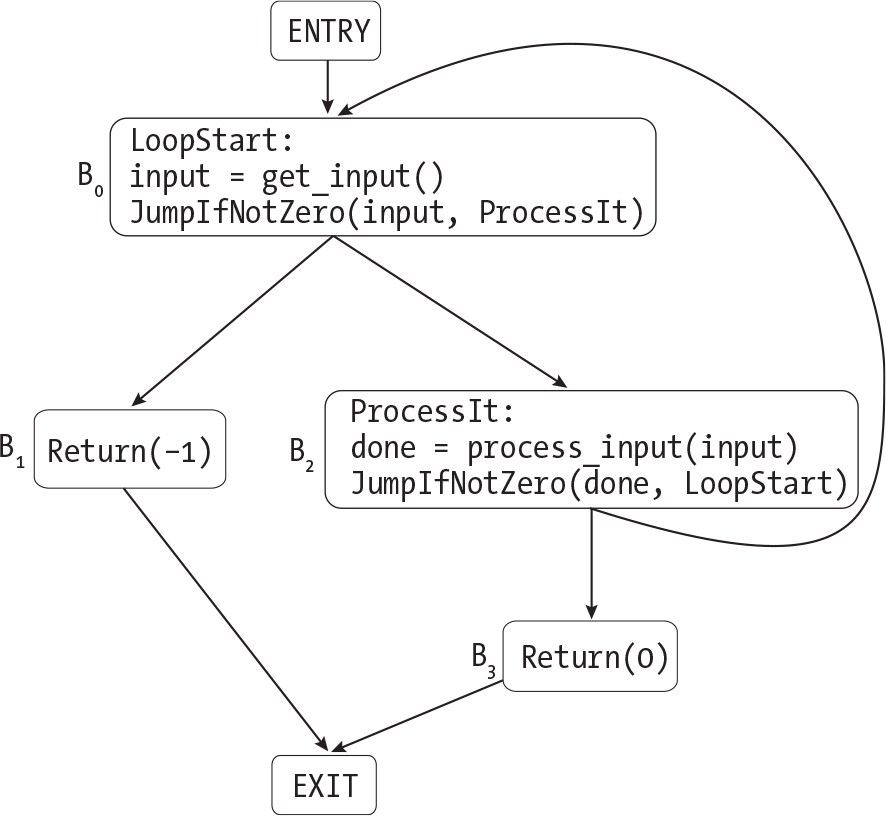

`Figure 19-1: The control-flow graph for ``Listing 19-7`` ``Description`

There’s a single outgoing edge from the special `ENTRY` node to block `B``0`, since we’ll always execute `B``0` at the start of the function. (`ENTRY` will have exactly one outgoing edge in every control-flow graph, since C functions have only one entry point.) After we execute `B``0`, there are two possibilities: we can execute the next block in the program, `B``1`, or we can jump to block `B``2`. Therefore, `B``0` has outgoing edges to both of those blocks. By the same logic, `B``2` has outgoing edges to both `B``0` and `B``3`. A `Return` instruction exits the function, so `B``1` and `B``3` each have a single outgoing edge to `EXIT`.

#### `Defining the Control-Flow Graph`

Now that you know what a control-flow graph looks like, let’s look at how to construct one. First, we’ll define the graph data structure. Listing 19-8 sketches out one possible representation.

    node_id = ENTRY | EXIT | BlockId(int num)
    node = BasicBlock(node_id id, instruction* instructions,
                      node_id* predecessors, node_id* successors)
         | EntryNode(node_id* successors)
         | ExitNode(node_id* predecessors)
    graph = Graph(node* nodes)

`Listing 19-8: One way to represent the control-flow graph`

Every node in the graph has a unique `node_id`, which identifies it as `ENTRY`, `EXIT`, or a numbered basic block. We’ll assign numeric IDs to basic blocks according to their order in the original TACKY function. Each basic block holds a list of TACKY instructions, a list of *successors* (the blocks that could execute right after it), and another list of *predecessors* (the blocks that could execute right before it). The entry and exit nodes don’t hold any instructions. `ENTRY`, as the very first point in the function, has successors but no predecessors. `EXIT`, on the other hand, has predecessors but no successors.

You’ll need a way to associate both basic blocks and individual instructions with extra information so that you can track the results of data-flow analysis in the copy propagation and dead store elimination passes. The definition in Listing 19-8 doesn’t include a way to track this information. You could either attach it directly to the graph or store it in a separate data structure. The pseudocode throughout this chapter will use `annotate _instruction` and `get_instruction_annotation` to save and look up information about individual instructions. It will use `annotate_block` and `get_block _annotation` to save and look up information about basic blocks by block ID.

> `NOTE`

*Your graph data structure might look quite different from Listing 19-8. For instance, you might want to represent the graph as a map from node_id to node, instead of a list of nodes, or track the entry and exit nodes separately from the nodes that represent basic blocks. You can define your control-flow graph in whatever way makes sense to you and suits your implementation language, as long as it includes all the information you’ll need.*

#### `Creating Basic Blocks`

Next, let’s see how to partition the body of a TACKY function into basic blocks. You can’t have any jumps into or out of the middle of a basic block. The only way to execute a basic block is to start at its first instruction and continue all the way to the end. This implies that `Label` can appear only as the first instruction in a block, and a `Return` or jump instruction can appear only as the last instruction. Listing 19-9 demonstrates how to split a list of instructions into basic blocks along these boundaries.

    partition_into_basic_blocks(instructions):
        finished_blocks = []
        current_block = []
        for instruction in instructions:
          ❶ if instruction is Label:
                if current_block is not empty:
                    finished_blocks.append(current_block)
                current_block = [instruction]

          ❷ else if instruction is Jump, JumpIfZero, JumpIfNotZero, or Return:
                current_block.append(instruction)
                finished_blocks.append(current_block)
                current_block = []

            else:
              ❸ current_block.append(instruction)

        if current_block is not empty:
            finished_blocks.append(current_block)

        return finished_blocks

`Listing 19-9: Partitioning a list of instructions into basic blocks`

When we encounter a `Label` instruction, we start a new basic block beginning with that `Label` ❶. When we encounter a `Return` instruction or a conditional or unconditional jump, we add it to the current block, then start a new empty block ❷. When we encounter any other instruction, we add it to the current block without starting a new block ❸.

Listing 19-9 just partitions a function body into a list of lists of instructions. The next step (which I won’t provide pseudocode for) is to convert these lists of instructions into `BasicBlock` nodes with increasing block IDs. We’ll then add these nodes to the graph, along with the entry and exit nodes.

#### `Adding Edges to the Control-Flow Graph`

After adding every node to the graph, we’ll add edges from each node to its successors, as Listing 19-10 demonstrates.

    add_all_edges( ❶ graph):

      ❷ add_edge(ENTRY, BlockId(0))

        for node in graph.nodes:
            if node is EntryNode or ExitNode:
                continue

            if node.id == max_block_id(graph.nodes):
                next_id = EXIT
            else:
              ❸ next_id = BlockId(node.id.num + 1)

            instr = get_last(node.instructions)
            match instr with
            | Return(maybe_val) -> add_edge(node.id, EXIT)
            | Jump(target) ->
                target_id = get_block_by_label(target)
                add_edge(node.id, target_id)
            | JumpIfZero(condition, target) ->
                target_id = get_block_by_label(target)
              ❹ add_edge(node.id, target_id)
              ❺ add_edge(node.id, next_id)
            | JumpIfNotZero(condition, target) ->
                // same as JumpIfZero
                --snip--
            | _ -> add_edge(node.id, next_id)

`Listing 19-10: Adding edges to the control-flow graph`

The `graph` argument to `add_all_edges` ❶ is our unfinished control-flow graph, which has nodes but no edges. We’ll begin by adding an edge from `ENTRY` to the first basic block ❷. (We can assume that the function contains at least one basic block, since we don’t optimize empty functions.) Throughout this listing, we’ll use the `add_edge` function, which takes two node IDs, to add edges to the graph. Keep in mind that whenever we add an edge from `node1` to `node2`, we must update both the successors of `node1` and the predecessors of `node2`. I’ve omitted the pseudocode for `add_edge`, since it will depend on how you’ve defined your control-flow graph.

Next, we’ll add outgoing edges from the nodes that correspond to basic blocks. To process one of these nodes, we’ll first determine which other node will follow it by default if we don’t jump or return at the end of the block. If we’re processing the very last block, the next node will be `EXIT`. Otherwise, it will just be whatever basic block comes next in the original TACKY function ❸.

We’ll figure out what edges to add by inspecting the last instruction in the current basic block. If it’s a `Return` instruction, we’ll add one outgoing edge to `EXIT`. If it’s an unconditional `Jump`, we’ll add an edge to the block that begins with the corresponding `Label`. We use the `get_block_by_label` helper function, which I won’t show the pseudocode for, to look up which block begins with a particular label. I recommend building a map from labels to block IDs ahead of time so that this function can just perform a map lookup.

If a block ends with a conditional jump, we’ll add two outgoing edges. The first edge, which represents taking the jump, will go to the block that starts with the corresponding `Label` ❹. The other edge, which represents not taking the jump ❺, will go to the default next node, identified by `next_id`. If a block ends with any other instruction, we’ll add a single outgoing edge to the default next node.

#### `Converting a Control-Flow Graph to a List of Instructions`

At this point, you should have working code to convert a TACKY function into a control-flow graph. You’ll also need code to go in the other direction and convert a control-flow graph back to a list of instructions. This operation is much simpler: just sort all the basic blocks by ID, then concatenate all their instructions.

#### `Making Your Control-Flow Graph Code Reusable`

In the next chapter, we’ll build control-flow graphs of assembly programs. We’ll use the same algorithm to construct these graphs, but we’ll look for different individual control-flow instructions. For instance, `jmp`, `ret`, and conditional jump instructions like `jne` and `je` all signal the end of a basic block in assembly.

Once you have working code to construct control-flow graphs, you might want to refactor it so you can use it for assembly programs too. This is completely optional, but it will save you some effort in the next chapter.

First, you’ll need to generalize the `graph` data type so that a block can contain either TACKY or assembly instructions. Next, you’ll need to generalize the logic to analyze specific instructions in Listings 19-9 and 19-10. For instance, you could define a one-off data type to represent both assembly and TACKY instructions, which captures just the information you need to build the control-flow graph:

    generic_instruction = Return
                        | Jump
                        | ConditionalJump(identifier label)
                        | Label(identifier)
                        | Other

Instead of inspecting individual TACKY instructions to determine where a basic block ends or what its successors are, you can convert each instruction to a `generic_instruction` and inspect that. Then, when you need to build control-flow graphs for assembly programs, you’ll use a different helper function to convert an assembly instruction to a `generic_instruction` but leave everything else the same.

That wraps up our discussion of control-flow graphs. We’re now ready to move on to our second optimization pass: unreachable code elimination.

### `Unreachable Code Elimination`

We’ll split up this pass into three steps, first removing basic blocks that will never execute, then useless jumps, and finally useless labels. The last two steps might leave us with empty blocks that don’t contain any instructions. Optionally, we can clean up after this optimization by removing these empty blocks from the control-flow graph.

#### `Eliminating Unreachable Blocks`

To find every block that might possibly execute, we’ll traverse the control-flow graph starting at `ENTRY`. We’ll visit `ENTRY`’s successor, then all of that node’s successors, and so on, until we run out of nodes to explore. If this traversal never reaches a particular basic block, we’ll know that block is safe to remove. Let’s try out this approach on the example from Listing 19-4, which we looked at when we first introduced unreachable code elimination:

    x = 5
    Jump(Target)
    x = my_function()
    Target:
    Return(x)

We determined earlier that `x = my_function()` is unreachable. Assuming this listing is the entire body of a TACKY function, it will have the control-flow graph shown in Figure 19-2.

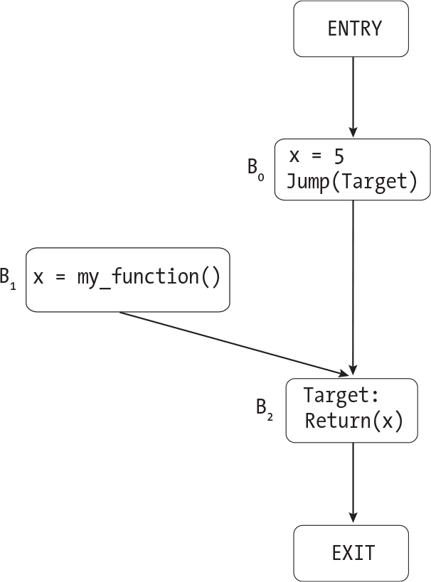

`Figure 19-2: The control-flow graph for ``Listing 19-4`` ``Description`

Note that there’s no path from `ENTRY` to `B``1`. If we traverse this graph starting at `ENTRY`, we’ll visit `B``0`, `B``2`, and `EXIT`. Along the way, we’ll keep track of which nodes we’ve visited so far. Once we’re done, we’ll see that we never visited `B``1`, so we’ll remove it. I won’t provide the pseudocode for exploring the graph, since it’s just an ordinary breadth- or depth-first graph traversal.

When you remove a node from the graph, remember to remove its outgoing edges too. For example, when we remove `B``1` from the graph in Figure 19-2, we should also remove it from `B``2`’s list of predecessors.

#### `Removing Useless Jumps`

Next, we’ll remove any useless jump instructions. Remember that by default, if a block doesn’t end with a jump or `Return` instruction, control falls through to the next block from the original program order. We can delete a jump instruction if it targets this default next block.

We’ll look at each basic block that ends with a conditional or unconditional jump and figure out which block would follow it by default if the jump weren’t taken. If this default next block is its only successor, the jump instruction is redundant. Listing 19-11 demonstrates this approach.

    remove_redundant_jumps(graph):
      ❶ sorted_blocks = sort_basic_blocks(graph)
        i = 0
      ❷ while i < length(sorted_blocks) - 1:
            block = sorted_blocks[i]
            if block.instructions ends with Jump, JumpIfZero, or JumpIfNotZero:
                keep_jump = False
                default_succ = sorted_blocks[i + 1]
                for succ_id in block.successors:
                    if succ_id != default_succ.id:
                        keep_jump = True
                        break
                if not keep_jump:
                  ❸ remove_last(block.instructions)
            i += 1

`Listing 19-11: Removing redundant jumps`

First, we’ll sort the basic blocks by their position in the original TACKY function ❶; this is one reason we numbered the blocks when we first constructed the graph. Next, we’ll iterate over this sorted list of basic blocks (except the last one, since a jump at the very end of the function is never redundant) ❷. If a block ends with a jump, we’ll search for a successor other than the next block in the list. If we find one, we’ll keep the jump instruction. Otherwise, we’ll remove it ❸.

Note that the next block in the list won’t necessarily have the next consecutive numerical ID, since we may have deleted blocks earlier. Block 2, for example, might be followed by block 4. That’s why we can’t just increment a block’s ID number to find its default successor.

#### `Removing Useless Labels`

Removing useless labels is similar to removing useless jumps. After sorting basic blocks by numeric ID, we can delete the `Label` instruction at the start of a block if we’ll enter it only by falling through from the previous block, rather than jumping to it explicitly. More concretely, we can delete the `Label` at the start of `sorted_blocks[i]` if its only predecessor is `sorted_blocks[i - 1]`. We can also delete the `Label` at the start of `sorted_blocks[0]` if its only predecessor is `ENTRY`. This transformation is safe because we just deleted redundant jump instructions; we know that `sorted_blocks[i - 1]` won’t end with an explicit jump to `sorted_blocks[i]`. I won’t provide pseudocode for this step, since it would look basically the same as Listing 19-11.

#### `Removing Empty Blocks`

Eliminating unreachable jumps and labels might result in blocks with no instructions. If you want, you can remove them; this will shrink the graph and might speed up later optimization passes a bit. When you remove a block, make sure to update the edges in the control-flow graph accordingly. For example, if the graph has edges from `B``0` to `B``1` and `B``1` to `B``2`, and you delete `B``1`, you’ll need to add an edge from `B``0` to `B``2`.

`TEST THE UNREACHABLE CODE ELIMINATION PASS`

`If you completed only Part I, test this optimization pass with the following command:`

    $ ./test_compiler /path/to/your_compiler --chapter 19 --eliminate-unreachable-code
    --int-only

`This will run the tests in` `tests/chapter_19/unreachable_code_elimination``. Some of these tests rely on the constant folding pass you implemented earlier in the chapter. None of them use the features we added in Part II, because those features don’t interact with this optimization. This command will also rerun the tests from Part I with both constant folding and unreachable code elimination enabled. To rerun the tests from Part II as well, omit the` `--int-only` `option:`

    $ ./test_compiler /path/to/your_compiler --chapter 19 --eliminate-unreachable-code

### `A Little Bit About Data-Flow Analysis`

This section will give a quick overview of data-flow analysis, which we’ll rely on in the next two optimization passes. You’ll learn what it is, when it’s useful, and what features all data-flow analyses have in common. This isn’t intended to be a complete explanation of data-flow analysis; my goal here is just to introduce a few key ideas and describe how they fit together, to make the specific analyses in later sections easier to follow.

Data-flow analysis answers questions about how values are defined and used throughout a function. Different data-flow analyses answer different questions. In the copy propagation pass, for example, we’ll implement *reaching copies analysis*. This answers the question: Given some instruction *i* in a TACKY function, and two operands `u` and `v` that appear in that function, can we guarantee that `u` and `v` are equal at the point just before *i* executes?

We can divide all data-flow analyses into two broad categories: forward and backward analyses. In a *forward analysis*, information travels forward through the control-flow graph. Reaching copies analysis is a forward analysis. When we see a `Copy` instruction `x = y`, that tells us that `x` and `y` might have the same value later in the same basic block or in one of that block’s successors. In a *backward analysis*, the reverse is true. In the dead store elimination pass, we’ll implement a backward analysis called *liveness analysis*. This analysis tells us whether a variable’s current value will ever be used. If we see an instruction that uses `x`, that tells us that `x` may be live earlier in the same basic block or in one of that block’s predecessors.

Each data-flow analysis has its own transfer function and meet operator. The *transfer function* calculates the analysis results within a single basic block. This function analyzes how individual instructions impact the results, but it doesn’t need to deal with multiple execution paths. The *meet operator* combines information from multiple paths to calculate how each basic block is impacted by its neighbors. We’ll use an *iterative algorithm* to drive the entire analysis. This algorithm calls the transfer function and meet operator on each basic block and keeps track of which blocks still need to be analyzed. It’s iterative because we may need to visit some blocks multiple times as we propagate information along different execution paths. This algorithm will traverse the control-flow graph, analyzing each basic block it visits, until it reaches a fixed point where the analysis results no longer change. At that point, we’ll know that every possible execution path is accounted for. The iterative algorithm isn’t the only way to solve data-flow analysis problems, but it’s the only one we’ll discuss in this book.

While different analyses use different transfer functions and meet operators, they all use essentially the same iterative algorithm. Forward and backward analyses use different versions of this algorithm because they propagate data in opposite directions. We’ll implement both versions in the next two sections.

### `Copy Propagation`

If the instruction `x = y` appears in a function, we can sometimes replace `x` with `y` later in that function. Let’s call the instruction where we’d like to perform this substitution *i*. The substitution is safe when two conditions are met. First, `x = y` must appear on every path from the program’s entry point to *i*. Consider the control-flow graph in Figure 19-3, which doesn’t meet this condition.

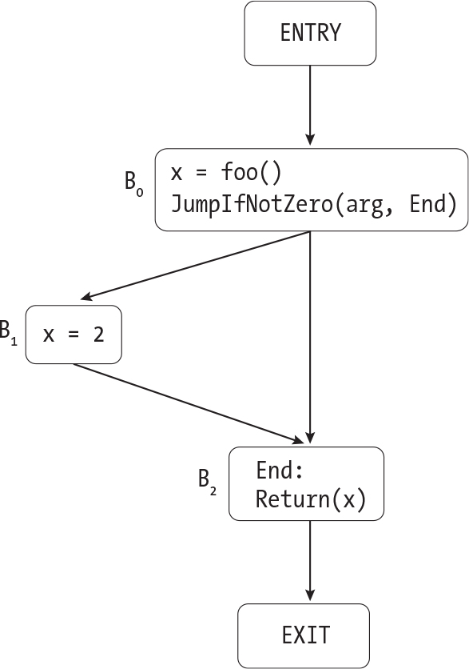

`Figure 19-3: A control-flow graph for a function where we cannot perform copy propagation ``Description`

In this control-flow graph, there are two paths from the start of the function to `Return(x)`. Because only one of these paths passes through `x = 2`, it isn’t safe to substitute `2` for `x` in this `Return` instruction. In Figure 19-4, on the other hand, every path to `Return(x)` passes through `x = 2`.

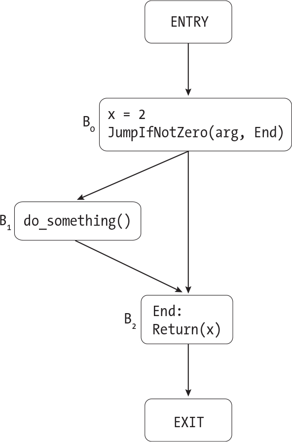

`Figure 19-4: A control-flow graph for a function where we can perform copy propagation ``Description`

No matter which path we take through Figure 19-4, we’ll execute `x = 2` before we reach the `Return` instruction, so we can safely rewrite that instruction as `Return(2)`.

Figure 19-5 shows another, slightly trickier example.

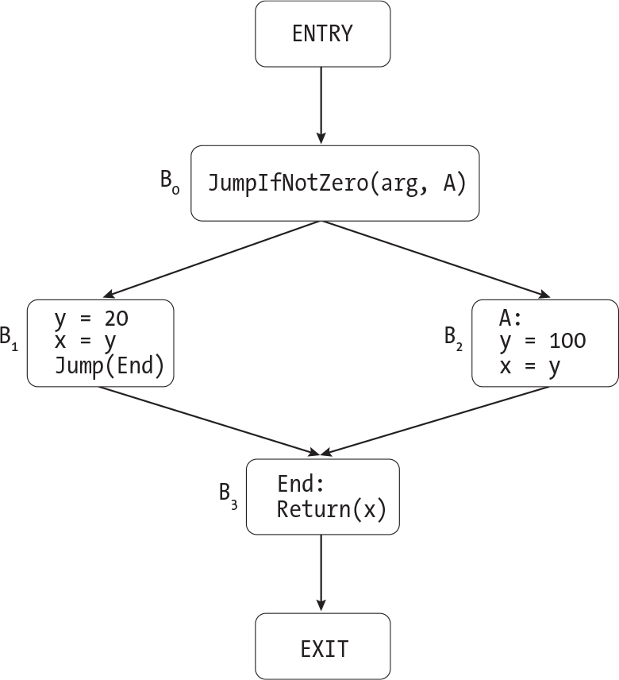

`Figure 19-5: Another control-flow graph where copy propagation is safe ``Description`

Once again, there are two different paths to `Return(x)`. Both paths pass through `x = y`, but they pass through different instances of this instruction that appear in different blocks. In `B``1`, `y`’s value is `20`; in `B``2`, it’s `100`. But in either case, `x` and `y` will have the same value when we reach the `Return` instruction. That means it’s still safe to rewrite `Return(x)` as `Return(y)`.

Before we rewrite instruction *i*, there’s a second condition that each path to *i* must satisfy: between the instruction `x = y` and *i*, neither `x` nor `y` can be updated again. Consider this fragment of TACKY:

    x = 10
    x = foo()
    Return(x)

We can’t replace `x` with `10` in `Return(x)`, because `x`’s value is no longer `10` at that point. Updating the variable that appeared on the right-hand side of a `Copy` instruction causes the same problem:

    x = y
    y = 0
    Return(x)

Right before `y = 0`, we know that `x` and `y` have the same value. But after that instruction, their values will be different, so we can’t rewrite `Return(x)`. When a `Copy` instruction’s source or destination is updated, we say the copy is *killed*. Once a copy is killed, we can’t propagate it to later points in the program.

It’s possible for `x = y` to appear multiple times on some path to *i*. It’s unsafe to propagate it only if it’s killed after the *last* time it appears. In the following example, it’s safe to rewrite `Return(x)` as `Return(2)`:

    x = 2
    x = foo()
    x = 2
    Return(x)

If there are multiple paths to *i*, the `Copy` instruction we’re interested in must not be killed on any of them. Take a look at Figure 19-6, where `x = y` is killed on one path but not another.

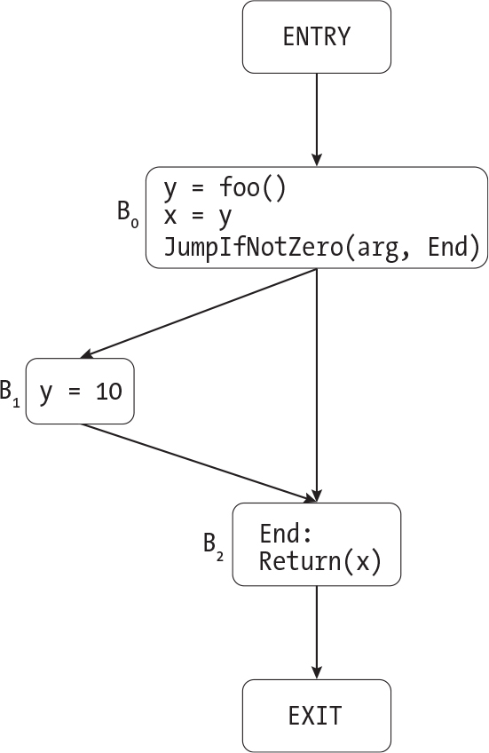

`Figure 19-6: A control-flow graph where a reaching copy is killed along one path ``Description`

If we jump over `B``1`, `x` and `y` will have the same value when we reach the `Return` instruction in `B``2`. But if we take the path through `B``1`, their values will be different. Because we don’t know ahead of time which path the program will take, we can’t rewrite `Return(x)`.

Let’s consider one final edge case. Suppose that `x = y` is followed by `y = x`, with no intervening kills:

    x = y
    --snip--
    y = x
    z = x + y

Normally, updating `y` would kill the earlier `Copy` instruction. But after `y = x`, `x` and `y` still have the same value. There are multiple correct ways to handle this case. One option is to say that `y = x` kills `x = y`, so only `y = x` reaches `z = x + y`. In that case, we’d rewrite the final instruction as `z = x + x`. This might let us remove `y = x` later, during dead store elimination, depending on where else `y` is used. Another option is to simply ignore `y = x` during our analysis, on the grounds that it has no effect; it just assigns `y` the same value it already had. Then, when we’re rewriting instructions, we can go ahead and eliminate `y = x` and rewrite the last instruction as `z = y + y`. A third option is to propagate *both* copies in the final instruction, substituting `x` for `y` and `y` for `x`. This substitution is safe but not particularly helpful, since it won’t help us get rid of either `Copy` instruction. We’ll go with the second option and eliminate the redundant `Copy`.

If a `Copy` instruction appears on every path to instruction *i*, and it isn’t killed on any of those paths, we say that it *reaches* instruction *i*. At the start of the copy propagation pass, we’ll perform reaching copies analysis to determine which copies reach each instruction in the TACKY function. Then, we’ll use the results of this analysis to identify instructions that we can rewrite safely.

We’ll implement this whole optimization for the subset of TACKY we defined in Part I, then extend it to handle the new language features from Part II.

#### `Reaching Copies Analysis`

To implement reaching copies analysis, we’ll define each of the elements of data-flow analysis that we discussed earlier: the transfer function, meet operator, and iterative algorithm. The transfer function and meet operator we’ll discuss in this section are specific to reaching copies analysis, while the iterative algorithm applies to every forward data-flow analysis.

##### `The Transfer Function`

The transfer function takes all the `Copy` instructions that reach the beginning of a basic block and calculates which copies reach each individual instruction within the block. It also calculates which copies reach the end of the block, just after the final instruction. The rules here are pretty simple. First, if *i* is a `Copy` instruction, it reaches the instruction that comes right after it. Second, if some `Copy` instruction reaches *i*, it also reaches the instruction right after *i*, unless *i* kills it. Let’s work through an example. Suppose a basic block contains the instructions in Listing 19-12.

    x = a
    y = 10
    x = y * 3
    Return(x)

`Listing 19-12: A basic block`

Let’s assume that one `Copy` instruction, `a = y`, reaches the start of this basic block. This `Copy` will reach the first instruction, `x = a`. Once we encounter `x = a`, we add it to the current set of reaching copies, so both `a = y` and `x = a` reach the next instruction, `y = 10`. Because this next instruction updates `y`, it kills `a = y`. We therefore remove `a = y` from the set of reaching copies, but we add `y = 10`. Finally, `x = y * 3` kills `x = a`. We don’t add `x = y * 3` as a reaching copy because it’s not a `Copy` instruction. The final `Return` instruction doesn’t add or remove any reaching copies. Table 19-1 lists which copies reach each instruction in this basic block.

`Table 19-1:` `Copies Reaching Each Instruction in ``Listing 19-12`

| `Instruction`  | `Reaching copies` |
|----------------|-------------------|
| `x = a`        | `{a = y}`         |
| `y = 10`       | `{a = y, x = a}`  |
| `x = y * 3`    | `{x = a, y = 10}` |
| `Return(x)`    | `{y = 10}`        |
| `End of block` | `{y = 10}`        |

Things get a little trickier when we consider variables with static storage duration. As Listing 19-13 demonstrates, these variables can be updated in other functions.

    int static_var = 0;

    int update_var(void) {
        static_var = 4;
        return 0;
    }

    int main(void) {
        static_var = 5;
      ❶ update_var();
        return static_var;
    }

`Listing 19-13: A C program where multiple functions access the same variable with static storage duration`

Our reaching copies analysis should recognize that the call to `update _var` in `main` kills `static_var = 5` ❶. Otherwise, it will incorrectly rewrite `main` to return the constant `5`. At first glance, it might look like this problem applies only to file scope variables, but as Listing 19-14 illustrates, it impacts static local variables too.

    int indirect_update(void);

    int f(int new_total) {
        static int total = 0;
        total = new_total;
        if (total > 100)
            return 0;
        total = 10;
      ❶ indirect_update();
        return total;
    }

    int indirect_update(void) {
        f(101);
        return 0;
    }

`Listing 19-14: A C program where a function call indirectly updates a static local variable`

When we analyze `f`, we’ll need to know that the call to `indirect_update` at ❶ can update `total`. Otherwise, we’ll incorrectly rewrite `f` to return `10`.

There are a couple of ways to solve this problem. One option is to figure out which function calls will update which static variables. This would make reaching copies analysis an interprocedural analysis, which gathers information about multiple functions. This approach gets complicated very quickly. Our other option is to assume that every function call updates every static variable. We’ll go with this option because it’s much simpler. Whenever we encounter a function call, we’ll kill any copies to or from static variables. This approach is *conservative*; it guarantees that we’ll never perform an unsafe optimization, but it may lead us to kill some reaching copies unnecessarily and miss some safe optimizations. In contrast, using interprocedural analysis would be a more *aggressive* approach because it would miss fewer optimizations. More aggressive optimization techniques aren’t always better; they often come at the cost of increased complexity and longer compilation times.

Listing 19-15 gives the pseudocode for the transfer function.

    transfer(block, initial_reaching_copies):
        current_reaching_copies = initial_reaching_copies

        for instruction in block.instructions:
          ❶ annotate_instruction(instruction, current_reaching_copies)
            match instruction with
            | Copy(src, dst) ->
              ❷ if Copy(dst, src) is in current_reaching_copies:
                    continue

              ❸ for copy in current_reaching_copies:
                    if copy.src == dst or copy.dst == dst:
                        current_reaching_copies.remove(copy)

              ❹ current_reaching_copies.add(instruction)
            | FunCall(fun_name, args, dst) ->
                for copy in current_reaching_copies:
                  ❺ if (copy.src is static
                        or copy.dst is static
                        or copy.src == dst
                        or copy.dst == dst):
                        current_reaching_copies.remove(copy)
            | Unary(operator, src, dst) ->
              ❻ for copy in current_reaching_copies:
                    if copy.src == dst or copy.dst == dst:
                        current_reaching_copies.remove(copy)
            | Binary(operator, src1, src2, dst) ->
                // same as Unary
                --snip--
            | _ -> continue

      ❼ annotate_block(block.id, current_reaching_copies)

`Listing 19-15: The transfer function for reaching copies analysis`

To process an instruction, we’ll first record the set of copies that reach the point just before that instruction executes ❶. (We’ll refer to this information later when we actually rewrite the instruction.) Then, we’ll inspect the instruction itself to calculate which copies reach the point just after it. In the special case where `x = y` reaches `y = x`, we won’t add or remove any reaching copies ❷. As we saw earlier, `y = x` will have no effect, since `x` and `y` already have the same value. Otherwise, we’ll handle the `Copy` instruction `x = y` by killing any copies to or from `x` ❸, then adding `x = y` to the set of reaching copies ❹.

When we encounter a `FunCall` instruction, we’ll kill any copies to or from variables with static storage duration along with any copies to or from `dst`, the variable that will hold the result of the function call ❺. The two other instructions from Part I that update variables are `Unary` and `Binary`. To handle either of these, we’ll kill any copies to or from its destination ❻. The remaining TACKY instructions from Part I, like `Jump`, `Return`, and `Label`, don’t add or kill any reaching copies. After processing every instruction, we’ll record which copies reach the very end of the block ❼.

##### `The Meet Operator`

Next, we’ll implement the meet operator, which propagates information about reaching copies from one block to another. This operator calculates the set of initial reaching copies that we’ll pass to the transfer function. Recall that a copy reaches some point in the program only if it appears, and isn’t killed, on *every* path to that point. Therefore, a copy reaches the beginning of a block only if it reaches the end of all of that block’s predecessors. In other words, we’ll just take the set intersection of the results from every predecessor. Listing 19-16 gives the pseudocode for the meet operator.

    meet(block, all_copies):

      ❶ incoming_copies = all_copies
        for pred_id in block.predecessors:
            match pred_id with
          ❷ | ENTRY -> return {}
            | BlockId(id) ->
              ❸ pred_out_copies = get_block_annotation(pred_id)
                incoming_copies = intersection(incoming_copies, pred_out_copies)
            | EXIT -> fail("Malformed control-flow graph")

        return incoming_copies

`Listing 19-16: The meet operator for reaching copies analysis`

The meet operator takes two arguments. The first is the block whose incoming copies we want to calculate. The second, `all_copies`, is the set of all `Copy` instructions that appear in the function. We initialize the set of incoming copies to this value ❶, because it’s the *identity element* for set intersection. That is, given any set of reaching copies, *S*, the intersection of *S* with `all_copies` is just *S*.

Next, we iterate over the block’s predecessors, which might include other basic blocks, the `ENTRY` node, or both. No copies reach the very start of a function, so if we find `ENTRY` in the list of predecessors we just return the empty set ❷. (The intersection of the empty set and anything else is still the empty set, so there’s no need to look at the block’s other predecessors.) Otherwise, we look up the set of copies that reach the end of each predecessor ❸, which we recorded at the end of Listing 19-15, and take the intersection of `incoming_copies` with each of these sets.

We have one edge case to consider. If unreachable code elimination is disabled, the block we’re analyzing might not have any predecessors. Calling `meet` on a block with no predecessors will return `all_copies`, so we assume that every possible `Copy` instruction reaches the start of the block. We don’t care how this ultimately impacts the block itself, which will never execute anyway. We *do* care how this impacts the block’s successors, which might be reachable. For instance, if a reachable block `A` and unreachable block `B` both jump to block `C`, then block `C` is reachable.

Luckily, our analysis is still safe. The intersection of the real results from `A` and the junk results from `B` will always be a subset of the copies that actually reach `C` from `A`; this is a conservative approximation of the results we’d get if we enabled unreachable code elimination and deleted `B` entirely.

##### `The Iterative Algorithm`

We can analyze a basic block with the meet operator and transfer function once we know the results from the blocks that preceded it. Now we’ll tie everything together and analyze the entire function. There’s just one problem: control-flow graphs can have loops! We can’t analyze a block until we’ve analyzed all of its predecessors, which requires us to analyze all of their predecessors, and so on. Once we hit a loop, it seems like we’re stuck; we can’t analyze any of the blocks in the loop, because each block directly or indirectly precedes itself.

To get unstuck, we need some way to analyze a block even if we don’t have complete results from all of its predecessors. The solution is to maintain a provisional result for every block; if we need to analyze a block before some of its predecessors, we can use those predecessors’ provisional results. At first, before we’ve explored any paths to a block, its provisional result includes every `Copy` instruction in the function. Then, with each new path to the block (or rather, the end of the block) that we explore, we eliminate any copies that don’t appear, or are killed, along that path. This means a block’s provisional result always tells us which reaching copies appear (and aren’t killed) on *every* path to the end of that block that we’ve explored so far. Once we’ve explored every possible path, we’ll have the block’s final result.

That’s the basic idea; now let’s put it into practice. First, we’ll annotate each basic block with the set of all `Copy` instructions in the function. As we learned earlier, this set is the identity element for our meet operator. Initializing every block with the identity element ensures that blocks we haven’t yet analyzed don’t change the result of the meet operator. Let’s try out this approach on the control-flow graph in Figure 19-7.

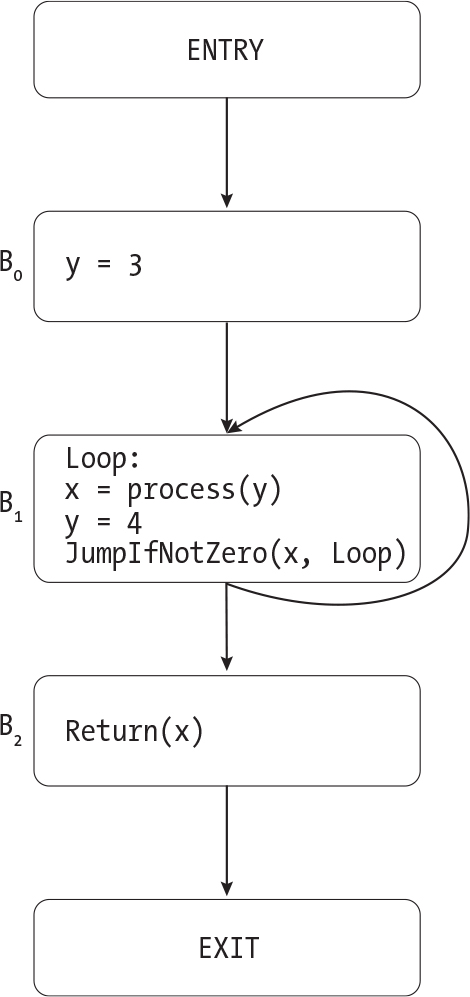

`Figure 19-7: A control-flow graph with a loop ``Description`

This control-flow graph contains two `Copy` instructions: `y = 3` and `y = 4`. We’ll initially annotate each block with the set containing both copies. Then, we’ll analyze the blocks in order. We can calculate the final results for `B``0` in just one pass because its only predecessor is `ENTRY`. Figure 19-8 illustrates the annotations on each block after we’ve processed `B``0`.

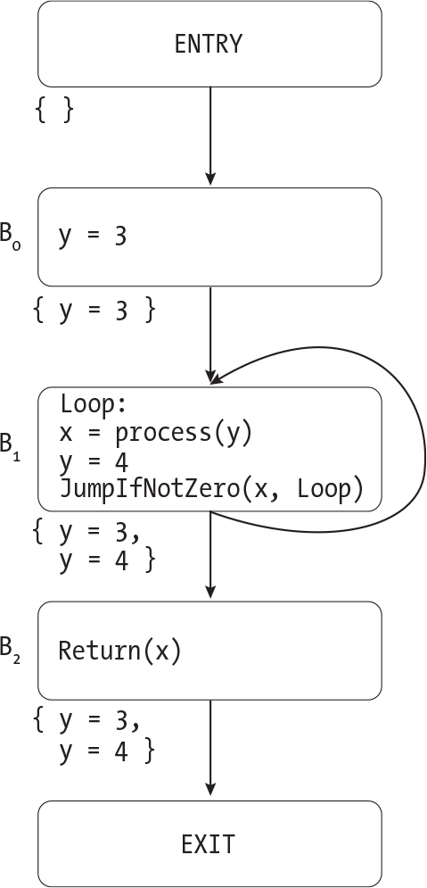

`Figure 19-8: The provisional results of reaching copies analysis for ``Figure 19-7``, after processing B``0 ``Description`

At this point, the annotation on `B``0` is correct: only `y = 3` reaches the end of that block. The other two blocks are still annotated with every copy. Next, we’ll apply the meet operator to see which copies reach the start of `B``1`. This block has two predecessors: `B``0` and itself. We’ll therefore take the intersection of `{y = 3}` and `{y = 3, y = 4}`, which is `{y = 3}`. This is the same result we’d get if `B``0` were `B``1`’s only predecessor. That’s exactly the behavior we want: because we haven’t analyzed `B``1` yet, it shouldn’t contribute to the result of the meet operator. Once we apply the transfer function to `B``1`, we’ll recognize that only `y = 4` reaches the end of the block. We’ll then have all the information we need to process `B``2` too. Figure 19-9 shows the annotations on each block after we’ve analyzed `B``1` and `B``2`.

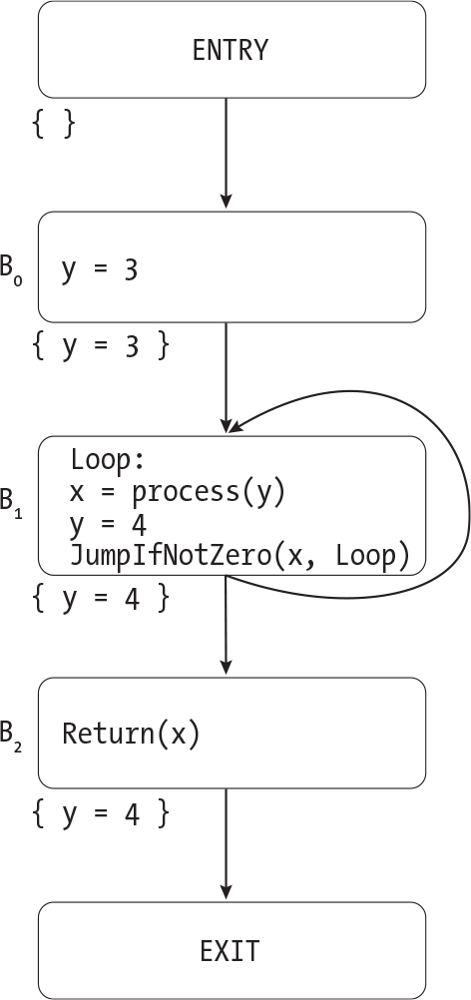

`Figure 19-9: The provisional results of reaching copies analysis after analyzing each basic block once ``Description`

Each block now has the correct set of reaching copies. But we don’t yet have the right answer for each individual instruction in `B``1`. (Figures 19-8 and 19-9 don’t show the annotations on individual instructions.) When we last analyzed `B``1`, we assumed that `y = 3` reached the start of the block, which would imply that it also reaches `x = process(y)`. Now that we have more accurate information, we need to analyze `B``1` again. This time, the meet operator will take the intersection of `{y = 3}` and `{y = 4}`, which is the empty set. We’ll pass this result to the transfer function to recalculate the results for individual instructions in `B``1`. This time around, we’ll correctly conclude that no `Copy` instructions reach `x = process(y)` (or any point in the block before `y = 4`, for that matter).

Now that we’ve seen the iterative algorithm in action, let’s implement it. Listing 19-17 gives the pseudocode for this algorithm.

    find_reaching_copies(graph):

        all_copies = find_all_copy_instructions(graph)
        worklist = []

        for node in graph.nodes:
            if node is EntryNode or ExitNode:
                continue
          ❶ worklist.append(node)
            annotate_block(node.id, all_copies)

        while worklist is not empty:
          ❷ block = take_first(worklist)
            old_annotation = get_block_annotation(block.id)
            incoming_copies = meet(block, all_copies)
            transfer(block, incoming_copies)
          ❸ if old_annotation != get_block_annotation(block.id):
                for successor_id in block.successors:
                    match successor_id with
                    | EXIT -> continue
                    | ENTRY -> fail("Malformed control-flow graph")
                    | BlockId(id) ->
                        successor = get_block_by_id(successor_id)
                        if successor is not in worklist:
                            worklist.append(successor)

`Listing 19-17: The iterative algorithm for reaching copies analysis`

We’ll maintain a worklist of basic blocks we need to process, including blocks that we need to revisit after updating one of their predecessors. In the initial setup for this algorithm, we’ll add each basic block to the worklist ❶, since we need to analyze every block at least once. We’ll also initialize each block with the set of all `Copy` instructions that appear in the function.

Next, we enter our main processing loop, where we’ll remove a block from the front of the worklist ❷, then analyze it using the meet operator and transfer function. If this analysis changes the block’s outgoing reaching copies, we’ll add all of its successors to the worklist so we can reanalyze them using those new results ❸. If a successor is already in the worklist, we don’t need to add it again. We’ll repeat this process until the worklist is empty.

`GETTING MORE BANG FOR YOUR BLOCK`

`It’s possible to improve on the code in ``Listing 19-17``: when you initialize the worklist, you could add blocks in` `reverse postorder``. To sort the nodes of a graph in postorder, you perform a depth-first search, adding each node to the sorted list after you return from traversing its successors. To sort them in reverse postorder, you take the list of nodes sorted in postorder and reverse it. In a reverse postorder traversal, you generally don’t visit a block until you’ve visited all of its predecessors. (If you’re traversing a graph with a loop, of course, you’ll hit a few exceptions to this general rule.) This helps you gather as much information as possible about a block’s predecessors before you try to analyze it, which minimizes how many times you need to revisit each block. If you don’t add blocks to the worklist in this order, the algorithm will still be correct; it will just take longer. “Additional Resources” on ``page 610`` lists a couple of references with more details about how to sort a graph in postorder or reverse postorder.`

Listing 19-17 works for any forward data-flow analysis. Only the transfer function, the meet operator, and the identity element used to initialize each basic block will vary.

#### `Rewriting TACKY Instructions`

After running reaching copies analysis, we’ll look for opportunities to rewrite, or even remove, each instruction in the TACKY function. To rewrite an instruction, we’ll check whether the copies that reach it define any of its operands. If they do, we’ll replace those operands with their values. If we encounter a `Copy` instruction of the form `x = y` and its reaching copies include `x = y` or `y = x`, we’ll remove it instead of trying to rewrite it; the instruction has no effect if `x` and `y` already have the same value. Listing 19-18 demonstrates how to process each instruction.

    replace_operand(op, reaching_copies):
        if op is a constant:
            return op

        for copy in reaching_copies:
            if copy.dst == op:
                return copy.src
        return op

    rewrite_instruction(instr):
      ❶ reaching_copies = get_instruction_annotation(instr)
        match instr with
        | Copy(src, dst) ->
            for copy in reaching_copies:
              ❷ if (copy == instr) or (copy.src == dst and copy.dst == src):
                    return null
          ❸ new_src = replace_operand(src, reaching_copies)
            return Copy(new_src, dst)
        | Unary(operator, src, dst) ->
            new_src = replace_operand(src, reaching_copies)
            return Unary(operator, new_src, dst)
        | Binary(operator, src1, src2, dst) ->
            new_src1 = replace_operand(src1, reaching_copies)
            new_src2 = replace_operand(src2, reaching_copies)
            return Binary(operator, new_src1, new_src2, dst)
        | --snip--

`Listing 19-18: Rewriting an instruction based on the results of reaching copies analysis`

Given the set of copies that reach the current instruction, `replace_operand` replaces a single TACKY operand with its value. If the operand is a constant or we can’t find a reaching copy that assigns to it, we just return the original value.

In `rewrite_instruction`, we start by looking up the set of copies that reach the current instruction, `instr` ❶. If `instr` is a `Copy` instruction, we’ll search this set, which we call `reaching_copies`, for a copy from its source to its destination or vice versa ❷. If we find one, `instr`’s operands already have the same value, so we can delete it. (Listing 19-18 returns `null` to indicate that we should delete the instruction; your code might indicate this differently.) Otherwise, we try to replace the instruction’s source operand using `replace _operand` ❸. We’ll attempt to replace the source operands of other TACKY instructions in the same way. Listing 19-18 demonstrates how to rewrite the source operands in `Unary` and `Binary`; I’ve omitted the remaining TACKY instructions from Part I because the logic is the same.

At this point, you have a complete copy propagation pass that performs reaching copies analysis and uses the results to optimize a TACKY function. If you skipped Part II, you can move on to this section’s test suite. But if you completed Part II, you still have some work to do.

#### `Supporting Part II TACKY Programs`

To make copy propagation work with the TACKY code we generate in Part II, we need to solve a couple of problems. The first problem is that we sometimes use `Copy` instructions to perform type conversions. We don’t want to propagate copies between signed and unsigned types, because we sometimes generate different assembly code for operations on signed and unsigned values. If we replace a signed value with an unsigned one in a comparison, for example, we’ll end up generating the wrong condition code for that comparison. Our reaching copies analysis will treat any `Copy` between signed and unsigned operands like a type conversion instruction instead of a normal copy operation. We won’t add it as a reaching copy in the transfer function, and we won’t include it in the set of initial reaching copies at the start of the iterative algorithm.

> `NOTE`

*Another solution would be to introduce separate signed and unsigned TACKY operators for comparisons, remainder operations, and division, so we wouldn’t have to check the types of operands to distinguish between these cases during code generation. The LLVM IR uses this approach.*

The second problem is that variables can be updated through pointers. These updates are difficult to analyze. If we see the instruction `Store(v, ptr)`, we don’t know which object `ptr` points to, so we don’t know which copies to kill. This is similar to the issue we ran into with static variables, which could be updated in other functions. To solve this problem, we’ll find all the variables that could be accessed through pointers (these are called *aliased variables*). We’ll assume that every `Store` instruction updates every one of these variables. We’ll assume that function calls update these variables too, since we can declare a variable in one function and then update it through a pointer in a different function. Let’s use this approach to analyze Listing 19-19.

    function_with_pointers():
        x = 1
        y = 2
        z = 3
        ptr1 = GetAddress(x)
        Store(10, ptr1)
        ptr2 = GetAddress(y)
        z = x + y
        Return(z)

`Listing 19-19: A TACKY function that updates variables through pointers`

First, we’ll identify the aliased variables in `function_with_pointers`. Both `x` and `y` are aliased because they’re both used in `GetAddress` instructions. (Let’s assume that none of the variables in this listing are static, so we don’t have to worry about whether other functions take their address.) Next, we’ll run reaching copies analysis. Since this whole function body is one basic block, we can just apply the transfer function to the entire thing. We’ll add `x = 1`, `y = 2`, and `z = 3` to the set of reaching copies, as usual. Then, when we reach the `Store` instruction, we’ll kill the copies to our two aliased variables, `x` and `y`. Table 19-2 describes which copies will reach each instruction in this function.

`Table 19-2:` `Copies Reaching Each Instruction in ``Listing 19-19`

| `Instruction`          | `Reaching copies`       |
|------------------------|-------------------------|
| `x = 1`                | `{}`                    |
| `y = 2`                | `{x = 1}`               |
| `z = 3`                | `{x = 1, y = 2}`        |
| `ptr1 = GetAddress(x)` | `{x = 1, y = 2, z = 3}` |
| `Store(10, ptr1)`      | `{x = 1, y = 2, z = 3}` |
| `ptr2 = GetAddress(y)` | `{z = 3}`               |
| `z = x + y`            | `{z = 3}`               |
| `Return(z)`            | `{}`                    |
| `End of block`         | `{}`                    |

We correctly recognize that the `Store` instruction might overwrite `x`, which means that we can’t replace `x` with `1` in `z = x + y`. We also assume that the `Store` instruction might overwrite `y` because our analysis isn’t smart enough to realize that `ptr1` couldn’t possibly point to `y`. Therefore, we won’t replace `y` with `2` in `z = x + y`, even though it would be safe to do so. Once again, we’re making a conservative assumption; we’ll miss some safe optimizations, but we’ll never apply any that are unsafe.

##### `Implementing Address-Taken Analysis`

The approach we just used to identify aliased variables is called *address-taken analysis*. To perform this analysis, we’ll inspect each instruction in a TACKY function and identify every variable that either has static storage duration or has its address taken by a `GetAddress` instruction. (We’ll assume that all static variables are aliased, because their addresses might be taken in other functions.) We’ll rerun this analysis on every iteration through the optimization pipeline because the results can change if we optimize away any `GetAddress` instructions. Listing 19-20 demonstrates how it fits into the overall optimization pipeline we defined in Listing 19-6.

    optimize(function_body, enabled_optimizations):
        --snip--
        while True:
            aliased_vars = address_taken_analysis(function_body)
            --snip--
            if enabled_optimizations contains "COPY_PROP":
                cfg = copy_propagation(cfg, aliased_vars)
            if enabled_optimizations contains "DEAD_STORE_ELIM":
                cfg = dead_store_elimination(cfg, aliased_vars)
            --snip--

`Listing 19-20: Adding address-taken analysis to the TACKY optimization pipeline`

Address-taken analysis is just one kind of *alias analysis*, also known as *pointer analysis*, which tries to determine whether two pointers or variables can refer to the same object. Most pointer analysis algorithms are more powerful than address-taken analysis. For example, they could figure out that `ptr1` will never point to `y` in Listing 19-19.

##### `Updating the Transfer Function`

Next, we’ll extend the transfer function to support the new types and instructions we added in Part II.

Listing 19-21 illustrates our new and improved transfer function. It reproduces Listing 19-15, with the changes to support additional types bolded.

    transfer(block, initial_reaching_copies, aliased_vars):
        current_reaching_copies = initial_reaching_copies

        for instruction in block.instructions:
            annotate_instruction(instruction, current_reaching_copies)
            match instruction with
            | Copy(src, dst) ->
                --snip--
                if (get_type(src) == get_type(dst)) or (signedness(src) == signedness(dst)):
                    current_reaching_copies.add(instruction)
            | FunCall(fun_name, args, dst) ->
                for copy in current_reaching_copies:
                    if (copy.src is in aliased_vars
                        or copy.dst is in aliased_vars
                        or (dst is not null and (copy.src == dst or copy.dst == dst))):
                        current_reaching_copies.remove(copy)
            | Store(src, dst_ptr) ->
                for copy in current_reaching_copies:
                    if (copy.src is in aliased_vars) or (copy.dst is in aliased_vars):
                        current_reaching_copies.remove(copy)
            | Unary(operator, src, dst) or any other instruction with dst field ->
                --snip--
            | _ -> continue

        annotate_block(block.id, current_reaching_copies)

`Listing 19-21: The transfer function for reaching copies analysis, with support for features from Part II`

We’ve already touched on most of the changes in this listing. Before we add a `Copy` instruction to `current_reaching_copies`, we’ll make sure that its source and destination have the same type, or at least types with the same signedness. The `signedness` helper function should count `char` as a signed type and all pointer types as unsigned types, so we can propagate copies between `char` and `signed char`, between different pointer types, and between pointers and `unsigned long`. (The concept of signedness doesn’t apply to `double` or non-scalar types. That’s fine, because we don’t use `Copy` instructions to convert to or from these types. If a `Copy` uses a `double` or non-scalar operand, both operands will have the same type, so we won’t need to check their signedness.)

When we encounter a function call or `Store` instruction, we’ll kill any copies to or from aliased variables. We’ll also account for the fact that a function call may not have a destination operand. Note that we don’t kill the `Store` instruction’s `dst_ptr` operand. `Store` doesn’t change the value of the destination pointer itself, just the value of the object it points to. Finally, when we encounter any of the other instructions we added in Part II—including type conversions, `CopyToOffset`, and `CopyFromOffset`—we’ll kill any copies to or from its destination. We won’t track copies to or from individual subobjects within structures or arrays, so `CopyToOffset` and `CopyFromOffset` will kill reaching copies without generating any new ones.

##### `Updating rewrite_instruction`

We’ll rewrite most of the new TACKY instructions from Part II in the same way as the instructions from Part I, replacing any source operands that are defined by reaching copies. The one exception is `GetAddress`, which we’ll never rewrite. It wouldn’t make sense to apply copy propagation to `GetAddress`, because it uses its source operand’s address rather than its value.

`TEST THE COPY PROPAGATION PASS`

`If you completed only Part I, run the following command to test your implementation of copy propagation:`

    $ ./test_compiler /path/to/your_compiler --chapter 19 --propagate-copies
    --int-only

`If you completed Parts I` `and II, run:`

    $ ./test_compiler /path/to/your_compiler --chapter 19 --propagate-copies

### `Dead Store Elimination`

Our last optimization is dead store elimination. We’ll use liveness analysis, a backward data-flow analysis, to calculate which variables are live at every point in the function we’re optimizing. Then, we’ll use the results of this analysis to identify dead stores and eliminate them.

A variable is *live* at a particular point if its value at that point might be read later in the program. Otherwise, it’s *dead*. To be more precise, a variable `x` is live at any given point *p* when two conditions are met. First, there must be at least one path from *p* to some later instruction that uses `x`. We say that `x` is *generated* by any instruction that uses it. Second, `x` must not be updated on the path from *p* to that later instruction. We say that `x` is *killed* by any instruction that updates it, just like a reaching copy is killed when either of its operands is updated. (You’ll see the terms *generate* and *kill* in discussions of most data-flow analyses, not just the two in this chapter.) Consider the control-flow graph in Figure 19-10.

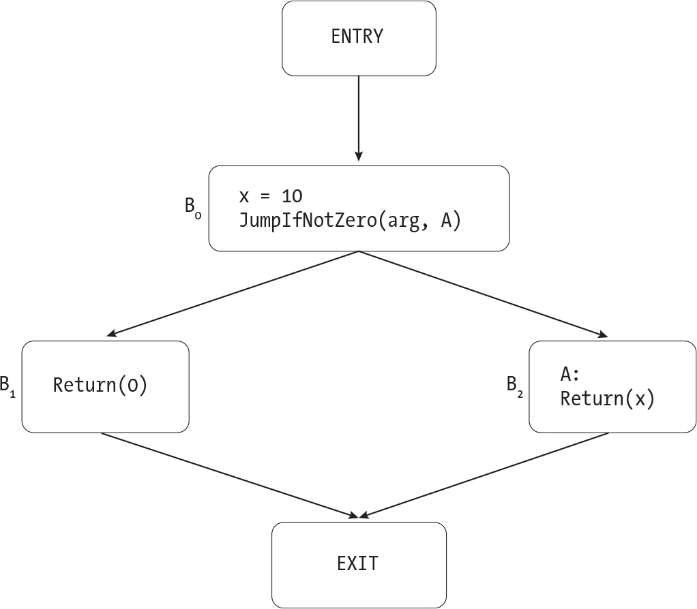

`Figure 19-10: A control-flow graph in which x is live just after it’s defined ``Description`

There are two paths from `x = 10` to `EXIT`. On the path through `B``1`, `x` is never used. On the path through `B``2`, `x` is used in a `Return` instruction. We know that `x` is live at the point after `x = 10` because it’s generated on one of these paths. By the same logic, `x` is also live at the end of `B``0`, at the beginning of `B``2`, and just before the `Return` instruction in `B``2`. On the other hand, `x` is dead at the end of `B``2` and at every point in `B``1`, since there are no paths from those points to an instruction that uses `x`. Note that `x` is also dead at the very beginning of `B``0`, since we don’t use its (uninitialized) value before we assign it a new value in `x = 10`.

Now let’s look at the control-flow graph in Figure 19-11.

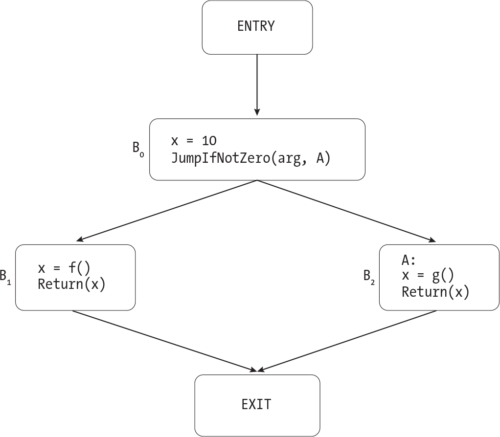

`Figure 19-11: A control-flow graph with a dead store to x ``Description`

Again, we have two paths from `x = 10` to `EXIT`. Both paths pass through `Return` instructions that use `x`, but on both paths `x` is killed between `x = 10` and the `Return` instruction that generates it. This means that `x` is dead right after `x = 10`. It’s alive at just two points in this control-flow graph: right after `x = f()` in `B``1` and right after `x = g()` in `B``2`.

An instruction is a dead store if it assigns to a dead variable and has no other side effects. Therefore, `x = 10` is a dead store in Figure 19-11 but not in Figure 19-10. Note that we care whether the variable is dead just *after* the instruction, not before it. In the code fragment

    x = x + 1
    Return(0)

`x` is live just before `x = x + 1` but dead after it. The fact that `x` is dead just after we update it means that this instruction is a dead store, so we can eliminate it.

#### `Liveness Analysis`

Like every data-flow analysis, liveness analysis requires a transfer function, a meet operator, and an iterative algorithm. Because this is a backward-flow problem, the transfer function will start at the end of a basic block and work its way to the beginning, instead of working from start to finish like we did in reaching copies analysis. Similarly, the meet operator will gather information from a block’s successors, not its predecessors. We’ll also use a slightly different iterative algorithm to send data backward through the control-flow graph. Let’s take a closer look at each of these pieces.

##### `The Transfer Function`

The transfer function takes the set of variables that are live at the end of a basic block and figures out which variables are live just before each instruction. As we saw in Figures 19-10 and 19-11, an instruction generates any variables that it reads and kills any variables that it updates. For example, to calculate the live variables before the instruction `x = y * z`, we would take the set of variables that are live right after the instruction, add `y` and `z`, and remove `x`. If an instruction reads and writes the same variable, it generates the variable instead of killing it. For example, `x = x + 1` generates `x`.

Let’s apply the transfer function to the basic block in Listing 19-22.

    x = 4
    x = x + 1
    y = 3 * x
    Return(y)

`Listing 19-22: A basic block`

The transfer function will start at the bottom of this basic block and work its way up. Let’s assume that there are no live variables at the end of the block, after the `Return` instruction. (This assumption might not hold if the function deals with static variables, but we’ll worry about that later.) When we process the `Return` instruction, we’ll add `y` to the set of live variables. Then, `y = 3 * x` will kill `y` and generate `x`. The next instruction, `x = x + 1`, generates `x`. This has no effect because `x` is already live. Finally, `x = 4` will kill `x`, leaving no live variables at the start of the basic block. Table 19-3 summarizes which variables are live just after each instruction in Listing 19-22.

`Table 19-3:` `The Live Variables After Each Instruction in ``Listing 19-22`

| `Instruction`        | `Live variables` |
|----------------------|------------------|
| `Beginning of block` | `{}`             |
| `x = 4`              | `{x}`            |
| `x = x + 1`          | `{x}`            |
| `y = 3 * x`          | `{y}`            |
| `Return(y)`          | `{}`             |

Static variables complicate things, much like they did during reaching copies analysis. We don’t know how other functions will interact with any static variables that we encounter; they could read them, update them, or both. We’ll assume that every function reads every static variable. This assumption is conservative, since it prevents us from eliminating earlier writes to those variables. Listing 19-23 gives the pseudocode for the transfer function.

    transfer(block, end_live_variables, all_static_variables):
      ❶ current_live_variables = end_live_variables

      ❷ for instruction in reverse(block.instructions):
          ❸ annotate_instruction(instruction, current_live_variables)

            match instruction with
            | Binary(operator, src1, src2, dst) ->
                current_live_variables.remove(dst)
                if src1 is a variable:
                    current_live_variables.add(src1)
                if src2 is a variable:
                    current_live_variables.add(src2)
            | JumpIfZero(condition, target) ->
                if condition is a variable:
                    current_live_variables.add(condition)
            | --snip--
            | FunCall(fun_name, args, dst) ->
                current_live_variables.remove(dst)
                for arg in args:
                    if arg is a variable:
                        current_live_variables.add(arg)
              ❹ current_live_variables.add_all(all_static_variables)

      ❺ annotate_block(block.id, current_live_variables)

`Listing 19-23: The transfer function for liveness analysis`

We’ll start with the set of variables that are live at the end of the block ❶, then process the list of instructions in reverse ❷. We annotate each instruction with the set of variables that are live just after it executes ❸; we’ll use this annotation later to figure out whether the instruction is a dead store. Then, we calculate which variables are live just before the instruction. We’ll kill its destination if it has one, then add every variable that it reads. Listing 19-23 includes the pseudocode to handle the `Binary` instruction, which updates one operand and reads two others, and the `JumpIfZero` instruction, which reads an operand but doesn’t update anything. It omits the pseudocode to handle most of the other instructions, since they follow the same pattern. `FunCall` is the one special case; we’ll kill its destination and add its arguments, as usual, but we’ll add every static variable too ❹. Finally, we’ll annotate the whole block with the variables that are live before the first instruction ❺. The meet operator will use this information later.

There are a couple of ways to calculate `all_static_variables`. One option is to scan this TACKY function and look for static variables before you start the dead store elimination pass. Another option is to scan the whole symbol table for static variables, without worrying about which variables show up in which functions. There’s no harm in adding superfluous static variables here, since they won’t change which instructions we eventually eliminate.

##### `The Meet Operator`

The meet operator calculates which variables are live at the end of a basic block. To find the live variables at the end of some block `B`, we’ll look at all of its successors. If a variable is live at the start of at least one successor, it must also be live at the end of `B`, because there’s at least one path from the end of `B` through that successor to an instruction that generates that variable. Basically, we’ll take the set union of all the live variables at the start of all the block’s successors.

We’ll assume that every static variable is live at the `EXIT` node. Other functions, or other invocations of the current function, might read those variables. Variables with automatic storage duration are all dead at `EXIT`, since they’re not accessible after we leave the function. The pseudocode in Listing 19-24 defines the meet operator.

    meet(block, all_static_variables):
        live_vars = {}
        for succ_id in block.successors:
            match succ_id with
            | EXIT -> live_vars.add_all(all_static_variables)
            | ENTRY -> fail("Malformed control-flow graph")
            | BlockId(id) ->
                succ_live_vars = get_block_annotation(succ_id)
                live_vars.add_all(succ_live_vars)

        return live_vars

`Listing 19-24: The meet operator for liveness analysis`

In reaching copies analysis, we were looking for copies that appeared on *every* path to a point, so we used set intersection as our meet operator. In liveness analysis, we want to know if a variable is used on *any* path from a point, so we use set union instead. This is unrelated to the fact that one analysis is forward and the other is backward. Some forward analyses use set union because they care whether at least one path to a point has some property. Some backward analyses use set intersection because they care whether every path from a point has some property. Other, more complex analyses don’t use set union or intersection, and instead use different meet operators entirely.

##### `The Iterative Algorithm`

Finally, we’ll implement the iterative algorithm for liveness analysis. This differs from the iterative algorithm in Listing 19-17 in a couple of ways. First, when the annotation on a block changes, we’ll add its predecessors, rather than its successors, to the worklist. Second, we’ll use a different initial block annotation. Recall that each block’s initial annotation should be the identity element for the meet operator. Since our meet operator is set union, the initial annotation is the empty set. As we analyze more paths from a block to later points in the program, we’ll add more live variables to this set.

I won’t provide the pseudocode for the backward iterative algorithm, since it’s so similar to the forward algorithm we’ve already defined. But I will give you a couple of tips about how to implement it. First, you may want to initialize the worklist in postorder. (Recall that you sort the nodes of a graph in postorder by performing a depth-first traversal and visiting each node after you’ve visited its successors.) This makes the backward algorithm terminate faster, just like initializing the worklist in reverse postorder helps the forward algorithm terminate faster. This ordering means that whenever possible, you’ll visit each block only after you’ve visited all of its successors.

My second tip is to make your backward iterative algorithm reusable. In the next chapter, we’ll implement liveness analysis again, this time for assembly programs. The details of the meet operator and transfer function will change, but the iterative algorithm won’t. Try to structure your code so that you’ll be able to reuse the same iterative algorithm with a different meet operator and transfer function; then, you’ll be able to use it to analyze assembly programs in the next chapter.

#### `Removing Dead Stores`

After we run liveness analysis, we’ll find any dead stores in the TACKY function and remove them. An instruction is a dead store if its destination is dead as soon as we execute it, like in the following example:

    x = 1
    x = 2

Liveness analysis will tell us that `x` is dead right after `x = 1`, making that instruction safe to delete. We’ll never delete function calls, even when they update dead variables, because they may have other side effects. We also won’t delete instructions without destinations, like `Jump` and `Label`. Listing 19-25 demonstrates how to identify a dead store.

    is_dead_store(instr):
        if instr is FunCall:
            return False

        if instr has a dst field:
            live_variables = get_instruction_annotation(instr)
            if instr.dst is not in live_variables:
                return True

        return False

`Listing 19-25: Identifying a dead store`

If you completed only Part I, you’ve learned everything you need to know about dead store elimination! You can skip straight to the test suite. Otherwise, read on to learn how to handle the types and instructions we added in Part II.

#### `Supporting Part II TACKY Programs`

To update the transfer function, we’ll need to think through which live variables each new instruction might generate or kill. The type conversion instructions, like `Truncate` and `SignExtend`, are straightforward. Each one generates its source operand and kills its destination, much like the `Copy` and `Unary` instructions we already handle. `AddPtr` also follows the usual pattern: it generates both source operands and kills its destination.

The operations on pointers and aggregate types are trickier. Pointers cause essentially the same problem they did in reaching copies analysis: when we read or write through a pointer, we can’t tell which underlying object is being accessed. When in doubt, we should err on the conservative side and assume that a variable is live. Therefore, reading through a pointer should generate every aliased variable, but writing through a pointer shouldn’t kill any of them. We’ll take a similar approach to aggregate variables: reading part of an aggregate variable will generate it, but updating part of it won’t kill it. I won’t provide updated pseudocode for the transfer function; now that we’ve covered the key points, I’ll let you work through the remaining details on your own. The meet operator won’t change; in particular, static variables are still live at `EXIT`, but other aliased variables aren’t, because their lifetimes end when the function returns.

Finally, let’s update the last step in this optimization, where we use the results of liveness analysis to find dead stores and eliminate them. We’ll never eliminate a `Store` instruction, since we don’t know whether its destination is dead. Even if every single variable in the current function is dead, a `Store` might still have a visible side effect. For instance, it could update an object defined in a different function, like in the following example:

    update_through_pointer(param):
        Store(10, param)
        Return(0)

After the `Store` instruction, there are no live variables in `update_``through _pointer`. But that instruction clearly isn’t a dead store; it updates an object that our analysis didn’t track but that will likely be read later in the program.

The usual logic for spotting dead stores applies to all the other instructions from Part II, including `Load`, `GetAddress`, `CopyToOffset`, and `CopyFromOffset`.

`TEST THE WHOLE OPTIMIZATION PIPELINE`

`Now that you’ve implemented the whole optimization pipeline, you can test it out. You might want to start by testing just the dead store elimination pass. If you completed only Part I, you can do that with the following command:`

    $ ./test_compiler /path/to/your_compiler --chapter 19 --eliminate-dead-stores
    --int-only

`If you completed Parts I and II, run:`

    $ ./test_compiler /path/to/your_compiler --chapter 19 --eliminate-dead-stores

`The` `--eliminate-dead-stores` `option will run the dead store elimination–specific tests in` `tests/chapter_19/dead_store_elimination``. It will also run the tests from earlier chapters with all four optimizations enabled.`

`To test the whole optimization pipeline, run`

    $ ./test_compiler /path/to/your_compiler --chapter 19 --int-only

`or:`

    $ ./test_compiler /path/to/your_compiler --chapter 19

`This command will run all the tests of individual optimizations and all the tests from previous chapters with all four optimizations enabled (as usual, the` `--int-only` `option excludes any tests that rely on language features from Part II). It will also run the tests in` `tests/chapter_19/whole_pipeline``, which focus on how the different optimizations work together. These tests validate that each optimization takes advantage of any optimization opportunities that the others create.`

### `Summary`

In this chapter, you implemented four important compiler optimizations: constant folding, unreachable code elimination, copy propagation, and dead store elimination. You learned how these optimizations work together to transform the TACKY representation of a program, resulting in smaller, faster, simpler assembly code than your compiler produced before. You also learned how to construct a control-flow graph and perform data-flow analysis. These techniques are fundamental to many different optimizations, not just the ones we covered in this chapter. If you ever want to implement more TACKY optimizations on your own, you’ll be well prepared.

In the next chapter, you’ll write a register allocator. You’ll use a graph coloring algorithm to map pseudoregisters to hardware registers, and you’ll learn how to spill a register when graph coloring fails and you run out of registers. You’ll also use a technique called register coalescing to clean up many of the unnecessary `mov` instructions in your assembly code. By the end of the chapter, your assembly programs still won’t look quite like what a production compiler would generate, but they’ll be a lot closer.

### `Additional Resources`

This section lists the resources I referred to while writing this chapter, organized by topic.

**Security implications of compiler optimizations**

- “Dead Store Elimination (Still) Considered Harmful” by Zhaomo Yang et al. surveys the different ways programmers try to avoid unwanted dead store elimination and the limits of each approach (*<https://www.usenix.org/system/files/conference/usenixsecurity17/sec17-yang.pdf>*).
- “The Correctness-Security Gap in Compiler Optimization” by Vijay D’Silva, Mathias Payer, and Dawn Song looks at the security impact of a few different compiler optimizations and formalizes some of the security properties that optimizations should preserve (*<https://ieeexplore.ieee.org/stamp/stamp.jsp?tp=&arnumber=7163211>*).

**Data-flow analysis**

- Chapter 9 of *Compilers: Principles, Techniques, and Tools*, 2nd edition, by Alfred V. Aho et al. (Addison-Wesley, 2006) defines data-flow analysis more rigorously than I did here. It also proves that the iterative algorithm is correct and terminates in a reasonable amount of time and discusses the use of reverse postorder traversal (which it calls *depth-first ordering*) in this algorithm.
- Paul Hilfinger’s lecture slides from CS164 at UC Berkeley give an example-heavy overview of the same material (*<https://inst.eecs.berkeley.edu/~cs164/sp11/lectures/lecture37-2x2.pdf>*). I found the explanation of liveness analysis in these slides particularly helpful.
- Eli Bendersky’s blog post “Directed Graph Traversal, Orderings and Applications to Data-Flow Analysis” describes how to sort graphs in postorder and reverse postorder to speed up data-flow analysis (*<https://eli.thegreenplace.net/2015/directed-graph-traversal-orderings-and-applications-to-data-flow-analysis>*).

**Copy propagation**

- Every discussion of reaching copies analysis seems to formulate it slightly differently. The version in this chapter draws on Jeffrey Ullman’s lecture notes on *Compilers: Principles, Techniques, and Tools* (*<http://infolab.stanford.edu/~ullman/dragon/slides3.pdf>* and *<http://infolab.stanford.edu/~ullman/dragon/slides4.pdf>*).
- I’ve borrowed the idea of deleting redundant copies from LLVM’s low-level copy propagation pass (*<https://llvm.org/doxygen/MachineCopyPropagation_8cpp_source.html>*).

**Alias analysis**

- You can find a quick overview of alias analysis algorithms in Phillip Gibbons’s lecture slides from his Carnegie Mellon course on compiler optimizations (*<https://www.cs.cmu.edu/afs/cs/academic/class/15745-s16/www/lectures/L16-Pointer-Analysis.pdf>*).