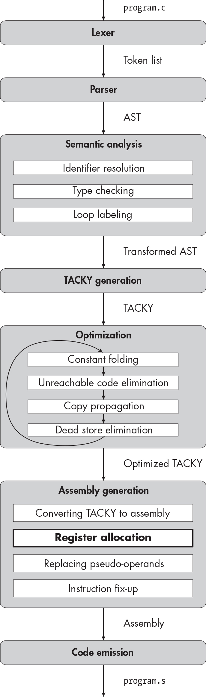

` ``Description`

## `20` `REGISTER ALLOCATION`

Up until now, you’ve allocated space for every pseudoregister on the stack. This strategy is simple but painfully inefficient. Because instructions can’t always operate on values in memory directly, you sometimes need to generate extra instructions to copy values between these stack locations and registers. Even worse, the assembly code you generate has to access memory constantly, even though registers are faster. Now you’ll solve those problems. You’ll finish up your compiler by adding a *register allocation* pass, bolded in the diagram at the start of the chapter, to assign pseudoregisters to hard registers instead of locations in memory. You’ll use graph coloring, a classic register allocation technique, to come up with this assignment.

Once the initial version of the register allocator is up and running, you’ll give it one more job: to clean up some of the unnecessary `mov` instructions produced during assembly generation. The final version of your allocator will perform *register coalescing* before assigning pseudoregisters to hard registers. The register coalescing step will look for `mov` instructions whose source and destination can be merged, or coalesced, into a single operand, which allows you to delete the instruction.

Register allocation has a little bit of everything: high-level theory, low-level details, brand-new concepts, and familiar techniques from earlier chapters. And the payoff is very satisfying: at the end of the chapter, you’ll be generating dramatically more efficient code. I think it’s a good note to end the book on.

To get started, let’s look at an example that illustrates why register allocation is such a powerful optimization.

### `Register Allocation in Action`

Consider the tiny C function in Listing 20-1.

    int f(int x, int y) {
        return 10 - (3 * y + x);
    }

`Listing 20-1: A tiny C function`

First, our compiler will turn this into the tiny TACKY function in Listing 20-2.

    f(x, y):
        tmp0 = 3 * y
        tmp1 = tmp0 + x
        tmp2 = 10 - tmp1
        Return(tmp2)

`Listing 20-2: The TACKY code for ``Listing 20-1`

This listing gives the definition of `f` after the optimization stage. (In particular, we’ve optimized out the extra `Return(0)` that we add to the end of each TACKY function as a backstop for missing `return` statements.)

Next, we’ll convert Listing 20-2 to the assembly code in Listing 20-3.

    f:
      ❶ movl    %edi, %x
        movl    %esi, %y
      ❷ movl    $3, %tmp0
        imull   %y, %tmp0
        movl    %tmp0, %tmp1
        addl    %x, %tmp1
        movl    $10, %tmp2
        subl    %tmp1, %tmp2
      ❸ movl    %tmp2, %eax
        ret

`Listing 20-3: The assembly code for ``Listing 20-2`

We set up the function’s parameters ❶, then we calculate `tmp0`, `tmp1`, and `tmp2` ❷. Finally, we return `tmp2` ❸. The operands `%x`, `%y`, `%tmp0`, `%tmp1`, and `%tmp2` in this listing refer to the corresponding pseudoregisters; I’ll use this notation throughout the chapter.

Now we’ll walk through three approaches to replacing these pseudoregisters with real operands. First, we’ll replace them with stack addresses, which is what our compiler does right now. On our next attempt, we’ll replace them with hard registers, without performing register coalescing first; this is what the initial version of our register allocator will do. The third time around, we’ll perform register coalescing before replacing the pseudoregisters with hard registers. That’s how our finished allocator will handle this program. (A quick note on terminology: throughout this chapter, I’ll use the word *register* to refer to pseudoregisters and hard registers collectively.)

#### `Take One: Put Everything on the Stack`

In its current form, our compiler will replace each pseudoregister with a stack slot according to Table 20-1.

`Table 20-1:` `Replacing Pseudoregisters with Stack Addresses`

| `Pseudoregister` | `Real location` |
|------------------|-----------------|
| `x`              | `-4(%rbp)`      |
| `y`              | `-8(%rbp)`      |
| `tmp0`           | `-12(%rbp)`     |
| `tmp1`           | `-16(%rbp)`     |
| `tmp2`           | `-20(%rbp)`     |

This will give us the assembly code in Listing 20-4.

    f:
        movl    %edi, -4(%rbp)
        movl    %esi, -8(%rbp)
        movl    $3, -12(%rbp)
      ❶ imull   -8(%rbp), -12(%rbp)
      ❷ movl    -12(%rbp), -16(%rbp)
      ❸ addl    -4(%rbp), -16(%rbp)
        movl    $10, -20(%rbp)
      ❹ subl    -16(%rbp), -20(%rbp)
        movl    -20(%rbp), %eax
        ret

`Listing 20-4: ``Listing 20-3`` after replacing pseudoregisters with stack addresses`

Once we replace every pseudoregister with a memory address, instructions ❶, ❷, ❸, and ❹ are invalid, so the instruction fix-up pass will need to repair them. It will insert an extra instruction before ❶ to load its destination into a hard register, and it will add another to store the result back to `-12(%rbp)` afterward. It will also insert instructions to load the source operands of ❷, ❸, and ❹ into hard registers. In the context of register allocation, we say a pseudoregister is *spilled* to memory if we store its contents on the stack instead of in a hard register. The extra instructions we insert to move spilled values between registers and memory are called *spill code*.

We’ll ultimately end up with the assembly code in Listing 20-5. I’ve bolded the spill code to make it easier to spot. (I’ve also snipped out the instructions to set up and tear down the stack frame, which aren’t relevant here. These are snipped out of assembly programs later in the chapter too.)

    f:
        --snip--
        movl    %edi, -4(%rbp)
        movl    %esi, -8(%rbp)
        movl    $3, -12(%rbp)
        movl    -12(%rbp), %r11d
        imull   -8(%rbp), %r11d
        movl    %r11d, -12(%rbp)
        movl    -12(%rbp), %r10d
        movl    %r10d, -16(%rbp)
        movl    -4(%rbp), %r10d
        addl    %r10d, -16(%rbp)
        movl    $10, -20(%rbp)
        movl    -16(%rbp), %r10d
        subl    %r10d, -20(%rbp)
        movl    -20(%rbp), %eax
        --snip--
        ret

`Listing 20-5: ``Listing 20-4`` with spill code`

This code is incredibly inefficient. Almost every instruction accesses memory, and we waste a huge amount of time copying data from one place to another. To take one particularly egregious example, we store the result of `3 * y` in `-12(%rbp)`, then immediately copy it into `-16(%rbp)`—which takes two `mov` instructions—and never use `-12(%rbp)` again.

#### `Take Two: Register Allocation`

Let’s try a more reasonable strategy. This time, we’ll replace each pseudoregister with a hard register instead of a stack address, as shown in Table 20-2.

`Table 20-2:` `Replacing Pseudoregisters with Hard Registers`

| `Pseudoregister` | `Real location` |
|------------------|-----------------|
| `x`              | `%edx`          |
| `y`              | `%ecx`          |
| `tmp0`           | `%r8d`          |
| `tmp1`           | `%r9d`          |
| `tmp2`           | `%edi`          |

We’ll replace `x`, `y`, `tmp0`, and `tmp1` with registers that don’t appear at all in the original assembly program. We’ll replace `tmp2` with EDI, which *is* used in the original program. This is fine, since we use `tmp2` only once we’re done using EDI for anything else. Later in the chapter, we’ll see how to reason more systematically about which mappings from pseudoregisters to hard registers are safe and which ones might cause conflicts.

There’s no spill code this time, so I won’t include separate listings from before and after the instruction fix-up pass. Instead, we’ll skip right to the final assembly code, shown in Listing 20-6.

    f:
        --snip--
        movl    %edi, %edx
        movl    %esi, %ecx
        movl    $3, %r8d
        imull   %ecx, %r8d
        movl    %r8d, %r9d
        addl    %edx, %r9d
        movl    $10, %edi
        subl    %r9d, %edi
        movl    %edi, %eax
        --snip--
        ret

`Listing 20-6: The final assembly code for ``Listing 20-3`` after register allocation`

This is a major improvement; we don’t access memory, and we have fewer instructions overall. If we wanted to, we could even omit the instructions to set up and tear down the stack frame, since we never use the stack. But we’re still moving data around more than we need to. For instance, we copy our function parameters from EDI and ESI to new locations, instead of leaving them where they are. We also copy `tmp0` (now in `%r8d`) to `tmp1` (now in `%r9d`), when we could just as easily use `tmp0` for two calculations in a row. This isn’t the register allocator’s fault; it’s just that we generated inefficient TACKY and assembly code in earlier passes. But if we’re thoughtful about how we allocate registers, we can clean up after those earlier passes. That’s why our register allocator will include one more step: register coalescing.

#### `Take Three: Register Allocation with Coalescing`

Our last approach has two steps. First, we’ll coalesce registers: we’ll look at each `mov` instruction in the function and decide whether its operands can be merged together. Then, we’ll replace any remaining pseudoregisters with hard registers, like we did in our previous attempt.

Let’s take another look at the original assembly program from Listing 20-3. This program includes four `mov` instructions whose source and destination are both registers, which are bolded here:

    f:
        movl    %edi, %x
        movl    %esi, %y
        movl    $3, %tmp0
        imull   %y, %tmp0
        movl    %tmp0, %tmp1
        addl    %x, %tmp1
        movl    $10, %tmp2
        subl    %tmp1, %tmp2
        movl    %tmp2, %eax
        ret

Sometimes, copying values from one register to another is genuinely necessary. For example, we might need to copy `x` out of EDI if we were going to pass another function argument in EDI later. But in this case, it’s safe to merge `x` into EDI, since we don’t need EDI for anything else after that first `mov` instruction. The same logic applies to each of the other three `mov` instructions. We won’t need to store different values in the source and destination operands at the same time, so it’s safe to merge them together. We’ll merge `x` into EDI, `y` into ESI, `tmp1` into `tmp0`, and `tmp2` into EAX.

Table 20-3 summarizes which pairs of registers we’ll coalesce and shows which member of each pair will remain in the program.

`Table 20-3:` `Coalescing Registers`

| `Coalesced pair` | `Remaining register` |
|------------------|----------------------|
| `%edi, %x`       | `%edi`               |
| `%esi, %y`       | `%esi`               |
| `%tmp0, %tmp1`   | `%tmp0`              |
| `%tmp2, %eax`    | `%eax`               |

We’ll also delete all four `mov` instructions, since they no longer serve any purpose. Listing 20-7 gives the resulting assembly code, with the updated operands bolded.

    f:
        movl    $3, %tmp0
        imull   %esi, %tmp0
        addl    %edi, %tmp0
        movl    $10, %eax
        subl    %tmp0, %eax
        ret

`Listing 20-7: ``Listing 20-3`` after register coalescing`

This looks a lot more reasonable! We leave `x` and `y` in EDI and ESI, where they were passed to begin with, instead of copying them to new locations. When we calculate the return value, we store the result in EAX right away, instead of copying it into EAX after we’ve calculated it. And we no longer use two separate temporary registers to calculate the intermediate and final results in `3 * y` `+` `x`; we stick with `tmp0` the whole time.

We’re not quite done; we still need to replace `tmp0` with a hard register. Any register besides ESI, EDI, or EAX will do—let’s go with ECX. Listing 20-8 shows the assembly code we’ll ultimately wind up with.

    f:
        --snip--
        movl    $3, %ecx
        imull   %esi, %ecx
        addl    %edi, %ecx
        movl    $10, %eax
        subl    %ecx, %eax
        --snip--
        ret

`Listing 20-8: The final assembly code for ``Listing 20-3`` after register allocation with coalescing`

Register allocation without coalescing improved our code in two ways: it reduced the number of memory accesses and the amount of spill code in our program. With register coalescing, we improve our code even further by removing the many unnecessary `mov` instructions generated by earlier passes.

Now that we have a sense of what we want to accomplish, let’s look at how register allocation fits into the whole compiler pipeline.

### `Updating the Compiler Pipeline`

Register allocators work best when there are lots of hard registers available, so the very first thing we’ll do is add every remaining hard register to the assembly AST, including the callee-saved registers that we’ve avoided so far. We’ll also make one small change to the conversion from TACKY to assembly: during this pass, we’ll store extra information in the backend symbol table about which hard registers each function uses to pass parameters and return values.

Next, we’ll implement the register allocator itself. The register allocator will run just after we convert the program from TACKY to assembly, before any of the other backend compiler passes. Much like the optimizations we implemented in Chapter 19, this pass will process each assembly function independently.

Even after register allocation, there may still be some pseudoregisters left in the program. This could happen for a couple of reasons. First, if a function uses lots of pseudoregisters at once, there might not be enough hard registers to accommodate all of them. When that happens, we’ll have to spill some pseudoregisters to memory. Our register allocator won’t replace spilled pseudoregisters; it will just leave them in the program for the next pass to deal with. Second, some pseudoregisters represent variables with static storage duration. These must live in memory instead of registers. If you completed Part II, you’ll encounter a few other objects that must live in memory, including aliased variables, structures, and arrays. The register allocator won’t touch these either.

To deal with all these stragglers, we’ll run our old pseudo-operand replacement pass immediately after the register allocator. We won’t make any changes to this pass. It will handle any pseudo-operands it finds exactly the same way it did before; it will just find a lot fewer of them.

Next, we’ll update the instruction fix-up pass to take care of saving and restoring callee-saved registers. All our existing rewrite rules—including the rules to generate spill code—will stay the same. Since we still replace some pseudoregisters with locations in memory, we’ll still have to generate spill code some of the time.

Finally, we’ll extend the code emission stage to support the new hard registers we introduce in this chapter. You might want to stub out the new register allocation stage at this point. Then, we’ll update the assembly AST one last time.

### `Extending the Assembly AST`

So far, the assembly AST has included only the registers that we used for a particular purpose, such as passing parameters or rewriting instructions. It doesn’t include any of the callee-saved registers: RBX, R12, R13, R14, and R15. Now we’ll add these five registers so the register allocator can use them. We’ll also add the `pop` instruction, which we’ll use to restore callee-saved registers at the end of a function. If you completed Part II, you should also add the remaining XMM registers, XMM8 through XMM13. These registers are not callee-saved.

Listing 20-9 shows the complete assembly AST that includes everything we covered in Parts I, II, and III, with this chapter’s additions bolded.

    program = Program(top_level*)
    assembly_type = Byte | Longword | Quadword | Double | ByteArray(int size, int alignment)
    top_level = Function(identifier name, bool global, instruction* instructions)
              | StaticVariable(identifier name, bool global, int alignment, static_init* init_list)
              | StaticConstant(identifier name, int alignment, static_init init)
    instruction = Mov(assembly_type, operand src, operand dst)
                | Movsx(assembly_type src_type, assembly_type dst_type, operand src, operand dst)
                | MovZeroExtend(assembly_type src_type, assembly_type dst_type,
                                operand src, operand dst)
                | Lea(operand src, operand dst)
                | Cvttsd2si(assembly_type dst_type, operand src, operand dst)
                | Cvtsi2sd(assembly_type src_type, operand src, operand dst)
                | Unary(unary_operator, assembly_type, operand)
                | Binary(binary_operator, assembly_type, operand, operand)
                | Cmp(assembly_type, operand, operand)
                | Idiv(assembly_type, operand)
                | Div(assembly_type, operand)
                | Cdq(assembly_type)
                | Jmp(identifier)
                | JmpCC(cond_code, identifier)
                | SetCC(cond_code, operand)
                | Label(identifier)
                | Push(operand)
                | Pop(reg)
                | Call(identifier)
                | Ret
    unary_operator = Neg | Not | Shr
    binary_operator = Add | Sub | Mult | DivDouble | And | Or | Xor | Shl | ShrTwoOp
    operand = Imm(int) | Reg(reg) | Pseudo(identifier) | Memory(reg, int) | Data(identifier, int)
            | PseudoMem(identifier, int) | Indexed(reg base, reg index, int scale)
    cond_code = E | NE | G | GE | L | LE | A | AE | B | BE
    reg = AX | BX | CX | DX | DI | SI | R8 | R9 | R10 | R11 | R12 | R13 | R14 | R15 | SP | BP
        | XMM0 | XMM1 | XMM2 | XMM3 | XMM4 | XMM5 | XMM6 | XMM7
        | XMM8 | XMM9 | XMM10 | XMM11 | XMM12 | XMM13 | XMM14 | XMM15

`Listing 20-9: The complete assembly AST with the` `pop` `instruction and additional registers`

Note that `pop` accepts only registers, not other operands. Now that we’ve updated the AST, let’s move on to the conversion from TACKY to assembly.

### `Converting TACKY to Assembly`

We’ll make just one change to this pass. We aren’t changing what assembly we generate; we’re just recording extra information in the backend symbol table. Specifically, we’ll record which registers are used to pass each function’s parameters. As you’ll see in the next section, the register allocator needs this information to figure out which hard registers and pseudoregisters conflict.

Suppose we have the following function declaration:

    int foo(int i, int j);

We’ll record that `foo`’s parameters are passed in the first two parameter passing registers, RDI and RSI. We’ll track this information even if `foo` is defined in a different translation unit, because we’ll need it to allocate registers in functions that call `foo`.

If you completed Part II, you should also track which registers are used to pass each function’s return value. Given the function declaration

    double foo(int i, double d);

we’ll record that `foo`’s parameters are passed in RDI and XMM0 and that its return value is also passed in XMM0. To figure out which registers a function uses to pass parameters and return values, we’ll use the same logic we implemented in the `classify_parameters` and `classify_return_value` helper functions in Chapter 18. Note that we might run into function declarations with incomplete return types or parameter types. It doesn’t matter what information we record about these functions, since it would be illegal to either define or call them in the current translation unit; we just need to handle them without crashing. It’s easiest to simply record that they don’t pass any values in registers.

Next, we’ll build the register allocator itself.

### `Register Allocation by Graph Coloring`

Our compiler will model register allocation as a *graph coloring* problem. Coloring a graph means assigning every node a label (traditionally called a “color”) so that each node has a different color from all its neighbors. A graph is *k-colorable* if you can color it with *k* or fewer colors. Figure 20-1 illustrates a 3-colored graph.

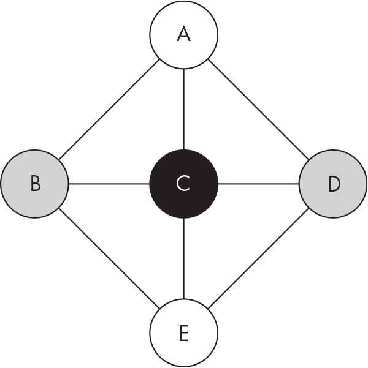

`Figure 20-1: A 3-colored graph ``Description`

Graph coloring is an important area of research in its own right; mathematicians have been investigating how to color graphs since the 19th century! It’s relevant to register allocation because it captures two fundamental constraints on how we can assign pseudoregisters to hard registers: we have a limited number of hard registers to work with, and some registers will *interfere* with each other, meaning they can’t occupy the same physical location. If two pseudoregisters interfere, we need to assign them to two different hard registers. A pseudoregister might also interfere with a hard register, which means we can’t assign it to that hard register.

Graph coloring lets us express both kinds of interference and handle them in a uniform way. To turn register allocation into a graph coloring problem, we’ll first build a *register interference graph* with nodes representing pseudoregisters and hard registers and with edges between any registers that interfere. Then, we’ll color the graph, using one color per hard register. Finally, we’ll assign each pseudoregister to a hard register according to its color. Because each register gets a different color from all of its neighbors, we’ll never assign two pseudoregisters that interfere to the same hard register or assign a pseudoregister to a hard register that it interferes with.

Let’s try out this technique on the assembly function in Listing 20-10.

    divide_and_subtract:
      ❶ movl    %edi, %a
      ❷ movl    %esi, %b
        movl    %a, %eax
      ❸ cdq
        idivl   %b
      ❹ movl    %eax, %tmp
        subl    %b, %tmp
        movl    %tmp, %eax
        ret

`Listing 20-10: A small assembly function`

This function takes two parameters, which it copies into the pseudoregisters `a` and `b`. It calculates `a / b - b` and stores the result in `tmp`. Finally, it returns the value of `tmp` in EAX. We need to figure out which registers in this function interfere so we can build the interference graph. To start off, it’s easy to see that `a` and `b` interfere. If we map them to the same hard register, we’ll clobber `a` when we define `b` ❷. This is a problem because `a` is still live at this point. You learned in Chapter 19 that a variable is live if its current value might be used later in the program, and otherwise it’s dead. This definition applies to registers too. When a register is live, we need to preserve its value, so we can’t store a different value in the same location. When it’s dead, we’re free to overwrite its value with something else. This gives us an easy rule for detecting interference: two registers interfere if we update one while the other is live.

This rule also tells us that `b` interferes with `tmp`, since `b` is live when we define `tmp` ❹. But `a` and `tmp` don’t interfere; `a` is already dead by the time we define `tmp`, so it’s fine to map them to the same hard register.

Now let’s think through which hard registers interfere with pseudoregisters. ESI interferes with `a` because ESI is live when we define `a` ❶. If we mapped `a` to ESI, we’d clobber the function’s second parameter before we had a chance to copy it to `b`. EAX interferes with `b` because `b` is live when we copy `a` to EAX to prepare for division. The last source of interference is less obvious. Remember that the `cdq` instruction sign extends the value from EAX into EDX ❸. Because `cdq` implicitly updates EDX while `b` is live, it makes EDX interfere with `b`; if we mapped `b` to EDX, this instruction would clobber it. (Similarly, the `idiv` instruction updates EAX and EDX implicitly, so it would make both of these registers interfere with `b` if they didn’t already.)

Finally, the hard registers all interfere with each other. This is sort of tautological; they can’t occupy the same physical location because they represent different physical locations to begin with. Still, we need to capture this in the interference graph to make sure that each hard register gets its own color.

Now that we’ve figured out which registers interfere, we’ll construct the graph. To keep this graph relatively small and readable, we’ll pretend that the only hard registers are EDI, ESI, EAX, and EDX. Our real register interference graphs will include every hard register we can assign pseudoregisters to, even if the assembly program doesn’t use them. However, they’ll exclude RSP, RBP, and the scratch registers that we use during instruction fix-up.

Figure 20-2 illustrates the interference graph for the function in Listing 20-10.

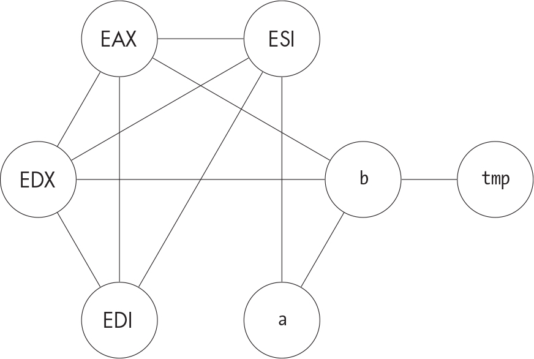

`Figure 20-2: The register interference graph for divide_and_subtract ``Description`

This graph encodes all the interferences we just identified: `a` interferes with ESI and `b`; `b` interferes with `tmp`, EAX, and EDX as well as `a`; and all four hard registers interfere with each other.

Now we’ll try to *k*-color this graph, where *k* is the number of hard registers in the graph. In this small example, *k* is 4. There are several possible 4-colorings of Figure 20-2. Figure 20-3 shows a few of them.

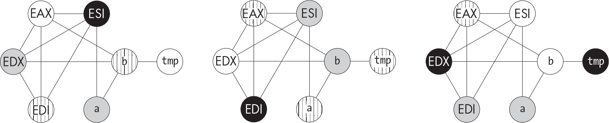

`Figure 20-3: Three valid 4-colorings of the register interference graph for divide_and_subtract ``Description`

Any one of these colorings—or any other 4-coloring we can come up with—will give us a valid register assignment. Each register will receive a different color from any of its neighbors. And because the *k* hard registers all interfere with each other, we’ll assign each color to exactly one hard register, which creates a 1:1 mapping from colors to hard registers.

After we color the graph, we’ll replace each pseudoregister with the hard register that received the same color. If we use the first coloring from Figure 20-3, we’ll replace `a` with EDX, `b` with EDI, and `tmp` with EAX, which gives us the assembly code in Listing 20-11.

    divide_and_subtract:
        movl    %edi, %edx
        movl    %esi, %edi
        movl    %edx, %eax
        cdq
        idivl   %edi
        movl    %eax, %eax
        subl    %edi, %eax
        movl    %eax, %eax
        ret

`Listing 20-11: Replacing registers in` `divide_and_subtract` `based on the first coloring in ``Figure 20-3`

If you like, you can work through this listing and confirm that it produces the same result as the original code for `divide_and_subtract` in Listing 20-10. You can also try this out with the other colorings in Figure 20-3.

Note that coloring the graph produces two different mappings: one from all registers to colors and one from colors to hard registers. Conceptually, each color represents a hard register, but we don’t know *which* hard register until after we’ve colored the graph. If instead we used the names of the hard registers themselves as colors, or associated each hard register with a color ahead of time, then we would have to *precolor* each hard register with the corresponding color before we tried to color the rest of the graph. Precoloring adds more constraints to the graph coloring problem, which makes it harder to find a valid coloring. Some graph coloring implementations require precolored nodes; luckily, ours isn’t one of them.

`USING LIVE RANGES INSTEAD OF PSEUDOREGISTERS`

`Our register allocator will map pseudoregisters to hard registers. Most register allocators, however, solve a slightly different problem: they map` `live ranges` `to hard registers. A live range is a region of the program in which a particular pseudoregister is live. A single pseudoregister may have multiple live ranges (that is, it may be live in several unconnected regions of a program). These live` `ranges can safely be assigned to different hard registers. Here’s a simple, if unrealistic, example:`

    two_live_ranges:
      ❶ movl    $1, %x
        addl    %x, var(%rip)
      ❷ movl    $2, %x
        movl    %x, %eax
        ret

`In this example,` `x` `has two live ranges. The first starts when we define` `x` ❶ `and ends after we add it to the static variable` `var` `in the next instruction. The second starts when we redefine` `x` ❷ `and ends after we use it in the instruction right after that. Let’s rewrite the program to refer to these live ranges explicitly:`

    two_live_ranges:
        movl    $1, %x.1
        addl    %x.1, var(%rip)
        movl    $2, %x.2
        movl    %x.2, %eax
        ret

`Now it’s clear that we don’t need to assign` `x.1` `and` `x.2` `to the same hard register. A typical register allocator starts by identifying the distinct live ranges for each pseudoregister and giving each one its own name, like we just did for` `two_live_ranges``. It then uses these live ranges, rather than pseudoregisters, as nodes in the interference graph. This puts fewer constraints on where the allocator can place each live range, which makes it easier to find a valid register assignment.`

`We’re building a simplified register allocator that doesn’t identify live ranges, so we’ll just use pseudoregisters from the original assembly code as nodes in the interference graph. (Confusingly, identifying live ranges isn’t quite the same as` `liveness analysis``, which we discussed in ``Chapter 19``. Our allocator will perform liveness analysis to learn when each register is live, but identifying live ranges is a more involved process in which liveness analysis is just the first step.)`

`If you want to build a more sophisticated register allocator that works with live ranges instead of pseudoregisters, you’ll find a few useful references listed in “Additional Resources” on ``page 669``.`

#### `Detecting Interference`

Earlier, I said that two registers interfered if we updated one while the other was live. We used this rule to figure out which registers interfered in `divide _and_subtract`; it helped us identify both interference between pseudoregisters and interference between pseudoregisters and hard registers. But there are a couple of important points about this rule that we still need to cover.

The first point is that two registers interfere only if one is live *immediately after* we update the other. Here’s a short example:

    movl    4(%rdi), %x
    movl    %x, %eax
    ret

In this code snippet, RDI holds some memory address—presumably the address of a structure or array. The first instruction in this snippet takes the value stored in memory at RDI + 4 and copies it into `x`. Before this instruction, RDI is live; afterward, it’s dead. RDI and `x` don’t interfere. If we map `x` to RDI, the first `mov` instruction will overwrite the address in RDI. But that’s okay, because we won’t use that address again.

The second point is that two registers interfere only if they have different values. Concretely, this means the instruction `mov src, dst` won’t make `src` and `dst` interfere, even if `src` is still live afterward. In Listing 20-12, for example, `x` and `y` don’t interfere.

    movl    $1, %y
    movl    %y, %x
    addl    %x, %ecx
    addl    %y, %eax

`Listing 20-12: A snippet of assembly where the source operand of a` `mov` `instruction is still live after that instruction`

If we assign `x` and `y` to the same hard register, the second `mov` instruction won’t clobber `x` with a new value. Instead, it will have no effect at all. When we perform register coalescing, we’ll even go out of our way to put `x` and `y` in the same register so that we can delete this instruction entirely.

Two registers connected by a `mov` instruction could still interfere for other reasons, as Listing 20-13 demonstrates.

    movl    $1, %y
    movl    %y, %x
    addl    $1, %y
    addl    %x, %y

`Listing 20-13: A snippet of assembly where a later instruction makes the operands of a` `mov` `instruction interfere`

In this snippet, the second `mov` instruction doesn’t make `x` and `y` interfere, but the subsequent `add` instruction does, because it updates `y` while `x` is live. In this case, putting `x` and `y` in the same register would be unsafe.

#### `Spilling Registers`

We can’t always *k*-color the interference graph. Consider the assembly function in Listing 20-14, which calculates `10 / arg1` `+` `arg1 / arg2`.

    uncolorable:
        movl    %edi, %arg1
        movl    %esi, %arg2
        movl    $10, %eax
        cdq
        idivl   %arg1
        movl    %eax, %tmp
        movl    %arg1, %eax
        cdq
        idivl   %arg2
        addl    %tmp, %eax
        ret

`Listing 20-14: Calculating` `10 / arg1 + arg1 / arg2`

For the purpose of this example, we’ll pretend that we have four hardware registers: ESI, EDI, EDX, and EAX. Figure 20-4 shows the interference graph for the listing. I won’t walk you through how to construct the graph, but you can verify it on your own if you like.

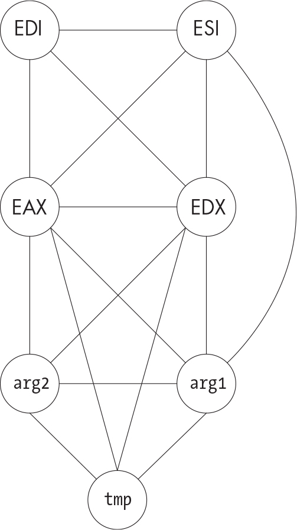

`Figure 20-4: The interference graph for ``Listing 20-14`` ``Description`

It’s impossible to 4-color this graph. Note that EAX, EDX, `arg1`, `arg2`, and `tmp` all interfere with each other. That means each of them must receive a different color than the other four, which would require five distinct colors. We’ll solve this problem by spilling a register—in other words, removing it from the graph instead of coloring it. Spilling any one of `arg1`, `arg2`, or `tmp` will make the graph colorable. If we spill `tmp`, for example, we can use the coloring shown in Figure 20-5.

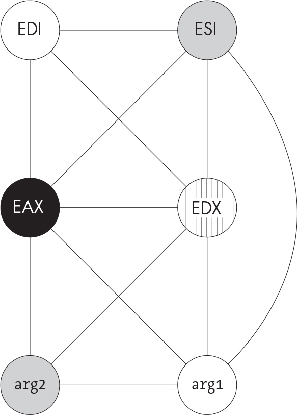

`Figure 20-5: Coloring the interference graph after spilling tmp ``Description`

Now we can replace the two pseudoregisters that we colored, but not `tmp`. Listing 20-15 gives the resulting assembly code, with changes from Listing 20-14 bolded.

    uncolorable:
        movl    %edi, %edi
        movl    %esi, %esi
        movl    $10, %eax
        cdq
        idivl   %edi
        movl    %eax, %tmp
        movl    %edi, %eax
        cdq
        idivl   %esi
        addl    %tmp, %eax
        ret

`Listing 20-15: The` `uncolorable` `function after register allocation`

Note that we’ve made the first two instructions in this listing redundant. We could optimize the code further by deleting them, but we won’t worry about this optimization for now.

After the register allocator has assigned `arg1` and `arg2` to hard registers, the pseudo-operand replacement pass will put `tmp` on the stack. Listing 20-16 gives the final assembly code for this function, with the changes from Listing 20-15 bolded.

    uncolorable:
        --snip--
        movl    %edi, %edi
        movl    %esi, %esi
        movl    $10, %eax
        cdq
        idivl   %edi
        movl    %eax, -4(%rbp)
        movl    %edi, %eax
        cdq
        idivl   %esi
        addl    -4(%rbp), %eax
        --snip--
        ret

`Listing 20-16: The final assembly code for` `uncolorable`

Spilling one pseudoregister made it possible to replace all the others with hard registers. But *which* registers we decide to spill matters a lot! As a general rule, the more frequently a pseudoregister is accessed, the more it will hurt performance to spill that pseudoregister. Our allocator will calculate a *spill cost* for each register in the interference graph. This is an estimate of how much spilling that register will hurt performance. Then, when we color the graph, we’ll use that information to minimize the overall performance impact of spills.

### `The Basic Register Allocator`

Now that we have some idea of how our register allocator will work, let’s implement it! Listing 20-17 describes how to allocate registers for a single function.

    allocate_registers(instructions):
        interference_graph = build_graph(instructions)
        add_spill_costs(interference_graph, instructions)
        color_graph(interference_graph)
        register_map = create_register_map(interference_graph)
        transformed_instructions = replace_pseudoregs(instructions, register_map)
        return transformed_instructions

`Listing 20-17: The top-level register allocation algorithm`

We start by building the interference graph. Then, we calculate a spill cost for each register based on how frequently it’s used and annotate the graph with that information. Next, we color the graph, annotating each node with its color. If we can’t color every node, we’ll use the spill costs we calculated in the previous step to decide what to spill. To spill a node, we’ll just leave it uncolored.

The last step is replacing all the pseudoregisters we colored. In `create _register_map`, we construct a map from colored pseudoregisters to hard registers with the same color. Finally, we rewrite the body of the function, replacing each pseudoregister with the corresponding hard register from the map.

Go ahead and stub out `allocate_registers`. Then, we’ll walk through how to implement each of these steps.

#### `Handling Multiple Types During Register Allocation`

If you completed Part II, then you’ll need to run the whole algorithm in Listing 20-17 twice: once to allocate general-purpose registers and once to allocate XMM registers. On each run, you’ll include only registers of the appropriate type in the interference graph. The new features we added in Part II will change a few other details about how we build the interference graph too. We’ll take a closer look at these changes when we implement `build_graph`.

The individual steps after building the interference graph—including calculating spill costs, coloring the graph, and replacing pseudoregisters—look exactly the same whether we’re dealing with floating-point or general-purpose registers. The other features we added in Part II won’t impact these steps either.

#### `Defining the Interference Graph`

To get started, we’ll define the data structure for the interference graph. Listing 20-18 presents one possible representation.

    node = Node(operand id, operand* neighbors, double spill_cost, int? color, bool pruned)
    graph = Graph(node* nodes)

`Listing 20-18: The definition of the register interference graph`

Each node in the graph corresponds to a `Pseudo` or `Register` operand from the assembly AST. We’ll track each node’s neighbors, spill cost, and color. We’ll represent colors with the integers `1` through `k`, where *k* is the number of available hard registers. The `color` field is optional because we may not be able to color every node. We’ll use the `pruned` flag when we color the graph; you can ignore it until then. When you create a new node, you should initialize `spill_cost` to `0.0`, `color` to `null`, and `pruned` to `False`.

This definition of `node` is a bit more permissive than it needs to be; the `operand` type includes constants and memory locations, which we’ll never add to the interference graph. Alternatively, you could replace `operand` with a dedicated `node_id` type that can represent only registers. I’m using a more permissive definition so that we don’t have to constantly convert back and forth between `operand` and `node_id` throughout the allocator.

#### `Building the Interference Graph`

We’re finally ready to build the interference graph! First, we’ll walk through an implementation of `build_graph` that supports the assembly AST from Part I. Then, we’ll discuss how to modify it to support the assembly AST from Part II.

Since building this graph is a fairly involved process, we’ll break it down into several steps. Listing 20-19 illustrates these steps in pseudocode.

    build_graph(instructions):
      ❶ interference_graph = base_graph
      ❷ add_pseudoregisters(interference_graph, instructions)
        cfg = make_control_flow_graph(instructions)
      ❸ analyze_liveness(cfg)
      ❹ add_edges(cfg, interference_graph)
        return interference_graph

`Listing 20-19: Building the interference graph`

We’ll start with a graph that includes every hard register ❶. (As far as I know, there’s no standard term for this graph, so I’ll call it the *base graph*.) Next, we’ll insert a node for each pseudoregister that appears in the function ❷. Finally, we’ll figure out which registers interfere with each other. Since this depends on which registers are live at each point, we’ll need to run liveness analysis on our assembly code. Just like in Chapter 19, this analysis will take a control-flow graph (which is different from the interference graph!) and annotate it with liveness information ❸. Finally, we’ll use that information to figure out which edges to add to the interference graph ❹. Let’s take a closer look at each of these steps.

##### `The Base Graph`

The base graph, shown in Figure 20-6, includes 12 registers: RAX, RBX, RCX, RDX, RDI, RSI, R8, R9, R12, R13, R14, and R15.

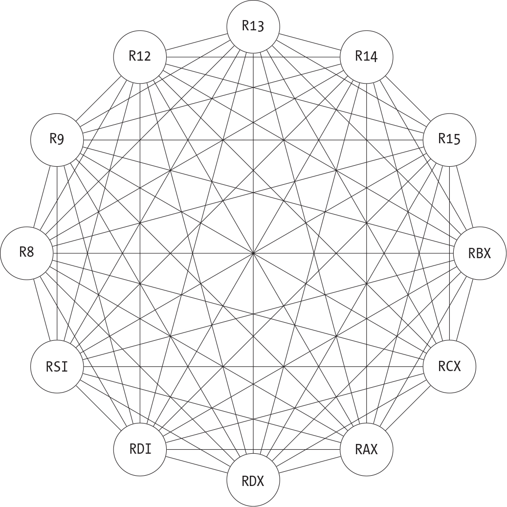

`Figure 20-6: The base register interference graph ``Description`

We won’t include RSP or RBP in the graph because we’re already using them to manage the stack frame, and we won’t include R10 or R11 because we’ll need them in the instruction fix-up pass. Since the hard registers all interfere with each other, the base graph includes an edge between each pair of nodes. In graph theory jargon, this makes the base graph a *complete graph*.

> `NOTE`

*Because the example programs in this chapter deal with 4-byte pseudoregisters, most of the diagrams of interference graphs use 4-byte aliases for hard registers. I’ve used 8-byte aliases in Figure 20-6, since it represents the base graph you’ll use for all programs rather than the interference graph for any specific program. The interference graphs we actually construct will represent hard registers using reg assembly AST nodes, which don’t specify a size.*

##### `Adding Pseudoregisters to the Graph`

This bit is straightforward: we just loop over every operand in every instruction and decide whether to add it to the graph. Every pseudoregister that appears in the assembly function should go in the graph, unless it has static storage duration. I’ll skip the pseudocode for `add_pseudoregisters` because there’s not a lot to it.

##### `Liveness Analysis`

We already know how liveness analysis works, since we implemented it back in Chapter 19. Now we’ll need a new implementation that analyzes assembly instead of TACKY and tracks registers instead of variables. Luckily, the basic logic is the same. We can even reuse some of our existing code.

First, we’ll construct a control-flow graph. This works just like building a control-flow graph from a TACKY function; only the specific instructions at the boundaries between basic blocks are different. Instead of looking for TACKY control-flow instructions like `Label`, `Return`, `Jump`, `JumpIfZero`, and `JumpIfNotZero`, we’ll look for their assembly equivalents: the assembly `Label` instruction, `Ret`, `Jmp`, and `JmpCC`. You’ve already written code to convert TACKY into a control-flow graph; ideally, you’ll be able to refactor it to handle assembly too.

Next, we’ll look at the three components of liveness analysis itself: the iterative algorithm, the meet operator, and the transfer function. The iterative algorithm is exactly the same as in Chapter 19, so you should be able to use the implementation of this algorithm that you already wrote.

We’ll use set union as our meet operator, just like we did before. However, we’ll handle the `EXIT` node in the control-flow graph differently. Our original meet operator assumed that static variables were live when a function exited. Now we don’t care about static variables, because they’re not in the interference graph. Instead, we have to worry about hard registers: specifically EAX, which holds the function’s return value. Listing 20-20 defines our new meet operator, with the one change from the original meet operator defined in Listing 19-24 in bold.

    meet(block):
        live_registers = {}
        for succ_id in block.successors:
            match succ_id with
            | EXIT -> live_registers.add(Reg(AX))
            | ENTRY -> fail("Malformed control-flow graph")
            | BlockId(id) ->
                succ_live_registers = get_block_annotation(succ_id)
                live_registers.add_all(succ_live_registers)

        return live_registers

`Listing 20-20: The meet operator for liveness analysis of assembly code`

We’re ignoring the fact that the callee-saved registers are *also* live at `EXIT`. We can get away with this because the instruction fix-up pass will spill these registers if we end up using them; that is, it will save their values onto the stack at the start of the function and restore them before we return. Assuming that these registers are dead at `EXIT` makes it possible to actually use them. If we added them to the set of live registers here, we’d conclude that they were live throughout the whole function and interfered with every single pseudoregister.

The transfer function is the one part of liveness analysis that differs significantly from the previous chapter. The basic idea is the same: we add registers to the live set when they’re used and remove them when they’re updated. But the specifics are different because we’re working with a different set of instructions than we were before.

First, let’s write a helper function, `find_used_and_updated`, that tells us which operands each instruction uses and updates. Both the transfer function and the `add_edges` function that we’ll implement next will use this helper function. Listing 20-21 gives the pseudocode for `find_used_and_updated`.

    find_used_and_updated(instruction):
        match instruction with
        | Mov(src, dst) -> ❶
            used = [src]
            updated = [dst]
        | Binary(op, src, dst) -> ❷
            used = [src, dst]
            updated = [dst]
        | Unary(op, dst) ->
            used = [dst]
            updated = [dst]
        | Cmp(v1, v2) ->
            used = [v1, v2]
            updated = []
        | SetCC(cond, dst) ->
            used = []
            updated = [dst]
        | Push(v) ->
            used = [v]
            updated = []
        | Idiv(divisor) ->
            used = [divisor, Reg(AX), Reg(DX)]
            updated = [Reg(AX), Reg(DX)]
        | Cdq ->
            used = [Reg(AX)]
            updated = [Reg(DX)]
        | Call(f) ->
            used = <look up parameter passing registers in the backend symbol table> ❸
            updated = [Reg(DI), Reg(SI), Reg(DX), Reg(CX), Reg(R8), Reg(R9), Reg(AX)]
        | _ ->
            used = []
            updated = []
        return (used, updated)

`Listing 20-21: Identifying the operands used and updated by each instruction`

Keep in mind that this listing covers only the assembly instructions from Part I. `Mov` is the most straightforward case: it uses its source and updates its destination ❶. A binary instruction like `add src, dst` uses its source and destination and updates its destination ❷. It’s also easy to see which operands the `Unary`, `Cmp`, `SetCC`, and `Push` instructions read and update.

Some instructions use registers that they don’t mention explicitly. `Idiv` divides the value stored in the EAX and EDX registers by its source operand, so it uses all three values. It stores its results in EAX and EDX, so it updates those two registers. `Cdq` sign extends EAX into EDX, which means it uses EAX and updates EDX.

`Call` uses the registers that hold the callee’s parameters; we can look these up in the backend symbol table, where we recorded them during the assembly generation pass ❸. It updates all the caller-saved registers—whether we’re passing the callee’s parameters in them or not—since these may be clobbered by the callee. This makes all the caller-saved registers interfere with any pseudoregisters that are live when we call this function, so our graph coloring algorithm will assign these pseudoregisters to callee-saved registers instead.

If an instruction both uses and updates the same register—like a `Binary` instruction both uses and updates its destination, for example—it’s important to include that register in both the `used` and `updated` lists. In the transfer function, we’ll only care that the register is used, since that will make it live. But when we use this helper function again in `add_edges`, we’ll only care that the register is updated, since that will make it interfere with any other registers that are live at the same time.

Now we can write the transfer function, which is defined in Listing 20-22.

    transfer(block, end_live_registers):
        current_live_registers = end_live_registers

        for instruction in reverse(block.instructions):
          ❶ annotate_instruction(instruction, current_live_registers)
          ❷ used, updated = find_used_and_updated(instruction)
            for v in updated:
                if v is a register:
                    current_live_registers.remove(v)

            for v in used:
                if v is a register:
                    current_live_registers.add(v)

      ❸ annotate_block(block.id, current_live_registers)

`Listing 20-22: The transfer function for liveness analysis in assembly`

Since this is a backward analysis, we analyze the assembly instructions in reverse order. To process an instruction, we first record which registers are live immediately after it ❶. Then, we calculate which registers are live just before it. We call the helper function we just wrote to figure out what operands it uses and updates ❷. We then remove any registers it updates from the set of current live registers, and we add any registers it uses. (If an instruction uses and updates the same register, we’ll remove that register from the set of live registers and then immediately add it again.) Once we’ve processed every instruction, we record which registers are live at the start of the block ❸.

We won’t track constants and memory operands, but our set of live registers might still include some operands that we don’t care about (specifically, pseudoregisters with static storage duration). There’s no harm in including them in our liveness results; we’ll just ignore them when we use those results in the next step.

##### `Adding Edges`

With liveness information in hand, we can finally figure out which edges to add to the graph. Listing 20-23 gives the pseudocode for this step.

    add_edges(liveness_cfg, interference_graph):
        for node in liveness_cfg.nodes:
            if node is EntryNode or ExitNode:
                continue

            for instr in node.instructions:
                used, updated = find_used_and_updated(instr)

              ❶ live_registers = get_instruction_annotation(instr)

                for l in live_registers:
                  ❷ if (instr is Mov) and (l == instr.src):
                        continue

                    for u in updated:
                      ❸ if (l and u are in interference_graph) and (l != u):
                            add_edge(interference_graph, l, u)

`Listing 20-23: Adding edges to the interference graph`

We learned earlier that two registers interfere if one is updated while the other is live. Now we’ll look at each instruction and figure out which interferences it creates. To process a single instruction, we’ll first call `find_used_and_updated` to look up what operands it updates. (We’ll ignore the first list this function returns, `used`, because don’t care what operands the instruction uses.) Next, we’ll look up which registers are live immediately after the instruction ❶.

We then add an edge between each register in `live_registers` and each register in `updated`. The `Mov` instruction is a special case. If the current instruction is a `Mov`, we’ll skip over its source as we iterate over the set of live registers so that we don’t add an edge between its source and destination ❷.

Before we add an edge between two nodes, we’ll make sure that both nodes are already in the interference graph. We’ll also make sure that they’re different, since we don’t want to add an edge from a node to itself ❸.

##### `Handling Other Types While Constructing the Graph`

Now we’ll deal with all the features we added in Part II. Since we allocate XMM and general-purpose registers separately, we’ll build two interference graphs. We’ll start with a separate base graph for each register class. The base graph for XMM registers should have 14 nodes; it will include XMM0 through XMM13, but not the scratch registers XMM14 and XMM15. In `add_pseudoregisters`, we’ll check that a pseudoregister has the correct type before adding it to the graph. When we allocate XMM registers, we’ll add only pseudoregisters of `Double` type to the graph. When we allocate general-purpose registers, we’ll exclude `Double` pseudoregisters and include all the other scalar types: `Longword`, `Quadword`, and `Byte`.

Floating-point registers aside, there are a few other details we need to change. We’ll exclude aliased pseudoregisters from the graph, since they shouldn’t be assigned to registers. You can reuse the previous chapter’s address-taken analysis here; just rerun the analysis immediately before converting the program from TACKY to assembly. If a variable was aliased in the TACKY program, it will still be aliased in assembly.

Liveness analysis should reflect the new calling conventions we implemented in Part II. The `meet` function can’t assume that EAX is live when the function exits; it should check the backend symbol table to learn which registers the function uses to pass its return value. These registers will all be live at `EXIT`.

We’ll also update the `find_used_and_updated` helper function. First, this function needs to handle the `Memory` and `Indexed` operands correctly. These operands designate locations in memory, but they use registers in their address calculations. When we use one of these operands, we *read* any registers it refers to, even if we *write* to the memory location it designates. For example, the instruction `movl $1, 4(%rax)` uses RAX instead of updating it, and the instruction `leaq (%rax, %rcx, 4), %rdi` uses both RAX and RCX but updates RDI. Second, `find_used_and_updated` must recognize that all the XMM registers are caller-saved and therefore updated by `Call` instructions. Finally, this function will need to handle all the new assembly instructions we added in Part II, but there’s nothing particularly tricky about them.

#### `Calculating Spill Costs`

After constructing the graph, we annotate each register with a spill cost. If we can’t color every node in the graph, these costs will help us decide which node (or nodes) to spill. We’ll try to color the graph in a way that minimizes the total cost of all spilled nodes.

Since we can’t spill hard registers, we assign each of them an infinite spill cost. To estimate the spill cost of each pseudoregister, we just count up the number of times it appears in our assembly code. For example, if we encounter the instruction `movl $1, %x`, we increase `x`’s spill cost by one. If we see the instruction `addl %x, %x`, we increase `x`’s spill cost by two. The rationale here is that the more often a pseudoregister is used, the more memory accesses and new instructions we’ll introduce if we spill it.

Frankly, this is a lousy way to calculate spill cost. It ignores the basic fact that some instructions are executed more frequently than others. Clearly, using a pseudoregister inside a loop that executes a million times should increase its spill cost a lot more than using it in an instruction that runs just once. It’s hard to predict exactly how many times a particular instruction will execute, but one approach is to use loop nesting depth as a rough proxy for execution frequency. When compilers that take this approach calculate spill costs, they give more weight to instructions in more deeply nested loops.

Unfortunately, we have no idea where the loops in our program are. Discovering loops would require us to implement a whole new type of analysis, and this chapter is long enough. I’ve included a couple of references about identifying loops in “Additional Resources” on page 669 in case you want to implement this analysis on your own.

#### `Coloring the Interference Graph`

It’s time to color the graph! Our goal is to minimize the total spill cost of the nodes we leave uncolored (ideally by coloring every node so that the total spill cost is zero). But exact graph coloring algorithms, which find the best possible coloring, are too slow to use in practice. Instead, we’ll use an approximate algorithm. This algorithm may not find the best coloring, but it can usually find a pretty good one.

Our graph coloring algorithm is based on a simple observation: you can always color a node with fewer than *k* neighbors, because there’s always at least one color that none of its neighbors uses. This observation is called the *degree \<* k *rule*. (The number of neighbors a node has is called its *degree*; we say that a node has *significant degree* if it has *k* or more neighbors.) The degree \< *k* rule gives us a way to break down the problem. First, we’ll temporarily remove any node with fewer than *k* neighbors. This is called *pruning* the graph. Then, we’ll color the rest of the graph somehow (we won’t worry about how to do this just yet). Finally, we’ll put back the nodes that we pruned, one at a time. When we put back a node, we’ll assign it some color that doesn’t conflict with any neighbors that we’ve already colored. There will always be at least one available color, since each node has fewer than *k* neighbors.

Let’s try to 3-color the graph shown in Figure 20-7 using this approach and see how far we get.

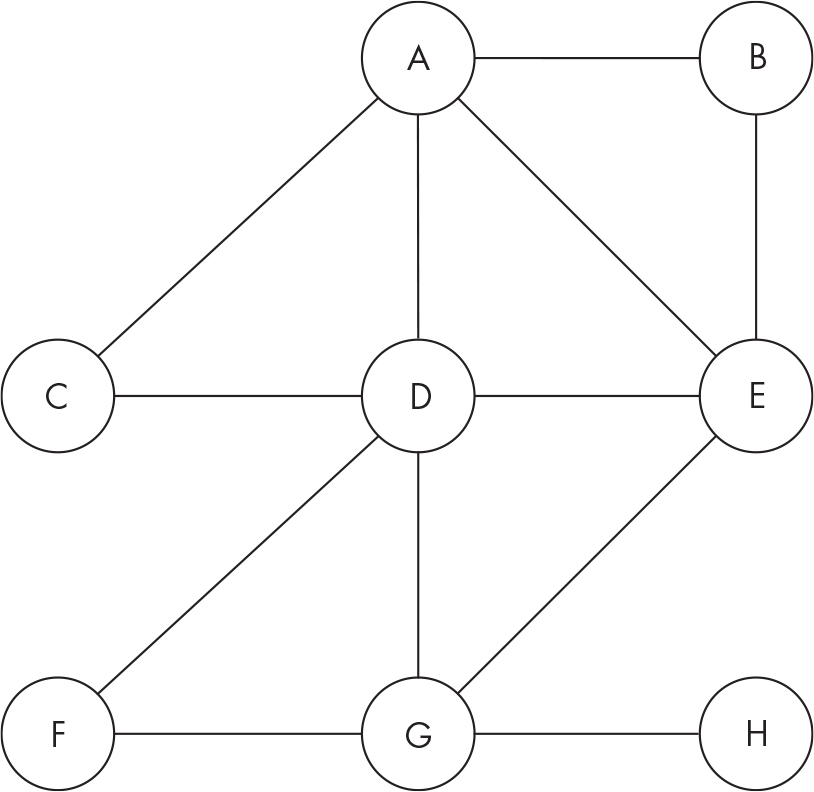

`Figure 20-7: A graph that hasn’t been colored yet ``Description`

This graph has four nodes with fewer than three neighbors: *B*, *C*, *F*, and *H*. We’ll prune these nodes from the graph and then figure out how to color the smaller graph. We’ll also define a stack to keep track of the pruned nodes that we’ll eventually need to put back in the graph. Figure 20-8 shows the pruned graph and the stack.

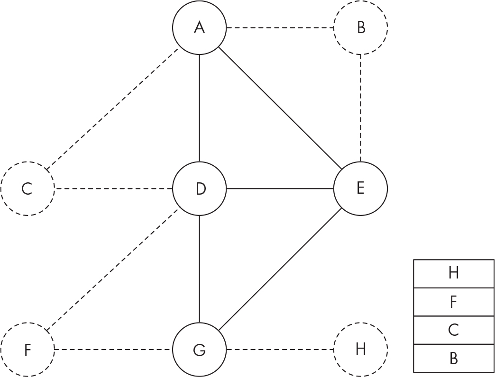

`Figure 20-8: The graph from ``Figure 20-7`` with low-degree nodes removed ``Description`

In this pruned graph, *A* and *G* both have fewer than three neighbors. That means we can apply the same trick to prune the graph again! We’ll push *A* and *G* onto the top of the stack; later on, we’ll pop them off and color them before we color *B*, *C*, *F*, and *H*. When we pop *A* and *G* off the stack and put them back in the graph, they’ll have the same degree they do now, so we know we’ll be able to find a color for each of them.

Figure 20-9 shows how the graph and stack look after we prune *A* and *G*.

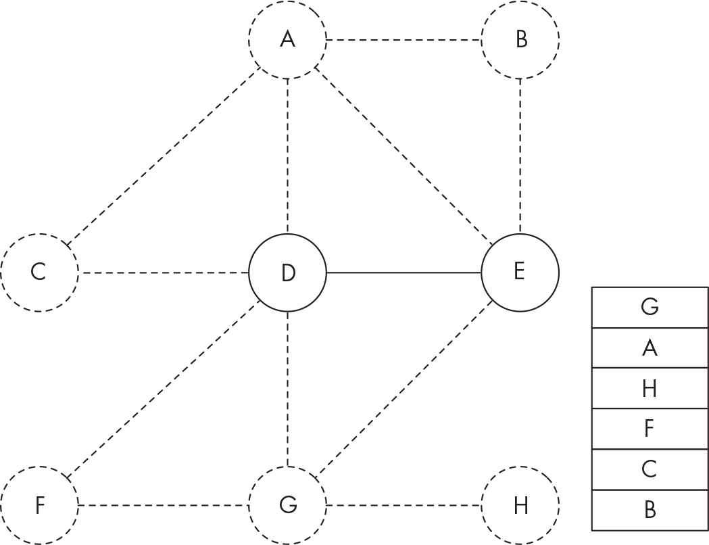

`Figure 20-9: The graph from ``Figure 20-7`` after two rounds of pruning ``Description`

Our two remaining nodes each have fewer than three neighbors, so we could just color them. But we’ll take a slightly different approach to accomplish the same thing: we’ll prune them from the graph, then put them back. After we prune them, the graph is empty. Figure 20-10 shows how things look after we’ve pruned every node.

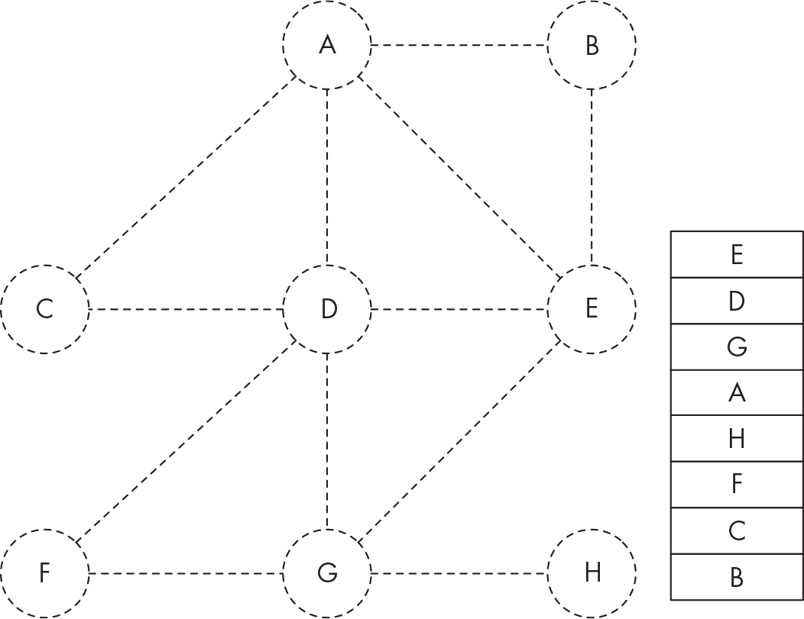

`Figure 20-10: The graph from ``Figure 20-7`` after pruning every node ``Description`

Our original plan was to prune the graph, color the remaining nodes, then put back the nodes we had pruned. Now that we’re done pruning, we don’t have to do anything for the second step: there are no nodes left to color! We won’t get this lucky with every graph; sometimes we’ll end up with nodes we can’t prune. We’ll talk about how to handle that situation in a moment. For now, let’s finish coloring this graph.

As the last step in our plan, we’ll take each of the nodes we pruned earlier, assign it a color, and put it back in the graph. We’ll start with the last node we removed, which is at the top of the stack, then repeat this process until the stack is empty. The sequence of diagrams in Figure 20-11 illustrates how we’ll rebuild the graph in this example.

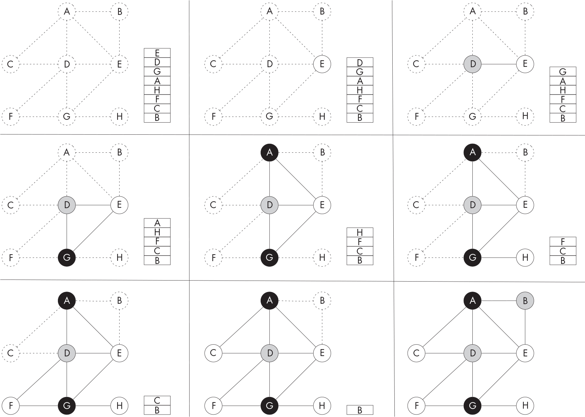

`Figure 20-11: Adding nodes back to the graph and assigning colors ``Description`

When we add *E* back to the graph, it has no neighbors, so we can assign it any color. Let’s color it white. Then, when we add *D*, its only neighbor is *E*, so we can assign it either black or gray. When we add *G*, we find that it has a white neighbor and a gray neighbor, so we must color it black. We continue until the stack is empty and every node in the graph has been assigned a color.

##### `Dealing with Spills`

For many interference graphs, we can prune every node using the approach we took in the previous section. We can color those graphs without any spills. But there are other graphs where we’ll get stuck: we’ll hit a point where every node has *k* or more neighbors. Suppose we want to 3-color the graph shown in Figure 20-12.

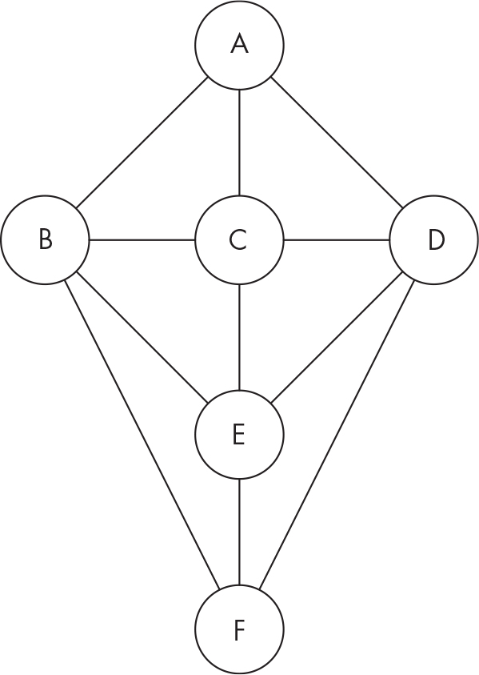

`Figure 20-12: A graph where every node has three or more neighbors ``Description`

If we try to prune this graph, we’ll immediately get stuck: every node has at least three neighbors! To get unstuck, we’ll choose a node to prune anyway. We’ll put this node on the stack, then continue with the algorithm as usual. This node is a *spill candidate* because we might not be able to color it when we put it back in the graph. If we’re lucky, its neighbors won’t use up every color, so we’ll be able to color it. If we’re unlucky, its neighbors will use all *k* colors, so we’ll have to spill it.

We want to choose a spill candidate with a low spill cost. But we also want to choose a spill candidate with lots of neighbors that haven’t been pruned yet, because pruning our spill candidate lowers its neighbors’ degrees and helps us avoid spilling them later on. To balance these two priorities, we’ll choose the node with the smallest value of *spill cost / degree*, where degree is the number of neighbors that haven’t been pruned yet.

Note that we’ll never choose a hard register as a spill candidate, because *spill cost / degree* for each of these registers is always infinity. If there are any pseudoregisters left in the graph, we’ll always choose one of them as a spill candidate instead of choosing a hard register. If there are no pseudoregisters left, the total number of registers must be *k* or fewer, so we’ll be able to prune every register.

Some graphs have no valid *k*-colorings, which makes spilling unavoidable. For other graphs, a valid coloring exists, but whether we find it is a matter of chance; it depends on the exact order in which we remove nodes from the graph and how we happen to color them when we put them back.

To illustrate the element of chance in this approach, we’ll make a couple of attempts to color the graph in Figure 20-12. This graph is 3-colorable, but only one of our attempts will find a spill-free coloring. In both cases, we’ll choose *C* as our spill candidate, then prune *A* and *B*, leaving *D*, *E*, and *F*. And in both cases, we’ll use the same strategy to color nodes as we add them back into the graph: we’ll choose the first available color from the list *\[white, gray, black\]*. The only difference will be the order in which we prune the remaining three nodes. In the first case, we’ll prune *D*, then *E*, then *F*. Figure 20-13 shows what will happen when we try to add the nodes back in.

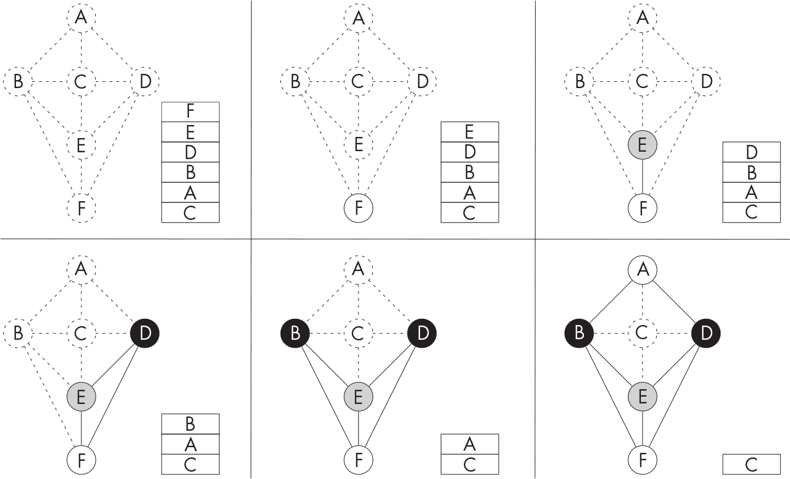

`Figure 20-13: A first attempt to color ``Figure 20-12`` ``Description`

When we reach *C*, we’ll see that its neighbors are already using all three colors, so we’ll be forced to spill it.

Now let’s repeat this process; on this attempt, we’ll prune *F*, then *E*, then *D*. Figure 20-14 shows what will happen when we put the nodes back in the graph this time around.

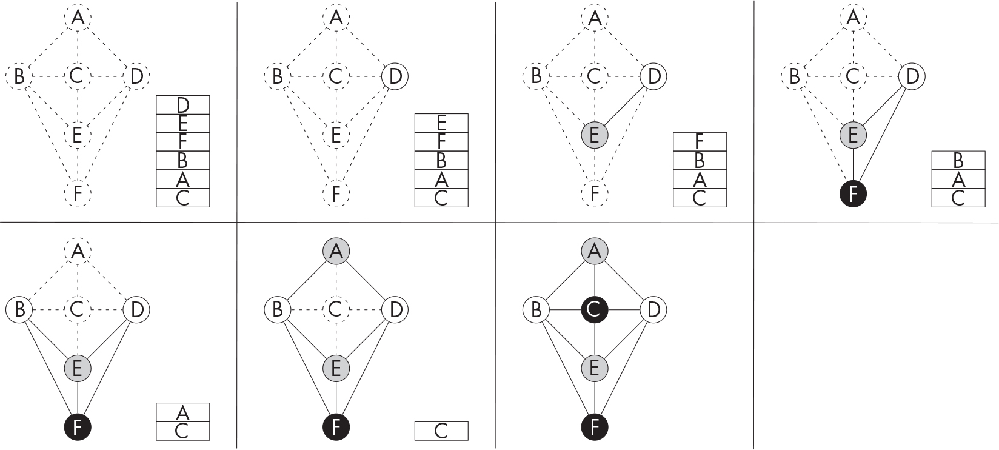

`Figure 20-14: A more successful attempt to color ``Figure 20-12`` ``Description`

This time, we assigned *A* and *E* the same color, which allowed us to assign *C* a color instead of spilling it. In a small example like this one, it’s easy to see that assigning these nodes the same color is the better choice. But there’s no general rule that lets us avoid unnecessary spills like the one in Figure 20-13; that’s what makes this algorithm approximate. We *could* avoid unnecessary spills if we used an exact algorithm instead, but as I mentioned earlier, exact algorithms are too expensive to be practical.

##### `Implementing the Graph Coloring Algorithm`

Now that we’ve worked through a few examples using this algorithm, let’s look at the pseudocode, which is shown in Listing 20-24.

    color_graph(g):
        remaining = <unpruned nodes in g>
      ❶ if remaining is empty:
            return

        // choose next node to prune
        chosen_node = null

        for node in remaining:
            degree = length(<unpruned neighbors of node>)
            if degree < k:
              ❷ chosen_node = node
                break

        if chosen_node is null:
            // choose a spill candidate
            best_spill_metric = infinity
            for node in remaining:
                degree = length(<unpruned neighbors of node>)
                spill_metric = node.spill_cost / degree
                if spill_metric < best_spill_metric:
                  ❸ chosen_node = node
                    best_spill_metric = spill_metric

        chosen_node.pruned = True

        // color the rest of the graph
      ❹ color_graph(g)

        // color this node
        colors = [1, 2, . . ., k]
        for neighbor_id in chosen_node.neighbors:
            neighbor = get_node_by_id(g, neighbor_id)
            if neighbor.color is not null:
                colors.remove(neighbor.color)

      ❺ if colors is not empty:
            if chosen_node is a callee-saved hard register:
                chosen_node.color = max(colors)
            else:
                chosen_node.color = min(colors)
            chosen_node.pruned = False

        return

`Listing 20-24: The graph coloring algorithm`

We’ll color the graph recursively. At each step, we’ll prune a node, then make a recursive call to color the rest of the graph, then put the node back and assign it a color. In the base case, we’ve already pruned every node, so we have nothing left to do ❶.

In the recursive case, we’ll start by choosing a node to prune, which this listing calls `chosen_node`. We’ll pick the first node we find with fewer than *k* unpruned neighbors ❷. (If you’re allocating general-purpose registers, *k* is 12; if you’re allocating XMM registers, it’s 14.) If that search comes up empty, we’ll pick the node with the minimum value of *spill cost / degree* ❸. To prune a node, we’ll just set its `pruned` attribute to `True`. Then, we’ll call `color_graph` recursively to color the remaining nodes in the graph ❹.

After we return from this recursive call, we’ll try to assign `chosen_node` a color. We’ll take the list of integers `1` through `k`, which represent every possible color, and remove any color that we’ve already assigned to one of `chosen _node`’s neighbors. Some of `chosen_node`’s neighbors may not have a color, either because we spilled them or because we pruned them before `chosen _node` and will therefore color them later. We can simply ignore these nodes.

If there are any colors left in the list, we’ll assign one of them to `chosen _node` ❺. If there’s more than one color available, the algorithm isn’t fussy about which one we choose. Although the color we choose here might impact how many nodes we ultimately spill, the effect is unpredictable; there’s no color selection strategy that minimizes spills across the board. So, we’ll choose a color with a different goal in mind: assigning pseudoregisters to caller-saved rather than callee-saved hard registers. (We’d like to use as few callee-saved registers as possible, to avoid the cost of saving and restoring them.) When `chosen_node` represents a callee-saved hard register, we’ll assign it the available color with the highest number. Otherwise, we assign it the lowest-numbered available color. Using this strategy, the coloring algorithm will tend to assign higher-numbered colors to callee-saved registers and lower-numbered colors to caller-saved registers and pseudoregisters. A pseudoregister will end up with a higher-numbered color only when there are no lower-numbered colors available (for example, because it conflicts with every caller-saved register). Once we’ve picked a color, we set the `pruned` attribute back to `False`. This isn’t strictly necessary, because we won’t use this attribute again, but it marks that we’ve put the node back in the graph.

If there are no colors left in the list, we’ll have to spill `chosen_node`. Concretely, this just means we won’t assign it a color. We also won’t update its `pruned` attribute, since we aren’t putting this node back in the graph. Note that we don’t explicitly push nodes onto a stack or pop them off afterward. Our recursive algorithm naturally colors nodes in the correct order, starting with the last node we pruned.

#### `Building the Register Map and Rewriting the Function Body`

Once we’ve colored the graph, the rest of the register allocator is pretty simple. We’ll build a map from pseudoregisters to hard registers, which we’ll use to replace the pseudoregisters in our assembly code. As we build this map, we’ll also keep track of which callee-saved registers we’ve allocated so that we can save and restore them in the instruction fix-up pass. Listing 20-25 demonstrates how to construct the map.

    create_register_map(colored_graph):

        // build map from colors to hard registers
        color_map = <empty map>
        for node in colored_graph.nodes:
            match node.id with
            | Reg(r) ->
                color_map.add(node.color, r)
            | Pseudo(p) -> continue

        // build map from pseudoregisters to hard registers
        register_map = <empty map>
        callee_saved_regs = {}
        for node in colored_graph.nodes:
            match node.id with
            | Pseudo(p) ->
                if node.color is not null:
                  ❶ hardreg = color_map.get(node.color)
                    register_map.add(p, hardreg)
                    if hardreg is callee saved:
                      ❷ callee_saved_regs.add(hardreg)
            | Reg(r) -> continue

      ❸ record_callee_saved_regs(<current function name>, callee_saved_regs)

        return register_map

`Listing 20-25: Building a map from pseudoregisters to hard registers`

First, we’ll iterate through the hard registers in the graph, building up a map from colors to hard registers. Remember that we’ll have a 1:1 mapping between colors and hard registers because each of the *k* hard registers must be assigned a different one of the *k* possible colors. Next, we’ll iterate through all the pseudoregisters. If a pseudoregister was assigned a color, we’ll map it to the hard register with the same color, which we can find in `color_map` ❶. If a pseudoregister wasn’t assigned a color, we won’t add it to the map.

As we build up `register_map`, we also track the set of callee-saved registers this function will use. Whenever we add a mapping from a pseudoregister to a callee-saved hard register, we’ll add the hard register to this set ❷. We’ll record each function’s `callee_saved_regs` set so that we can pass that information on to the instruction fix-up phase ❸. (This listing doesn’t specify *where* to record that information; you can add it to the function definition itself, the backend symbol table, or some other data structure, depending on what’s most convenient.) We can skip this step when we allocate XMM registers, because none of the XMM registers are callee-saved.

Finally, we’ll rewrite the assembly code. We’ll replace each pseudoregister in each instruction with the corresponding hard register from the register map. If a pseudoregister is missing from the map, we won’t replace it. While we’re at it, we’ll remove any `mov` instruction whose source and destination ended up in the same hard register. For instance, if we’ve mapped both `tmp1` and `tmp2` to EAX, we can rewrite

    my_fun:
        movl    %edi, %tmp1
        addl    $5, %tmp1
      ❶ movl    %tmp1, %tmp2
      ❷ movl    %tmp2, %eax
        ret

as:

    my_fun:
        movl    %edi, %eax
        addl    $5, %eax
        ret

Both ❶ and ❷ would be rewritten as `movl %eax, %eax`, which doesn’t do anything, so we can drop them both from the final assembly program.

This bit of cleanup where we delete unnecessary `mov` instructions is related to register coalescing, which we’ll implement later in this chapter. But there are some important differences. The register coalescing step will deliberately merge together registers connected by a `mov`, like `tmp1` and `tmp2`, then delete the `mov` instructions between them. This whole process will happen before we color the rest of the graph. What we’re doing here is much simpler; we’re not trying to merge registers, but if we happen to assign both operands of a `mov` instruction the same color, we’ll take advantage of it.

Even once we implement register coalescing, this post-coloring cleanup will still be useful. As we’ll see, the register coalescing pass isn’t perfect; sometimes it will miss a pair of registers that it would have been helpful to coalesce. If we get lucky and assign that pair of registers the same color, this final step will still be able to delete `mov` instructions between them.

At this point, we have a working register allocator! We just need to update the instruction fix-up and code emission passes before we test it out.

### `Instruction Fix-Up with Callee-Saved Registers`

If a function uses any callee-saved registers, we need to save their values at the start of the function and restore them at the end. We’ll save them by pushing them onto the stack on top of the rest of the current stack frame. For example, if a function needs 16 bytes of stack space for local variables and uses R12 and R13, we’ll insert the following three instructions at the very beginning of the function body:

    Binary(Sub, Quadword, Imm(16), Reg(SP))
    Push(Reg(R12))
    Push(Reg(R13))

The initial `Sub` instruction allocates the current stack frame, just like in earlier chapters. The new `Push` instructions come immediately after it. (If you skipped Part II, the first instruction will be `AllocateStack` rather than `Sub`.)

Before we return, we’ll restore the values of these registers by popping them off the stack. That is, we’ll rewrite each `Ret` instruction in this function as:

    Pop(R13)
    Pop(R12)
    Ret

We can push callee-saved registers onto the stack in any order, but we’ll always need to pop them back off in the reverse order so that each register ends up with its original value. Since we add the rest of the function epilogue during code emission, we’ll end up deallocating the stack frame just after restoring the callee-saved registers:

    popq    %r13
    popq    %r12
    movq    %rbp, %rsp
    popq    %rbp
    ret

We also need to ensure that the entire stack frame, including the values of any callee-saved registers that we save to the stack, is 16-byte aligned. Suppose the pseudo-operand replacement pass has allocated 20 bytes of stack space to store local variables in a particular function. We’d normally subtract 32 bytes from RSP to maintain the proper stack alignment. But if the function uses a single callee-saved register, we should initially subtract 24 bytes instead:

    Binary(Sub, Quadword, Imm(24), Reg(SP))
    Push(Reg(BX))

If we subtract 24 bytes from RSP explicitly and subtract another 8 bytes by pushing RBX, we still end up subtracting a total of 32 bytes, so the stack will be properly aligned. Listing 20-26 demonstrates one way to perform this tricky calculation.

    calculate_stack_adjustment(bytes_for_locals, callee_saved_count):
        callee_saved_bytes = 8 * callee_saved_count
        total_stack_bytes = callee_saved_bytes + bytes_for_locals
      ❶ adjusted_stack_bytes = round_up(total_stack_bytes, 16)
      ❷ stack_adjustment = adjusted_stack_bytes - callee_saved_bytes
        return stack_adjustment

`Listing 20-26: The stack space calculation that accounts for callee-saved registers`

In this listing, `bytes_for_locals` is the number of bytes of stack space we allocated during pseudo-operand replacement, and `callee_saved_count` is the number of callee-saved registers the function uses. We start by calculating how many bytes the callee-saved values will occupy. Then, we add this to `bytes_for_locals` and round up to the nearest multiple of 16 to get the total size of the stack frame ❶. Working backward from this value, we subtract the number of bytes the callee-saved values will occupy to find the number of bytes we need to explicitly subtract from RSP ❷.

### `Code Emission`

Finally, we’ll update the code emission pass to handle the `pop` instruction and all the new registers we added in this chapter. Like `push`, `pop` will always use the 8-byte names for registers. Tables 20-4 and 20-5 describe how to print out these constructs. (I haven’t bolded new and changed constructs like I did in most code emission tables in earlier chapters, because all of these constructs are new.) For a summary of the complete code emission pass at the end of this chapter, see Appendix B, which includes two sets of code emission tables for Part III: one with the features from Part II and one without them.

`Table 20-4:` `Formatting Assembly Instructions`

| `Assembly instruction` | `Output`     |
|------------------------|--------------|
| `Pop(reg)`             | popq \<reg\> |

`Table 20-5:` `Formatting Assembly Operands`

|                    |          |          |
|--------------------|----------|----------|
| `Assembly operand` |          | `Output` |
| `Reg(BX)`          | `8-byte` | `%rbx`   |
| `4-byte`           | `%ebx`   |          |
| `1-byte`           | `%bl`    |          |
| `Reg(R12)`         | `8-byte` | `%r12`   |
| `4-byte`           | `%r12d`  |          |
| `1-byte`           | `%r12b`  |          |
| `Reg(R13)`         | `8-byte` | `%r13`   |
| `4-byte`           | `%r13d`  |          |
| `1-byte`           | `%r13b`  |          |
| `Reg(R14)`         | `8-byte` | `%r14`   |
| `4-byte`           | `%r14d`  |          |
| `1-byte`           | `%r14b`  |          |
| `Reg(R15)`         | `8-byte` | `%r15`   |
| `4-byte`           | `%r15d`  |          |
| `1-byte`           | `%r15b`  |          |
| `Reg(XMM8)`        |          | `%xmm8`  |
| `Reg(XMM9)`        |          | `%xmm9`  |
| `Reg(XMM10)`       |          | `%xmm10` |
| `Reg(XMM11)`       |          | `%xmm11` |
| `Reg(XMM12)`       |          | `%xmm12` |
| `Reg(XMM13)`       |          | `%xmm13` |

Now you’re ready to try out your register allocator on some real programs!

`TEST THE BASIC REGISTER ALLOCATOR`

`If you completed only Part I, test out your register allocator with the following command:`

    $ ./test_compiler /path/to/your_compiler --chapter 20 --no-coalescing
    --int-only

`This will run all the test programs in` `tests/chapter_20/int_only``, all the tests from Part I, and all the Part I–specific tests from ``Chapter 19``. It will also inspect` `the assembly output for the test programs in` `tests/chapter_20/int_only/no _coalescing` `to make sure that your compiler doesn’t spill registers unnecessarily.`

`If you completed Parts I and II, run the same command without the` `--int-only` `option:`

    $ ./test_compiler /path/to/your_compiler --chapter 20 --no-coalescing

`There are a couple of things you should know about this chapter’s tests. First, many of them are designed to produce specific interference graphs or use every hard register. If your compiler generates different assembly code or includes extra optimizations beyond what this book covers, these tests may not cover the edge cases they’re intended to target, so you should write your own unit tests too.`

`Second, if your code to recognize interference is buggy, the test suite might not catch those bugs until you implement register coalescing. Several tests include pairs of registers that could be coalesced, except that they interfere in some specific way. Once you’ve implemented coalescing, your allocator must recognize that they interfere to avoid coalescing them. Without coalescing, the test suite can’t reliably detect this sort of bug; even if your allocator doesn’t know that two registers interfere, it might still get lucky and assign them different colors. To thoroughly test your register allocator before you move on to coalescing, you might want to write your own unit tests for the code that builds the interference graph.`

`Third, the test commands in this chapter always compile test programs with the optimizations from ``Chapter 19`` enabled. This doesn’t have any particular` `implications; it’s just something to be aware of while you’re debugging your tests.`

### `Register Coalescing`

Our register allocator already works correctly. But as we saw in the example at the start of the chapter, it will produce even more efficient code if we include a coalescing step. That early example also gave us a general sense of how this process works: we look at each `mov` instruction that copies a value from one register to another and decide whether to coalesce its source and destination. Once we’ve made these decisions, we rewrite the assembly code, replacing the registers we coalesced and deleting any `mov` instructions that we no longer need.

To decide which registers to coalesce, we’ll consult the interference graph. We’ll coalesce a pair of registers when two conditions are met. The first condition is obvious: the registers can’t interfere with each other. The example from Listing 20-13, reproduced here, illustrates why this condition is necessary:

    movl    $1, %y
    movl    %y, %x
    addl    $1, %y
    addl    %x, %y

Since we update `y` while `x` is live, these two registers interfere. If we coalesced them, the first `add` instruction would clobber `x`, and we’d end up calculating 2 + 2 instead of 1 + 2.

The second condition is subtler: we’ll coalesce a pair of registers only if that won’t force us to spill more registers. To understand why coalescing can lead to spills, let’s look at Listing 20-27.

    f:
        movl    %edi, %arg
        movl    %arg, %tmp
        addl    $1, %tmp
        imull   %arg, %tmp
        movl    $10, %eax
        subl    %tmp, %eax
        ret

`Listing 20-27: An assembly function where coalescing would cause a spill`

This assembly function calculates `10 - (arg` `+` `1) * arg`. For this example, we’ll pretend that EDI and EAX are the only available hard registers, so *k* is 2. Figure 20-15 shows this listing’s interference graph, which is clearly 2-colorable.

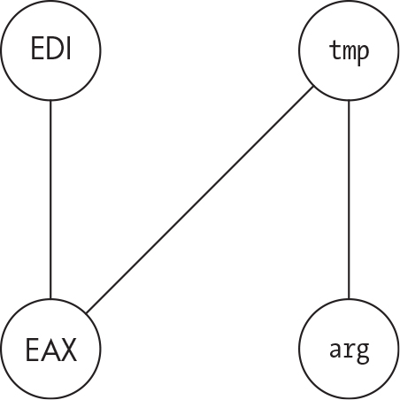

`Figure 20-15: The interference graph for ``Listing 20-27`` ``Description`

The first `mov` instruction in Listing 20-27 looks like a possible candidate for coalescing. (The second instruction isn’t, since `arg` and `tmp` interfere.) But if we try to coalesce `arg` into EDI, we’ll run into trouble. We’ll end up with the assembly code in Listing 20-28.

    f:
        movl    %edi, %tmp
        addl    $1, %tmp
        imull   %edi, %tmp
        movl    $10, %eax
        subl    %tmp, %eax
        ret

`Listing 20-28: ``Listing 20-27`` after coalescing` `arg` `into EDI`

Figure 20-16 shows the interference graph for this coalesced code.

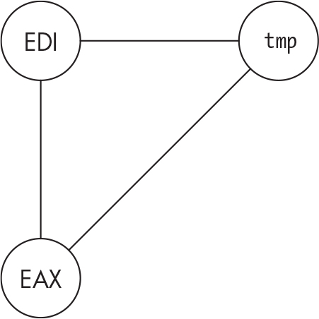

`Figure 20-16: The interference graph for ``Listing 20-28`` ``Description`

Now we can’t 2-color the graph anymore. Since `tmp` interferes with both hard registers, we’ll have to spill it. Instead of improving performance, we’ve made it worse! The cost of spilling `tmp` to memory outweighs the benefit of removing a single `mov` instruction. To avoid this situation, we’ll use a strategy called *conservative coalescing*: we’ll coalesce two registers only when we can tell in advance that it won’t make the interference graph harder to color. But before we dig into conservative coalescing, we need to learn how to keep the graph up to date.

#### `Updating the Interference Graph`

Whenever we decide to coalesce a pair of registers, we need to update the interference graph. Otherwise, we’ll make later coalescing decisions based on bad information. There are two ways to perform this update. The first is to rewrite the assembly code immediately and rebuild the graph from scratch. The problem with this approach is that building the interference graph is slow. We might coalesce dozens or even hundreds of `mov` instructions in a single function, but we can’t afford to rebuild the interference graph hundreds of times.

A much quicker approach is to merge the two nodes together in the existing interference graph, without referring back to the assembly code. In Figure 20-17, we use this approach to coalesce the pseudoregister `tmp2` into EAX.

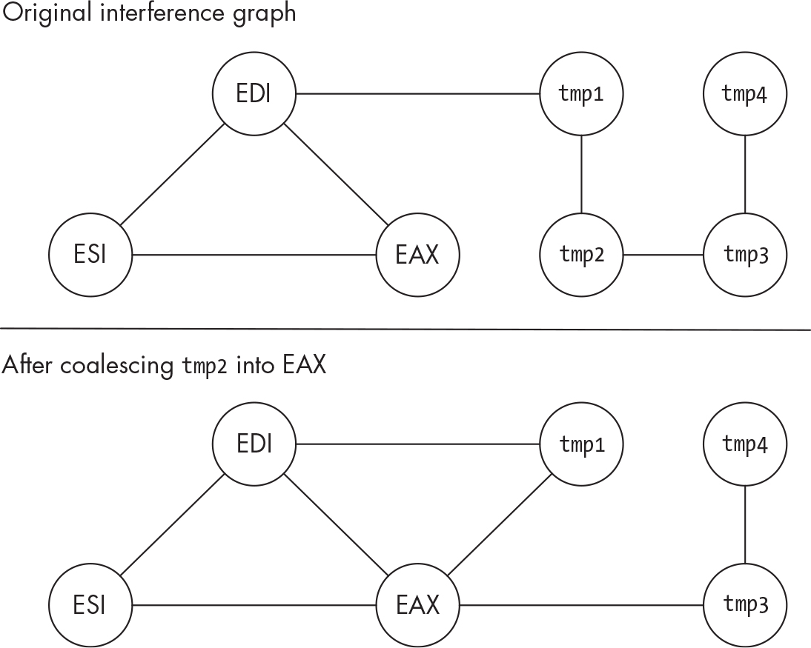

`Figure 20-17: Updating the interference graph to reflect coalescing decisions ``Description`

We’ll assume that any register that originally interfered with `tmp2` now interferes with EAX. To make the interference graph reflect this change, we just add an edge from each of `tmp2`’s neighbors to EAX and then remove `tmp2`.

But this way of updating the graph has a problem too: it’s not always accurate! It might include some extra edges between registers that don’t really interfere. Listing 20-29 gives a slightly contrived example.

    f:
        movl    %edi, %tmp1
        movl    %edi, %tmp2
        addl    %tmp1, %tmp2
        movl    %tmp2, %eax
        ret

`Listing 20-29: A function that copies its first argument into two different pseudoregisters`

Note that `tmp1` and `tmp2` interfere: the second `mov` instruction updates `tmp2` while `tmp1` is still live. Let’s try to coalesce `tmp1` into EDI and use our speedy, simple method to update the graph accordingly. Figure 20-18 shows how the graph will change.

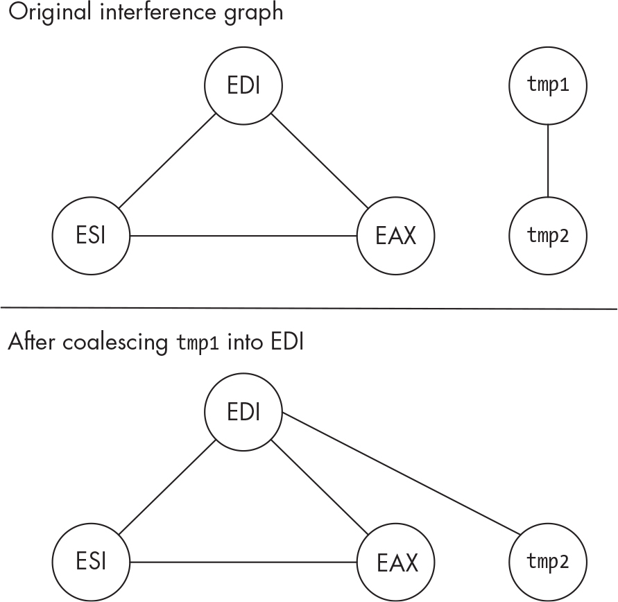

`Figure 20-18: Updating the interference graph for ``Listing 20-29`` ``Description`

But when we actually replace `tmp1` with EDI, we’ll find that the interference with `tmp2` goes away! Listing 20-30 shows the updated assembly code.

    f:
        movl    %edi, %tmp2
        addl    %edi, %tmp2
        movl    %tmp2, %eax
        ret

`Listing 20-30: ``Listing 20-29`` after coalescing` `tmp1` `into EDI`

We learned earlier that the instruction `mov src, dst` will never make `src` and `dst` interfere. Initially, the instruction `movl %edi, %tmp2` caused an interference between `tmp1` and `tmp2`. Now that we’ve merged `tmp1` into EDI, it doesn’t cause an interference anymore.

Even though it isn’t completely accurate, our quick update method is still useful. It produces a conservative approximation of the true interference graph; it has all the nodes and edges that should be in the graph, but it might have a few extra edges too. If this graph tells us that two registers are safe to coalesce, we can be sure they really are. But if we rely solely on this method, we’ll leave some coalescing opportunities on the table. If, for instance, we only look at the graph in Figure 20-18, we won’t realize that we can coalesce `tmp2` into EDI. Worse, if we attempted to color this graph, we might end up spilling registers unnecessarily.

So, we’ll use *both* approaches to update the graph. Each time we decide to coalesce a pair of registers, we’ll perform a quick update by merging their nodes together. Then, after we’ve looked at every `mov` instruction and rewritten the assembly code, we’ll rebuild the graph from scratch. We’ll repeat this build-coalesce loop until we can’t find any more registers to coalesce. Combining a speedy, approximate inner loop with a slow, precise outer loop gives us the best of both worlds. We’ll catch every coalescing opportunity and send an accurate interference graph on to the coloring stage, but we won’t waste time rebuilding the graph after every single coalescing decision.

#### `Conservative Coalescing`

Now that we understand how coalescing changes the graph, we can reason about when it might lead to spills. The basic issue is that when we coalesce two nodes, the merged node will have a higher degree than either of them, which could make it more difficult to prune. It’s also likely to have a higher spill cost than either of the original nodes, since it’s used more frequently.

We’ll use two conservative coalescing tests to ensure that a merged node doesn’t cause problems when we color the graph. The *Briggs test* guarantees that we won’t spill the merged node. The *George test* guarantees that we won’t spill any other nodes unless they were already potential spill candidates in the original graph. We’ll only coalesce two pseudoregisters if they pass the Briggs test. We’ll coalesce a pseudoregister into a hard register if the two registers pass either test; we can be more permissive in this case because we already know that the hard register won’t spill. Both tests are named after the people who invented them; you can find links to the papers that first proposed them in “Additional Resources” on page 669.

It’s worth clarifying exactly what the conservative coalescing tests guarantee, because it’s a little unintuitive. If you could completely prune the original graph without ever having to choose a spill candidate, these tests guarantee that the same will be true for the coalesced graph. In this case, we can say for sure that coalescing won’t cause any spills.

But if you couldn’t totally prune the original graph, it’s harder to predict the impact of coalescing, because a lot of what happens after you pick a spill candidate comes down to chance. We saw an example of this earlier in the chapter, when we tried to color the graph in Figure 20-12; pruning nodes in a different order made the difference between being able to color a spill candidate and actually spilling it. Coalescing registers can have similar ripple effects. If we’re unlucky, these effects might lead to a spill that we otherwise would have avoided.

In other words, if coloring the original graph required us to choose a spill candidate, coloring the coalesced graph might too—and at that point, it’s impossible to say with any certainty what’s going to happen. In this case, the conservative coalescing tests still give us two valuable guarantees. First, the coalesced node itself won’t spill. Second, at the point where we get stuck and have to choose our first spill candidate, every node’s degree will be the same or lower than it would have been when we got stuck if we hadn’t performed coalescing. This means that, on balance, we’re likely to successfully prune more nodes and spill fewer than we would have without coalescing.

Now we’ll take a closer look at the Briggs and George tests. We’ll define both of them and walk through some examples that demonstrate why they work.

##### `The Briggs Test`

Remember that a node has significant degree if it has *k* or more neighbors. The Briggs test allows us to merge two nodes if the merged node will have fewer than *k* neighbors with significant degree. When we color the graph, we’ll be able to prune every neighbor with insignificant degree. The merged node itself will then have insignificant degree—it will have fewer than *k* neighbors left—so we’ll be able to prune that node too.

Let’s look at an example. Consider the interference graph in Figure 20-19.

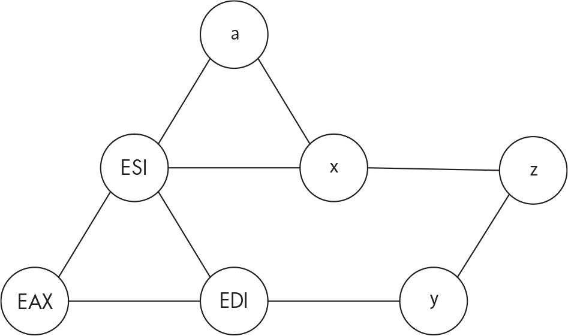

`Figure 20-19: An interference graph before coalescing ``Description`

Our coloring algorithm can prune this entire graph without any difficulty. Now let’s apply the Briggs test to see if we can coalesce `x` into `y`. Figure 20-20 shows how the graph will look once we merge these two nodes together.

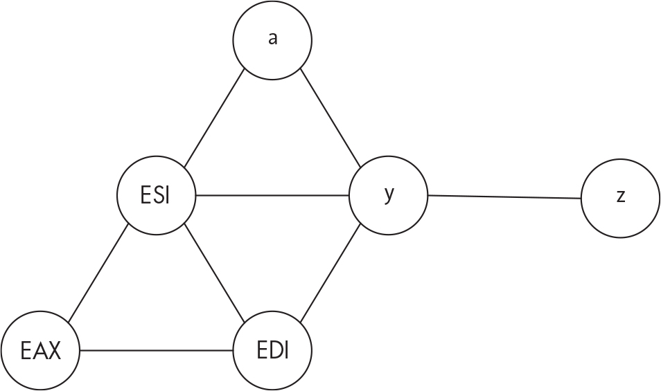

`Figure 20-20: The graph in ``Figure 20-19`` after merging x into y ``Description`

After coalescing, `y` will have four neighbors: `a`, `z`, ESI, and EDI. Only two of these nodes, ESI and EDI, have significant degree. Since *k* is 3, this example passes the Briggs test. And in fact, we’ll be able to prune `y` after we’ve pruned `a` and `z`, then finish pruning the rest of the graph like we did before.

Next, let’s look at a case that fails the Briggs test. The graph in Figure 20-21 is almost identical to the one in Figure 20-19, except for an extra edge from `a` to EDI.

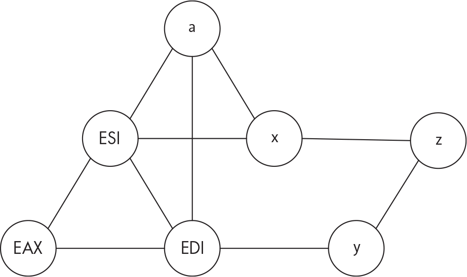

`Figure 20-21: A variation on the graph in ``Figure 20-19`` where x and y can no longer be coalesced ``Description`

Even with this extra edge, our coloring algorithm can still prune the whole graph. But Figure 20-22 shows what happens when we coalesce `x` into `y` this time around.

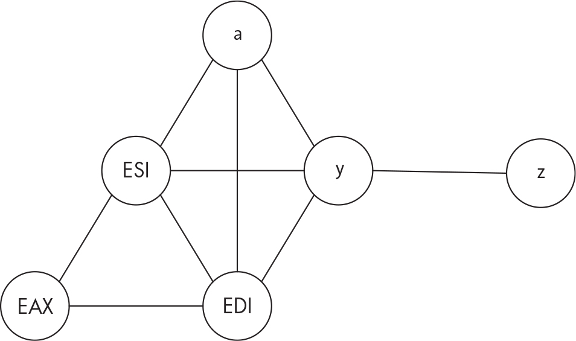

`Figure 20-22: The graph in ``Figure 20-21`` after merging x` `into y ``Description`

Now `y` has three neighbors with significant degree: ESI, EDI, and `a`. This example fails the Briggs test, and `y` really is impossible to prune. After we prune `z` and EAX we’ll get stuck, and we’ll be forced to choose `y` or `a` as a spill candidate.

As these examples show us, the Briggs test stops us from transforming a colorable graph into an uncolorable one. It also gives us another guarantee: we’ll never coalesce two nodes if the resulting node might spill. Take a look at Figure 20-23.

`Figure 20-23: An interference graph where we can’t coalesce tmp1 and tmp2 ``Description`

Suppose we want to coalesce `tmp2` into `tmp1`. This clearly won’t make the graph harder to color; it will have the same effect on the interference graph as removing `tmp2` entirely. But coalescing these nodes is a bad idea for another reason. We won’t be able to color `tmp1` whether we coalesce it with `tmp2` or not, so coalescing will just make things worse by increasing `tmp1`’s spill cost.

This example fails the Briggs test, since `tmp1` will have three neighbors with significant degree after coalescing (just like it did before coalescing). If we might not be able to color it, the Briggs test won’t let us coalesce it.

Finally, let’s tweak this example to illustrate one of the limits of the Briggs test. Imagine that we want to coalesce `tmp2` into EDI instead of `tmp1`. Like in our previous example, this won’t make the graph harder to color. And this also fails the Briggs test, because EDI will have three neighbors with significant degree. But there’s one important difference: as a hard register, EDI can’t spill. This means that there’s no downside to coalescing `tmp2` into EDI; it won’t force us to spill EDI, and it won’t make other nodes harder to color either. In cases like this, we’ll use the George test to find coalescing opportunities that the Briggs test misses.

##### `The George Test`

When we coalesce a pseudoregister with a hard register, we know the coalesced register can’t spill. Instead, we’re worried about a slightly different outcome: if the hard register becomes more difficult to prune, its neighbors could become harder to prune too. Ultimately, this change could force us to spill nodes that we were able to color before. In cases that involve a hard register, we’ll use both the Briggs test and the George test to identify as many coalescing opportunities as possible. The Briggs test proves that we can prune the merged node, so it won’t interfere with attempts to color other nodes. The George test proves that we won’t make the merged node’s neighbors harder to prune (and therefore won’t make those nodes or the rest of the graph more difficult to color), even if we can’t prune the merged node itself. We can coalesce a pair of nodes that passes either of these tests.

The George test says that you can coalesce a pseudoregister *p* into a hard register *h* if each of *p*’s neighbors meets either of two conditions:

1.  It has fewer than *k* neighbors.
2.  It already interferes with *h*.

If a neighbor meets the first condition, we’ll definitely be able to prune it when we color the graph. If it meets the second condition, it will have exactly the same neighbors as before (except for *p*) after coalescing, so we won’t have made it any harder to prune; if anything, we might have made it easier.

Coalescing *h* and *p* won’t make any of *h*’s neighbors harder to prune, either. The only way it could do that would be by preventing us from pruning *h* itself, but any new neighbors that *h* acquires through coalescing will have insignificant degree, so they won’t affect our ability to prune it.

Let’s take another look at the graph from Figure 20-23 to see why this works:

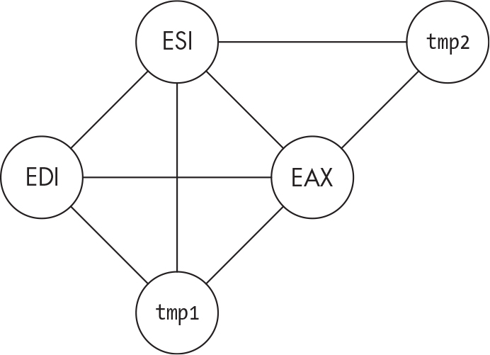

Earlier, we decided that coalescing `tmp2` into EDI was safe, because EDI couldn’t spill and this change wouldn’t make any of the other nodes harder to color. But we also saw that this case failed the Briggs test, since EDI would then have three neighbors with significant degree. Now we’ll try the George test instead. This test will pass, since both neighbors of `tmp2` already interfere with EDI. Our allocator will coalesce `tmp2` into EDI, since it coalesces moves that pass either of our two tests.

For our last example, let’s revisit the graph from Figure 20-15:

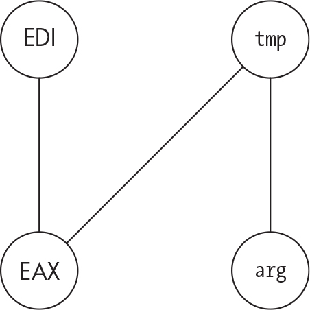

The last time we looked at this graph, we were considering whether to coalesce `arg` into EDI. Now we know that we shouldn’t coalesce them, because this case doesn’t pass either of our two tests. It fails the Briggs test because the coalesced node would have two neighbors with significant degree, `tmp` and EAX. It also fails the George test; `arg`’s one neighbor, `tmp`, has significant degree and doesn’t interfere with EDI. The George test tells us that `tmp` *might* become harder to color if we made this change; we’d be making it interfere with an additional register, and we don’t know what impact that would have. In this small example, we can tell by looking at the graph that `tmp` actually would be harder to color if we coalesced `arg` into EDI, since it would interfere with both hard registers.

There’s one ugly detail about the George test that I want to mention. Remember that we’re using a quick, approximate method to update the graph after each coalescing decision. This approximate method might leave edges in the graph between registers that do not, in fact, interfere. As a result, when applying the George test to registers *p* and *h*, we might think that some neighbor *n* of *p* also interferes with *h* when it actually doesn’t. We might then incorrectly conclude that *p* and *h* pass the George test and coalesce them.

That sounds pretty bad, but it only slightly weakens the guarantee that the George test provides. Earlier, I claimed that the George test guarantees that we won’t make the merged node’s neighbors harder to prune. It actually guarantees that we won’t make them harder to prune than they were *before we started the current round of coalescing*—that is, the last time we rebuilt the interference graph from scratch.

This weaker guarantee still holds because our approximate graph will include an edge between *n* and *h* only if *n* did interfere with *h* when we built the interference graph, but some earlier coalescing decision removed that interference. Essentially, if an earlier coalescing decision made *n* or *h* easier to prune by removing the edge between them, we might accidentally make them more difficult to prune again by putting that edge back. However, we’ll never make things worse than they were before the current round of coalescing. (It’s also worth keeping in mind that the purpose of the Briggs and George tests is to improve performance, *not* to guarantee correctness; even a “bad” coalescing decision that fails both tests won’t change the program’s observable behavior.)

`THE LIMITS OF THE BRIGGS AND GEORGE TESTS`

`The Briggs and George tests share a basic limitation: they both guess whether a node can be pruned by examining only the node and its neighbors, without considering its neighbors’ neighbors, and their neighbors, and so on. That’s not always enough information to recognize that we’ll eventually be able to prune` `a node. The following interference graph illustrates the problem: it fails the Briggs test even though coalescing would be safe.`

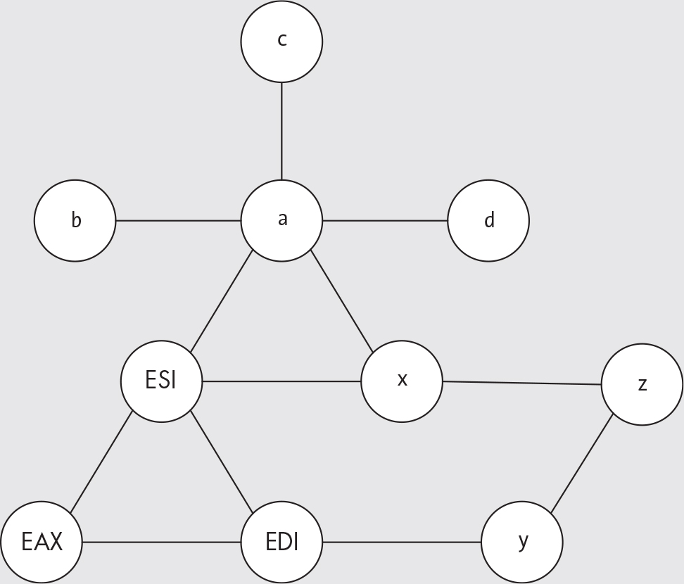

` ``Description`

`This graph is identical to the one in ``Figure 20-19``, which we looked at when we discussed the Briggs test earlier, except that we’ve given` `a` `some extra neighbors. These extra neighbors don’t impact our ability to color the graph, since we can prune all of them right away. Now let’s try to coalesce` `x` `into` `y``.`

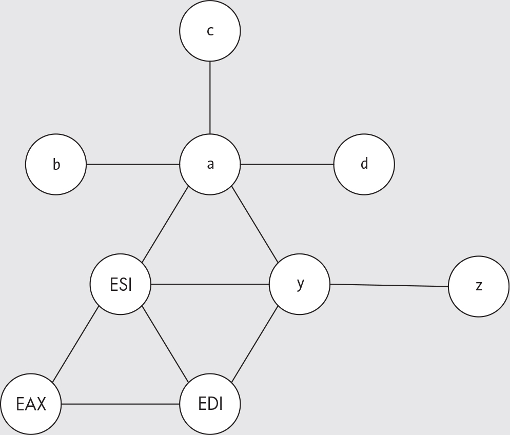

` ``Description`

`It’s easy to see that this graph is still colorable. However, it fails the Briggs test because` `y` `now has three neighbors with significant degree: ESI, EDI, and` `a``. If the test went one step further, we would see that ESI, EDI, and` `a` `themselves all have fewer than three neighbors with significant degree, so we’ll be able to prune all of them—but it doesn’t. Instead, it stops after considering` `y``’s immediate neighbors. The George test has exactly the same issue: it gets tripped up by nodes that have lots of neighbors to start with but that would have fewer than` `k` `neighbors after a few rounds of pruning.`

`The same paper that introduced the George test proposed an algorithm called` `iterated register coalescing` `to overcome this limitation. The gist of this technique is that you can alternate between pruning the graph and coalescing. After a round of pruning, the Briggs and George tests can often identify coalescing opportunities that they couldn’t find before. For example, we could prune the nodes with insignificant degree from the first interference graph in this box and then apply the Briggs test to coalesce` `x` `and` `y``. Iterated register coalescing is still a conservative approach, so it won’t find every single coalescing opportunity, but it will catch many opportunities that our simpler strategy misses.`

We’ve looked at both conservative coalescing tests, what guarantees they provide, and why they work. Now we just have to implement them.

#### `Implementing Register Coalescing`

Our first task is to add the build-coalesce loop to the top-level register allocation algorithm. Listing 20-31 gives the updated algorithm, with this addition bolded.

    allocate_registers(instructions):
        while True:
            interference_graph = build_graph(instructions)
            coalesced_regs = coalesce(interference_graph, instructions)
            if nothing_was_coalesced(coalesced_regs):
                break
            instructions = rewrite_coalesced(instructions, coalesced_regs)
        add_spill_costs(interference_graph, instructions)
        color_graph(interference_graph)
        register_map = create_register_map(interference_graph)
        transformed_instructions = replace_pseudoregs(instructions, register_map)
        return transformed_instructions

`Listing 20-31: Adding register coalescing to the top-level register allocation algorithm`

Within this loop, we build the interference graph, then look for registers to coalesce. If we find any, we rewrite the assembly code and start the whole process again. Otherwise, we exit the loop and run the rest of the allocator as usual.

We record which registers we’ve coalesced together in `coalesced_regs`, which is a *disjoint-set* data structure. Let’s write a simple implementation of this data structure; then we’ll define the `coalesce` and `rewrite_coalesced` functions.

##### `Disjoint Sets`

As the name suggests, a disjoint-set data structure represents multiple disjoint sets of values. Each set is identified by one representative member. Disjoint sets support two operations: `union` merges two sets, and `find` looks up the representative member of a set. In our case, the values in each set are `Reg` and `Pseudo` operands. Initially, each register is in a set by itself. As we coalesce registers, we’ll use the `union` operation to merge these sets together. When we rewrite the assembly code, we’ll use `find` to replace each register with the representative member of its set.

There are a few different ways to implement disjoint sets. We’ll use a simple implementation that’s easy to understand. Listing 20-32 defines our implementation.

    init_disjoint_sets():
      ❶ return <empty map>

    union(x, y, reg_map):
      ❷ reg_map.add(x, y)

    find(r, reg_map):
      ❸ if r is in reg_map:
            result = reg_map.get(r)
          ❹ return find(result, reg_map)
        return r

    nothing_was_coalesced(reg_map):
      ❺ if reg_map is empty:
            return True
        return False

`Listing 20-32: A basic implementation of disjoint sets`

We use a map to track which sets have been merged together. At first, this map is empty ❶. To merge two sets whose representative members are `x` and `y`, the `union` operation inserts a mapping from `x` to `y` ❷. This makes `y` the representative member of the new set. When we coalesce a pseudoregister into a hard register, it’s important to make the hard register the set’s representative member; we don’t want to replace hard registers with pseudoregisters when we rewrite the code later on.

To look up the representative member of the set that contains the register `r`, the `find` operation first checks whether `r` maps to some other register ❸. If it doesn’t, `r` itself is the representative member of its set, so we return it. Otherwise, looking it up in the map will give us `result`, which is the register we merged `r` into previously. We then call `find` recursively ❹, which leads us up the chain of mappings from `r` to its representative member. For example, if we’ve merged `a` into `b` and then merged `b` into `c`, we’ll follow the mappings from `a` to `b` to `c` to determine that `c` is the representative member for `a`.

The last operation we define in this listing is `nothing_was_coalesced`, which just checks whether the map is empty ❺.

##### `The coalesce Function`

The `coalesce` function will look at each `mov` instruction in the assembly code, deciding which registers to coalesce and keeping track of those decisions in the disjoint-set structure we just defined. Let’s walk through Listing 20-33, which gives the pseudocode for this function.

    coalesce(graph, instructions):
        coalesced_regs = init_disjoint_sets()

        for i in instructions:
            match i with
            | Mov(src, dst) ->
              ❶ src = find(src, coalesced_regs)
                dst = find(dst, coalesced_regs)

              ❷ if (src is in graph
                    and dst is in graph
                    and src != dst
                  ❸ and (not are_neighbors(graph, src, dst))
                  ❹ and conservative_coalesceable(graph, src, dst)):

                    if src is a hard register:
                        to_keep = src
                        to_merge = dst
                    else:
                        to_keep = dst
                        to_merge = src

                  ❺ union(to_merge, to_keep, coalesced_regs)
                    update_graph(graph, to_merge, to_keep)

            | _ -> continue

        return coalesced_regs

`Listing 20-33: Deciding which registers to coalesce`

We start by initializing a new disjoint-set structure, `coalesced_regs`, to track which registers we’ve coalesced. Then, we iterate through the instruction list. When we hit a `Mov` instruction, we use `find` to look up its current source and destination ❶, since we might have coalesced `src` and `dst` into other registers already. Note that these operands might be constants or memory addresses instead of registers. This is fine; if there’s no mapping for `x` in `coalesced_regs`, `find(x, coalesced_regs)` just returns `x`, regardless of whether `x` is a register or some other kind of operand.

Next, we decide whether to coalesce the instruction’s source and destination ❷. First, we check whether they’re both in the interference graph. (This stops us from trying to coalesce constants or memory operands.) We then make sure they’re two different registers, since there’s no reason to coalesce a register with itself. If these checks pass, we test the two conditions we learned about earlier: `src` and `dst` must not interfere ❸, and coalescing them must not make the graph harder to color ❹. We check the second of these conditions with the `conservative_coalesceable` function, which we’ll come back to in a moment.

If `src` and `dst` meet all these conditions, we’ll coalesce them! Now we have to figure out which one to keep in the assembly code and which one to replace. If either operand is a hard register, we’ll keep that one and replace the other one. If they’re both pseudoregisters, we’ll arbitrarily choose to keep `dst`. We call `union` to actually coalesce these registers ❺, then we update the interference graph. Listing 20-34 defines the function that performs this update.

    update_graph(graph, x, y):

        node_to_remove = get_node_by_id(graph, x)
        for neighbor in node_to_remove.neighbors:
            add_edge(graph, y, neighbor)
            remove_edge(graph, x, neighbor)

        remove_node_by_id(graph, x)

`Listing 20-34: Updating the interference graph`

This function takes each of `x`’s neighbors, removes its edge to `x`, and adds an edge to `y` instead. Then, it removes `x` from the graph.

##### `The conservative_coalesceable Function`

Now that the rest of `coalesce` is in place, let’s take a look at Listing 20-35, which defines the conservative coalescing tests.

    conservative_coalesceable(graph, src, dst):
      ❶ if briggs_test(graph, src, dst):
            return True
      ❷ if src is a hard register:
            return george_test(graph, src, dst)
        if dst is a hard register:
            return george_test(graph, dst, src)
        return False

    briggs_test(graph, x, y):
        significant_neighbors = 0

        x_node = get_node_by_id(graph, x)
        y_node = get_node_by_id(graph, y)

        combined_neighbors = set(x_node.neighbors)
        combined_neighbors.add_all(y_node.neighbors)
        for n in combined_neighbors:
            neighbor_node = get_node_by_id(graph, n)
          ❸ degree = length(neighbor_node.neighbors)
            if are_neighbors(graph, n, x) and are_neighbors(graph, n, y):
              ❹ degree -= 1
            if degree >= k:
                significant_neighbors += 1

      ❺ return (significant_neighbors < k)

    george_test(graph, hardreg, pseudoreg):
        pseudo_node = get_node_by_id(graph, pseudoreg)
        for n in pseudo_node.neighbors:
          ❻ if are_neighbors(graph, n, hardreg):
                continue

            neighbor_node = get_node_by_id(graph, n)
          ❼ if length(neighbor_node.neighbors) < k:
                continue

            return False
        return True

`Listing 20-35: The conservative coalescing tests`

In `conservative_coalesceable`, we try the Briggs test first ❶. Then, if the Briggs test fails and either `src` or `dst` is a hard register, we try the George test ❷. When we use the George test, we’ll make sure to pass the hard register as its first argument and the pseudoregister as its second, since it doesn’t treat these registers interchangeably.

To apply the Briggs test, we first construct `combined_neighbors`, which is the set of nodes that interfere with either `x` or `y`. We then iterate through this set, looking up each neighbor’s degree ❸. If a node interferes with both of them, coalescing `x` and `y` would decrease its degree by one, so we adjust `degree` accordingly ❹. We’ll return `True` if fewer than *k* of the nodes in `combined_neighbors` have significant degree ❺.

To apply the George test, we iterate through the pseudoregister’s neighbors, making sure each one either interferes with the hard register ❻ or has insignificant degree ❼. If we find a neighbor that doesn’t satisfy either condition, we’ll return `False`. If every neighbor meets both conditions, we’ll return `True`.

##### `The rewrite_coalesced Function`

We’ll wrap up by rewriting the assembly code. Listing 20-36 gives the pseudocode for this step.

    rewrite_coalesced(instructions, coalesced_regs):
        new_instructions = []
        for i in instructions:
            match i with
            | Mov(src, dst) ->
                src = find(src, coalesced_regs)
                dst = find(dst, coalesced_regs)
              ❶ if src != dst:
                    new_instructions.append(Mov(src, dst))
            | Binary(op, src, dst) ->
                src = find(src, coalesced_regs)
                dst = find(dst, coalesced_regs)
                new_instructions.append(Binary(op, src, dst))
            | --snip--

        return new_instructions

`Listing 20-36: Rewriting instructions after deciding which registers to coalesce`

We use the `find` operation to replace each operand in each instruction. (Here, like in `coalesce`, we rely on `find` to handle non-registers correctly.) If a `Mov` instruction’s updated source and destination are the same, we’ll omit the instruction from the rewritten code ❶. As a side benefit, this will also remove any `Mov` instructions that were redundant before we coalesced registers.

And with that, you’ve finished your register allocator! We don’t need to change any other passes, so you can go ahead and test it out.

`TEST THE WHOLE COMPILER`

`If you completed only Part I, run:`

    $ ./test_compiler /path/to/your_compiler --chapter 20 --int-only

`If you also completed Part II, run:`

    $ ./test_compiler /path/to/your_compiler --chapter 20

`These commands run the same test programs as the earlier commands with the` `--no-coalescing` `option, and they perform the same validation, except that they also validate the assembly output for the programs in` `tests/chapter_20/int_only/with_coalescing` `and (for the second command)` `tests/chapter_20/all_types/with_coalescing` `to make sure you’re coalescing registers properly.`

### `Summary`

In this chapter, you built a register allocator. You used everything you’d already learned about liveness analysis to build an interference graph, and then you implemented a classic graph coloring algorithm to color it. You introduced callee-saved registers and learned how to save and restore them. Then, you used register coalescing to clean up the mess that earlier stages of the compiler left behind. You’ve written your last optimization and completed the project!

Over the course of this book, you’ve built an impressive piece of software: an optimizing compiler for a substantial chunk of the C language. You’ve covered a lot of ground, from the intricacies of the C standard to the gory details of the System V calling convention to the fundamentals of data-flow analysis. But if you want to push your compiler even further, you have plenty of options. I’ll close out this part of the book with a few ideas for what to work on next.

### `Additional Resources`

The register allocator you built in this chapter uses a simplified version of the classic *Chaitin-Briggs algorithm*. This section tells you where to find the original papers about this algorithm, a couple of textbook chapters that present them in a more approachable way, and some other useful references on more specific topics.

**Key papers**

- “Register Allocation via Coloring,” a 1981 paper by Gregory Chaitin et al., described the original graph coloring register allocator (*<https://doi.org/10.1016/0096-0551(81)90048-5>*). It introduced most of the fundamental concepts in this chapter, including how to build and color an interference graph.
- Chaitin published an updated description of the same allocator, “Register Allocation & Spilling via Graph Coloring,” in 1982 (*<https://doi.org/10.1145/872726.806984>*).
- “Improvements to Graph Coloring Register Allocation,” a 1994 paper by Preston Briggs, Keith Cooper, and Linda Torczon, describes an improved version of Chaitin’s design (*<https://doi.org/10.1145/177492.177575>*). The name *Chaitin-Briggs* refers to this improved algorithm. This paper presented the technique of putting spill candidates on the stack and trying to color them later instead of spilling them immediately. (Briggs et al. call this technique *optimistic coloring*.) It also introduced the Briggs test and the general concept of conservative coalescing; Chaitin’s original design coalesced aggressively, even when it made the graph harder to color. This paper described some techniques that we didn’t cover in this chapter, like rematerialization, as well.

**Textbook chapters**

- Chapter 16 of Steven Muchnick’s *Advanced Compiler Design and Implementation* (Morgan Kaufmann, 1997) presents a register allocator that uses an algorithm similar to Chaitin-Briggs. The most notable difference is that it doesn’t use conservative coalescing; like Chaitin’s original allocator, it coalesces aggressively. I found Muchnick’s explanations of how to include hard registers in the interference graph, how to detect interference, and the overall structure of the allocator especially useful.
- Chapter 13 of Keith Cooper and Linda Torczon’s *Engineering a Compiler*, 2nd edition (Morgan Kaufmann, 2011), provides an excellent overview of a wide range of approaches to register allocation, including the Chaitin-Briggs algorithm and several others that we didn’t discuss here. I’ve drawn on their definition of interference and their discussion of how to update the interference graph while coalescing; they provide a particularly helpful explanation of why both fast, imprecise updates and slow, complete updates are needed. (You can also consult the third edition of this book, published in 2022.)

> `NOTE`

*These are both good resources if you want to implement the parts of Chaitin-Briggs that we skipped. The chapter by Muchnick is particularly useful if you want to integrate spill code generation into your register allocator. Both books discuss how to use live ranges (which Muchnick calls* webs*) instead of pseudoregisters as the nodes in your interference graph, and both provide better spill cost metrics than the one we used.*

**Conservative coalescing**

- The George test comes from “Iterated Register Coalescing,” by Lal George and Andrew Appel (*<https://doi.org/10.1145/229542.229546>*). The main point of the paper is that you can coalesce more registers if you alternate between coalescing and pruning; the George test is presented as a minor implementation detail.
- For an informal discussion of the George and Briggs tests with lots of examples, see the slides from Phillip Gibbons’s course on compiler optimizations at Carnegie Mellon (*<https://www.cs.cmu.edu/afs/cs/academic/class/15745-s19/www/lectures/L23-Register-Coalescing.pdf>*).
- “Comparing Conservative Coalescing Criteria” by Max Hailperin rigorously defines what the Briggs and George tests actually prove, which is something that the authors of the original papers never bothered to do (*<https://doi.org/10.1145/1065887.1065894>*). My discussion of what these tests guarantee at the start of “Conservative Coalescing” on page 656 relies heavily on Hailperin’s paper. Note that some of his claims don’t apply to our graph coloring implementation because he uses precoloring and we don’t.

**Identifying loops**

To calculate more accurate spill costs, you need to detect the loops in your program. These resources talk about how to identify loops:

- Chapter 9, section 6, of *Compilers: Principles, Techniques, and Tools*, 2nd edition, by Alfred Aho et al. (Addison-Wesley, 2006).
- Phillip Gibbons’s lecture slides on induction variable optimizations, from his Carnegie Mellon compiler optimizations course (*<https://www.cs.cmu.edu/afs/cs/academic/class/15745-s19/www/lectures/L8-Induction-Variables.pdf>*). This is a great starting point, but the slides aren’t detailed enough to use as a stand-alone guide to loop analysis. You might want to use them alongside the previous reference or another textbook.