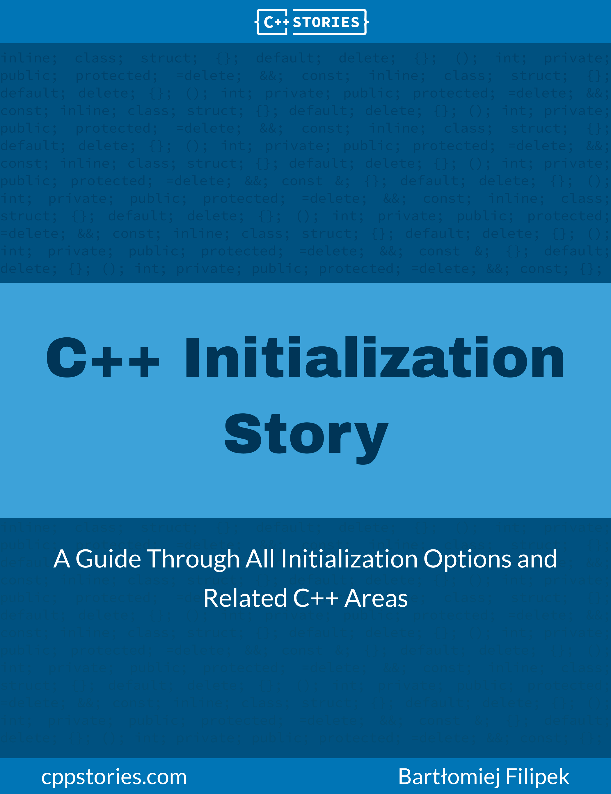

**C++ Initialization Story**

A Guide Through All Initialization Options and Related

C++ Areas

 

Bartłomiej Filipek

This book is for sale at [http://leanpub.com/cppinitbook](http://leanpub.com/cppinitbook)

This version was published on 2022-12-23

 

This is a [Leanpub](https://leanpub.com/) book. Leanpub empowers authors and publishers with the Lean

Publishing process. [Lean Publishing](https://leanpub.com/manifesto) is the act of publishing an in-progress ebook using lightweight tools and many iterations to get reader feedback, pivot until you have the right book and build traction once you do.

© 2021 - 2022 Bartłomiej Filipek

## **Contents**

**About the Book** . . . . . . . . . . . . . . . . . . . . . . . . . . . . . . . . . . . . . . . . . **i**

Why should you read this book? . . . . . . . . . . . . . . . . . . . . . . . . . . . . . i

Learning objectives . . . . . . . . . . . . . . . . . . . . . . . . . . . . . . . . . . . . . i

The structure of the book . . . . . . . . . . . . . . . . . . . . . . . . . . . . . . . . . ii

Who is this book for? . . . . . . . . . . . . . . . . . . . . . . . . . . . . . . . . . . . iii

Prerequisites . . . . . . . . . . . . . . . . . . . . . . . . . . . . . . . . . . . . . . . . . iii

Reader feedback & errata . . . . . . . . . . . . . . . . . . . . . . . . . . . . . . . . . iii

Example code . . . . . . . . . . . . . . . . . . . . . . . . . . . . . . . . . . . . . . . . iv

Code license . . . . . . . . . . . . . . . . . . . . . . . . . . . . . . . . . . . . . . . . . iv

Formatting . . . . . . . . . . . . . . . . . . . . . . . . . . . . . . . . . . . . . . . . . iv

Special sections . . . . . . . . . . . . . . . . . . . . . . . . . . . . . . . . . . . . . . . vi

**About the Author** . . . . . . . . . . . . . . . . . . . . . . . . . . . . . . . . . . . . . . . **vii**

**Acknowledgements** . . . . . . . . . . . . . . . . . . . . . . . . . . . . . . . . . . . . . . **viii**

**Revision History** . . . . . . . . . . . . . . . . . . . . . . . . . . . . . . . . . . . . . . . . **ix**

**1. Local Variables and Simple Types** . . . . . . . . . . . . . . . . . . . . . . . . . . . **1**

Starting with simple types . . . . . . . . . . . . . . . . . . . . . . . . . . . . . . . . . 2

Setting values to zero . . . . . . . . . . . . . . . . . . . . . . . . . . . . . . . . . . . 5

Initialization with aggregates . . . . . . . . . . . . . . . . . . . . . . . . . . . . . . . 6

Default data member initialization . . . . . . . . . . . . . . . . . . . . . . . . . . . . 8

Summary . . . . . . . . . . . . . . . . . . . . . . . . . . . . . . . . . . . . . . . . . . 9

**2. Initialization With Constructors** . . . . . . . . . . . . . . . . . . . . . . . . . . . . **11**

A simple class type . . . . . . . . . . . . . . . . . . . . . . . . . . . . . . . . . . . . . 11

Basics of constructors . . . . . . . . . . . . . . . . . . . . . . . . . . . . . . . . . . . 14

Body of a constructor . . . . . . . . . . . . . . . . . . . . . . . . . . . . . . . . . . . 23

Adding constructors to DataPacket . . . . . . . . . . . . . . . . . . . . . . . . . . . 24

## CONTENTS

Compiler-generated default constructors . . . . . . . . . . . . . . . . . . . . . . . . 26

Explicit constructors and conversions . . . . . . . . . . . . . . . . . . . . . . . . . . 29

Difference between direct and copy initialization . . . . . . . . . . . . . . . . . . . 32

Implicit conversion and converting constructors . . . . . . . . . . . . . . . . . . . . 34

Constructor summary . . . . . . . . . . . . . . . . . . . . . . . . . . . . . . . . . . . 37

**3. Copy and Move Operations** . . . . . . . . . . . . . . . . . . . . . . . . . . . . . . . **38**

Copy constructor . . . . . . . . . . . . . . . . . . . . . . . . . . . . . . . . . . . . . . 38

Move constructor . . . . . . . . . . . . . . . . . . . . . . . . . . . . . . . . . . . . . . 46

Distinguishing from assignment . . . . . . . . . . . . . . . . . . . . . . . . . . . . . 53

Adding debug logging to constructors . . . . . . . . . . . . . . . . . . . . . . . . . . 57

Trivial classes and user-provided default constructors . . . . . . . . . . . . . . . . . 59

**4. Delegating and Inheriting Constructors** . . . . . . . . . . . . . . . . . . . . . . . **64**

Delegating constructors . . . . . . . . . . . . . . . . . . . . . . . . . . . . . . . . . . 64

Limitations . . . . . . . . . . . . . . . . . . . . . . . . . . . . . . . . . . . . . . . . . 66

Inheritance . . . . . . . . . . . . . . . . . . . . . . . . . . . . . . . . . . . . . . . . . 68

Inheriting constructors . . . . . . . . . . . . . . . . . . . . . . . . . . . . . . . . . . . 71

**5. Destructors** . . . . . . . . . . . . . . . . . . . . . . . . . . . . . . . . . . . . . . . . . **73**

Basics . . . . . . . . . . . . . . . . . . . . . . . . . . . . . . . . . . . . . . . . . . . . 73

Objects allocated on the heap . . . . . . . . . . . . . . . . . . . . . . . . . . . . . . . 76

Destructors and data members . . . . . . . . . . . . . . . . . . . . . . . . . . . . . . 78

Virtual destructors and polymorphism . . . . . . . . . . . . . . . . . . . . . . . . . . 80

Partially created objects . . . . . . . . . . . . . . . . . . . . . . . . . . . . . . . . . . 83

A compiler-generated destructor . . . . . . . . . . . . . . . . . . . . . . . . . . . . . 87

Summary and use cases . . . . . . . . . . . . . . . . . . . . . . . . . . . . . . . . . . 88

**6. Type Deduction and Initialization** . . . . . . . . . . . . . . . . . . . . . . . . . . . **89**

Deduction with auto . . . . . . . . . . . . . . . . . . . . . . . . . . . . . . . . . . . . 89

Rules for auto type deduction . . . . . . . . . . . . . . . . . . . . . . . . . . . . . . 91

Deduction with decltype . . . . . . . . . . . . . . . . . . . . . . . . . . . . . . . . . 95

Printing type info . . . . . . . . . . . . . . . . . . . . . . . . . . . . . . . . . . . . . . 96

Structured bindings in C++17 . . . . . . . . . . . . . . . . . . . . . . . . . . . . . . . 98

Lifetime extension, references, and loops . . . . . . . . . . . . . . . . . . . . . . . . 103

Almost Always Auto . . . . . . . . . . . . . . . . . . . . . . . . . . . . . . . . . . . . 105

Summary . . . . . . . . . . . . . . . . . . . . . . . . . . . . . . . . . . . . . . . . . . 107

**7. Quiz from Chapters 1…6** . . . . . . . . . . . . . . . . . . . . . . . . . . . . . . . . . **109**

## CONTENTS

**8. Non-Static Data Member Initialization** . . . . . . . . . . . . . . . . . . . . . . . . **112**

How it works . . . . . . . . . . . . . . . . . . . . . . . . . . . . . . . . . . . . . . . . 112

Investigation . . . . . . . . . . . . . . . . . . . . . . . . . . . . . . . . . . . . . . . . 113

Experiments . . . . . . . . . . . . . . . . . . . . . . . . . . . . . . . . . . . . . . . . . 114

Other forms of NSDMI . . . . . . . . . . . . . . . . . . . . . . . . . . . . . . . . . . . 116

Copy constructor and NSDMI . . . . . . . . . . . . . . . . . . . . . . . . . . . . . . 120

Move constructor and NSDMI . . . . . . . . . . . . . . . . . . . . . . . . . . . . . . 122

C++14 changes . . . . . . . . . . . . . . . . . . . . . . . . . . . . . . . . . . . . . . . 124

C++20 changes . . . . . . . . . . . . . . . . . . . . . . . . . . . . . . . . . . . . . . . 124

Limitations of NSDMI . . . . . . . . . . . . . . . . . . . . . . . . . . . . . . . . . . . 125

NSDMI: Advantages and Disadvantages . . . . . . . . . . . . . . . . . . . . . . . . . 129

NSDMI summary . . . . . . . . . . . . . . . . . . . . . . . . . . . . . . . . . . . . . . 130

**9. Containers as Data Members** . . . . . . . . . . . . . . . . . . . . . . . . . . . . . . **132**

The basics . . . . . . . . . . . . . . . . . . . . . . . . . . . . . . . . . . . . . . . . . . 132

Using std::initializer list . . . . . . . . . . . . . . . . . . . . . . . . . . . . . . 135

Example implementation . . . . . . . . . . . . . . . . . . . . . . . . . . . . . . . . . 139

The cost of copying elements . . . . . . . . . . . . . . . . . . . . . . . . . . . . . . . 144

Some inconvenience - non-copyable types . . . . . . . . . . . . . . . . . . . . . . . 146

More options (advanced) . . . . . . . . . . . . . . . . . . . . . . . . . . . . . . . . . 147

Summary . . . . . . . . . . . . . . . . . . . . . . . . . . . . . . . . . . . . . . . . . . 148

**10. Non-regular Data Members** . . . . . . . . . . . . . . . . . . . . . . . . . . . . . . . **150**

Constant non-static data members . . . . . . . . . . . . . . . . . . . . . . . . . . . . 150

Pointers as data members . . . . . . . . . . . . . . . . . . . . . . . . . . . . . . . . . 153

Smart pointers as data members . . . . . . . . . . . . . . . . . . . . . . . . . . . . . 156

References as data members . . . . . . . . . . . . . . . . . . . . . . . . . . . . . . . . 164

Summary . . . . . . . . . . . . . . . . . . . . . . . . . . . . . . . . . . . . . . . . . . 168

**11. Non-local objects** . . . . . . . . . . . . . . . . . . . . . . . . . . . . . . . . . . . . . **170**

Storage duration and linkage . . . . . . . . . . . . . . . . . . . . . . . . . . . . . . . 170

Initialization of non-local static objects . . . . . . . . . . . . . . . . . . . . . . . . . 180

constinit in C++20 . . . . . . . . . . . . . . . . . . . . . . . . . . . . . . . . . . . . 182

Static variables in a function scope . . . . . . . . . . . . . . . . . . . . . . . . . . . . 185

About static data members . . . . . . . . . . . . . . . . . . . . . . . . . . . . . . . . 187

Motivation for inline variables . . . . . . . . . . . . . . . . . . . . . . . . . . . . . . 189

Global inline variables . . . . . . . . . . . . . . . . . . . . . . . . . . . . . . . . . . . 196

constexpr and inline variables . . . . . . . . . . . . . . . . . . . . . . . . . . . . . 197

Summary . . . . . . . . . . . . . . . . . . . . . . . . . . . . . . . . . . . . . . . . . . 197

## CONTENTS

**12. Aggregates and Designated Initializers in C++20** . . . . . . . . . . . . . . . . . . **199**

Aggregates in C++20 . . . . . . . . . . . . . . . . . . . . . . . . . . . . . . . . . . . . 199

The basics of Designated Initializers . . . . . . . . . . . . . . . . . . . . . . . . . . . 202

Rules . . . . . . . . . . . . . . . . . . . . . . . . . . . . . . . . . . . . . . . . . . . . . 203

Advantages of designated initialization . . . . . . . . . . . . . . . . . . . . . . . . . 204

Examples . . . . . . . . . . . . . . . . . . . . . . . . . . . . . . . . . . . . . . . . . . 205

Summary . . . . . . . . . . . . . . . . . . . . . . . . . . . . . . . . . . . . . . . . . . 207

**13. Techniques and Use Cases** . . . . . . . . . . . . . . . . . . . . . . . . . . . . . . . . **208**

Using explicit for strong types . . . . . . . . . . . . . . . . . . . . . . . . . . . . . 208

Best way to initialize string data members . . . . . . . . . . . . . . . . . . . . . . 212

Reducing extra copies through emplace and in_place . . . . . . . . . . . . . . . . 215

The copy and swap idiom . . . . . . . . . . . . . . . . . . . . . . . . . . . . . . . . . 221

CRTP class counter . . . . . . . . . . . . . . . . . . . . . . . . . . . . . . . . . . . . . 223

Several initialization types in one class . . . . . . . . . . . . . . . . . . . . . . . . . 226

Meyer’s Singleton and C++11 . . . . . . . . . . . . . . . . . . . . . . . . . . . . . . . 230

Factory with selfregistering types and static initialization . . . . . . . . . . . . . . 231

Summary . . . . . . . . . . . . . . . . . . . . . . . . . . . . . . . . . . . . . . . . . . 237

**14. The Final Quiz And Exercises** . . . . . . . . . . . . . . . . . . . . . . . . . . . . . . **238**

Exercises . . . . . . . . . . . . . . . . . . . . . . . . . . . . . . . . . . . . . . . . . . . 242

**Appendix A - Rules for Special Member Function Generation** . . . . . . . . . . . . **248**

The diagram . . . . . . . . . . . . . . . . . . . . . . . . . . . . . . . . . . . . . . . . . 248

Rules . . . . . . . . . . . . . . . . . . . . . . . . . . . . . . . . . . . . . . . . . . . . . 251

**Appendix B - Quiz and Exercises Answers** . . . . . . . . . . . . . . . . . . . . . . . . **254**

The quiz from chapters 1…6 . . . . . . . . . . . . . . . . . . . . . . . . . . . . . . . . 254

The final quiz . . . . . . . . . . . . . . . . . . . . . . . . . . . . . . . . . . . . . . . . 254

Solution to the first coding problem, NSDMI . . . . . . . . . . . . . . . . . . . . . . 255

Solution to the second coding problem, NSDMI . . . . . . . . . . . . . . . . . . . . 255

Solution to the third coding problem, inline . . . . . . . . . . . . . . . . . . . . . 257

Solution to the fourth coding problem, fix code . . . . . . . . . . . . . . . . . . . . 257

**References** . . . . . . . . . . . . . . . . . . . . . . . . . . . . . . . . . . . . . . . . . . . . **259**