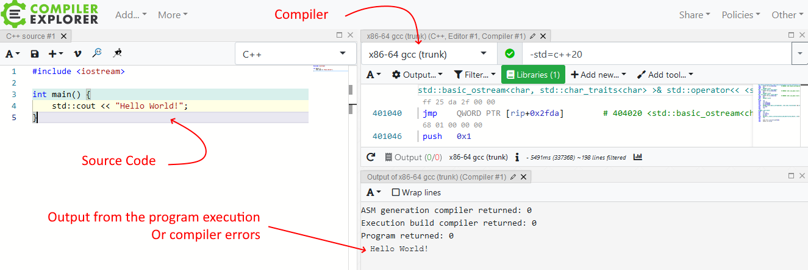

**About the Book**

Initialization in C++ is a hot topic! The internet is full of discussions about best practices, and there are even funny memes on that subject. The situation is not surprising, as there are more than a dozen ways to initialize a simple integer value, complex rules for the auto-type deduction, data members, and object lifetime nuances.

And here comes the book.

Throughout this text, you will learn practical options to initialize various categories of variables and data members in Modern C++. More specifically, this text teaches multiple types of initialization, constructors, non-static data member initialization, inline variables, designated initializers, and more. Additionally, you’ll see the changes and new techniques from C++11 to C++20 and lots of examples to round out your understanding.

The plan is to explain most (if not all) parts of initialization, learn lots of excellent C++ techniques, and see what happens under the hood.

 

**Why should you read this book?**

With Modern C++ (since C++11), we have many new features to streamline work and simplify our code. One area of improvement is the initialization. Modern C++ added new initialization rules, trying to make it easy while keeping old behavior and compatibility (mainly from the C language). Sometimes the rules might seem confusing and complex, though, and even the ISO committee might need to correct some things along the way. The book will help you navigate through those principles and understand this topic better. What’s more, initialization is just one aspect of this text. You’ll learn all related topics around classes, constructors, destructors, object lifetime, or even how the compiler processes data at startup.

 

**Learning objectives**

The goal is to equip you with the following knowledge:

• Explain rules about object initialization, including regular variables, data members,

and non-local objects.

### i About the Book ii

• How to implement special member functions (constructors, destructors, copy/move

operations) and when they are helpful.

• How to efficiently initialize non-static data members using C++11 features like non-static data member initialization, inheriting, and delegating constructors.

• How to streamline working with static variables and static data members with inline

variables from C++17.

• How to work with container-like members, non-copyable data members (like const

data members) or moveable only data members, or even lambdas.

• What is an aggregate, and how to create such objects with designated initializers from

C++20.

 

**The structure of the book**

The book contains 14 chapters in the following structure:

• Chapters 1 to 5 create a foundation for the rest of the book. They cover basic

initialization rules, constructors, destructors, and the basics of data members.

• Chapter 6 is a short quiz on constructors. You can check your knowledge from the first

“part” of the book.

• Chapter 7 (in progress): Type deduction.

• Chapter 8 describes Non-static Data Member Initialization (NSDMI), a powerful

feature from C++11 that improves how we work with data members. At the end of the chapter, you can solve a few exercises.

• Chapter 9 discusses how to initialize container-like data members.

• Chapter 10 contains information about non-regular data members and how to handle

them in a class. You’ll learn about const data members, unique_ptr as a data member, and references.

• Chapter 11 describes static non-local variables, static objects, various storage duration

options, and inline variables from C++17 and constinit from C++20.

• Chapter 12 moves to C++20 and describes Designated Initializers, a handy feature

based on similar thing from the C language.

• Chapter 13 shows various techniques like passing strings into constructors, strong

typing, CRTP class counter, Copy and swap idiom, and more.

• Chapter 14 is the final quiz with questions from the whole book.

About the Book iii

 

And there are two appendices:

• Appendix A - a handy guide about rules for compiler-generated special member

functions.

• Appendix B - answers to quizzes and exercises.

 

**Who is this book for?**

The book is intended for beginner/intermediate C++ programmers who want to learn various aspects of initialization in Modern C++ (from C++11 to C++20).

You should know at least some of the basics of creating and using custom classes.

This text is also helpful for experienced programmers who know older C++ standards and want to move into C++17/C++20.

 

**Prerequisites**

• You should have basic knowledge of C++ expressions and primitive types.

• You should be able to implement an elementary class with several data members. Know

how to create and manipulate objects of such a class in a basic way.

 

**Reader feedback & errata**

If you spot an error, a typo, a grammar mistake, or anything else (especially logical issues!) that should be corrected, please send your feedback to bartek@cppstories.com.

Here’s the errata with the list of fixes:

https://www.cppstories.com/p/cppinitbook/

Your feedback matters! Writing an honest review can help with the book promotion and the quality of my further work.

What’s more, the book has a dedicated page at GoodReads. Please share your feedback at:

[C++ Initialization Story by Bartłomiej Filipek¹](https://www.goodreads.com/book/show/62606823-c-initialization-story).

¹<https://www.goodreads.com/book/show/62606823-c-initialization-story> About the Book iv

 

**Example code**

You can find source code of all examples in this separate GitHub public repository.

*the link will appear later*

You can browse individual files or download the whole branch:

*the link will appear later*

 

**Code license**

The code for the book is available under the Creative Commons License.

 

**Formatting**

Code samples are presented in a monospaced font, similar to the following example:

For longer examples:

**Title Of the Example**

\#include \<iostream\>

**int** main() {

**const** std::string text { "Hello World" };

std::cout \<\< text \<\< '\n';

}

Or shorter snippets (without a title and sometimes include statements):

**int** foo() {

**return** std::clamp(100, 1000, 1001); }

When available, you’ll also see a link to online compilers where you can play with the code. For example:

About the Book v

 

**Example title. Run** [**@Compiler Explorer**](https://godbolt.org/z/zMEnd5z6b)

\#include \<iostream\>

**int** main() {

std::cout \<\< "Hello World!";

}

You can click on the link in the title, and then it should open the website of a given online compiler (in the above case, it’s Compiler Explorer). You can compile the sample, see the output, and experiment with the code directly in your browser. Here’s a basic overview of Compiler Explorer:

 

**A Compiler Explorer layout used in the book**

Snippets of longer programs were usually shortened to present only the core mechanics.

 

**Syntax highlighting limitations**

The current version of the book might show some limitations regarding syntax highlighting.

For example:

• if constexpr- Link to Pygments issue: [C++ if constexpr not recognized (C++17) ·](https://github.com/pygments/pygments/issues/1136)

[Issue \#1136²](https://github.com/pygments/pygments/issues/1136).

• The first method of a class is not highlighted -[First method of class not highlighted in](https://github.com/pygments/pygments/issues/791)

[C++ · Issue \#791³](https://github.com/pygments/pygments/issues/791).

²<https://github.com/pygments/pygments/issues/1136>

³<https://github.com/pygments/pygments/issues/791>

About the Book vi

 

• Template method is not highlighted [C++ lexer doesn’t recognize function if return type](https://github.com/pygments/pygments/issues/1138)

[is templated · Issue \#1138⁴](https://github.com/pygments/pygments/issues/1138).

• Modern C++ attributes are sometimes not appropriately recognized.

Other issues for C++ and Pygments: [C++ Issues · github/pygments/pygments⁵](https://github.com/pygments/pygments/issues?q=is:issue+is:open+C%2B%2B).

 

**Special sections**

Throughout the book, you can also see the following sections:

This is an Information Box with extra notes related to the current section.

 

This is a Warning Box with potential risks and threats related to a given topic.

 

This is a Quote Box. In the book, it’s often used to quote the C++ Standard.

 

⁴<https://github.com/pygments/pygments/issues/1138>

⁵[https://github.com/pygments/pygments/issues?q=is%3Aissue+is%3Aopen+C%2B%2B](https://github.com/pygments/pygments/issues?q=is:issue+is:open+C%2B%2B)