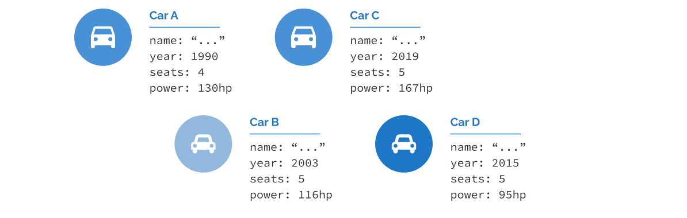

**1. Local Variables and Simple Types**

 

Let’s start simple and ask, “what is initialization?” When we go to the definition from

[C++Reference¹](https://en.cppreference.com/w/cpp/language/initialization), we can read:

 

*Initialization* of a variable provides its initial value at the time of construction.

 

We can translate this definition to the following example:

**void** foo() {

**int** x = 42;

// ... use 'x' later...

}

Above, we have a function with a local variable x. The variable is declared as integer and initialized with the value 42. This is one of many ways you can assign that initial value. Here are some more options:

**struct Point** { **int** x; **int** y; }; // declare a custom type Point createPoint(**int** x) { **return** {x,-x}; } **int** main() {

**int** x { 42 }; // list initialization

**double** y = { 100.0 }; // copy list initialization

**auto** ptr = std::make_unique\<**float**\>(90.5f); // auto type deduction

**auto** z = createPoint(42); // through a factory function

std::string s (10, 'x'); // calling a constructor

Point p { 10 }; // aggregate initialization

std::array\<**float**, 100\> numbers { 1.1f, 2.2f }; // array initialization

// ...

}

¹<https://en.cppreference.com/w/cpp/language/initialization>

 

1

Local Variables and Simple Types 2

 

You can also come up with many other forms of setting a value. We can also extend the syntax on class data members, static variables, thread locals, or even dynamic memory allocations.

In theory, initialization is simple: “put a value into a memory location of a newly created variable”. However, such action relates to many parts of application code (local vs. non-local scope vs. thread) and various places in the memory (like stack vs. heap). That’s why the syntax or the behavior might be slightly different.

In C++, we have at least the following forms of initialization:

• aggregate initialization

• constant initialization

• default initialization

• direct initialization

• copy initialization

• list initialization

• reference initialization

• value initialization

• zero initialization

• plus related topics like copy elision, static variables, conversion sequences, constructors,

assignment, dynamic memory, storage, and more.

While the list sounds complex, we’ll move through those topics step by step revealing core concepts. Later we’ll address more advanced examples and see what happens inside the C++ machinery.

While we can explain most cases on integers and other numerical types, it’s best to work on something more practical. The book starts with some elementary custom types, then considers various issues we might have with their early implementations. Later the types will expand, giving us more context and compelling use cases.

 

**Starting with simple types**

Defining a class or a struct (a custom type) in C++ allows you to model your problem domain and solve problems more naturally. Rather than working with a bunch of variables and functions, it’s best to group them and provide a consistent API (Application Programming Local Variables and Simple Types 3

 

Interface). C++ provides a set of built-in types, including boolean, integral, character, and floating-point. Additionally, you can use objects from the Standard Library, like various collections, std::string, std::vector, std::map, std::set, and many others. You can collect these essential components and build your types.

To create a background for our main topic, let’s start with a type representing Car Information for a car listing app. A system reads the car/truck information from a database and displays it in the application. For an easy start, the type holds four members: name (a std::string), production year, number of seats, and engine power.

 

Below there’s the first version of the code for that CarInfo type:

**Ex 1.1. Simple** **CarInfo** **structure. Run** [**@Compiler Explorer**](https://godbolt.org/z/GYxe4a839)

\#include \<iostream\>

\#include \<string\>

**struct CarInfo** {

std::string name;

**unsigned** year;

**unsigned** seats;

**double** power;

};

**int** main() {

CarInfo firstCar;

firstCar.name = "Renault Megane";

firstCar.year = 2003;

firstCar.seats = 5;

firstCar.power = 116;

Local Variables and Simple Types 4

std::cout \<\< "name: " \<\< firstCar.name \<\< '\n';

std::cout \<\< "year: " \<\< firstCar.year \<\< '\n';

std::cout \<\< "seats: " \<\< firstCar.seats \<\< '\n';

std::cout \<\< "power (hp): " \<\< firstCar.power \<\< '\n'; }

 

In the above example, we defined a simple structure that holds data for a CarInfo. The code is super simple, contains some issues, and follows the style of C++03. In the following few chapters, I’ll guide you through the code and help you understand the problems and how to eliminate them. We’ll also modernize it to include the latest C++ (up to C++20) features.

First: name, year, seats, and power are called *non-static data members*. Each instance of the CarInfo class has its own set of those members. In other words, we group variables to create a representation for models in our problem domain. A user-defined type might also have *static data members*, which are data shared between all instances of a given type. For example, we could imagine a *static* member variable called numAllCars that would indicate the total number of cars created in our program. We’ll talk about *static data members* later

in chapter 11 Static Variables.

Now, let’s investigate the code in detail. The definition and the declaration of the variable firstCar in the main() function:

CarInfo firstCar;

It is called *default initialization* and, since our struct is simple, will leave all data members of built-in types with *indeterminate values*. Similarly, you can get the same (potentially buggy effect) for simple types when declared in function (as such variables have automatic

storage duration) ²:

**void** foo() {

**int** i; // indeterminate value!

**double** d; // indeterminate value! }

The std::string data member name, on the other hand, will have an empty state (an empty string) because its default constructor will be called. More on that later.

²In contrast, static and thread-local objects will be zero-initialized.

Local Variables and Simple Types 5

 

Once the object is created and uninitialized, we can access its members and set proper values. By default, struct has public access to its members (and class has private access). This way, we can access and change their values directly.

**What is “Automatic Storage Duration”?**

All objects in a program have four possible ways to be “stored”: automatic, static, thread, or dynamic. Automatic means that the storage is allocated at the start of the scope, like in a function. Most local variables have automatic storage duration (except those declared as static, extern, or thread_local). We’ll discuss this

more in the chapter on non-local objects³.

 

**Setting values to zero**

You might feel very unsatisfied that after creating a CarInfo object, most data members have some indeterminate values. We can fix this and make sure the data is at least set to “zero”. Have a look:

**Ex 1.2. Value initialization for the** **CarInfo** **structure. Run** [**@Compiler Explorer**](https://godbolt.org/z/sKKMPoE8W) CarInfo emptyCar{};

std::cout \<\< "name: " \<\< emptyCar.name \<\< '\n'; std::cout \<\< "year: " \<\< emptyCar.year \<\< '\n'; std::cout \<\< "seats: " \<\< emptyCar.seats \<\< '\n'; std::cout \<\< "power (hp): " \<\< emptyCar.power \<\< '\n';

 

The output:

name:

year: 0

seats: 0

power (hp): 0

The initialization with empty braces {} is called *value initialization* and, by default (for built-in types and classes with default constructors that are neither user-provided nor deleted), sets data to “zero” (adapted for different types). This is similar to declaring and defining the following variables:

³chapterinlinevars Local Variables and Simple Types 6

**int** i{}; // i == 0

**double** d{}; // d == 0.0

std::string s{}; // s is an empty string

**int** j = {}; // other form of value initialization std::string str = {}; // ...

This time the storage duration doesn’t matter, and value initialization works the same for static, dynamic, thread-local, or automatic variables. For types with default constructors (more on that later), the code will call them and, in the case of string s; will initialize it to an empty string.

 

**Initialization with aggregates**

Our structure is very simple, and for such types, C++ has special rules where we can initialize their internal values with so-called *aggregate initialization*. We can use such syntax also for arrays. Here are some basic examples:

**Ex 1.3. Aggregate Initialization basic syntax. Run** [**@Compiler Explorer**](https://godbolt.org/z/9jq9eTz63)

// arrays:

**int** arr\[\] { 1, 2, 3, 4 };

**float** numbers\[\] = { 0.1f, 1.1f, 2.2f, 3.f, 4.f, 5. }; **int** nums\[10\] { 1 }; // 1, and then all 0s

// structures:

**struct Point** { **int** x; **int** y; };

**struct Line** { Point p1; Point p2; }; Line longLone {0, 0, 100, 100};

Line anotherLine = {100}; // rest set to 0 Line shortLine {{-10,-10}, {10, 10}}; // nested

 

In summary, for the above code:

• Each array element, or non-static class member, in order of array subscript/appear—

ance in the class definition, is copy-initialized from the corresponding clause of the initializer list.

Local Variables and Simple Types 7

 

• You can use list initialization for arrays, and when the number of elements is not

provided, the compiler will deduce the count.

• If you pass fewer elements in the initializer list than the number of elements in the

array, the remaining elements will be value initialized. For built-in types, it means the value of zero.

• For structures, you can use a single initializer list or nested one; the expansion will be

recursive.

• If you provide fewer values than the number of data members in the aggregate, then the

remaining data members (in the declaration order) will be effectively value initialized.

The first bullet point says that each element is *copy initialized*. We’ll return to this topic and explain the difference between a copy vs. direct initialization syntax once we know explicit constructors.

For our structure, we can write the following test code:

**Ex 1.4. Aggregate initialization for the** **CarInfo** **structure. Run** [**@Compiler Explorer**](https://godbolt.org/z/5zvd5fehf)

**struct CarInfo** {

std::string name;

**unsigned** year;

**unsigned** seats;

**double** power;

};

**void** printInfo(**const** CarInfo& c) {

std::cout \<\< c.name \<\< ", "

\<\< c.year \<\< " year, " \<\< c.seats \<\< " seats, " \<\< c.power \<\< " hp**\n**";

}

**int** main() {

CarInfo firstCar{"Megane", 2003, 5, 116 };

printInfo(firstCar);

CarInfo partial{"unknown"};

printInfo(partial);

CarInfo largeCar{"large car", 1975, 10};

printInfo(largeCar);

}

Local Variables and Simple Types 8

 

This will output:

Megane, 2003 year, 5 seats, 116 hp

unknown, 0 year, 0 seats, 0 hp

large car, 1975 year, 10 seats, 0 hp

Without going into full definitions, an aggregate means a simple type (or an array) with all public data members, no virtual functions, and user-provided constructors.

We’ll discuss aggregates in further parts of the book (and see the full definition of that

category of types). And there’s a dedicated chapter about Aggregates and Designated

Initialization in C++20.

 

**Default data member initialization**

What if you want to provide some default value for your data member? With value initialization, you can get zeros for various types, but sometimes it might not be good enough.

Since C++14, we can leverage Non-static Data Member Initializers (NSDMI), also called Default Member Initializers, to provide default values for aggregates. Have a look:

**Ex 1.5. Default member initialization and aggregates. Run** [**@Compiler Explorer**](https://godbolt.org/z/Mr49dTnfz)

\#include \<iostream\>

\#include \<string\>

**struct CarInfo** {

std::string name { "unknown" };

**unsigned** year { 1920 };

**unsigned** seats { 4 };

**double** power { 100. };

};

**void** printInfo(**const** CarInfo& c) { /\* \*/ }

**int** main() {

CarInfo unknown;

printInfo(unknown);

CarInfo zeroed{};

Local Variables and Simple Types 9

printInfo(zeroed);

CarInfo partial{"large car", 1975};

printInfo(partial);

}

This will print:

unknown, 1920 year, 4 seats, 100 hp

unknown, 1920 year, 4 seats, 100 hp

large car, 1975 year, 4 seats, 100 hp

The syntax is quite intuitive; you can initialize a data member at the place where it’s declared. This can prevent accidental bugs where your data has some indeterminate value. As you can see from the example, even if you use default initialization or value initialization, data members will get values that were provided in the struct declaration. If you give fewer values in the aggregate initializer, the remaining members will get their defaults from the declaration.

Technically, in-class member initializers have been available since C++11, but aggregate types weren’t supported initially. In this section, we’ve only scratched the surface of

this handy technique. See the dedicated chapter for this topic: Non-static data member

initialization chapter.

 

**Summary**

In this chapter, we covered some simple custom types and looked at ways to initialize their data members. We went from objects with indeterminate values to zero initialization, and then we learned about aggregates and techniques to provide default values.

Things to keep in mind:

• Default initialization for objects and variables yields indeterminate values for built-in types or default-initialize complex types (like std::string and set it to an empty string). That’s why it’s essential to **be sure your objects and simple variables are** **always initialized**.

• Value initialization like int x{}; for built-in types effectively yields zero initialization

for them so that they will be zero (in their type).

Local Variables and Simple Types 10

 

• With value initialization CarInfo car{}; all data members will be zero-initialized

(for built-in types) or default initialized for complex types.

• Aggregates are simple types or arrays with all public data members; we can initialize

them with an aggregate initialization syntax.

• Thanks to the in-class member initializer feature, you can provide default values for

your data members.

**What’s next?**

While simple types are handy, in C++, we often need to build large objects where data members depend on each other or have invariants. In such cases, it’s best to hide them behind member functions and give access to them under certain conditions. In the next chapter, we’ll look at class’s and **constructors**. We’ll also expand the knowledge that we got so far.