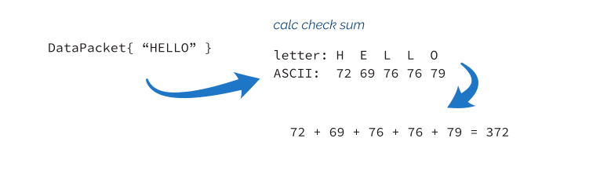
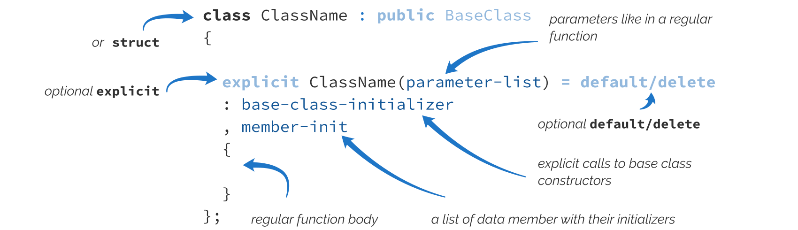

**2. Initialization With Constructors**

In the previous chapter, you’ve seen that C++ might treat simple structures with all public data members as an aggregate class. Still, aggregates are insufficient if we want better data encapsulation and a more complex class API. For full flexibility in C++, we can leverage constructors that are special member functions invoked when an object is created.

**A simple class type**

As a background example, let’s create a type that will hold some elementary network data. To complicate things, we’d like to compute a basic checksum for the data part. Such a checksum might be handy for checking if the data was transferred correctly across the Internet (read

more [@Wikipedia](https://en.wikipedia.org/wiki/Checksum)¹).

**Ex 2.1. Simple** **DataPacket** **class. Run** [**@Compiler Explorer**](https://godbolt.org/z/T6EMaG8KW)

**size_t** calcCheckSum(**const** std::string& s) {

**return** std::accumulate(s.begin(), s.end(), 0uz); }

**class DataPacket** {

std::string data\_;

**size_t** checkSum\_;

**size_t** serverId\_;

**public**:

**const** std::string& getData() **const** { **return** data\_; }

**void** setData(**const** std::string& data) {

data\_ = data;

checkSum\_ = calcCheckSum(data);

}

**size_t** getCheckSum() **const** { **return** checkSum\_; }

**size_t** getServerId() **const** { **return** serverId\_; }

**void** setServerId(**size_t** serverId) { serverId\_ = serverId; } };

¹<https://en.wikipedia.org/wiki/Checksum>

11

Initialization With Constructors 12

The class above contains three *non-static data members*: data\_, checkSum\_, and serverID\_. I’m using the underscore suffix to indicate private data members, a common practice in

many codebases. See [Google C++ Style Guide](https://google.github.io/styleguide/cppguide.html#Variable_Names)².

To keep things simple, I implemented the calcCheckSum function in terms of std::accumulate(), which is an algorithm from the C++ Standard Library. This code starts from 0 and adds numerical values of letters from the input std::string. Since C++23, we can use the 0UZ integer literal to represent the size_t so that it matches with the return type for the function; alternatively, we could use static_cast\<size_t\> or UL/ULL for 32/64-bit systems respectively. For example, for "HELLO", we’ll get the following computations:

**Calculating simple checksum for a string**

DataPacket has so-called getters and setters - functions that return or change a particular data member. For example getData() returns the data\_ data member, while setData(...) allows us to change it.

One important topic is that getters usually have const applied at the end. This means that a given member function is constant and cannot change the value of the members (unless they are mutable). If you have a const object, you can only call its const member functions. Applying const might improve program design as it’s usually easier to reason about the state

of const instances. For more information, see this C++ core guideline: [Con.2: By default,](https://isocpp.github.io/CppCoreGuidelines/CppCoreGuidelines#con2-by-default-make-member-functions-const)

[make member functions const](https://isocpp.github.io/CppCoreGuidelines/CppCoreGuidelines#con2-by-default-make-member-functions-const)³.

Member functions might also have noexcept specifier applied. However, this topic is outside the scope of the book and won’t be covered. You can find more

[@C++Reference -noexcept specifier⁴](https://en.cppreference.com/w/cpp/language/noexcept_spec).

²<https://google.github.io/styleguide/cppguide.html#Variable_Names>

³<https://isocpp.github.io/CppCoreGuidelines/CppCoreGuidelines#con2-by-default-make-member-functions-const>

⁴<https://en.cppreference.com/w/cpp/language/noexcept_spec> Initialization With Constructors 13

Here’s the continuation of the example where we create and use the object of the DataPacket class:

**Ex 2.2. Simple** **DataPacket** **class, continuation. Run** [**@Compiler Explorer**](https://godbolt.org/z/jK38bebef) **int** main() {

DataPacket packet;

packet.setData("Programming World");

std::cout \<\< packet.getCheckSum() \<\< '\n'; }

The code doesn’t access data members directly but calls member functions to operate on the object and change its properties.

You can notice the public and private parts in the class declaration. The order of those sections is just a coding convention, and they group elements together based on their *access* *modifier*. In short, a member under the public keyword can be accessed from the outside (like calling a member function or accessing a data member). On the other hand, members

under the private section cannot be accessed from outside⁵. In C++, you can also add protected to your class declaration, which means that member functions or fields are not accessible outside, but they are accessible to all inherited classes (assuming public

inheritance, see more on that in the inheritance section further in the book).

For example, in the main() function above, I cannot write:

DataPacket packet;

packet.serverId = 10; // error: 'size_t DataPacket::serverId' is private...

The only difference between class and struct in C++ is that class has private as the default access modifier and private inheritance, while struct has both

specified as public. Some C++ guidelines, for example, Google Style Guide [see](https://google.github.io/styleguide/cppguide.html#Structs_vs._Classes)

[this link⁶](https://google.github.io/styleguide/cppguide.html#Structs_vs._Classes), suggest using struct only for smaller, “passive” types, with only public data members. The C++ Core Guidelines also recommend using class if any

member is not public; see [C++ Core Guidelines - C.8⁷](https://isocpp.github.io/CppCoreGuidelines/CppCoreGuidelines#c8-use-class-rather-than-struct-if-any-member-is-non-public).

Since our class doesn’t have any user-defined constructors (more on them in the next section), we can also use value initialization syntax to set values to zero or default values:

⁵Unless accessed by friend functions or classes.

⁶<https://google.github.io/styleguide/cppguide.html#Structs_vs._Classes>

⁷[https://isocpp.github.io/CppCoreGuidelines/CppCoreGuidelines#c8-use-class-rather-than-struct-if-any-member-is-non-](https://isocpp.github.io/CppCoreGuidelines/CppCoreGuidelines#c8-use-class-rather-than-struct-if-any-member-is-non-public)

[public](https://isocpp.github.io/CppCoreGuidelines/CppCoreGuidelines#c8-use-class-rather-than-struct-if-any-member-is-non-public) Initialization With Constructors 14

**Ex 2.3. Value initialization for the** **DataPacket** **class. Run** [**@Compiler Explorer**](https://godbolt.org/z/vEhzcsK6c) **int** main() {

DataPacket packet{};

std::cout \<\< "data: " \<\< packet.getData() \<\< '\n';

std::cout \<\< "checkSum: " \<\< packet.getCheckSum() \<\< '\n';

std::cout \<\< "serverId: " \<\< packet.getServerId() \<\< '\n'; }

This will generate the following output:

data:

checkSum: 0

serverId: 0

However, the main difference now is that because we moved the data members to the private section, the class is **not an aggregate**. That’s why we cannot use aggregate initialization to set all values at once. To fix this, we need to look at constructors. And that is the plan for further sections.

**Basics of constructors**

A constructor is a special member function that does not have a name, but we declare/define

it using the enclosing class name⁸. You cannot invoke a constructor like other member functions. Instead, the compiler calls it when an object of its class is being initialized. It has the following basic syntax:

A constructor has the following parts:

⁸See the full definition at https://timsong-cpp.github.io/cppwp/n4868/class.ctor.general Initialization With Constructors 15

• constructor has no name, but we define it using the name of the class,

• optional explicit- keyword to block implicit conversions on a given class type,

• ClassName- the name of the given class type (they have to match),

• parameter-list- a list of parameters, as in a regular function, might be empty

• optional = default/=delete specifies if a constructor should be deleted (not present)

or defaulted by the compiler,

• :- indicates the start of the member/base initialization list, required when

base-class-initializer or member-init lists are present,

• optional base-class-initializer- a list of base classes’ constructors that we

explicitly want to call,

• optional member-init- a list of data members where we can directly initialize them,

• {/\*body\*/}- a function body.

You can also apply noexcept, \[\[attributes\]\], constexpr, and consteval on a constructor, but the full explanation of those additional properties goes beyond

the scope of the book. Read more at [C++Reference - Constructors and member](https://en.cppreference.com/w/cpp/language/constructor)

[initializer lists](https://en.cppreference.com/w/cpp/language/constructor)⁹.

For illustrative purposes, you can find a simple class type with two data members below. The Product class will serve as a toy example, and then we’ll apply the knowledge to the DataPacket class I plan to update. Let’s have a look at one snippet:

**class Product** {

**public**:

Product() : id\_{-1}, name\_{"none"} { } // a default constructor

**explicit** Product(**int** id, **const** std::string& name)

: id\_{id}, name\_{name} { }

**private**:

**int** id\_;

std::string name\_;

};

The above example shows a class with two constructors. The first is called a *default* *constructor*; it has no arguments. The second one takes two arguments. As you can notice,

⁹<https://en.cppreference.com/w/cpp/language/constructor> Initialization With Constructors 16

C++ allows multiple constructors that look like overloaded functions (they differ by the number or types of arguments). Each constructor also has a regular function body where you can execute some code; in our case, they are both empty for now. I also applied the explicit

keyword on the second constructor; we’ll talk about it later in the explicit constructors

section.

The primary function of constructors is to perform some actions at the start of a lifetime of an object. Usually, it means data member initialization, resource allocation (opening a file, a socket, memory allocation), or even doing some special logic (like logging).

In our case, constructors touch only data members inside a special section of constructors called *member initializer list* : like, id\_{-1}, name\_{"none"}. Inside this initializer list, we

can also call constructors of base classes (if any). Later, we’ll address inheritance in the

Inheritance section.

The *member initializer list* is more efficient than using the body of a constructor. Sometimes it’s even the only option to initialize the value, as with types that are not assignable. See the following and *wrong* alternative:

**class Product** {

**public**:

Product() { id\_ = 0; name\_ = "none"; } // bad code, only for illustration **private**:

**int** id\_;

std::string name\_;

};

The code will yield the same values for data members as in the previous example, but the data members are set in two steps rather than one. With the *member initializer list*, data members are set directly, same as calling: int id\_ { 0 } or std::string name\_ {"none"}. On the other hand, if we use assignment in the constructor body, it requires two steps:

// step 1: default init:

**int** id\_; // indeterminate value!

std::string name\_; // default ctor called // step 2: assignment:

id\_ = 0;

name\_ = "none";

Initialization With Constructors 17

While this might not be a big issue for built-in simple types like int , you’ll need some more CPU cycles for larger objects like strings. Please don’t write such code and aim for a member initializer list to initialize your data members efficiently.

There’s also one important aspect about the *initializer list*: the order of initialization. This is

covered in The C++ Specification: [11.10.3 Classes](https://timsong-cpp.github.io/cppwp/n4868/class.base.init#13.3)¹⁰:

Non-static data members are initialized in the order they were declared in the class definition (regardless of the order of the mem-initializers).

When I write the constructor in the following way:

Product() : name\_{"none"}, id\_{-1} { }

The values will be set correctly, but the order will differ from what we think. Here’s the

warning from GCC compiled with-Wall option (experiment [@Compiler Explorer](https://godbolt.org/z/jE77169qd)¹¹):

In constructor 'Product::Product()':

warning: 'Product::name\_' will be initialized after \[-Wreorder\] ... warning: 'int Product::id\_' \[-Wreorder\] ...

The initialization order might be critical when you imply some dependency on the values. For example, we can write the following artificial sample:

**struct S** {

**int** x;

**int** y;

**int** z;

S(): x{0}, y{1}, z{x+y} { }

// S(): y{0}, z{0}, x{z+y}, { }

};

In the above example, the first constructor initializes x and y and then uses those values to initialize z. This is complicated and might be hard to read, but it works correctly. On the

¹⁰<https://timsong-cpp.github.io/cppwp/n4868/class.base.init#13.3>

¹¹<https://godbolt.org/z/jE77169qd> Initialization With Constructors 18

other hand, in the second (commented out) constructor, the order of initialization will create an undefined behavior for initializing x, as z and y won’t be initialized yet. It’s best to avoid such dependencies to minimize the risk of bugs.

Let’s see how a constructor works by creating some objects of the Product class:

Product none;

In the first example, we created the none object, which is default constructed. The compiler will call our default constructor; thus, the data members will be initialized to id\_ = -1 and name\_ = "none".

Product car(10, "car");

The example uses the form of *direct initialization*, which calls the constructor with two arguments. After the call, data members will be: id\_ = 10 and name\_ = "car".

And the last example:

Product tvSet{100, "tv set" };

This time we also called a constructor with two arguments, but the syntax is called \* direct list initialization\* -"{}". Please notice that I also used this form of initialization inside the *initializer list* in constructors.

Here’s the complete example:

**Ex 2.4. Constructors for the** **Product** **class. Run** [**@Compiler Explorer**](https://godbolt.org/z/Yb6Yzn79a)

\#include \<iostream\>

\#include \<string\>

**class Product** {

**public**:

Product() : id\_{-1}, name\_{"none"} { } // a default constructor

**explicit** Product(**int** id, **const** std::string& name)

: id\_{id}, name\_{name} { }

**int** Id() **const** { **return** id\_; }

std::string Name() **const** { **return** name\_; }

Initialization With Constructors 19

**private**:

**int** id\_;

std::string name\_;

};

**int** main() {

Product none;

std::cout \<\< none.Id() \<\< ", " \<\< none.Name() \<\< '\n';

Product car(10, "super car");

std::cout \<\< car.Id() \<\< ", " \<\< car.Name() \<\< '\n';

Product tvSet{77, "tv set" };

std::cout \<\< tvSet.Id() \<\< ", " \<\< tvSet.Name() \<\< '\n'; }

You might also scratch your head and ask why I declared the name parameter as const std::string& rather than just std::string&. First, we don’t want to modify this parameter in the constructor’s body. What’s more, const T&-const references can bind to “temporary” objects like a string literal "super car". Without a const reference, we would have to pass some named string object. Alternatively, we can pass the name by value and perform a “move operation” on that argument. Further in the book, I’ll address this topic in detail; see

chapter: A Use Case - Best Way to Initialize string Data Members.

**More on uniform initialization**

The syntax with curly braces “{}” is, in fact, a powerful feature of C++11 called *list* *initialization*, also called “uniform” or “brace” initialization. The primary motivation was to create a uniform way to initialize data and avoid some issues.

For example, because of the C++ language grammar rules, the following line won’t compile:

Initialization With Constructors 20

**Ex 2.5. The Most Vexing Parse Rule. Run** [**@Compiler Explorer**](https://godbolt.org/z/c48K7c9vq)

\#include \<iostream\>

\#include \<string\>

**struct Box** { };

**struct Product** {

Product(): name{"default product"} { }

Product(**const** Box& b) : name{"box"}{ }

std::string name;

};

**int** main() {

Product p(); // \<\< 1.

std::cout \<\< p.name;

Product p2(Box()); // \<\< 2.

std::cout \<\< p2.name;

}

The line Product p(); looks innocent, and one could expect a default constructor to be called. Unfortunately, the compiler recognizes it as a declaration of a function! There’s a C++ rule which says that anything that can be parsed as a declaration must be interpreted as one. In our context, the line might mean a local function of a name p returning Product and taking no arguments. Similarly, the line with p2 also causes compiler errors, and this time the compiler thinks we declare a local function p2 returning a Product and taking Box as an argument.

But fortunately, we have at least two ways of fixing it:

Product p{};

Product p1;

Product p2{Box()};

Product p3{Box{}};

It works as expected, and the list initialization syntax is the most consistent option. Try to

modify the example [@Compiler Explorer¹²](https://godbolt.org/z/c48K7c9vq) and fix the code. Here’s a good article if you want

¹²<https://godbolt.org/z/c48K7c9vq> Initialization With Constructors 21

to know more about this rule: [The Most Vexing Parse: How to Spot It and Fix It Quickly -](https://www.fluentcpp.com/2018/01/30/most-vexing-parse/)

[Fluent C++](https://www.fluentcpp.com/2018/01/30/most-vexing-parse/)¹³.

List initialization also handles multiple arguments and can be used inside *initializer lists*:

**Ex 2.6. Multiple arguments and braces. Run** [**@Compiler Explorer**](https://godbolt.org/z/jYqzeq18f)

\#include \<iostream\>

\#include \<string\>

**struct Product** {

Product() : name{"default product"}, value{} { }

Product(**char** a, **char** b, **char** c, **double** v)

: name{a, b, c}, value{v} { }

std::string name;

**double** value;

};

**int** main() {

Product def{};

std::cout \<\< def.name \<\< ", " \<\< def.value \<\< '\n';

Product p{'x', 'y', 'z', 100.0};

std::cout \<\< p.name \<\< ", " \<\< p.value; }

In the above example, we not only used list initialization to call the Product constructor with four arguments, but we also used it to initialize the name and value data members.

What’s more, the curly list initialization has the following advantages:

• the syntax is similar to aggregate initialization,

• adds a way to initialize containers with a list of the objects. For example,

std::vector\<int\> v { 1, 2, 3, 4 } ,

• allowing for a safer way of initialization that checks for narrowing. For example, int

v{10.3} won’t compile and reports a narrowing error, while int v(10.3) works and might produce an unwanted result.

There are some annoyances with list initialization through. For example:

¹³<https://www.fluentcpp.com/2018/01/30/most-vexing-parse/>

Initialization With Constructors 22

std::vector\<**int**\> vec1 { 1, 2 }; // holds two values, 1 and 2 std::vector\<**int**\> vec2 ( 1, 2 ); // holds one value, 2!

Above you can see a very similar declaration of vectors, but when used with list initialization, you end up with a different vector than when using direct initialization. The list version calls a special constructor taking std::initializer_list\<int\>, while the second calls a constructor taking (size_type count, const int& value = int()).

Additionally, for auto type deduction in C++14:

**auto** i = 42; // i is an int with value 42 **auto** j(42); // j is an int with value 42 **auto** k{42}; // k is a std::initializer_list\<int\> until C++17!

Fortunately, this “inconsistency” was fixed in C++17, and now auto k{42} deduces an int.

See more [C++17 in details: fixes and deprecation @C++ Stories](https://www.cppstories.com/2017/05/cpp17-details-fixes-deprecation/#new-auto-rules-for-direct-list-initialization)¹⁴.

C++ Core Guidelines suggest sticking to this way of initialization, as its benefits outweigh

the opposing sides. See [ES.23](https://isocpp.github.io/CppCoreGuidelines/CppCoreGuidelines#es23-prefer-the--initializer-syntax)¹⁵

**ES.23: Prefer the** **{}****-initializer syntax**

Reason: Prefer {}. The rules for {} initialization are simpler, more general, less ambiguous, and safer than for other initialization forms. Use = only when you are sure there can be no narrowing conversions. For built-in arithmetic types, use = only with auto. Avoid () initialization, which allows parsing ambiguities.

The guideline also mentions some exceptions:

**Exception:** For containers, there is a tradition for using {…} for a list of elements and (…) for sizes: vector\<int\> v(10); // 10 elements with the default value 0

vector\<int\> v2{10}; // vector of 1 element with the value 10

In this book, I’ll use {} for variable initialization and mention exceptions if needed.

¹⁴<https://www.cppstories.com/2017/05/cpp17-details-fixes-deprecation/#new-auto-rules-for-direct-list-initialization>

¹⁵<https://isocpp.github.io/CppCoreGuidelines/CppCoreGuidelines#es23-prefer-the--initializer-syntax> Initialization With Constructors 23

**Body of a constructor**

After the member initializer list, each constructor has a regular function body, { ... }, where you can perform additional steps to modify variables or call other functions. The only difference between a regular function and a constructor is that a constructor cannot return any values. Typically, a constructor throws an exception to report an error.

Here’s a small example that shows how to add some logging into a constructor body and throw an exception on error:

**Ex 2.7. Logging in a constructor. Run** [**@Compiler Explorer**](https://godbolt.org/z/Weecb5Gha)

\#include \<iostream\>

\#include \<stdexcept\> // for std::invalid_argument

**constexpr int** LOWEST_ID_VALUE = -100;

**class Product** {

**public**:

**explicit** Product(**int** id, **const** std::string& name)

: id\_{id}, name\_{name} {

std::cout \<\< "Product(): " \<\< id\_ \<\< ", " \<\< name\_ \<\< '\n'; **if** (id\_ \< LOWEST_ID_VALUE)

**throw** std::invalid_argument{"id lower than LOWEST_ID_VALUE!"};

}

std::string Name() **const** { **return** name\_; } **private**:

**int** id\_;

std::string name\_;

};

**int** main() {

**try** {

Product car(10, "car");

std::cout \<\< car.Name() \<\< " created**\n**"; Product box(-101, "box"); std::cout \<\< box.Name() \<\< " created**\n**";

}

**catch** (**const** std::exception& ex) {

std::cout \<\< "Error - " \<\< ex.what() \<\< '\n';

Initialization With Constructors 24

}

}

The above example shows a constructor that performs logging and basic parameter checking. It uses a LOWEST_ID_VALUE, a global constant marked with the constexpr keyword (the second time we used this keyword).

The constexpr specifier has been available since C++11 and guarantees that a value is available at compile time for *constant expressions*. For example, you can use such a variable to set the number of elements in a C-style array. It’s often perceived as a “type-safe macro definition”. The keyword applies to all built-in trivial types like integral values, floating-point, or even character literals (in C++20, std::string might be used in the constexpr context but not for variables available at runtime); there’s also a way to declare custom constexpr-ready types. You can also create a function to be constexpr and possibly evaluate it at compile-time; however, we won’t cover such functions in this book. See more

at [C++Reference -](https://en.cppreference.com/w/cpp/language/constexpr)[constexpr](https://en.cppreference.com/w/cpp/language/constexpr)[¹⁶](https://en.cppreference.com/w/cpp/language/constexpr).

If you run this program, you can see the following output:

Product(): 10, car

car created

Product(): -101, box

Error - id cannot be lower than LOWEST_ID_VALUE!

Please notice that while two constructors were called, we can see that only the first one succeeded. Since the constructor for box threw an exception, this object is not treated as fully created. More on that later when we’ll talk about destructors.

**Adding constructors to** **DataPacket**

After the introduction, we can start adding constructors to our DataPacket class.

¹⁶<https://en.cppreference.com/w/cpp/language/constexpr> Initialization With Constructors 25

**Ex 2.8. Adding constructors. Run** [**@Compiler Explorer**](https://godbolt.org/z/dEx1Yv91a)

**class DataPacket** {

std::string data\_;

**size_t** checkSum\_;

**size_t** serverId\_;

**public**:

DataPacket() : data\_{}, checkSum\_{0}, serverId\_{0} { }

**explicit** DataPacket(**const** std::string& data, **size_t** serverId)

: data\_{data}, checkSum\_{calcCheckSum(data)}, serverId\_{serverId}

{ }

**const** std::string& getData() **const** { **return** data\_; }

**size_t** getCheckSum() **const** { **return** checkSum\_; }

**size_t** getServerId() **const** { **return** serverId\_; } };

And here’s the demo code that creates some objects:

**Ex 2.9. Adding constructors, Demo. Run** [**@Compiler Explorer**](https://godbolt.org/z/dEx1Yv91a)

**void** printInfo(**const** DataPacket& packet) {

std::cout \<\< "data: " \<\< packet.getData() \<\< '\n';

std::cout \<\< "checkSum: " \<\< packet.getCheckSum() \<\< '\n';

std::cout \<\< "serverId: " \<\< packet.getServerId() \<\< '\n'; }

**int** main() {

DataPacket empty;

printInfo(empty);

DataPacket zeroed{};

printInfo(zeroed);

DataPacket packet{"Hello World", 101};

printInfo(packet);

DataPacket reply{"Hi, how are you?", 404};

printInfo(reply);

}

The output:

Initialization With Constructors 26

data:

checkSum: 0

serverId: 0

data:

checkSum: 0

serverId: 0

data: Hello World

checkSum: 1052

serverId: 101

data: Hi, how are you?

checkSum: 1375

serverId: 404

In the above example, we used two constructors:

• The first is a default constructor and initializes data members to default values. It will

be called for default and value initialization.

• The second constructor takes several arguments and matches them with data members.

This constructor makes it easy to pass parameters all at once (previously, we needed to call setters). This one takes two parameters, but we can initialize as many data members as we need. For example, the constructors ensure the checkSum\_ variable matches data\_. Since those two members are related, thanks to constructors and the setData member function, we keep the relation safe.

We can also use default member initializers inside a class, but we’ll address that in detail in a separate chapter.

**Compiler-generated default constructors**

While C++ allows you to implement various constructors, it can make your life easier by automatically declaring and defining an implicit default constructor.

In other words, if you write a class type with no default constructor:

Initialization With Constructors 27

**class Example** {

**public**:

std::string Name() **const** { **return** name\_; } **private**:

std::string name\_;

};

Then the compiler will create an implicit empty constructor:

**inline** Example() **noexcept** { }

A simple rule is that if a class has no user-declared constructors, the compiler will create a default one if possible.

Have a look:

**Ex 2.10. Implicit default constructor. Run** [**@Compiler Explorer**](https://godbolt.org/z/eeofTfbnv) **struct Value** {

**int** x;

};

**struct CtorValue** {

CtorValue(**int** v): x{v} { }

**int** x;

};

**int** main() {

Value v; // fine, default constructor available

// CtorValue y; // error! no default ctor available

CtorValue z{10}; // using custom ctor }

As you can see above, the compiler will create an implicit default constructor for the Value class (since it has no other constructors), but it won’t generate a default constructor for the CtorValue class. Also, notice that Value::x will have an indeterminate value as a default constructor is empty and won’t set any value for x.

Default constructors only default-initialize data members, so in the case of built-in types, it means indeterminate values!

Initialization With Constructors 28

You can control the creation of such a default constructor using two keywords, default and delete. In short, default tells the compiler to use the default implementation, while delete blocks the implementation.

**Ex 2.11. Default and Delete Constructors. Run** [**@Compiler Explorer**](https://godbolt.org/z/1Msszxodr)

**struct Value** {

Value() = **default**;

**int** x;

};

**struct CtorValue** {

CtorValue() = **default**;

CtorValue(**int** v): x{v} { }

**int** x;

};

**struct DeletedValue** {

DeletedValue() = **delete**;

DeletedValue(**int** v): x{v} { }

**int** x;

};

**int** main() {

Value v; // fine, default constructor available

CtorValue y; // ok now, default ctor available

CtorValue z{10}; // using custom ctor

// DeletedValue w; // err, deleted ctor!

DeletedValue u{10}; // using custom ctor }

In the above example, you can see that we declare Value() = default; this tells the compiler to create an empty (doing nothing) implementation. Also, in the CtorValue class, we also use the same technique, and, as you can notice, the default construction works now. The third class has = delete as its default constructor, and you’ll get an error if you want to create an object of this class using its default constructor.

The implicit default constructor won’t be created if your type has data members that are not default-constructible or inherits from a type that is not default-constructible. That Initialization With Constructors 29

includes references, const data members, unions, and others. See the complete list here

[@C++Reference](https://en.cppreference.com/w/cpp/language/default_constructor#Deleted_implicitly-declared_default_constructor)¹⁷.

You may also ask what’s the difference between Value() = default and Value() { }; they are both “empty”. Still, according to the C++ Standard, the second constructor is considered *user-declared* or *user-provided* and has some consequences in the type characteristics. We’ll cover that later once we cover copy

constructors in the section: Trivial classes and user-declared/user-provided default

constructors.

**Explicit constructors and conversions**

Before we move on, it’s essential to tackle one important case: the explicit keyword, which can be applied before a constructor declaration.

Why is it important? And what does this keyword mean?

In short, it prevents implicit conversions and might sometimes make code easier to read.

As an experiment, let’s start with the following code:

**struct Product** {

Product() : name{"default product"}, value{} { }

Product(**int** v) : name{"basic"}, value{v} { }

Product(**const** std::string& n, **int** v)

: name{n}, value{v} { }

std::string name;

**int** value;

};

The code looks fine, but now you can create Product objects in a bit unusual way:

Product numbers = 100.2; // copy initialization Product box = {"a box", 1}; // copy list-initialization

¹⁷<https://en.cppreference.com/w/cpp/language/default_constructor#Deleted_implicitly-declared_default_constructor> Initialization With Constructors 30

We can read that those two lines create products, but what values do the data members get? It needs to be clarified! The case in the first line is especially interesting, as I passed a double value of 100.2, and the compiler tried to convert it into the int type (a narrowing conversion) and then passed it to the constructor.

What’s more, it’s even more problematic with implicit conversions for function calls:

**Ex 2.12. Implicit Conversions. Run** [**@Compiler Explorer**](https://godbolt.org/z/vGY8nP9zM)

**void** printProduct(**const** Product& prod) {

std::cout \<\< prod.name \<\< ", " \<\< prod.value \<\< '\n'; }

**int** main() {

**double** someRandomNumber = 100.1;

printProduct(someRandomNumber);

printProduct({"a box", 2});

}

The output:

basic, 100

a box, 2

The key idea is to understand: when you pass arguments into a function call, then the compiler performs copy initialization on the arguments.

As you can see, the main issue is with constructors that take only one argument (or have other arguments set to some default value). But even with several arguments, the conversion can happen when you pass an initialization list.

To prevent such unwanted and unexpected conversions, it’s good to apply the explicit keyword.

When we apply it:

**explicit** Product(**int** v) : name{"basic"}, value{v} { } **explicit** Product(**const** std::string& n, **int** v) : name{n}, value{v} { }

The compiler will report the following errors:

Initialization With Constructors 31

In function '**int** main()':

error: invalid initialization of reference of type '**const** Product&' from expression of type '**double**'

28 \| printProduct(someRandomNumber);

\| ^\~\~\~\~\~\~\~\~\~\~\~\~\~\~~

error: converting to '**const** Product' from initializer list would use **explicit** constructor 'Product::Product(**const** std::string&, **int**)'

29 \| printProduct({"a box", 2});

\| \~\~\~\~\~\~\~\~\~\~\~~^\~\~\~\~\~\~\~\~\~\~\~\~~

See the complete example [@Compiler Explorer](https://godbolt.org/z/3KT5MfnT8)¹⁸.

To fix the code, you need to tell the compiler to create a type explicitly:

**int** someRandomNumber = 100;

printProduct(Product{someRandomNumber});

From a practical point of view, the case with a multi-parameter constructor and initializer list is not an issue. The compiler will call the proper constructor and won’t perform any narrowing conversions. That’s why usually, there’s no sense in marking multi-parameter constructors with explicit. For example:

Product toy = {"a toy", 1.5};

printProduct({"a box", 2.0});

The code generates errors about narrowing conversion ... from double to int. See

the code [@Compiler Explorer¹⁹](https://godbolt.org/z/7Kab4eT5T).

Constructors not declared with the explicit keyword, also called *converting* *constructors*. They take part in the implicit conversion sequence. In C++03, those constructors must also be callable with a single argument, but that limitation was lifted in C++11. More on the implicit conversion in a separate section in this chapter.

¹⁸<https://godbolt.org/z/3KT5MfnT8>

¹⁹<https://godbolt.org/z/7Kab4eT5T>

Initialization With Constructors 32

**Difference between direct and copy initialization**

After addressing several examples on explicit constructors, we can finally answer the differences between direct vs. copy initialization.

We have two primary ways for initialization. Copy:

**int** x = 42; // a form of a copy initialization

**void** foo(**int** param) { }

foo(x); // copy initialization is performed on the argument

**int** anotherFoo() { **return** 42; } // a copy initialization is done on the return\\

value

**struct Point** { **int** x; **int** y; };

Point pt { 0, 1 }; // aggregate initialization Point p2 = { 10, 11 }; // uses copy initialization for each element

And here’s the basic syntax for the direct initialization:

**int** y {42}; // a form of a direct initialization **double** z (42.2); // direct with parens

In summary:

• Direct initialization behaves like a function call to an overloaded function: The

functions, in this case, are the constructors of the type (including explicit ones). Overload resolution will find the best matching constructor and, when needed, will do any implicit conversion required.

• Copy initialization constructs an implicit conversion sequence: It tries to convert

arguments to an object of the given type. Explicit constructors are not considered for copy initialization.

For example, since aggregate initialization uses copy initialization to init subobjects, then this code won’t work:

Initialization With Constructors 33

**struct Point** {

**explicit** Point(**int** a, **int** b): x{a}, y{b} { }

**int** x;

**int** y;

};

**struct Aggregate** {

**int** a;

Point p;

};

**int** main() {

Aggregate ag { 0, {0, 1}}; // \<\<

Aggregate ag2 = { 0, {0, 1}}; // \<\<

}

GCC reports the following error:

error: converting to 'Point' from initializer list would use explicit construct\\ or 'Point::Point(int, int)'

19 \| Aggregate ag { 0, {0, 1}};

To fix this, you need to mention the type name explicitly:

**int** main() {

Aggregate ag { 0, Point{0, 1}};

Aggregate ag2 = { 0, Point{0, 1}};

}

See the working code [@Compiler Explorer](https://godbolt.org/z/d8cronMM1)²⁰.

**Even more**

The explicit keyword is so important that it has its own rule in C++ Core guidelines: [C++](https://isocpp.github.io/CppCoreGuidelines/CppCoreGuidelines#Rc-explicit)

[Core Guidelines - C.46²¹](https://isocpp.github.io/CppCoreGuidelines/CppCoreGuidelines#Rc-explicit).

²⁰<https://godbolt.org/z/d8cronMM1>

²¹<https://isocpp.github.io/CppCoreGuidelines/CppCoreGuidelines#Rc-explicit> Initialization With Constructors 34

C.46. By default, declare single-argument constructors explicit

**Reason**: To avoid unintended conversions.

Additionally, in C++20, we have an extended syntax explicit(bool) to mark explicit constructors conditionally. This is a bit advanced feature, so we won’t

address this in this book. You can read more [@C++Reference²²](https://en.cppreference.com/w/cpp/language/explicit).

**Implicit conversion and converting constructors**

While it’s best to use explicit constructors, there are some cases where implicit conversion saves the day. Let’s have a look at several constructors from the Standard Library:

// optional:

**template** \< **class U** = T \>

**constexpr** optional( U&& value ); // conditionally explicit

// std::string:

**constexpr** basic_string( **const** CharT\* s, size_type count,

**const** Allocator& alloc = Allocator() );

// pair

**template**\< **class U1** = T1, **class U2** = T2 \> **constexpr** pair( U1&& x, U2&& y ); // conditionally explicit

For now, we can skip the part about “conditional explicitness”. But as you can see, for “wrapper” types, it’s usually handy to initialize them from the “wrapped” type. For example:

²²<https://en.cppreference.com/w/cpp/language/explicit> Initialization With Constructors 35

**void** foo(**const** std::string& s) { } foo("Hello World");

std::optional\<**int**\> optX = 10;

std::pair\<**int**, **double**\> p = { 10, 10.5};

Above, all of the expression uses copy initialization, and thus explicit constructors wouldn’t be used. It’s very convenient to pass "Hello World" which is const char\* rather than calling:

foo(std::string{"Hello World"});

When designed carefully, types that wrap other types are suitable to have converting constructors. In C++20, it’s even possible to set a conditional explicit constructor when the wrapped type has explicit constructors. Read more in

[C++20’s Conditionally Explicit Constructors - C++ Team Blog](https://devblogs.microsoft.com/cppblog/c20s-conditionally-explicit-constructors/)²³.

It’s also good to know that the compiler is allowed to use only *one conversion sequence* rather than arbitrary one. For example:

**struct Number** {

Number(**int** n) { }

};

**struct Special** {

Special(Number num) {}

};

In the above case you can call:

Special spec { 42 };

This will use a single conversion sequence from 42 (an int) to Number and then it will call the Special(Number num) constructor.

On the other hand, the copy syntax won’t work:

²³<https://devblogs.microsoft.com/cppblog/c20s-conditionally-explicit-constructors/>

Initialization With Constructors 36

Special spec = 42; // doesn't compile!

This one doesn’t compile, because the compiler would have to first convert the integer into Number and then Number into Special.

Based on [C++ Reference - copy initialization²⁴](https://en.cppreference.com/w/cpp/language/copy_initialization):

For T object = other;: If T is a class type, and the cv-unqualified version of the type of other is not T or derived from T, or if T is non-class type, but the type of other is a class type, user-defined conversion sequences that can convert from the type of other to T (or to a type derived from T if T is a class type and a conversion function is available) are examined and the best one is selected through overload resolution. The result of the conversion, which is a prvalue expression of the cv-unqualified version of T if a converting constructor was used, is then used to direct-initialize the object.

The key rule here is that the compiler can perform only **one** conversion step, and our example requires two steps. That’s why we’ll get an error. You can fix the code by making conversion explicit:

Number n = 42;

Special spec = n;

See the not working code [@Compiler Explorer²⁵](https://godbolt.org/z/dscvKG65f).

From [over.ics.user²⁶](https://timsong-cpp.github.io/cppwp/n4868/over.ics.user#def:conversion_sequence,user-defined):

A user-defined conversion sequence consists of an initial standard conversion sequence followed by a user-defined conversion followed by a second standard conversion sequence.

Read more in [Standard conversions @Microsoft Learn](https://learn.microsoft.com/en-us/cpp/cpp/standard-conversions?view=msvc-170)²⁷ and [User-Defined Type](https://learn.microsoft.com/en-us/cpp/cpp/user-defined-type-conversions-cpp?view=msvc-170)

[Conversions (C++) @Microsoft Learn](https://learn.microsoft.com/en-us/cpp/cpp/user-defined-type-conversions-cpp?view=msvc-170)²⁸

²⁴<https://en.cppreference.com/w/cpp/language/copy_initialization>

²⁵<https://godbolt.org/z/dscvKG65f>

²⁶<https://timsong-cpp.github.io/cppwp/n4868/over.ics.user#def:conversion_sequence,user-defined>

²⁷<https://learn.microsoft.com/en-us/cpp/cpp/standard-conversions?view=msvc-170>

²⁸<https://learn.microsoft.com/en-us/cpp/cpp/user-defined-type-conversions-cpp?view=msvc-170> Initialization With Constructors 37

**Constructor summary**

This chapter was probably the longest, as we had to prepare the background for the rest of the book. Once you know the basics of how data members can be initialized through constructors, we can move further and explore various new C++ features and examples.

Now, it’s essential to summarize two other types of constructors: copy and move. Read on to the next chapter.