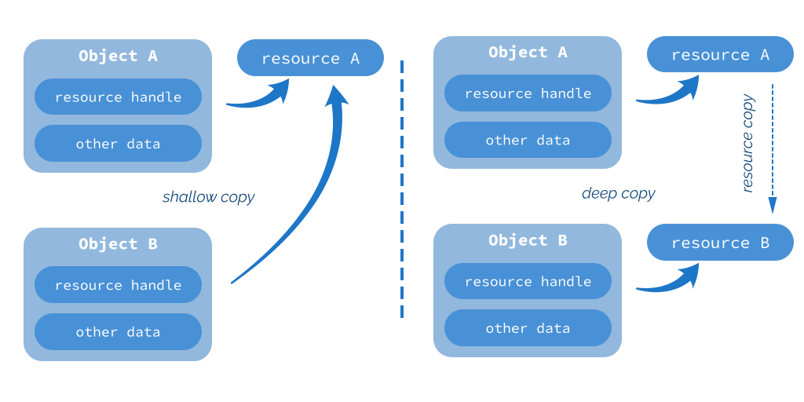
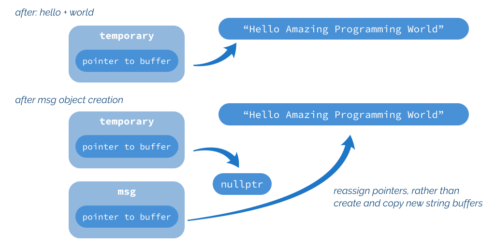
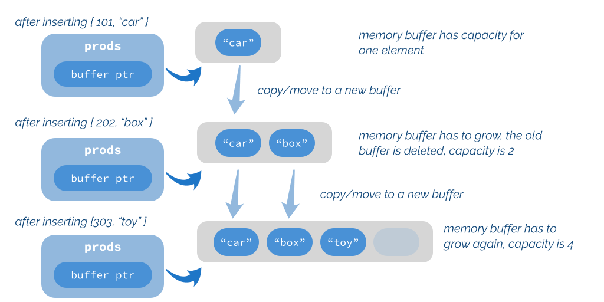

**3. Copy and Move Operations**

Regular constructors allow you to invoke some logic and initialize data members when an object is created from a list of arguments. But C++ also has two special constructor types that let you control a situation when an object is created using an instance of the same class type. Those constructors are called copy and move constructors. Additionally, you can provide custom assignment operators that the compiler calls when you assign new values to existing objects. Let’s have a look.


**Copy constructor**

A copy constructor is a special member function taking an object of the same type as the first argument, usually by a const reference.

ClassName(**const** ClassName&);

Technically it might have other parameters, but they all have to have default values assigned, and in practice, it’s very uncommon.

It’s called when you initialize an object using a variable of the same type (through copy initialization or direct initialization), and there’s no better match (like a move constructor or a regular constructor).

Product base { 42, "base product" }; // an initial object

// various forms of initialization, where a copy constructor is called Product other { base }; // direct list initialization Product another(base); // direct initialization with parens Product oneMore = base; // copy initialization std::array\<Product, 3\> arr = { base, other, oneMore }; // copy initialization

Product foo(Product p) {

Product temp{"from foo", p.id}; **return** temp; // copy initialization

38

Copy and Move Operations 39

}

Product x;

foo(x); // copy initialization

We’ll discuss all of the above forms in the further section.

As a mental model, we can assume that most classes have their default, compiler-generated copy constructor. Such a default copy constructor performs a bitwise copy of each data member. Thanks to this approach, you can initialize objects, pass them as arguments or return from functions without any custom implementation in a given type. However, implementing a copy constructor might be necessary when your class has data members that shouldn’t be shallow copied, like owned resource handles (files, pointers to memory blocks, etc.). For example, suppose a class contains a pointer to a memory block. When a default copy constructor copies such a pointer, the resulting pointer copy will point to the exact memory location. Similarly, if your class uses a handle to a file, then after the bitwise copy, the handle will be copied, and two objects will relate to the same file. Depending on the program requirements, this might not be what you want. In a case with pointers, it’s usually better to allocate a new memory block and copy the data of that block.

The situation for a shallow copy is illustrated by the following diagram:




**Shallow vs. Deep Copy**

On the diagram, you can see a comparison of a shallow (bitwise copy) vs. the deep copy approach. If you copy the resource handles, the resulting object will point to the same Copy and Move Operations 40


resource. For the full version, you need to copy the resource and then correctly assign the resource handle to that new copy.

Standard library containers like std::vector or std::string internally contain pointers to memory buffers to store the elements. They all have support for full data copy, so when you copy one vector to another, the memory buffers will also be copied. You don’t have to think about those internal mechanisms when using those types in your code.


**A canonical implementation of a copy constructor**

Implementing a copy constructor is straightforward and very similar to regular constructors. The only difference is that you have a single parameter which is a (const) reference to an object of that same type.

For the Product class, we can write the following:

**class Product** {

**public**:

**explicit** Product(**int** id, **const** std::string& name)

: id\_{id}, name\_{name} {

std::cout \<\< "Product(): " \<\< id\_ \<\< ", " \<\< name\_ \<\< '\n';

}

// copy constructor

Product(**const** Product& other)

: id\_{other.id\_}, name\_{other.name\_} { }

**private**:

**int** id\_;

std::string name\_;

};

As you can see, the copy constructor uses the member initialization list to copy the data from other. Please notice that there’s no need to use public getters, as we have access to all private data members. The syntax requires you to use a reference, so writing Product(Product other) won’t be treated as a copy constructor.


A copy constructor can also take a non-const argument like Product(Product& other). However, such a constructor might modify the other object and make code harder to read and understand. It might be better to use move semantics and move constructors when you want to “steal” the guts of some other object.

Copy and Move Operations 41


Copy constructors can be marked with explicit, but this is not a common practice and might prevent copy initialization.


Here’s another example where basic logging is enabled. Such console output is helpful to see how and what constructors are called:

**Ex 3.1. An example of a logging copy constructor. Run** [**@Compiler Explorer**](https://godbolt.org/z/jscG5Ydx9)

**class Product** {

**public**:

**explicit** Product(**int** id, **const** std::string& name)

: id\_{id}, name\_{name} {

std::cout \<\< "Product(): " \<\< id\_ \<\< ", " \<\< name\_ \<\< '\n';

}

Product(**const** Product& other)

: id\_{other.id\_}, name\_{other.name\_} { std::cout \<\< "Product(copy): " \<\< id\_ \<\< ", " \<\< name\_ \<\< '\n';

}

**const** std::string& name() **const** { **return** name\_; } **private**:

**int** id\_;

std::string name\_;

};

And here’s the code that creates Product objects:

**Ex 3.1. An example of a logging copy constructor, demo. Run** [**@Compiler Explorer**](https://godbolt.org/z/jscG5Ydx9)

``` cpp
1 void foo(Product p) { std::cout << "inside foo()\n"; }
2
3 int main() {
4        Product base { 42, "base product" }; // an initial object
5        std::cout << base.Name() << " created\n";
6        std::cout << "Product other { base };\n";
7        Product other { base };
8        std::cout << "Product another(base);\n";
9        Product another(base);
10       std::cout << "Product oneMore = base;\n";
11       Product oneMore = base;
```

Copy and Move Operations 42

``` cpp
12       std::cout << "std::array<Product, 2> = { base, other };\n";
13       std::array<Product, 2> arr = { base, other };
14
15       std::cout << "calling foo()\n";
16       foo(arr[0]);
17   }
```


If you run the code, you should see the following output:

Product(): 42, base product

base product created

Product other { base };

Product(copy): 42, base product

Product another(base);

Product(copy): 42, base product

Product oneMore = base;

Product(copy): 42, base product

std::array\<Product, 2\> = { base, other };

Product(copy): 42, base product

Product(copy): 42, base product

calling foo()

Product(copy): 42, base product

inside foo()

In line 10, we construct base product, and then use it to copy-construct all other instances: other, another, and oneMore. Each time a copy constructor is called. The same happens for the array std::array\<Product, 2\>.

Later we call a function foo(), and when you pass an argument as a value, a copy has to be created using a copy constructor call.


**Copy elision**

Now, let’s consider the following code:

Copy and Move Operations 43


**Ex3.2.NamedCop[yElision.Run](https://godbolt.org/z/h81GTe3hc)**[**@CompilerExplorer**](https://godbolt.org/z/h81GTe3hc)

Product createProduct() {

Product temp{101, "from createProduct()"};

**return** temp;

}

**int** main() {

std::cout \<\< "calling createProduct()**\n**";

Product created = createProduct(); }


The output is:

calling createProduct()

Product(): 101, from createProduct()

This result contradicts what I wrote before: a copy constructor should be called for return statements. Technically it should, but the output shows a regular constructor only.

This feature is a compiler optimization that allows it to “elide” such extra object copies. To be

precise, it’s called Named Return Value Optimization [(](https://en.cppreference.com/w/cpp/language/copy_elision)[NRVO](https://en.cppreference.com/w/cpp/language/copy_elision)¹), as there’s a named variable that we “reuse”. The compiler can see through the initialization, deduce that the temp object is used only to initialize created, and can “compress” the creation steps. The GCC compiler has a switch to turn off such optimization:-fno-elide-constructors.

If you compile with that flag, you should be able to see the following:

calling createProduct()

Product(): 101, from createProduct()

Product(copy): 101, from createProduct()

Have a look [@Compiler Explorer²](https://godbolt.org/z/49M1GaxK6)

But there’s more!

Starting from C++17, there’s a mandatory copy elision, also called “deferred temporary materialization”. While the previous example was an optional compiler optimization, we

¹<https://en.cppreference.com/w/cpp/language/copy_elision>

²<https://godbolt.org/z/49M1GaxK6>

Copy and Move Operations 44


have language rules that clearly express the new behavior this time. Not going into details, it will elide additional copies when there’s an unnamed temporary object from which we initialize a new entity: For example:

**Ex3.3.CopyElision**

Product createProduct() {

**return** {101, "from createProduct()"}; }

**int** main() {

std::cout \<\< "calling createProduct()**\n**";

Product created = createProduct(); }


This time the compiler will always generate the following output:

calling createProduct()

Product(): 101, from createProduct()

In other words, the temporary from createProduct is skipped and used to initialize the created object directly. This feature is helpful for optimization and efficiently working with non-copyable types that previously couldn’t be returned from factory functions.

If you want to know more about this feature, have a look at my book: [C++17 in Detail³](https://leanpub.com/cpp17indetail) or

see this blog post:[Guaranteed Copy Elision Does Not Elide Copies⁴](https://devblogs.microsoft.com/cppblog/guaranteed-copy-elision-does-not-elide-copies/) @VisualC++ Team Blog.


**A compiler-generated copy constructor**

The compiler will generate an implicit copy constructor for you if your class complies with the following key rules:

• Your class has non-static data members that can be copied (their copy constructors are

accessible, not delete);

• Your class has a direct or virtual base class that can be copied;

• Your class doesn’t have any data members of the rvalue reference type;

³<https://leanpub.com/cpp17indetail>

⁴<https://devblogs.microsoft.com/cppblog/guaranteed-copy-elision-does-not-elide-copies/>

Copy and Move Operations 45


• Your class doesn’t have a user-defined move constructor or move assignment operator.

You can find all the rules in this handy list [@C++Reference⁵](https://en.cppreference.com/w/cpp/language/copy_constructor#Deleted_implicitly-declared_copy_constructor).

As an example, let’s have a look at the following code:

**Ex 3.4. A non-default copy constructor. Run** [**@Compiler Explorer**](https://godbolt.org/z/P6T8o9ePE)

\#include \<iostream\>

\#include \<string\>

**struct Name** {

**explicit** Name(**const** std::string& str): name\_{str} { }

Name(**const** Name&) = **delete**;

std::string name\_;

};

**class Product** {

**public**:

**explicit** Product(**int** id, **const** std::string& name)

: id\_{id}, name\_{name} {

std::cout \<\< "Product(): " \<\< id\_ \<\< ", " \<\< name\_.name\_ \<\< '\n';

}

**private**:

**int** id\_;

Name name\_;

};

**int** main() {

Product first{10, "basic"};

Product second { first };

}

Please look at the line where we are trying to call the copy constructor. It won’t compile:


⁵<https://en.cppreference.com/w/cpp/language/copy_constructor#Deleted_implicitly-declared_copy_constructor> Copy and Move Operations 46

\<source\>:10:7: note: 'Product::Product(**const** Product&)' is implicitly deleted because the **default** definition would be ill-formed:

10 \| **class Product** {

\| ^\~\~\~\~\~~

The compiler tells us it cannot create a copy constructor because the name data member cannot be easily copied, as it has deleted the copy constructor.

We can also observe this by looking at the output from C++Insights [@see this link](https://cppinsights.io/s/15ea2cb1)⁶:

**public**:

// inline Product(const Product &) = delete;

// inline Product(Product &&) = delete;

// inline ~Product() noexcept = default;


**Move constructor**

Move constructors take rvalue references of the same type. Usually, such a constructor has the following form:

ClassName(ClassName&&) **noexcept**;

Let’s try to decipher the full syntax.

In short, rvalue references are temporary objects, usually appearing on the right-hand side of an expression, and whose value is about to expire.

For example:

std::string hello { "Hello Amazing"}; // lvalue, a regular object std::string world { " Programming World"}; // lvalue std::string msg = hello + world;

Above, the expression hello + world creates a temporary object. It doesn’t have a name, and we cannot access it easily. Such temporary objects will end their lifetime immediately

⁶<https://cppinsights.io/s/15ea2cb1>

Copy and Move Operations 47


after the expression completes (unless it’s assigned to a const or rvalue reference⁷), so we can steal resources from them safely. It doesn’t make sense in the case of built-in types like integers or floats, as we need to copy values anyway. But in the case of strings or memory buffers, we can avoid data copy and reassign the pointers. The situation is illustrated with the following diagram:




**Idea of a move constructor**

The diagram illustrates the state after computing hello + world and later when msg is initialized. The compiler creates a temporary object with a long string, stored in a buffer allocated outside the string. The string object has a pointer to that buffer. Later, msg is created from that temporary object. We know that the object will expire so that we can reassign the pointers to the memory buffers. msg gets a pointer to the long string. The temporary object gets nullptr (conceptually, as the internal implementation might differ).

Move constructors are a way to support the case with initialization from temporary objects. In many cases, they are an optimization over regular copy constructor calls. Additionally, they can also be used to pass “ownership” of the resource, for example, with smart pointers.

You can mark a regular object as expiring with the std::move function when you have a regular object with a name. This tells the compiler that the object’s value is no longer needed, so it’s safe to “steal” resources from it.

Have a look at this example:

⁷The lifetime of a temporary object may be extended by binding to a const lvalue reference or to an rvalue reference. See more

at https://en.cppreference.com/w/cpp/language/lifetime.

Copy and Move Operations 48


**Ex 3.5. Move Constructor. Run** [**@Compiler Explorer**](https://godbolt.org/z/GTebjGfo4) \#include \<iostream\>

\#include \<string\>

**class Product** {

**public**:

**explicit** Product(**int** id, **const** std::string& name)

: id\_{id}, name\_{name} {

std::cout \<\< "Product(): " \<\< id\_ \<\< ", " \<\< name\_ \<\< '\n';

}

Product(Product&& other) **noexcept**

: id\_{other.id\_}, name\_{std::move(other.name\_)} { std::cout \<\< "Product(move): " \<\< id\_ \<\< ", " \<\< name\_ \<\< '\n';

}

**const** std::string& name() **const** { **return** name\_; } **private**:

**int** id\_;

std::string name\_;

};

**int** main() {

Product tvSet {100, "tv set"};

std::cout \<\< tvSet.name() \<\< " created...**\n**";

Product setV2 { std::move(tvSet) };

std::cout \<\< setV2.name() \<\< " created...**\n**";

std::cout \<\< "old value: " \<\< tvSet.name() \<\< '\n'; }


When you run the code, you can see the following output:

Product(): 100, tv set

tv set created...

Product(move): 100, tv set

tv set created...

old value:

As you can see, we create the first object, and then mark it as expiring. This gives a chance for the compiler to call the move constructor.

Copy and Move Operations 49

Product(Product&& other) **noexcept**

: id\_(other.id\_), name\_(std::move(other.name\_))

The above implementation is similar to a copy constructor, but we must pay attention to details. Since id\_ is just an integer, all we can do is copy the value. We cannot perform any optimizations here. For the name\_ member, we can initialize it with std::move(other.name\_). We encounter the first problem, other.name\_ is a name, so not temporary (a temporary has no name); we can not move (take, steal) its contents. That is why we tell the compiler to interpret it as temporary by using the expression std::move(other.name\_). This will invoke the move constructor for std::string, and, potentially, “steal” the buffer from other.name\_.

The move constructor must ensure that the other object is left in an unspecified but valid state. In our case, we can see it in the last line of the output. The line old value: ends with nothing, so the string was cleared.


Move constructors can be marked with explicit, but it’s not a common practice and might affect generic code that relies on implicit move constructors (like standard algorithms).


**noexcept** **and move constructors**

While I mentioned that noexcept wouldn’t be covered in this book, I need to make one exception to this rule. The fundamental principle for noexcept on a function declaration is to guarantee that the function won’t return any exceptions (won’t throw from the function scope). If it does, the compiler can call std::terminate() instead of regular exception handling. Having a noexcept function allows the compiler and the libraries to optimize the code.

For example, when you have a std::vector of T, then if T has move operations marked with noexcept, then the vector is allowed to perform resize operations with move rather than copy (to guarantee safety). To illustrate this behavior, I modified the Product class and added a copy constructor:

Copy and Move Operations 50

Product(**const** Product& other) : id\_{other.id\_}, name\_{other.name\_} {

std::cout \<\< "Product(copy): " \<\< id\_ \<\< ", " \<\< name\_ \<\< '\n'; }

Product(Product&& other) : id\_{other.id\_}, name\_{std::move(other.name\_)} {

std::cout \<\< "Product(move): " \<\< id\_ \<\< ", " \<\< name\_ \<\< '\n'; }

Notice that there’s no noexcept in the move constructor. Now, if we run the following demo code:

**Ex 3.6. Copy on resize for** **std::vector****. Run** [**@Compiler Explorer**](https://godbolt.org/z/44qPcK9dr) **int** main() {

std::vector\<Product\> prods;

prods.emplace_back(101, "car");

prods.emplace_back(202, "box");

prods.emplace_back(303, "toy");

prods.emplace_back(404, "mug");

prods.emplace_back(505, "pencil"); }


We’ll see the following output:

Product(): 101, car

Product(): 202, box

Product(copy): 101, car

Product(): 303, toy

Product(copy): 101, car

Product(copy): 202, box

Product(): 404, mug

Product(): 505, pencil

Product(copy): 101, car

Product(copy): 202, box

Product(copy): 303, toy

Product(copy): 404, mug

Let’s try to decipher the output.

The emplace_back function (available since C++11) creates a new element at the end of the container using the arguments you pass. Alternatively, we could use push_back, but Copy and Move Operations 51


this requires an additional copy of the Product object. When we add the first element, you can see that a regular constructor is called. Now, with the second element, the vector must grow its internal buffer and copy existing elements to a new buffer. That’s why you can see a regular constructor for the "box" object and then a copy constructor for "car". Similarly, when I add the third element, its constructor is called, and then copies of "car" and "box"must be invoked. Later the process continues as we add more elements and the container grows. It’s implementation-specific, but usually, std::vector might grow 1.5x or 2x each time it has to resize. For example, it starts with one element and a capacity of one, then two elements and a capacity of 2, 3 elements and a capacity of 4, 5 elements and a capacity of 6 or 8, and so on. This helps to amortize the cost of adding new values.

Now, let’s modify the move constructor and make it noexcept:

**Ex 3.7. Move on resize for** **std::vector****. Run** [**@Compiler Explorer**](https://godbolt.org/z/fxfqq75hd)

Product(Product&& other) **noexcept**

: id\_{other.id\_}, name\_{std::move(other.name\_)} {

std::cout \<\< "Product(move): " \<\< id\_ \<\< ", " \<\< name\_ \<\< '\n'; }


When we run the code, you’ll see the following log:

Product(): 101, car

Product(): 202, box

Product(move): 101, car

Product(): 303, toy

Product(move): 101, car

Product(move): 202, box

Product(): 404, mug

Product(): 505, pencil

Product(move): 101, car

Product(move): 202, box

Product(move): 303, toy

Product(move): 404, mug

Now, the compiler calls a move constructor rather than a copy! In many cases, this can be much faster than copying data, as we can copy pointers rather than copying the entire content of a string. It’s implementation-depended if the library uses that optimization technique, but MSVC, GCC, and Clang library implementations stick to this rule.

Copy and Move Operations 52


Below you can find a basic illustration of this “growth” process:




**Vector resize process for three elements**

On the diagram, on the left-hand side, you can see the prods vector that has a pointer to a memory buffer with all elements. The vector class usually contains other data members, like size and capacity, but we’ll stick to the simple model. After inserting the first element, the buffer has a capacity for only one object and then has to grow if we add more values. In the third line, you can see a new buffer with three elements but a “transparent” spot for a fourth one. Each time a buffer is recreated, it must copy/move existing elements.

The reason for this technique is that when the move constructor is not marked with noexcept then the container has to be prepared for a case where it tries to copy elements to a new buffer, and at some point, one operation throws. The only way to revert to a safe situation is to abandon the copy. When move noexcept is available, then the vector implementation can assume that there’s no exception happening, and moving will be “safe” for all elements. Other algorithms from the Standard Library, like std::sort, might also benefit from having noexcept guarantees on move operations.

You can read more about this approach in the following C++ Core Guideline: [C.66: Make](https://isocpp.github.io/CppCoreGuidelines/CppCoreGuidelines#c66-make-move-operations-noexcept)

[move operations noexcept⁸](https://isocpp.github.io/CppCoreGuidelines/CppCoreGuidelines#c66-make-move-operations-noexcept). And also in this detailed article by Andrzej Krzemieński: [Using](https://akrzemi1.wordpress.com/2011/06/10/using-noexcept/)

[noexcept @Andrzej’s C++ blog⁹](https://akrzemi1.wordpress.com/2011/06/10/using-noexcept/).

⁸<https://isocpp.github.io/CppCoreGuidelines/CppCoreGuidelines#c66-make-move-operations-noexcept>

⁹<https://akrzemi1.wordpress.com/2011/06/10/using-noexcept/>

Copy and Move Operations 53


**A compiler-generated move constructor**

Don’t worry! If your class uses primitive types or types from the Standard Library, there’s no need to write custom move constructors. In most cases, the compiler creates a default implementation assuming your class complies with the following rules:

• There are no user-declared copy constructors.

• There are no user-declared copy assignment operators.

• There are no user-declared move assignment operators.

• There is no user-declared destructor.

• Non-static data members all have accessible move constructors.

• Your class has a direct or virtual base class that can be moved.

• Your class has a virtual base class or a non-static data member without a deleted or

inaccessible destructor.

The rules are logical. For example, if you declare a custom copy constructor, there’s a high chance your class is unique, and thus move operations should also be implemented by you rather than the compiler.

You can find all the rules in this handy list [@C++Reference¹⁰](https://en.cppreference.com/w/cpp/language/move_constructor#Implicitly-declared_move_constructor).


**Distinguishing from assignment**

It’s crucial that you recognize a case where the compiler invokes a copy or move constructor versus a case with the assignment operator. The code might look similar, but they behave differently.

C++, as a powerful capability, allows us to implement operators for user-defined types. Such operators make it easier and more natural for operations related to math, string manipulation, relations, and stream output or input, among others. For example, std::string implements operator+ for string concatenation. Similarly, you can define operator-for classes

representing 3D Vectors in space. You can see the complete list of operators on [operator](https://en.cppreference.com/w/cpp/language/operators)

[overloading @C++Reference](https://en.cppreference.com/w/cpp/language/operators)¹¹.

If you don’t provide a custom declaration, then the compiler attempts to define an implicit version. While most operators won’t work for user-defined types and don’t exist until you implement them, there’s a special operator=, called the assignment operator. By default, the implicit version calls the assignment operator for subobjects of the given type. For example:

¹⁰<https://en.cppreference.com/w/cpp/language/move_constructor#Implicitly-declared_move_constructor>

¹¹<https://en.cppreference.com/w/cpp/language/operators> Copy and Move Operations 54

**struct Point** { **int** x; **int** y; };

Point pt { 10, 10 };

Point another { 100, 100 };

another = pt; // implicit assignment operator called!

Even though I don’t provide any implementation for operator= the compiler defines it, I can write the assignment: another = pt. By default, the operator copies data members from pt into anther. Since the Point type is trivial and uses built-in types for its data members, we’ll get a bitwise copy of pt.

In a basic form, we can implement the assignment operator in at least two forms:

// copy assignment operator

Product& **operator**=(**const** Product& other) { /\* ... \*/}

Or

// move assignment operator

Product& **operator**=(Product&& other) { /\* ... \*/}

The copy assignment operator will be called when there’s an lvalue on the right-hand side of the assignment expression. The move assignment is called when there’s an rvalue reference.

See the following code, where I implemented a copy assignment for the Product class:

**Ex 3.8. Copy assignment for** **Product****. Run** [**@Compiler Explorer**](https://godbolt.org/z/bT5Yqnsdq)

**class Product** {

**public**:

**explicit** Product(**int** id, **const** std::string& name)

: id\_{id}, name\_{name} {

std::cout \<\< "Product(): " \<\< id\_ \<\< ", " \<\< name\_ \<\< '\n';

}

Product(**const** Product& other) : id\_{other.id\_}, name\_{other.name\_} {

std::cout \<\< "Product(copy): " \<\< id\_ \<\< ", " \<\< name\_ \<\< '\n';

}

Product& **operator**=(**const** Product& other) {

**if** (**this** == &other)

**return** \***this**;

Copy and Move Operations 55


id\_ = other.id\_;

name\_ = other.name\_;

std::cout \<\< "operator=(copy): " \<\< id\_ \<\< ", " \<\< name\_ \<\< '\n'; **return** \***this**;

}

**const** std::string& name() **const** { **return** name\_; } **private**:

**int** id\_;

std::string name\_;

};

And here’s the demo code:

Product base { 42, "base" };

Product first { base }; // copy ctor called! Product second = first; // copy ctor called! Product third { 100, "third" };

third = second; // assignment operator called!

The compiler calls a copy constructor when you initialize an object. When an entity already exists, the program runs an assignment operation.

And here’s the corresponding version of the move assignment operator:

**Ex 3.9. Move assignment for** **Product****. Run** [**@Compiler Explorer**](https://godbolt.org/z/6d45f7Ebv)

**class Product** {

**public**:

**explicit** Product(**int** id, **const** std::string& name)

: id\_{id}, name\_{name} {

std::cout \<\< "Product(): " \<\< id\_ \<\< ", " \<\< name\_ \<\< '\n';

}

Product(Product&& other) **noexcept**

: id\_{other.id\_}, name\_{std::move(other.name\_)} { std::cout \<\< "Product(move): " \<\< id\_ \<\< ", " \<\< name\_ \<\< '\n';

}

Product& **operator**=(Product&& other) **noexcept** {

id\_ = other.id\_;

Copy and Move Operations 56

name\_ = std::move(other.name\_); std::cout \<\< "operator=(move): " \<\< id\_ \<\< ", " \<\< name\_ \<\< '\n'; **return** \***this**;

}

**const** std::string& name() **const** { **return** name\_; } **private**:

**int** id\_;

std::string name\_;

};

Product base { 42, "base" };

Product first { std::move(base) }; // move ctor called! std::cout \<\< "base.name() after move: " \<\< base.name() \<\< '\n'; Product second = std::move(first); // move ctor called! std::cout \<\< "first.name() after move: " \<\< first.name() \<\< '\n'; Product third { 100, "third" };

third = std::move(second); // assignment operator called! std::cout \<\< "second.name() after move: " \<\< second.name() \<\< '\n';

Above, we can explicitly ask to call a move constructor when we use std::move and mark an object as expiring. When an object exists, and we assign a new value, the assignment operator will be called. If we run the code above, you’ll get the following output:

Product(): 42, base

Product(move): 42, base

base.name() after move:

Product(move): 42, base

first.name() after move:

Product(): 100, third

operator=(move): 42, base

second.name() after move:

As you can see, after we move from an object, it’s left in an unspecified but valid state. For strings, it means an empty string.

Copy and Move Operations 57


**Adding debug logging to constructors**

As an exercise, let’s add logging to our DataPacket class and see when each constructor is called.

**Ex 3.10. Logging in the** **DataPacket** **class. Run** [**@Compiler Explorer**](https://godbolt.org/z/ar1Yzrqr6)

``` cpp
1 class DataPacket {
2        std::string data_;
3 size_t checkSum_;
4 size_t serverId_;
5
6 public:
7        DataPacket() : data_{}, checkSum_{0}, serverId_{0} { }
8
9 explicit DataPacket(const std::string& data, size_t serverId)
10       : data_{data}, checkSum_{calcCheckSum(data)}, serverId_{serverId} {
11           std::cout << "Ctor for \"" << data_ << "\"\n";
12       }
13       DataPacket(const DataPacket& other)
14       : data_{other.data_}
15       , checkSum_{other.checkSum_}
16       , serverId_{other.serverId_} {
17           std::cout << "Copy ctor for \"" << data_ << "\"\n";
18       }
19       DataPacket(DataPacket&& other) noexcept
20       : data_{std::move(other.data_)}    // move string member...
21       , checkSum_{other.checkSum_}        // no need to move built-in types...
22       , serverId_{other.serverId_} {
23           other.checkSum_ = 0; // leave this in a proper state
24           std::cout << "Move ctor for \"" << data_ << "\"\n";
25       }
26       DataPacket& operator=(const DataPacket& other) {
27 if (this != &other) {
28                data_ = other.data_;
29                checkSum_ = other.checkSum_;
30                serverId_ = other.serverId_;
31                std::cout << "Assignment for \"" << data_ << "\"\n";
32           }
```

Copy and Move Operations 58

``` cpp
33 return *this;
34       }
35       DataPacket& operator=(DataPacket&& other) noexcept {
36 if (this != &other) {
37                data_ = std::move(other.data_);
38                checkSum_ = other.checkSum_;
39                other.checkSum_ = 0; // leave this in a proper state
40                serverId_ = other.serverId_;
41                std::cout << "Move Assignment for \"" << data_ << "\"\n";
42           }
43 return *this;
44       }
45       // getters/setters
46   };
```


And here’s the main() function:

**Ex 3.11. Logging in the** **DataPacket** **class, the main function. Run** [**@Compiler Explorer**](https://godbolt.org/z/ar1Yzrqr6)

``` cpp
1 int main() {
2        DataPacket firstMsg {"first msg", 101 };
3        DataPacket copyMsg { firstMsg };
4
5        DataPacket secondMsg { "second msg", 202 };
6        copyMsg = secondMsg;
7
8        DataPacket movedMsg { std::move(secondMsg)};
9        // now we stole the data, so it should be empty...
10       std::cout << "secondMsg's data after move ctor): \""
11                  << secondMsg.getData() << "\", sum: "
12                  << secondMsg.getCheckSum() << '\n';
13
14       movedMsg = std::move(firstMsg);
15
16       // now we stole the name, so it should be empty...
17       std::cout << "firstMsg's data after move ctor): \""
18                  << firstMsg.getData() << "\", sum: "
19                  << firstMsg.getCheckSum() << '\n';
20   }
```

Copy and Move Operations 59


When you run the example, you should see the following output:

Ctor for "first msg"

Copy ctor for "first msg"

Ctor for "second msg"

Assignment for "second msg"

Move ctor for "second msg"

secondMsg's data after move ctor): "", sum: 0 Move Assignment for "first msg"

firstMsg's data after move ctor): "", sum: 0

The example creates several DataPacket objects, and with each creation, you can see that the compiler invokes the appropriate constructor or an assignment operator. For instance, in **line 3**, we need a copy constructor call. On the other hand, **line 5** shows an assignment (copyMsg already exists). In the last section of main(), **lines 8 and 14**, there are calls to std::move(), which marks secondMsg and firstMsg as an rvalue reference, from which the contents could be moved. This means that the object is unimportant later, and we can “steal” from it. In this case, the compiler will call a move constructor or move assignment operator.


The logging part in the example is a bit crude, as the class directly calls a global stream object. In some cases, this might complicate unit testing or using the class in general. It would be better to rely on some configurable “tracing/logging” object that could be passed as a parameter to the constructor. We’ll tackle that approach

in the section about references as static data members.


**Trivial classes and user-provided default**

**constructors**

We covered the basics of default, copy and move constructors. And now, we can try to answer a question that might appear several times before: what’s the difference between = default, declaring a special member function empty {} , or not declaring anything?

Let’s have a look at the example, assuming we have several similar classes MyTypeX: Copy and Move Operations 60

**struct MyType0** {

**int** x;

};

**struct MyType1** {

MyType1() { }

**int** x;

};

**struct MyType2** {

MyType2() = **default**;

**int** x;

};

**struct MyType3** {

MyType3();

**int** x;

};

MyType3::MyType3() = **default**;

As you can see, there are four ways you can end up with an “empty” constructor and implicit default copy constructors. The core difference is that in MyType0 and MyType2, default constructors are considered **not user-provided**. Such a term has some consequences in the C++ Standard. For example both MyType0 and MyType2 are considered *trivial*.

First of all: what does it mean “user-provided”? From the Standard [dcl.fct.def.default#5¹²](https://timsong-cpp.github.io/cppwp/n4868/dcl.fct.def.default#5):


A function is user-provided if it is user-declared and not explicitly defaulted or deleted on its first declaration.


**struct X** {

X() = **default**; // 1

X(**const** X&) { /\*...\*/ } // 2 };

Above, the first declaration, // 1 is not user-provided. It’s user-declared (since we declare it), but since we explicitly =default it, it’s not considered user-provided. On the other hand, the copy constructor is user-provided since we provide a custom implementation of it. The

¹²<https://timsong-cpp.github.io/cppwp/n4868/dcl.fct.def.default#5>

Copy and Move Operations 61


same happens for MyType0, where we don’t provide any special member function, or for MyType2, where we declare a default constructor, but we explicitly make it default, and thus it’s not user-provided.

According to [the C++ Standard](https://timsong-cpp.github.io/cppwp/n4868/class.prop#1)¹³:


A trivial class is a class that is trivially copyable and has one or more eligible default constructors, all of which are trivial.


And a *trivially copyable* class is:


A trivially copyable class is a class:

• that has at least one eligible copy constructor, move constructor, copy assignment

operator, or move assignment operator,

• where each eligible copy constructor, move constructor, copy assignment operator,

and move assignment operator is trivial, and

• that has a trivial, non-deleted destructor.


Now, we have to understand *a trivial special member function*:

For default constructors, see [this section in the C++ Standard - class.default.ctor#3¹⁴](https://timsong-cpp.github.io/cppwp/n4868/class.default.ctor#3):


A default constructor is trivial if it is not user-provided and if:

• its class has no virtual functions and no virtual base classes, and • no non-static data member of its class has a default member initializer, and • all the direct base classes of its class have trivial default constructors, and • for all the non-static data members of its class that are of class type (or array thereof),

each such class has a trivial default constructor.

Otherwise, the default constructor is non-trivial.


¹³<https://timsong-cpp.github.io/cppwp/n4868/class.prop#1>

¹⁴<https://timsong-cpp.github.io/cppwp/n4868/class.default.ctor#3>

Copy and Move Operations 62


For copy/move constructors, see [this section in the C++ Standard - class.copy.ctor#11](https://timsong-cpp.github.io/cppwp/n4868/class.copy.ctor#11)¹⁵:


A copy/move constructor for class X is trivial if it is not user-provided and if:

• class X has no virtual functions and no virtual base classes, and • the constructor selected to copy/move each direct base class subobject is trivial, and • for each non-static data member of X that is of class type (or array thereof), the

constructor selected to copy/move that member is trivial;

otherwise the copy/move constructor is non-trivial.


As I mentioned, MyType0 and MyType2 are *trivial* because they have trivial default constructors and don’t violate any of the above rules. MyType1 and MyType3 have empty constructors, but they are *user-provided*, so they cannot be *trivial* types.

We have some definitions, but what are the implications of those slight differences?

• Trivial types occupy a contiguous memory area (including padding).

• They are *“mem-copyable”*, so you can convert them into a byte array and read it back.

• Trivial types cannot be declared const without an initializer.

• When a trivial type is [zero-initialized¹⁶](https://en.cppreference.com/w/cpp/language/zero_initialization) (for example, through value initialization {}),

its data members will also be zero-initialized ¹⁷

Let’s try some code:


¹⁵<https://timsong-cpp.github.io/cppwp/n4868/class.copy.ctor#11>

¹⁶<https://en.cppreference.com/w/cpp/language/zero_initialization>

¹⁷According to C++ Reference: The standard specifies that zero-initialization is not performed when the class has a user-provided or deleted default constructor, which implies that whether said default constructor is selected by overload resolution is not considered. All known compilers perform additional zero-initialization if a non-deleted defaulted default constructor is selected. Copy and Move Operations 63

// zero initialization

MyType0 t0{};

std::cout \<\< t0.x \<\< '\n';

MyType1 t1{};

std::cout \<\< t1.x \<\< '\n';

MyType2 t2{};

std::cout \<\< t2.x \<\< '\n';

MyType3 t3{};

std::cout \<\< t3.x \<\< '\n';

When you run the code [@Compiler Explorer](https://godbolt.org/z/7bKnP6qea)¹⁸, you get get the following output:

0

408939456

0

0

As you can see, zero initialization kicks in, but not for MyType1. In that case, the compiler calls a default constructor but won’t initialize the data member to 0.

Similarly, for const variables:

// const MyType0 ct0; // error!

**const** MyType1 ct1; // fine, empty ctor called // const MyType2 ct2; // error!

**const** MyType3 ct3; // fine


Additionally, the class type is of *standard layout*, which means briefly that their memory layout is well defined and thus can be consumed by a C program. When a class is also trivial, sharing across multiplatform code or communicating with

the C language modules is easy. Read more at [Trivial, standard-layout, POD, and](https://docs.microsoft.com/en-us/cpp/cpp/trivial-standard-layout-and-pod-types?view=msvc-170)

[literal types \| Microsoft Docs](https://docs.microsoft.com/en-us/cpp/cpp/trivial-standard-layout-and-pod-types?view=msvc-170)¹⁹.


If you like to read more about trivial types, layout, and more, I highly recommend reading the book “Embracing Modern C++ Safely”, chapter 2, page 401, “General—ized PODs”.

¹⁸<https://godbolt.org/z/7bKnP6qea>

¹⁹<https://docs.microsoft.com/en-us/cpp/cpp/trivial-standard-layout-and-pod-types?view=msvc-170>