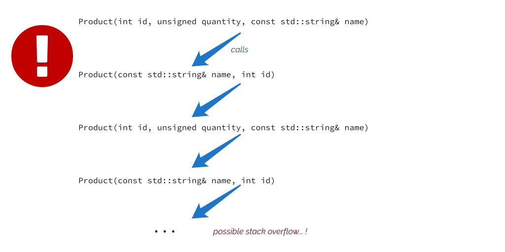

Delegating and Inheriting Constructors 65

**static constexpr unsigned** MaxQuantity = 100; };

 

In the above example, we declare two constructors. The first one performs the core job. The second calls the “primary” one. Inside this main constructor, we not only initialize data members but also call other code. In our case, it’s a form of basic data validation. Please notice that I also used a default parameter (id = 0 ) for the constructor, so that’s another alternative when you want to offer various options for calling it.

And here’s the demo code:

**Ex 4.1. Delegating constructors, demo. Run** [**@Compiler Explorer**](https://godbolt.org/z/vj4zxvEjd)

**int** main() {

**try** {

Product box{"a box"};

std::cout \<\< "product: " \<\< box.getName() \<\< " created... **\n**";

Product toy{101, 200, "a box"}; std::cout \<\< "product: " \<\< toy.getName() \<\< " created... **\n**";

}

**catch** (**const** std::exception& e) {

std::cout \<\< "cannot create: " \<\< e.what() \<\< '\n';

}

}

We can run it and get the following:

product: a box created...

cannot create: quantity is too large!

Without having delegating constructors, we’d have to duplicate the code:

Delegating and Inheriting Constructors 66

Product(**int** id, **unsigned** quantity, **const** std::string& name)

: id\_{id}, quantity\_{quantity}, name\_{name} {

verifyData();

}

Product(**const** std::string& name, **int** id = 0)

: id\_{id}, quantity\_{0}, name\_{name} {

verifyData(); // code duplication }

As you can see, the code with the delegating constructor is much more compact and allows full code reuse. This saves typing and might eliminate various “copy&paste” bugs in your code.

What’s more, the syntax doesn’t limit us to regular constructors only, as you can call a constructor from a copy or move constructor:

// copy:

Product(**const** Product& other) : Product{other.id\_, other.quantity\_, other.name\_} { }

// move, potentially a bad idea (just for illustration) Product(Product&& other) : Product{other.id\_, other.quantity\_, other.name\_} { }

In a case of a copy constructor, such code might reuse the validation parts. But, **be warned** about the move constructor, as the above code won’t make any “moves” and will copy the data, which fails its primary purpose.

Be careful about the syntax!

explicit PropertyInfo(double price) { PropertyInfo(...); }

The above line will create a local object rather than calling the other constructor! The call to a constructor has to appear before the constructor body.

 

**Limitations**

Writing too many constructors might lead to some mistakes and recursive calls. Take a look at the following code:

Delegating and Inheriting Constructors 67

**class Product** {

**public**:

Product(**int** id, **unsigned** quantity, **const** std::string& name)

: Product {name, id} { }

Product(**const** std::string& name, **int** id = 0)

: Product{id, 0, name} { }

// ...

};

Product recursion{"a single recursion"};

What happens when the info object calls its constructor?

You might get a segmentation fault and stack overflow! This is a recursive call, and the compiler cannot detect it until the code is executed at runtime.

 

Another “restriction” is that you cannot mix member initialization with calling other constructors.

The following code won’t compile:

Product(**int** id, **unsigned** quantity, **const** std::string& name)

: Product {name, id}, quantity\_{quantity} { }

For example, GCC reports the following error:

Delegating and Inheriting Constructors 68

error: mem-initializer **for** 'Product::quantity\_' follows constructor delegation

7 \| : Product {name, id}, quantity\_{quantity}

To sum up, if you want to use delegating constructors, you cannot initialize other data members.

Let’s go to another section on constructors, where you’ll learn one more modern C++ trick.

 

**Inheritance**

Let’s look at situations where your class inherits from other classes. What happens with constructors? When does the compiler call them? This discussion will provide a background for a new feature from C++11 called *Inheriting Constructors*.

For debugging, let’s introduce a derived class from DataPacket called DebugData, with special printing capabilities:

**class DebugDataPacket** : **public** DataPacket { **public**:

DebugDataPacket(**const** std::string& name, **size_t** serverId)

: DataPacket{name, serverId} { }

**void** DebugPrint(std::ostream& os) {

os \<\< getData() \<\< ", " \<\< getCheckSum() \<\< '\n';

}

};

As you can see, the code declares a new class and uses : public DataPacket to indicate public inheritance. The example also defines a single constructor that invokes base class constructors.

C++ offers three options to specify the way we inherit from a base class:

• Public inheritance means that public members of the base class become public

members of the derived class, and protected members are protected in the derived type.

• Protected inheritance makes all public and protected members of the base class

accessible as protected members of the derived class.

Delegating and Inheriting Constructors 69

 

• Private inheritance makes all public and protected base class members accessible as

private members of the derived class.

• In all three cases, private members of the base class are not accessible by derived

classes unless explicitly made friend.

We can use it like:

**Ex 4.2. Inheritance, simple demo code. Run** [**@Compiler Explorer**](https://godbolt.org/z/8dEWzcWWM)

**int** main() {

DebugDataPacket hello{"hello!", 404};

hello.DebugPrint(std::cout);

}

In the example, base class constructors are called explicitly, but in general, each constructor will also call the default constructor of a base class implicitly. This is illustrated by the following code:

**Ex 4.3. Base class construction order. Run** [**@Compiler Explorer**](https://godbolt.org/z/x3YqKqGej)

\#include \<iostream\>

\#include \<string\>

**class Product** {

**public**:

Product() : id\_{0} { std::cout \<\< "Product() default**\n**"; }

**explicit** Product(**int** id, **const** std::string& name)

: id\_{id}, name\_{name} {

std::cout \<\< "Product(): " \<\< id\_ \<\< ", " \<\< name\_ \<\< '\n';

}

**protected**:

**int** id\_;

std::string name\_;

};

**class ExProduct** : **public** Product { **public**:

ExProduct() { std::cout \<\< "ExProduct() default**\n**"; }

**explicit** ExProduct(**int** id) {

id\_ = id;

Delegating and Inheriting Constructors 70

std::cout \<\< "ExProduct(id)**\n**";

}

};

**int** main() {

ExProduct p;

ExProduct withId{42};

}

If we run the program, we’ll get the following:

Product() default

ExProduct() default

Product() default

ExProduct(id)

As you can see, even though we haven’t called any base constructor inside our ExProduct constructor, the compiler invoked it anyway. What’s more, inside a constructor of a derived class, you cannot use base classes’ data members in the initialization list, for example:

ExProduct(): id\_(10) { // \<\< err! We don't have access!

std::cout \<\< "ExProduct() default**\n**"; }

You can only access it in the body of the constructor:

ExProduct(**int** id) {

id\_ = id;

std::cout \<\< "ExProduct(id)**\n**"; }

This behavior is essential to keep the integrity of the object.

Additionally, it’s best not to call virtual functions in constructors as they might behave differently than expected. In short, a call to a virtual function in a base class constructor results in a call to the base implementation, as the inherited class and the implementation is not yet set up. You can read more about this behavior in

[the C++ FAQ¹](https://isocpp.org/wiki/faq/strange-inheritance#calling-virtuals-from-ctors) or at [C++ Core Guideline C.82](https://isocpp.github.io/CppCoreGuidelines/CppCoreGuidelines#Rc-ctor-virtual)².

¹<https://isocpp.org/wiki/faq/strange-inheritance#calling-virtuals-from-ctors>

²<https://isocpp.github.io/CppCoreGuidelines/CppCoreGuidelines#Rc-ctor-virtual> Delegating and Inheriting Constructors 71

 

After introducing the inheritance topic, we can discuss one improvement we got with Modern C++.

 

**Inheriting constructors**

In our previous example with DebugPropertyInfo we didn’t have any new data members, only some new member functions. The code showed a single constructor called the base class constructor. Since C++11, you can tell the compiler to “reuse” the code:

**Ex 4.4. Inheriting constructors. Run** [**@Compiler Explorer**](https://godbolt.org/z/jeo6Kbd8P)

1 **class DebugDataPacket** : **public** DataPacket { 2 **public**:

3 **using** DataPacket::DataPacket; 4

5 **void** DebugPrint(std::ostream& os) { 6 os \<\< getData() \<\< ", " \<\< getCheckSum() \<\< '\n'; 7 }

8 };

9

10 **int** main() {

11 DebugDataPacket hello{"hello!", 404}; 12 hello.DebugPrint(std::cout);

13 }

 

Consider **line 3**:

**using** DataPacket::DataPacket;

This tells the compiler that it can use **all** constructors from the base class, ignoring access modifiers. It means that all public constructors are visible and can be called, but the protected will still be protected in that context. See the example:

Delegating and Inheriting Constructors 72

 

**Ex 4.5. Inheriting constructors and protected section. Run** [**@Compiler Explorer**](https://godbolt.org/z/T4GhY7Gab)

**struct Base** {

**int** x{};

**int** y{};

Base(**int** a, **int** b): x{a}, y{b} { } **protected**:

Base() = **default**;

Base(**int** a): x{a} { }

};

**struct Derived** : **public** Base {

**using** Base::Base;

};

**int** main() {

// Derived d{0}; // error: 'Base::Base(int)' is protected

Derived d2{0, 1}; // fine

}

If you want to limit the access to constructors, you must explicitly write constructors for Derived:

Derived(**int** a) : Base{a} { }

Derived d{0}; // fine now, as Derived::Derived(int) is public

We completed all information about constructors, but it’s good to mention one more thing: destructors. See in the next chapter.