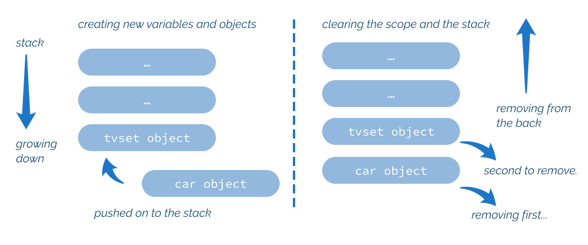

**5. Destructors**

While constructors are responsible for various situations where an object is created, C++ also offers a way to handle object destruction. C++ doesn’t provide any form of garbage collection available in many popular programming languages, but thanks to precise lifetime specification, you can be confident when your object will be destroyed.

Each class has a special member function called a destructor. If you don’t write one, the compiler prepares a default implementation. A destructor is called when an object ends its lifetime. In most cases, it means that an object goes out of the scope (for stack-allocated variables), or when a delete operator is called (for heap-allocated variables). Additionally, when you have a user-defined class, it will automatically call destructors for its data

members. For more information about lifetime, see a good summary at [C++Reference page¹](https://en.cppreference.com/w/cpp/language/lifetime).

 

**Basics**

Before we move on, we should expand our terminology. So far, I mentioned “object” to refer to entities of some type and relied on our “intuition” to access such entities. But the

C++ Standard defines an *object* in the following terms (simplified, based on [C++ Draft -](https://timsong-cpp.github.io/cppwp/n4868/intro.object#1)

[intro.object](https://timsong-cpp.github.io/cppwp/n4868/intro.object#1)²):

 

The constructs in a C++ program create, destroy, refer to, access, and manipulate objects. An object is created by a definition, by a new-expression, by an operation that implicitly creates objects, or when a temporary object is created. An object occupies a region of storage in its period of construction, throughout its lifetime, and in its period of destruction.

 

And continuing:

 

¹<https://en.cppreference.com/w/cpp/language/lifetime>

²<https://timsong-cpp.github.io/cppwp/n4868/intro.object#1>

73

Destructors 74

 

• An object can have a name,

• An object has a storage duration which influences its lifetime, • An object has a type,

• Objects can contain other objects, called subobjects. A subobject can be a member

subobject, a base class subobject, or an array element.

 

Here’s a basic scenario for a destructor that handles a case where the lifetime of an object ends:

**Ex 5.1. A logging destructor. Run** [**@Compiler Explorer**](https://godbolt.org/z/chEvdezvb) \#include \<iostream\>

\#include \<string\>

**class Product** {

**public**:

**explicit** Product(**const char**\* name, **unsigned** id)

: name\_(name), id\_(id) {

std::cout \<\< name \<\< ", id " \<\< id \<\< '\n';

}

~Product() { std::cout \<\< name\_ \<\< " destructor...**\n**"; }

std::string Name() **const** { **return** name\_; }

**unsigned** Id() **const** { **return** id\_; } **private**:

std::string name\_;

**unsigned** id\_;

};

The example contains the following special member function:

~Product() { std::cout \<\< name\_ \<\< " destructor...**\n**"; }

The syntax is unique as it has no parameters and has the *∼* prefix. You can also have only one destructor in a class. What’s more, a destructor doesn’t return any value.

Now, let’s create two objects of that type:

Destructors 75

 

**Ex 5.1. A logging destructor, continuation. Run** [**@Compiler Explorer**](https://godbolt.org/z/chEvdezvb)

**int** main() {

{

Product tvset("TV Set", 123);

}

{

Product car("Mustang", 999);

}

}

In our case, the constructor and the destructor are used to perform the logging. When you run the example, you’ll see the following output:

TV Set, id 123

TV Set destructor...

Mustang, id 999

Mustang destructor...

I specifically enclosed objects (created on the stack) in separate scopes so that their lifetime ends when their scope ends. On the other hand, if we have code:

**int** main() {

Product tvset("TV Set", 123);

Product car("Mustang", 999);

}

Then both tvset and car share the same lifetime scope so that we can expect the following output:

TV Set, id 123

Mustang, id 999

Mustang destructor...

TV Set destructor..

As you can see, the destructors are called in the reverse order of how they were created. It’s because the stack is a LIFO structure (Last In, First Out). tvset was created first and added Destructors 76

 

to the stack, then car is added. When the function goes out of scope, the stack is cleared, taking elements in reverse order. So car is deleted first, and then tvset. This is illustrated by the following diagram:

 

**Adding and removing objects from the stack.**

 

**Objects allocated on the heap**

In the previous examples, I used objects created on the stack. For a clearer picture of destructors, it’s good to discuss a case when you have objects on the heap. In that case, a destructor will be called only when the memory is released via the delete operator.

Consider the following snippet:

{

Product\* ptr = **new** Product("TV Set", 123);

}

// !!

ptr is a pointer to an object allocated on the heap. But I didn’t call delete, and thus, the destructor won’t be invoked! Moreover, I generated a memory leak since the memory was also not released. After the scope ends, ptr goes out of the scope, but since it’s a pointer, the memory is still present but not accessible.

To fix the issue we have to call delete (for single elements) or delete \[\] (for arrays). Destructors 77

{

Product\* ptr = **new** Product("TV Set", 123);

// use ptr...

**delete** ptr;

}

And similarly, for an array:

{

Product\* arr = **new** Product\[10\]("TV Set", 123);

// use...

**delete** \[\] arr;

}

Since it’s easy to forget about proper heap release, it’s best to use smart pointers that wrap allocation with the ownership.

{

std::unique_ptr\<Product\> ptr = std::make_unique\<Product\>("box", 1);

// use ptr...

}

Now, when ptr goes out of the scope, it’s “smart” and knows it also has to call delete on the stored pointer. In the example, I’m using a unique_ptr as the basic form of smart pointers in the C++ Standard Library. It wraps the pointer to an object and keeps the “unique” ownership of it. If you want to pass pointers around in the system and have multiple “owners,” then you can use shared_ptr.

The smart pointer will also work for the array version:

{

// create 10 Products

std::unique_ptr\<Product\[\]\> ptr = std::make_unique\<Product\[\]\>(10);

// use...

}

And this time, the unique_ptr makes sure the delete \[\] is called. You can play with the

example [@Compiler Explorer](https://godbolt.org/z/Ps9Ye79zc)³.

³<https://godbolt.org/z/Ps9Ye79zc> Destructors 78

 

For more information about smart pointers, have a look at my blog series: [6 Ways to](https://www.cppstories.com/2021/refactor-into-uniqueptr/)

[Refactor new/delete into unique ptr - C++ Stories⁴](https://www.cppstories.com/2021/refactor-into-uniqueptr/) and more articles about [smart pointers](https://www.cppstories.com/tags/smart-pointers/)

[@C++Stories⁵](https://www.cppstories.com/tags/smart-pointers/).

What’s more, Modern C++ strongly suggests avoiding raw new and delete. Thanks to many library containers, wrappers, and smart pointers, there’s almost no need to rely on those low-level memory management routines. See this C++

Core guideline: [R.11: Avoid calling](https://isocpp.github.io/CppCoreGuidelines/CppCoreGuidelines#r11-avoid-calling-new-and-delete-explicitly) [new](https://isocpp.github.io/CppCoreGuidelines/CppCoreGuidelines#r11-avoid-calling-new-and-delete-explicitly) [and](https://isocpp.github.io/CppCoreGuidelines/CppCoreGuidelines#r11-avoid-calling-new-and-delete-explicitly) [delete](https://isocpp.github.io/CppCoreGuidelines/CppCoreGuidelines#r11-avoid-calling-new-and-delete-explicitly) [explicitly⁶](https://isocpp.github.io/CppCoreGuidelines/CppCoreGuidelines#r11-avoid-calling-new-and-delete-explicitly). The code in this section with new can be treated only for illustrative purpose.

 

**Destructors and data members**

If you have a class, then by default, its destructor calls the destructors for all data members:

**Ex 5.2. Nested destructor call. Run** [**@Compiler Explorer**](https://godbolt.org/z/86j75v975)

\#include \<iostream\>

\#include \<string\>

**class Product** {

// defined as in the previous example...

};

**class Wrapper** {

**public**:

Wrapper() : prod\_("internal", 123) { std::cout \<\< "Wrapper()**\n**"; }

~Wrapper() { std::cout \<\< "~Wrapper()**\n**"; } **private**:

Product prod\_;

};

**int** main() {

Wrapper w;

}

⁴<https://www.cppstories.com/2021/refactor-into-uniqueptr/>

⁵<https://www.cppstories.com/tags/smart-pointers/>

⁶<https://isocpp.github.io/CppCoreGuidelines/CppCoreGuidelines#r11-avoid-calling-new-and-delete-explicitly> Destructors 79

 

In example 5.2, the Wrapper class contains Product as a data member.

The output:

internal, id 123

Wrapper()

~Wrapper()

internal destructor...

As you notice, internal destructor is called along with the *∼*Wrapper() invocation.

On the other hand, when your object is part of some other class as a pointer, it will go out of the scope but not the data it points to. So you have to pay attention to your pointer data members and call their delete in a proper place. See an example below:

**Ex 5.3. Pointer data member and a destructor. Run** [**@Compiler Explorer**](https://godbolt.org/z/z3qcs8K4P)

**class Wrapper** {

**public**:

Wrapper() : prod\_(**new** Product("internal", 123)) {

std::cout \<\< "Wrapper()**\n**";

}

~Wrapper() {

**delete** prod\_;

std::cout \<\< "~Wrapper()**\n**";

}

**private**:

Product \*prod\_;

};

**int** main() {

Wrapper w;

}

This time I had to manually call delete prod\_ to release the data member properly. It’s another case where a smart pointer is handy as it will automatically destroy the underlying object.

Destructors 80

 

**Virtual destructors and polymorphism**

There’s also one feature of destructors that plays an essential part in inheritance and polymorphism.

According to [Wikipedia](https://en.wikipedia.org/wiki/Polymorphism_(computer_science))⁷:

 

In programming language theory and type theory, polymorphism is the provision of a single interface to entities of different types or the use of a single symbol to represent multiple different types.

 

In C++, the definition means that if you have a pointer or a reference to a base class, and when you call a member function, the compiler invokes an implementation (if available) in the derived classes. C++ does this technique through virtual functions. We can demonstrate it with the following but naïve code in C++:

**Ex 5.4. Virtual destructor, base class, incorrect. Run** [**@Compiler Explorer**](https://godbolt.org/z/cb9Pfhhqe) **class Product** {

**public**:

**explicit** Product(**const char**\* name) : name\_(name) {

std::cout \<\< name \<\< '\n';

}

~Product() { std::cout \<\< name\_ \<\< " destructor...**\n**"; }

std::string Name() **const** { **return** name\_; }

**virtual double** CalculateMass() **const** = 0; **private**:

std::string name\_;

};

The above Product type declares a virtual member function. We can declare derived classes and then provide their implementation of that virtual member function. This allows the compiler to call the proper function based on the type and give this “polymorphic” semantics.

Have a look:

⁷<https://en.wikipedia.org/wiki/Polymorphism_(computer_science)>

Destructors 81

 

**Ex 5.4. Virtual destructor, derived classes. Run** [**@Compiler Explorer**](https://godbolt.org/z/cb9Pfhhqe)

**struct BoxProduct** : **public** Product {

**using** Product::Product; // inheriting ctor

~BoxProduct() { std::cout \<\< "~BoxProduct...**\n**"; }

**double** CalculateMass() **const override** { **return** 10.0; } };

**struct FluidProduct** : **public** Product {

**using** Product::Product; // inheriting ctor

*FluidProduct() { std::cout \<\< "*FluidProduct...**\n**"; }

**double** CalculateMass() **const override** { **return** 100.0; } };

 

The CalculateMass function has two separate and trivial implementations ⁸. The function signature also uses the override keyword, which is a C++11 addition. It tells the compiler that a given member function is about to be overridden, so the compiler can check if there’s a corresponding declaration in a base class. Read more about the keyword in my article:

[Modern C++: Safety and Expressiveness with override and final - C++ Stories⁹](https://www.cppstories.com/2021/override-final/).

We can now write code that uses both of those products:

**Ex 5.4. Virtual destructor, main. Run** [**@Compiler Explorer**](https://godbolt.org/z/cb9Pfhhqe)

**void** CallCalculate(**const** Product& prod) {

std::cout \<\< "calculating: " \<\< prod.CalculateMass() \<\< '\n'; }

**int** main() {

**using** std::unique_ptr;

**using** std::make_unique;

unique_ptr\<Product\> box = make_unique\<BoxProduct\>("box");

unique_ptr\<Product\> water = make_unique\<FluidProduct\>("water");

CallCalculate(\*box.get());

CallCalculate(\*water.get());

}

⁸Let’s assume that in the actual production code, those functions would have some more advanced calculations based on the

properties of a particular type.

⁹<https://www.cppstories.com/2021/override-final/>

Destructors 82

 

The demo use case is simple, it creates two smart pointers that are pointers to a base class,

but they are assigned with pointers to derived classes. When we run the code [@Compiler](https://godbolt.org/z/cb9Pfhhqe)

[Explorer¹⁰](https://godbolt.org/z/cb9Pfhhqe), you’ll see the following output:

box

water

calculating: 10

calculating: 100

water destructor...

box destructor...

As you can see, the CallCalculate(Product& prod) function takes a reference to a base class, and then it can call its functions. If a function is virtual, the compiler will call it polymorphically based on the real type.

But… do you see an error here?

Take a moment and think…

It looks like the destructor of the derived class is not called!

This is because we used pointers to hold our objects. And when the smart pointer goes out of the scope, it will call delete on the pointer to a base class. Since the destructor is not marked as virtual, the polymorphism doesn’t kick in, and only the *∼*Product() destructor is called.

To fix this, each class that has virtual functions should also have a virtual destructor:

**virtual** ~Product() {

std::cout \<\< name\_ \<\< " destructor...**\n**"; }

This fixes our output:

 

¹⁰<https://godbolt.org/z/cb9Pfhhqe> Destructors 83

box

water

calculating: 10

calculating: 100

~FluidProduct...

water destructor...

~BoxProduct...

box destructor...

You can play with the correct example [@Compiler Explorer](https://godbolt.org/z/dfa49sjc6)¹¹.

There’s also a specific C++ Core Guideline related to this critical aspect. [See C.35: A base](https://isocpp.github.io/CppCoreGuidelines/CppCoreGuidelines#c35-a-base-class-destructor-should-be-either-public-and-virtual-or-protected-and-non-virtual)

[class destructor should be either public and virtual, or protected and non-virtual¹²](https://isocpp.github.io/CppCoreGuidelines/CppCoreGuidelines#c35-a-base-class-destructor-should-be-either-public-and-virtual-or-protected-and-non-virtual):

 

**Reason**: To prevent undefined behavior. If the destructor is public, then the calling code can attempt to destroy a derived class object through a base class pointer, and the result is undefined if the base class’s destructor is non-virtual.

 

**Partially created objects**

The compiler calls a destructor only for objects that are fully created. Consider the modified version of a constructor that checks the id parameter and throws an exception:

**explicit** Product(**const char**\* name, **unsigned** id) : name\_(name), id\_(id) {

std::cout \<\< name \<\< ", id " \<\< id \<\< '\n'; **if** (id \< 100)

**throw** std::runtime_error{"bad id..."};

}

¹¹<https://godbolt.org/z/dfa49sjc6>

¹²[https://isocpp.github.io/CppCoreGuidelines/CppCoreGuidelines#c35-a-base-class-destructor-should-be-either-public-and-](https://isocpp.github.io/CppCoreGuidelines/CppCoreGuidelines#c35-a-base-class-destructor-should-be-either-public-and-virtual-or-protected-and-non-virtual)

[virtual-or-protected-and-non-virtual](https://isocpp.github.io/CppCoreGuidelines/CppCoreGuidelines#c35-a-base-class-destructor-should-be-either-public-and-virtual-or-protected-and-non-virtual) Destructors 84

 

**Ex 5.5. Destructors and partial object creation. Run** [**@Compiler Explorer**](https://godbolt.org/z/rzhErcWfa)

**int** main() {

**try** {

Product tvset("TV Set", 123); Product car("Mustang", 9);

}

**catch** (**const** std::exception& ex) {

std::cout \<\< "exception: " \<\< ex.what() \<\< '\n';

}

}

When we run the example, we’ll get the output:

TV Set, id 123

Mustang, id 9

TV Set destructor...

exception: bad id...

This time the example creates two objects: TV set and Mustang. In the output, we can notice that both objects call their constructors, but there’s only one destructor invocation (for TV set). Since Mustang threw an exception in the constructor, the destructor won’t be executed.

Since destructors might be called when the compiler performs stack unwinding; they shouldn’t throw exceptions, as this might result in calling std::terminate() . Read this C++ Core Guideline suggestion for more information: [E.16: Destructors, deallocation, and](https://isocpp.github.io/CppCoreGuidelines/CppCoreGuidelines#Re-never-fail) [swap](https://isocpp.github.io/CppCoreGuidelines/CppCoreGuidelines#Re-never-fail) [must never fail¹³](https://isocpp.github.io/CppCoreGuidelines/CppCoreGuidelines#Re-never-fail).

 

Another important aspect is to manage resources allocated before the exception occurs properly. For example, if you allocate some memory dynamically using a raw pointer, you might get a memory leak. See the following sample:

 

¹³<https://isocpp.github.io/CppCoreGuidelines/CppCoreGuidelines#Re-never-fail> Destructors 85

 

**Ex 5.6. A memory leak in partially created objects. Run** [**@Compiler Explorer**](https://godbolt.org/z/az9d71jan) **class Product** {

**public**:

**explicit** Product(**int** id) : res\_(**new** Resource()) {

std::cout \<\< "Product: id " \<\< id \<\< '\n'; **if** (id \< MIN_ID)

**throw** std::runtime_error{"bad id..."};

}

~Product() {

**delete** res\_;

std::cout \<\< "~Product...**\n**";

}

**private**:

Resource\* res\_;

};

**int** main() {

**try** {

Product invalid(MIN_ID-1);

}

**catch** (**const** std::exception& ex) {

std::cout \<\< "exception: " \<\< ex.what() \<\< '\n';

}

}

The output:

Product: id 99

exception: bad id...

As you can see, the compiler didn’t call the destructor for Resource, and the memory wasn’t released (since we called : res\_(new Resource()) in the constructor). We could fix this leak by deleting res\_ before we throw. Still, manual resource management is fragile, and it’s best to look for a better solution.

The key mechanism to fix such leaking resources is to rely on variables and data members with automatic storage duration, like regular value types. In that case, the stack unwinding destroys them properly and calls their destructors. That’s why a destructor for smart pointers can be safely called:

Destructors 86

 

**Ex 5.7. Fixing memory leaks in partially created objects. Run** [**@Compiler Explorer**](https://godbolt.org/z/EWGchjvc5) **class Product** {

**public**:

**explicit** Product(**int** id) : res\_(std::make_unique\<Resource\>()) {

std::cout \<\< "Product: id " \<\< id \<\< '\n'; **if** (id \< MIN_ID)

**throw** std::runtime_error{"bad id..."};

}

~Product() {

std::cout \<\< "~Product...**\n**";

}

**private**:

std::unique_ptr\<Resource\> res\_; // \<\< smart pointer now! };

**int** main() {

**try** {

Product invalid(MIN_ID-1);

}

**catch** (**const** std::exception& ex) {

std::cout \<\< "exception: " \<\< ex.what() \<\< '\n';

}

}

When we run the code, we’ll see the following output:

Product: id 99

~Resource

exception: bad id...

The compiler didn’t call the destructor for Product, but the stack unwinding correctly called the destructor for all data members with automatic storage duration.

You can read more information about stack unwinding and handling resources

on the following sites:[throw](https://en.cppreference.com/w/cpp/language/throw#Stack_unwinding) [expression - @C++Reference](https://en.cppreference.com/w/cpp/language/throw#Stack_unwinding)¹⁴ and [Exceptions and](https://isocpp.org/wiki/faq/exceptions#selfcleaning-members)

[Error Handling, C++ FAQ¹⁵](https://isocpp.org/wiki/faq/exceptions#selfcleaning-members).

¹⁴<https://en.cppreference.com/w/cpp/language/throw#Stack_unwinding>

¹⁵<https://isocpp.org/wiki/faq/exceptions#selfcleaning-members> Destructors 87

 

**A compiler-generated destructor**

As with other special member functions, the compiler creates an implicit default destructor for your classes if you don’t provide your implementation. The basic rule is that each data member and also the base classes must have an accessible destructor (they are not deleted, not inaccessible, nor ambiguous). For example:

**Ex 5.8. Compiler-generated destructor. Run** [**@C++Insights**](https://cppinsights.io/s/f3f1a359)

\#include \<iostream\>

\#include \<string\>

**class Product** {

**public**:

**explicit** Product(**int** id, **const** std::string& name)

: id\_(id), name\_(name) {

std::cout \<\< "Product(): " \<\< id\_ \<\< ", " \<\< name\_ \<\< '\n';

}

**private**:

**int** id\_;

std::string name\_;

};

**int** main() {

Product first{10, "basic"};

}

At C++Insights, we can see the output from the compiler and how it “sees” the code. As you can notice, the compiler created the following destructor for us:

**inline** ~Product() **noexcept** = **default**;

You can read more about compiler-generated destructors in the “Implicitly-declared destructor” section [@C++Reference](https://en.cppreference.com/w/cpp/language/destructor)¹⁶.

¹⁶<https://en.cppreference.com/w/cpp/language/destructor> Destructors 88

 

**Summary and use cases**

This chapter covered destructors, a special member function invoked when an object ends its lifetime. In most cases, we can use this capability to properly clean up the object and deallocate any resources we have used and have yet to release.

For example, you allocate some memory when the object is created, and then the memory must be released to avoid memory leaks. Similarly, you can open a file or a database connection, and then you must ensure the file or the connection is closed when the object goes out of scope.

Destructors are one of the best features of the C++ language as they provide a clear and well-defined point at where they are called. This is opposed to dynamic garbage collection that can work in the background, potentially slowing down the program and with less control over the process. Destructors are also the critical element to a popular term in C++ called RAII (Resource AcquisitionIis Initialization), coined by B. Stroustrup, the author of the C++ language. It states that holding a resource is a class invariant, and is tied to the object’s

lifetime. Read more at [Wikipedia](https://en.wikipedia.org/wiki/Resource_acquisition_is_initialization)¹⁷.

Fortunately, in Modern C++, there are fewer and fewer places where you need custom destructors. For example, when your data members are standard containers (like std::vector\<int\>, or std::map\<std::string, int\>) in your classes, then you can rely on default destructors to do the job. Standard containers like std::vector\<int\> might allocate memory buffers, but they also manage that buffer and release it properly, so you don’t need to take any action when using them in a class.

¹⁷<https://en.wikipedia.org/wiki/Resource_acquisition_is_initialization>