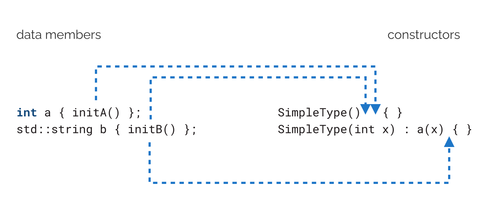
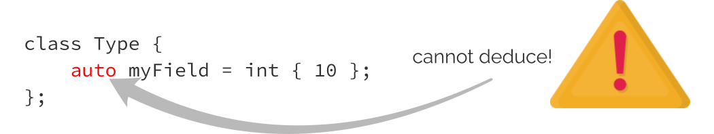

**8. Non-Static Data Member**


**Initialization**

You’ve learned a lot of techniques related to constructors! You can initialize data members in various constructors, delegate them to reuse code, and inherit them from base classes. Yet, we can still improve on assigning default values for data members. I mentioned this feature in the first chapter, where we gave default values for aggregates. We can do the same for classes. And in this chapter, we’ll look at the full syntax and options related to this feature.

Please have a look at the example below:

**Ex 8.1. NSDMI Basics. Run** [**@Compiler Explorer**](https://godbolt.org/z/dc88fd3Y1) **class DataPacket** {

std::string data\_;

**size_t** checkSum\_ { 0 };

**size_t** serverId\_ { 0 };

**public**:

DataPacket() = **default**;

DataPacket(**const** std::string& data, **size_t** serverId)

: data\_{data}, checkSum\_{calcCheckSum(data)}, serverId\_{serverId}

{ }

// getters and setters...

};

As you can see, the data members have their default values set at the point of declaration. There’s no need to assign default values inside constructors. This feature is much better than a default constructor because it combines declaration and initialization code. This way, it’s harder to leave data members uninitialized!

Let’s explore this handy feature of Modern C++ in detail.


**How it works**

This section shows how the compiler “expands” the code to initialize data members.

112

Non-Static Data Member Initialization 113


For a simple declaration:

**struct SimpleType** {

**int** field { 0 };

};

The code has to behave similarly as you’d define a constructor ¹:

**struct SimpleType** {

SimpleType() : field(0) { }

**int** field;

};

Here’s the full working example:

**Ex 8.2. Basic Non-static data member initialization. Run** [**@Compiler Explorer**](https://godbolt.org/z/9968jYrsv)

\#include \<iostream\>

**struct SimpleType** {

**int** field { 0 };

};

**int** main() {

SimpleType st;

std::cout \<\< "st.field is " \<\< st.field \<\< '\n'; }


As a small exercise, you can experiment with the above sample, assign different values to the field data member, and see the changes in the output.


**Investigation**

With some “machinery,” we can see when the compiler performs the initialization.

Let’s consider the following type:

¹Technically, those types will be different as the version without the constructor will be considered an aggregate type, but for

the purpose of the discussion, it’s not essential now.

Non-Static Data Member Initialization 114

**struct SimpleType** {

**int** a { initA() };

std::string b { initB() };

// ...

};

The implementations of initA() and initB() functions have side effects, and they log extra messages:

**int** initA() {

std::cout \<\< "initA() called**\n**";

**return** 1;

}

std::string initB() {

std::cout \<\< "initB() called**\n**";

**return** "Hello";

}

This allows us to see when the code is called.


**Experiments**

Now, we can plug in our function and write some additional constructors:

**struct SimpleType** {

**int** a { initA() };

std::string b { initB() };

SimpleType() { std::cout \<\< "SimpleType()**\n**"; }

SimpleType(**int** x) : a(x) { std::cout \<\< "SimpleType(int)**\n**"; } };

Here’s the test code scenario:

Non-Static Data Member Initialization 115


**Ex 8.3. Calling** **initA** **and** **initB** **functions. Run** [**@Compiler Explorer**](https://godbolt.org/z/hGav6M8PT) \#include \<iostream\>

\#include \<string\>

**int** initA() { /\* as above \*/ }

std::string initB() { /\* as above \*/ } **struct SimpleType** { /\* as in the snippet above \*/ };

**int** main() {

std::cout \<\< "SimpleType t0**\n**";

SimpleType t0;

std::cout \<\< "SimpleType t1(10)**\n**";

SimpleType t1(10);

}

After running the code, we can see the following output:

SimpleType t0

initA() called

initB() called

SimpleType()

SimpleType t1(10)

initB() called

SimpleType(int)

You can observe the following:

t0 is default-initialized; therefore, both fields are initialized with their default values. In other words, the compiler calls {initA()} and {initB{}}. Please notice that they are initialized in the order they appear in the class/struct declaration. Later, the body of the default constructor is called.

In the second case, for t1, only one value is default initialized, and the other comes from the constructor parameter.

As you might already guess, the compiler initializes the fields as if the fields were initialized in a “member initialization list”. Therefore, they get the default values before the constructor’s body is invoked.

In other words, the compiler “conceptually” expands the code:

Non-Static Data Member Initialization 116

**struct SimpleType** {

**int** a { initA() };

std::string b { initB() };

SimpleType() { }

SimpleType(**int** x) : a(x) { }

};

Into:

**struct SimpleType** {

**int** a;

std::string b;

SimpleType() : a(initA()), b(initB()) { }

SimpleType(**int** x) : a(x), b(initB()) { } };

We can also visualize it using the following diagram:




**Other forms of NSDMI**

Let’s try some other examples and see all options that we can initialize a data member using NSDMI:

Non-Static Data Member Initialization 117


**Ex 8.4. Various syntax for NSDMI. Run** [**@Compiler Explorer**](https://godbolt.org/z/a4f5E1r4s)

``` cpp
1 struct S {
2 int zero {};        // fine, value initialization
3 int a = 10;         // fine, copy initialization
4 double b { 10.5 }; // fine, direct list initialization
5        // short c ( 100 );    // err, direct initialization with parens
6 int d { zero + a }; // dependency, risky, but fine
7        // double e { *mem * 2.0 }; // undefined!
8 int* mem = new int(d); // only for demo, use smart pointers...
9        std::unique_ptr<int[]> pInts = std::make_unique<int[]>(10);
10 long arr[4] = { 0, 1, 2, 3 };
11       std::array<int, 4> moreNumbers { 10, 20, 30, 40};
12       // long arr2[] = { 1, 2 }; // cannot deduce
13       // auto f = 1;      // err, type deduction doesn't work
14 double g { compute() };
15       //int& ref { }; // error, cannot set ref to null!
16 int& refOk { zero };
17
18       ~S() { delete mem; }
19 double compute() { return a*b; }
20   };
```


Here’s the summary:

• zero uses *value* initialization, and thus, it will get the value of 0,

• a uses *copy* initialization,

• b uses direct list initialization,

• c would generate an error as *direct* initialization with parens is not allowed for NSDMI,

• d initializes by reading zero and a, but since d appears later in the list of data members,

it’s okay, and the order is well-defined,

• e, on the other hand, would have to read from a data member mem, which might not

be initialized yet (since it’s further in the declaration order), and thus this behavior is undefined,

• mem uses a memory allocation which is also acceptable (but try to stay away from raw

new and delete and prefer smart pointers, this code is only for demonstration),

• pInts declares a unique_ptr to an array of 10 integers, Non-Static Data Member Initialization 118


• arr\[4\] declares and initializes an array, but you need to provide the number of

elements as the compiler cannot deduce it (as in arr2),

• similarly, we can use std::array\<type, count\> for moreNumbers, but we need to

provide the count and the type of the array elements,

• f would also generate an error, as auto type deduction won’t work,

• g calls a member function to compute the value. The code is valid only when that

function calls reads from already initialized data members,

• ref is commented out because this doesn’t compile; you cannot set a null reference,

• on the other hand, refOk is potentially acceptable, and does compile, as it’s referencing

an existing data member.

And here’s a simple “demo” to test the S structure:

**Ex 8.4. Various syntax for NSDM - Demo. Run** [**@Compiler Explorer**](https://godbolt.org/z/a4f5E1r4s)

**void** showProperties(std::string_view text, **const** S& s) {

std::cout \<\< text \<\< '\n';

std::cout \<\< ".zero: " \<\< s.zero \<\< '\n';

std::cout \<\< ".a: " \<\< s.a \<\< '\n';

std::cout \<\< ".b: " \<\< s.b \<\< '\n';

std::cout \<\< ".d: " \<\< s.d \<\< '\n';

std::cout \<\< "\*.mem: " \<\< \*s.mem \<\< '\n';

std::cout \<\< ".arr\[0\]: " \<\< s.arr\[0\] \<\< '\n';

std::cout \<\< "g: " \<\< s.g \<\< '\n'; }

**int** main() {

S s; // default initialization

showProperties("s", s);

S y { 1 }; // aggregate initialization

showProperties("y", y);

}

The first object s uses default initialization, and it will assign default values to all data members. For the second object, y, I used aggregate initialization with only the first argument, so it will only set the S::zero data member.

When we run the code, we can see the following output:

Non-Static Data Member Initialization 119

s

.zero: 0

.a: 10

.b: 10.5

.d: 10

\*.mem: 10

.arr\[0\]: 0

g: 105

y

.zero: 1

.a: 10

.b: 10.5

.d: 11

\*.mem: 11

.arr\[0\]: 0

g: 105

Using the knowledge from this section in our DataPacket class, we can be more “creative” and write the following initializers. This version is only an early attempt, not perfect, and we’ll improve it later.

**Ex 8.5. Dependency in initializers, potentially risky. Run** [**@Compiler Explorer**](https://godbolt.org/z/6h55EnWdb)

**class DataPacket** {

std::string data\_ {"empty"};

**size_t** checkSum\_ { calcCheckSum(data\_) };

**size_t** serverId\_ { 404 };

/\* rest of the code\*/


Since checkSum\_ is after data\_, we know the order of initialization, and thus we can safely use data\_ and pass it into calcCheckSum.

While the code works and the order of initialization is well defined, such a technique might be problematic to maintain. You might encounter new bugs and complications if you introduce a new data member and reorder class parts. Such an approach might also be harder to read and understand for some people. I mentioned a similar problematic case with a regular initializer list in constructors.

That’s why it’s best to avoid such dependency and write:

Non-Static Data Member Initialization 120

**inline constexpr auto** defaultData {"empty"}; **class DataPacket** {

std::string data\_ { defaultData };

**size_t** checkSum\_ { calcCheckSum(defaultData) };

Now, it’s clear what’s the default value, and there’s no dependency in the initialization

sequence. Here’s the corrected version [@Compiler Explorer²](https://godbolt.org/z/9vezbWfbs). And we’ll look at inline

variables in a separate chapter.


**Copy constructor and NSDMI**

The compiler initializes the fields in all the constructors, including the copy and move constructors. However, when a copy or move constructor is the default, there’s no need to perform that extra initialization.

Now, let’s update our previous examples with copy constructors:

**Ex 8.6. Copy constructor and NSDMI. Run** [**@Compiler Explorer**](https://godbolt.org/z/qf365b5GG)

\#include \<iostream\>

\#include \<string\>

**int** initA() {

std::cout \<\< "initA() called**\n**";

**return** 1;

}

std::string initB() {

std::cout \<\< "initB() called**\n**";

**return** "World";

}

**struct SimpleType** {

**int** a { initA() };

std::string b { initB() };

SimpleType() { }

**explicit** SimpleType(std::string s) : b(std::move(s)) { }

²<https://godbolt.org/z/9vezbWfbs> Non-Static Data Member Initialization 121


SimpleType(**const** SimpleType& other) {

std::cout \<\< "copy ctor**\n**"; a = other.a;

b = other.b;

};

};

**int** main() {

SimpleType t1;

std::cout \<\< "SimpleType t2 = t1:**\n**";

SimpleType t2 = t1;

}

After running it, we can see the following output:

initA() called

initB() called

SimpleType t2 = t1:

initA() called

initB() called

copy ctor

The compiler initialized the fields with their default values in the above example. We can see that initA() and initB() are called just before the copy ctor message.

This is why it’s better to use the initializer list inside a copy constructor:

SimpleType(**const** SimpleType& other) : a(other.a), b(other.b) {

std::cout \<\< "copy ctor**\n**";

};

Now we’ll get the following output:

Non-Static Data Member Initialization 122

SimpleType t1:

initA() called

initB() called

SimpleType t2 = t1:

copy ctor

The same happens if you rely on the default copy constructor generated by the compiler (of course, this time, you won’t get the output).

SimpleType(**const** SimpleType& other) = **default**;

See the live code [@Compiler Explorer](https://godbolt.org/z/jM8863Wo3)³.


**Move constructor and NSDMI**

We can observe a similar effect with a move constructor:

**Ex 8.7. NSDMI and move constructor. Run** [**@Compiler Explorer**](https://godbolt.org/z/xWMPodver)

\#include \<iostream\>

\#include \<string\>

**int** initA() {

std::cout \<\< "initA() called**\n**";

**return** 1;

}

std::string initB() {

std::cout \<\< "initB() called**\n**";

**return** "World";

}

**struct SimpleType** {

**int** a { initA() };

std::string b { initB() };

SimpleType() { }

³<https://godbolt.org/z/jM8863Wo3>

Non-Static Data Member Initialization 123

**explicit** SimpleType(std::string s) : b(std::move(s)) { }

SimpleType(**const** SimpleType& other) = **default**;

SimpleType(SimpleType&& other) { // only for illustration

std::cout \<\< "move ctor**\n**"; a = std::move(other.a);

b = std::move(other.b);

};

};

**int** main() {

std::cout \<\< "SimpleType t1:**\n**";

SimpleType t1;

std::cout \<\< "SimpleType t2 = t1:**\n**";

SimpleType t2 = std::move(t1); }

When you run the code, you can see that initA() and initB() are also called only at the start of the move constructor:

SimpleType t1:

initA() called

initB() called

SimpleType t2 = t1:

initA() called

initB() called

move ctor

This can be fixed by writing a default move constructor:

SimpleType(SimpleType&&) = **default**;

or:

SimpleType(SimpleType&& other) **noexcept**

: a(std::move(other.a)), b(std::move(other.b)) { }

You can now experiment with the code example above and see if changing the move constructor reduces the number of invocations of initA() and initB(). Non-Static Data Member Initialization 124


**C++14 changes**

Originally, in C++11, if you used default member initialization, your class would lose the “aggregate” status:

**struct Point** { **float** x = 1.0f; **float** y = 2.0f; };

// won't compile in C++11

Point myPt { 10.0f, 11.0f };

Fortunately, in C++14, the limitation was lifted, and the above line compiles. The aggregate status of the Point struct is preserved. You can see and play with the full code below:

**Ex 8.8. Aggregates and NSDMI in C++14. Run** [**@CompilerExplorer**](https://godbolt.org/z/WxWzsr635)

\#include \<iostream\>

**struct Point** { **float** x = 1.0f; **float** y = 2.0f; };

**int** main() {

Point myPt { 10.0f };

std::cout \<\< myPt.x \<\< ", " \<\< myPt.y \<\< '\n'; }


**C++20 changes**

Since C++11, the code only considered “regular” fields… but how about bit fields in a class? For example:

**class Type** {

**int** value : 4;

};

Unfortunately, in C++11, it wasn’t possible to default-initialize the value bit field. However, with a compiler that conforms to C++20, you can write:

Non-Static Data Member Initialization 125


**Ex 8.9. Bit fields and NSDMI in C++20. Run** [**@Compiler Explorer**](https://godbolt.org/z/7GoaaTMn5)

\#include \<iostream\>

**struct Type** {

**int** value : 4 = 1;

**int** second : 4 { 2 };

};

**int** main() {

Type t;

std::cout \<\< t.value \<\< '\n';

std::cout \<\< t.second \<\< '\n'; }


As you can see above, C++20 offers improved syntax where you can specify the default value after the bit size: var : bit_count { default_value }.


**Limitations of NSDMI**

In this section, we’ll discuss the current (as of C++20) limitations of non-static data member initialization.


**The case with** **auto** **type deduction**

Since we can declare and initialize a variable inside a class, can we also/still use auto? It seems natural and follows the AAA (Almost Always Auto) Rule.


**Almost Always Auto Rule**: this term was coined by Herb Sutter. It recommends using auto-type deduction rather than writing explicit types. See the blog post

[GotW \#94 Solution: AAA Style (Almost Always Auto)](https://herbsutter.com/2013/08/12/gotw-94-solution-aaa-style-almost-always-auto/)⁴


You can use auto for static variables:


⁴<https://herbsutter.com/2013/08/12/gotw-94-solution-aaa-style-almost-always-auto/>

Non-Static Data Member Initialization 126

**class Type** {

**static inline auto** theMeaningOfLife = 42; // int deduced };

However, you cannot use it as a class non-static member:

**class Type** {

**auto** myField { 0 }; // error

**auto** param { 10.5f }; // error };

The alternative syntax also fails:

**class Type** {

**auto** myField = **int** { 10 };

};

Unfortunately, auto is not supported. For example, in GCC, I get:

error: non-**static** data member declared **with** placeholder 'auto'

It’s easy for the compiler to deduce the type of a static data member as the initialization happens at the place you declare it. However, it’s not possible for regular data members because the initializer might come from the default member init or the constructor (when you override a default value).




**The case with Class Template Argument Deduction (CTAD)**

As with auto, non-static member variables and Class Template Argument Deduction (CTAD) also have limitations.

CTAD has been available since C++17, allowing you to define a class template object without specifying the template arguments. For example:

Non-Static Data Member Initialization 127

std::pair\<**double**, **int**\> myPair(10.5, 42); std::vector\<**float**\> numbers { 1.1f, 2.2f, 3.3f }; std::array\<**double**, 3\> doubles { 1.1, 2.2, 3.3 };

In C++17, we can write:

std::pair myPair(10.5, 42);

std::vector numbers { 1.1f, 2.2f, 3.3f }; std::array doubles { 1.1, 2.2, 3.3 };

The compiler deduces the correct template arguments for std::pair ,std::vector, and std::array.

This new functionality works fine for static data members of a class:

**class Type** {

**static inline** std::vector ints { 1, 2, 3, 4, 5 }; // deduced vector\<int\> };

However, it does not work as a non-static member:

**class Type** {

std::vector ints { 1, 2, 3, 4, 5 }; // error! };

On GCC 10.0, I get:

error: 'vector' does not name a type

Hopefully, both issues presented here are not big blockers, but it’s good to be aware of them.


Non-Static Data Member Initialization 128


**The case with direct initialization and parens** ⁵

I applied NSDMI to the DataPacket class and initialized data\_ to {"empty"}.

**class DataPacket** {

std::string data\_ {"empty"};

// .. the rest...

What if I want data\_ to be initialized with 40 stars \*? I can write the long string or use one of the std::string constructors taking a count and a character. Yet, because of a constructor with the std::initializer_list in std::string, which takes precedence, you need to use direct initialization with parens to call the correct version::

**Ex 8.10. Direct initialization with parens and** **std::string****. Run** [**@Compiler Explorer**](https://godbolt.org/z/WW569j6h6)

\#include \<iostream\>

**int** main() {

std::string stars(40, '\*'); // parens

std::string moreStars{40, '\*'}; // \<\<

std::cout \<\< stars \<\< '\n';

std::cout \<\< moreStars \<\< '\n'; }


If you run the code, you’ll see the following:

\*\*\*\*\*\*\*\*\*\*\*\*\*\*\*\*\*\*\*\*\*\*\*\*\*\*\*\*\*\*\*\*\*\*\*\*\*\*\*\*

(\*

It’s because {40, '\*'} converts 40 into a character ( (using its) ASCI code), and passes those two characters through std::initializer_list to create a string with two characters only. The problem is that direct initialization with parens won’t work inside a class member declaration:


⁵Thanks to Nicolai Josuttis for discussing and clarifying this topic.

Non-Static Data Member Initialization 129

**class DataPacket** {

std::string data\_ (40, '\*'); // syntax error!

**size_t** checkSum\_ { calcCheckSum(data\_) };

**size_t** serverId\_ { 404 };

/\* rest of the code\*/

The code doesn’t compile, and to fix this, you can rely on copy initialization:

**class DataPacket** {

std::string data\_ = std::string(40, '\*'); // fine

**size_t** checkSum\_ { calcCheckSum(data\_) };

**size_t** serverId\_ { 404 };

/\* rest of the code\*/

This limitation is related to the fact that the syntax parens quickly run into the most vexing parse/parsing issues, which is even worse for class members.

There’s a separate section on std::initializer_list in the book that shares more information about the pros and cons of this helper library type.

How about other constructor types? We’ll cover those in the next section.


**NSDMI: Advantages and Disadvantages**

Let’s summarize non-static data member initialization.

**Advantages of NSDMI**

It looks like using NSDMI is a clear winner for Modern C++. Here are the main reasons why it is so helpful:

• It’s easy to write.

• You can be sure that each member is initialized correctly.

• The declaration and the default value are in the same place, so it’s easier to maintain.

• It’s much easier to conform to the rule that every variable should be initialized.

• It is beneficial when we have several constructors. Previously, we would have

to duplicate the initialization code for members or write a custom method, like InitMembers(), that would be called in the constructors. Now, you can do a default initialization, and the constructors will only do their specific jobs.

Non-Static Data Member Initialization 130


**Any negative sides of NSDMI?**

On the other hand, the feature has some limitations and inconveniences:

• Using NSDMI makes a class not trivial, as the default constructor (compiler-generated)

has to perform some work to initialize data members.

• Performance: When you have performance-critical data structures (for example, a

Vector3D class), you may want to have an “empty” initialization code. You risk having uninitialized data members, but you might save several CPU instructions.

• (Only until C++14) NSDMI makes a class non-aggregate in C++11. See the section

about C++14 changes.

• They have limitations in the case of auto type deduction and CTAD, so you need to

provide the type of the data member explicitly.

• You cannot use direct initialization with parens; to fix it, you need list initialization or

copy initialization syntax for data members.

• Since the default values are in a header file, any change can require recompiling

dependent compilation units. This is not the case if the values are set only in an implementation file.

• Might be hard to read if you rely on calling member functions or depend on other data

members.


**NSDMI summary**

Before C++11, the best way to initialize data members was through a member initialization list inside a constructor. Thanks to C++11, we can now initialize data members in the place where we declare them, and the initialization happens just before the constructor body kicks in. Such an approach makes it harder to leave data members in an uninitialized state. In many cases, it also reduces the need to write user-defined constructors that would only set default values.

In the chapter, we covered syntax, how it works with various types of constructors and its limitations. You also saw changes made in C++14 (aggregate classes) and missing bitfield initialization fixed in C++20.

The C++ Core Guidelines advise using NSDMI in at least two sections: [C++ Core Guidelines](https://isocpp.github.io/CppCoreGuidelines/CppCoreGuidelines#c48-prefer-in-class-initializers-to-member-initializers-in-constructors-for-constant-initializers)

[- C.48⁶](https://isocpp.github.io/CppCoreGuidelines/CppCoreGuidelines#c48-prefer-in-class-initializers-to-member-initializers-in-constructors-for-constant-initializers):

⁶[https://isocpp.github.io/CppCoreGuidelines/CppCoreGuidelines#c48-prefer-in-class-initializers-to-member-initializers-in-](https://isocpp.github.io/CppCoreGuidelines/CppCoreGuidelines#c48-prefer-in-class-initializers-to-member-initializers-in-constructors-for-constant-initializers)

[constructors-for-constant-initializers](https://isocpp.github.io/CppCoreGuidelines/CppCoreGuidelines#c48-prefer-in-class-initializers-to-member-initializers-in-constructors-for-constant-initializers) Non-Static Data Member Initialization 131


**C.48** Prefer in-class initializers to member initializers in constructors for constant initializers:

**Reason**: Makes it explicit that the same value is expected to be used in all constructors. Avoids repetition. Avoids maintenance problems. It leads to the shortest and most efficient code.


And in [C++ Core Guidelines - C.45⁷](https://isocpp.github.io/CppCoreGuidelines/CppCoreGuidelines#c45-dont-define-a-default-constructor-that-only-initializes-data-members-use-in-class-member-initializers-instead):


**C.45**Don’t define a default constructor that only initializes data members; use in-class member initializers instead

**Reason**: Using in-class member initializers lets the compiler generate the function for you. The compiler-generated function can be more efficient.


If you like to read more about NSDMI, I highly recommend reading the book “Embracing Modern C++ Safely”, chapter 2, page 318. There’s a whole section on advanced cases for this powerful C++ feature.


⁷[https://isocpp.github.io/CppCoreGuidelines/CppCoreGuidelines#c45-dont-define-a-default-constructor-that-only-](https://isocpp.github.io/CppCoreGuidelines/CppCoreGuidelines#c45-dont-define-a-default-constructor-that-only-initializes-data-members-use-in-class-member-initializers-instead)

[initializes-data-members-use-in-class-member-initializers-instead](https://isocpp.github.io/CppCoreGuidelines/CppCoreGuidelines#c45-dont-define-a-default-constructor-that-only-initializes-data-members-use-in-class-member-initializers-instead)