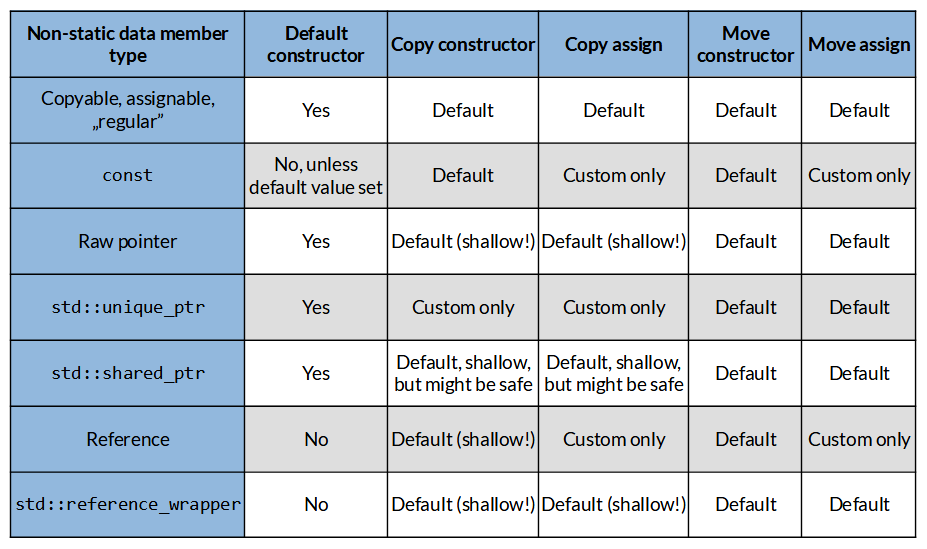

**10. Non-regular Data Members**

Thus far, we have spoken about mutable non-static data members like integers, doubles, or

strings. Such objects are regular ¹, meaning they are copyable, default constructible, and equally comparable.

However, you can also have other categories of objects in a class. For example, a custom type might contain constant data members, pointers, references, or moveable-only fields like unique pointers or mutexes. For such members, the compiler will have issues creating default implementations for special member functions.

In this chapter, we’ll shed some light on such cases.

**Constant non-static data members**

Consider the following code with a const data member id\_:

**Ex 10.1. A constant data member. Run** [**@Compiler Explorer**](https://godbolt.org/z/1hrncModb)

\#include \<iostream\>

\#include \<string\>

**class ProductConst** {

**public**:

**explicit** ProductConst(**const char**\* name, **unsigned** id)

: name\_(name), id\_(id) { }

**const** std::string& name() **const** { **return** name\_; }

**void** name(**const** std::string& name) { name\_ = name; }

**unsigned** id() **const** { **return** id\_; } **private**:

std::string name\_;

**const unsigned** id\_;

};

¹Being regular is a well-defined term in the C++ Standard, see the std::regular concept at C++ Reference:

https://en.cppreference.com/w/cpp/concepts/regular.

150

Non-regular Data Members 151

**int** main() {

ProductConst tvset{"TV Set", 123};

std::cout \<\< tvset.name() \<\< ", id: " \<\< tvset.id() \<\< '\n';

ProductConst copy { tvset };

std::cout \<\< copy.name() \<\< ", id: " \<\< copy.id() \<\< '\n'; }

In the example above, the class ProductConst has a constant data member id\_. We can set the constant inside the constructor; from now on, it will be fixed, and we won’t be able to change its value.

At first sight, the code looks fine, and we can even use the default copy constructor to create copy from tvset. But, we have a few issues:

First of all, the default constructor is blocked::

**class ProdConst** {

**public**:

ProdConst() = **default**; // warning in clang!

In Clang, you’ll get the following warning:

default constructor of 'ProdConst' is implicitly deleted because field 'id\_' of const-qualified type 'const unsigned int' would not be initialized

You can attempt to fix it with in-class member initialization:

**private**:

std::string name\_;

**const unsigned** id\_ { 0 };

};

However, this is semantically confusing as you won’t be able to change that member later.

You might also be surprised when you try to change the value of tvset: Non-regular Data Members 152

tvset = Product("TV Set 2022", 456);

The line generates a compilation error! It’s because the compiler tries to invoke an assignment operator, but it’s impossible since one data member is constant. When one data member is const, the compiler won’t generate a default assignment operator for us. Such classes might also cause trouble in standard containers. Consider the following code:

std::vector\<ProdConst\> prods;

prods.push_back(ProdConst("box", 234)); prods.push_back(ProdConst("car", 567)); prods.insert(prods.begin(), ProductConst("ball", 987));

While the push_back calls work fine (as the compiler can successfully create objects inside the container), there’s an issue with the insert(), which requires an assignment operator to be available.

GCC might report the following error:

error: use of deleted function ProdConst& ProdConst::operator=(ProdConst&&)

You can experiment with this example [@Compiler Explorer²](https://godbolt.org/z/oeazxj5qs).

The only way to fix the compiler error is to write a custom assignment operator. For example, you could copy mutable data members and “leave” constant members. The problem is that it’s pretty complicated. Moreover, it might be misleading to the reader, as it’s not easy to reason what is changing.

If you want your object to be constant, make it const as a “whole” rather than just some of its parts.

You can read more about this semantic problem with constant data members in a

good overview by Arthur O’Dwyer; see at [const](https://quuxplusone.github.io/blog/2022/01/23/dont-const-all-the-things/) [all the things?](https://quuxplusone.github.io/blog/2022/01/23/dont-const-all-the-things/)³.

We can summarize a class type with a const non-static data member as:

• It will be default constructible only when you assign a default value to the member

(NSDMI); otherwise, it won’t be default constructible.

• The compiler can generate a copy and move constructors.

• Default copy assignment and move assignment operators are blocked.

²<https://godbolt.org/z/oeazxj5qs>

³<https://quuxplusone.github.io/blog/2022/01/23/dont-const-all-the-things/>

Non-regular Data Members 153

**Pointers as data members**

This section should start with a warning: “don’t use raw pointers”, but if you do, please be careful. Have a look at the following dangerous wrapper:

**Ex 10.2. A raw pointer as a data member. Run** [**@Compiler Explorer**](https://godbolt.org/z/aY8haWzfY)

\#include \<iostream\>

\#include \<string\>

**class DangerousWrapper** {

**public**:

**explicit** DangerousWrapper(std::string\* pstr) : pName\_(pstr) { }

std::string\* name() **const** { **return** pName\_; }

**void** name(std::string\* pstr) { pName\_ = pstr; } **private**:

std::string\* pName\_ { **nullptr** }; };

**int** main() {

std::string str { "Name"};

DangerousWrapper w { &str };

DangerousWrapper x { w };

std::cout \<\< \*w.name() \<\< '\n'; // urgh... !!

\*(x.name()) = "Other";

std::cout \<\< \*w.name() \<\< '\n'; // urgh... !! }

It looks simple. pName\_ is a raw pointer to std::string, and when used correctly, it seems to work. A pointer can be copied and assigned; thus, the compiler creates the default copy constructor, move constructor, copy assignment and move assignment.

But the main point and risk are that it’s tricky to use such wrappers!

Every time you access a pointer, you should check if it’s not null. For example, this line:

\*(w.name())

Non-regular Data Members 154

It can generate undefined behavior if pName\_ is null. In practical terms, you’ll probably get a runtime crash on x86/64 platforms like Windows or Linux.

What’s more, you have to be prepared for cases like:

DangerousWrapper foo() {

std::string str { "Name"};

DangerousWrapper w { &str };

// some computation...

**return** w;

}

**auto** x = foo(); // oops... !!

Can you see what might happen here?

The code returns a wrapper that holds a pointer to a local object. After the function ends, the local str variable goes out of the scope, and pName\_ will point to some garbage. In that case, checking for != nullptr' won’t help.

Our simple wrapper might be considered as a view type of object. Such types rely on the existence of some other objects declared in the same or a different scope. In the Standard Library, we can mention at least two similar types:

• std::string_view (from C++17)

• std::span (from C++20)

However, we can also use pointers internally in a class and don’t take or expose them directly. One of the best examples is a pointer to implementation, called pimpl as a popular

abbreviation⁴.

Here’s one version of the pattern and raw pointers:

⁴PIMPL is often used to reduce compilation times, and in C++20, this might not be needed because of modules. Still, PIMPL

can be handy when you want to hide the implementation details and protect against ABI changes completely.

Non-regular Data Members 155

// class.h

**class MyClassImpl**;

**class MyClass** {

// special member functions...

**void** Foo();

**private**:

MyClassImpl\* pImpl\_ {};

};

// class.cpp

**class MyClassImpl**

{

**public**:

**void** DoStuff() { /\*...\*/ }

};

MyClass::MyClass ()

: pImpl\_(**new** MyClassImpl())

{ }

MyClass::~MyClass () { **delete** pImpl\_; }

**void** MyClass ::DoSth() {

m_pImpl-\>DoSth();

}

In short, we declare a pointer to some incomplete type in the header file. A pointer has a well-defined size (usually 4 or 8 bytes), so the compiler can adequately evaluate the size of the MyClass class, even though it points to some incomplete MyClassImpl.Inside the cpp file, we declare and define the implementation class. The main class becomes a thin wrapper that calls the implementation through that pImpl\_ pointer. The main thing to notice here is that the lifetime of the pointer is strictly related to the lifetime of the parent class. If you create MyClass, you also start the lifetime of pImpl\_. The pointer to implementation is not exposed outside, the clients of the class cannot change it directly, so it’s safe to use.

While the compiler can create default copy and move operations, those will produce only “shallow” copies since the pointer will be copied bit by bit. We must implement special member functions to allocate new pointers for implementation objects properly.

You can read about all benefits of this pattern in my article [The Pimpl Pattern - what you](https://www.cppstories.com/2018/01/pimpl/)

[Non-regular Data Members 156](https://www.cppstories.com/2018/01/pimpl/)

[should know - C++ Stories⁵](https://www.cppstories.com/2018/01/pimpl/).

Pointer to implementation is one of many examples where a pointer might be handy. We can also list a few ideas:

• Having a pointer to some cache. The cache might be created on demand and updated

when needed.

• Having a pointer to some large buffers that won’t fit into the stack.

• If the class requires some pointers for C-style libraries, like file handlers, sockets, OS

objects, *etc.*

In all of the above cases, the lifetime of the stored pointer is “inside” or wrapped by the lifetime of the parent class/object. It’s tricky but usually safer than when you rely on entities totally “outside” the object.

Raw pointers are usually tricky to use, so be careful or use smart pointers.

In summary, a class type with a raw pointer non-static data member has the following properties:

• It will be default constructible, but it’s best to assign some starting value to the pointer

(or at least nullptr).

• The compiler can generate a copy and move constructors, but it will be a shallow copy!

• The compiler can create default copy assignment and move assignment operators, but

the operations will also be shallow!

**Smart pointers as data members**

If you need to use a pointer as a data member, consider using a smart pointer. The main benefit of smart pointers is that they wrap resource creation and deletion. That’s why you don’t need to remember about releasing a resource manually. Let’s have a look at the example which shows a unique_ptr inside a class:

⁵<https://www.cppstories.com/2018/01/pimpl/>

Non-regular Data Members 157

**Ex 10.3. A unique pointer as a data member. Run** [**@Compiler Explorer**](https://godbolt.org/z/qWdMaoM6E) **struct Value** {

**explicit** Value(**int** v) : v\_(v) { std::cout \<\< "Value(" \<\< v\_ \<\< ")**\n**"; }

~Value() **noexcept** { std::cout \<\< "~Value(" \<\< v\_ \<\< ")**\n**"; }

**int** v\_;

};

**class ProductUniquePointer** {

**public**:

ProductUniquePointer() = **default**;

**explicit** ProductUniquePointer(**const char**\* name,

std::unique_ptr\<Value\> pId)

: name\_(name), pId\_(std::move(pId)) { }

**const** std::string& name() **const** { **return** name\_; }

**int** id() **const** { **return** pId\_ ? pId\_-\>v\_ : 0; } **private**:

std::string name\_;

std::unique_ptr\<Value\> pId\_;

};

This time the code is a bit more complex, but the main benefit is that we increase the safety of the code. The code uses a simple Value wrapper type which can output some text from the constructor and the destructor.

For example, here’s a simple use case:

**auto** pId = std::make_unique\<Value\>(123); ProductUniquePointer tvset{"TV Set", std::move(pId)}; std::cout \<\< "tvset: " \<\< tvset.name() \<\< ", id: " \<\< tvset.id() \<\< '\n'; ProductUniquePointer moved { std::move(tvset) }; std::cout \<\< "tvset: " \<\< tvset.name() \<\< ", id: " \<\< tvset.id() \<\< '\n'; std::cout \<\< "moved: " \<\< moved.name() \<\< ", id: " \<\< moved.id() \<\< '\n';

The code creates pId and then passes it to the tvset object. Notice that we have to explicitly “move” it. This transfers the ownership of the resource (allocated memory for the Value object) into the ProductUniquePointer instance. At each moment, there’s only one (“unique”) owner of the resource. Later, we move the whole object to create moved. Here’s the output from this program:

Non-regular Data Members 158

Value(123)

tvset: TV Set, id: 123

tvset: , id: 0

moved: TV Set, id: 123

~Value(123)

Notice that the Value destructor is called automatically and only once. And after we move from tvset, the default move constructor is called, and the tvset object is left in an unspecified but valid state (usually an “empty” state).

Since the class doesn’t implement any special member functions, the compiler will provide the default implementations. In the case of a unique_ptrdata member, copy operations are blocked, but move operations are provided. This limitation is a good thing, as we have to decide on the semantics of the class and implement custom copy operations.

**Safer wrappers with** **unique_ptr**

unique_ptr can also help with objects going out of the scope we’ve seen with DangerousWrapper. Below you have a version with a replaced raw pointer with a smart pointer; the code won’t compile:

\#include \<string\>

\#include \<memory\>

**class SaferWrapper** {

**public**:

**explicit** SaferWrapper(unique_ptr\<string\> pstr)

: pName\_(move(pstr)) { }

string\* name() **const** { **return** pName\_.get(); }

**void** name(unique_ptr\<string\> pstr) { pName\_ = move(pstr); } **private**:

unique_ptr\<string\> pName\_ {**nullptr**}; };

SaferWrapper foo() {

string str { "Name"};

SaferWrapper w { &str };

// some computation...

Non-regular Data Members 159

**return** w;

}

**int** main() { }

The SaferWrapper takes a unique_ptr as an argument for the constructor. This will immediately block the passing of a raw pointer &str, and GCC reports the following error:

error: no matching function for call to 'SaferWrapper::SaferWrapper(...)'

20 \| SaferWrapper w { &str };

To fix the issue, we can write:

// 1)

std::string str { "Name"};

SaferWrapper w { std::make_unique\<std::string\>(str) }; // 2):

SaferWrapper w { std::make_unique\<std::string\>("Name") };

Above the first case, 1) creates a temporary unique pointer with a **copy** of the str object. In the second case, there’s no extra string copy, and the pointer is created from the "Name" string literal. In both cases, the string object is allocated on the heap, so even if the function ends, the pointer will still be valid.

Of course, you can still write the following code:

// bad idea:

std::string str { "Name"};

SaferWrapper w { std::unique_ptr\<std::string\>(&str) };

But in this case, the unique pointer will still point to some local object, and when it goes out of scope, it will be invalid. As you can see, unique_ptr gives us a safer technique, but still, you need to pay attention when you create it.

**Improving** **pimpl** **with** **unique_ptr**

Going further, here’s an improved version, which uses unique_ptr based on our previous code. This class “wraps” the pointer, and the code implements all special member functions to manage it properly.

Non-regular Data Members 160

**Ex 10.4. PIMPL with** **unique_ptr****, header. Run** [**@Wandbox**](https://wandbox.org/permlink/r7zLHqaMfLu1emIO)

// class.h

\#include \<memory\>

**class MyClassImpl**;

**class MyClass** {

**public**:

MyClass();

~MyClass();

// movable:

MyClass(MyClass && rhs) **noexcept**;

MyClass& **operator**=(MyClass && rhs) **noexcept**;

// and copyable

MyClass(**const** MyClass& rhs);

MyClass& **operator**=(**const** MyClass& rhs);

**void** DoSth();

**void** DoConst() **const**;

**private**:

**const** MyClassImpl\* Pimpl() **const** { **return** m_pImpl.get(); }

MyClassImpl\* Pimpl() { **return** m_pImpl.get(); }

std::unique_ptr\<MyClassImpl\> m_pImpl; };

And the source file:

**Ex 10.4. PIMPL with** **unique_ptr****, cpp file. Run** [**@Wandbox**](https://wandbox.org/permlink/V5pmxKTj3sFl4nPy)

// class.cpp

\#include "class.h"

\#include \<iostream\>

**class MyClassImpl** {

**public**:

~MyClassImpl() = **default**;

**void** DoSth() { std::cout \<\< "Impl::DoSth()**\n**"; }

**void** DoConst() **const** { }

};

Non-regular Data Members 161

MyClass::MyClass() : m_pImpl(std::make_unique\<MyClassImpl\>()) { }

MyClass::~MyClass() = **default**;

MyClass::MyClass(MyClass &&) **noexcept** = **default**; MyClass& MyClass::**operator**=(MyClass &&) **noexcept** = **default**;

MyClass::MyClass(**const** MyClass& rhs)

: m_pImpl(std::make_unique\<MyClassImpl\>(\*rhs.m_pImpl)) { }

MyClass& MyClass::**operator**=(**const** MyClass& rhs) {

**if** (**this** != &rhs)

m_pImpl = std::make_unique\<MyClassImpl\>(\*rhs.m_pImpl);

**return** \***this**;

}

**void** MyClass::DoSth() {

std::cout \<\< "MyClass::DoSth() wrapper**\n**";

Pimpl()-\>DoSth();

}

**void** MyClass::DoConst() **const** {

Pimpl()-\>DoConst();

}

The above code uses unique_ptr to hold the pointer to “implementation”. The class defines special member functions so that when you copy an object, you’ll copy the implementation details.

**Using** **std::shared_ptr**

On the other hand, we can also use shared_ptr, which has different semantics. Rather than restricting the resource to a single owner, shared_ptr works with several owners that share a single resource. When the last owner ends its lifetime, the resource is also deleted. Here’s a simplified demo of such behavior:

Non-regular Data Members 162

**Ex 10.5. A shared pointer as a data member. Run** [**@Compiler Explorer**](https://godbolt.org/z/jGPxGMTb7)

**struct Value** {

**explicit** Value(**int** v) : v\_(v) { cout \<\< "Value(" \<\< v\_ \<\< ")**\n**"; }

~Value() **noexcept** { cout \<\< "~Value(" \<\< v\_ \<\< ")**\n**"; }

**int** v\_;

};

**class ProductWithSharedPtr** {

**public**:

ProductWithSharedPtr() = **default**;

**explicit** ProductWithSharedPtr(**const char**\* name,

std::shared_ptr\<Value\> pId)

: name\_(name), pId\_(pId) { }

**const** std::string& name() **const** { **return** name\_; }

**int** id() **const** { **return** pId\_ ? pId\_-\>v\_ : 0; } **private**:

std::string name\_;

std::shared_ptr\<Value\> pId\_;

};

We can use it like:

**int** main() {

**auto** pId = make_shared\<Value\>(123);

ProductWithSharedPtr tv{"TV Set", pId};

cout \<\< "tv: " \<\< tv.name() \<\< ", id: " \<\< tv.id() \<\< '\n';

cout \<\< "pId use count: " \<\< pId.use_count() \<\< '\n';

{

ProductWithSharedPtr copy { tv };

cout \<\< "tv: " \<\< tv.name() \<\< ", id: " \<\< tv.id() \<\< '\n'; cout \<\< "copy: " \<\< copy.name() \<\< ", id: " \<\< copy.id() \<\< '\n'; pId-\>v\_ = 100;

cout \<\< "tv: " \<\< tv.name() \<\< ", id: " \<\< tv.id() \<\< '\n'; cout \<\< "copy: " \<\< copy.name() \<\< ", id: " \<\< copy.id() \<\< '\n'; cout \<\< "pId use count: " \<\< pId.use_count() \<\< '\n';

}

Non-regular Data Members 163

cout \<\< "pId use count: " \<\< pId.use_count() \<\< '\n'; }

Value(123)

tv: TV Set, id: 123

pId use count: 2

tv: TV Set, id: 123

copy: TV Set, id: 123

tv: TV Set, id: 100

copy: TV Set, id: 100

pId use count: 3

pId use count: 2

~Value(100)

As you can see, we still have a single Value resource, and then we pass it to the tvset object. When we copy the object into copy, the pointer is shared (the resource is not copied). This is safer than a shallow copy of a raw pointer because we have precise semantics, and we can see where are the owners of the resource. For example, when copy goes out of scope, it won’t delete the Value object; it will just decrease the reference counter (see “use count” going from 3 to 2). In the end, tvset as well as pId goes out of scope, the reference counter decreases to zero, and thus the memory block is deleted.

**Summary for smart pointers**

In summary, a class type with a smart pointer non-static data member has the following properties:

• It will be default constructible, but it’s best to assign some starting value to the pointer

(or at least nullptr).

• The compiler can generate a move constructor and move assignment operator.

• For unique_ptr default copy operations are blocked, and you must implement custom

versions.

• For shared_ptr, default copy operations are provided, but they are “shallow”. This

is still safer than copying raw pointers, as this time, we copy shared pointers which increases their internal reference counter, and thus the resource handling will be safe (although it might be harder to reason about).

Non-regular Data Members 164

**References as data members**

We covered const and pointers, and now we can finally address references as data members. But before, we need to recall const pointers:

// value being pointed cannot be changed:

**const int**\* pInt;

**int const**\* pInt; // equivalent form

// address of the pointer cannot be changed, // but the value being pointed can be

**int**\* **const** pInt;

// both value and the address of the pointer are protected from changing **const int**\* **const** pInt;

**int const**\* **const** pInt; // equivalent form

And in most cases, we can look at references, like the T\* const ptr type. In other words, we can initialize the reference with some other object, but we cannot rebind it later. This immediately brings consequences as we had with const data members:

• Default constructor is problematic, as we cannot assign nullptr to a reference.

• Default copy and move constructors are provided by the compiler, but they are

“shallow”, like with a pointer.

• Default copy and move assignment operators are deleted, as the compiler cannot

implement them for a const data member.

See the example:

Non-regular Data Members 165

\#include \<iostream\>

\#include \<string\>

**class WrapperWithRef** {

**public**:

WrapperWithRef() = **default**; // cannot make it default...

**explicit** WrapperWithRef(std::string& n) : name\_(n) { }

**const** std::string& name() **const** { **return** name\_; }

**void** name(**const** std::string& name) { name\_ = name; } **private**:

std::string& name\_; // cannot set to "nullptr" or {} empty! };

**int** main() {

std::string str { "Name"};

WrapperWithRef w { str };

w.name(str);

WrapperWithRef x { w };

std::cout \<\< "str: " \<\< str \<\< '\n';

std::cout \<\< "x.name(): " \<\< x.name() \<\< '\n';

x.name("abc");

std::cout \<\< "str: " \<\< str \<\< '\n';

//WrapperWithRef def {}; // cannot default construct \\

//x = w; // error, cannot assign

}

The example illustrates a couple of use cases of a class with a reference inside. We can create such objects and make copies, but we cannot assign new values or rebind a reference.

However, having a reference is not uncommon, and you might implicitly create such types when you use lambdas. Have a look:

Non-regular Data Members 166

\#include \<iostream\>

\#include \<string\>

**int** main() {

std::string str { "Name"};

**auto** changeStr = \[&str\](**int** x) {

str = std::to_string(x);

};

std::cout \<\< str \<\< '\n';

changeStr(10);

std::cout \<\< str \<\< '\n';

}

If we see that code through C++Insights, which exposes “how the compiler changes the code”, we can see the following “unnamed” class created from the lambda:

// basic string\<\> translated to std::string for simplicity... **class \_\_lambda_6_22** {

**public**:

**inline** /\*constexpr \*/ **void operator**()(**int** x) **const** {

str.**operator**=(std::to_string(x));

}

\_\_lambda_6_22(std::string & *str) : str{*str} { }

**private**:

std::string & str;

};

See [@C++Insights⁶](https://cppinsights.io/s/82fbe838).

**Changing to** **std::reference_wrapper**

Having a regular reference might bring some complications to your class design. As an alternative approach, the C++ Standard Library gives us std::reference_wrapper that “wraps a reference in a copyable, assignable object”.

See the example:

⁶<https://cppinsights.io/s/82fbe838>

Non-regular Data Members 167

\#include \<iostream\>

\#include \<string\>

**class WrapperWitStdhRef** {

**public**:

**explicit** WrapperWitStdhRef(std::string& n) : name\_(n) { }

**const** std::string& name() **const** { **return** name\_; }

**void** rebind(std::string& name) { name\_ = name; }

**void** name(**const** std::string& name) { name\_.get() = name; } **private**:

std::reference_wrapper\<std::string\> name\_; };

**int** main() {

std::string str { "Name"};

WrapperWitStdhRef w { str };

w.name(str);

WrapperWitStdhRef x { w };

std::cout \<\< "str: " \<\< str \<\< '\n';

std::cout \<\< "x.name(): " \<\< x.name() \<\< '\n';

x.name("abc");

std::cout \<\< "str: " \<\< str \<\< '\n';

std::cout \<\< "x.name(): " \<\< x.name() \<\< '\n';

//WrapperWitStdhRef def {}; // cannot default construct

x = w; // fine now

}

This time we have a very similar code to the previous one, but notice two member functions: name(...) and rebind(...). To change the value pointer by name\_, you need to use the .get() member function. The regular assignment operator rebinds the reference. Same as before, the class is still not default-constructible as reference_wrapper cannot be empty/null.

Other use cases for reference_wrapper:

• Storing std::reference_wrapper in standard containers is impossible with regular

references.

• Creating pairs or tuples of references.

Non-regular Data Members 168

• Passing reference-like arguments to the start function of std::thread.

std::refrence_wrapper is usually implemented as a raw pointer to the wrapped type. Extra member functions and operators make it “feel” like a reference type that can also rebind.

**Summary**

In this chapter, we covered several categories of data members that expose some interesting properties when you initialize an instance of the parent class.

Thanks to type traits from the Standard Library, we can have a quick test showing the properties of such classes. The core function is:

**Ex 10.8. Showing basic properties of a type. Run** [**@Compiler Explorer**](https://godbolt.org/z/rhaYYs5de)

**template** \<**typename T**\>

**void** ShowProps() {

**using namespace std**;

cout \<\< **typeid**(T).name() \<\< " props: **\n**";

cout \<\< "default constructible " \<\< is_default_constructible_v\<T\>;

cout \<\< " \| copy assignable " \<\< is_copy_assignable_v\<T\> \<\< " \| ";

cout \<\< "move assignable " \<\< is_move_assignable_v\<T\> \<\< '\n';

cout \<\< "copy constructible " \<\< is_copy_constructible_v\<T\> \<\< " \| ";

cout \<\< "move constructible " \<\< is_move_constructible_v\<T\> \<\< '\n'; }

Using the above function template, I generated the following table:

Non-regular Data Members 169

**Non-regular data members summary**

For example, when your class has a const data member, then the default constructor is not available (unless you assign some default value), the copy and the move constructors can be provided by the compiler, but default assignment operators are not available. “Custom only” means that the compiler cannot generate a default implementation, and the user has to provide some custom implementation.

Having discussed other categories of non-static data members, we can now examine static data members. How to use them in Modern C++? See the next chapter.