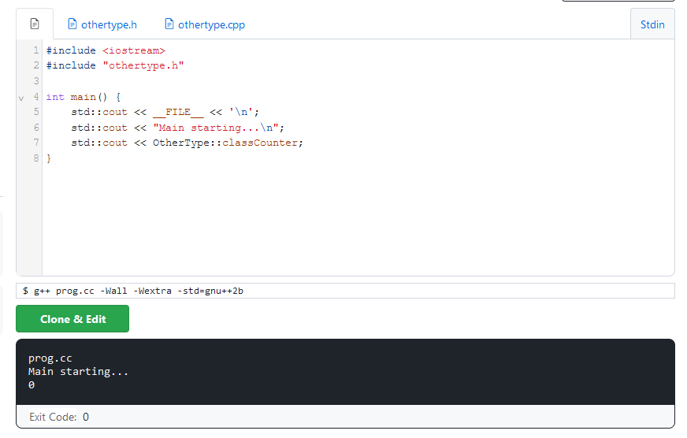
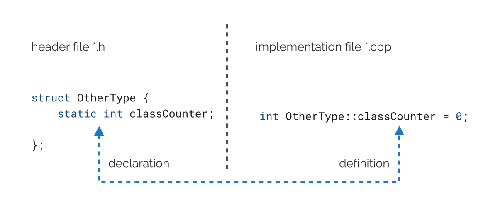
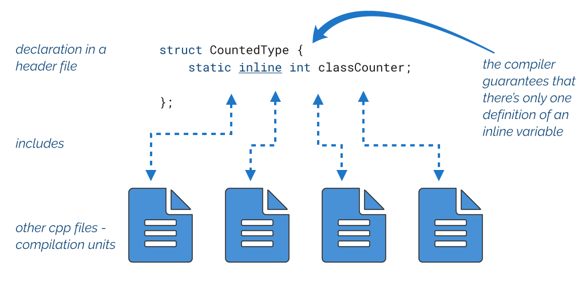

**11. Non-local objects**

Thus far, we considered variables that appeared in some local function scope or as subobjects of a class type. However, this is not the only option, and C++ allows us to declare various forms of non-local objects: they usually live throughout the execution of the whole program. In this chapter, we’ll look at global variables, static data members, and thread-local objects. We’ll also consider new features for safe initialization from C++17 and C++20.

**Storage duration and linkage**

To start, we need to understand two key properties of an object in C++: *storage* and *linkage*.

Let’s begin with the definition of *storage*, from \[[basic.stc#general¹](https://timsong-cpp.github.io/cppwp/n4868/basic.stc#general)\]:

The storage duration is the property of an object that defines the minimum potential lifetime of the storage containing the object. The storage duration is determined by the construct used to create the object.

An object in C++ has one of the following storage duration options:

**Storage duration** **Explanation**

*automatic* Automatic means that the storage is allocated at the start of the scope. Most

local variables have automatic storage duration (except those declared as static, extern, or thread_local).

*static* The storage for an object is allocated when the program begins (usually

before the main() function starts) and deallocated when the program ends. There’s only one instance of such an object in the whole program.

*thread* The storage for an object is tied to a thread: it’s started when a thread begins

and is deallocated when the thread ends. Each thread has its own “copy” of that object.

*dynamic* The storage for an object is allocated and deallocated using explicit dynamic

memory allocation functions. For example, by the call to new/delete.

¹<https://timsong-cpp.github.io/cppwp/n4868/basic.stc#general>

170

Non-local objects 171

And the definition for the second property: *linkage*, extracted from [\[basic.link²](https://timsong-cpp.github.io/cppwp/n4868/basic.link#2)\]:

A name is said to have linkage when it can denote the same object, reference, function, type, template, namespace, or value as a name introduced by a declaration in another scope.

We have several linkage types:

**Linkage** **Explanation**

*external linkage* External means that the name can be referred to from the scopes in the same

or other translation units. Non-const global variables have external linkage by default.

*module linkage* Available since C++20. A name can be referred in scopes of the same module

or module units.

*internal linkage* A name can be referred to from the scopes in the same translation units. For

example, a static, const, and constexpr global variables have internal linkage.

*no linkage* Cannot be referred from other scopes.

*language linkage* Allows interoperability between different programming languages, usually

with C. For example, by declaring extern "C"

If we work with regular variables declared in a function’s scope, the storage is automatic, and there’s no linkage, but those properties matter for objects in a global or thread scope. In the following sections, we’ll try experiments with global objects to understand the meaning of those definitions.

**Static duration and external linkage**

Consider the following code:

²<https://timsong-cpp.github.io/cppwp/n4868/basic.link#2>

Non-local objects 172

**Ex 11.1. Static and automatic objects. Run** [**@Compiler Explorer**](https://godbolt.org/z/hc3rsn8d1)

\#include \<iostream\>

**struct Value** {

Value(**int** x) : v(x) { std::cout \<\< "Value(" \<\< v \<\< ")**\n**"; }

~Value() **noexcept** { std::cout \<\< "~Value(" \<\< v \<\< ")**\n**"; }

**int** v {0};

};

Value v{42};

**int** main() {

puts("main starts...");

Value x { 100 };

puts("main ends...");

}

If we run the example, you’ll see the following output:

Value(42)

main starts...

Value(100)

main ends...

~Value(100)

~Value(42)

In the example, there’s a structure called Value, and I declare and define a global variable v. As you can see from the output, the object is initialized **before** the main() function starts and is destroyed after the main() ends.

The global variable v has a static storage duration and external linkage. On the other hand, the second variable, x, has no linkage and automatic storage duration (as it’s a local variable).

If we have two translation units: main.cpp and other.cpp, we can point to the same global variable by declaring and defining an object in one place and then using the extern keyword to provide the declaration in the other translation unit. This is illustrated by the following example:

Non-local objects 173

**Ex 11.2. Static and** **extern****. Run** [**@Wandbox**](https://wandbox.org/permlink/OyPh98Ip0gy7q7xO)

// main.cpp

\#include \<iostream\>

\#include "value.h"

Value v{42};

**void** foo();

**int** main() {

std::cout \<\< "in main(): " \<\< &v \<\< '\n';

foo();

std::cout \<\< "main ends...**\n**"; }

// other.cpp

\#include "value.h"

**extern** Value v; // declaration only!

**void** foo() {

std::cout \<\< "in foo(): " \<\< &v \<\< '\n'; }

If we run the code, you’ll see that the address of v is the same in both lines. For instance:

Value(42)

in main(): 0x404194

in foo(): 0x404194

main ends...

~Value(42)

**Internal linkage**

If you want two global variables visible as separate objects in each translation unit, you need to define them as static. This will change their linkage from external to internal. Non-local objects 174

**Ex 11.3. Static and internal linkage. Run** [**@Wandbox**](https://wandbox.org/permlink/THZQhYxtKqpoLxRy)

// main.cpp

\#include \<iostream\>

\#include "value.h"

**static** Value v{42};

**void** foo();

**int** main() {

std::cout \<\< "in main(): " \<\< &v \<\< '\n';

foo();

std::cout \<\< "main ends...**\n**"; }

// other.cpp

\#include "value.h"

**static** Value v { 100 };

**void** foo() {

std::cout \<\< "in foo(): " \<\< &v \<\< '\n'; }

Now, you have two different objects which live in the static storage (outside main()):

Value(42)

Value(100)

in main(): 0x404198

in foo(): 0x4041a0

main ends...

~Value(100)

~Value(42)

You can also achieve this by wrapping objects in an anonymous namespace:

Non-local objects 175

**namespace** {

Value v{42};

}

Additionally, if you declare const Value v{42}; in one translation unit, then const implies an internal linkage. If you want to have a const object with the external linkage, you need to add the extern keyword:

// main.cpp:

**extern const** Value v { 42 }; // declaration and definition!

// other.cpp:

**extern const** Value v; // declaration

While constant global variables might be useful, try to avoid mutable global objects. They complicate the program’s state and may introduce subtle bugs or data races, especially in multithreaded programs. In this chapter, we cover all global variables so that you can understand how they work, but use them carefully.

See this C++ Core Guideline: [I.2: Avoid non-const global variables³](https://isocpp.github.io/CppCoreGuidelines/CppCoreGuidelines#i2-avoid-non-const-global-variables).

**Thread local storage duration**

Since C++11, you can use a new keyword, thread_local, to indicate the special storage of a variable. A thread_local object can be declared at a local scope or at a global scope. In both cases, its initialization is tied to a thread, and the storage is located in the Thread Local

Storage space ⁴. Each thread that uses this object creates a copy of it.

³<https://isocpp.github.io/CppCoreGuidelines/CppCoreGuidelines#i2-avoid-non-const-global-variables>

⁴See more at https://en.wikipedia.org/wiki/Thread-local_storage Non-local objects 176

**Ex 11.4. Example of thread_local variables. Run** [**@Compiler Explorer**](https://godbolt.org/z/o6TMv3zn7)

\#include \<iostream\>

\#include \<thread\>

\#include \<mutex\>

std::mutex mutPrint;

**thread_local int** x = 0;

**void** foo() {

**thread_local int** y = 0;

std::lock_guard guard(mutPrint);

std::cout \<\< "in thread**\t**" \<\< std::this_thread::get_id() \<\< " ";

std::cout \<\< "&x " \<\< &x \<\< ", ";

std::cout \<\< "&y " \<\< &y \<\< '\n'; }

**int** main() {

std::cout \<\< "main **\t**" \<\< std::this_thread::get_id() \<\< " &x " \<\< &x \<\< \\ '\n';

std::jthread worker1 { foo };

foo();

std::jthread worker2 { foo };

foo();

}

And here’s a possible output:

main 4154632640 &x 0xf7a2a9b8 in thread 4154632640 &x 0xf7a2a9b8, &y 0xf7a2a9bc in thread 4154628928 &x 0xf7a29b38, &y 0xf7a29b3c in thread 4154632640 &x 0xf7a2a9b8, &y 0xf7a2a9bc in thread 4146236224 &x 0xf7228b38, &y 0xf7228b3c

The example uses a mutex mutPrint to synchronize printing to the output. First, inside main(), you can see the ID of the main thread and the address of the x variable. Later in the output, you can see that foo() was called, and it’s done in the main thread (compare the Non-local objects 177

IDs). As you can see, the addresses of x are the same because it’s the same thread. On the other hand, later in the output, we can see an invocation from two different threads; in both cases, the addresses of x and y are different. In summary, we have three distinct copies of x and three of y.

From the example, we can also spot that across a single thread, thread_local in a function scope behaves like a static local variable. What’s more, the two lines are equivalent:

// local or global scope...

**static thread_local int** x;

**thread_local int** y; // means the same as above

The code uses std::jthread from C++20, which automatically joins to the caller thread when the jthread object goes out of scope. When you use std::thread you need to call join() manually.

Thread local variables might be used when you want a shared global state, but keep it only for a given thread and thus avoid synchronization issues. To simulate such behavior and understand those types of variables, we can create a map of variables:

std::map\<thread_id, Object\> objects;

And each time you access a global variable, you need to access it via the current thread id, something like:

objects\[std::this_thread::get_id()\] = x; // modify the global object...

Of course, the above code is just a simplification, and thanks to thread_local, all details are hidden by the compiler, and we can safely access and modify objects.

In another example, we can observe when each copy is created, have a look:

Non-local objects 178

**Ex 11.5. Begin and end of a thread-local variable. Run** [**@Compiler Explorer**](https://godbolt.org/z/7aEToMbT1)

\#include \<iostream\>

\#include \<thread\>

\#include "value.h"

**thread_local** Value x { 42 };

**void** foo() {

std::cout \<\< "foo()**\n**";

x.v = 100;

}

**int** main() {

std::cout \<\< "main " \<\< std::this_thread::get_id() \<\< '\n';

{

std::jthread worker1 { foo }; std::jthread worker2 { foo };

}

std::cout \<\< "end main()**\n**";

}

Possible output

main 4154399168

foo()

Value(42)

foo()

Value(42)

~Value(~Value(100)

100\)

end main()

This time the variable x prints a message from its constructor and destructor, and thus we can see some details. Only two foo thread workers use this variable, and we have two copies, not three (the main thread doesn’t use the variable). Each copy starts its lifetime when its parent thread starts and ends when the thread joins into the main thread.

Non-local objects 179

As an experiment, you can try commenting out the line with x.v = 100. After the compilation, you won’t see any Value constructor or destructor calls. It’s because the object is not used by any thread, and thus no object is created.

Possible use cases:

• Having a random number generator, one per thread

• One thread processes a server connection and stores some state across

• Keeping some statistics per thread, for example, to measure load in a thread pool.

**Dynamic storage duration**

For completeness, we also have to mention dynamic storage duration. In short, by requesting a memory through explicit calls to memory management routines, you have full control when the object is created and destroyed. In most basic scenario you can call new() and then delete:

**auto** pInt = **new int**{42}; // only for illustration... **auto** pSmartInt = std::make_unique\<**int**\>(42); **int** main() {

**auto** pDouble = **new double** { 42.2 }; // only for illustration...

// use pInt...

// use pDouble

**delete** pInt;

**delete** pDouble;

}

The above artificial example showed three options for dynamic storage:

• pInt is a non-local object initialized with the new expression. We have to destroy it

manually; in this case, it’s at the end of the main() function.

• pDouble is a local variable that is also dynamically initialized; we also have to delete

it manually.

• On the other hand, pSmartInt is a smart pointer, a std::unique_ptr that is dynamically initialized. Thanks to the RAII pattern, there’s no need to manually delete the memory, as the smart pointer will automatically do it when it goes out of scope. In our case, it will be destroyed after main() shuts down.

Non-local objects 180

Dynamic memory management is very tricky, so it’s best to rely on RAII and smart pointers to clean the memory. The example above used raw new and delete only to show the basic usage, but in production code, try to avoid it. See more in

those resources: [6 Ways to Refactor new/delete into unique ptr - C++ Stories⁵](https://www.cppstories.com/2021/refactor-into-uniqueptr/) and

[5 ways how unique_ptr enhances resource safety in your code - C++ Stories](https://www.cppstories.com/2017/12/why-uniqueptr/)⁶.

We spoke about memory deallocation and resource handling in the Destructor chapter; you can find more information there.

**Initialization of non-local static objects**

All non-local objects are initialized before main() starts and before their first “use”. But there’s more to that.

Consider the following code:

**Ex 11.4. Static initialization. Run** [**@CompilerExplorer**](https://godbolt.org/z/x3Y6d1dse)

\#include \<iostream\>

**struct Value** { /\*as before\*/ };

**double** z = 100.0;

**int** x;

Value v{42};

**int** main() {

puts("main starts...");

std::cout \<\< x \<\< '\n';

puts("main ends...");

}

All global objects z, x, and v are initialized during the program startup and before the main() starts. We can divide the initialization into two distinct types: *static initialization* and *dynamic initialization*.

The static initialization occurs in two forms:

⁵<https://www.cppstories.com/2021/refactor-into-uniqueptr/>

⁶<https://www.cppstories.com/2017/12/why-uniqueptr/>

Non-local objects 181

• **constant initialization**- this happens for the zvariable, which is value initialized from

a constant expression.

• The x object looks uninitialized, but for non-local static objects, the compiler performs

**zero initialization**, which means they will take the value of zero (and then it’s converted to the appropriate type). Pointers are set to nullptr, arrays, trivial structs, and unions have their members initialized to a zero value.

Don’t rely on zero initialization for static objects. Always try to assign some value to be sure of the outcome. In the book, I only showed it so you could see the whole picture.

Now, v global objects are initialized during so-called **dynamic initialization** of non-local variables”. It happens for objects that cannot be constant initialized or zero-initialized during static initialization at the program startup.

In a single translation unit, the order of dynamic initialization of global variables (including static data members) is well defined. If you have multiple compilation units, then the order is unspecified. When a global object A defined in one compilation unit depends on another global object B defined in a different translation unit, you’ll have undefined behavior. Such a problem is called the

“static initialization order fiasco”; read more [C++ Super FAQ](https://isocpp.org/wiki/faq/ctors#static-init-order)⁷.

In short, each static non-local object has to be initialized at the program startup. However, the compiler tries to optimize this process and, if possible, do as much work at compile time. For example, for built-in types initialized from constant expressions, the value of the variable might be stored as a part of the binary and then only loaded during the program startup. If it’s not possible, then a dynamic initialization must happen, meaning that the value is computed once before the main() starts. Additionally, the compiler might even defer the dynamic initialization until the first use of the variable but must guarantee the program’s correctness. Since C++11, we can try to move dynamic initialization to the compile-time stage thanks to constexpr (allowing us to write custom types). Since C++20, we can use constinit to guarantee constant initialization.

For more information, have a look at this good blog post for more information:

[C++ - Initialization of Static Variables by Pablo Arias](https://pabloariasal.github.io/2020/01/02/static-variable-initialization/)⁸ and also a presentation by

Matt Godbolt: [CppCon 2018 “The Bits Between the Bits: How We Get to main()”⁹](https://www.youtube.com/watch?v=dOfucXtyEsU).

⁷<https://isocpp.org/wiki/faq/ctors#static-init-order>

⁸<https://pabloariasal.github.io/2020/01/02/static-variable-initialization/>

⁹<https://www.youtube.com/watch?v=dOfucXtyEsU>

Non-local objects 182

**constinit** **in C++20**

As we discussed in the previous section, it’s best to rely on constant initialization if you really need a global variable. In the case of dynamic initialization, the order of initialization might be hard to guess and might cause issues. Consider the following example:

**Ex 11.5. Static initialization order fiasco, point.h. Run** [**@Wandbox**](https://wandbox.org/permlink/h19Hkk8qdlU2PwLS)

// point.h

**struct Point** {

**double** x, y;

};

**Ex 11.5. Static initialization order fiasco, a.cpp. Run** [**@Wandbox**](https://wandbox.org/permlink/h19Hkk8qdlU2PwLS)

// a.cpp

\#include \<iostream\>

\#include "point.h"

**extern** Point center;

Point offset = { center.x + 100, center.y + 200};

**void** foo() {

std::cout \<\< offset.x \<\< ", " \<\< offset.y \<\< '\n'; }

**Ex 11.5. Static initialization order fiasco, b.cpp. Run** [**@Wandbox**](https://wandbox.org/permlink/h19Hkk8qdlU2PwLS)

// b.cpp

\#include "point.h"

Point createPoint(**double** x, **double** y) {

**return** Point { x, y };

}

Point center = createPoint(100, 200); //dynamic

And the main:

Non-local objects 183

**Ex 11.5. Static initialization order fiasco, main.cpp. Run** [**@Wandbox**](https://wandbox.org/permlink/h19Hkk8qdlU2PwLS) **void** foo();

**int** main() {

foo();

}

If we compile this code using the following command and order:

\$ g++ prog.cc -Wall -Wextra -std=c++2a -pedantic a.cpp b.cpp

We’ll get the following:

100, 200

But if you compile b.cpp first and then a.cpp:

\$ g++ prog.cc -Wall -Wextra -std=c++2a -pedantic b.cpp a.cpp

You’ll get the following:

200, 400

There’s a dependency of global variables: offset depends on center. If the compilation unit with center were compiled first, the dynamic initialization would be performed, and center would have 100, 200 assigned. Otherwise, it’s only zero-initialized, and thus offset has the value of 100, 200.

This is only a toy example, but imagine a production code! In that case, you might have a hard-to-find bug that comes not from some incorrect computation logic but from the compilation order in the project!

To mitigate the issue, you can apply constinit on the center global variable. This new keyword for C++20 forces constant initialization. In our case, it will ensure that no matter the order of compilation, the value will already be present. What’s more, as opposed to constexpr we only force initialization, and the variable itself is not constant. So you can change it later.

Non-local objects 184

**Ex 11.6. Constinit approach, b.cpp Run** [**@Wandbox**](https://wandbox.org/permlink/atGGtcoOAJd5eRyx) // b.cpp:

\#include "point.h"

**constexpr** Point createPoint(**double** x, **double** y) {

**return** Point { x, y };

}

**constinit** Point center = createPoint(100, 200); // constant

Please notice that createPoint has to be constexpr now. The main requirement for constinit is that it requires the initializer expression to be evaluated at compile-time, so not all code can be converted that way.

Here’s another example that summarizes how to use constinit:

**Ex 11.7. Constinit** **std::pair****. Run** [**@Compiler Explorer**](https://godbolt.org/z/xaEhKGx7n) \#include \<iostream\>

\#include \<utility\>

**constinit** std::pair\<**int**, **double**\> global { 42, 42.2 }; **constexpr** std::pair\<**int**, **double**\> constG { 42, 42.2 };

**int** main() {

std::cout \<\< global.first \<\< ", " \<\< global.second \<\< '\n';

// but allow to change later...

global = { 10, 10.1 };

std::cout \<\< global.first \<\< ", " \<\< global.second \<\< '\n';

// constG = { 10, 10.1 }; // not allowed, const }

In the above example, I create a global std::pair object and force it to use constant initialization. I can do that on all types with constexpr constructors or trivial types. Notice that inside main(), I can change the value of my object, so it’s not const. For comparison, I also included the constG object, which is a constexpr variable. In that case, we’ll also force the compiler to use constant initialization, but this time the object cannot be changed later.

While a constinit variable will be constant initialized, it cannot be later used in the initializer of another constinit variable. A constinit object, is not constexpr .

Non-local objects 185

**Static variables in a function scope**

As you may know, C++ also offers another type of static variable: those defined in a function scope:

**void** foo() {

**static int** counter = 0;

++counter;

}

Above, the counter variable will be initialized and created when foo() is invoked for the first time. In other words, a static local variable is initialized lazily. The counter is kept “outside” the function’s stack space. This allows, for example, to keep the state, but limit the visibility of the global object.

**Ex 11.8. Counter as a local static variable. Run** [**@Compiler Explorer**](https://godbolt.org/z/sP91Eofqx)

\#include \<iostream\>

**int** foo() {

**static int** counter = 0;

**return** ++counter;

}

**int** main() {

foo();

foo();

foo();

**auto** finalCounter = foo();

std::cout \<\< finalCounter;

}

If you run the program, you’ll get 4 as the output.

Static local variables, since C++11, are guaranteed to be initialized in a threadsafe way. The object will be initialized only once if multiple threads enter a function with such a variable. Have a look below:

Non-local objects 186

**Ex 11.9. Thread safe static variable initialization. Run** [**@Compiler Explorer**](https://godbolt.org/z/8qzvMsMf8) \#include \<iostream\>

\#include \<thread\>

**struct Value** {

Value(**int** x) : v(x) { std::cout \<\< "Value(" \<\< v \<\< ")**\n**"; }

~Value() **noexcept** { std::cout \<\< "~Value(" \<\< v \<\< ")**\n**"; }

**int** v { 0 };

};

**void** foo() {

**static** Value x { 10 };

}

**int** main() {

std::jthread worker1 { foo };

std::jthread worker2 { foo };

std::jthread worker3 { foo }; }

The example creates three threads that call the foo() simple function.

However, on GCC, you can also try compiling with the following flags:

-std=c++20 -lpthread -fno-threadsafe-statics

And then the output might be as follows:

Value(Value(1010)

)

Value(10)

~Value(10)

~Value(10)

~Value(10)

Three static objects are created now!

We’ll address an interesting technique related to those function static objects in the

Techniques chapter: the Mayers Singleton section.

Non-local objects 187

**About static data members**

In general, each and every instance (object) of a class has non-static data members as its own data fields. Each example is separate from the other. If we consider a type (a class) representing a Fruit and it has a data member named “mass”, then each particular instance of that Fruit class has a “mass” member belonging to it. If we have 10 Fruit objects, the “mass” data member is replicated ten times. On the other hand, each type can also have static data members that are not bound to any instance of the class. In the case of our Fruit class, we can specify a so-called static variable named “default mass”, accessible to each Fruit instance, but it wouldn’t be part of any instance. In other words, it’s like a global variable in the namespace of the Fruit type.

Consider the following example:

**Ex 11.5. Simple** **static** **Data Member. Run** [**@Compiler Explorer**](https://godbolt.org/z/YsG3hK1qz)

\#include \<iostream\>

**struct Value** {

**int** x;

**static int** y; // declaration

};

**int** Value::y = 0; // definition

**int** main() {

Value v { 10 };

std::cout \<\< "sizeof(int): " \<\< **sizeof**(**int**) \<\< '\n';

std::cout \<\< "sizeof(Value): " \<\< **sizeof**(Value) \<\< '\n';

std::cout \<\< "v.x: " \<\< v.x \<\< '\n';

Value::y = 10;

std::cout \<\< "Value::y: " \<\< Value::y \<\< '\n'; }

When you run this program, you’ll see the following output:

Non-local objects 188

sizeof(int): 4

sizeof(Value): 4

v.x: 10

Value::y: 10

static int y declared in the scope of the Value class created a variable that is not part of any Value type instance. You can see that it doesn’t contribute to the size of the whole class. It’s the same as the size of the int type.

To be precise, Value::y has a static storage duration and external linkage.

Local classes or unnamed classes cannot have static data members.

Here’s an example that illustrates the lifetime of a static data member:

**Ex 11.6.** **static** **Data Member Lifetime. Run** [**@Compiler Explorer**](https://godbolt.org/z/v9Y34vYxd)

\#include \<iostream\>

**struct Value** {

Value(**int** x) : v(x) { std::cout \<\< "Value(" \<\< v \<\< ")**\n**"; }

~Value() **noexcept** { std::cout \<\< "~Value(" \<\< v \<\< ")**\n**"; }

**int** v {0};

};

**struct Test** {

Test() { puts("Test::Test()"); }

~Test() **noexcept** { puts("Test::~Test()"); }

**static** Value u;

**static** Value v;

**static int** w;

**static double** z;

};

Value Test::v { 42 };

Value Test::u { 24 };

Non-local objects 189

**int** Test::w;

**double** Test::z = 10.5f;

**int** main() {

puts("main starts...");

Test x;

std::cout \<\< Test::w \<\< '\n';

std::cout \<\< Test::z \<\< '\n';

puts("main ends...");

}

The code has the Value structure that has two instances in the form of two static data members inside the Test class. Additionally, we have two other data members, w and z, which are built-in types. If we run the code, you’ll see the following output:

Value(42)

Value(24)

main starts...

Test::Test()

0

10.5

main ends...

Test::~Test()

~Value(24)

~Value(42)

As you can see, two Value objects are created before the main starts, in the order of definitions in a file (not declarations!). After the main() function ends, the two objects are destroyed in reverse order.

**Motivation for inline variables**

In C++11/14, if you wanted to add a static data member to a class, you needed to declare it and define it later in one compilation unit. In the examples from the previous section, we defined it in the same compilation unit as the main() function. Commonly, such variables are defined in the corresponding implementation file.

For example:

Non-local objects 190

**Ex 11.7. Static data member, multiple files. Run** [**@Wandbox**](https://wandbox.org/permlink/1GbB85uze2hyfKqB)

// a header file:

**struct OtherType** {

**static int** classCounter;

// ...

};

// implementation, cpp file

**int** OtherType::classCounter = 0;

This time I used Wandbox online compiler - as it’s easy to create and compile multiple files:

As you can see above, classCounter is an int, and you have to write it twice: in a header file and then in the CPP file.

Non-local objects 191

The only exception to this rule (even before C++11) is a static constant integral variable that you can declare and initialize in one place:

**class MyType** {

**static const int** ImportantValue = 42; };

You do not have to define ImportantValue in a CPP file.

Fortunately, C++17 gave us **inline variables**, which means we can define a static inline variable inside a class without defining them in a CPP file.

**Ex 11.8. Static inline member. Run** [**@Wandbox**](https://wandbox.org/permlink/lFGEDW3gS5nsU0ZU)

// a header file, C++17:

**struct OtherType** {

**static inline int** classCounter = 0;

// ...

};

The compiler (and the linker) guarantees precisely one definition of this static variable for all translation units that include the class declaration. Inline variables remain static class variables, so they will be initialized before the main() function is called.

If we read [Dynamic Initialization @C++Reference](https://en.cppreference.com/w/cpp/language/initialization#Dynamic_initialization)¹⁰ and [C++ Standard: basic.start¹¹](https://timsong-cpp.github.io/cppwp/n4868/basic.start.dynamic#3) we get the following rules about the initialization order:

¹⁰<https://en.cppreference.com/w/cpp/language/initialization#Dynamic_initialization>

¹¹<https://timsong-cpp.github.io/cppwp/n4868/basic.start.dynamic#3>

Non-local objects 192

Partially-ordered dynamic initialization, which applies to all inline variables that are not an implicitly or explicitly instantiated specialization. If a partially-ordered V is defined before ordered or partially-ordered W in every translation unit, the initialization of V is sequenced before the initialization of W.

Based on the previous code, here’s the example with the Value class and multiple compilation units:

**Ex 11.9. Inline Variables and multiple compilation units, test.h. Run** [**@Wandbox**](https://wandbox.org/permlink/jrMsDRbnTqb1eR5o)

// test.h

\#include \<iostream\>

**struct Value** {

Value(**int** x) : v(x) { std::cout \<\< "Value(" \<\< v \<\< ")**\n**"; }

~Value() **noexcept** { std::cout \<\< "~Value(" \<\< v \<\< ")**\n**"; }

**int** v {0};

};

**struct Test** {

Test() { puts("Test::Test()"); }

~Test() **noexcept** { puts("Test::~Test()"); }

**static inline** Value u { 42 };

**static inline** Value v { 24 }; };

Non-local objects 193

**Ex 11.9. Inline Variables and multiple compilation units, main. Run** [**@Wandbox**](https://wandbox.org/permlink/jrMsDRbnTqb1eR5o)

// main.cpp

\#include \<iostream\>

\#include "test.h"

**void** foo();

**static** Value local{100};

**int** main() {

std::cout \<\< "Main starting...**\n**";

foo();

Test t;

}

**Ex 11.9. Inline Variables and multiple compilation units, other and noname. Run** [**@Wandbox**](https://wandbox.org/permlink/jrMsDRbnTqb1eR5o)

// other.cpp

\#include "test.h"

**static** Value local{200};

**void** foo() {

std::cout \<\< "foo starting...**\n**";

Test t;

}

// noname.cpp

\#include "test.h"

**static** Value local{300};

The build command line:

\$ g++ prog.cc -Wall -Wextra -std=c++2a noname.cpp other.cpp

The output:

Non-local objects 194

Value(42)

Value(24)

Value(100)

Value(300)

Value(200)

Main starting...

foo starting...

Test::Test()

Test::~Test()

Test::Test()

Test::~Test()

~Value(200)

~Value(300)

~Value(100)

~Value(24)

~Value(42)

As you notice, Value(42) and Value(24), inline variables, are initialized before all other Value global objects. Moreover, depending on the command line, Value(200) might be created before Value(300).

The Inline variables make it much easier to develop header-only libraries because there’s no need to create CPP files for static variables or use hacks to keep them in a header file (for example, by creating static member functions with static variables inside).

See the example below:

// CountedType.h

**struct CountedType** {

**static inline int** classCounter = 0;

// simple counting... only ctor and dtor implemented...

CountedType() { ++classCounter; }

~CountedType() {--classCounter; } };

And the main() function:

Non-local objects 195

**Ex 11.10. Static inline member. Run** [**@Wandbox**](https://wandbox.org/permlink/RTnylPp77Vls1tjS)

\#include \<iostream\>

\#include "CountedType.h"

**int** main() {

{

CountedType c0;

CountedType c1;

std::cout \<\< CountedType::classCounter \<\< '\n';

}

std::cout \<\< CountedType::classCounter \<\< '\n'; }

The code above declares classCounter inside CountedType, which is a static data member. The class is defined in a separate header file. Thanks to C++17, we can declare the variable as inline. Then, there’s no need to write a corresponding definition later. Without inline, the code wouldn’t compile.

In the main() function, the example creates two objects of CountedType. The static variable is incremented when there’s a call to the constructor. When an object is destroyed, the variable is decremented. We can output this value and see the current count of objects. Non-local objects 196

The CountedType illustrates an interesting pattern, and we’ll extend it to be more

usable in the Techniques chapter: the CRTP section.

**Global inline variables**

While we covered inline variables in the context of static data members for a class type, it’s not the only use case. As of C++17, you can also declare inline variables in the global scope.

Have a look at this basic header file with the declaration and definition of two inline global variables:

// globals.h

\#include \<string\>

**inline constexpr int** gMyGlobal { 10 }; **inline const** std::string gHelloText {"Hello World "};

// or better in a namespace

**namespace appConstants** {

**inline constexpr double** scalingFactor { 1.33 };

**inline const** std::string appName { "Testing app" }; }

And you can now use those variables in the main():

**Ex 11.11.** **const** **global variables. Run** [**@Wandbox**](https://wandbox.org/permlink/YepRkMga26IWZDrA)

// main.cpp

\#include \<iostream\>

\#include "globals.h"

**int** main() {

std::cout \<\< gMyGlobal \<\< ", " \<\< gHelloText \<\< '\n';

std::cout \<\< appConstants::scalingFactor \<\< ", "

\<\< appConstants::appName \<\< '\n';

}

Non-local objects 197

Before C++17, you’d had to declare such variables in a header file as extern, and provide their definition in one compilation unit. Thanks to C++17, such a use case is now greatly simplified.

Read more about details in this great post from Fluent C++: [What Every C++ Developer](https://www.fluentcpp.com/2019/07/23/how-to-define-a-global-constant-in-cpp/)

[Should Know to (Correctly) Define Global Constants¹²](https://www.fluentcpp.com/2019/07/23/how-to-define-a-global-constant-in-cpp/).

**constexpr** **and** **inline** **variables**

Throughout the book, we briefly spoke about constexpr variables. They are convenient for built-in types like integers and other trivial types. When you apply this keyword to a variable, the compiler might compute its value at compile time and thus save time at runtime.

The compiler automatically implies inline when you have a static constexpr data member in your class type. See the following example:

**struct Value** {

**static constexpr int** basic { 10 };

**static constexpr auto** name { "Hello World" }; };

When we run this code through C++Insights (run [@this link¹³](https://cppinsights.io/s/a76b8133)), we’ll see that the compiler applied inline to both of those variables:

**struct Value** {

**inline static constexpr const int** basic = {10};

**inline static constexpr const char** \***const** name = {"Hello World"}; };

Please remember that implicit inline applies only to static class data members. The compiler won’t do anything when you declare a global static constexpr variable.

**Summary**

Here are the essential items to remember from this chapter:

¹²<https://www.fluentcpp.com/2019/07/23/how-to-define-a-global-constant-in-cpp/>

¹³<https://cppinsights.io/s/a76b8133>

Non-local objects 198

• Non-local objects have two fundamental properties: storage duration (where they are

stored), and linkage (how we can access them).

• When a non-local object is initialized with a constant expression and the object’s

constructor is constexpr (including built-in types), the initialization may happen at compile time (static initialization).

• If constant initialization (or zero initialization) is not possible, then a static object is

initialized in the dynamic initialization stage.

• In a single translation unit, the order of dynamic initialization of non-local variables

(including static data members) is performed in the definition order, but it’s unspecified across multiple compilation units.

• A static data member is not bound to any class instances.

• A static data member has a static storage duration and external linkage.

• The compiler and the linker ensure there’s only one definition of an inline variable;

there’s no need to define and declare such variables in different places.

• The compiler automatically implies inline when you have a static constexpr data

member.