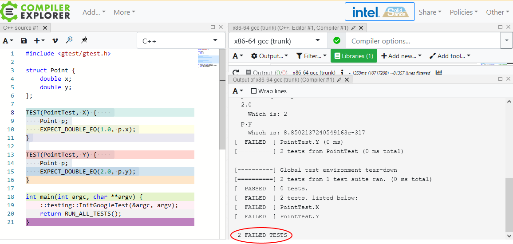
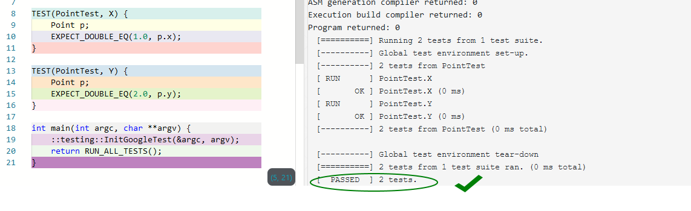
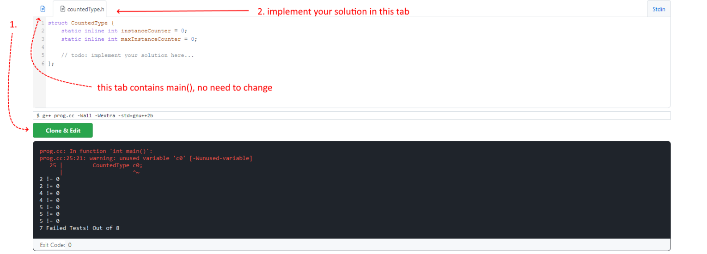
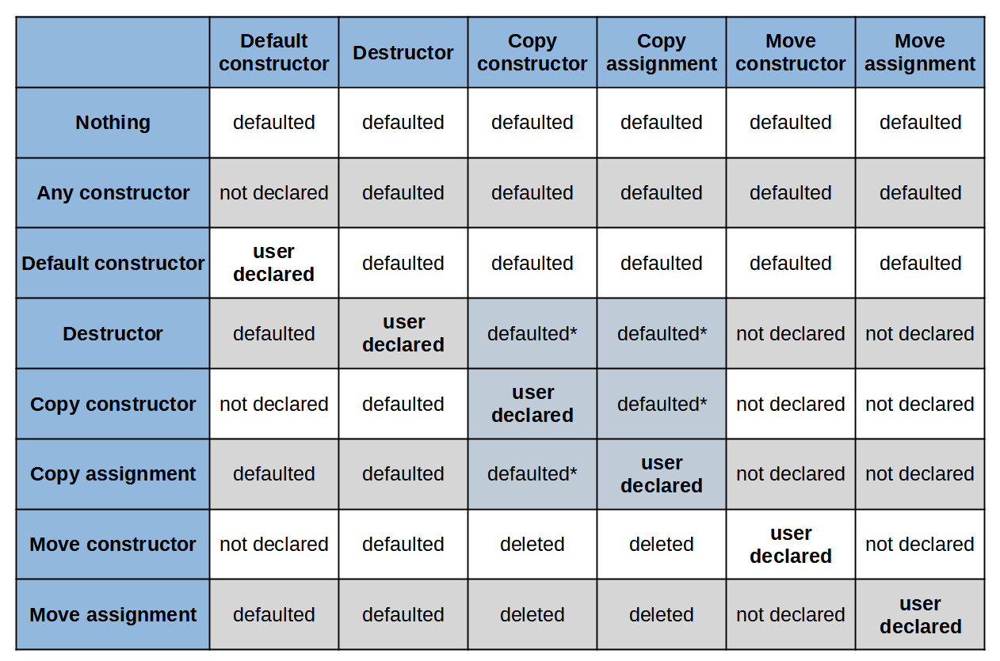

**14. The Final Quiz And Exercises**

Congratulations on completing the whole book! Now you can check your knowledge and try answering a few quiz questions and solving exercises.

**1. Which C++ Standard did add in-class default member initializers?**

1. C++98

2. C++11

3. C++14

4. C++17

**2. Can you use** **auto** **type deduction for non-static data members?**

1. Yes, since C++11

2. No

3. Yes, since C++20

**3. Do you need to define a** **static inline** **data member in a** **cpp** **file?**

1. No, the definition happens at the same place where a static inline member is declared.

2. Yes, the compiler needs the definition in a cpp file.

3. Yes, the compiler needs a definition in all translation units that use this variable.

**4. Can a** **static inline** **variable be non-constant?**

1. Yes, it’s just a regular variable.

2. No, inline variables must be constant.

 

238

The Final Quiz And Exercises 239

 

**5. What’s the output of the following code:**

**struct S** {

**int** a { 10 };

**int** b { 42 };

};

S s { 1 };

std::cout \<\< s.a \<\< ", " \<\< s.b;

1. 1, 0

2. 10, 42

3. 1, 42

**6. Consider the following code:**

**class C** {

C(**int** x) : a(x) { }

**int** a { 10 };

**int** b { 42 };

};

C c(0);

Select the true statement:

1. C::a is initialized twice. The first time, it’s initialized with 10 and then the second time

with 0 in the constructor.

2. C::a is initialized only once with 0 in the constructor

3. The code doesn’t compile because the compiler cannot decide how to initialize the

C::a member.

**7. What happens when you throw an exception from a constructor?**

1. The object is considered “created” so it will follow the regular lifetime of an object.

2. The object is considered “partially created,” and thus, the compiler won’t call its

destructor.

3. The compiler calls std::terminate as you cannot throw exceptions from constructors.

The Final Quiz And Exercises 240

 

**8. What happens when you compile this code?**

**class Point** { **int** x; **int** y; };

Point pt {.y = 10, .x = 11 };

std::cout \<\< pt.x \<\< ", " \<\< pt.y;

Select the true statement:

1. The code doesn’t compile. Designators have to be in the same order as the data

members in the Point class.

2. The code compiles and prints 11, 10.

3. The code compiles and prints 10, 11.

**9. Will this code work in C++11?**

**struct User** { std::string name = "unknown"; **unsigned** age { 0 }; }; User u { "John", 101 };

 

1. Yes, the code compiles in C++11 mode

2. The code compiles starting with C++14 mode

3. The code doesn’t compile even in C++20

**10. Does the following struct have a compiler-generated copy** **constructor?**

**struct Test** {

Test() = **default**;

Test(Test&& t) { /\* some implementation\*/ }

**int** val { 10 };

};

1. Yes, it’s a simple class type so copy constructor will be implicitly defined.

2. No, the class declares a user-defined move constructor, which prevents implicit copy

constructor.

3. No, the class declares a default constructor, which prevents an implicit copy constructor.

The Final Quiz And Exercises 241

 

**11. Assume you have a** **std::map\<string, int\> m;****. Select the single true** **statement about the following loop:**

**for** (**const** pair\<string, **int**\>& elem : m)

 

1. The loop properly iterates over the map, creating no extra copies.

2. The loop will create a copy of each element in the map as the type of elem mismatches.

3. The code won’t compile as const pair cannot bind to a map.

**12. According to C++20, is** **auto x { 42 };** **same as** **auto z = { 42 };****?**

1. Yes, x and z will have the same type -int.

2. Yes, x and z will have the same type -int &&.

3. No, x will be int, but zis initializer_list\<int\>.

**13. Consider the following code and select true statements:**

std::optional\<std::complex\<**double**\>\> opt1{std::complex\<**double**\>{0, 1}}; std::optional\<std::complex\<**double**\>\> opt2{std::in_place_t, 0, 1};

 

1. opt1 is initialized less efficiently, as we have to create a temporary object, opt2 doesn’t

use any temporary objects.

2. opt1 is initialized as efficiently as opt2; no extra copies are created.

3. you cannot use in_place_t in the std::optional creation.

**14. Is Mayer’s singleton safe in C++03? Select the best matching** **statement.**

1. Yes, it uses a static variable in a function scope, so the compiler will make sure it’s

initialized before the first use.

2. Yes, C++03 ensures both thread safety and one-time initialization.

3. No, only C++11 introduced thread safety for static local variables, so this singleton

pattern is only safe from C++11.

The Final Quiz And Exercises 242

 

**15. Does the following statement compile?**

std::vector\<std::unique_ptr\<**int**\>\> ints {

std::make_unique\<**int**\>(1), std::make_unique\<**int**\>(2) };

 

1. No, it doesn’t compile, as we have an initializer_list of non-copyable types

(unique_ptr) and initializer_list requires a copy.

2. Yes, it compiles, as initializer_list handles non-copyable types.

3. Yes, it compiles because compilers can elide those extra copies.

Please write down your answers and check them in Appendix B.

 

**Exercises**

Check your skills with four coding exercises.

 

**Exercise 1: NSDMI**

Below is the Point class declaration with two data members.

**struct Point** {

**double** x;

**double** y;

};

Update this class so that it uses NSDMI and initializes Point::x to 1.0 and Point::y to 2.0.

Here’s the code for test cases:

The Final Quiz And Exercises 243

TEST(PointTest, X) {

Point p;

EXPECT_DOUBLE_EQ(1.0, p.x);

}

TEST(PointTest, Y) {

Point p;

EXPECT_DOUBLE_EQ(2.0, p.y);

}

You can practice with the following Compiler Explorer solution: [Point tests @Compiler](https://godbolt.org/z/Gor1Y8qx7)

[Explorer¹](https://godbolt.org/z/Gor1Y8qx7).

When you run the code, you’ll see that the test fail:

 

Your task is to improve the code so that tests pass:

¹<https://godbolt.org/z/Gor1Y8qx7>

The Final Quiz And Exercises 244

 

**Exercise 2: NSDMI**

Let’s try another use case. Below, there’s a structure called SalesRecord.

\#include \<string\>

**constexpr unsigned int** DEFAULT_CATEGORY = 4; **constexpr unsigned int** DEFAULT_FLAGS = 0x0a;

**struct SalesRecord** {

std::string name\_;

**double** price\_;

**unsigned int** category\_ : 4;

**unsigned** flags\_ : 4;

};

Use NSDMI to initialize the data members to the following values:

• name\_ should be "empty"

• price\_ should be 1.0

• category\_ should be DEFAULT_CATEGORY

• flags\_ should be DEFAULT_FLAGS

Here’s the code for the test to solve:

The Final Quiz And Exercises 245

TEST(SalesRecord, Name) {

SalesRecord s;

EXPECT_EQ("empty", s.name\_);

}

TEST(SalesRecord, Price) {

SalesRecord s;

EXPECT_DOUBLE_EQ(1.0, s.price\_); }

TEST(SalesRecord, Category) {

SalesRecord s;

EXPECT_EQ(DEFAULT_CATEGORY, s.category\_);

}

TEST(SalesRecord, Flags) {

SalesRecord s;

EXPECT_EQ(DEFAULT_FLAGS, s.flags\_);

}

You can practice with the following Compiler Explorer solution: [Point tests @Compiler](https://godbolt.org/z/Y19jMs4Gb)

[Explorer²](https://godbolt.org/z/Y19jMs4Gb).

**Exercise 3: inline variables**

We can combine our knowledge about constructors and inline variables and continue with

the CountedType introduced in the [Non-local types]() chapter. Please implement the support for other constructors so that the following test passes.

**struct CountedType** {

**static inline int** instanceCounter = 0;

**static inline int** maxInstanceCounter = 0;

// your code here...

};

And here are the test:

²<https://godbolt.org/z/Y19jMs4Gb> The Final Quiz And Exercises 246

**int** main() {

{

CountedType c0;

CountedType c1;

Tests::Expect(2, CountedType::instanceCounter); Tests::Expect(2, CountedType::maxInstanceCounter);

CountedType c2(c1);

CountedType c3(c1);

Tests::Expect(4, CountedType::instanceCounter); Tests::Expect(4, CountedType::maxInstanceCounter);

CountedType c4(std::move(c1)); Tests::Expect(5, CountedType::instanceCounter); Tests::Expect(5, CountedType::maxInstanceCounter);

}

Tests::Expect(0, CountedType::instanceCounter);

Tests::Expect(5, CountedType::maxInstanceCounter); }

As you can see, the example creates several CountedType instances and then checks (via Test::Expect ) if the counters are correct.

Start from the following runnable code sample [@Wandbox³](https://wandbox.org/permlink/GuGzTWKF8irN2YLz), Click “Clone & Edit” to start the example, and make changes.

 

**The starting point for the exercise, Click “Clone & Edit” to start the example**

³<https://wandbox.org/permlink/GuGzTWKF8irN2YLz> The Final Quiz And Exercises 247

 

**Exercise 4: Fix the code**

Look at the code below and fix issues in SalesRec, addPromo and computeTotal that make tests fail.

**struct SalesRec** { std::string name\_; **double** price\_; };

**void** addPromo(std::vector\<SalesRec\>& sales, **double** discount) {

**for** (**auto** elem : sales)

elem.price\_ = (1.0-discount)\*elem.price\_;

}

**double** computeTotal(**const** std::vector\<SalesRec\>& sales) {

**double** sum;

**for** (**auto** elem : sales)

sum += elem.price\_;

**return** sum;

}

TEST(computeTotal, empty) { ... } // fails... TEST(computeTotal, several) { ... } // fails... TEST(addPromo, simple) { ... } // fails... TEST(addPromo, two) { ... } // fails...

Here’s the starting code example [@Compiler Explorer⁴](https://godbolt.org/z/54dh8eh3h).

 

⁴<https://godbolt.org/z/54dh8eh3h>

**Appendix A - Rules for Special**

 

**Member Function Generation**

In the chapters about constructors and the destructor, we discussed when a compiler implicitly generates a given special member for a class type. In this appendix, you’ll see a handy summary of the rules and guidelines for most common use cases.

 

**The diagram**

A C++ expert Howard Hinnant, a few years ago created a diagram⁵ with the rules:

 

⁵diagram redrawn, with permission of Howard Hinnant.

248