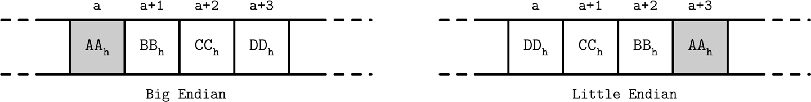
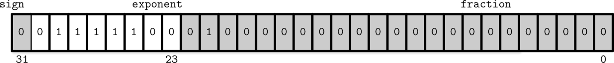
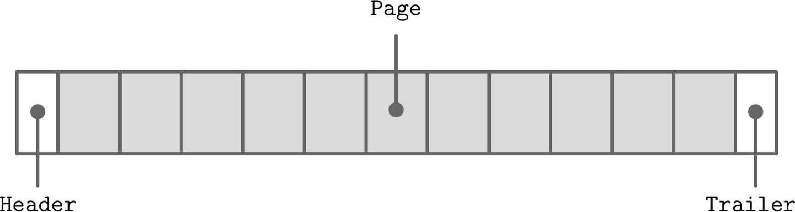
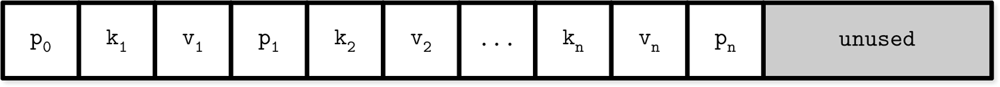
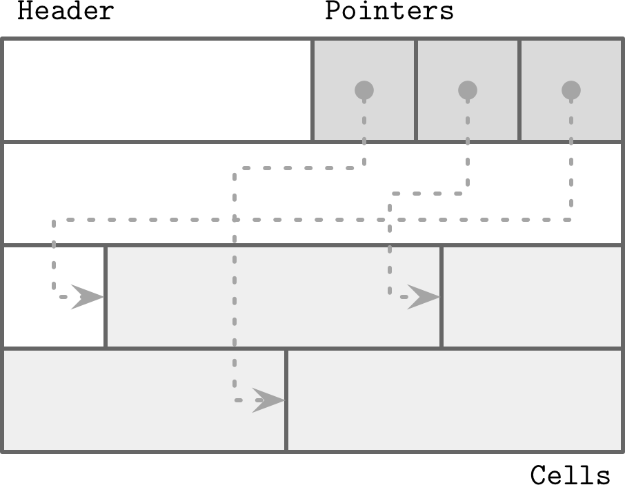
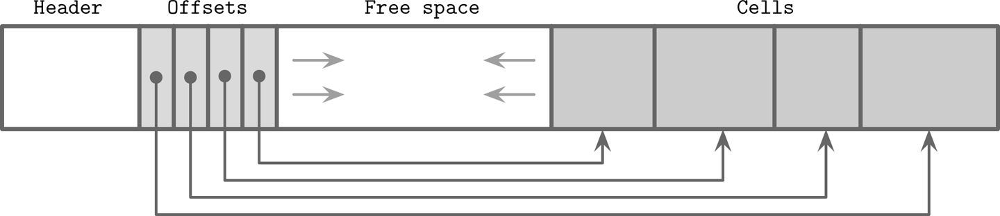
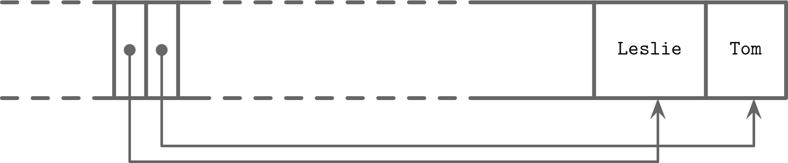
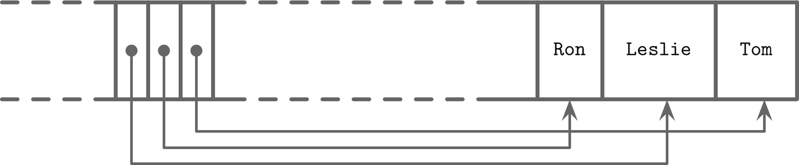
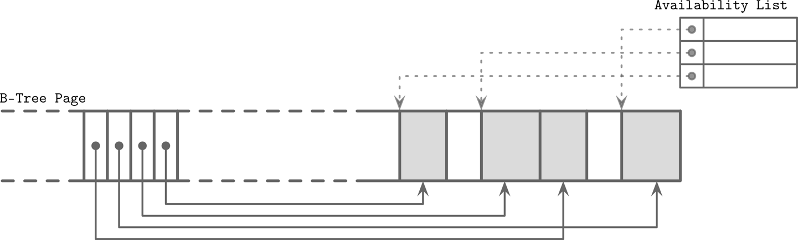

# Chapter 3. File Formats

With the basic semantics of B-Trees covered, we are now ready to explore how exactly B-Trees and other structures are implemented on disk. We access the disk in a way that is different from how we access main memory: from an application developer’s perspective, memory accesses are mostly transparent. Because of virtual memory [\[BHATTACHARJEE17\]](app01.html#BHATTACHARJEE17), we do not have to manage offsets manually. Disks are accessed using system calls (see [*https://databass.dev/links/54*](https://databass.dev/links/54)). We usually have to specify the offset inside the target file, and then interpret on-disk representation into a form suitable for main memory.

This means that efficient on-disk structures have to be designed with this distinction in mind. To do that, we have to come up with a file format that’s easy to construct, modify, and interpret. In this chapter, we’ll discuss general principles and practices that help us to design all sorts of on-disk structures, not only B-Trees.

There are numerous possibilities for B-Tree implementations, and here we discuss several useful techniques. Details may vary between implementations, but the general principles remain the same. Understanding the basic mechanics of B-Trees, such as splits and merges, is necessary, but they are insufficient for the actual implementation. There are many things that have to play together for the final result to be useful.

The semantics of pointer management in on-disk structures are somewhat different from in-memory ones. It is useful to think of on-disk B-Trees as a page management mechanism: algorithms have to compose and navigate *pages*. Pages and pointers to them have to be calculated and placed accordingly.

Since most of the complexity in B-Trees comes from mutability, we discuss details of page layouts, splitting, relocations, and other concepts applicable to mutable data structures. Later, when talking about LSM Trees (see “LSM Trees”), we focus on sorting and maintenance, since that’s where most LSM complexity comes from.

# Motivation

Creating a file format is in many ways similar to how we create data structures in languages with an unmanaged memory model. We allocate a block of data and slice it any way we like, using fixed-size primitives and structures. If we want to reference a larger chunk of memory or a structure with variable size, we use pointers.

Languages with an unmanaged memory model allow us to allocate more memory any time we need (within reasonable bounds) without us having to think or worry about whether or not there’s a contiguous memory segment available, whether or not it is fragmented, or what happens after we free it. On disk, we have to take care of garbage collection and fragmentation ourselves.

Data layout is much less important in memory than on disk. For a disk-resident data structure to be efficient, we need to lay out data on disk in ways that allow quick access to it, and consider the specifics of a persistent storage medium, come up with binary data formats, and find a means to serialize and deserialize data efficiently.

Anyone who has ever used a low-level language such as C without additional libraries knows the constraints. Structures have a predefined size and are allocated and freed explicitly. Manually implementing memory allocation and tracking is even more challenging, since it is only possible to operate with memory segments of predefined size, and it is necessary to track which segments are already released and which ones are still in use.

When storing data in main memory, most of the problems with memory layout do not exist, are easier to solve, or can be solved using third-party libraries. For example, handling variable-length fields and oversize data is much more straightforward, since we can use memory allocation and pointers, and do not need to lay them out in any special way. There still are cases when developers design specialized main memory data layouts to take advantage of CPU cache lines, prefetching, and other hardware-related specifics, but this is mainly done for optimization purposes [\[FOWLER11\]](app01.html#FOWLER11).

Even though the operating system and filesystem take over some of the responsibilities, implementing on-disk structures requires attention to more details and has more pitfalls.

# Binary Encoding

To store data on disk efficiently, it needs to be encoded using a format that is compact and easy to serialize and deserialize. When talking about binary formats, you hear the word *layout* quite often. Since we do not have primitives such as `malloc` and `free`, but only `read` and `write`, we have to think of accesses differently and prepare data accordingly.

Here, we discuss the main principles used to create efficient page layouts. These principles apply to any binary format: you can use similar guidelines to create file and serialization formats or communication protocols.

Before we can organize records into pages, we need to understand how to represent keys and data records in binary form, how to combine multiple values into more complex structures, and how to implement variable-size types and arrays.

## Primitive Types

Keys and values have a *type*, such as `integer`, `date`, or `string`, and can be represented (serialized to and deserialized from) in their raw binary forms.

Most numeric data types are represented as fixed-size values. When working with multibyte numeric values, it is important to use the same *byte-order* (*endianness*) for both encoding and decoding. Endianness determines the sequential order of bytes:

Big-endian  
The order starts from the most-significant byte (MSB), followed by the bytes in *decreasing* significance order. In other words, MSB has the *lowest* address.

Little-endian  
The order starts from the least-significant byte (LSB), followed by the bytes in *increasing* significance order.

Figure 3-1 illustrates this. The hexadecimal 32-bit integer `0xAABBCCDD`, where `AA` is the MSB, is shown using both big- and little-endian byte order.



###### Figure 3-1. Big- and little-endian byte order. The most significant byte is shown in gray. Addresses, denoted by `a`, grow from left to right.

For example, to reconstruct a 64-bit integer with a corresponding byte order, RocksDB has platform-specific definitions that help to identify target [platform byte order](https://databass.dev/links/55).^(1) If the target platform endianness does not match value endianness ([`EncodeFixed64WithEndian`](https://databass.dev/links/56) looks up `kLittleEndian` value and compares it with value endianness), it reverses the bytes using [`EndianTransform`](https://databass.dev/links/57), which reads values byte-wise in reverse order and appends them to the result.

Records consist of primitives like numbers, strings, booleans, and their combinations. However, when transferring data over the network or storing it on disk, we can only use byte sequences. This means that, in order to send or write the record, we have to *serialize* it (convert it to an interpretable sequence of bytes) and, before we can use it after receiving or reading, we have to *deserialize* it (translate the sequence of bytes back to the original record).

In binary data formats, we always start with primitives that serve as building blocks for more complex structures. Different numeric types may vary in size. `byte` value is 8 bits, `short` is 2 bytes (16 bits), `int` is 4 bytes (32 bits), and `long` is 8 bytes (64 bits).

Floating-point numbers (such as `float` and `double`) are represented by their *sign*, *fraction*, and *exponent*. The [IEEE Standard for Binary Floating-Point Arithmetic](https://ieeexplore.ieee.org/document/30711) (IEEE 754) standard describes widely accepted floating-point number representation. A 32-bit `float` represents a single-precision value. For example, a floating-point number `0.15652` has a binary representation, as shown in Figure 3-2. The first 23 bits represent a fraction, the following 8 bits represent an exponent, and 1 bit represents a sign (whether or not the number is negative).



###### Figure 3-2. Binary representation of single-precision float number

Since a floating-point value is calculated using fractions, the number this representation yields is just an approximation. Discussing a complete conversion algorithm is out of the scope of this book, and we only cover representation basics.

The `double` represents a double-precision floating-point value [\[SAVARD05\]](app01.html#SAVARD05). Most programming languages have means for encoding and decoding floating-point values to and from their binary representation in their standard libaries.

## Strings and Variable-Size Data

All primitive numeric types have a fixed size. Composing more complex values together is much like `struct`^(2) in C. You can combine primitive values into structures and use fixed-size arrays or pointers to other memory regions.

Strings and other variable-size data types (such as arrays of fixed-size data) can be serialized as a number, representing the length of the array or string, followed by `size` bytes: the actual data. For strings, this representation is often called *UCSD String* or [*Pascal String*](https://databass.dev/links/59), named after the popular implementation of the Pascal programming language. We can express it in pseudocode as follows:

```
String
{
    size    uint_16
    data    byte[size]
}
```

An alternative to Pascal strings is *null-terminated strings*, where the reader consumes the string byte-wise until the end-of-string symbol is reached. The Pascal string approach has several advantages: it allows finding out a length of a string in constant time, instead of iterating through string contents, and a language-specific string can be composed by slicing `size` bytes from memory and passing the byte array to a string constructor.

## Bit-Packed Data: Booleans, Enums, and Flags

Booleans can be represented either by using a single byte, or encoding `true` and `false` as `1` and `0` values. Since a boolean has only two values, using an entire byte for its representation is wasteful, and developers often batch boolean values together in groups of eight, each boolean occupying just one bit. We say that every `1` bit is *set* and every `0` bit is *unset* or *empty*.

[Enums](https://databass.dev/links/60), short for *enumerated types*, can be represented as integers and are often used in binary formats and communication protocols. Enums are used to represent often-repeated low-cardinality values. For example, we can encode a B-Tree node type using an enum:

```
enum NodeType {
   ROOT,     // 0x00h
   INTERNAL, // 0x01h
   LEAF      // 0x02h
};
```

Another closely related concept is *flags*, kind of a combination of packed booleans and enums. Flags can represent nonmutually exclusive named boolean parameters. For example, we can use flags to denote whether or not the page holds value cells, whether the values are fixed-size or variable-size, and whether or not there are overflow pages associated with this node. Since every bit represents a flag value, we can only use power-of-two values for masks (since powers of two in binary always have a single set bit; for example, `2`^(`3`)` == 8 == 1000b`, `2`^(`4`)` == 16 == 0001 0000b`, etc.):

```
int IS_LEAF_MASK         = 0x01h; // bit #1
int VARIABLE_SIZE_VALUES = 0x02h; // bit #2
int HAS_OVERFLOW_PAGES   = 0x04h; // bit #3
```

Just like packed booleans, flag values can be read and written from the packed value using *bitmasks* and bitwise operators. For example, in order to set a bit responsible for one of the flags, we can use bitwise `OR` (`|`) and a bitmask. Instead of a bitmask, we can use *bitshift* (`<<`) and a bit index. To unset the bit, we can use bitwise `AND` (`&`) and the bitwise negation operator (`~`). To test whether or not the bit `n` is set, we can compare the result of a bitwise `AND` with `0`:

```
// Set the bit
flags |= HAS_OVERFLOW_PAGES;
flags |= (1 << 2);

// Unset the bit
flags &= ~HAS_OVERFLOW_PAGES;
flags &= ~(1 << 2);

// Test whether or not the bit is set
is_set = (flags & HAS_OVERFLOW_PAGES) != 0;
is_set = (flags & (1 << 2)) != 0;
```

# General Principles

Usually, you start designing a file format by deciding how the addressing is going to be done: whether the file is going to be split into same-sized pages, which are represented by a single block or multiple contiguous blocks. Most in-place update storage structures use pages of the same size, since it significantly simplifies read and write access. Append-only storage structures often write data page-wise, too: records are appended one after the other and, as soon as the page fills up in memory, it is flushed on disk.

The file usually starts with a fixed-size *header* and may end with a fixed-size *trailer*, which hold auxiliary information that should be accessed quickly or is required for decoding the rest of the file. The rest of the file is split into pages. Figure 3-3 shows this file organization schematically.



###### Figure 3-3. File organization

Many data stores have a fixed schema, specifying the number, order, and type of fields the table can hold. Having a fixed schema helps to reduce the amount of data stored on disk: instead of repeatedly writing field names, we can use their positional identifiers.

If we wanted to design a format for the company directory, storing names, birth dates, tax numbers, and genders for each employee, we could use several approaches. We could store the fixed-size fields (such as birth date and tax number) in the head of the structure, followed by the variable-size ones:

```
Fixed-size fields:
| (4 bytes) employee_id                |
| (4 bytes) tax_number                 |
| (3 bytes) date                       |
| (1 byte)  gender                     |
| (2 bytes) first_name_length          |
| (2 bytes) last_name_length           |

Variable-size fields:
| (first_name_length bytes) first_name |
| (last_name_length bytes) last_name   |
```

Now, to access `first_name`, we can slice `first_name_length` bytes after the fixed-size area. To access `last_name`, we can locate its starting position by checking the sizes of the variable-size fields that precede it. To avoid calculations involving multiple fields, we can encode both *offset* and *length* to the fixed-size area. In this case, we can locate any variable-size field separately.

Building more complex structures usually involves building hierarchies: fields composed out of primitives, cells composed of fields, pages composed of cells, sections composed of pages, regions composed of sections, and so on. There are no strict rules you have to follow here, and it all depends on what kind of data you need to create a format for.

Database files often consist of multiple parts, with a lookup table aiding navigation and pointing to the start offsets of these parts written either in the file header, trailer, or in the separate file.

# Page Structure

Database systems store data records in data and index files. These files are partitioned into fixed-size units called *pages*, which often have a size of multiple filesystem blocks. Page sizes usually range from 4 to 16 Kb.

Let’s take a look at the example of an on-disk B-Tree node. From a structure perspective, in B-Trees, we distinguish between the *leaf nodes* that hold keys and data records pairs, and *nonleaf nodes* that hold keys and pointers to other nodes. Each B-Tree node occupies one page or multiple pages linked together, so in the context of B-Trees the terms *node* and *page* (and even *block*) are often used interchangeably.

The original B-Tree paper [\[BAYER72\]](app01.html#BAYER72) describes a simple page organization for fixed-size data records, where each page is just a concatenation of triplets, as shown in Figure 3-4: keys are denoted by `k`, associated values are denoted by `v`, and pointers to child pages are denoted by `p`.



###### Figure 3-4. Page organization for fixed-size records

This approach is easy to follow, but has some downsides:

- Appending a key anywhere but the right side requires relocating elements.

- It doesn’t allow managing or accessing variable-size records efficiently and works only for fixed-size data.

# Slotted Pages

When storing variable-size records, the main problem is free space management: reclaiming the space occupied by removed records. If we attempt to put a record of size `n` into the space previously occupied by the record of size `m`, unless `m == n` or we can find another record that has a size exactly `m – n`, this space will remain unused. Similarly, a segment of size `m` cannot be used to store a record of size `k` if `k` is larger than `m`, so it will be inserted without reclaiming the unused space.

To simplify space management for variable-size records, we can split the page into fixed-size segments. However, we end up wasting space if we do that, too. For example, if we use a segment size of 64 bytes, unless the record size is a multiple of 64, we waste `64 - (n modulo 64)` bytes, where `n` is the size of the inserted record. In other words, unless the record is a multiple of 64, one of the blocks will be only partially filled.

Space reclamation can be done by simply rewriting the page and moving the records around, but we need to preserve record offsets, since out-of-page pointers might be using these offsets. It is desirable to do that while minimizing space waste, too.

To summarize, we need a page format that allows us to:

- Store variable-size records with a minimal overhead.

- Reclaim space occupied by the removed records.

- Reference records in the page without regard to their exact locations.

To efficiently store variable-size records such as strings, binary large objects (BLOBs), etc., we can use an organization technique called *slotted page* (i.e., a page with slots) [\[SILBERSCHATZ10\]](app01.html#SILBERSCHATZ10) or *slot directory* [\[RAMAKRISHNAN03\]](app01.html#RAMAKRISHNAN03). This approach is used by many databases, for example, [PostgreSQL](https://databass.dev/links/61).

We organize the page into a collection of *slots* or *cells* and split out pointers and cells in two independent memory regions residing on different sides of the page. This means that we only need to reorganize pointers addressing the cells to preserve the order, and deleting a record can be done either by nullifying its pointer or removing it.

A slotted page has a fixed-size header that holds important information about the page and cells (see “Page Header”). Cells may differ in size and can hold arbitrary data: keys, pointers, data records, etc. Figure 3-5 shows a slotted page organization, where every page has a maintenance region (header), cells, and pointers to them.



###### Figure 3-5. Slotted page

Let’s see how this approach fixes the problems we stated in the beginning of this section:

- Minimal overhead: the only overhead incurred by slotted pages is a pointer array holding offsets to the exact positions where the records are stored.

- Space reclamation: space can be reclaimed by defragmenting and rewriting the page.

- Dynamic layout: from outside the page, slots are referenced only by their IDs, so the exact location is internal to the page.

# Cell Layout

Using flags, enums, and primitive values, we can start designing the cell layout, then combine cells into pages, and compose a tree out of the pages. On a cell level, we have a distinction between key and key-value cells. Key cells hold a separator key and a pointer to the page *between* two neighboring pointers. Key-value cells hold keys and data records associated with them.

We assume that all cells within the page are uniform (for example, all cells can hold either just keys or both keys and values; similarly, all cells hold either fixed-size or variable-size data, but not a mix of both). This means we can store metadata describing cells once on the page level, instead of duplicating it in every cell.

To compose a key cell, we need to know:

- Cell type (can be inferred from the page metadata)

- Key size

- ID of the child page this cell is pointing to

- Key bytes

A variable-size key cell layout might look something like this (a fixed-size one would have no size specifier on the cell level):

```
0                4               8
+----------------+---------------+-------------+
| [int] key_size | [int] page_id | [bytes] key |
+----------------+---------------+-------------+
```

We have grouped fixed-size data fields together, followed by `key_size` bytes. This is not strictly necessary but can simplify offset calculation, since all fixed-size fields can be accessed by using static, precomputed offsets, and we need to calculate the offsets only for the variable-size data.

The key-value cells hold data records instead of the child page IDs. Otherwise, their structure is similar:

- Cell type (can be inferred from page metadata)

- Key size

- Value size

- Key bytes

- Data record bytes

```
0              1                5 ...
+--------------+----------------+
| [byte] flags | [int] key_size |
+--------------+----------------+

5                  9                    .. + key_size
+------------------+--------------------+----------------------+
| [int] value_size |     [bytes] key    | [bytes] data_record  |
+------------------+--------------------+----------------------+
```

You might have noticed the distinction between the *offset* and *page ID* here. Since pages have a fixed size and are managed by the page cache (see “Buffer Management”), we only need to store the page ID, which is later translated to the actual offset in the file using the lookup table. *Cell offsets* are page-local and are relative to the page start offset: this way we can use a smaller cardinality integer to keep the representation more compact.

##### Variable-Size Data

It is not necessary for the key and value in the cell to have a fixed size. Both the key and value can have a variable size. Their locations can be calculated from the fixed-size cell header using offsets.

To locate the key, we skip the header and read `key_size` bytes. Similarly, to locate the value, we can skip the header plus `key_size` more bytes and read `value_size` bytes.

There are different ways to do the same; for example, by storing a total size and calculating the value size by subtraction. It all boils down to having enough information to slice the cell into subparts and reconstruct the encoded data.

# Combining Cells into Slotted Pages

To organize cells into pages, we can use the *slotted page* technique that we discussed in “Page Structure”. We append cells to the right side of the page (toward its end) and keep cell offsets/pointers in the left side of the page, as shown in Figure 3-6.



###### Figure 3-6. Offset and cell growth direction

Keys can be inserted out of order and their logical sorted order is kept by sorting cell offset pointers in key order. This design allows appending cells to the page with minimal effort, since cells don’t have to be relocated during insert, update, or delete operations.

Let’s consider an example of a page that holds names. Two names are added to the page, and their insertion order is: *Tom* and *Leslie*. As you can see in Figure 3-7, their *logical* order (in this case, alphabetical), does *not* match *insertion* order (order in which they were appended to the page). Cells are laid out in insertion order, but offsets are re-sorted to allow using binary search.



###### Figure 3-7. Records appended in random order: Tom, Leslie

Now, we’d like to add one more name to this page: *Ron*. New data is appended at the upper boundary of the free space of the page, but cell offsets have to preserve the lexicographical key order: *Leslie*, *Ron*, *Tom*. To do that, we have to reorder cell offsets: pointers after the *insertion point* are shifted to the right to make space for the new pointer to the Ron cell, as you can see in Figure 3-8.



###### Figure 3-8. Appending one more record: Ron

# Managing Variable-Size Data

Removing an item from the page does not have to remove the actual cell and shift other cells to reoccupy the freed space. Instead, the cell can be marked as deleted and an in-memory *availability list* can be updated with the amount of freed memory and a pointer to the freed value. The availability list stores offsets of freed segments and their sizes. When inserting a new cell, we first check the availability list to find if there’s a segment where it may fit. You can see an example of the fragmented page with available segments in Figure 3-9.



###### Figure 3-9. Fragmented page and availability list. Occupied pages are shown in gray. Dotted lines represent pointers to unoccupied memory regions from the availability list.

SQLite calls unoccupied segments *freeblocks* and stores a pointer to the first [freeblock in the page header](https://databass.dev/links/62). Additionally, it stores a total number of available bytes within the page to quickly check whether or not we can fit a new element into the page after defragmenting it.

Fit is calculated based on the *strategy*:

First fit  
This might cause a larger overhead, since the space remaining after reusing the first suitable segment might be too small to fit any other cell, so it will be effectively wasted.

Best fit  
For best fit, we try to find a segment for which insertion leaves the smallest remainder.

If we cannot find enough consecutive bytes to fit the new cell but there are enough fragmented bytes available, live cells are read and rewritten, defragmenting the page and reclaiming space for new writes. If there’s not enough free space even after defragmentation, we have to create an overflow page (see “Overflow Pages”).

###### Note

To improve locality (especially when keys are small in size), some implementations store keys and values separately on the leaf level. Keeping keys together can improve the locality during the search. After the searched key is located, its value can be found in a value cell with a corresponding index. With variable-size keys, this requires us to calculate and store an additional value cell pointer.

In summary, to simplify B-Tree layout, we assume that each node occupies a single page. A page consists of a fixed-size header, cell pointer block, and cells. Cells hold keys and pointers to the pages representing child nodes or associated data records. B-Trees use simple pointer hierarchies: page identifiers to locate the child nodes in the tree file, and cell offsets to locate cells within the page.

# Versioning

Database systems constantly evolve, and developers work to add features, and to fix bugs and performance issues. As a result of that, the binary file format can change. Most of the time, any storage engine version has to support more than one serialization format (e.g., current and one or more legacy formats for backward compatibility). To support that, we have to be able to find out which version of the file we’re up against.

This can be done in several ways. For example, Apache Cassandra is using version prefixes in filenames. This way, you can tell which version the file has without even opening it. As of version 4.0, a data file name has the `na` prefix, such as *na-1-big-Data.db*. Older files have different prefixes: files written in version 3.0 have the `ma` prefix.

Alternatively, the version can be stored in a separate file. For example, [PostgreSQL](https://databass.dev/links/63) stores the version in the *PG_VERSION* file.

The version can also be stored directly in the index file header. In this case, a part of the header (or an entire header) has to be encoded in a format that does not change between versions. After finding out which version the file is encoded with, we can create a version-specific reader to interpret the contents. Some file formats identify the version using magic numbers, which we discuss in more detail in “Magic Numbers”.

# Checksumming

Files on disk may get damaged or corrupted by software bugs and hardware failures. To identify these problems preemptively and avoid propagating corrupt data to other subsystems or even nodes, we can use checksums and cyclic redundancy checks (CRCs).

Some sources make no distinction between cryptographic and noncryptographic hash functions, CRCs, and checksums. What they all have in common is that they reduce a large chunk of data to a small number, but their use cases, purposes, and guarantees are different.

Checksums provide the weakest form of guarantee and aren’t able to detect corruption in multiple bits. They’re usually computed by using `XOR` with parity checks or summation [\[KOOPMAN15\]](app01.html#KOOPMAN15).

CRCs can help detect burst errors (e.g., when multiple consecutive bits got corrupted) and their implementations usually use lookup tables and polynomial division [\[STONE98\]](app01.html#STONE98). Multibit errors are crucial to detect, since a significant percentage of failures in communication networks and storage devices manifest this way.

###### Warning

Noncryptographic hashes and CRCs should not be used to verify whether or not the data has been tampered with. For this, you should always use strong cryptographic hashes designed for security. The main goal of CRC is to make sure that there were no unintended and accidental changes in data. These algorithms are not designed to resist attacks and intentional changes in data.

Before writing the data on disk, we compute its checksum and write it together with the data. When reading it back, we compute the checksum again and compare it with the written one. If there’s a checksum mismatch, we know that corruption has occurred and we should not use the data that was read.

Since computing a checksum over the whole file is often impractical and it is unlikely we’re going to read the entire content every time we access it, page checksums are usually computed on pages and placed in the page header. This way, checksums can be more robust (since they are performed on a small subset of the data), and the whole file doesn’t have to be discarded if corruption is contained in a single page.

# Summary

In this chapter, we learned about binary data organization: how to serialize primitive data types, combine them into cells, build slotted pages out of cells, and navigate these structures.

We learned how to handle variable-size data types such as strings, byte sequences, and arrays, and compose special cells that hold a size of values contained in them.

We discussed the slotted page format, which allows us to reference individual cells from outside the page by cell ID, store records in the insertion order, and preserve the key order by sorting cell offsets.

These principles can be used to compose binary formats for on-disk structures and network protocols.

##### Further Reading

If you’d like to learn more about the concepts mentioned in this chapter, you can refer to the following sources:

File organization techniques  
Folk, Michael J., Greg Riccardi, and Bill Zoellick. 1997. *File Structures: An Object-Oriented Approach with C++ (3rd Ed.)*. Boston: Addison-Wesley Longman.

Giampaolo, Dominic. 1998. *Practical File System Design with the Be File System (1st Ed.)*. San Francisco: Morgan Kaufmann.

Vitter, Jeffrey Scott. 2008. “Algorithms and data structures for external memory.” *Foundations and Trends in Theoretical Computer Science* 2, no. 4 (January): 305-474. [*https://doi.org/10.1561/0400000014*](https://doi.org/10.1561/0400000014).

^(1) Depending on the platform (macOS, Solaris, Aix, or one of the BSD flavors, or Windows), the `kLittleEndian` variable is set to whether or not the platform supports little-endian.

^(2) It’s worth noting that compilers can add padding to structures, which is also architecture dependent. This may break the assumptions about the exact byte offsets and locations. You can read more about structure packing here: [*https://databass.dev/links/58*](https://databass.dev/links/58).