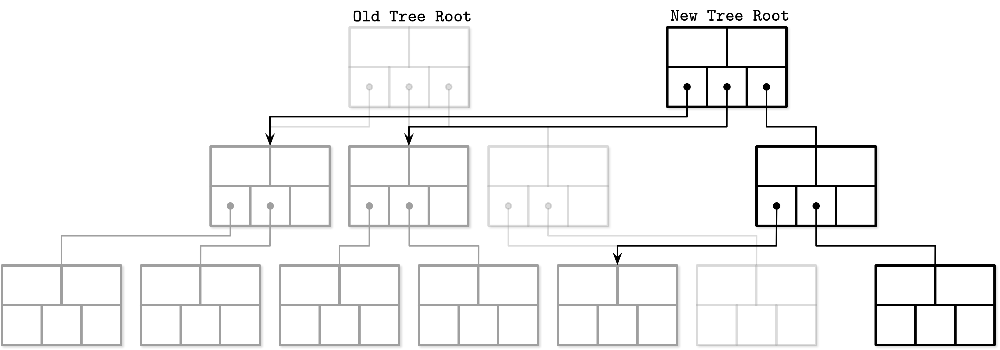
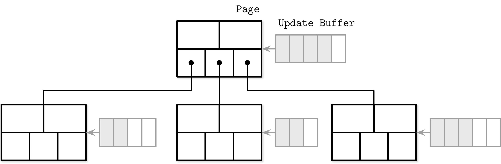
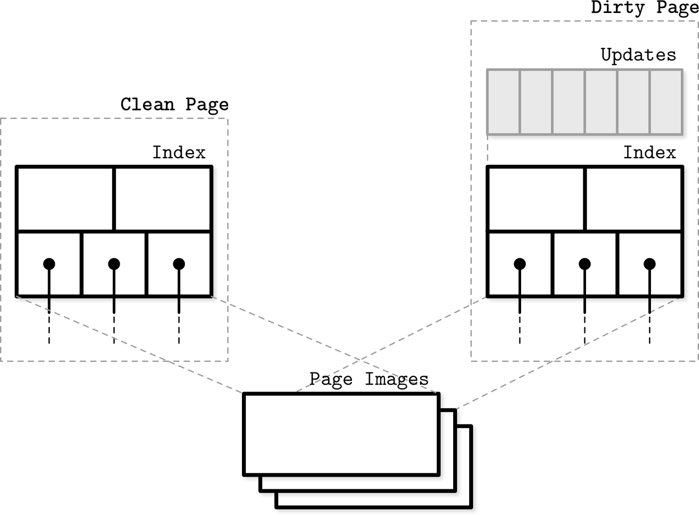
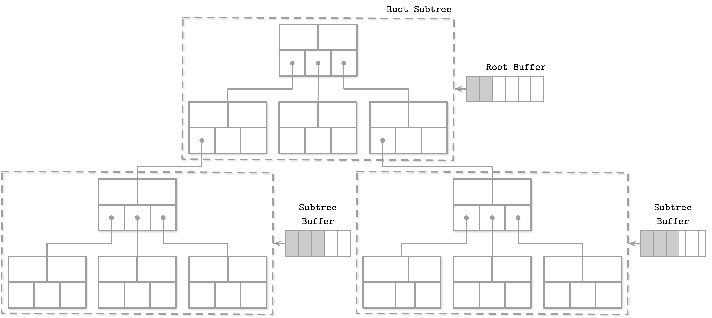
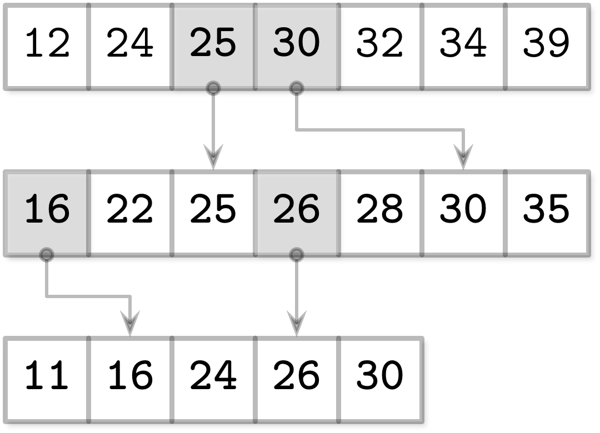
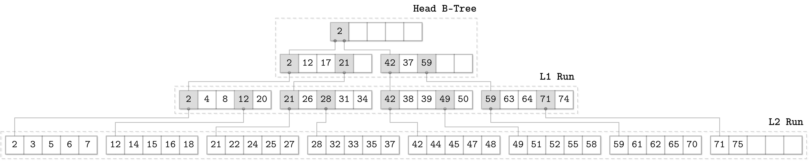
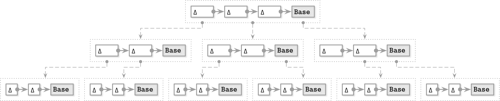
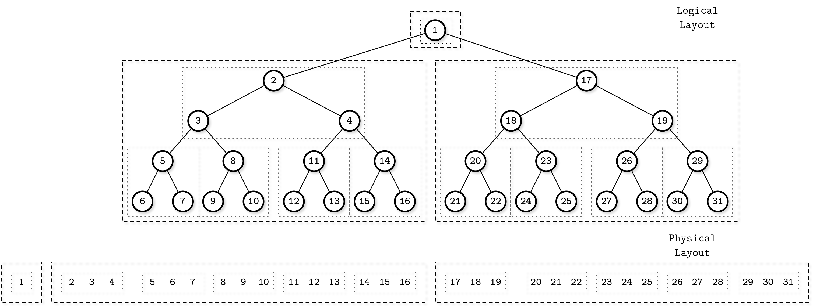
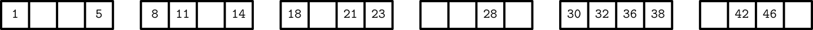

# Chapter 6. B-Tree Variants

B-Tree variants have a few things in common: tree structure, balancing through splits and merges, and lookup and delete algorithms. Other details, related to concurrency, on-disk page representation, links between sibling nodes, and maintenance processes, may vary between implementations.

In this chapter, we’ll discuss several techniques that can be used to implement efficient B-Trees and structures that employ them:

- *Copy-on-write B-Trees* are structured like B-Trees, but their nodes are immutable and are not updated in place. Instead, pages are copied, updated, and written to new locations.

- *Lazy B-Trees* reduce the number of I/O requests from subsequent same-node writes by *buffering* updates to nodes. In the next chapter, we also cover two-component LSM trees (see “Two-component LSM Tree”), which take buffering a step further to implement fully immutable B-Trees.

- *FD-Trees* take a different approach to buffering, somewhat similar to LSM Trees (see “LSM Trees”). FD-Trees buffer updates in a small B-Tree. As soon as this tree fills up, its contents are written into an immutable run. Updates propagate between *levels* of immutable runs in a cascading manner, from higher levels to lower ones.

- *Bw-Trees* separate B-Tree nodes into several smaller parts that are written in an append-only manner. This reduces costs of small writes by batching updates to the different nodes together.

- *Cache-oblivious B-Trees* allow treating on-disk data structures in a way that is very similar to how we build in-memory ones.

# Copy-on-Write

Some databases, rather than building complex latching mechanisms, use the *copy-on-write* technique to guarantee data integrity in the presence of concurrent operations. In this case, whenever the page is about to be modified, its contents are copied, the copied page is modified instead of the original one, and a parallel tree hierarchy is created.

Old tree versions remain accessible for readers that run concurrently to the writer, while writers accessing modified pages have to wait until preceding write operations are complete. After the new page hierarchy is created, the pointer to the topmost page is atomically updated. In Figure 6-1, you can see a new tree being created parallel to the old one, reusing the untouched pages.



###### Figure 6-1. Copy-on-write B-Trees

An obvious downside of this approach is that it requires more space (even though old versions are retained only for brief time periods, since pages can be reclaimed immediately after concurrent operations using the old pages complete) and processor time, as entire page contents have to be copied. Since B-Trees are generally shallow, the simplicity and advantages of this approach often still outweigh the downsides.

The biggest advantage of this approach is that readers require no synchronization, because written pages are immutable and can be accessed without additional latching. Since writes are performed against copied pages, readers do not block writers. No operation can observe a page in an incomplete state, and a system crash cannot leave pages in a corrupted state, since the topmost pointer is switched only when all page modifications are done.

## Implementing Copy-on-Write: LMDB

One of the storage engines using copy-on-write is the Lightning Memory-Mapped Database ([LMDB](https://databass.dev/links/85)), which is a key-value store used by the OpenLDAP project. Due to its design and architecture, LMDB doesn’t require a page cache, a write-ahead log, checkpointing, or compaction.^(1)

LMDB is implemented as a single-level data store, which means that read and write operations are satisfied directly through the memory map, without additional application-level caching in between. This also means that pages require no additional materialization and reads can be served directly from the memory map without copying data to the intermediate buffer. During the update, every branch node on the path from the root to the target leaf is copied and potentially modified: nodes for which updates propagate are changed, and the rest of the nodes remain intact.

LMDB holds only [two versions](https://databass.dev/links/88) of the root node: the latest version, and the one where new changes are going to be committed. This is sufficient since all writes have to go through the root node. After the new root is created, the old one becomes unavailable for new reads and writes. As soon as the reads referencing old tree sections complete, their pages are reclaimed and can be reused. Because of LMDB’s append-only design, it does not use sibling pointers and has to ascend back to the parent node during sequential scans.

With this design, leaving stale data in copied nodes is impractical: there is already a copy that can be used for MVCC and satisfy ongoing read transactions. The database structure is inherently multiversioned, and readers can run without any locks as they do not interfere with writers in any way.

# Abstracting Node Updates

To update the page on disk, one way or the other, we have to first update its in-memory representation. However, there are a few ways to represent a node in memory: we can access the cached version of the node directly, do it through the wrapper object, or create its in-memory representation native to the implementation language.

In languages with an unmanaged memory model, raw binary data stored in B-Tree nodes can be reinterpreted and native pointers can be used to manipulate it. In this case, the node is defined in terms of structures, which use raw binary data behind the pointer and runtime casts. Most often, they point to the memory area managed by the page cache or use memory mapping.

Alternatively, B-Tree nodes can be materialized into objects or structures native to the language. These structures can be used for inserts, updates, and deletes. During flush, changes are applied to pages in memory and, subsequently, on disk. This approach has the advantage of simplifying concurrent accesses since changes to underlying raw pages are managed separately from accesses to intermediate objects, but results in a higher memory overhead, since we have to store two versions (raw binary and language-native) of the same page in memory.

The third approach is to provide access to the buffer backing the node through the wrapper object that materializes changes in the B-Tree as soon as they’re performed. This approach is most often used in languages with a managed memory model. Wrapper objects apply the changes to the backing buffers.

Managing on-disk pages, their cached versions, and their in-memory representations separately allows them to have different life cycles. For example, we can buffer insert, update, and delete operations, and reconcile changes made in memory with the original on-disk versions during reads.

# Lazy B-Trees

Some algorithms (in the scope of this book, we call them lazy B-Trees^(2)) reduce costs of updating the B-Tree and use more lightweight, concurrency- and update-friendly in-memory structures to buffer updates and propagate them with a delay.

## WiredTiger

Let’s take a look at how we can use buffering to implement a lazy B-Tree. For that, we can materialize B-Tree nodes in memory as soon as they are paged in and use this structure to store updates until we’re ready to flush them.

A similar approach is used by [WiredTiger](https://databass.dev/links/89), a now-default MongoDB storage engine. Its row store B-Tree implementation uses different formats for in-memory and on-disk pages. Before in-memory pages are persisted, they have to go through the reconciliation process.

In Figure 6-2, you can see a schematic representation of WiredTiger pages and their composition in a B-Tree. A *clean* page consists of just an index, initially constructed from the on-disk page image. Updates are first saved into the *update buffer*.



###### Figure 6-2. WiredTiger: high-level overview

Update buffers are accessed during reads: their contents are merged with the original on-disk page contents to return the most recent data. When the page is flushed, update buffer contents are reconciled with page contents and persisted on disk, overwriting the original page. If the size of the reconciled page is greater than the maximum, it is split into multiple pages. Update buffers are implemented using skiplists, which have a complexity similar to search trees \[PAPADAKIS93\] but have a better concurrency profile \[PUGH90a\].

Figure 6-3 shows that both clean and dirty pages in WiredTiger have in-memory versions, and reference a base image on disk. Dirty pages have an update buffer in addition to that.

The main advantage here is that the page updates and structural modifications (splits and merges) are performed by the background thread, and read/write processes do not have to wait for them to complete.



###### Figure 6-3. WiredTiger pages

## Lazy-Adaptive Tree

Rather than buffering updates to individual nodes, we can group nodes into subtrees, and attach an update buffer for batching operations *to each subtree*. Update buffers in this case will track all operations performed against the subtree top node and its descendants. This algorithm is called *Lazy-Adaptive Tree* (LA-Tree) \[AGRAWAL09\].

When inserting a data record, a new entry is first added to the root node update buffer. When this buffer becomes full, it is emptied by copying and propagating the changes to the buffers in the lower tree levels. This operation can continue recursively if the lower levels fill up as well, until it finally reaches the leaf nodes.

In Figure 6-4, you see an LA-Tree with cascaded buffers for nodes grouped in corresponding subtrees. Gray boxes represent changes that propagated from the root buffer.



###### Figure 6-4. LA-Tree

Buffers have hierarchical dependencies and are *cascaded*: all the updates propagate from higher-level buffers to the lower-level ones. When the updates reach the leaf level, batched insert, update, and delete operations are performed there, applying all changes to the tree contents and its structure at once. Instead of performing subsequent updates on pages separately, pages can be updated in a single run, requiring fewer disk accesses and structural changes, since splits and merges propagate to the higher levels in batches as well.

The buffering approaches described here optimize tree update time by batching write operations, but in slightly different ways. Both algorithms require additional lookups in in-memory buffering structures and merge/reconciliation with stale disk data.

# FD-Trees

Buffering is one of the ideas that is widely used in database storage: it helps to avoid many small random writes and performs a single larger write instead. On HDDs, random writes are slow because of the head positioning. On SSDs, there are no moving parts, but the extra write I/O imposes an additional garbage collection penalty.

Maintaining a B-Tree requires a lot of random writes—leaf-level writes, splits, and merges propagating to the parents—but what if we could avoid random writes and node updates altogether?

So far we’ve discussed buffering updates to individual nodes or groups of nodes by creating auxiliary buffers. An alternative approach is to group updates targeting *different nodes* together by using append-only storage and merge processes, an idea that has also inspired LSM Trees (see “LSM Trees”). This means that any write we perform does not require locating a target node for the write: all updates are simply appended. One of the examples of using this approach for indexing is called Flash Disk Tree (FD-Tree) \[LI10\].

An FD-Tree consists of a small mutable *head tree* and multiple immutable sorted runs. This approach limits the surface area, where random write I/O is required, to the head tree: a small B-Tree buffering the updates. As soon as the head tree fills up, its contents are transferred to the immutable *run*. If the size of the newly written run exceeds the threshold, its contents are merged with the next level, gradually propagating data records from upper to lower levels.

## Fractional Cascading

To maintain pointers between the levels, FD-Trees use a technique called *fractional cascading* \[CHAZELLE86\]. This approach helps to reduce the cost of locating an item in the cascade of sorted arrays: you perform `log n` steps to find the searched item in the first array, but subsequent searches are significantly cheaper, since they start the search from the closest match from the previous level.

Shortcuts between the levels are made by building *bridges* between the neighbor-level arrays to minimize the *gaps*: element groups without pointers from higher levels. Bridges are built by *pulling* elements from lower levels to the higher ones, if they don’t already exist there, and pointing to the location of the pulled element in the lower-level array.

Since \[CHAZELLE86\] solves a search problem in computational geometry, it describes bidirectional bridges, and an algorithm for restoring the gap size invariant that we won’t be covering here. We describe only the parts that are applicable to database storage and FD-Trees in particular.

We could create a mapping from every element of the higher-level array to the closest element on the next level, but that would cause too much overhead for pointers and their maintenance. If we were to map only the items that already exist on a higher level, we could end up in a situation where the gaps between the elements are too large. To solve this problem, we pull every `N`th item from the lower-level array to the higher one.

For example, if we have multiple sorted arrays:

```
A1 = [12, 24, 32, 34, 39]
A2 = [22, 25, 28, 30, 35]
A3 = [11, 16, 24, 26, 30]
```

We can bridge the gaps between elements by pulling every other element from the array with a higher index to the one with a lower index in order to simplify searches:

```
A1 = [12, 24, 25, 30, 32, 34, 39]
A2 = [16, 22, 25, 26, 28, 30, 35]
A3 = [11, 16, 24, 26, 30]
```

Now, we can use these pulled elements to create *bridges* (or *fences* as the FD-Tree paper calls them): pointers from higher-level elements to their counterparts on the lower levels, as Figure 6-5 shows.



###### Figure 6-5. Fractional cascading

To search for elements in *all* these arrays, we perform a binary search on the highest level, and the search space on the next level is reduced significantly, since now we are forwarded to the approximate location of the searched item by following a bridge. This allows us to connect multiple sorted runs and reduce the costs of searching in them.

## Logarithmic Runs

An FD-Tree combines fractional cascading with creating *logarithmically sized sorted runs*: immutable sorted arrays with sizes increasing by a factor of `k`, created by merging the previous level with the current one.

The highest-level run is created when the head tree becomes full: its leaf contents are written to the first level. As soon as the head tree fills up again, its contents are merged with the first-level items. The merged result replaces the old version of the first run. The lower-level runs are created when the sizes of the higher-level ones reach a threshold. If a lower-level run already exists, it is replaced by the result of merging its contents with the contents of a higher level. This process is quite similar to compaction in LSM Trees, where immutable table contents are merged to create larger tables.

Figure 6-6 shows a schematic representation of an FD-Tree, with a head B-Tree on the top, two logarithmic runs `L1` and `L2`, and bridges between them.



###### Figure 6-6. Schematic FD-Tree overview

To keep items in all sorted runs addressable, FD-Trees use an adapted version of fractional cascading, where *head elements* from lower-level pages are propagated as pointers to the higher levels. Using these pointers, the cost of searching in lower-level trees is reduced, since the search was already partially done on a higher level and can continue from the closest match.

Since FD-Trees do not update pages in place, and it may happen that data records for the same key are present on several levels, the FD-Trees delete work by inserting tombstones (the FD-Tree paper calls them *filter entries*) that indicate that the data record associated with a corresponding key is marked for deletion, and all data records for that key in the lower levels have to be discarded. When tombstones propagate all the way to the lowest level, they can be discarded, since it is guaranteed that there are no items they can shadow anymore.

# Bw-Trees

Write amplification is one of the most significant problems with in-place update implementations of B-Trees: subsequent updates to a B-Tree page may require updating a disk-resident page copy on every update. The second problem is space amplification: we reserve extra space to make updates possible. This also means that for each transferred *useful* byte carrying the requested data, we have to transfer some empty bytes and the rest of the page. The third problem is complexity in solving concurrency problems and dealing with latches.

To solve all three problems at once, we have to take an approach entirely different from the ones we’ve discussed so far. Buffering updates helps with write and space amplification, but offers no solution to concurrency issues.

We can batch updates to different nodes by using append-only storage, link nodes together into chains, and use an in-memory data structure that allows *installing* pointers between the nodes with a single compare-and-swap operation, making the tree lock-free. This approach is called a *Buzzword-Tree* (Bw-Tree) \[LEVANDOSKI14\] .

## Update Chains

A Bw-Tree writes a *base node* separately from its modifications. Modifications (*delta nodes*) form a chain: a linked list from the newest modification, through older ones, with the base node in the end. Each update can be stored separately, without needing to rewrite the existing node on disk. Delta nodes can represent inserts, updates (which are indistinguishable from inserts), or deletes.

Since the sizes of base and delta nodes are unlikely to be page aligned, it makes sense to store them contiguously, and because neither base nor delta nodes are modified during update (all modifications just prepend a node to the existing linked list), we do not need to reserve any extra space.

Having a node as a logical, rather than physical, entity is an interesting paradigm change: we do not need to pre-allocate space, require nodes to have a fixed size, or even keep them in contiguous memory segments. This certainly has a downside: during a read, all deltas have to be traversed and applied to the base node to reconstruct the actual node state. This is somewhat similar to what LA-Trees do (see “Lazy-Adaptive Tree”): keeping updates separate from the main structure and replaying them on read.

## Taming Concurrency with Compare-and-Swap

It would be quite costly to maintain an on-disk tree structure that allows prepending items to child nodes: it would require us to constantly update parent nodes with pointers to the freshest delta. This is why Bw-Tree nodes, consisting of a chain of deltas and the base node, have logical identifiers and use an in-memory *mapping table* from the identifiers to their locations on disk. Using this mapping also helps us to get rid of latches: instead of having exclusive ownership during write time, the Bw-Tree uses compare-and-swap operations on physical offsets in the mapping table.

Figure 6-7 shows a simple Bw-Tree. Each logical node consists of a single base node and multiple linked delta nodes.



###### Figure 6-7. Bw-Tree. Dotted lines represent *virtual* links between the nodes, resolved using the mapping table. Solid lines represent actual data pointers between the nodes.

To update a Bw-Tree node, the algorithm executes the following steps:

1.  The target logical *leaf* node is located by traversing the tree from root to leaf. The mapping table contains virtual links to target base nodes or the latest delta nodes in the update chain.

2.  A new delta node is created with a pointer to the base node (or to the latest delta node) located during step 1.

3.  The mapping table is updated with a pointer to the new delta node created during step 2.

An update operation during step 3 can be done using compare-and-swap, which is an atomic operation, so all reads, concurrent to the pointer update, are ordered either *before* or *after* the write, without blocking either the readers or the writer. Reads ordered *before* follow the old pointer and do not see the new delta node, since it was not yet installed. Reads ordered *after* follow the new pointer, and observe the update. If two threads attempt to install a new delta node to the same logical node, only one of them can succeed, and the other one has to retry the operation.

## Structural Modification Operations

A Bw-Tree is logically structured like a B-Tree, which means that nodes still might grow to be too large (overflow) or shrink to be almost empty (underflow) and require structure modification operations (SMOs), such as splits and merges. The semantics of splits and merges here are similar to those of B-Trees (see “B-Tree Node Splits” and “B-Tree Node Merges”), but their implementation is different.

Split SMOs start by consolidating the logical contents of the splitting node, applying deltas to its base node, and creating a new page containing elements to the right of the split point. After this, the process proceeds in two steps \[WANG18\]:

1.  *Split*—A special *split delta* node is appended to the splitting node to notify the readers about the ongoing split. The split delta node holds a midpoint separator key to invalidate records in the splitting node, and a link to the new logical sibling node.

2.  *Parent update*—At this point, the situation is similar to that of the B^(link)-Tree *half-split* (see “Blink-Trees”), since the node is available through the split delta node pointer, but is not yet referenced by the parent, and readers have to go through the old node and then traverse the sibling pointer to reach the newly created sibling node. A new node is added as a child to the parent node, so that readers can directly reach it instead of being redirected through the splitting node, and the split completes.

Updating the parent pointer is a performance optimization: all nodes and their elements remain accessible even if the parent pointer is never updated. Bw-Trees are latch-free, so any thread can encounter an incomplete SMO. The thread is required to cooperate by picking up and finishing a multistep SMO before proceeding. The next thread will follow the installed parent pointer and won’t have to go through the sibling pointer.

Merge SMOs work in a similar way:

1.  *Remove sibling*—A special *remove delta* node is created and appended to the *right* sibling, indicating the start of the merge SMO and marking the right sibling for deletion.

2.  *Merge*—A *merge delta* node is created on the *left* sibling to point to the contents of the right sibling and making it a logical part of the left sibling.

3.  *Parent update*—At that point, the right sibling node contents are accessible from the left one. To finish the merge process, the link to the right sibling has to be removed from the parent.

Concurrent SMOs require an additional *abort delta* node to be installed on the parent to prevent concurrent splits and merges \[WANG18\]. An abort delta works similarly to a write lock: only one thread can have write access at a time, and any thread that attempts to append a new record to this delta node will abort. On SMO completion, the abort delta can be removed from the parent.

The Bw-Tree height grows during the root node splits. When the root node gets too big, it is split in two, and a new root is created in place of the old one, with the old root and a newly created sibling as its children.

## Consolidation and Garbage Collection

Delta chains can get arbitrarily long without any additional action. Since reads are getting more expensive as the delta chain gets longer, we need to try to keep the delta chain length within reasonable bounds. When it reaches a configurable threshold, we rebuild the node by merging the base node contents with all of the deltas, consolidating them to one new base node. The new node is then written to the new location on disk and the node pointer in the mapping table is updated to point to it. We discuss this process in more detail in “LLAMA and Mindful Stacking”, as the underlying log-structured storage is responsible for garbage collection, node consolidation, and relocation.

As soon as the node is consolidated, its old contents (the base node and all of the delta nodes) are no longer addressed from the mapping table. However, we cannot free the memory they occupy right away, because some of them might be still used by ongoing operations. Since there are no latches held by readers (readers did not have to pass through or register at any sort of barrier to access the node), we need to find other means to track live pages.

To separate threads that might have encountered a specific node from those that couldn’t have possibly seen it, Bw-Trees use a technique known as *epoch-based reclamation*. If some nodes and deltas are removed from the mapping table due to consolidations that replaced them during some epoch, original nodes are preserved until every reader that started during the same epoch or the earlier one is finished. After that, they can be safely garbage collected, since later readers are guaranteed to have never seen those nodes, as they were not addressable by the time those readers started.

The Bw-Tree is an interesting B-Tree variant, making improvements on several important aspects: write amplification, nonblocking access, and cache friendliness. A modified version was implemented in [Sled](https://databass.dev/links/90), an experimental storage engine. The CMU Database Group has developed an in-memory version of the Bw-Tree called [OpenBw-Tree](https://databass.dev/links/91) and released a practical implementation guide \[WANG18\].

We’ve only touched on higher-level Bw-Tree concepts related to B-Trees in this chapter, and we continue the discussion about them in “LLAMA and Mindful Stacking”, including the discussion about the underlying log-structured storage.

# Cache-Oblivious B-Trees

Block size, node size, cache line alignments, and other configurable parameters influence B-Tree performance. A new class of data structures called *cache-oblivious structures* \[DEMAINE02\] give asymptotically optimal performance regardless of the underlying memory hierarchy and a need to tune these parameters. This means that the algorithm is not required to know the sizes of the cache lines, filesystem blocks, and disk pages. Cache-oblivious structures are designed to perform well without modification on multiple machines with different configurations.

So far, we’ve been mostly looking at B-Trees from a two-level memory hierarchy (with the exception of LMDB described in “Copy-on-Write”). B-Tree nodes are stored in disk-resident pages, and the page cache is used to allow efficient access to them in main memory.

The two levels of this hierarchy are *page cache* (which is faster, but is limited in space) and *disk* (which is generally slower, but has a larger capacity) \[AGGARWAL88\]. Here, we have only two parameters, which makes it rather easy to design algorithms as we only have to have two level-specific code modules that take care of all the details relevant to that level.

The disk is partitioned into blocks, and data is transferred between disk and cache in blocks: even when the algorithm has to locate a single item within the block, an entire block has to be loaded. This approach is *cache-aware*.

When developing performance-critical software, we often program for a more complex model, taking into consideration CPU caches, and sometimes even disk hierarchies (like hot/cold storage or build HDD/SSD/NVM hierarchies, and phase off data from one level to the other). Most of the time such efforts are difficult to generalize. In “Memory- Versus Disk-Based DBMS”, we talked about the fact that accessing disk is several orders of magnitude slower than accessing main memory, which has motivated database implementers to optimize for this difference.

Cache-oblivious algorithms allow reasoning about data structures in terms of a two-level memory model while providing the benefits of a multilevel hierarchy model. This approach allows having no platform-specific parameters, yet guarantees that the number of transfers between the two levels of the hierarchy is within a constant factor. If the data structure is optimized to perform optimally for any two levels of memory hierarchy, it also works optimally for the two *adjacent* hierarchy levels. This is achieved by working at the highest cache level as much as possible.

## van Emde Boas Layout

A cache-oblivious B-Tree consists of a static B-Tree and a packed array structure \[BENDER05\]. A static B-Tree is built using the *van Emde Boas* layout. It splits the tree at the middle level of the edges. Then each subtree is split recursively in a similar manner, resulting in subtrees of `sqr(N)` size. The key idea of this layout is that any recursive tree is stored in a contiguous block of memory.

In Figure 6-8, you can see an example of a van Emde Boas layout. Nodes, logically grouped together, are placed closely together. On top, you can see a logical layout representation (i.e., how nodes form a tree), and on the bottom you can see how tree nodes are laid out in memory and on disk.



###### Figure 6-8. van Emde Boas layout

To make the data structure dynamic (i.e., allow inserts, updates, and deletes), cache-oblivious trees use a *packed array* data structure, which uses contiguous memory segments for storing elements, but contains gaps reserved for future inserted elements. Gaps are spaced based on the *density threshold*. Figure 6-9 shows a packed array structure, where elements are spaced to create gaps.



###### Figure 6-9. Packed array

This approach allows inserting items into the tree with fewer relocations. Items have to be relocated just to create a gap for the newly inserted element, if the gap is not already present. When the packed array becomes too densely or sparsely populated, the structure has to be rebuilt to grow or shrink the array.

The static tree is used as an index for the bottom-level packed array, and has to be updated in accordance with relocated elements to point to correct elements on the bottom level.

This is an interesting approach, and ideas from it can be used to build efficient B-Tree implementations. It allows constructing on-disk structures in ways that are very similar to how main memory ones are constructed. However, as of the date of writing, I’m not aware of any nonacademic cache-oblivious B-Tree implementations.

A possible reason for that is an assumption that when cache loading is abstracted away, while data is loaded and written back in blocks, paging and eviction still have a negative impact on the result. Another possible reason is that in terms of block transfers, the complexity of cache-oblivious B-Trees is the same as their cache-aware counterpart. This may change when more efficient nonvolatile byte-addressable storage devices become more widespread.

# Summary

The original B-Tree design has several shortcomings that might have worked well on spinning disks, but make it less efficient when used on SSDs. B-Trees have high *write amplification* (caused by page rewrites) and high *space overhead* since B-Trees have to reserve space in nodes for future writes.

Write amplification can be reduced by using *buffering*. Lazy B-Trees, such as WiredTiger and LA-Trees, attach in-memory buffers to individual nodes or groups of nodes to reduce the number of required I/O operations by buffering subsequent updates to pages in memory.

To reduce space amplification, FD-Trees use *immutability*: data records are stored in the immutable sorted *runs*, and the size of a mutable B-Tree is limited.

Bw-Trees solve space amplification by using immutability, too. B-Tree nodes and updates to them are stored in separate on-disk locations and persisted in the log-structured store. Write amplification is reduced compared to the original B-Tree design, since reconciling contents that belong to a single logical node is relatively infrequent. Bw-Trees do not require latches for protecting pages from concurrent accesses, as the virtual pointers between the logical nodes are stored in memory.

##### Further Reading

If you’d like to learn more about the concepts mentioned in this chapter, you can refer to the following sources:

Copy-on-Write B-Trees  
Driscoll, J. R., N. Sarnak, D. D. Sleator, and R. E. Tarjan. 1986. “Making data structures persistent.” In *Proceedings of the eighteenth annual ACM symposium on Theory of computing (STOC ’86)*, 109-121. [*https://dx.doi.org/10.1016/0022-0000(89)90034-2*](https://dx.doi.org/10.1016/0022-0000(89)90034-2).

Lazy-Adaptive Trees  
Agrawal, Devesh, Deepak Ganesan, Ramesh Sitaraman, Yanlei Diao, and Shashi Singh. 2009. “Lazy-Adaptive Tree: an optimized index structure for flash devices.” *Proceedings of the VLDB Endowment* 2, no. 1 (January): 361-372. [*https://doi.org/10.14778/1687627.1687669*](https://doi.org/10.14778/1687627.1687669).

FD-Trees  
Li, Yinan, Bingsheng He, Robin Jun Yang, Qiong Luo, and Ke Yi. 2010. “Tree Indexing on Solid State Drives.” *Proceedings of the VLDB Endowment* 3, no. 1-2 (September): 1195-1206. [*https://doi.org/10.14778/1920841.1920990*](https://doi.org/10.14778/1920841.1920990).

Bw-Trees  
Wang, Ziqi, Andrew Pavlo, Hyeontaek Lim, Viktor Leis, Huanchen Zhang, Michael Kaminsky, and David G. Andersen. 2018. “Building a Bw-Tree Takes More Than Just Buzz Words.” *Proceedings of the 2018 International Conference on Management of Data (SIGMOD ’18)*, 473–488. [*https://doi.org/10.1145/3183713.3196895*](https://doi.org/10.1145/3183713.3196895)

Levandoski, Justin J., David B. Lomet, and Sudipta Sengupta. 2013. “The Bw-Tree: A B-tree for new hardware platforms.” In *Proceedings of the 2013 IEEE International Conference on Data Engineering (ICDE ’13)*, 302-313. IEEE. [*https://doi.org/10.1109/ICDE.2013.6544834*](https://doi.org/10.1109/ICDE.2013.6544834).

Cache-Oblivious B-Trees  
Bender, Michael A., Erik D. Demaine, and Martin Farach-Colton. 2005. “Cache-Oblivious B-Trees.” *SIAM Journal on Computing* 35, no. 2 (August): 341-358. [*https://doi.org/10.1137/S0097539701389956*](https://doi.org/10.1137/S0097539701389956).

^(1) To learn more about LMDB, see the [code comments](https://databass.dev/links/86) and the [presentation](https://databass.dev/links/87).

^(2) This is not a commonly recognized name, but since the B-Tree variants we’re discussing here share one property—buffering B-Tree updates in intermediate structures instead of applying them to the tree directly—we’ll use the term *lazy*, which rather precisely defines this property.