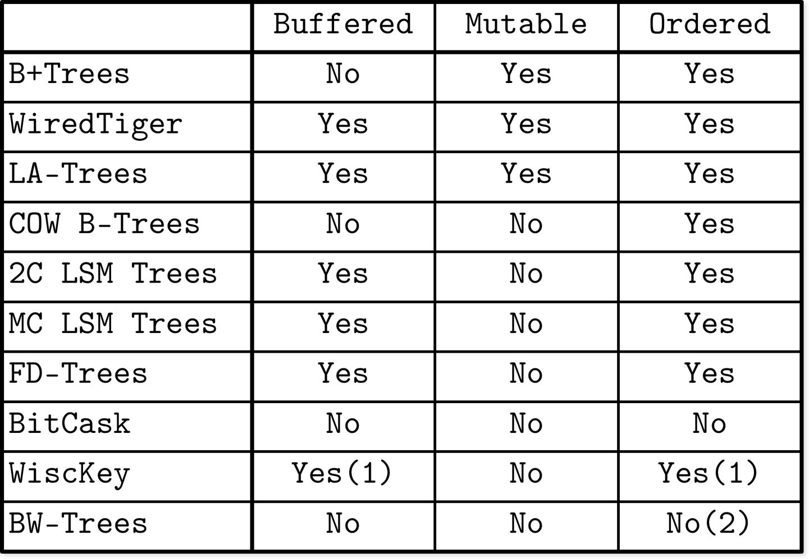

# Part I Conclusion

In Part I, we’ve been talking about storage engines. We started from high-level database system architecture and classification, learned how to implement on-disk storage structures, and how they fit into the full picture with other components.

We’ve seen several storage structures, starting from B-Trees. The discussed structures do not represent an entire field, and there are many other interesting developments. However, these examples are still a good illustration of the three properties we identified at the beginning of this part: *buffering*, *immutability*, and *ordering*. These properties are useful for describing, memorizing, and expressing different aspects of the storage structures.

Figure I-1 summarizes the discussed storage structures and shows whether or not they’re using these properties.

Adding in-memory buffers always has a positive impact on write amplification. In in-place update structures like WiredTiger and LA-Trees, in-memory buffering helps to amortize the cost of multiple same-page writes by combining them. In other words, buffering helps to reduce write amplification.

In immutable structures, such as multicomponent LSM Trees and FD-Trees, buffering has a similar positive effect, but at a cost of future rewrites when moving data from one immutable level to the other. In other words, using immutability may lead to deferred write amplification. At the same time, using immutability has a positive impact on concurrency and space amplification, since most of the discussed immutable structures use fully occupied pages.

When using immutability, unless we *also* use buffering, we end up with unordered storage structures like Bitcask and WiscKey (with the exception of copy-on-write B-Trees, which copy, re-sort, and relocate their pages). WiscKey stores *only keys* in sorted LSM Trees and allows retrieving records in key order using the key index. In Bw-Trees, *some* of the nodes (ones that were consolidated) hold data records in key order, while the rest of the logical Bw-Tree nodes may have their delta updates scattered across different pages.

###### Figure I-1. Buffering, immutability, and ordering properties of discussed storage structures. (1) WiscKey uses buffering only for keeping keys sorted order. (2) Only consolidated nodes in Bw-Trees hold ordered records.

You see that these three properties can be mixed and matched in order to achieve the desired characteristics. Unfortunately, storage engine design usually involves trade-offs: you increase the cost of one operation in favor of the other.

Using this knowledge, you should be able to start looking closer at the code of most modern database systems. Some of the code references and starting points can be found across the entire book. Knowing and understanding the terminology will make this process easier for you.

Many modern database systems are powered by probabilistic data structures [\[FLAJOLET12\]](app01.html#FLAJOLET12) [\[CORMODE04\]](app01.html#CORMODE04), and there’s new research being done on bringing ideas from machine learning into database systems [\[KRASKA18\]](app01.html#KRASKA18). We’re about to experience further changes in research and industry as nonvolatile and byte-addressable storage becomes more prevalent and widely available [\[VENKATARAMAN11\]](app01.html#VENKATARAMAN11).

Knowing the fundamental concepts described in this book should help you to understand and implement newer research, since it borrows from, builds upon, and is inspired by the same concepts. The major advantage of knowing the theory and history is that there’s nothing entirely new and, as the narrative of this book shows, progress is incremental.