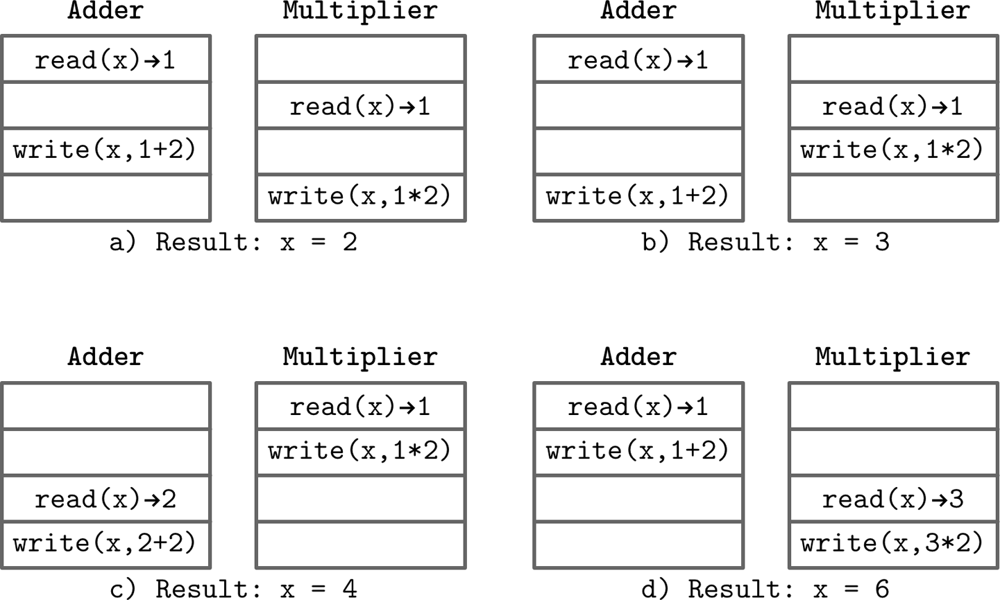
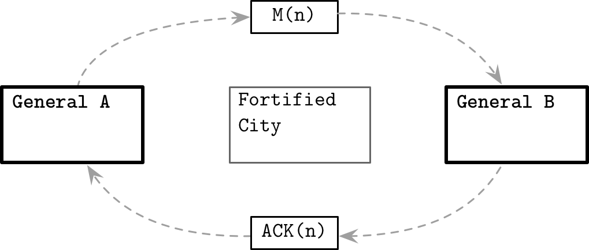

# Chapter 8. Introduction and Overview

What makes distributed systems inherently different from single-node systems? Let’s take a look at a simple example and try to see. In a single-threaded program, we define variables and the execution process (a set of steps).

For example, we can define a variable and perform simple arithmetic operations over it:

```
int x = 1;
x += 2;
x *= 2;
```

We have a single execution history: we declare a variable, increment it by two, then multiply it by two, and get the result: `6`. Let’s say that, instead of having one execution thread performing these operations, we have two threads that have read and write access to variable `x`.

# Concurrent Execution

As soon as two execution threads are allowed to access the variable, the exact outcome of the concurrent step execution is unpredictable, unless the steps are synchronized between the threads. Instead of a single possible outcome, we end up with four, as Figure 8-1 shows.^(1)



###### Figure 8-1. Possible interleavings of concurrent executions

- a\) x = 2, if both threads read an initial value, the adder writes its value, but it is overwritten with the multiplication result.

- b\) x = 3, if both threads read an initial value, the multiplier writes its value, but it is overwritten with the addition result.

- c\) x = 4, if the multiplier can read the initial value and execute its operation before the adder starts.

- d\) x = 6, if the adder can read the initial value and execute its operation before the multiplier starts.

Even before we can cross a single node boundary, we encounter the first problem in distributed systems: *concurrency*. Every concurrent program has some properties of a distributed system. Threads access the shared state, perform some operations locally, and propagate the results back to the shared variables.

To define execution histories precisely and reduce the number of possible outcomes, we need *consistency models*. Consistency models describe concurrent executions and establish an order in which operations can be executed and made visible to the participants. Using different consistency models, we can constraint or relax the number of states the system can be in.

There is a lot of overlap in terminology and research in the areas of distributed systems and concurrent computing, but there are also some differences. In a concurrent system, we can have *shared memory*, which processors can use to exchange the information. In a distributed system, each processor has its local state and participants communicate by passing messages.

##### Concurrent and Parallel

We often use the terms *concurrent* and *parallel* computing interchangeably, but these concepts have a slight semantic difference. When two sequences of steps execute concurrently, both of them are in progress, but only one of them is executed at any moment. If two sequences execute in parallel, their steps can be executed simultaneously. Concurrent operations overlap in time, while parallel operations are executed by multiple processors \[WEIKUM01\].

Joe Armstrong, creator of the Erlang programming language, gave an [example](https://databass.dev/links/44): concurrent execution is like having two queues to a single coffee machine, while parallel execution is like having two queues to two coffee machines. That said, the vast majority of sources use the term concurrency to describe systems with several parallel execution threads, and the term parallelism is rarely used.

## Shared State in a Distributed System

We can try to introduce some notion of shared memory to a distributed system, for example, a single source of information, such as database. Even if we solve the problems with concurrent access to it, we still cannot guarantee that all processes are in sync.

To access this database, processes have to go over the communication medium by sending and receiving messages to query or modify the state. However, what happens if one of the processes does not receive a response from the database for a longer time? To answer this question, we first have to define what *longer* even means. To do this, the system has to be described in terms of *synchrony*: whether the communication is fully asynchronous, or whether there are some timing assumptions. These timing assumptions allow us to introduce operation timeouts and retries.

We do not know whether the database hasn’t responded because it’s overloaded, unavailable, or slow, or because of some problems with the network on the way to it. This describes a *nature* of a crash: processes may crash by failing to participate in further algorithm steps, having a temporary failure, or by omitting some of the messages. We need to define a *failure model* and describe ways in which failures can occur before we decide how to treat them.

A property that describes system reliability and whether or not it can continue operating correctly in the presence of failures is called *fault tolerance*. Failures are inevitable, so we need to build systems with reliable components, and eliminating a single point of failure in the form of the aforementioned single-node database can be the first step in this direction. We can do this by introducing some *redundancy* and adding a backup database. However, now we face a different problem: how do we keep *multiple copies* of shared state in sync?

So far, trying to introduce shared state to our simple system has left us with more questions than answers. We now know that sharing state is not as simple as just introducing a database, and have to take a more granular approach and describe interactions in terms of independent processes and passing messages between them.

# Fallacies of Distributed Computing

In an ideal case, when two computers talk over the network, everything works just fine: a process opens up a connection, sends the data, gets responses, and everyone is happy. Assuming that operations always succeed and nothing can go wrong is dangerous, since when something does break and our assumptions turn out to be wrong, systems behave in ways that are hard or impossible to predict.

Most of the time, assuming that the *network is reliable* is a reasonable thing to do. It has to be reliable to at least some extent to be useful. We’ve all been in the situation when we tried to establish a connection to the remote server and got a `Network is Unreachable` error instead. But even if it is possible to establish a connection, a successful *initial* connection to the server does not guarantee that the link is stable, and the connection can get interrupted at any time. The message might’ve reached the remote party, but the response could’ve gotten lost, or the connection was interrupted before the response was delivered.

Network switches break, cables get disconnected, and network configurations can change at any time. We should build our system by handling all of these scenarios gracefully.

A connection can be stable, but we can’t expect remote calls to be as fast as the local ones. We should make as few assumptions about latency as possible and never assume that *latency is zero*. For our message to reach a remote server, it has to go through several software layers, and a physical medium such as optic fiber or a cable. All of these operations are not instantaneous.

Michael Lewis, in his [*Flash Boys*](https://www.simonandschuster.com/books/Flash-Boys/Michael-Lewis/9781442370289) book (Simon and Schuster), tells a story about companies spending millions of dollars to reduce latency by several milliseconds to able to access stock exchanges faster than the competition. This is a great example of using latency as a competitive advantage, but it’s worth mentioning that, according to some other studies, such as \[BARTLETT16\], the chance of stale-quote arbitrage (the ability to profit from being able to know prices and execute orders faster than the competition) doesn’t give fast traders the ability to exploit markets.

Learning our lessons, we’ve added retries, reconnects, and removed the assumptions about instantaneous execution, but this still turns out not to be enough. When increasing the number, rates, and sizes of exchanged messages, or adding new processes to the existing network, we should not assume that *bandwidth is infinite*.

###### Note

In 1994, Peter Deutsch published a now-famous list of assertions, titled “Fallacies of distributed computing,” describing the aspects of distributed computing that are easy to overlook. In addition to network reliability, latency, and bandwidth assumptions, he describes some other problems. For example, network security, the possible presence of adversarial parties, intentional and unintentional topology changes that can break our assumptions about presence and location of specific resources, transport costs in terms of both time and resources, and, finally, the existence of a single authority having knowledge and control over the entire network.

Deutsch’s list of distributed computing fallacies is pretty exhaustive, but it focuses on what can go wrong when we send messages from one process to another through the link. These concerns are valid and describe the most general and low-level complications, but unfortunately, there are many other assumptions we make about the distributed systems while designing and implementing them that can cause problems when operating them.

## Processing

Before a remote process can send a response to the message it just received, it needs to perform some work locally, so we cannot assume that *processing is instantaneous*. Taking network latency into consideration is not enough, as operations performed by the remote processes aren’t immediate, either.

Moreover, there’s no guarantee that processing starts as soon as the message is delivered. The message may land in the pending queue on the remote server, and will have to wait there until all the messages that arrived before it are processed.

Nodes can be located closer or further from one another, have different CPUs, amounts of RAM, different disks, or be running different software versions and configurations. We cannot expect them to process requests at the same rate. If we have to wait for several remote servers working in parallel to respond to complete the task, the execution as a whole is as slow as the slowest remote server.

Contrary to the widespread belief, *queue capacity is not infinite* and piling up more requests won’t do the system any good. *Backpressure* is a strategy that allows us to cope with producers that publish messages at a rate that is faster than the rate at which consumers can process them by slowing down the producers. Backpressure is one of the least appreciated and applied concepts in distributed systems, often built post hoc instead of being an integral part of the system design.

Even though increasing the queue capacity might sound like a good idea and can help to pipeline, parallelize, and effectively schedule requests, nothing is happening to the messages while they’re sitting in the queue and waiting for their turn. Increasing the queue size may negatively impact latency, since changing it has no effect on the processing rate.

In general, process-local queues are used to achieve the following goals:

Decoupling  
Receipt and processing are separated in time and happen independently.

Pipelining  
Requests in different stages are processed by independent parts of the system. The subsystem responsible for receiving messages doesn’t have to block until the previous message is fully processed.

Absorbing short-time bursts  
System load tends to vary, but request inter-arrival times are hidden from the component responsible for request processing. Overall system latency increases because of the time spent in the queue, but this is usually still better than responding with a failure and retrying the request.

Queue size is workload- and application-specific. For relatively stable workloads, we can size queues by measuring task processing times and the average time each task spends in the queue before it is processed, and making sure that latency remains within acceptable bounds while throughput increases. In this case, queue sizes are relatively small. For unpredictable workloads, when tasks get submitted in bursts, queues should be sized to account for bursts and high load as well.

The remote server can work through requests quickly, but it doesn’t mean that we always get a positive response from it. It can respond with a failure: it couldn’t make a write, the searched value was not present, or it could’ve hit a bug. In summary, even the most favorable scenario still requires some attention from our side.

## Clocks and Time

> Time is an illusion. Lunchtime doubly so.
>
> Ford Prefect, *The Hitchhiker’s Guide to the Galaxy*

Assuming that clocks on remote machines run in sync can also be dangerous. Combined with *latency is zero* and *processing is instantaneous*, it leads to different idiosyncrasies, especially in time-series and real-time data processing. For example, when collecting and aggregating data from participants with a different perception of time, you should understand time drifts between them and normalize times accordingly, rather than relying on the source timestamp. Unless you use specialized high-precision time sources, you should not rely on timestamps for synchronization or ordering. Of course this doesn’t mean we cannot or should not rely on time at all: in the end, any synchronous system uses *local* clocks for timeouts.

It’s essential to always account for the possible time differences between the processes and the time required for the messages to get delivered and processed. For example, Spanner (see “Distributed Transactions with Spanner”) uses a special time API that returns a timestamp and uncertainty bounds to impose a strict transaction order. Some failure-detection algorithms rely on a shared notion of time and a guarantee that the clock drift is always within allowed bounds for correctness \[GUPTA01\].

Besides the fact that clock synchronization in a distributed system is hard, the *current* time is constantly changing: you can request a current POSIX timestamp from the operating system, and request another *current* timestamp after executing several steps, and the two will be different. This is a rather obvious observation, but understanding both a source of time and which exact moment the timestamp captures is crucial.

Understanding whether the clock source is monotonic (i.e., that it won’t ever go backward) and how much the scheduled time-related operations might drift can be helpful, too.

## State Consistency

Most of the previous assumptions fall into the *almost always false* category, but there are some that are better described as *not always true*: when it’s easy to take a mental shortcut and simplify the model by thinking of it a specific way, ignoring some tricky edge cases.

Distributed algorithms do not always guarantee strict state consistency. Some approaches have looser constraints and allow state divergence between replicas, and rely on *conflict resolution* (an ability to detect and resolve diverged states within the system) and *read-time data repair* (bringing replicas back in sync during reads in cases where they respond with different results). You can find more information about these concepts in Chapter 12. Assuming that the state is fully consistent across the nodes may lead to subtle bugs.

An eventually consistent distributed database system might have the logic to handle replica disagreement by querying a quorum of nodes during reads, but assume that the database schema and the view of the cluster are strongly consistent. Unless we enforce consistency of this information, relying on that assumption may have severe consequences.

For example, there was a [bug in Apache Cassandra](https://databass.dev/links/46), caused by the fact that schema changes propagate to servers at different times. If you tried to read from the database while the schema was propagating, there was a chance of corruption, since one server encoded results assuming one schema and the other one decoded them using a different schema.

Another example is a bug caused by the [divergent view of the ring](https://databass.dev/links/47): if one of the nodes assumes that the other node holds data records for a key, but this other node has a different view of the cluster, reading or writing the data can result in misplacing data records or getting an empty response while data records are in fact happily present on the other node.

It is better to think about the possible problems in advance, even if a complete solution is costly to implement. By understanding and handling these cases, you can embed safeguards or change the design in a way that makes the solution more natural.

## Local and Remote Execution

Hiding complexity behind an API might be dangerous. For example, if you have an iterator over the local dataset, you can reasonably predict what’s going on behind the scenes, even if the storage engine is unfamiliar. Understanding the process of iteration over the remote dataset is an entirely different problem: you need to understand consistency and delivery semantics, data reconciliation, paging, merges, concurrent access implications, and many other things.

Simply hiding both behind the same interface, however useful, might be misleading. Additional API parameters may be necessary for debugging, configuration, and observability. We should always keep in mind that *local and remote execution are not the same* \[WALDO96\].

The most apparent problem with hiding remote calls is latency: remote invocation is many times more costly than the local one, since it involves two-way network transport, serialization/deserialization, and many other steps. Interleaving local and blocking remote calls may lead to performance degradation and unintended side effects \[VINOSKI08\].

## Need to Handle Failures

It’s OK to start working on a system assuming that all nodes are up and functioning normally, but thinking this is the case all the time is dangerous. In a long-running system, nodes can be taken down for maintenance (which usually involves a graceful shutdown) or crash for various reasons: software problems, out-of-memory killer \[KERRISK10\], runtime bugs, hardware issues, etc. Processes do fail, and the best thing you can do is be prepared for failures and understand how to handle them.

If the remote server doesn’t respond, we do not always know the exact reason for it. It could be caused by the crash, a network failure, the remote process, or the link to it being slow. Some distributed algorithms use *heartbeat protocols* and *failure detectors* to form a hypothesis about which participants are alive and reachable.

## Network Partitions and Partial Failures

When two or more servers cannot communicate with each other, we call the situation *network partition*. In “Perspectives on the CAP Theorem” \[GILBERT12\], Seth Gilbert and Nancy Lynch draw a distinction between the case when two participants cannot communicate with each other and when several groups of participants are isolated from one another, cannot exchange messages, and proceed with the algorithm.

General unreliability of the network (packet loss, retransmission, latencies that are hard to predict) are *annoying but tolerable*, while network partitions can cause much more trouble, since independent groups can proceed with execution and produce conflicting results. Network links can also fail asymmetrically: messages can still be getting delivered from one process to the other one, but not vice versa.

To build a system that is robust in the presence of failure of one or multiple processes, we have to consider cases of *partial failures* \[TANENBAUM06\] and how the system can continue operating even though a part of it is unavailable or functioning incorrectly.

Failures are hard to detect and aren’t always visible in the same way from different parts of the system. When designing highly available systems, one should always think about edge cases: what if we did replicate the data, but received no acknowledgments? Do we need to retry? Is the data still going to be available for reads on the nodes that have sent acknowledgments?

Murphy’s Law^(2) tells us that the failures do happen. Programming folklore adds that the failures will happen in the worst way possible, so our job as distributed systems engineers is to make sure we reduce the number of scenarios where things go wrong and prepare for failures in a way that contains the damage they can cause.

It’s impossible to prevent all failures, but we can still build a resilient system that functions correctly in their presence. The best way to design for failures is to test for them. It’s close to impossible to think through every possible failure scenario and predict the behaviors of multiple processes. Setting up testing harnesses that create partitions, simulate bit rot \[GRAY05\], increase latencies, diverge clocks, and magnify relative processing speeds is the best way to go about it. Real-world distributed system setups can be quite adversarial, unfriendly, and “creative” (however, in a very hostile way), so the testing effort should attempt to cover as many scenarios as possible.

###### Tip

Over the last few years, we’ve seen a few open source projects that help to recreate different failure scenarios. [Toxiproxy](https://databass.dev/links/48) can help to simulate network problems: limit the bandwidth, introduce latency, timeouts, and more. [Chaos Monkey](https://databass.dev/links/49) takes a more radical approach and exposes engineers to production failures by randomly shutting down services. [CharybdeFS](https://databass.dev/links/50) helps to simulate filesystem and hardware errors and failures. You can use these tools to test your software and make sure it behaves correctly in the presence of these failures. [CrashMonkey](https://databass.dev/links/122), a filesystem agnostic record-replay-and-test framework, helps test data and metadata consistency for persistent files.

When working with distributed systems, we have to take fault tolerance, resilience, possible failure scenarios, and edge cases seriously. Similar to [“given enough eyeballs, all bugs are shallow,”](https://databass.dev/links/51) we can say that a large enough cluster will eventually hit every possible issue. At the same time, given enough testing, we will be able to eventually find every existing problem.

## Cascading Failures

We cannot always wholly isolate failures: a process tipping over under a high load increases the load for the rest of cluster, making it even more probable for the other nodes to fail. *Cascading failures* can propagate from one part of the system to the other, increasing the scope of the problem.

Sometimes, cascading failures can even be initiated by perfectly good intentions. For example, a node was offline for a while and did not receive the most recent updates. After it comes back online, helpful peers would like to help it to catch up with recent happenings and start streaming the data it’s missing over to it, exhausting network resources or causing the node to fail shortly after the startup.

###### Tip

To protect a system from propagating failures and treat failure scenarios gracefully, *circuit breakers* can be used. In electrical engineering, circuit breakers protect expensive and hard-to-replace parts from overload or short circuit by interrupting the current flow. In software development, circuit breakers monitor failures and allow fallback mechanisms that can protect the system by steering away from the failing service, giving it some time to recover, and handling failing calls gracefully.

When the connection to one of the servers fails or the server does not respond, the client starts a reconnection loop. By that point, an overloaded server already has a hard time catching up with new connection requests, and client-side retries in a tight loop don’t help the situation. To avoid that, we can use a *backoff* strategy. Instead of retrying immediately, clients wait for some time. Backoff can help us to avoid amplifying problems by scheduling retries and increasing the time window between subsequent requests.

Backoff is used to increase time periods between requests from a single client. However, different clients using the same backoff strategy can produce substantial load as well. To prevent *different* clients from retrying all at once after the backoff period, we can introduce *jitter*. Jitter adds small random time periods to backoff and reduces the probability of clients waking up and retrying at the same time.

Hardware failures, bit rot, and software errors can result in corruption that can propagate through standard delivery mechanisms. For example, corrupted data records can get replicated to the other nodes if they are not validated. Without validation mechanisms in place, a system can propagate corrupted data to the other nodes, potentially overwriting noncorrupted data records. To avoid that, we should use checksumming and validation to verify the integrity of any content exchanged between the nodes.

Overload and hotspotting can be avoided by planning and coordinating execution. Instead of letting peers execute operation steps independently, we can use a coordinator that prepares an execution plan based on the available resources and predicts the load based on the past execution data available to it.

In summary, we should always consider cases in which failures in one part of the system can cause problems elsewhere. We should equip our systems with circuit breakers, backoff, validation, and coordination mechanisms. Handling small isolated problems is always more straightforward than trying to recover from a large outage.

We’ve just spent an entire section discussing problems and potential failure scenarios in distributed systems, but we should see this as a warning and not as something that should scare us away.

Understanding what can go wrong, and carefully designing and testing our systems makes them more robust and resilient. Being aware of these issues can help you to identify and find potential sources of problems during development, as well as debug them in production.

# Distributed Systems Abstractions

When talking about programming languages, we use common terminology and define our programs in terms of functions, operators, classes, variables, and pointers. Having a common vocabulary helps us to avoid inventing new words every time we describe anything. The more precise and less ambiguous our definitions are, the easier it is for our listeners to understand us.

Before we move to algorithms, we first have to cover the distributed systems vocabulary: definitions you’ll frequently encounter in talks, books, and papers.

## Links

Networks are not reliable: messages can get lost, delayed, and reordered. Now, with this thought in our minds, we will try to build several communication protocols. We’ll start with the least reliable and robust ones, identifying the states they can be in, and figuring out the possible additions to the protocol that can provide better guarantees.

### Fair-loss link

We can start with two *processes*, connected with a *link*. Processes can send messages to each other, as shown in Figure 8-2. Any communication medium is imperfect, and messages can get lost or delayed.

Let’s see what kind of guarantees we can get. After the message `M` is sent, from the senders’ perspective, it can be in one of the following states:

- Not *yet* delivered to process `B` (but will be, at some point in time)

- Irrecoverably lost during transport

- Successfully delivered to the remote process


###### Figure 8-2. Simplest, unreliable form of communication

Notice that the sender does not have any way to find out if the message is already delivered. In distributed systems terminology, this kind of link is called *fair-loss*. The properties of this kind of link are:

Fair loss  
If both sender and recipient are correct and the sender keeps retransmitting the message infinitely many times, it will eventually be delivered.^(3)

Finite duplication  
Sent messages won’t be delivered infinitely many times.

No creation  
A link will not come up with messages; in other words, it won’t deliver the message that was never sent.

A fair-loss link is a useful abstraction and a first building block for communication protocols with strong guarantees. We can assume that this link is not losing messages between communicating parties *systematically* and doesn’t create new messages. But, at the same time, we cannot entirely rely on it. This might remind you of the [User Datagram Protocol (UDP)](https://databass.dev/links/52), which allows us to send messages from one process to the other, but does not have reliable delivery semantics on the protocol level.

### Message acknowledgments

To improve the situation and get more clarity in terms of message status, we can introduce *acknowledgments*: a way for the recipient to notify the sender that it has received the message. For that, we need to use bidirectional communication channels and add some means that allow us to distinguish differences between the messages; for example, *sequence numbers*, which are unique monotonically increasing message identifiers.

###### Note

It is enough to have a *unique* identifier for every message. Sequence numbers are just a particular case of a unique identifier, where we achieve uniqueness by drawing identifiers from a counter. When using hash algorithms to identify messages uniquely, we should account for possible collisions and make sure we can still disambiguate messages.

Now, process `A` can send a message `M(n)`, where `n` is a monotonically increasing message counter. As soon as `B` receives the message, it sends an acknowledgment `ACK(n)` back to A. Figure 8-3 shows this form of communication.


###### Figure 8-3. Sending a message with an acknowledgment

The acknowledgment, as well as the original message, may get lost on the way. The number of states the message can be in changes slightly. Until `A` receives an acknowledgment, the message is still in one of the three states we mentioned previously, but as soon as `A` receives the acknowledgment, it can be confident that the message is delivered to `B`.

### Message retransmits

Adding acknowledgments is *still* not enough to call this communication protocol reliable: a sent message may still get lost, or the remote process may fail before acknowledging it. To solve this problem and provide delivery guarantees, we can try *retransmits* instead. Retransmits are a way for the sender to retry a potentially failed operation. We say *potentially* failed, because the sender doesn’t really know whether it has failed or not, since the type of link we’re about to discuss does *not* use acknowledgments.

After process `A` sends message `M`, it waits until timeout `T` is triggered and tries to send the same message again. Assuming the link between processes stays intact, network partitions between the processes are not infinite, and not *all* packets are lost, we can state that, from the sender’s perspective, the message is either not *yet* delivered to process `B` or is successfully delivered to process `B`. Since `A` keeps trying to send the message, we can say that it *cannot* get irrecoverably lost during transport.

In distributed systems terminology, this abstraction is called a *stubborn link*. It’s called stubborn because the sender keeps resending the message again and again indefinitely, but, since this sort of abstraction would be highly impractical, we need to combine retries with acknowledgments.

### Problem with retransmits

Whenever we send the message, until we receive an acknowledgment from the remote process, we do not know whether it has already been processed, it will be processed shortly, it has been lost, or the remote process has crashed before receiving it—any one of these states is possible. We can retry the operation and send the message again, but this can result in message duplicates. Processing duplicates is only safe if the operation we’re about to perform is idempotent.

An *idempotent* operation is one that can be executed multiple times, yielding the same result without producing additional side effects. For example, a server shutdown operation can be idempotent, the first call initiates the shutdown, and all subsequent calls do not produce any additional effects.

If every operation was idempotent, we could think less about delivery semantics, rely more on retransmits for fault tolerance, and build systems in an entirely reactive way: triggering an action as a response to some signal, without causing unintended side effects. However, operations are not necessarily idempotent, and merely assuming that they are might lead to cluster-wide side effects. For example, charging a customer’s credit card is not idempotent, and charging it multiple times is definitely undesirable.

Idempotence is particularly important in the presence of partial failures and network partitions, since we cannot always find out the exact status of a remote operation—whether it has succeeded, failed, or will be executed shortly—and we just have to wait longer. Since guaranteeing that each executed operation is idempotent is an unrealistic requirement, we need to provide guarantees *equivalent* to idempotence without changing the underlying operation semantics. To achieve this, we can use *deduplication* and avoid processing messages more than once.

### Message order

Unreliable networks present us with two problems: messages can arrive out of order and, because of retransmits, some messages may arrive more than once. We have already introduced sequence numbers, and we can use these message identifiers on the recipient side to ensure *first-in, first-out* (FIFO) ordering. Since every message has a sequence number, the receiver can track:

- `n`_(`consecutive`), specifying the highest sequence number, up to which it has seen all messages. Messages up to this number can be put back in order.

- `n`_(`processed`), specifying the highest sequence number, up to which messages were put back in their original order and *processed*. This number can be used for deduplication.

If the received message has a nonconsecutive sequence number, the receiver puts it into the reordering buffer. For example, it receives a message with a sequence number `5` after receiving one with `3`, and we know that `4` is still missing, so we need to put `5` aside until `4` comes, and we can reconstruct the message order. Since we’re building on top of a fair-loss link, we assume that messages between `n`_(`consecutive`) and `n`_(`max_seen`) will eventually be delivered.

The recipient can safely discard the messages with sequence numbers up to `n`_(`consecutive`) that it receives, since they’re guaranteed to be already delivered.

Deduplication works by checking if the message with a sequence number `n` has already been *processed* (passed down the stack by the receiver) and discarding already processed messages.

In distributed systems terms, this type of link is called a *perfect link*, which provides the following guarantees \[CACHIN11\]:

Reliable delivery  
Every message sent *once* by the correct process `A` to the correct process `B`, will *eventually* be delivered.

No duplication  
No message is delivered more than once.

No creation  
Same as with other types of links, it can only deliver the messages that were actually sent.

This might remind you of the TCP^(4) protocol (however, reliable delivery in TCP is guaranteed only in the scope of a single session). Of course, this model is just a simplified representation we use for illustration purposes only. TCP has a much more sophisticated model for dealing with acknowledgments, which groups acknowledgments and reduces the protocol-level overhead. In addition, TCP has selective acknowledgments, flow control, congestion control, error detection, and many other features that are out of the scope of our discussion.

### Exactly-once delivery

> There are only two hard problems in distributed systems: 2. Exactly-once delivery 1. Guaranteed order of messages 2. Exactly-once delivery.
>
> Mathias Verraes

There have been many discussions about whether or not *exactly-once delivery* is possible. Here, semantics and precise wording are essential. Since there might be a link failure preventing the message from being delivered from the first try, most of the real-world systems employ *at-least-once delivery*, which ensures that the sender retries until it receives an acknowledgment, otherwise the message is not considered to be received. Another delivery semantic is *at-most-once*: the sender sends the message and doesn’t expect any delivery confirmation.

The TCP protocol works by breaking down messages into packets, transmitting them one by one, and stitching them back together on the receiving side. TCP might attempt to retransmit some of the packets, and more than one transmission attempt may succeed. Since TCP marks each packet with a sequence number, even though some packets were transmitted more than once, it can deduplicate the packets and guarantee that the recipient will see the message and *process* it only once. In TCP, this guarantee is valid only for a *single session*: if the message is acknowledged and processed, but the sender didn’t receive the acknowledgment before the connection was interrupted, the application is not aware of this delivery and, depending on its logic, it might attempt to send the message once again.

This means that exactly-once *processing* is what’s interesting here since duplicate *deliveries* (or packet transmissions) have no side effects and are merely an artifact of the best effort by the link. For example, if the database node has only *received* the record, but hasn’t *persisted* it, delivery has occurred, but it’ll be of no use unless the record can be retrieved (in other words, unless it was both delivered and processed).

For the exactly-once guarantee to hold, nodes should have a *common knowledge* \[HALPERN90\]: everyone knows about some fact, and everyone knows that everyone else also knows about that fact. In simplified terms, nodes have to agree on the state of the record: both nodes agree that it either *was* or *was not* persisted. As you will see later in this chapter, this is theoretically impossible, but in practice we still use this notion by relaxing coordination requirements.

Any misunderstanding about whether or not exactly-once delivery is possible most likely comes from approaching the problem from different protocol and abstraction levels and the definition of “delivery.” It’s not possible to build a reliable link without ever transferring any message more than once, but we can create the illusion of exactly-once delivery from the sender’s perspective by *processing* the message once and ignoring duplicates.

Now, as we have established the means for reliable communication, we can move ahead and look for ways to achieve uniformity and agreement between processes in the distributed system.

# Two Generals’ Problem

One of the most prominent descriptions of an agreement in a distributed system is a thought experiment widely known as the *Two Generals’ Problem*.

This thought experiment shows that it is impossible to achieve an agreement between two parties if communication is *asynchronous* in the presence of link failures. Even though TCP exhibits properties of a perfect link, it’s important to remember that perfect links, despite the name, do not guarantee *perfect* delivery. They also can’t guarantee that participants will be alive the whole time, and are concerned only with transport.

Imagine two armies, led by two generals, preparing to attack a fortified city. The armies are located on two sides of the city and can succeed in their siege only if they attack simultaneously.

The generals can communicate by sending messengers, and already have devised an attack plan. The only thing they now have to agree on is whether or not to carry out the plan. Variants of this problem are when one of the generals has a higher rank, but needs to make sure the attack is coordinated; or that the generals need to agree on the exact time. These details do not change the problem definition: the generals have to come to an agreement.

The army generals only have to agree on the fact that they both will proceed with the attack. Otherwise, the attack cannot succeed. General `A` sends a message `MSG(N)`, stating an intention to proceed with the attack at a specified time, *if* the other party agrees to proceed as well.

After `A` sends the messenger, he doesn’t know whether the messenger has arrived or not: the messenger can get captured and fail to deliver the message. When general `B` receives the message, he has to send an acknowledgment `ACK(MSG(N))`. Figure 8-4 shows that a message is sent one way and acknowledged by the other party.



###### Figure 8-4. Two Generals’ Problem illustrated

The messenger carrying this acknowledgment might get captured or fail to deliver it, as well. `B` doesn’t have any way of knowing if the messenger has successfully delivered the acknowledgment.

To be sure about it, `B` has to wait for `ACK(ACK(MSG(N)))`, a second-order acknowledgment stating that `A` received an acknowledgment for the acknowledgment.

No matter how many further confirmations the generals send to each other, they will always be one `ACK` away from knowing if they can safely proceed with the attack. The generals are doomed to wonder if the message carrying this last acknowledgment has reached the destination.

Notice that we did not make any timing assumptions: communication between generals is fully asynchronous. There is no upper time bound set on how long the generals can take to respond.

# FLP Impossibility

In a paper by Fisher, Lynch, and Paterson, the authors describe a problem famously known as the *FLP Impossibility Problem* \[FISCHER85\] (derived from the first letters of authors’ last names), wherein they discuss a form of consensus in which processes start with an initial value and attempt to agree on a new value. After the algorithm completes, this new value has to be the same for all nonfaulty processes.

Reaching an agreement on a specific value is straightforward if the network is entirely reliable; but in reality, systems are prone to many different sorts of failures, such as message loss, duplication, network partitions, and slow or crashed processes.

A consensus protocol describes a system that, given multiple processes starting at its *initial state*, brings all of the processes to the *decision state*. For a consensus protocol to be correct, it has to preserve three properties:

Agreement  
The decision the protocol arrives at has to be unanimous: each process decides on some value, and this has to be the same for all processes. Otherwise, we have not reached a consensus.

Validity  
The agreed value has to be *proposed* by one of the participants, which means that the system should not just “come up” with the value. This also implies nontriviality of the value: processes should not always decide on some predefined default value.

Termination  
An agreement is final only if there are no processes that did not reach the decision state.

\[FISCHER85\] assumes that processing is entirely asynchronous; there’s no shared notion of time between the processes. Algorithms in such systems cannot be based on timeouts, and there’s no way for a process to find out whether the other process has crashed or is simply running too slow. The paper shows that, given these assumptions, there exists no protocol that can guarantee consensus in a bounded time. No completely asynchronous consensus algorithm can tolerate the unannounced crash of even a single remote process.

If we do not consider an upper time bound for the process to complete the algorithm steps, process failures can’t be reliably detected, and there’s no deterministic algorithm to reach a consensus.

However, FLP Impossibility does not mean we have to pack our things and go home, as reaching consensus is not possible. It only means that we cannot always reach consensus in an asynchronous system in bounded time. In practice, systems exhibit at least some degree of synchrony, and the solution to this problem requires a more refined model.

# System Synchrony

From FLP Impossibility, you can see that the timing assumption is one of the critical characteristics of the distributed system. In an *asynchronous system*, we do not know the relative speeds of processes, and cannot guarantee message delivery in a bounded time or a particular order. The process might take indefinitely long to respond, and process failures can’t always be reliably detected.

The main criticism of asynchronous systems is that these assumptions are not realistic: processes can’t have *arbitrarily* different processing speeds, and links don’t take *indefinitely* long to deliver messages. Relying on time both simplifies reasoning and helps to provide upper-bound timing guarantees.

It is not always possible to solve a consensus problem in an asynchronous model \[FISCHER85\]. Moreover, designing an efficient asynchronous algorithm is not always achievable, and for some tasks the practical solutions are more likely to be time-dependent \[ARJOMANDI83\].

These assumptions can be loosened up, and the system can be considered to be *synchronous*. For that, we introduce the notion of timing. It is much easier to reason about the system under the synchronous model. It assumes that processes are progressing at comparable rates, that transmission delays are bounded, and message delivery cannot take arbitrarily long.

A synchronous system can also be represented in terms of synchronized process-local clocks: there is an upper time bound in time difference between the two process-local time sources \[CACHIN11\].

Designing systems under a synchronous model allows us to use timeouts. We can build more complex abstractions, such as leader election, consensus, failure detection, and many others on top of them. This makes the best-case scenarios more robust, but results in a failure if the timing assumptions don’t hold up. For example, in the Raft consensus algorithm (see “Raft”), we may end up with multiple processes believing they’re leaders, which is resolved by forcing the lagging process to accept the other process as a leader; failure-detection algorithms (see Chapter 9) can wrongly identify a live process as failed or vice versa. When designing our systems, we should make sure to consider these possibilities.

Properties of both asynchronous and synchronous models can be combined, and we can think of a system as *partially synchronous*. A partially synchronous system exhibits some of the properties of the synchronous system, but the bounds of message delivery, clock drift, and relative processing speeds might not be exact and hold only *most of the time* \[DWORK88\].

Synchrony is an essential property of the distributed system: it has an impact on performance, scalability, and general solvability, and has many factors necessary for the correct functioning of our systems. Some of the algorithms we discuss in this book operate under the assumptions of synchronous systems.

# Failure Models

We keep mentioning *failures*, but so far it has been a rather broad and generic concept that might capture many meanings. Similar to how we can make different timing assumptions, we can assume the presence of different types of failures. A *failure model* describes exactly how processes can crash in a distributed system, and algorithms are developed using these assumptions. For example, we can assume that a process can crash and never recover, or that it is expected to recover after some time passes, or that it can fail by spinning out of control and supplying incorrect values.

In distributed systems, processes rely on one another for executing an algorithm, so failures can result in incorrect execution across the whole system.

We’ll discuss multiple failure models present in distributed systems, such as *crash*, *omission*, and *arbitrary* faults. This list is not exhaustive, but it covers most of the cases applicable and important in real-life systems.

## Crash Faults

Normally, we expect the process to be executing all steps of an algorithm correctly. The simplest way for a process to crash is by *stopping* the execution of any further steps required by the algorithm and not sending any messages to other processes. In other words, the process *crashes*. Most of the time, we assume a *crash-stop* process abstraction, which prescribes that, once the process has crashed, it remains in this state.

This model does not assume that it is impossible for the process to recover, and does not discourage recovery or try to prevent it. It only means that the algorithm *does not rely* on recovery for correctness or liveness. Nothing prevents processes from recovering, catching up with the system state, and participating in the *next* instance of the algorithm.

Failed processes are not able to continue participating in the current round of negotiations during which they failed. Assigning the recovering process a new, different identity does not make the model equivalent to crash-recovery (discussed next), since most algorithms use predefined lists of processes and clearly define failure semantics in terms of how many failures they can tolerate \[CACHIN11\].

*Crash-recovery* is a different process abstraction, under which the process stops executing the steps required by the algorithm, but recovers at a later point and tries to execute further steps. The possibility of recovery requires introducing a durable state and recovery protocol into the system \[SKEEN83\]. Algorithms that allow crash-recovery need to take all possible recovery states into consideration, since the recovering process may attempt to continue execution from the last step known to it.

Algorithms, aiming to exploit recovery, have to take both state and identity into account. Crash-recovery, in this case, can also be viewed as a special case of omission failure, since from the other process’s perspective there’s no distinction between the process that was unreachable and the one that has crashed and recovered.

## Omission Faults

Another failure model is *omission fault*. This model assumes that the process skips some of the algorithm steps, or is not able to execute them, or this execution is not visible to other participants, or it cannot send or receive messages to and from other participants. Omission fault captures network partitions between the processes caused by faulty network links, switch failures, or network congestion. Network partitions can be represented as omissions of messages between individual processes or process groups. A crash can be simulated by completely omitting any messages to and from the process.

When the process is operating slower than the other participants and sends responses much later than expected, for the rest of the system it may look like it is forgetful. Instead of stopping completely, a slow node attempts to send its results out of sync with other nodes.

Omission failures occur when the algorithm that was supposed to execute certain steps either skips them or the results of this execution are not visible. For example, this may happen if the message is lost on the way to the recipient, and the sender fails to send it again and continues to operate as if it was successfully delivered, even though it was irrecoverably lost. Omission failures can also be caused by intermittent hangs, overloaded networks, full queues, etc.

## Arbitrary Faults

The hardest class of failures to overcome is *arbitrary* or *Byzantine* faults: a process continues executing the algorithm steps, but in a way that contradicts the algorithm (for example, if a process in a consensus algorithm decides on a value that no other participant has ever proposed).

Such failures can happen due to bugs in software, or due to processes running different versions of the algorithm, in which case failures are easier to find and understand. It can get much more difficult when we do not have control over all processes, and one of the processes is intentionally misleading other processes.

You might have heard of Byzantine fault tolerance from the airspace industry: airplane and spacecraft systems do not take responses from subcomponents at face value and cross-validate their results. Another widespread application is cryptocurrencies \[GILAD17\], where there is no central authority, different parties control the nodes, and adversary participants have a material incentive to forge values and attempt to game the system by providing faulty responses.

## Handling Failures

We can *mask* failures by forming process groups and introducing redundancy into the algorithm: even if one of the processes fails, the user will not notice this failure \[CHRISTIAN91\].

There might be some performance penalty related to failures: normal execution relies on processes being responsive, and the system has to fall back to the slower execution path for error handling and correction. Many failures can be prevented on the software level by code reviews, extensive testing, ensuring message delivery by introducing timeouts and retries, and making sure that steps are executed in order locally.

Most of the algorithms we’re going to cover here assume the crash-failure model and work around failures by introducing redundancy. These assumptions help to create algorithms that perform better and are easier to understand and implement.

## Summary

In this chapter, we discussed some of the distributed systems terminology and introduced some basic concepts. We’ve talked about the inherent difficulties and complications caused by the unreliability of the system components: links may fail to deliver messages, processes may crash, or the network may get partitioned.

This terminology should be enough for us to continue the discussion. The rest of the book talks about the *solutions* commonly used in distributed systems: we think back to what can go wrong and see what options we have available.

##### Further Reading

If you’d like to learn more about the concepts mentioned in this chapter, you can refer to the following sources:

Distributed systems abstractions, failure models, and timing assumptions  
Lynch, Nancy A. 1996. *Distributed Algorithms*. San Francisco: Morgan Kaufmann.

Tanenbaum, Andrew S. and Maarten van Steen. 2006. *Distributed Systems: Principles and Paradigms* (2nd Ed). Boston: Pearson.

Cachin, Christian, Rachid Guerraoui, and Lus Rodrigues. 2011. *Introduction to Reliable and Secure Distributed Programming* (2nd Ed.). New York: Springer.

^(1) Interleaving, where the multiplier reads before the adder, is left out for brevity, since it yields the same result as a).

^(2) Murphy’s Law is an adage that can be summarized as “Anything that can go wrong, will go wrong,” which was popularized and is often used as an idiom in popular culture.

^(3) A more precise definition is that if a correct process A sends a message to a correct process B infinitely often, it will be delivered infinitely often (\[CACHIN11\]).

^(4) See [*https://databass.dev/links/53*](https://databass.dev/links/53).