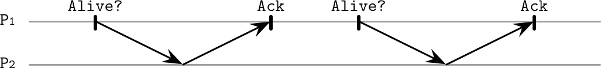
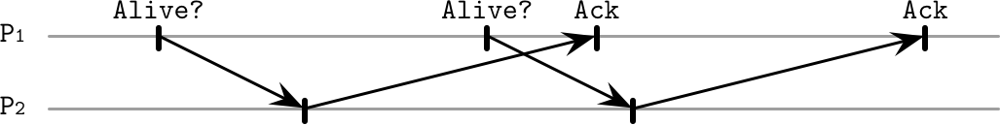
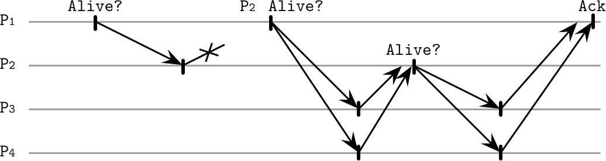
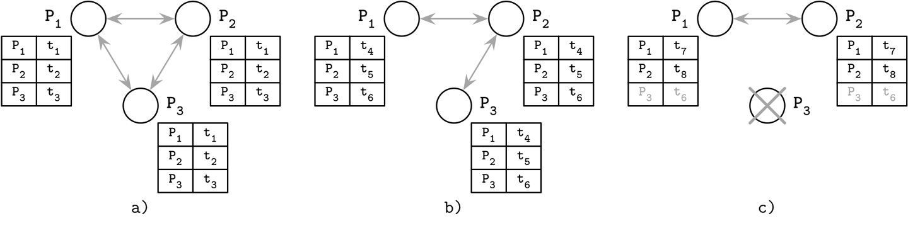
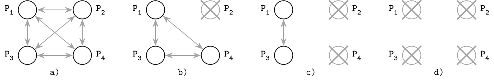

# Chapter 9. Failure Detection

> If a tree falls in a forest and no one is around to hear it, does it make a sound?
>
> Unknown Author

In order for a system to appropriately react to failures, failures should be detected in a timely manner. A faulty process might get contacted even though it won’t be able to respond, increasing latencies and reducing overall system availability.

Detecting failures in asynchronous distributed systems (i.e., without making any timing assumptions) is extremely difficult as it’s impossible to tell whether the process has crashed, or is running slowly and taking an indefinitely long time to respond. We discussed a problem related to this one in “FLP Impossibility”.

Terms such as *dead*, *failed*, and *crashed* are usually used to describe a process that has stopped executing its steps completely. Terms such as *unresponsive*, *faulty*, and *slow* are used to describe *suspected* processes, which may actually be dead.

Failures may occur on the *link* level (messages between processes are lost or delivered slowly), or on the *process* level (the process crashes or is running slowly), and slowness may not always be distinguishable from failure. This means there’s always a trade-off between wrongly suspecting alive processes as dead (producing *false-positives*), and delaying marking an unresponsive process as dead, giving it the benefit of doubt and expecting it to respond eventually (producing *false-negatives*).

A *failure detector* is a local subsystem responsible for identifying failed or unreachable processes to exclude them from the algorithm and guarantee liveness while preserving safety.

Liveness and safety are the properties that describe an algorithm’s ability to solve a specific problem and the correctness of its output. More formally, *liveness* is a property that guarantees that a specific intended event *must* occur. For example, if one of the processes has failed, a failure detector *must* detect that failure. *Safety* guarantees that unintended events will *not* occur. For example, if a failure detector has marked a process as dead, this process had to be, in fact, dead [\[LAMPORT77\]](app01.html#LAMPORT77) [\[RAYNAL99\]](app01.html#RAYNAL99) [\[FREILING11\]](app01.html#FREILING11).

From a practical perspective, excluding failed processes helps to avoid unnecessary work and prevents error propagation and cascading failures, while reducing availability when excluding potentially suspected alive processes.

Failure-detection algorithms should exhibit several essential properties. First of all, every nonfaulty member should eventually notice the process failure, and the algorithm should be able to make progress and eventually reach its final result. This property is called *completeness*.

We can judge the quality of the algorithm by its *efficiency*: how fast the failure detector can identify process failures. Another way to do this is to look at the *accuracy* of the algorithm: whether or not the process failure was precisely detected. In other words, an algorithm is *not* accurate if it falsely accuses a live process of being failed or is not able to detect the existing failures.

We can think of the relationship between efficiency and accuracy as a tunable parameter: a more efficient algorithm might be less precise, and a more accurate algorithm is usually less efficient. It is provably impossible to build a failure detector that is both accurate and efficient. At the same time, failure detectors are allowed to produce false-positives (i.e., falsely identify live processes as failed and vice versa) [\[CHANDRA96\]](app01.html#CHANDRA96).

Failure detectors are an essential prerequisite and an integral part of many consensus and atomic broadcast algorithms, which we’ll be discussing later in this book.

Many distributed systems implement failure detectors by using *heartbeats*. This approach is quite popular because of its simplicity and strong completeness. Algorithms we discuss here assume the absence of Byzantine failures: processes do not attempt to intentionally lie about their state or states of their neighbors.

# Heartbeats and Pings

We can query the state of remote processes by triggering one of two periodic processes:

- We can trigger a ping, which sends messages to remote processes, checking if they are still alive by expecting a response within a specified time period.

- We can trigger a *heartbeat* when the process is actively notifying its peers that it’s still running by sending messages to them.

We’ll use pings as an example here, but the same problem can be solved using heartbeats, producing similar results.

Each process maintains a list of other processes (alive, dead, and suspected ones) and updates it with the last response time for each process. If a process fails to respond to a ping message for a longer time, it is marked as *suspected*.

Figure 9-1 shows the normal functioning of a system: process `P1` is querying the state of neighboring node `P2`, which responds with an acknowledgment.

###### Figure 9-1. Pings for failure detection: normal functioning, no message delays

In contrast, Figure 9-2 shows how acknowledgment messages are delayed, which might result in marking the active process as down.

###### Figure 9-2. Pings for failure detection: responses are delayed, coming after the next message is sent

Many failure-detection algorithms are based on heartbeats and timeouts. For example, Akka, a popular framework for building distributed systems, has an implementation of a [deadline failure detector](https://databass.dev/links/41), which uses heartbeats and reports a process failure if it has failed to register within a fixed time interval.

This approach has several potential downsides: its precision relies on the careful selection of ping frequency and timeout, and it does not capture process visibility from the perspective of other processes (see “Outsourced Heartbeats”).

## Timeout-Free Failure Detector

Some algorithms avoid relying on timeouts for detecting failures. For example, Heartbeat, a *timeout-free* failure detector [\[AGUILERA97\]](app01.html#AGUILERA97), is an algorithm that only counts heartbeats and allows the application to detect process failures based on the data in the heartbeat counter vectors. Since this algorithm is timeout-free, it operates under *asynchronous* system assumptions.

The algorithm assumes that any two correct processes are connected to each other with a *fair path*, which contains only fair links (i.e., if a message is sent over this link infinitely often, it is also received infinitely often), and each process is aware of the existence of *all* other processes in the network.

Each process maintains a list of neighbors and counters associated with them. Processes start by sending heartbeat messages to their neighbors. Each message contains a path that the heartbeat has traveled so far. The initial message contains the first sender in the path and a unique identifier that can be used to avoid broadcasting the same message multiple times.

When the process receives a new heartbeat message, it increments counters for all participants present in the path and sends the heartbeat to the ones that are not present there, appending itself to the path. Processes stop propagating messages as soon as they see that all the known processes have already received it (in other words, process IDs appear in the path).

Since messages are propagated through different processes, and heartbeat paths contain aggregated information received from the neighbors, we can (correctly) mark an unreachable process as alive even when the direct link between the two processes is faulty.

Heartbeat counters represent a global and normalized view of the system. This view captures how the heartbeats are propagated relative to one another, allowing us to compare processes. However, one of the shortcomings of this approach is that interpreting heartbeat counters may be quite tricky: we need to pick a threshold that can yield reliable results. Unless we can do that, the algorithm will falsely mark active processes as suspected.

## Outsourced Heartbeats

An alternative approach, used by the Scalable Weakly Consistent Infection-style Process Group Membership Protocol (SWIM) [\[GUPTA01\]](app01.html#GUPTA01) is to use *outsourced heartbeats* to improve reliability using information about the process liveness from the perspective of its neighbors. This approach does not require processes to be aware of all other processes in the network, only a subset of connected peers.

As shown in Figure 9-3, process `P`_(`1`) sends a ping message to process `P`_(`2`). `P`_(`2`) doesn’t respond to the message, so `P`_(`1`) proceeds by selecting multiple random members (`P`_(`3`) and `P`_(`4`)). These random members try sending heartbeat messages to `P`_(`2`) and, if it responds, forward acknowledgments back to `P`_(`1`).

###### Figure 9-3. “Outsourcing” heartbeats

This allows accounting for both direct and indirect reachability. For example, if we have processes `P`_(`1`), `P`_(`2`), and `P`_(`3`), we can check the state of `P`_(`3`) from the perspective of both `P`_(`1`) and `P`_(`2`).

Outsourced heartbeats allow reliable failure detection by distributing responsibility for deciding across the group of members. This approach does not require broadcasting messages to a broad group of peers. Since outsourced heartbeat requests can be triggered in parallel, this approach can collect more information about suspected processes quickly, and allow us to make more accurate decisions.

# Phi-Accrual Failure Detector

Instead of treating node failure as a binary problem, where the process can be only in two states: up or down, a *phi-accrual* (φ-accrual) failure detector [\[HAYASHIBARA04\]](app01.html#HAYASHIBARA04) has a continuous scale, capturing the probability of the monitored process’s crash. It works by maintaining a sliding window, collecting arrival times of the most recent heartbeats from the peer processes. This information is used to approximate arrival time of the *next* heartbeat, compare this approximation with the actual arrival time, and compute the *suspicion level* `φ`: how certain the failure detector is about the failure, given the current network conditions.

The algorithm works by collecting and sampling arrival times, creating a view that can be used to make a reliable judgment about node health. It uses these samples to compute the value of `φ`: if this value reaches a threshold, the node is marked as down. This failure detector dynamically adapts to changing network conditions by adjusting the scale on which the node can be marked as a suspect.

From the architecture perspective, a phi-accrual failure detector can be viewed as a combination of three subsystems:

Monitoring  
Collecting liveness information through pings, heartbeats, or request-response sampling.

Interpretation  
Making a decision on whether or not the process should be marked as suspected.

Action  
A callback executed whenever the process is marked as suspected.

The monitoring process collects and stores data samples (which are assumed to follow a normal distribution) in a fixed-size window of heartbeat arrival times. Newer arrivals are added to the window, and the oldest heartbeat data points are discarded.

Distribution parameters are estimated from the sampling window by determining the mean and variance of samples. This information is used to compute the probability of arrival of the message within `t` time units after the previous one. Given this information, we compute `φ`, which describes how likely we are to make a correct decision about a process’s liveness. In other words, how likely it is to make a mistake and receive a heartbeat that will contradict the calculated assumptions.

This approach was developed by researchers from the Japan Advanced Institute of Science and Technology, and is now used in many distributed systems; for example, [Cassandra](https://databass.dev/links/42) and [Akka](https://databass.dev/links/43) (along with the aforementioned deadline failure detector).

# Gossip and Failure Detection

Another approach that avoids relying on a single-node view to make a decision is a gossip-style failure detection service [\[VANRENESSE98\]](app01.html#VANRENESSE98), which uses *gossip* (see “Gossip Dissemination”) to collect and distribute states of neighboring processes.

Each member maintains a list of other members, their *heartbeat counters*, and timestamps, specifying when the heartbeat counter was incremented for the last time. Periodically, each member increments its heartbeat counter and distributes its list to a random neighbor. Upon the message receipt, the neighboring node merges the list with its own, updating heartbeat counters for the other neighbors.

Nodes also periodically check the list of states and heartbeat counters. If any node did not update its counter for long enough, it is considered failed. This timeout period should be chosen carefully to minimize the probability of false-positives. How often members have to communicate with each other (in other words, worst-case bandwidth) is capped, and can grow at most linearly with a number of processes in the system.

Figure 9-4 shows three communicating processes sharing their heartbeat counters:

- a\) All three can communicate and update their timestamps.

- b\) `P3` isn’t able to communicate with `P1`, but its timestamp `t`_(`6`) can still be propagated through `P2`.

- c\) `P3` crashes. Since it doesn’t send updates anymore, it is detected as failed by other processes.

###### Figure 9-4. Replicated heartbeat table for failure detection

This way, we can detect crashed nodes, as well as the nodes that are unreachable by any other cluster member. This decision is reliable, since the view of the cluster is an aggregate from multiple nodes. If there’s a link failure between the two hosts, heartbeats can still propagate through other processes. Using gossip for propagating system states increases the number of messages in the system, but allows information to spread more reliably.

# Reversing Failure Detection Problem Statement

Since propagating the information about failures is not always possible, and propagating it by notifying every member might be expensive, one of the approaches, called *FUSE* (failure notification service) [\[DUNAGAN04\]](app01.html#DUNAGAN04), focuses on reliable and cheap failure propagation that works even in cases of network partitions.

To detect process failures, this approach arranges all active processes in groups. If one of the groups becomes unavailable, all participants detect the failure. In other words, every time a single process failure is detected, it is converted and propagated as a *group failure*. This allows detecting failures in the presence of any pattern of disconnects, partitions, and node failures.

Processes in the group periodically send ping messages to other members, querying whether they’re still alive. If one of the members cannot respond to this message because of a crash, network partition, or link failure, the member that has initiated this ping will, in turn, stop responding to ping messages itself.

Figure 9-5 shows four communicating processes:

- a\) Initial state: all processes are alive and can communicate.

- b\) `P`_(`2`) crashes and stops responding to ping messages.

- c\) `P`_(`4`) detects the failure of `P`_(`2`) and stops responding to ping messages itself.

- d\) Eventually, `P`_(`1`) and `P`_(`3`) notice that both `P`_(`1`) and `P`_(`2`) do not respond, and process failure propagates to the entire group.

###### Figure 9-5. FUSE failure detection

All failures are propagated through the system from the source of failure to all other participants. Participants gradually stop responding to pings, converting from the individual node failure to the group failure.

Here, we use the absence of communication as a means of propagation. An advantage of using this approach is that every member is guaranteed to learn about group failure and adequately react to it. One of the downsides is that a link failure separating a single process from other ones can be converted to the group failure as well, but this can be seen as an advantage, depending on the use case. Applications can use their own definitions of propagated failures to account for this scenario.

# Summary

Failure detectors are an essential part of any distributed system. As shown by the FLP Impossibility result, no protocol can guarantee consensus in an asynchronous system. Failure detectors help to augment the model, allowing us to solve a consensus problem by making a trade-off between accuracy and completeness. One of the significant findings in this area, proving the usefulness of failure detectors, was described in [\[CHANDRA96\]](app01.html#CHANDRA96), which shows that solving consensus is possible even with a failure detector that makes an infinite number of mistakes.

We’ve covered several algorithms for failure detection, each using a different approach: some focus on detecting failures by direct communication, some use broadcast or gossip for spreading the information around, and some opt out by using quiescence (in other words, absence of communication) as a means of propagation. We now know that we can use heartbeats or pings, hard deadlines, or continuous scales. Each one of these approaches has its own upsides: simplicity, accuracy, or precision.

##### Further Reading

If you’d like to learn more about the concepts mentioned in this chapter, you can refer to the following sources:

Failure detection and algorithms  
Chandra, Tushar Deepak and Sam Toueg. 1996. “Unreliable failure detectors for reliable distributed systems.” *Journal of the ACM* 43, no. 2 (March): 225-267. *[*https://doi.org/10.1145/226643.226647*](https://doi.org/10.1145/226643.226647)*.

Freiling, Felix C., Rachid Guerraoui, and Petr Kuznetsov. 2011. “The failure detector abstraction.” *ACM Computing Surveys* 43, no. 2 (January): Article 9. *[*https://doi.org/10.1145/1883612.1883616*](https://doi.org/10.1145/1883612.1883616)*.

Phan-Ba, Michael. 2015. “A literature review of failure detection within the context of solving the problem of distributed consensus.” *[*https://www.cs.ubc.ca/~bestchai/theses/michael-phan-ba-msc-essay-2015.pdf*](https://www.cs.ubc.ca/~bestchai/theses/michael-phan-ba-msc-essay-2015.pdf)*