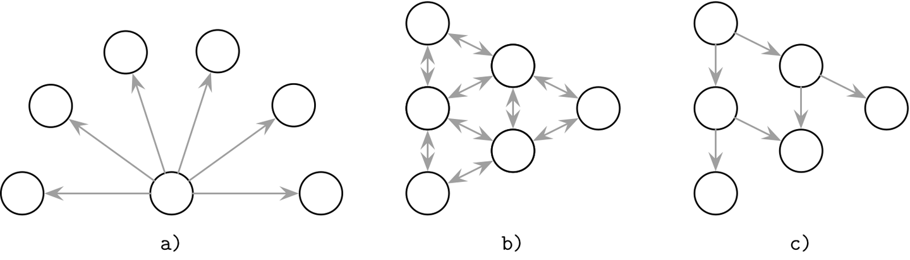
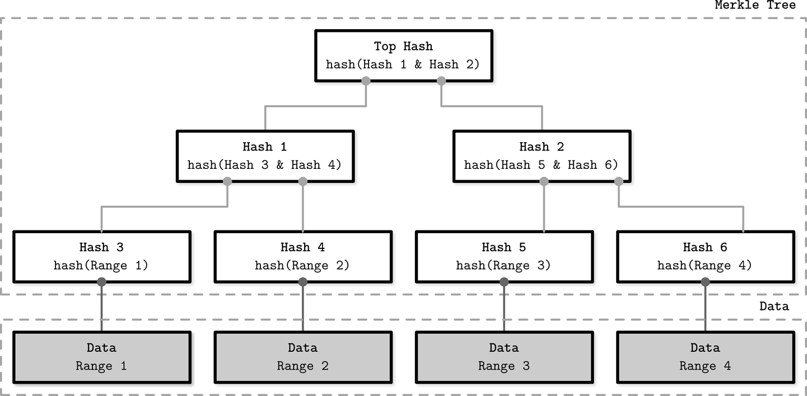
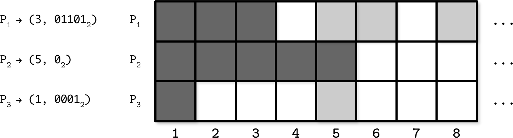
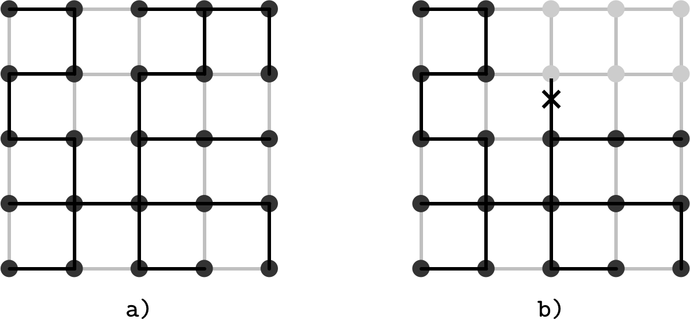
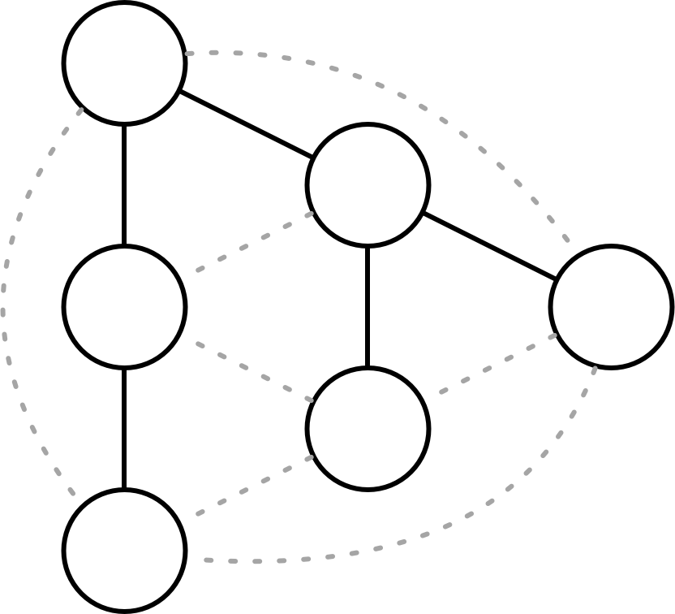

# Chapter 12. Anti-Entropy and Dissemination

Most of the communication patterns we’ve been discussing so far were either peer-to-peer or one-to-many (coordinator and replicas). To reliably propagate data records throughout the system, we need the propagating node to be available and able to reach the other nodes, but even then the throughput is limited to a single machine.

Quick and reliable propagation may be less applicable to data records and more important for the cluster-wide metadata, such as membership information (joining and leaving nodes), node states, failures, schema changes, etc. Messages containing this information are generally infrequent and small, but have to be propagated as quickly and reliably as possible.

Such updates can generally be propagated to all nodes in the cluster using one of the three broad groups of approaches [\[DEMERS87\]](app01.html#DEMERS87); schematic depictions of these communication patterns are shown in Figure 12-1:

- a\) Notification broadcast from one process to *all* others.

- b\) Periodic peer-to-peer information exchange. Peers connect pairwise and exchange messages.

- c\) Cooperative broadcast, where message recipients become broadcasters and help to spread the information quicker and more reliably.

###### Figure 12-1. Broadcast (a), anti-entropy (b), and gossip (c)

Broadcasting the message to all other processes is the most straightforward approach that works well when the number of nodes in the cluster is small, but in large clusters it can get *expensive* because of the number of nodes, and *unreliable* because of overdependence on a single process. Individual processes may not always know about the existence of all other processes in the network. Moreover, there has to be some overlap in time during which both the broadcasting process and *each one* of its recipients are up, which might be difficult to achieve in some cases.

To relax these constraints, we can assume that *some* updates may fail to propagate. The coordinator will do its best and deliver the messages to all available participants, and then anti-entropy mechanisms will bring nodes back in sync in case there were any failures. This way, the responsibility for delivering messages is shared by all nodes in the system, and is split into two steps: primary delivery and periodic sync.

*Entropy* is a property that represents the measure of disorder in the system. In a distributed system, entropy represents a degree of state divergence between the nodes. Since this property is undesired and its amount should be kept to a minimum, there are many techniques that help to deal with entropy.

Anti-entropy is usually used to bring the nodes back up-to-date in case the primary delivery mechanism has failed. The system can continue functioning correctly even if the coordinator fails at some point, since the other nodes will continue spreading the information. In other words, anti-entropy is used to lower the convergence time bounds in eventually consistent systems.

To keep nodes in sync, anti-entropy triggers a background or a foreground process that compares and reconciles missing or conflicting records. Background anti-entropy processes use auxiliary structures such as Merkle trees and update logs to identify divergence. Foreground anti-entropy processes piggyback read or write requests: hinted handoff, read repairs, etc.

If replicas diverge in a replicated system, to restore consistency and bring them back in sync, we have to find and repair missing records by comparing replica states pairwise. For large datasets, this can be very costly: we have to read the whole dataset on both nodes and notify replicas about more recent state changes that weren’t yet propagated. To reduce this cost, we can consider ways in which replicas can get out-of-date and patterns in which data is accessed.

# Read Repair

It is easiest to detect divergence between the replicas during the read, since at that point we can contact replicas, request the queried state from each one of them, and see whether or not their responses match. Note that in this case we do not query an entire dataset stored on each replica, and we limit our goal to just the data that was requested by the client.

The coordinator performs a distributed read, optimistically assuming that replicas are in sync and have the same information available. If replicas send different responses, the coordinator sends missing updates to the replicas where they’re missing.

This mechanism is called *read repair*. It is often used to detect and eliminate inconsistencies. During read repair, the coordinator node makes a request to replicas, waits for their responses, and compares them. In case some of the replicas have missed the recent updates and their responses differ, the coordinator detects inconsistencies and sends updates back to the replicas [\[DECANDIA07\]](app01.html#DECANDIA07).

Some Dynamo-style databases choose to lift the requirement of contacting *all* replicas and use tunable consistency levels instead. To return consistent results, we do not have to contact and repair all the replicas, but only the number of nodes that satisfies the consistency level. If we do *quorum* reads and writes, we still get consistent results, but some of the replicas still might not contain all the writes.

Read repair can be implemented as a *blocking* or *asynchronous* operation. During blocking read repair, the original client request has to wait until the coordinator “repairs” the replicas. Asynchronous read repair simply schedules a task that can be executed after results are returned to the user.

*Blocking* read repair ensures read [monotonicity](https://databass.dev/links/1) (see “Session Models”) for quorum reads: as soon as the client reads a specific value, subsequent reads return the value at least as recent as the one it has seen, since replica states were repaired. If we’re not using quorums for reads, we lose this monotonicity guarantee as data might have not been propagated to the target node by the time of a subsequent read. At the same time, blocking read repair sacrifices availability, since repairs should be acknowledged by the target replicas and the read cannot return until they respond.

To detect exactly which records differ between replica responses, some databases (for example, Apache Cassandra) use specialized iterators with [merge listeners](https://databass.dev/links/2), which reconstruct differences between the merged result and individual inputs. Its output is then used by the coordinator to notify replicas about the missing data.

Read repair assumes that replicas are *mostly* in sync and we do not expect every request to fall back to a blocking repair. Because of the read monotonicity of blocking repairs, we can also expect subsequent requests to return the same consistent results, as long as there was no write operation that has completed in the interim.

# Digest Reads

Instead of issuing a full read request to each node, the coordinator can issue only one full read request and send only *digest* requests to the other replicas. A digest request reads the replica-local data and, instead of returning a full snapshot of the requested data, it computes a hash of this response. Now, the coordinator can compute a hash of the full read and compare it to digests from all other nodes. If all the digests match, it can be confident that the replicas are in sync.

In case digests do not match, the coordinator does not know which replicas are ahead, and which ones are behind. To bring lagging replicas back in sync with the rest of the nodes, the coordinator has to issue full reads to any replicas that responded with different digests, compare their responses, reconcile the data, and send updates to the lagging replicas.

###### Note

Digests are usually computed using a noncryptographic hash function, such as MD5, since it has to be computed quickly to make the “happy path” performant. Hash functions can have *collisions*, but their probability is negligible for most real-world systems. Since databases often use more than just one anti-entropy mechanism, we can expect that, even in the unlikely event of a hash collision, data will be reconciled by the different subsystem.

# Hinted Handoff

Another anti-entropy approach is called *hinted handoff* [\[DECANDIA07\]](app01.html#DECANDIA07), a write-side repair mechanism. If the target node fails to acknowledge the write, the write coordinator or one of the replicas stores a special record, called a *hint*, which is replayed to the target node as soon as it comes back up.

In Apache Cassandra, unless the `ANY` consistency level is in use [\[ELLIS11\]](app01.html#ELLIS11), hinted writes aren’t counted toward the replication factor (see “Tunable Consistency”), since the data in the hint log isn’t accessible for reads and is only used to help the lagging participants catch up.

Some databases, for example Riak, use *sloppy quorums* together with hinted handoff. With sloppy quorums, in case of replica failures, write operations can use additional healthy nodes from the node list, and these nodes do not have to be target replicas for the executed operations.

For example, say we have a five-node cluster with nodes `{A, B, C, D, E}`, where `{A, B, C}` are replicas for the executed write operation, and node `B` is down. `A`, being the coordinator for the query, picks node `D` to satisfy the sloppy quorum and maintain the desired availability and durability guarantees. Now, data is replicated to `{A, D, C}`. However, the record at `D` will have a hint in its metadata, since the write was originally intended for `B`. As soon as `B` recovers, `D` will attempt to forward a hint back to it. Once the hint is replayed on `B`, it can be safely removed without reducing the total number of replicas [\[DECANDIA07\]](app01.html#DECANDIA07).

Under similar circumstances, if nodes `{B, C}` are briefly separated from the rest of the cluster by the network partition, and a sloppy quorum write was done against `{A, D, E}`, a read on `{B, C}`, immediately following this write, would *not* observe the latest read [\[DOWNEY12\]](app01.html#DOWNEY12). In other words, sloppy quorums improve availability at the cost of consistency.

# Merkle Trees

Since read repair can only fix inconsistencies on the currently queried data, we should use different mechanisms to find and repair inconsistencies in the data that is not actively queried.

As we already discussed, finding exactly which rows have diverged between the replicas requires exchanging and comparing the data records pairwise. This is highly impractical and expensive. Many databases employ *Merkle trees* [\[MERKLE87\]](app01.html#MERKLE87) to reduce the cost of reconciliation.

Merkle trees compose a compact hashed representation of the local data, building a tree of hashes. The lowest level of this hash tree is built by scanning an entire table holding data records, and computing hashes of record ranges. Higher tree levels contain hashes of the lower-level hashes, building a hierarchical representation that allows us to quickly detect inconsistencies by comparing the hashes, following the hash tree nodes recursively to narrow down inconsistent ranges. This can be done by exchanging and comparing subtrees level-wise, or by exchanging and comparing entire trees.

Figure 12-2 shows a composition of a Merkle tree. The lowest level consists of the hashes of data record ranges. Hashes for each higher level are computed by hashing underlying level hashes, repeating this process recursively up to the tree root.

###### Figure 12-2. Merkle tree. Gray boxes represent data record ranges. White boxes represent a hash tree hierarchy.

To determine whether or not there’s an inconsistency between the two replicas, we only need to compare the root-level hashes from their Merkle trees. By comparing hashes pairwise from top to bottom, it is possible to locate ranges holding differences between the nodes, and repair data records contained in them.

Since Merkle trees are calculated recursively from the bottom to the top, a change in data triggers recomputation of the entire subtree. There’s also a trade-off between the size of a tree (consequently, sizes of exchanged messages) and its precision (how small and exact data ranges are).

# Bitmap Version Vectors

More recent research on this subject introduces *bitmap version vectors* [\[GONÇALVES15\]](app01.html#GONÇALVES15), which can be used to resolve data conflicts based on *recency*: each node keeps a per-peer log of operations that have occurred locally or were replicated. During anti-entropy, logs are compared, and missing data is replicated to the target node.

Each write, coordinated by a node, is represented by a *dot* `(i,n)`: an event with a node-local sequence number `i` coordinated by the node `n`. The sequence number `i` starts with `1` and is incremented each time the node executes a write operation.

To track replica states, we use node-local logical clocks. Each clock represents a set of dots, representing writes this node has seen *directly* (coordinated by the node itself), or *transitively* (coordinated by and replicated from the other nodes).

In the node logical clock, events coordinated by the node itself will have no gaps. If some writes aren’t replicated from the other nodes, the clock will contain gaps. To get two nodes back in sync, they can exchange logical clocks, identify gaps represented by the missing dots, and then replicate data records associated with them. To do this, we need to reconstruct the data records each dot refers to. This information is stored in a *dotted causal container* (DCC), which maps dots to causal information for a given key. This way, conflict resolution captures causal relationships between the writes.

Figure 12-3 (adapted from [\[GONÇALVES15\]](app01.html#GONÇALVES15)) shows an example of the state representation of three nodes in the system, `P`_(`1`), `P`_(`2`) and `P`_(`3`), from the perspective of `P`_(`2`), tracking which values it has seen. Each time `P`_(`2`) makes a write or receives a replicated value, it updates this table.

###### Figure 12-3. Bitmap version vector example

During replication, `P`_(`2`) creates a compact representation of this state and creates a map from the node identifier to a pair of latest values, up to which it has seen consecutive writes, and a bitmap where other seen writes are encoded as `1`. `(3, 01101`_(`2`)`)` here means that node `P`_(`2`) has seen consecutive updates up to the third value, and it has seen values on the second, third, and fifth position relative to `3` (i.e., it has seen the values with sequence numbers `5`, `6`, and `8`).

During exchange with other nodes, it will receive the missing updates the other node has seen. As soon as all the nodes in the system have seen consecutive values up to the index `i`, the version vector can be truncated up to this index.

An advantage of this approach is that it captures the causal relation between the value writes and allows nodes to precisely identify the data points missing on the other nodes. A possible downside is that, if the node was down for an extended time period, peer nodes can’t truncate the log, since data still has to be replicated to the lagging node once it comes back up.

# Gossip Dissemination

> Masses are always breeding grounds of psychic epidemics.
>
> Carl Jung

To involve other nodes, and propagate updates with the *reach* of a broadcast and the *reliability* of anti-entropy, we can use gossip protocols.

*Gossip protocols* are probabilistic communication procedures based on how rumors are spread in human society or how diseases propagate in the population. Rumors and epidemics provide rather illustrative ways to describe how these protocols work: rumors spread while the population still has an interest in hearing them; diseases propagate until there are no more susceptible members in the population.

The main objective of gossip protocols is to use cooperative propagation to disseminate information from one process to the rest of the cluster. Just as a virus spreads through the human population by being passed from one individual to another, potentially increasing in scope with each step, information is relayed through the system, getting more processes involved.

A process that holds a record that has to be spread around is said to be *infective*. Any process that hasn’t received the update yet is then *susceptible*. Infective processes not willing to propagate the new state after a period of active dissemination are said to be *removed* [\[DEMERS87\]](app01.html#DEMERS87). All processes start in a susceptible state. Whenever an update for some data record arrives, a process that received it moves to the infective state and starts disseminating the update to other *random* neighboring processes, infecting them. As soon as the infective processes become certain that the update was propagated, they move to the removed state.

To avoid explicit coordination and maintaining a global list of recipients and requiring a single coordinator to broadcast messages to each other participant in the system, this class of algorithms models completeness using the *loss of interest* function. The protocol efficiency is then determined by how quickly it can *infect* as many nodes as possible, while keeping overhead caused by redundant messages to a minimum.

Gossip can be used for asynchronous message delivery in homogeneous decentralized systems, where nodes may not have long-term membership or be organized in any topology. Since gossip protocols generally do not require explicit coordination, they can be useful in systems with flexible membership (where nodes are joining and leaving frequently) or mesh networks.

Gossip protocols are very robust and help to achieve high reliability in the presence of failures inherent to distributed systems. Since messages are relayed in a randomized manner, they still can be delivered even if some communication components between them fail, just through the different paths. It can be said that the system adapts to failures.

## Gossip Mechanics

Processes periodically select `f` peers at random (where `f` is a configurable parameter, called *fanout*) and exchange currently “hot” information with them. Whenever the process learns about a new piece of information from its peers, it will attempt to pass it on further. Because peers are selected probabilistically, there will always be some overlap, and messages will get delivered repeatedly and may continue circulating for some time. *Message redundancy* is a metric that captures the overhead incurred by repeated delivery. Redundancy is an important property, and it is crucial to how gossip works.

The amount of time the system requires to reach convergence is called *latency*. There’s a slight difference between reaching convergence (stopping the gossip process) and delivering the message to all peers, since there might be a short period during which all peers are notified, but gossip continues. Fanout and latency depend on the system size: in a larger system, we either have to increase the fanout to keep latency stable, or allow higher latency.

Over time, as the nodes notice they’ve been receiving the same information again and again, the message will start losing importance and nodes will have to eventually stop relaying it. Interest loss can be computed either *probabilistically* (the probability of propagation stop is computed for each process on every step) or using a *threshold* (the number of received duplicates is counted, and propagation is stopped when this number is too high). Both approaches have to take the cluster size and fanout into consideration. Counting duplicates to measure convergence can improve latency and reduce redundancy [\[DEMERS87\]](app01.html#DEMERS87).

In terms of consistency, gossip protocols offer *convergent* consistency [\[BIRMAN07\]](app01.html#BIRMAN07): nodes have a higher probability to have the same view of the events that occurred further in the past.

## Overlay Networks

Even though gossip protocols are important and useful, they’re usually applied for a narrow set of problems. Nonepidemic approaches can distribute the message with nonprobabilistic certainty, less redundancy, and generally in a more optimal way [\[BIRMAN07\]](app01.html#BIRMAN07). Gossip algorithms are often praised for their scalability and the fact it is possible to distribute a message within `log N` message rounds (where `N` is the size of the cluster) [\[KERMARREC07\]](app01.html#KERMARREC07), but it’s important to keep the number of *redundant* messages generated during gossip rounds in mind as well. To achieve reliability, gossip-based protocols produce *some* duplicate message deliveries.

Selecting nodes at random greatly improves system *robustness*: if there is a network partition, messages will be delivered eventually if there are links that indirectly connect two processes. The obvious downside of this approach is that it is not message-optimal: to guarantee robustness, we have to maintain redundant connections between the peers and send redundant messages.

A middle ground between the two approaches is to construct a *temporary* fixed topology in a gossip system. This can be achieved by creating an *overlay network* of peers: nodes can sample their peers and select the best contact points based on proximity (usually measured by the latency).

Nodes in the system can form *spanning trees*: unidirected, loop-free graphs with distinct edges, covering the whole network. Having such a graph, messages can be distributed in a fixed number of steps.

Figure 12-4 shows an example of a spanning tree:^(1)

- a\) We achieve full connectivity between the points without using all the edges.

- b\) We can lose connectivity to the entire subtree if just a single link is broken.

###### Figure 12-4. Spanning tree. Dark points represent nodes. Dark lines represent an overlay network. Gray lines represent other possible existing connections between the nodes.

One of the potential downsides of this approach is that it might lead to forming interconnected “islands” of peers having strong preferences toward each other.

To keep the number of messages low, while allowing quick recovery in case of a connectivity loss, we can mix both approaches—fixed topologies and tree-based broadcast—when the system is in a *stable* state, and fall back to gossip for *failover* and system recovery.

## Hybrid Gossip

*Push/lazy-push multicast trees* (Plumtrees) [\[LEITAO07\]](app01.html#LEITAO07) make a trade-off between epidemic and tree-based broadcast primitives. Plumtrees work by creating a spanning tree overlay of nodes to *actively* distribute messages with the smallest overhead. Under normal conditions, nodes send full messages to just a small subset of peers provided by the peer sampling service.

Each node sends the full message to the small subset of nodes, and for the rest of the nodes, it *lazily* forwards only the message ID. If the node receives the identifier of a message it has never seen, it can query its peers to get it. This *lazy-push* step ensures high reliability and provides a way to quickly heal the broadcast tree. In case of failures, protocol falls back to the gossip approach through lazy-push steps, broadcasting the message and repairing the overlay.

Due to the nature of distributed systems, any node or link between the nodes might fail at any time, making it impossible to traverse the tree when the segment becomes unreachable. The lazy gossip network helps to notify peers about seen messages in order to construct and repair the tree.

Figure 12-5 shows an illustration of such double connectivity: nodes are connected with an optimal spanning tree (solid lines) and the lazy gossip network (dotted lines). This illustration does not represent any particular network topology, but only *connections* between the nodes.

###### Figure 12-5. Lazy and eager push networks. Solid lines represent a broadcast tree. Dotted lines represent lazy gossip connections.

One of the advantages of using the lazy-push mechanism for tree construction and repair is that in a network with constant load, it will tend to generate a tree that also minimizes message latency, since nodes that are first to respond are added to the broadcast tree.

## Partial Views

Broadcasting messages to all known peers and maintaining a full view of the cluster can get expensive and impractical, especially if the *churn* (measure of the number of joining and leaving nodes in the system) is high. To avoid this, gossip protocols often use a *peer sampling service*. This service maintains a *partial view* of the cluster, which is periodically refreshed using gossip. Partial views overlap, as some degree of redundancy is desired in gossip protocols, but too much redundancy means we’re doing extra work.

For example, the Hybrid Partial View (HyParView) protocol [\[LEITAO07\]](app01.html#LEITAO07) maintains a small *active* view and a larger *passive* view of the cluster. Nodes from the active view create an overlay that can be used for dissemination. Passive view is used to maintain a list of nodes that can be used to replace the failed ones from the active view.

Periodically, nodes perform a shuffle operation, during which they exchange their active and passive views. During this exchange, nodes add the members from both passive and active views they receive from their peers to their passive views, cycling out the oldest values to cap the list size.

The active view is updated depending on the state changes of nodes in this view and requests from peers. If a process `P`_(`1`) suspects that `P`_(`2`), one of the peers from its active view, has failed, `P`_(`1`) removes `P`_(`2`) from its active view and attempts to establish a connection with a replacement process `P`_(`3`) from the passive view. If the connection fails, `P`_(`3`) is removed from the passive view of `P`_(`1`).

Depending on the number of processes in `P`_(`1`)’s active view, `P`_(`3`) may choose to decline the connection if its active view is already full. If `P`_(`1`)’s view is empty, `P`_(`3`) *has to* replace one of its current active view peers with `P`_(`1`). This helps bootstrapping or recovering nodes to quickly become effective members of the cluster at the cost of cycling some connections.

This approach helps to reduce the number of messages in the system by using only active view nodes for dissemination, while maintaining high reliability by using passive views as a recovery mechanism. One of the performance and quality measures is how quickly a peer sampling service converges to a stable overlay in cases of topology reorganization [\[JELASITY04\]](app01.html#JELASITY04). HyParView scores rather high here, because of how the views are maintained and since it gives priority to bootstrapping processes.

HyParView and Plumtree use a *hybrid gossip* approach: using a small subset of peers for broadcasting messages and falling back to a wider network of peers in case of failures and network partitions. Both systems do not rely on a global view that includes all the peers, which can be helpful not only because of a large number of nodes in the system (which is not the case most of the time), but also because of costs associated with maintaining an up-to-date list of members on every node. Partial views allow nodes to actively communicate with only a small subset of neighboring nodes.

# Summary

Eventually consistent systems allow replica state divergence. Tunable consistency allows us to trade consistency for availability and vice versa. Replica divergence can be resolved using one of the anti-entropy mechanisms:

Hinted handoff  
Temporarily store writes on neighboring nodes in case the target is down, and replay them on the target as soon as it comes back up.

Read-repair  
Reconcile requested data ranges during the read by comparing responses, detecting missing records, and sending them to lagging replicas.

Merkle trees  
Detect data ranges that require repair by computing and exchanging hierarchical trees of hashes.

Bitmap version vectors  
Detect missing replica writes by maintaining compact records containing information about the most recent writes.

These anti-entropy approaches optimize for one of the three parameters: scope reduction, recency, or completeness. We can reduce the scope of anti-entropy by only synchronizing the data that is being actively queried (read-repairs) or individual missing writes (hinted handoff). If we assume that most failures are temporary and participants recover from them as quickly as possible, we can store the log of the most recent diverged events and know exactly what to synchronize in the event of failure (bitmap version vectors). If we need to compare entire datasets on multiple nodes pairwise and efficiently locate differences between them, we can hash the data and compare hashes (Merkle trees).

To reliably distribute information in a large-scale system, gossip protocols can be used. Hybrid gossip protocols reduce the number of exchanged messages while remaining resistant to network partitions, when possible.

Many modern systems use gossip for failure detection and membership information [\[DECANDIA07\]](app01.html#DECANDIA07). HyParView is used in [Partisan](https://databass.dev/links/3), the high-performance, high-scalability distributed computing framework. Plumtree was used in the [Riak core](https://databass.dev/links/4) for cluster-wide information.

##### Further Reading

If you’d like to learn more about the concepts mentioned in this chapter, you can refer to the following sources:

Gossip protocols  
Shah, Devavrat. 2009. “Gossip Algorithms.” *Foundations and Trends in Networking* 3, no. 1 (January): 1-125. *[*https://doi.org/10.1561/1300000014*](https://doi.org/10.1561/1300000014)*.

Jelasity, Márk. 2003. “Gossip-based Protocols for Large-scale Distributed Systems.” Dissertation. *[*http://www.inf.u-szeged.hu/~jelasity/dr/doktori-mu.pdf*](http://www.inf.u-szeged.hu/~jelasity/dr/doktori-mu.pdf)*.

Demers, Alan, Dan Greene, Carl Hauser, Wes Irish, John Larson, Scott Shenker, Howard Sturgis, Dan Swinehart, and Doug Terry. 1987. “Epidemic algorithms for replicated database maintenance.” In *Proceedings of the sixth annual ACM Symposium on Principles of distributed computing (PODC ’87)*, 1-12. New York: Association for Computing Machinery. *[*https://doi.org/10.1145/41840.41841*](https://doi.org/10.1145/41840.41841)*.

^(1) This example is only used for illustration: nodes in the network are generally not arranged in a grid.