# Chapter 14. Consensus

We’ve discussed quite a few concepts in distributed systems, starting with basics, such as links and processes, problems with distributed computing; then going through failure models, failure detectors, and leader election; discussed consistency models; and we’re finally ready to put it all together for a pinnacle of distributed systems research: distributed consensus.

Consensus algorithms in distributed systems allow multiple processes to reach an agreement on a value. FLP impossibility (see “FLP Impossibility”) shows that it is impossible to guarantee consensus in a completely asynchronous system in a bounded time. Even if message delivery is guaranteed, it is impossible for one process to know whether the other one has crashed or is running slowly.

In Chapter 9, we discussed that there’s a trade-off between failure-detection accuracy and how quickly the failure can be detected. Consensus algorithms assume an asynchronous model and guarantee safety, while an external failure detector can provide information about other processes, guaranteeing liveness [\[CHANDRA96\]](app01.html#CHANDRA96). Since failure detection is not always fully accurate, there will be situations when a consensus algorithm waits for a process failure to be detected, or when the algorithm is restarted because some process is incorrectly suspected to be faulty.

Processes have to agree on some value proposed by one of the participants, even if some of them happen to crash. A process is said to be *correct* if hasn’t crashed and continues executing algorithm steps. Consensus is extremely useful for putting events in a particular order, and ensuring consistency among the participants. Using consensus, we can have a system where processes move from one value to the next one without losing certainty about which values the clients observe.

From a theoretical perspective, consensus algorithms have three properties:

Agreement  
The decision value is the same for all *correct* processes.

Validity  
The decided value was proposed by one of the processes.

Termination  
All *correct* processes eventually reach the decision.

Each one of these properties is extremely important. The agreement is embedded in the human understanding of consensus. The [dictionary definition of consensus](https://databass.dev/links/66) has the word “unanimity” in it. This means that upon the agreement, no process is allowed to have a different opinion about the outcome. Think of it as an agreement to meet at a particular time and place with your friends: all of you would like to meet, and only the specifics of the event are being agreed upon.

Validity is essential, because without it consensus can be trivial. Consensus algorithms require all processes to agree on some value. If processes use some predetermined, arbitrary default value as a decision output regardless of the proposed values, they will reach unanimity, but the output of such an algorithm will not be valid and it wouldn’t be useful in reality.

Without termination, our algorithm will continue forever without reaching any conclusion or will wait indefinitely for a crashed process to come back, which is not very useful, either. Processes have to agree eventually and, for a consensus algorithm to be practical, this has to happen rather quickly.

# Broadcast

A *broadcast* is a communication abstraction often used in distributed systems. Broadcast algorithms are used to disseminate information among a set of processes. There exist many broadcast algorithms, making different assumptions and providing different guarantees. Broadcast is an important primitive and is used in many places, including consensus algorithms. We’ve discussed one of the forms of broadcast—gossip dissemination—already (see “Gossip Dissemination”).

Broadcasts are often used for database replication when a single coordinator node has to distribute the data to all other participants. However, making this process reliable is not a trivial matter: if the coordinator crashes after distributing the message to some nodes but not the other ones, it leaves the system in an inconsistent state: some of the nodes observe a new message and some do not.

The simplest and the most straightforward way to broadcast messages is through a *best effort broadcast* [\[CACHIN11\]](app01.html#CACHIN11). In this case, the sender is responsible for ensuring message delivery to all the targets. If it fails, the other participants do not try to rebroadcast the message, and in the case of coordinator crash, this type of broadcast will fail silently.

For a broadcast to be *reliable*, it needs to guarantee that all correct processes receive the same messages, even if the sender crashes during transmission.

To implement a naive version of a reliable broadcast, we can use a failure detector and a fallback mechanism. The most straightforward fallback mechanism is to allow every process that received the message to forward it to every other process it’s aware of. When the source process fails, other processes detect the failure and continue broadcasting the message, effectively *flooding* the network with `N`^(`2`) messages (as shown in Figure 14-1). Even if the sender has crashed, messages still are picked up and delivered by the rest of the system, improving its reliability, and allowing all receivers to see the same messages [\[CACHIN11\]](app01.html#CACHIN11).

###### Figure 14-1. Broadcast

One of the downsides of this approach is the fact that it uses `N`^(`2`) messages, where `N` is the number of *remaining* recipients (since every broadcasting process excludes the original process and itself). Ideally, we’d want to reduce the number of messages required for a reliable broadcast.

# Atomic Broadcast

Even though the flooding algorithm just described can ensure message delivery, it does not guarantee delivery in any particular order. Messages reach their destination eventually, at an unknown time. If we need to deliver messages in order, we have to use the *atomic broadcast* (also called the *total order multicast*), which guarantees both reliable delivery and total order.

While a reliable broadcast ensures that the processes agree on the set of messages delivered, an atomic broadcast also ensures they agree on the same sequence of messages (i.e., message delivery order is the same for every target).

In summary, an atomic broadcast has to ensure two essential properties:

Atomicity  
Processes have to agree on the set of received messages. Either all nonfailed processes deliver the message, or none do.

Order  
All nonfailed processes deliver the messages in the same order.

Messages here are delivered *atomically*: every message is either delivered to all processes or none of them and, if the message is delivered, every other message is ordered before or after this message.

## Virtual Synchrony

One of the frameworks for group communication using broadcast is called *virtual synchrony*. An atomic broadcast helps to deliver totally ordered messages to a *static* group of processes, and virtual synchrony delivers totally ordered messages to a *dynamic* group of peers.

Virtual synchrony organizes processes into groups. As long as the group exists, messages are delivered to all of its members in the same order. In this case, the order is not specified by the model, and some implementations can take this to their advantage for performance gains, as long as the order they provide is consistent across all members [\[BIRMAN10\]](app01.html#BIRMAN10).

Processes have the same view of the group, and messages are associated with the group identity: processes can see the identical messages only as long as they belong to the same group.

As soon as one of the participants joins, leaves the group, or fails and is forced out of it, the group view changes. This happens by announcing the group change to all its members. Each message is uniquely associated with the group it has originated from.

Virtual synchrony distinguishes between the message *receipt* (when a group member receives the message) and its *delivery* (which happens when all the group members receive the message). If the message was *sent* in one view, it can be *delivered* only in the same view, which can be determined by comparing the current group with the group the message is associated with. Received messages remain pending in the queue until the process is notified about successful delivery.

Since every message belongs to a specific group, unless all processes in the group have *received* it before the view change, no group member can consider this message *delivered*. This implies that all messages are sent and delivered *between* the view changes, which gives us atomic delivery guarantees. In this case, group views serve as a barrier that message broadcasts cannot pass.

Some total broadcast algorithms order messages by using a single process (sequencer) that is responsible for determining it. Such algorithms can be easier to implement, but rely on detecting the leader failures for liveness. Using a sequencer can improve performance, since we do not need to establish consensus between processes for every message, and can use a sequencer-local view instead. This approach can still scale by partitioning the requests.

Despite its technical soundness, virtual synchrony has not received broad adoption and isn’t commonly used in end-user commercial systems [\[BIRMAN06\]](app01.html#BIRMAN06).

## Zookeeper Atomic Broadcast (ZAB)

One of the most popular and widely known implementations of the atomic broadcast is ZAB used by [Apache Zookeeper](https://databass.dev/links/67) [\[HUNT10\]](app01.html#HUNT10) [\[JUNQUEIRA11\]](app01.html#JUNQUEIRA11), a hierarchical distributed key-value store, where it’s used to ensure the total order of events and atomic delivery necessary to maintain consistency between the replica states.

Processes in ZAB can take on one of two roles: *leader* and *follower*. Leader is a temporary role. It drives the process by executing algorithm steps, broadcasts messages to followers, and establishes the event order. To write new records and execute reads that observe the most recent values, clients connect to one of the nodes in the cluster. If the node happens to be a leader, it will handle the request. Otherwise, it forwards the request to the leader.

To guarantee leader uniqueness, the protocol timeline is split into *epochs*, identified with a unique monotonically- and incrementally-sequenced number. During any epoch, there can be only one leader. The process starts from finding a *prospective leader* using any election algorithm, as long as it chooses a process that is up with a high probability. Since safety is guaranteed by the further algorithm steps, determining a prospective leader is more of a performance optimization. A prospective leader can also emerge as a consequence of the previous leader’s failure.

As soon as a prospective leader is established, it executes a protocol in three phases:

Discovery  
The prospective leader learns about the latest epoch known by every other process, and proposes a new epoch that is *greater* than the current epoch of any follower. Followers respond to the epoch proposal with the identifier of the latest transaction seen in the previous epoch. After this step, no process will accept broadcast proposals for the earlier epochs.

Synchronization  
This phase is used to recover from the previous leader’s failure and bring lagging followers up to speed. The prospective leader sends a message to the followers proposing itself as a leader for the new epoch and collects their acknowledgments. As soon as acknowledgments are received, the leader is established. After this step, followers will not accept attempts to become the epoch leader from any other processes. During synchronization, the new leader ensures that followers have the same history and delivers committed proposals from the established leaders of earlier epochs. These proposals are delivered *before* any proposal from the new epoch is delivered.

Broadcast  
As soon as the followers are back in sync, active messaging starts. During this phase, the leader receives client messages, establishes their order, and broadcasts them to the followers: it sends a new proposal, waits for a quorum of followers to respond with acknowledgments and, finally, commits it. This process is similar to a two-phase commit without aborts: votes are just acknowledgments, and the client cannot vote against a valid leader’s proposal. However, proposals from the leaders from incorrect epochs should *not* be acknowledged. The broadcast phase continues until the leader crashes, is partitioned from the followers, or is suspected to be crashed due to the message delay.

Figure 14-2 shows the three phases of the ZAB algorithm, and messages exchanged during each step.

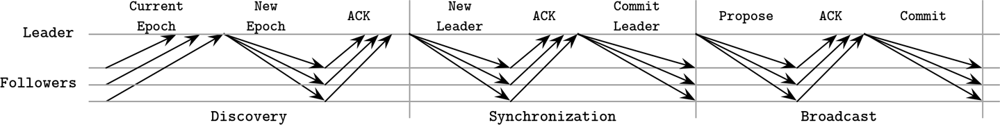

###### Figure 14-2. ZAB protocol summary

The safety of this protocol is guaranteed if followers ensure they accept proposals only from the leader of the established epoch. Two processes may *attempt* to get elected, but only one of them can win and establish itself as an epoch leader. It is also assumed that processes perform the prescribed steps in good faith and follow the protocol.

Both the leader and followers rely on heartbeats to determine the liveness of the remote processes. If the leader does not receive heartbeats from the quorum of followers, it steps down as a leader, and restarts the election process. Similarly, if one of the followers has determined the leader crashed, it starts a new election process.

Messages are totally ordered, and the leader will not attempt to send the next message until the message that preceded it was acknowledged. Even if some messages are received by a follower more than once, their repeated application do not produce additional side effects, as long as delivery order is followed. ZAB is able to handle multiple outstanding concurrent state changes from clients, since a unique leader will receive write requests, establish the event order, and broadcast the changes.

Total message order also allows ZAB to improve recovery efficiency. During the synchronization phase, followers respond with a highest committed proposal. The leader can simply choose the node with the highest proposal for recovery, and this can be the only node messages have to be copied from.

One of the advantages of ZAB is its efficiency: the broadcast process requires only two rounds of messages, and leader failures can be recovered from by streaming the missing messages from a single up-to-date process. Having a long-lived leader can have a positive impact on performance: we do not require additional consensus rounds to establish a history of events, since the leader can sequence them based on its local view.

# Paxos

An atomic broadcast is a problem equivalent to consensus in an asynchronous system with crash failures [\[CHANDRA96\]](app01.html#CHANDRA96), since participants have to *agree* on the message order and must be able to learn about it. You will see many similarities in both motivation and implementation between atomic broadcast and consensus algorithms.

Probably the most widely known consensus algorithm is *Paxos*. It was first introduced by Leslie Lamport in “The Part-Time Parliament” paper [\[LAMPORT98\]](app01.html#LAMPORT98). In this paper, consensus is described in terms of terminology inspired by the legislative and voting process on the Aegian island of Paxos. In 2001, the author released a follow-up paper titled “Paxos Made Simple” [\[LAMPORT01\]](app01.html#LAMPORT01) that introduced simpler terms, which are now commonly used to explain this algorithm.

Participants in Paxos can take one of three roles: *proposers*, *acceptors*, or *learners*:

Proposers  
Receive values from clients, create proposals to accept these values, and attempt to collect votes from acceptors.

Acceptors  
Vote to accept or reject the values proposed by the proposer. For fault tolerance, the algorithm requires the presence of multiple acceptors, but for liveness, only a quorum (majority) of acceptor votes is required to accept the proposal.

Learners  
Take the role of replicas, storing the outcomes of the accepted proposals.

Any participant can take any role, and most implementations colocate them: a single process can simultaneously be a proposer, an acceptor, and a learner.

Every proposal consists of a *value*, proposed by the client, and a unique monotonically increasing proposal number. This number is then used to ensure a total order of executed operations and establish happened-before/after relationships among them. Proposal numbers are often implemented using an `(id, timestamp)` pair, where node IDs are also comparable and can be used to break ties for timestamps.

## Paxos Algorithm

The Paxos algorithm can be generally split into two phases: *voting* (or *propose* phase) and *replication*. During the voting phase, proposers compete to establish their leadership. During replication, the proposer distributes the value to the acceptors.

The proposer is an initial point of contact for the client. It receives a value that should be decided upon, and attempts to collect votes from the quorum of acceptors. When this is done, acceptors distribute the information about the agreed value to the learners, ratifying the result. Learners increase the replication factor of the value that’s been agreed on.

Only one proposer can collect the majority of votes. Under some circumstances, votes may get split evenly between the proposers, and neither one of them will be able to collect a majority during this round, forcing them to restart. We discuss this and other scenarios of competing proposers in “Failure Scenarios”.

During the propose phase, the *proposer* sends a `Prepare(n)` message (where `n` is a proposal number) to a majority of acceptors and attempts to collect their votes.

When the *acceptor* receives the prepare request, it has to respond, preserving the following invariants [\[LAMPORT01\]](app01.html#LAMPORT01):

- If this acceptor hasn’t responded to a prepare request with a higher sequence number yet, it *promises* that it will not accept any proposal with a lower sequence number.

- If this acceptor has already accepted (received an `Accept!(m,v`_(`accepted`)`)` message) any other proposal earlier, it responds with a `Promise(m, v`_(`accepted`)`)` message, notifying the proposer that it has already accepted the proposal with a sequence number `m`.

- If this acceptor has already responded to a prepare request with a higher sequence number, it notifies the proposer about the existence of a higher-numbered proposal.

- Acceptor can respond to more than one prepare request, as long as the later one has a higher sequence number .

During the replication phase, after collecting a majority of votes, the *proposer* can start the replication, where it commits the proposal by sending acceptors an `Accept!(n, v)` message with value `v` and proposal number `n`. `v` is the value associated with the highest-numbered proposal among the responses it received from acceptors, or any value of its own if their responses did not contain old accepted proposals.

The *acceptor* accepts the proposal with a number `n`, unless during the propose phase it has already responded to `Prepare(m)`, where `m` is greater than `n`. If the acceptor rejects the proposal, it notifies the proposer about it by sending the highest sequence number it has seen along with the request to help the proposer catch up [\[LAMPORT01\]](app01.html#LAMPORT01).

You can see a generalized depiction of a Paxos round in Figure 14-3.

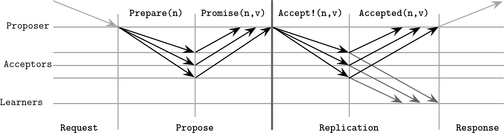

###### Figure 14-3. Paxos algorithm: normal execution

Once a consensus was reached on the value (in other words, it was accepted by at least one acceptor), future proposers have to decide on the same value to guarantee the agreement. This is why acceptors respond with the latest value they’ve accepted. If no acceptor has seen a previous value, the proposer is free to choose its own value.

A learner has to find out the value that has been decided, which it can know after receiving notification from the majority of acceptors. To let the learner know about the new value as soon as possible, acceptors can notify it about the value as soon as they accept it. If there’s more than one learner, each acceptor will have to notify each learner. One or more learners can be *distinguished*, in which case it will notify other learners about accepted values.

In summary, the goal of the first algorithm phase is to establish a leader for the round and understand which value is going to be accepted, allowing the leader to proceed with the second phase: broadcasting the value. For the purpose of the base algorithm, we assume that we have to perform both phases every time we’d like to decide on a value. In practice, we’d like to reduce the number of steps in the algorithm, so we allow the proposer to propose more than one value. We discuss this in more detail later in “Multi-Paxos”.

## Quorums in Paxos

Quorums are used to make sure that *some* of the participants can fail, but we still can proceed as long as we can collect votes from the alive ones. A *quorum* is the *minimum* number of votes required for the operation to be performed. This number usually constitutes a *majority* of participants. The main idea behind quorums is that even if participants fail or happen to be separated by the network partition, there’s at least one participant that acts as an arbiter, ensuring protocol correctness.

Once a sufficient number of participants accept the proposal, the value is guaranteed to be accepted by the protocol, since any two majorities have at least one participant in common.

Paxos guarantees safety in the presence of any number of failures. There’s no configuration that can produce incorrect or inconsistent states since this would contradict the definition of consensus.

Liveness is guaranteed in the presence of `f` failed processes. For that, the protocol requires `2f + 1` processes in total so that, if `f` processes happen to fail, there are still `f + 1` processes able to proceed. By using quorums, rather than requiring the presence of all processes, Paxos (and other consensus algorithms) guarantee results even when `f` process failures occur. In “Flexible Paxos”, we talk about quorums in slightly different terms and describe how to build protocols requiring quorum intersection between algorithm *steps* only.

###### Tip

It is important to remember that quorums only describe the blocking properties of the system. To guarantee safety, for each step we have to wait for responses from *at least* a quorum of nodes. We can send proposals and accept commands to more nodes; we just do not have to wait for their responses to proceed. We may send messages to more nodes (some systems use *speculative execution*: issuing redundant queries that help to achieve the required response count in case of node failures), but to guarantee liveness, we can proceed as soon as we hear from the quorum.

## Failure Scenarios

Discussing distributed algorithms gets particularly interesting when failures are discussed. One of the failure scenarios, demonstrating fault tolerance, is when the proposer fails during the second phase, before it is able to broadcast the value to all the acceptors (a similar situation can happen if the proposer is alive but is slow or cannot communicate with some acceptors). In this case, the new proposer may pick up and commit the value, distributing it to the other participants.

Figure 14-4 shows this situation:

- Proposer `P`_(`1`) goes through the election phase with a proposal number `1`, but fails after sending the value `V1` to just one acceptor `A`_(`1`).

- Another proposer `P`_(`2`) starts a new round with a higher proposal number `2`, collects a quorum of acceptor responses (`A`_(`1`) and `A`_(`2`) in this case), and proceeds by committing the *old* value `V1`, proposed by `P`_(`1`).

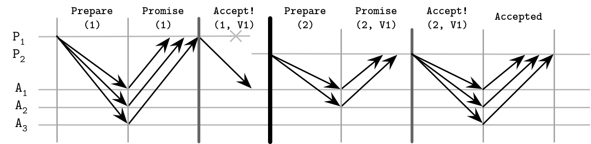

###### Figure 14-4. Paxos failure scenario: proposer failure, deciding on the old value

Since the algorithm state is replicated to multiple nodes, proposer failure does not result in failure to reach a consensus. If the current proposer fails after even a single acceptor `A`_(`1`) has accepted the value, its proposal *can* be picked by the next proposer. This also implies that all of it may happen without the original proposer knowing about it.

In a client/server application, where the client is connected only to the original proposer, this might lead to situations where the client doesn’t know about the result of the Paxos round execution.^(1)

However, other scenarios are possible, too, as Figure 14-5 shows. For example:

- `P`_(`1`) has failed just like in the previous example, after sending the value `V1` only to `A`_(`1`).

- The next proposer, `P`_(`2`), starts a new round with a higher proposal number `2`, and collects a quorum of acceptor responses, but this time `A`_(`2`) and `A`_(`3`) are first to respond. After collecting a quorum, `P`_(`2`) commits *its own value* despite the fact that theoretically there’s a different committed value on `A`_(`1`).

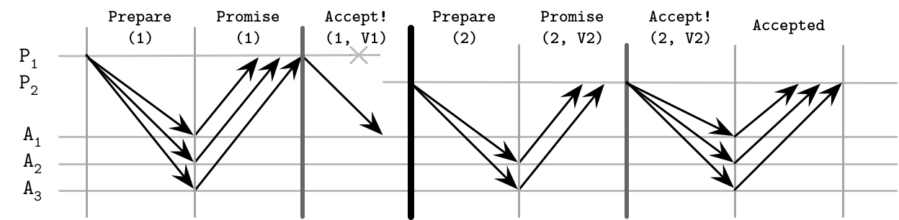

###### Figure 14-5. Paxos failure scenario: proposer failure, deciding on the new value

There’s one more possibility here, shown in Figure 14-6:

- Proposer `P`_(`1`) fails after only one acceptor `A`_(`1`) accepts the value `V1`. `A`_(`1`) fails shortly after accepting the proposal, before it can notify the next proposer about its value.

- Proposer `P`_(`2`), which started the round after `P`_(`1`) failed, does not overlap with `A`_(`1`) and proceeds to commit its value instead.

- Any proposer that comes *after* this round that will overlap with `A`_(`1`), will ignore `A`_(`1`)’s value and choose a more recent accepted proposal instead.

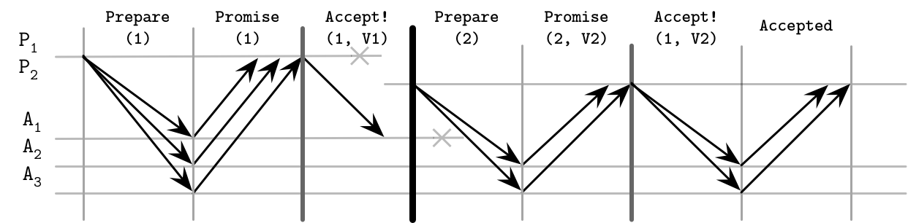

###### Figure 14-6. Paxos failure scenario: proposer failure, followed by the acceptor failure

Another failure scenario is when two or more proposers start competing, each trying to get through the propose phase, but keep failing to collect a majority because the other one beat them to it.

While acceptors promise not to accept any proposals with a lower number, they still may respond to multiple prepare requests, as long as the later one has a higher sequence number. When a proposer tries to commit the value, it might find that acceptors have already responded to a prepare request with a higher sequence number. This may lead to multiple proposers constantly retrying and preventing each other from further progress. This problem is usually solved by incorporating a random backoff, which eventually lets one of the proposers proceed while the other one sleeps.

The Paxos algorithm can tolerate acceptor failures, but only if there are still enough acceptors alive to form a majority.

## Multi-Paxos

So far we discussed the classic Paxos algorithm, where we pick an arbitrary proposer and attempt to start a Paxos round. One of the problems with this approach is that a propose round is required for each replication round that occurs in the system. Only after the proposer is established for the round, which happens after a majority of acceptors respond with a `Promise` to the proposer’s `Prepare`, can it start the replication. To avoid repeating the propose phase and let the proposer reuse its recognized position, we can use Multi-Paxos, which introduces the concept of a *leader*: a *distinguished* *proposer* [\[LAMPORT01\]](app01.html#LAMPORT01). This is a crucial addition, significantly improving algorithm efficiency.

Having an established leader, we can skip the propose phase and proceed straight to replication: distributing a value and collecting acceptor acknowledgments.

In the classic Paxos algorithm, reads can be implemented by running a Paxos round that would collect any values from incomplete rounds if they’re present. This has to be done because the last known proposer is not guaranteed to hold the most recent data, since there might have been a different proposer that has modified state without the proposer knowing about it.

A similar situation may occur in Multi-Paxos: we’re trying to perform a read from the known leader *after* the other leader is already elected, returning stale data, which contradicts the linearizability guarantees of consensus. To avoid that and guarantee that no other process can successfully submit values, some Multi-Paxos implementations use *leases*. The leader periodically contacts the participants, notifying them that it is still alive, effectively prolonging its lease. Participants have to respond and allow the leader to continue operation, promising that they will not accept proposals from other leaders for the period of the lease [\[CHANDRA07\]](app01.html#CHANDRA07).

Leases are not a correctness guarantee, but a performance optimization that allows reads from the active leader without collecting a quorum. To guarantee safety, leases rely on the bounded clock synchrony between the participants. If their clocks drift too much and the leader assumes its lease is still valid while other participants think its lease has expired, linearizability *cannot* be guaranteed.

Multi-Paxos is sometimes described as a *replicated log* of operations applied to some structure. The algorithm is oblivious to the semantics of this structure and is only concerned with consistently replicating values that will be appended to this log. To preserve the state in case of process crashes, participants keep a durable log of received messages.

To prevent a log from growing indefinitely large, its contents should be applied to the aforementioned structure. After the log contents are synchronized with a primary structure, creating a snapshot, the log can be truncated. Log and state snapshots should be mutually consistent, and snapshot changes should be applied atomically with truncation of the log segment [\[CHANDRA07\]](app01.html#CHANDRA07).

We can think of single-decree Paxos as a *write-once register*: we have a slot where we can put a value, and as soon as we’ve written the value there, no subsequent modifications are possible. During the first step, proposers compete for ownership of the register, and during the second phase, one of them writes the value. At the same time, Multi-Paxos can be thought of as an append-only log, consisting of a sequence of such values: we can write one value at a time, all values are strictly ordered, and we cannot modify already written values [\[RYSTSOV16\]](app01.html#RYSTSOV16). There are examples of consensus algorithms that offer collections of read-modify-write registers and use state sharing rather than replicated state machines, such as Active Disk Paxos [\[CHOCKLER15\]](app01.html#CHOCKLER15) and CASPaxos [\[RYSTSOV18\]](app01.html#RYSTSOV18).

## Fast Paxos

We can reduce the number of round-trips by one, compared to the classic Paxos algorithm, by letting *any* proposer contact acceptors directly rather than going through the leader. For this, we need to increase the quorum size to `2f + 1` (where `f` is the number of processes allowed to fail), compared to `f + 1` in classic Paxos, and a total number of acceptors to `3f + 1` [\[JUNQUEIRA07\]](app01.html#JUNQUEIRA07). This optimization is called *Fast Paxos* [\[LAMPORT06\]](app01.html#LAMPORT06).

The classic Paxos algorithm has a condition, where during the replication phase, the proposer can pick any value it has collected during the propose phase. Fast Paxos has two types of rounds: *classic*, where the algorithm proceeds the same way as the classic version, and *fast*, where it allows acceptors to accept other values.

While describing this algorithm, we will refer to the proposer that has collected a sufficient number of responses during the propose phase as a *coordinator*, and reserve term *proposer* for all other proposers. Some Fast Paxos descriptions say that *clients* can contact acceptors directly [\[ZHAO15\]](app01.html#ZHAO15).

In a fast round, if the coordinator is permitted to pick its own value during the replication phase, it can instead issue a special `Any` message to acceptors. Acceptors, in this case, are allowed to treat *any* proposer’s value as if it is a classic round and they received a message with this value from the coordinator. In other words, acceptors independently decide on values they receive from different proposers.

Figure 14-7 shows an example of classic and fast rounds in Fast Paxos. From the image it might look like the fast round has more execution steps, but keep in mind that in a classic round, in order to submit its value, the proposer would need to go through the coordinator to get its value committed.

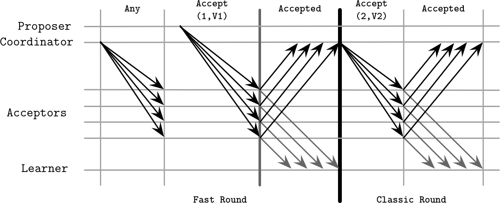

###### Figure 14-7. Fast Paxos algorithm: fast and classic rounds

This algorithm is prone to *collisions*, which occur if two or more proposers attempt to use the *fast* step and reduce the number of round-trips, and acceptors receive different values. The coordinator has to intervene and start recovery by initiating a new round.

This means that acceptors, after receiving values from different proposers, may decide on conflicting values. When the coordinator detects a conflict (value collision), it has to reinitiate a `Propose` phase to let acceptors converge to a single value.

One of the disadvantages of Fast Paxos is the increased number of round-trips and request latency on collisions if the request rate is high. [\[JUNQUEIRA07\]](app01.html#JUNQUEIRA07) shows that, due to the increased number of replicas and, subsequently, *messages* exchanged between the participants, despite a reduced number of steps, Fast Paxos can have higher latencies than its classic counterpart.

## Egalitarian Paxos

Using a distinguished proposer as a leader makes a system prone to failures: as soon as the leader fails, the system has to elect a new one before it can proceed with further steps. Another problem is that having a leader can put a disproportionate load on it, impairing system performance.

###### Note

One of the ways to avoid putting an entire system load on the leader is *partitioning*. Many systems split the range of possible values into smaller segments and allow a part of the system to be responsible for a specific range without having to worry about the other parts. This helps with availability (by isolating failures to a single partition and preventing propagation to other parts of the system), performance (since segments serving different values are nonoverlapping), and scalability (since we can scale the system by increasing the number of partitions). It is important to keep in mind that performing an operation against *multiple* partitions will require an atomic commitment.

Instead of using a leader and proposal numbers for sequencing commands, we can use a leader responsible for the commit of the *specific* command, and establish the order by looking up and setting dependencies. This approach is commonly called Egalitarian Paxos, or EPaxos [\[MORARU11\]](app01.html#MORARU11). The idea of allowing nonconflicting writes to be committed to the replicated state machine independently was first introduced in [\[LAMPORT05\]](app01.html#LAMPORT05) and called Generalized Paxos. EPaxos is a first implementation of Generalized Paxos.

EPaxos attempts to offer benefits of both the classic Paxos algorithm and Multi-Paxos. Classic Paxos offers high availability, since a leader is established during each round, but has a higher message complexity. Multi-Paxos offers high throughput and requires fewer messages, but a leader may become a bottleneck.

EPaxos starts with a *Pre-Accept* phase, during which a process becomes a leader for the specific proposal. Every proposal has to include:

Dependencies  
All commands that potentially interfere with a current proposal, but are not necessarily already committed.

A sequence number  
This breaks cycles between the dependencies. Set it with a value larger than any sequence number of the known dependencies.

After collecting this information, it forwards a `Pre-Accept` message to a *fast quorum* of replicas. A fast quorum is `⌈3f/4⌉` replicas, where `f` is the number of tolerated failures.

Replicas check their local command logs, update the proposal dependencies based on their view of potentially conflicting proposals, and send this information back to the leader. If the leader receives responses from a fast quorum of replicas, and their dependency lists are in agreement with each other and the leader itself, it can commit the command.

If the leader does not receive enough responses or if the command lists received from the replicas differ and contain interfering commands, it updates its proposal with a new dependency list and a sequence number. The new dependency list is based on previous replica responses and combines *all* collected dependencies. The new sequence number has to be larger than the highest sequence number seen by the replicas. After that, the leader sends the new, updated command to `⌊f/2⌋ + 1` replicas. After this is done, the leader can finally commit the proposal.

Effectively, we have two possible scenarios:

Fast path  
When dependencies match and the leader can safely proceed with the commit phase with only a *fast quorum* of replicas.

Slow path  
When there’s a disagreement between the replicas, and their command lists have to be updated before the leader can proceed with a commit.

Figure 14-8 shows these scenarios—`P`_(`1`) initiating a fast path run, and `P`_(`5`) initiating a slow path run:

- `P`_(`1`) starts with proposal number `1` and no dependencies, and sends a `PreAccept(1, ∅)` message. Since the command logs of `P`_(`2`) and `P`_(`3`) are empty, `P`_(`1`) can proceed with a commit.

- `P`_(`5`) creates a proposal with sequence number `2`. Since its command log is empty by that point, it also declares no dependencies and sends a `PreAccept(2, ∅)` message. `P`_(`4`) is not aware of the committed proposal `1`, but `P`_(`3`) notifies `P`_(`5`) about the conflict and sends its command log: `{1}`.

- `P`_(`5`) updates its local dependency list and sends a message to make sure replicas have the same dependencies: `Accept(2,{1})`. As soon as the replicas respond, it can commit the value.

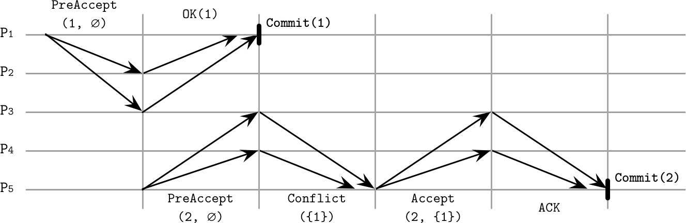

###### Figure 14-8. EPaxos algorithm run

Two commands, `A` and `B`, interfere only if their execution order matters; in other words, if executing `A` before `B` and executing `B` before `A` produce different results.

Commit is done by responding to the client and asynchronously notifying replicas with a `Commit` message. Commands are executed *after* they’re committed.

Since dependencies are collected during the Pre-Accept phase, by the time requests are executed, the command order is already established and no command can suddenly appear somewhere in-between: it can only get appended *after* the command with the largest sequence number.

To execute a command, replicas build a dependency graph and execute all commands in a reverse dependency order. In other words, before a command can be executed, all its dependencies (and, subsequently, all their dependencies) have to be executed. Since only interfering commands have to depend on each other, this situation should be relatively rare for most workloads [\[MORARU13\]](app01.html#MORARU13).

Similar to Paxos, EPaxos uses proposal numbers, which prevent stale messages from being propagated. Sequence numbers consist of an *epoch* (identifier of the current cluster configuration that changes when nodes leave and join the cluster), a monotonically incremented node-local counter, and a replica ID. If a replica receives a proposal with a sequence number lower than one it has already seen, it negatively acknowledges the proposal, and sends the highest sequence number and an updated command list known to it in response.

## Flexible Paxos

A quorum is usually defined as a majority of processes. By definition, we have an *intersection* between two quorums no matter how we pick nodes: there’s always at least one node that can break ties.

We have to answer two important questions:

- Is it necessary to contact the *majority* of servers during *every* execution step?

- Do *all* quorums have to intersect? In other words, does a quorum we use to pick a distinguished proposer (first phase), a quorum we use to decide on a value (second phase), and every execution instance (for example, if multiple instances of the second step are executed concurrently), have to have nodes in common?

Since we’re still talking about consensus, we cannot change any safety definitions: the algorithm has to guarantee the agreement.

In Multi-Paxos, the leader election phase is infrequent, and the distinguished proposer is allowed to commit several values without rerunning the election phase, potentially staying in the lead for a longer period. In “Tunable Consistency”, we discussed formulae that help us to find configurations where we have intersections between the node sets. One of the examples was to wait for just one node to acknowledge the write (and let the requests to the rest of nodes finish asynchronously), and read from *all* the nodes. In other words, as long as we keep `R + W > N`, there’s at least one node in common between read and write sets.

Can we use a similar logic for consensus? It turns out that we can, and in Paxos we only require the group of nodes from the first phase (that elects a leader) to overlap with the group from the second phase (that participates in accepting proposals).

In other words, a quorum doesn’t have to be defined as a majority, but only as a non-empty group of nodes. If we define a total number of participants as `N`, the number of nodes required for a propose phase to succeed as `Q₁`, and the number of nodes required for the accept phase to succeed as `Q₂`, we only need to ensure that `Q₁ + Q₂ > N`. Since the second phase is usually more common than the first one, `Q₂` can contain only `N/2` acceptors, as long as `Q₁` is adjusted to be correspondingly larger (`Q₁ = N - Q₂ + 1`). This finding is an important observation crucial for understanding consensus. The algorithm that uses this approach is called *Flexible Paxos* [\[HOWARD16\]](app01.html#HOWARD16).

For example, if we have five acceptors, as long as we require collecting votes from four of them to win the election round, we can allow the leader to wait for responses from two nodes during the replication stage. Moreover, since there’s an overlap between *any* subset consisting of two acceptors with the leader election quorum, we can submit proposals to disjoint sets of acceptors. Intuitively, this works because whenever a new leader is elected without the current one being aware of it, there will always be at least one acceptor that knows about the existence of the new leader.

Flexible Paxos allows trading availability for latency: we reduce the number of nodes participating in the second phase but have to collect more votes, requiring more participants to be available during the leader election phase. The good news is that this configuration can continue the replication phase and tolerate failures of up to `N - Q₂` nodes, as long as the current leader is stable and a new election round is not required.

Another Paxos variant using the idea of intersecting quorums is Vertical Paxos. Vertical Paxos distinguishes between read and write quorums. These quorums must intersect. A leader has to collect a smaller read quorum for one or more lower-numbered proposals, and a larger write quorum for its own proposal [\[LAMPORT09\]](app01.html#LAMPORT09). [\[LAMPSON01\]](app01.html#LAMPSON01) also distinguishes between the *out* and *decision* quorums, which translate to prepare and accept phases, and gives a quorum definition similar to Flexible Paxos.

## Generalized Solution to Consensus

Paxos might sometimes be a bit difficult to reason about: multiple roles, steps, and all the possible variations are hard to keep track of. But we can think of it in simpler terms. Instead of splitting roles between the participants and having decision rounds, we can use a simple set of concepts and rules to achieve guarantees of a single-decree Paxos. We discuss this approach only briefly as this is a relatively new development [\[HOWARD19\]](app01.html#HOWARD19)—it’s important to know, but we’ve yet to see its implementations and practical applications.

We have a client and a set of servers. Each server has multiple *registers*. A register has an index identifying it, can be written only once, and it can be in one of three states: unwritten, containing a *value*, and containing *nil* (a special empty value).

Registers with the same index located on different servers form a *register set*. Each register set can have one or more quorums. Depending on the state of the registers in it, a quorum can be in one of the *undecided* (`Any` and `Maybe v`), or *decided* (`None` and `Decided v`) states:

`Any`  
Depending on future operations, this quorum set can decide on any value.

`Maybe v`  
If this quorum reaches a decision, its decision can only be `v`.

`None`  
This quorum cannot decide on the value.

`Decided v`  
This quorum has decided on the value `v`.

The client exchanges messages with the servers and maintains a state table, where it keeps track of values and registers, and can infer decisions made by the quorums.

To maintain correctness, we have to limit how clients can interact with servers and which values they may write and which they may not. In terms of reading values, the client can output the decided value only if it has read it from the quorum of servers in the same register set.

The writing rules are slightly more involved because to guarantee algorithm safety, we have to preserve several invariants. First, we have to make sure that the client doesn’t just come up with new values: it is allowed to write a specific value to the register only if it has received it as input or has read it from a register. Clients cannot write values that allow different quorums in the same register to decide on different values. Lastly, clients cannot write values that override previous decisions made in the previous register sets (decisions made in register sets up to `r - 1` have to be `None`, `Maybe v`, or `Decided v`).

### Generalized Paxos algorithm

Putting all these rules together, we can implement a generalized Paxos algorithm that achieves consensus over a single value using write-once registers [\[HOWARD19\]](app01.html#HOWARD19). Let’s say we have three servers `[S0, S1, S2]`, registers `[R0, R1, …]`, and clients `[C0, C1, ...]`, where the client can only write to the assigned subset of registers. We use simple majority quorums for all registers (`{S0, S1}`, `{S0, S2}`, `{S1, S2}`).

The decision process here consists of two phases. The first phase ensures that it is safe to write a value to the register, and the second phase writes the value to the register:

During phase 1  
The client checks if the register it is about to write is unwritten by sending a `P1`_(`A`)`(register)` command to the server. If the register is unwritten, all registers up to `register - 1` are set to `nil`, which prevents clients from writing to previous registers. The server responds with a set of registers written so far. If it receives responses from the majority of servers, the client chooses either the nonempty value from the register with the largest index or its own value in case no value is present. Otherwise, it restarts the first phase.

During phase 2  
The client notifies all servers about the value it has picked during the first phase by sending them `P2`_(`A`)`(register, value)`. If the majority of servers respond to this message, it can output the decision value. Otherwise, it starts again from phase 1.

Figure 14-9 shows this generalization of Paxos (adapted from [\[HOWARD19\]](app01.html#HOWARD19)). Client `C0` tries to commit value `V`. During the first step, its state table is empty, and servers `S0` and `S1` respond with the empty register set, indicating that no registers were written so far. During the second step, it can submit its value `V`, since no other value was written.

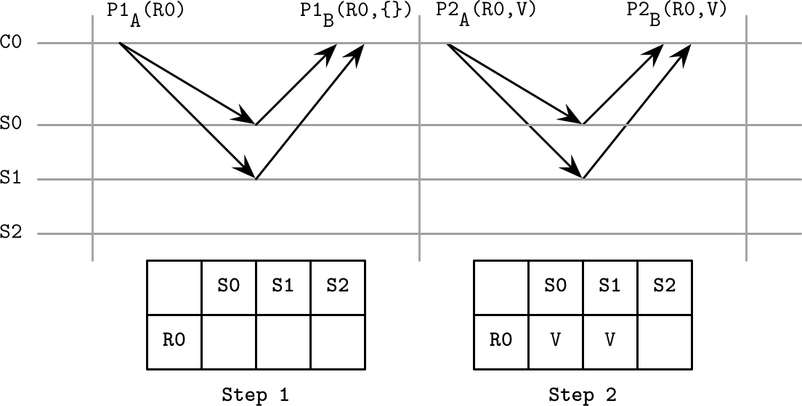

###### Figure 14-9. Generalization of Paxos

At that point, any other client can query servers to find out the current state. Quorum `{S0, S1}` has reached `Decided A` state, and quorums `{S0, S2}` and `{S1, S2}` have reached the `Maybe V` state for `R0`, so `C1` chooses the value `V`. At that point, no client can decide on a value other than `V`.

This approach helps to understand the semantics of Paxos. Instead of thinking about the state from the perspective of interactions of remote actors (e.g., a proposer finding out whether or not an acceptor has already accepted a different proposal), we can think in terms of the last known state, making our decision process simple and removing possible ambiguities. Immutable state and message passing can also be easier to implement correctly.

We can also draw parallels with original Paxos. For example, in a scenario in which the client finds that one of the previous register sets has the `Maybe V` decision, it picks up `V` and attempts to commit it again, which is similar to how a proposer in Paxos can propose the value after the failure of the previous proposer that was able to commit the value to at least one acceptor. Similarly, if in Paxos leader conflicts are resolved by restarting the vote with a higher proposal number, in the generalized algorithm any unwritten lower-ranked registers are set to `nil`.

# Raft

Paxos was *the* consensus algorithm for over a decade, but in the distributed systems community it’s been known as difficult to reason about. In 2013, a new algorithm called Raft appeared. The researchers who developed it wanted to create an algorithm that’s easy to understand and implement. It was first presented in a paper titled “In Search of an Understandable Consensus Algorithm” [\[ONGARO14\]](app01.html#ONGARO14).

There’s enough inherent complexity in distributed systems, and having simpler algorithms is very desirable. Along with a paper, the authors have released a reference implementation called [LogCabin](https://databass.dev/links/69) to resolve possible ambiguities and help future implementors to gain a better understanding.

Locally, participants store a log containing the sequence of commands executed by the state machine. Since inputs that processes receive are identical and logs contain the same commands in the same order, applying these commands to the state machine guarantees the same output. Raft simplifies consensus by making the concept of leader a first-class citizen. A leader is used to coordinate state machine manipulation and replication. There are many similarities between Raft and atomic broadcast algorithms, as well as Multi-Paxos: a single leader emerges from replicas, makes atomic decisions, and establishes the message order.

Each participant in Raft can take one of three roles:

Candidate  
Leadership is a temporary condition, and any participant can take this role. To become a leader, the node first has to transition into a candidate state, and attempt to collect a majority of votes. If a candidate neither wins nor loses the election (the vote is split between multiple candidates and none of them has a majority of votes), the new term is slated and election restarts.

Leader  
A current, temporary cluster leader that handles client requests and interacts with a replicated state machine. The leader is elected for a period called a *term*. Each term is identified by a monotonically increasing number and may continue for an arbitrary time period. A new leader is elected if the current one crashes, becomes unresponsive, or is suspected by other processes to have failed, which can happen because of network partitions and message delays.

Follower  
A passive participant that persists log entries and responds to requests from the leader and candidates. Follower in Raft is a role similar to acceptor *and* learner from Paxos. Every process begins as a follower.

To guarantee global partial ordering without relying on clock synchronization, time is divided into *terms* (also called epoch), during which the leader is unique and stable. Terms are monotonically numbered, and each command is uniquely identified by the term number and the message number within the term [\[HOWARD14\]](app01.html#HOWARD14).

It may happen that different participants disagree on which term is *current*, since they can find out about the new term at different times, or could have missed the leader election for one or multiple terms. Since each message contains a term identifier, if one of the participants discovers that its term is out-of-date, it updates the term to the higher-numbered one [\[ONGARO14\]](app01.html#ONGARO14). This means that there *may be* several terms in flight at any given point in time, but the higher-numbered one wins in case of a conflict. A node updates the term only if it starts a new election process or finds out that its term is out-of-date.

On startup, or whenever a follower doesn’t receive messages from the leader and suspects that it has crashed, it starts the leader election process. A participant attempts to become a leader by transitioning into the candidate state and collecting votes from the majority of nodes.

Figure 14-10 shows a sequence diagram representing the main components of the Raft algorithm:

Leader election  
Candidate `P1` sends a `RequestVote` message to the other processes. This message includes the candidate’s term, the last term known by it, and the ID of the last log entry it has observed. After collecting a majority of votes, the candidate is successfully elected as a leader for the term. Each process can give its vote to at most one candidate.

Periodic heartbeats  
The protocol uses a heartbeat mechanism to ensure the liveness of participants. The leader periodically sends heartbeats to all followers to maintain its term. If a follower doesn’t receive new heartbeats for a period called an *election timeout*, it assumes that the leader has failed and starts a new election.

Log replication / broadcast  
The leader can repeatedly append new values to the replicated log by sending `AppendEntries` messages. The message includes the leader’s term, index, and term of the log entry that immediately precedes the ones it’s currently sending, and *one or more* entries to store.

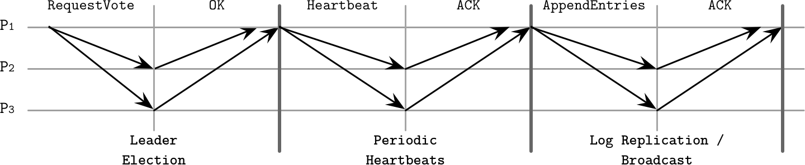

###### Figure 14-10. Raft consensus algorithm summary

## Leader Role in Raft

A leader can be elected only from the nodes holding all committed entries: if during the election, the follower’s log information is more up-to-date (in other words, has a higher term ID, or a longer log entry sequence, if terms are equal) than the candidate’s, its vote is denied.

To win the vote, a candidate has to collect a majority of votes. Entries are always replicated in order, so it is always enough to compare IDs of the latest entries to understand whether or not one of the participants is up-to-date.

Once elected, the leader has to accept client requests (which can also be forwarded to it from other nodes) and replicate them to the followers. This is done by appending the entry to its log and sending it to all the followers in parallel.

When a follower receives an `AppendEntries` message, it appends the entries from the message to the local log, and acknowledges the message, letting the leader know that it was persisted. As soon as enough replicas send their acknowledgments, the entry is considered committed and is marked correspondingly in the leader log.

Since only the most up-to-date candidates can become a leader, followers never have to bring the leader up-to-date, and log entries are only flowing from leader to follower and not vice versa.

Figure 14-11 shows this process:

- a\) A new command `x = 8` is appended to the leader’s log.

- b\) Before the value can be committed, it has to be replicated to the majority of participants.

- c\) As soon as the leader is done with replication, it commits the value locally.

- d\) The commit decision is replicated to the followers.

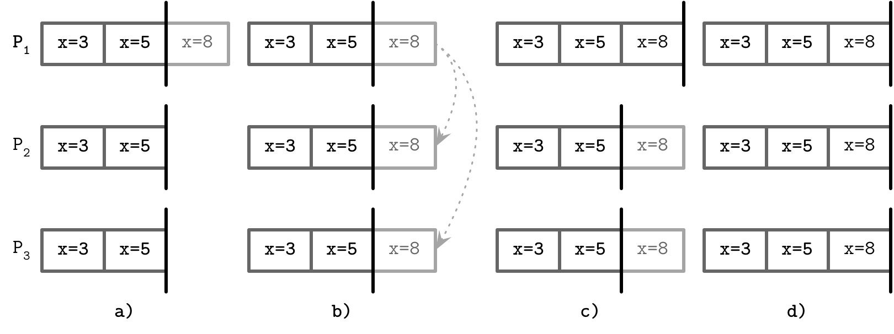

###### Figure 14-11. Procedure of a commit in Raft with `P`_(`1`) as a leader

Figure 14-12 shows an example of a consensus round where `P₁` is a leader, which has the most recent view of the events. The leader proceeds by replicating the entries to the followers, and committing them after collecting acknowledgments. Committing an entry also commits all entries preceding it in the log. Only the leader can make a decision on whether or not the entry can be committed. Each log entry is marked with a term ID (a number in the top-right corner of each log entry box) and a log index, identifying its position in the log. Committed entries are guaranteed to be replicated to the quorum of participants and are safe to be applied to the state machine in the order they appear in the log.

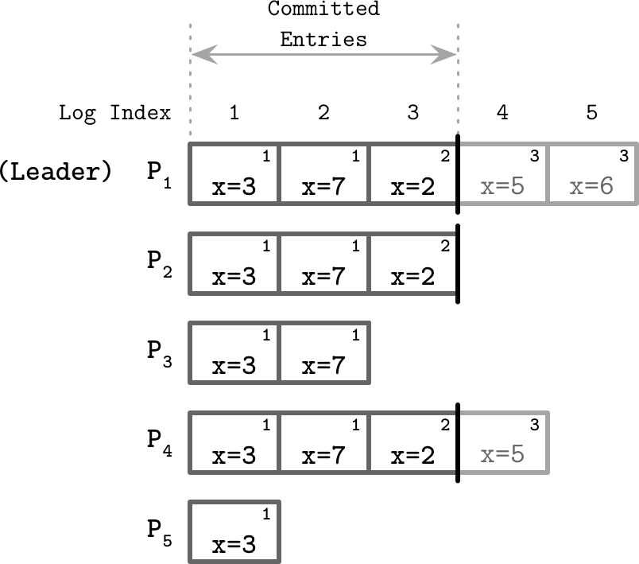

###### Figure 14-12. Raft state machine

## Failure Scenarios

When multiple followers decide to become candidates, and no candidate can collect a majority of votes, the situation is called a *split vote*. Raft uses randomized timers to reduce the probability of multiple subsequent elections ending up in a split vote. One of the candidates can start the next election round earlier and collect enough votes, while the others sleep and give way to it. This approach speeds up the election without requiring any additional coordination between candidates.

Followers may be down or slow to respond, and the leader has to make the best effort to ensure message delivery. It can try sending messages again if it doesn’t receive an acknowledgment within the expected time bounds. As a performance optimization, it can send multiple messages in parallel.

Since entries replicated by the leader are uniquely identified, repeated message delivery is guaranteed not to break the log order. Followers deduplicate messages using their sequence IDs, ensuring that double delivery has no undesired side effects.

Sequence IDs are also used to ensure the log ordering. A follower rejects a higher-numbered entry if the ID and term of the entry that immediately precedes it, sent by the leader, do not match the highest entry according to its own records. If entries in two logs on different replicas have the same term and the same index, they store the same command and all entries that precede them are the same.

Raft guarantees to never show an uncommitted message as a committed one, but, due to network or replica slowness, already committed messages can still be seen as *in progress*, which is a rather harmless property and can be worked around by retrying a client command until it is finally committed [\[HOWARD14\]](app01.html#HOWARD14).

For failure detection, the leader has to send heartbeats to the followers. This way, the leader maintains its term. When one of the nodes notices that the current leader is down, it attempts to initiate the election. The newly elected leader has to restore the state of the cluster to the last known up-to-date log entry. It does so by finding a *common ground* (the highest log entry on which both the leader and follower agree), and ordering followers to *discard* all (uncommitted) entries appended after this point. It then sends the most recent entries from its log, overwriting the followers’ history. The leader’s own log records are never removed or overwritten: it can only append entries to its own log.

Summing up, the Raft algorithm provides the following guarantees:

- Only one leader can be elected at a time for a given term; no two leaders can be active during the same term.

- The leader does not remove or reorder its log contents; it only appends new messages to it.

- Committed log entries are guaranteed to be present in logs for subsequent leaders and cannot get reverted, since before the entry is committed it is known to be replicated by the leader.

- All messages are identified uniquely by the message and term IDs; neither current nor subsequent leaders can reuse the same identifier for the different entry.

Since its appearance, Raft has become very popular and is currently used in many databases and other distributed systems, including [CockroachDB](https://databass.dev/links/70), [Etcd](https://databass.dev/links/71), and [Consul](https://databass.dev/links/72). This can be attributed to its simplicity, but also may mean that Raft lives up to the promise of being a reliable consensus algorithm.

# Byzantine Consensus

All the consensus algorithms we have been discussing so far assume non-Byzantine failures (see “Arbitrary Faults”). In other words, nodes execute the algorithm in “good faith” and do not try to exploit it or forge the results.

As we will see, this assumption allows achieving consensus with a smaller number of available participants and with fewer round-trips required for a commit. However, distributed systems are sometimes deployed in potentially adversarial environments, where the nodes are not controlled by the same entity, and we need algorithms that can ensure a system can function correctly even if some nodes behave erratically or even maliciously. Besides ill intentions, Byzantine failures can also be caused by bugs, misconfiguration, hardware issues, or data corruption.

Most Byzantine consensus algorithms require `N`^(`2`) messages to complete an algorithm step, where `N` is the size of the quorum, since each node in the quorum has to communicate with each other. This is required to cross-validate each step against other nodes, since nodes cannot rely on each other or on the leader and have to verify other nodes’ behaviors by comparing returned results with the majority responses.

We’ll only discuss one Byzantine consensus algorithm here, Practical Byzantine Fault Tolerance (PBFT) [\[CASTRO99\]](app01.html#CASTRO99). PBFT assumes independent node failures (i.e., failures can be coordinated, but the entire system cannot be taken over at once, or at least with the same exploit method). The system makes weak synchrony assumptions, like how you would expect a network to behave normally: failures may occur, but they are not indefinite and are eventually recovered from.

All communication between the nodes is encrypted, which serves to prevent message forging and network attacks. Replicas know one another’s public keys to verify identities and encrypt messages. Faulty nodes may leak information from inside the system, since, even though encryption is used, every node needs to interpret message contents to react upon them. This doesn’t undermine the algorithm, since it serves a different purpose.

## PBFT Algorithm

For PBFT to guarantee both safety and liveness, no more than `(n - 1)/3` replicas can be faulty (where `n` is the total number of participants). For a system to sustain `f` compromised nodes, it is required to have at least `n = 3f + 1` nodes. This is the case because a majority of nodes have to agree on the value: `f` replicas might be faulty, and there might be `f` replicas that are not responding but may not be faulty (for example, due to a network partition, power failure, or maintenance). The algorithm has to be able to collect enough responses from nonfaulty replicas to *still* outnumber those from the faulty ones.

Consensus properties for PBFT are similar to those of other consensus algorithms: all nonfaulty replicas have to agree both on the set of received values and their order, despite the possible failures.

To distinguish between cluster configurations, PBFT uses *views*. In each view, one of the replicas is a *primary* and the rest of them are considered *backups*. All nodes are numbered consecutively, and the index of the primary node is `v mod N`, where `v` is the view ID, and `N` is the number of nodes in the current configuration. The view can change in cases when the primary fails. Clients execute their operations against the primary. The primary broadcasts the requests to the backups, which execute the requests and send a response back to the client. The client waits for `f + 1` replicas to respond with *the same result* for any operation to succeed.

After the primary receives a client request, protocol execution proceeds in three phases:

Pre-prepare  
The primary broadcasts a message containing a view ID, a unique monotonically increasing identifier, a payload (client request), and a payload digest. Digests are computed using a strong collision-resistant hash function, and are signed by the sender. The backup accepts the message if its view matches with the primary view and the client request hasn’t been tampered with: the calculated payload digest matches the received one.

Prepare  
If the backup accepts the pre-prepare message, it enters the prepare phase and starts broadcasting `Prepare` messages, containing a view ID, message ID, and a payload digest, but without the payload itself, to all other replicas (including the primary). Replicas can move past the prepare state only if they receive `2f` prepares from *different* backups that match the message received during pre-prepare: they have to have the same view, same ID, and a digest.

Commit  
After that, the backup moves to the commit phase, where it broadcasts `Commit` messages to all other replicas and waits to collect `2f + 1` matching `Commit` messages (possibly including its own) from the other participants.

A *digest* in this case is used to reduce the message size during the prepare phase, since it’s not necessary to rebroadcast an entire payload for verification, as the digest serves as a payload summary. Cryptographic hash functions are resistant to collisions: it is difficult to produce two values that have the same digest, let alone two messages with matching digests that *make sense* in the context of the system. In addition, digests are *signed* to make sure that the digest itself is coming from a trusted source.

The number `2f` is important, since the algorithm has to make sure that at least `f + 1` nonfaulty replicas respond to the client.

Figure 14-13 shows a sequence diagram of a normal-case PBFT algorithm round: the client sends a request to `P`_(`1`), and nodes move between phases by collecting a sufficient number of matching responses from *properly behaving* peers. `P`_(`4`) may have failed or could’ve responded with unmatching messages, so its responses wouldn’t have been counted.

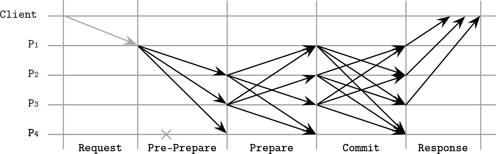

###### Figure 14-13. PBFT consensus, normal-case operation

During the prepare and commit phases, nodes communicate by sending messages to each other node and waiting for the messages from the corresponding number of other nodes, to check if they match and make sure that incorrect messages are not broadcasted. Peers cross-validate all messages so that only nonfaulty nodes can successfully commit messages. If a sufficient number of matching messages cannot be collected, the node doesn’t move to the next step.

When replicas collect enough commit messages, they notify the client, finishing the round. The client cannot be certain about whether or not execution was fulfilled correctly until it receives `f + 1` matching responses.

View changes occur when replicas notice that the primary is inactive, and suspect that it might have failed. Nodes that detect a primary failure stop responding to further messages (apart from checkpoint and view-change related ones), broadcast a view change notification, and wait for confirmations. When the primary of the new view receives `2f` view change events, it initiates a new view.

To reduce the number of messages in the protocol, clients can collect `2f + 1` matching responses from nodes that *tentatively* execute a request (e.g., after they’ve collected a sufficient number of matching `Prepared` messages). If the client cannot collect enough matching tentative responses, it retries and waits for `f + 1` nontentative responses as described previously.

Read-only operations in PBFT can be done in just one round-trip. The client sends a read request to all replicas. Replicas execute the request in their tentative states, after all ongoing state changes to the read value are committed, and respond to the client. After collecting `2f + 1` responses with the same value from different replicas, the operation completes.

## Recovery and Checkpointing

Replicas save accepted messages in a stable log. Every message has to be kept until it has been executed by at least `f + 1` nodes. This log can be used to get other replicas up to speed in case of a network partition, but recovering replicas need some means of verifying that the state they receive is correct, since otherwise recovery can be used as an attack vector.

To show that the state is correct, nodes compute a digest of the state for messages up to a given sequence number. Nodes can compare digests, verify state integrity, and make sure that messages they received during recovery add up to a correct final state. This process is too expensive to perform on every request.

After every `N` requests, where `N` is a configurable constant, the primary makes a *stable checkpoint*, where it broadcasts the latest sequence number of the latest request whose execution is reflected in the state, and the digest of this state. It then waits for `2f + 1` replicas to respond. These responses constitute a proof for this checkpoint, and a guarantee that replicas can safely discard state for all pre-prepare, prepare, commit, and checkpoint messages up to the given sequence number.

Byzantine fault tolerance is essential to understand and is used in storage systems deployed in potentially adversarial networks. Most of the time, it is enough to authenticate and encrypt internode communication, but when there’s no trust between the parts of the system, algorithms similar to PBFT have to be employed.

Since algorithms resistant to Byzantine faults impose significant overhead in terms of the number of exchanged messages, it is important to understand their use cases. Other protocols, such as the ones described in [\[BAUDET19\]](app01.html#BAUDET19) and [\[BUCHMAN18\]](app01.html#BUCHMAN18), attempt to optimize the PBFT algorithm for systems with a large number of participants.

# Summary

Consensus algorithms are one of the most interesting yet most complex subjects in distributed systems. Over the last few years, new algorithms and many implementations of the existing algorithms have emerged, which proves the rising importance and popularity of the subject.

In this chapter, we discussed the classic Paxos algorithm, and several variants of Paxos, each one improving its different properties:

Multi-Paxos  
Allows a proposer to retain its role and replicate multiple values instead of just one.

Fast Paxos  
Allows us to reduce a number of messages by using *fast* rounds, when acceptors can proceed with messages from proposers other than the established leader.

EPaxos  
Establishes event order by resolving dependencies between submitted messages.

Flexible Paxos  
Relaxes quorum requirements and only requires a quorum for the first phase (voting) to intersect with a quorum for the second phase (replication).

Raft simplifies the terms in which consensus is described, and makes leadership a first-class citizen in the algorithm. Raft separates log replication, leader election, and safety.

To guarantee consensus safety in adversarial environments, Byzantine fault-tolerant algorithms should be used; for example, PBFT. In PBFT, participants cross-validate one another’s responses and only proceed with execution steps when there’s enough nodes that obey the prescribed algorithm rules.

##### Further Reading

If you’d like to learn more about the concepts mentioned in this chapter, you can refer to the following sources:

Atomic broadcast  
Junqueira, Flavio P., Benjamin C. Reed, and Marco Serafini. “Zab: High-performance broadcast for primary-backup systems.” 2011. In *Proceedings of the 2011 IEEE/IFIP 41st International Conference on Dependable Systems & Networks (DSN ’11)*: 245-256.

Hunt, Patrick, Mahadev Konar, Flavio P. Junqueira, and Benjamin Reed. 2010. “ZooKeeper: wait-free coordination for internet-scale systems.” In *Proceedings of the 2010 USENIX conference on USENIX annual technical conference (USENIXATC’10)*: 11.

Oki, Brian M., and Barbara H. Liskov. 1988. “Viewstamped Replication: A New Primary Copy Method to Support Highly-Available Distributed Systems.” In *Proceedings of the seventh annual ACM Symposium on Principles of distributed computing (PODC ’88)*: 8-17.

Van Renesse, Robbert, Nicolas Schiper, and Fred B. Schneider. 2014. “Vive la Différence: Paxos vs. Viewstamped Replication vs. Zab.”

Classic Paxos  
Lamport, Leslie. 1998. “The part-time parliament.” *ACM Transactions on Computer Systems* 16, no. 2 (May): 133-169.

Lamport, Leslie. 2001. “Paxos made simple.” ACM SIGACT News 32, no. 4: 51-58.

Lamport, Leslie. 2005. “Generalized Consensus and Paxos.” Technical Report MSR-TR-2005-33. Microsoft Research, Mountain View, CA.

Primi, Marco. 2009. “Paxos made code: Implementing a high throughput Atomic Broadcast.” (Libpaxos code: [*https://bitbucket.org/sciascid/libpaxos/src/master/*](https://bitbucket.org/sciascid/libpaxos/src/master/).

Fast Paxos  
Lamport, Leslie. 2005. “Fast Paxos.” 14 July 2005. Microsoft Research.

Multi-Paxos  
Chandra, Tushar D., Robert Griesemer, and Joshua Redstone. 2007. “Paxos made live: an engineering perspective.” In *Proceedings of the twenty-sixth annual ACM symposium on Principles of distributed computing (PODC ’07)*: 398-407.

Van Renesse, Robbert and Deniz Altinbuken. 2015. “Paxos Made Moderately Complex.” *ACM Computing Surveys* 47, no. 3 (February): Article 42. *[*https://doi.org/10.1145/2673577*](https://doi.org/10.1145/2673577)*.

EPaxos  
Moraru, Iulian, David G. Andersen, and Michael Kaminsky. 2013. “There is more consensus in Egalitarian parliaments.” In *Proceedings of the Twenty-Fourth ACM Symposium on Operating Systems Principles (SOSP ’13)*: 358-372.

Moraru, I., D. G. Andersen, and M. Kaminsky. 2013. “A proof of correctness for Egalitarian Paxos.” Technical report, Parallel Data Laboratory, Carnegie Mellon University, Aug. 2013.

Raft  
Ongaro, Diego, and John Ousterhout. 2014. “In search of an understandable consensus algorithm.” In *Proceedings of the 2014 USENIX conference on USENIX Annual Technical Conference (USENIX ATC’14)*, Garth Gibson and Nickolai Zeldovich (Eds.): 305-320.

Howard, H. 2014. “ARC: Analysis of Raft Consensus.” Technical Report UCAM-CL-TR-857, University of Cambridge, Computer Laboratory, July 2014.

Howard, Heidi, Malte Schwarzkopf, Anil Madhavapeddy, and Jon Crowcroft. 2015. “Raft Refloated: Do We Have Consensus?” *SIGOPS Operating Systems Review* 49, no. 1 (January): 12-21. *[*https://doi.org/10.1145/2723872.2723876*](https://doi.org/10.1145/2723872.2723876)*.

Recent developments  
Howard, Heidi and Richard Mortier. 2019. “A Generalised Solution to Distributed Consensus.” 18 Feb 2019.

^(1) For example, such a situation was described in [*https://databass.dev/links/68*](https://databass.dev/links/68).