## **Chapter 1 – Introduction** 

 

The suddenness of the leap from hardware to software cannot but produce a period of anarchy

and collapse, especially in the developed countries.

—Marshall McLuhan

 

This chapter provides an overview of the evolution of the Extensible Firmware Inter-face (EFI) to the Unified Extensible Firmware Interface (UEFI) and from the Intel

Framework specifications to the UEFI Platform Initialization (PI) specifications. Note the omission of the word “Framework” from the title of the present volume. Some of

the changes that have occurred since the first edition of this book include the migra-tion of much of the Intel Framework specification content into the five volumes of the

UEFI Platform Initialization (PI) specifications, which are presently at revision 1.5 and can be found at the Web site www.uefi.org. In addition to the PI evolution from

Framework, additional capabilities have evolved in both the PI building-block speci-fications and in the UEFI specification. The UEFI specification itself has evolved to

revision 2.6 in the time since the first edition of this text, as well.

When we discuss UEFI, we need to emphasize that UEFI is a pure interface spec-

ification that does not dictate how the platform firmware is built; the “how” is rele-gated to PI. The consumers of UEFI include but are not limited to operating system

loaders, installers, adapter ROMs from boot devices, pre-OS diagnostics, utilities, and OS runtimes (for the small set of UEFI runtime services). In general, though, UEFI is

about *booting,* or passing control to a successive layer of control, namely an operating system loader, as shown in Figure 1.1. UEFI offers many interesting capabilities and

can exist as a limited runtime for some application set, in lieu of loading a full, shrink-wrapped multi-address space operating system like Microsoft Windows†, Apple OS

X†, HP-UX†, or Linux, but that is not the primary design goal.

 

DOI 10.1515/9781501505690-003

**2** \| Chapter 1 – Introduction

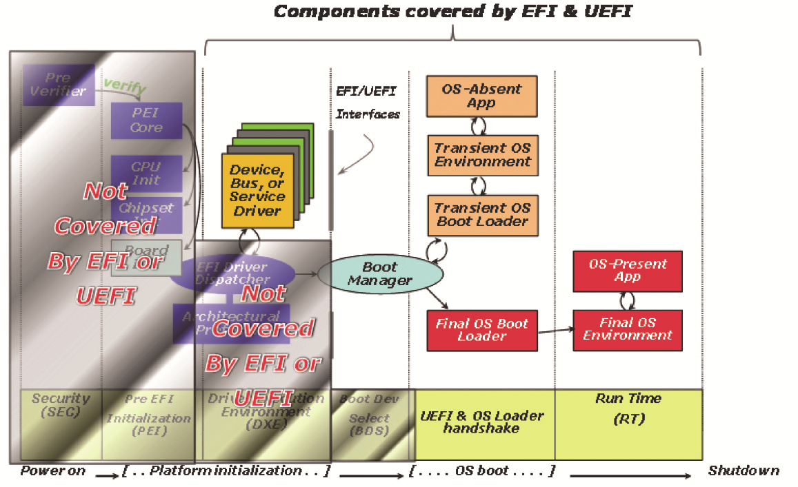

 

**Figure 1.1:** Where EFI and UEFI Fit into the Platform Boot Flow

 

PI, on the other hand, should be largely opaque to the pre-OS boot devices, operating systems, and their loaders since it covers many software aspects of platform construc-

tion that are irrelevant to those consumers. PI instead describes the phases of control from the platform reset and into the success phase of operation, including an envi-

ronment compatible with UEFI, as shown in Figure 1.2. In fact, the PI DXE component is the preferred UEFI core implementation.

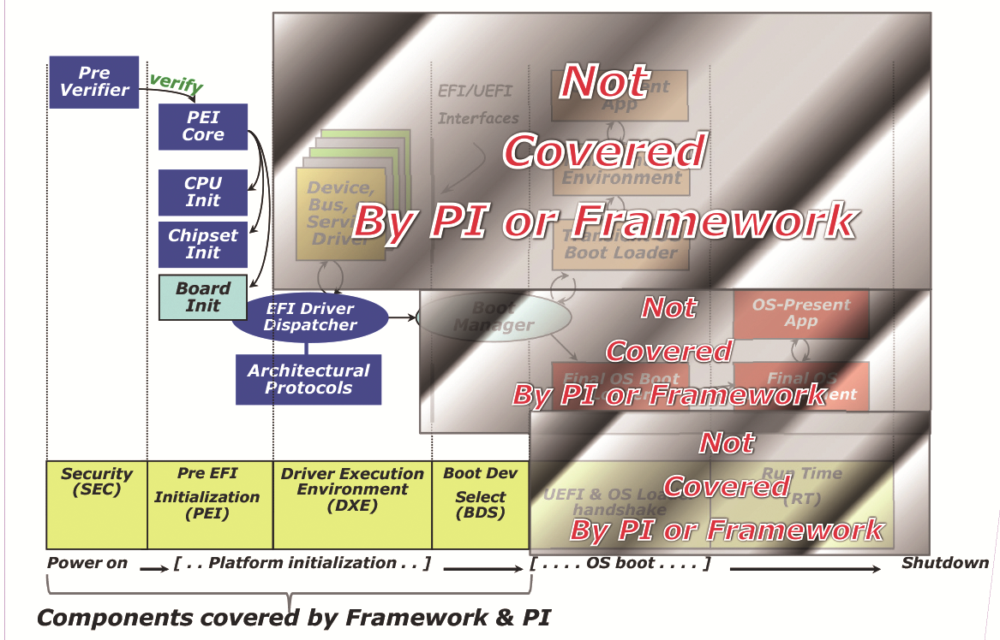

 

**Figure 1.2:** Where PI and Framework Fit into the Platform Boot Flow

Terminology \| **3**

 

Within the evolution of Framework to PI, some things were omitted from inclusion in the PI specifications. As a result of these omissions, some subjects that were dis-

cussed in the first edition of *Beyond BIOS*, such as the compatibility support module

(CSM), have been removed from the second edition in order to provide space to de-scribe the newer PI and UEFI capabilities. This omission is both from a scope perspec-tive, namely that the PI specification didn’t want to codify or include the CSM, but

also from a long-term perspective. Specifically, the CSM specification abstracted boot-ing on a PC/AT system. This requires an x86 processor, PC/AT hardware complex (for

example, 8254, 8259, RTC). The CSM also inherited other conventional BIOS boot lim-itations, such as the 2.2-TB disk limit of Master Boot Record (MBR) partition tables.

For a world of PI and UEFI, you get all of the x86 capabilities (IA-32 and x64, respec-tively), ARM†, Itanium®, and future CPU bindings. Also, via the polled driver model

design, UEFI APIs, and the PI DXE architectural protocols, the platform and compo-nent hardware details are abstracted from all consumer software. Other minor omis-

sions also include data hub support. The latter has been replaced by purpose-built infrastructure to fill the role of data hub in Framework-based implementations, such

as SMBIOS table creation and agents to log report status code actions.

What has happened in PI beyond Framework, though, includes the addition of a

multiprocessor protocol, Itanium E-SAL and MCA support, the above-listed report-status code listener and SMBIOS protocol, an ACPI editing protocol, and an SIO pro-

tocol. With Framework collateral that moved to PI, a significant update was made to the System Management Mode (SMM) protocol and infrastructure to abstract out var-

ious CPU and chipset implementations from the more generic components. On the DXE front, small cleanup was added in consideration of UEFI 2.3 incompatibility.

Some additions occurred in the PEI foundation for the latest evolution in buses, such as PCI Express†. In all of these cases, the revisions of the SMM, PEI, and DXE service

tables were adjusted to ease migration of any SMM drivers, DXE drivers, and PEI mod-ule (PEIM) sources to PI. In the case of the firmware file system and volumes, the

headers were expanded to comprehend larger file and alternate file system encod-ings, respectively. Unlike the case for SMM drivers, PEIMs, and DXE drivers, these

present a new binary encoding that isn’t compatible with a pure Framework imple-mentation.

The notable aspect of the PI is the participation of the various members of the UEFI Forum, which will be described below. These participants represent the con-

sumers and producers of PI technology. The ultimate consumer of a PI component is the vendor shipping a system board, including multinational companies such as Ap-

ple, Dell, HP, IBM, Lenovo, and many others. The producers of PI components include generic infrastructure producers such as the independent BIOS vendors (IBVs) like

AMI, Insyde, Phoenix, and others. And finally, the vendors producing chipsets, CPUs, and other hardware devices like AMD, ARM, and Intel would produce drivers for their

respective hardware. The IBVs and the OEMs would use the silicon drivers, for exam-ple. If it were not for this business-to-business transaction, the discoverable binary **4** \| Chapter 1 – Introduction

 

interfaces and separate executable modules (such as PEIMs and DXE drivers) would not be of interest. This is especially true since publishing GUID-based APIs, marshal-

ling interfaces, discovering and dispatching code, and so on take some overhead in

system board ROM storage and boot time. Given that there’s never enough ROM space, and also in light of the customer requirements for boot-time such as the need to be “instantly on,” this overhead must be balanced by the business value of PI mod-

ule enabling. If only one vendor had access to all of the source and intellectual prop-erty to construct a platform, a statically bound implementation would be more effi-

cient, for example. But in the twenty-first century with the various hardware and software participants in the computing industry, software technology such as PI is

key to getting business done in light of the ever-shrinking resource and time-to-mar-ket constraints facing all of the UEFI forum members.

There is a large body of Framework-based source-code implementations, such as those derived or dependent upon EDK I (EFI Developer Kit, which can be found on

www.tianocore.org. These software artifacts can be recompiled into a UEFI 2.6, PI 1.5-compliant core, such as UDK2015 (the UEFI Developer Kit revision 2015), via the EDK

Compatibility Package (ECP). For new development, though, the recommendation is to build native PI 1.5, UEFI 2.6 modules in the UDK2015 since these are the specifica-

tions against which long-term silicon enabling and operating system support will oc-cur, respectively.

 

**Terminology**

 

The following list provides a quick overview of some of the terms that may be encoun-

tered later in the book and have existed in the industry associated with the BIOS standardization efforts.

■ *UEFI Forum.* The industry body, which produces UEFI, Platform Initialization

(PI), and other specifications.

■ *UEFI Specification.* The firmware-OS interface specification.

■ *EDK.* The EFI Development Kit, an open sourced project that provides a basic im-

plementation of UEFI, Framework, and other industry standards. It, is not how-

ever, a complete BIOS solution. An example of this can be found at www.tiano-

core.org.

■ *UDK.* The UEFI Development Kit is the second generation of the EDK (EDK II), which

has added a variety of codebase related capabilities and enhancements. The inau-

gural UDK is UDK2015, with the number designating the instance of the release. ■ *Framework.* A deprecated term for a set of specifications that define interfaces

and how various platform components work together. What this term referred to

is now effectively replaced by the PI specifications.

■ *Tiano.* An obsolete codename for an Intel codebase that implemented the Frame-

work specifications.

Short History of EFI \| **5**

 

**Short History of EFI**

 

The Extensible Firmware interface (EFI) project was developed by Intel, with the ini-tial specification released in 1999. At the time, it was designed as the means by which

to boot Itanium-based systems. The original proposal for booting Itanium was the

SAL (System Architectural Layer) SAL_PROC interface, with an encapsulation of the PC/AT BIOS registers as the arguments and parameters. Specifically, the means to access the disk in the SAL_PROC proposal was “SAL_PROC (0x13, 0x2, …)”, which is

aligned with the PC/AT conventional BIOS call of “int13h.”

Given the opportunity to clean up the boot interface, various proposals were pro-

vided. These included but were not limited to Open Firmware and Advanced RISC Computing (ARC). Ultimately, though, EFI prevailed and its architecture-neutral in-

terface was adopted.

The initial EFI specification included both an Itanium and IA-32 binding. EFI

evolved from the EFI 1.02 interface into EFI1.10 in 2001. EFI1.10 introduced the EFI Driver model.

With the advent of 64-bit computing on IA-32 (for example, x64) and the indus-try’s need to have a commonly owned specification, the UEFI 2.0 specification ap-

peared in 2005. UEFI 2.0 was largely the same as EFI 1.0, but also included the mod-ular networking stack APIs for IPv4 and the x64 binding.

In Figure 1.3 we illustrate the evolution of the BIOS from its legacy days through 2016.

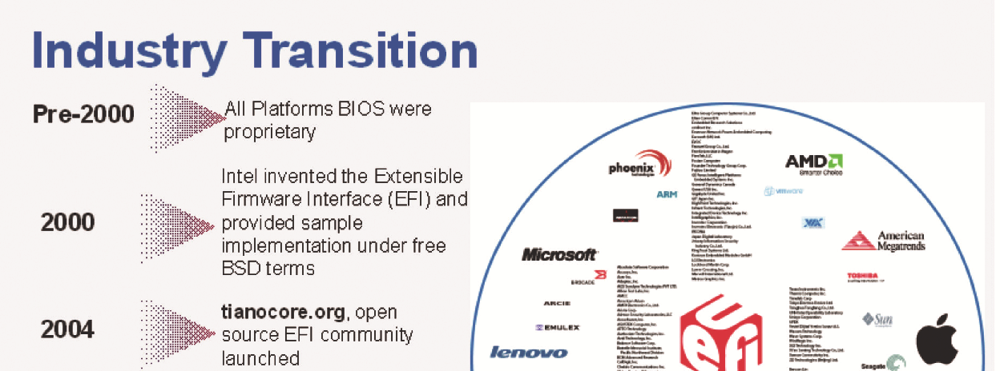

 

**Figure 1.3:** BIOS Evolution Timeline **6** \| Chapter 1 – Introduction

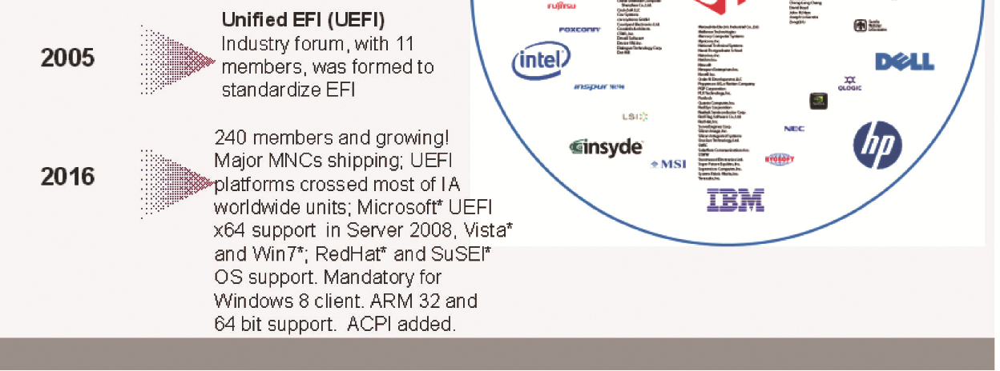

 

**EFI Becomes UEFI—The UEFI Forum**

 

Regarding the UEFI Forum, there are various aspects to how it manages both the UEFI and PI specifications. Specifically, the UEFI forum is responsible for creating the UEFI

and PI specifications.

When the UEFI Forum first formed, a variety of factors and steps were part of the cre-ation process of the first specification:

■ The UEFI forum stakeholders agree on EFI direction

■ Industry commitment drives need for broader governance on specification ■ Intel and Microsoft contribute seed material for updated specification

■ EFI 1.10 components provide starting drafts ■ Intel agrees to contribute EFI test suite

 

As this had established the framework of the specification material that was pro-

duced, which the industry used, the forum itself was formed with several thoughts in mind:

■ The UEFI Forum is established as a Washington non-profit Corporation

– Develops, promotes and manages evolution of Unified EFI Specification

– Continue to drive low barrier for adoption

 

■ The Promoter members for the UEFI forum are:

– AMD, AMI, Apple, Dell, HP, IBM, Insyde, Intel, Lenovo, Microsoft, Phoenix

 

■ The UEFI Forum has a form of tiered Membership:

– Promoters, Contributors and Adopters

– More information on the membership tiers can be found at: www.uefi.org

 

■ The UEFI Forum has several work groups:

– Figure 1.4 illustrates the basic makeup of the forum and the corresponding

roles.

EFI Becomes UEFI—The UEFI Forum \| **7**

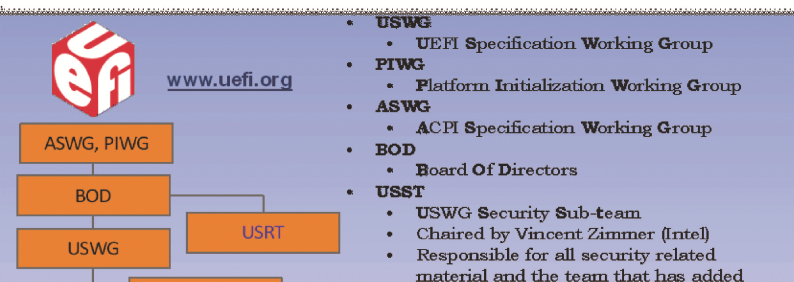

 

**Figure 1.4:** Forum group hierarchy

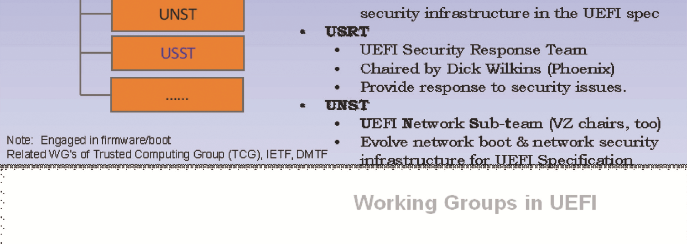

 

■ Sub-teams are created in the main owning workgroup when a topic of sufficient

depth requires a lot of discussion with interested parties or experts in a particular

domain. These teams are collaborations amongst many companies who are re-

sponsible for addressing the topic in question and bringing back to the

workgroup either a response or material for purposes of inclusion in the main

working specification. Some examples of sub-teams that have been created are

as follows as of this book publication:

– UCST – UEFI Configuration Sub-team

□ Chaired by Michael Rothman □ Responsible for all configuration related material and the team

has been responsible for the creation of the UEFI configuration infrastructure commonly known as HII, which is in the UEFI

Specification.

 

– UNST – UEFI Networking Sub-team

□ Chaired by Vincent Zimmer

□ Responsible for all network related material. The team has been

responsible for the update/inclusion of the network related ma-

terial in the UEFI specification, most notably the IPv6 network infrastructure.

**8** \| Chapter 1 – Introduction

 

– USHT – UEFI Shell Sub-team

□ Chaired by Michael Rothman

□ Responsible for all command shell related material. The team

has been responsible for the creation of the UEFI Shell specifi-cation and continue to maintain the contents as technology evolves.

 

– USST – UEFI Security Sub-team

□ Chaired by Vincent Zimmer

□ Responsible for all security related material. The team has been

responsible for the added security infrastructure in the UEFI specification.

 

**PIWG and USWG**

 

The Platform Initialization Working Group (PIWG) is the portion of the UEFI forum that defines the various specifications in the PI corpus. The UEFI Specification Working

Group (USWG) is the group that evolves the main UEFI specification. Figure 1.5 illus-

trates the layers of the platform and what the scope that the USWG and PIWG cover.

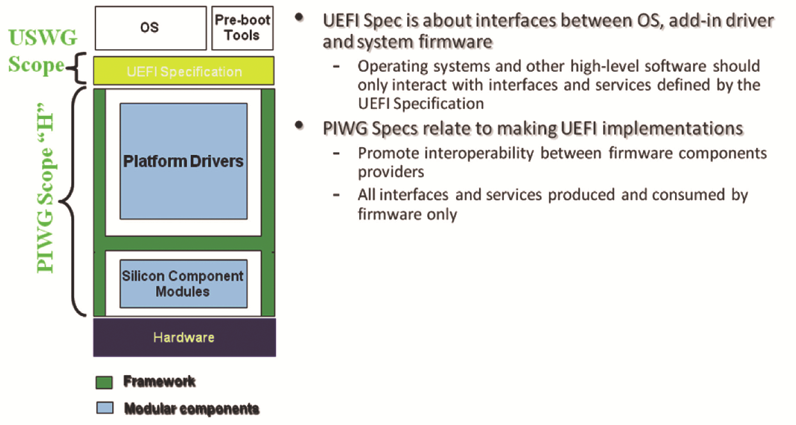

 

**Figure 1.5:** PI/UEFI layering

 

Over time, these specifications have evolved. Below we enumerate the recent history

of specifications and the work associated with each:

■ UEFI 2.1

– Roughly one year of Specification work

□ Builds on UEFI 2.0

PIWG and USWG \| **9**

 

– New content area highlights:

□ Human Interface Infrastructure

□ Hardware Error Record Support

□ Authenticated Variable Support □ Simple Text Input Extensions □ Absolute Pointer Support

 

■ UEFI 2.2

– Follow-on material from existing 2.1 content

□ Backlog that needed more gestation time

 

– Security/Integrity related enhancements

□ Provide service interfaces for UEFI drivers that want to operate

with high integrity implementations of UEFI

 

– Human Interface Infrastructure enhancements

□ Further enhancements pending to help interaction/configura-

tion of platforms with standards-based methodologies.

 

– Networking

□ IPv6, PXE+, IPsec

 

– Various other subject areas possible

– More boot devices, more authentication support, more networking updates,

etc.

■ UEFI 2.3

– ARM binding

– Firmware management protocol ■ UEFI 2.4

– Disk IO2 was added as symmetry to Block IO2

– AIP Protocol (FCoE/Image/iSCSI)

– Timestamp Protocol

– RNG/Entropy Protocol

– FMP delivery via capsule

– Capsule on Disk

■ UEFI 2.5

– HASH2 Protocol

– ESRT

– Smart Card Reader

– IPV6 for UNDI

– Inline Cryptographic Interface Protocol

– Persistent Memory Types **10** \| Chapter 1 – Introduction

 

– PKCS7 Signature Verification Services

– AArch64

– NVMe Pass-through Protocol

– HTTP Boot

– Bluetooth Support

– REST Protocol

– Smartcard Edge Protocol

– Regular Expression Protocol

– x-UEFI Keyword Support

– Transport Layer Security(TLS) support ■ UEFI 2.6

– SD/eMMC Pass-through Protocol

– FontEx/Font Glyph Generator protocol

– Wireless MAC Connection Protocol

– RAM Disk Protocol

 

To complement the layering picture in Figure 1.5, Figure 1.6 shows how the PI ele-ments evolve into the UEFI. The left half of the diagram with SEC, PEI, and DXE are

described by the PI specifications. BDS, UEFI+OS Loader handshake, and RT are the

province of the UEFI specification.

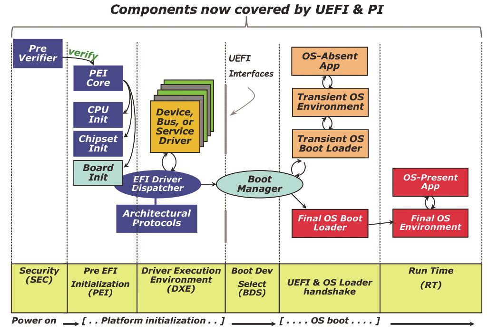

 

**Figure 1.6:** Where PI and Framework Fit into the Platform Boot Flow

 

In addition, as time has elapsed, the specifications have evolved. Figure 1.7 is a time-line for the specifications and the implementations associated with them.

Platform Trust/Security \| **11**

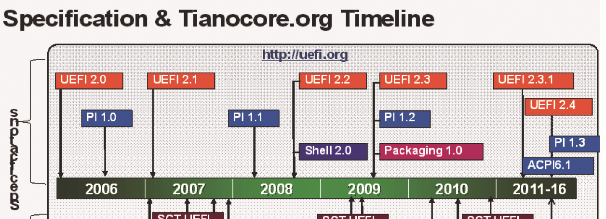

 

**Figure 1.7:** Specification and Codebase Timeline

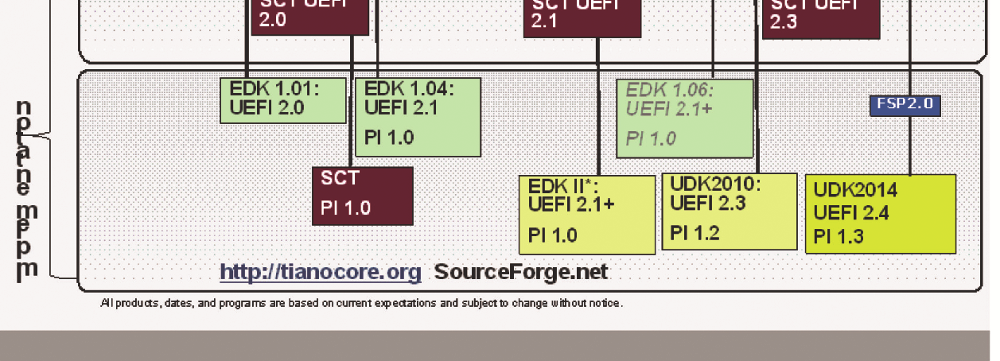

 

**Platform Trust/Security**

 

Recall that PI allowed for business-to-business engagements between component

providers and system builders. UEFI, on the other hand, has a broader set of partici-pants. These include the operating system vendors that built the OS installers and

UEFI-based runtimes; BIOS vendors who provide UEFI implementations; platform manufacturers, such as multi-national corporations who ship UEFI-compliant

boards; independent software vendors who create UEFI applications and diagnostics; independent hardware vendors who create drivers for their adapter cards; and plat-

form owners, whether a home PC user or corporate IT, who must administer the UEFI-based system.

PI differs from UEFI in the sense that the PI components are delivered under the authority of the platform manufacturer and are not typically extensible by third par-

ties. UEFI, on the other hand, has a mutable file system partition, boot variables, a driver load list, support of discoverable option ROMs in host-bus adapters (HBAs),

and so on. As such, PI and UEFI offer different issues with respect to security. Chapter 10 treats this topic in more detail, but in general, the security dimension of the respec-

tive domains include the following: PI must ensure that the PI elements are only up-dateable by the platform manufacturer, recovery, and PI is a secure implementation

of UEFI features, including security; UEFI provides infrastructure to authenticate the user, validate the source and integrity of UEFI executables, network authentication

**12** \| Chapter 1 – Introduction

 

and transport security, audit (including hardware-based measured boot), and admin-istrative controls across UEFI policy objects, including write-protected UEFI varia-

bles.

A fusion of these security elements in a PI implementation is shown in Figure 1.8.

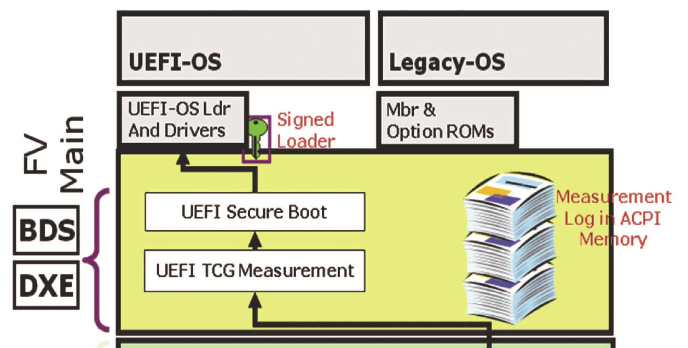

 

**Figure 1.8:** Trusted UEFI/PI stack

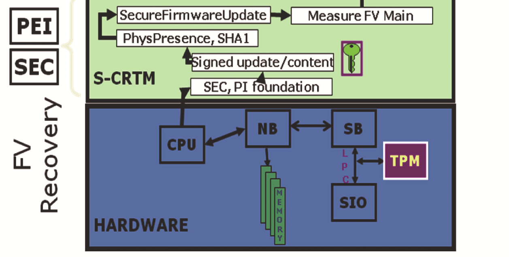

 

**Embedded Systems: The New Challenge**

 

As the UEFI took off and became pervasive, a new challenge has been taking shape in the form of the PC platform evolution to take on the embedded devices, more spe-

cifically the consumer electronic devices, with a completely different set of require-

ments driven by user experience factors like instant power-on for various embedded operating systems. Many of these operating systems required customized firmware with OS-specific firmware interfaces and did not fit well into the PC firmware eco-

system model.

Embedded Systems: The New Challenge \| **13**

 

The challenge now is to make the embedded platform firmware have similar ca-pabilities to the traditional model such as the being OS-agnostic, being scalable

across different platform hardware, and being able to lessen the development time to

port and to leverage the UEFI standards.

 

**How the Boot Process Differs between a Normal Boot and an Optimized/Embedded Boot**

 

Figure 1.9 indicates that between the normal boot and an optimized boot, there are no design differences from a UEFI architecture point of view. Optimizing a platform’s performance does *not* mean that one has to violate any of the design specifications. It

should also be noted that to comply with UEFI, one does not need to encompass all of the standard PC architecture, but instead the design can limit itself to the compo-

nents that are necessary for the initialization of the platform itself. Chapter 2 in the *UEFI 2.6 specification* does enumerate the various components and conditions that

comprise UEFI compliance.

 

SEC Phase SEC Phase

Pre-memory early initialization, microcode Pre-memory early initialization, microcode

patching, and MTRR programming. patching, and MTRR programming.

 

PEI Phase

PEI Phase

Dispatches only PEI drivers. **minimal**

Dispatches various PEI drivers. Pre-memory early

Pre-memory early initialization, microcode

initialization, microcode patching, and MTRR programming.

patching, and MTRR programming.

 

Yes Are we in an Are we in an

S3 Boot mode? Yes S3 Boot mode?

 

O/S Resume Vector O/S Resume Vector

No No

 

DXE + BDS Phase DXE + BDS Phase

Discover all drivers available to the platform. Discover the drivers available to the platform.

Dispatch all drivers encountered. Dispatch only the **minimal** drivers required to

boot the target

 

**Normal Boot** **Optimized Boot**

 

**Figure 1.9:** Architectural Boot Flow Comparison

**14** \| Chapter 1 – Introduction

 

**Summary**

 

We have provided some rationale in this chapter for the changes from Beyond BIOS: Implementing the Unified Extensible Firmware Interface with Intel’s Framework to

Beyond BIOS: Implementing UEFI – the Unified Extensible Firmware Interface. These

elements include the industry members’ ownership and governance of the UEFI spec-ification. Beyond this sea change, the chapter describes the migration of Framework to PI and the evolution of PI over the former Framework feature set. In addition, the

section describes the evolution of UEFI to UEFI 2.6 from UEFI 2.0 matter in the first edition. Finally, some of the codebase technology to help realize implementations of

this technology was discussed.

So fasten your seatbelt and dive into a journey through industry standard firmware.