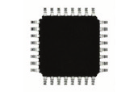
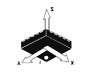
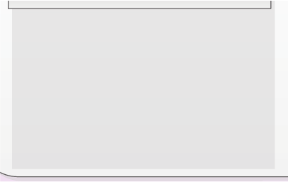
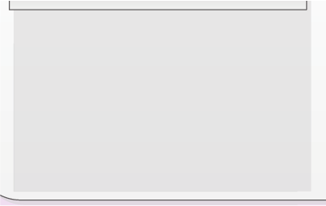
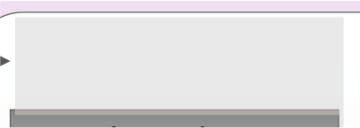
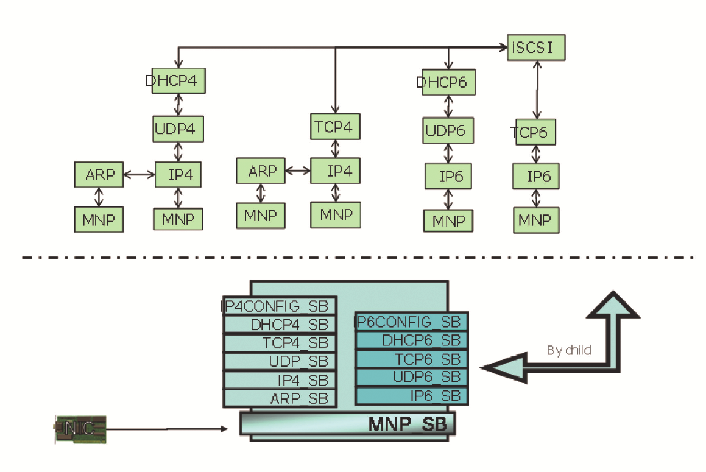
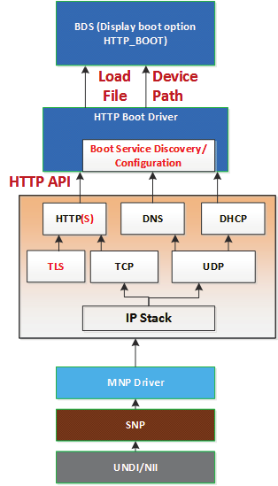

## **Chapter 3 – UEFI Driver Model** 

 

Things should be made as simple as possible—but no simpler.

—Albert Einstein

 

The Unified Extensible Firmware Interface (UEFI) provides a driver model for support

of devices that attach to today’s industry-standard buses, such as Peripheral Compo-nent Interconnect (PCI) and Universal Serial Bus (USB), and architectures of tomor-

row. The UEFI Driver Model is intended to simplify the design and implementation of device drivers, and produce small executable image sizes. As a result, some complex-

ity has been moved into bus drivers and to a greater extent into common firmware services. A device driver needs to produce a Driver Binding Protocol on the same im-

age handle on which the driver was loaded. It then waits for the system firmware to connect the driver to a controller. When that occurs, the device driver is responsible

for producing a protocol on the controller’s device handle that abstracts the I/O oper-ations that the controller supports. A bus driver performs these exact same tasks. In

addition, a bus driver is also responsible for discovering any child controllers on the bus, and creating a device handle for each child controller found.

The combination of firmware services, bus drivers, and device drivers in any given platform is likely to be produced by a wide variety of vendors including Original

Equipment Manufacturers (OEMs), Independent BIOS Vendors (IBVs), and Independ-ent Hardware Vendors (IHVs). These different components from different vendors are

required to work together to produce a protocol for an I/O device than can be used to boot a UEFI compliant operating system. As a result, the UEFI Driver Model is de-

scribed in great detail in order to increase the interoperability of these components.

This chapter gives a brief overview of the UEFI Driver Model. It describes the entry

point of a driver, host bus controllers, properties of device drivers, properties of bus drivers, and how the UEFI Driver Model can accommodate hot plug events.

 

**Why a Driver Model Prior to OS Booting?**

 

Under the UEFI Driver Model, only the minimum number of I/O devices needs to be activated. For example, with today’s BIOS-based systems, a server with dozens of

SCSI drives needs to have those drives “spun-up” or activated. This is because the BIOS Int19h code does not know a priori which device will contain the operating sys-

tem loader. The UEFI Driver Model allows for only activating the subset of devices that are necessary for booting. This makes a rapid system restart possible and pushes

the policy of which additional devices need activation up into the operating system. With the more aggressive boot time requirements more along the lines of consumer

electronics devices being pushed to all open platforms, this capability is imperative.

 

DOI 10.1515/9781501505690-005

**32** \| Chapter 3 – UEFI Driver Model

 

**Driver Initialization**

 

The file for a driver image must be loaded from some type of media. This could include ROM, flash, hard drives, floppy drives, CD-ROM, or even a network connection. Once

a driver image has been found, it can be loaded into system memory with the Boot

Service LoadImage(). LoadImage() loads a Portable Executable/Common File Format (PE/COFF) formatted image into system memory. A handle is created for the driver, and a Loaded Image Protocol instance is placed on that handle. A handle that

contains a Loaded Image Protocol instance is called an *Image Handle*. At this point, the driver has not been started. It is just sitting in memory waiting to be started. Figure

3.1 shows the state of an image handle for a driver after LoadImage() has been

called.

 

**Image Handle**

 

**Figure 3.1:** Image Handle

 

After a driver has been loaded with the Boot Service LoadImage(), it must be started with the Boot Service StartImage(). This is true of all types of UEFI appli-

cations and UEFI drivers that can be loaded and started on an UEFI compliant system. The entry point for a driver that follows the UEFI Driver Model must follow some strict

rules. First, it is not allowed to touch any hardware. Instead, it is only allowed to in-stall protocol instances onto its own Image Handle. A driver that follows the UEFI

Driver Model is *required* to install an instance of the Driver Binding Protocol onto its own Image Handle*.* It may optionally install the Driver Configuration Protocol, the

Driver Diagnostics Protocol, or the Component Name Protocol. In addition, if a driver wishes to be unloadable it may optionally update the Loaded Image Protocol to pro-

vide its own Unload() function. Finally, if a driver needs to perform any special operations when the Boot Service ExitBootServices() is called, it may option-

ally create an event with a notification function that is triggered when the Boot Ser-vice ExitBootServices() is called. An Image Handle that contains a Driver

Binding Protocol instance is known as a *Driver Image Handle*. Figure 3.2 shows a pos-sible configuration for the Image Handle from Figure 3.1 after the Boot Service

StartImage() has been called.

Host Bus Controllers \| **33**

 

**Driver Image Handle** **Driver Image Handle**

 

**EFI_LOADED_IMAGE_PROTOCOL EFI_LOADED_IMAGE_PROTOCOL**

 

**EFI_DRIVER_BINDING_PROTOCOL EFI_DRIVER_BINDING_PROTOCOL**

 

**EFI_DRIVER_CONFIGURATION_PROTOCOL EFI_DRIVER_CONFIGURATION_PROTOCOL**

 

**EFI_DRIVER_DIAGNOSTICS_PROTOCOL EFI_DRIVER_DIAGNOSTICS_PROTOCOL**

 

**EFI_COMPONENT_NAME2_PROTOCOL EFI_COMPONENT_NAME2_PROTOCOL**

 

**Figure 3.2:** Driver Image Handle

 

**Host Bus Controllers**

 

Drivers are not allowed to touch any hardware in the driver's entry point. As a result, drivers are loaded and started, but they are all waiting to be told to manage one or

more controllers in the system. A platform component, like the UEFI Boot Manager, is responsible for managing the connection of drivers to controllers. However, before

even the first connection can be made, some initial collection of controllers must be present for the drivers to manage. This initial collection of controllers is known as the

*Host Bus Controllers*. The I/O abstractions that the Host Bus Controllers provide are produced by firmware components that are outside the scope of the UEFI Driver

Model. The device handles for the Host Bus Controllers and the I/O abstraction for each one must be produced by the core firmware on the platform, or an UEFI Driver

that may not follow the UEFI Driver Model. See the PCI Host Bridge I/O Protocol de-scription in Chapter 13 of the *UEFI 2.6 specification* for an example of an I/O abstrac-

tion for PCI buses.

A platform can be viewed as a set of CPUs and a set of core chip set components

that may produce one or more host buses. Figure 3.3 shows a platform with *n* CPUs, and a set of core chipset components that produce *m* host bridges.

**34** \| Chapter 3 – UEFI Driver Model

 

**CPU 1** **CPU 2** **CPU** ***n***

 

**Front Side Bus**

 

**Core Chipset Components**

 

**HB 1** **HB 2** **HB** ***m***

 

**Figure 3.3:** Host Bus Controllers

 

Each host bridge is represented in UEFI as a device handle that contains a Device Path Protocol instance, and a protocol instance that abstracts the I/O operations that the

host bus can perform. For example, a PCI Host Bus Controller supports the PCI Host Bridge I/O Protocol. Figure 3.4 shows an example device handle for a PCI Host Bridge.

 

**Device Handle**

 

**EFI_DEVICE_PATH_PROTOCOL**

 

**EFI_PCI_HOST_BRIDGE_IO_PROTOCOL**

 

**Figure 3.4:** Host Bus Device Handle

 

A PCI Bus Driver could connect to this PCI Host Bridge, and create child handles for

each of the PCI devices in the system. PCI Device Drivers should then be connected to these child handles, and produce I/O abstractions that may be used to boot a UEFI

compliant OS. The following section describes the different types of drivers that can be implemented within the UEFI Driver Model. The UEFI Driver Model is very flexible,

so not all the possible types of drivers are discussed here. Instead, the major types are

Device Drivers \| **35**

 

covered that can be used as a starting point for designing and implementing addi-tional driver types.

 

**Device Drivers**

 

A device driver is not allowed to create any new device handles. Instead, it installs

additional protocol interfaces on an existing device handle. The most common type of device driver attaches an I/O abstraction to a device handle that has been created by a bus driver. This I/O abstraction may be used to boot an UEFI compliant OS. Some

example I/O abstractions would include Simple Text Output, Simple Input, Block I/O, and Simple Network Protocol. Figure 3.5 shows a device handle before and after a

device driver is connected to it. In this example, the device handle is a child of the XYZ Bus, so it contains an XYZ I/O Protocol for the I/O services that the XYZ bus sup-

ports. It also contains a Device Path Protocol that was placed there by the XYZ Bus Driver. The Device Path Protocol is not required for all device handles. It is only re-

quired for device handles that represent physical devices in the system. Handles for virtual devices do not contain a Device Path Protocol.

 

**Device Handle**

 

**EFI_DEVICE_PATH_PROTOCOL**

 

**Start()**

**EFI_XYZ_IO_PROTOCOL**

 

**Device Handle**

**Stop()**

**EFI_DEVICE_PATH_PROTOCOL**

 

**EFI_XYZ_IO_PROTOCOL**

 

**EFI_BLOCK_IO_PROTOCOL**

 

**Figure 2.5:** Connecting Device Drivers

 

The device driver that connects to the device handle in Figure 3.5 must have installed

a Driver Binding Protocol on its own image handle. The Driver Binding Protocol con-**36** \| Chapter 3 – UEFI Driver Model

 

tains three functions called Supported(), Start(), and Stop(). The Sup-ported() function tests to see if the driver supports a given controller. In this ex-

ample, the driver will check to see if the device handle supports the Device Path Pro-

tocol and the XYZ I/O Protocol. If a driver's Supported() function passes, then the driver can be connected to the controller by calling the driver’s Start() function. The Start() function is what actually adds the additional I/O protocols to a device

handle. In this example, the Block I/O Protocol is being installed. To provide sym-metry, the Driver Binding Protocol also has a Stop() function that forces the driver

to stop managing a device handle. This causes the device driver to uninstall any pro-

tocol interfaces that were installed in Start().

The Support(), Start(), and Stop() functions of the UEFI Driver Binding Protocol are required to make use of the new Boot Service OpenProtocol() to get

a protocol interface and the new Boot Service CloseProtocol() to release a pro-tocol interface. OpenProtocol() and CloseProtocol() update the handle da-

tabase maintained by the system firmware to track which drivers are consuming pro-

tocol interfaces. The information in the handle database can be used to retrieve information about both drivers and controllers. The new Boot Service OpenProto-colInformation() can be used to get the list of components that are currently

consuming a specific protocol interface.

 

**Bus Drivers**

 

Bus drivers and device drivers are virtually identical from the UEFI Driver Model’s

point of view. The only difference is that a bus driver creates new device handles for

the child controllers that the bus driver discovers on its bus. As a result, bus drivers are slightly more complex than device drivers, but this in turn simplifies the design and implementation of device drivers. There are two major types of bus drivers. The

first creates handles for all the child controllers on the first call to Start(). The second type allows the handles for the child controllers to be created across multiple

calls to Start(). This second type of bus driver is very useful in supporting a rapid

boot capability. It allows a few child handles or even one child handle to be created. On buses that take a long time to enumerate all of their children (such as SCSI), this can lead to a very large time savings in booting a platform. Figure 3.6 shows the tree

structure of a bus controller before and after Start() is called. The dashed line coming into the bus controller node represents a link to the bus controller's parent

controller. If the bus controller is a Host Bus Controller, then it does not have a parent

controller. Nodes A, B, C, D, and E represent the child controllers of the bus controller.

Bus Drivers \| **37**

 

**Bus Controller** **Bus Controller** **Start()**

 

**Stop()** **A** **B** **C** **D** **E**

 

**Figure 3.6:** Connecting Bus Drivers

 

A bus driver that supports creating one child on each call to Start() might choose

to create child C first, and then child E, and then the remaining children A,B, and D. The Supported(), Start(), and Stop() functions of the Driver Binding Proto-

col are flexible enough to allow this type of behavior.

A bus driver must install protocol interfaces onto every child handle that is creates.

At a minimum, it must install a protocol interface that provides an I/O abstraction of the bus's services to the child controllers. If the bus driver creates a child handle that rep-

resents a physical device, then the bus driver must also install a Device Path Protocol instance onto the child handle. A bus driver may optionally install a Bus Specific Driver

Override Protocol onto each child handle. This protocol is used when drivers are con-nected to the child controllers. A new Boot Service ConnectController() uses ar-

chitecturally defined precedence rules to choose the best set of drivers for a given con-troller. The Bus Specific Driver Override Protocol has higher precedence than a general

driver search algorithm, and lower precedence than platform overrides. An example of a bus specific driver selection occurs with PCI. A PCI Bus Driver gives a driver stored in

a PCI controller's option ROM a higher precedence than drivers stored elsewhere in the platform. Figure 3.7 shows an example child device handle that has been created by the

XYZ Bus Driver that supports a bus specific driver override mechanism.

**38** \| Chapter 3 – UEFI Driver Model

 

**Child Device Handle**

**EFI_DEVICE_PATH_PROTOCOL**

 

**EFI_XYZ_IO_PROTOCOL**

 

**Optional** **EFI_BUS_SPECIFIC_DRIVER_OVERRIDE_PROTOCOL**

 

**Figure 3.7:** Child Device Handle with a Bus Specific Override

 

**Platform Components**

 

Under the UEFI Driver Model, the act of connecting and disconnecting drivers from

controllers in a platform is under the platform firmware's control. This will typically be implemented as part of the UEFI Boot Manager, but other implementations are

possible. The new Boot Services ConnectController() and Discon-nectController() can be used by the platform firmware to determine which

controllers get started and which ones do not. If the platform wishes to perform sys-tem diagnostics or install an operating system, then it may choose to connect drivers

to all possible boot devices. If a platform wishes to boot a pre-installed operating sys-tem, it may choose to only connect drivers to the devices that are required to boot the

selected operating system. The UEFI Driver Model supports both of these modes of operation through the new Boot Services ConnectController() and Discon-

nectController(). In addition, since the platform component that is in charge of booting the platform has to work with device paths for console devices and boot

options, all of the services and protocols involved in the UEFI Driver Model are opti-mized with device paths in mind.

The platform may also choose to produce an optional protocol named the Plat-form Driver Override Protocol. This is similar to the Bus Specific Driver Override Pro-

tocol, but it has higher priority. This gives the platform firmware the highest priority when deciding which drivers are connected to which controllers. The Platform Driver

Override Protocol is attached to a handle in the system. The new Boot Service Con-nectController() will make use of this protocol if it is present in the system.

 

**Hot Plug Events**

 

In the past, system firmware has not had to deal with hot plug events in the pre-boot environment. However, with the advent of buses like USB, where the end user can

add and remove devices at any time, it is important to make sure that it is possible to describe these types of buses in the UEFI Driver Model. It is up to the bus driver of a

Hot Plug Events \| **39**

 

bus that supports the hot adding and removing of devices to provide support for such events. For these types of buses, some of the platform management is going to have

to move into the bus drivers. For example, when a keyboard is added hot to a USB bus

on a platform, the end user would expect the keyboard to be active. A USB Bus driver could detect the hot add event and create a child handle for the keyboard device. However, since drivers are not connected to controllers unless ConnectControl-

ler() is called the keyboard would not become an active input device. Making the keyboard driver active requires the USB Bus driver to call ConnectController()

when a hot add event occurs. In addition, the USB Bus driver would have to call Dis-

connectController() when a hot remove event occurs.

Device drivers are also affected by these hot plug events. In the case of USB, a device can be removed without any notice. This means that the Stop() functions of

USB device drivers must deal with shutting down a driver for a device that is no longer present in the system. As a result, any outstanding I/O requests must be flushed with-

out actually being able to touch the device hardware.

In general, adding support for hot plug events greatly increases the complexity

of both bus drivers and device drivers. Adding this support is up to the driver writer, so the extra complexity and size of the driver must be weighed against the need for

the feature in the pre-boot environment.

The two example code sequences below provide guidance on how a device driver

writer might discover if it in fact manages the candidate hardware device. These mechanisms include looking at the controller handle in the first example and exam-

ining the device path in the second example.

 

extern EFI_GUID

gEfiDriverBindingProtocolGuid;

EFI_HANDLE gMyImageHandle; EFI_HANDLE DriverImageHandle; EFI_HANDLE ControllerHandle; EFI_DRIVER_BINDING_PROTOCOL \*DriverBinding; EFI_DEVICE_PATH_PROTOCOL \*RemainingDevicePath;

 

//

// Use the DriverImageHandle to get the Driver Binding Protocol

// instance

//

Status = gBS-\>OpenProtocol (

DriverImageHandle,

&gEfiDriverBindingProtocolGuid,

&DriverBinding,

gMyImageHandle,

NULL,

EFI_OPEN_PROTOCOL_HANDLE_PROTOCOL

);

**40** \| Chapter 3 – UEFI Driver Model

 

if (EFI_ERROR (Status)) {

return Status;

}

 

//

// EXAMPLE \#1

//

// Use the Driver Binding Protocol instance to test to see if

// the driver specified by DriverImageHandle supports the // controller specified by ControllerHandle //

Status = DriverBinding-\>Supported (

DriverBinding,

ControllerHandle,

NULL

);

if (!EFI_ERROR (Status)) {

Status = DriverBinding-\>Start (

DriverBinding,

ControllerHandle,

NULL

);

}

 

return Status;

 

//

// EXAMPLE \#2

//

// The RemainingDevicePath parameter can be used to initialize

// only the minimum devices required to boot. For example,

// maybe we only want to initialize 1 hard disk on a SCSI // channel. If DriverImageHandle is a SCSI Bus Driver, and

// ControllerHandle is a SCSI Controller, and we only want to

// create a child handle for PUN=3 and LUN=0, then the // RemainingDevicePath would be SCSI(3,0)/END. The following

// example would return EFI_SUCCESS if the SCSI driver supports

// creating the child handle for PUN=3, LUN=0. Otherwise it

// would return an error.

//

Hot Plug Events \| **41**

 

Status = DriverBinding-\>Supported (

DriverBinding,

ControllerHandle,

RemainingDevicePath

);

if (!EFI_ERROR (Status)) {

Status = DriverBinding-\>Start (

DriverBinding,

ControllerHandle,

RemainingDevicePath

);

}

 

return Status;

 

**Pseudo Code**

 

The algorithms for the Start() function for three different types of drivers are pre-

sented here. How the Start() function of a driver is implemented can affect how the Supported() function is implemented. All of the services in the EFI_DRIVER_BINDING_PROTOCOL need to work together to make sure that all

resources opened or allocated in Supported() and Start() are released in Stop().

The first algorithm is a simple device driver that does not create any additional

handles. It only attaches one or more protocols to an existing handle. The second is a simple bus driver that always creates all of its child handles on the first call to Start(). It does not attach any additional protocols to the handle for the bus con-

troller. The third is a more advanced bus driver that can either create one child han-dles at a time on successive calls to Start(), or it can create all of its child handles

or all of the remaining child handles in a single call to Start(). Once again, it does

not attach any additional protocols to the handle for the bus controller.

 

**Device Driver**

 

1. Open all required protocols with OpenProtocol(). If this driver allows the

opened protocols to be shared with other drivers, then it should use an *Attrib-*

*ute* of EFI_OPEN_PROTOCOL_BY_DRIVER. If this driver does not allow the

opened protocols to be shared with other drivers, then it should use an *Attrib-*

*ute* of EFI_OPEN_PROTOCOL_BY_DRIVER \| EFI_OPEN_PROTO-

COL_EXCLUSIVE. It must use the same *Attribute* value that was used in

Supported().

**42** \| Chapter 3 – UEFI Driver Model

 

2. If any of the calls to OpenProtocol() in Step 1 returned an error, then close

all of the protocols opened in Step 1 with CloseProtocol(), and return the

status code from the call to OpenProtocol() that returned an error.

3. Ignore the parameter *RemainingDevicePath*. 4. Initialize the device specified by *ControllerHandle*. If an error occurs, close

all of the protocols opened in Step 1 with CloseProtocol(), and return

EFI_DEVICE_ERROR.

5\. Allocate and initialize all of the data structures that this driver requires to manage

the device specified by *ControllerHandle*. This would include space for

public protocols and space for any additional private data structures that are re-

lated to *ControllerHandle*. If an error occurs allocating the resources, then

close all of the protocols opened in Step 1 with CloseProtocol(), and return

EFI_OUT_OF_RESOURCES. 6. Install all the new protocol interfaces onto *ControllerHandle* using In-

stallProtocolInterface(). If an error occurs, close all of the protocols

opened in Step 1 with CloseProtocol(), and return the error from In-

stallProtocolInterface(). 7. Return EFI_SUCCESS.

 

**Bus Driver that Creates All of Its Child Handles on the First Call to Start()**

 

1. Open all required protocols with OpenProtocol(). If this driver allows the

opened protocols to be shared with other drivers, then it should use an *Attrib-*

*ute* of EFI_OPEN_PROTOCOL_BY_DRIVER. If this driver does not allow

the opened protocols to be shared with other drivers, then it should use an *At-*

*tribute* of EFI_OPEN_PROTOCOL_BY_DRIVER \| EFI_OPEN_PROTO-

COL_EXCLUSIVE. It must use the same *Attribute* value that was used in

Supported().

2. If any of the calls to OpenProtocol() in Step 1 returned an error, then close

all of the protocols opened in Step 1 with CloseProtocol(), and return the

status code from the call to OpenProtocol() that returned an error.

3. Ignore the parameter *RemainingDevicePath*.

4. Initialize the device specified by *ControllerHandle*. If an error occurs, close

all of the protocols opened in Step 1 with CloseProtocol(), and return

EFI_DEVICE_ERROR.

5\. Discover all the child devices of the bus controller specified by *Controller-*

*Handle*.

6\. If the bus requires it, allocate resources to all the child devices of the bus control-

ler specified by *ControllerHandle*. 7. FOR each child C of *ControllerHandle*

Hot Plug Events \| **43**

 

8\. Allocate and initialize all of the data structures that this driver requires to manage

the child device C. This would include space for public protocols and space for

any additional private data structures that are related to the child device C. If an

error occurs allocating the resources, then close all of the protocols opened in

Step 1 with CloseProtocol(), and return EFI_OUT_OF_RESOURCES. 9. If the bus driver creates device paths for the child devices, then create a device

path for the child C based upon the device path attached to *ControllerHan-*

*dle*.

10\. Initialize the child device C. If an error occurs, close all of the protocols opened

in Step 1 with CloseProtocol(), and return EFI_DEVICE_ERROR. 11. Create a new handle for C, and install the protocol interfaces for child device C.

This may include the EFI_DEVICE_PATH_PROTOCOL.

12. Call OpenProtocol() on behalf of the child C with an *Attribute* of

EFI_OPEN_PROTOCOL_BY_CHILD_CONTROLLER.

13\. END FOR

14. Return EFI_SUCCESS.

 

**Bus Driver that Is Able to Create All or One of Its Child Handles on Each Call to Start():**

 

1. Open all required protocols with OpenProtocol(). If this driver allows the

opened protocols to be shared with other drivers, then it should use an *Attrib-*

*ute* of EFI_OPEN_PROTOCOL_BY_DRIVER. If this driver does not allow the

opened protocols to be shared with other drivers, then it should use an *Attrib-*

*ute* of EFI_OPEN_PROTOCOL_BY_DRIVER \| EFI_OPEN_PROTO-

COL_EXCLUSIVE. It must use the same *Attribute* value that was used in

Supported().

2. If any of the calls to OpenProtocol() in Step 1 returned an error, then close

all of the protocols opened in Step 1 with CloseProtocol(), and return the

status code from the call to OpenProtocol() that returned an error. 3. Initialize the device specified by *ControllerHandle*. If an error occurs, close

all of the protocols opened in Step 1 with CloseProtocol(), and return

EFI_DEVICE_ERROR.

4. IF *RemainingDevicePath* is not NULL, THEN 5. C is the child device specified by *RemainingDevicePath*.

6\. Allocate and initialize all of the data structures that this driver requires to manage

the child device C. This would include space for public protocols and space for

any additional private data structures that are related to the child device C. If an

error occurs allocating the resources, then close all of the protocols opened in

Step 1 with CloseProtocol(), and return EFI_OUT_OF_RESOURCES. **44** \| Chapter 3 – UEFI Driver Model

 

7\. If the bus driver creates device paths for the child devices, then create a device path

for the child C based upon the device path attached to *ControllerHandle*.

8\. Initialize the child device C.

9\. Create a new handle for C, and install the protocol interfaces for child device C.

This may include the EFI_DEVICE_PATH_PROTOCOL. 10. Call OpenProtocol() on behalf of the child C with an *Attribute* of

EFI_OPEN_PROTOCOL_BY_CHILD_CONTROLLER. 11. ELSE

12\. Discover all the child devices of the bus controller specified by *Controller-*

*Handle*.

13\. If the bus requires it, allocate resources to all the child devices of the bus control-

ler specified by *ControllerHandle*.

14. FOR each child C of *ControllerHandle* 15. Allocate and initialize all of the data structures that this driver requires to manage

the child device C. This would include space for public protocols and space for

any additional private data structures that are related to the child device C. If an

error occurs allocating the resources, then close all of the protocols opened in

Step 1 with CloseProtocol(), and return EFI_OUT_OF_RESOURCES.

16\. If the bus driver creates device paths for the child devices, then create a device

path for the child C based upon the device path attached to *ControllerHan-*

*dle*.

17\. Initialize the child device C. 18. Create a new handle for C, and install the protocol interfaces for child device C.

This may include the EFI_DEVICE_PATH_PROTOCOL.

19. Call OpenProtocol() on behalf of the child C with an *Attribute* of

EFI_OPEN_PROTOCOL_BY_CHILD_CONTROLLER.

20\. END FOR

21\. END IF

22. Return EFI_SUCCESS.

 

Listed below is sample code of the Start() function of device driver for a device on the XYZ bus. The XYZ bus is abstracted with the EFI_XYZ_IO_PROTOCOL. This

driver does allow the EFI_XYZ_IO_PROTOCOL to be shared with other drivers, and

just the presence of the EFI_XYZ_IO_PROTOCOL on *ControllerHandle* is enough to determine if this driver supports *ControllerHandle*. This driver in-stalls the EFI_ABC_IO_PROTOCOL on *ControllerHandle*. The gBS and

gMyImageHandle variables are initialized in this driver’s entry point.

The following code sequence provides a generic example of what a driver can do

in its start routine in the hope of particularizing the guidance listed above.

Hot Plug Events \| **45**

 

extern EFI_GUID gEfiXyzIoProtocol; extern EFI_GUID gEfiAbcIoProtocol; EFI_BOOT_SERVICES_TABLE \*gBS;

EFI_HANDLE gMyImageHandle;

 

EFI_STATUS

AbcStart (

IN EFI_DRIVER_BINDING_PROTOCOL \*This, IN EFI_HANDLE ControllerHandle, IN EFI_DEVICE_PATH_PROTOCOL \*RemainingDevicePath OPTIONAL

)

 

{

EFI_STATUS Status;

EFI_XYZ_IO_PROTOCOL \*XyzIo;

EFI_ABC_DEVICE AbcDevice;

 

//

// Open the Xyz I/O Protocol that this driver consumes //

Status = gBS-\>OpenProtocol (

ControllerHandle,

&gEfiXyzIoProtocol,

&XyzIo,

gMyImageHandle,

ControllerHandle,

EFI_OPEN_PROTOCOL_BY_DRIVER

);

if (EFI_ERROR (Status)) {

return Status;

}

 

//

// Allocate and zero a private data structure for the Abc

// device.

//

Status = gBS-\>AllocatePool (

EfiBootServicesData,

sizeof (EFI_ABC_DEVICE),

&AbcDevice

);

if (EFI_ERROR (Status)) {

goto ErrorExit;

}

ZeroMem (AbcDevice, sizeof (EFI_ABC_DEVICE));

**46** \| Chapter 3 – UEFI Driver Model

 

//

// Initialize the contents of the private data structure for

// the Abc device. This includes the XyzIo protocol instance

// and other private data fields and the EFI_ABC_IO_PROTOCOL

// instance that will be installed. //

AbcDevice-\>Signature = EFI_ABC_DEVICE_SIGNATURE; AbcDevice-\>XyzIo = XyzIo;

 

AbcDevice-\>PrivateData1 = PrivateValue1; AbcDevice-\>PrivateData1 = PrivateValue2; . . .

AbcDevice-\>PrivateData1 = PrivateValueN;

 

AbcDevice-\>AbcIo.Revision =

EFI_ABC_IO_PROTOCOL_REVISION;

AbcDevice-\>AbcIo.Func1 = AbcIoFunc1; AbcDevice-\>AbcIo.Func2 = AbcIoFunc2; . . .

AbcDevice-\>AbcIo.FuncN = AbcIoFuncN;

 

AbcDevice-\>AbcIo.Data1 = Value1; AbcDevice-\>AbcIo.Data2 = Value2; . . .

AbcDevice-\>AbcIo.DataN = ValueN;

 

//

// Install protocol interfaces for the ABC I/O device. //

Status = gBS-\>InstallProtocolInterface (

&ControllerHandle,

&gEfiAbcIoProtocolGuid,

EFI_NATIVE_INTERFACE,

&AbcDevice-\>AbcIo

);

if (EFI_ERROR (Status)) {

goto ErrorExit;

}

 

return EFI_SUCCESS;

 

ErrorExit:

//

// When there is an error, the provate data structures need Additional Innovations \| **47**

 

// to be freed and the protocols that were opened need to be

// closed.

//

if (AbcDevice != NULL) {

gBS-\>FreePool (AbcDevice);

}

gBS-\>CloseProtocol (

ControllerHandle,

&gEfiXyzIoProtocolGuid,

gMyImageHandle,

ControllerHandle

);

return Status;

}

 

**Additional Innovations**

 

In addition to the basic capabilities for booting, such as support for the various buses, there are other classes of feature drivers that provide capabilities to the platform. Some examples of these feature drivers include security, manageability, and net-

working.

 

**Security**

 

In addition to the bus driver-based architecture, the provenance of the UEFI driver

may be a concern for some vendors. Specifically, if the UEFI driver is loaded from a host-bus adapter (HBA) PCI card or from the UEFI system partition, the integrity of

the driver could be called into question. As such, the *UEFI 2.6 Specification* describes a means by which to enroll signed UEFI drivers and applications. The particular sig-

nature format is Authenticode, which is a well-known usage of X509V2 certificates and PKCS#7 signature formats. The use of a well-known embedded signature format

in the PE/COFF images of the UEFI drivers allows for interoperable trust, including the use of Certificate Authorities (CAs), such as Verisign, to sign the executables and

distribute the credentials. More information on the enrollment can be found in Chap-ter 27 of the *UEFI 2.6 Specification*. Information on the Windows Authenticode Porta-

ble Executable Signature Format can be found at http://www.microsoft.com/whdc/ winlogo/drvsign/Authenticode_PE.mspx.

Other security features in UEFI 2.6 include the User Identity (UID) infrastructure. The UID allows for the inclusion of credential provider drivers, such as biometric de-

vices, smart cards, and other authentication methods, into a user manager frame-work. This framework will allow for combining the factors from the various credential **48** \| Chapter 3 – UEFI Driver Model

 

providers and assigning rights to different UEFI users. One use case could include only the administrator having access to the USB devices in the pre-OS, whereas other

users could only access the boot loader on the UEFI system partition. More infor-

mation on UID can be found in Chapter 31 of the *UEFI 2.6 Specification.*

 

**Manageability**

 

The UEFI driver model has also introduced the Driver Health Protocol. The Driver

Health Protocol exposes additional capabilities that a boot manager might use in con-cert with a device. These capabilities include EFI_DRIVER_HEALTH_PROTOCOL. GetHealthStatus() and EFI_DRIVER_HEALTH_PROTOCOL.Repair() services. The former

will allow the boot manager to ascertain the state of the device, and the latter API will allow for the invocation of some recovery operation. An example of the usage may in-

clude a large solid-state disk cache or redundant array of inexpensive disks (RAID). If the system were powered down during operating system runtime in an inconsistent

state, say not having the RAID5 parity disk fully updated, the driver health protocol would allow for exposing the need to synchronize the cache or RAID during the pre-OS

without “disappearing” for a long period during this operation and making the user believe the machine had failed. More information on the Driver Health Protocol can be

found in Chapter 10 of the *UEFI 2.6 Specification.* In addition to the firmware healthy protocol, there have been evolutions in the firmware management protocol (FMP), as

described in Chapter 22 of the UEFI 2.6 specification. This protocol allows for host pro-cessing of capsule updates by devices. As such, it works in blended scenarios with the

EFI System Resource Table (ESRT) that exposes updatable elements and the existing UpdateCapsule runtime service. This scenario is shown below.

Additional Innovations \| **49**

 

FMP Capsule

 

RoungInfo

Updated Data

(Oponal)

 

**UEFI Firmware Resource Table** Update UEFI

**(ESRT)** driver (Oponal)

**{ Camera GUID1, VersionInfo }**

**{ G-Sensor GUID2, VersionInfo }** UPDATE

**{ System Firmware GUID3,**

**VersionInfo }**

**…...**

 

Camera G-Sensor System

firmware

 

**Figure 3.8:** ESRT, Capsule, FMP

 

**Networking**

 

The UEFI driver model has also evolved to support complex device hierarchies, such as a dual IPV4 and IPV6 modular network stack. Figure 3.8 is a picture of the Internet

Small Computer Systems Interface (iSCSI) network application atop both the IPV4 and IPV6 network stack.

**50** \| Chapter 3 – UEFI Driver Model

 

**Figure 3.9:** ISCSI on IPV4 and IPV6

 

In addition to the ISCSI usage above, the UEFI standard now has support for HTTP boot.

Additional Innovations \| **51**

 

**Figure 3.10:** HTTP software stack

 

Both of these implementations can be found in on the Tianocore website located at http://www.tianocore.org/. HTTP builds upon the same TCP protocol found in ISCSI,

but unlike the earlier PXE based upon UDP and TFTP, HTTP provides a connection-oriented download experience. Beyond the connection-oriented nature of HTTP boot,

the scenario adds DNS support so that named octets like aa.bb.cc.dd are not needed for entering the boot server, but instead human-readable names like http://myserver.

com/bootloader.efi can be used. And finally, HTTP boot allows for being routable over Port 80. In the past TFTP-based PXE used ports that were typically blocked on

enterprise routers. In summary, HTTP boot makes the boot, deployment, and recov-ery scenarios from UEFI truly wide area network and internet-wide capable.

A common use-case for booting includes the following:

**52** \| Chapter 3 – UEFI Driver Model

 

EFI HTTPBoot

DHCP Server DNS Server HTTP(S) Server

Client

 

**Figure 3.11:** HTTP network boot

 

One notable infrastructure element precipitated by this modular design includes the Service Binding Protocol (SBP). The EFI_DRIVER_BINDING_PROTOCOL allows for

producing a set of protocols related to a device via simple layering, but for more com-plex relationships like graphs and trees, the driver binding protocol was found to be

deficient. For this reason, the SBP provides a member function to create a child han-dle with a new protocol installed upon it. This allows for the more generalized via as

shown in Figure 3.8.

 

**Summary**

 

This chapter has introduced the UEFI driver model and some sample drivers. The

UEFI driver model allows for support of modern bus architectures in addition to the lazy activation of devices needed by boot for today’s platforms and designs in the

future. The support for buses is key because most of the storage, console, and net-working devices are attached via an industry-standard bus like USB, PCI, and SCSI.

The architecture described is general enough to support these and future evolutions in platform hardware. In addition to access to boot devices, though, there are other

features and innovations that need to be surfaced in the platform. UEFI drivers are the unit of delivery for these types of capabilities, and examples of networking, secu-

rity, and management feature drivers were reviewed.

