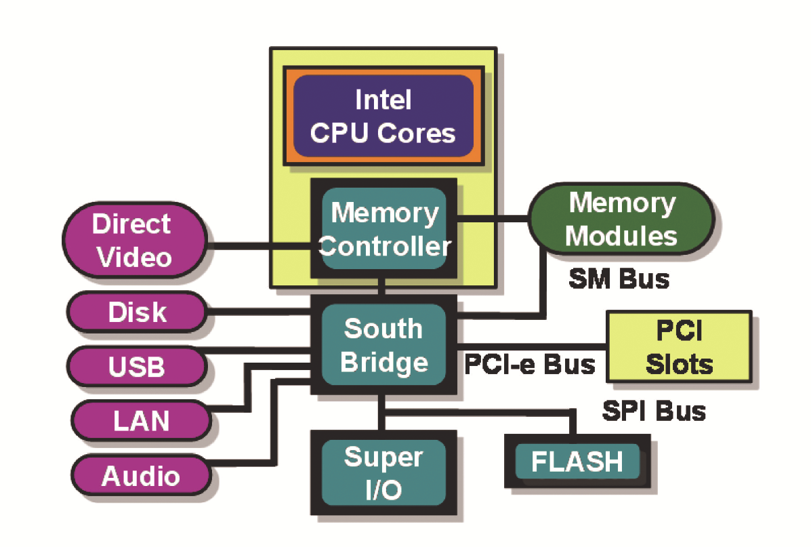
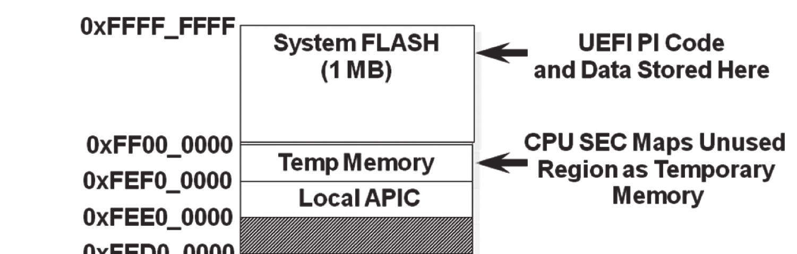
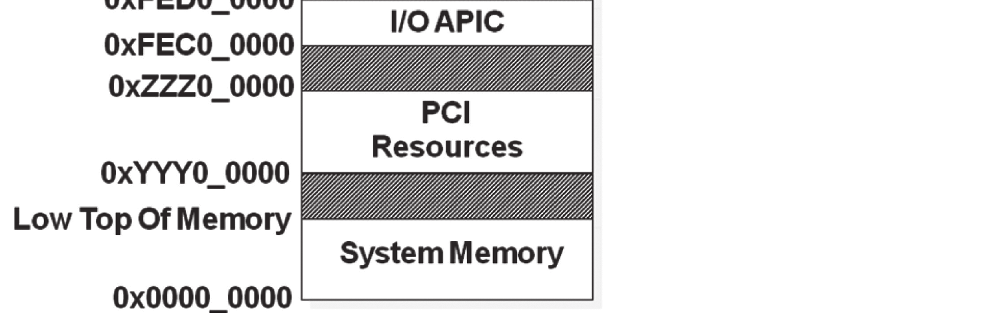
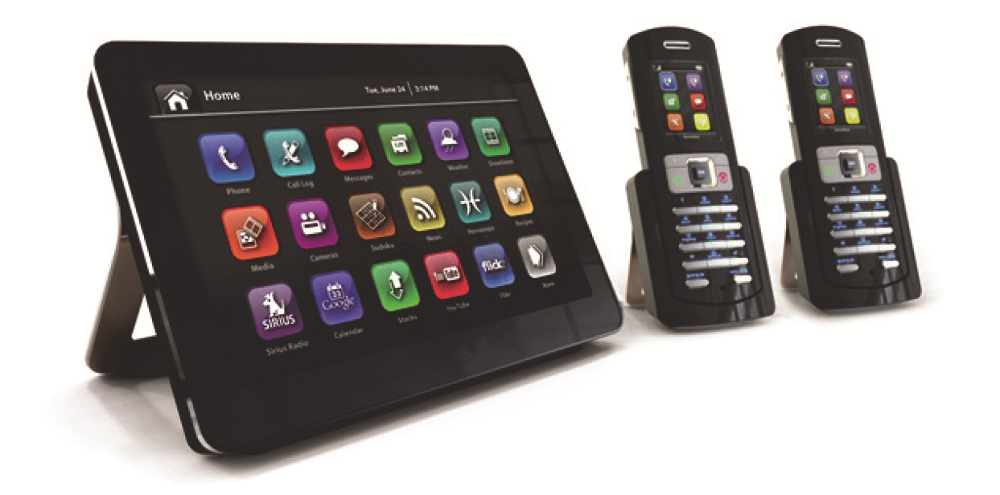
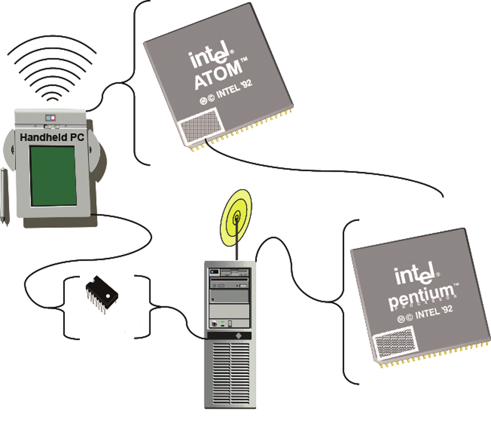
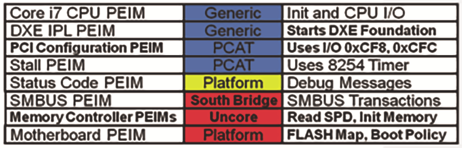
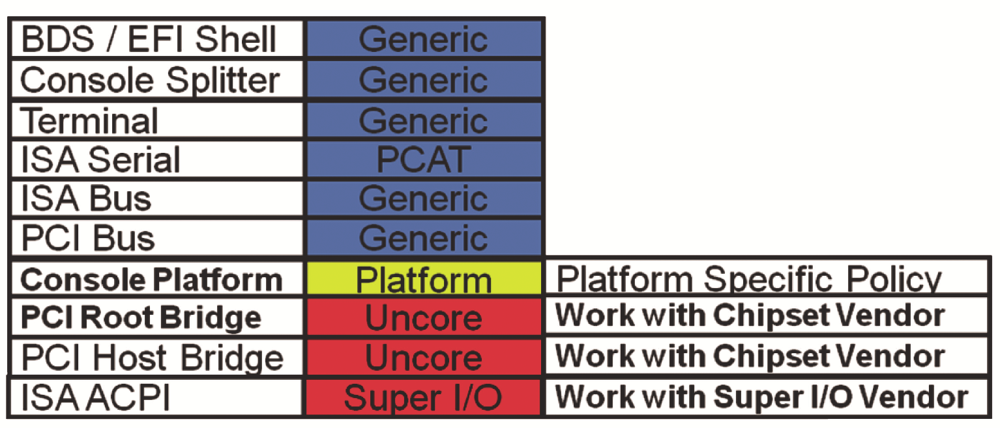
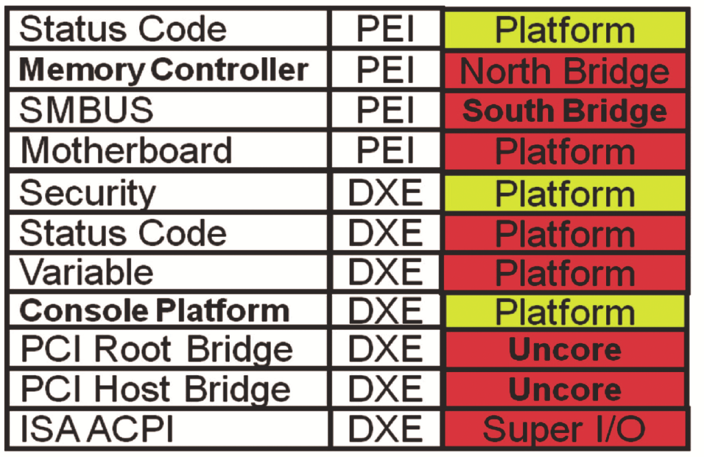
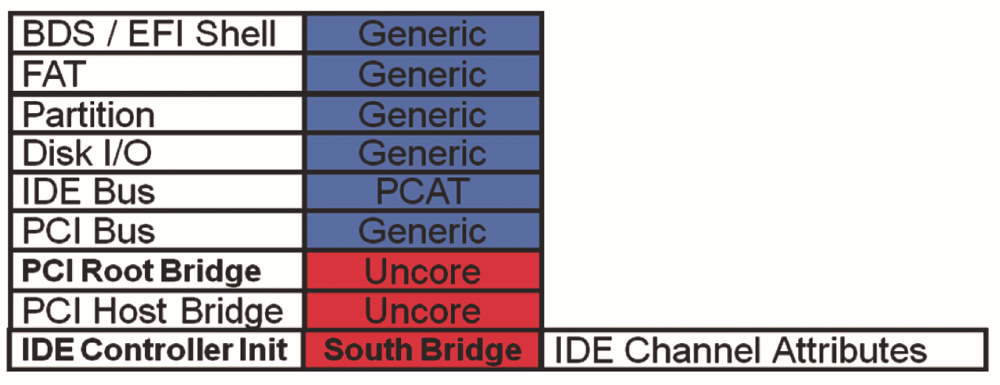

## **Chapter 7 – Different Types of Platforms** 

 

Variety's the very spice of life, that gives it all its flavor.

—William Cowper

 

This chapter describes different platform types and instantiations of the Platform In-

itialization (PI), such as embedded system, laptop, smart phone, netbook, tablet, PDA, desktop, and server. In addition to providing a “BIOS replacement” for plat-

forms that are commonly referred to as the Personal Computer, the PI infrastructure can be used to construct a boot and initialization environment for servers, handheld

devices, televisions, and so on. These sundry devices may include the more common IA-32 processors in the PC, but also feature the lower-power Intel Atom® processor,

or the mainframe-class processors such as the Itanium®-based systems. This chapter examines the PEI modules and DXE drivers that are necessary to construct a standard

PC platform. Then a subset of these modules used for emulation and Intel Atom-based netbooks and smart phones is described.

Figure 7.1 is a block diagram of a typical system, showing the various compo-nents, integrating the CPU package, south bridge, and super I/O, beyond other pos-

sible components. These blocks represent components manufactured on the system board. Each silicon and platform component will have an associated module or driver

to handle the respective initialization. In addition to the components on the system board, the initial system address map of the platform has specific region allocations.

Figure 7.2 shows the system address map of the PC platform, including memory allo-cation. The system flash in this platform configuration is 1 megabyte in size. The sys-

tem flash appears at the upper end of the 32-bit address space in order to allow the Intel® Core i7™ processor to fetch the first opcodes from flash upon reset. The reset

vector lies 16 bytes from the end of the address space. In the SEC, the initial opcodes of the SEC file allow for initial control flow of the PI-based platform firmware. From

the SEC, a collection of additional modules is executed. The Intel Core i7 processor has both the central processing unit (CPU), or *core,* and portions of the chipset, or

*uncore*. The latter elements include the integrated memory controller (IMC) and the system bridge, such as to PCI.

 

DOI 10.1515/9781501505690-009

**98** \| Chapter 7 – Different Types of Platforms

 

**Figure 7.1:** Typical PC System

 

**Figure 7.2:** System Address Map

 

Before going through the various components of the PC firmware load, a few other

platforms will be reviewed. These include the wireless personal digital assistant, which can be a low-power x64 or IA-32 CPU or an Intel Atom processor/system-on-a-

chip (SoC). The platforms then scale up to a server. This is shown in Figure 7.3.

Summary \| **99**

 

System Flash

 

**Desktop/Server PC**

 

**Figure 7. 3:** Span of Systems

 

Figure 7.4 shows a series of non-PCs, such as tablets and smart phones. The former includes a touch screen and integrated peripherals, such as 3G, Wi-Fi† and LTE/Wi-

MAX† radios. The latter devices, namely the smart phones, are highly integrated de-

vices with GPS, several radios, touch screens, accelerometers, and some NAND stor-age. Within all of these devices, an Intel Atom-based system on a chip and a specific collection of PEI modules (PEIMs) and DXE drivers execute to initialize the local hard-

ware complex. Then the DXE-based UEFI core would boot a UEFI-aware version of an embedded operating system, such as MeeGo† or VxWorks†. This demonstrates how

the platform concept can span many different topologies. These topologies include the classical, open-architecture PC and the headless, closed embedded system of an

I/O board.

 

**Figure 7.4:** An Intel Atom®-based System **100** \| Chapter 7 – Different Types of Platforms

 

Now let’s examine the components for the PC in Figure 7.1 in greater detail. The PEI phase of execution runs immediately after a restart event, such as a power-on reset,

resume from hibernate, and so on. The PEI modules execute in place from the flash

store, at least until the main memory complex (such as DRAM) has been initialized.

Figure 7.5 displays the collection of PEIMs for the PC platform. Different business interests would supply the modules. For example, in the platform codenamed Lake-

port, Intel would provide the Intel™ Core™ i7 CPU with an integrated Memory Con-troller Hub Memory Controller PEIM and the PCH (Platform Controller Hub) PEIM. The

PCH is also known as the “South Bridge.” In addition, for the SMBUS (System man-agement bus) attached to the PCH, there would be a PCH-specific SMBUS PEIM. The

status code PEIM would describe a platform-specific means by which to emit debug information, such as an 8-bit code emitted to I/O port 80-hex

 

**Figure 7.5:** Components of PEI on PC

 

The SMBUS PEIM for the PCH listed in Figure 7.5 provides a standard interface, or PEIM-to-PEIM interface (PPI), as shown in Figure 7.6. This allows the memory con-

troller PEIM to use the SMBUS read command in order to get information regarding the dual-inline memory module (DIMM) Serial Presence Detect (SPD) data on the

memory. The SPD data includes the size, timing, and other details about the memory modules. The memory initialization PEIM will use the EFI_PEI_SMBUS_PPI so that

the GMCH-specific memory initialization module does not need to know which com-ponent provides the SMBUS capability. In fact, many integrated super I/O (SIO) com-

ponents also provide an SMBUS controller, so this platform could have replaced the PCH SMBUS PEIM with an SIO SMBUS PEIM without having to modify the memory

controller PEIM.

Summary \| **101**

 

**typedef**

**EFI_STATUS**

**(EFIAPI \*PEI_SMBUS_PPI_EXECUTE_OPERATION) (**

**IN EFI_PEI_SERVICE \*\*PeiServices,**

**IN struct EFI_PEI_SMBUS_PPI \*This,**

**IN EFI_SMBUS_DEVICE_ADDRESS SlaveAddress,**

**IN EFI_SMBUS_DEVICE_COMMAND Command,**

**IN EFI_SMBUS_OPERATION Operation,**

**IN BOOLEAN PecCheck,**

**IN OUT UINTN \*Length,**

**IN OUT VOID \*Buffer**

**);**

**typedef struct {**

**PEI_SMBUS_PPI_EXECUTE_OPERATION Execute;**

**PEI_SMBUS_PPI_ARP_DEVICE ArpDevice;**

**} EFI_PEI_SMBUS_PPI;**

 

**Figure 7.6:** Code Fragment for a PEIM PPI

 

Many implementations are possible beyond the EFI_PEI_SMBUS_PPI shown earlier.

Figure 7.7 shows a code fragment that implements the SMBUS read operation for the PCH component listed earlier. Note the use of the CPU I/O abstraction for performing

the I/O operations against the PCH component. The fact that the logic is written in C means that this same PCH on an Intel Atom or Itanium-based system could reuse the

same source code through a simple compilation for the target microarchitecture.

 

**\#define SMBUS_R_HD0 0xEFA5**

**\#define SMBUS_R_HBD 0xEFA7**

**EFI_PEI_SERVICES \*PeiServices;**

**SMBUS_PRIVATE_DATA \*Private;**

**UINT8 Index, BlockCount** **\*Length;**

**UINT8 \*Buffer;**

**BlockCount = Private-\>CpuIo.IoRead8 (**

**\*PeiServices,Private-\>CpuIo,SMBUS_R_HD0);**

**if (\*Length \< BlockCount) {**

**return EFI_BUFFER_TOO_SMALL;**

**} else {**

**for (Index = 0; Index \< BlockCount; Index++) {**

**Buffer\[Index\] = Private-\>CpuIo.IoRead8 (**

**\*PeiServices,Private-\>CpuIo,SMBUS_R_HBD);**

**}**

**}**

 

**Figure 7.7:** Code Fragment of PEIM Implementation

 

Beyond the PEI phase, the DXE core requires a series of platform-, CPU-, and chipset-specific drivers in order to provide a fully-instantiated set of DXE/EFI services. Figure

7.8 lists the collection of architectural protocols that are necessary for the PC platform under study.

**102** \| Chapter 7 – Different Types of Platforms

 

Watchdog Generic Uses Timer-based Events

**Monotonic Counter** Generic Uses Variable Services

Runtime Generic Platform Independent CPU Generic Pentium 4 DXE Driver BDS Generic Use Sample One for Now

Timer PCAT Uses 8254 Timer Metronome PCAT Uses 8254 Timer Reset PCAT I/O 0xCF9

Real Time Clock PCAT I/O 0x70-0x71

Security Platform **Platform Specific Authentication** Status Code Platform Debug Messages Variable Platform Depends on FLASH Map

 

**Figure 7.8:** Architectural Protocols

 

The fact that the DXE Foundation does not presume anything about the timekeeping logic, interrupt controller, instruction set, and so on, means that the DXE Foundation

C code can be retargeted for a large class of platforms without reengineering the Foun-dation code itself. Instead, a different collection of the architectural protocols (APs)

can affect the Foundation port.

One aspect of the system that needs to be abstracted is the management of time.

The timekeeping hardware on a PC/AT compatible chipset, such as the 8254 timer, differs from the CPU-integrated timer-counter (ITC) on the Itanium processor or the

timekeeping logic specific to the Intel Atom processor. As such, in order to have a single implementation of the DXE Foundation watchdog-timer logic, the access to

CPU/chipset-specific timing hardware is implemented via the Timer Architectural Protocol. This AP has a series of services, such as getting and setting the time period.

The setting of the time period will be reviewed across our reference class of platforms.

To begin, Figure 7.9 provides an instance of the set timer service for the NT32

platform. NT32 is a virtual PI platform that executes upon a 32-bit Microsoft Windows system as a user-mode process. It is a “soft” platform in that the platform capabilities

are abstracted through Win32 services. As such, the implementation of this AP service doesn’t access an I/O controller or chipset control/status registers. Instead, the AP

invokes a series of Win32 services to provide mutual exclusion and an operating sys-tem thread to emulate the timer action.

Summary \| **103**

 

**EFI_STATUS**

**TimerDriverSetTimerPeriod (**

**IN EFI_TIMER_ARCH_PROTOCOL \*This,**

**IN UINT64 TimerPeriod**

**)**

**{**

**. . .**

**gWinNt-\>EnterCriticalSection (&mNtCriticalSection);**

**mTimerPeriod = TimerPeriod;**

**mCancelTimerThread = FALSE;**

**gWinNt-\>LeaveCriticalSection (&mNtCriticalSection);**

**mNtLastTick = gWinNt-\>GetTickCount ();**

**mNtTimerThreadHandle = gWinNt-\>CreateThread (**

**NULL,**

**0,**

**NtTimerThread,**

**&mTimer,**

**0,**

**&NtThreadId);**

**. . .**

**}**

 

**Figure 7.9:** NT32 Architectural Protocol

 

The NT32 implementation is radically different from a bare-metal PI implementation. An instance of a hardware implementation can be found in Figure 7.10. Herein the memory-

mapped registers of an Intel Atom system on a chip are accessed by the same AP set timer interface. The DXE Foundation cannot discern the difference between the virtual NT32

platform service and the actual hardware instance for an Intel Atom processor.

 

**EFI_STATUS**

**TimerDriverSetTimerPeriod (**

**IN EFI_TIMER_ARCH_PROTOCOL \*This,**

**IN UINT64 TimerPeriod**

**)**

**{**

**UINT64 Count;**

**UINT32 Data;**

**. . .**

**Count = DivU64x32 (MultU64x32 (TimerPeriod, APBT_CRYSTAL_FREQ) + 5000000,**

**10000000, NULL);**

**mCpuIo-\>Mem.Read** **(mCpuIo,EfiWidthUint32,APBT_BASE_PHYSICAL,1,&Data);**

**Data += (UINT32)Count;**

**mCpuIo-\>Mem.Write (mCpuIo,EfiWidthUint32,APBT_BASE_PHYSICAL,1,&Data);**

**Data ~= APBT_MSFT;**

**mCpuIo-\>Mem.Write (mCpuIo,EfiWidthUint32,APBT_BASE_PHYSICAL,1,&Data);**

**mCpuIo-\>Mem.Read** **(mCpuIo,EfiWidthUint32,APBT_PHYSICAL,1,&Data);**

**Data \|= (UINT32)(1 \<\< APBT_SHIFT);**

**mCpuIo-\>Mem.Write (mCpuIo,EfiWidthUint32,APBT_PHYSICAL,1,&Data);**

**. . .**

**}**

 

**Figure 7.10:** AP from Intel® Atom™

 

Finally, for the PC/AT and the circa mid-1980s ISA I/O hardware, there is an addi-

tional implementation of the AP service. Figure 7.11 shows the same set timer service when accessing the 8254 timer-counter and then registering an interrupt with the

8259 Programmable Interrupt Controller (PIC). This is often referred to as a PC/AT ver-sion of the AP since all PCs since the PC-XT have supported these hardware interfaces. **104** \| Chapter 7 – Different Types of Platforms

 

For the PC example in this chapter, these ISA I/O resources are supported by the PCH component, versus discrete components in the original PC.

 

**EFI_STATUS**

**TimerDriverSetTimerPeriod (**

**IN EFI_TIMER_ARCH_PROTOCOL \*This,**

**IN UINT64** **TimerPeriod**

**)**

**{**

**UINT64 Count;**

**UINT8 Data;**

**. . .**

**Count = DivU64x32 (MultU64x32(119318, (UINTN) TimerPeriod) + 500000,**

**1000000, NULL);**

**Data = 0x36;**

**mCpuIo-\>Io.Write(mCpuIo,EfiCpuIoWidthUint8,TIMER_CONTROL_PORT, 1, &Data);**

**mCpuIo-\>Io.Write(mCpuIo,EfiCpuIoWidthFifoUint8,TIMER0_COUNT_PORT,2,&Count);**

**mLegacy8259-\>EnableIrq (mLegacy8259, Efi8259Irq0, FALSE);**

**. . .**

**}**

 

**Fig7.11:** AP for PC/AT

 

Beyond the many implementation options for an AP to provide the breadth of plat-

form porting, additional capabilities in DXE support various platform targets. In UEFI, the interaction with the platform occurs through the input and output console

services. The console input for a PC is typically a PS/2 or USB keyboard, and the out-put is a VGA or enhanced video display. But the I/O card studied earlier has no tradi-

tional “head” or display. These deeply embedded platforms may only have a simple serial interface to the system. Interestingly, the same PC hardware can also run with-

out a traditional display and interact with the user via a simple serial interface. Figure 7.12 displays a console stack for an UEFI system built upon a serial interface.

 

**BDS / EFI Shell**

 

**Simple Input** **Simple Text** **Virtual**

**Protocol** **Output Protocol** **Console**

**Simple Input** **Simple Text** **Physical**

**Protocol** **Output Protocol** **Console**

**Serial I/O Protocol**

 

**ISA I/O Protocol**

 

**PCI I/O Protocol**

 

**PCI Root Bridge** **PCI Host Bridge Resource** **ISA ACPI Protocol**

**I/O Protocol** **Allocation Protocol**

 

**Figure 7.12:** Console Stack on a PC

Summary \| **105**

 

In order to build out this stack, the boot-device selection (BDS) or the UEFI shell pro-vides an application or command line interface (CLI) to the user. The Simple Input

and output protocols are published via a console driver that layers upon the Serial

I/O protocol. For the PCI-based PC, a PCI root bridge protocol allows access to the serial port control and status registers; for the Intel Atom platform with an internally-integrated UART/serial port, an alternate low-level protocol may exist to access these

same registers.

For this platform layering, the components listed in Figure 7.13 describe the DXE

and UEFI components needed to build out this console stack. Just as in the case of the PEI modules, different interests can deliver the DXE and UEFI drivers. For example,

the Super I/O vendor may deliver the ISA ACPI driver, the silicon vendor PCI root bridge (such as the GMCH in this PC), a platform console driver, and then a set of

reusable components based upon the PC/AT ISA hardware.

 

**Figure 7.13:** Components for Console Stack

 

Beyond the console components, several other PEI modules and DXE components need to be included into the firmware volume. These other components, listed in Fig-

ure 7.14, provide for other capabilities. These include the platform-specific means by which to store UEFI variables, platform policy for security, and configuration.

**106** \| Chapter 7 – Different Types of Platforms

 

**Figure 7.14:** DXE Drivers on a PC

 

The UEFI variables can be stored in various regions of the flash part (or a service pro-cessor on a server), so a driver needs to abstract this store. For security, the vendor

may demand that field component updates be signed or that modules dispatched be hash-extended into a Trusted Platform Module (TPM). The security driver will ab-

stract these security capabilities.

A final feature to describe the component layering of DXE drivers is support for

the disk subsystem, namely the Integrated Device Electronics (IDE) and a UEFI file system. The protocol layering for the disk subsystem up to the file system instance

are shown in Figure 7.15.

 

**BDS / EFI Shell**

 

**File Sys Protocol File Sys Protocol**

 

**Disk I/O Protocol** **Disk I/O Protocol**

 

**Block I/O Protocol Block I/O Protocol** **Partition**

 

**Disk I/O Protocol** **Disk I/O Protocol**

 

**Block I/O Protocol** **Block I/O Protocol** **Physical Disk**

 

**PCI I/O Protocol**

 

**PCI Root Bridge** **PCI Host Bridge Resource** **IDE Controller Init**

**I/O Protocol** **Allocation Protocol**

 

**Figure 7.15:** IDE Stack

Summary \| **107**

 

The same UEFI shell or BDS resides at the top of the protocol layering. Instances of the simple file system (FS) protocol provide the read/write/open/close capability to

applications. The FS protocols layer atop disk I/O protocol. A disk I/O provides byte-

level access to a sector-oriented block device. As such, disk I/O is a software-only driver that provides this mapping from hardware-specific block I/O abstractions. The disk I/O layer binds to a series of block I/O instances. The block I/O protocol is pub-

lished by the block device interest, such as the PCH driver in DXE that abstracts the Serial AT-Attachment (SATA) disk controller in the PCH. The disk driver uses the PCI

Block I/O protocol to access the control and status registers in the PCH component.

The components that provide these capabilities in the file system stack can be

found in Figure 7.16. The file system components include the File Allocation Table (FAT) driver, a driver that provides FAT12/16/32 support. FAT is the original file sys-

tem for MS-DOS on the original PC that has been extended over time, culminating in the 32-bit evolution of FAT in Windows95 as FAT32. In addition, providing different

performance options of the storage channel can be abstracted via the IDE Controller Initialization component. This provides an API so that a platform setup/configuration

program or diagnostic can change the PCH settings of this feature.

 

**Figure 7.16:** Components for IDE Init

 

This same console stack for the serial port and file system stack for the SATA con-

troller only depends upon the PCH components, a PCI abstraction, and appropriate support components. As such, putting this same PCH, or a logically-equivalent ver-

sion of this chip integrated into another application-specific integrated circuit (ASIC), will admit reuse of these same binaries on other like systems (such as an

x64 desktop to an x64 server). Beyond this binary reuse across IA32 and x64 plat-form classes, the C code allows for reuse. The use of this PCH, whether the literal

component or the aforementioned logical integration, on the Itanium Processor, can occur via a recompilation of the component C code with the Itanium Processor

as the target for the binary.

**108** \| Chapter 7 – Different Types of Platforms

 

OS Pre-boot

Tools

UEFI Specificaon

 

Platform

Drivers

 

**Intel** Silicon **FSP**

Component **®** PEIMs

Modules

Hardware

 

**Figure 7.17:** Intel ® FSP

 

Beyond the platforms listed above, there is an increasing focus on open source. This open source of a UEFI conformant core, such as one based upon the EFI Developer Kit

II, must be tempered with the need to preserve intellectual property. As such, one approach to deployment to open source core plus closed source binary includes lev-

eraging the Intel ® Firmware Support Package, or Intel FSP. The idea behind the Intel FSP is to encapsulate low-level flows, such as the memory initialization PEIM’s, into

a well-defined binary.

This is the familiar layering diagram with the Green H of the generic EDKII UEFI

core, the yellow line designating the UEFI API conformance, the newly introduced element of the Intel FSP at the bottom, and finally, the platform drivers. The platform

drivers include board specific PEIM’s and DXE drivers that encapsulate board specific details like GPIO programming, ACPI tables, and silicon drivers based upon public

documentation.

The Intel FSP will allow for a work flow wherein a developer can take an open

source set of schematics, such as the Minnow Board Max for the Intel® Atom® E3800-series CPU, and combine with the EDKII core and platform code from GitHub, along

with the Intel ® FSP binary from an alternate public repository. These elements can be combined together to provide a full platform bootable solution.

The original Intel FSP was used by several open source boot environments, such as coreboot, U-Boot, and EDKII. There was inconsistency in the interface implemen-

tation that was retrospectively locked down into what was called Intel FSP 1.0. This entailed separating out the generic interfaces to the Intel FSP from the system on a

chip (SOC) specific details. From 1.0 the architecture was evolved slightly to 1.1 to ease integration.

Summary \| **109**

 

**Boot Flow 1.0** **Boot Flow 1.1**

**Switch to 32-bit Mode** **Switch to 32-bit Mode** **TempRamInit**

**Find FSP_INFO_HEADER** - Load microcode **Find FSP_INFO_HEADER** **Call to TempRamInit API** - Enable CAR **Call to TempRamInit API**

 

**(Pass Continuation Func)** **Pre Memory Init** **Pre MemoryInit** **FspMemoryInit**- Memory Init **Call FspMemoryInit API** **Call FspInit API** RAM **Switch Stack &** emp **TempRamExit** **Temp RAM migration**- Tear down CAR **FspInit** , Chipset & CPU Init down T **Call TempRamExit API** **Continuation Func**- Migrate data

**(Parse FSP Return Data)** ear - T **FspSiliconInit** **Call to FspSiliconInit API**- Memory- CPU /Chipset Init

 

**Bus and Device Init** **Bus and Device Init** **Call NotifyPhase** **NotifyPhase** **Call NotifyPhase**- Complete Init **(PostPciEnumeration)** **(PostPciEnumeration)**- Lock settings

**Boot Device Init** **Boot Device Init**

 

**Figure 7.18:** Intel ® FSP1.0 versus 1.1

 

Y Reset System x X

Intel® FSP

Reset Vector

Switch to 32 bit Mode Find FSP Header in FSP-S

FSP-T FSP-S call *FspSiliconInit()*

 

Find FSP Header in FSP-T API *TempRamInit()*

call C Yes

Setup Stack Y F Reset

FSP INFO G CFG Required?

Pre-Mem Init

Header

No

Bus and Device Init

Find FSP Header in FSP-M FSP-M call *NofyPhase()*API call *FspMemoryInit()* (post PCI)

CFG API

Boot Device Init

Yes

call API

Y Reset *NofyPhase()*

Required?

(ReadyToBoot)

API FSP INFO

No Header

Load OS / Payload

Migrate Temp Stack call Header*NofyPhase()* FSP INFO

API

call (EndOfFirmware) *TempRamExit()*

FW handoff to OS

### X

 

**Figure 7.19:** Intel ® FSP 2.0

 

Finally, the need for memory-mapped tables in 1.0 and 1.1, and dependency upon memory-mapped SPI-attached SPI NOR, led to decoupling the header. This led to the

definition of the Intel FSP 2.0 now seem in the market.

From a code re-use, the Intel FSP re-uses the PI Firmware Volume (FV) and inter-nal PEI Modules. So even though the aggregate Intel FSP is a large binary, the internal contents are PI-based art, as shown below.

**110** \| Chapter 7 – Different Types of Platforms

 

**FSP Firmware Volume**

FspInfo

 

PeiMain

 

MemoryInit

 

PlatformEarlyInit

SocInit

…...

 

CpuInit

 

PlatformLateInit

DxeIpl

 

FspVpd

 

PadFile

 

SecCore

 

**Figure 7.20:** Intel ® FSP binary

 

Intel FSP2.0 comprehends a world of source plus binary. This is not the only path to

implementation, of course. The Intel Galileo Quark-based EDKII firmware is fully open source, for example.

 

**Summary**

 

This chapter has provided an overview of some platforms that are based upon UEFI and PI firmware technology. The power of the abstractions of the interfaces comes into play as the firmware can be implemented on a PC/AT system, Itanium, and non-

PC/AT system on a chip (SoC). In addition to the portability of the abstractions, this

## chapter has also shown have various modules are integrated in order to provide a full console and storage stack. It is through these detailed platform realizations that the

composition of the industry APIs and their interoperation comes into light.