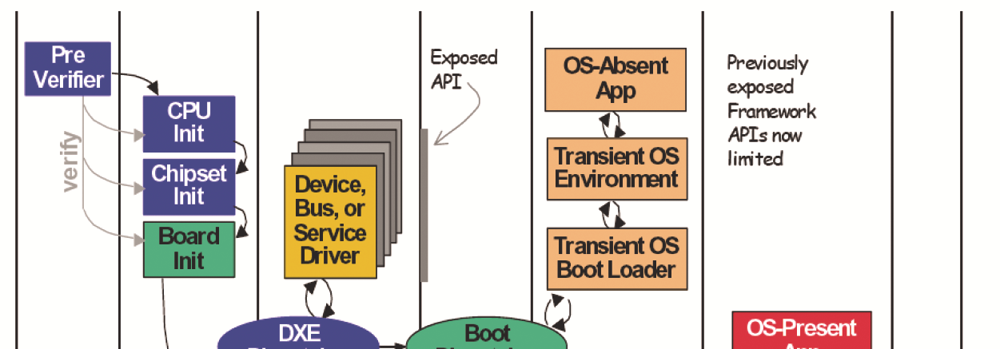
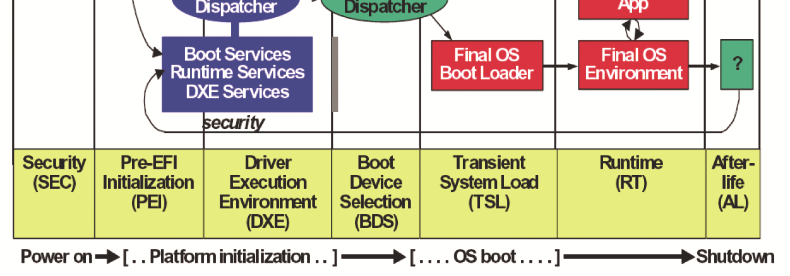
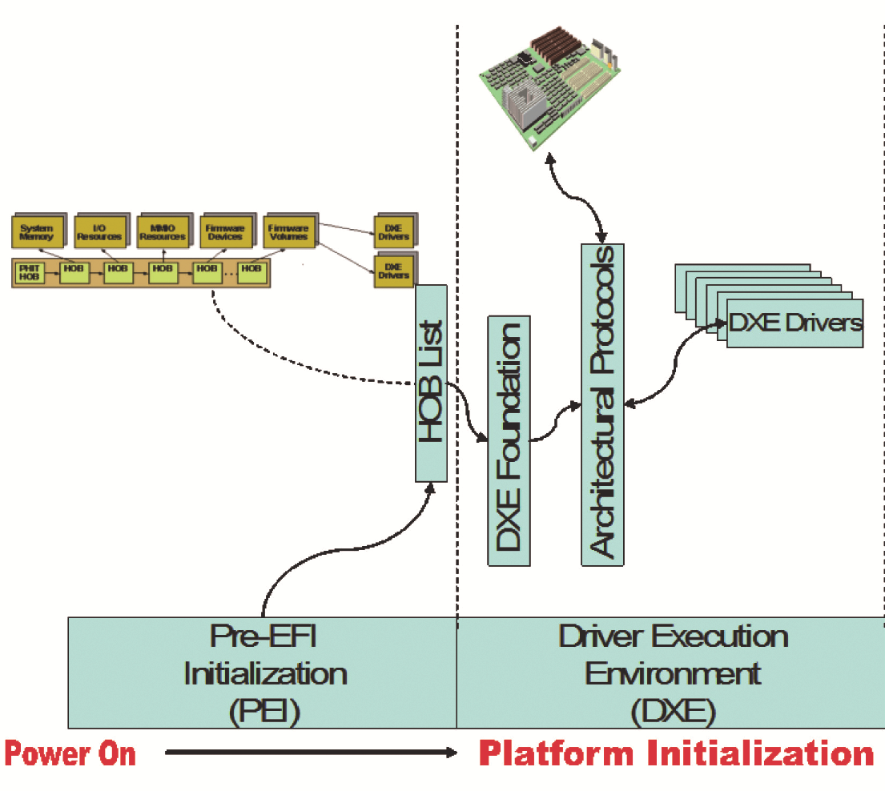
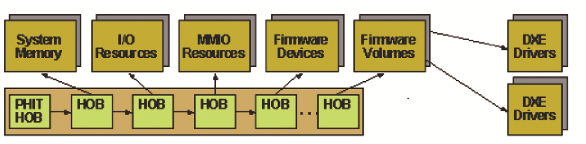
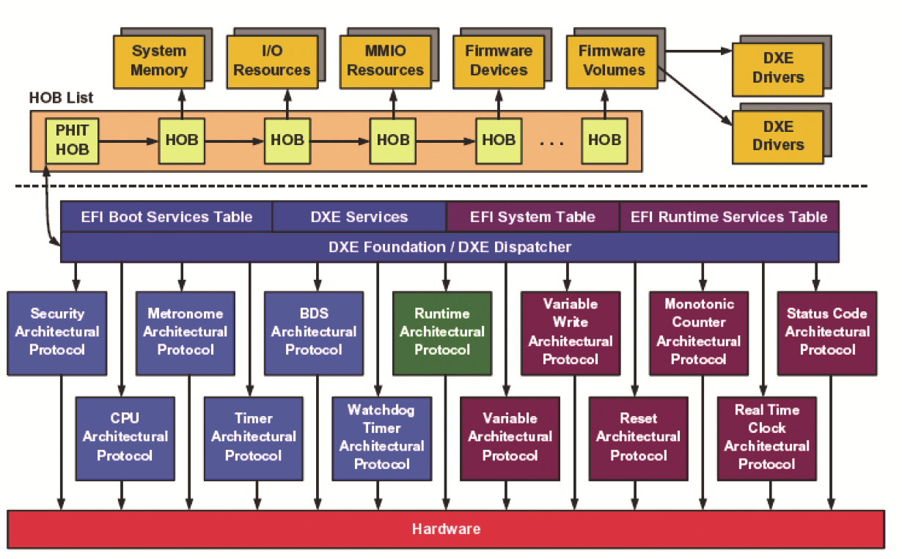
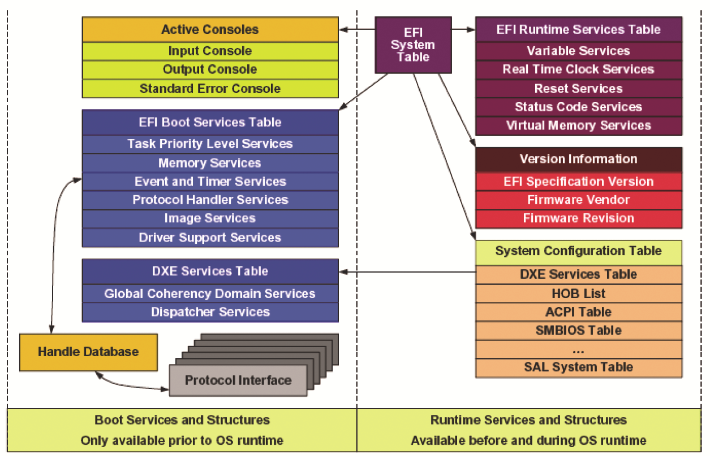
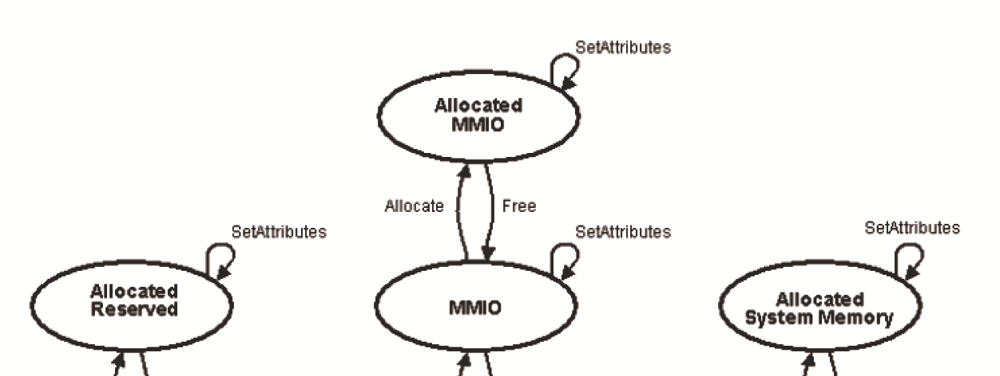
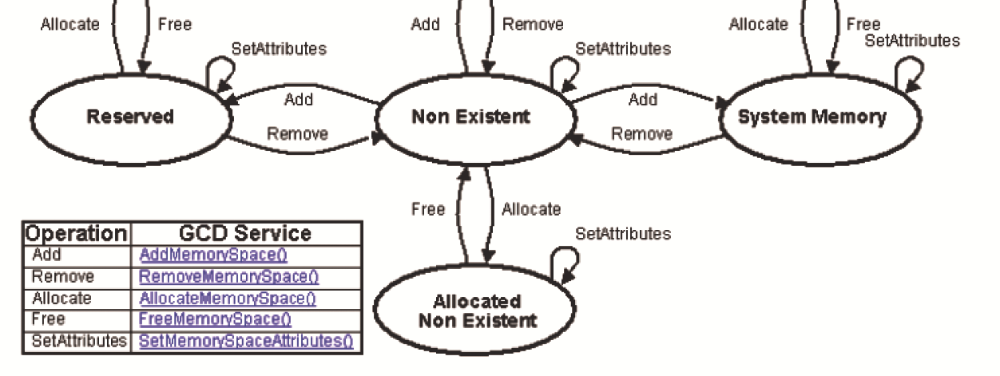
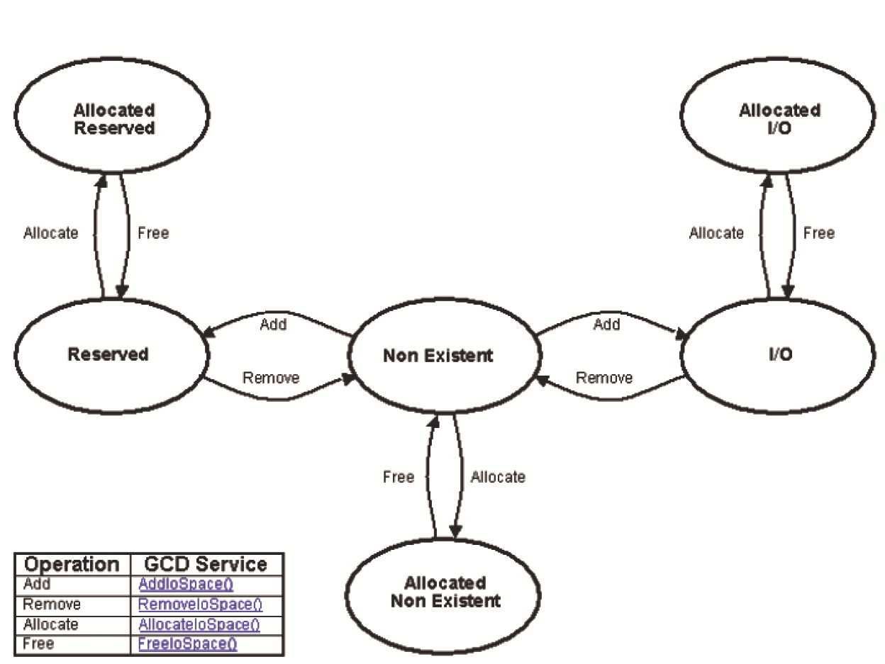
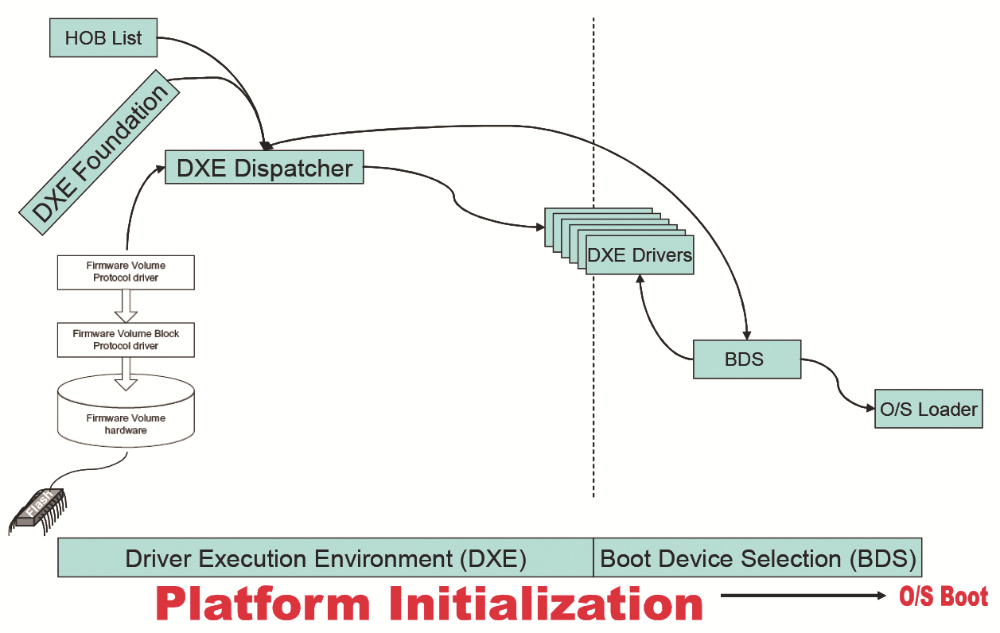

## **Chapter 8 – DXE Basics: Core, Dispatching, and** 

 

**Drivers**

 

I do not fear computers. I fear the lack of them.

—Isaac Asimov

 

This chapter describes the makeup of the Driver Execution Environment (DXE) and

how it operates during the platform evolution. In addition, it describes some of the

fundamental concepts of how information is handed off between phases of the plat-form boot process and how the underlying components are launched. The launching description also provides some insight into how launch orders are constructed, since

they do deviate from what is commonly referred to as POST tables in legacy firmware.

 

The DXE phase contains an implementation of UEFI that is compliant with the PI (Platform Initialization) *Specification*. As a result, both the DXE Core and DXE drivers

share many of the attributes of UEFI images. The DXE phase is the phase where most of the system initialization is performed. The Pre-EFI Initialization (PEI) phase is re-

sponsible for initializing permanent memory in the platform so the DXE phase can be loaded and executed. The state of the system at the end of the PEI phase is passed to

the DXE phase through a list of position-independent data structures called Hand-Off Blocks (HOBs). The DXE phase consists of several components:

■ DXE Core

■ DXE Dispatcher

■ DXE Drivers

 

The DXE Core produces a set of Boot Services, Runtime Services, and DXE Services. The DXE Dispatcher is responsible for discovering and executing DXE drivers in the

correct order. The DXE drivers are responsible for initializing the processor, chipset, and platform components as well as providing software abstractions for console and

boot devices. These components work together to initialize the platform and provide the services required to boot an OS. The DXE and Boot Device Selection (BDS) phases

work together to establish consoles and attempt the booting of operating systems. The DXE phase is terminated when an OS successfully begins its boot process—that

is, when the BDS phase starts. Only the runtime services provided by the DXE Core and services provided by runtime DXE drivers are allowed to persist into the OS

runtime environment. The result of DXE is the presentation of a fully formed UEFI interface.

 

DOI 10.1515/9781501505690-010

**112** \| Chapter 8 – DXE Basics: Core, Dispatching, and Drivers

 

Figure 8.1 shows the phases that a platform with UEFI compatible firmware goes through on a cold boot. This chapter covers the following:

■ Transition from the PEI to the DXE phase

■ The DXE phase

■ The DXE phase’s interaction with the BDS phase

 

**Figure 8.1:** Platform Boot Phases

 

**DXE Core**

 

The DXE Core is designed to be completely portable with no processor, chipset, or platform dependencies. This portability is accomplished by incorporating several fea-

tures:

■ The DXE Core depends only upon a HOB list for its initial state. This single de-

pendency means that the DXE Core does not depend on any services from a pre-

vious phase, so all the prior phases can be unloaded once the HOB list is passed

to the DXE Core.

■ The DXE Core does not contain any hard-coded addresses. As a result, the DXE

Core can be loaded anywhere in physical memory, and it can function correctly

no matter where physical memory or where firmware volumes are located in the

processor’s physical address space.

■ The DXE Core does not contain any processor-specific, chipset-specific, or plat-

form-specific information. Instead, the DXE Core is abstracted from the system

DXE Core \| **113**

 

hardware through a set of architectural protocol interfaces. These architectural

protocol interfaces are produced by a set of DXE drivers that are invoked by the

DXE Dispatcher.

 

Below is an illustration showing how data is handed off between the PEI and DXE phases.

 

**Figure 8.2:** Early Initialization Illustrating a Handoff between PEI and DXE

 

The DXE Core produces the EFI System Table and its associated set of EFI Boot Ser-

vices and EFI Runtime Services. The DXE Core also contains the DXE Dispatcher, whose main purpose is to discover and execute DXE drivers stored in firmware vol-

umes. The order in which DXE drivers are executed is determined by a combination of the optional a priori file (see the section on the DXE dispatcher) and the set of de-

pendency expressions that are associated with the DXE drivers. The firmware volume file format allows dependency expressions to be packaged with the executable DXE

driver image. DXE drivers utilize a PE/COFF image format, so the DXE Dispatcher must also contain a PE/COFF loader to load and execute DXE drivers.

The DXE Core must also maintain a handle database. A handle database is a list of one or more handles, and a handle is a list of one or more unique protocol GUIDs.

A protocol is a software abstraction for a set of services. Some protocols abstract I/O **114** \| Chapter 8 – DXE Basics: Core, Dispatching, and Drivers

 

devices, and other protocols abstract a common set of system services. A protocol typ-ically contains a set of APIs and some number of data fields. Every protocol is named

by a GUID, and the DXE Core produces services that allow protocols to be registered

in the handle database. As the DXE Dispatcher executes DXE drivers, additional pro-tocols are added to the handle database including the DXE Architectural Protocols that are used to abstract the DXE Core from platform-specific details.

 

**Hand-Off Block (HOB) List**

 

The HOB list contains all the information that the DXE Core requires to produce its memory-based services. The HOB list contains information on the boot mode, the pro-

cessor’s instruction set, and the memory that was discovered in the PEI phase. It also contains a description of the system memory that was initialized by the PEI phase,

along with information about the firmware devices that were discovered in the PEI phase. The firmware device information includes the system memory locations of the

firmware devices and of the firmware volumes that are contained within those firm-ware devices. The firmware volumes may contain DXE drivers, and the DXE Dis-

patcher is responsible for loading and executing the DXE drivers that are discovered in those firmware volumes. Finally, the HOB list may contain the I/O resources and

memory-mapped I/O resources that were discovered in the PEI phase.

Figure 8.3 shows an example HOB list. The first entry in the HOB list is always the

Phase Handoff Information Table (PHIT) HOB that contains the boot mode. The rest of the HOB list entries can appear in any order. This example shows the different types

of system resources that can be described in a HOB list. The most important ones to the DXE Core are the HOBs that describe system memory and the HOBs that describe

firmware volumes. A HOB list is always terminated by an end-of-list HOB. The one additional HOB type that is not shown in Figure 8.3 is the GUID extension HOB that

allows a PEIM to pass private data to a DXE driver. Only the DXE driver that recognizes the GUID value in the GUID extension HOB can understand the data in that HOB. The

HOB entries are all designed to be position-independent. This independence allows the DXE Core to relocate the HOB list to a different location if it is not suitable to the

DXE Core.

 

**Figure 8.3:** HOB List

DXE Core \| **115**

 

**DXE Architectural Protocols**

 

The DXE Core is abstracted from the platform hardware through a set of DXE Archi-

tectural Protocols. The DXE Core consumes these protocols to produce the EFI Boot Services and EFI Runtime Services. DXE drivers that are loaded from firmware vol-umes produce the DXE Architectural Protocols. This design means that the DXE Core

must have enough services to load and start DXE drivers before even a single DXE driver is executed.

The DXE Core is passed a HOB list that must contain a description of some amount of system memory and at least one firmware volume. The system memory descriptors

in the HOB list are used to initialize the UEFI services that require only memory to function correctly. The system is also guaranteed to be running on only one processor

in flat physical mode with interrupts disabled. The firmware volume is passed to the DXE Dispatcher, which must contain a read-only FFS driver to search for the a priori

file and any DXE drivers in the firmware volumes. When a driver is discovered that needs to be loaded and executed, the DXE Dispatcher uses a PE/COFF loader to load

and invoke the DXE driver. The early DXE drivers produce the DXE Architectural Pro-tocols, so the DXE Core can produce the full complement of EFI Boot Services and EFI

Runtime Services. Figure 8.4 shows the HOB list being passed to the DXE Core. The DXE Core consumes the services of the DXE Architectural Protocols shown in the fig-

ure and then produces the EFI System Table, EFI Boot Services Table, and the EFI Runtime Services Table.

 

**Figure 8.4:** DXE Architectural Protocols

**116** \| Chapter 8 – DXE Basics: Core, Dispatching, and Drivers

 

Figure 8.4 shows all the major components present in the DXE phase. The EFI Boot Services Table and DXE Services Table shown on the left are allocated from UEFI boot

services memory. This allocation means that the EFI Boot Services Table and DXE Ser-

vices Table are freed when the OS runtime phase is entered. The EFI System Table and EFI Runtime Services Table on the right are allocated from EFI Runtime Services memory, and they do persist into the OS runtime phase.

The DXE Architectural Protocols shown on the left in Figure 8.4 are used to pro-duce the EFI Boot Services. The DXE Core, DXE Dispatcher, and the protocols shown

on the left are freed when the system transitions to the OS runtime phase. The DXE Architectural Protocols shown on the right are used to produce the EFI Runtime Ser-

vices. These services persist in the OS runtime phase. The Runtime Architectural Pro-tocol in the middle is special. This protocol provides the services that are required to

transition the runtime services from physical mode to virtual mode under the direc-tion of an OS. Once this transition is complete, these services can no longer be used.

The following is a brief summary of the DXE Architectural Protocols:

 

■ Security Architectural Protocol: Allows the DXE Core to authenticate files stored

in firmware volumes before they are used.

■ CPU Architectural Protocol: Provides services to manage caches, manage inter-

rupts, retrieve the processor’s frequency, and query any processor-based timers.

■ Metronome Architectural Protocol: Provides the services required to perform very

short calibrated stalls.

■ Timer Architectural Protocol: Provides the services required to install and enable

the heartbeat timer interrupt required by the timer services in the DXE Core.

■ BDS Architectural Protocol: Provides an entry point that the DXE Core calls once

after all of the DXE drivers have been dispatched from all of the firmware vol-

umes. This entry point is the transition from the DXE phase to the BDS phase, and

it is responsible for establishing consoles and enabling the boot devices required

to boot an OS.

■ Watchdog Timer Architectural Protocol: Provides the services required to enable

and disable a watchdog timer in the platform.

■ Runtime Architectural Protocol: Provides the services required to convert all

runtime services and runtime drivers from physical mappings to virtual map-

pings.

■ Variable Architectural Protocol: Provides the services to retrieve environment

variables and set volatile environment variables.

■ Variable Write Architectural Protocol: Provides the services to set nonvolatile en-

vironment variables.

■ Monotonic Counter Architectural Protocol: Provides the services required by the

DXE Core to manage a 64-bit monotonic counter.

DXE Core \| **117**

 

■ Reset Architectural Protocol: Provides the services required to reset or shutdown

the platform.

■ Status Code Architectural Protocol: Provides the services to send status codes

from the DXE Core or DXE drivers to a log or device.

■ Real Time Clock Architectural Protocol: Provides the services to retrieve and set

the current time and date as well as the time and date of an optional wakeup

timer.

 

**EFI System Table**

 

The DXE Core produces the EFI System Table, which is consumed by every DXE driver

and executable image invoked by BDS. It contains all the information that is required for these components to use the services provided by the DXE Core and any previously

loaded DXE driver. Figure 8.5 shows the various components that are available through the EFI System Table.

 

**Figure 8.5:** EFI System Table and Related Components

 

The DXE Core produces the EFI Boot Services, EFI Runtime Services, and DXE Services

with the aid of the DXE Architectural Protocols. The EFI System Table provides access to all the active console devices in the platform and the set of EFI Configuration Ta-

bles. The EFI Configuration Tables are an extensible list of tables that describe the configuration of the platform including pointers to tables such as DXE Services, the

HOB list, ACPI, System Management BIOS (SMBIOS), and the SAL System Table. This **118** \| Chapter 8 – DXE Basics: Core, Dispatching, and Drivers

 

list may be expanded in the future as new table types are defined. Also, through the use of the Protocol Handle Services in the EFI Boot Services Table, any executable

image can access the handle database and any of the protocol interfaces that have

been registered by DXE drivers.

When the transition to the OS runtime is performed, the handle database, active consoles, EFI Boot Services, and services provided by boot service DXE drivers are

terminated. This termination frees more memory for use by the OS and leaves the EFI System Table, EFI Runtime Services Table, and the system configuration tables avail-

able in the OS runtime environment. You also have the option of converting all of the EFI Runtime Services from a physical address space to an operating system specific

virtual address space. This address space conversion may only be performed once.

 

**EFI Boot Services Table**

 

The following is a brief summary of the services that are available through the EFI

Boot Services Table:

■ Task Priority Services: Provides services to increase or decrease the current task

priority level. This priority mechanism can be used to implement simple locks

and to disable the timer interrupt for short periods of time. These services depend

on the CPU Architectural Protocol.

■ Memory Services: Provides services to allocate and free pages in 4 KB increments

and allocate and free pool on byte boundaries. It also provides a service to re-

trieve a map of all the current physical memory usage in the platform.

■ Event and Timer Services: Provides services to create events, signal events, check

the status of events, wait for events, and close events. One class of events is timer

events, which supports periodic timers with variable frequencies and one-shot

timers with variable durations. These services depend on the CPU Architectural

Protocol, Timer Architectural Protocol, Metronome Architectural Protocol, and

Watchdog Timer Architectural Protocol.

■ Protocol Handler Services: Provides services to add and remove handles from the

handle database. It also provides services to add and remove protocols from the

handles in the handle database. Additional services are available that allow any

component to look up handles in the handle database and open and close proto-

cols in the handle database.

■ Image Services: Provides services to load, start, exit, and unload images using

the PE/COFF image format. These services depend on the Security Architectural

Protocol.

■ Driver Support Services: Provides services to connect and disconnect drivers to

devices in the platform. These services are used by the BDS phase to either con-

nect all drivers to all devices, or to connect only the minimum number of drivers

DXE Core \| **119**

 

to devices required to establish the consoles and boot an OS. The minimal con-

nect strategy is how a fast boot mechanism is provided.

 

**EFI Runtime Services Table**

 

The following is a brief summary of the services that are available through the EFI Runtime Services Table:

■ Variable Services: Provides services to lookup, add, and remove environment

variables from nonvolatile storage. These services depend on the Variable Archi-

tectural Protocol and the Variable Write Architectural Protocol. ■ Real Time Clock Services: Provides services to get and set the current time and

date. It also provides services to get and set the time and date of an optional

wakeup timer. These services depend on the Real Time Clock Architectural Pro-

tocol.

■ Reset Services: Provides services to shut down or reset the platform. These ser-

vices depend on the Reset Architectural Protocol.

■ Status Code Services: Provides services to send status codes to a system log or a

status code reporting device. These services depend on the Status Code Architec-

tural Protocol.

■ Virtual Memory Services: Provides services that allow the runtime DXE compo-

nents to be converted from a physical memory map to a virtual memory map.

These services can only be called once in physical mode. Once the physical to

virtual conversion has been performed, these services cannot be called again.

These services depend on the Runtime Architectural Protocol.

 

**DXE Services Table**

 

The following is a brief summary of the services that are available through the DXE

Services Table:

■ Global Coherency Domain Services: Provides services to manage I/O resources,

memory-mapped I/O resources, and system memory resources in the platform.

These services are used to dynamically add and remove these resources from the

processor’s Global Coherency Domain (GCD).

■ DXE Dispatcher Services: Provides services to manage DXE drivers that are being

dispatched by the DXE Dispatcher.

**120** \| Chapter 8 – DXE Basics: Core, Dispatching, and Drivers

 

**Global Coherency Domain Services**

 

The Global Coherency Domain (GCD) Services are used to manage the memory and I/O resources visible to the boot processor. These resources are managed in two dif-

ferent maps:

■ GCD memory space map

■ GCD I/O space map

 

If memory or I/O resources are added, removed, allocated, or freed, then the GCD memory space map and GCD I/O space map are updated. GCD Services are also pro-

vided to retrieve the contents of these two resource maps.

The GCD Services can be broken up into two groups. The first manages the

memory resources visible to the boot processor, and the second manages the I/O re-sources visible to the boot processor. Not all processor types support I/O resources,

so the management of I/O resources may not be required. However, since system memory resources and memory-mapped I/O resources are required to execute the

DXE environment, the management of memory resources is always required.

 

**GCD Memory Resources**

 

The Global Coherency Domain (GCD) Services used to manage memory resources in-

clude the following:

■ AddMemorySpace()

■ AllocateMemorySpace()

■ FreeMemorySpace()

■ RemoveMemorySpace()

■ SetMemorySpaceAttributes()

 

The GCD Services used to retrieve the GCD memory space map include the following: ■ GetMemorySpaceDescriptor()

■ GetMemorySpaceMap()

 

The GCD memory space map is initialized from the HOB list that is passed to the entry

point of the DXE Core. One HOB type describes the number of address lines that are

used to access memory resources. This information is used to initialize the state of the GCD memory space map. Any memory regions outside this initial region are unavail-able to any of the GCD Services that are used to manage memory resources. The GCD

memory space map is designed to describe the memory address space with as many as 64 address lines. Each region in the GCD memory space map can begin and end on

a byte boundary. Additional HOB types describe the location of system memory, the

Global Coherency Domain Services \| **121**

 

location memory mapped I/O, the location of firmware devices, the location of firm-ware volumes, the location of reserved regions, and the location of system memory

regions that were allocated prior to the execution of the DXE Core. The DXE Core must

parse the contents of the HOB list to guarantee that memory regions reserved prior to the execution of the DXE Core are honored. As a result, the GCD memory space map must reflect the memory regions described in the HOB list. The GCD memory space

map provides the DXE Core with the information required to initialize the memory services such as AllocatePages(), FreePages(), AllocatePool(),

FreePool(), and GetMemoryMap().

 

A memory region described by the GCD memory space map can be in one of several different states:

■ Nonexistent memory

■ System memory

■ Memory-mapped I/O

■ Reserved memory

 

These memory regions can be allocated and freed by DXE drivers executing in the DXE

environment. In addition, a DXE driver can attempt to adjust the caching attributes of a memory region. Figure 8.6 shows the possible state transitions for each byte of memory

in the GCD memory space map. The transitions are labeled with the GCD Service that can move the byte from one state to another. The GCD services are required to merge

similar memory regions that are adjacent to each other into a single memory descriptor, which reduces the number of entries in the GCD memory space map.

**122** \| Chapter 8 – DXE Basics: Core, Dispatching, and Drivers

 

**Figure 8.6:** GCD Memory State Transitions

 

**GCD I/O Resources**

 

The Global Coherency Domain (GCD) Services used to manage I/O resources include the following:

■ AddIoSpace()

■ AllocateIoSpace()

■ FreeIoSpace()

■ RemoveIoSpace()

 

The GCD Services used to retrieve the GCD I/O space map include the following:

■ GetIoSpaceDescriptor()

■ GetIoSpaceMap()

 

The GCD I/O space map is initialized from the HOB list that is passed to the entry point

of the DXE Core. One HOB type describes the number of address lines that are used to access I/O resources. This information is used to initialize the state of the GCD I/O

space map. Any I/O regions outside this initial region are not available to any of the GCD Services that are used to manage I/O resources. The GCD I/O space map is de-

signed to describe the I/O address space with as many as 64 address lines. Each re-gion in the GCD I/O space map can begin and end on a byte boundary.

DXE Dispatcher \| **123**

 

An I/O region described by the GCD I/O space map can be in several different states. These include nonexistent I/O, I/O, and reserved I/O. These I/O regions can be

allocated and freed by DXE drivers executing in the DXE environment. Figure 8.7

shows the possible state transitions for each byte of I/O in the GCD I/O space map. The transitions are labeled with the GCD Service that can move the byte from one state to another. The GCD Services are required to merge similar I/O regions that are adja-

cent to each other into a single I/O descriptor, which reduces the number of entries in the GCD I/O space map.

 

**Figure 8.7:** GCD I/O State Transitions

 

**DXE Dispatcher**

 

After the DXE Core is initialized, control is handed to the DXE Dispatcher. The DXE Dispatcher is responsible for loading and invoking DXE drivers found in firmware vol-

umes. The DXE Dispatcher searches for drivers in the firmware volumes described by the HOB list. As execution continues, other firmware volumes might be located. When

they are, the DXE Dispatcher searches them for drivers as well.

When a new firmware volume is discovered, a search is made for its a priori file.

The a priori file has a fixed file name and contains the list of DXE drivers that should be loaded and executed first. There can be at most one a priori file per firmware vol-ume, although it is acceptable to have no a priori file at all. Once the DXE drivers from **124** \| Chapter 8 – DXE Basics: Core, Dispatching, and Drivers

 

the a priori file have been loaded and executed, the dependency expressions of the remaining DXE drivers in the firmware volumes are evaluated to determine the order

in which they will be loaded and executed. The a priori file provides a strongly or-

dered list of DXE drivers that are not required to use dependency expressions. The dependency expressions provide a weakly ordered execution of the remaining DXE drivers. Before each DXE driver is executed, it must be authenticated with the Security

Architectural Protocol. This authentication prevents DXE drivers with unknown ori-gins from being executed.

Control is transferred from the DXE Dispatcher to the BDS Architectural Protocol after the DXE drivers in the a priori file and all the DXE drivers whose dependency

expressions evaluate to TRUE have been loaded and executed. The BDS Architectural Protocol is responsible for establishing the console devices and attempting the boot

of operating systems. As the console devices are established and access to boot de-vices is established, additional firmware volumes may be discovered. If the BDS Ar-

chitectural Protocol is unable to start a console device or gain access to a boot device, it reinvokes the DXE Dispatcher. This invocation allows the DXE Dispatcher to load

and execute DXE drivers from firmware volumes that have been discovered since the last time the DXE Dispatcher was invoked. Once the DXE Dispatcher has loaded and

executed all the DXE drivers it can, control is once again returned to the BDS Archi-tectural Protocol to continue the OS boot process. Figure 8.8 illustrates this basic flow

between the Dispatcher, its launched drivers, and the BDS.

 

**Figure 8.8:** The Handshake between the Dispatcher and Other Components

DXE Dispatcher \| **125**

 

**The** ***a priori*** **File**

 

The a priori file is a special file that may be present in a firmware volume. The rule is

that there may be at most one a priori file per firmware volume present in a platform. The a priori file has a known GUID file name, so the DXE Dispatcher can always find the a priori file. Every time the DXE Dispatcher discovers a firmware volume, it first

looks for the a priori file. The a priori file contains the list of DXE drivers that should be loaded and executed before any other DXE drivers are discovered. The DXE drivers

listed in the a priori file are executed in the order that they appear. If any of those DXE drivers have an associated dependency expression, then those dependency expres-

sions are ignored.

The purpose of the a priori file is to provide a deterministic execution order of

DXE drivers. DXE drivers that are executed solely based on their dependency expres-sion are weakly ordered, which means that the execution order is not completely de-

terministic between boots or between platforms. Some cases, however, require a de-terministic execution order. One example would be to list the DXE drivers that are

required to debug the rest of the DXE phase in the a priori file. These DXE drivers that provide debug services might have been loaded much later if only their dependency

expressions were considered. By loading them earlier, more of the DXE Core and DXE drivers can be debugged. Another example is to use the a priori file to eliminate the

need for dependency expressions. Some embedded platforms may require only a few DXE drivers with a highly deterministic execution order. The a priori file can provide

this ordering, and none of the DXE drivers would require dependency expressions. The dependency expressions do have some amount of firmware device overhead, so

this method might actually conserve firmware space. The main purpose of the a priori file is to provide a greater degree of flexibility in the firmware design of a platform.

 

**Dependency Grammar**

 

A DXE driver is stored in a firmware volume as a file with one or more sections. One of the sections must be a PE/COFF image. If a DXE driver has a dependency expres-

sion, then it is stored in a dependency section. A DXE driver may contain additional sections for compression and security wrappers. The DXE Dispatcher can identify the

DXE drivers by their file type. In addition, the DXE Dispatcher can look up the de-pendency expression for a DXE driver by looking for a dependency section in a DXE

driver file. The dependency section contains a section header followed by the actual dependency expression that is composed of a packed byte stream of opcodes and op-

erands.

Dependency expressions stored in dependency sections are designed to be small

to conserve space. In addition, they are designed to be simple and quick to evaluate to reduce execution overhead. These two goals are met by designing a small, stack-**126** \| Chapter 8 – DXE Basics: Core, Dispatching, and Drivers

 

based instruction set to encode the dependency expressions. The DXE Dispatcher must implement an interpreter for this instruction set to evaluate dependency expres-

sions. Table 8.1 gives a summary of the supported opcodes in the dependency expres-

sion instruction set.

 

**Table 8.1:** Supported Opcodes in the Dependency Expression Instruction Set

 

**Opcode** **Description**

 

0x00 BEFORE \<File Name GUID\>

 

0x01 AFTER \<File Name GUID\>

 

0x02 PUSH \<Protocol GUID\>

 

0x03 AND

 

0x04 OR

 

0x05 NOT

 

0x06 TRUE

 

0x07 FALSE

 

0x08 END

 

0x09 SOR

 

Because multiple dependency expressions may evaluate to TRUE at the same time, the order in which the DXE drivers are loaded and executed may vary between boots

and between platforms even though the contents of their firmware volumes are iden-tical. This variation is why the ordering is weak for the execution of DXE drivers in a

platform when dependency expressions are used.

 

**DXE Drivers**

 

DXE drivers have two subclasses:

■ DXE drivers that execute very early in the DXE phase ■ DXE drivers that comply with the UEFI Driver Model

 

The execution order of the first subclass, the early DXE drivers, depends on the pres-

ence and contents of an a priori file and the evaluation of dependency expressions. These early DXE drivers typically contain processor, chipset, and platform initializa-

tion code. They also typically produce the DXE Architectural Protocols that are re-quired for the DXE Core to produce its full complement of EFI Boot Services and EFI

Boot Device Selection (BDS) Phase \| **127**

 

Runtime Services. To support the fastest possible boot time, as much initialization as possible should be deferred to the second subclass of DXE drivers, those that comply

with the UEFI Driver Model.

The DXE drivers that comply with the UEFI Driver Model do not perform any hard-ware initialization when they are executed by the DXE Dispatcher. Instead, they reg-ister a Driver Binding Protocol interface in the handle database. The set of Driver

Binding Protocols are used by the BDS phase to connect the drivers to the devices required to establish consoles and provide access to boot devices. The DXE Drivers

that comply with the UEFI Driver Model ultimately provide software abstractions for console devices and boot devices but only when they are explicitly asked to do so.

All DXE drivers may consume the EFI Boot Services and EFI Runtime Services to perform their functions. However, the early DXE drivers need to be aware that not all

of these services may be available when they execute because not all of the DXE Ar-chitectural Protocols might have been registered yet. DXE drivers must use depend-

ency expressions to guarantee that the services and protocol interfaces they require are available before they are executed.

The DXE drivers that comply with the UEFI Driver Model do not need to be con-cerned with this possibility. These drivers simply register the Driver Binding Protocol

in the handle database when they are executed. This operation can be performed without the use of any DXE Architectural Protocols. The BDS phase will not be entered

until all of the DXE Architectural Protocols are registered. If the DXE Dispatcher does not have any more DXE drivers to execute but not all of the DXE Architectural Proto-

cols have been registered, then a fatal error has occurred and the system will be halted.

 

**Boot Device Selection (BDS) Phase**

 

The Boot Device Selection (BDS) Architectural Protocol executes during the BDS phase. The BDS Architectural Protocol is discovered in the DXE phase, and it is exe-

cuted when two conditions are met:

■ All of the DXE Architectural Protocols have been registered in the handle data-

base. This condition is required for the DXE Core to produce the full complement

of EFI Boot Services and EFI Runtime Services.

■ The DXE Dispatcher does not have any more DXE drivers to load and execute.

This condition occurs only when all the a priori files from all the firmware vol-

umes have been processed and all the DXE drivers whose dependency expression

have evaluated to TRUE have been loaded and executed.

 

The BDS Architectural Protocol locates and loads various applications that execute in

the pre-boot services environment. Such applications might represent a traditional OS boot loader or extended services that might run instead of or prior to loading the **128** \| Chapter 8 – DXE Basics: Core, Dispatching, and Drivers

 

final OS. Such extended pre-boot services might include setup configuration, ex-tended diagnostics, flash update support, OEM services, or the OS boot code.

Vendors such as IBVs, OEMs, and ISVs may choose to use a reference implemen-

tation, develop their own implementation based on the reference, or develop an im-plementation from scratch.

 

The BDS phase performs a well-defined set of tasks. The user interface and user inter-action that occurs on different boots and different platforms may vary, but the boot

policy that the BDS phase follows is very rigid. This boot policy is required so OS in-stallations will behave predictably from platform to platform. The tasks include the

following:

■ Initialize console devices based on the ConIn, ConOut, and StdErr environ-

ment variables.

■ Attempt to load all drivers listed in the Driver#### and DriverOrder en-

vironment variables.

■ Attempt to boot from the boot selections listed in the Boot#### and BootOr-

der environment variables.

 

If the BDS phase is unable to connect a console device, load a driver, or boot a boot selection, it is required to reinvoke the DXE Dispatcher. This invocation is required

because additional firmware volumes may have been discovered while attempting to

perform these operations. These additional firmware volumes may contain the DXE drivers required to manage the console devices or boot devices. Once all of the DXE drivers have been dispatched from any newly discovered firmware volumes, control

is returned to the BDS phase. If the BDS phase is unable to make any additional for-ward progress in connecting the console device or the boot device, then the connec-

tion of that console device or boot selection fails. When a failure occurs, the BDS phase moves on to the next console device, driver load, or boot selection.

 

**Console Devices**

 

Console devices are abstracted through the Simple Text Output and Simple Input Pro-tocols. Any device that produces one or both of these protocols may be used as a con-

sole device on a UEFI-based platform. Several types of devices are capable of produc-ing these protocols, including the following:

■ VGA Adapters: These adapters can produce a text-based display that is abstracted

with the Simple Text Output Protocol.

■ Video Adapters: These adapters can produce a Graphics Output Protocol (GOP)

which is a graphical interface that supports Block Transfer (BLT) operations. A

text-based display that produces the Simple Text Output Protocol can be simu-

lated on top of a GOP display by using BLT operations to send Unicode glyphs

Boot Device Selection (BDS) Phase \| **129**

 

into the frame buffer. GOP is also the means by which graphics is typically ren-

dered to the local video device.

■ Serial Terminal: A serial terminal device can produce both the Simple Input and

Simple Text Output Protocols. Serial terminals are very flexible, and they can sup-

port a variety of wire protocols such as PC ANSI, VT-100, VT-100+, and VTUTF8. ■ Telnet: A telnet session can produce both the Simple Input and Simple Text Out-

put Protocols. Like the serial terminal, a variety of wire protocols can be sup-

ported including PC ANSI, VT-100, VT-100+, and VTUTF8.

■ Remote Graphical Displays (HTTP): A remote graphical display can produce both

the Simple Input and Simple Text Output Protocols. One possible implementation

could use HTTP, so standard Internet browsers could be used to manage a UEFI-

based platform.

 

**Boot Devices**

 

Several types of boot devices are supported in UEFI:

■ Devices that produce the Block I/O Protocol and are formatted with a FAT file

system

■ Devices that directly produce the File System Protocol

■ Devices that directly produce the Load File Protocol ■ Disk devices typically produce the Block I/O Protocol, and network devices typi-

cally produce the Load File Protocol.

 

A UEFI implementation may also choose to include legacy compatibility drivers. These drivers provide the services required to boot a traditional OS, and the BDS

phase could then also support booting a traditional OS.

 

**Boot Services Terminate**

 

The BDS phase is terminated when an OS loader is executed and an OS is successfully

booted. An OS loader or an OS kernel may call a single service called Exit-

BootServices() to terminate the BDS phase. Once this call is made, all of the boot service components are freed and their resources are available for use by the OS. When the call to ExitBootServices() returns, the Runtime (RT) phase has been

entered.

**130** \| Chapter 8 – DXE Basics: Core, Dispatching, and Drivers

 

**Summary**

 

In conclusion, the DXE phase encompasses the establishing of the entire infrastruc-ture necessary for UEFI compliant components to operate. This includes the estab-

lishment of the service tables and other requisite architectural protocols. As the DXE

phase completes and passes control to the BDS, the platform then proceeds to com-plete any initialization required to launch of boot target.